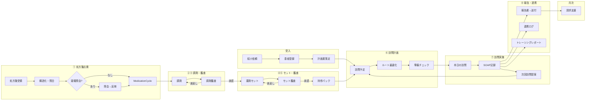

# PH-OS Pharmacy — Implementation Plan

> 仕様書: [ワークフロー/多職種連携](docs/visit-report-collab-spec.md) | [設計判断](docs/decisions.md)
> アーキテクチャ / デザイン方針: CLAUDE.md 参照
> ※ Phase 3 は Phase 2 完了時に詳細化する

### 明示的な非ゴール（既存レセコン/薬局システムの責務）

- フル在庫管理（発注・仕入・棚卸し・在庫評価）→ PH-OSは在庫医薬品マスタ（採用薬フラグ+引当フラグ）の薄い層のみ
- 麻薬管理帳簿・毒薬劇薬受払い簿 → レセコンが法定帳票を担う
- 領収書・調剤報酬明細書の発行 → レセコンの中核機能（二重入力回避）
- 会計・一部負担金の収納管理 → レセコン/会計システム
- POS・仕入・発注 → 在庫管理専用システム

### 実装優先原則（今回レビュー反映）

- MVPは「訪問日次運用 + 報告送付 + 最低限の処方差分/持参判定」を最優先にし、重いマスタ/処方安全チェック/請求自動化は後段に寄せる
- `MedicationCycle` は「処方起点の1運用サイクル」を維持する。MVPでも訪問予定は処方差分・持参可否・未解決課題と切り離さない
- PH-OS / レセコン / 電子薬歴 / 在宅支援システムの責任分界を先に固定し、二重入力を避ける
- 公開情報ベースの市場比較では、既存製品は「訪問記録・計画書/報告書作成・FAX/メール送付・現場共有」に強い。初期価値は最適化機能より、現場記録/連携/持参漏れ防止に置く

### 新機能: プラットフォーム運営者コンソール（監査付きブレークグラス） `cc:WIP`

<!-- 2026-07-03 ユーザー要望「システム開発者・管理者が裏からテナント横断でデータ確認・アクセス・操作」を、無記録バックドアではなくベストプラクティス準拠の監査付きブレークグラスとして設計・実装。設計判断は fable(ユーザー委任)。SSOT=docs/design/platform-operator-console-design.md -->

- [x] **P-0（MVP: 閲覧+全ログ）** ✅2026-07-03 land(89ecbb65/e32f807d/e535fac0/903926bc/e7a055f2)・gate全green・独立セキュリティレビュー APPROVE（blockerなし）
  - schema: PlatformOperator/BreakGlassSession（org_id無し・RLS非対象・app層認可）+ migration 20260703100000（非破壊）
  - core: operator gate(least-privilege tier) / break-glass seam（**BYPASSRLS不使用**でRLSをtarget1テナントにpin）/ step-up MFA(password+TOTP再認証) / fail-closed監査
  - API 5route + UI（独立 /platform segment・server gate）/ テスト52件（lib44+UI8）
- [ ] **P-1**: write ops の限定操作+追加監査+アラート / hash-chain tamper-evidence / operator suspend時のsession cascade revoke / MFA試行レート制限 / 全テナント横断監査ダッシュボード
- [ ] **P-2**: 多職種展開（医科・訪問看護）向け operator 権限汎用化

### 直近トラック: 開発方針 2026-07-03 — 実装ロードマップ v2（3レビュー再構成） `cc:WIP`

<!-- 2026-07-03: v1(9観点スキャン)を ①リリースクリティカルパス監査 ②網羅性批判レビュー(BLOCKED/ULTRACODE/FEATURE_QUEUE/spec 突合+コード抜き打ち7点=全て新鮮を確認) ③依存・実装順検証 の3独立レビューで実装向けに再構成。リリース判定は実装済みの pilot-launch-dossier(src/server/services/pilot-launch-dossier.ts: UAT/PMDA/backup/ISMS 4軸+org監査)を SSOT とし、外部依存を前提条件へ分離、技術タスクを Wave 0-3 へ再配列。計画のみ・実装未着手。v1 全文はコミット 1d315a86 参照。 -->

**v1 所見サマリ（有効）**:

- 基盤は高水準: 認可wrapper 約293route / no-store 260file / DBトリガ監査 / unit 1,229file・APIカバー97% / E2E主要5動線 / 点数改定レジストリはデータ駆動で2026医療改定 confirmed 済 / 依存EOLなし
- 最大の製品ギャップ: **算定要件の構造化未着手**（`docs/visit-report-collab-spec.md` v2 算定カバレッジ32項目中 充足5）
- 医療安全: CDS false-negative 8件 + safety5(CE01/CE02) / セキュリティ: RLS 実体欠落~33表+DB層未証明・PHI閲覧監査36route未記録 / 速度: prescription-intakes POST 33.7s / FE: React Compiler未有効・仮想化ゼロ・画像無圧縮 / 改定耐性: 点数=優秀、薬価版管理なし・next-auth v4 / 水平展開: そのまま展開可8+軽い分離6、要リファクタ=薬局間連携層

**v1 からの主な補正（網羅性レビュー）**:

- 追加: CE01/CE02 safety5（PCA未検品再貸出/訪問prep偽完了）/ EPIC1 RLS 実体欠落~33表+contract再設計 / **billing aggregation over-claim 修正群**（BLOCKED制限解除済・即効）/ spec P2・P5・P6・P7 の未収容分（B-7〜B-10）/ リリースエンジニアリング R群 / BLOCKED human-gate 残6件 / F-20260702-001
- 訂正: 実参照切れは `docs/decisions.md`+旧spec 2ファイル（`visit-report-collab-spec.md` は実在し正）/ O-1 は v0.2 トラックへ統合
- 昇格: afterhours-tz off-by-9h（夜間/休日加算の over/under-claim・confirmed）を P2→Wave1 算定正確性へ
- 分割: B-6→4分割+B-7〜B-10 / H-1→tx-guard epic 14件 / H-2→TZ epic ~14件 / C-7・E-6 は独立作業へ

**リリースマイルストーン**:

- **M1 安全・正確性 green** = Wave 0+1 完了（医療安全 / セキュリティ / 算定正確性の既知バグ 0）
- **M2 パイロット技術線** = Wave 2 R群完了で dossier のコード側 blocker 0。外部前提の完了をもって pilot GO
- **M3 製品の芯** = Wave 3 B群（算定要件構造化 = multi-quarter プログラム）

#### 前提条件（外部・人間作業） `cc:blocked`

- [ ] PMDA メディナビ/マイ医薬品集 登録 + `PMDA_*_URL` secrets（旧0-2i）
- [ ] backup live drill 実施と `[mode:live]` 記録（旧I-04/12-8）
- [ ] ISMS 審査機関見積・予算・キックオフ（旧1a-6/1b-6。vendor comparison/decision memo の記入で dossier green）
- [ ] AWS 本番プロビジョニング + `ALERT_EMAIL` 設定 + SNS email 購読 confirm + 本番 Sentry DSN
- [ ] パイロット薬局 UAT（critical/high blocker 0 で phase2_entry green。旧1b-9）
- [ ] 利用規約/プライバシーポリシー本文の法務確定（掲示ページ実装は W2-R4）
- [ ] 音声メモ STT の AWS Transcribe creds（旧D-8-3）

#### Wave 0 — quick wins（依存なし・並行・各S） `cc:完了` <!-- 2026-07-03 ultracode Wave0 実装: a5eb996f..b02d4899 の15コミット(W0-3/4結合)。全項目 独立レビューapprove+gate green(typecheck/no-unused/build/colors/boundaries)。W0-8判定=全てby-design leak無し -->

- [x] W0-1 colors:check を ci.yml へ（旧G-1。スクリプトは 4510ee7f 導入済み）
- [x] W0-2 renovate/dependabot 導入（旧C-6）
- [x] W0-3 import 方向 lint 境界: 共通コア→薬局固有の import を warn 可視化（旧F-1・水平展開の柵）
- [x] W0-4 軽量 pre-commit（変更ファイル限定 lint/format。旧G-2）
- [x] W0-5 docs 参照切れ解消: Plans.md/CLAUDE.md が指す `docs/decisions.md`+旧spec 2ファイルの3参照を実在 docs へ更新 or 復元（旧G-4 訂正版）
- [x] W0-6 改定運用 runbook docs（旧C-4）
- [x] W0-7 cycle_id 疎化+（組織,職種）N者連携の設計メモ（旧F-6・docs のみ）
- [x] W0-8 cron 全org横断 8箇所の by-design/leak 判定（旧A-6）
- [x] W0-9 optimizePackageImports 追加（旧E-4）
- [x] W0-10 無制限 findMany 棚卸し（旧D-6。EPIC8 CE11/N18/N23/CXR2-PERF01 と統合）
- [x] W0-11 介護2027改定データ枠（旧C-7a） / W0-12 prisma generator リンク堅牢化（旧C-7b）
- [x] W0-13 担当者命名の抽象化規約（旧F-3）
- [x] W0-14 重複解消: formatYen×3（null→0円実害）/ SectionCard×4+dead / QR readString（旧H-3）
- [x] W0-15 腎機能ラベル JST 共有フォーマッタ（FEATURE_QUEUE F-20260702-001 収容）
- [x] W0-16 safety-check CDS fail-open 修正: fetcher `catch→[]` 廃止・degraded バナー+再試行（旧A-1）— `safety-check-content.tsx:73-90`

#### Wave 1 — P0 安全・セキュリティ・算定正確性（M1 必須） `cc:WIP` <!-- 2026-07-03 安全レーン完了(CDS5/safety5=na/算定3/RLS contract/決定3)。承認レーン W1-7〜W1-12(+W1-12f/HG-1..5)全承認→land済(8d614c2a/db2ce0bf/e58e3aae/2c511a64/14318d48)、gate全green+reviewer-audit APPROVE。残=W1-3据え置き2件(疑義KPI full-count=意図的仕様 / summary_template_kind_count定義待ち)+W1-4/W1-5等の残スライスのみ -->

安全レーン（W0-16 に続き直列・1件ずつ厳格レビュー）:

- [x] W1-1 CDS false-negative 8件（旧A-2）: allergy cross-check skip(X02/CXR1-MSR01) / drug_master_id・code null 無言スキップ(F81/X03) / problem-list 禁忌未連携(F82) / eGFR silent-clean(X04) / 添付文書 alert unsorted slice(X05) ✅624e09fe
- [x] W1-2 safety5 CE01/CE02（v1漏れ）: PCA返却検品待ちクエリ崩壊=未検品ポンプ再貸出 / 訪問prep失敗のチェックリスト偽完了 ✅na（既修正を実証: CE01=pca-pumps fail-close 済み/CE02=433918e2 visit-record-detail fail-close 済み）

算定正確性レーン（over/under-claim。billing 制限解除済・B 構造化より先行）:

- [x] W1-3 billing aggregation correctness: 空 `requirements_status {}`→claimable / singleBuilding 月次 count tier / delivery_only count↔claim 不一致 / cross-month 返戻 overcount / wrong-domain transmit / `jobs/daily/billing.ts` org_id 欠落（BLOCKED mainui/WF-20260625 両票） ✅b96c0534
- [x] W1-4 afterhours-tz: 夜間/深夜/休日加算の UTC/JST off-by-9h（confirmed。prod=UTC で誤算定） ✅b96c0534
- [x] W1-5 set-derivations daycount rounding（算定隣接・BLOCKED WF-20260625） ✅ca285642

RLS レーン（DB層 backstop。proof より実装が先）:

- [x] W1-6 RLS contract 再設計スライス（rls-policy-contract.test のハードコード allowlist 是正含む。旧A-4 前段） ✅9b7982e4
- [x] W1-7 RLS 実体欠落表の実装（11表に ENABLE+tenant_isolation+FORCE、PHI: PatientPackagingProfile/VisitScheduleContactLog 含む。3表=IntegrationJob/PrescriberInstitution/User は意図的除外を台帳明記） ✅2026-07-03 承認レーン land(8d614c2a)・gate全green+reviewer-audit APPROVE
- [x] W1-8 非superuser ロール ph_os_app+FORCE RLS proof（`setup-rls-test-role.sql`、`rls.test.ts` it.skip→env-gated、両policy形に頑健化、CI 配線） ✅2026-07-03 land(8d614c2a/14318d48)

認可・PHI レーン（human 承認）:

- [x] W1-9 dispense-results PATCH canDispense 必須化（POST と対称、clerk/driver/external 403 + owner/admin 200 実証） ✅2026-07-03 land(e58e3aae)
- [x] W1-10 EPIC3 認可/外部共有（external-access canManagePatientSharing化・care-reports F88 cross-patient修正・prescriber-institutions authz・qr-scan F89 fail-close） ✅2026-07-03 land(e58e3aae/2c511a64)
- [x] W1-11 EPIC7 no-store/PHI（mfa setup/verify・prescriber-institutions・webhooks に withSensitiveNoStore） ✅2026-07-03 land(e58e3aae)
- [x] W1-12 BLOCKED human-gate: HG-1 data-explorer 監査+no-harddelete / HG-3 jobs error_log redaction / HG-5 OS通知 PHI redaction / HG-2 settings compliance ranges / HG-4 incidents permission affordance / W1-12f schedule composite FK ✅2026-07-03 land(2c511a64/db2ce0bf)・BLOCKED.md RESOLVED注記済

決定レーン（後段 unblock。実装なし・決定文書のみ）:

- [x] W1-13 請求エンジン二重化の収束決定（billing-rules ↔ `src/phos/domain/claim`。**W2-B1 の前提**。旧C-3） ✅cc85fb67・ラティファイ済=Option C(billing-rules一本化/phos claim凍結保全)
- [x] W1-14 React Compiler 方針決定（旧E-2 前段） / W1-15 API バージョニング方式決定（旧O-4/14-5） ✅cc85fb67・ラティファイ済=有効化(実装は W2 スライス)

#### Wave 2 — リリース機構・性能・設計着地（M2 技術線） `cc:完了` <!-- 2026-07-03 BatchA 16スライス+BatchB(Q1/Q2)+最終バッチ(P4/F1残/F2/F4-F53/R4)で全項目消化。コード側タスク完了=M2 技術線 green（R4 本文と pilot GO は外部前提条件待ち）。最終バッチは ultracode 7スライス: 各 maker→opus 独立レビュー approve -->

R リリースエンジニアリング（新設・クリティカルパス監査由来）:

- [x] W2-R1 本番 migration 適用の deploy パイプライン組込 or 承認付き runbook（deploy-production は Amplify trigger のみで `migrate deploy` が無い） ✅2026-07-03 BatchA 実装済(gate: 全量1284file green)
- [x] W2-R2 ジョブ失敗の人到達通知（`runner.ts:159` は in-app のみ → CloudWatch metric→SNS or web-push/SES 配線） ✅2026-07-03 BatchA 実装済(gate: 全量1284file green)
- [x] W2-R3 SSK/MHLW DrugMaster 本番初期ロードの実行手順+証跡（importer は ready。PMDA は前提条件成立後に追加） ✅2026-07-03 BatchA 実装済(gate: 全量1284file green)
- [x] W2-R4 利用規約/プライバシーポリシー掲示ページ実装（本文=法務前提条件） ✅2026-07-03 `(legal)/terms`+`/privacy` 新設（noindex・auth gate なし公開）+login フッター導線。terms 本文=法務確定待ちプレースホルダ（骨子のみ）、privacy=docs/compliance/privacy-policy.md ドラフト転記+注記。本文差替は前提条件（法務確定）解消時
- [x] W2-R5 パイロット向けユーザー操作ガイド（主要動線: 応需→調剤→訪問→報告→請求） ✅2026-07-03 BatchA 実装済(gate: 全量1284file green)
- [x] W2-R6 PHI 閲覧監査の共通層設計→36route 段階適用（3省2GL アクセス記録。旧A-5） ✅2026-07-03 BatchA 実装済(gate: 全量1284file green)

性能レーン（`pnpm perf:smoke` で before/after 実測先行）:

- [x] W2-P1 prescription-intakes tx 再設計 + DrugMaster OR 検索最適化（旧D-1+D-3 統合。同一 service で直列必須。BLOCKED RUN-20260622-001 根治） ✅2026-07-03 BatchA 実装済(gate: 全量1284file green)
- [x] W2-P2 index 追加（3複合index migration land ✅2026-07-03 db2ce0bf） / W2-P3 プール方針明文化 ✅BatchA(00984095) / W2-P5 レート制限拡大 ✅BatchA(ce260f26) / W2-P4 マスタ系キャッシュ ✅2026-07-03（設計判断: unstable_cache は Amplify 複数インスタンスで revalidateTag 非協調のため不採用→既存 serverCache 方式で専用 drug-master-detail-cache 新設(独立インスタンス cap200/TTL120s)。GET [id]+POST batch のグローバルマスタのみ、**org-scoped endpoint(generic-recommendations/ingredient-group/package-insert)は非キャッシュ**=テナント分離維持。6取込ルートに invalidate 併記）

B 設計着地:

- [x] W2-B1 BillingRequirementCatalog 設計→実装（旧B-1。DB 0・コード中。W1-13 決定が前提。`billing-requirement-validator.ts` の cap-counting/週境界を継承し回帰で担保） ✅2026-07-03 BatchA 実装済(gate: 全量1284file green)

FE:

- [x] W2-F1 画像リサイズ+圧縮共通化（旧E-1・訪問動線直効） ✅2026-07-03 共通化=0b123003(downscale-image.ts)+残4経路適用（residual-adjustment/card-workspace/prescription-intake/consent。PDF は fail-open 自動スキップ）
- [x] W2-F2 仮想化・ページング（旧E-3） ✅2026-07-03 仮想化ライブラリは不採用（ページングで充足と判断）。DataTable opt-in pagination=35add5fa → tasks/institutions/users へ配線(pageSize50)。drug-master 一覧は cursor hasMore 破棄で「51件目以降が見えない」実バグを useInfiniteQuery+onLoadMore 配線で修正。my-day/conferences/requests は DataTable 不使用（カード/リスト描画）のため対象外
- [x] W2-F3 false-empty 残5件（旧E-5） ✅済を実証（W2-F3a〜d=8ac44b38/bb368ff7/df2192e8/54ba5d72 が HEAD 祖先、isError→ErrorState(variant=server)+refetch 適用確認済み）。旧チェック漏れの台帳訂正
- [x] W2-F4 offline lifecycle 偽同期の残 ✅2026-07-03 CE12/CE13/N21=87e22d87(OfflineSyncBridge)で修正済みを実証。follow-up も消化: CE14=sync-engine dedupeScopeId 済 / N25=resetFailedEvidenceDraftRetries 済 / **F53(pendingEvidence の MAX_RETRIES 永続 stuck→COMPLETE_VISIT 恒久ブロック)を今回修正**（reset/requeue+明示 acknowledged 必須の discard、監査ログ付き）。stuck 再試行の UI 導線は小粒 follow-up（queue API は公開済み）

モジュール化・テスト:

- [x] W2-M1 Task schema 移設+core/pharmacy 区分（旧F-2） / W2-M2 権限の職種×capability 2軸整理（旧F-4） ✅2026-07-03 BatchA 実装済(gate: 全量1284file green)
- [x] W2-T1 テスト空白解消: `src/server/jobs/daily` + `billing-rules/revisions`（旧G-3・金額直結） ✅2026-07-03 BatchA 実装済(gate: 全量1284file green)

品質負債 epic:

- [x] W2-Q1 tx-guard epic 14件（旧H-1 拡張: CE05/F83/CE06/N32/X06/X07/X09/X10/CXR1-CONC01/02 ほか。partial-unique F84/F85/X08 は migration ゲート） ✅2026-07-03 BatchB land(3c47febc..fa99f46d)
- [x] W2-Q2 TZ epic ~14件（旧H-2 拡張: CE03/07/08/09/10/15/16/N19/N24/N26/N30/CXR2-TZ01/02。helper 束ねで一括） ✅2026-07-03 BatchB land(3c47febc..fa99f46d)

#### Wave 3 — 製品の芯・高 blast（安全網整備後） `cc:TODO`

安全網先行（破壊的 migration の前提）:

- [ ] W3-S1 staging 環境（旧O-2/12-4・AWS 実環境待ち）
- [x] W3-S2 PRE-03 データ移行検証フレームワーク（pre-count/post-integrity/rollback SQL） ✅2026-07-03 Phase 5-PRE PRE-03 として消化（p03-lab-values 追加+テーブル名/adapter の実行不能欠陥修正。詳細は PRE-03 セクション）

B 算定構造化（spec ロードマップ順。W1-13/W2-B1 済前提）:

- [x] W3-B2 VisitInstruction+SpecialPatientStatus（非破壊 mig・中） ∥ W3-B5 訪問実施エビデンス visit_started_at/ended_at（小）
- [ ] W3-B3 加算エビデンス群（StructuredSoap 拡張+加算コードマスタ）
- [~] W3-B4 claim-record projector（report-generator 分割。F-5 境界 API 化と直列調整） 2026-07-03 中核消化(52ce1f66): billing_context/source_provenance の型付け(source-tagged union)+構築の care-report-source-provenance.ts 一本化+読み取りの report-content.ts 一本化（content JSON バイト同一・send route の 409 reason 不変・opus approve）。残: S4=report-generator の11表直読みの読み取り関数集約(W3-M1 と直列) / 手動作成への billing_context 付与(billing 経路のデータ plumbing を伴う別スライス・要 billing レビュー)
- [ ] W3-B6a 報告書 finalize/lock 版管理[RPT-007] / W3-B6b 到達証跡ハードゲート[KYO-007/008] / W3-B6c 保存年限構造化[RPT-002/009] / W3-B6d 単一建物月次動的計数[ZTK-06]（旧B-6 の4分割）
  - 設計メモ ✅2026-07-03 ラティファイ済（3a39f69e、docs/design/care-report-finalize-lock-design.md、codex 起草+opus critic 2巡）。確定方向: 行ロック=updated_at 維持(D-14 意図的逸脱を記録)/改訂連番=report_revision/Option B 推奨。B vs C 最終選択+未決事項は migration 提案の human 承認時に確定。実装(migration 含む)は据え置き=human gate
- [ ] W3-B7 spec P2: ManagementPlanContent 構造化+医療保険の月次見直し強制（KYO-003/004）
- [ ] W3-B8 spec P6: 多職種 inbound 双方向モデル（多対多 resolution_status, ARCH-6）+FAX/紙 OCR 取込(COLLAB-01)+到着通知(COLLAB-02)+outbound 受領ループ(COLLAB-03)
- [ ] W3-B9 spec P5: cycle_id 任意化+緊急訪問薬剤管理指導料（料1/料2）+オンライン46単位・緊急通算の月キャップ統合（部分消化: 2026-07-04 cbef13f4+d535b4f6 で emergency_category 欠落時の evidence/rule-engine fail-closed 化。残: online/shared monthly cap、cycle_id 任意化全体整理）
- [ ] W3-B10 spec P7: 破壊的 migration 群（CareReport.visit_record_id FK 昇格 / 残薬 canonical 一本化 / レガシー SOAP 削除。human 承認+W3-S1/S2 前提）

改定・依存耐性:

- [ ] W3-C1 薬価 effective-dated 版管理+調剤時スナップショット（旧C-1・L・mig） / W3-C5 next-auth v4→Auth.js v5（旧C-5・L）
- [x] W3-C2 レジストリ外ハードコード点数吸収（旧C-2） ✅2026-07-03 billing-evidence（情報提供/重複投薬）+conference-sync の算定経路点数を billing-rules レジストリ実行時解決へ置換（2024/2026 両改定で同値性を回帰テスト固定、旧値は未収載日 fallback として残置）。deferred: duplicate-interaction の日付分岐は構造マッピング選択でレジストリ未エンコード（点数 drift は解消済み）/ UI ラベル内点数（表示専用）/ core.ts 到達不能 legacy branch（死コード）

FE 仕上げ（低優先）:

- [ ] W3-E1 フォーム RHF 統一（旧E-6a）
- [x] W3-E2 野良 table の DataTable 集約（旧E-6b） ✅2026-07-04 current-code scan で完了確認。2026-07-03 前半7ファイル（residual-adjustment/conflict-resolution/visit-record-detail/prescription-history/period-review/prescription-detail/card-workspace 処方明細）に加え、残候補だった clerk-support / intake-triage / report-share / workflow-dashboard / offline-sync / prescriptions-table / prescription-inline-detail は現行コードで `DataTable` 化済み。残る非 print raw table は意図的例外: report-delivery-dashboard の小集計（検索/列切替 toolbar 過剰としてテスト固定）、medication-format-grid の比較マトリクス、medication-calendar / shifts の calendar grid、帳票 print 系。これらは DataTable 変換対象外として維持。
- [~] W3-E3 drug-master-content(5177行) 分割（旧E-6c） 2026-07-03 純粋コード約900行を types/format/columns の3ファイルへ抽出（5177→4279行、公開API不変・82テスト green）。本体 DrugMasterOperationalContent の分割は 50+ useState と医療安全 race-guard ref 群の単一スコープ結合が強く、動作保存優先で独立レビュー付き段階パスへ deferred（次候補=detail Sheet 約810行）
- [x] W3-M1 sync-engine/report-generator の境界 API 化（旧F-5。W3-B4 と直列調整） <!-- 2026-07-03: 前提が整った(B4中核52ce1f66+B6設計3a39f69e)。実体=①report-generator の11表直読みを単一読み取り関数へ集約 ②VisitRecord.version/updated_at の暗黙版契約を共有型化(sync-engine VisitRecordConflictSnapshot ↔ visit-records route VisitRecordConflictDetail の平行実装統合)。report-generator.test(1356行)の fixture 書き直しコスト大のため独立スライスで -->

運用:

- [ ] W3-O1 v0.2 e2e 実証（下記 v0.2 トラックで管理・重複解消） / W3-O3 RUM（旧12-7残） / W3-O5 TZ fail-close 有効化（prod TZ 設定後・prod ゲート） / W3-O6 証跡写真+S3 Object Lock+set-photo 束縛 / W3-O7 音声メモ STT `cc:blocked`

**直列化必須ペア**: W2-P1 内 D-1↔D-3（同一 service）/ W0-16→W1-1（CDS 系）/ W1-13→W2-B1→B 全系 / W3-B4↔W3-B6↔W3-M1（report-generator 競合）/ W3-B2・B3・B5 の mig は逐次 / W1-14 決定→React Compiler 実装。Wave 内の各レーンはファイル非重複で並行可。

**実行規律**: 各スライス = maker(Claude) → reviewer-audit 独立レビュー → objective gate（typecheck / typecheck:no-unused / lint / test / build / colors:check）。auth/security/migration/prod-deploy は human 承認（§15）。破壊的 mig（W3-B6d/B10/C1）は W3-S1/S2 完了が前提。perf 系は perf:smoke 実測を前段に。

### 新トラック: 訪問スケジュール自動提案 上書きアップデート（2026-07-05） `cc:TODO`

<!-- source: docs/careviax_visit_schedule_update_spec.docx（CareVIAx / PH-OS 訪問薬剤管理スケジュール自動提案 既存実装調査・上書きアップデート仕様書）。2026-07-05 に仕様書と実コードを再レビューし、既存実装済みの planner / proposal workflow / visit availability / route matrix contract を前提に実装順を練り直した。計画のみ・実装未着手。 -->

**最重要方針（SSOT）**:

- 自動提案の仮予定 SSOT は `VisitScheduleProposal`。`VisitSchedule` は患者連絡 confirmed 後に作る確定予定。
- `confirmed_at` あり `VisitSchedule`、ready/departed/in_progress/completed 予定、患者連絡済み候補は自動再配置しない。変更は既存リスケジュール/再提案フローに限定する。
- 手動 `POST /api/visit-schedules` と管理者/互換用途の直接 `VisitSchedule` 作成は残すが、「自動生成」は proposal-first に寄せる。
- 休業日/訪問不可日の上書きは理由必須、監査ログ必須。薬剤師確認必須はスコア減点ではなく患者連絡前のハードゲートにする。
- Google Routes / OSRM / fallback はルート・移動時間評価だけに使い、薬学判断・服薬期限判断の根拠にはしない。

**コードレビューで確定した現状（2026-07-05）**:

- `src/app/api/visit-schedule-proposals/route.ts` は候補生成、idempotency、算定ガード、`VisitScheduleProposalBatch`、route_order allocation、diagnostics/audit を既に持つ。ここを自動提案の正式入口として維持する。
- `src/app/api/visit-schedule-proposals/[id]/route.ts` は approve → contact_attempt confirmed → confirm → `VisitSchedule.create` の患者承認後確定フローを既に持つ。仕様書の proposal-first 方針と一致している。
- `src/app/api/visit-schedules/generate/route.ts` は recurrence から `VisitSchedule` を直接作成し、`confirmed_at` / `confirmed_by` を入れる。仕様書との差分として最重要の互換移行対象。
- `src/server/jobs/daily/visits.ts` は服薬期限から `generateVisitScheduleProposalDrafts` を呼び `VisitScheduleProposal` を作る。daily demand は既に proposal-first で、強化対象は deadline policy と diagnostics。
- `src/server/services/visit-schedule-planner.ts` は患者希望/施設受入/薬局営業時間/薬剤師シフトの時間窓 intersection、日次/週次容量、車両、route insertion、算定 cadence、確定済み予定固定を実装済み。新設ではなく接続・精密化する。
- `src/lib/calendar/visit-availability.ts` は `canVisitOn` で PharmacyOperatingHours/BusinessHoliday と PharmacistShift の AND 判定を pure helper 化済み。VisitAvailabilityPolicy はこの helper の拡張・DB adapter 接続として扱う。
- `src/server/services/visit-medication-deadline.ts` は通常薬 end_date / start_date+days、次回調剤日、前回訪問時 next_visit_suggestion_date を最小日で折り、頓服を通常期限から除外済み。営業日バッファは未実装。
- `src/server/services/road-routing.ts` は `RoadTravelEstimator.estimateMatrix` と OSRM table matrix / pairwise fallback を既に持つ。Google provider は現状 pairwise `computeRoutes` のみなので、追加対象は `GoogleRoutesProvider.estimateMatrix`。
- `prisma/schema/visit.prisma` の `VisitScheduleProposal` には `pharmacist_review_required` / `review_reason_code` / `reviewed_at` は未存在。review gate は diagnostics 先行、DB field 追加は HR migration に分離する。

**監査・PHI payload 方針**:

- proposal / overload / review / route diagnostics を audit に残す場合は whitelist 方式にする。
- audit に保存してよいもの: reason code、entity id、dateKey、actor、status before/after、算定/期限/availability の短い machine code、hash 化した診断 snapshot。
- audit/log/export に保存しないもの: 患者名、住所、緯度経度、電話番号、連絡 note、薬剤 free text、処方全文、Google/OSRM request body、API key、provider raw error。
- 詳細表示が必要な場合は、audit ではなく権限制御済み detail API で再計算または最小化済み snapshot を返す。
- `audit-logs` API/export は reject_reason redaction と同じ方針で diagnostics/free text/drug/address/phone を redaction test で固定する。

**追加・変更する設計要素（通常変更 / HR 分離）**:

| 領域                   | 現コードとの差分                                                                                                                                     | リスク分類          |
| ---------------------- | ---------------------------------------------------------------------------------------------------------------------------------------------------- | ------------------- |
| DeadlinePolicy         | 既存 `resolveMedicationDeadlineSummary` の後方互換を保ち、営業日/訪問可能日 buffer を別出力として追加する。                                          | P1                  |
| Planner connection     | 現 planner の `planningEnd` / `candidateDeadlineDate` を policy 出力へ接続。候補取得期間は縮めすぎず、site/shift 判定後に per-site deadline を適用。 | P1                  |
| Direct generate        | `visit-schedules/generate` の直接 confirmed 作成を廃止し、proposal-first 入口へ誘導する。                                                            | P1                  |
| Availability policy    | 既存 `canVisitOn` と planner 内 intersection を統合し、訪問可能枠 DB 化は HR へ分離。                                                                | P1→HR               |
| Review gate            | まず diagnostics/audit/UI で表示し、DB field 追加後に approve/contact/confirm hard gate 化。                                                         | P1→HR               |
| OverloadRebalancer     | 確定予定ではなく未承認 proposal のみを preview-first で前倒し。既存 open proposal も容量計算に入れる。                                               | P1 / audit注意      |
| PRN/topical stock/risk | 頓服・外用薬残量、薬剤変更 risk は医療安全上 HR。既存通常薬 deadline とは分離し、薬剤師確認必須を伴う。                                              | HR                  |
| Google Matrix          | 既存 estimator contract に `GoogleRoutesProvider.estimateMatrix` を足す。key 未設定/失敗時は OSRM/fallback を維持。                                  | P1 / deploy設定注意 |

#### VS-AUTO-0. 方針固定・実コード inventory・入口分類 `cc:TODO`

- [ ] 仕様書 `docs/careviax_visit_schedule_update_spec.docx` と上記コードレビュー結果を、`Plans.md` / `ops/refactor/STATE.md` の再開アンカーへ残す。
- [ ] 入口を分類する:
  - 自動提案: `POST /api/visit-schedule-proposals`、`src/server/jobs/daily/visits.ts`。
  - 患者承認後確定: `PATCH /api/visit-schedule-proposals/[id]` action `confirm`。
  - 手動確定: `POST /api/visit-schedules`。
  - 廃止済み: `POST /api/visit-schedules/generate`（直接 confirmed 作成は停止）。
  - 既存変更: `POST /api/visit-schedules/[id]/reschedule` と approve/reproposal。
- [ ] `VisitScheduleProposal` と `VisitSchedule` の責務境界を API test 名・UI文言・operator docs で統一する。
- [x] `visit-schedules/generate` の利用元（UI、workflow full-cycle test、seed/demo、外部 docs）を棚卸しし、proposal-first 移行の互換影響を記録する。2026-07-05:
      通常画面の候補生成入口は `POST /api/visit-schedule-proposals`。`POST /api/visit-schedules/generate` の
      `workflow-full-cycle.test.ts` 直接利用は削除し、protected route test は廃止 endpoint の 410 contract を確認する。
- [ ] `localDateKey` / `formatUtcDateKey` / `japanDateKey` 使用箇所を棚卸しし、期限・休業日・患者希望曜日・locked_date の user-facing date は Asia/Tokyo dateKey を SSOT にする。
- DoD: 「自動提案は proposal、確定予定は患者確認後」の方針が実コード参照付きで追跡可能。

#### VS-AUTO-0b. Direct generate 自動確定経路の cordon `cc:TODO`

- [x] `src/app/api/visit-schedules/generate/route.ts` が `VisitSchedule.create({ confirmed_at })` を実行する現状を、実装初期の blocker として扱う。2026-07-05:
      互換性不要の最新指示に従い、route 本体を 410 `ENDPOINT_REMOVED` に置換。`VisitSchedule.create` /
      `confirmed_at` / `confirmed_by` / direct generate audit / workflow notification は実行されない。
- [x] DeadlinePolicy を本番経路へ接続する前に、direct generate を廃止する:
  - [x] automated UI 入口は既存通り proposal-first。
  - [x] route response は replacement endpoint と `creates_confirmed_schedules=false` を返す。
  - [x] 管理者/手動の確定予定作成は `POST /api/visit-schedules` に限定し、旧一括直接生成は使わない。
- [x] route ファイルは削除せず、既存 caller があれば 410 と replacement endpoint で明示的に失敗させる。
- テスト:
  - automated UI/標準 request は `VisitScheduleProposal` を作り、`VisitSchedule.confirmed_at` を作らない。
  - [x] `visit-schedules/generate/route.test.ts` は direct endpoint が 410 で、malformed body でも confirmed 作成へ入らないことを検証。
  - [x] `workflow-full-cycle.test.ts` は旧 direct generate 呼び出しを削除し、下流 flow fixture の確定予定から開始する。

#### VS-AUTO-1. 営業日バッファ付き DeadlinePolicy（DBなし pure first） `cc:TODO`

- [x] `src/server/services/visit-medication-deadline.ts` に既存 summary API を残したまま `resolveVisitDeadlinePolicy` を追加する。2026-07-05:
      新helperは DB/API/UI に未接続の pure policy。既存 `resolveMedicationDeadlineSummary` の Date contract は維持。
  - 入力: 既存 `MedicationDeadlineIntake[]`、`nextVisitSuggestionDate`、`planningStartDateKey`、`OperatingCalendar` または visitable date predicate、`safetyBufferOperatingDays`、任意の stockout candidate。
  - 出力: `rawDeadlineDateKey`、`latestVisitableDateKey`、`recommendedDeadlineDateKey`、`deadlineCandidates[]`、`diagnostics[]`、`reviewReasons[]`。
- [x] `DeadlineCandidate` は provenance を必須にする:
  - `source_kind`: `regular_medication_end` / `next_dispense` / `next_visit_suggestion` / `stockout_estimate` / `manual_locked_date`。
  - `prescription_intake_id` / `prescription_line_id` / `drug_master_id` / `drug_code` / `source_drug_code` は取得できる場合に保持し、名前だけの候補は `confidence='low'` + review required。
  - `raw_date_key` / `adjusted_date_key` / `confidence` / `requires_pharmacist_review` / `reason_code` / `audit_ref` を持つ。
- [x] 現行 planner/daily の select は `drug_name` 等だけなので、VS-AUTO-2 接続時に `PrescriptionLine.id` / `drug_master_id` / `drug_code` / `source_drug_code` を select に追加する。2026-07-05:
      planner/daily の query select に provenance fields を追加。未解決 drug master・同名別規格・差分不明の hard review gate 接続は VS-AUTO-7/8 に残す。
- [x] 既存 `resolveMedicationDeadlineSummary` はそのまま維持し、既存 route/planner/tests の `visitDeadlineDate` 互換を壊さない。
- [x] `rawDeadline` が休業日/訪問不可日なら `nearestOperatingDay(..., 'backward')` 相当で直前訪問可能日へ補正し、そこから `addOperatingDays(..., -buffer)` で recommended deadline を作る。
- [x] Date object を直接 policy 境界に広げず、Asia/Tokyo 業務日の `YYYY-MM-DD` date key を主入出力にする。DB `@db.Date` 変換は caller/adapter 層。
- [x] 頓服は通常薬 deadline から除外。外用/貼付などは通常候補に残すが `requires_pharmacist_review=true` と `reviewReasons` を必ず返し、患者連絡前 gate 接続は VS-AUTO-7 以降に分離。
- テスト:
  - [x] 日曜に薬切れ、月-金のみ訪問可能、buffer=1 → 金曜補正後に木曜。
  - [x] 祝日・連休中に薬切れ → 連休前最終訪問可能日から営業日 buffer を引く。
  - [x] buffer が recommended deadline を planningStart より前へ押し戻す → overdue/asap diagnostic。
  - [x] PRN は通常薬 deadline から除外される既存テストを維持。
  - [x] name-only / drug identity 未解決、外用 route、stockout candidate が provenance/review reason を持つ。
  - [x] `TZ=UTC` でも JST dateKey 境界がずれない。
- rollback: policy 接続 commit を revert。既存 `resolveMedicationDeadlineSummary` に戻せる。

#### VS-AUTO-2. Planner deadline 接続と per-site 訪問可能期限 `cc:DONE`

- [x] `src/server/services/visit-schedule-planner.ts` の `planningEnd` を単純に recommended deadline へ縮めすぎない。現行は shift/site 取得後に operating calendar が分かるため、初期検索窓は `rawDeadline + buffer scan` を確保し、shift/site 評価時に per-site `candidateDeadlineDate` を適用する。2026-07-05:
      preliminary policy の `rawDeadlineDateKey` で検索窓を確保し、site calendar 構築後に shift/site ごとの `recommendedDeadlineDateKey` を cutoff として適用。
- [x] `buildOperatingCalendarFromDbRows` / `resolveOperatingState` / `canVisitOn` を使い、planner 内の独自 operating/shift 判定と `visit-availability.ts` の理由コードを揃える。2026-07-05:
      `canVisitOn` を planner の基礎 availability precheck に接続し、`business_holiday` へ畳まず `pharmacy_holiday` / `pharmacy_regular_closed` / `outside_pharmacy_operating_window` などの shared machine code を planner diagnostics の `reason_code` として返す。
- [x] planner diagnostics に `deadline_policy` 系 reason を追加する:
  - `deadline_raw`
  - `deadline_adjusted_to_operating_day`
  - `deadline_buffer_applied`
  - `deadline_overdue_asap`
  - `locked_date_deadline_violation`
- [x] 既存の患者希望時間、施設受入時間、薬局営業時間、薬剤師シフト intersection、車両/route/capacity/算定 checks は維持し、削除・再実装しない。
- [x] `locked_date` は最優先候補。ただし休業日・シフト不可・期限超過は proposal を作らず diagnostics を返す。休業日上書き理由がある場合だけ override audit へ接続する。2026-07-05:
      deadline 超過は `locked_date_deadline_violation` で hard-block。休業日 override の audit 接続拡張は VS-AUTO-5 側に残す。
- テスト:
  - [x] `visit-schedule-planner.test.ts` に日曜薬切れ→木曜、locked date hard-block を追加。
  - [x] `visit-schedule-planner.test.ts` に連休専用 regression を追加。
  - [x] 既存 `beyond_deadline` / capacity / vehicle tests を維持し、旧 `business_holiday` 期待は `pharmacy_holiday` / `pharmacy_regular_closed` へ上書き。
  - [x] daily job `src/server/jobs/daily/visits.ts` が新 policy の recommended deadline を使う。2026-07-05:
        daily は site 未確定のため generic weekday visitability で demand due/SLA を補正し、最終 buffer/cutoff は planner per-site policy で強制。

#### VS-AUTO-3. `visit-schedules/generate` の proposal-first 上書き移行 `cc:TODO`

- [x] VS-AUTO-0b に吸収済み。`POST /api/visit-schedules/generate` は 410 `ENDPOINT_REMOVED` contract を維持し、旧 direct confirmed schedule 自動生成 route は復活させない。
- [ ] recurrence から複数日候補を作る必要が出た場合は、旧 generate route ではなく `POST /api/visit-schedule-proposals` 側または新規 proposal batch adapter に実装する。`VisitSchedule.create` は呼ばない。
- [ ] proposal batch adapter は `VisitScheduleProposal` と `VisitScheduleProposalBatch` に作成し、`idempotency_key`、route_order、billing guard、open proposal collision は existing proposal route と同等にする。
- [ ] `confirmed_at` あり予定、reschedule source、open proposal duplicate、billing cap、vehicle validation の既存 regression を移行テストで固定する。
- テスト:
  - 自動一括生成は `VisitScheduleProposal` を作り、`VisitSchedule.create` を呼ばない。
  - legacy compatibility/manual mode は存在しないこと、旧 generate route は 410 のままであることを route/API tests で固定する。
  - 患者 contact confirmed 後だけ `[id]` confirm が `VisitSchedule` を作る。
  - `workflow-full-cycle.test.ts` / `visit-schedules/generate/route.test.ts` の期待を proposal-first に更新。

#### VS-AUTO-4. AvailabilityPolicy / 薬剤準備 / 緊急予備枠 `cc:TODO`

- [ ] `src/lib/calendar/visit-availability.ts` を新設せず拡張する。現 `canVisitOn` の reason code を planner/API diagnostics と共有する。
- [ ] 訪問可能枠 DB 化前は、既存 PharmacyOperatingHours/BusinessHoliday + PharmacistShift + patient/facility preference の intersection を唯一の訪問可能判定にする。
- [x] 薬剤準備は既存 workflow gate / preparation state を調査し、`medication_ready_at` / `min_schedulable_at` を直接 DB 追加する前に derived helper と diagnostics で接続する。
      2026-07-05: schedule 作成前は `VisitPreparation` が存在しないため、既存 daily demand と同じ
      `MedicationCycle.overall_status in ('set_audited', 'visit_ready')` を derived readiness として採用。
      未満の cycle は `medication_not_ready` diagnostic で proposal 生成を fail-closed し、
      response/audit/detail 用 normalizer は cycle_id/status/required_statuses の enum 値だけを通す。
- [x] 緊急予備枠は初期値を service 定数にし、`remainingSlackMinutes` / `slackPenalty` と conflict しない形で `emergency_reserve_preserved` diagnostic を出す。DB field は VS-AUTO-7。
      2026-07-05: `EMERGENCY_RESERVE_MINUTES = 60` を planner に追加し、緊急以外の候補は
      `remainingSlackMinutes < 60` で rejected diagnostics に落とす。緊急提案は予備枠を使用可能。
      response/audit/detail 用 diagnostics normalizer は `emergency_reserve` を whitelist し、PHI/free-text を通さない。
- テスト:
  - `canVisitOn` の既存 fail-closed tests を維持。
  - [x] medication ready 前の候補除外。
  - [x] emergency reserve を超える自動充填拒否。
  - max_daily/max_weekly/vehicle capacity rejected diagnostics 維持。

#### VS-AUTO-5. Proposal diagnostics / review-gate 表示（migration 前の低リスク層） `cc:TODO`

- [ ] VS-AUTO-7 の field-backed hard gate 前は、diagnostics-only と明記する。UI の disabled だけで患者連絡/確定を止めた扱いにしない。
- [x] `src/app/api/visit-schedule-proposals/route.ts` の response/audit diagnostics に deadline policy、availability、review gate candidate を machine-readable reason で追加する。既存 field は削除しない。
      2026-07-05: POST response は `deadline_policy` / `availability_reason_code` を返し、audit は
      `src/lib/visit-schedule-proposals/diagnostics.ts` の whitelist で machine code/date/site/id/count のみに最小化。
      任意 `value` 文字列、患者名、薬剤名、住所、電話、メモ、token、planner 余剰 field は response/audit へ通さない。
- [x] `src/app/api/visit-schedule-proposals/[id]/route.ts` の GET が読む creation audit `diagnostics` に review candidate を表示できるよう shape guard を追加する。
      2026-07-05: cast-only guard を廃止し、保存済み audit diagnostics も同 whitelist で正規化して unknown/free-text を落とす。
- [ ] `/schedules/proposals` の詳細 Sheet と候補カードに、期限補正・休業日補正・薬剤師確認候補・過密前倒し理由を業務用語で表示する。
      2026-07-05 partial: 共通 `VisitProposalDiagnosticsCard` に `deadline_policy` を
      「期限診断」として中立表示し、`availability_reason_code` を休業日・シフト理由の集計と候補行
      `訪問可否` badge で表示。薬剤師確認推奨は explicit `review_required_candidate` diagnostics が
      来た場合のみ「診断表示のみ」として表示。過密前倒し理由は VS-AUTO-6 後続。
- [ ] HR field 追加前は `pharmacist_review_required` 永続 field を参照しない。UI では `review_required_candidate` として「患者連絡前に薬剤師確認推奨」を出し、ハードブロックは VS-AUTO-7 後に有効化する。
      2026-07-05 partial: accepted `specialty_coverage.match_status` が `unmatched` / `unknown` の場合に
      route が PHI-free `review_candidates[]` を生成し、UI はこの explicit diagnostics のみを表示。
      idempotency replay は false-empty diagnostics を返さない。
- テスト:
  - [x] diagnostics が表示され、既存 proposal ranking / contact log / bulk action を壊さない。
        2026-07-05: focused API/detail/UI regression green。
  - server `message` / validation error が既存 UI fallback で表示される。
  - [x] PHI を audit changes / logger / route diagnostics に過剰保存しない。
        2026-07-05: route/detail tests で hostile patient/drug/note/token/invalid value を固定。

#### VS-AUTO-6a. OverloadRebalancer preview/read-only: 未承認候補だけ前倒し `cc:TODO`

- [x] 新サービス案: `src/server/services/visit-schedule-overload-rebalancer.ts`。
- [x] まず preview-only API または service test で実装し、自動 cron 化しない。
      2026-07-05: `previewVisitScheduleOverloadRebalance` を追加。DB write / cron / API は未接続。
      confirmed schedule + open proposal を occupancy として数え、既存 planner で前倒し replacement draft を
      preview するだけに留める。
      2026-07-05: `POST /api/visit-schedule-proposals/overload-rebalance-preview` を追加。
      `canVisit` + `withOrgContext` + no-store の read-only preview API とし、旧 route alias や互換 envelope は
      追加しない。内部 service DTO は直接公開せず、`case_id` と per-skipped proposal id を落とした
      API-safe DTO（`preview_only=true`、`apply_available=false`、`unsupported_guards` 明示）へ変換する。
- [~] 対象は migration 前:
  - `proposal_status='proposed'`
  - `patient_contact_status='pending'`
  - `finalized_schedule_id is null`
  - review candidate なし
  - 期限・準備・シフト・車両・算定 guard を満たす候補。
  - 2026-07-05 partial: `proposed/pending/finalizedなし/reschedule_sourceなし` のみ preview 対象。
    `patient_contact_pending` / `reschedule_pending` は occupancy には数えるが replacement 対象外。
    review candidate 永続 field は VS-AUTO-7 まで存在しないため未接続。
- [ ] VS-AUTO-7 後は `pharmacist_review_required=false` を条件へ追加する。
- [x] 容量判定では確定 `VisitSchedule` だけでなく、同日同薬剤師/車両の open `VisitScheduleProposal` もカウントする。現 planner は主に confirmed schedule を見ているためここが差分。
      2026-07-05: first slice は pharmacist daily capacity を対象に、active `VisitSchedule` と open
      `VisitScheduleProposal` を同一 occupancy としてカウント。preview 採用分も仮想 occupancy に反映し、
      同一実行内の前倒し先過密を防ぐ。
      2026-07-05: vehicle capacity も `VisitVehicleResource.max_stops` を基準に、active `VisitSchedule` と
      open `VisitScheduleProposal`、同一 preview run の仮想採用分を vehicle/date occupancy としてカウント。
      `unsupported_guards` から `vehicle_open_proposal_capacity` を削除。billing cap と review field は後続。
- テスト:
  - [x] 過密日に未承認候補が集中 → 未承認候補だけ前倒し replacement preview。
  - [x] confirmed schedule / contact confirmed proposal / reschedule pending は不変。
        2026-07-05: confirmed schedule は occupancy のみ、contacted/open proposal は `not_mutable` skip。
  - [~] 前倒し先が期限・シフト・薬剤準備・billing cap を満たさない場合は再配置しない。
    2026-07-05 partial: replacement draft は既存 planner から取得し、destination daily capacity full と
    vehicle/date capacity full は skip。billing cap / review candidate 永続判定は後続。
  - [x] audit/log に患者詳細や自由記述を過剰保存しない。
        2026-07-05: preview API は audit write なし。response は id/date/status/count/reason code と
        最小 diagnostics に限定し、case id、raw patient / address / medication / free-text clinical detail を追加しない。

#### VS-AUTO-6b. OverloadRebalancer apply/supersede/audit `cc:TODO HR`

- [ ] VS-AUTO-7 の review fields / audit schema / hard gate と、VS-AUTO-8 の薬剤師確認 hard gate が入るまで write/apply は実装しない。
- [ ] 前倒し apply 時は旧候補を `superseded` にし、replacement proposal を transaction で作る。confirmed schedule、patient contact confirmed/pending proposal、reschedule pending は不変。
- [ ] `reproposal_reason` など存在しない field を前提にせず、HR migration 後の専用 field または `OverloadRebalanceAudit` に `reason_code='overload_advance'` と最小化 diagnostics を保存する。
- [ ] billing cap recheck、vehicle capacity、pharmacist capacity、review field gate、patient contact state、same-run duplicate を server-side で再検証する。
- [ ] apply 失敗や blocked attempt は、患者名・住所・薬剤名・provider raw payload を含まない audit/security-safe event に残す。
- テスト:
  - old proposal superseded + replacement proposal が同一 transaction で作られる。
  - confirmed/contacted/reschedule pending は変更されない。
  - billing cap / review required / vehicle full / pharmacist full で apply しない。
  - audit は reason code、entity ids、dateKey、actor、minimized diagnostics のみ。

#### VS-AUTO-7. HR migration: review fields / availability rule / rebalance audit `cc:TODO HR`

- [ ] W3-S1/S2 相当の migration 検証、RLS/requestContext、rollback plan、display_id registry、seed/factory、human review を前提にする。migration 適用は current-task 明示承認まで実行しない。
- [ ] additive migration 候補:
  - `VisitScheduleProposal.pharmacist_review_required Boolean @default(false)`
  - `review_reason_code String?`
  - `pharmacist_reviewed_at DateTime?`
  - `pharmacist_reviewed_by String?`
  - `VisitAvailabilityRule`: org_id、site_id、曜日/日付、from/to、is_available、reserve_minutes、max_auto_fill_ratio。
  - `OverloadRebalanceAudit`: old proposal、新 proposal、理由、計算時点、actor/system、diagnostics snapshot。
- [ ] `display_id` registry、data explorer catalog、RLS/tenant policy、app-layer `org_id` where、migration rollback、seed/factory を同時に計画する。
- [ ] 既存 proposal は `pharmacist_review_required=false` default で互換。contract migration や field required 化は別フェーズ。
- [ ] human review 必須: 休業日上書き・薬剤師確認・過密前倒しの監査粒度、患者連絡前 gate の運用責任。
- [ ] migration 適用は current-task 明示承認まで実行しない。
- [ ] migration 後の最小 hard gate を先に実装する:
  - approve/contact_attempt/confirm は `pharmacist_review_required=false OR pharmacist_reviewed_at IS NOT NULL` を server side で検証。
  - bulk action / updateMany claim でも同条件を要求し、古いクライアントや race で bypass できないようにする。
  - review 済み actor/time は audit whitelist で記録する。

#### VS-AUTO-8. 薬剤師確認 hard gate / 頓服・外用薬残量 / 薬剤変更 risk `cc:TODO HR`

- [ ] VS-AUTO-7 の最小 server hard gate 後に実装する。Google Matrix や Overload apply より優先し、患者連絡前の医療安全 gate として扱う。
- [ ] `VisitStockProfile` または既存訪問準備/処方データから導出する stockout candidate を設計する。
  - 対象: 頓服、外用薬、使用量が患者状態に左右される薬剤。
  - 入力: `last_confirmed_at`、`remaining_amount`、`avg_daily_use`、`stockout_date_key`、`confidence`、`confirmed_by`、根拠。
  - 出力: stockout date candidate、confidence、review reason。
- [ ] `MedicationChangeRisk` helper/service を設計する。
  - 増量/減量/追加/削除、麻薬/冷所/粉砕/一包化、疑義照会未解決、処方差分を risk reason にする。
  - 高 risk は早期訪問候補 + `pharmacist_review_required=true`。
- [ ] `[id]` PATCH approve/contact_attempt/confirm に hard gate を入れる:
  - `pharmacist_review_required=true` かつ `pharmacist_reviewed_at is null` なら患者連絡・確定不可。
  - review 済みの actor/time を audit。
- テスト:
  - 頓服/外用薬 stockout が通常薬より早い場合に deadline candidate 採用。
  - confidence low / stale stock confirmation は review required。
  - 薬剤変更ありで review gate が立つ。
  - review 未了では approve/contact/confirm に進めない。
  - review 済みでのみ既存 proposal workflow が進む。

#### VS-AUTO-9. Google Routes Matrix provider `cc:TODO`

- [ ] `src/server/services/road-routing.ts` の既存 `RoadTravelEstimator.estimateMatrix` contract を維持し、`GoogleRoutesProvider.estimateMatrix` を追加する。
  - Google provider: Compute Route Matrix 相当。
  - OSRM provider: 既存 table API を維持。
  - Google matrix 未設定/失敗時: 既存 pairwise `computeRoutes` fallback、さらに OSRM/fallback behavior を壊さない。
- [ ] API key / quota / timeout / retry / max matrix size は deploy 設定として明示し、secret 値は出さない。
- [ ] route diagnostics に provider/source/confidence を出すが、患者住所・氏名・座標をログに出さない。
- テスト:
  - Google key 未設定で fallback して proposal 生成継続。
  - Google provider で matrix が使える時は pairwise fallback 呼び出しを抑制。
  - provider failure が PHI をログに出さない。
  - `visit-route-engine` / planner の route score 既存期待を維持。

#### VS-AUTO-10. 検証・リリース計画 `cc:TODO`

- Unit:
  - `src/server/services/visit-medication-deadline.test.ts`
  - `src/lib/calendar/visit-availability.test.ts`
  - `src/server/services/visit-schedule-planner.test.ts`
  - `src/server/services/visit-schedule-overload-rebalancer.test.ts`
  - `src/server/services/road-routing.test.ts`
- API:
  - `src/app/api/visit-schedule-proposals/route.test.ts`
  - `src/app/api/visit-schedule-proposals/[id]/route.test.ts`
  - `src/app/api/visit-schedules/generate/route.test.ts`
  - `src/server/jobs/daily.test.ts`
  - RLS/tenant rejection for new HR tables.
- UI:
  - `/schedules/proposals` diagnostics、review gate、bulk action regressions。
  - `/schedules` day planner の「訪問候補を生成」から proposal-first を確認。
- E2E/smoke:
  - 「薬切れ日曜 → 木曜候補 → 患者連絡 confirmed → VisitSchedule 確定」。
  - 「direct generate 自動入口 → VisitScheduleProposal 作成 → confirm まで VisitSchedule 未作成」。
  - 「過密日 → 未承認候補だけ前倒し → 確定予定不変」。
  - Google key なし / provider failure 時の fallback diagnostics。
- Release:
  - direct generate は 410 `ENDPOINT_REMOVED` contract を維持し、proposal-first 移行 flag として復活させない。
  - rollout flag は HR review fields、Overload apply、Google Matrix provider のみに使う。
  - 初回は preview/recommendation と diagnostics-only、次に field-backed hard gate、最後に apply/write path。
  - operator runbook: Google quota、fallback、薬剤師 review queue、過密再配置 audit の確認手順。

**優先実装順**:

1. VS-AUTO-0 方針固定 + 実コード inventory。
2. VS-AUTO-0b direct generate 自動確定経路の cordon（feature flag / warning / 管理者手動限定）。
3. VS-AUTO-1 DeadlinePolicy pure helper（DBなし、provenance + JST dateKey + 既存関数後方互換）。
4. VS-AUTO-2 Planner deadline 接続（既存 planner/visit-availability 拡張）。
5. VS-AUTO-3 direct generate proposal-first 互換移行。
6. VS-AUTO-5 Proposal diagnostics/UI（migration 前の diagnostics-only 可視化）。
7. VS-AUTO-4 AvailabilityPolicy / readiness / emergency reserve の shared helper 整理。
8. VS-AUTO-6a OverloadRebalancer preview の billing cap recheck 残。
9. VS-AUTO-7 HR migration + minimal server hard gate。
10. VS-AUTO-8 review hard gate + PRN/topical/medication-change risk。
11. VS-AUTO-6b OverloadRebalancer apply（field-backed gate と audit policy 後）。
12. VS-AUTO-9 Google Matrix provider。
13. VS-AUTO-10 E2E / rollout / runbook。

**停止条件 / human review 必須**:

- 患者承認済み日時や `confirmed_at` あり予定を自動で変更する必要が出た場合。
- `visit-schedules/generate` の default behavior を直接確定から proposal-first へ切り替える rollout flag/運用日が未定の場合。
- direct generate が患者未確認の `confirmed_at` schedule を作る経路を残したまま、DeadlinePolicy を本番経路へ接続しようとする場合。
- review gate field 未導入のまま、患者連絡/確定導線を hard gate 済みとして扱う場合。
- DeadlineCandidate の provenance が薬剤名 text だけで、処方行/薬剤コード/根拠/信頼度を追跡できない場合。
- 薬剤師確認必須の判断理由がコードだけで確定できない場合。
- 休業日上書き、連休前倒し、緊急枠予約の運用責任者が未定の場合。
- Google API quota/cost/障害時運用が preview 環境で検証できない場合。
- DB migration が既存 proposal/schedule の意味を変える場合。

### 新トラック: 横断リスク改善 / Risk Finding Cockpit（2026-07-05） `cc:TODO`

<!-- source: 2026-07-05 ユーザー提示「CareVIAx リスク改善 多角的修正計画・実装タスク化レポート（拡張版）」。単純追記ではなく、現行コードの readiness / blocker / task / audit / permission / report / billing / notification 実装を再確認して、既存 VS-AUTO・Wave 3・Phase 5 と矛盾しない実装計画へ再構成した。計画のみ・実装未着手。 -->

**このトラックの位置づけ**:

- VS-AUTO は「訪問スケジュール自動提案」の scheduling track として継続する。VS-AUTO-8 の薬剤師確認 / 頓服・外用薬残量 / 薬剤変更 risk は、この横断リスク基盤の `CORE-*` / `RX-*` を利用する下流タスクとして扱う。
- Wave 3-B の報告・請求構造化、Phase 5-PRE の患者モデル変更、ID 統一プログラムとは別 track。DB migration が必要な task は additive-first とし、migration 適用は current-task 明示承認まで実行しない。
- 互換性維持は不要。古い warning-only 表示や曖昧な旧挙動は、最新 contract に完全上書きする。ただし患者安全、PHI、請求、権限、監査、migration/deploy の安全 gate は緩和しない。

**コードレビューで確認した既存土台（2026-07-05）**:

| 領域                    | 既存の接続点                                                                                                                                                                                                          | 実装計画上の扱い                                                                                                  |
| ----------------------- | --------------------------------------------------------------------------------------------------------------------------------------------------------------------------------------------------------------------- | ----------------------------------------------------------------------------------------------------------------- |
| 訪問準備 / ready gate   | `src/server/services/visit-preparation-readiness.ts` は `medication_changes_reviewed`、`previous_issue_reviewed`、`carry_items_status`、`offline_synced`、onboarding/billing blocker を ready transition に集約する。 | `RiskFinding` adapter を作り、boolean checklist を構造化 risk に置換していく。                                    |
| 患者 board / foundation | `src/app/api/patients/board/route.ts` と `src/server/services/patient-detail-foundation.ts` は safety tag、foundation summary、監査待ち、例外、同意/計画不足を集約する。                                              | 一覧は圧縮表示のまま維持し、詳細判断は `CaseRiskCockpit` API へ分離する。                                         |
| 同意 / 管理計画         | `src/server/services/management-plans.ts` は `missing_visit_consent`、`missing_management_plan`、`management_plan_review_overdue` を workflow gate と task に接続できる。                                             | renewal board と gate failure task auto-upsert の source とする。                                                 |
| 調剤 task               | `src/app/api/dispense-tasks/route.ts` は priority/due_date/assigned_to と emergency notification を持つ。                                                                                                             | 調剤 SLA board は既存 task/cycle status を横断集計し、監査待ち・冷所・麻薬・期限超過を risk sort する。           |
| 請求 blocker            | `src/server/services/billing-evidence/core.ts` は `BillingEvidenceBlocker` と `describeBillingEvidenceBlockers` で同意、計画、報告未送付、認定/公費/QR保険レビュー等を表現する。                                      | blocker を `RiskFinding` と `OperationalTask` に lossless に近く map する。                                       |
| 報告 / 送付             | `src/app/api/care-reports/route.ts` は report_type、delivery_records、pdf_url、送付 status を扱い、`care-report-output-policy.ts` は author/send 権限を分ける。                                                       | 宛先別 masking profile、送付完了 gate、送付失敗 task、billing blocker 解消へ接続する。                            |
| 訪問記録                | `src/lib/validations/visit-record.ts` は completed 時に S/P/structured SOAP のいずれかで通る。`visit-records/route.ts` は residual medications、attachments、handoff、billing/report 連動を持つ。                     | outcome 別 quality gate を追加し、残薬/副作用/服薬/次回方針/薬剤変更説明を構造化する。                            |
| task 基盤               | `src/server/services/operational-tasks.ts` は `dedupe_key`、`priority`、`due_date`、`sla_due_at`、related entity の upsert/resolve を持つ。                                                                           | `RiskFinding -> OperationalTask` bridge と `task-registry` の中心にする。                                         |
| 通知                    | `src/server/services/notifications.ts` は in_app / sms / line / fax / mcs と dedupe を扱い、OS/web-push は `/notifications` landing に寄せる。                                                                        | delivery ledger / failed external task / critical recipient audit を追加し、PHI redaction regression を固定する。 |
| PII redaction           | `src/lib/notifications/os-bridge-redaction.ts`、`src/lib/visit-schedule-proposals/response.ts`、route diagnostics normalizer 群が最小化パターンを持つ。                                                               | 共通 PII policy matrix と endpoint/output audit script に統合する。                                               |
| 権限                    | `src/lib/auth/permission-matrix.ts` は visit/report/billing/patient sharing 等の capability を role に割り当てる。                                                                                                    | endpoint/action/export/attachment coverage test を追加し、「定義済みだが未使用」を検出する。                      |

**統合原則**:

- P0 は単なる UI warning で完了にしない。`blocking` / `urgent` は必ず readiness/blocker、operational task、audit の少なくとも 1 つへ接続する。
- 患者安全・請求・報告・通知・外部出力に影響する waiver/override は薬剤師または admin 権限、理由必須、audit 必須にする。
- PHI/PII を含む可能性がある自由記載、住所、電話、薬剤名、保険番号、報告本文、添付 metadata は list API / audit response / OS・外部通知で本文を返さない。detail は permission と no-store を前提に最小化する。
- 後段処理が前段データを暗黙変更しない。訪問記録 → 報告 → 請求 → 外部出力は一方向の依存関係にする。
- task explosion を防ぐため、P0/P1 の新規 task は `task-registry` に owner domain、dedupe builder、resolve condition、stale threshold、patient-safety/billing flags を登録してから生成する。

#### RISK-CORE-0. 既存 plan / VS-AUTO との整合固定 `cc:TODO`

- [ ] `Plans.md` 上の scheduling task と risk task の責務を固定する:
  - VS-AUTO: proposal-first、deadline、availability、overload rebalance、review field hard gate。
  - Risk track: `RiskFinding` 表現、task bridge、case cockpit、薬剤/残薬/記録/請求/報告/通知/PII の横断 gate。
- [ ] VS-AUTO-8 は `RX-001` / `RX-002` の service・review state を参照する計画に変更し、薬剤リスク判定を scheduling service 内へ重複実装しない。
- [ ] `BillingEvidenceBlocker`、`VisitReadyTransitionBlockers`、`PatientFoundationItem`、`OperationalTask`、notification delivery failure を `RiskFinding` adapter 候補として棚卸しする。
- [ ] 計画だけで DB migration を追加しない。`HR` 表記の migration は migration planner review と human approval を必須にする。

#### RISK-CORE-1. `RiskFinding` contract / registry `cc:PARTIAL`

- 追加候補:
  - `src/lib/risk/risk-finding.ts`
  - `src/server/services/risk-finding-registry.ts`
  - `src/server/services/risk-finding-adapters/*.ts`
- contract:
  - `domain`: `patient_foundation` / `consent_plan` / `medication` / `dispensing` / `visit_preparation` / `visit_record` / `report_delivery` / `billing` / `task_sla` / `notification` / `privacy_security` / `integration` / `data_quality`
  - `severity`: `blocking` / `urgent` / `warning` / `info`
  - `resolution_state`: `open` / `acknowledged` / `resolved` / `waived`
  - required fields: stable `key`、`title`、`detail`、`action_href`、`action_label`、source、related entity。
- [x] `BillingEvidenceBlocker` adapter: `missing_visit_consent`、`missing_management_plan`、`management_plan_review_overdue`、`report_delivery_incomplete`、`care_certification_pending`、`public_subsidy_application_pending`、`qr_insurance_review_pending`、`outcome_not_claimable` を map する。
- [x] `VisitReadyTransitionBlockers` adapter: checklist / onboarding / billing を domain 別 risk に分ける。
- [~] `PatientFoundationSummary` adapter: 連絡先、連携先、保険、検査値、薬学リスク、正本確認 alert を map する。
  2026-07-06: `PatientFoundationItem` 単位の adapter を追加。raw detail / staff name / phone / address は
  `RiskFinding` に載せないことをテスト固定。summary 全体、検査値/薬学 risk の domain 分離は後続。
- [~] `OperationalTask` adapter: pending/overdue/SLA超過/担当未割当を risk として返す。
  2026-07-06: open task を controlled presentation label と SLA/due date から `task_sla` risk へ map。
  担当未割当の専用 finding と `task-registry` は RISK-CORE-2 / TASK-001 に残す。
- 受入条件:
  - 既存 blocker/warning は `RiskFinding` へ lossless に近く map できる。
  - 表示側は `domain` と `severity` だけで並び替え・集計できる。
  - `blocking` は ready/confirm/export/send 等の server-side gate に使える。
  - adapter は PHI/free text をそのまま audit/log に流さない。
- 2026-07-06 実装済み:
  - `src/lib/risk/risk-finding.ts` を追加し、domain order/label、severity rank、
    `RiskFinding` 型、safe `action_href` normalizer、status/count rollup、stable dedupe key helper を
    Case Risk Cockpit から独立した共通 contract にした。
  - `src/server/services/risk-finding-registry.ts` を追加し、billing blocker、visit ready blocker、
    patient foundation item、operational task を PHI-minimized `RiskFinding` へ map する初期 adapter を実装。
  - `src/types/case-risk-cockpit.ts` は shared `RiskFinding` contract の alias に変更し、
    `src/server/services/case-risk-cockpit.ts` の section order / severity sort / overall rollup は shared helper へ寄せた。
  - `src/lib/risk/risk-finding.test.ts` と `src/server/services/risk-finding-registry.test.ts` で、
    unsafe href fallback、rollup/sort/dedupe、billing raw reason、patient foundation raw detail/staff name、
    operational task raw title が漏れないことを固定。
- 残:
  - `RiskFinding -> OperationalTask` bridge、`task-registry`、domain-specific adapter
    （medication、dispensing、visit_record、report_delivery、notification、privacy_security、integration、data_quality）。
  - Case Risk Cockpit の既存 billing/task/foundation findings を段階的に registry adapter 経由へ置換し、
    PatientBoard / Command Center / renewal board / notification health から同じ contract を再利用する。

#### RISK-CORE-2. `RiskFinding -> OperationalTask` bridge `cc:PARTIAL`

- 追加候補:
  - `src/server/services/risk-task-bridge.ts`
  - `src/lib/tasks/task-registry.ts`
  - 既存 `src/server/services/operational-tasks.ts` の薄い拡張
- [x] `RiskFinding.severity in ('blocking','urgent')` を task 化できる。
- [x] `dedupe_key` は `risk:${domain}:${key}:${entityType}:${entityId}` を基本とし、患者/ケース/訪問/報告/請求根拠ごとに安定させる。
- [x] risk 解消時は `resolveOperationalTasks` で `completed` または `cancelled` に寄せる。waive は理由付き audit と task resolution note を必須にする。
      2026-07-06: `resolved -> completed` / `waived -> cancelled` の resolve input と wrapper を追加。理由付き
      audit / task resolution note は waiver/override UI/API 接続時に実装する。
      2026-07-06 追加: `waiveOperationalTaskForRiskWithAudit` を追加し、waiver 時に `risk_finding_waived`
      audit を先に作成してから task を `cancelled` にする。`resolveOperationalTasks` は resolution metadata を
      既存 task metadata へ merge できるようになり、`audit_log_id`、actor、reason_code、reason_present /
      reason_length / reason_redacted だけを保存する。理由本文、finding title/detail、患者名・電話等の PHI-like
      text は audit changes / task metadata に保存しない。
- [x] task から元 risk、患者、ケース、訪問、報告、請求根拠へ遷移できる `action_href` を保持する。
- [~] task registry には owner domain、default priority、dedupe builder、resolve condition、stale threshold、related entity type、patient_safety flag、billing_close flag を登録する。
  2026-07-06: domain ごとの owner、task_type、default_priority、stale threshold、related entity type、
  patient_safety / billing_close flag を `src/lib/tasks/task-registry.ts` に追加。resolve condition の
  domain 別 predicate は各 adapter 接続時に追加する。
- 受入条件:
  - 同一 risk の重複 task が増えない。
  - blocker が解消されたら既存 task が閉じる。
  - billing / report / notification の task は月末・外部送付で孤児化しない。
- 2026-07-06 実装済み:
  - `src/lib/tasks/task-registry.ts` を追加し、全 `RiskDomain` の task_type / stale threshold /
    patient_safety / billing_close / related entity type を定義。
  - `src/server/services/risk-task-bridge.ts` を追加し、active な `blocking` / `urgent` finding だけを
    `upsertOperationalTask` 入力へ変換。warning/info/resolved/waived は task 化しない。
  - task title/description は domain controlled 文言に固定し、`RiskFinding.title/detail/action_label` の
    free text を task 本文や metadata に保存しない。invalid `due_at` は invalid Date ではなく `null` に落とす。
  - `riskFindingToResolveOperationalTaskInput` / `resolveOperationalTaskForRisk` を追加し、同じ dedupe identity で
    open task を close できるようにした。
  - `src/server/services/risk-task-bridge.test.ts` で taskify 条件、PHI-like title/detail 非保存、
    stable dedupe、invalid date、resolve/cancel を固定。
  - 2026-07-06 追加 partial: `src/server/services/case-risk-task-sync.ts` と
    `POST /api/cases/[id]/risk-cockpit/tasks` を追加し、Case Risk Cockpit の active blocking/urgent
    findings を明示操作で `upsertOperationalTaskForRisk` に接続。GET cockpit は副作用なしのまま維持し、
    response は件数と task id/display_id のみで、dedupe key や finding title/detail は返さない。
  - 2026-07-06 追加 partial: 同 sync service が `metadata.source = risk_finding`、`metadata.case_id`、
    registry 管理対象 task_type、`dedupe_key startsWith risk:` で同一 case の owned risk task だけを読み、
    現在の taskable finding dedupe に含まれない stale task を guarded update で `completed` に閉じる。
    同期は active dedupe を保持し、null dedupe / 別 case / non-risk task / 未知 risk task / race で更新
    できなかった task は閉じたものとして返さない。
  - 2026-07-06 追加 partial: 患者詳細 Command タブに `POST /api/cases/[id]/risk-cockpit/tasks`
    の明示 UI 導線を追加。active case（なければ latest case）に対して件数だけで同期結果を表示し、
    `upserted_tasks` / `resolved_stale_tasks` の id/display_id、finding title/detail、dedupe key は
    UI に出さない。ケースなしでは disabled reason を表示し POST しない。
  - 2026-07-06 追加 partial: `daily-case-risk-task-sync` job を `/api/jobs/[jobType]` と jobs 一覧へ
    登録し、Case Risk Cockpit の active blocking/urgent finding task sync を batch 実行できるようにした。
    job は active-ish case を bounded selector で走査し、authenticated admin では自 org のみ、`JOB_API_KEY`
    では org ごとの `withOrgContext` で全 org を処理する。job response / IntegrationJob output は
    processed/scanned/upserted/resolved/skipped/error/limit の件数だけに抑え、case/task/patient/finding refs、
    dedupe key、raw error、PHI-like text は返さない。
  - 2026-07-06 追加 partial: waiver/override 用の audit + resolution note contract を追加。
    `risk_finding_waived` audit changes と task `metadata.resolution` は理由本文を保存せず、present/length/
    redacted flag と audit id / actor / reason code だけを保持する。
  - 2026-07-06 追加 partial: case-scoped dedicated waiver route
    `POST /api/cases/[id]/risk-cockpit/tasks/[taskId]/resolution` を追加。client からは
    `resolution_state='waived'`、理由、理由コードだけを受け、case/task/org/managed risk metadata を server-side
    で照合する。`taskId` と dedupe identity の両方で guarded update し、response は task/display/case/count と
    `audit_logged=true` のみに抑える。`resolved` は domain 別 durable predicate が入るまで client assertion では
    受け付けず、明示的な免除は理由必須 audit + redacted resolution metadata へ通す。
  - 2026-07-06 追加 partial: 患者詳細 Command tab から dedicated waiver flow を接続。
    `Case Risk Cockpit` の `next_actions[].task_id` がある action だけを「リスクタスクの免除」パネルに出し、
    理由分類 + 免除理由必須で
    `POST /api/cases/[id]/risk-cockpit/tasks/[taskId]/resolution` へ送る。UI は finding detail、
    task display id、dedupe key、患者名、理由本文の送信後再表示を行わず、成功時は
    `patient-overview` / `tasks` / `case-risk-cockpit` を invalidate する。取得失敗と mutation 失敗は
    `role="alert"` で false-empty にしない。視覚判断が入るため `imagegen` skill と `gpt-image-2`
    方針の非 PHI mockup を生成し、PH-OS の高密度・理由必須・監査導線へ翻訳した。
  - 2026-07-06 追加 partial: `GET /api/tasks/health-board` と
    `src/server/services/operational-task-health.ts` を追加し、open task の期限超過、SLA 超過、担当未割当、
    patient_safety、billing_close、report_delivery、risk task stale、孤児 risk task を PHI-minimized に集計する。
    response は件数、domain/task_type groups、task id/display_id/task_type/priority/due_at/action_href の sample
    refs だけに抑え、title/description/metadata/dedupe_key/risk detail は返さない。orphan audit は
    `metadata.source`、`risk_domain`、`risk_key`、`dedupe_key startsWith risk:`、task_type-domain mismatch、
    related entity mismatch を読み取り専用で検出し、Health Board から auto-close しない。
    API review 後、managed risk task_type だけでなく `metadata.source='risk_finding'`、
    `dedupe_key startsWith risk:`、valid `metadata.risk_domain` の risk-like row も orphan audit 対象に拡張。
    また Health Board 専用に assignment scope へ risk metadata `case_id` / `patient_id` ownership を追加し、
    domain entity（billing evidence、care report 等）に紐づく未割当 risk task が担当 case/patient から漏れないようにした。
  - 2026-07-06 追加 partial: `/tasks` へ Operational Task Health Board パネルを接続。
    `summary`、`scan`、`risk_domain_groups`、`attention`、`orphan_audit` だけを表示し、task title /
    description / metadata / dedupe_key / risk detail は表示しない。既存の一覧 row 集計とは分け、
    Health Board は「スキャン対象」の件数として表示する。`scan.truncated` は `role="alert"` の warning
    として出し、取得失敗時は false-empty にせず `ErrorState` と専用「ヘルス再読み込み」を出す。
    `imagegen` skill と `gpt-image-2` 方針の非 PHI mockup を生成し、PH-OS の高密度・44px target・
    desktop/mobile 横スクロールなしへ翻訳した。
  - 2026-07-06 追加 complete: Health Board 専用の `scope` / `risk_domain` filter UI を追加。
    Health Board の scope は task list の `assigned_to=me` と独立して変更でき、`risk_domain` 選択時は
    一覧の `task_type` 継承を解除して API の `task_type + risk_domain` 競合を避ける。desktop/mobile の
    route-mocked Playwright smoke で 44px target、横スクロールなし、PHI 文字列非表示、filter refetch を確認。
- 残:
  - domain 別 resolve predicate。

#### RISK-CORE-3. Case Risk Cockpit API contract `cc:PARTIAL`

- 追加候補:
  - `src/types/case-risk-cockpit.ts`
  - `src/app/api/cases/[id]/risk-cockpit/route.ts`
  - `src/server/services/case-risk-cockpit.ts`
- response:
  - `generated_at`
  - `patient`: id/display_id/name（list ではなく detail 権限下のみ）
  - `case`: id/display_id/status
  - `overall`: `ready` / `attention` / `blocked` + counts
  - `sections[]`: domain label/status/findings
  - `next_actions[]`: task_id/label/priority/due_at/action_href
- adapters:
  - foundation: `patient-detail-foundation`
  - consent/plan: `management-plans`
  - medication: `RX-001` / `RX-002`
  - dispensing: `dispense-tasks` / `MedicationCycle.overall_status`
  - visit: `visit-preparation-readiness` / `visit-records`
  - report: `care-reports`
  - billing: `billing-evidence`
  - task: `operational-tasks`
- 受入条件:
  - 1 API で「止まっている理由」と「次にやること」が同じ順序で返る。
  - 全 finding に `action_href` がある。
  - 患者一覧からは呼ばず、患者/ケース詳細でのみ呼ぶ。
  - no-store、withOrgContext、case ownership / org boundary、forbidden tests を持つ。
- 2026-07-06 実装済み:
  - `src/types/case-risk-cockpit.ts` を追加し、`generated_at` / `patient` / `case` /
    `overall` / `sections[]` / `next_actions[]` の初期 contract を固定。
  - `src/server/services/case-risk-cockpit.ts` を追加し、case scope 成功後にのみ最小 select で
    consent/plan、初回訪問説明書、訪問準備、報告失敗/返信待ち、open task、case visit record に紐づく
    billing blocker を集約する read-only service を実装。CORE-002 の task 生成は未実装のまま分離。
  - `src/app/api/cases/[id]/risk-cockpit/route.ts` を追加し、`canVisit`、case id validation、
    sanitized 500、sensitive no-store を固定。
  - `src/server/services/case-risk-cockpit.test.ts` と
    `src/app/api/cases/[id]/risk-cockpit/route.test.ts` で、scope 失敗時に downstream を読まないこと、
    forbidden/blank/not-found/500 no-store、PHI-free 500、section ordering、rollup、`action_href`、
    hostile id encoding、task/report/billing 混入防止を固定。
  - 2026-07-06 追加 partial: cockpit 内に残っていた billing blocker detail table と task finding の
    route-local 実装を削除し、`risk-finding-registry.ts` の
    `adaptBillingEvidenceBlockerToRiskFinding` / `adaptOperationalTaskToRiskFinding` へ接続。
    open task は `task_type` を select し、raw `Task.title` ではなく `operational-task-presentation` の
    controlled queue label/action を使う。これにより Case Risk Cockpit と CORE-001 registry の
    billing/task 語彙を統一し、raw task title の PHI/free-text 混入を regression test で固定した。
  - 2026-07-06 追加 partial: report delivery finding も `adaptCareReportToRiskFinding` として
    `risk-finding-registry.ts` へ移し、送付失敗 / 返信待ちの controlled title/detail/action と encoded
    report href を shared adapter で固定。Case Risk Cockpit は report status を adapter に渡すだけにした。
  - 2026-07-06 追加 partial: visit preparation finding も `adaptUpcomingVisitPreparationToRiskFindings`
    として shared registry へ移し、予定なし / 持参物 blocked / 準備未作成 / 準備未完了の
    controlled title/detail/action と encoded preparation href を固定。Case Risk Cockpit は次回予定を
    adapter に渡すだけにした。
  - 2026-07-06 追加 partial: 同意 / 管理計画 / 初回訪問説明書の lifecycle finding も
    `adaptConsentPlanLifecycleToRiskFindings` として shared registry へ移し、JST business date の
    管理計画期限判定、missing consent、missing management plan、first visit document 未交付を
    controlled finding として固定。Case Risk Cockpit は lifecycle row を adapter に渡すだけにした。
  - 2026-07-06 追加 partial: open `DispenseTask` を `MedicationCycle.case_id` / `patient_id` で
    case scope し、`adaptDispenseTaskToRiskFinding` で dispensing domain へ接続。調剤/監査/セット準備の
    未完了タスクを controlled finding と encoded `/dispense?taskId=` href で返す。
  - 2026-07-06 追加 partial: `PrescriptionLine.drug_master_id` 欠落または
    `drug_resolution_status != resolved` を `MedicationCycle.case_id` / `patient_id` で case scope し、
    `adaptPrescriptionLineReconciliationToRiskFinding` で medication domain へ接続。薬剤名は返さず、
    prescription line id と controlled 文言だけで薬剤マスタ照合待ちを示す。
  - 2026-07-06 追加 partial: 現在ユーザー宛の未読 urgent `Notification` のうち、対象患者詳細 link
    配下に限定して `adaptNotificationToRiskFinding` で notification domain へ接続。通知 title/message は
    PHI を含み得るため選択せず、notification id / type / event_type / created_at / link だけで controlled
    finding を返す。
  - 2026-07-06 追加 partial: primary `Residence` の `lat` / `lng` / `geocode_status` /
    `geocode_accuracy` だけを取得し、座標欠落・0/0 仮座標・緯度経度同値・低精度/再確認状態を
    `adaptResidenceGeocodeToRiskFinding` で data_quality domain へ接続。住所本文は選択しない。
  - 2026-07-06 追加 partial: `PatientMcsLink.last_sync_status != success` を `org_id` / `patient_id`
    で scope し、`adaptPatientMcsIntegrationToRiskFinding` で integration domain へ接続。MCS の raw
    error や外部 URL は選択せず、同期状態と時刻だけで controlled finding を返す。
  - 2026-07-06 追加 partial: active `PatientShareCase` を `org_id` / `base_patient_id` /
    `base_case_id|null` で scope し、終了日超過、有効同意欠落、添付/印刷/PDF/ダウンロード系 scope 有効を
    `adaptPatientSharePrivacyToRiskFindings` で privacy_security domain へ接続。partner 名、患者 snapshot、
    同意者名、file id、scope 内の自由記載は response に出さない。
  - 2026-07-06 追加 done: `task-registry.ts` の全 `RiskDomain` に `resolve_condition`
    (strategy / related entity requirement / optional predicate) を追加し、Case Risk Cockpit task sync の
    stale close を registry-driven predicate 化。`task_type`、`metadata.source='risk_finding'`、
    `risk_domain`、`risk_key`、`case_id`、関連 entity type/id が一致しない task は自動完了しない。
    `task_sla` は `manual_or_waiver_only` として自然完了対象外に固定。PHI を読まない
    `integration` / `data_quality` では、`PatientMcsLink.last_sync_status === 'success'` と
    `Residence` の座標品質解消を minimal select で確認する DB-backed predicate を追加。
- 残:
  - CORE-001 の shared Risk Finding Registry へ型を寄せる作業は初期完了。Case Risk Cockpit の
    billing/task/report/visit_preparation/consent_plan lifecycle/dispensing/medication reconciliation/notification
    /privacy_security/data_quality/integration finding は adapter 化済み。残は未接続 domain の段階的 adapter 化。
  - 患者/ケース詳細 UI の Command Center から呼び、`gpt-image-2` 方針に従う非 PHI 参照案と
    mobile/error state を確認してから配置する。

#### RISK-P0. 最優先実装バックログ `cc:TODO`

| ID       | 領域           | タスク                                          | 主な対象                                                                                                    | 受入条件                                                                                                                                                                                                                                                                                                      |
| -------- | -------------- | ----------------------------------------------- | ----------------------------------------------------------------------------------------------------------- | ------------------------------------------------------------------------------------------------------------------------------------------------------------------------------------------------------------------------------------------------------------------------------------------------------------- |
| CORE-001 | 横断基盤       | Risk Finding Registry                           | `src/lib/risk/risk-finding.ts`, `risk-finding-registry.ts`                                                  | `cc:PARTIAL` shared contract、rollup/sort/dedupe helper、billing/visit-ready/patient-foundation-item/task adapter と PHI-minimized regression tests を追加。残: domain adapter 拡張と CORE-002 bridge 接続。                                                                                                  |
| CORE-002 | 横断基盤       | Risk Finding -> Operational Task Bridge         | `risk-task-bridge.ts`, `operational-tasks.ts`, `task-registry.ts`                                           | `cc:DONE` active blocking/urgent finding を PHI-minimized dedupe task input へ変換し、case-scoped waiver route / audit / resolution note / Task Health の孤児 audit と `/tasks` UI 接続まで追加。全 domain の registry resolve condition、manual-only `task_sla`、MCS/住所座標の DB-backed predicate を追加。 |
| CORE-003 | 横断基盤       | Case Risk Cockpit contract                      | `src/types/case-risk-cockpit.ts`, `app/api/cases/[id]/risk-cockpit/route.ts`                                | `cc:PARTIAL` 初期 contract / read-only API / service / route tests を追加。残: shared registry 接続、medication/dispensing/notification/privacy/integration/data_quality adapter、患者/ケース詳細 UI 接続。                                                                                                   |
| RX-001   | 薬剤変更       | Medication Change Review Gate                   | `medication-change-review.ts`, `visit-preparation-readiness.ts`, `today-preparation`, patient board         | 追加/削除/増量/減量/用法/剤形変更を分類し、high-risk は薬剤師確認完了まで ready/contact/confirm 不可。確認者・日時・判断結果・理由を audit。                                                                                                                                                                  |
| RX-002   | 残薬/頓服/外用 | PRN / topical Stock Risk service                | `medication-stock-risk.ts`, `visit-records`, `visit-record.ts`, patient board                               | 残量、使用ペース、鮮度、推定切れ日を算出し、urgent/unknown/stale は risk/task 化。通常薬 deadline は直接上書きしない。                                                                                                                                                                                        |
| PAT-001  | 患者基盤       | Case Risk Cockpit 初期実装                      | `patient-detail-foundation.ts`, `management-plans.ts`, `billing-evidence`, `visit-preparation-readiness.ts` | 同意、計画、連絡先、保険、検査値、薬剤、残薬、訪問準備、報告、請求、task を患者/ケース単位で統合。                                                                                                                                                                                                            |
| DSP-001  | 調剤/監査      | Dispensing SLA Board                            | `dispense-tasks/route.ts`, `patient-board`, `app/api/dispense-tasks/sla-board/route.ts`                     | 調剤中、監査待ち、セット中、保留、緊急、期限超過を一覧化し、麻薬/冷所/一包化/訪問当日を上位表示。                                                                                                                                                                                                             |
| BIL-001  | 請求           | Billing Close Work Queue                        | `billing-evidence/core.ts`, `app/api/billing/close-board/route.ts`, billing UI                              | `unreviewed` / `blocked` / `confirmed` / `excluded` / `exported` を患者/訪問/根拠単位で処理。除外/確認は理由と reviewer 必須。                                                                                                                                                                                |
| BIL-002  | 請求           | Billing blocker task bridge                     | `billing-evidence/core.ts`, `risk-task-bridge.ts`                                                           | 同意なし、計画なし、報告未送付、認定/公費/QR保険レビュー等を dedupe task 化し、再評価で解消。                                                                                                                                                                                                                 |
| REC-001  | 訪問記録       | Visit Record Quality Gate                       | `visit-record-quality.ts`, `visit-record.ts`, `visit-records/route.ts`                                      | outcome 別に服薬状況、残薬、副作用、薬剤変更説明、次回方針、連携事項を検査。warning は acknowledgement、block は保存不可。                                                                                                                                                                                    |
| REP-001  | 報告/共有      | Report Delivery Policy                          | `care-reports/route.ts`, `care-report-output-policy.ts`, `report-masking-profile.ts`, `billing-evidence`    | physician/care_manager/facility/nurse/family/internal 別に出力項目・権限・送付完了判定を分け、失敗は task 化。                                                                                                                                                                                                |
| TASK-001 | task/SLA       | Operational Task Health Board                   | `operational-tasks.ts`, `task-registry.ts`, `app/api/tasks/health-board/route.ts`, `app/(dashboard)/tasks`  | `cc:DONE` API/service と `/tasks` UI 接続は、期限超過、SLA超過、担当未割当、患者安全、請求締め、報告遅延、孤児 risk task を no-store / PHI-minimized に集計・表示。Health Board 専用の `scope` / `risk_domain` filter UI、desktop/mobile browser smoke、`task_type + risk_domain` 競合回避テストまで完了。    |
| SEC-001  | PII/監査       | PII Policy Matrix / endpoint audit              | `src/lib/privacy/pii-policy.ts`, `tools/scripts/pii-endpoint-audit.ts`, `permission-matrix.ts`              | field class と role/output profile を定義し、list API/audit/外部通知/PDF/CSV/添付の PHI 漏洩候補を検出。                                                                                                                                                                                                      |
| SEC-002  | PII/監査       | AuditLog changes allowlist/minifier registry    | `audit-entry.ts`, `audit-logs/redaction.ts`, audit export/admin APIs                                        | patient/prescription/report/billing/notification/file actions ごとに許可 `changes` field を宣言し、未知の nested string / raw diagnostics / provider error / token / storage key は export/admin response で要約または drop。                                                                                 |
| FILE-000 | 添付           | Presigned upload/complete response minimization | `app/api/files/presigned-upload/route.ts`, `files/complete`, `file-storage.ts`                              | `/api/files/*` success/error は no-store。upload response は storage key/objectKey/patient/report/visit id を返さず、必要最小の upload URL/header/expires/opaque file id にする。                                                                                                                             |
| EXP-001  | 出力           | Bulk export audit/job minimization              | `pdf-bulk-export.ts`, admin jobs API, export audit                                                          | 薬歴/患者 bulk export の AuditLog は patient_count、hash snapshot、job/file id、status のみ。job output/error/admin response に raw patient id array や per-patient raw error を出さない。                                                                                                                    |
| EXP-002  | 出力           | Export Surface Matrix                           | patients/prescriptions/billing/communication/audit/file/PDF exports                                         | permission、org/RLS/case assignment、no-store、CSV formula neutralization、非PHI filename、fail-closed audit、row limit/truncation を surface ごとに固定。                                                                                                                                                    |
| NTF-001  | 通知           | Notification Delivery Health Board              | `notifications.ts`, `app/api/notifications/health-board/route.ts`, notification rules UI                    | rule 未設定、送信先0、外部通知失敗、urgent 未達を一覧化し task 化できる。                                                                                                                                                                                                                                     |
| ONB-001  | 同意/計画      | Renewal Board                                   | `management-plans.ts`, `operational-tasks.ts`, `app/api/onboarding/renewal-board/route.ts`                  | 同意期限・管理計画見直し期限が近い/超過した患者を抽出し、更新 task を生成/解決。                                                                                                                                                                                                                              |
| PERM-001 | 権限           | Permission Coverage Test                        | `permission-matrix.ts`, route tests                                                                         | patient/report/billing/visit-record/audit/export/attachment の主要 API で role forbidden tests を追加。                                                                                                                                                                                                       |
| QA-001   | 品質保証       | 横断リスク regression pack                      | vitest suites, API tests, targeted Playwright                                                               | 薬剤変更、残薬、患者基盤、請求 blocker、記録品質、報告送付、通知 redaction、task SLA、PII redaction を固定。                                                                                                                                                                                                  |

#### RISK-P1/P2. 次フェーズ不足領域 `cc:TODO`

| ID       | 優先度 | 領域       | タスク                                      | 受入条件                                                                                                                                                                               |
| -------- | ------ | ---------- | ------------------------------------------- | -------------------------------------------------------------------------------------------------------------------------------------------------------------------------------------- |
| MED-001  | P1     | 薬学リスク | Medication Risk Tag Registry                | narcotic/cold_storage/unit_dose/renal/swallowing/allergy/LASA 等を辞書化し、表示名・severity・必要 checklist・記録/報告影響を一元化。                                                  |
| MED-002  | P1     | 薬剤マスタ | Drug Master Match Queue                     | prescription/residual medication の未照合、薬剤コード欠落、同名別規格疑いを一覧化し、修正後に risk を再評価。                                                                          |
| LAB-001  | P1     | 検査値     | Lab Risk Evaluator                          | eGFR の値・鮮度・異常 flag を薬剤 risk と照合し、腎機能注意薬の確認 gate に出す。                                                                                                      |
| PAT-002  | P1     | 患者条件   | Negative Constraint / recurring event model | デイサービス、通院、家族不在、一時不在を recurrence/one-off として保存し、提案・訪問準備・架電に使う。                                                                                 |
| PAT-003  | P1     | 住所/地図  | Geocode Quality Queue                       | 住所/座標未設定、0/0、低精度、緯度経度同値を検出し、再ジオコード/人手確認 task を生成。                                                                                                |
| DSP-002  | P1     | 持参物     | Structured Carry Item Checklist             | 薬剤、麻薬、保冷、書類、衛生物品、機器、回収物を項目化し、未解決理由を ready gate へ反映。                                                                                             |
| FILE-001 | P1     | 添付       | Attachment Security Policy                  | file type、size、scan status、owner entity、retention、download permission を定義。                                                                                                    |
| FILE-002 | P1     | 出力       | Export Masking Profile                      | PDF/CSV/外部共有ごとに role と宛先種別で masking profile を切り替える。                                                                                                                |
| AUD-001  | P1     | 監査       | Audit Log Search Board / action taxonomy    | 患者/ケース/請求/報告/出力/添付/権限変更を検索し、重要操作理由・before/after masking を統一。                                                                                          |
| DATA-001 | P1     | データ保持 | Retention / Archive Policy Matrix           | 患者アーカイブ後の read-only、保持、削除、匿名化、legal hold を実装可能な表にする。                                                                                                    |
| INT-001  | P1     | 外部連携   | Integration Health Registry                 | 連携ごとの last_success / last_failure / retry_count / affected entity を可視化する。                                                                                                  |
| IMP-001  | P1     | データ取込 | Prescription Intake Quality Board           | QR/JAHIS/manual の source、未照合薬剤、重複疑い、手修正差分を一覧化。                                                                                                                  |
| INS-001  | P0/P1  | 保険/公費  | Insurance / Certification Work Queue        | 介護認定、公費、QR保険レビュー、資格期限を月次締めと連動。BIL-001 と直列。                                                                                                             |
| FAC-001  | P1     | 施設       | Facility Identity Quality Board             | facility/building/unit/address の重複・未設定・算定影響を抽出。                                                                                                                        |
| MOB-001  | P1     | モバイル   | Offline Sync Manifest                       | `offline_synced` boolean を同期対象、生成時刻、端末、失敗理由、再送状態、競合状態へ拡張。                                                                                              |
| MOB-002  | P1     | 位置情報   | Visit Geo Log privacy/retention             | 保存可否、精度、保持期間、表示権限、監査ログ、患者説明文を定義し不要な位置情報を保存しない。                                                                                           |
| NTF-002  | P1     | 通知       | Notification SSE payload hardening          | user-channel payload を server-side normalize し、余剰 field / malformed / patient_name / address / token / raw_message を drop。PHI-bearing stream は private no-store/no-transform。 |
| REP-002  | P1     | 報告/共有  | External document-delivery wording gate     | 外部 email/FAX/MCS 本文に患者名、臨床本文、薬剤/free text、内部IDを出さず、短期 shared link の expiry/revoke/resend idempotency を固定。                                               |
| UX-001   | P1     | UI/A11y    | Risk UI Accessibility Pass                  | severity が色だけに依存せず、キーボード/読み上げ/モバイルで処理できる。                                                                                                                |
| OPS-001  | P1     | 復旧       | Business Recovery Drill                     | backup 復旧後に visit/report/billing/task/attachment link の整合 audit を実行。                                                                                                        |

#### UX/PERF/DEV 追加バックログ（2026-07-05 UI/UX・実行速度レビュー反映） `cc:TODO`

> 既存 `UX-001` は Risk UI Accessibility Pass として使用済みのため、この節では衝突回避の内部IDを使う。
> タスク名には提示仕様の `UX-001` などを残し、実装時に既存 RISK / performance lane と結合する。

**UI design generation policy**:

- UI 関連タスクの標準実装手順は「既存コード/SSOT確認 → `imagegen` で `gpt-image-2` 参照案生成 → PH-OS ルールへ翻訳して実装 → 検証/記録」とする。
- UI/UX 実装 slice は、対象画面の既存コードと `docs/ui-ux-design-guidelines.md` を確認したうえで、必要に応じて `imagegen` を使い `gpt-image-2` で再構築した画面デザイン案を先に作る。
- UI/UX の新規・再配置・大幅改善では、原則として `imagegen` の生成モデルを `gpt-image-2` に固定する。既存画面の軽微な文言/状態修正、または既存スクリーンショットだけで十分な場合を除き、実装前に `gpt-image-2` の参照案を作る。
- `imagegen` 実行時の標準モデル指定は `gpt-image-2` とし、生成画像の用途は UI 参照案・情報設計確認・モバイル/失敗状態の検討に限定する。
- 実装者は `imagegen` 実行時にモデル名を明示できる環境では、標準として `model: gpt-image-2` を指定する。指定できない実行環境では、実行ログまたは台帳に `gpt-image-2` 方針で生成したことを記録する。
- `gpt-image-2` の prompt には実在患者名、住所、電話、処方本文、報告書本文、保険情報、外部共有URLなどの PHI/secret を入れない。必要な場合は架空データ・抽象ラベル・safe display id だけで構成する。
- 生成した参照案は、生成画像パス、画面状態、採用/不採用の判断、PH-OS SSOT へ合わせた実装差分を `ops/refactor/STATE.md` に記録する。
- 生成デザインはそのまま模写せず、PH-OS の情報密度、権限/PHI 表示制約、業務導線、モバイル/アクセシビリティ要件に合わせて実装へ落とし込む。
- 患者詳細、患者一覧、訪問中モード、Command Center、通知/監査 dashboard など視覚的判断が重要な UI は、実装前に `gpt-image-2` 生成案または同等のデザイン参照を作り、acceptance に画面状態・失敗状態・モバイル状態を含める。

| ID           | 優先度 | 提示ID   | 領域           | タスク                                    | 主な対象                                                                                         | 受入条件                                                                                                                                                                                                                                                         |
| ------------ | ------ | -------- | -------------- | ----------------------------------------- | ------------------------------------------------------------------------------------------------ | ---------------------------------------------------------------------------------------------------------------------------------------------------------------------------------------------------------------------------------------------------------------- |
| UX-CMD-001   | P0     | UX-001   | 患者/ケースUX  | Patient / Case Command Center             | patient detail / case detail、`PatientBoard` adapters、`Case Risk Cockpit`、tasks/report/billing | 患者単位で「今どこで止まっているか」「次に誰が何をするか」「なぜ進めないか」を1画面で確認できる。処方サイクル、調剤、監査、訪問、報告、請求、連絡、未解決 task を1本の timeline にし、各 block が次アクション、担当者、期限、blocker、根拠リンクを持つ。         |
| UX-TBL-001   | P0     | UX-002   | 一覧/出力UX    | DataTable Export / Selection Semantics    | shared DataTable、CSV/export buttons、server export routes、bulk actions                         | client CSV は「読込済みCSV出力」と明示し、`hasMore=true` では未読込行が対象外である警告を出す。全件出力が必要な画面は `serverExportEndpoint` を持ち、表示中/選択中/検索条件全件の対象範囲を一括操作ボタンに表示する。PHI出力は audit と masking profile を通る。 |
| UX-ERR-001   | P1     | UX-003   | 復旧UX         | Error Recovery UX 標準化                  | `ErrorState`、BFF consumers、permission/external API failure UI                                  | error detail に request_id / route / generated_at / retry_count を任意表示できる。権限不足は管理者依頼、外部API失敗は再試行/後で通知/手動入力、重いBFF失敗は部分表示へ誘導する。空状態と取得失敗を全画面で分離する。                                             |
| UX-MOB-001   | P0/P1  | UX-004   | モバイル訪問UX | Mobile Visit Mode 強化                    | today preparation cards、visit record mobile UI、offline drafts/sync                             | 今日の訪問カードから固定「訪問開始」。訪問中は1患者1画面で余計なナビを隠し、服薬状況/副作用/残薬/変更説明/次回方針を分割入力する。オフライン保存状態、未同期/同期済み/競合ありを常時表示し、通知は安全な表示名のみ。片手操作用CTA/下部固定バーを持つ。           |
| UX-NTF-001   | P1     | UX-005   | 通知UX         | Notification Actionability                | notification center、`notifications.ts`、operational task bridge                                 | 通知一覧を task/action 中心に再構成し、primary/secondary action を持つ。解決済み通知は完了表示へ自動遷移し、SMS/LINE/FAX/MCS 失敗は operational task へ昇格する。通知詳細では PHI 表示権限を再確認する。                                                         |
| UX-AUD-001   | P1     | UX-006   | 監査レビューUX | Audit Review Dashboard                    | audit logs UI/API、risk tier registry、admin dashboard                                           | break-glass、外部共有、PDF/CSV出力、患者情報閲覧、請求確定、予定上書き、削除/取消を high risk 操作として分類し、risk filter と未レビュー high-risk 件数を管理画面に出す。監査ログ閲覧も audit し、changes redaction 状態を表示する。                             |
| PERF-RTE-001 | P0     | PERF-001 | 性能監視       | Performance Metrics 永続化・SLO化         | `performance.ts`、admin performance metrics、metrics sink、release gate                          | current-process memory だけでなく、route/method/status/p95/p99/org_scope/deploy_sha を横断集計できる。critical route に SLO を持ち、p95 閾値超過と前回比悪化を admin dashboard と release gate に表示する。                                                      |
| PERF-BFF-001 | P0     | PERF-002 | BFF性能        | Heavy BFF 分割・段階ロード                | `/api/patients/board`、today-preparation、day-board、billing/report BFF                          | above-the-fold summary endpoint と patient_ids batch detail endpoint に分ける。chip count は別 endpoint/cache 化し、foundation_issue filter は可能な範囲でDB側に寄せる。query count、payload size、p95、payload budget をBFFごとに測る。                         |
| PERF-CCH-001 | P1     | PERF-003 | Cache policy   | Cache Policy Registry                     | `server-cache.ts`、drug master cache、operating hours/site cache、cache tests                    | cacheable / non-cacheable / org-scoped-cacheable を registry 化し、PHIあり、org scoped、global master、volatile workflow を分類する。cache hit/miss を performance metrics に出し、org-scoped cache key に org_id が含まれることを lint/test で検出する。        |
| FE-BUD-001   | P1     | FE-001   | frontend性能   | Client Render Budget / Interaction Budget | patients board、today prep、schedule board、billing、reports、drug master                        | search keystroke <100ms、tab switch <200ms、drawer open <300ms を主要画面の interaction budget とする。heavy panel は lazy mount、地図/PDF/添付 preview/履歴 timeline はクリック後ロード、検索は debounce/deferred value を標準化する。                          |
| DEV-PERF-001 | P1     | DEV-001  | 品質/性能      | Critical Route Performance Test Pack      | perf fixtures、`perf:smoke`、critical API routes                                                 | `/api/patients/board`、`/api/visits/today-preparation`、`/api/visit-schedules/day-board`、`/api/visit-schedule-proposals`、`/api/visit-records`、`/api/care-reports`、`/api/billing*` の p50/p95/payload size/query count を固定 fixture で記録する。            |
| DEV-UI-001   | P1     | DEV-002  | UI品質         | UI State Matrix Story/Test                | patient board、visit prep、billing/report/task major surfaces                                    | loading / empty / partial / error / forbidden / stale / offline / conflict の state matrix を主要画面で fixture 化し、false-empty とエラー混同を防ぐ。                                                                                                           |
| DEV-PHI-001  | P0/P1  | DEV-003  | PHI出力品質    | PHI Export Snapshot Test                  | PDF/CSV/export/attachment/report delivery surfaces                                               | patient name、住所、電話、保険番号、薬剤名、free text、storage key、signed URL、raw provider error が forbidden profile の export snapshot に出ないことを自動検査する。                                                                                          |
| DEV-PAY-001  | P1     | DEV-004  | payload品質    | Route Payload Size Budget                 | heavy BFF / export / list APIs                                                                   | critical BFF は payload budget を持ち、CI smoke で閾値超過を検出する。初期表示 summary と遅延 detail の分離を budget で強制する。                                                                                                                                |
| DEV-MOB-001  | P1     | DEV-005  | mobile E2E     | Mobile Interaction E2E Pack               | Mobile Visit Mode、offline draft/sync、notification entry                                        | 訪問開始→記録保存→同期/競合表示→報告連携までを mobile viewport で E2E smoke。通信断でも draft が消えず、未同期/同期済み/競合ありの表示が確認できる。                                                                                                             |

**実装済み partials（UX/PERF/DEV）**:

- `DASH-COMM-001` partial（2026-07-06）: `/api/dashboard/cockpit/comments` を追加し、
  `TaskComment` の直近コメントを dashboard scope（mine/team と担当 case/patient）で絞って返す。
  右レールの `チームの会話` は独立した段階ロードになり、コメント取得失敗でも next action /
  blocker / evidence は表示を継続する。レスポンスは `content_excerpt` のみで本文全文を返さず、
  `medication_cycle` / `dispense_task` / `set_plan` / `visit_record` / `care_report` / `patient`
  から該当作業へ遷移する。実装前に `imagegen` skill と `gpt-image-2` 方針を確認し、非 PHI の
  dashboard right-rail mockup を参照案として生成した。残: unread / resolved / unresolved 状態、
  `TaskComment(org_id, created_at)` 追加 index、より詳細な entity label、browser smoke。

- `PAT-LIST-PERF-001 / PERF-BFF-001` partial（2026-07-06）: `/api/patients/board` の
  `foundation_issue` のうち、DB 条件として安全に表現できる `missing_parking` /
  `missing_care_level` / `missing_insurance` / `missing_consent_plan` を Prisma prefilter へ寄せた。
  既存の `derivePatientBoardCard` 後の `matchesFoundationIssue` は backstop として残し、患者安全や
  空白文字・primary contact 正規化の差で false-empty を作らない。`q` と `foundation_issue` は同じ
  `where` に合成され、`findMany` と `count` の両方へ渡る。視覚設計変更を伴わない API/perf slice のため
  `imagegen` / `gpt-image-2` 生成は省略した。残: `missing_contact` / `missing_care_team` の安全な
  DB 化、chip/foundation facet count endpoint、summary/detail batch 分割、DB index/EXPLAIN、query count
  と payload budget gate。

- `VISIT-UX-001 / UX-MOB-001` partial（2026-07-06）: 訪問トップのオフライン注記を、実装実態に合わせて
  「訪問記録の下書き保存はオフラインでも利用可能」「添付送信・処方安全確認・報告書連携は通信復帰後に同期」
  へ変更した。従来の「オフラインでも全機能が動く」という過剰な安全保証を撤廃し、false reassurance を防ぐ。
  軽微な文言修正で新規視覚設計を伴わないため `imagegen` / `gpt-image-2` 生成は省略。残: 訪問中モードの
  1患者1画面化、下部固定CTA、同期状態の常時表示、autosave改善、位置情報説明、mobile E2E。

- `REPORT-PERF-001 / PERF-BFF-001` partial（2026-07-06）: `/reports` は
  `/api/dashboard/cockpit` を再取得せず、`/api/care-reports/today-workspace` の
  `action_rail`（next action / blocked reasons / evidence）で右レールを描画する。
  report workspace の二重 BFF fetch を削減し、open issue / waiting reply / evidence を
  report BFF で一貫させる。残: report BFF のさらなる summary/detail 分割、payload budget の
  CI gate 化、browser smoke。

- `DSP-PERF-002 / DSP-001` partial（2026-07-06）: `/api/dispense-workbench/patients?phase=dispense|audit`
  が、工程別の代表 `dispense_task` id/status を患者キュー response に含めるようにした。
  代表 task は cycle id 群に対する 1 回の bounded batch query で hydration し、`dispense` は
  `in_progress > pending > completed`、`audit` は `completed > in_progress > pending` を優先する。
  frontend adapter は `representative_task_id` を直接使い、患者選択ごとの
  `/api/dispense-tasks?cycle_id=...` 追加 fetch を廃止した。視覚設計変更を伴わない
  API/perf slice のため `imagegen` / `gpt-image-2` 生成は省略。残: `MAX_CYCLES=500` の
  cursor pagination、phase facet counts、compact mode、query count / payload SLO、
  set / set-audit の SetPlan query 最適化と browser smoke。

- `RX-REG-UX-001 / RX-REG-UX-002` partial（2026-07-06）: 処方受付 API は server-side `q`
  と facet counts を既に持つため、全体検索 `/search` に残っていた「処方受付 q 未対応」
  前提の patient.name client filter を削除した。処方医・医療機関・受付番号など API 側 q に
  一致した処方結果を、患者名が検索語を含まないという理由で落とさない。視覚設計変更を伴わない
  contract cleanup のため `imagegen` / `gpt-image-2` 生成は省略。残: `/search` 側の
  prescription facet 表示、処方受付 workspace との検索語彙統一、global search payload budget。

- `REPORT-UX-001` partial（2026-07-06）: 報告ワークスペースの下書き自動生成ボタンを
  mutation 全体ではなく `visit_record_id:report_type` 単位で pending 表示/disabled にした。
  1 件の医師向け下書き生成中でも、同じ訪問のケアマネ向けなど別 target は引き続き操作できる。
  視覚レイアウト変更を伴わない interaction cleanup のため `imagegen` / `gpt-image-2` 生成は省略。
  残: 一括生成 job queue、行単位 retry、宛先未設定 warning/task、施設一括報告の宛先 gate。

- `PAT-DETAIL-PERF-002 / FE-BUD-001` partial（2026-07-06）:
  `/api/patients/[id]/timeline` に `limit=1..40` contract を追加し、service 側の最終
  timeline projection と inline operation-history read を同じ上限で絞れるようにした。
  既定は 40 件のまま、履歴タブ初期表示や Command Center から `?limit=5` の直近抜粋を取得できる。
  追加 partial として、患者詳細の履歴タブは開かれるまで timeline API を呼ばず、初回は
  `?limit=5` の直近抜粋を表示し、ユーザー操作で `?limit=40` の「全履歴（最大40件）」へ拡張する。
  取得失敗は `ErrorState` で再試行可能にし、`partial_failures` は履歴内に source 別 warning として表示する。
  視覚判断が入る UI slice のため `imagegen` skill と `gpt-image-2` 方針に沿う非 PHI mockup を生成し、
  PH-OS のタブ/高密度/状態5分離へ翻訳して実装した。
  残: source 別 skeleton の精緻化、payload budget、browser smoke。

- `UX-CMD-001 / PERF-BFF-001` partial（2026-07-06）: 患者詳細 `CardWorkspace` に直書きされていた
  工程、次アクション、止まっている理由、根拠リンクの派生を
  `patient-command-center-model.ts` へ抽出した。UI component 型へ密結合させず、Command Center 用の
  構造型として `nextAction` / `blockedReasons` / `evidence` / `currentStep` / `processLabel` を返す。
  `CardWorkspace` はモデル結果を既存 `PatientCommandCenterPanel` / `WorkspaceActionRail` へ渡すだけにし、
  詳細画面が同じ状態語彙を別計算し続ける旧挙動を上書きした。視覚レイアウト変更を伴わない
  adapter/refactor slice のため `imagegen` / `gpt-image-2` 生成は省略した。
  残: PatientBoard 派生ロジックとの adapter 統合、timeline 抜粋を
  Command Center block に含めること、payload budget / browser smoke。

- `UX-CMD-001 / PERF-BFF-001` partial（2026-07-06）: 患者一覧 board route で既に使っていた
  `src/lib/workflow/blocked-reason-projection.ts` を患者詳細 Command Center と
  `patient-board-card-model.ts` の workflow exception status text に接続した。Command Center は
  `WorkflowException.description` をそのまま blocker label として出さず、PatientBoard と同じ
  controlled text / category / action href を使う。`family_consent_pending` / `awaiting_reply` は
  patient-scoped communication request へ遷移し、未知 exception は PHI を含まない fallback 文言にする。
  追加 partial として、PatientBoard の `attention` / `status_tone` / `status_text` / `current_step`
  判定を `src/lib/patient/patient-workflow-state.ts` の pure selector へ抽出し、Board は DB row から
  最小 input を組み立てるだけにした。Command Center は同じ helper の
  `getPatientWorkflowStepLabel` / `buildPatientWorkflowProcessLabel` を使い、工程ラベルと
  process label の語彙を共有する。患者詳細側で重い board data fetch は追加せず、action routing /
  blockers / evidence は既存 contract を維持する。
  残: selector を Command Center の補助状態（reply wait / visit today 等）へさらに広げるかの検討、
  payload budget / browser smoke。

- `UX-CMD-001 / RISK-CORE-2` partial（2026-07-06）: 患者詳細 Command tab に Case Risk Cockpit の
  task-backed next action を読み込ませ、dedicated waiver route へ理由必須で接続した。
  `next_actions.task_id` がない通常 action は免除対象にせず、Case Risk Cockpit 取得失敗と免除失敗は
  inline alert として残す。実装前に `imagegen` skill と `gpt-image-2` 方針で非 PHI mockup を生成し、
  実装では既存 `SectionCard` / `LoadingButton` / `Label` / `Textarea` と 44px target に翻訳した。
  残: PatientBoard 派生ロジックとの adapter 統合、timeline 抜粋の Command Center block 化、
  payload budget / browser smoke。

- `UX-CMD-001 / CORE-003` partial（2026-07-06）: 患者詳細 Command Center の主表示に
  Case Risk Cockpit `overall` / `next_actions` を接続し、task-backed action だけでなく
  `task_id=null` の通常 action も「横断リスクの次アクション」として表示する。waiver panel は
  引き続き task-backed action だけを対象にし、免除理由未入力の disabled state には helper を
  `aria-describedby` で関連付けた。処方 cycle workspace がない患者でも active/latest case の
  Risk Cockpit action を隠さず、旧「進行中のカードがありません」false-empty を廃止した。
  Case Risk 未取得、取得中、取得失敗、対象 case なし、action なしを分離して表示する。
  実装前の UI 方針は `imagegen` / `gpt-image-2` の非 PHI mockup と PH-OS UI/UX SSOT に沿う。
  残: PatientBoard 派生ロジックとの adapter 統合、timeline 抜粋の Command Center block 化、
  payload budget / browser smoke。

- `UX-CMD-001 / PAT-DETAIL-PERF-002` partial（2026-07-06）: Command Center に
  `PatientWorkspace.recent_activities` の直近3件を表示する `CommandRecentActivitiesPanel` を追加した。
  新規 API は増やさず、overview に既に含まれる工程遷移・疑義照会・処方取込の lightweight excerpt を
  model selector で整形し、Command tab の「次にやること」「横断リスク」「止まっている理由」と同じ
  流れに置く。full timeline API は履歴タブの lazy loading に残し、Command では上位3件だけを表示する。
  追加 partial として、Command tab 初期表示でも `/api/patients/[id]/timeline?limit=5` だけを有効化し、
  `CommandTimelineExcerptPanel` で訪問/報告/請求/共有の履歴抜粋を最大3件表示する。full timeline の
  `limit=40` 展開は履歴タブのユーザー操作に限定する。
  残: PatientBoard 派生ロジックとの adapter 統合、payload budget / browser smoke。

- `PAT-DETAIL-PERF-001 / UX-CMD-001` partial（2026-07-06）: 患者詳細の在宅運用管理 fallback
  （home-operations BFF 取得失敗時の近似表示）を `patient-home-operations-model.ts` へ抽出した。
  `CardWorkspace` は server snapshot または fallback items を描画するだけにし、fallback の
  書類/MCS/処方/請求/会議の status/tone/alert/href と metric priority を unit test で固定した。
  これにより、重い detail BFF を段階ロードした後も false-empty を避ける fallback 語彙を共有しやすくする。
  視覚レイアウト変更を伴わない adapter/refactor slice のため `imagegen` / `gpt-image-2` 生成は省略した。
  残: server `patient-home-operations` service との語彙 registry 化、summary/detail batch 接続、
  quick action registry、payload budget / browser smoke。

- `UX-CMD-001 / PERF-BFF-001` partial（2026-07-06）: `/api/patients/board` に直書きされていた
  患者カード派生、attention/foundation sort、foundation issue filter/count を
  `patient-board-card-model.ts` へ抽出した。route は auth / validation / Prisma query / response envelope に
  集中し、PatientBoard の状態語彙・危険タグ・工程リンク・foundation summary は純粋 selector として
  Command Center / Risk Cockpit / list summary へ再利用しやすい境界にした。unit test で JST 本日訪問、
  hostile patient/schedule id encoding、電話/住所/施設名/生 raw schedule id 非露出、sort priority、
  `needs_confirmation` filter/count を固定した。strict review の CHANGES_REQUESTED を反映し、
  `foundation_issue_counts` は active foundation filter を除いた board basis から作り、cards は
  sort 後に表示上限を適用する。active case が relation `take` で page-out しないよう case 取得上限を外し、
  workflow exception の raw `description` は一覧カードへ出さず controlled label へ変換する。年齢と監査/照会時刻は
  Asia/Tokyo 基準で固定した。視覚レイアウト変更を伴わない API adapter/refactor slice のため
  `imagegen` / `gpt-image-2` 生成は省略した。
  残: Case Risk Cockpit への接続、patient_ids batch detail endpoint、chip/foundation facet count endpoint、
  route payload budget / browser smoke。

- `UX-TBL-001 / DEV-PHI-001` partial（2026-07-06）: shared `DataTable` の
  `enablePagination + hasMore` 併用時に、読込済み cursor 行を「全N件中」と表示する false-all
  リスクを解消した。`hasMore=true` では pagination summary を「読込済みN件中 ... 未読込行あり」
  に切り替え、load-more が残る状態を単体テストで固定する。新規レイアウト再構築ではなく
  既存 component の scope wording contract 修正のため `imagegen` / `gpt-image-2` 生成は省略。
  残: `serverExportEndpoint` を raw string ではなく audit/masking registry backed descriptor へ寄せること、
  real consumer の screen-level PHI export snapshot、bulk action button 側の選択範囲文言テスト。

**追加実装順序**:

1. `UX-CMD-001` + `PERF-BFF-001`: Command Center は重い詳細BFFになりやすいため、最初から summary/detail batch 分割を前提に設計する。
2. `UX-TBL-001` + `DEV-PHI-001`: 一覧/CSV/一括操作の対象範囲明確化と PHI export snapshot を同時に入れ、誤出力と誤解を防ぐ。
3. `PERF-RTE-001` + `DEV-PERF-001` + `DEV-PAY-001`: 本番実測、perf smoke、payload budget を同じ critical route list で揃える。
4. `UX-MOB-001` + `DEV-MOB-001`: 訪問中モードと mobile E2E を同じ acceptance にする。
5. `UX-ERR-001` / `UX-NTF-001` / `UX-AUD-001`: 復旧導線、通知 actionability、監査レビューを task/risk/audit registry と接続する。

**対象 critical route / screen**:

- API: `/api/patients/board`, `/api/visits/today-preparation`, `/api/visit-schedules/day-board`,
  `/api/visit-schedule-proposals`, `/api/visit-records`, `/api/care-reports`, `/api/billing*`,
  `/api/tasks`, `/api/notifications`.
- UI: 患者一覧、患者/ケース詳細、訪問準備、訪問記録、スケジュールボード、請求、報告書、薬剤マスタ、通知センター、監査ログ。

**初期 route payload budget registry**:

> `DEV-PAY-001` の初期閾値。`Content-Length` など応答 payload bytes が取れる route のみ判定する。query string、hash、患者ID、org ID、検索語などは performance label / budget key に含めない。未登録 critical route は `unconfigured` として表示し、passing 扱いにしない。

| family                  | method | normalized route                    | p95 budget |
| ----------------------- | ------ | ----------------------------------- | ---------- |
| dashboard-summary       | GET    | `/api/dashboard/cockpit/summary`    | 50KB       |
| patients-board          | GET    | `/api/patients/board`               | 300KB      |
| patient-detail-initial  | GET    | `/api/patients/:id/overview`        | 250KB      |
| reports-today-workspace | GET    | `/api/care-reports/today-workspace` | 250KB      |
| visit-preparation       | GET    | `/api/visits/today-preparation`     | 200KB      |
| billing                 | any    | `/api/billing*`                     | 未設定     |
| tasks                   | any    | `/api/tasks`                        | 未設定     |
| notifications           | any    | `/api/notifications`                | 未設定     |

#### 多角レビュー / リファクタリング同時実装プロトコル（2026-07-05 追加） `cc:TODO`

> `RISK-*` / `UX-*` / `PERF-*` / `DEV-*` は機能追加単体で進めない。各実装 slice は、既存コードを読んだうえで近傍の重複・旧 contract・warning-only 表示を同時に整理し、最新 contract に完全上書きする。互換性維持は不要だが、患者安全、PHI、請求、権限、監査、migration/deploy gate は緩和しない。

**多角レビュー結論（2026-07-05 再レビュー）**:

- `patients/board` BFF は患者、ケース、処方サイクル、調剤、訪問、報告、請求、foundation summary を既に集約している。Command Center は別実装を新設せず、既存の患者カード派生ロジックを adapter / selector に剥がして一覧・詳細・Risk Cockpit で共有する。
- `DataTable` は client CSV、server export endpoint、selection、mobile card 表示、error/empty を持つ。次の作業は画面ごとの文言追加ではなく、export scope / masking / audit / full export contract を shared toolbar contract と export helper へ寄せる。
- `ErrorState` は広く導入済みで false-empty 防止の土台がある。UX-ERR は画面ローカル box を増やさず、request_id / route / retry_count / recovery action を受け取れる ErrorState contract に拡張する。
- `withRoutePerformance` と `/api/admin/performance-metrics` は current-process 計測として存在する。PERF-RTE は新規メトリクスを別系統で作らず、この wrapper を sink 対応に拡張し、critical route list と release gate を共有する。
- `serverCache` / drug master detail cache / workflow dashboard cache は用途別キャッシュの実装例として存在する。PERF-CCH は cache を増やす前に registry と org-scoped key test を作り、PHI/volatile workflow を non-cacheable に分類する。
- notification drawer、OS notification redaction、stream payload normalize は既にある。UX-NTF は通知本文の拡張ではなく、通知->task/action->resolve の導線と外部通知失敗 task 化へ寄せる。
- audit log response/export minifier と export audit service は実装済みの最小化層である。UX-AUD / DEV-PHI は監査ログ UI を増やす前に action taxonomy、risk tier、redaction state、閲覧監査の backstop を固定する。

**既存コード再利用 / refactor 必須マトリクス**:

| Task                        | 既存の足場                                                                                 | 同時に行うリファクタ                                                                                                          | 完全上書きする旧挙動                                                                                          | 必須テスト                                                                                         |
| --------------------------- | ------------------------------------------------------------------------------------------ | ----------------------------------------------------------------------------------------------------------------------------- | ------------------------------------------------------------------------------------------------------------- | -------------------------------------------------------------------------------------------------- |
| UX-CMD-001 / PERF-BFF-001   | `patients/board` BFF、`patient-detail-foundation`、`management-plans`、`operational-tasks` | PatientBoard 派生関数を `patient-board-adapters` 相当へ抽出し、Command Center / Risk Cockpit / list summary で共有する。      | 詳細画面が同じ状態語彙を別計算する実装、warning-only next action。                                            | adapter unit、patients board API、case risk cockpit API、payload budget。                          |
| UX-TBL-001 / DEV-PHI-001    | shared `DataTable`、safe CSV、export audit minifier、PDF/file filename hardening           | export scope UI、server export endpoint validation、masking profile、audit metadata を shared contract に収束する。           | loaded rows を「全件」と誤認させる文言、raw filename / raw URL / raw provider error の browser-visible 出力。 | DataTable unit、screen-level export tests、PHI snapshot、audit-log export backstop。               |
| UX-ERR-001 / DEV-UI-001     | shared `ErrorState`、false-empty 対応済み画面群                                            | ErrorState の recovery metadata と action model を拡張し、画面ローカル error box を置換する。                                 | `{ data: [] }` や空 state で取得失敗を表す UI、再試行不能の汎用エラー表示。                                   | ErrorState unit、主要画面 state matrix、permission/network/server failure tests。                  |
| UX-MOB-001 / DEV-MOB-001    | today preparation、visit record、offline draft/sync queue                                  | 訪問中モードの state machine と offline manifest 表示を共通化し、既存 boolean `offline_synced` 前提の UI を段階的に置換する。 | 患者宅で複数患者/余計なナビが見える導線、未同期と同期失敗の区別がない表示。                                   | mobile viewport E2E、offline draft persistence、sync conflict 表示、PHI-safe notification。        |
| UX-NTF-001 / NTF-001        | `notifications.ts`、notification drawer、OS redaction、stream payload normalize            | notification action registry と operational task bridge を作り、通知表示・外部通知失敗・解決状態を同じ contract へ寄せる。    | 通知を読了にしても業務 task が未解決のまま残る状態、外部通知失敗が log だけで終わる状態。                     | notification API/unit、drawer action tests、external adapter failure task tests、PHI redaction。   |
| UX-AUD-001 / SEC-002        | audit log admin API、redaction/minifier、export audit service                              | audit action taxonomy、risk tier、review state、audit-log-view audit を registry 化する。                                     | high-risk 操作が通常ログと同列で埋もれる UI、changes の raw free text 表示。                                  | audit route/export tests、risk filter tests、free text redaction snapshot、audit-view audit test。 |
| PERF-RTE-001 / DEV-PERF-001 | `withRoutePerformance`、admin performance page、CloudWatch flush skeleton                  | in-memory store を metrics sink に接続し、critical route / SLO / deploy_sha / payload budget を registry 化する。             | current-process だけを本番性能の根拠にする運用、route ごとの閾値が文書外に散る状態。                          | performance util tests、admin API tests、perf smoke fixture、release gate dry-run。                |
| PERF-CCH-001                | `serverCache`、drug-master caches、workflow dashboard cache                                | cache policy registry、org scoped key builder、hit/miss metrics を追加し、個別 cache key 直書きを置換する。                   | PHI/volatile workflow の ad hoc cache、org_id を含まない org-scoped cache key。                               | cache registry unit、org key lint/test、hit/miss metric tests、non-cacheable enforcement。         |
| FE-BUD-001                  | DataTable pagination、major dashboard pages、React Compiler 方針                           | debounce/deferred search と lazy mount 対象を shared pattern 化し、非表示 heavy panel の先読みを削る。                        | 検索ごとの重い再描画、大量カード DOM、初期表示時の地図/PDF/添付 preview 読み込み。                            | React component tests、Playwright trace/smoke、interaction budget measurement。                    |

**タスク実装テンプレート（各 slice の Plan/STATE に残す）**:

```text
Existing-code map:
  - reused helpers/routes/components:
  - duplicate/legacy code found:
Refactor scope:
  - helper/adapter/registry extraction:
  - old code removed or fail-closed:
New behavior:
  - user-visible outcome:
  - API/DB/auth/PHI/billing impact:
Failure modes:
  - permission denied:
  - stale/partial/error/empty:
  - PHI/export/audit:
Validation:
  - unit/API/UI/E2E/perf commands:
  - regression proving old behavior is gone:
```

**PLAN-REV-001: 多角レビュー gate**

| 観点      | レビュー内容                                                                                    | 実装タスクへの落とし込み                                                                                      |
| --------- | ----------------------------------------------------------------------------------------------- | ------------------------------------------------------------------------------------------------------------- |
| 業務/臨床 | 患者安全、薬剤師判断、waiver/override、訪問/報告/請求の依存順が破綻しないか。                   | `RiskFinding`、ready/blocker、task、audit のどれに接続するかを task ごとに明記する。                          |
| API/DB    | route contract、schema、query、org boundary、case ownership、idempotency、旧 endpoint の残存。  | 新 endpoint 追加時は既存 route/helper を再利用し、旧 route/旧 envelope を残す場合は removal task を同時登録。 |
| Auth/PHI  | role/capability、IDOR、no-store、PDF/CSV/添付/外部通知/監査 response の PHI 最小化。            | forbidden test と export snapshot を同じ slice に含める。                                                     |
| 請求/報告 | report delivery、billing evidence、export lock、除外理由、送付失敗、月次締めへの影響。          | 後段処理が前段データを暗黙変更しない一方向 flow を ASCII 図か acceptance に残す。                             |
| 性能      | heavy BFF、query count、payload size、cache policy、p95/p99、mobile interaction budget。        | summary/detail batch 分割、payload budget、SLO/metrics を acceptance に含める。                               |
| UI/UX     | 次アクション、false-empty、error recovery、selection/export scope、mobile visit flow、A11y。    | ユーザーが「次に押すもの」と「止まっている理由」を3クリック以内に辿れることを受入条件にする。                 |
| 運用/監査 | request_id、audit reason、admin review、notification delivery、backup/restore 後整合。          | 重要操作の audit metadata と recovery path をタスク化する。                                                   |
| テスト    | unit/API/integration/E2E/snapshot、失敗モード、権限 forbidden、PHI redaction、性能 regression。 | 既存テストの追加だけでなく、古い挙動が消えたことを regression test で固定する。                               |

受入条件:

- 各 P0/P1 task は `review_lanes`、`refactor_scope`、`legacy_removed`、`tests`、`auth/PHI/billing impact` を実装メモに持つ。
- 既存 helper/service で表現できる処理を新規 route/component 内へ再実装しない。
- 旧挙動を残す場合は一時的な互換ではなく `deprecation/removal task` として期限・owner・テストを持つ。
- `CHANGES_REQUESTED` の review が出た slice は、コード修正、テスト、Plans/STATE 更新まで同じ group で閉じる。

**DEV-REF-001: Refactor-while-implementing**

- [ ] 新機能実装前に近傍の重複 helper / ad hoc sanitizer / local warning 型 / route-local auth check を棚卸しする。
- [ ] 重複実装は shared helper / registry / adapter に寄せる。ただし抽象化は実際に2箇所以上を置換する場合に限定する。
- [ ] 旧 warning-only、旧 direct export、旧 raw filename、旧 raw provider error response は、新 contract 実装と同じ slice で削除または fail-closed に変える。
- [ ] refactor は「構造変更」と「業務挙動変更」をテストで分けて証明する。pure helper の unit test、route/API test、必要なら UI/E2E を併用する。
- [ ] code path が減った/統合されたことを `git diff` と tests で確認し、`ops/refactor/STATE.md` に残す。

**DEV-REF-002: SSOT convergence / legacy removal**

- [ ] risk severity、task type、PII field class、export surface、cache policy、route performance budget は local enum 乱立ではなく SSOT registry へ寄せる。
- [ ] 同じ業務状態を PatientBoard、Risk Cockpit、TodayPreparation、Billing、Report、Notification で別名表示しない。表示語彙は adapter で統一する。
- [ ] 互換性不要の指示に従い、古い direct generate / direct export / legacy response envelope / classic UI path は最新 flow に完全上書きする。
- [ ] 旧コードを残すと患者安全・請求・PHI の判断が二重化する場合は、新機能追加より先に削除・統合する。

**DEV-VAL-001: Acceptance Evidence Matrix**

| Evidence             | 必須タイミング                             | 内容                                                                             |
| -------------------- | ------------------------------------------ | -------------------------------------------------------------------------------- |
| Existing-code map    | 編集前                                     | 既存 service/helper/route/UI が何を既に解いているか。                            |
| Failure-mode map     | 実装計画確定時                             | timeout、permission deny、empty/false-empty、stale data、concurrency、PHI leak。 |
| Test map             | 実装と同じ commit                          | happy、edge、forbidden、error、redaction、performance budget。                   |
| Refactor proof       | helper/adapter/registry 収束を含む slice   | 削除した重複、置換した旧挙動、残した例外と理由。                                 |
| Release/ops evidence | external notification / billing / export時 | audit log、metrics、runbook、rollback/fallback、human review gate。              |

実装順への反映:

1. `UX-CMD-001` / `PERF-BFF-001` は、PatientBoard 派生ロジックを再実装せず adapter 化して Command Center / Risk Cockpit / list summary で共有する。
2. `UX-TBL-001` / `DEV-PHI-001` は、DataTable 文言変更だけでなく export helper、filename、audit minifier、server export endpoint contract を同時に収束する。
3. `REP-001` / `REP-002` / `FILE-*` は、PDF/添付/外部共有の browser-visible surface（filename、Content-Disposition、signed URL payload、email body）をコードリファクタ対象に含める。
4. `PERF-RTE-001` / `PERF-BFF-001` は、計測だけで終えず、heavy BFF の段階ロード化・cache policy registry・payload budget を同じ acceptance にする。

#### RISK 実装順序 / PR 分割 `cc:TODO`

| PR     | 含めるタスク                                                    | 目的                                                                          | migration |
| ------ | --------------------------------------------------------------- | ----------------------------------------------------------------------------- | --------- |
| R-PR0  | FILE-000, EXP-001, SEC-001, SEC-002, EXP-002, PERM-001 skeleton | PHI/添付/出力/監査/権限 coverage を先に可視化し、後続実装の漏洩面を固定する。 | なし      |
| R-PR1  | CORE-001, CORE-002                                              | risk 表現と task bridge を共通化し、warning 乱立を防ぐ。                      | なし      |
| R-PR2  | CORE-003, PAT-001 foundation/consent/task adapters              | Case Risk Cockpit skeleton を出し、患者/ケース詳細の判断 API を固定する。     | なし〜小  |
| R-PR3  | MED-001, RX-001                                                 | 薬剤変更分類と薬剤師 review gate を導入。VS-AUTO-8 はここへ依存。             | なし〜中  |
| R-PR4  | RX-002, MED-002, LAB-001                                        | 残薬/頓服/外用・薬剤マスタ未照合・検査値 risk を接続。                        | 中        |
| R-PR5  | REC-001                                                         | 訪問記録 quality gate。報告/請求の前段品質を固定。                            | なし〜小  |
| R-PR6  | BIL-001, BIL-002, INS-001                                       | 月次締め queue と billing blocker task 化。                                   | 中        |
| R-PR7  | REP-001, FILE-001, FILE-002                                     | 報告書送付、添付、PDF/CSV/外部共有 policy。                                   | 中        |
| R-PR8  | DSP-001, DSP-002, TASK-001                                      | 調剤/持参物/SLA と task health board。                                        | 小〜中    |
| R-PR9  | NTF-001, NTF-002, NOT delivery ledger, REP-002                  | 通知未達・外部通知失敗・recipient 0・外部文面 minimization を監視。           | 中        |
| R-PR10 | UX-001, QA-001                                                  | risk UI accessibility と横断 regression pack。                                | なし      |

**直列依存**:

- `CORE-001` → `CORE-002` → `CORE-003` → 各 domain adapter。
- `FILE-000` / `EXP-001` / `SEC-001` / `SEC-002` / `PERM-001` skeleton は、report/export/attachment/notification の新規実装前に先行する。
- `RX-001` は VS-AUTO-8 の hard gate と直列。scheduling 側で薬剤変更 diff engine を重複実装しない。
- `BIL-001` は `REP-001` の delivery gate と相互依存するが、先に billing close board skeleton を作り、delivery completion adapter を後続で差し替える。
- 添付 signed URL / external share revoke / notification delivery ledger は DB migration を伴うため、human review を通す。

#### RISK テスト / validation 計画 `cc:TODO`

- Unit:
  - `risk-finding-registry.test.ts`: blocker/warning mapping、severity sort、PHI-free normalization。
  - `risk-task-bridge.test.ts`: dedupe、resolve、waive reason、stale threshold。
  - `medication-change-review.test.ts`: 追加/削除/増量/減量/用法/剤形/unknown/high-risk。
  - `medication-stock-risk.test.ts`: 残量十分/不足/不明/古い、PRN/外用/通常薬混在。
  - `visit-record-quality.test.ts`: outcome 別 required fields と waiver。
  - `audit-log-minifier.test.ts`: hostile patient name、住所、電話、薬剤名、処方 text、token、provider raw error、storage key を export/admin response から除去。
  - `export-surface-matrix.test.ts`: no-store、permission、CSV formula neutralization、row cap、fail-closed audit。
- API:
  - `cases/[id]/risk-cockpit/route.test.ts`: org boundary、forbidden role、no-store、section ordering。
    `cc:DONE initial` 2026-07-06: forbidden/blank/not-found/500 no-store、PHI-free 500、service scope
    failure downstream suppression、section ordering / rollup / action_href / hostile id encoding を追加。
  - `billing/close-board/route.test.ts`: review_state/resolution_state/export lock。
  - `notifications/health-board/route.test.ts`: recipient 0、adapter failure、rule disabled。
  - `tasks/health-board/route.test.ts`: SLA超過、担当未割当、孤児 task。
  - `files/presigned-upload/route.test.ts` / `files/complete`: success/auth/validation/error が no-store、response に `objectKey` / `storage_key` / patient/report/visit id が出ない。
  - `pdf-bulk-export.test.ts`: audit metadata に raw `patient_ids` を保存せず、job output/error/admin API が raw patient ids を露出しない。
- Privacy/security:
  - OS/SMS/LINE/FAX/MCS に患者名・住所・薬剤名・ディープリンク・free text が出ない。
  - audit changes は PII class に従い `present` / `length` / reason code へ縮約される。
  - PDF/CSV/外部共有/添付 metadata は role/output profile で mask される。
  - notification SSE は server-side で payload を normalize し、余剰/hostile field を browser へ送らない。
- UI/E2E:
  - Case Risk Cockpit で blocking section と next action が見える。
  - 訪問 ready / proposal contact / report send / billing export が未解決 P0 risk で止まる。
  - risk severity は色だけに依存せず、keyboard と screen reader で処理できる。
- Gate semantics:
  - pre-visit ready gate は missing consent / management plan / first visit docs / medication readiness / billing blocker を hard-block。
  - emergency or retrospective post-visit record は保存を完全禁止せず、critical exception + task + audit として扱う。
  - dispensing SLA は KPI 表示だけでなく、proposal generation / day-board / planned -> ready のどこで hard gate か warning かを `DispensingSlaPolicy` で定義する。
  - report generation は visit record freshness、structured SOAP、billing context/source provenance、external output allowlist を acceptance criteria に含める。
- 標準 gate:
  - focused vitest → scoped eslint → `pnpm format:check` → `git diff --check`。
  - code path 変更を含む PR は `NODE_OPTIONS=--max-old-space-size=8192 pnpm typecheck` と `typecheck:no-unused`。
  - Next.js build は typecheck と並列に走らせない。

**Definition of Done**:

- 患者/ケース単位で「止まっている理由」が、薬剤、調剤、訪問、報告、請求、基盤情報、通知、PII/監査、連携のいずれかに分類されて表示される。
- P0 risk は readiness/blocker、operational task、audit のいずれかに接続され、表示だけで終わらない。
- 臨床判断を要するものは自動確定せず、薬剤師確認者・確認日時・判断理由を保持する。
- 請求・報告・訪問記録・患者共有・通知・添付・外部出力の重要操作は audit log に構造化記録される。
- 外部通知、OS通知、PDF/CSV、添付、外部共有には PII policy regression test がある。
- 新規 task type は registry に登録され、生成条件・解決条件・期限ルール・担当 domain を持つ。

**停止条件 / human review 必須**:

- DB migration が既存 visit/report/billing/task/attachment の意味を変える場合。
- P0 risk を warning 表示のみで完了扱いにしようとする場合。
- PHI を audit/log/export/OS通知/外部通知へ本文保存する必要が出た場合。
- waiver/override を clerk/trainee/driver が実行できる設計になった場合。
- billing exported 後の通常編集、report external share の無期限 URL、添付 download の監査省略が必要になる場合。
- task bridge が大量重複 task を生成する懸念を解消できない場合。

### 新トラック: 業務ID（display_id）統一プログラム（2026-07-03） `cc:WIP`

<!-- 2026-07-03 ユーザー指示「システム内のidルールを統一。アルファベット+数字のフォーマット」。AskUserQuestion でパラメータ確定済み: 方式=業務ID追加(主キー cuid は不変・非破壊) / 採番=薬局組織ごと1起点 / 範囲=全テーブル(~140モデル) / prefix=英字1-6文字(モデル一意) / 数字=標準10桁・フォーマット上限15桁。本番DB未プロビジョニングのためバックフィルは dev/e2e のみ=低リスク。指揮=fable、実装=codex(BE基盤)/opus/sonnet(FE)、レビュー=opus。 -->

- [x] ID-0 設計文書+プレフィックス台帳 ✅2026-07-03 6260ebb8 ラティファイ済（docs/design/display-id-design.md、opus critic 2巡。対象138モデル+Setting除外、IdSequence=RLS意図的除外+helper限定、E1/E2 は ID-1a spike で確定、外部送付物へは連番IDを出さない露出ポリシー）
- [x] ID-1 採番基盤 ✅2026-07-03 ID-1a spike(9b1da23b/9ac76b13: E1=extension 方式は rollback leak を実DB実証で棄却)→**E2=明示採番を確定**。ID-1b(0a3b910c): id_sequence 表(additive migration・RLS意図的除外・CHECK手管理)+単文 ON CONFLICT 原子加算 allocate 系(tx必須)+138 prefix registry(CI ゲートで schema 網羅/一意性固定)+直接アクセス禁止 grep ゲート+実DB 20並行採番証明 — codex 実装/opus 8項目レビュー
- [ ] ID-2 schema 追加 migration ウェーブ（20-30モデル/波、`display_id` + `@@unique([org_id, display_id])`、グローバル表は global unique）+ 既存行バックフィル — 各波 human 確認
- [ ] ID-3 主要画面の表示・検索対応（患者ヘッダ/一覧/PDF/監査ログ表示 等）

### 直近トラック: v0.2 薬局間連携仕様追随（2026-06-19） `cc:完了` <!-- 2026-07-03 実測消化: e2e DB(5433/ph_os_e2e)は141 migrations「up to date」を prisma migrate status で確認(20260619* 2本含む)。旧注記「P2022で停止」は陳腐化していた -->

- [x] ブラウザ実証: 患者カード作成 → 同意/リンク/有効化 → 訪問依頼 → 訪問記録 → 請求 → 報告下書き ✅2026-07-03 DB-backed Playwright test `patient card drives a DB-backed share, visit, report, and billing flow`（ui-major-screens.spec.ts）を chromium+mobile-chromium 両 project で実測 green（2 passed）。実測時にテスト側の API 契約 stale を3点追随修正: pharmacy-visit-requests decision / partner-visit-records submit・review が D-14 楽観ロックで `expected_updated_at` 必須化済み → helper に updated_at 追加+payload 追随。併せて pg Client が timestamp を JST 解釈する TZ トラップを `AT TIME ZONE 'UTC'` で回避（既知パターン: JST date-boundary trap）
  - [x] Route-mocked browser proof: `consent_pending` 共有ケースを前提に、同意登録、患者リンク基幹承認/協力受諾、共有有効化、訪問依頼、協力訪問記録、基幹確認、医師報告下書き、請求候補生成、請求書 PDF リンクまでを検証
  - [x] 患者カード作成の browser 直踏み ✅上記 DB-backed test が患者詳細 SSR(openPatientDetailRoute)を実ブラウザで開き patient-share-case 作成から実 API で通貫（P2022 は migration 適用済みで解消済みだった）
- [x] 新規マイグレーションの実DB適用確認 ✅`prisma migrate status` = 141 migrations, Database schema is up to date!（2026-07-03 実測）

### 外部システム比較から採る方針

- 調剤レセコン系: 在宅スケジュール/介護請求入力まで持つ製品があるが、PH-OSでは請求エンジン全面置換はしない
- 電子薬歴系: タブレット記録、写真、訪問報告書・計画書作成はベースライン機能として扱う
- ふぁむけあ系: 報告書作成、FAX/メール送信予約、トレーシングレポート、店舗間共有は MVP の参照ベンチマークとする
- シジダス系: 一包化委受託/外部委託オペレーションは Phase 2+ の連携拡張テーマとして扱う

## ワークフロー全体像（8工程）

| #   | 工程名         | 英語キー            | 主担当         | 入力                                | 出力                           |
| --- | -------------- | ------------------- | -------------- | ----------------------------------- | ------------------------------ |
| 1   | **処方箋応需** | prescription_intake | 受付/事務      | 処方箋（紙/FAX/電子/施設/リフィル） | 構造化明細、MedicationCycle    |
| 2   | **調剤**       | dispensing          | 調剤担当薬剤師 | 処方明細 + 在庫確認                 | 調剤実績、差異記録、持参候補   |
| 3   | **調剤鑑査**   | dispense_audit      | 鑑査担当薬剤師 | 処方原本 + 調剤実績                 | 承認/差戻し + 処方安全アラート |
| 4   | **薬剤セット** | medication_set      | セット担当     | 鑑査済み薬剤                        | セット構成、持参パック         |
| 5   | **セット鑑査** | set_audit           | 鑑査担当       | セット実績                          | 承認/部分承認/差戻し           |
| 6   | **訪問計画**   | visit_planning      | 事務/薬剤師    | 持参確定品 + 患者スケジュール       | 訪問予定、ルート、準備チェック |
| 7   | **訪問実施**   | visit_execution     | 訪問担当薬剤師 | 訪問予定 + 持参薬 + 前回課題        | SOAP記録、残薬、課題、介入     |
| 8   | **報告・連携** | reporting           | 薬剤師/事務    | 訪問記録                            | 報告書送付、送達追跡、連携ログ |



---

## Phase 0: 基盤構築・データ定義 `cc:blocked` <!-- 0-2i PMDA登録 + 0-5 I-04 バックアップ実地 が外部依存でブロック -->

> 実装順は **Phase 0a Core → Phase 1a MVP → Phase 0b Advanced → Phase 1b/2** を原則とする
> 目的: Phase 1a を Phase 0 全量完了で待たせない。現場検証に必要な最小基盤を先に通す

### 0a. Core と 0b. Advanced の分割方針

**Phase 0a Core（Phase 1a 着手条件）:**

- 0-1. プロジェクト初期化
- 0-2a〜0-2d, 0-2f〜0-2h のうち MVP必須テーブル
- 0-3. 認証・権限・RLS基盤
- 0-4. 共通基盤
- 0-5. 監視・バックアップ・ガイドライン準拠のうち MVP必須項目

**Phase 0b Advanced（Phase 1a 後続でよい）:**

- 0-2e. 医薬品マスタ系
- 0-2i. 医薬品マスタ取込パイプライン
- 施設基準管理の高度集計
- 請求候補の高度ルールエンジン

### 0-2i. 医薬品マスタ取込パイプライン `cc:blocked` <!-- PMDA メディナビ登録（外部手続き）待ち -->

> depends: 0-2e（マスタテーブル作成後） | DoD: 全データソースから取込完了、DrugMaster 1万3千品目+、相互作用データ検索可能
> 2026-03-27 進捗:
>
> - SSK 公開ページから最新 ZIP を解決し、ZIP 展開・Shift-JIS CSV 解析・`DrugMaster` upsert を行うサービスを追加
> - SSK 仕様書では医薬品全件マスターがダブルクォート付き CSV のため、実装は固定長ではなく quoted CSV パーサーを採用
> - `DrugMasterImportLog` 一覧 API / SSK 手動起動 API / 管理画面の手動取込ボタンを追加
> - SSK 項目 28/34 に合わせて `dosage_form` / `transitional_expiry_date` を反映
> - `/api/jobs/drug-master-refresh` と EventBridge 月次ジョブ雛形を追加し、最新 ZIP URL が未更新なら skip する差分確認を実装
> - SSK 項目 36（薬価基準収載年月日）から新医薬品の14日制限を導出し、`max_administration_days` を自動設定

**SSK基本マスター取込（第1層・保険請求基盤）:**

**厚労省 薬価・一般名マスタ取込（第2層）:**

**PMDA 添付文書取込（第3層・処方安全チェック基盤）:**

- [ ] PMDAメディナビ登録（無料）→ マイ医薬品集サービスで全医療用医薬品XMLを一括DL
  - 2026-03-28: importer 自体は実装済みだが、全量/差分 ZIP の取得は PMDA メディナビ/マイ医薬品集の登録と配布 URL 管理が前提
  - 2026-03-31: 管理画面に `PMDA_PACKAGE_INSERT_FULL_URL` / `PMDA_PACKAGE_INSERT_DELTA_URL` の運用前提を明記済み。ローカル実装完了、残作業は PMDA 側登録と配布 URL 発行のみ
  - 2026-04-01: `/api/admin/pilot-launch-dossier` と readiness 集計からは URL 実値を返さず、設定有無のみを返すように変更。残作業は PMDA 側登録と URL 発行、その後の実地 import 疎通確認のみ
  - 2026-04-04: URL 調査結果 — 登録不要の一括DL URLは存在しない。個別DLは `info.pmda.go.jp/go/pack/{ID}/` で可能だが一括は Medi-Navi 登録必須（無料）。登録: https://www.pmda.go.jp/safety/info-services/medi-navi/0007.html / サービス: https://www.pmda.go.jp/safety/info-services/medi-navi/0012.html

**手動構造化データ投入（第4層・高齢者/腎機能）:**

**管理画面:**

### 0-5. 監視・バックアップ・ガイドライン準拠 `cc:blocked` <!-- I-04 バックアップ復旧試験（AWS認証情報）待ち -->

> depends: 0-1 | DoD: 復旧試験完了、監視稼働、ガイドライン文書5点+本番インフラ完備
> 2026-03-28 GAP分析: 本番インフラ・コンプライアンス文書・セキュリティ強化の3領域で重大な不足を検出

**0-5a. 本番インフラ — パイロット前ブロッカー:**

- [ ] I-04: バックアップ復旧試験の実施 `cc:TODO`
  - `docs/compliance/backup-recovery-drill.md` の手順に沿って初回実施
  - RDS ポイントインタイムリカバリ、S3 バージョニング復元、Cognito ユーザープールバックアップ
  - 実施記録を `docs/compliance/backup-recovery-drill.md` に追記
  - RTO 4h / RPO 24h の実測検証
  - 2026-03-31: `tools/scripts/backup-recovery-check.ts` と `pnpm backup:drill:check` を追加し、前提確認と試験記録追記を自動化
  - 2026-03-31: `corepack pnpm backup:drill:check --append ...` で机上訓練の前提確認記録を追記。実地復旧は AWS 接続情報未設定のため継続タスク
  - 2026-03-31: ローカル確認では必須ファイルは揃っており、`DATABASE_URL` / `AWS_REGION` 未設定のみが live drill の blocker。AWS 権限付与後に同手順で実地記録を追記する
  - 2026-04-01: `backup:drill:check --append --mode live|tabletop` で机上訓練と実地復旧を区別して記録できるようにし、 dossier/readiness でも live drill 未実施を別 blocker として検出する

**0-5b. セキュリティ強化:**

**0-5c. コンプライアンス文書（3省2ガイドライン監査対応）:**

## Phase 1a: MVP — 患者・訪問・記録 `cc:blocked` <!-- 1a-6 ISMS認証（外部依存）でブロック -->

> depends: Phase 0a Core 完了
> 出口条件: 患者登録→処方差分確認→持参可否確認→訪問計画→訪問記録→報告書送付の基本サイクルが回る
> ※ MVP でも `MedicationCycle` を維持するため、①〜⑤の全量実装は後段でも「薄い upstream slice」は先に入れる

## Phase 1b: ①処方箋応需→②調剤→③調剤鑑査→処方安全チェック `cc:blocked` <!-- 1b-6 ISMS + 1b-9 パイロットUAT（外部依存）でブロック -->

> depends: Phase 1a 完了
> 出口条件: 処方箋応需→疑義照会→調剤→鑑査→訪問→報告の完全サイクルが回る

### 1b-6. ワークフローダッシュボード + テスト `cc:blocked` <!-- ISMS認証プロセス（外部依存）待ち -->

> depends: 1b-1〜1b-5 | DoD: E2Eで処方箋応需→調剤→鑑査→訪問→報告の完全サイクル通過

- [ ] ISMS認証プロセス開始
  - 2026-03-31: 技術側の prerequisite（アクセス制御、変更管理、データ分類、脆弱性管理、委託先評価、教育計画、3省2ガイドライン統制マッピング）は文書化済み。残作業は審査機関選定・見積取得・キックオフ日程確定
  - 2026-04-01: `pilot:dossier` / `/api/admin/pilot-launch-dossier` から comparison table / decision memo の未着手を継続検出できる状態を確認。残作業は外部見積取得と社内意思決定のみ

### 1b-9. パイロット薬局 UAT + フィードバック反映 `cc:TODO`

> depends: 1b-6 | DoD: パイロット薬局で1週間の実運用テスト完了、フィードバック反映

- [ ] パイロット薬局での実運用テスト（1週間）
- [ ] フィードバック収集→優先度付け→Phase 2 開始前に修正適用
- [ ] 施設患者の有無を確認 → 施設なしなら FacilityVisitBatch と自動ルート最適化は Phase 2 に移動
- [ ] セット患者の有無を確認 → セット患者なしの場合は Pilot対象を明示し、セット本格機能は Phase 2 へ
  - 2026-03-31: `/api/admin/pilot-readiness`、UAT 画面の readiness 要約、`pnpm pilot:readiness -- --org <org_id>` を追加。施設患者数 / セット pilot 対象 / UAT blocker を即時確認可能にした
  - 2026-03-31: `pnpm pilot:org-audit -- --org <org_id>` と `docs/operations/target-pharmacy-onboarding-checklist.md` を追加。店舗構成 / facility linked case / set pilot / 16km圏外患者を一括確認できる
  - 2026-03-31: `UatFeedback` に status / owner / work item / due date / resolved_at を追加し、`/api/admin/uat-feedback/[id]` と `/admin/uat` で triage-to-closure 導線を実装した
  - 2026-03-31: `pnpm pilot:dossier -- --org <org_id>` を追加。pilot readiness / org audit / UAT summary / PMDA / backup / ISMS の外部前提を 1 つの Markdown dossier に束ねて Phase 2 判定共有を自動化した
  - 2026-03-31: `/api/admin/pilot-launch-dossier` と `/admin/uat` の dossier card を追加し、CLI を開かずに同じ統合判定を管理画面から確認できるようにした
  - 2026-04-01: `/api/pharmacists?include_collaborators=true` と `/admin/uat` の担当者候補を user 単位で重複排除し、triage owner 選択の曖昧さを解消。外部 readiness は PMDA URL 実値を返さず、backup は live/tabletop を区別して表示するよう修正
  - 2026-03-31: 現時点でローカル側の readiness 集計・フィードバック収集・triage 管理は実装済み。残作業は対象薬局 org を指定した 1 週間運用と、実地結果に基づく修正反映のみ

---

- Phase 2: セット・月次運用・連携強化 `cc:完了` → 完了・[docs/plans-archive.md](docs/plans-archive.md) へ移設
- Phase 2b: 実務機能強化 `cc:完了` → 完了・[docs/plans-archive.md](docs/plans-archive.md) へ移設
- Phase 2c: マスター機能整備 + データリンク強化 `cc:完了` → 完了・[docs/plans-archive.md](docs/plans-archive.md) へ移設
- Phase 3: 外部連携・最適化・通知高度化 `cc:完了` → 完了・[docs/plans-archive.md](docs/plans-archive.md) へ移設
- Phase 4: コードリファクタリング (2026-03-31) `cc:完了` → 完了・[docs/plans-archive.md](docs/plans-archive.md) へ移設

## 設計判断 → [docs/decisions.md](docs/decisions.md)

| ID   | 確定案                                                                            | 状態 |
| ---- | --------------------------------------------------------------------------------- | ---- |
| D-01 | **電子お薬手帳QRコード読取**（JAHIS Ver.2.5）                                     | 確定 |
| D-02 | **初日からマルチテナント**（Prisma + PostgreSQL RLS）                             | 確定 |
| D-03 | Ph1a: 連携ログ+文書送付 → Ph1b: 依頼/照会WF → Ph2: 外部共有                       | 確定 |
| D-04 | Ph1a: 読取専用キャッシュ → Ph2: 下書き+同期                                       | 確定 |
| D-05 | **候補表示+3層バリデーション**（自動算定しない）                                  | 確定 |
| D-06 | **データ移行なし**（新規構築）                                                    | 確定 |
| D-07 | **4層モデル**（標準化/法人/店舗/個人）                                            | 確定 |
| D-08 | **Prisma = メインORM + PostgreSQL RLS**（工程権限はフラグ制御）                   | 確定 |
| D-09 | **AWS 全面採用**（ISMAP準拠、3省2ガイドライン対応）                               | 確定 |
| D-10 | **Google Routes API** でルート最適化（住所→座標はジオコーディングAPI）            | 確定 |
| D-11 | **MVPは現場運用優先**（訪問記録/報告/持参判定を先行、最適化と高度請求は後段）     | 確定 |
| D-12 | **外部システム責任分界を先に固定**（SourceOfTruthMatrix を実装前に整備）          | 確定 |
| D-13 | **PDF生成: React-PDF サーバーサイド実行**（一括出力はキュー+ZIP+S3）              | 確定 |
| D-14 | **楽観的ロック**（version カラム + 409 Conflict）で同時編集競合を制御             | 確定 |
| D-15 | **バックグラウンドジョブ: EventBridge Scheduler**（日次/夕方/翌営業日/月次の4層） | 確定 |

### 残る確認事項

- [ ] 初期ターゲット薬局の店舗数・組織構成
  - 2026-03-31: システム側では `pilot:readiness` と管理画面で org 単位の readiness を確認可能。加えて `pilot:org-audit` で店舗数 / 役割別人数 / site ごとの service area を確認可能
  - 2026-03-31: `pilot:dossier` で店舗構成・role count・Phase 2 判定・外部 blocker を同時に共有できる
  - 2026-03-31: `/admin/uat` の dossier card から PMDA / backup / ISMS と同じ画面で確認できる
  - 2026-03-31: 確定値そのものは導入対象薬局へのヒアリング待ち
- [ ] 薬局の16km圏内カバレッジ
  - 2026-03-31: `pilot:org-audit` が primary residence と pharmacy site の緯度経度から 16km 圏外患者と位置情報不足患者を抽出する
  - 2026-03-31: `pilot:dossier` が 16km 圏外患者プレビューと Phase 2 推奨を readiness/UAT と同じレポートにまとめる
  - 2026-03-31: 最終確認は対象薬局住所と訪問対象住所の実データ投入待ち
- [ ] ISMS認証の開始時期・予算
  - 2026-03-31: 技術 prerequisite は完了。`docs/compliance/isms-vendor-comparison-template.md` を追加し、見積比較 / 予算判断の記録様式を固定
  - 2026-03-31: `pilot:dossier` が ISMS comparison template / decision memo の未着手状態を検出し、external blocker として出力する
  - 2026-03-31: 開始時期 / 予算の最終確定は審査機関見積と経営判断待ち

---

## Phase 5-PRE: 患者モデル変更の前提基盤 `cc:WIP` <!-- 2026-07-03 更新: PRE-01/02/04/05/06 計画文書済み。PRE-03 もコード側完了(p03-lab-values 追加+テーブル名 PascalCase 修正+framework 文書新設)。残はテスト用本番相当データセット準備(運用作業)のみ -->

> Phase 5 は Patient モデルを根本変更するため、安全な実行基盤が必須。
> 医療システムでデータ移行失敗 = 請求エラー・CDS 機能停止・患者安全リスク。

### PRE-03: データマイグレーション検証フレームワーク `cc:WIP` <!-- 2026-07-03 コード側完了。残はテスト用データセット準備（運用作業）のみ -->

- [x] 各マイグレーションに: pre-count check / post-integrity check / rollback SQL ✅2026-07-03 全6フェーズ(p01/p03/p04/p06/p07/p08)で整備。既存5フェーズ+新規 p03 の raw SQL が snake_case テーブル名で実 DB(PascalCase)に対し即エラーだった欠陥も修正
- [ ] テスト用本番相当データセットの準備（運用作業・Phase 5 実行前）
- [x] 検証スクリプトテンプレート作成 ✅tools/scripts/migration-verify-template.ts + docs/phase5-migration-verification-framework.md（フレームワーク文書新設）
- [x] `VisitRecord.structured_soap.objective.lab_values` から `PatientLabObservation` への backfill 検証手順を追加 ✅2026-07-03 p03-lab-values フェーズ（analyte コードは LabAnalyteCode enum から機械導出=SSOT、rollback は source_type='visit_record' 由来限定）
- [x] allergy / insurance / packaging だけでなく、lab history 移行の検算項目を用意 ✅同上（preCheck の analyte 別カウント+postCheck の件数/NULL/orphan 突合）
- **受入条件**: 全データマイグレーションにロールバック手順が存在すること ✅全フェーズ rollbackSql あり

## Phase 12: インフラ・運用基盤整備 `cc:TODO` <!-- 2026-07-03 再監査: 12-5(Secrets Manager) は完了済みのため旧注記から除外。実残は 12-4(staging 環境) と 12-7 の RUM サブ項目のみ。12-8 は外部依存(AWS 実環境) -->

> 本番運用の信頼性確保。CI/CD・監視・シークレット管理

### 12-4. ステージング環境構築 `cc:TODO`

- [ ] `APP_ENV=staging` 環境変数 + 環境別設定(`.env.staging` 不在を 2026-06-11 確認)
- [ ] ステージング用 RDS + Cognito ユーザープール
- **受入条件**: staging 環境で本番同等のテストが可能なこと

### 12-8. バックアップ復旧実地訓練 `cc:blocked` <!-- I-04 と同一の AWS 認証情報・実環境依存 -->

- [ ] RDS スナップショットからの実際のリストア実行
- [ ] S3 バージョニングからのオブジェクト復元テスト
- [ ] RTO/RPO の実測値を `backup-recovery-drill.md` に記録
- **受入条件**: RTO 4時間以内が実証されること(0-5 の I-04 解消と同時に実施)

---

- Phase 13: テスト・品質基盤強化 `cc:完了` → 完了・[docs/plans-archive.md](docs/plans-archive.md) へ移設

## Phase 14: 外部連携・データパイプライン `cc:完了` <!-- 2026-07-03: 14-3 は outbound webhook 実装済みで消化済み、14-5 も本日消化で Phase 14 全完了 -->

> レセコン連携・電子処方箋・OQC の実運用化

### 14-5. API バージョニング戦略 `cc:完了`

- [x] バージョニング方式決定（URL prefix vs ヘッダー） ✅W1-15 ラティファイ済（cc85fb67、SSOT=docs/design/api-versioning-decision.md: /api=暗黙v1・ヘッダーは Deprecated 対象のみ）
- [x] 既存エンドポイントの v1 ラベリング ✅2026-07-03 決定準拠で「/api=暗黙v1」を CHANGELOG.md+policy 文書で宣言（全routeへの一律ヘッダー付与は決定文書:107 が明示禁止のため行わない）
- [x] 破壊的変更の deprecation ポリシー文書化 ✅2026-07-03 src/lib/api/versioning.ts(X-API-\* ヘッダー helper)+deprecation-catalog.ts(空カタログ+connector別移行期間: webhook/mcs/claims=183日)+docs/api-versioning-implementation-guide.md(deprecation 追加手順)+policy 更新
- **受入条件**: 外部連携先に影響なく API 変更が可能なこと ✅基盤整備済（deprecation 発生時はカタログ登録→helper 適用→CHANGELOG→webhook 事前通知の手順が確立）
