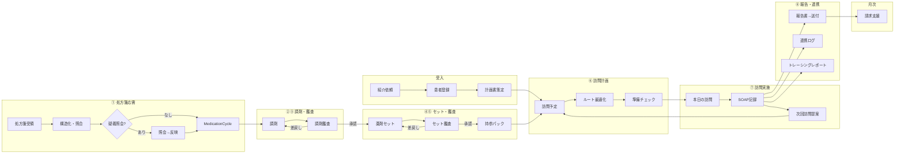

# CareViaX Pharmacy — Implementation Plan

> 仕様書: [ワークフロー](docs/careviax_pharmacy_workflow_spec_project_context.md) | [多職種連携](docs/careviax_pharmacy_multidisciplinary_collaboration_spec_project_context.md) | [設計判断](docs/decisions.md)
> アーキテクチャ / デザイン方針: CLAUDE.md 参照
> ※ Phase 3 は Phase 2 完了時に詳細化する

### 明示的な非ゴール（既存レセコン/薬局システムの責務）
- フル在庫管理（発注・仕入・棚卸し・在庫評価）→ CareViaXは在庫医薬品マスタ（採用薬フラグ+引当フラグ）の薄い層のみ
- 麻薬管理帳簿・毒薬劇薬受払い簿 → レセコンが法定帳票を担う
- 領収書・調剤報酬明細書の発行 → レセコンの中核機能（二重入力回避）
- 会計・一部負担金の収納管理 → レセコン/会計システム
- POS・仕入・発注 → 在庫管理専用システム

### 実装優先原則（今回レビュー反映）
- MVPは「訪問日次運用 + 報告送付 + 最低限の処方差分/持参判定」を最優先にし、重いマスタ/CDS/請求自動化は後段に寄せる
- `MedicationCycle` は「処方起点の1運用サイクル」を維持する。MVPでも訪問予定は処方差分・持参可否・未解決課題と切り離さない
- CareViaX / レセコン / 電子薬歴 / 在宅支援システムの責任分界を先に固定し、二重入力を避ける
- 公開情報ベースの市場比較では、既存製品は「訪問記録・計画書/報告書作成・FAX/メール送付・現場共有」に強い。初期価値は最適化機能より、現場記録/連携/持参漏れ防止に置く

### 外部システム比較から採る方針
- 調剤レセコン系: 在宅スケジュール/介護請求入力まで持つ製品があるが、CareViaXでは請求エンジン全面置換はしない
- 電子薬歴系: タブレット記録、写真、訪問報告書・計画書作成はベースライン機能として扱う
- ふぁむけあ系: 報告書作成、FAX/メール送信予約、トレーシングレポート、店舗間共有は MVP の参照ベンチマークとする
- シジダス系: 一包化委受託/外部委託オペレーションは Phase 2+ の連携拡張テーマとして扱う

## ワークフロー全体像（8工程）

| # | 工程名 | 英語キー | 主担当 | 入力 | 出力 |
|---|--------|---------|--------|------|------|
| 1 | **処方箋応需** | prescription_intake | 受付/事務 | 処方箋（紙/FAX/電子/施設/リフィル） | 構造化明細、MedicationCycle |
| 2 | **調剤** | dispensing | 調剤担当薬剤師 | 処方明細 + 在庫確認 | 調剤実績、差異記録、持参候補 |
| 3 | **調剤鑑査** | dispense_audit | 鑑査担当薬剤師 | 処方原本 + 調剤実績 | 承認/差戻し + CDS アラート |
| 4 | **薬剤セット** | medication_set | セット担当 | 鑑査済み薬剤 | セット構成、持参パック |
| 5 | **セット鑑査** | set_audit | 鑑査担当 | セット実績 | 承認/部分承認/差戻し |
| 6 | **訪問計画** | visit_planning | 事務/薬剤師 | 持参確定品 + 患者スケジュール | 訪問予定、ルート、準備チェック |
| 7 | **訪問実施** | visit_execution | 訪問担当薬剤師 | 訪問予定 + 持参薬 + 前回課題 | SOAP記録、残薬、課題、介入 |
| 8 | **報告・連携** | reporting | 薬剤師/事務 | 訪問記録 | 報告書送付、送達追跡、連携ログ |

---

## Phase 0: 基盤構築・データ定義 `cc:TODO`
> 実装順は **Phase 0a Core → Phase 1a MVP → Phase 0b Advanced → Phase 1b/2** を原則とする
> 目的: Phase 1a を Phase 0 全量完了で待たせない。現場検証に必要な最小基盤を先に通す

### 0a. Core と 0b. Advanced の分割方針

**Phase 0a Core（Phase 1a 着手条件）:**
- 0-1. プロジェクト初期化
- 0-2a〜0-2d, 0-2f〜0-2h のうち MVP必須テーブル
- 0-3. 認証・権限・RLS基盤
- 0-4. 共通基盤
- 0-5. 監視・バックアップ・ガイドライン準拠のうち MVP必須項目

**Phase 0b Advanced（Phase 1a 後続でよい）:**
- 0-2e. 医薬品マスタ系
- 0-2i. 医薬品マスタ取込パイプライン
- 施設基準管理の高度集計
- 請求候補の高度ルールエンジン

### 0-1. プロジェクト初期化 `cc:TODO`
> DoD: `pnpm dev` 起動、`pnpm build` 成功、CI green、AWS全サービス接続確認

- [ ] Next.js 16 + TypeScript 6 + React 19, pnpm, ESLint 10, Prettier 3, Tailwind CSS 4 + shadcn/ui
- [ ] shadcn/ui 医療テーマ: ブルーグレー配色、コントラスト4.5:1+、zebra stripe テーブル（CLAUDE.md デザイン方針準拠）
- [ ] AWS: IAM, RDS PostgreSQL(Multi-AZ, KMS), Cognito(MFA/TOTP, 13文字+, ロックアウト), S3(Object Lock), SES, Amplify Hosting(東京固定)
- [ ] Prisma 7（RDS接続）, NextAuth v5 + Cognito, Serwist 9 PWA
- [ ] `.env.example`, Vitest 4, Playwright, セキュリティヘッダー, CI(GitHub Actions), IaC(AWS CDK)

### 0-2. データモデル全体（Prisma Schema） `cc:TODO`
> depends: 0-1 | DoD: `prisma migrate deploy` 成功、全テーブル作成、シード完了
> ※ 全テーブル同時マイグレーション。グループ分けは設計整理用。Prisma multi-file schema（prisma/schema/*.prisma）でファイル分割。

**0-2a. 組織・利用者・薬局運営系:**
- [ ] Organization, PharmacySite（届出フラグ・体制加算区分・薬局住所座標 lat/lng）, User（Cognito連携）
- [ ] Membership（role ENUM 7種 + can_dispense/can_audit_dispense/can_set/can_audit_set フラグ）
- [ ] FacilityStandardRegistration（施設基準届出管理: 届出種別, 届出日, 有効期限, 更新期限アラート, 要件達成状態JSON）
- [ ] PharmacistCredential（かかりつけ薬剤師要件: 研修認定証, 有効期限, 在籍継続年数, 週勤務時間実績）
- [ ] PharmacistShift（薬剤師訪問可否: date, pharmacist_id, available BOOLEAN, available_from/to, note）

**0-2b. 患者・案件系:**
- [ ] Patient（請求支援フラグ含む）, CareCase, Residence（building_id/unit_name/住所座標 lat/lng）
- [ ] ContactParty, CareTeamLink, ConsentRecord
  - ConsentRecord: 同意種別（訪問薬剤管理/個人情報取扱/外部共有/写真撮影）、取得方法（紙署名スキャン/デジタル）、取得日、有効期限、撤回日
  - 同意撤回時: ケース終了判定 + データ保持ポリシー（法定保存期間中は保持、閲覧制限フラグ付与）
  - 同意の有効期限管理: 期限切れ前リマインド、未取得→訪問不可アラート
- [ ] ManagementPlan（薬学的管理指導計画書、版管理、月次更新）

**0-2c. 処方箋応需・調剤・セット系:**
- [ ] MedicationCycle（overall_status 14段階）
  - visit/readiness/reporting の派生状態を計算するための sub_status 群を追加
  - on_hold に潰さない例外状態: no_show / hospitalized / refused_receipt / awaiting_reply / report_failed / carry_items_partial
  - 状態遷移マトリクス（ステートマシン定義）:
    - 許可遷移ルール: from→to のペア + 実行可能ロール + 必須条件（例: dispensed→audited は鑑査ロールのみ）
    - 遷移時副作用: 通知生成、タスク起票、carry_items更新、BillingEvidence生成のトリガー定義
    - 不正遷移のブロック（API層でバリデーション）+ 監査ログ記録
- [ ] PrescriptionIntake（source_type: paper/fax/e_prescription/facility_batch/refill）
  - refill_remaining_count, refill_next_dispense_date（リフィル処方箋管理）
  - split_dispense_total/split_dispense_current（分割調剤管理）
  - prescription_expiry_date（有効期限: 発行日+4日）
- [ ] PrescriptionLine（薬剤・規格・用法・日数・包装指示・一般名/後発品フラグ）
- [ ] InquiryRecord（疑義照会: 照会内容、照会先医師、照会結果、処方変更内容、照会日時）
- [ ] DispenseTask, DispenseResult, DispenseAudit
- [ ] SetPlan, SetBatch, SetAudit
- [ ] WorkflowException

**0-2d. スケジュール・訪問系:**
- [ ] VisitSchedule（cycle_id, case_id, visit_type, scheduled_date/time_window, pharmacist_id, route_order, carry_items, pre_visit_checklist_completed）
  - visit_type: initial/regular/temporary/revisit/delivery_only/emergency/physician_co_visit
  - schedule_status: planned/in_preparation/ready/departed/in_progress/completed/cancelled/postponed/rescheduled/no_show
  - recurrence_rule（定期訪問: 月2回第1・第3火曜等のRRULE形式）
  - facility_batch_id（施設一括訪問のグループID）
  - time_constraint_start/end（施設受入時間帯・患者在宅時間帯）
  - medication_start_date / medication_end_date（服用開始日/服用最終日 — 処方内容から自動計算）
  - visit_deadline_date（訪問期限日 — 原則として服用最終日以前。超過時はアラート）
- [ ] FacilityVisitBatch（facility_id, scheduled_date, pharmacist_id, patient_ids[], estimated_duration, route_from_pharmacy）
  - 施設一括訪問: 同一施設の複数患者をまとめて計画・実行
- [ ] VisitRecord（SOAP構造化, 受領記録, next_visit_suggestion_date）
  - outcome_status: completed/revisit_needed/postponed/cancelled/delivery_only/completed_with_issue
  - cancellation_reason / postpone_reason / revisit_reason を構造化保持
- [ ] VisitPreparation（schedule_id, checklist JSON, medication_changes_reviewed, carry_items_confirmed, previous_issues_reviewed, prepared_at, prepared_by）
  - 訪問前準備チェックリスト: 持参薬確認/処方変更確認/前回課題確認/ルート確認

**0-2e. 医薬品マスタ系（厚労省/PMDA/SSK公開データ）:**
- [ ] DrugMaster（医薬品マスタ本体）:
  - yj_code（12桁）, receipt_code（レセ電9桁）, hot_code（HOT13桁）, jan_code
  - drug_name, drug_name_kana, generic_name, drug_price, unit, dosage_form
  - therapeutic_category（薬効分類4桁）, manufacturer
  - is_generic BOOLEAN, is_narcotic BOOLEAN, is_psychotropic BOOLEAN
  - max_administration_days（投与日数制限）
  - transitional_expiry_date（経過措置期限）
  - データソース: SSK基本マスター（CSV/ZIP, 無料, ssk.or.jp）
- [ ] DrugPackageInsert（添付文書情報）:
  - drug_master_id, contraindications JSON, interactions JSON, adverse_effects JSON
  - dosage_adjustment_renal JSON, precautions_elderly JSON
  - document_version, revised_at, source_format ENUM(xml/sgml/pdf)
  - データソース: PMDA添付文書XML（メディナビ経由一括DL, 無料）
- [ ] DrugInteraction（相互作用マスタ）:
  - drug_a_id, drug_b_id, severity ENUM(contraindicated/caution/minor), mechanism, clinical_effect
  - source ENUM(pmda_xml/kegg/manual)
  - データソース: PMDA添付文書XMLの併用禁忌/注意セクションをパース
- [ ] DrugAlertRule（CDSアラートルール）:
  - alert_type ENUM(interaction/duplicate/allergy_cross/renal_dose/pim_elderly/high_risk/narcotic/max_days)
  - condition JSON, severity, message
  - ハイリスク薬: 厚労省 特定薬剤管理指導加算対象（薬効分類コードでマッピング）
  - 高齢者PIM: 厚労省 高齢者の医薬品適正使用の指針（PDF→構造化、手動初期投入）
  - 腎機能用量調整: JSNP 投与量一覧 第37版（PDF→構造化、手動初期投入）
- [ ] PharmacyDrugStock（在庫医薬品マスタ — テナント別）:
  - site_id, drug_master_id, is_stocked BOOLEAN, stock_qty（概算在庫数）, reorder_point
  - last_dispensed_at, preferred_generic_id（当薬局の採用後発品）
  - 用途: 調剤時に「当薬局に在庫がある薬剤」のみフィルタ表示、欠品時の代替候補提示、一般名処方→採用後発品の自動選択
  - 在庫数は概算管理（厳密な在庫管理はレセコン/在庫システムの責務。CareViaXは訪問調剤の実務支援に絞る）
- [ ] GenericDrugMapping（一般名→後発品対応表）:
  - generic_name, brand_drug_ids[], price_comparison
  - データソース: 厚労省 一般名処方マスタ（Excel, 無料）+ 薬価基準収載品目リスト
- [ ] DrugMasterImportLog（取込履歴）:
  - source ENUM(ssk/pmda/mhlw_price/mhlw_generic/hot), imported_at, record_count, status, error_log

**0-2f. 薬学管理系:**
- [ ] MedicationProfile, ResidualMedication（減数調剤対応、禁止薬剤フラグ）
- [ ] MedicationIssue, Intervention, Task
- [ ] FirstVisitDocument（初回訪問緊急連絡先文書）

**0-2g. 連携・文書系:**
- [ ] CommunicationEvent, CommunicationRequest/Response
- [ ] CareReport, DeliveryRecord, ConferenceNote, EscalationRule, ExternalAccessGrant
  - CareReport / DeliveryRecord に draft/sent/failed/confirmed/response_waiting を保持
  - reschedule / emergency_insert 時の通知先・通知結果・連絡理由を保持
- [ ] TracingReport（服薬情報提供書）

**0-2h. 管理・設定系:**
- [ ] BillingCandidate, Notification, AuditLog, IntegrationJob, Template
- [ ] BillingEvidence（visit単位の根拠）:
  - payer_basis（医療/介護/自費/非算定）, claimable BOOLEAN, exclusion_reason
  - order_ref / consent_ref / management_plan_ref / report_delivery_ref / visit_record_ref
  - monthly_count_snapshot, same_month_exclusion_flags, validation_notes
- [ ] SourceOfTruthMatrix / IntegrationBoundary:
  - 患者基本、処方原本、調剤実績、持参情報、報告書送達、請求候補ごとに「CareViaX正本 / 外部正本 / 同期方向 / 障害時復旧手順」を定義
- [ ] Setting（4層）, LabelDictionary
- [ ] 全テーブル: created_at, updated_at, org_id, `@@index`, `prisma generate`

### 0-2i. 医薬品マスタ取込パイプライン `cc:TODO`
> depends: 0-2e（マスタテーブル作成後） | DoD: 全データソースから取込完了、DrugMaster 1万3千品目+、相互作用データ検索可能

**SSK基本マスター取込（第1層・保険請求基盤）:**
- [ ] SSK ZIP ダウンロード → 解凍 → Shift-JIS→UTF-8変換 → 固定長テキストパース
- [ ] DrugMaster へ全量ロード（YJコード/レセ電コード/薬価/薬効分類/後発品フラグ/麻薬区分/投与日数制限）
- [ ] HOTコードマスター（MEDIS, 無料）取込 → DrugMaster.hot_code へ結合
- [ ] 更新スケジュール: 薬価改定時（4月）に全量入替 + 新薬収載時（月次）に差分確認

**厚労省 薬価・一般名マスタ取込（第2層）:**
- [ ] 薬価基準収載品目リスト（Excel）パース → DrugMaster.drug_price 更新
- [ ] 一般名処方マスタ（Excel）パース → GenericDrugMapping 生成
- [ ] 後発医薬品リスト取込 → DrugMaster.is_generic 更新

**PMDA 添付文書取込（第3層・CDS基盤）:**
- [ ] PMDAメディナビ登録（無料）→ マイ医薬品集サービスで全医療用医薬品XMLを一括DL
- [ ] XML パーサー: 禁忌/併用禁忌/併用注意/重大な副作用/用法用量セクションを構造化抽出
- [ ] → DrugPackageInsert（禁忌/相互作用/副作用JSON）に保存
- [ ] → DrugInteraction テーブルへ併用禁忌・併用注意を展開（drug_a × drug_b ペア）
- [ ] 更新: PMDAメディナビの「指定期間更新分」DLで差分更新

**手動構造化データ投入（第4層・高齢者/腎機能）:**
- [ ] 高齢者PIMリスト（厚労省PDF）→ 手動で DrugAlertRule に投入（alert_type=pim_elderly）
- [ ] 腎機能別用量調整（JSNP PDF 第37版）→ 手動で DrugPackageInsert.dosage_adjustment_renal に投入
- [ ] ハイリスク薬（特定薬剤管理指導加算対象）→ 薬効分類コードで DrugAlertRule にマッピング

**管理画面:**
- [ ] 医薬品マスタ検索画面: YJコード/品名/薬効分類で検索、添付文書詳細表示
- [ ] 取込履歴一覧（DrugMasterImportLog）: ソース別の最終取込日時・件数・エラー
- [ ] 手動取込トリガーボタン（管理者権限）

### 0-3. 認証・権限・RLS基盤 (FR-501) `cc:TODO`
> depends: 0-2 | DoD: RLS正当性テスト通過

- [ ] Prisma + RLS（SET LOCAL）, ヘルパー関数, 全テーブルポリシー, S3ポリシー
- [ ] RLS正当性テスト（Vitest）, 権限マトリクス（7ロール+工程フラグ4種）

**認証画面フロー（Cognito + NextAuth）:**
- [ ] ログイン画面: メール+パスワード入力、エラー表示（無効な認証情報/ロックアウト中）
- [ ] MFA/TOTP 入力画面: 6桁コード入力、リカバリーコードフォールバック
- [ ] MFA 初期設定: QRコード表示 → TOTP登録 → 確認コード検証 → リカバリーコード表示+保存促進
- [ ] パスワード変更: 現在のパスワード+新パスワード（13文字以上、強度インジケータ）
- [ ] パスワードリセット: メール入力→確認コード→新パスワード設定
- [ ] 初回ログイン: パスワード強制変更 + MFA設定必須
- [ ] セッションタイムアウト（30分）: 再認証モーダル（パスワード再入力、操作中データは保持）
- [ ] アカウントロックアウト時: 案内画面（管理者への連絡方法を表示）
- [ ] ユーザー設定/マイページ:
  - プロフィール編集（表示名、連絡先）
  - MFA設定管理（TOTP追加/削除）
  - 通知設定（種別ごとのON/OFF、ブラウザPush許可）
  - 薬剤師: 自分の訪問実績サマリー、今月の訪問カウンター

### 0-4. 共通基盤 `cc:TODO`
> depends: 0-3 | DoD: App Shell動作、監査ログ書込み、CRUD 1つ動作

- [ ] App Shell + グローバルナビ + レスポンシブ + WCAG AA
- [ ] 監査ログ(PostgreSQLトリガー) + API ヘルパー(Zod 4) + レート制限 + TanStack Query 5
- [ ] メール送信(SES) + 文言辞書(LabelDictionary)

**グローバルナビゲーション設計:**
- [ ] デスクトップ: 左サイドバー（工程別メニュー: 受付/調剤/鑑査/セット/訪問/報告 + 管理メニュー）
- [ ] サイドバー折りたたみ（アイコンのみ表示）+ ピン固定切替
- [ ] パンくずリスト: 患者→ケース→訪問記録 等の階層表示
- [ ] グローバル検索バー（Cmd+K）: 患者名/薬剤名/コードで横断検索、最近の操作履歴
- [ ] モバイル: ボトムタブナビ（本日の訪問/患者/スケジュール/通知/メニュー）
- [ ] タブレット: サイドバー折りたたみデフォルト、スワイプで展開

**通知UI:**
- [ ] インアプリ通知センター: ヘッダーのベルアイコン + ドロワー（未読バッジ付き）
- [ ] トースト通知: 操作完了/エラー/警告の一時表示（sonner or shadcn/ui toast）
- [ ] ブラウザPush通知: PWA Service Worker 経由、ユーザー許可制（緊急訪問/差戻し等）
- [ ] 通知種別フィルタ: 緊急/業務/リマインド/システム
- [ ] 既読管理: 個別既読 + 一括既読

**フォーム共通基盤:**
- [ ] react-hook-form + @hookform/resolvers/zod（サーバー/クライアント同一Zodスキーマ）
- [ ] バリデーションUI: フィールド横インラインエラー + 送信時サマリー（上部にスクロール）
- [ ] 離脱防止: `beforeunload` + Next.js Router イベントで未保存警告ダイアログ
- [ ] 自動保存: 訪問記録/SOAP等の長文入力は debounce 30秒で下書き保存（Dexie → Phase 2でサーバー同期）

**共通UIパターン:**
- [ ] ローディング: 一覧→スケルトン、操作ボタン→スピナー、ページ遷移→トップバーのプログレスバー
- [ ] 空状態（Zero State）: データなし時のイラスト+CTAボタン（「最初の患者を登録」等）
- [ ] 初期導入オンボーディング: ステップガイド（組織設定→薬剤師登録→患者登録→初回訪問）
- [ ] エラー画面: 404/500/ネットワークエラー/RLS権限エラーの各テンプレート
- [ ] 確認ダイアログ: 破壊的操作（キャンセル/削除/差戻し）の共通ConfirmDialogコンポーネント
- [ ] 二重確認: 取消不可操作はテキスト入力確認（「キャンセル」と入力して確定）

**データテーブル共通コンポーネント:**
- [ ] TanStack Table v8 + shadcn/ui DataTable ベース
- [ ] 標準機能: 列ソート、列フィルタ、列表示/非表示切替、列幅リサイズ、sticky header、zebra stripe
- [ ] 行選択（チェックボックス、一括操作用）、行展開（詳細インライン表示）
- [ ] CSV エクスポートボタン、印刷ボタン
- [ ] レスポンシブ: デスクトップ→フルテーブル、タブレット→列優先度で非表示、モバイル→カードリスト表示に切替

**状態管理設計:**
- [ ] Zustand ストア構成:
  - `useAuthStore`: 認証状態、現在ユーザー、現在組織/店舗
  - `useUIStore`: サイドバー開閉、テーマ、通知ドロワー、モーダル管理
  - `useOfflineStore`: 同期状態、キャッシュTTL、オフラインフラグ、ペンディングキュー
- [ ] TanStack Query: サーバー状態の一元管理（Zustandと責務分離: Zustand=クライアントUI状態のみ）

**レスポンシブブレークポイント戦略:**
- [ ] デスクトップ(≥1280px): フル機能、サイドバー常時表示、データテーブル、マルチペイン
- [ ] タブレット(768-1279px): 訪問記録入力の主要デバイス、サイドバー折りたたみ、シングルペイン+ドロワー
- [ ] モバイル(≤767px): 本日の訪問、訪問記録、通知確認に特化、ボトムタブナビ
- [ ] デバイス対応マトリクス:
  | 画面 | デスクトップ | タブレット | モバイル |
  |---|---|---|---|
  | ダッシュボード | ◎フル | ◎フル | ○簡易版 |
  | スケジュールカレンダー | ◎月/週/日 | ○週/日 | ○日+リスト |
  | 本日の訪問 | ◎ | ◎ | ◎（主要画面）|
  | 訪問記録(SOAP) | ◎ | ◎（主要入力）| ○（最小入力）|
  | 調剤キュー/鑑査 | ◎ | ○ | ×（非対応）|
  | 処方エディタ | ◎ | ○ | ×（非対応）|
  | 管理設定 | ◎ | ○ | ×（非対応）|

**印刷スタイル:**
- [ ] `@media print` グローバルスタイル: ナビ/サイドバー/フッター非表示、改ページ制御
- [ ] 薬歴/報告書/服薬カレンダー/計画書: 各印刷レイアウト（A4縦）
- [ ] PDF出力（送付用）とブラウザ印刷（手元確認用）の使い分けUI

**API Route 設計規約:**
- [ ] RESTful エンドポイント一覧定義（Next.js Route Handlers）:
  - 患者系: `POST/GET/PATCH /api/patients`, `GET /api/patients/:id/timeline`
  - ケース系: `POST /api/cases`, `PATCH /api/cases/:id/transition`
  - スケジュール系: `POST/GET/PATCH/DELETE /api/visit-schedules`, `POST /api/visit-schedules/generate`（定期一括生成）, `GET /api/visit-schedules/today`
  - 訪問記録系: `POST/GET/PATCH /api/visit-records`
  - 処方系: `POST /api/prescription-intakes`, `POST /api/medication-cycles`, `PATCH /api/medication-cycles/:id/transition`
  - 調剤系: `GET /api/dispense-queue`, `POST /api/dispense-results`, `POST /api/dispense-audits`
  - 報告系: `POST /api/care-reports`, `POST /api/care-reports/:id/send`, `POST /api/tracing-reports`
  - シフト系: `GET/POST/PATCH /api/pharmacist-shifts`, `GET /api/pharmacist-shifts/available?date=&time=`（空き検索）
  - ダッシュボード系: `GET /api/dashboard/today`, `GET /api/dashboard/overdue`, `GET /api/dashboard/monthly-stats`, `GET /api/dashboard/workflow`, `GET /api/dashboard/medication-deadlines`
  - マスタ系: `GET /api/drugs?q=&category=`（医薬品検索）, `POST /api/drug-master/import`
  - 全エンドポイントに認可ミドルウェア（ロール+工程フラグ検証）を適用
- [ ] エラーレスポンス標準形式:
  - `{ code: string, message: string, details?: object }` 統一フォーマット
  - エラーコード体系: `AUTH_*`, `VALIDATION_*`, `WORKFLOW_*`, `RLS_*`, `EXTERNAL_*`
  - i18n 対応: LabelDictionary 参照でクライアント向けメッセージを日本語化
  - HTTP ステータス: 400(バリデーション), 401(未認証), 403(権限不足), 404(不存在), 409(競合/状態遷移不正), 422(業務ルール違反), 500(内部エラー)
- [ ] ページネーション戦略:
  - 一覧系API: cursor ベース（大量データ対応、リアルタイム追加に強い）
  - レスポンス形式: `{ data: T[], nextCursor?: string, hasMore: boolean, totalCount?: number }`
  - デフォルト件数: 一覧50件、ダッシュボード10件、検索20件
- [ ] 楽観的ロック:
  - VisitRecord, MedicationCycle, SetBatch 等の同時編集対象テーブルに `version` カラム追加
  - 更新時に `WHERE version = :expected` → 不一致で 409 Conflict 返却
  - クライアント側: TanStack Query の `onError` で競合検知→リフェッチ→差分表示

**ファイルアップロード/ダウンロード:**
- [ ] `POST /api/files/presigned-upload` — S3 presigned PUT URL 発行（MIME制限、サイズ制限、有効期限5分）
- [ ] `GET /api/files/:id/presigned-download` — S3 presigned GET URL 発行（有効期限15分）
- [ ] 用途別パス: `prescriptions/{orgId}/{patientId}/`, `visit-photos/{orgId}/{visitId}/`, `reports/{orgId}/{reportId}/`
- [ ] アップロード完了コールバック: クライアント→API→メタデータDB保存 + ウイルススキャン（将来）

**PDF 生成サービス:**
- [ ] 技術選定: React-PDF(@react-pdf/renderer) をサーバーサイドで実行（Next.js Route Handler内）
- [ ] テンプレート: 報告書/計画書/薬歴/服薬カレンダー/トレーシングレポートの各テンプレートコンポーネント
- [ ] 一括出力: 個別指導対応（数百件）→ キュー制御 + ZIP 圧縮 + S3一時保存 + ダウンロードURL通知
- [ ] A4 縦/横切替、ヘッダ/フッタ（薬局名、ページ番号、出力日時）

**検索 API 共通仕様:**
- [ ] 全文検索: 患者名/薬剤名はカナ・部分一致対応（PostgreSQL `ILIKE` or `pg_trgm`）
- [ ] フィルタ: Zod スキーマで型安全なクエリパラメータ（`?status=active&from=2026-01-01&pharmacistId=xxx`）
- [ ] ソート: `?sort=scheduled_date&order=asc`（デフォルトソートは各エンドポイントで定義）

### 0-5. 監視・バックアップ・ガイドライン準拠 `cc:TODO`
> depends: 0-1 | DoD: 復旧試験完了、監視稼働、ガイドライン文書5点

- [ ] バックアップ + 復旧試験 + CloudWatch/CloudTrail + Cognito Advanced Security
- [ ] 責任分界表/プライバシーポリシー/利用目的明示/IT-BCP/インシデント手順書 + セッションタイムアウト(30分)
- [ ] 監査ログエクスポート:
  - 閲覧API: `GET /api/audit-logs?actor=&target=&action=&from=&to=`（フィルタ+ページネーション）
  - CSV/JSON エクスポート: ガイドライン監査対応（外部監査人への提出用）
  - 保存期間: 5年（CloudWatch Logs → S3 Glacier アーカイブ）

### 0-6. バックグラウンドジョブ・定期タスク `cc:TODO`
> depends: 0-4 | DoD: 全ジョブが CloudWatch Events (EventBridge) or cron で稼働

- [ ] ジョブ実行基盤: Next.js Route Handler + EventBridge Scheduler（またはAmplify Functions scheduled trigger）
- [ ] 日次ジョブ:
  - 服用最終日接近チェック → medication_end_date が3日以内で未訪問 → Notification生成 + ダッシュボード警告
  - リフィル処方箋の次回調剤日通知 → refill_next_dispense_date が7日以内 → 担当者通知
  - 処方箋有効期限切れ警告 → prescription_expiry_date が翌日 → 受付担当通知
  - 施設基準更新期限アラート → 期限60日/30日/7日前にステップ通知
  - 研修認定有効期限アラート → PharmacistCredential.expiry 90日/30日前
  - 管理指導計画書月次更新リマインド → ManagementPlan の前回更新から30日超
  - 同意書有効期限チェック → ConsentRecord.expiry が30日以内 → リマインド
- [ ] 当日夕方ジョブ:
  - 薬歴未記入リマインド → 訪問完了(completed)だが VisitRecord 未作成 → 担当薬剤師通知
- [ ] 翌営業日ジョブ:
  - 報告書未送付リマインド → VisitRecord 作成済みだが CareReport/DeliveryRecord 未送付 → 担当者通知
- [ ] 月次ジョブ:
  - 月間訪問回数集計 → 上限未達/超過の患者一覧レポート生成
  - 経営指標集計 → 処方箋集中率、後発品割合、在宅訪問実績の月次スナップショット保存
- [ ] ジョブ共通: 実行ログ（IntegrationJob）、失敗時リトライ（最大3回）、管理者通知

---

## Phase 1a: MVP — 患者・訪問・記録 `cc:TODO`
> depends: Phase 0a Core 完了
> 出口条件: 患者登録→処方差分確認→持参可否確認→訪問計画→訪問記録→報告書送付の基本サイクルが回る
> ※ MVP でも `MedicationCycle` を維持するため、①〜⑤の全量実装は後段でも「薄い upstream slice」は先に入れる

### 1a-1. 患者・案件管理 `cc:TODO`
> depends: 0-4 | DoD: 患者CRUD→ケース作成→状態遷移→終了処理→計画書作成が動作

- [ ] 紹介受付フォーム (FR-001): 依頼元（医師指示書/ケアマネ依頼/施設依頼/家族相談）、必要書類チェック（指示書/同意書/保険証/介護保険証）
- [ ] 患者基本情報 CRUD (FR-002): 請求支援フラグUI + 住所→座標自動変換（ジオコーディング）
- [ ] ケアチーム管理 + 患者詳細画面（7タブ）+ タイムライン + 検索
- [ ] ケース状態遷移 + 終了処理(F-08)
- [ ] 薬学的管理指導計画書: 作成・版管理・月次更新リマインド・処方変更時の再策定アラート
- [ ] 患者重複検知 (FR-004) — P1
- [ ] 同意取得UI:
  - 同意書一覧画面（患者別: 種別/取得日/有効期限/ステータス）
  - 紙署名→スキャンアップロード→ConsentRecordに紐付けフロー
  - 未取得同意の警告表示（訪問予定作成時に必須同意チェック）

### 1a-2. ⑥ 訪問計画・ルート最適化 `cc:TODO`
> depends: 1a-1 | DoD: 訪問予定作成→定期スケジュール生成→準備チェック→当日表示→予定変更連絡が動作

**MVPで先に入れる upstream slice:**
- [ ] 訪問予定ごとの処方差分サマリー（前回からの追加/中止/用量変更）
- [ ] 持参可否フラグ（carry_items_ready / partial / blocked）
- [ ] 未解決課題・疑義照会中・要確認事項の一覧表示
- [ ] 持参薬未確定でも予定作成は可能だが、出発前に強い警告を表示

**訪問スケジュール (FR-101):**
- [ ] カレンダー(日/週/月) + リスト: 担当者別/施設別/患者別ビュー
- [ ] 訪問タイプ7種: 初回/定期/臨時/再訪/配薬のみ/緊急/医師同行
- [ ] 定期訪問の繰返しルール: RRULE形式（月2回第1・第3火曜等）→自動生成
  - 月間訪問回数の自動カウント（医療保険4回/介護保険2回の上限管理）
  - 週1回制限（2026年改定）の自動チェック
- [ ] 服用期間ベースの訪問期限管理:
  - 処方内容から服用開始日・服用最終日を自動計算（処方日 + 投与日数）
  - 原則: 前回の服用最終日より前に次回訪問を実施
  - 服用最終日が近づく患者をダッシュボード/カレンダー上で警告表示
  - 複数薬剤がある場合は最も早い服用最終日を訪問期限として採用
- [ ] 施設受入時間帯・患者在宅時間帯の制約設定
- [ ] 緊急訪問の割込み: 既存スケジュールへの挿入、影響を受ける予定の自動リスケ提案
- [ ] 予定変更時の連携ループ:
  - 理由コード、連絡先、連絡チャネル、送信/口頭結果を同時記録
  - 施設/家族/看護/ケアマネへの連絡タスク自動生成
- [ ] 薬剤師シフト連動: PharmacistShift参照→当日訪問可能な薬剤師のみ担当候補に表示、かかりつけ薬剤師優先割当
- [ ] シフト管理API:
  - CRUD: 日別/週間/月間パターンの一括登録・編集
  - 空き薬剤師検索: `GET /api/pharmacist-shifts/available?date=&timeFrom=&timeTo=` → 候補リスト（かかりつけ優先ソート）
  - シフト変更時: 当日の訪問予定との整合性チェック → 担当不在なら再割当アラート

**施設一括訪問 (FacilityVisitBatch) — Pilot条件付き:**
- [ ] 同一施設の複数患者をグループ化して計画
- [ ] 施設単位の訪問日管理（月次の定期訪問日を施設ごとに設定）
- [ ] バッチ内の患者順序（部屋番号順等）の設定
- [ ] バッチ単位の持参薬一括確認
  - ※ パイロットで施設患者が主要ユースケースでない場合は Phase 2 に移動

**ルート運用:**
- [ ] MVPは手動並べ替えを優先（ドラッグ&ドロップ）
- [ ] 薬局住所（PharmacySite.lat/lng）→ 各患者/施設住所（Residence.lat/lng）の地図表示
- [ ] Google Routes API（Waypoint optimization）連携は P1:
  - 当日の訪問先リスト → 最適順序 + 推定移動時間 → route_order に反映
  - 交通手段: 車/自転車/徒歩の選択
  - 時間ウィンドウ対応は Phase 1b+ で Route Optimization API に切替え

**地図UIコンポーネント:**
- [ ] ライブラリ: `@vis.gl/react-google-maps`（Google公式React wrapper）
- [ ] 訪問先マーカー: 番号付きピン、色分け（未訪問=青、訪問中=緑、完了=灰、緊急=赤）
- [ ] ルート線描画: Google Directions API で薬局→各訪問先の経路表示
- [ ] マーカータップ → 患者名/住所/推定到着時刻のポップアップ
- [ ] モバイル: 地図⇔リストのトグル切替（デフォルトはリスト）

**訪問前準備 (VisitPreparation):**
- [ ] 当日朝の準備チェックリスト画面:
  - 処方変更の有無確認（前回訪問以降の変更をハイライト）
  - 前回の未解決課題一覧
  - 持参薬・セット品の確認チェック
  - ルート確認（地図表示 + 推定到着時刻）
  - オフライン同期済みかどうかの表示
- [ ] チェック完了 → VisitPreparation レコード保存 → 「出発準備完了」ステータス
- [ ] 未完了項目がある状態での出発に警告表示

**本日の訪問 (FR-102):**
- [ ] モバイル最適化: 訪問順に患者カード表示
- [ ] 各カードに: 患者名/住所/推定到着時刻/前回課題数/持参物チェック/ナビ起動ボタン
- [ ] 訪問開始ボタン → 位置情報記録（任意）→ 訪問記録画面へ遷移

### 1a-3. ⑦ 訪問実施・記録 `cc:TODO`
> depends: 1a-2 | DoD: SOAP記録→残薬入力→次回提案→当日参照オフラインが動作

**訪問記録入力 (FR-103):**
- [ ] SOAP構造化入力（S:患者訴え/服薬状況, O:残薬/保管/副作用/介助者, A:薬学評価, P:介入/次回対応/連携要否）
- [ ] 残薬入力: 薬剤別の残数・日数 → 余剰日数自動計算 → ResidualMedication保存
- [ ] 受領記録（受領者名・続柄・日時）
- [ ] 写真・添付 (FR-104): S3, 10MB/50MB, MIMEタイプ制限
- [ ] 訪問中止・再訪・延期 (FR-105): 理由コード必須
- [ ] outcome_status に応じて `MedicationCycle` / `BillingEvidence` / 次回タスクへ自動反映

**薬歴の法定保存・出力（P0: リリースブロッカー）:**
- [ ] VisitRecord（薬歴）の保存期間管理: 5年保持、期限切れ予告アラート
- [ ] e文書法三原則: 真正性（修正時刻+修正者を薬歴UI上に直接表示）、見読性（即時PDF出力）、保存性（S3 Object Lock）
- [ ] 薬歴印刷・PDF出力: 患者単位の一覧、期間指定、一括出力（個別指導時に数十〜数百件を提出）
- [ ] 個別指導対応セットは Phase 2 へ移動（MVPでは患者単位PDF/一覧出力まで）
- [ ] 処方箋保存期限管理: S3 Object Lock 5年設定、原本スキャンの保存期限アラート

**訪問後→次回訪問:**
- [ ] 訪問完了時に次回訪問日の自動提案（定期ルールから計算、前回からの間隔表示、服用最終日を超えない日付を優先提案）
- [ ] 提案日の確認→VisitSchedule自動生成 or 手動調整
- [ ] 月間訪問回数のカウンター表示（上限に対する進捗）
- [ ] 訪問当日中の薬歴記入リマインド（未記録→ダッシュボードに警告）
- [ ] 報告書作成リマインド（訪問翌営業日までに送付が目安）

**オフライン (FR-106 Ph1):**
- [ ] Serwist + Dexie 4, AES-GCM暗号化, TTL 24h
- [ ] 朝の事前同期: 当日訪問予定、患者サマリー、前回課題、持参チェック対象
- [ ] オフラインインジケータ: 読取専用キャッシュであることを明示
- [ ] 下書き同期は Phase 2（FR-106 Ph2）に後ろ倒し

### 1a-4. 薬学的課題 + QRコード `cc:TODO`
> depends: 1a-1 | DoD: 薬剤一覧、課題CRUD、QRスキャン→患者新規登録 or 既存選択→MedicationProfile保存が動作

- [ ] 服薬中薬剤一覧(FR-201)、課題登録(FR-202)、照会管理(FR-203)
- [ ] 未解決課題可視化(FR-204)、アレルギー・副作用歴(FR-205)
- [ ] 残薬管理(ResidualMedication): 構造化 + 次回処方への反映提案
- [ ] QR読取(FR-206): iOSスパイク→@zxing/browser→JAHISパーサー→保存
  - QR内の患者情報（氏名+生年月日）で既存Patient検索 → 候補一覧表示
  - 該当なし → **新規患者登録フローへ遷移**（QR由来の氏名・生年月日・性別を自動入力、不足項目のみ手入力）
  - 該当あり → 患者選択 → MedicationProfile へ薬剤情報を保存
- [ ] お薬手帳QRコード生成（発行方向）: 調剤済み薬剤→JAHIS Ver.2.5形式QR生成（`qrcode` npm + Shift-JISエンコード）→印刷/画面表示

### 1a-5. ⑧ 報告・連携 `cc:TODO`
> depends: 1a-1（連携ログ）, 1a-3（報告書） | DoD: 主要報告書の作成/送付/失敗追跡が動作
- [ ] CommunicationEvent は MVP では主要イベントのみ:
  - 訪問予定変更
  - 主治医報告
  - ケアマネ報告
  - トレーシングレポート送付
  - 送達失敗/再送
- [ ] 連携タイムライン + 連携ログ一覧画面
- [ ] CareReport: 訪問記録→自動差込→テンプレート→PDF→SES
  - 主治医報告（速やかに送付、算定要件）
  - ケアマネ報告（介護保険患者は訪問ごとに必須、月次まとめ不可）
  - 施設申し送り/看護共有/家族共有/内部記録
- [ ] DeliveryRecord:
  - draft / sent / failed / confirmed / response_waiting
  - FAX/メール/SES のチャネル別送達記録
- [ ] 文書テンプレート(FR-302) + タスク管理(FR-304)

### 1a-6. ダッシュボード + テスト `cc:TODO`
> depends: 1a-1〜1a-5 | DoD: E2E通過、パイロットデモ完了

- [ ] ホーム: 本日訪問/未完了タスク/返信待ち/最近の案件/訪問前準備ステータス
- [ ] 管理者: 未記録訪問/未送付報告/月間訪問回数進捗
- [ ] ダッシュボード集計API（サーバーサイド）:
  - `GET /api/dashboard/today` — 本日訪問数・準備状況・未完了タスク・返信待ち件数
  - `GET /api/dashboard/overdue` — 薬歴未記入・報告書未送付・期限超過一覧
  - `GET /api/dashboard/monthly-stats?month=` — 患者別×保険種別の月間訪問回数進捗
  - `GET /api/dashboard/workflow` — MedicationCycle工程別停滞件数・WorkflowException未解消
  - `GET /api/dashboard/medication-deadlines` — 服用最終日接近患者一覧（3日/7日以内）
  - キャッシュ戦略: TanStack Query staleTime=60s、サーバー側は軽量集計ビュー or マテリアライズドビュー
- [ ] E2E: 患者登録→予定作成→準備チェック→訪問→記録→報告書送付
- [ ] RLSテスト + セッション管理UI + シードデータ

### 1a-7. モバイル/タブレットUI `cc:TODO`
> depends: 1a-1〜1a-6 | DoD: スマートフォン/タブレットで訪問業務の一日が完結する

**スマートフォン（≤767px）専用画面:**
- [ ] 本日の訪問リスト（メイン画面）: 訪問順カード表示、スワイプで訪問開始/完了
- [ ] 患者カード: 患者名、住所（1タップでナビ起動）、推定到着時刻、前回課題バッジ、持参物チェック状態
- [ ] 訪問記録入力（SOAP簡易版）: ステップ形式（S→O→A→P を1画面ずつ）、音声入力ボタン（OS標準IME）
- [ ] 残薬入力: 薬剤リスト→残数タップ入力（テンキー）、写真撮影ボタン（残薬現物記録）
- [ ] 受領確認: 署名パッド（タッチ手書き）or 受領者名+続柄入力
- [ ] QRスキャン: カメラ起動→即時読取→患者照合（1a-4のモバイル最適化版）
- [ ] 通知一覧: プッシュ通知タップ→該当画面へディープリンク
- [ ] ボトムタブ: 本日の訪問 / 患者検索 / スケジュール(日表示) / 通知 / メニュー

**タブレット（768-1279px）専用最適化:**
- [ ] 訪問記録入力（主要入力デバイス）: SOAP 4セクション同時表示（2カラムレイアウト）
- [ ] スケジュール: 日/週ビュー（横向き推奨、縦軸=時間/横軸=薬剤師のガントチャート）
- [ ] 患者詳細: サイドパネル+メインコンテンツのマスター/ディテール構成
- [ ] 訪問前準備チェック: チェックリスト+地図を横並び表示
- [ ] 処方差分ビュー: 前回/今回の2カラム比較（デスクトップの3ペインを2ペインに縮小）

**モバイル共通（スマホ+タブレット）:**
- [ ] タッチ最適化: タッチターゲット44px以上（WCAG AA）、スワイプジェスチャー対応
- [ ] プルダウンリフレッシュ: 訪問リスト/ダッシュボードの手動更新
- [ ] ネットワーク状態表示: オンライン/オフラインバナー（オフライン時は読取専用を明示）
- [ ] PWAインストール促進: 初回アクセス時にホーム画面追加バナー
- [ ] 画面回転対応: 縦固定（スマホ）、縦横対応（タブレット、横向きでガントチャート拡大）
- [ ] カメラ連携: 処方箋スキャン、残薬写真、QR読取のネイティブカメラAPI統合
- [ ] GPS連携: 訪問開始/終了時の位置情報記録（任意、プライバシー設定で無効化可能）

---

## Phase 1b: ①処方箋応需→②調剤→③調剤鑑査→CDS `cc:TODO`
> depends: Phase 1a 完了
> 出口条件: 処方箋応需→疑義照会→調剤→鑑査→訪問→報告の完全サイクルが回る

### 1b-1. ① 処方箋応需（処方受付〜調剤開始前） `cc:TODO`
> depends: 1a-1 | DoD: 全経路の処方受付→構造化→疑義照会→MedicationCycle生成が動作

**処方箋受付（経路別）:**
- [ ] 紙処方箋: 患者/家族持参 → 原本スキャン(S3) → 構造化入力
- [ ] FAX処方箋: 訪問診療医/施設からのFAX → 受領記録 → 原本ビューア → **原本未回収管理**（FAX受付後3日超→アラート、原本は訪問時に薬剤師が回収）
- [ ] 電子処方箋: 電子処方箋管理サービス連携（Phase 3 で実装、ここではアダプタIF定義のみ）
- [ ] 施設まとめ処方: 施設看護師からの複数患者分一括受領 → 患者別に分離→個別MedicationCycle生成
- [ ] リフィル処方箋: 薬局保管 → 次回調剤日リマインド → 残回数管理 → 調剤可能ウィンドウ（前回調剤日+投薬日数の±7日、予定日除く）→ ウィンドウ外は調剤不可
- [ ] 処方箋有効期限チェック: 発行日+4日、期限切れ→受付不可アラート

**処方内容確認・照合:**
- [ ] 処方明細の構造化エディタ(PrescriptionLine) + 原本ビューア
- [ ] 前回処方との差分比較ビュー（追加/変更/中止/用量変更をハイライト）
- [ ] 一般名処方 → 後発医薬品候補の自動提示 + 選択記録
- [ ] 保険情報確認（オンライン資格確認のIF設計、実装はPhase 3）
- [ ] DO処方チェック: 前回と同一内容の場合→漫然投与リスク警告（消炎鎮痛剤/抗菌薬/下剤等の長期継続）
- [ ] 在宅移行初期管理料(230点)算定チェック: 初回算定月に自動通知（初回訪問前日までに患家訪問→環境聴取が必要）

**疑義照会 (InquiryRecord):**
- [ ] 照会起票: 照会理由（用量疑義/相互作用/禁忌/重複/その他）、照会先医師、照会内容
- [ ] 照会結果記録: 変更あり（変更内容→PrescriptionLine更新）/ 変更なし（理由記録）/ 回答待ち
- [ ] 照会中は調剤開始不可（該当明細のみブロック、他の明細は進行可）
- [ ] 照会履歴の患者タイムライン統合

**MedicationCycle生成:**
- [ ] 患者照合 → ケース紐付け → MedicationCycle作成
- [ ] 分割調剤: 長期処方の分割管理（分割回数/今回回数/次回調剤予定日）
- [ ] バリデーション: 重複候補検知、未構造化ブロック、不明→WorkflowException
- [ ] 通知: 緊急→調剤キュー即通知
- [ ] PharmacyDrugStock 初期設定UI: DrugMaster から薬局の採用薬品を選択→登録、採用後発薬の設定
- [ ] 訪問予定との接続:
  - 処方差分サマリーを VisitPreparation に反映
  - carry_items_ready / partial / blocked を VisitSchedule に反映

### 1b-2. ② 調剤 + ③ 調剤鑑査 `cc:TODO`
> depends: 1b-1 | DoD: 調剤キュー→実績→鑑査→MedicationCycle状態遷移が動作

**② 調剤:**
- [ ] 調剤作業キュー: 優先度順（緊急>臨時>定期）、期限表示、患者/施設別ビュー
- [ ] PharmacyDrugStock 参照: 在庫薬のみフィルタ表示、欠品時→代替候補提示、一般名→採用後発品の自動選択
- [ ] 明細別調剤実績入力(DispenseResult): 実績数量、差異/欠品/代替（理由コード必須）
- [ ] 持参/施設預け/後送の区分 + 特記事項（冷所/麻薬/半割/粉砕不可/別包/一包化指示）
- [ ] 調剤完了 → 鑑査キューへ通知、VisitSchedule.carry_items を自動更新

**③ 調剤鑑査:**
- [ ] 鑑査待ち一覧（優先度順、期限超過ハイライト）
- [ ] 3ペイン比較ビュー: 処方原本 / 構造化明細 / 調剤実績
- [ ] 鑑査項目: 患者一致、薬剤名・規格・用量・日数、包装指示、高リスク薬フラグ、持参区分
- [ ] 判定: 承認 / 差戻し（理由コード+補足必須）/ 保留 / 緊急例外承認（管理者権限+理由）
- [ ] 承認 → MedicationCycle 状態自動更新 → セット対象 or 訪問持参候補へ
- [ ] 差戻し → 調剤担当に即通知 + WorkflowException 自動起票

**キーボードショートカット（調剤・鑑査画面）:**
- [ ] 調剤キュー: `↑/↓` 行移動、`Enter` 選択、`Cmd+Enter` 完了
- [ ] 鑑査画面: `Tab` ペイン切替、`A` 承認、`R` 差戻し、`Space` チェック項目トグル
- [ ] グローバル: `Cmd+K` 検索、`Cmd+N` 新規作成、`Esc` モーダル閉じ、`?` ショートカット一覧
- [ ] ショートカットヘルプモーダル（`?`キーで表示）

### 1b-3. CDS（臨床意思決定支援） `cc:TODO`
> depends: 1b-2, 0-2i（医薬品マスタ取込済み） | DoD: 調剤時・訪問記録時にアラート表示

- [ ] 調剤時チェック（DrugMaster + DrugInteraction + DrugAlertRule 参照）:
  - 併用禁忌/注意アラート（処方内 + 服薬中薬剤との照合）
  - 重複投薬チェック（同一成分/同効薬）
  - アレルギー交差反応（患者アレルギー歴 × 薬効分類）
  - 投与日数制限超過チェック（DrugMaster.max_administration_days）
  - 麻薬/向精神薬の特別管理フラグ表示
- [ ] 訪問記録時チェック:
  - 腎機能用量調整アラート（患者eGFR × DrugPackageInsert.dosage_adjustment_renal）
  - 高齢者PIMチェック（年齢 × DrugAlertRule.pim_elderly）
  - ハイリスク薬の服薬指導必須フラグ
- [ ] 一般名処方時の後発品候補提示（GenericDrugMapping → 薬価比較表示）
- [ ] 減数調剤WF: 残薬調整→処方医報告→禁止薬剤(麻薬/抗がん剤)ブロック
- [ ] 初回訪問文書の自動生成+交付記録

### 1b-4. トレーシングレポート + 依頼/照会ワークフロー `cc:TODO`
> depends: 1a-5 | DoD: トレーシングレポート送付、依頼→返信→クローズが動作

- [ ] TracingReport: 課題→起票→送付→受領確認
- [ ] CommunicationRequest/Response: 状態遷移9段階
- [ ] 返信待ち一覧 + エスカレーション

### 1b-5. 最小セット運用（Pilot前必須） `cc:TODO`
> depends: 1b-2 | DoD: セットが必要な患者に対して、最小限のセット→確認→持参反映が動作

- [ ] セット対象患者のフラグ管理（pilot対象の明示）
- [ ] 最小SetPlan: 対象期間、セット方式、注意事項
- [ ] 最小SetAudit: 承認 / 差戻し / 部分承認
- [ ] 部分承認時は carry_items_partial と再作業タスクを自動起票
- [ ] 持参チェックリストへ確定反映

### 1b-6. ワークフローダッシュボード + テスト `cc:TODO`
> depends: 1b-1〜1b-5 | DoD: E2Eで処方箋応需→調剤→鑑査→訪問→報告の完全サイクル通過

- [ ] ワークフローダッシュボード: MedicationCycle工程別停滞 + WorkflowException未解消
- [ ] 連携ダッシュボード: 送付失敗/期限超過/未返信
- [ ] リフィル処方箋ダッシュボード: 次回調剤予定日一覧 + 期限切れアラート
- [ ] billing evidence ダッシュボード: 算定不可理由 / 根拠不足 / 送付未完了
- [ ] E2E: 処方箋応需→疑義照会→調剤→鑑査→訪問→報告の完全フロー
- [ ] ISMS認証プロセス開始

### 1b-7. パイロット薬局 UAT + フィードバック反映 `cc:TODO`
> depends: 1b-6 | DoD: パイロット薬局で1週間の実運用テスト完了、フィードバック反映

- [ ] パイロット薬局での実運用テスト（1週間）
- [ ] フィードバック収集→優先度付け→Phase 2 開始前に修正適用
- [ ] 施設患者の有無を確認 → 施設なしなら FacilityVisitBatch と自動ルート最適化は Phase 2 に移動
- [ ] セット患者の有無を確認 → セット患者なしの場合は Pilot対象を明示し、セット本格機能は Phase 2 へ

---

## Phase 2: セット・月次運用・連携強化 `cc:TODO`
> depends: Phase 1b 完了 | 出口条件: セット運用安定化 + 締め処理の見える化

### 2-1. ④ 薬剤セット + ⑤ セット鑑査 `cc:TODO`
> DoD: セット計画→実行→鑑査→持参パック→訪問持参連動が動作

> ※ 1b-5 で最小運用は先行実装済み。Phase 2 はフル機能化が目的

**④ 薬剤セット:**
- [ ] セット計画画面: 対象期間、セット方式（施設カレンダー/1日4回/眠前のみ/カスタム）
- [ ] スロットグリッド: 朝/昼/夕/眠前/頓用 × 日数のマトリクス
- [ ] SetBatch: 明細→スロット割当、持参/施設預け/後送の区分、頓用は通常スロットから分離
- [ ] 持参パック自動生成: 訪問持参チェックリスト、注意事項ラベル（冷所保管/麻薬等）
- [ ] バリデーション: 鑑査未承認薬→セット不可、投与タイミング未定義→不可、処方変更→影響セット再確認

**⑤ セット鑑査:**
- [ ] 鑑査待ち一覧 + セットグリッド確認画面（患者/日付/時間帯別）
- [ ] 判定: 承認 / 部分承認（患者・日付・時間帯単位で承認範囲を特定）/ 差戻し（理由コード必須）
- [ ] 承認 → 訪問計画のcarry_items確定、差戻し → セット担当に通知 + 不足分の再作業タスク起票
- [ ] 一包化鑑査連携フック: 外部システム（PROOFIT等）のアダプタIF、画像認証結果をDispenseAuditに取込

### 2-2. 請求支援 (FR-401〜405) `cc:TODO`
> DoD: 月次候補→バリデーション→確認→CSV出力が動作

- [ ] BillingEvidence を前提に候補生成（visit単位の根拠欠落時は候補生成せず警告）
- [ ] 請求候補生成（建物→ユニット→患者階層で単一建物振分け）
- [ ] 3層バリデーション（D-05）+ 算定ルールエンジン（2026改定、バージョニング）
- [ ] 服薬情報等提供料 5タイプ + 居宅療養管理指導費との同月不可
- [ ] 在宅患者重複投薬・相互作用等防止管理料（処方提案→変更追跡）
- [ ] CSV出力(YJコード) + 月次ダッシュボード

### 2-3. 経営指標・施設基準管理 `cc:TODO`
> DoD: 各指標がリアルタイム集計され、施設基準の充足/不足が表示される

- [ ] 経営指標ダッシュボード:
  - 処方箋集中率（調剤基本料区分に影響）
  - 後発医薬品調剤割合（地域支援・医薬品供給対応体制加算の要件、集中率85%超→70%以上必須）
  - 薬剤師1人あたり処方箋枚数（40枚/日基準）
  - 在宅訪問実績回数（年48回、2026改定で強化）
  - 処方箋月次受付枚数レポート
- [ ] 施設基準管理(FacilityStandardRegistration): 届出一覧、要件充足チェック自動実行、更新期限アラート、要件未達→加算算定不可警告
- [ ] かかりつけ薬剤師管理(PharmacistCredential): 研修認定有効期限、勤務実績(週32h+)、在籍継続期間、同意患者一覧

### 2-4. 通知・エスカレーション・カンファレンス `cc:TODO`
- [ ] 通知(FR-503) + EscalationRule + ConferenceNote（→Task変換）

### 2-5. 監査・管理設定・外部共有 `cc:TODO`
- [ ] 監査ログ閲覧(FR-502) + 管理設定(FR-504, 4層UI, 薬剤師シフト管理UI) + 外部連携監視(FR-505)
- [ ] ExternalAccessGrant: 外部閲覧画面 + トークン(JWT,72h) + SMS OTP
- [ ] 服薬カレンダー印刷/PDF + 家族向け簡易共有ビュー（ExternalAccessGrant Track B 拡張）

### 2-6. ケアチームアカウント + 外部連携 + オフライン `cc:TODO`
- [ ] 外部連携者ロール + CSV/NSIPS + FAX + オフライン下書き+同期(FR-106 Ph2)

---

## Phase 3: 外部共有と最適化 `cc:TODO`
> 着手条件: Phase 2 安定稼働1ヶ月以上。詳細はPhase 2完了時に策定。

- [ ] 3-1: HL7 FHIR R4 / 電子処方箋管理サービス接続
- [ ] 3-2: 分析・KPI + オンライン資格確認連携
- [ ] 3-3: 通知高度化（LINE/SMS）
- [ ] 3-4: パフォーマンス最適化（P95<500ms）
- [ ] 3-5: リアルタイムステータス共有

---

## 設計判断 → [docs/decisions.md](docs/decisions.md)

| ID | 確定案 | 状態 |
|----|--------|------|
| D-01 | **電子お薬手帳QRコード読取**（JAHIS Ver.2.5） | 確定 |
| D-02 | **初日からマルチテナント**（Prisma + PostgreSQL RLS） | 確定 |
| D-03 | Ph1a: 連携ログ+文書送付 → Ph1b: 依頼/照会WF → Ph2: 外部共有 | 確定 |
| D-04 | Ph1a: 読取専用キャッシュ → Ph2: 下書き+同期 | 確定 |
| D-05 | **候補表示+3層バリデーション**（自動算定しない） | 確定 |
| D-06 | **データ移行なし**（新規構築） | 確定 |
| D-07 | **4層モデル**（標準化/法人/店舗/個人） | 確定 |
| D-08 | **Prisma = メインORM + PostgreSQL RLS**（工程権限はフラグ制御） | 確定 |
| D-09 | **AWS 全面採用**（ISMAP準拠、3省2ガイドライン対応） | 確定 |
| D-10 | **Google Routes API** でルート最適化（住所→座標はジオコーディングAPI） | 確定 |
| D-11 | **MVPは現場運用優先**（訪問記録/報告/持参判定を先行、最適化と高度請求は後段） | 確定 |
| D-12 | **外部システム責任分界を先に固定**（SourceOfTruthMatrix を実装前に整備） | 確定 |
| D-13 | **PDF生成: React-PDF サーバーサイド実行**（一括出力はキュー+ZIP+S3） | 確定 |
| D-14 | **楽観的ロック**（version カラム + 409 Conflict）で同時編集競合を制御 | 確定 |
| D-15 | **バックグラウンドジョブ: EventBridge Scheduler**（日次/夕方/翌営業日/月次の4層） | 確定 |

### 残る確認事項
- [ ] 初期ターゲット薬局の店舗数・組織構成
- [ ] 患者同意書の文面・運用フロー
- [ ] 薬局の16km圏内カバレッジ
- [ ] ISMS認証の開始時期・予算
- [ ] Google Maps Platform の利用料金確認（Routes API: $5/1000リクエスト目安）
