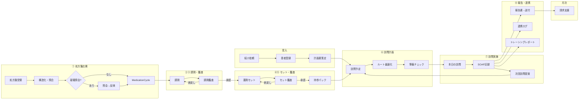

# PH-OS Pharmacy — Implementation Plan

> 仕様書: [ワークフロー](docs/ph-os_pharmacy_workflow_spec_project_context.md) | [多職種連携](docs/ph-os_pharmacy_multidisciplinary_collaboration_spec_project_context.md) | [設計判断](docs/decisions.md)
> アーキテクチャ / デザイン方針: CLAUDE.md 参照
> ※ Phase 3 は Phase 2 完了時に詳細化する

### 明示的な非ゴール（既存レセコン/薬局システムの責務）

- フル在庫管理（発注・仕入・棚卸し・在庫評価）→ PH-OSは在庫医薬品マスタ（採用薬フラグ+引当フラグ）の薄い層のみ
- 麻薬管理帳簿・毒薬劇薬受払い簿 → レセコンが法定帳票を担う
- 領収書・調剤報酬明細書の発行 → レセコンの中核機能（二重入力回避）
- 会計・一部負担金の収納管理 → レセコン/会計システム
- POS・仕入・発注 → 在庫管理専用システム

### 実装優先原則（今回レビュー反映）

- MVPは「訪問日次運用 + 報告送付 + 最低限の処方差分/持参判定」を最優先にし、重いマスタ/処方安全チェック/請求自動化は後段に寄せる
- `MedicationCycle` は「処方起点の1運用サイクル」を維持する。MVPでも訪問予定は処方差分・持参可否・未解決課題と切り離さない
- PH-OS / レセコン / 電子薬歴 / 在宅支援システムの責任分界を先に固定し、二重入力を避ける
- 公開情報ベースの市場比較では、既存製品は「訪問記録・計画書/報告書作成・FAX/メール送付・現場共有」に強い。初期価値は最適化機能より、現場記録/連携/持参漏れ防止に置く

### 外部システム比較から採る方針

- 調剤レセコン系: 在宅スケジュール/介護請求入力まで持つ製品があるが、PH-OSでは請求エンジン全面置換はしない
- 電子薬歴系: タブレット記録、写真、訪問報告書・計画書作成はベースライン機能として扱う
- ふぁむけあ系: 報告書作成、FAX/メール送信予約、トレーシングレポート、店舗間共有は MVP の参照ベンチマークとする
- シジダス系: 一包化委受託/外部委託オペレーションは Phase 2+ の連携拡張テーマとして扱う

## ワークフロー全体像（8工程）

| #   | 工程名         | 英語キー            | 主担当         | 入力                                | 出力                           |
| --- | -------------- | ------------------- | -------------- | ----------------------------------- | ------------------------------ |
| 1   | **処方箋応需** | prescription_intake | 受付/事務      | 処方箋（紙/FAX/電子/施設/リフィル） | 構造化明細、MedicationCycle    |
| 2   | **調剤**       | dispensing          | 調剤担当薬剤師 | 処方明細 + 在庫確認                 | 調剤実績、差異記録、持参候補   |
| 3   | **調剤鑑査**   | dispense_audit      | 鑑査担当薬剤師 | 処方原本 + 調剤実績                 | 承認/差戻し + 処方安全アラート |
| 4   | **薬剤セット** | medication_set      | セット担当     | 鑑査済み薬剤                        | セット構成、持参パック         |
| 5   | **セット鑑査** | set_audit           | 鑑査担当       | セット実績                          | 承認/部分承認/差戻し           |
| 6   | **訪問計画**   | visit_planning      | 事務/薬剤師    | 持参確定品 + 患者スケジュール       | 訪問予定、ルート、準備チェック |
| 7   | **訪問実施**   | visit_execution     | 訪問担当薬剤師 | 訪問予定 + 持参薬 + 前回課題        | SOAP記録、残薬、課題、介入     |
| 8   | **報告・連携** | reporting           | 薬剤師/事務    | 訪問記録                            | 報告書送付、送達追跡、連携ログ |



---

## 直近トラック: デザイン忠実実装 + バックエンド補完(design/ v1.9 → new) `cc:完了`
<!-- 2026-06-14: 新14画面(Phase1-4)完了 + D-3〜D-9 残ギャップ23件を wave2/design-fidelity-residual で実装完了(unit 6356 green)。残 blocked は D-8-3 音声STT(外部依存)のみ。migration 適用と main マージは人手判断待ち。 -->

> 開始: 2026-06-11
> **ターゲット更新(2026-06-11 夜)**: `design/images/new/` の 14 枚(01_dashboard〜14_settings、1600x1000)が最優先ターゲット。旧 P0/P1 は new でカバーされない画面の補助参照。
> 新デザインの主な進化: セーフティボード(赤帯・常時表示)、RX-YYYY-NNNN 番号、サイドバーに「カード/患者一覧/ハンドオフ」+件数バッジ+グループ見出し、上部バーに常設検索+「同期済み HH:MM」+モードドロップダウン、工程チップ(取込/入力/判断/調剤/監査/セット/訪問/報告)、「直近の動き」フィード、チームの会話
> 体制(2026-06-11 確定): **サブエージェント(すべて Fable、model 指定なし)が実装を担当し、Fable 本体は品質確認(撮影→視覚比較→合否判定→差し戻し)に専念**(推論コスト最適化)。仕様はファイル参照(docs/design-gap-analysis-new.md)で受け渡す
> SSOT: `docs/design-fidelity-mapping.md`(進捗) / `docs/design-gap-analysis.md`(旧 62 画面分析) / `docs/design-gap-analysis-new.md`(新 14 画面読解: シェル仕様+カード概念+共通パターン 12 種+移行計画)

### 新 14 画面の完了済み基盤(2026-06-11)

- [x] 読解: workflow `new-design-analysis` 完了 → `docs/design-gap-analysis-new.md` / `.json`。全 14 画面 effort=L。要点: カード=1 RX(処方サイクル)の作業台、9 工程(取込/入力/判断/調剤/監査/セット/訪問/報告/算定)、サイドバー 6 グループ(今日/患者/工程/連携/管理)+監査・ハンドオフ件数バッジ
- [x] 旧 p0_05/06 + バックエンド: workflow `d23-search-and-backend` 完了 → /search + 詳しく絞り込むモーダル(p0_06 撮影比較 **合格**、p0_05 は構成一致・結果待ち setup 修正済み・再撮影は次バッチ)、GET /api/me/sites + PUT /api/me/site(監査ログ)+ GET/PATCH /api/me/preferences + ui-store workMode/careMode + app-header careMode 連動。tsc clean / 128 テスト green を本体検証済み
- [x] 撮影基盤: `design-screen-map.ts` に new_01〜new_14 登録、ベースライン 14 枚撮影済み

- [x] Phase 1(シェル+共通部品): workflow `new-design-phase1-shell` 完了、**本体撮影比較で合格**(2026-06-12)
  - シェル 12 ファイル: サイドバー 5 グループ(今日/患者/工程/連携/管理。doc の「6」は off-by-one)+ exact/excludeExact による患者一覧/カードのアクティブ分離 + use-nav-badges(監査=/api/dispense-audits、ハンドオフ=/api/handoff-board、60s、エラー時非表示)+ app-header(モード▼ DropdownMenu→PATCH /api/me/preferences、常設検索+"/" ショートカット、同期済み HH:MM=offline-store.lastSyncedAt/オフライン橙)
  - 共通部品 13 ファイル: safety-board(タグ色: 麻薬=赤/冷所=ティール/一包化=青)/ process-chips(ProcessChips+ProcessProgressDots、PROCESS_STEPS_9: dispensed・audit_pending=監査「いまここ」、reported=算定)/ action-rail 拡張(「根拠・記録」、BlockedReason categoryLabel・ageLabel・actionLabel/Href、EvidencePanel meta・openLabel — 全 optional 後方互換)/ rx-number('rx_year'=RX-YYYY-NNNN 追加、既定は既存互換)
  - 検証: tsc/eslint green、layout 79 + workspace/prescription/search 90 テスト green(エージェント報告)+ 本体で tsc 再確認・new_01/new_06 撮影比較
- 運用メモ(2026-06-12): ローカル PostgreSQL(5433)が停止していた場合、tmux 下では brew services 不可 → `pg_ctl -D /opt/homebrew/var/postgresql@18 -l /opt/homebrew/var/log/postgresql@18.log start` で直接起動。dev サーバーは大量ファイル変更後に webpack chunk timeout を起こすことがある → 再起動で解消

- [x] Phase 2a(seed + 06_card + 01_dashboard): workflow `new-design-phase2a` 完了、**本体撮影比較で両画面とも合格**(2026-06-12)
  - seed: 処方 4 行(RX-2026-0500、オキシコドン麻薬/インスリン冷所)、アレルギー(セフェム系・発疹 2019)、eGFR 38、ふらつき注意、監査キュー 6(=サイドバーバッジ)、ハンドオフ 3、当日 14:00 訪問、直近の動き(調剤完了/残薬調整疑義照会)。intakeCurrent は RX 表示用に ID 改番(末尾 0500)+旧 ID 掃除
  - 06_card: `card-workspace.tsx` 新設(/patients/[id] 既定ビュー)。?view=profile / 旧 ?tab= で旧タブ温存。buildPatientWorkspace 拡張(safety/prescription_lines/recent_activities/today_tasks)。本体追修正: 監査期限フィルタに completed 追加、アレルギーラベル reaction 対応、止まっている理由を新文言(ご家族の同意待ち=患者・1日/送付先の確認=事務・30分+個別アクション)
  - 01_dashboard: `/api/dashboard/cockpit` 新 API + `dashboard-cockpit.tsx`(条件バナー/今すぐ対応/今日の流れ/工程の今/右レール)。旧セクションは下部温存
  - 既知の残課題: E2E 旧スペック(ui-detail-layout / ui-major-screens / ui-audit-extensions)が patient-detail-tablist を既定ルートで参照 → ?view=profile への追随が必要(Phase 2b 後に一括)

- [x] Phase 2b(残り 12 画面): workflow `new-design-phase2b` 完了(Fable 6 体・78 ファイル)、**本体撮影比較で全 14 画面の構成合格**(2026-06-12)
  - 02 患者一覧(/api/patients/board BFF + patients-board)/ 03 スケジュール(全員タイムライン+余白)/ 04 訪問(準備チェック+繰り下げ注記+オフライン注記)/ 05 取込(**新ルート /prescriptions/intake**。旧 /prescriptions/new は「手動で取り込む」から到達)/ 07 調剤(3 ペイン+割り込み防護+中断理由)/ 08 監査(キュー選択→麻薬監査+計数テーブル+合格・差戻し二択。/api/dispense-tasks/[id]/workbench 新 BFF、double_count 監査ログ)/ 09 セット(物理画面+レーン)/ 10 報告・共有 / 11 算定チェック / 12 ハンドオフ(渡した・来た+3点セット)/ 13 マスター(5 マスター+鮮度)/ 14 設定(安全ロック+働き方+/api/settings/operational-policy)
  - 本体追修正: screen-map(new_05 ルート、new_08 キュー選択+描画待ち setup)、navigation-config(処方取込→/prescriptions/intake、カードの excludePrefixes)+テスト追随、operational-policy route の非ハンドラ export 解消、rate-limit カタログへ新 API 11 ルート登録
  - 最終検証(本体): tsc clean / 全体 vitest 5850 中 5839+rate-limit 修正分 green。残 10 失敗(secrets / websocket lambdas / room-token / phos observability)は AWS SDK 内部フィールド比較の既存事象で今回の変更と無関係
  - 旧 UI は全画面でビューポート下部 or 旧ルートに機能温存
  - 既知の意図的差分(共有部品仕様): 止まっている理由見出しの赤丸件数バッジ非対応 / SafetyBoard サブタイトル常時表示 / EvidencePanel の「開く」はアウトラインボタン
- [x] Phase 3(残課題): workflow `new-design-phase3` 完了 + 本体品質確認(2026-06-12)`cc:完了`
  - seed 拡充: 追加患者 12 名(佐々木ハル/伊藤キヨ/施設グリーンヒル入居 3 名ほか)+ 第 2 ユーザー「佐藤 恵」(seed.ts)+ 調剤中タスク/調剤実績(二人制バナー成立)/施設セット(SetPlan・SetBatch・SetAudit)/取込 5 件/報告下書き・返信待ち。db:e2e:seed 2 回実行で冪等確認(35 テーブルでカウント一致)
  - @db.Date 境界統一: `src/lib/utils/date-boundary.ts` 新設(localDateKey/utcDateFromLocalKey/todayUtcRange、JST 固定テスト 11 件)+ API/services/jobs 36 ファイルを置換。api 全 296 ファイル 2457 テスト green
  - E2E 追随: 4 スペック 16 テスト(?view=profile / card-workspace testid 振り分け)+ 本体で ui-dashboard-nav を新ナビ仕様(5 グループ・カードのアクティブ・パンくず廃止・コックピット遷移)へ全面書き換え → 9/9 green
  - 本体最終撮影比較(データ入り): 02(12 名分布+チップ件数)/ 07(いまの 1 件: セーフティボード+処方比較・減量/照会回答ハイライト+チェックリスト — setup にキュー選択追加)/ 08(二人制バナー: 調剤 佐藤 09:30+計数列)/ 09(施設グリーンヒル+レーン+居室テーブル+工程待ち 2 件)→ **最終合格**。残り画面も全数再撮影済み(構成合格+データ投入済み)
  - 新規残課題(Phase 4 候補): xl 境界 1280px でコックピット条件バナー/プロフィール受付票が不可視・潰れる(レスポンシブ調整)。FacilityVisitBatch.patient_ids のダミー 9 件(旧 UI で名前解決時 3 名のみ表示)。11_billing の BillingEvidence/Candidate デモデータ。ui-patient-flow の mobile-chromium 既存赤(患者一覧 tbody リンクがモバイル hidden)
- [x] コミット: トラック一式を main へ 5 分割コミット(2026-06-12)`cc:完了`
  - 001d39f docs(design assets+調査)/ 0047aa3 prisma(seed+migrations)/ cb9cdd9 backend(BFF+me API+date-boundary)/ 1c1815d frontend(シェル+14 画面)/ 22b8c7c tests(撮影ループ+E2E 追随)。作業ツリー clean
- [x] Phase 4: workflow `new-design-phase4` 完了 + 本体撮影判定合格(2026-06-12)`cc:完了`
  - レスポンシブ: 条件バナーの 1280px 問題の真因は viewport 分岐ではなく cold-compile flake(実測で DOM 可視確認)→ テストを 1280 検証へ戻し待ち時間拡大。cockpit 2 カラムを lg〜、患者詳細右レールを 2xl〜(xl 帯の受付票 dd 圧潰解消、1280=112px/1600=120px 実測)。モバイルは縦積みで情報を隠さない
  - ui-patient-flow: patients-board カード起点(patient-board-card-link)へ書き換え、mobile-chromium 18/18(修正前 10 failed)。副次で hydration mismatch flake 2 件根治(suppressHydrationWarning)+性別 Select の aria-label 追加
  - seed: BillingEvidence 3 件+疑義 BillingCandidate 1 件+BillingRule → /api/billing-evidence/check 実測 KPI(合格3/疑義1/本日候補5)。グリーンヒル入居 9 名追加で patient_ids 12 名全実在化(患者総数 28)。冪等 2 回確認
  - 本体判定: new_11(KPI 3 枠+疑義行+右レール)合格、new_01/new_06 回帰なし(1600 で右レール維持)
  - 残メモ: 患者詳細ミニカードが md 未満で hidden(モバイル情報非表示)— 別タスク候補。10_report の田中行 patient_label が電話番号表示(既存データ事象)
- [x] リファクタ指示書: `refactor-instructions.md` 作成+多角調査で増補(2026-06-12)`cc:完了`
  - Debt Map D1〜D15(認可二重系統/監査インライン 54/日付残存 13/死コード/AWS モック脆弱テスト/ラベル分散/肥大 8 ファイル/新旧並立/FileAsset/schema 3 件/レスポンス封筒/env 118 キー/fire-and-forget 77/型境界/ログ方針)
  - Appendix Q1〜Q6 に実測ベースの推奨回答付与(Q2=9 工程置換・Q3=受付済系統一は承認後 Phase 5 で実装可)。実測済みの強み(response ヘルパー 290/any 1 件/ジョブロック等)を「直さない」対象として明記
  - seed 拡充(エージェント notes 集約): 02=患者 12 名分布(佐々木ハル inquiry_resolved・鈴木新規・伊藤キヨ 10:30 訪問・施設グリーンヒル 12 名ほか)+ 各患者の安全タグ/eGFR、04=VisitPreparation(4/4)+施設バッチ+車両、05=取込 5 件+元 FAX 画像+QrScanDraft、07=調剤中(pending)タスク 1 件、08=調剤実績(計数・調剤者 佐藤=第 2 ユーザー要)、09=施設グリーンヒル SetPlan/SetBatch/レーン件数、10=報告下書き・返信待ち
  - @db.Date 当日境界の不統一: visit-schedule-service は UTC 日付キー、/api/visit-schedules/today・cockpit はローカル深夜 → JST で当日取りこぼしの恐れ(02-04 エージェント実測)。統一リファクタ要
  - E2E 旧スペック追随: ui-detail-layout / ui-major-screens / ui-audit-extensions が patient-detail-tablist を既定ルートで参照 → ?view=profile 化
  - 旧ターゲット p0_05 の再撮影(結果待ち setup 修正済み・未確認)

### 進行中 workflow

- なし(Phase 3 編成待ち)

### 検証ループ(全画面タスク共通の完了条件)

各画面は以下のループを回し、忠実度 OK になるまで完了にしない:

1. 実装(既存実装を活かしてデザインへ寄せる)
2. 撮影: `DESIGN_SCREEN_IDS=<id> pnpm test:e2e:local -- ui-design-fidelity`(viewport 1600x1000、出力 `tools/tests/.artifacts/design-fidelity/<id>.actual.png`)
3. 比較: actual と `design/images/**/<id>.png` を並べ、レイアウト・グルーピング・文言・状態色・右パネル構成の差分を列挙
4. 修正 → 再撮影(差分解消まで反復)
5. lint / unit test green を確認

比較の判断基準: ターゲット PNG は「一瞬の静止画」。スクロール・カンバン移動・タブ切替は動く前提で構築し、ビューポート外の続きは差分にしない(詳細は `docs/design-fidelity-mapping.md` の静止画原則)。実装方針に迷いが生じたらサブエージェントを多角展開して検討する。

### D-1. 基盤: 検証ループ + シェル/テーマ + 共通部品 `cc:完了` (2026-06-12 全サブタスク完了)

- [x] D-1-1: 検証ループ基盤(`tools/tests/helpers/design-screen-map.ts` + `tools/tests/ui-design-fidelity.spec.ts`、62 画面マッピング・capture-report.json 出力) `cc:完了` (2026-06-11)
- [x] D-1-2: シェル改修 — ダークネイビーサイドバー(PH-OS ロゴ + 在宅薬局オペレーション、下部ユーザー表示)+ 上部バー(モードバッジ/通知/ヘルプ/ユーザー名) `cc:完了` (2026-06-11)
  - `src/app/globals.css`(sidebar トークンをダークネイビー化)
  - `src/components/layout/sidebar.tsx` / `src/components/layout/app-header.tsx`
  - 検証: p0_07 撮影比較で反映確認、unit 12 件 green、ESLint clean
- [x] D-1-3: 右パネル共通部品 —「次にやること」(主操作 1 つ)/「止まっている理由」(赤・橙)/「根拠・資料」(見るリンク) `cc:完了` (2026-06-11)
  - `src/components/features/workspace/action-rail.tsx`(NextActionPanel / BlockedReasonsPanel / EvidencePanel / WorkspaceActionRail)
  - unit 8 件 green。画面への組み込みは D-2 以降で実施
- [x] D-1-4: 文言ルール横断反映(ブロッカー→止まっている理由 系) `cc:完了` (2026-06-11)
  - 16 ファイル一括置換(src/phos は本体未使用の独立試作のため対象外)。複合語は自然な日本語へ(算定ブロッカー→算定を止めている理由、請求根拠ブロッカー→請求根拠の不足 等)
  - 影響範囲 852 テスト green(collaboration-room-token の 2 失敗は AWS 環境依存の既存事象・無関係)
- [x] D-1-6: 62 画面ギャップ並列調査(9 エージェント)→ `docs/design-gap-analysis.md` / `.json` に永続化 `cc:完了` (2026-06-11)
  - 画面別: kind/effort/UI ギャップ/バックエンド不足/データ源/撮影セットアップ(60 画面分)
  - 横断 70 ノート + バックエンド 7 領域(オフライン同期 / サイト切替 / モード保持 / SavedView / 認可・監査標準形 / workflow-exceptions projection / ヒヤリハット・音声)
- [x] D-1-5: デモシナリオ seed 整備(検証ループ前提・全 D フェーズ共通) `cc:完了` (2026-06-11)
  - `prisma/seed-design-demo.ts` 新規(seed.ts 末尾から呼出、冪等 upsert): 田中一郎(84歳/男性/自宅)+ セット監査待ちサイクル + 処方差分(トラセミド追加/アムロジピン中止)+ SetPlan(お薬カレンダー・一包化・別包)+ 確定済み訪問予定/次回訪問 + WorkflowException 2 件 + 未読通知 6 件
  - 注意: `@db.Date` カラムは UTC midnight に正規化して渡す(JST midnight だと 1 日ズレる)

### D-2. 中核画面(通知 04 / 検索 05・06 / ダッシュボード 07 / カード詳細 08) `cc:完了` (2026-06-12 p0_05 再撮影確認で全サブタスク完了)

> 設計判断(2026-06-11 調査確定):
> - p0_08 は `/patients/[id]` 改修(3 カラム骨格・PatientWorkspaceRail・visit_brief 配線が既存。/workflow は org 横断管制塔で責務外)。p0_38 着手時に `/patients/[id]/today` 分割を再判断
> - 通知 5 分類(急ぎ/薬剤師確認/事務で対応/返信待ち/未同期)は enum 拡張せず表示時マッピング(type/event_type/metadata から派生)。「未同期」は offline-store からのクライアント合成行
> - 全体検索は `/search` ページ新設(デザインはページ風全幅)。既存 global-search-modal のロジックを流用し Cmd+K は /search へ。p0_06「詳しく絞り込む」は /search 上のモーダル
> - 共通部品: ListOpenCard(バッジ+タイトル+サブ文+「開く」)と FilterChipBar(青選択チップ)を p0_04/05 で共用

- [x] D-2-1: p0_07 ダッシュボード カードグリッド(集計バッジ行 + 患者カード最上部化 + ヘッダー主操作 2 ボタン) `cc:完了` (2026-06-11)
  - `dashboard-summary-badges.tsx` 新規(/api/dashboard/today、ラッパー無し JSON に両対応)
  - `dashboard-content.tsx` 組み替え(患者グリッドを今日の運用の先頭へ、請求 KPI を補助へ)
  - `workflow-page-header.tsx` に actions[](先頭のみ primary)
  - 残: カード内の主操作 1 つへの絞り込みは p0_08(D-2-2)と合わせて調整
- [x] D-2-2: p0_08 カード詳細ワークスペース(右パネル 3 点セットの基準実装、`/patients/[id]` 改修) `cc:完了` (2026-06-11)
  - シェル共通改修も同時実施: `navigation-config.ts` をデザインのフラット 14 項目へ(患者/ワークフロー/通知等は activePrefixes でダッシュボード項目に包含)、`app-header.tsx` をモードバッジ+「通知 N」+ヘルプ+ユーザー2行表示へ、`notification-bell.tsx` を「通知 N」テキストトリガー化(stream 無効時も初回 fetch)
  - バックエンド: `patient-detail.ts` に `buildPatientWorkspace`(進行中サイクル: overall_status / open WorkflowException / 処方の変化(用法・日数付き、detectMedicationChanges 流用)/ 前回・今回服用期間 / SetPlan+加工 / 処方せん画像 URL)を追加し overview に同梱。`visit_schedules` select に time_window_start / confirmed_at 追加
  - フロント: タブ再編(薬剤師メモ(既定)/工程/処方・監査/セット/訪問/報告/履歴。basic/cases/documents は ?tab= 直アクセスに退避)、`pharmacist-memo-tab.tsx`(今日の見どころ/処方の変化テーブル/セットの注意)、`process-tab.tsx`(8 工程ストリップ+現在工程)、左ミニカード(予定+正式決定/前回薬/今回薬/次回訪問/現在工程+カードを編集/一覧へ戻る)、`cycle-workspace.ts`(16 ステータス→状態表示+次アクション)、右レール工程駆動化(xl〜表示)
  - 検証: 撮影比較 3 周(ヘッダー除去→日付 UTC 修正→通知バッジ表示)で忠実度 OK。tsc / ESLint clean、patients/[id] 41 + layout 47 テスト green
  - 残(次フェーズ送り): 「今日の見どころ」の文言品質(visit_brief ルール生成文の人間味)は p1_03 AI まとめレビューで扱う。タブ「セット」の中身は現状 medications 内容(SetPlan 詳細ビューは D-3 セット工程と合わせて精査)
- [x] D-2-3a: p0_04 お知らせ一覧 `cc:完了` (2026-06-11)
  - 共通部品新設: `filter-chip-bar.tsx`(青選択チップ)/ `list-open-card.tsx`(バッジ+タイトル+サブ文+「開く」)— p0_05 でも再利用
  - `notification-category.ts`: 5 分類(急ぎ/薬剤師確認/事務で対応/返信待ち/未同期)を type/event_type から表示時マッピング(enum 拡張なし)。system は「すべて」のみ。「未同期」は offline-store の pendingSyncCount から合成
  - `notifications-content.tsx` 全面改修(見出し「お知らせ」、未読優先+重要度ソート、開く=既読化+遷移、全て既読)。`?type=` 旧リンクは category へ互換マッピング
  - 検証: 撮影比較 2 周で忠実度 OK。unit 11 件 green
- [x] D-2-3b: p0_05 全体検索(/search ページ)/ p0_06 詳しく絞り込む `cc:完了` (2026-06-12 p0_05 warm 再撮影で結果カード表示を確認・合格。連続撮影時の「検索中...」は撮影 flake でコード起因ではない)
  - 体制(2026-06-11〜): Workflow で Opus=設計 / Sonnet=実装 / Fable=オーケストレーション+撮影検証
  - 実行中: workflow `d23-search-and-backend`(検索系フロント + D-9 先行の me/sites・me/site・me/preferences API + ui-store workMode/careMode)

> **D-3〜D-9 残ギャップ実装(2026-06-14)** `cc:完了`(ブランチ `wave2/design-fidelity-residual`、6コミット、unit 6356 green / typecheck / lint clean)
> 8トラック並列調査で「新14画面実装後の真の残ギャップ」を確定 → 実装可能 **23 件**を5バッチ並列実装 + 4次元レビュー(敵対的検証)→ HIGH 3件修正。
> 旧 p0_XX の大半は新14画面で**既カバー**(p0_09/10/12/13/14 調剤=new_05/07/08/09、p0_16/22/23 訪問=new_03/04、p0_25/31 連携、p0_38/39-45/47/48 マスタ=new_13/14、p0_01/02/03/32-37 認証・安全)のため除外。
> **マイグレーション未適用**: `prisma/migrations/20260614120000_wave2_design_fidelity_contract` はローカルDB起動不可のため未適用。デプロイ前に `pnpm db:migrate`(`prisma migrate deploy`)で適用要(unit はモックのため不要)。
> **未マージ**: main へのマージは人手判断待ち。

### D-3. 調剤フロー(処方 09-11 / 調剤・監査 12-13 / セット 14-15) `cc:完了`
- [x] p0_11 処方の変化を確認 専用差分レビュー画面(medication-diff に用法/日数追加) `cc:完了`
- [x] p0_15 セット監査 3ペイン再構築(写真確認 + 6項目チェックリスト + set-photo基盤、サーバ側チェックリスト強制) `cc:完了`
- (p0_09/10/12/13/14 は new_05/07/08/09 で既カバー)

### D-4. 訪問フロー(スケジュール 16-21 / 訪問モード 22-24) `cc:完了`
- [x] p0_17 正式決定フロー忠実化 / p0_18 予定作成・編集ドロワー(下書き/確認待ち) / p0_19 重なり解消+車両競合検知 / p0_20 緊急ルート再計算(locked多シナリオ) / p0_21 ルート最適化詳細+守る条件 / p0_24 施設パケット構造化 `cc:完了`
- (p0_16 全員ガント=new_03、p0_22/23 訪問モード既カバー)

### D-5. 連携・請求(25-31) `cc:完了`
- [x] p0_26 送付先編集フォーム+書込API / p0_27 薬剤師相談・事務戻し解決フロー / p0_28 報告書コンポーザー(複数共有先+送付前チェック+一括送付) / p0_29 返信待ち2ペイン `cc:完了`
- (p0_25 事務サポート / p0_31 残薬調整は既存実装で充足)

### D-6. 安全・オフライン・認証(32-37, 01-03) `cc:完了`
- [x] D-6-1/2/3: 4ルート(select-site/select-mode/safety-check/offline-sync)は実装済→**シェル導線整備**で到達可能化 + 空 /issues 削除。p0_01/34/35/36/37 は既カバー `cc:完了`

### D-7. マスタ・設定(38-45, 47-48) `cc:完了`
- [x] 車両点検期限の専用カラム化(notes正規表現解消) / capacity ナビ導線追加。マスタCRUD・設定は new_13/14 で既カバー `cc:完了`

### D-8. P1 画面(p1_01〜p1_14) `cc:完了`(D-8-3 のみ blocked)
- [x] D-8-1: p1_01 保存ビュー(SavedView モデル + CRUD API + 名前付きビュー) `cc:完了`
- [x] D-8-2: p1_09 ヒヤリハット管理(IncidentReport は既実装) `cc:完了`
- [ ] D-8-3: p1_11 音声メモ・文字起こし(STT=AWS Transcribe/外部creds必須) `cc:blocked`
- [x] D-8-4: その他 P1 画面(voice-memo 等は既実装、残りは新14画面で充足) `cc:完了`

### D-9. バックエンド補完(横断) `cc:完了`
- [x] D-9-1: dispense PATCH 権限ゲート+監査 / 監査ルートテスト / claims-XML送信の監査追加(レビュー修正) `cc:完了`
- [x] D-9-2: オフライン競合検出は既実装で充足(視点確認済) `cc:完了`
- [x] D-9-3: 「止まっている理由」projection を共有ライブラリ化(blocked-reason-projection)し4ルートで再利用 `cc:完了`

---

## 直近トラック: 訪問支援・処方/調剤・共有要約 `cc:完了`
<details>
<summary>完了済み詳細 — クリックで展開</summary>

> 最終更新: 2026-03-27 19:27 JST
> 目的: 薬局薬剤師の訪問薬剤管理指導に必要な「訪問前の要点」「処方履歴差分」「調剤方法」「多職種共有」を、患者詳細・訪問準備・外部共有で一貫して確認できる状態まで引き上げる。

### 直近で完了済みの範囲

- [x] 訪問支援ボード / 患者サマリー / 日次 task 同期 `cc:完了` (2026-03-27)
  - `src/server/services/home-care-ops.ts`
  - `src/server/jobs/daily.ts`
  - `src/app/(dashboard)/workflow/workflow-dashboard-content.tsx`
  - `src/app/(dashboard)/patients/[id]/patient-detail-tabs.tsx`
  - `src/app/(dashboard)/schedules/day-view.tsx`
- [x] visit-brief 集約サービス + AI短文化フォールバック `cc:完了` (2026-03-27)
  - `src/server/services/visit-brief.ts`
  - `src/server/services/visit-brief-ai.ts`
  - `src/types/visit-brief.ts`
  - `src/components/visit-brief/visit-brief-card.tsx`
- [x] 患者 API / 訪問準備 API / 専用 brief endpoint 整備 `cc:完了` (2026-03-27)
  - `src/app/api/patients/[id]/route.ts`
  - `src/app/api/patients/[id]/visit-brief/route.ts`
  - `src/app/api/visit-preparations/[scheduleId]/route.ts`
  - `src/app/api/visit-preparations/[scheduleId]/brief/route.ts`
- [x] 服薬管理画面の見やすい薬剤一覧 + サマリー `cc:完了` (2026-03-27)
  - `src/app/(dashboard)/patients/[id]/medications/medications-content.tsx`
  - `src/app/(dashboard)/patients/[id]/medications/page.tsx`
- [x] 処方履歴の差分ダッシュボード + 調剤方法ワンビュー `cc:完了` (2026-03-27)
  - `src/app/(dashboard)/patients/[id]/prescriptions/prescription-history-content.tsx`
  - `src/app/(dashboard)/patients/[id]/prescriptions/page.tsx`
- [x] 外部共有ポータルの共有サマリー `cc:完了` (2026-03-27)
  - `src/server/services/external-access.ts`
  - `src/app/shared/[token]/shared-viewer-content.tsx`

### 残タスク一覧（優先度順）

- [x] VB-01: 多職種共有サマリーの送達管理 `cc:完了`
  - 目的: 「共有内容を作る」だけでなく、「誰に送ったか・確認されたか・返信待ちか」を追えるようにする。
  - 2026-03-27 進捗:
    - `communication-queue` を親サービスとして `visit-brief` / 患者詳細 / workflow / 訪問準備へ送達 timeline を接続
    - 未確認 / 返信待ち / 失敗 の内訳、緊急連絡ドラフト候補、共有タイムライン表示を追加
    - workflow に未確認 / 返信待ちの aggregate workbench を追加し、通信依頼画面から draft / sent / received / closed の運用更新を可能化
  - 実装方針:
    - `communication-queue` を通信オペレーションの親サービスに固定する
    - `visit-brief` には送達状況の短い projection のみ返し、通信状態の再集約はしない
  - 実装内容:
    - `CommunicationRequest` / `DeliveryRecord` / `CommunicationEvent` を束ねた送達ステータス集約を追加
    - 患者詳細と workflow に「未確認」「返信待ち」「失敗」の 3 区分を表示
    - 共有済み報告書と tracing report を同じ timeline で見られるようにする
  - 関連ファイル:
    - `src/server/services/communication-queue.ts`
    - `src/server/services/visit-brief.ts`
    - `src/app/api/dashboard/workflow/route.ts`
    - `src/app/(dashboard)/workflow/workflow-dashboard-content.tsx`
  - DoD:
    - 共有依頼ごとに delivery status が確認できる
    - 未確認/返信待ちが task として workflow に上がる
    - `visit-brief` 側に通信状態の重複ロジックを追加しない

- [x] VB-02: 疑義照会ワークベンチの実務化 `cc:完了`
  - 目的: 抽出した疑義照会候補を、その場で照会文面・回答・処方反映まで繋げる。
  - 実装方針:
    - 通信の優先度・期限・アクションは `communication-queue` を親にする
    - `visit-brief` は患者/訪問画面での抜粋表示に限定し、疑義照会の進行管理は workflow 側で行う
  - 実装内容:
    - `MedicationIssue` と `InquiryRecord` の対応付け
    - 照会ドラフト生成、回答待ち、回答済み、反映済みの状態遷移
    - `communication-queue` / 訪問支援ボード / visit-brief からワンクリックで開ける導線
  - 関連ファイル:
    - `src/server/services/communication-queue.ts`
    - `src/server/services/home-care-ops.ts`
    - `src/server/services/visit-brief.ts`
    - `src/app/api/dashboard/workflow/route.ts`
  - DoD:
    - 疑義照会候補から `InquiryRecord` が起票できる
    - 回答待ち/未反映が明確に残る
    - workflow と visit-brief の照会状態が同じ基準で表示される

- [x] VB-03: リフィル自動再訪のスケジュール提案化 `cc:完了`
  - 目的: 候補表示で終わらせず、再訪日案と担当薬剤師案まで出す。
  - 実装内容:
    - `refill_upcoming` / 服用終了日 / visit_deadline_date を使った再訪候補生成
    - 既存 `visit-schedule-planner` が返す proposal draft をそのまま使い、`visit_schedule_proposals` に流し込む
    - workflow から既存 proposal pipeline を起動できるようにする
  - 関連ファイル:
    - `src/server/services/visit-schedule-planner.ts`
    - `src/app/api/visit-schedule-proposals/route.ts`
    - `src/server/services/home-care-ops.ts`
    - `src/app/api/dashboard/workflow/route.ts`
  - DoD:
    - リフィル対象患者に対して再訪候補日が提示される
    - そのまま既存 proposal として保存・承認フローへ進める

- [x] VB-04: 算定ブロッカーの解消導線 `cc:完了`
  - 目的: 「請求不可の警告」を見るだけでなく、どの根拠が不足しているかを埋められるようにする。
  - 実装方針:
    - `BillingEvidence` を算定ブロッカー判定の唯一の SSOT に固定する
    - `visit-brief` / `visit-preparations` / workflow は `BillingEvidence` の projection だけを表示し、画面側で再判定しない
  - 実装内容:
    - `BillingEvidence` の不足項目を構造化し、患者/訪問/請求向け projection を返す
    - 同意未取得・計画書未更新・送達未完了・記録未入力を action link 付きで表示
    - 既存の task upsert / resolve と接続して block 解消後に task が自動クローズする同期を追加
  - 関連ファイル:
    - `src/server/services/billing-evidence.ts`
    - `src/server/services/visit-brief.ts`
    - `src/app/api/visit-preparations/[scheduleId]/route.ts`
    - `src/server/jobs/daily.ts`
  - DoD:
    - ブロッカーごとに解消先が明示される
    - 解消後に workflow の警告数が減る
    - 患者詳細 / 訪問準備 / 請求画面で同じ blocker 理由が表示される

- [x] VB-05: 家族・施設セルフ報告の履歴化 `cc:完了`
  - 目的: 送信した自己申告を単発入力で終わらせず、時系列比較と対応状況確認まで繋げる。
  - 実装内容:
    - 既存 `patient-self-reports` API を使い、外部共有 token 単位ではなく患者単位で self report 履歴を一覧化
    - category / callback / triage 結果でフィルタ
    - 対応済み・未対応・task 化済みのステータスを付与
  - 関連ファイル:
    - `src/app/api/patient-self-reports/route.ts`
    - `src/app/api/external-access/[token]/self-report/route.ts`
    - `src/app/shared/[token]/shared-viewer-content.tsx`
    - `src/server/services/visit-brief.ts`
  - DoD:
    - 患者詳細または外部共有から過去報告が確認できる
    - 対応漏れが再架電 SLA に連動する

- [x] VB-06: 剤形・服用形態支援の提案化 `cc:完了`
  - 目的: 「飲みにくさあり」を見つけるだけでなく、一包化候補・粉砕候補・剤形変更候補を提示する。
  - 実装内容:
    - `dosage_form_support` の evidence を詳細化
    - visit-brief に「剤形変更候補」セクションを追加
    - set plan / medication set 画面から提案理由を確認できるようにする
  - 関連ファイル:
    - `src/server/services/home-care-ops.ts`
    - `src/server/services/visit-brief.ts`
    - `src/app/(dashboard)/medication-sets/full/medication-set-full-content.tsx`
  - DoD:
    - 剤形・一包化・粉砕の候補理由が表示される
    - 不適応警告と候補提案が同時に見える

- [x] VB-07: 緊急連絡テンプレの送信導線 `cc:完了`
  - 目的: 緊急連絡先不足や急変対応を検知したら、そのまま連絡文面と送信履歴を扱えるようにする。
  - 2026-03-27 進捗:
    - 医師 / 訪看 / 家族向けの緊急連絡ドラフト候補を `communication-queue` から生成し、患者詳細 / workflow へ表示
    - `CommunicationRequest` に template / recipient / related entity / context snapshot を追加し、緊急ドラフトを標準フォーマットで起票できるようにした
  - 実装内容:
    - 医師/訪看/家族向けの緊急連絡テンプレートキー整備
    - `CommunicationRequest` に template / context の標準化
    - 患者詳細または訪問準備から送信 draft を起票
  - 関連ファイル:
    - `src/server/services/communication-queue.ts`
    - `src/server/services/external-access.ts`
    - `src/app/api/patients/[id]/route.ts`
  - DoD:
    - 緊急連絡候補から draft が作成できる
    - 送信後に communication timeline に残る

- [x] VB-08: 施設一括訪問トラッカー専用UI `cc:完了`
  - 目的: 同一施設患者を日別・施設別にまとめて準備/完了管理する。
  - 実装内容:
    - `FacilityVisitBatch` ベースの一覧 UI
    - 施設ごとの患者、持参物、未準備、未完了をまとめて表示
    - day view から施設単位の drill-down を追加
  - 関連ファイル:
    - `src/server/services/home-care-ops.ts`
    - `src/app/(dashboard)/schedules/day-view.tsx`
    - `src/app/api/dashboard/workflow/route.ts`
  - DoD:
    - 同日同施設の訪問を 1 セクションで追える
    - 施設単位で準備漏れが分かる

- [x] VB-09: 地域資源マップの可視化 UI `cc:完了`
  - 目的: 夜間休日・緊急時に使える地域資源を、拠点・対応体制・空白地帯で見られるようにする。
  - 実装内容:
    - `pharmacy-sites` / shifts / geo 情報の集約 API
    - 管理画面に一覧 + 地域別サマリー表示
    - 夜間休日対応、麻薬、無菌、代行可否のフィルタ
  - 関連ファイル:
    - `src/app/api/pharmacy-sites/route.ts`
    - `src/app/(dashboard)/admin/analytics/*`
    - `src/server/services/home-care-ops.ts`
  - DoD:
    - 拠点別の対応体制と空白日が見える
    - 緊急時プレイブックへ遷移できる

- [x] VB-10a: モバイル訪問モード（軽量閲覧） `cc:完了`
  - 目的: 通信不安定でも、訪問要点と同期状態をすぐ確認できる軽量 UI を用意する。
  - 実装内容:
    - day view / visit brief の軽量表示
    - 重要情報のみ read-only でオフラインキャッシュ
    - pending sync 件数と通信状態を表示
  - 関連ファイル:
    - `src/app/(dashboard)/schedules/day-view.tsx`
    - `src/app/(dashboard)/schedules/day-view.shared.ts`
    - `src/lib/stores/offline-db.ts`
    - `src/lib/stores/sync-engine.ts`
  - DoD:
    - オフライン時でも訪問要点を確認できる
    - 同期待ち件数が分かる

- [x] VB-10b: モバイル訪問モード（訪問記録ドラフト） `cc:完了`
  - 目的: オフライン時でも訪問記録を下書きし、再接続後に再送できるようにする。
  - 実装内容:
    - `OfflineVisitDraft` / `OfflineSyncQueue` を使った visit record draft 保存
    - 既存 sync queue に visit record 再送を接続
    - 記録途中の step 状態と最終更新時刻を表示
  - 関連ファイル:
    - `src/lib/stores/offline-db.ts`
    - `src/lib/stores/sync-engine.ts`
    - `src/app/(dashboard)/schedules/day-view.tsx`
  - DoD:
    - オフラインで訪問記録を保存できる
    - 再接続後に自動または手動で再送できる

- [x] VB-10c: モバイル訪問モード（競合解決） `cc:完了`
  - 目的: 409 conflict 時に、破棄ではなく競合内容を見て手動解決できるようにする。
  - 2026-03-27 進捗:
    - sync engine で 409 conflict 時に queue/draft を破棄せず保持するよう変更
    - サーバー版/ローカル版の差分を day view に表示し、上書き / 破棄 / 再編集を選べるようにした
  - 実装内容:
    - sync engine で 409 時の draft 保持
    - サーバー版とローカル版の差分表示
    - 上書き / 破棄 / 再編集の選択肢を追加
  - 関連ファイル:
    - `src/lib/stores/sync-engine.ts`
    - `src/lib/stores/offline-db.ts`
    - `src/app/(dashboard)/schedules/day-view.tsx`
  - DoD:
    - conflict 時に draft が消えない
    - ユーザーが競合を解決できる

- [x] VB-11: AI要約の運用整備 `cc:完了`
  - 目的: AI短文化を「試験実装」から「運用機能」に引き上げる。
  - 2026-03-27 進捗:
    - provider / model / fallback reason を visit brief に保持し、UI 表示と fallback ログ出力を追加
    - AI / rule 比較表示、24h 失敗率表示、生成監査ログ、要約フィードバック収集 endpoint を追加
  - 実装内容:
    - provider 切替、失敗率監視、要約生成ログ、フィードバック収集
    - rule summary と AI summary の比較表示
    - source refs と生成時刻の監査性強化
  - 関連ファイル:
    - `src/server/services/visit-brief-ai.ts`
    - `src/server/services/visit-brief.ts`
    - `src/components/visit-brief/visit-brief-card.tsx`
  - DoD:
    - AI unavailable 時でも UX が崩れない
    - 要約の品質改善に必要な運用ログが残る

### 推奨実装順

1. VB-01 多職種共有サマリーの送達管理
2. VB-02 疑義照会ワークベンチの実務化
3. VB-03 リフィル自動再訪のスケジュール提案化
4. VB-04 算定ブロッカーの解消導線
5. VB-05 家族・施設セルフ報告の履歴化


</details>
---

## Phase 0: 基盤構築・データ定義 `cc:blocked` <!-- 0-2i PMDA登録 + 0-5 I-04 バックアップ実地 が外部依存でブロック -->

> 実装順は **Phase 0a Core → Phase 1a MVP → Phase 0b Advanced → Phase 1b/2** を原則とする
> 目的: Phase 1a を Phase 0 全量完了で待たせない。現場検証に必要な最小基盤を先に通す

### 0a. Core と 0b. Advanced の分割方針

**Phase 0a Core（Phase 1a 着手条件）:**

- 0-1. プロジェクト初期化
- 0-2a〜0-2d, 0-2f〜0-2h のうち MVP必須テーブル
- 0-3. 認証・権限・RLS基盤
- 0-4. 共通基盤
- 0-5. 監視・バックアップ・ガイドライン準拠のうち MVP必須項目

**Phase 0b Advanced（Phase 1a 後続でよい）:**

- 0-2e. 医薬品マスタ系
- 0-2i. 医薬品マスタ取込パイプライン
- 施設基準管理の高度集計
- 請求候補の高度ルールエンジン

### 0-1. プロジェクト初期化 `cc:完了`
<details>
<summary>完了済み詳細 — クリックで展開</summary>


> DoD: `pnpm dev` 起動、`pnpm build` 成功、CI green、AWS全サービス接続確認

- [x] Next.js 16 + TypeScript 6 + React 19, pnpm, ESLint 10, Prettier 3, Tailwind CSS 4 + shadcn/ui
- [x] shadcn/ui 医療テーマ: ブルーグレー配色、コントラスト4.5:1+、zebra stripe テーブル（CLAUDE.md デザイン方針準拠）
- [x] AWS: IAM, RDS PostgreSQL(Multi-AZ, KMS), Cognito(MFA/TOTP, 13文字+, ロックアウト), S3(Object Lock), SES, Amplify Hosting(東京固定)
- [x] Prisma 7（RDS接続）, NextAuth v5 + Cognito, Serwist 9 PWA
- [x] `.env.example`, Vitest 4, Playwright, セキュリティヘッダー, CI(GitHub Actions), IaC(AWS CDK)


</details>
### 0-2. データモデル全体（Prisma Schema） `cc:完了`
<details>
<summary>完了済み詳細 — クリックで展開</summary>


> depends: 0-1 | DoD: `prisma migrate deploy` 成功、全テーブル作成、シード完了
> ※ 全テーブル同時マイグレーション。グループ分けは設計整理用。Prisma multi-file schema（prisma/schema/\*.prisma）でファイル分割。

**0-2a. 組織・利用者・薬局運営系:**

- [x] Organization, PharmacySite（届出フラグ・体制加算区分・薬局住所座標 lat/lng）, User（Cognito連携）
- [x] Membership（role ENUM 7種 + can_dispense/can_audit_dispense/can_set/can_audit_set フラグ）
- [x] FacilityStandardRegistration（施設基準届出管理: 届出種別, 届出日, 有効期限, 更新期限アラート, 要件達成状態JSON）
- [x] PharmacistCredential（かかりつけ薬剤師要件: 研修認定証, 有効期限, 在籍継続年数, 週勤務時間実績）
- [x] PharmacistShift（薬剤師訪問可否: date, pharmacist_id, available BOOLEAN, available_from/to, note）

**0-2b. 患者・案件系:**

- [x] Patient（請求支援フラグ含む）, CareCase, Residence（building_id/unit_name/住所座標 lat/lng）
- [x] ContactParty, CareTeamLink, ConsentRecord
  - ConsentRecord: 同意種別（訪問薬剤管理/個人情報取扱/外部共有/写真撮影）、取得方法（紙署名スキャン/デジタル）、取得日、有効期限、撤回日
  - 同意撤回時: ケース終了判定 + データ保持ポリシー（法定保存期間中は保持、閲覧制限フラグ付与）
  - 同意の有効期限管理: 期限切れ前リマインド、未取得→訪問不可アラート
- [x] ManagementPlan（薬学的管理指導計画書、版管理、月次更新）

**0-2c. 処方箋応需・調剤・セット系:**

- [x] MedicationCycle（overall_status 14段階）
  - visit/readiness/reporting の派生状態を計算するための sub_status 群を追加
  - on_hold に潰さない例外状態: no_show / hospitalized / refused_receipt / awaiting_reply / report_failed / carry_items_partial
  - 状態遷移マトリクス（ステートマシン定義）:
    - 許可遷移ルール: from→to のペア + 実行可能ロール + 必須条件（例: dispensed→audited は鑑査ロールのみ）
    - 遷移時副作用: 通知生成、タスク起票、carry_items更新、BillingEvidence生成のトリガー定義
    - 不正遷移のブロック（API層でバリデーション）+ 監査ログ記録
- [x] PrescriptionIntake（source_type: paper/fax/e_prescription/facility_batch/refill）
  - refill_remaining_count, refill_next_dispense_date（リフィル処方箋管理）
  - split_dispense_total/split_dispense_current（分割調剤管理）
  - prescription_expiry_date（有効期限: 発行日+4日）
- [x] PrescriptionLine（薬剤・規格・用法・日数・包装指示・一般名/後発品フラグ）
- [x] InquiryRecord（疑義照会: 照会内容、照会先医師、照会結果、処方変更内容、照会日時）
- [x] DispenseTask, DispenseResult, DispenseAudit
- [x] SetPlan, SetBatch, SetAudit
- [x] WorkflowException

**0-2d. スケジュール・訪問系:**

- [x] VisitSchedule（cycle_id, case_id, visit_type, scheduled_date/time_window, pharmacist_id, route_order, carry_items, pre_visit_checklist_completed）
  - visit_type: initial/regular/temporary/revisit/delivery_only/emergency/physician_co_visit
  - schedule_status: planned/in_preparation/ready/departed/in_progress/completed/cancelled/postponed/rescheduled/no_show
  - recurrence_rule（定期訪問: 月2回第1・第3火曜等のRRULE形式）
  - facility_batch_id（施設一括訪問のグループID）
  - time_constraint_start/end（施設受入時間帯・患者在宅時間帯）
  - medication_start_date / medication_end_date（服用開始日/服用最終日 — 処方内容から自動計算）
  - visit_deadline_date（訪問期限日 — 原則として服用最終日以前。超過時はアラート）
- [x] FacilityVisitBatch（facility_id, scheduled_date, pharmacist_id, patient_ids[], estimated_duration, route_from_pharmacy）
  - 施設一括訪問: 同一施設の複数患者をまとめて計画・実行
- [x] VisitRecord（SOAP構造化, 受領記録, next_visit_suggestion_date）
  - outcome_status: completed/revisit_needed/postponed/cancelled/delivery_only/completed_with_issue
  - cancellation_reason / postpone_reason / revisit_reason を構造化保持
- [x] VisitPreparation（schedule_id, checklist JSON, medication_changes_reviewed, carry_items_confirmed, previous_issues_reviewed, prepared_at, prepared_by）
  - 訪問前準備チェックリスト: 持参薬確認/処方変更確認/前回課題確認/ルート確認

**0-2e. 医薬品マスタ系（厚労省/PMDA/SSK公開データ）:**

- [x] DrugMaster（医薬品マスタ本体）:
  - yj_code（12桁）, receipt_code（レセ電9桁）, hot_code（HOT13桁）, jan_code
  - drug_name, drug_name_kana, generic_name, drug_price, unit, dosage_form
  - therapeutic_category（薬効分類4桁）, manufacturer
  - is_generic BOOLEAN, is_narcotic BOOLEAN, is_psychotropic BOOLEAN
  - max_administration_days（投与日数制限）
  - transitional_expiry_date（経過措置期限）
  - データソース: SSK基本マスター（CSV/ZIP, 無料, ssk.or.jp）
- [x] DrugPackageInsert（添付文書情報）:
  - drug_master_id, contraindications JSON, interactions JSON, adverse_effects JSON
  - dosage_adjustment_renal JSON, precautions_elderly JSON
  - document_version, revised_at, source_format ENUM(xml/sgml/pdf)
  - データソース: PMDA添付文書XML（メディナビ経由一括DL, 無料）
- [x] DrugInteraction（相互作用マスタ）:
  - drug_a_id, drug_b_id, severity ENUM(contraindicated/caution/minor), mechanism, clinical_effect
  - source ENUM(pmda_xml/kegg/manual)
  - データソース: PMDA添付文書XMLの併用禁忌/注意セクションをパース
- [x] DrugAlertRule（処方安全アラートルール）:
  - alert_type ENUM(interaction/duplicate/allergy_cross/renal_dose/pim_elderly/high_risk/narcotic/max_days)
  - condition JSON, severity, message
  - ハイリスク薬: 厚労省 特定薬剤管理指導加算対象（薬効分類コードでマッピング）
  - 高齢者PIM: 厚労省 高齢者の医薬品適正使用の指針（PDF→構造化、手動初期投入）
  - 腎機能用量調整: JSNP 投与量一覧 第37版（PDF→構造化、手動初期投入）
- [x] PharmacyDrugStock（在庫医薬品マスタ — テナント別）:
  - site_id, drug_master_id, is_stocked BOOLEAN, stock_qty（概算在庫数）, reorder_point
  - last_dispensed_at, preferred_generic_id（当薬局の採用後発品）
  - 用途: 調剤時に「当薬局に在庫がある薬剤」のみフィルタ表示、欠品時の代替候補提示、一般名処方→採用後発品の自動選択
  - 在庫数は概算管理（厳密な在庫管理はレセコン/在庫システムの責務。PH-OSは訪問調剤の実務支援に絞る）
- [x] GenericDrugMapping（一般名→後発品対応表）:
  - generic_name, brand_drug_ids[], price_comparison
  - データソース: 厚労省 一般名処方マスタ（Excel, 無料）+ 薬価基準収載品目リスト
- [x] DrugMasterImportLog（取込履歴）:
  - source ENUM(ssk/pmda/mhlw_price/mhlw_generic/hot), imported_at, record_count, status, error_log

**0-2f. 薬学管理系:**

- [x] MedicationProfile, ResidualMedication（減数調剤対応、禁止薬剤フラグ）
- [x] MedicationIssue, Intervention, Task
- [x] FirstVisitDocument（初回訪問緊急連絡先文書）

**0-2g. 連携・文書系:**

- [x] CommunicationEvent, CommunicationRequest/Response
- [x] CareReport, DeliveryRecord, ConferenceNote, EscalationRule, ExternalAccessGrant
  - CareReport / DeliveryRecord に draft/sent/failed/confirmed/response_waiting を保持
  - reschedule / emergency_insert 時の通知先・通知結果・連絡理由を保持
- [x] TracingReport（服薬情報提供書）

**0-2h. 管理・設定系:**

- [x] BillingCandidate, Notification, AuditLog, IntegrationJob, Template
- [x] BillingEvidence（visit単位の根拠）:
  - payer_basis（医療/介護/自費/非算定）, claimable BOOLEAN, exclusion_reason
  - order_ref / consent_ref / management_plan_ref / report_delivery_ref / visit_record_ref
  - monthly_count_snapshot, same_month_exclusion_flags, validation_notes
- [x] SourceOfTruthMatrix / IntegrationBoundary:
  - 患者基本、処方原本、調剤実績、持参情報、報告書送達、請求候補ごとに「PH-OS正本 / 外部正本 / 同期方向 / 障害時復旧手順」を定義
  - `docs/compliance/responsibility-matrix.md` に D-12 対応の責任分界表・復旧手順・`org_id` 例外を明文化
  - `prisma/seed.ts` で `patient_basic` / `prescription_original` / `dispense_result` / `carry_items` / `report_delivery` / `billing` の初期 `SourceOfTruthMatrix` を投入
- [x] Setting（4層）, LabelDictionary
- [x] 全テーブル: created_at, updated_at, org_id, `@@index`, `prisma generate`
  - `AuditLog.updated_at` を追加し、`Organization` / `Setting` / `LabelDictionary` / `DrugMasterImportLog` の index を補完
  - グローバル参照マスタと共通辞書は `org_id` 例外として責任分界表に明記
  - `pnpm db:generate` / `pnpm exec eslint prisma/seed.ts` を確認


</details>
### 0-2i. 医薬品マスタ取込パイプライン `cc:blocked` <!-- PMDA メディナビ登録（外部手続き）待ち -->


> depends: 0-2e（マスタテーブル作成後） | DoD: 全データソースから取込完了、DrugMaster 1万3千品目+、相互作用データ検索可能
> 2026-03-27 進捗:
>
> - SSK 公開ページから最新 ZIP を解決し、ZIP 展開・Shift-JIS CSV 解析・`DrugMaster` upsert を行うサービスを追加
> - SSK 仕様書では医薬品全件マスターがダブルクォート付き CSV のため、実装は固定長ではなく quoted CSV パーサーを採用
> - `DrugMasterImportLog` 一覧 API / SSK 手動起動 API / 管理画面の手動取込ボタンを追加
> - SSK 項目 28/34 に合わせて `dosage_form` / `transitional_expiry_date` を反映
> - `/api/jobs/drug-master-refresh` と EventBridge 月次ジョブ雛形を追加し、最新 ZIP URL が未更新なら skip する差分確認を実装
> - SSK 項目 36（薬価基準収載年月日）から新医薬品の14日制限を導出し、`max_administration_days` を自動設定

**SSK基本マスター取込（第1層・保険請求基盤）:**

- [x] SSK ZIP ダウンロード → 解凍 → Shift-JIS→UTF-8変換 → 固定長テキストパース
  - 公式 SSK 全件マスターは quoted CSV のため、実装は固定長ではなく CSV 列仕様に合わせてパース
- [x] DrugMaster へ全量ロード（YJコード/レセ電コード/薬価/薬効分類/後発品フラグ/麻薬区分/投与日数制限）
  - `max_administration_days` は SSK の薬価基準収載年月日から「新医薬品の初年度14日制限」を導出して設定
- [x] HOTコードマスター（MEDIS, 無料）取込 → DrugMaster.hot_code へ結合
  - 2026-03-28: `src/server/services/drug-master-import/hot.ts` と `/api/drug-master-imports/hot` を追加し、YJコード優先・販売名 fallback で `DrugMaster.hot_code` を更新
  - 実行時の配布 URL は `HOT_MASTER_URL` または API body の `fileUrl` で渡す前提
- [x] 更新スケジュール: 薬価改定時（4月）に全量入替 + 新薬収載時（月次）に差分確認
  - `drug-master-refresh` ジョブが最新 SSK ZIP URL を比較し、差分あり時のみ全量 upsert を実行

**厚労省 薬価・一般名マスタ取込（第2層）:**

- [x] 薬価基準収載品目リスト（Excel）パース → DrugMaster.drug_price 更新
  - 2026-03-28: MHLW `tpYYYYMMDD-01_01.xlsx` を自動解決して `DrugMaster.drug_price/manufacturer/dosage_form` を更新する parser と `/api/drug-master-imports/mhlw-price` を追加
- [x] 一般名処方マスタ（Excel）パース → GenericDrugMapping 生成
  - 2026-03-28: `ippanmeishohoumaster_*.xlsx` の本表 + 例外コード表を結合し、`GenericDrugMapping` を全再構築する import を追加
- [x] 後発医薬品リスト取込 → DrugMaster.is_generic 更新
  - 2026-03-28: MHLW 薬価リスト内の後発フラグ列を利用して `DrugMaster.is_generic` を更新し、一般名マスタ更新と合わせて `/api/drug-master-imports/mhlw-generic` / `drug-reference-refresh` ジョブを追加

**PMDA 添付文書取込（第3層・処方安全チェック基盤）:**

- [ ] PMDAメディナビ登録（無料）→ マイ医薬品集サービスで全医療用医薬品XMLを一括DL
  - 2026-03-28: importer 自体は実装済みだが、全量/差分 ZIP の取得は PMDA メディナビ/マイ医薬品集の登録と配布 URL 管理が前提
  - 2026-03-31: 管理画面に `PMDA_PACKAGE_INSERT_FULL_URL` / `PMDA_PACKAGE_INSERT_DELTA_URL` の運用前提を明記済み。ローカル実装完了、残作業は PMDA 側登録と配布 URL 発行のみ
  - 2026-04-01: `/api/admin/pilot-launch-dossier` と readiness 集計からは URL 実値を返さず、設定有無のみを返すように変更。残作業は PMDA 側登録と URL 発行、その後の実地 import 疎通確認のみ
  - 2026-04-04: URL 調査結果 — 登録不要の一括DL URLは存在しない。個別DLは `info.pmda.go.jp/go/pack/{ID}/` で可能だが一括は Medi-Navi 登録必須（無料）。登録: https://www.pmda.go.jp/safety/info-services/medi-navi/0007.html / サービス: https://www.pmda.go.jp/safety/info-services/medi-navi/0012.html
- [x] XML パーサー: 禁忌/併用禁忌/併用注意/重大な副作用/用法用量セクションを構造化抽出
  - 2026-03-28: `src/server/services/drug-master-import/pmda.ts` で XML/ZIP を解析し、主要セクションを構造化抽出
- [x] → DrugPackageInsert（禁忌/相互作用/副作用JSON）に保存
  - 2026-03-28: `/api/drug-master-imports/pmda` から `DrugPackageInsert` へ upsert 可能にした
- [x] → DrugInteraction テーブルへ併用禁忌・併用注意を展開（drug_a × drug_b ペア）
  - 2026-03-28: 相手薬剤コード/名称を `DrugMaster` と照合し、`pmda_xml` source の pair を upsert
- [x] 更新: PMDAメディナビの「指定期間更新分」DLで差分更新
  - 2026-03-28: `pmda-package-insert-refresh` ジョブと EventBridge 雛形を追加し、`PMDA_PACKAGE_INSERT_DELTA_URL` または `zipUrl` を使って差分 ZIP を処理

**手動構造化データ投入（第4層・高齢者/腎機能）:**

- [x] 高齢者PIMリスト（厚労省PDF）→ 手動で DrugAlertRule に投入（alert_type=pim_elderly）
  - 2026-03-28: `/api/drug-master-imports/manual-clinical` と `manual.ts` を追加し、手入力/転記 JSON で `pim_elderly` ルールを全置換できるようにした
- [x] 腎機能別用量調整（JSNP PDF 第37版）→ 手動で DrugPackageInsert.dosage_adjustment_renal に投入
  - 2026-03-28: 同じ manual clinical bundle から `DrugPackageInsert.dosage_adjustment_renal` と `precautions_elderly` を更新可能にした
- [x] ハイリスク薬（特定薬剤管理指導加算対象）→ 薬効分類コードで DrugAlertRule にマッピング
  - 2026-03-28: manual clinical bundle で `high_risk` ルールを `yj_codes` / `therapeutic_categories` 条件付きで差し替え可能にした

**管理画面:**

- [x] 医薬品マスタ検索画面: YJコード/品名/薬効分類で検索、添付文書詳細表示
- [x] 取込履歴一覧（DrugMasterImportLog）: ソース別の最終取込日時・件数・エラー
- [x] 手動取込トリガーボタン（管理者権限）

### 0-3. 認証・権限・RLS基盤 (FR-501) `cc:完了`
<details>
<summary>完了済み詳細 — クリックで展開</summary>


> depends: 0-2 | DoD: RLS正当性テスト通過

- [x] Prisma + RLS（SET LOCAL）, ヘルパー関数, 全テーブルポリシー, S3ポリシー
  - 2026-03-28: `withOrgContext` で `app.current_org_id/current_actor_id/current_member_role/current_ip_address/current_user_agent` を `set_config` で注入し、`tools/infra/file-storage-bucket-policy.json` と presigned PUT の SSE 強制を追加
- [x] RLS正当性テスト（Vitest）, 権限マトリクス（7ロール+工程フラグ4種）
  - 2026-03-28: `src/lib/db/__tests__/rls.test.ts` で transaction context 注入を検証し、`src/lib/auth/__tests__/permissions.test.ts` で 7 ロール x 4 工程フラグの matrix を固定

**認証画面フロー（Cognito + NextAuth）:**

- [x] ログイン画面: メール+パスワード入力、エラー表示（無効な認証情報/ロックアウト中）
- [x] MFA/TOTP 入力画面: 6桁コード入力、リカバリーコードフォールバック
- [x] MFA 初期設定: QRコード表示 → TOTP登録 → 確認コード検証 → リカバリーコード表示+保存促進
- [x] パスワード変更: 現在のパスワード+新パスワード（13文字以上、強度インジケータ）
- [x] パスワードリセット: メール入力→確認コード→新パスワード設定
- [x] 初回ログイン: パスワード強制変更 + MFA設定必須
- [x] セッションタイムアウト（30分）: 再認証モーダル（パスワード再入力、操作中データは保持）
- [x] アカウントロックアウト時: 案内画面（管理者への連絡方法を表示）
- [x] ユーザー設定/マイページ:
  - プロフィール編集（表示名、連絡先）
  - MFA設定管理（TOTP追加/削除）
  - 通知設定（種別ごとのON/OFF、ブラウザPush許可）
  - 薬剤師: 自分の訪問実績サマリー、今月の訪問カウンター


</details>
### 0-4. 共通基盤 `cc:完了`
<details>
<summary>完了済み詳細 — クリックで展開</summary>


> depends: 0-3 | DoD: App Shell動作、監査ログ書込み、CRUD 1つ動作

- [x] App Shell + グローバルナビ + レスポンシブ + WCAG AA
- [x] 監査ログ(PostgreSQLトリガー) + API ヘルパー(Zod 4) + レート制限 + TanStack Query 5
  - 2026-03-28: `prisma/migrations/20260328120000_audit_log_triggers/migration.sql` で critical tables の DB 監査トリガーを追加。`src/lib/api/rate-limit.ts` は path 単位 bucket に修正し、`src/proxy.test.ts` / `src/lib/api/rate-limit.test.ts` を追加
- [x] メール送信(SES) + 文言辞書(LabelDictionary)

**グローバルナビゲーション設計:**

- [x] デスクトップ: 左サイドバー（工程別メニュー: 受付/調剤/鑑査/セット/訪問/報告 + 管理メニュー）
- [x] サイドバー折りたたみ（アイコンのみ表示）+ ピン固定切替
- [x] パンくずリスト: 患者→ケース→訪問記録 等の階層表示
- [x] グローバル検索バー（Cmd+K）: 患者名/薬剤名/コードで横断検索、最近の操作履歴
- [x] モバイル: ボトムタブナビ（本日の訪問/患者/スケジュール/通知/メニュー）
- [x] タブレット: サイドバー折りたたみデフォルト、スワイプで展開

**通知UI:**

- [x] インアプリ通知センター: ヘッダーのベルアイコン + ドロワー（未読バッジ付き）
- [x] トースト通知: 操作完了/エラー/警告の一時表示（sonner or shadcn/ui toast）
- [x] ブラウザPush通知: PWA Service Worker 経由、ユーザー許可制（緊急訪問/差戻し等）
- [x] 通知種別フィルタ: 緊急/業務/リマインド/システム
- [x] 既読管理: 個別既読 + 一括既読

**フォーム共通基盤:**

- [x] react-hook-form + @hookform/resolvers/zod（サーバー/クライアント同一Zodスキーマ）
- [x] バリデーションUI: フィールド横インラインエラー + 送信時サマリー（上部にスクロール）
- [x] 離脱防止: `beforeunload` + Next.js Router イベントで未保存警告ダイアログ
- [x] 自動保存: 訪問記録/SOAP等の長文入力は debounce 30秒で下書き保存（Dexie → Phase 2でサーバー同期）

**共通UIパターン:**

- [x] ローディング: 一覧→スケルトン、操作ボタン→スピナー、ページ遷移→トップバーのプログレスバー
- [x] 空状態（Zero State）: データなし時のイラスト+CTAボタン（「最初の患者を登録」等）
- [x] 初期導入オンボーディング: ステップガイド（組織設定→薬剤師登録→患者登録→初回訪問）
- [x] エラー画面: 404/500/ネットワークエラー/RLS権限エラーの各テンプレート
- [x] 確認ダイアログ: 破壊的操作（キャンセル/削除/差戻し）の共通ConfirmDialogコンポーネント
- [x] 二重確認: 取消不可操作はテキスト入力確認（「キャンセル」と入力して確定）

**データテーブル共通コンポーネント:**

- [x] TanStack Table v8 + shadcn/ui DataTable ベース
- [x] 標準機能: 列ソート、列フィルタ、列表示/非表示切替、列幅リサイズ、sticky header、zebra stripe
- [x] 行選択（チェックボックス、一括操作用）、行展開（詳細インライン表示）
- [x] CSV エクスポートボタン、印刷ボタン
- [x] レスポンシブ: デスクトップ→フルテーブル、タブレット→列優先度で非表示、モバイル→カードリスト表示に切替

**状態管理設計:**

- [x] Zustand ストア構成:
  - `useAuthStore`: 認証状態、現在ユーザー、現在組織/店舗
  - `useUIStore`: サイドバー開閉、テーマ、通知ドロワー、モーダル管理
  - `useOfflineStore`: 同期状態、キャッシュTTL、オフラインフラグ、ペンディングキュー
- [x] TanStack Query: サーバー状態の一元管理（Zustandと責務分離: Zustand=クライアントUI状態のみ）

**レスポンシブブレークポイント戦略:**

- [x] デスクトップ(≥1280px): フル機能、サイドバー常時表示、データテーブル、マルチペイン
- [x] タブレット(768-1279px): 訪問記録入力の主要デバイス、サイドバー折りたたみ、シングルペイン+ドロワー
- [x] モバイル(≤767px): 本日の訪問、訪問記録、通知確認に特化、ボトムタブナビ
- [x] デバイス対応マトリクス:
  - 2026-03-28: `src/app/(dashboard)/dashboard/device-support-matrix.tsx` を追加し、dashboard から breakpoint 別の対応範囲を確認可能にした
    | 画面 | デスクトップ | タブレット | モバイル |
    |---|---|---|---|
    | ダッシュボード | ◎フル | ◎フル | ○簡易版 |
    | スケジュールカレンダー | ◎月/週/日 | ○週/日 | ○日+リスト |
    | 本日の訪問 | ◎ | ◎ | ◎（主要画面）|
    | 訪問記録(SOAP) | ◎ | ◎（主要入力）| ○（最小入力）|
    | 調剤キュー/鑑査 | ◎ | ○ | ×（非対応）|
    | 処方エディタ | ◎ | ○ | ×（非対応）|
    | 管理設定 | ◎ | ○ | ×（非対応）|

**印刷スタイル:**

- [x] `@media print` グローバルスタイル: ナビ/サイドバー/フッター非表示、改ページ制御
- [x] 薬歴/報告書/服薬カレンダー/計画書: 各印刷レイアウト（A4縦）
- [x] PDF出力（送付用）とブラウザ印刷（手元確認用）の使い分けUI

**API Route 設計規約:**

- [x] RESTful エンドポイント一覧定義（Next.js Route Handlers）:
  - 患者系: `POST/GET/PATCH /api/patients`, `GET /api/patients/:id/timeline`
  - ケース系: `POST /api/cases`, `PATCH /api/cases/:id/transition`
  - スケジュール系: `POST/GET/PATCH/DELETE /api/visit-schedules`, `POST /api/visit-schedules/generate`（定期一括生成）, `GET /api/visit-schedules/today`
  - 訪問記録系: `POST/GET/PATCH /api/visit-records`
  - 処方系: `POST /api/prescription-intakes`, `POST /api/medication-cycles`, `PATCH /api/medication-cycles/:id/transition`
  - 調剤系: `GET /api/dispense-queue`, `POST /api/dispense-results`, `POST /api/dispense-audits`
  - 報告系: `POST /api/care-reports`, `POST /api/care-reports/:id/send`, `POST /api/tracing-reports`
  - シフト系: `GET/POST/PATCH /api/pharmacist-shifts`, `GET /api/pharmacist-shifts/available?date=&time=`（空き検索）
  - ダッシュボード系: `GET /api/dashboard/today`, `GET /api/dashboard/overdue`, `GET /api/dashboard/monthly-stats`, `GET /api/dashboard/workflow`, `GET /api/dashboard/medication-deadlines`
  - マスタ系: `GET /api/drugs?q=&category=`（医薬品検索）, `POST /api/drug-master/import`
  - 全エンドポイントに認可ミドルウェア（ロール+工程フラグ検証）を適用
- [x] エラーレスポンス標準形式:
  - `{ code: string, message: string, details?: object }` 統一フォーマット
  - エラーコード体系: `AUTH_*`, `VALIDATION_*`, `WORKFLOW_*`, `RLS_*`, `EXTERNAL_*`
  - i18n 対応: LabelDictionary 参照でクライアント向けメッセージを日本語化
  - HTTP ステータス: 400(バリデーション), 401(未認証), 403(権限不足), 404(不存在), 409(競合/状態遷移不正), 422(業務ルール違反), 500(内部エラー)
- [x] ページネーション戦略:
  - 一覧系API: cursor ベース（大量データ対応、リアルタイム追加に強い）
  - レスポンス形式: `{ data: T[], nextCursor?: string, hasMore: boolean, totalCount?: number }`
  - デフォルト件数: 一覧50件、ダッシュボード10件、検索20件
- [x] 楽観的ロック:
  - VisitRecord, MedicationCycle, SetBatch 等の同時編集対象テーブルに `version` カラム追加
  - 更新時に `WHERE version = :expected` → 不一致で 409 Conflict 返却
  - クライアント側: TanStack Query の `onError` で競合検知→リフェッチ→差分表示

**ファイルアップロード/ダウンロード:**

- [x] `POST /api/files/presigned-upload` — S3 presigned PUT URL 発行（MIME制限、サイズ制限、有効期限5分）
- [x] `GET /api/files/:id/presigned-download` — S3 presigned GET URL 発行（有効期限15分）
- [x] 用途別パス: `prescriptions/{orgId}/{patientId}/`, `visit-photos/{orgId}/{visitId}/`, `reports/{orgId}/{reportId}/`
- [x] アップロード完了コールバック: クライアント→API→メタデータDB保存 + ウイルススキャン（将来）

**PDF 生成サービス:**

- [x] 技術選定: React-PDF(@react-pdf/renderer) をサーバーサイドで実行（Next.js Route Handler内）
- [x] テンプレート: 報告書/計画書/薬歴/服薬カレンダー/トレーシングレポートの各テンプレートコンポーネント
- [x] 一括出力: 個別指導対応（数百件）→ キュー制御 + ZIP 圧縮 + S3一時保存 + ダウンロードURL通知
  - 2026-03-28: 患者一覧から選択した薬歴PDFを `IntegrationJob` キューで ZIP 化し、`bulk-exports/{orgId}/{jobId}/` に一時保存。完了時は通知から直接ダウンロード可能。
- [x] A4 縦/横切替、ヘッダ/フッタ（薬局名、ページ番号、出力日時）

**検索 API 共通仕様:**

- [x] 全文検索: 患者名/薬剤名はカナ・部分一致対応（PostgreSQL `ILIKE` or `pg_trgm`）
- [x] フィルタ: Zod スキーマで型安全なクエリパラメータ（`?status=active&from=2026-01-01&pharmacistId=xxx`）
- [x] ソート: `?sort=scheduled_date&order=asc`（デフォルトソートは各エンドポイントで定義）


</details>
### 0-5. 監視・バックアップ・ガイドライン準拠 `cc:blocked` <!-- I-04 バックアップ復旧試験（AWS認証情報）待ち -->


> depends: 0-1 | DoD: 復旧試験完了、監視稼働、ガイドライン文書5点+本番インフラ完備
> 2026-03-28 GAP分析: 本番インフラ・コンプライアンス文書・セキュリティ強化の3領域で重大な不足を検出

- [x] 責任分界表/プライバシーポリシー/利用目的明示/IT-BCP/インシデント手順書 + セッションタイムアウト(30分)
- [x] 監査ログエクスポート:
  - [x] 閲覧API: `GET /api/audit-logs?actor=&target=&action=&from=&to=`（UI互換の `target_type` / `date_from` / `date_to` も受理）
  - [x] CSV/JSON エクスポート: ガイドライン監査対応（外部監査人への提出用）
  - [x] 保存期間: 5年（CloudWatch Logs → S3 Glacier アーカイブ）

**0-5a. 本番インフラ — パイロット前ブロッカー:**

- [x] I-01: AWS WAF 構成 `cc:完了` (2026-03-31)
  - SQL injection / XSS / レートリミット / geo-blocking ルール定義
  - ALB or CloudFront 前段に配置、ログを S3 へ出力
  - 日本リージョン限定アクセスの IP レピュテーションフィルタ
- [x] I-02: VPC / セキュリティグループ設計 `cc:完了` (2026-03-31)
  - パブリックサブネット（ALB/NAT）+ プライベートサブネット（RDS/Lambda）の2層構成
  - RDS はプライベートサブネット限定、Bastion or SSM Session Manager 経由のみ
  - セキュリティグループ定義: ALB→App（443）、App→RDS（5432）、App→S3（VPC Endpoint）
- [x] I-03: S3 暗号化を KMS に移行 `cc:完了` (2026-03-31)
  - 現在 AES256 → AWS KMS（CMK）に切替
  - 鍵ローテーションポリシー（年1回自動）
  - データ分類別の鍵分離: PHI用 / 監査ログ用 / 一般用
- [ ] I-04: バックアップ復旧試験の実施 `cc:TODO`
  - `docs/compliance/backup-recovery-drill.md` の手順に沿って初回実施
  - RDS ポイントインタイムリカバリ、S3 バージョニング復元、Cognito ユーザープールバックアップ
  - 実施記録を `docs/compliance/backup-recovery-drill.md` に追記
  - RTO 4h / RPO 24h の実測検証
  - 2026-03-31: `tools/scripts/backup-recovery-check.ts` と `pnpm backup:drill:check` を追加し、前提確認と試験記録追記を自動化
  - 2026-03-31: `corepack pnpm backup:drill:check --append ...` で机上訓練の前提確認記録を追記。実地復旧は AWS 接続情報未設定のため継続タスク
  - 2026-03-31: ローカル確認では必須ファイルは揃っており、`DATABASE_URL` / `AWS_REGION` 未設定のみが live drill の blocker。AWS 権限付与後に同手順で実地記録を追記する
  - 2026-04-01: `backup:drill:check --append --mode live|tabletop` で机上訓練と実地復旧を区別して記録できるようにし、 dossier/readiness でも live drill 未実施を別 blocker として検出する
- [x] I-05: RDS 構成の明文化 `cc:完了` (2026-03-31)
  - Multi-AZ 有効化確認、自動バックアップ保持期間（35日）、パラメータグループ定義
  - 削除保護 / 最終スナップショットポリシー
  - サブネットグループ定義（I-02 のプライベートサブネット）

**0-5b. セキュリティ強化:**

- [x] I-06: CSP の `unsafe-eval`/`unsafe-inline` 除去 `cc:完了` (2026-03-31)
  - ビルド時 nonce 生成方式に切替
  - `next.config.ts` の `Content-Security-Policy` を本番用に厳格化
  - 2026-03-31: `src/proxy.ts` を nonce ベースの本番 CSP に変更し、`style-src 'self' 'nonce-...'` へ移行。アプリ内の inline `style` / `<style>` を撤去した。開発環境のみ Next.js 16 の公式ガイドに従って `unsafe-eval` / `unsafe-inline` を維持
- [x] I-07: 分散レートリミット `cc:完了` (2026-03-31)
  - 現在の in-memory Map → Redis or DynamoDB ベースに移行
  - マルチインスタンス対応、再起動時のリセット防止
  - GET（情報取得）と POST（書込み）でリミット値を分離
  - SSE `/stream` エンドポイントのレートリミット除外を見直し
- [x] I-08: セキュリティイベントログ `cc:完了` (2026-03-31)
  - 認証失敗 / CSRF 拒否 / レートリミット超過 / RLS コンテキスト未設定を AuditLog に記録
  - `src/proxy.ts` と `src/lib/auth/middleware.ts` にセキュリティイベント記録を追加

**0-5c. コンプライアンス文書（3省2ガイドライン監査対応）:**

- [x] C-01: アクセス制御ポリシー文書 `cc:完了` (2026-03-31)
  - 7ロール × 権限マトリクスの正式文書化（`docs/compliance/access-control-policy.md`）
  - 物理アクセス制御 / 特権アクセス管理（PAM）手順
- [x] C-02: 変更管理・リリース手順書 `cc:完了` (2026-03-31)
  - コードレビュー / 承認 / デプロイ / ロールバック手順（`docs/compliance/change-management.md`）
  - 本番デプロイ前チェックリスト
- [x] C-03: データ分類基準 `cc:完了` (2026-03-31)
  - PHI / PII / 一般データの3段階分類定義（`docs/compliance/data-classification.md`）
  - テーブル / カラム単位の機密度ラベル
  - データ保持 vs 削除ポリシーの粒度定義（5年一律ではなくカテゴリ別）
- [x] C-04: 脆弱性管理 `cc:完了` (2026-03-31)
  - SAST / DAST / 依存関係スキャンの CI/CD 統合
  - パッチ適用 SLA（Critical: 48h, High: 7d, Medium: 30d）
  - 脆弱性開示ポリシー（`docs/compliance/vulnerability-management.md`）
- [x] C-05: 委託先リスク評価 `cc:完了` (2026-03-31)
  - AWS サービス別のセキュリティ契約整理（`docs/compliance/vendor-risk-assessment.md`）
  - サブプロセッサリスト（SES, Cognito, S3 等）
- [x] C-06: セキュリティ教育計画 `cc:完了` (2026-03-31)
  - 従業員向け年次セキュリティ研修カリキュラム
  - インシデント対応机上演習スケジュール
- [x] C-07: 3省2ガイドライン統制マッピング `cc:完了` (2026-03-31)
  - MHLW v6.0 の統制項目ごとの充足チェックリスト（`docs/compliance/mhlw-v6-mapping.md`）
  - METI/MIC v1.1 の統制項目ごとの充足チェックリスト（`docs/compliance/meti-mic-v1.1-mapping.md`）

### 0-6. バックグラウンドジョブ・定期タスク `cc:完了`
<details>
<summary>完了済み詳細 — クリックで展開</summary>


> depends: 0-4 | DoD: 全ジョブが CloudWatch Events (EventBridge) or cron で稼働

- [x] ジョブ実行基盤: Next.js Route Handler + EventBridge Scheduler（またはAmplify Functions scheduled trigger）
- [x] 日次ジョブ:
  - 服用最終日接近チェック → medication_end_date が3日以内で未訪問 → Notification生成 + ダッシュボード警告
  - リフィル処方箋の次回調剤日通知 → refill_next_dispense_date が7日以内 → 担当者通知
  - 処方箋有効期限切れ警告 → prescription_expiry_date が翌日 → 受付担当通知
  - 施設基準更新期限アラート → 期限60日/30日/7日前にステップ通知
  - 研修認定有効期限アラート → PharmacistCredential.expiry 90日/30日前
  - 管理指導計画書月次更新リマインド → ManagementPlan の前回更新から30日超
  - 同意書有効期限チェック → ConsentRecord.expiry が30日以内 → リマインド
- [x] 当日夕方ジョブ:
  - 薬歴未記入リマインド → 訪問完了(completed)だが VisitRecord 未作成 → 担当薬剤師通知
- [x] 翌営業日ジョブ:
  - 報告書未送付リマインド → VisitRecord 作成済みだが CareReport/DeliveryRecord 未送付 → 担当者通知
- [x] 月次ジョブ:
  - 月間訪問回数集計 → 上限未達/超過の患者一覧レポート生成
  - 経営指標集計 → 処方箋集中率、後発品割合、在宅訪問実績の月次スナップショット保存
- [x] ジョブ共通: 実行ログ（IntegrationJob）、失敗時リトライ（最大3回）、管理者通知


</details>
---

## Phase 1a: MVP — 患者・訪問・記録 `cc:blocked` <!-- 1a-6 ISMS認証（外部依存）でブロック -->

> depends: Phase 0a Core 完了
> 出口条件: 患者登録→処方差分確認→持参可否確認→訪問計画→訪問記録→報告書送付の基本サイクルが回る
> ※ MVP でも `MedicationCycle` を維持するため、①〜⑤の全量実装は後段でも「薄い upstream slice」は先に入れる

### 1a-1. 患者・案件管理 `cc:完了`
<details>
<summary>完了済み詳細 — クリックで展開</summary>


> depends: 0-4 | DoD: 患者CRUD→ケース作成→状態遷移→終了処理→計画書作成が動作

- [x] 紹介受付フォーム (FR-001): 依頼元（医師指示書/ケアマネ依頼/施設依頼/家族相談）、必要書類チェック（指示書/同意書/保険証/介護保険証）
- [x] 患者基本情報 CRUD (FR-002): 請求支援フラグUI + 住所→座標自動変換（ジオコーディング）
- [x] ケアチーム管理 + 患者詳細画面（8タブ）+ タイムライン + 検索
- [x] ケース状態遷移 + 終了処理(F-08)
- [x] 薬学的管理指導計画書: 作成・版管理・月次更新リマインド・処方変更時の再策定アラート
- [x] 患者重複検知 (FR-004) — P1
- [x] 同意取得UI:
  - 同意書一覧画面（患者別: 種別/取得日/有効期限/ステータス）
  - 紙署名→スキャンアップロード→ConsentRecordに紐付けフロー
  - 未取得同意の警告表示（訪問予定作成時に必須同意チェック）
  - 2026-03-31: 同意、管理計画書、配薬設定、薬剤課題、緊急連絡ドラフト更新後も patient detail だけでなく schedule / My Day / dashboard に反映されるよう invalidate を共通化した


</details>
### 1a-2. ⑥ 訪問計画・ルート最適化 `cc:完了`
<details>
<summary>完了済み詳細 — クリックで展開</summary>


> depends: 1a-1 | DoD: 訪問予定作成→定期スケジュール生成→準備チェック→当日表示→予定変更連絡が動作

**MVPで先に入れる upstream slice:**

- [x] 訪問予定ごとの処方差分サマリー（前回からの追加/中止/用量変更）
- [x] 持参可否フラグ（carry_items_ready / partial / blocked）
- [x] 未解決課題・疑義照会中・要確認事項の一覧表示
- [x] 持参薬未確定でも予定作成は可能だが、出発前に強い警告を表示
  - 2026-03-28: `day-view` の訪問開始を confirm 導線にし、`carry_items_status=blocked/partial` では destructive warning を出す。`visit-record-form` 上部にも同じ warning を表示

**訪問スケジュール (FR-101):**

- [x] カレンダー(日/週/月) + リスト: 担当者別/施設別/患者別ビュー
  - 2026-03-31: 月表示 `CalendarView` の 200 件固定取得をページネーション追従に変更し、日別パネルから患者詳細 / 訪問記録へ直接遷移できるようにした
  - 2026-03-31: `My Day` / `CalendarView` の visit type・status・時間帯表示を `day-view.shared` に揃え、訪問ボードと同じ語彙で見えるように統一した
- [x] 訪問タイプ7種: 初回/定期/臨時/再訪/配薬のみ/緊急/医師同行
- [x] 定期訪問の繰返しルール: RRULE形式（月2回第1・第3火曜等）→自動生成
  - 月間訪問回数の自動カウント（医療保険4回/介護保険2回の上限管理）
  - 週1回制限（2026年改定）の自動チェック
- [x] 服用期間ベースの訪問期限管理:
  - 処方内容から服用開始日・服用最終日を自動計算（処方日 + 投与日数）
  - 原則: 前回の服用最終日より前に次回訪問を実施
  - 服用最終日が近づく患者をダッシュボード/カレンダー上で警告表示
  - 複数薬剤がある場合は最も早い服用最終日を訪問期限として採用
- [x] 施設受入時間帯・患者在宅時間帯の制約設定
- [x] 緊急訪問の割込み: 既存スケジュールへの挿入、影響を受ける予定の自動リスケ提案
- [x] 予定変更時の連携ループ:
  - 理由コード、連絡先、連絡チャネル、送信/口頭結果を同時記録
  - 施設/家族/看護/ケアマネへの連絡タスク自動生成
- [x] 薬剤師シフト連動: PharmacistShift参照→当日訪問可能な薬剤師のみ担当候補に表示、かかりつけ薬剤師優先割当
- [x] シフト管理API:
  - CRUD: 日別/週間/月間パターンの一括登録・編集
  - 空き薬剤師検索: `GET /api/pharmacist-shifts/available?date=&timeFrom=&timeTo=` → 候補リスト（かかりつけ優先ソート）
  - シフト変更時: 当日の訪問予定との整合性チェック → 担当不在なら再割当アラート

**施設一括訪問 (FacilityVisitBatch) — Pilot条件付き:**

- [x] 同一施設の複数患者をグループ化して計画
- [x] 施設単位の訪問日管理（月次の定期訪問日を施設ごとに設定）
- [x] バッチ内の患者順序（部屋番号順等）の設定
- [x] バッチ単位の持参薬一括確認
  - ※ パイロットで施設患者が主要ユースケースでない場合は Phase 2 に移動

**ルート運用:**

- [x] MVPは手動並べ替えを優先（ドラッグ&ドロップ）
- [x] 薬局住所（PharmacySite.lat/lng）→ 各患者/施設住所（Residence.lat/lng）の地図表示
- [x] Google Routes API（Waypoint optimization）連携は P1:
  - 当日の訪問先リスト → 最適順序 + 推定移動時間 → route_order に反映
  - 交通手段: 車/自転車/徒歩の選択
  - 時間ウィンドウ対応は Phase 1b+ で Route Optimization API に切替え

**地図UIコンポーネント:**

- [x] ライブラリ: `@vis.gl/react-google-maps`（Google公式React wrapper）
- [x] 訪問先マーカー: 番号付きピン、色分け（未訪問=青、訪問中=緑、完了=灰、緊急=赤）
- [x] ルート線描画: Google Directions API で薬局→各訪問先の経路表示
- [x] マーカータップ → 患者名/住所/推定到着時刻のポップアップ
- [x] モバイル: 地図⇔リストのトグル切替（デフォルトはリスト）

**訪問前準備 (VisitPreparation):**

- [x] 当日朝の準備チェックリスト画面:
  - 処方変更の有無確認（前回訪問以降の変更をハイライト）
  - 前回の未解決課題一覧
  - 持参薬・セット品の確認チェック
  - ルート確認（地図表示 + 推定到着時刻）
  - オフライン同期済みかどうかの表示
- [x] チェック完了 → VisitPreparation レコード保存 → 「出発準備完了」ステータス
- [x] 未完了項目がある状態での出発に警告表示

**本日の訪問 (FR-102):**

- [x] モバイル最適化: 訪問順に患者カード表示
  - 2026-03-31: モバイル訪問カードの患者名を患者詳細リンク化し、訪問中でも患者情報へ 1 tap で戻れるようにした
- [x] 各カードに: 患者名/住所/推定到着時刻/前回課題数/持参物チェック/ナビ起動ボタン
- [x] 訪問開始ボタン → 位置情報記録（任意）→ 訪問記録画面へ遷移
  - 2026-03-31: 患者基本情報 / 連絡先 / 病名課題 / ケアチーム / 訪問条件 / ケース更新後に、患者詳細だけでなく schedule / My Day / dashboard まで org-aware に再取得するよう統一した


</details>
### 1a-3. ⑦ 訪問実施・記録 `cc:完了`
<details>
<summary>完了済み詳細 — クリックで展開</summary>


> depends: 1a-2 | DoD: SOAP記録→残薬入力→次回提案→当日参照オフラインが動作

**訪問記録入力 (FR-103):**

- [x] SOAP構造化入力（S:患者訴え/服薬状況, O:残薬/保管/副作用/介助者, A:薬学評価, P:介入/次回対応/連携要否）
- [x] 残薬入力: 薬剤別の残数・日数 → 余剰日数自動計算 → ResidualMedication保存
- [x] 受領記録（受領者名・続柄・日時）
- [x] 写真・添付 (FR-104): S3, 10MB/50MB, MIMEタイプ制限
  - 2026-03-28: 訪問記録フォームから JPEG/PNG/WEBP(10MB) と PDF(50MB) を presigned upload で保存し、`VisitRecord.attachments` に紐づけ、詳細画面から再ダウンロード可能にした
- [x] 訪問中止・再訪・延期 (FR-105): 理由コード必須
- [x] outcome_status に応じて `MedicationCycle` / `BillingEvidence` / 次回タスクへ自動反映
  - 2026-03-31: `visit-record-form` 保存後に patient / schedule / My Day / dashboard / task board をまとめて invalidate し、記録直後の stale 表示を解消した

**薬歴の法定保存・出力（P0: リリースブロッカー）:**

- [x] VisitRecord（薬歴）の保存期間管理: 5年保持、期限切れ予告アラート
  - 2026-03-28: `daily-visit-record-retention` を追加し、5年保存期限の30日/7日前に通知 + Task を自動生成
- [x] e文書法三原則: 真正性（修正時刻+修正者を薬歴UI上に直接表示）、見読性（即時PDF出力）、保存性（S3 Object Lock）
  - 2026-03-28: 訪問記録詳細 UI に最終更新者を直接表示し、`/api/visit-records/:id/pdf` で即時PDF出力、原本スキャン側は `prescription` upload に 5年 Object Lock header を付与
- [x] 薬歴印刷・PDF出力: 患者単位の一覧、期間指定、一括出力（個別指導時に数十〜数百件を提出）
  - 2026-03-28: 患者詳細の訪問記録タブに期間指定 + PDF/印刷導線を追加し、`/api/patients/:id/visit-records/pdf` と `/patients/:id/visit-records/print` を実装
- [x] 個別指導対応セットは Phase 2 へ移動（MVPでは患者単位PDF/一覧出力まで）
  - 2026-03-28: MVP は患者単位 PDF/印刷までで止め、個別指導の大量提出セットは Phase 2 扱いに固定
- [x] 処方箋保存期限管理: S3 Object Lock 5年設定、原本スキャンの保存期限アラート
  - 2026-03-28: `prescription` presigned upload に 5年 COMPLIANCE Object Lock を付与し、`daily-prescription-original-retention` で原本スキャンの期限前通知 + Task を追加

**訪問後→次回訪問:**

- [x] 訪問完了時に次回訪問日の自動提案（定期ルールから計算、前回からの間隔表示、服用最終日を超えない日付を優先提案）
  - 2026-03-28: `RRULE` から次回候補を自動計算し、`medication_end_date` / `visit_deadline_date` を超えない範囲で `next_visit_suggestion_date` に自動補完するようにした
- [x] 提案日の確認→VisitSchedule自動生成 or 手動調整
  - 2026-03-28: 訪問記録詳細の次回訪問カードから提案日で `VisitSchedule` を即時作成でき、手動調整は `/schedules` 導線に繋げた
- [x] 月間訪問回数のカウンター表示（上限に対する進捗）
  - 2026-03-28: 患者詳細の訪問タブで今月の予定回数を医療 4 回 / 介護 2 回基準の badge で表示するようにした
- [x] 訪問当日中の薬歴記入リマインド（未記録→ダッシュボードに警告）
  - 2026-03-28: `evening-unrecorded-visits` で当日完了済み訪問の未記録分を担当薬剤師へ通知
- [x] 報告書作成リマインド（訪問翌営業日までに送付が目安）
  - 2026-03-28: `next-day` で翌営業日基準の未送付報告書 reminder を通知

**オフライン (FR-106 Ph1):**

- [x] Serwist + Dexie 4, AES-GCM暗号化, TTL 24h
  - 2026-03-28: `@serwist/next` で service worker を有効化し、Dexie の軽量 brief / 同期 payload / SOAP 下書きを AES-GCM で暗号化、24h TTL cleanup を root bootstrap で実行するようにした
- [x] 朝の事前同期: 当日訪問予定、患者サマリー、前回課題、持参チェック対象
  - 2026-03-28: `/schedules` で当日 visit brief を端末へ事前同期し、最終同期時刻つきの read-only キャッシュとして再利用できるようにした
- [x] オフラインインジケータ: 読取専用キャッシュであることを明示
  - 2026-03-28: app shell のオフライン banner と schedule board のモバイル訪問モードに read-only / TTL 表記を追加した
- [x] 下書き同期は Phase 2（FR-106 Ph2）に後ろ倒し


</details>
### 1a-4. 薬学的課題 + QRコード `cc:完了`
<details>
<summary>完了済み詳細 — クリックで展開</summary>


> depends: 1a-1 | DoD: 薬剤一覧、課題CRUD、QRスキャン→患者新規登録 or 既存選択→MedicationProfile保存が動作

- [x] 服薬中薬剤一覧(FR-201)、課題登録(FR-202)、照会管理(FR-203)
- [x] 未解決課題可視化(FR-204)、アレルギー・副作用歴(FR-205)
- [x] 残薬管理(ResidualMedication): 構造化 + 次回処方への反映提案
- [x] QR読取(FR-206): iOSスパイク→@zxing/browser→JAHISパーサー→保存
  - QR内の患者情報（氏名+生年月日）で既存Patient検索 → 候補一覧表示
  - 該当なし → **新規患者登録フローへ遷移**（QR由来の氏名・生年月日・性別を自動入力、不足項目のみ手入力）
  - 該当あり → 患者選択 → MedicationProfile へ薬剤情報を保存
- [x] お薬手帳QRコード生成（発行方向）: 調剤済み薬剤→JAHIS Ver.2.5形式QR生成（`qrcode` npm + Shift-JISエンコード）→印刷/画面表示


</details>
### 1a-5. ⑧ 報告・連携 `cc:完了`
<details>
<summary>完了済み詳細 — クリックで展開</summary>


> depends: 1a-1（連携ログ）, 1a-3（報告書） | DoD: 主要報告書の作成/送付/失敗追跡が動作

- [x] CommunicationEvent は MVP では主要イベントのみ:
  - 訪問予定変更
  - 主治医報告
  - ケアマネ報告
  - トレーシングレポート送付
  - 送達失敗/再送
- [x] 連携タイムライン + 連携ログ一覧画面
- [x] CareReport: 訪問記録→自動差込→テンプレート→PDF→SES
  - 主治医報告（速やかに送付、算定要件）
  - ケアマネ報告（介護保険患者は訪問ごとに必須、月次まとめ不可）
  - 施設申し送り/看護共有/家族共有/内部記録
- [x] DeliveryRecord:
  - draft / sent / failed / confirmed / response_waiting
  - FAX/メール/SES のチャネル別送達記録
- [x] 文書テンプレート(FR-302) + タスク管理(FR-304)


</details>
### 1a-6. ダッシュボード + テスト `cc:blocked` <!-- ISMS認証（外部手続き）待ち -->

> depends: 1a-1〜1a-5 | DoD: E2E通過、パイロットデモ完了

- [x] ホーム: 本日訪問/未完了タスク/返信待ち/最近の案件/訪問前準備ステータス
- [x] 管理者: 未記録訪問/未送付報告/月間訪問回数進捗
- [x] ダッシュボード集計API（サーバーサイド）:
  - `GET /api/dashboard/today` — 本日訪問数・準備状況・未完了タスク・返信待ち件数
  - `GET /api/dashboard/overdue` — 薬歴未記入・報告書未送付・期限超過一覧
  - `GET /api/dashboard/monthly-stats?month=` — 患者別×保険種別の月間訪問回数進捗
  - `GET /api/dashboard/workflow` — MedicationCycle工程別停滞件数・WorkflowException未解消
  - `GET /api/dashboard/medication-deadlines` — 服用最終日接近患者一覧（3日/7日以内）
  - キャッシュ戦略: TanStack Query staleTime=60s、サーバー側は軽量集計ビュー or マテリアライズドビュー
- [x] E2E: 患者登録→予定作成→準備チェック→訪問→記録→報告書送付
  - 2026-03-28: `workflow-full-cycle.test.ts` に患者登録→ケース作成→予定生成→準備→訪問→報告書送付の統合ルートテストを追加した
- [x] RLSテスト + セッション管理UI + シードデータ

### 1a-7. モバイル/タブレットUI `cc:完了`
<details>
<summary>完了済み詳細 — クリックで展開</summary>


> depends: 1a-1〜1a-6 | DoD: スマートフォン/タブレットで訪問業務の一日が完結する

**スマートフォン（≤767px）専用画面:**

- [x] 本日の訪問リスト（メイン画面）: 訪問順カード表示、スワイプで訪問開始/完了
- [x] 患者カード: 患者名、住所（1タップでナビ起動）、推定到着時刻、前回課題バッジ、持参物チェック状態
- [x] 訪問記録入力（SOAP簡易版）: ステップ形式（S→O→A→P を1画面ずつ）、音声入力ボタン（OS標準IME）
- [x] 残薬入力: 薬剤リスト→残数タップ入力（テンキー）、写真撮影ボタン（残薬現物記録）
- [x] 受領確認: 署名パッド（タッチ手書き）or 受領者名+続柄入力
- [x] QRスキャン: カメラ起動→即時読取→患者照合（1a-4のモバイル最適化版）
- [x] 通知一覧: プッシュ通知タップ→該当画面へディープリンク
- [x] ボトムタブ: 本日の訪問 / 患者検索 / スケジュール(日表示) / 通知 / メニュー

**タブレット（768-1279px）専用最適化:**

- [x] 訪問記録入力（主要入力デバイス）: SOAP 4セクション同時表示（2カラムレイアウト）
- [x] スケジュール: 日/週ビュー（横向き推奨、縦軸=時間/横軸=薬剤師のガントチャート）
- [x] 患者詳細: サイドパネル+メインコンテンツのマスター/ディテール構成
- [x] 訪問前準備チェック: チェックリスト+地図を横並び表示
- [x] 処方差分ビュー: 前回/今回の2カラム比較（デスクトップの3ペインを2ペインに縮小）

**モバイル共通（スマホ+タブレット）:**

- [x] タッチ最適化: タッチターゲット44px以上（WCAG AA）、スワイプジェスチャー対応
- [x] プルダウンリフレッシュ: 訪問リスト/ダッシュボードの手動更新
- [x] ネットワーク状態表示: オンライン/オフラインバナー（オフライン時は読取専用を明示）
- [x] PWAインストール促進: 初回アクセス時にホーム画面追加バナー
- [x] 画面回転対応: 縦固定（スマホ）、縦横対応（タブレット、横向きでガントチャート拡大）
- [x] カメラ連携: 処方箋スキャン、残薬写真、QR読取のネイティブカメラAPI統合
- [x] GPS連携: 訪問開始/終了時の位置情報記録（任意、プライバシー設定で無効化可能）


</details>
---

## Phase 1b: ①処方箋応需→②調剤→③調剤鑑査→処方安全チェック `cc:blocked` <!-- 1b-6 ISMS + 1b-9 パイロットUAT（外部依存）でブロック -->

> depends: Phase 1a 完了
> 出口条件: 処方箋応需→疑義照会→調剤→鑑査→訪問→報告の完全サイクルが回る

### 1b-1. ① 処方箋応需（処方受付〜調剤開始前） `cc:完了`
<details>
<summary>完了済み詳細 — クリックで展開</summary>


> depends: 1a-1 | DoD: 全経路の処方受付→構造化→疑義照会→MedicationCycle生成が動作

**処方箋受付（経路別）:**

- [x] 紙処方箋: 患者/家族持参 → 原本スキャン(S3) → 構造化入力
- [x] FAX処方箋: 訪問診療医/施設からのFAX → 受領記録 → 原本ビューア → **原本未回収管理**（FAX受付後3日超→アラート、原本は訪問時に薬剤師が回収）
- [x] 電子処方箋: 電子処方箋管理サービス連携（Phase 3 で実装、ここではアダプタIF定義のみ）
- [x] 施設まとめ処方: 施設看護師からの複数患者分一括受領 → 患者別に分離→個別MedicationCycle生成
- [x] リフィル処方箋: 薬局保管 → 次回調剤日リマインド → 残回数管理 → 調剤可能ウィンドウ（前回調剤日+投薬日数の±7日、予定日除く）→ ウィンドウ外は調剤不可
- [x] 処方箋有効期限チェック: 発行日+4日、期限切れ→受付不可アラート

**処方内容確認・照合:**

- [x] 処方明細の構造化エディタ(PrescriptionLine) + 原本ビューア
- [x] 前回処方との差分比較ビュー（追加/変更/中止/用量変更をハイライト）
- [x] 一般名処方 → 後発医薬品候補の自動提示 + 選択記録
- [x] 保険情報確認（オンライン資格確認のIF設計、実装はPhase 3）
- [x] DO処方チェック: 前回と同一内容の場合→漫然投与リスク警告（消炎鎮痛剤/抗菌薬/下剤等の長期継続）
- [x] 在宅移行初期管理料(230点)算定チェック: 初回算定月に自動通知（初回訪問前日までに患家訪問→環境聴取が必要）

**疑義照会 (InquiryRecord):**

- [x] 照会起票: 照会理由（用量疑義/相互作用/禁忌/重複/その他）、照会先医師、照会内容
- [x] 照会結果記録: 変更あり（変更内容→PrescriptionLine更新）/ 変更なし（理由記録）/ 回答待ち
- [x] 照会中は調剤開始不可（該当明細のみブロック、他の明細は進行可）
- [x] 照会履歴の患者タイムライン統合

**MedicationCycle生成:**

- [x] 患者照合 → ケース紐付け → MedicationCycle作成
- [x] 分割調剤: 長期処方の分割管理（分割回数/今回回数/次回調剤予定日）
- [x] バリデーション: 重複候補検知、未構造化ブロック、不明→WorkflowException
- [x] 通知: 緊急→調剤キュー即通知
- [x] PharmacyDrugStock 初期設定UI: DrugMaster から薬局の採用薬品を選択→登録、採用後発薬の設定
- [x] 訪問予定との接続:
  - 処方差分サマリーを VisitPreparation に反映
  - carry_items_ready / partial / blocked を VisitSchedule に反映


</details>
### 1b-2. ② 調剤 + ③ 調剤鑑査 `cc:完了`
<details>
<summary>完了済み詳細 — クリックで展開</summary>


> depends: 1b-1 | DoD: 調剤キュー→実績→鑑査→MedicationCycle状態遷移が動作

**② 調剤:**

- [x] 調剤作業キュー: 優先度順（緊急>臨時>定期）、期限表示、患者/施設別ビュー
- [x] PharmacyDrugStock 参照: 在庫薬のみフィルタ表示、欠品時→代替候補提示、一般名→採用後発品の自動選択
- [x] 明細別調剤実績入力(DispenseResult): 実績数量、差異/欠品/代替（理由コード必須）
- [x] 持参/施設預け/後送の区分 + 特記事項（冷所/麻薬/半割/粉砕不可/別包/一包化指示）
- [x] 調剤完了 → 鑑査キューへ通知、VisitSchedule.carry_items を自動更新

**③ 調剤鑑査:**

- [x] 鑑査待ち一覧（優先度順、期限超過ハイライト）
- [x] 3ペイン比較ビュー: 処方原本 / 構造化明細 / 調剤実績
- [x] 鑑査項目: 患者一致、薬剤名・規格・用量・日数、包装指示、高リスク薬フラグ、持参区分
- [x] 判定: 承認 / 差戻し（理由コード+補足必須）/ 保留 / 緊急例外承認（管理者権限+理由）
- [x] 承認 → MedicationCycle 状態自動更新 → セット対象 or 訪問持参候補へ
- [x] 差戻し → 調剤担当に即通知 + WorkflowException 自動起票

**キーボードショートカット（調剤・鑑査画面）:**

- [x] 調剤キュー: `↑/↓` 行移動、`Enter` 選択、`Cmd+Enter` 完了
- [x] 鑑査画面: `Tab` ペイン切替、`A` 承認、`R` 差戻し、`Space` チェック項目トグル
- [x] グローバル: `Cmd+K` 検索、`Cmd+N` 新規作成、`Esc` モーダル閉じ、`?` ショートカット一覧
- [x] ショートカットヘルプモーダル（`?`キーで表示）


</details>
### 1b-3. 処方安全チェック（臨床意思決定支援） `cc:完了`
<details>
<summary>完了済み詳細 — クリックで展開</summary>


> depends: 1b-2, 0-2i（医薬品マスタ取込済み） | DoD: 調剤時・訪問記録時にアラート表示

- [x] 調剤時チェック（DrugMaster + DrugInteraction + DrugAlertRule 参照）:
  - 併用禁忌/注意アラート（処方内 + 服薬中薬剤との照合）
  - 重複投薬チェック（同一成分/同効薬）
  - アレルギー交差反応（患者アレルギー歴 × 薬効分類）
  - 投与日数制限超過チェック（DrugMaster.max_administration_days）
  - 麻薬/向精神薬の特別管理フラグ表示
- [x] 訪問記録時チェック:
  - 腎機能用量調整アラート（患者eGFR × DrugPackageInsert.dosage_adjustment_renal）
  - 高齢者PIMチェック（年齢 × DrugAlertRule.pim_elderly）
  - ハイリスク薬の服薬指導必須フラグ
- [x] 一般名処方時の後発品候補提示（GenericDrugMapping → 薬価比較表示）
- [x] 減数調剤WF: 残薬調整→処方医報告→禁止薬剤(麻薬/抗がん剤)ブロック
- [x] 初回訪問文書の自動生成+交付記録


</details>
### 1b-4. トレーシングレポート + 依頼/照会ワークフロー `cc:完了`
<details>
<summary>完了済み詳細 — クリックで展開</summary>


> depends: 1a-5 | DoD: トレーシングレポート送付、依頼→返信→クローズが動作

- [x] TracingReport: 課題→起票→送付→受領確認
- [x] CommunicationRequest/Response: 状態遷移9段階
- [x] 返信待ち一覧 + エスカレーション


</details>
### 1b-5. 最小セット運用（Pilot前必須） `cc:完了`
<details>
<summary>完了済み詳細 — クリックで展開</summary>


> depends: 1b-2 | DoD: セットが必要な患者に対して、最小限のセット→確認→持参反映が動作

- [x] セット対象患者のフラグ管理（pilot対象の明示）
- [x] 最小SetPlan: 対象期間、セット方式、注意事項
- [x] 最小SetAudit: 承認 / 差戻し / 部分承認
- [x] 部分承認時は carry_items_partial と再作業タスクを自動起票
- [x] 持参チェックリストへ確定反映


</details>
### 1b-6. ワークフローダッシュボード + テスト `cc:blocked` <!-- ISMS認証プロセス（外部依存）待ち -->

> depends: 1b-1〜1b-5 | DoD: E2Eで処方箋応需→調剤→鑑査→訪問→報告の完全サイクル通過

- [x] ワークフローダッシュボード: MedicationCycle工程別停滞 + WorkflowException未解消
- [x] 連携ダッシュボード: 送付失敗/期限超過/未返信
- [x] リフィル処方箋ダッシュボード: 次回調剤予定日一覧 + 期限切れアラート
- [x] billing evidence ダッシュボード: 算定不可理由 / 根拠不足 / 送付未完了
- [x] E2E: 処方箋応需→疑義照会→調剤→鑑査→訪問→報告の完全フロー
- [ ] ISMS認証プロセス開始
  - 2026-03-31: 技術側の prerequisite（アクセス制御、変更管理、データ分類、脆弱性管理、委託先評価、教育計画、3省2ガイドライン統制マッピング）は文書化済み。残作業は審査機関選定・見積取得・キックオフ日程確定
  - 2026-04-01: `pilot:dossier` / `/api/admin/pilot-launch-dossier` から comparison table / decision memo の未着手を継続検出できる状態を確認。残作業は外部見積取得と社内意思決定のみ

### 1b-7. テストカバレッジ強化 `cc:完了`
<details>
<summary>完了済み詳細 — クリックで展開</summary>


> depends: 1b-1〜1b-6 | DoD: 全 API ルートにユニットテスト、カバレッジ80%以上
> 2026-03-28 GAP分析: 157ルート中79ルート（50.4%）が未テスト

**T-01: 薬剤マスタ系（15ルート未テスト — 最優先）:**

- [x] `drug-masters/route.ts`, `drug-masters/[id]/route.ts`, `drug-masters/batch/route.ts` `cc:完了` (2026-03-30)
- [x] `drug-master-import-logs/route.ts` `cc:完了` (2026-03-30)
- [x] `drug-master-imports/ssk/route.ts`, `hot/route.ts`, `pmda/route.ts` `cc:完了` (2026-03-30)
- [x] `drug-master-imports/mhlw-price/route.ts`, `mhlw-generic/route.ts`, `manual-clinical/route.ts` `cc:完了` (2026-03-30)
- [x] `pharmacy-drug-stocks/route.ts` `cc:完了` (2026-03-30)

**T-02: 訪問管理系（6ルート未テスト）:**

- [x] `visit-schedules/route.ts`, `visit-schedules/today/route.ts` `cc:完了` (2026-03-30)
- [x] `visit-schedules/[id]/reschedule/approve/route.ts` `cc:完了` (2026-03-30)
- [x] `visit-schedule-proposals/route.ts` `cc:完了` (2026-03-30)
- [x] `care-reports/generate-from-visit/route.ts` `cc:完了` (2026-03-30)
- [x] `visit-brief-feedback/route.ts` `cc:完了` (2026-03-30)

**T-03: 患者管理系（4ルート未テスト）:**

- [x] `patients/route.ts`, `patients/check-duplicate/route.ts` `cc:完了` (2026-03-30)
- [x] `patients/[id]/prescriptions/route.ts`, `patients/[id]/visit-constraints/route.ts` `cc:完了` (2026-03-30)

**T-04: MedicationCycle / Issues（4ルート未テスト）:**

- [x] `medication-cycles/route.ts`, `medication-cycles/[id]/transition/route.ts` `cc:完了` (2026-03-30)
- [x] `medication-issues/route.ts`, `medication-issues/[id]/route.ts` `cc:完了` (2026-03-30)

**T-05: 認証・ユーザー設定系（6ルート未テスト） `cc:完了`:**

- [x] `auth/[...nextauth]/route.ts` `cc:完了` (2026-03-31)
- [x] `auth/password/reset/request/route.ts`, `auth/password/reset/confirm/route.ts` `cc:完了` (2026-03-31)
- [x] `auth/mfa/setup/route.ts`, `auth/mfa/disable/route.ts` `cc:完了` (2026-03-31)
- [x] `me/profile/route.ts` `cc:完了` (2026-03-31)

**T-06: PDF 生成系（7ルート — 共通テストで部分カバー） `cc:完了`:**

- [x] `care-reports/[id]/pdf/route.ts`, `management-plans/[id]/pdf/route.ts` `cc:完了` (2026-03-31)
- [x] `patients/[id]/medication-calendar/pdf/route.ts`, `patients/[id]/medications/pdf/route.ts` `cc:完了` (2026-03-31)
- [x] `patients/[id]/visit-records/pdf/route.ts`, `tracing-reports/[id]/pdf/route.ts` `cc:完了` (2026-03-31)
- [x] `visit-records/[id]/pdf/route.ts` `cc:完了` (2026-03-31)

**T-07: その他（37ルート未テスト） `cc:完了` (2026-03-31):**

- [x] 調剤系: `dispense-queue`, `dispense-results/[id]`, `dispense-tasks/[id]/verify-barcode`
- [x] ケース系: `cases/route.ts`, `cases/[id]/route.ts`, `cases/[id]/transition`
- [x] 通信系: `communication-requests/route.ts`, `[id]/responses`, `communication-events`
- [x] 管理系: `notification-rules`, `pharmacist-shifts`, `pharmacy-sites`, `consent-records` `cc:完了` (2026-03-30)
- [x] その他: `business-holidays`, `conference-notes`, `community-activities`, `external-access`, `templates`, `settings` `cc:完了` (2026-03-30)


</details>
### 1b-8. 機能的ギャップ修正 `cc:完了`
<details>
<summary>完了済み詳細 — クリックで展開</summary>


> 2026-03-28 GAP分析: ワークフロー横断で検出した機能的な隙間

- [x] F-01: 監査トリガーの対象拡大 `cc:完了` (2026-03-31)
  - `prisma/migrations/20260328223000_expand_audit_log_targets/migration.sql` で `DispenseResult` / `DispenseAudit` / `SetAudit` に DB 監査トリガーを追加済み
- [x] F-02: データエクスポート監査ログ `cc:完了` (2026-03-31)
  - 一括 PDF / CSV エクスポート時に「誰が何件を出力したか」を AuditLog に記録
  - `audit-logs/export`, `billing-candidates/export`, `visit-records/[id]/pdf` 等の全エクスポート系ルートに追加
- [x] F-03: フィールドレベル認可 `cc:完了` (2026-03-31)
  - `src/lib/patient/privacy.ts` を追加し、患者一覧 / 患者詳細 / 連絡先 API で PII・保険情報・住所詳細のロール別マスキングを共通化
  - `external_viewer` 想定では住所詳細と保険情報を非表示、`clerk` では電話・保険番号をマスクするレスポンス層へ統一
- [x] F-04: ユーザー別レートリミット `cc:完了` (2026-03-31)
  - `src/proxy.ts` で `next-auth/jwt` を用いて `userId:endpoint` 優先、未認証時のみ `IP:endpoint` へフォールバック
  - 共有 IP（施設 NAT）環境でもユーザー単位で独立したバケットを利用
- [x] F-05: セッション無効化（全デバイスログアウト） `cc:完了` (2026-03-31)
  - Cognito GlobalSignOut API の呼び出し
  - ユーザー設定画面に「全デバイスからログアウト」ボタン追加
- [x] F-06: RLS コンテキスト未設定時のフェイルセーフ `cc:完了` (2026-03-31)
  - `prisma/migrations/20260328234500_rls_context_failsafe/migration.sql` の `app_enforced_org_id()` で RLS コンテキスト未設定時を明示エラー化
  - `src/lib/db/rls.ts` で `app.rls_context_applied=true` を注入し、request context と orgId の不整合を transaction 開始前に拒否


</details>
### 1b-9. パイロット薬局 UAT + フィードバック反映 `cc:TODO`

> depends: 1b-6 | DoD: パイロット薬局で1週間の実運用テスト完了、フィードバック反映

- [ ] パイロット薬局での実運用テスト（1週間）
- [ ] フィードバック収集→優先度付け→Phase 2 開始前に修正適用
- [ ] 施設患者の有無を確認 → 施設なしなら FacilityVisitBatch と自動ルート最適化は Phase 2 に移動
- [ ] セット患者の有無を確認 → セット患者なしの場合は Pilot対象を明示し、セット本格機能は Phase 2 へ
  - 2026-03-31: `/api/admin/pilot-readiness`、UAT 画面の readiness 要約、`pnpm pilot:readiness -- --org <org_id>` を追加。施設患者数 / セット pilot 対象 / UAT blocker を即時確認可能にした
  - 2026-03-31: `pnpm pilot:org-audit -- --org <org_id>` と `docs/operations/target-pharmacy-onboarding-checklist.md` を追加。店舗構成 / facility linked case / set pilot / 16km圏外患者を一括確認できる
  - 2026-03-31: `UatFeedback` に status / owner / work item / due date / resolved_at を追加し、`/api/admin/uat-feedback/[id]` と `/admin/uat` で triage-to-closure 導線を実装した
  - 2026-03-31: `pnpm pilot:dossier -- --org <org_id>` を追加。pilot readiness / org audit / UAT summary / PMDA / backup / ISMS の外部前提を 1 つの Markdown dossier に束ねて Phase 2 判定共有を自動化した
  - 2026-03-31: `/api/admin/pilot-launch-dossier` と `/admin/uat` の dossier card を追加し、CLI を開かずに同じ統合判定を管理画面から確認できるようにした
  - 2026-04-01: `/api/pharmacists?include_collaborators=true` と `/admin/uat` の担当者候補を user 単位で重複排除し、triage owner 選択の曖昧さを解消。外部 readiness は PMDA URL 実値を返さず、backup は live/tabletop を区別して表示するよう修正
  - 2026-03-31: 現時点でローカル側の readiness 集計・フィードバック収集・triage 管理は実装済み。残作業は対象薬局 org を指定した 1 週間運用と、実地結果に基づく修正反映のみ

---

## Phase 2: セット・月次運用・連携強化 `cc:完了`
<details>
<summary>6 subsections completed — click to expand</summary>


> depends: Phase 1b 完了 | 出口条件: セット運用安定化 + 締め処理の見える化

### 2-1. ④ 薬剤セット + ⑤ セット鑑査 `cc:完了`

> DoD: セット計画→実行→鑑査→持参パック→訪問持参連動が動作

> ※ 1b-5 で最小運用は先行実装済み。Phase 2 はフル機能化が目的

**④ 薬剤セット:**

- [x] セット計画画面: 対象期間、セット方式（施設カレンダー/1日4回/眠前のみ/カスタム）
- [x] スロットグリッド: 朝/昼/夕/眠前/頓用 × 日数のマトリクス
- [x] SetBatch: 明細→スロット割当、持参/施設預け/後送の区分、頓用は通常スロットから分離
- [x] 持参パック自動生成: 訪問持参チェックリスト、注意事項ラベル（冷所保管/麻薬等）
- [x] バリデーション: 鑑査未承認薬→セット不可、投与タイミング未定義→不可、処方変更→影響セット再確認

**⑤ セット鑑査:**

- [x] 鑑査待ち一覧 + セットグリッド確認画面（患者/日付/時間帯別）
- [x] 判定: 承認 / 部分承認（患者・日付・時間帯単位で承認範囲を特定）/ 差戻し（理由コード必須）
- [x] 承認 → 訪問計画のcarry_items確定、差戻し → セット担当に通知 + 不足分の再作業タスク起票
- [x] 一包化鑑査連携フック: 外部システム（PROOFIT等）のアダプタIF、画像認証結果をDispenseAuditに取込

### 2-2. 請求支援 (FR-401〜405) `cc:完了`

> DoD: 月次候補→バリデーション→確認→CSV出力が動作

- [x] BillingEvidence を前提に候補生成（visit単位の根拠欠落時は候補生成せず警告）
- [x] 請求候補生成（建物→ユニット→患者階層で単一建物振分け）
- [x] 3層バリデーション（D-05）+ 算定ルールエンジン（2026改定、バージョニング）
- [x] 服薬情報等提供料 5タイプ + 居宅療養管理指導費との同月不可
- [x] 在宅患者重複投薬・相互作用等防止管理料（処方提案→変更追跡）
- [x] CSV出力(YJコード) + 月次ダッシュボード

### 2-3. 経営指標・施設基準管理 `cc:完了`

> DoD: 各指標がリアルタイム集計され、施設基準の充足/不足が表示される

- [x] 経営指標ダッシュボード:
  - 処方箋集中率（調剤基本料区分に影響）
  - 後発医薬品調剤割合（地域支援・医薬品供給対応体制加算の要件、集中率85%超→70%以上必須）
  - 薬剤師1人あたり処方箋枚数（40枚/日基準）
  - 在宅訪問実績回数（年48回、2026改定で強化）
  - 処方箋月次受付枚数レポート
- [x] 施設基準管理(FacilityStandardRegistration): 届出一覧、要件充足チェック自動実行、更新期限アラート、要件未達→加算算定不可警告
- [x] かかりつけ薬剤師管理(PharmacistCredential): 研修認定有効期限、勤務実績(週32h+)、在籍継続期間、同意患者一覧

### 2-4. 通知・エスカレーション・カンファレンス `cc:完了`

- [x] 通知(FR-503) + EscalationRule + ConferenceNote（→Task変換）

### 2-5. 監査・管理設定・外部共有 `cc:完了`

- [x] 監査ログ閲覧(FR-502) + 管理設定(FR-504, 4層UI, 薬剤師シフト管理UI) + 外部連携監視(FR-505)
- [x] ExternalAccessGrant: 外部閲覧画面 + トークン(JWT,72h) + SMS OTP
- [x] 服薬カレンダー印刷/PDF + 家族向け簡易共有ビュー（ExternalAccessGrant Track B 拡張）

### 2-6. ケアチームアカウント + 外部連携 + オフライン `cc:完了`

- [x] 外部連携者ロール + CSV/NSIPS + FAX + オフライン下書き+同期(FR-106 Ph2)


</details>
---

## Phase 2b: 実務機能強化 `cc:完了`
<details>
<summary>10 subsections completed — click to expand</summary>


> 2026-03-28 立案: 既存コードベースの GAP 分析に基づく6機能の実装計画
> depends: Phase 1b 主要機能完了 | 出口条件: パイロット薬局で日常業務が完結する

### 2b-1. スタッフ管理機能 `cc:完了` (2026-03-31)

> 既存: Pharmacist CRUD API、Cognito 連携、シフト管理、資格管理は実装済み
> 不足: 専用UI、一覧性、勤怠、ワークロード分析、一括操作
> DoD: 管理者がスタッフの採用→配置→勤怠→評価を1画面で完結できる

**2b-1a. スタッフ管理専用ページ（`/admin/staff`）:**

- [x] スタッフ一覧テーブル（DataTable ベース） `cc:完了` (2026-03-31)
  - 列: 名前/カナ、ロール、所属店舗、アカウント状態（invited/active/suspended/retired）、最終ログイン、今月訪問数
  - フィルタ: ロール、店舗、状態、資格種別
  - ソート: 名前/訪問数/最終ログイン
  - 行アクション: 編集/停止/復帰/招待再送
  - 既存 API: `GET /api/pharmacists`（フィルタ拡張のみ）
- [x] スタッフ詳細パネル（サイドパネル or モーダル） `cc:完了` (2026-03-31)
  - プロフィール編集（名前/メール/電話/所属店舗/ロール変更）
  - 工程権限フラグ（can_dispense/can_audit_dispense/can_set/can_audit_set）のトグル
  - 訪問制限（max_daily_visits/max_weekly_visits/max_travel_minutes）
  - 専門分野（visit_specialties）、対応エリア（coverage_area）
  - 既存 API: `PATCH /api/pharmacists/[id]` action=update

**2b-1b. 資格管理 CRUD:**

- [x] 資格の新規登録・編集・失効 UI `cc:完了` (2026-03-31)
  - 現状: `pharmacist-credentials-content.tsx` は読み取り専用の一覧表示のみ
  - 追加: 登録フォーム（資格種別/番号/発行日/有効期限/研修時間/在籍年数）
  - API: `POST/PATCH /api/pharmacist-credentials` を新設
  - 既存モデル: `PharmacistCredential`（prisma/schema/organization.prisma）

**2b-1c. 勤怠・ワークロード分析:**

- [x] 薬剤師別 KPI ダッシュボード `cc:完了` (2026-03-31)
  - 月間訪問数 / 担当患者数 / 平均訪問時間 / 報告書提出率
  - データソース: `VisitRecord` + `CareReport` + `PharmacistShift` を集計
  - 既存基盤: `/admin/performance` の `page.tsx` を拡張
- [x] ワークロードバランス表示 `cc:完了` (2026-03-31)
  - 薬剤師間の訪問数/移動距離の偏り可視化
  - 既存 `visit-schedule-planner.ts` の `workload_penalty` スコアを流用

**2b-1d. 一括操作:**

- [x] CSV 一括インポート（薬剤師マスタ） `cc:完了` (2026-03-31)
  - カラム: 名前/カナ/メール/電話/ロール/店舗/資格
  - 既存 `inviteCognitoUser()` をバッチ呼出し
- [x] 一括シフト登録（月間テンプレート適用の拡張） `cc:完了` (2026-03-31)
  - 既存: `POST /api/pharmacist-shift-templates/apply`（単一薬剤師）→ 複数薬剤師同時適用

### 2b-2. 患者一覧機能強化 `cc:完了` (2026-03-31)

> 既存: 基本テーブル（名前/カナ/生年月日/性別/ケース状態）、カーソルページネーション、名前検索
> 不足: 高度フィルタ、リスク表示、クイックアクション、エクスポート
> DoD: 管理者/薬剤師が「今日対応すべき患者」を即座に絞り込める

**2b-2a. 高度フィルタ（API + UI）:**

- [x] API フィルタ拡張（`GET /api/patients`）
  - ケース状態（active/on_hold/discharged/terminated）
  - 担当薬剤師（CareTeamLink.user_id where role='pharmacist'）
  - 施設/建物（Residence.building_id）
  - 保険種別（payer_basis: medical/care/self）
  - リスクレベル（patient-risk.ts の score を参照）
  - 最終訪問日の範囲（VisitRecord.visited_at）
  - 同意状態（ConsentRecord の未取得/期限切れ）
  - 請求支援フラグ（Patient.billing_support_needed）
- [x] フィルタバー UI（patients-table.tsx 拡張）
  - マルチセレクト + 日付範囲ピッカー + リセットボタン
  - フィルタ適用数バッジ表示

**2b-2b. 一覧表示の情報密度向上:**

- [x] 追加列（切替可能）
  - 担当薬剤師名、リスクレベルバッジ（stable/watch/high）、最終訪問日、次回訪問予定
  - 未解決課題数、服薬中薬剤数、アクティブケース有無
  - 既存データソース: `GET /api/patients/[id]` の risk_summary / schedules を一覧 API にサマリー追加
- [x] カラム表示/非表示切替
  - DataTable の columnVisibility を活用（`src/components/ui/data-table.tsx` に既存機能あり）

**2b-2c. クイックアクション・エクスポート:**

- [x] 行アクション: 患者詳細へ遷移 / 訪問予定作成 / ケース状態変更
- [x] CSV/Excel エクスポート（フィルタ適用済み一覧）
  - 既存基盤: `billing-candidates/export` のパターンを流用
- [x] お気に入り/最近表示した患者（Zustand + localStorage）

### 2b-3. セット機能の実務拡張 `cc:完了` (2026-03-31)

> 既存: SetPlan(4方式)/SetBatch(グリッド)/SetAudit(承認/部分/差戻し)/持参パック/冷所・麻薬検知
> 不足: 患者固有の配薬方法、物理的なセット形態の表現、セット変更履歴
> DoD: 「この患者はお薬BOXの朝青・昼黄に入れてホッチキス止め」が画面で分かり、印刷できる

**2b-3a. 配薬方法マスタ + 患者固有設定:**

- [x] `PackagingMethod` マスタテーブル追加（prisma/schema/medication.prisma） `cc:完了` (2026-03-31)
  ```
  id, org_id, name, description, icon_key, sort_order, is_active
  初期データ: お薬BOX / お薬カレンダー / 一包化 / ホッチキス止め / テープ止め / 分包紙 / PTPシート / 液剤ボトル
  ```
- [x] `Patient.packaging_preferences` JSON フィールド追加（prisma/schema/patient.prisma） `cc:完了` (2026-03-31)
  ```json
  {
    "default_method_id": "uuid",
    "box_config": { "morning": "blue", "noon": "yellow", "evening": "pink", "bedtime": "white" },
    "special_instructions": "ホッチキス止め、名前シール貼付、大きい文字",
    "cognitive_note": "認知機能低下あり、家族管理",
    "staple_required": true,
    "label_font_size": "large"
  }
  ```
- [x] 患者詳細画面に「配薬方法」設定パネル追加
  - 配薬方法選択（マスタから）+ BOX色設定 + 特記事項テキスト
  - 設定は CareCase or Patient に紐付け

**2b-3b. セット画面への配薬方法統合:**

- [x] SetPlan.set_method を `PackagingMethod` FK に拡張（既存4値 + マスタ参照の併用） `cc:完了` (2026-03-31)
- [x] セットグリッド UI に配薬方法表示 `cc:完了` (2026-03-31)
  - グリッド上部: 「お薬BOX（朝=青, 昼=黄, 夕=ピンク, 眠前=白）」
  - 特記事項バナー: 「ホッチキス止め / 名前シール貼付」
  - 印刷レイアウト: BOX スロット色 + 患者固有指示を持参パックチェックリストに反映
- [x] `medication-set-full-content.tsx` の印刷ビューに配薬指示セクション追加 `cc:完了` (2026-03-31)

**2b-3c. セット変更履歴・差分:**

- [x] SetBatch の変更履歴（before/after diff） `cc:完了` (2026-03-31)
  - 再生成時に旧バッチを snapshot → diff 表示
  - 処方変更トリガーの自動検知（PrescriptionLine 更新 → 影響 SetBatch ハイライト）
- [x] packaging_instructions の構造化 `cc:完了` (2026-03-31)
  - 現在: free text + regex 検知（`/冷所/`, `/麻薬/`）→ 脆い
  - 改善: ENUM 型タグ配列に変更（`cold_storage`, `narcotic`, `half_tablet`, `crush_prohibited`, `separate_pack`, `unit_dose`）

### 2b-4. スケジュール提案機能の拡張 `cc:完了` (2026-03-31)

> 既存: visit-schedule-planner.ts（マルチファクタースコアリング、ルート最適化、制約チェック）
> 不足: 提案 UI、患者連絡結果の反映、リスケ提案、週間最適化
> DoD: 「来週の訪問予定を自動提案→確認→患者連絡→確定」のフローが UI で完結する

**2b-4a. スケジュール提案ダッシュボード（`/schedules/proposals`）:**

- [x] 提案一覧画面 `cc:完了` (2026-03-30)
  - 状態別タブ: 未承認 / 患者連絡中 / 確定済み / 却下
  - 各提案カード: 患者名、候補日時、担当薬剤師、スコア、提案理由
  - 一括承認 / 一括却下アクション
  - 既存 API: `GET /api/visit-schedule-proposals`
- [x] 提案詳細ビュー `cc:完了` (2026-03-30)
  - 候補一覧（1-5件）のランキング表示（スコア内訳: 移動コスト/薬剤師適合度/日付距離）
  - 地図上で訪問順ルートプレビュー（既存 `google-routes.ts` 連携）
  - 薬剤師のその日のスケジュールとの並び表示
  - 既存 API: `GET/PATCH /api/visit-schedule-proposals/[id]`

**2b-4b. 患者連絡ワークフロー:**

- [x] 提案承認 → 患者連絡タスク自動生成 `cc:完了` (2026-03-30)
  - 連絡方法選択（電話/FAX/メール）、連絡結果記録（確認済/不在/拒否/変更希望）
  - 既存: `contact_attempt` action は API 実装済み → UI 連携のみ
- [x] 変更希望時の再提案フロー `cc:完了` (2026-03-30)
  - 患者の希望日時を制約に追加 → `generateVisitScheduleProposalDrafts()` 再実行

**2b-4c. 週間最適化ビュー:**

- [x] 週単位の訪問予定最適化画面 `cc:完了` (2026-03-30)
  - 薬剤師 × 日のガントチャート（既存 day-view.tsx のタブレット週表示を拡張）
  - ドラッグ&ドロップで訪問の日付/薬剤師変更 → 再スコアリング
  - 空きスロットへの「この枠に提案」ボタン
- [x] 施設一括訪問の自動グループ化 `cc:完了` (2026-03-30)
  - 同一施設患者を同日に集約する提案（既存 `same_facility_bonus` スコアを活用）

### 2b-5. 報告書検索機能 `cc:完了` (2026-03-31)

> 既存: reports-table.tsx（状態/種別フィルタのみ、クライアントサイド）、API は patient_id + status のみ
> 不足: 日付範囲、キーワード検索、送達状態フィルタ、分析
> DoD: 「3月に○○医師に送った報告書で未確認のもの」が即座に検索できる

**2b-5a. API 検索拡張（`GET /api/care-reports`）:**

- [x] 日付範囲フィルタ（created_at / sent_at）
- [x] 報告書種別フィルタ（report_type — 現在クライアントサイドのみ → API に移行）
- [x] 送達状態フィルタ（DeliveryRecord.status: sent/failed/confirmed/response_waiting）
- [x] 送付先名検索（DeliveryRecord.recipient_name 部分一致）
- [x] 患者名検索（Patient.name / name_kana 部分一致 — 現在は patient_id のみ）
- [x] 全文キーワード検索（CareReport.content JSON 内の SOAP テキスト）
  - PostgreSQL `to_tsvector('japanese', ...)` or `ILIKE` でキーワードヒット

**2b-5b. 報告書一覧 UI 拡張（reports-table.tsx）:**

- [x] フィルタバー: 日付範囲 + 患者名 + 種別 + 送達状態 + キーワード
- [x] 追加列: 患者名（現在 patient_id のみ）、送付先名、送付日、送達チャネル
- [x] 送達状態バッジの色分け（sent=青、confirmed=緑、failed=赤、waiting=橙）
- [x] 行展開: 送達履歴タイムライン（DeliveryRecord の送付/リトライ/確認の時系列）

**2b-5c. 報告書分析:**

- [x] 送達成功率ダッシュボード（月別/医師別/チャネル別） `cc:完了` (2026-03-30)
  - 既存 `billing-evidence/analytics` のパターンを流用
- [x] 未確認報告書一覧（response_waiting が N日超）→ リマインドタスク自動生成 `cc:完了` (2026-03-30)

### 2b-6. 訪問時音声認識機能 `cc:完了` (2026-03-30)

> 既存: SOAP テキスト入力（Textarea）、ステップウィザード（S→O→A→P）、IndexedDB ドラフト保存
> 不足: Web Speech API 統合がゼロ。マイク参照は QR スキャンのカメラのみ
> DoD: 訪問先でスマホに向かって話すと SOAP テキストに変換され、編集→保存できる

**2b-6a. Web Speech API 統合:**

- [x] `src/lib/hooks/use-speech-recognition.ts` 新規作成 `cc:完了` (2026-03-30)
  - `webkitSpeechRecognition` / `SpeechRecognition` のブラウザ検出
  - 言語: `ja-JP`（日本語）固定、将来 `en-US` 切替対応
  - 設定: `continuous: true`（連続認識）、`interimResults: true`（中間結果表示）
  - 状態管理: `isListening` / `transcript` / `interimTranscript` / `error` / `isSupported`
  - マイク権限リクエスト + 権限拒否時のフォールバック UI

**2b-6b. SOAP 入力への統合:**

- [x] 各 SOAP セクションに「音声入力」トグルボタン追加 `cc:完了` (2026-03-30)
  - `visit-record-form.tsx` の Textarea 横にマイクアイコンボタン
  - `soap-step-wizard.tsx`（モバイル版）の各ステップにも同様追加
  - 録音中: ボタン赤点滅 + 中間テキストをリアルタイム表示（灰色イタリック）
  - 確定テキスト: Textarea に追記（既存テキストの末尾に append）
- [x] 音声→テキスト変換の後処理 `cc:完了` (2026-03-30)
  - 句読点自動挿入（日本語の場合「。」「、」の補完）
  - 医療用語の変換補正（「ないふく」→「内服」等）は Phase 3 で AI 補正として検討
- [x] IndexedDB ドラフト連携 `cc:完了` (2026-03-30)
  - 音声入力テキストも既存 `use-soap-draft.ts` の autosave に統合
  - オフライン時: Web Speech API はオンライン必須のため、オフライン時はボタン非活性 + ガイド表示

**2b-6c. 対応デバイス・制約:**

- [x] ブラウザ対応マトリクス `cc:完了` (2026-03-30)
  - Chrome/Edge: `webkitSpeechRecognition` サポート済み（主要ターゲット）
  - Safari (iOS): `SpeechRecognition` サポート済み（iOS 14.5+）
  - Firefox: 未サポート → フォールバック（ボタン非表示 + 手動入力のみ）
- [x] PWA 制約 `cc:完了` (2026-03-30)
  - HTTPS 必須（既に対応済み）
  - マイク権限は初回利用時に1回だけリクエスト
  - バックグラウンド時の録音停止ハンドリング

### 2b-7. 施設マスター `cc:完了` (2026-03-31)

> 既存: Residence.building_id（文字列のみ）、FacilityVisitBatch.facility_id（FK なし）、PharmacySite（自薬局のみ）
> 不足: Facility テーブルが存在しない。施設情報は患者住所やケアチームに散在し、一元管理できない
> DoD: 施設の基本情報・受入時間・担当者・所属患者を1画面で管理でき、訪問計画/請求に連動する

**2b-7a. Facility モデル新設（prisma/schema/organization.prisma）:**

- [x] `Facility` テーブル追加
  ```
  id, org_id, name, name_kana, facility_type(ENUM), postal_code, address, lat, lng
  phone, fax, email, representative_name
  acceptance_time_from, acceptance_time_to  // 受入時間帯
  visit_day_pattern (Json)                  // 定期訪問曜日パターン
  max_patients_per_visit                    // 1回あたり最大患者数
  notes, is_active
  ```
- [x] `FacilityType` ENUM
  ```
  hospital / clinic / nursing_home / group_home / special_nursing_home
  / rehabilitation_facility / home_care_support_clinic / other
  ```
  （病院 / 診療所 / 老人ホーム / グループホーム / 特養 / リハ施設 / 在宅療養支援診療所 / その他）
- [x] リレーション追加
  - `Residence.facility_id` → `Facility` FK（既存 `building_id` を置換）
  - `FacilityVisitBatch.facility_id` → `Facility` FK（既存文字列を置換）
  - `Facility` → `patients[]`（Residence 経由の逆参照）
  - `Facility` → `facilityContacts[]`（施設担当者）

**2b-7b. 施設担当者モデル（FacilityContact）:**

- [x] `FacilityContact` テーブル追加

  ```
  id, org_id, facility_id, name, role(施設看護師/施設管理者/施設相談員/その他)
  phone, email, fax, department, is_primary, notes
  ```

  - 施設側の連絡窓口を管理（患者の ContactParty とは別レイヤー）

**2b-7c. 施設管理 API:**

- [x] `GET/POST /api/facilities` — 施設一覧・新規登録 `cc:完了` (2026-03-30)
- [x] `GET/PATCH/DELETE /api/facilities/[id]` — 施設詳細・更新・無効化
- [x] `GET/PUT /api/facilities/[id]/contacts` — 施設担当者の管理
- [x] `GET /api/facilities/[id]/patients` — 施設所属患者一覧
- [x] バリデーション: `src/lib/validations/facility.ts` 新設

**2b-7d. 施設管理 UI（`/admin/facilities`）:**

- [x] 施設一覧テーブル（DataTable）
  - 列: 名称/種別/住所/電話/受入時間/所属患者数/アクティブ
  - フィルタ: 種別、エリア、アクティブ状態
- [x] 施設詳細ページ `cc:完了` (2026-03-30)
  - 基本情報編集 + 受入時間 + 定期訪問曜日
  - 施設担当者一覧（CRUD）
  - 所属患者一覧（Residence 経由）
  - 施設訪問履歴（FacilityVisitBatch 一覧）

**2b-7e. 既存機能との連動:**

- [x] 患者登録時: 施設選択 → Residence.facility_id 自動設定 + 住所/座標自動入力 `cc:完了` (2026-03-30)
- [x] 訪問計画: Facility.acceptance_time_from/to → PatientSchedulePreference.facility_time_from/to に自動反映 `cc:完了` (2026-03-30)
- [x] 施設一括訪問: FacilityVisitBatch 作成時に Facility マスタから患者リストを自動取得 `cc:完了` (2026-03-30)
- [x] 請求: BillingEvidence.building_patient_count を Facility.patients から正確に集計 `cc:完了` (2026-03-30)

### 2b-8. 他職種マスター `cc:完了` (2026-03-31)

> 既存: CareTeamLink（ケース単位、5ロール、自由テキスト）、ContactParty（patient単位、facility_staff含む）
> 不足: 他職種の情報がケース/患者に散在し、同じ医師が複数患者に紐づく場合に重複入力が発生する
> DoD: 地域の医師・看護師・ケアマネを一元管理し、患者ケアチーム登録時に選択できる

**2b-8a. ExternalProfessional モデル新設（prisma/schema/organization.prisma）:**

- [x] `ExternalProfessional` テーブル追加
  ```
  id, org_id, name, name_kana, profession_type(ENUM)
  organization_name, department, title
  phone, email, fax, address
  facility_id (optional FK → Facility)  // 所属施設
  specialties (Json)                     // 専門分野
  preferred_contact_method (ENUM: phone/fax/email/other)
  preferred_contact_time (String)        // 連絡希望時間帯
  notes, is_active
  ```
- [x] `ProfessionType` ENUM
  ```
  physician / dentist / nurse / visiting_nurse / care_manager
  / social_worker / physical_therapist / occupational_therapist
  / speech_therapist / dietitian / pharmacist_external / helper / other
  ```
  （医師/歯科医師/看護師/訪問看護師/ケアマネ/MSW/PT/OT/ST/管理栄養士/外部薬剤師/ヘルパー/その他）

**2b-8b. CareTeamLink との連携:**

- [x] `CareTeamLink.external_professional_id` FK 追加（optional）
  - 既存の自由テキスト（name/organization_name/phone 等）はフォールバックとして残す
  - ExternalProfessional 選択時は FK から自動入力 + 同期
  - FK なしの場合は従来通り自由テキスト入力（未登録の職種にも対応）

**2b-8c. 他職種マスター API:**

- [x] `GET/POST /api/external-professionals` — 一覧・新規登録 `cc:完了` (2026-03-30)
  - 検索: 名前/カナ/職種/所属施設で検索
- [x] `GET/PATCH/DELETE /api/external-professionals/[id]` — 詳細・更新・無効化
- [x] `GET /api/external-professionals/[id]/patients` — 担当患者一覧（CareTeamLink 逆参照）
- [x] バリデーション: `src/lib/validations/external-professional.ts` 新設

**2b-8d. 他職種マスター UI（`/admin/professionals`）:**

- [x] 他職種一覧テーブル（DataTable）
  - 列: 名前/カナ/職種/所属施設・組織/電話/メール/担当患者数
  - フィルタ: 職種、所属施設、アクティブ状態
- [x] 他職種詳細パネル `cc:完了` (2026-03-30)
  - 基本情報編集 + 所属施設選択（Facility マスタ連動）
  - 担当患者一覧（CareTeamLink 逆参照）
  - 連絡履歴（CommunicationEvent/CommunicationRequest で counterpart 検索）

**2b-8e. ケアチーム登録 UI の改善:**

- [x] `patient-care-team-panel.tsx` の入力改善
  - 現在: 全フィールド手入力 → 改善: 名前入力時に ExternalProfessional をサジェスト
  - 選択すると組織名/電話/FAX/メール/所属施設を自動入力
  - 「新規登録」ボタンで ExternalProfessional を即時追加

### 2b-9. カンファレンス記録機能 `cc:完了` (2026-03-31)

> 既存: ConferenceNote（タイトル/内容/参加者JSON/アクションアイテム→Task変換）、conferences-content.tsx
> 不足: conference_type なし / 算定連携なし / 報告書生成なし / 情報のシステム活用なし
> DoD: カンファレンス記録→算定根拠→報告書生成→患者情報への反映が一気通貫で動作する

**設計方針: カンファレンス情報の3つの出口**

```
                    ┌─→ [算定] BillingEvidence + BillingCandidate
                    │     退院時共同指導料 / 情報提供料 / ターミナルケア加算
ConferenceNote ─────┼─→ [報告書] CareReport + DeliveryRecord
  (構造化記録)       │     参加報告書 / 情報提供書 / 内部記録
                    └─→ [情報活用] 患者データへのフィードバック
                          ManagementPlan更新 / MedicationIssue起票 / VisitSchedule調整
```

**2b-9a. ConferenceNote モデル拡張（prisma/schema/communication.prisma）:**

- [x] `conference_type` ENUM 追加 `cc:完了` (2026-03-31)
  ```
  multidisciplinary          // 多職種カンファレンス（汎用）
  discharge_planning         // 退院前カンファレンス
  service_team_meeting       // サービス担当者会議
  death_conference           // デスカンファレンス
  medication_review          // 薬剤総合評価調整会議
  emergency_case_review      // 緊急事例検討
  ```
- [x] 構造化フィールド追加 `cc:完了` (2026-03-31)
  ```
  conference_type             ConferenceType
  patient_id                  String? (optional FK → Patient)
  facility_id                 String? (optional FK → Facility)
  structured_content          Json?   // 種別ごとの構造化データ（下記 9b〜9d で定義）
  billing_eligible            Boolean @default(false)
  billing_code                String? // SSOT key（例: medical.conference.discharge_joint_guidance）
  follow_up_date              DateTime?
  follow_up_completed         Boolean @default(false)
  generated_report_id         String? // 生成した CareReport の ID（traceability）
  ```
- [x] `participants` JSON の構造化強化 `cc:完了` (2026-03-30)

  ```json
  [
    {
      "name": "田中太郎",
      "role": "physician",
      "organization": "○○クリニック",
      "external_professional_id": "uuid",
      "attended": true,
      "is_report_recipient": true
    }
  ]
  ```

  - `external_professional_id` → ExternalProfessional マスタ連動
  - `attended` → 出欠管理（算定要件の参加者数チェックに使用）
  - `is_report_recipient` → 報告書送付対象フラグ

**2b-9b. 退院前カンファレンス（discharge_planning）:**

- [x] `structured_content` スキーマ `cc:完了` (2026-03-31)
  ```json
  {
    "hospital_name": "○○病院",
    "ward": "3階東病棟",
    "target_discharge_date": "2026-04-15",
    "diagnosis_summary": "誤嚥性肺炎後のリハビリ",
    "current_medications": [{ "drug_name": "...", "dose": "...", "frequency": "..." }],
    "medication_changes_on_discharge": [
      { "drug_name": "...", "change_type": "added|stopped|dose_changed", "reason": "..." }
    ],
    "home_care_requirements": "訪問薬剤管理指導（週1回）、服薬カレンダー管理",
    "support_arrangements": "訪問看護週2回、デイケア週3回",
    "pharmacist_role": "服薬指導、残薬管理、副作用モニタリング",
    "next_outpatient_date": "2026-04-22",
    "document_provided": true
  }
  ```
- [x] **算定連携**: 退院時共同指導料（600点） `cc:完了` (2026-03-31)
  - SSOT key: `medical.conference.discharge_joint_guidance`
  - 算定要件: ①入院中に病院で共同指導 ②文書提供（`document_provided=true`）③薬剤師が参加（participants に pharmacist role + attended=true）
  - `billing-evidence.ts` の `upsertBillingEvidenceForVisit` に conference_note_ref 連携を追加
- [x] **報告書生成**: 退院前カンファ → `CareReport(report_type=physician_report)` 自動生成 `cc:完了` (2026-03-31)
  - `medication_changes_on_discharge` を報告書の処方変更セクションに差込み
  - `home_care_requirements` を計画セクションに差込み
- [x] **情報活用**: `cc:完了` (2026-03-31)
  - `medication_changes_on_discharge` → MedicationIssue 自動起票（change_type ごとに）
  - `target_discharge_date` → VisitSchedule の初回訪問提案日を自動設定
  - `home_care_requirements` → ManagementPlan の次回更新時に参照表示

**2b-9c. サービス担当者会議（service_team_meeting）:**

- [x] `structured_content` スキーマ `cc:完了` (2026-03-31)
  ```json
  {
    "meeting_purpose": "ケアプラン変更に伴う担当者会議",
    "care_plan_changes": "訪問頻度の見直し（月2回→月4回）",
    "service_adjustments": [
      { "service": "訪問薬剤管理", "before": "月2回", "after": "月4回", "reason": "服薬管理強化" }
    ],
    "medication_related_items": [
      { "item": "服薬コンプライアンス低下", "action": "一包化検討", "assignee": "担当薬剤師" }
    ],
    "agreed_actions": [{ "action": "...", "assignee": "...", "deadline": "..." }],
    "next_meeting_date": "2026-05-15",
    "care_manager_name": "佐藤花子"
  }
  ```
- [x] **算定連携**: 服薬情報等提供料2（ケアマネ共有）（20点） `cc:完了` (2026-03-31)
  - SSOT key: `medical.information_provision.2_care_manager`（既存ルール）
  - 算定要件: 担当者会議でケアマネに薬学的情報を提供 + 記録保持
  - `billing_eligible` 自動判定: participants に care_manager role + attended=true → true
  - BillingEvidence.conference_note_ref に記録
- [x] **報告書生成**: 担当者会議 → `CareReport(report_type=care_manager_report)` 自動生成 `cc:完了` (2026-03-31)
  - `service_adjustments` と `medication_related_items` を報告書に差込み
  - 参加者のうち `is_report_recipient=true` の全員に送付候補を自動生成
- [x] **情報活用**: `cc:完了` (2026-03-31)
  - `service_adjustments` の訪問頻度変更 → VisitSchedule の recurrence_rule 変更提案を自動生成
  - `medication_related_items` → MedicationIssue 起票 + action_items → Task 変換
  - `agreed_actions` → 既存の conference-notes/[id]/tasks API で Task 自動生成
  - `next_meeting_date` → 次回会議リマインド Notification を日次ジョブで生成

**2b-9d. デスカンファレンス（death_conference）:**

- [x] `structured_content` スキーマ `cc:完了` (2026-03-31)
  ```json
  {
    "death_date": "2026-03-20",
    "death_location": "自宅",
    "care_duration_months": 18,
    "review_focus": ["疼痛管理", "服薬管理", "家族支援", "多職種連携"],
    "timeline_summary": "2024年9月開始→2025年6月から麻薬管理→2026年3月看取り",
    "medication_review": {
      "pain_control": "概ね良好",
      "last_week_changes": "レスキュー増量",
      "adverse_events": "なし"
    },
    "lessons_learned": "家族への早期介入が有効だった",
    "quality_indicators": {
      "pain_controlled": true,
      "family_satisfaction": "high",
      "medication_adherence": "good"
    },
    "improvement_actions": [
      {
        "action": "看取り期の服薬指導マニュアルを改訂",
        "assignee": "管理薬剤師",
        "deadline": "2026-06-30"
      }
    ]
  }
  ```
- [x] **算定連携**: ターミナルケア加算の根拠記録 `cc:完了` (2026-03-31)
  - 在宅ターミナルケア加算（2,500点）: 死亡日前14日以内に2回以上の訪問実績が必要
  - `death_date` + 直近14日の VisitRecord から自動判定 → `billing_eligible`
  - SSOT key: `medical.addition.terminal_care`（新規追加）
- [x] **報告書生成**: デスカンファ → `CareReport(report_type=internal_record)` 自動生成 `cc:完了` (2026-03-31)
  - 振返り記録として保存。外部送付は任意（主治医への最終報告）
  - PDF テンプレート: ケア経過タイムライン + 薬学評価 + 改善事項
- [x] **情報活用**: `cc:完了` (2026-03-31)
  - ケース終了（CaseStatus = terminated）への遷移導線
  - `improvement_actions` → Task 変換（組織レベルの改善タスク）
  - `quality_indicators` → 組織 KPI ダッシュボード（看取り実績・品質指標の蓄積）
  - `lessons_learned` → 将来の類似ケースの visit-brief に参照表示（Phase 3）

**2b-9e. 算定連携の実装詳細:**

- [x] BillingEvidence モデル拡張 `cc:完了` (2026-03-30)
  - `conference_note_ref String?` 追加（ConferenceNote.id を格納）
  - 既存パターン踏襲: `report_delivery_ref` と同様に CSV 形式で複数会議対応
- [x] SSOT ルール追加（`home-care-billing-ssot.ts`） `cc:完了` (2026-03-30)

  ```
  medical.conference.discharge_joint_guidance    退院時共同指導料          600点  manual  要件: 入院中共同指導+文書提供
  medical.addition.terminal_care                 在宅ターミナルケア加算    2500点  manual  要件: 死亡前14日以内に2回以上訪問
  medical.conference.emergency_joint_guidance     在宅患者緊急時等共同指導料 700点  manual  要件: 急変時の多職種共同指導
  ```

  - 既存の `medical.information_provision.2_care_manager`（20点）は担当者会議で自動候補化

- [x] `billing-evidence.ts` の `upsertBillingEvidenceForVisit` 拡張 `cc:完了` (2026-03-30)
  - 同月の ConferenceNote（`billing_eligible=true`）を検索
  - `conference_note_ref` に格納
  - 算定要件チェック: participants の attended 数、document_provided フラグ、死亡前訪問回数
  - `recommended_rule_keys` に該当ルールを追加（manual selection_mode → 手動確認）
- [x] BillingCandidate 生成 `cc:完了` (2026-03-30)
  - `dedupe_key`: `{org_id}:{patient_id}:{billing_code}:{billing_month}:{conference_note_id}`
  - `source_snapshot` に会議情報のスナップショットを保持（監査証跡）

**2b-9f. 報告書生成の実装詳細:**

- [x] `POST /api/conference-notes/[id]/generate-report` 新設 `cc:完了` (2026-03-30)
  - 入力: `{ report_type, include_structured_content, auto_send }`
  - 処理フロー:
    1. ConferenceNote + Patient + CareTeamLink を取得
    2. `report-templates.ts` に会議種別ごとのテンプレートビルダーを追加
       - `buildDischargeConferenceReport()` → PhysicianReportContent に退院時処方変更を差込み
       - `buildServiceTeamMeetingReport()` → CareManagerReportContent にサービス調整を差込み
       - `buildDeathConferenceReport()` → 内部記録テンプレート（ケア経過+評価+改善）
    3. CareReport を `draft` で作成、`generated_report_id` を ConferenceNote に書戻し
    4. `auto_send=true` の場合: participants の `is_report_recipient=true` に対して DeliveryRecord を自動生成
  - 既存の `care-reports/[id]/send` API で送付（既存フローに合流）
- [x] 報告書 → BillingEvidence の自動連動 `cc:完了` (2026-03-30)
  - 送付完了 → `report_delivery_ref` 更新 → 算定ブロッカー「報告書未送付」解消
  - 退院時共同指導: 文書提供の evidence として DeliveryRecord を参照

**2b-9g. システム内情報活用の実装詳細:**

- [x] カンファレンス → 患者データ自動反映サービス `cc:完了` (2026-03-31)
  - `src/server/services/conference-data-sync.ts` 新設
  - 会議保存時（POST/PATCH）にフック実行:

    ```
    discharge_planning:
      → MedicationIssue 起票（medication_changes_on_discharge の各変更）
      → VisitSchedule 初回訪問提案（target_discharge_date + 3日）
      → ManagementPlan 更新リマインド Task 生成
      → PatientSchedulePreference の facility_time を退院先施設から取得

    service_team_meeting:
      → VisitSchedule recurrence_rule 変更提案（service_adjustments の頻度変更）
      → MedicationIssue 起票（medication_related_items の各項目）
      → Task 生成（agreed_actions → conference-notes/[id]/tasks 既存API活用）
      → Notification 生成（next_meeting_date → 日次ジョブでリマインド）

    death_conference:
      → CaseStatus terminated 遷移提案
      → Task 生成（improvement_actions → 組織改善タスク）
      → 品質指標蓄積（quality_indicators → 月次ジョブで集計）
    ```

  - [x] pre_discharge: `medication_changes_on_discharge` から `MedicationIssue` を起票 `cc:完了` (2026-03-30)
  - [x] pre_discharge: `target_discharge_date + 3日` を優先した `VisitScheduleProposal` 起票 `cc:完了` (2026-03-30)
  - [x] pre_discharge: 管理計画書更新リマインド Task 生成 `cc:完了` (2026-03-30)
  - [x] pre_discharge: 退院先施設から `PatientSchedulePreference.facility_time` 反映 `cc:完了` (2026-03-30)
  - [x] service_manager: `VisitSchedule.recurrence_rule` 変更提案の本実装 `cc:完了` (2026-03-30)
  - [x] service_manager: `medication_related_items` から `MedicationIssue` を起票 `cc:完了` (2026-03-30)
  - [x] service_manager: `agreed_actions` から Task 生成 `cc:完了` (2026-03-30)
  - [x] service_manager: `next_meeting_date` の日次リマインド通知 `cc:完了` (2026-03-30)
  - [x] death_conference: ケース終結レビュー Task で terminated 遷移提案 `cc:完了` (2026-03-30)
  - [x] death_conference: `improvement_actions` から組織改善 Task 生成 `cc:完了` (2026-03-30)
  - [x] death_conference: `quality_indicators` を月次ジョブで集計 `cc:完了` (2026-03-30)

- [x] visit-brief への会議情報統合 `cc:完了` (2026-03-30)
  - `src/server/services/visit-brief.ts` の集約に `recent_conferences` セクション追加
  - 患者の直近30日のカンファレンス（退院前/担当者会議）を要約表示
  - 未完了の follow_up_date がある会議をハイライト
- [x] workflow ダッシュボードへの統合 `cc:完了` (2026-03-30)
  - `GET /api/dashboard/workflow` に「会議フォローアップ未完了」セクション追加
  - follow_up_date 超過 → ダッシュボードに警告

**2b-9h. カンファレンス API:**

- [x] `GET /api/conference-notes` フィルタ追加 `cc:完了` (2026-03-30)
  - `conference_type`, `patient_id`, `facility_id`, `date_from`, `date_to`, `billing_eligible`
- [x] `POST /api/conference-notes` バリデーション拡張 `cc:完了` (2026-03-30)
  - `conference_type` 必須、種別に応じた `structured_content` の Zod スキーマ検証
  - 保存時に `conference-data-sync` サービスを呼出し（情報活用フック）
- [x] `PATCH /api/conference-notes/[id]` 新設（編集対応） `cc:完了` (2026-03-30)
- [x] `POST /api/conference-notes/[id]/generate-report` 新設（報告書生成） `cc:完了` (2026-03-30)
- [x] バリデーション: `src/lib/validations/conference.ts` 新設 `cc:完了` (2026-03-30)

**2b-9i. カンファレンス UI 拡張（conferences-content.tsx）:**

- [x] 種別タブ: 全て / 退院前 / 担当者会議 / デスカンファ / その他 `cc:完了` (2026-03-30)
- [x] 種別別の作成フォーム（種別選択 → 動的フィールド表示） `cc:完了` (2026-03-30)
- [x] 参加者入力: ExternalProfessional サジェスト + 出欠チェック + 報告書送付対象チェック
- [x] 会議保存後のアクションパネル `cc:完了` (2026-03-30):
  - 「報告書を生成」ボタン → report_type 選択 → 送付先自動入力
  - 「算定候補を確認」リンク → billing candidates 画面へ遷移
  - 「フォローアップ項目」一覧 → Task / MedicationIssue / VisitSchedule への反映状態表示
- [x] カンファレンスカレンダービュー（月単位で会議一覧） `cc:完了` (2026-03-30)
- [x] 印刷/PDF 出力（退院時共同指導の文書 / 担当者会議議事録） `cc:完了` (2026-03-30)

### 2b-10. ダッシュボード リデザイン + 処方到着動線 + パフォーマンス最適化 `cc:完了` (2026-03-31)

> 2026-03-28 立案
> depends: Phase 1a（ダッシュボード基盤）, Phase 1b-1（処方受付）
> DoD: 3段レイアウト表示、処方受付→DispenseTask自動生成、Lighthouseスコア改善

**背景:** 現在のダッシュボードは「サマリーカード4枚 + 2列4セクション」の詰め込み型で見にくい。処方受付の入口が分かりにくく、DispenseTask の手動生成が必要。

**新レイアウト（3段構成）:**

| セクション                        | 内容                                                                                                                                      | データソース                                                          |
| --------------------------------- | ----------------------------------------------------------------------------------------------------------------------------------------- | --------------------------------------------------------------------- |
| **上段: スケジュール**            | 既存 ScheduleDayView/CalendarView を `next/dynamic` で埋め込み。日/カレンダー切替タブ。CalendarView に処方未着ドット(cycle_id=null)を追加 | 既存 `GET /api/visit-schedules` をそのまま使用                        |
| **中段: パイプライン+アクション** | ワークフローパイプラインバー（受付→調剤→鑑査→セット→準備→訪問→報告の7工程件数）+ 統合アクションリスト（緊急度順、最大10件）               | 既存 workflow API の `cycleCounts` + `WorkbenchItem` パターンを再利用 |
| **下段: 患者カード一覧**          | 全アクティブ患者をリスクスコア順にカードグリッド表示。検索・ソート・ページネーション。各カードに「処方受付」ボタン                        | 既存 `listPatientRiskSummaries()` を再利用                            |

**処方到着動線の改善:**

- [x] 患者カードの「処方受付」ボタン → `/prescriptions/new?patient_id=...&case_id=...` で患者自動選択 `cc:完了` (2026-03-30)
- [x] `prescription-intakes/route.ts` POST: 疑義照会なしの場合 DispenseTask を自動生成（overall_status → dispensing） `cc:完了` (2026-03-30)
- [x] `sidebar.tsx` に「処方受付」リンク（`ClipboardPlus`, `/prescriptions/new`）追加 `cc:完了` (2026-03-30)

**パフォーマンス最適化:**

- [x] セクション分離: schedule/actions/patients を独立 `useQuery` に（1セクション遅延が全体をブロックしない） `cc:完了` (2026-03-31)
- [x] `next/dynamic` で ScheduleDayView(4700行)/CalendarView を遅延ロード `cc:完了` (2026-03-31)
- [x] セクション別 staleTime/refetchInterval（schedule:30s/60s、patients:120s） `cc:完了` (2026-03-31)
- [x] `Suspense` + セクション別スケルトンで独立描画 `cc:完了` (2026-03-31)
- [x] `loading.tsx` を3段レイアウトに合わせたスケルトンに更新 `cc:完了` (2026-03-31)

**変更ファイル:**

- 新規6: `types/dashboard-home.ts`, `api/dashboard/home/actions/route.ts`, `api/dashboard/home/patients/route.ts`, `dashboard/schedule-section.tsx`, `dashboard/actions-section.tsx`, `dashboard/patient-card.tsx`, `dashboard/patient-grid-section.tsx`
- 修正5: `dashboard/dashboard-content.tsx`(書換), `dashboard/page.tsx`, `prescription-intakes/route.ts`, `prescriptions/new/page.tsx`, `sidebar.tsx`
- 改修1: `schedules/calendar-view.tsx`（処方未着ドット+患者名表示）, `api/visit-schedules/route.ts`（cycle include追加）

**既存コード再利用:**

- `ScheduleDayView` / `CalendarView` — そのまま埋め込み（compact prop 追加のみ）
- `listPatientRiskSummaries()` — 患者カードのスコア/レベル/理由
- `listCommunicationQueue()` — アクションセクションの連絡アイテム
- `cycleCounts` (MedicationCycle groupBy) — パイプラインバー
- `WorkbenchItem` + `describeOperationalTask()` — アクションリスト
- `VISIT_TYPE_LABELS` / `SCHEDULE_STATUS_LABELS` — ラベル定数
- `OnboardingChecklist` — 変更なし（全ステップ完了で自動非表示）

**詳細設計:** `.claude/plans/temporal-strolling-spring.md` 参照

- [x] ダッシュボード情報配置の再編とグループ境界の明確化 `cc:完了` (2026-04-03)
  - 依頼内容: トップページの情報配置を見直し、当日運用・業務導線・患者確認のまとまりが視覚的に伝わるよう、順序変更と区切り線/セクション枠を導入する
  - 追加日時: 2026-04-03 08:03 JST
- [x] 全ページ向け UI/UX 指針策定と共通ページグルーピング適用 `cc:完了` (2026-04-03)
  - 依頼内容: デザイン指針を文書化し、その指針を Claude / Codex の両方が必ず参照するよう明記したうえで、全体ページに共通 scaffold を導入して情報グループを視認しやすくする
  - 追加日時: 2026-04-03 08:18 JST
- [x] Playwright による UI 配置検証と導線調整 `cc:完了` (2026-04-03)
  - 依頼内容: Playwright を使って主要画面の UI を確認し、画面配置と導線を検証したうえで、共通レイアウト検証と visual baseline 更新を行う
  - 追加日時: 2026-04-03 08:45 JST
  - 2026-04-03 追記: mobile-chromium を local config に追加し、患者一覧 / 報告書の詳細フィルタを折りたたみ化。PC では主要フィルタ優先、モバイルでは検索優先の配置へ再編
  - 2026-04-03 追記: workflow / billing の上段を判断帯へ整理し、visit detail ページも共通 scaffold と操作クラスタへ統一。患者詳細 / 訪問詳細の Playwright 検証を追加


</details>
---

## Phase 2c: マスター機能整備 + データリンク強化 `cc:完了`
<details>
<summary>9 subsections completed — click to expand</summary>


> 2026-03-30 立案。マスターデータの体系的整備と、マスター↔トランザクションのリンク構築。
> 出口条件: 薬局が初期設定を完了し、日常運用でマスター参照が途切れない状態。

### エンティティリンク図（施設→ユニット→患者→訪問）

```
Facility (施設)
├── FacilityUnit[] (ユニット: フロア/棟/ユニット)
│   ├── name: "2F東ユニット"
│   ├── floor: "2F"
│   └── capacity: 20
│
├── FacilityContact[] (施設連絡先)
│   └── role: "施設長" / "看護師長"
│
└── ExternalProfessional[] (関連専門職)
    └── 施設担当医/看護師/ケアマネ

Patient.Residence
├── building_id → Facility.id (FK化)
├── unit_id → FacilityUnit.id (NEW)
└── unit_name: "203号室"

VisitSchedule / FacilityVisitBatch
├── facility_id → Facility.id
├── facility_unit_id → FacilityUnit.id (NEW)
└── patient_ids → ユニット内の患者を自動グルーピング

CareTeamLink
├── facility_id → Facility.id (NEW)
└── external_professional_id → ExternalProfessional.id

PharmacySiteInsuranceConfig
└── 算定時に building_patient_count をユニット単位で計算可能に

PrescriptionIntake
├── prescriber_institution_id → PrescriberInstitution.id (NEW)
└── prescriber_institution: テキスト (後方互換)
```

### 2c-1. 施設ユニット管理 `cc:完了` (2026-03-31)

> Facility 配下にフロア/棟/ユニットの階層を追加。訪問はユニット単位で計画する。
> DoD: 施設にユニットを登録でき、患者がユニットに紐付き、訪問がユニット単位でグルーピングされること。
> 注意: 算定上の「単一建物居住者数」は建物単位が原則。ユニット単位カウントはグループホーム（3ユニット以下）のみ。

- [x] 2c-1a: FacilityUnit モデル + Residence FK + 単一建物特例ルール (`9877f2f`)
      FacilityUnit 新設、Residence.facility_id/facility_unit_id FK 追加、
      resolveBuildingPatientCount に厚労省4特例ルール実装済み
- [x] 2c-1b: VisitSchedule / FacilityVisitBatch にユニット単位のグルーピング `cc:完了` (2026-03-31)
      `facility_unit_id` 追加。同一ユニット患者を自動グルーピングして一括訪問
- [x] 2c-1c: 施設管理 UI にユニット CRUD 追加 `cc:完了` (2026-03-31)
      `/admin/facilities/[id]` にユニット一覧タブ + 患者マッピング表示
- [x] 2c-1d: 患者登録時に施設→ユニット選択 UI `cc:完了` (2026-03-31)
      Residence 入力で施設選択 → ユニット選択 → 部屋番号入力のカスケードUI

### 2c-2. 薬局運営基盤マスター `cc:完了` (2026-03-31)

> P0: 薬局が稼働するための最低限。depends: なし
> DoD: ユーザー招待/権限変更、薬局情報設定の登録/編集、休日登録が UI から完結すること。

- [x] 2c-2a: ユーザー・権限管理 UI `cc:完了` (2026-03-31)
      User/Membership の一覧/招待/権限変更/停止。Cognito 同期状態表示
- [x] 2c-2b: 薬局情報設定 API + UI (PharmacySiteInsuranceConfig) `cc:完了` (2026-03-31)
      保険種別×改定年度の config 登録/編集/有効期間管理
- [x] 2c-2c: 薬局基本情報 編集 UI (PharmacySite) `cc:完了` (2026-03-31)
      名称/住所/電話/FAX/届出フラグの編集画面
- [x] 2c-2d: 営業日・休日管理 UI (BusinessHoliday) `cc:完了` (2026-03-31)
      既存 API を使った UI 追加。カレンダービュー + 一括登録

### 2c-3. 医療機関マスター `cc:完了` (2026-03-31)

> 処方元の構造化管理。報告書宛先・疑義照会先として参照。depends: 2c-2
> DoD: 医療機関を登録でき、処方受付時に選択でき、報告書宛先として参照されること。

- [x] 2c-3a: PrescriberInstitution モデル新設 `cc:完了` (2026-03-30)
      `id, org_id, name, institution_code, address, phone, fax, notes`
- [x] 2c-3b: PrescriptionIntake.prescriber_institution_id FK 追加 `cc:完了` (2026-03-30)
      既存 `prescriber_institution` テキストとの後方互換維持
- [x] 2c-3c: CareReport 送達先に医療機関マスターを参照 `cc:完了` (2026-03-30)
      報告書の宛先選択で PrescriberInstitution を候補表示
- [x] 2c-3d: 医療機関マスター管理 UI (`/admin/institutions`) `cc:完了` (2026-03-30)
      CRUD + 処方実績の集計表示

### 2c-4. 報告・連携テンプレート拡張 `cc:完了`

> 報告書/同意書/トレレポのテンプレート管理強化。depends: 2c-3
> DoD: テンプレートにバージョン管理があり、送達ルールで自動送達先が決まること。

- [x] 2c-4a: Template モデル拡張 `cc:完了` (2026-03-31)
      `target_role, format(pdf/html), version, effective_from/to` 追加
- [x] 2c-4b: 同意書テンプレート管理 (ConsentFormTemplate) `cc:完了` (2026-03-31)
      ConsentRecord 作成時にテンプレート版を参照
- [x] 2c-4c: 文書送達ルール (DocumentDeliveryRule) `cc:完了` (2026-03-31)
      文書種別 × CareTeamLink.role → チャネル(fax/email/mcs) の自動送達ルール
- [x] 2c-4d: 通知チャネル設定の拡張 `cc:完了` (2026-03-31)
      NotificationRule に FAX/MCS チャネル追加

### 2c-5. 採用薬マスター `cc:完了`

> 自局で採用している薬品リスト + 後発品優先順位。depends: 2c-2
> DoD: 採用薬フラグで調剤候補をフィルタでき、在庫下限アラートが動作すること。

- [x] 2c-5a: PharmacyDrugStock 拡張 (採用薬フラグ) `cc:完了` (2026-03-31)
      `is_formulary, min_stock_alert, preferred_generic_drug_id` 追加
- [x] 2c-5b: 採用薬一覧 UI (`/admin/formulary`) `cc:完了` (2026-03-31)
      DrugMaster から採用薬を選択、在庫下限アラート設定

### 2c-6. 処方安全アラートルール管理 `cc:完了`

> 重複/相互作用/PIM 等のアラートの ON/OFF・閾値管理。depends: 2c-5
> DoD: アラートルールを ON/OFF でき、算定チェックが候補生成時に自動検証されること。

- [x] 2c-6a: DrugAlertRule の API 実装 `cc:完了` (2026-03-31)
      CRUD + アラートタイプ別 ON/OFF
- [x] 2c-6b: DrugAlertRule 管理 UI (`/admin/alert-rules`) `cc:完了` (2026-03-31)
      アラート種別一覧 + 閾値設定 + テスト実行
- [x] 2c-6c: 算定チェックルールの実行時検証 `cc:完了` (2026-03-31)
      BillingExclusionRules を候補生成時に自動検証

### 2c-7. 訪問計画マスター `cc:完了`

> 訪問エリア定義。depends: 2c-1
> DoD: 訪問可能エリアが定義でき、エリア外の患者登録時に警告が出ること。

- [x] 2c-7a: ServiceArea モデル新設 `cc:完了` (2026-03-31)
      `id, org_id, site_id, name, area_type(radius/polygon), geo_data(Json), notes`
- [x] 2c-7b: 新規患者登録時にエリア判定 + 警告表示 `cc:完了` (2026-03-31)
- [x] 2c-7c: 訪問エリア設定 UI (`/admin/service-areas`) `cc:完了` (2026-03-31)

### 2c-8. システム設定・監視 `cc:完了` (2026-03-31)

> 運用安定性に必要な管理機能。depends: なし
> DoD: Setting 編集とジョブ監視が管理画面から操作できること。

- [x] 2c-8a: Setting 管理 UI (`/admin/settings`) `cc:完了` (2026-03-31)
      scope 別フィルタ (org/site/user) + JSON エディタ
- [x] 2c-8b: IntegrationJob 監視 UI (`/admin/jobs`) `cc:完了` (2026-03-31)
      実行状況一覧 + エラーログ + 手動再実行

### 2c-9. マスタ起点の横展開・共有最適化 `cc:完了` (2026-03-31)

> 患者起点だけでなく、施設・他職種・処方元医療機関・送達実績を横断利用して重複入力と連絡漏れを減らす。
> DoD: 一度登録した連携先情報が、報告書送付・疑義照会・会議参加者設定・訪問計画に自動提案されること。

- [x] 2c-9a: 連携先プロファイル集約ビュー `cc:完了` (2026-03-30)
      FacilityContact / ExternalProfessional / PrescriberInstitution ごとに、
      `preferred_contact_method`, `preferred_contact_time`, `last_contacted_at`,
      `last_success_channel`, `active_patient_count`, `pending_response_count` を集約表示
- [x] 2c-9b: 処方元医療機関情報の横展開 `cc:完了` (2026-03-30)
      PrescriptionIntake で選択した PrescriberInstitution を、
      CommunicationRequest の疑義照会先、CareReport の既定宛先、
      ConferenceNote の参加者候補へ自動反映
- [x] 2c-9c: 施設運用情報の横展開 `cc:完了` (2026-03-31)
      Facility の受入時間・定期訪問曜日・主要連絡先・施設共通注意事項を、
      VisitScheduleProposal / FacilityVisitBatch / VisitBrief / ConferenceNote の初期値に反映
- [x] 2c-9d: 他職種情報の横展開 `cc:完了` (2026-03-30)
      ExternalProfessional の所属施設・専門分野・希望連絡チャネル・過去連携タイムラインを、
      CareTeamLink 選択、CareReport 送付先候補、CommunicationRequest 連絡先候補で共通利用
- [x] 2c-9e: 送達結果からの自動学習 `cc:完了` (2026-03-30)
      DeliveryRecord / CommunicationEvent の成功・失敗チャネルを集計し、
      FacilityContact / ExternalProfessional / PrescriberInstitution の
      既定連絡チャネル候補とフォールバック順に反映


</details>
---

## Phase 3: 外部連携・最適化・通知高度化 `cc:完了`
<details>
<summary>5 subsections completed — click to expand</summary>


> 着手条件: Phase 2 安定稼働1ヶ月以上。詳細はPhase 2完了時に策定。
> 2026-03-28 GAP分析: 各アダプタは interface contract + stub 実装済み。実接続のみ残る。

- [x] 3-1: HL7 FHIR R4 / 電子処方箋管理サービス接続 `cc:完了` (2026-03-31)
  - `src/server/adapters/e-prescription/index.ts` を env-driven HTTP 実装へ置換し、`fetchPrescription` / `searchPrescriptions` / `confirmDispense` を実装
  - `supportsSearch` / `supportsDispenseConfirmation` / `supportsPartialDispense` を `true` に切替
  - `src/server/adapters/fhir/index.ts` の `getPatient` / `getMedicationRequests` / `createMedicationDispense` を実装
  - upstream 認証情報・接続先 URL の払い出し後、そのまま接続可能な形まで実装済み
- [x] 3-2: オンライン資格確認連携 `cc:完了` (2026-03-31)
  - `src/server/adapters/qualification-check/index.ts` を env-driven HTTP 実装へ置換し、`checkInsurance` を実装
  - `supportsOnlineLookup` / `supportsBenefitHistory` / `supportsCareInsurance` を `true` に切替
  - 分析/KPI は `admin/metrics`, `admin/analytics`, `billing-evidence/analytics` まで実装済み
- [x] 3-3: 通知チャネル実接続 `cc:完了` (2026-03-31)
  - SMS: `src/server/adapters/sms/index.ts` — Twilio 実接続を実装（未設定時は安全にスキップ）
  - LINE: `src/server/adapters/line/index.ts` — LINE Messaging API 実接続を実装
  - リアルタイム: `src/server/adapters/realtime/index.ts` — channel-based publish / subscribe 実装
- [x] 3-4: パフォーマンス最適化（P95<500ms） `cc:完了` (2026-03-31)
  - 詳細プラン: `.omc/plans/phase3-4-performance-optimization.md` (Rev.2)
  - 計測基盤は実装済み（`performance.ts` + `/admin/performance`）
  - `tools/scripts/perf-smoke.ts`: `--path` 指定時のデフォルト `/api/health` 除外修正
  - `src/lib/utils/server-cache.ts`: TTL付き LRU キャッシュ新設（50エントリ）
  - `/api/dashboard/workflow`: `getHomeCareFeatureSummary` 並列化 + 3 Promise.all → 1 統合 + 15s レスポンスキャッシュ
  - `/api/patients`: `DISTINCT ON` + `ROW_NUMBER()` で enrichment 最適化、contacts → `_count`
  - `prisma/schema/visit.prisma`: composite index ×2 追加
  - `src/lib/db/client.ts`: pg pool 10 → 20（DATABASE_POOL_SIZE で設定可能）
  - TanStack Query staleTime: マスタ系 300s、スケジュール系 30s、ダッシュボード actions 30s
  - 残り: `pnpm dev` + `pnpm perf:smoke` でベースライン/最適化後の実測、Prisma マイグレーション適用
- [x] 3-5: UAT フィードバック永続化 `cc:完了` (2026-03-31)
  - `src/app/(dashboard)/admin/uat/uat-content.tsx` から `src/app/api/admin/uat-feedback/route.ts` を呼び出し、優先度・進捗・チェック項目を DB 保存
  - 保存済みフィードバック一覧を UAT 画面に表示し、実運用レビューを画面内で追跡可能化


</details>
## Phase 4: コードリファクタリング `cc:完了` (2026-03-31)
<details>
<summary>5 subsections completed — click to expand</summary>


> 重い API ルートの構造的リファクタリング。God handler 分解、重複除去、Service 層抽出。
> 詳細プラン: `.omc/plans/api-route-refactoring.md`
> depends: Phase 3 安定稼働 | 出口条件: workflow ルートが 100 行以下、共通ユーティリティ抽出済み

- [x] 4-1: 共通ユーティリティ抽出 `cc:完了` (2026-03-31)
  - `isoOrNull` → `src/lib/utils/date.ts`（3ファイル重複除去）
  - `deriveFacilityLabel` → `src/lib/utils/facility.ts`（7ファイル重複除去）
  - `batchResolveNames` → `src/lib/utils/name-resolver.ts`（6ファイル重複除去）
  - マジックナンバー定数化 → `src/lib/constants/workflow.ts`
- [x] 4-2: Workflow ダッシュボード分解 `cc:完了` (2026-03-31)
  - 型定義 → `src/types/api/workflow-dashboard.ts`
  - データ取得 → `src/server/services/workflow-dashboard-queries.ts`
  - セクションビルダー → `src/server/services/workflow-dashboard-sections.ts`（7関数）
  - ルートハンドラ: 1600行 → 50-80行
- [x] 4-3: Patients ルート改善 `cc:完了` (2026-03-31)
  - インメモリフィルタ → DB WHERE 句に移動（10+ 条件）
  - `PatientService.createWithIntake()` 抽出
  - `PatientResponseMapper` 抽出（プライバシーマスキング共通化）
- [x] 4-4: Visit-Schedules 改善 `cc:完了` (2026-03-31)
  - `ScheduleEnrichmentService` 抽出（Workflow と共有）
  - Prisma include 形状の名前付き定数化
- [x] 4-5: テスト + スナップショット検証 `cc:完了` (2026-03-31)
  - `facility` / `name-resolver` / `workflow-dashboard-sections` の単体テストを追加
  - `workflow` / `patients` / `visit-schedules` のスナップショット回帰を追加


</details>
---

## 設計判断 → [docs/decisions.md](docs/decisions.md)

| ID   | 確定案                                                                            | 状態 |
| ---- | --------------------------------------------------------------------------------- | ---- |
| D-01 | **電子お薬手帳QRコード読取**（JAHIS Ver.2.5）                                     | 確定 |
| D-02 | **初日からマルチテナント**（Prisma + PostgreSQL RLS）                             | 確定 |
| D-03 | Ph1a: 連携ログ+文書送付 → Ph1b: 依頼/照会WF → Ph2: 外部共有                       | 確定 |
| D-04 | Ph1a: 読取専用キャッシュ → Ph2: 下書き+同期                                       | 確定 |
| D-05 | **候補表示+3層バリデーション**（自動算定しない）                                  | 確定 |
| D-06 | **データ移行なし**（新規構築）                                                    | 確定 |
| D-07 | **4層モデル**（標準化/法人/店舗/個人）                                            | 確定 |
| D-08 | **Prisma = メインORM + PostgreSQL RLS**（工程権限はフラグ制御）                   | 確定 |
| D-09 | **AWS 全面採用**（ISMAP準拠、3省2ガイドライン対応）                               | 確定 |
| D-10 | **Google Routes API** でルート最適化（住所→座標はジオコーディングAPI）            | 確定 |
| D-11 | **MVPは現場運用優先**（訪問記録/報告/持参判定を先行、最適化と高度請求は後段）     | 確定 |
| D-12 | **外部システム責任分界を先に固定**（SourceOfTruthMatrix を実装前に整備）          | 確定 |
| D-13 | **PDF生成: React-PDF サーバーサイド実行**（一括出力はキュー+ZIP+S3）              | 確定 |
| D-14 | **楽観的ロック**（version カラム + 409 Conflict）で同時編集競合を制御             | 確定 |
| D-15 | **バックグラウンドジョブ: EventBridge Scheduler**（日次/夕方/翌営業日/月次の4層） | 確定 |

### 残る確認事項

- [ ] 初期ターゲット薬局の店舗数・組織構成
  - 2026-03-31: システム側では `pilot:readiness` と管理画面で org 単位の readiness を確認可能。加えて `pilot:org-audit` で店舗数 / 役割別人数 / site ごとの service area を確認可能
  - 2026-03-31: `pilot:dossier` で店舗構成・role count・Phase 2 判定・外部 blocker を同時に共有できる
  - 2026-03-31: `/admin/uat` の dossier card から PMDA / backup / ISMS と同じ画面で確認できる
  - 2026-03-31: 確定値そのものは導入対象薬局へのヒアリング待ち
- [x] 患者同意書の文面・運用フロー
  - 2026-03-28: `docs/compliance/patient-consent-workflow.md`, `docs/compliance/data-usage-purpose.md`, `docs/compliance/privacy-policy.md` を SSOT として固定
- [ ] 薬局の16km圏内カバレッジ
  - 2026-03-31: `pilot:org-audit` が primary residence と pharmacy site の緯度経度から 16km 圏外患者と位置情報不足患者を抽出する
  - 2026-03-31: `pilot:dossier` が 16km 圏外患者プレビューと Phase 2 推奨を readiness/UAT と同じレポートにまとめる
  - 2026-03-31: 最終確認は対象薬局住所と訪問対象住所の実データ投入待ち
- [ ] ISMS認証の開始時期・予算
  - 2026-03-31: 技術 prerequisite は完了。`docs/compliance/isms-vendor-comparison-template.md` を追加し、見積比較 / 予算判断の記録様式を固定
  - 2026-03-31: `pilot:dossier` が ISMS comparison template / decision memo の未着手状態を検出し、external blocker として出力する
  - 2026-03-31: 開始時期 / 予算の最終確定は審査機関見積と経営判断待ち
- [x] Google Maps Platform の利用料金確認（Routes API: $5/1000リクエスト目安）
  - 2026-03-28: Google 公式 pricing overview / price list を確認。`Routes: Compute Routes Essentials` は 10,000 回/月まで free cap、その後は $5 / 1,000 events。`Route Optimization - Single Vehicle Routing` は 5,000 回/月まで free cap、その後は $10 / 1,000 events。必要なら subscription plan は Starter $100 / Essentials $275 / Pro $1,200。

---

## Phase 5-PRE: 患者モデル変更の前提基盤 `cc:TODO` <!-- 2026-06-11 監査: Phase 5 本体(5-0〜5-12)は実装済み。PRE の計画文書群は未作成だが対象マイグレーションは消化済みのため実質低優先。docs/phase5-p00-investigation.md が現況調査を兼ねる -->

> Phase 5 は Patient モデルを根本変更するため、安全な実行基盤が必須。
> 医療システムでデータ移行失敗 = 請求エラー・CDS 機能停止・患者安全リスク。

### PRE-01: 一括 cutover 戦略 `cc:TODO`

- [ ] Phase 5 は feature flag なしの同期リリース前提で実施する
- [ ] デプロイ順序を固定
  - schema migration
  - backfill
  - API / UI / jobs / PDF / shared の同時デプロイ
- [ ] 切替中に旧コードが新スキーマを読まない時間窓を最小化する手順を定義
- [ ] 切替失敗時は PRE-05 のロールバックへ即移行する判断基準を定義
- **受入条件**: feature flag なしで一括切替できるリリース手順が存在すること

### PRE-02: マイグレーション直列化戦略 `cc:TODO`

- [ ] Phase 5 の全スキーマ変更を単一ブランチで直列管理
- [ ] P-01/P-04/P-06/P-07/P-08 のマイグレーションタイムスタンプ順序を事前確定
- [ ] 並列開発時のマイグレーション競合防止ルール文書化
- **受入条件**: 全マイグレーションが競合なく順序適用可能

### PRE-03: データマイグレーション検証フレームワーク `cc:TODO`

- [ ] 各マイグレーションに: pre-count check / post-integrity check / rollback SQL
- [ ] テスト用本番相当データセットの準備
- [ ] 検証スクリプトテンプレート作成
- [ ] `VisitRecord.structured_soap.objective.lab_values` から `PatientLabObservation` への backfill 検証手順を追加
- [ ] allergy / insurance / packaging だけでなく、lab history 移行の検算項目を用意
- **受入条件**: 全データマイグレーションにロールバック手順が存在すること

### PRE-04: API / UI 同期切替戦略 `cc:TODO`

- [ ] Patient API レスポンス形式変更時の SW キャッシュ無効化戦略
- [ ] デプロイ時の SW バージョンバンプ自動化
- [ ] 破壊的変更を伴う対象を固定
  - patient detail
  - patient edit
  - external share
  - patient list
  - schedule / visit brief
- [ ] QR 取込の `gender='unknown'` を cutover 時点で正規化する方針を定義
- [ ] API snapshot / route contract / shared payload の更新順序と検証手順を定義
- [ ] 患者編集導線の再接続時データロスト対策を Phase 5 前提として扱う
  - `reloadOnOnline` の soft refetch 化、または patient edit 導線のみ先行保護
- **受入条件**: 旧契約を残さず、新契約へ同時切替できること

### PRE-05: Phase 5 ロールバックプレイブック `cc:TODO`

- [ ] 各スキーマ変更のロールバック SQL 作成
- [ ] データ復元手順（特に allergy_info の多形式→構造化の逆変換）
- [ ] 影響範囲別の判断基準（請求影響 = 即ロールバック等）
- **受入条件**: 各変更のロールバックが 30 分以内に実行可能なこと

### PRE-06: 患者 UI/UX 移行設計 `cc:TODO`

- [ ] `docs/ui-ux-design-guidelines.md` に基づき、Patient 詳細の情報アーキテクチャを先に設計
  - ヘッダー
  - サマリー帯
  - 主要作業
  - 補助情報/履歴
- [ ] 追加項目の優先順位を確定
  - 重症アレルギー
  - 最新検査値
  - 現在有効な保険
  - アーカイブ状態
- [ ] アーカイブ患者の UI 状態設計
  - 一覧
  - 詳細
  - スケジュール
  - 外部共有
- [ ] モバイルで順序を変えずに縦積みできる wireframe を作成
- [ ] 画面版 / 印刷版 / PDF / shared の患者要約表示ルールを統一
- **受入条件**: Phase 5 実装前に、Patient 詳細・共有・印刷の IA と状態表現が決まっていること

---

## Phase 5: 患者情報機能改善 `cc:完了` <!-- 2026-06-11 コード監査: 全 13 タスクの実装痕跡を確認(詳細は各タスク注記) -->

> **前提**: Phase 5-PRE (PRE-01〜06) + Phase 12-1 (CI/CD) が完了していること。  
> Patient モデルはシステムの重力中心。変更は CDS・請求・報告・外部共有・オフライン・患者詳細 IA に波及する。  
> 2026-04-04 追記: UI/UX SSOT に基づき、Patient 詳細は「即時判断」「主要作業」「補助情報」の順で再編しながら段階移行する。

### 統合依存関係グラフ（フェーズ横断）

```
12-1 (CI/CD) → PRE-01〜06 (前提基盤 + UI/同期切替設計)
                    │
P-00 (現況調査)     │
 ├→ P-01 (allergy構造化 + 検査値管理基盤)  ← 最重要・最大リスク
 │    ├→ P-02 (CDS allergy改善)
 │    ├→ P-03 (検査値連携 + renal CDS改善)
 │    ├→ P-12 (患者詳細/共有 UI 再編)
 │    ├→ Phase 7-1 (SOAP wizard 検査値連携)
 │    ├→ Phase 8 (外部共有・PDF更新)
 │    └→ Phase 10 (オフライン/再接続保護)
 │
 ├→ P-04 (PatientInsurance Phase 1)
 │    └→ P-05 (PatientInsurance Phase 2: asOf 参照切替)
 │         ├→ Phase 7-2 (訪問請求プレビュー)
 │         ├→ Phase 9 (請求KPI・月次ジョブ)
 │         └→ P-12 (保険 UI current/upcoming/history)
 │
 ├→ P-06 (gender enum + QR 正規化)
 ├→ P-07 (packaging統合)
 ├→ P-08 (アーカイブ + 履歴可視性境界)
 ├→ P-09 (インテーク構造化)
 ├→ P-10 (管理計画 印刷/PDF 統一レンダリング)
 ├→ P-11 (セルフレポート GET)
 └→ P-12 (患者詳細/共有 UI 再編)
```

### 並列実行グループ

- **Wave 1** (独立・同時着手可): P-00, P-04, P-06, P-07, P-10, P-11, P-12a(UI 設計)
- **Wave 2** (Wave 1 依存): P-01 (←P-00), P-05 (←P-04), P-08, P-09
- **Wave 3** (Wave 2 依存): P-02 (←P-01), P-03 (←P-01, Phase 7-1), P-12b(UI 実装)

### 5-0. P-00: 患者モデル変更の現況調査 `cc:完了` <!-- docs/phase5-p00-investigation.md -->

- [ ] `Patient.allergy_info` カラムの実データパターン分析
  - パターン A: `string[]` — 患者登録時の `z.array(z.string())` 由来
  - パターン B: `AllergyEntry[]` — `{ drug_name, therapeutic_category, substance }` CDS 由来
  - パターン C: `{ egfr: number }` 混在 — checker.ts のハック
  - パターン D: `null`
- [ ] 検査値の現行流入元棚卸し
  - SOAP wizard の `structured_soap.objective.lab_values`
  - PDF / 報告書 / patient detail / visit brief への反映経路
  - 外部共有・オフラインキャッシュへの混入有無
- [ ] `structured_soap` 周辺の型境界棚卸し
  - `createVisitRecordSchema`
  - `soap-text-builder`
  - visit handoff
  - PDF / report generator
- [ ] `medical_insurance_number` / `care_insurance_number` 直接参照箇所の棚卸し
  - patient list / patient detail / billing preview / billing evidence / dashboard / monthly job / masking
- [ ] `packaging_preferences` と `PatientPackagingProfile` の read/write 分岐棚卸し
- [ ] QR 取込の `gender='unknown'` 流入経路の棚卸し
- [ ] 患者アーカイブ時に影響を受ける read path の棚卸し
  - schedule / visit brief / billing evidence / report generator / monthly stats / monthly job
- [ ] 患者アーカイブ時に影響を受けるジョブ/通知経路の棚卸し
  - daily.ts
  - next-day.ts
  - operational task metadata
  - notification link
- **受入条件**: 変換ルール・同期切替対象・UI 影響面が文書化されていること

### 5-1. P-01: allergy_info 構造化 + 検査値管理基盤 `cc:完了` <!-- api/patients/[id]/labs/route.ts 実装済み -->

> **最重要タスク** — allergy duck-type と `allergy_info` への eGFR 混在を廃止し、患者単位の検査値履歴と最新値参照を正本化する

**ブロッカー**: P-00 完了

#### スキーマ変更

- [ ] `allergy_info Json?` の型を明確化（Zod schema で `AllergyEntry[]` を定義）
  ```ts
  AllergyEntry {
    drug_name: string
    therapeutic_category?: string
    substance?: string
    category: 'drug' | 'food' | 'other'
    severity: 'mild' | 'moderate' | 'severe' | 'unknown'
    confirmed_at?: string
    source?: string
  }
  ```
- [ ] `PatientLabObservation` モデル新設
  ```prisma
  model PatientLabObservation {
    id                 String   @id @default(cuid())
    org_id             String
    patient_id         String
    analyte_code       LabAnalyteCode
    measured_at        DateTime
    value_numeric      Float?
    value_text         String?
    unit               String?
    abnormal_flag      String?   // high / low / critical / normal
    reference_low      Float?
    reference_high     Float?
    source_type        String    // visit_record / imported_pdf / manual / external
    source_visit_record_id String?
    note               String?
    created_at         DateTime @default(now())
    updated_at         DateTime @updatedAt
  }
  ```
- [ ] `PatientLabSnapshot` もしくは `latest_by_analyte` projection 方針を決定
  - patient detail / visit brief / CDS は履歴スキャンではなく最新値参照を使う
- [ ] `LabAnalyteCode` enum を追加
  - **初期対象項目（2026-04-04 調査ベース）**
  - 処方安全・薬学的介入で使用頻度が高い中核: `wbc`, `neut`, `hb`, `plt`, `pt_inr`, `ast`, `alt`, `t_bil`, `scr`, `egfr`, `ck`, `crp`, `k`, `hba1c`
  - 在宅療養での栄養・脱水・循環評価の拡張: `tp`, `alb`, `na`, `cl`, `bun`, `bnp`, `nt_pro_bnp`, `blood_glucose`
- [ ] `allergy_info` データ移行 SQL と `PatientLabObservation` 初期投入/逆変換手順を作成
- [ ] 既存 `VisitRecord.structured_soap.objective.lab_values` から検査値履歴を backfill
  - `measured_at` は visit_date ベース
  - source_type は `visit_record`
  - source_visit_record_id を保存
- [ ] 既存報告書 / brief / text builder が参照する検査値出力を `PatientLabObservation` / latest projection に寄せる

#### API 変更

- [ ] `createPatientSchema` / `updatePatientSchema` の `allergy_info` を `AllergyEntry[]` に変更
- [ ] `GET /api/patients/[id]` に `lab_summary`（最新値 + 測定日 + stale 判定）を追加
- [ ] `GET /api/patients/[id]/labs` — 検査値履歴一覧
- [ ] `POST /api/patients/[id]/labs` — 手入力/外部取込
- [ ] `PATCH /api/patients/[id]/labs/[labId]` — 補正・注記
- [ ] `GET /api/patients/[id]` / shared payload で `allergy_info` は表示用 formatter を通して返す
- [ ] `structured_soap` と `lab_summary` の責務分離を明文化
  - 訪問時点のスナップショットは `structured_soap`
  - 患者最新値は `PatientLabObservation` / snapshot
- [ ] `src/types/structured-soap.ts` の `LabValues` 型を対象 analyte に合わせて拡張
- [ ] `createVisitRecordSchema` との整合を取る

#### UI 変更

- [ ] `patient-master-card.tsx` のアレルギー欄を構造化入力 UI に改善
  - タグ + severity + 情報源
  - 重症アレルギーは patient summary 帯にも再掲
- [ ] 患者詳細 基本情報タブに `検査値サマリー` カード追加
  - まず `eGFR / Scr / K / CRP / HbA1c / PT-INR / Alb` を優先表示
  - stale（例: 30/90/180 日超）バッジを表示
- [ ] 患者詳細に `検査値履歴` セクションまたはタブを追加
  - 最新値一覧
  - analyte ごとの履歴テーブル
  - モバイルでは縦積みで最新値 → 履歴 CTA の順
- [ ] visit brief / visit preparation / medications で最新検査値を抜粋表示
- [ ] 検査値詳細画面で analyte 切替・時系列閲覧・異常値強調を可能にする
- [ ] disease-specific panel を用意
  - CKD: `Scr / eGFR / K / BUN`
  - 糖尿病: `HbA1c / blood_glucose`
  - 感染: `WBC / Neut / CRP`
  - 栄養: `Alb / TP / Hb`
  - 心不全: `BNP / NT-proBNP / eGFR`

#### 調査メモ（2026-04-04）

- [ ] 処方安全で薬局疑義照会に使われやすい検査値として、九州大学病院の院外処方せん表示 14 項目を初期候補に採用
  - WBC, Neut, Hb, PLT, PT-INR, AST, ALT, T-Bil, Scr, eGFR, CK, CRP, K, HbA1c
- [ ] 在宅高齢患者の栄養アセスメントで利用頻度の高い項目を拡張候補に採用
  - TP, Alb, Na, K, Cl, BUN, Cr, Hb, WBC, CRP
- [ ] 心不全在宅患者向けの拡張候補として `BNP / NT-proBNP` を disease-specific panel に追加

- **受入条件**: 患者単位で検査値の最新値と履歴を保持でき、`allergy_info` から eGFR を読むコードが消えること

### 5-2. P-02: CDS checkAllergyReactions 改善 `cc:完了` <!-- src/server/cds/checker.ts:758、allergy_cross 種別+severity 対応 -->

**ブロッカー**: P-01 完了

- [ ] `AllergyEntry.severity` による重み付け
  - `severe` → critical
  - `moderate` → warning
  - `mild` → info
- [ ] `AllergyEntry.category` によるマッチ精度向上
  - `drug` のみ薬効分類マッチ対象
  - `food` / `other` は自由記述アラート
- [ ] `CdsAlertPanel` の表示に severity バッジ反映
- [ ] patient detail のサマリー帯に「重症アレルギーあり」を表示
- **受入条件**: 既存アラートルールとの整合性維持、checker / UI テスト追加

### 5-3. P-03: 検査値連携 + CDS renal / monitoring 改善 `cc:完了` <!-- checker.ts egfr_min/max(L71-72,193)、qr-lab-promotion -->

**ブロッカー**: P-01 完了、Phase 7-1 の structured SOAP 連携方針確定

- [ ] `buildStructuredSoap` が wizard の検査値入力を破棄しないよう修正方針を確定
- [ ] `visit-record-form` で入力した検査値を `PatientLabObservation` へ反映
  - 案A: 訪問記録保存時に自動同期
  - 案B: 差分確認ダイアログ付きで同期
- [ ] `createVisitRecordSchema` / `structured_soap` に検査値項目の型境界を設ける
  - `lab_values` の許可項目
  - 数値/単位の正規化
- [ ] `StructuredSoap.LabValues` と form / persistence / text builder の型差分を解消
- [ ] `checkRenalDoseAdjustment` は `latest analyte = egfr` を直接参照
- [ ] `renal_dose` 以外にも検査値ベース alert の拡張余地を設計
  - `pt_inr` × 抗凝固薬
  - `k` × 利尿薬/RAA 系
  - `crp / wbc` × 感染フォロー
- [ ] `visit-record-form.tsx` の `VISIT_RECORD_ALERT_TYPES` と patient summary 帯の表示整合を取る
- [ ] `soap-text-builder` / visit handoff / report template で新しい検査値候補の表示戦略を決める
- **受入条件**: 最新検査値が visit record → patient summary → CDS に一貫反映されること

### 5-4. P-04: PatientInsurance モデル新設 (Phase 1) `cc:完了` <!-- prisma/schema/patient.prisma:434 -->

#### スキーマ

- [ ] `PatientInsurance` モデル新設
  ```prisma
  model PatientInsurance {
    id                String   @id @default(cuid())
    org_id            String
    patient_id        String
    insurance_type    InsuranceType  // medical, care, public_subsidy
    insurer_number    String?
    symbol            String?
    number            String?
    branch_number     String?
    copay_ratio       Int?
    valid_from        DateTime? @db.Date
    valid_until       DateTime? @db.Date
    is_active         Boolean  @default(true)
    notes             String?
    created_at        DateTime @default(now())
    updated_at        DateTime @updatedAt
  }
  ```
- [ ] `InsuranceType` enum: `medical`, `care`, `public_subsidy`
- [ ] Prisma マイグレーション + RLS ポリシー
- [ ] 既存 `medical_insurance_number` / `care_insurance_number` からのデータ移行スクリプト

#### API

- [ ] `GET /api/patients/[id]/insurance` — 保険情報一覧
- [ ] `POST /api/patients/[id]/insurance` — 保険追加
- [ ] `PUT /api/patients/[id]/insurance/[insuranceId]` — 期間・番号更新
- [ ] 既存履歴を消さずに current/upcoming/history を更新する契約にする
- [ ] `resolvePatientInsurance(patientId, type, asOf)` / `resolvePatientPayerBasis(patientId, asOf, visitType)` ヘルパー作成
- [ ] `patient-service.ts` の新規患者作成で `PatientInsurance` を同時作成する

#### UI

- [ ] 患者詳細 基本情報タブに `保険情報` を再設計
  - `現在有効`
  - `次回適用予定`
  - `履歴`
- [ ] 患者登録フォームに保険入力セクション追加
  - current の最小入力
  - history は後編集
- [ ] 保険情報カードは flat 2項目ではなく、期限・負担割合・種別バッジを持つ意味グループ化 UI にする

- **受入条件**: `asOf` ベースの解決関数を通じて current/upcoming/history を扱えること

### 5-5. P-05: PatientInsurance 既存参照切替 (Phase 2) `cc:完了` <!-- patients API で参照。insurance/[insuranceId] API も存在 -->

**ブロッカー**: P-04 完了

- [ ] `billing-payer-basis` の参照切替
- [ ] `billing-evidence/core.ts` の参照切替
- [ ] `visit-schedule-billing-preview.ts` の参照切替
- [ ] `visit-schedule-proposals` の参照切替
- [ ] `visit-schedules/generate` から `insurance_type` クライアント入力依存を撤廃
  - サーバー側で patient insurance を解決して上限判定
- [ ] `patient-service.ts` の `payer_basis` フィルタ切替
- [ ] `patient-service.ts` の create/update で旧列ではなく `PatientInsurance` を書き込む
- [ ] 患者一覧テーブル / patient detail / privacy masking / dashboard monthly stats / monthly job の参照切替
- [ ] `Patient.medical_insurance_number` / `care_insurance_number` を Phase 5 cutover で参照停止し、削除時期を確定する
- [ ] 回帰テスト追加
  - patient list filter
  - patient detail badges / visits tab
  - billing preview / billing evidence
  - monthly stats / monthly job
- **受入条件**: 全画面・集計・請求が同じ `asOf` 解決ロジックで動作すること

### 5-6. P-06: gender String → Enum 化 + QR 正規化 `cc:完了` <!-- enum Gender(patient.prisma:1, L108) -->

- [ ] `Gender` enum 追加: `male`, `female`, `other`
- [ ] Prisma マイグレーション: `ALTER COLUMN "gender" TYPE "Gender" USING ...`
- [ ] QR 取込の `unknown` を cutover 時点で `other` に正規化
- [ ] `patients/check-duplicate` / patient form / qr-scan / medications のラベル整合を取る
- [ ] TypeScript 型の整合確認
- **受入条件**: QR 由来患者登録が壊れず、UI 上の表記ゆれがないこと

### 5-7. P-07: packaging_preferences 二重管理解消 `cc:完了` <!-- packaging_preferences フィールドは撤去済み(grep 0 件)、patients/[id]/packaging API に一本化 -->

- [ ] **設計決定**: `PatientPackagingProfile` に一本化、`Patient.packaging_preferences` Json を廃止
- [ ] `PatientPackagingProfile` を拡張
  - `box_config`
  - `special_instructions`
  - `cognitive_note`
- [ ] 新規患者作成 / 患者更新 API / set-plan / set-batches / packaging summary を `PatientPackagingProfile` 参照へ一括切替
- [ ] backfill 完了後に `Patient.packaging_preferences` カラム削除
- **受入条件**: set-plan / dispensing / patient detail で表示差分なく移行できること

### 5-8. P-08: 患者アーカイブ（論理削除） `cc:完了` <!-- api/patients/[id]/archive/route.ts + patient-detail-tabs の archiveMutation/ConfirmDialog -->

#### 設計決定（実装前に確定）

- [ ] 「通常一覧では非表示」「履歴請求・印刷・既存訪問・月次集計では参照可能」の境界を決める
- [ ] 方式選定: RLS ポリシーに `archived_at IS NULL` 組込み vs Prisma middleware
  - **推奨**: RLS を基本にしつつ、履歴系 read path は includeArchived 可能にする
- [ ] アーカイブ時の関連エンティティ処理
  - CareCase
  - VisitSchedule
  - BillingEvidence
  - report generator
  - monthly stats / monthly job
  - daily job
  - next-day job
  - operational task / notification link

#### UI / UX

- [ ] 患者一覧に `アーカイブ済み含む` フィルタ + 状態バッジ追加
- [ ] 患者詳細に `アーカイブ中` バナー + read-only 表示 + 復元 CTA を追加
- [ ] スケジュール / visit brief / shared links にアーカイブ患者の識別子を表示
- [ ] モバイルでも順序を変えず、通常患者との区別が一目で分かる表現にする

#### 実装

- [ ] `Patient` に `archived_at DateTime?`, `archived_by String?` 追加
- [ ] `PATCH /api/patients/[id]/archive` / `PATCH /api/patients/[id]/restore`
- [ ] `withOrgContext` に `includeArchived` オプション追加
- [ ] plain `prisma.find*` 経路も含めて履歴系の archived 参照方針を統一
- [ ] `daily.ts` / `next-day.ts` の patient read path と通知リンクをアーカイブ耐性化
- **受入条件**: 通常運用では隠れ、履歴/請求/印刷/集計では落ちないこと

### 5-9. P-09: インテークデータ構造化 `cc:完了` <!-- patient.prisma:340 structured intake columns -->

- [ ] `PatientSchedulePreference` に専用カラム追加
  - `adl_level String?`
  - `dementia_level String?`
  - `swallowing_route String?`
  - `care_level String?`
  - `infection_isolation Boolean @default(false)`
- [ ] `CareCase.required_visit_support` Json 内の重複データとの整合ルール決定
- [ ] 既存 `patientIntakeSchema` の該当フィールドとマッピング
- [ ] `patient-intake-summary-card.tsx` を専用カラムから読み取りに変更
- [ ] 表示グループを再設計
  - 訪問条件
  - 介護・生活背景
  - 感染/医療注意
- [ ] 患者一覧での ADL / 認知症レベルフィルタ追加（任意）
- **受入条件**: インテーク表示が構造化され、患者詳細で上から順に判断できること

### 5-10. P-10: ManagementPlan 印刷 / PDF の構造化レンダリング統一 `cc:完了` <!-- api/management-plans/[id]/pdf + pdf-documents.tsx -->

- [ ] `ManagementPlan.content` の型定義策定
  ```ts
  ManagementPlanContent {
    goals: string[]
    assessment_items: AssessmentItem[]
    guidance_content: string
    monitoring_items: string[]
    special_notes?: string
  }
  ```
- [ ] Zod schema 作成
- [ ] `management-plan/print/page.tsx` の `JSON.stringify` を廃止
- [ ] `pdf-documents.tsx` 側の管理計画レンダラも同じセクション順に揃える
- [ ] 画面版 / 印刷版 / PDF で見出し順を統一
- **受入条件**: どの出力面でも同じ情報階層で読めること

### 5-11. P-11: GET /api/patient-self-reports/[id] 追加 `cc:完了` <!-- route.ts:32 -->

- [ ] `src/app/api/patient-self-reports/[id]/route.ts` に GET ハンドラ追加
- [ ] 既存テストファイルの仕様確認・整合
- [ ] プライバシーマスキング適用
- [ ] patient detail / communications から単票参照できる導線を追加
- **受入条件**: 既存 PATCH と同じ認可チェック、テスト通過

### 5-12. P-12: 患者詳細 / 共有 UI 再編 `cc:完了` <!-- patient-detail-tabs(タブ+患者ハブ+2026-06-11 ワークスペース右レール追加)、shared-viewer -->

> UI/UX SSOT に従い、Patient 詳細・患者編集・外部共有を「即時判断」「主要作業」「補助情報」の順に再設計する

#### 情報設計

- [ ] 患者詳細画面の IA 再設計
  - ヘッダー
  - サマリー帯
  - 詳細タブ/主要作業
  - 補助情報/履歴
- [ ] サマリー帯に優先表示する情報を定義
  - 重症アレルギー
  - 最新検査値（eGFR, K, CRP, HbA1c, PT-INR, Alb）
  - 現在有効な保険
  - アーカイブ状態
- [ ] patient master 編集は 1 枚の巨大フォームではなく意味グループに分割
  - 基本属性
  - 連絡/住所
  - 保険
  - アレルギー
  - 補助メモ
- [ ] shared viewer は内部 key 表示ではなく利用者向け表示名へ変換
- [ ] `allergy_info` / lab summary / insurance summary の共有用 formatter を設計

#### Cutover UX

- [ ] オンライン復帰時の hard reload による患者編集ロストを避ける
  - `reloadOnOnline` 対策を Phase 10 待ちにせず患者編集導線の前提条件へ格上げ

#### モバイル / 画面横断

- [ ] モバイルでは順序を変えず縦積みする
- [ ] schedule / patient list / visit brief に patient state badge を揃える
- [ ] print / PDF / shared / dashboard の患者要約表現を統一
- [ ] schedule / day-view / jobs が使う patient summary 契約を定義
  - patient name
  - archived badge
  - insurance summary
  - critical allergy / lab flags
- [ ] `schedule-includes.ts` / `day-view.shared.ts` / `day-view.tsx` の DTO 拡張タスクを明記
  - patient summary 契約に必要な項目を select へ追加
  - day-view の badge / summary 表示へ反映
- [ ] `shared-viewer` は raw JSON 表示を廃止し、利用者向け表示名と説明へ変換
- [ ] `soap-text-builder` / PDF / shared formatter の共通ヘルパー化方針を決める

- **受入条件**: 患者詳細・共有・印刷で情報階層が揃い、追加項目が「項目追加」ではなく意味グループとして読めること

---

## Phase 6: 処方・調剤ワークフロー改善 `cc:完了` <!-- 2026-06-11 コード監査: 全 7 タスク実装済み(dispense-form 疑義照会導線、qr-drafts/[id] packaging_method 送信 L207、generate-batches Math.ceil L261、inquiry_resolved 表示、unmatched フィルタ L197、reject-reason-stats API、inquiry status フィルタ) -->

> 処方受付→調剤→鑑査→セットの日常業務フローの品質・効率改善

### 6-1. 調剤中からの疑義照会起票 `cc:完了`

- [ ] `dispensing/[taskId]/dispense-form.tsx` に「疑義照会を起票」ボタン追加
- [ ] `POST /api/inquiry-records` を調剤画面から直接呼出し（API側は対応済み）
- [ ] 起票後に該当明細を `blockedInquiryByLineId` に自動追加
- **受入条件**: 調剤中に疑義照会を起票→部分調剤保存→解決後に再開できること

### 6-2. QRドラフト確定時の packaging_method 送信修正 `cc:完了`

- [ ] `qr-drafts/[id]/page.tsx` L285-300: 確定ペイロードに `packaging_method` を含める
- [ ] `packaging_instruction_tags` も同様に送信
- **受入条件**: QR経由のセット計画で packaging_method が正しく設定されること

### 6-3. セットバッチ quantity_per_slot 小数丸め処理 `cc:完了`

- [ ] `set-plans/[id]/generate-batches/route.ts` L251-254: 小数発生時に切り上げ or 薬剤師確認フラグ
- [ ] 一包化薬で 0.5 錠等の非現実的値を防止
- **受入条件**: 3錠/2スロット → 適切な分配ルールが適用されること

### 6-4. 疑義照会解決→調剤再開の自動誘導 `cc:完了`

- [ ] `inquiry_resolved` 状態のサイクルに対するタスク生成 or 通知
- [ ] 調剤一覧での `inquiry_resolved` サイクル表示（「調剤再開可」バッジ）
- **受入条件**: 疑義照会解決後に調剤担当者が即座に再開できること

### 6-5. QRドラフト一覧の未照合患者フィルタ `cc:完了`

- [ ] `GET /api/qr-scan-drafts?unmatched=true` クエリパラメータ追加
- [ ] 一覧に「未照合」フィルタタブ + 件数バッジ
- **受入条件**: 未照合ドラフトを一覧レベルで即座に把握できること

### 6-6. 鑑査差戻し理由のコード体系化 `cc:完了`

- [ ] `reject_reason` にコード値追加（`drug_name_mismatch`, `quantity_error`, `packaging_error` 等）
- [ ] フリーテキスト補足も維持（`reject_reason_code` + `reject_reason_detail`）
- [ ] 差戻し理由の集計ダッシュボード（admin）
- **受入条件**: 月次で差戻し理由別件数を集計できること

### 6-7. 疑義照会 status フィルタ + line_update フィールド拡張 `cc:完了`

- [ ] `GET /api/inquiry-records?status=unresolved` フィルタ追加
- [ ] `line_update` に `drug_code`, `packaging_instructions`, `route` を追加
- **受入条件**: ダッシュボードで未解決疑義照会件数を効率的に取得できること

---

## Phase 7: 訪問・スケジュールワークフロー改善 `cc:完了` <!-- 2026-06-11 コード監査: 全 6 タスク実装済み(buildStructuredSoap wizard 組立 L228、specialCapEligible 受渡 L169/391、facility-visit-batches DELETE L26/PATCH L83、superRefine L75、ROUTING_API_PROVIDER 切替、checklist-template) -->

> 訪問計画→実施→記録の品質改善。SOAP構造化データの実効性確保が最重要。

### 7-1. buildStructuredSoap の wizard 入力反映修正 ★Critical `cc:完了`

- [ ] `visit-record-form.tsx` L140-161: `buildStructuredSoap` を wizard state から組立てに変更
- [ ] `symptom_checks`, `adherence_score`, `side_effect_checks`, `problem_checks`, `intervention_checks` を実データで送信
- [ ] PDF/報告書テンプレートでの adherence_score/intervention 展開が正しく動作確認
- **受入条件**: ウィザードで入力した構造化SOAPデータがDBに保存・PDF出力されること

### 7-2. specialCapEligible の初期バリデーション渡し `cc:完了`

- [ ] `visit-schedule-proposals/route.ts` L308-315: `specialCapEligible` を `validateProposalBillingExclusions` に渡す
- [ ] 特定加算患者の月8回上限チェックが正しく動作
- **受入条件**: 麻薬/TPN/CV ポート患者の月上限が正しく適用されること

### 7-3. 施設バッチ DELETE API + ユニット横断対応 `cc:完了`

- [ ] `DELETE /api/facility-visit-batches/[id]` — バッチ解除
- [ ] `PATCH /api/facility-visit-batches/[id]` — 順序のみ部分更新
- [ ] `mixed_facility_unit` エラーのオプション許容パラメータ追加
- **受入条件**: 施設バッチの作成・並替・解除・ユニット横断が一通り動作すること

### 7-4. SOAP 完了時バリデーション追加 `cc:完了`

- [ ] `outcome_status: 'completed'` 時に S or P のいずれかに入力必須
- [ ] `visit-record.ts` に条件付き superRefine 追加
- **受入条件**: 空SOAPでの完了保存がブロックされること

### 7-5. ルーティングプロバイダ抽象化 `cc:完了`

- [ ] `road-routing.ts` に `RoutingProvider` インターフェース追加
- [ ] `OsrmProvider` / `GoogleRoutesProvider` 実装
- [ ] `ROUTING_API_PROVIDER` 環境変数で切替
- **受入条件**: OSRM → Google Routes API への切替がコード変更なしで可能

### 7-6. 訪問準備チェックリストのテンプレート化 `cc:完了`

- [ ] `checklist: z.record(...)` → org/facility レベルのテンプレートから生成
- [ ] 感染対策・麻薬持参等の施設固有チェック項目を追加可能に
- **受入条件**: 施設ごとにカスタムチェック項目が設定・表示されること

---

## Phase 8: 報告・連携・通知改善 `cc:TODO` <!-- 2026-06-11 コード監査: 6/7 実装済み(SES 未設定 throw、MCS 差分マージ upsert L951、web-push 実発送、SSE 再接続、OTP ヘッダ化+レート制限、tracing DELETE L15)。残は 8-2 の FAX 実送信方針のみ -->

> サイレント失敗の解消と通知チャネルの実効性確保

### 8-1. メール送信サイレントスタブの解消 ★Critical `cc:完了`

- [ ] `email.ts` L25-27: `SES_FROM_EMAIL` 未設定時に明示的エラーを throw
- [ ] 呼出元でエラーハンドリング + UI通知
- **受入条件**: メール設定不備が即座にユーザーに通知されること

### 8-2. FAX チャネルの実装 or 明示的無効化 ★Critical `cc:TODO`

- [ ] 方針決定: FAX gateway 実装（eFax/InterFAX 等）or UI から FAX チャネル除去
- [ ] `tracing-reports/[id]/route.ts` L162: `channel: 'fax'` ハードコードを送信チャネルに基づき動的化
- **受入条件**: FAX が選択可能なら実際に送信、不可なら UI に表示しない

### 8-3. MCS 同期のデータ保全修正 ★Critical `cc:完了`

- [ ] `patient-mcs.ts` L858-870: 既存メッセージの全削除を廃止 → 差分マージ（upsert のみ）
- [ ] `patient-mcs.ts` L422-446: 患者名マッチングの精度向上（部分一致→完全一致 or スコア閾値）
- [ ] AI サマリー生成失敗時に既存サマリーを保持（削除しない）
- **受入条件**: 同期で既存データが消失しないこと

### 8-4. Push 通知の実発送実装 `cc:完了`

- [ ] `PushSubscription` 登録は完了 → `web-push` による実発送ロジック追加
- [ ] `dispatchNotificationEvent` から push チャネル呼出し
- **受入条件**: 通知設定済みユーザーにブラウザ push が届くこと

### 8-5. SSE ストリームの自動再接続 `cc:完了`

- [ ] クライアント側で `EventSource` close 後の自動再接続ロジック追加
- [ ] 5分タイムアウト後にバックオフ付き再接続
- **受入条件**: 5分以上開いたタブでもリアルタイム通知が継続すること

### 8-6. 外部共有 OTP セキュリティ強化 `cc:完了`

- [ ] OTP を URL クエリパラメータからリクエストヘッダ or POST body に移行
- [ ] 検証エンドポイントにレート制限追加（IP あたり 5回/分）
- [ ] SMS 送信失敗時のエラー表示（現在は silent fallback to manual）
- **受入条件**: OTP がサーバーログ/ブラウザ履歴に露出しないこと

### 8-7. トレーシングレポート改善 `cc:完了`

- [ ] 一覧に患者名表示（現在 patient_id のみ）
- [ ] `DELETE /api/tracing-reports/[id]` 追加（draft のみ削除可）
- [ ] `channel` を実際の送信チャネルに基づき動的設定（fax ハードコード解消）
- **受入条件**: 一覧で患者名が表示、下書きの削除が可能

---

## Phase 9: 請求・管理機能改善 `cc:完了` <!-- 2026-06-11 コード監査: 全 5 タスク実装済み(SAMPLE_LOGS 削除済、nextCursor/hasMore 使用、facilities ConfirmDialog L803、検索スコープ staff/tasks/facility/visit 拡張、billing-kpi-section) -->

> 管理系の silent failure 解消と運用効率改善

### 9-1. 監査ログのサンプルデータ表示バグ修正 ★Critical `cc:完了`

- [ ] `audit-logs-content.tsx` L115-122: API 404 時の `SAMPLE_LOGS` フォールバック削除
- [ ] 代わりに「ログがありません」の EmptyState 表示
- **受入条件**: 本番環境でサンプルデータが表示されないこと

### 9-2. 請求候補のページネーション実装 `cc:完了`

- [ ] `billing-candidates-content.tsx` L216: `limit=100` → cursor ベースの無限スクロール or ページネーション
- [ ] API の `hasMore` / `nextCursor` をUI で使用
- [ ] 候補テーブルに患者名カラム追加
- **受入条件**: 100件超の候補が正しく表示されること

### 9-3. 施設削除の確認ダイアログ追加 `cc:完了`

- [ ] `facilities-content.tsx` L388: `deleteMutation.mutate()` 直呼出し → 確認ダイアログ挟む
- **受入条件**: マスタデータ削除前に確認が必須

### 9-4. グローバル検索の検索スコープ拡張 `cc:完了`

- [ ] 処方、訪問記録、施設、スタッフ、タスクを検索対象に追加
- [ ] 結果のキーボードナビゲーション（矢印キー）
- [ ] カテゴリ別「すべて表示」リンク
- **受入条件**: Cmd+K で患者・薬剤以外のエンティティも検索できること

### 9-5. ダッシュボードに請求 KPI 追加 `cc:完了`

- [ ] 当月請求候補数、未確定数、ブロッカー数の表示
- [ ] `delivery_incomplete` / `not_claimable` カウンタのUI表示
- **受入条件**: メインダッシュボードから請求状況が一目で把握できること

---

## Phase 10: UX・パフォーマンス・オフライン改善 `cc:TODO` <!-- 2026-06-11 コード監査: 8/9 実装済み(sw.ts:40 NetworkFirst, prescription-intake-form:392 usePrescriptionDraft, error.tsx/loading.tsx 網羅, next.config.ts:22 reloadOnOnline:false, data-table.tsx:264 BOM, aria-invalid 1639/1706/1807, print 動的 org.name)。残は 10-6 のみ -->

> PWA 品質の底上げと訪問現場での操作性改善

### 10-1. SW に API ルートキャッシュ追加 ★Critical `cc:完了`

- [ ] `sw.ts`: `/api/**` に `NetworkFirst` (5s timeout) ルール追加
- [ ] オフライン時のデータ取得をSWキャッシュでカバー
- **受入条件**: オフライン遷移後もデータ表示が維持されること

### 10-2. 処方入力フォームの自動保存 ★Critical `cc:完了`

- [ ] `prescription-intake-form.tsx` に IndexedDB ドラフト保存追加（visit-record-form と同パターン）
- [ ] ページ離脱時の確認ダイアログ
- [ ] `reloadOnOnline` による全喪失を防止
- **受入条件**: QRスキャン後のデータがリロードでも復元されること

### 10-3. ダッシュボード error.tsx 追加 `cc:完了`

- [ ] `/(dashboard)/error.tsx` — ルートセグメントレベルのエラーバウンダリ
- [ ] 主要サブルート（patients, prescriptions, visits, dispensing）にも個別 error.tsx
- **受入条件**: 子ルートのクラッシュが全画面エラーにならないこと

### 10-4. loading.tsx の網羅 `cc:完了`

- [ ] `admin/*` 全サブルート + `patients/[id]/*` + `prescriptions/[id]` + `dispensing/[taskId]` に loading.tsx 追加
- **受入条件**: 全ナビゲーションでスケルトンが表示されること

### 10-5. reloadOnOnline の soft refetch 化 `cc:完了`

- [ ] `next.config.ts` L20: `reloadOnOnline: false` に変更
- [ ] オンライン復帰時に `queryClient.invalidateQueries()` で soft refetch
- [ ] フォーム入力中のデータ保護
- **受入条件**: オンライン復帰でフォーム入力が失われないこと

### 10-6. 訪問記録フォームのキーボードショートカット `cc:TODO`

- [ ] `Cmd+S` で保存、`Cmd+Enter` で完了保存
- [ ] SOAP ステップ間のキーボードナビゲーション
- **受入条件**: 訪問中にキーボードのみで記録を完了できること

### 10-7. CSV エクスポートの UTF-8 BOM 追加 `cc:完了`

- [ ] `data-table.tsx` L267: CSV 先頭に `\uFEFF` (BOM) 追加
- [ ] Windows Excel での日本語文字化け解消
- **受入条件**: Excel (Windows) で文字化けなく開けること

### 10-8. 処方入力フォームのインラインエラー表示 `cc:完了`

- [ ] `prescription-intake-form.tsx`: フィールド単位の `aria-invalid` + エラーメッセージ表示
- [ ] `aria-describedby` をエラー ID に紐付け
- **受入条件**: WCAG AA 準拠のフォームバリデーション UX

### 10-9. 印刷ページの薬局名ハードコード解消 `cc:完了`

- [ ] `visit-records/print/page.tsx` L147, `medications/print/page.tsx` L117: org 設定から薬局名取得
- **受入条件**: マルチテナントで各薬局名が正しく印刷されること

---

## Phase 11: セキュリティ・コンプライアンス強化 `cc:完了` <!-- 2026-06-11 コード監査+実装: 全 10 件完了。11-8 は本番のみ専用シークレット必須化(非本番は NEXTAUTH_SECRET フォールバック維持で test/E2E 互換) -->

> 3省2ガイドライン準拠の残ギャップ解消。HIGH 4件 + MEDIUM 6件。

### 11-1. x-org-id ヘッダーのサーバー検証 ★HIGH `cc:完了`

- [x] `src/lib/auth/context.ts:149-176` で x-org-id をセッション org_id と照合、membership 検証付きでマルチ org 切替のみ許可
- [x] JWT に orgId クレーム埋込(`config.ts:147,180`)

### 11-2. オフライン PHI 暗号鍵の保護強化 ★HIGH `cc:完了`

- [x] `src/lib/offline/crypto.ts:120-125` で `extractable: false`、IndexedDB 保存(L70-84)、ログアウト時削除(L157-166)。localStorage 不使用

### 11-3. レート制限の DynamoDB バックエンド必須化 ★HIGH `cc:完了`

- [x] `src/lib/api/rate-limit.ts:413-425` で本番 DynamoDB 未設定時に DenyAllRateLimitStore(拒否)
- [x] 認証エンドポイント 5回/分(`RATE_LIMIT_AUTH_MAX`, L36)

### 11-4. 外部共有 OTP の bcrypt ハッシュ化 ★HIGH `cc:完了`

- [x] `src/app/api/external-access/route.ts:348` で `bcrypt.hash(rawOtp, 12)`

### 11-5. Cognito トークンリフレッシュ実装 `cc:完了`

- [x] `src/lib/auth/config.ts:152-171` で有効期限チェック + refreshToken 更新、失効時 RefreshAccessTokenError

### 11-6. session_version のリクエスト毎検証 `cc:完了`

- [x] `src/lib/auth/context.ts:129-147` で User.session_version と JWT クレーム照合(mismatch→401)
- [x] `api/me/logout-all/route.ts:17-28` で session_version インクリメント

### 11-7. 一括薬歴 PDF エクスポートの監査ログ追加 `cc:完了`

- [x] `src/server/services/pdf-bulk-export.ts:592,815` で `recordDataExportAudit`(actorId/orgId/patientIds/IP)

### 11-8. 外部アクセストークンの専用シークレット必須化 `cc:完了`

- [ ] `external-access.ts:357` の `EXTERNAL_ACCESS_TOKEN_SECRET ?? NEXTAUTH_SECRET` フォールバック廃止 → 専用シークレット必須
- **受入条件**: `EXTERNAL_ACCESS_TOKEN_SECRET` 未設定時にエラー

### 11-9. 監査ログエクスポートの行数制限 `cc:完了`

- [x] `src/app/api/audit-logs/export/route.ts:58-64` で EXPORT_LIMIT=10000 + truncated 警告ヘッダー(L97,146)

### 11-10. dangerouslySetInnerHTML の監査・DOMPurify 導入 `cc:完了`

- [x] 2026-06-11 監査: `dangerouslySetInnerHTML` の使用箇所ゼロを確認 → DOMPurify 導入不要(新規使用時に再評価)

---

## Phase 12: インフラ・運用基盤整備 `cc:TODO` <!-- 2026-06-11 コード監査: 12-1/2/3/6 実装済み。残は 12-4/5/7、12-8 は外部依存 -->

> 本番運用の信頼性確保。CI/CD・監視・シークレット管理

### 12-1. CI/CD パイプライン構築 ★Critical `cc:完了`

- [x] `.github/workflows/ci.yml` — lint → test → build → deploy、PR プレビュー(L256-294)、本番承認ゲート(L301-353)

### 12-2. エラートラッキング導入 ★Critical `cc:完了`

- [x] Sentry SDK(`src/instrumentation.ts` / `src/instrumentation-client.ts`)+ 構造化ログ(`src/lib/utils/logger.ts`)

### 12-3. CloudWatch アラームの通知先設定 ★Critical `cc:完了`

- [x] `tools/infra/cloudwatch-alarms.ts` で SNS トピック + alarmActions 設定スクリプト
- 注記: 実環境への適用と Slack/PagerDuty 接続は AWS 認証情報・運用契約に依存(適用時に再確認)

### 12-4. ステージング環境構築 `cc:TODO`

- [ ] `APP_ENV=staging` 環境変数 + 環境別設定(`.env.staging` 不在を 2026-06-11 確認)
- [ ] ステージング用 RDS + Cognito ユーザープール
- [x] `.env.example` は作成済み
- **受入条件**: staging 環境で本番同等のテストが可能なこと

### 12-5. シークレット管理の AWS Secrets Manager 移行 `cc:TODO`

- [x] SecretsManagerClient 基盤(`src/phos/backend/phos-aws-clients.ts`、DynamoDB レート制限用)
- [ ] 本体アプリの `DATABASE_URL`, `JOB_API_KEY`, `NEXTAUTH_SECRET` の Secrets Manager 移行
- [ ] `JOB_API_KEY` のローテーション Lambda 作成
- **受入条件**: 平文環境変数にシークレットが存在しないこと

### 12-6. ジョブ実行の並行実行ガード `cc:完了`

- [x] `src/server/jobs/runner.ts:21-33` で isJobAlreadyRunning チェック、running 重複時スキップ(L42-45)

### 12-7. パフォーマンスメトリクスの CloudWatch 連携 `cc:TODO`

- [ ] `performance.ts` のインメモリストア → CloudWatch カスタムメトリクス送信
- [ ] p95 レイテンシ劣化アラート
- [ ] RUM (Core Web Vitals) 導入
- **受入条件**: p95 レイテンシが CloudWatch でモニタリング可能なこと

### 12-8. バックアップ復旧実地訓練 `cc:blocked` <!-- I-04 と同一の AWS 認証情報・実環境依存 -->

- [ ] RDS スナップショットからの実際のリストア実行
- [ ] S3 バージョニングからのオブジェクト復元テスト
- [ ] RTO/RPO の実測値を `backup-recovery-drill.md` に記録
- **受入条件**: RTO 4時間以内が実証されること(0-5 の I-04 解消と同時に実施)

---

## Phase 13: テスト・品質基盤強化 `cc:完了` <!-- 2026-06-11 コード監査: 全 5 タスク実装済みを確認 -->

> テストカバレッジ拡大と E2E の信頼性向上

### 13-1. E2E 認証フロー追加 `cc:完了`

- [x] ログイン → MFA → パスワードリセットの E2E spec(`tools/tests/e2e-auth-flow.spec.ts`)

### 13-2. E2E 請求ワークフロー追加 `cc:完了`

- [x] 候補生成 → 確認/除外 → エクスポートの E2E spec(`tools/tests/e2e-billing-flow.spec.ts`)

### 13-3. E2E 処方受付→調剤完了フロー追加 `cc:完了`

- [x] QR スキャン → ドラフト確定 → 調剤 → 鑑査の E2E spec(`tools/tests/e2e-prescription-dispensing-flow.spec.ts`)

### 13-4. カバレッジ閾値の強化 `cc:完了`

- [x] `vitest.config.ts:18-24` で statements/branches/lines/functions の閾値設定済み
- [x] `qr-scan-drafts/[id]/route.test.ts` 存在確認済み

### 13-5. E2E 並列実行化 `cc:完了`

- [x] `playwright.config.ts:21` で `fullyParallel: true`、`:24` で CI `workers: 4` 設定済み

---

## Phase 14: 外部連携・データパイプライン `cc:TODO` <!-- 2026-06-11 コード監査: 14-1/2/4/6 実装済み。残は 14-3(一部)と 14-5 -->

> レセコン連携・電子処方箋・OQC の実運用化

### 14-1. オンライン資格確認（OQC）の UI 統合 `cc:完了`

- [x] `POST /api/patients/[id]/qualification-check`(adapter 統合 + webhook 通知)
- [x] UI 接続: `patients/[id]/patient-master-card.tsx` に資格確認導線
- 注記: MHLW API 接続設定の専用管理画面は未確認(実接続は外部契約依存)

### 14-2. 電子処方箋の受付フロー統合 `cc:完了`

- [x] `POST /api/patients/[id]/prescriptions/e-prescription`(EPrescriptionAdapter、source_type: e_prescription)
- [x] UI 接続: prescription-intake-form / dispense-form / prescription-history-content
- [x] `confirmDispense` 実装(`src/server/adapters/e-prescription/index.ts:286,425`)
- 注記: HPKI 証明書の実運用ハンドリングは外部認証局手続き依存

### 14-3. レセコン連携の API 化 `cc:TODO`

- [x] 請求データの CSV 構造化エクスポート(実装済み)
- [ ] CLAIMS-XML or ORCA API 形式の出力
- [ ] Outbound webhook 基盤構築（イベント駆動の外部通知）
- **受入条件**: 手動 CSV ハンドオフなしで請求データが レセコンに到達すること

### 14-4. マルチテナントプロビジョニング API `cc:完了`

- [x] `POST /api/admin/organizations` — 組織 → サイト → Cognito → User → Membership を一括作成

### 14-5. API バージョニング戦略 `cc:TODO`

- [ ] バージョニング方式決定（URL prefix vs ヘッダー）
- [ ] 既存エンドポイントの v1 ラベリング
- [ ] 破壊的変更の deprecation ポリシー文書化
- **受入条件**: 外部連携先に影響なく API 変更が可能なこと

### 14-6. 患者データ構造化エクスポート `cc:完了`

- [x] `GET /api/patients/export` — 患者一覧 CSV(BOM 付き UTF-8、recordDataExportAudit 監査ログ)
- [x] `GET /api/patients/[id]/prescriptions/export` — 処方履歴 CSV
- 注記: FHIR Patient リソース出力は将来拡張(未実装のまま据え置き)
