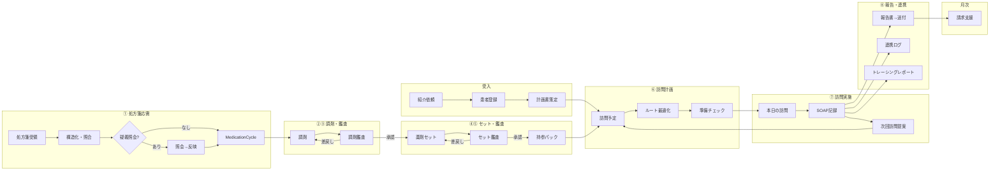

# PH-OS Pharmacy — Implementation Plan

> 仕様書: [ワークフロー/多職種連携](docs/visit-report-collab-spec.md) | [設計判断](docs/decisions.md)
> アーキテクチャ / デザイン方針: CLAUDE.md 参照
> ※ Phase 3 は Phase 2 完了時に詳細化する

### 明示的な非ゴール（既存レセコン/薬局システムの責務）

- フル在庫管理（発注・仕入・棚卸し・在庫評価）→ PH-OSは在庫医薬品マスタ（採用薬フラグ+引当フラグ）の薄い層のみ
- 麻薬管理帳簿・毒薬劇薬受払い簿 → レセコンが法定帳票を担う
- 領収書・調剤報酬明細書の発行 → レセコンの中核機能（二重入力回避）
- 会計・一部負担金の収納管理 → レセコン/会計システム
- POS・仕入・発注 → 在庫管理専用システム

### 実装優先原則（今回レビュー反映）

- MVPは「訪問日次運用 + 報告送付 + 最低限の処方差分/持参判定」を最優先にし、重いマスタ/処方安全チェック/請求自動化は後段に寄せる
- `MedicationCycle` は「処方起点の1運用サイクル」を維持する。MVPでも訪問予定は処方差分・持参可否・未解決課題と切り離さない
- PH-OS / レセコン / 電子薬歴 / 在宅支援システムの責任分界を先に固定し、二重入力を避ける
- 公開情報ベースの市場比較では、既存製品は「訪問記録・計画書/報告書作成・FAX/メール送付・現場共有」に強い。初期価値は最適化機能より、現場記録/連携/持参漏れ防止に置く

### 新機能: プラットフォーム運営者コンソール（監査付きブレークグラス） `cc:WIP`

<!-- 2026-07-03 ユーザー要望「システム開発者・管理者が裏からテナント横断でデータ確認・アクセス・操作」を、無記録バックドアではなくベストプラクティス準拠の監査付きブレークグラスとして設計・実装。設計判断は fable(ユーザー委任)。SSOT=docs/design/platform-operator-console-design.md -->

- [x] **P-0（MVP: 閲覧+全ログ）** ✅2026-07-03 land(89ecbb65/e32f807d/e535fac0/903926bc/e7a055f2)・gate全green・独立セキュリティレビュー APPROVE（blockerなし）
  - schema: PlatformOperator/BreakGlassSession（org_id無し・RLS非対象・app層認可）+ migration 20260703100000（非破壊）
  - core: operator gate(least-privilege tier) / break-glass seam（**BYPASSRLS不使用**でRLSをtarget1テナントにpin）/ step-up MFA(password+TOTP再認証) / fail-closed監査
  - API 5route + UI（独立 /platform segment・server gate）/ テスト52件（lib44+UI8）
- [ ] **P-1**: write ops の限定操作+追加監査+アラート / hash-chain tamper-evidence / operator suspend時のsession cascade revoke / MFA試行レート制限 / 全テナント横断監査ダッシュボード
- [ ] **P-2**: 多職種展開（医科・訪問看護）向け operator 権限汎用化

### 直近トラック: 開発方針 2026-07-03 — 実装ロードマップ v2（3レビュー再構成） `cc:WIP`

<!-- 2026-07-03: v1(9観点スキャン)を ①リリースクリティカルパス監査 ②網羅性批判レビュー(BLOCKED/ULTRACODE/FEATURE_QUEUE/spec 突合+コード抜き打ち7点=全て新鮮を確認) ③依存・実装順検証 の3独立レビューで実装向けに再構成。リリース判定は実装済みの pilot-launch-dossier(src/server/services/pilot-launch-dossier.ts: UAT/PMDA/backup/ISMS 4軸+org監査)を SSOT とし、外部依存を前提条件へ分離、技術タスクを Wave 0-3 へ再配列。計画のみ・実装未着手。v1 全文はコミット 1d315a86 参照。 -->

**v1 所見サマリ（有効）**:

- 基盤は高水準: 認可wrapper 約293route / no-store 260file / DBトリガ監査 / unit 1,229file・APIカバー97% / E2E主要5動線 / 点数改定レジストリはデータ駆動で2026医療改定 confirmed 済 / 依存EOLなし
- 最大の製品ギャップ: **算定要件の構造化未着手**（`docs/visit-report-collab-spec.md` v2 算定カバレッジ32項目中 充足5）
- 医療安全: CDS false-negative 8件 + safety5(CE01/CE02) / セキュリティ: RLS 実体欠落~33表+DB層未証明・PHI閲覧監査36route未記録 / 速度: prescription-intakes POST 33.7s / FE: React Compiler未有効・仮想化ゼロ・画像無圧縮 / 改定耐性: 点数=優秀、薬価版管理なし・next-auth v4 / 水平展開: そのまま展開可8+軽い分離6、要リファクタ=薬局間連携層

**v1 からの主な補正（網羅性レビュー）**:

- 追加: CE01/CE02 safety5（PCA未検品再貸出/訪問prep偽完了）/ EPIC1 RLS 実体欠落~33表+contract再設計 / **billing aggregation over-claim 修正群**（BLOCKED制限解除済・即効）/ spec P2・P5・P6・P7 の未収容分（B-7〜B-10）/ リリースエンジニアリング R群 / BLOCKED human-gate 残6件 / F-20260702-001
- 訂正: 実参照切れは `docs/decisions.md`+旧spec 2ファイル（`visit-report-collab-spec.md` は実在し正）/ O-1 は v0.2 トラックへ統合
- 昇格: afterhours-tz off-by-9h（夜間/休日加算の over/under-claim・confirmed）を P2→Wave1 算定正確性へ
- 分割: B-6→4分割+B-7〜B-10 / H-1→tx-guard epic 14件 / H-2→TZ epic ~14件 / C-7・E-6 は独立作業へ

**リリースマイルストーン**:

- **M1 安全・正確性 green** = Wave 0+1 完了（医療安全 / セキュリティ / 算定正確性の既知バグ 0）
- **M2 パイロット技術線** = Wave 2 R群完了で dossier のコード側 blocker 0。外部前提の完了をもって pilot GO
- **M3 製品の芯** = Wave 3 B群（算定要件構造化 = multi-quarter プログラム）

#### 前提条件（外部・人間作業） `cc:blocked`

- [ ] PMDA メディナビ/マイ医薬品集 登録 + `PMDA_*_URL` secrets（旧0-2i）
- [ ] backup live drill 実施と `[mode:live]` 記録（旧I-04/12-8）
- [ ] ISMS 審査機関見積・予算・キックオフ（旧1a-6/1b-6。vendor comparison/decision memo の記入で dossier green）
- [ ] AWS 本番プロビジョニング + `ALERT_EMAIL` 設定 + SNS email 購読 confirm + 本番 Sentry DSN
- [ ] パイロット薬局 UAT（critical/high blocker 0 で phase2_entry green。旧1b-9）
- [ ] 利用規約/プライバシーポリシー本文の法務確定（掲示ページ実装は W2-R4）
- [ ] 音声メモ STT の AWS Transcribe creds（旧D-8-3）

#### Wave 0 — quick wins（依存なし・並行・各S） `cc:完了` <!-- 2026-07-03 ultracode Wave0 実装: a5eb996f..b02d4899 の15コミット(W0-3/4結合)。全項目 独立レビューapprove+gate green(typecheck/no-unused/build/colors/boundaries)。W0-8判定=全てby-design leak無し -->

- [x] W0-1 colors:check を ci.yml へ（旧G-1。スクリプトは 4510ee7f 導入済み）
- [x] W0-2 renovate/dependabot 導入（旧C-6）
- [x] W0-3 import 方向 lint 境界: 共通コア→薬局固有の import を warn 可視化（旧F-1・水平展開の柵）
- [x] W0-4 軽量 pre-commit（変更ファイル限定 lint/format。旧G-2）
- [x] W0-5 docs 参照切れ解消: Plans.md/CLAUDE.md が指す `docs/decisions.md`+旧spec 2ファイルの3参照を実在 docs へ更新 or 復元（旧G-4 訂正版）
- [x] W0-6 改定運用 runbook docs（旧C-4）
- [x] W0-7 cycle_id 疎化+（組織,職種）N者連携の設計メモ（旧F-6・docs のみ）
- [x] W0-8 cron 全org横断 8箇所の by-design/leak 判定（旧A-6）
- [x] W0-9 optimizePackageImports 追加（旧E-4）
- [x] W0-10 無制限 findMany 棚卸し（旧D-6。EPIC8 CE11/N18/N23/CXR2-PERF01 と統合）
- [x] W0-11 介護2027改定データ枠（旧C-7a） / W0-12 prisma generator リンク堅牢化（旧C-7b）
- [x] W0-13 担当者命名の抽象化規約（旧F-3）
- [x] W0-14 重複解消: formatYen×3（null→0円実害）/ SectionCard×4+dead / QR readString（旧H-3）
- [x] W0-15 腎機能ラベル JST 共有フォーマッタ（FEATURE_QUEUE F-20260702-001 収容）
- [x] W0-16 safety-check CDS fail-open 修正: fetcher `catch→[]` 廃止・degraded バナー+再試行（旧A-1）— `safety-check-content.tsx:73-90`

#### Wave 1 — P0 安全・セキュリティ・算定正確性（M1 必須） `cc:WIP` <!-- 2026-07-03 安全レーン完了(CDS5/safety5=na/算定3/RLS contract/決定3)。承認レーン W1-7〜W1-12(+W1-12f/HG-1..5)全承認→land済(8d614c2a/db2ce0bf/e58e3aae/2c511a64/14318d48)、gate全green+reviewer-audit APPROVE。残=W1-3据え置き2件(疑義KPI full-count=意図的仕様 / summary_template_kind_count定義待ち)+W1-4/W1-5等の残スライスのみ -->

安全レーン（W0-16 に続き直列・1件ずつ厳格レビュー）:

- [x] W1-1 CDS false-negative 8件（旧A-2）: allergy cross-check skip(X02/CXR1-MSR01) / drug_master_id・code null 無言スキップ(F81/X03) / problem-list 禁忌未連携(F82) / eGFR silent-clean(X04) / 添付文書 alert unsorted slice(X05) ✅624e09fe
- [x] W1-2 safety5 CE01/CE02（v1漏れ）: PCA返却検品待ちクエリ崩壊=未検品ポンプ再貸出 / 訪問prep失敗のチェックリスト偽完了 ✅na（既修正を実証: CE01=pca-pumps fail-close 済み/CE02=433918e2 visit-record-detail fail-close 済み）

算定正確性レーン（over/under-claim。billing 制限解除済・B 構造化より先行）:

- [x] W1-3 billing aggregation correctness: 空 `requirements_status {}`→claimable / singleBuilding 月次 count tier / delivery_only count↔claim 不一致 / cross-month 返戻 overcount / wrong-domain transmit / `jobs/daily/billing.ts` org_id 欠落（BLOCKED mainui/WF-20260625 両票） ✅b96c0534
- [x] W1-4 afterhours-tz: 夜間/深夜/休日加算の UTC/JST off-by-9h（confirmed。prod=UTC で誤算定） ✅b96c0534
- [x] W1-5 set-derivations daycount rounding（算定隣接・BLOCKED WF-20260625） ✅ca285642

RLS レーン（DB層 backstop。proof より実装が先）:

- [x] W1-6 RLS contract 再設計スライス（rls-policy-contract.test のハードコード allowlist 是正含む。旧A-4 前段） ✅9b7982e4
- [x] W1-7 RLS 実体欠落表の実装（11表に ENABLE+tenant_isolation+FORCE、PHI: PatientPackagingProfile/VisitScheduleContactLog 含む。3表=IntegrationJob/PrescriberInstitution/User は意図的除外を台帳明記） ✅2026-07-03 承認レーン land(8d614c2a)・gate全green+reviewer-audit APPROVE
- [x] W1-8 非superuser ロール ph_os_app+FORCE RLS proof（`setup-rls-test-role.sql`、`rls.test.ts` it.skip→env-gated、両policy形に頑健化、CI 配線） ✅2026-07-03 land(8d614c2a/14318d48)

認可・PHI レーン（human 承認）:

- [x] W1-9 dispense-results PATCH canDispense 必須化（POST と対称、clerk/driver/external 403 + owner/admin 200 実証） ✅2026-07-03 land(e58e3aae)
- [x] W1-10 EPIC3 認可/外部共有（external-access canManagePatientSharing化・care-reports F88 cross-patient修正・prescriber-institutions authz・qr-scan F89 fail-close） ✅2026-07-03 land(e58e3aae/2c511a64)
- [x] W1-11 EPIC7 no-store/PHI（mfa setup/verify・prescriber-institutions・webhooks に withSensitiveNoStore） ✅2026-07-03 land(e58e3aae)
- [x] W1-12 BLOCKED human-gate: HG-1 data-explorer 監査+no-harddelete / HG-3 jobs error_log redaction / HG-5 OS通知 PHI redaction / HG-2 settings compliance ranges / HG-4 incidents permission affordance / W1-12f schedule composite FK ✅2026-07-03 land(2c511a64/db2ce0bf)・BLOCKED.md RESOLVED注記済

決定レーン（後段 unblock。実装なし・決定文書のみ）:

- [x] W1-13 請求エンジン二重化の収束決定（billing-rules ↔ `src/phos/domain/claim`。**W2-B1 の前提**。旧C-3） ✅cc85fb67・ラティファイ済=Option C(billing-rules一本化/phos claim凍結保全)
- [x] W1-14 React Compiler 方針決定（旧E-2 前段） / W1-15 API バージョニング方式決定（旧O-4/14-5） ✅cc85fb67・ラティファイ済=有効化(実装は W2 スライス)

#### Wave 2 — リリース機構・性能・設計着地（M2 技術線） `cc:完了` <!-- 2026-07-03 BatchA 16スライス+BatchB(Q1/Q2)+最終バッチ(P4/F1残/F2/F4-F53/R4)で全項目消化。コード側タスク完了=M2 技術線 green（R4 本文と pilot GO は外部前提条件待ち）。最終バッチは ultracode 7スライス: 各 maker→opus 独立レビュー approve -->

R リリースエンジニアリング（新設・クリティカルパス監査由来）:

- [x] W2-R1 本番 migration 適用の deploy パイプライン組込 or 承認付き runbook（deploy-production は Amplify trigger のみで `migrate deploy` が無い） ✅2026-07-03 BatchA 実装済(gate: 全量1284file green)
- [x] W2-R2 ジョブ失敗の人到達通知（`runner.ts:159` は in-app のみ → CloudWatch metric→SNS or web-push/SES 配線） ✅2026-07-03 BatchA 実装済(gate: 全量1284file green)
- [x] W2-R3 SSK/MHLW DrugMaster 本番初期ロードの実行手順+証跡（importer は ready。PMDA は前提条件成立後に追加） ✅2026-07-03 BatchA 実装済(gate: 全量1284file green)
- [x] W2-R4 利用規約/プライバシーポリシー掲示ページ実装（本文=法務前提条件） ✅2026-07-03 `(legal)/terms`+`/privacy` 新設（noindex・auth gate なし公開）+login フッター導線。terms 本文=法務確定待ちプレースホルダ（骨子のみ）、privacy=docs/compliance/privacy-policy.md ドラフト転記+注記。本文差替は前提条件（法務確定）解消時
- [x] W2-R5 パイロット向けユーザー操作ガイド（主要動線: 応需→調剤→訪問→報告→請求） ✅2026-07-03 BatchA 実装済(gate: 全量1284file green)
- [x] W2-R6 PHI 閲覧監査の共通層設計→36route 段階適用（3省2GL アクセス記録。旧A-5） ✅2026-07-03 BatchA 実装済(gate: 全量1284file green)

性能レーン（`pnpm perf:smoke` で before/after 実測先行）:

- [x] W2-P1 prescription-intakes tx 再設計 + DrugMaster OR 検索最適化（旧D-1+D-3 統合。同一 service で直列必須。BLOCKED RUN-20260622-001 根治） ✅2026-07-03 BatchA 実装済(gate: 全量1284file green)
- [x] W2-P2 index 追加（3複合index migration land ✅2026-07-03 db2ce0bf） / W2-P3 プール方針明文化 ✅BatchA(00984095) / W2-P5 レート制限拡大 ✅BatchA(ce260f26) / W2-P4 マスタ系キャッシュ ✅2026-07-03（設計判断: unstable_cache は Amplify 複数インスタンスで revalidateTag 非協調のため不採用→既存 serverCache 方式で専用 drug-master-detail-cache 新設(独立インスタンス cap200/TTL120s)。GET [id]+POST batch のグローバルマスタのみ、**org-scoped endpoint(generic-recommendations/ingredient-group/package-insert)は非キャッシュ**=テナント分離維持。6取込ルートに invalidate 併記）

B 設計着地:

- [x] W2-B1 BillingRequirementCatalog 設計→実装（旧B-1。DB 0・コード中。W1-13 決定が前提。`billing-requirement-validator.ts` の cap-counting/週境界を継承し回帰で担保） ✅2026-07-03 BatchA 実装済(gate: 全量1284file green)

FE:

- [x] W2-F1 画像リサイズ+圧縮共通化（旧E-1・訪問動線直効） ✅2026-07-03 共通化=0b123003(downscale-image.ts)+残4経路適用（residual-adjustment/card-workspace/prescription-intake/consent。PDF は fail-open 自動スキップ）
- [x] W2-F2 仮想化・ページング（旧E-3） ✅2026-07-03 仮想化ライブラリは不採用（ページングで充足と判断）。DataTable opt-in pagination=35add5fa → tasks/institutions/users へ配線(pageSize50)。drug-master 一覧は cursor hasMore 破棄で「51件目以降が見えない」実バグを useInfiniteQuery+onLoadMore 配線で修正。my-day/conferences/requests は DataTable 不使用（カード/リスト描画）のため対象外
- [x] W2-F3 false-empty 残5件（旧E-5） ✅済を実証（W2-F3a〜d=8ac44b38/bb368ff7/df2192e8/54ba5d72 が HEAD 祖先、isError→ErrorState(variant=server)+refetch 適用確認済み）。旧チェック漏れの台帳訂正
- [x] W2-F4 offline lifecycle 偽同期の残 ✅2026-07-03 CE12/CE13/N21=87e22d87(OfflineSyncBridge)で修正済みを実証。follow-up も消化: CE14=sync-engine dedupeScopeId 済 / N25=resetFailedEvidenceDraftRetries 済 / **F53(pendingEvidence の MAX_RETRIES 永続 stuck→COMPLETE_VISIT 恒久ブロック)を今回修正**（reset/requeue+明示 acknowledged 必須の discard、監査ログ付き）。stuck 再試行の UI 導線は小粒 follow-up（queue API は公開済み）

モジュール化・テスト:

- [x] W2-M1 Task schema 移設+core/pharmacy 区分（旧F-2） / W2-M2 権限の職種×capability 2軸整理（旧F-4） ✅2026-07-03 BatchA 実装済(gate: 全量1284file green)
- [x] W2-T1 テスト空白解消: `src/server/jobs/daily` + `billing-rules/revisions`（旧G-3・金額直結） ✅2026-07-03 BatchA 実装済(gate: 全量1284file green)

品質負債 epic:

- [x] W2-Q1 tx-guard epic 14件（旧H-1 拡張: CE05/F83/CE06/N32/X06/X07/X09/X10/CXR1-CONC01/02 ほか。partial-unique F84/F85/X08 は migration ゲート） ✅2026-07-03 BatchB land(3c47febc..fa99f46d)
- [x] W2-Q2 TZ epic ~14件（旧H-2 拡張: CE03/07/08/09/10/15/16/N19/N24/N26/N30/CXR2-TZ01/02。helper 束ねで一括） ✅2026-07-03 BatchB land(3c47febc..fa99f46d)

#### Wave 3 — 製品の芯・高 blast（安全網整備後） `cc:TODO`

安全網先行（破壊的 migration の前提）:

- [ ] W3-S1 staging 環境（旧O-2/12-4・AWS 実環境待ち）
- [x] W3-S2 PRE-03 データ移行検証フレームワーク（pre-count/post-integrity/rollback SQL） ✅2026-07-03 Phase 5-PRE PRE-03 として消化（p03-lab-values 追加+テーブル名/adapter の実行不能欠陥修正。詳細は PRE-03 セクション）

B 算定構造化（spec ロードマップ順。W1-13/W2-B1 済前提）:

- [x] W3-B2 VisitInstruction+SpecialPatientStatus（非破壊 mig・中） ∥ W3-B5 訪問実施エビデンス visit_started_at/ended_at（小）
- [ ] W3-B3 加算エビデンス群（StructuredSoap 拡張+加算コードマスタ）
- [~] W3-B4 claim-record projector（report-generator 分割。F-5 境界 API 化と直列調整） 2026-07-03 中核消化(52ce1f66): billing_context/source_provenance の型付け(source-tagged union)+構築の care-report-source-provenance.ts 一本化+読み取りの report-content.ts 一本化（content JSON バイト同一・send route の 409 reason 不変・opus approve）。残: S4=report-generator の11表直読みの読み取り関数集約(W3-M1 と直列) / 手動作成への billing_context 付与(billing 経路のデータ plumbing を伴う別スライス・要 billing レビュー)
- [ ] W3-B6a 報告書 finalize/lock 版管理[RPT-007] / W3-B6b 到達証跡ハードゲート[KYO-007/008] / W3-B6c 保存年限構造化[RPT-002/009] / W3-B6d 単一建物月次動的計数[ZTK-06]（旧B-6 の4分割）
  - 設計メモ ✅2026-07-03 ラティファイ済（3a39f69e、docs/design/care-report-finalize-lock-design.md、codex 起草+opus critic 2巡）。確定方向: 行ロック=updated_at 維持(D-14 意図的逸脱を記録)/改訂連番=report_revision/Option B 推奨。B vs C 最終選択+未決事項は migration 提案の human 承認時に確定。実装(migration 含む)は据え置き=human gate
- [ ] W3-B7 spec P2: ManagementPlanContent 構造化+医療保険の月次見直し強制（KYO-003/004）
- [ ] W3-B8 spec P6: 多職種 inbound 双方向モデル（多対多 resolution_status, ARCH-6）+FAX/紙 OCR 取込(COLLAB-01)+到着通知(COLLAB-02)+outbound 受領ループ(COLLAB-03)
- [ ] W3-B9 spec P5: cycle_id 任意化+緊急訪問薬剤管理指導料（料1/料2）+オンライン46単位・緊急通算の月キャップ統合（部分消化: 2026-07-04 cbef13f4+d535b4f6 で emergency_category 欠落時の evidence/rule-engine fail-closed 化。残: online/shared monthly cap、cycle_id 任意化全体整理）
- [ ] W3-B10 spec P7: 破壊的 migration 群（CareReport.visit_record_id FK 昇格 / 残薬 canonical 一本化 / レガシー SOAP 削除。human 承認+W3-S1/S2 前提）

改定・依存耐性:

- [ ] W3-C1 薬価 effective-dated 版管理+調剤時スナップショット（旧C-1・L・mig） / W3-C5 next-auth v4→Auth.js v5（旧C-5・L）
- [x] W3-C2 レジストリ外ハードコード点数吸収（旧C-2） ✅2026-07-03 billing-evidence（情報提供/重複投薬）+conference-sync の算定経路点数を billing-rules レジストリ実行時解決へ置換（2024/2026 両改定で同値性を回帰テスト固定、旧値は未収載日 fallback として残置）。deferred: duplicate-interaction の日付分岐は構造マッピング選択でレジストリ未エンコード（点数 drift は解消済み）/ UI ラベル内点数（表示専用）/ core.ts 到達不能 legacy branch（死コード）

FE 仕上げ（低優先）:

- [ ] W3-E1 フォーム RHF 統一（旧E-6a）
- [x] W3-E2 野良 table の DataTable 集約（旧E-6b） ✅2026-07-04 current-code scan で完了確認。2026-07-03 前半7ファイル（residual-adjustment/conflict-resolution/visit-record-detail/prescription-history/period-review/prescription-detail/card-workspace 処方明細）に加え、残候補だった clerk-support / intake-triage / report-share / workflow-dashboard / offline-sync / prescriptions-table / prescription-inline-detail は現行コードで `DataTable` 化済み。残る非 print raw table は意図的例外: report-delivery-dashboard の小集計（検索/列切替 toolbar 過剰としてテスト固定）、medication-format-grid の比較マトリクス、medication-calendar / shifts の calendar grid、帳票 print 系。これらは DataTable 変換対象外として維持。
- [~] W3-E3 drug-master-content(5177行) 分割（旧E-6c） 2026-07-03 純粋コード約900行を types/format/columns の3ファイルへ抽出（5177→4279行、公開API不変・82テスト green）。本体 DrugMasterOperationalContent の分割は 50+ useState と医療安全 race-guard ref 群の単一スコープ結合が強く、動作保存優先で独立レビュー付き段階パスへ deferred（次候補=detail Sheet 約810行）
- [x] W3-M1 sync-engine/report-generator の境界 API 化（旧F-5。W3-B4 と直列調整） <!-- 2026-07-03: 前提が整った(B4中核52ce1f66+B6設計3a39f69e)。実体=①report-generator の11表直読みを単一読み取り関数へ集約 ②VisitRecord.version/updated_at の暗黙版契約を共有型化(sync-engine VisitRecordConflictSnapshot ↔ visit-records route VisitRecordConflictDetail の平行実装統合)。report-generator.test(1356行)の fixture 書き直しコスト大のため独立スライスで -->

運用:

- [ ] W3-O1 v0.2 e2e 実証（下記 v0.2 トラックで管理・重複解消） / W3-O3 RUM（旧12-7残） / W3-O5 TZ fail-close 有効化（prod TZ 設定後・prod ゲート） / W3-O6 証跡写真+S3 Object Lock+set-photo 束縛 / W3-O7 音声メモ STT `cc:blocked`

**直列化必須ペア**: W2-P1 内 D-1↔D-3（同一 service）/ W0-16→W1-1（CDS 系）/ W1-13→W2-B1→B 全系 / W3-B4↔W3-B6↔W3-M1（report-generator 競合）/ W3-B2・B3・B5 の mig は逐次 / W1-14 決定→React Compiler 実装。Wave 内の各レーンはファイル非重複で並行可。

**実行規律**: 各スライス = maker(Claude) → reviewer-audit 独立レビュー → objective gate（typecheck / typecheck:no-unused / lint / test / build / colors:check）。auth/security/migration/prod-deploy は human 承認（§15）。破壊的 mig（W3-B6d/B10/C1）は W3-S1/S2 完了が前提。perf 系は perf:smoke 実測を前段に。

### 新トラック: 訪問スケジュール自動提案 上書きアップデート（2026-07-05） `cc:TODO`

<!-- source: docs/careviax_visit_schedule_update_spec.docx（CareVIAx / PH-OS 訪問薬剤管理スケジュール自動提案 既存実装調査・上書きアップデート仕様書）。2026-07-05 に仕様書と実コードを再レビューし、既存実装済みの planner / proposal workflow / visit availability / route matrix contract を前提に実装順を練り直した。計画のみ・実装未着手。 -->

**最重要方針（SSOT）**:

- 自動提案の仮予定 SSOT は `VisitScheduleProposal`。`VisitSchedule` は患者連絡 confirmed 後に作る確定予定。
- `confirmed_at` あり `VisitSchedule`、ready/departed/in_progress/completed 予定、患者連絡済み候補は自動再配置しない。変更は既存リスケジュール/再提案フローに限定する。
- 手動 `POST /api/visit-schedules` と管理者/互換用途の直接 `VisitSchedule` 作成は残すが、「自動生成」は proposal-first に寄せる。
- 休業日/訪問不可日の上書きは理由必須、監査ログ必須。薬剤師確認必須はスコア減点ではなく患者連絡前のハードゲートにする。
- Google Routes / OSRM / fallback はルート・移動時間評価だけに使い、薬学判断・服薬期限判断の根拠にはしない。

**コードレビューで確定した現状（2026-07-05）**:

- `src/app/api/visit-schedule-proposals/route.ts` は候補生成、idempotency、算定ガード、`VisitScheduleProposalBatch`、route_order allocation、diagnostics/audit を既に持つ。ここを自動提案の正式入口として維持する。
- `src/app/api/visit-schedule-proposals/[id]/route.ts` は approve → contact_attempt confirmed → confirm → `VisitSchedule.create` の患者承認後確定フローを既に持つ。仕様書の proposal-first 方針と一致している。
- `src/app/api/visit-schedules/generate/route.ts` は recurrence から `VisitSchedule` を直接作成し、`confirmed_at` / `confirmed_by` を入れる。仕様書との差分として最重要の互換移行対象。
- `src/server/jobs/daily/visits.ts` は服薬期限から `generateVisitScheduleProposalDrafts` を呼び `VisitScheduleProposal` を作る。daily demand は既に proposal-first で、強化対象は deadline policy と diagnostics。
- `src/server/services/visit-schedule-planner.ts` は患者希望/施設受入/薬局営業時間/薬剤師シフトの時間窓 intersection、日次/週次容量、車両、route insertion、算定 cadence、確定済み予定固定を実装済み。新設ではなく接続・精密化する。
- `src/lib/calendar/visit-availability.ts` は `canVisitOn` で PharmacyOperatingHours/BusinessHoliday と PharmacistShift の AND 判定を pure helper 化済み。VisitAvailabilityPolicy はこの helper の拡張・DB adapter 接続として扱う。
- `src/server/services/visit-medication-deadline.ts` は通常薬 end_date / start_date+days、次回調剤日、前回訪問時 next_visit_suggestion_date を最小日で折り、頓服を通常期限から除外済み。営業日バッファは未実装。
- `src/server/services/road-routing.ts` は `RoadTravelEstimator.estimateMatrix` と OSRM table matrix / pairwise fallback を既に持つ。Google provider は現状 pairwise `computeRoutes` のみなので、追加対象は `GoogleRoutesProvider.estimateMatrix`。
- `prisma/schema/visit.prisma` の `VisitScheduleProposal` には `pharmacist_review_required` / `review_reason_code` / `reviewed_at` は未存在。review gate は diagnostics 先行、DB field 追加は HR migration に分離する。

**監査・PHI payload 方針**:

- proposal / overload / review / route diagnostics を audit に残す場合は whitelist 方式にする。
- audit に保存してよいもの: reason code、entity id、dateKey、actor、status before/after、算定/期限/availability の短い machine code、hash 化した診断 snapshot。
- audit/log/export に保存しないもの: 患者名、住所、緯度経度、電話番号、連絡 note、薬剤 free text、処方全文、Google/OSRM request body、API key、provider raw error。
- 詳細表示が必要な場合は、audit ではなく権限制御済み detail API で再計算または最小化済み snapshot を返す。
- `audit-logs` API/export は reject_reason redaction と同じ方針で diagnostics/free text/drug/address/phone を redaction test で固定する。

**追加・変更する設計要素（通常変更 / HR 分離）**:

| 領域                   | 現コードとの差分                                                                                                                                     | リスク分類          |
| ---------------------- | ---------------------------------------------------------------------------------------------------------------------------------------------------- | ------------------- |
| DeadlinePolicy         | 既存 `resolveMedicationDeadlineSummary` の後方互換を保ち、営業日/訪問可能日 buffer を別出力として追加する。                                          | P1                  |
| Planner connection     | 現 planner の `planningEnd` / `candidateDeadlineDate` を policy 出力へ接続。候補取得期間は縮めすぎず、site/shift 判定後に per-site deadline を適用。 | P1                  |
| Direct generate        | `visit-schedules/generate` の直接 confirmed 作成を廃止し、proposal-first 入口へ誘導する。                                                            | P1                  |
| Availability policy    | 既存 `canVisitOn` と planner 内 intersection を統合し、訪問可能枠 DB 化は HR へ分離。                                                                | P1→HR               |
| Review gate            | まず diagnostics/audit/UI で表示し、DB field 追加後に approve/contact/confirm hard gate 化。                                                         | P1→HR               |
| OverloadRebalancer     | 確定予定ではなく未承認 proposal のみを preview-first で前倒し。既存 open proposal も容量計算に入れる。                                               | P1 / audit注意      |
| PRN/topical stock/risk | 頓服・外用薬残量、薬剤変更 risk は医療安全上 HR。既存通常薬 deadline とは分離し、薬剤師確認必須を伴う。                                              | HR                  |
| Google Matrix          | 既存 estimator contract に `GoogleRoutesProvider.estimateMatrix` を足す。key 未設定/失敗時は OSRM/fallback を維持。                                  | P1 / deploy設定注意 |

#### VS-AUTO-0. 方針固定・実コード inventory・入口分類 `cc:TODO`

- [ ] 仕様書 `docs/careviax_visit_schedule_update_spec.docx` と上記コードレビュー結果を、`Plans.md` / `ops/refactor/STATE.md` の再開アンカーへ残す。
- [ ] 入口を分類する:
  - 自動提案: `POST /api/visit-schedule-proposals`、`src/server/jobs/daily/visits.ts`。
  - 患者承認後確定: `PATCH /api/visit-schedule-proposals/[id]` action `confirm`。
  - 手動確定: `POST /api/visit-schedules`。
  - 廃止済み: `POST /api/visit-schedules/generate`（直接 confirmed 作成は停止）。
  - 既存変更: `POST /api/visit-schedules/[id]/reschedule` と approve/reproposal。
- [ ] `VisitScheduleProposal` と `VisitSchedule` の責務境界を API test 名・UI文言・operator docs で統一する。
- [x] `visit-schedules/generate` の利用元（UI、workflow full-cycle test、seed/demo、外部 docs）を棚卸しし、proposal-first 移行の互換影響を記録する。2026-07-05:
      通常画面の候補生成入口は `POST /api/visit-schedule-proposals`。`POST /api/visit-schedules/generate` の
      `workflow-full-cycle.test.ts` 直接利用は削除し、protected route test は廃止 endpoint の 410 contract を確認する。
- [ ] `localDateKey` / `formatUtcDateKey` / `japanDateKey` 使用箇所を棚卸しし、期限・休業日・患者希望曜日・locked_date の user-facing date は Asia/Tokyo dateKey を SSOT にする。
- DoD: 「自動提案は proposal、確定予定は患者確認後」の方針が実コード参照付きで追跡可能。

#### VS-AUTO-0b. Direct generate 自動確定経路の cordon `cc:TODO`

- [x] `src/app/api/visit-schedules/generate/route.ts` が `VisitSchedule.create({ confirmed_at })` を実行する現状を、実装初期の blocker として扱う。2026-07-05:
      互換性不要の最新指示に従い、route 本体を 410 `ENDPOINT_REMOVED` に置換。`VisitSchedule.create` /
      `confirmed_at` / `confirmed_by` / direct generate audit / workflow notification は実行されない。
- [x] DeadlinePolicy を本番経路へ接続する前に、direct generate を廃止する:
  - [x] automated UI 入口は既存通り proposal-first。
  - [x] route response は replacement endpoint と `creates_confirmed_schedules=false` を返す。
  - [x] 管理者/手動の確定予定作成は `POST /api/visit-schedules` に限定し、旧一括直接生成は使わない。
- [x] route ファイルは削除せず、既存 caller があれば 410 と replacement endpoint で明示的に失敗させる。
- テスト:
  - automated UI/標準 request は `VisitScheduleProposal` を作り、`VisitSchedule.confirmed_at` を作らない。
  - [x] `visit-schedules/generate/route.test.ts` は direct endpoint が 410 で、malformed body でも confirmed 作成へ入らないことを検証。
  - [x] `workflow-full-cycle.test.ts` は旧 direct generate 呼び出しを削除し、下流 flow fixture の確定予定から開始する。

#### VS-AUTO-1. 営業日バッファ付き DeadlinePolicy（DBなし pure first） `cc:TODO`

- [x] `src/server/services/visit-medication-deadline.ts` に既存 summary API を残したまま `resolveVisitDeadlinePolicy` を追加する。2026-07-05:
      新helperは DB/API/UI に未接続の pure policy。既存 `resolveMedicationDeadlineSummary` の Date contract は維持。
  - 入力: 既存 `MedicationDeadlineIntake[]`、`nextVisitSuggestionDate`、`planningStartDateKey`、`OperatingCalendar` または visitable date predicate、`safetyBufferOperatingDays`、任意の stockout candidate。
  - 出力: `rawDeadlineDateKey`、`latestVisitableDateKey`、`recommendedDeadlineDateKey`、`deadlineCandidates[]`、`diagnostics[]`、`reviewReasons[]`。
- [x] `DeadlineCandidate` は provenance を必須にする:
  - `source_kind`: `regular_medication_end` / `next_dispense` / `next_visit_suggestion` / `stockout_estimate` / `manual_locked_date`。
  - `prescription_intake_id` / `prescription_line_id` / `drug_master_id` / `drug_code` / `source_drug_code` は取得できる場合に保持し、名前だけの候補は `confidence='low'` + review required。
  - `raw_date_key` / `adjusted_date_key` / `confidence` / `requires_pharmacist_review` / `reason_code` / `audit_ref` を持つ。
- [x] 現行 planner/daily の select は `drug_name` 等だけなので、VS-AUTO-2 接続時に `PrescriptionLine.id` / `drug_master_id` / `drug_code` / `source_drug_code` を select に追加する。2026-07-05:
      planner/daily の query select に provenance fields を追加。未解決 drug master・同名別規格・差分不明の hard review gate 接続は VS-AUTO-7/8 に残す。
- [x] 既存 `resolveMedicationDeadlineSummary` はそのまま維持し、既存 route/planner/tests の `visitDeadlineDate` 互換を壊さない。
- [x] `rawDeadline` が休業日/訪問不可日なら `nearestOperatingDay(..., 'backward')` 相当で直前訪問可能日へ補正し、そこから `addOperatingDays(..., -buffer)` で recommended deadline を作る。
- [x] Date object を直接 policy 境界に広げず、Asia/Tokyo 業務日の `YYYY-MM-DD` date key を主入出力にする。DB `@db.Date` 変換は caller/adapter 層。
- [x] 頓服は通常薬 deadline から除外。外用/貼付などは通常候補に残すが `requires_pharmacist_review=true` と `reviewReasons` を必ず返し、患者連絡前 gate 接続は VS-AUTO-7 以降に分離。
- テスト:
  - [x] 日曜に薬切れ、月-金のみ訪問可能、buffer=1 → 金曜補正後に木曜。
  - [x] 祝日・連休中に薬切れ → 連休前最終訪問可能日から営業日 buffer を引く。
  - [x] buffer が recommended deadline を planningStart より前へ押し戻す → overdue/asap diagnostic。
  - [x] PRN は通常薬 deadline から除外される既存テストを維持。
  - [x] name-only / drug identity 未解決、外用 route、stockout candidate が provenance/review reason を持つ。
  - [x] `TZ=UTC` でも JST dateKey 境界がずれない。
- rollback: policy 接続 commit を revert。既存 `resolveMedicationDeadlineSummary` に戻せる。

#### VS-AUTO-2. Planner deadline 接続と per-site 訪問可能期限 `cc:DONE`

- [x] `src/server/services/visit-schedule-planner.ts` の `planningEnd` を単純に recommended deadline へ縮めすぎない。現行は shift/site 取得後に operating calendar が分かるため、初期検索窓は `rawDeadline + buffer scan` を確保し、shift/site 評価時に per-site `candidateDeadlineDate` を適用する。2026-07-05:
      preliminary policy の `rawDeadlineDateKey` で検索窓を確保し、site calendar 構築後に shift/site ごとの `recommendedDeadlineDateKey` を cutoff として適用。
- [x] `buildOperatingCalendarFromDbRows` / `resolveOperatingState` / `canVisitOn` を使い、planner 内の独自 operating/shift 判定と `visit-availability.ts` の理由コードを揃える。2026-07-05:
      `canVisitOn` を planner の基礎 availability precheck に接続し、`business_holiday` へ畳まず `pharmacy_holiday` / `pharmacy_regular_closed` / `outside_pharmacy_operating_window` などの shared machine code を planner diagnostics の `reason_code` として返す。
- [x] planner diagnostics に `deadline_policy` 系 reason を追加する:
  - `deadline_raw`
  - `deadline_adjusted_to_operating_day`
  - `deadline_buffer_applied`
  - `deadline_overdue_asap`
  - `locked_date_deadline_violation`
- [x] 既存の患者希望時間、施設受入時間、薬局営業時間、薬剤師シフト intersection、車両/route/capacity/算定 checks は維持し、削除・再実装しない。
- [x] `locked_date` は最優先候補。ただし休業日・シフト不可・期限超過は proposal を作らず diagnostics を返す。休業日上書き理由がある場合だけ override audit へ接続する。2026-07-05:
      deadline 超過は `locked_date_deadline_violation` で hard-block。休業日 override の audit 接続拡張は VS-AUTO-5 側に残す。
- テスト:
  - [x] `visit-schedule-planner.test.ts` に日曜薬切れ→木曜、locked date hard-block を追加。
  - [x] `visit-schedule-planner.test.ts` に連休専用 regression を追加。
  - [x] 既存 `beyond_deadline` / capacity / vehicle tests を維持し、旧 `business_holiday` 期待は `pharmacy_holiday` / `pharmacy_regular_closed` へ上書き。
  - [x] daily job `src/server/jobs/daily/visits.ts` が新 policy の recommended deadline を使う。2026-07-05:
        daily は site 未確定のため generic weekday visitability で demand due/SLA を補正し、最終 buffer/cutoff は planner per-site policy で強制。

#### VS-AUTO-3. `visit-schedules/generate` の proposal-first 上書き移行 `cc:TODO`

- [x] VS-AUTO-0b に吸収済み。`POST /api/visit-schedules/generate` は 410 `ENDPOINT_REMOVED` contract を維持し、旧 direct confirmed schedule 自動生成 route は復活させない。
- [ ] recurrence から複数日候補を作る必要が出た場合は、旧 generate route ではなく `POST /api/visit-schedule-proposals` 側または新規 proposal batch adapter に実装する。`VisitSchedule.create` は呼ばない。
- [ ] proposal batch adapter は `VisitScheduleProposal` と `VisitScheduleProposalBatch` に作成し、`idempotency_key`、route_order、billing guard、open proposal collision は existing proposal route と同等にする。
- [ ] `confirmed_at` あり予定、reschedule source、open proposal duplicate、billing cap、vehicle validation の既存 regression を移行テストで固定する。
- テスト:
  - 自動一括生成は `VisitScheduleProposal` を作り、`VisitSchedule.create` を呼ばない。
  - legacy compatibility/manual mode は存在しないこと、旧 generate route は 410 のままであることを route/API tests で固定する。
  - 患者 contact confirmed 後だけ `[id]` confirm が `VisitSchedule` を作る。
  - `workflow-full-cycle.test.ts` / `visit-schedules/generate/route.test.ts` の期待を proposal-first に更新。

#### VS-AUTO-4. AvailabilityPolicy / 薬剤準備 / 緊急予備枠 `cc:TODO`

- [ ] `src/lib/calendar/visit-availability.ts` を新設せず拡張する。現 `canVisitOn` の reason code を planner/API diagnostics と共有する。
- [ ] 訪問可能枠 DB 化前は、既存 PharmacyOperatingHours/BusinessHoliday + PharmacistShift + patient/facility preference の intersection を唯一の訪問可能判定にする。
- [x] 薬剤準備は既存 workflow gate / preparation state を調査し、`medication_ready_at` / `min_schedulable_at` を直接 DB 追加する前に derived helper と diagnostics で接続する。
      2026-07-05: schedule 作成前は `VisitPreparation` が存在しないため、既存 daily demand と同じ
      `MedicationCycle.overall_status in ('set_audited', 'visit_ready')` を derived readiness として採用。
      未満の cycle は `medication_not_ready` diagnostic で proposal 生成を fail-closed し、
      response/audit/detail 用 normalizer は cycle_id/status/required_statuses の enum 値だけを通す。
- [x] 緊急予備枠は初期値を service 定数にし、`remainingSlackMinutes` / `slackPenalty` と conflict しない形で `emergency_reserve_preserved` diagnostic を出す。DB field は VS-AUTO-7。
      2026-07-05: `EMERGENCY_RESERVE_MINUTES = 60` を planner に追加し、緊急以外の候補は
      `remainingSlackMinutes < 60` で rejected diagnostics に落とす。緊急提案は予備枠を使用可能。
      response/audit/detail 用 diagnostics normalizer は `emergency_reserve` を whitelist し、PHI/free-text を通さない。
- テスト:
  - `canVisitOn` の既存 fail-closed tests を維持。
  - [x] medication ready 前の候補除外。
  - [x] emergency reserve を超える自動充填拒否。
  - max_daily/max_weekly/vehicle capacity rejected diagnostics 維持。

#### VS-AUTO-5. Proposal diagnostics / review-gate 表示（migration 前の低リスク層） `cc:TODO`

- [ ] VS-AUTO-7 の field-backed hard gate 前は、diagnostics-only と明記する。UI の disabled だけで患者連絡/確定を止めた扱いにしない。
- [x] `src/app/api/visit-schedule-proposals/route.ts` の response/audit diagnostics に deadline policy、availability、review gate candidate を machine-readable reason で追加する。既存 field は削除しない。
      2026-07-05: POST response は `deadline_policy` / `availability_reason_code` を返し、audit は
      `src/lib/visit-schedule-proposals/diagnostics.ts` の whitelist で machine code/date/site/id/count のみに最小化。
      任意 `value` 文字列、患者名、薬剤名、住所、電話、メモ、token、planner 余剰 field は response/audit へ通さない。
- [x] `src/app/api/visit-schedule-proposals/[id]/route.ts` の GET が読む creation audit `diagnostics` に review candidate を表示できるよう shape guard を追加する。
      2026-07-05: cast-only guard を廃止し、保存済み audit diagnostics も同 whitelist で正規化して unknown/free-text を落とす。
- [ ] `/schedules/proposals` の詳細 Sheet と候補カードに、期限補正・休業日補正・薬剤師確認候補・過密前倒し理由を業務用語で表示する。
      2026-07-05 partial: 共通 `VisitProposalDiagnosticsCard` に `deadline_policy` を
      「期限診断」として中立表示し、`availability_reason_code` を休業日・シフト理由の集計と候補行
      `訪問可否` badge で表示。薬剤師確認推奨は explicit `review_required_candidate` diagnostics が
      来た場合のみ「診断表示のみ」として表示。過密前倒し理由は VS-AUTO-6 後続。
- [ ] HR field 追加前は `pharmacist_review_required` 永続 field を参照しない。UI では `review_required_candidate` として「患者連絡前に薬剤師確認推奨」を出し、ハードブロックは VS-AUTO-7 後に有効化する。
      2026-07-05 partial: accepted `specialty_coverage.match_status` が `unmatched` / `unknown` の場合に
      route が PHI-free `review_candidates[]` を生成し、UI はこの explicit diagnostics のみを表示。
      idempotency replay は false-empty diagnostics を返さない。
- テスト:
  - [x] diagnostics が表示され、既存 proposal ranking / contact log / bulk action を壊さない。
        2026-07-05: focused API/detail/UI regression green。
  - server `message` / validation error が既存 UI fallback で表示される。
  - [x] PHI を audit changes / logger / route diagnostics に過剰保存しない。
        2026-07-05: route/detail tests で hostile patient/drug/note/token/invalid value を固定。

#### VS-AUTO-6a. OverloadRebalancer preview/read-only: 未承認候補だけ前倒し `cc:TODO`

- [x] 新サービス案: `src/server/services/visit-schedule-overload-rebalancer.ts`。
- [x] まず preview-only API または service test で実装し、自動 cron 化しない。
      2026-07-05: `previewVisitScheduleOverloadRebalance` を追加。DB write / cron / API は未接続。
      confirmed schedule + open proposal を occupancy として数え、既存 planner で前倒し replacement draft を
      preview するだけに留める。
      2026-07-05: `POST /api/visit-schedule-proposals/overload-rebalance-preview` を追加。
      `canVisit` + `withOrgContext` + no-store の read-only preview API とし、旧 route alias や互換 envelope は
      追加しない。内部 service DTO は直接公開せず、`case_id` と per-skipped proposal id を落とした
      API-safe DTO（`preview_only=true`、`apply_available=false`、`unsupported_guards` 明示）へ変換する。
- [~] 対象は migration 前:
  - `proposal_status='proposed'`
  - `patient_contact_status='pending'`
  - `finalized_schedule_id is null`
  - review candidate なし
  - 期限・準備・シフト・車両・算定 guard を満たす候補。
  - 2026-07-05 partial: `proposed/pending/finalizedなし/reschedule_sourceなし` のみ preview 対象。
    `patient_contact_pending` / `reschedule_pending` は occupancy には数えるが replacement 対象外。
    review candidate 永続 field は VS-AUTO-7 まで存在しないため未接続。
- [ ] VS-AUTO-7 後は `pharmacist_review_required=false` を条件へ追加する。
- [x] 容量判定では確定 `VisitSchedule` だけでなく、同日同薬剤師/車両の open `VisitScheduleProposal` もカウントする。現 planner は主に confirmed schedule を見ているためここが差分。
      2026-07-05: first slice は pharmacist daily capacity を対象に、active `VisitSchedule` と open
      `VisitScheduleProposal` を同一 occupancy としてカウント。preview 採用分も仮想 occupancy に反映し、
      同一実行内の前倒し先過密を防ぐ。
      2026-07-05: vehicle capacity も `VisitVehicleResource.max_stops` を基準に、active `VisitSchedule` と
      open `VisitScheduleProposal`、同一 preview run の仮想採用分を vehicle/date occupancy としてカウント。
      `unsupported_guards` から `vehicle_open_proposal_capacity` を削除。billing cap と review field は後続。
- テスト:
  - [x] 過密日に未承認候補が集中 → 未承認候補だけ前倒し replacement preview。
  - [x] confirmed schedule / contact confirmed proposal / reschedule pending は不変。
        2026-07-05: confirmed schedule は occupancy のみ、contacted/open proposal は `not_mutable` skip。
  - [~] 前倒し先が期限・シフト・薬剤準備・billing cap を満たさない場合は再配置しない。
    2026-07-05 partial: replacement draft は既存 planner から取得し、destination daily capacity full と
    vehicle/date capacity full は skip。billing cap / review candidate 永続判定は後続。
  - [x] audit/log に患者詳細や自由記述を過剰保存しない。
        2026-07-05: preview API は audit write なし。response は id/date/status/count/reason code と
        最小 diagnostics に限定し、case id、raw patient / address / medication / free-text clinical detail を追加しない。

#### VS-AUTO-6b. OverloadRebalancer apply/supersede/audit `cc:TODO HR`

- [ ] VS-AUTO-7 の review fields / audit schema / hard gate と、VS-AUTO-8 の薬剤師確認 hard gate が入るまで write/apply は実装しない。
- [ ] 前倒し apply 時は旧候補を `superseded` にし、replacement proposal を transaction で作る。confirmed schedule、patient contact confirmed/pending proposal、reschedule pending は不変。
- [ ] `reproposal_reason` など存在しない field を前提にせず、HR migration 後の専用 field または `OverloadRebalanceAudit` に `reason_code='overload_advance'` と最小化 diagnostics を保存する。
- [ ] billing cap recheck、vehicle capacity、pharmacist capacity、review field gate、patient contact state、same-run duplicate を server-side で再検証する。
- [ ] apply 失敗や blocked attempt は、患者名・住所・薬剤名・provider raw payload を含まない audit/security-safe event に残す。
- テスト:
  - old proposal superseded + replacement proposal が同一 transaction で作られる。
  - confirmed/contacted/reschedule pending は変更されない。
  - billing cap / review required / vehicle full / pharmacist full で apply しない。
  - audit は reason code、entity ids、dateKey、actor、minimized diagnostics のみ。

#### VS-AUTO-7. HR migration: review fields / availability rule / rebalance audit `cc:TODO HR`

- [ ] W3-S1/S2 相当の migration 検証、RLS/requestContext、rollback plan、display_id registry、seed/factory、human review を前提にする。migration 適用は current-task 明示承認まで実行しない。
- [ ] additive migration 候補:
  - `VisitScheduleProposal.pharmacist_review_required Boolean @default(false)`
  - `review_reason_code String?`
  - `pharmacist_reviewed_at DateTime?`
  - `pharmacist_reviewed_by String?`
  - `VisitAvailabilityRule`: org_id、site_id、曜日/日付、from/to、is_available、reserve_minutes、max_auto_fill_ratio。
  - `OverloadRebalanceAudit`: old proposal、新 proposal、理由、計算時点、actor/system、diagnostics snapshot。
- [ ] `display_id` registry、data explorer catalog、RLS/tenant policy、app-layer `org_id` where、migration rollback、seed/factory を同時に計画する。
- [ ] 既存 proposal は `pharmacist_review_required=false` default で互換。contract migration や field required 化は別フェーズ。
- [ ] human review 必須: 休業日上書き・薬剤師確認・過密前倒しの監査粒度、患者連絡前 gate の運用責任。
- [ ] migration 適用は current-task 明示承認まで実行しない。
- [ ] migration 後の最小 hard gate を先に実装する:
  - approve/contact_attempt/confirm は `pharmacist_review_required=false OR pharmacist_reviewed_at IS NOT NULL` を server side で検証。
  - bulk action / updateMany claim でも同条件を要求し、古いクライアントや race で bypass できないようにする。
  - review 済み actor/time は audit whitelist で記録する。

#### VS-AUTO-8. 薬剤師確認 hard gate / 頓服・外用薬残量 / 薬剤変更 risk `cc:TODO HR`

- [ ] VS-AUTO-7 の最小 server hard gate 後に実装する。Google Matrix や Overload apply より優先し、患者連絡前の医療安全 gate として扱う。
- [ ] `VisitStockProfile` または既存訪問準備/処方データから導出する stockout candidate を設計する。
  - 対象: 頓服、外用薬、使用量が患者状態に左右される薬剤。
  - 入力: `last_confirmed_at`、`remaining_amount`、`avg_daily_use`、`stockout_date_key`、`confidence`、`confirmed_by`、根拠。
  - 出力: stockout date candidate、confidence、review reason。
- [ ] `MedicationChangeRisk` helper/service を設計する。
  - 増量/減量/追加/削除、麻薬/冷所/粉砕/一包化、疑義照会未解決、処方差分を risk reason にする。
  - 高 risk は早期訪問候補 + `pharmacist_review_required=true`。
- [ ] `[id]` PATCH approve/contact_attempt/confirm に hard gate を入れる:
  - `pharmacist_review_required=true` かつ `pharmacist_reviewed_at is null` なら患者連絡・確定不可。
  - review 済みの actor/time を audit。
- テスト:
  - 頓服/外用薬 stockout が通常薬より早い場合に deadline candidate 採用。
  - confidence low / stale stock confirmation は review required。
  - 薬剤変更ありで review gate が立つ。
  - review 未了では approve/contact/confirm に進めない。
  - review 済みでのみ既存 proposal workflow が進む。

#### VS-AUTO-9. Google Routes Matrix provider `cc:TODO`

- [ ] `src/server/services/road-routing.ts` の既存 `RoadTravelEstimator.estimateMatrix` contract を維持し、`GoogleRoutesProvider.estimateMatrix` を追加する。
  - Google provider: Compute Route Matrix 相当。
  - OSRM provider: 既存 table API を維持。
  - Google matrix 未設定/失敗時: 既存 pairwise `computeRoutes` fallback、さらに OSRM/fallback behavior を壊さない。
- [ ] API key / quota / timeout / retry / max matrix size は deploy 設定として明示し、secret 値は出さない。
- [ ] route diagnostics に provider/source/confidence を出すが、患者住所・氏名・座標をログに出さない。
- テスト:
  - Google key 未設定で fallback して proposal 生成継続。
  - Google provider で matrix が使える時は pairwise fallback 呼び出しを抑制。
  - provider failure が PHI をログに出さない。
  - `visit-route-engine` / planner の route score 既存期待を維持。

#### VS-AUTO-10. 検証・リリース計画 `cc:TODO`

- Unit:
  - `src/server/services/visit-medication-deadline.test.ts`
  - `src/lib/calendar/visit-availability.test.ts`
  - `src/server/services/visit-schedule-planner.test.ts`
  - `src/server/services/visit-schedule-overload-rebalancer.test.ts`
  - `src/server/services/road-routing.test.ts`
- API:
  - `src/app/api/visit-schedule-proposals/route.test.ts`
  - `src/app/api/visit-schedule-proposals/[id]/route.test.ts`
  - `src/app/api/visit-schedules/generate/route.test.ts`
  - `src/server/jobs/daily.test.ts`
  - RLS/tenant rejection for new HR tables.
- UI:
  - `/schedules/proposals` diagnostics、review gate、bulk action regressions。
  - `/schedules` day planner の「訪問候補を生成」から proposal-first を確認。
- E2E/smoke:
  - 「薬切れ日曜 → 木曜候補 → 患者連絡 confirmed → VisitSchedule 確定」。
  - 「direct generate 自動入口 → VisitScheduleProposal 作成 → confirm まで VisitSchedule 未作成」。
  - 「過密日 → 未承認候補だけ前倒し → 確定予定不変」。
  - Google key なし / provider failure 時の fallback diagnostics。
- Release:
  - direct generate は 410 `ENDPOINT_REMOVED` contract を維持し、proposal-first 移行 flag として復活させない。
  - rollout flag は HR review fields、Overload apply、Google Matrix provider のみに使う。
  - 初回は preview/recommendation と diagnostics-only、次に field-backed hard gate、最後に apply/write path。
  - operator runbook: Google quota、fallback、薬剤師 review queue、過密再配置 audit の確認手順。

**優先実装順**:

1. VS-AUTO-0 方針固定 + 実コード inventory。
2. VS-AUTO-0b direct generate 自動確定経路の cordon（feature flag / warning / 管理者手動限定）。
3. VS-AUTO-1 DeadlinePolicy pure helper（DBなし、provenance + JST dateKey + 既存関数後方互換）。
4. VS-AUTO-2 Planner deadline 接続（既存 planner/visit-availability 拡張）。
5. VS-AUTO-3 direct generate proposal-first 互換移行。
6. VS-AUTO-5 Proposal diagnostics/UI（migration 前の diagnostics-only 可視化）。
7. VS-AUTO-4 AvailabilityPolicy / readiness / emergency reserve の shared helper 整理。
8. VS-AUTO-6a OverloadRebalancer preview の billing cap recheck 残。
9. VS-AUTO-7 HR migration + minimal server hard gate。
10. VS-AUTO-8 review hard gate + PRN/topical/medication-change risk。
11. VS-AUTO-6b OverloadRebalancer apply（field-backed gate と audit policy 後）。
12. VS-AUTO-9 Google Matrix provider。
13. VS-AUTO-10 E2E / rollout / runbook。

**停止条件 / human review 必須**:

- 患者承認済み日時や `confirmed_at` あり予定を自動で変更する必要が出た場合。
- `visit-schedules/generate` の default behavior を直接確定から proposal-first へ切り替える rollout flag/運用日が未定の場合。
- direct generate が患者未確認の `confirmed_at` schedule を作る経路を残したまま、DeadlinePolicy を本番経路へ接続しようとする場合。
- review gate field 未導入のまま、患者連絡/確定導線を hard gate 済みとして扱う場合。
- DeadlineCandidate の provenance が薬剤名 text だけで、処方行/薬剤コード/根拠/信頼度を追跡できない場合。
- 薬剤師確認必須の判断理由がコードだけで確定できない場合。
- 休業日上書き、連休前倒し、緊急枠予約の運用責任者が未定の場合。
- Google API quota/cost/障害時運用が preview 環境で検証できない場合。
- DB migration が既存 proposal/schedule の意味を変える場合。

### 新トラック: 横断リスク改善 / Risk Finding Cockpit（2026-07-05） `cc:TODO`

<!-- source: 2026-07-05 ユーザー提示「CareVIAx リスク改善 多角的修正計画・実装タスク化レポート（拡張版）」。単純追記ではなく、現行コードの readiness / blocker / task / audit / permission / report / billing / notification 実装を再確認して、既存 VS-AUTO・Wave 3・Phase 5 と矛盾しない実装計画へ再構成した。計画のみ・実装未着手。 -->

**このトラックの位置づけ**:

- VS-AUTO は「訪問スケジュール自動提案」の scheduling track として継続する。VS-AUTO-8 の薬剤師確認 / 頓服・外用薬残量 / 薬剤変更 risk は、この横断リスク基盤の `CORE-*` / `RX-*` を利用する下流タスクとして扱う。
- Wave 3-B の報告・請求構造化、Phase 5-PRE の患者モデル変更、ID 統一プログラムとは別 track。DB migration が必要な task は additive-first とし、migration 適用は current-task 明示承認まで実行しない。
- 互換性維持は不要。古い warning-only 表示や曖昧な旧挙動は、最新 contract に完全上書きする。ただし患者安全、PHI、請求、権限、監査、migration/deploy の安全 gate は緩和しない。

**コードレビューで確認した既存土台（2026-07-05）**:

| 領域                    | 既存の接続点                                                                                                                                                                                                          | 実装計画上の扱い                                                                                                  |
| ----------------------- | --------------------------------------------------------------------------------------------------------------------------------------------------------------------------------------------------------------------- | ----------------------------------------------------------------------------------------------------------------- |
| 訪問準備 / ready gate   | `src/server/services/visit-preparation-readiness.ts` は `medication_changes_reviewed`、`previous_issue_reviewed`、`carry_items_status`、`offline_synced`、onboarding/billing blocker を ready transition に集約する。 | `RiskFinding` adapter を作り、boolean checklist を構造化 risk に置換していく。                                    |
| 患者 board / foundation | `src/app/api/patients/board/route.ts` と `src/server/services/patient-detail-foundation.ts` は safety tag、foundation summary、監査待ち、例外、同意/計画不足を集約する。                                              | 一覧は圧縮表示のまま維持し、詳細判断は `CaseRiskCockpit` API へ分離する。                                         |
| 同意 / 管理計画         | `src/server/services/management-plans.ts` は `missing_visit_consent`、`missing_management_plan`、`management_plan_review_overdue` を workflow gate と task に接続できる。                                             | renewal board と gate failure task auto-upsert の source とする。                                                 |
| 調剤 task               | `src/app/api/dispense-tasks/route.ts` は priority/due_date/assigned_to と emergency notification を持つ。                                                                                                             | 調剤 SLA board は既存 task/cycle status を横断集計し、監査待ち・冷所・麻薬・期限超過を risk sort する。           |
| 請求 blocker            | `src/server/services/billing-evidence/core.ts` は `BillingEvidenceBlocker` と `describeBillingEvidenceBlockers` で同意、計画、報告未送付、認定/公費/QR保険レビュー等を表現する。                                      | blocker を `RiskFinding` と `OperationalTask` に lossless に近く map する。                                       |
| 報告 / 送付             | `src/app/api/care-reports/route.ts` は report_type、delivery_records、pdf_url、送付 status を扱い、`care-report-output-policy.ts` は author/send 権限を分ける。                                                       | 宛先別 masking profile、送付完了 gate、送付失敗 task、billing blocker 解消へ接続する。                            |
| 訪問記録                | `src/lib/validations/visit-record.ts` は completed 時に S/P/structured SOAP のいずれかで通る。`visit-records/route.ts` は residual medications、attachments、handoff、billing/report 連動を持つ。                     | outcome 別 quality gate を追加し、残薬/副作用/服薬/次回方針/薬剤変更説明を構造化する。                            |
| task 基盤               | `src/server/services/operational-tasks.ts` は `dedupe_key`、`priority`、`due_date`、`sla_due_at`、related entity の upsert/resolve を持つ。                                                                           | `RiskFinding -> OperationalTask` bridge と `task-registry` の中心にする。                                         |
| 通知                    | `src/server/services/notifications.ts` は in_app / sms / line / fax / mcs と dedupe を扱い、OS/web-push は `/notifications` landing に寄せる。                                                                        | delivery ledger / failed external task / critical recipient audit を追加し、PHI redaction regression を固定する。 |
| PII redaction           | `src/lib/notifications/os-bridge-redaction.ts`、`src/lib/visit-schedule-proposals/response.ts`、route diagnostics normalizer 群が最小化パターンを持つ。                                                               | 共通 PII policy matrix と endpoint/output audit script に統合する。                                               |
| 権限                    | `src/lib/auth/permission-matrix.ts` は visit/report/billing/patient sharing 等の capability を role に割り当てる。                                                                                                    | endpoint/action/export/attachment coverage test を追加し、「定義済みだが未使用」を検出する。                      |

**統合原則**:

- P0 は単なる UI warning で完了にしない。`blocking` / `urgent` は必ず readiness/blocker、operational task、audit の少なくとも 1 つへ接続する。
- 患者安全・請求・報告・通知・外部出力に影響する waiver/override は薬剤師または admin 権限、理由必須、audit 必須にする。
- PHI/PII を含む可能性がある自由記載、住所、電話、薬剤名、保険番号、報告本文、添付 metadata は list API / audit response / OS・外部通知で本文を返さない。detail は permission と no-store を前提に最小化する。
- 後段処理が前段データを暗黙変更しない。訪問記録 → 報告 → 請求 → 外部出力は一方向の依存関係にする。
- task explosion を防ぐため、P0/P1 の新規 task は `task-registry` に owner domain、dedupe builder、resolve condition、stale threshold、patient-safety/billing flags を登録してから生成する。

#### RISK-CORE-0. 既存 plan / VS-AUTO との整合固定 `cc:TODO`

- [ ] `Plans.md` 上の scheduling task と risk task の責務を固定する:
  - VS-AUTO: proposal-first、deadline、availability、overload rebalance、review field hard gate。
  - Risk track: `RiskFinding` 表現、task bridge、case cockpit、薬剤/残薬/記録/請求/報告/通知/PII の横断 gate。
- [ ] VS-AUTO-8 は `RX-001` / `RX-002` の service・review state を参照する計画に変更し、薬剤リスク判定を scheduling service 内へ重複実装しない。
- [ ] `BillingEvidenceBlocker`、`VisitReadyTransitionBlockers`、`PatientFoundationItem`、`OperationalTask`、notification delivery failure を `RiskFinding` adapter 候補として棚卸しする。
- [ ] 計画だけで DB migration を追加しない。`HR` 表記の migration は migration planner review と human approval を必須にする。

#### RISK-CORE-1. `RiskFinding` contract / registry `cc:PARTIAL`

- 追加候補:
  - `src/lib/risk/risk-finding.ts`
  - `src/server/services/risk-finding-registry.ts`
  - `src/server/services/risk-finding-adapters/*.ts`
- contract:
  - `domain`: `patient_foundation` / `consent_plan` / `medication` / `dispensing` / `visit_preparation` / `visit_record` / `report_delivery` / `billing` / `task_sla` / `notification` / `privacy_security` / `integration` / `data_quality`
  - `severity`: `blocking` / `urgent` / `warning` / `info`
  - `resolution_state`: `open` / `acknowledged` / `resolved` / `waived`
  - required fields: stable `key`、`title`、`detail`、`action_href`、`action_label`、source、related entity。
- [x] `BillingEvidenceBlocker` adapter: `missing_visit_consent`、`missing_management_plan`、`management_plan_review_overdue`、`report_delivery_incomplete`、`care_certification_pending`、`public_subsidy_application_pending`、`qr_insurance_review_pending`、`outcome_not_claimable` を map する。
- [x] `VisitReadyTransitionBlockers` adapter: checklist / onboarding / billing を domain 別 risk に分ける。
- [~] `PatientFoundationSummary` adapter: 連絡先、連携先、保険、検査値、薬学リスク、正本確認 alert を map する。
  2026-07-06: `PatientFoundationItem` 単位の adapter を追加。raw detail / staff name / phone / address は
  `RiskFinding` に載せないことをテスト固定。summary 全体、検査値/薬学 risk の domain 分離は後続。
- [~] `OperationalTask` adapter: pending/overdue/SLA超過/担当未割当を risk として返す。
  2026-07-06: open task を controlled presentation label と SLA/due date から `task_sla` risk へ map。
  担当未割当の専用 finding と `task-registry` は RISK-CORE-2 / TASK-001 に残す。
- 受入条件:
  - 既存 blocker/warning は `RiskFinding` へ lossless に近く map できる。
  - 表示側は `domain` と `severity` だけで並び替え・集計できる。
  - `blocking` は ready/confirm/export/send 等の server-side gate に使える。
  - adapter は PHI/free text をそのまま audit/log に流さない。
- 2026-07-06 実装済み:
  - `src/lib/risk/risk-finding.ts` を追加し、domain order/label、severity rank、
    `RiskFinding` 型、safe `action_href` normalizer、status/count rollup、stable dedupe key helper を
    Case Risk Cockpit から独立した共通 contract にした。
  - `src/server/services/risk-finding-registry.ts` を追加し、billing blocker、visit ready blocker、
    patient foundation item、operational task を PHI-minimized `RiskFinding` へ map する初期 adapter を実装。
  - `src/types/case-risk-cockpit.ts` は shared `RiskFinding` contract の alias に変更し、
    `src/server/services/case-risk-cockpit.ts` の section order / severity sort / overall rollup は shared helper へ寄せた。
  - `src/lib/risk/risk-finding.test.ts` と `src/server/services/risk-finding-registry.test.ts` で、
    unsafe href fallback、rollup/sort/dedupe、billing raw reason、patient foundation raw detail/staff name、
    operational task raw title が漏れないことを固定。
- 残:
  - `RiskFinding -> OperationalTask` bridge、`task-registry`、domain-specific adapter
    （medication、dispensing、visit_record、report_delivery、notification、privacy_security、integration、data_quality）。
  - Case Risk Cockpit の既存 billing/task/foundation findings を段階的に registry adapter 経由へ置換し、
    PatientBoard / Command Center / renewal board / notification health から同じ contract を再利用する。

#### RISK-CORE-2. `RiskFinding -> OperationalTask` bridge `cc:PARTIAL`

- 追加候補:
  - `src/server/services/risk-task-bridge.ts`
  - `src/lib/tasks/task-registry.ts`
  - 既存 `src/server/services/operational-tasks.ts` の薄い拡張
- [x] `RiskFinding.severity in ('blocking','urgent')` を task 化できる。
- [x] `dedupe_key` は `risk:${domain}:${key}:${entityType}:${entityId}` を基本とし、患者/ケース/訪問/報告/請求根拠ごとに安定させる。
- [x] risk 解消時は `resolveOperationalTasks` で `completed` または `cancelled` に寄せる。waive は理由付き audit と task resolution note を必須にする。
      2026-07-06: `resolved -> completed` / `waived -> cancelled` の resolve input と wrapper を追加。理由付き
      audit / task resolution note は waiver/override UI/API 接続時に実装する。
      2026-07-06 追加: `waiveOperationalTaskForRiskWithAudit` を追加し、waiver 時に `risk_finding_waived`
      audit を先に作成してから task を `cancelled` にする。`resolveOperationalTasks` は resolution metadata を
      既存 task metadata へ merge できるようになり、`audit_log_id`、actor、reason_code、reason_present /
      reason_length / reason_redacted だけを保存する。理由本文、finding title/detail、患者名・電話等の PHI-like
      text は audit changes / task metadata に保存しない。
- [x] task から元 risk、患者、ケース、訪問、報告、請求根拠へ遷移できる `action_href` を保持する。
- [~] task registry には owner domain、default priority、dedupe builder、resolve condition、stale threshold、related entity type、patient_safety flag、billing_close flag を登録する。
  2026-07-06: domain ごとの owner、task_type、default_priority、stale threshold、related entity type、
  patient_safety / billing_close flag を `src/lib/tasks/task-registry.ts` に追加。resolve condition の
  domain 別 predicate は各 adapter 接続時に追加する。
- 受入条件:
  - 同一 risk の重複 task が増えない。
  - blocker が解消されたら既存 task が閉じる。
  - billing / report / notification の task は月末・外部送付で孤児化しない。
- 2026-07-06 実装済み:
  - `src/lib/tasks/task-registry.ts` を追加し、全 `RiskDomain` の task_type / stale threshold /
    patient_safety / billing_close / related entity type を定義。
  - `src/server/services/risk-task-bridge.ts` を追加し、active な `blocking` / `urgent` finding だけを
    `upsertOperationalTask` 入力へ変換。warning/info/resolved/waived は task 化しない。
  - task title/description は domain controlled 文言に固定し、`RiskFinding.title/detail/action_label` の
    free text を task 本文や metadata に保存しない。invalid `due_at` は invalid Date ではなく `null` に落とす。
  - `riskFindingToResolveOperationalTaskInput` / `resolveOperationalTaskForRisk` を追加し、同じ dedupe identity で
    open task を close できるようにした。
  - `src/server/services/risk-task-bridge.test.ts` で taskify 条件、PHI-like title/detail 非保存、
    stable dedupe、invalid date、resolve/cancel を固定。
  - 2026-07-06 追加 partial: `src/server/services/case-risk-task-sync.ts` と
    `POST /api/cases/[id]/risk-cockpit/tasks` を追加し、Case Risk Cockpit の active blocking/urgent
    findings を明示操作で `upsertOperationalTaskForRisk` に接続。GET cockpit は副作用なしのまま維持し、
    response は件数と task id/display_id のみで、dedupe key や finding title/detail は返さない。
  - 2026-07-06 追加 partial: 同 sync service が `metadata.source = risk_finding`、`metadata.case_id`、
    registry 管理対象 task_type、`dedupe_key startsWith risk:` で同一 case の owned risk task だけを読み、
    現在の taskable finding dedupe に含まれない stale task を guarded update で `completed` に閉じる。
    同期は active dedupe を保持し、null dedupe / 別 case / non-risk task / 未知 risk task / race で更新
    できなかった task は閉じたものとして返さない。
  - 2026-07-06 追加 partial: 患者詳細 Command タブに `POST /api/cases/[id]/risk-cockpit/tasks`
    の明示 UI 導線を追加。active case（なければ latest case）に対して件数だけで同期結果を表示し、
    `upserted_tasks` / `resolved_stale_tasks` の id/display_id、finding title/detail、dedupe key は
    UI に出さない。ケースなしでは disabled reason を表示し POST しない。
  - 2026-07-06 追加 partial: `daily-case-risk-task-sync` job を `/api/jobs/[jobType]` と jobs 一覧へ
    登録し、Case Risk Cockpit の active blocking/urgent finding task sync を batch 実行できるようにした。
    job は active-ish case を bounded selector で走査し、authenticated admin では自 org のみ、`JOB_API_KEY`
    では org ごとの `withOrgContext` で全 org を処理する。job response / IntegrationJob output は
    processed/scanned/upserted/resolved/skipped/error/limit の件数だけに抑え、case/task/patient/finding refs、
    dedupe key、raw error、PHI-like text は返さない。
  - 2026-07-06 追加 partial: waiver/override 用の audit + resolution note contract を追加。
    `risk_finding_waived` audit changes と task `metadata.resolution` は理由本文を保存せず、present/length/
    redacted flag と audit id / actor / reason code だけを保持する。
  - 2026-07-06 追加 partial: case-scoped dedicated waiver route
    `POST /api/cases/[id]/risk-cockpit/tasks/[taskId]/resolution` を追加。client からは
    `resolution_state='waived'`、理由、理由コードだけを受け、case/task/org/managed risk metadata を server-side
    で照合する。`taskId` と dedupe identity の両方で guarded update し、response は task/display/case/count と
    `audit_logged=true` のみに抑える。`resolved` は domain 別 durable predicate が入るまで client assertion では
    受け付けず、明示的な免除は理由必須 audit + redacted resolution metadata へ通す。
  - 2026-07-06 追加 partial: 患者詳細 Command tab から dedicated waiver flow を接続。
    `Case Risk Cockpit` の `next_actions[].task_id` がある action だけを「リスクタスクの免除」パネルに出し、
    理由分類 + 免除理由必須で
    `POST /api/cases/[id]/risk-cockpit/tasks/[taskId]/resolution` へ送る。UI は finding detail、
    task display id、dedupe key、患者名、理由本文の送信後再表示を行わず、成功時は
    `patient-overview` / `tasks` / `case-risk-cockpit` を invalidate する。取得失敗と mutation 失敗は
    `role="alert"` で false-empty にしない。視覚判断が入るため `imagegen` skill と `gpt-image-2`
    方針の非 PHI mockup を生成し、PH-OS の高密度・理由必須・監査導線へ翻訳した。
  - 2026-07-06 追加 partial: `GET /api/tasks/health-board` と
    `src/server/services/operational-task-health.ts` を追加し、open task の期限超過、SLA 超過、担当未割当、
    patient_safety、billing_close、report_delivery、risk task stale、孤児 risk task を PHI-minimized に集計する。
    response は件数、domain/task_type groups、task id/display_id/task_type/priority/due_at/action_href の sample
    refs だけに抑え、title/description/metadata/dedupe_key/risk detail は返さない。orphan audit は
    `metadata.source`、`risk_domain`、`risk_key`、`dedupe_key startsWith risk:`、task_type-domain mismatch、
    related entity mismatch を読み取り専用で検出し、Health Board から auto-close しない。
    API review 後、managed risk task_type だけでなく `metadata.source='risk_finding'`、
    `dedupe_key startsWith risk:`、valid `metadata.risk_domain` の risk-like row も orphan audit 対象に拡張。
    また Health Board 専用に assignment scope へ risk metadata `case_id` / `patient_id` ownership を追加し、
    domain entity（billing evidence、care report 等）に紐づく未割当 risk task が担当 case/patient から漏れないようにした。
  - 2026-07-06 追加 partial: `/tasks` へ Operational Task Health Board パネルを接続。
    `summary`、`scan`、`risk_domain_groups`、`attention`、`orphan_audit` だけを表示し、task title /
    description / metadata / dedupe_key / risk detail は表示しない。既存の一覧 row 集計とは分け、
    Health Board は「スキャン対象」の件数として表示する。`scan.truncated` は `role="alert"` の warning
    として出し、取得失敗時は false-empty にせず `ErrorState` と専用「ヘルス再読み込み」を出す。
    `imagegen` skill と `gpt-image-2` 方針の非 PHI mockup を生成し、PH-OS の高密度・44px target・
    desktop/mobile 横スクロールなしへ翻訳した。
  - 2026-07-06 追加 complete: Health Board 専用の `scope` / `risk_domain` filter UI を追加。
    Health Board の scope は task list の `assigned_to=me` と独立して変更でき、`risk_domain` 選択時は
    一覧の `task_type` 継承を解除して API の `task_type + risk_domain` 競合を避ける。desktop/mobile の
    route-mocked Playwright smoke で 44px target、横スクロールなし、PHI 文字列非表示、filter refetch を確認。
- 残:
  - domain 別 resolve predicate。

#### RISK-CORE-3. Case Risk Cockpit API contract `cc:PARTIAL`

- 追加候補:
  - `src/types/case-risk-cockpit.ts`
  - `src/app/api/cases/[id]/risk-cockpit/route.ts`
  - `src/server/services/case-risk-cockpit.ts`
- response:
  - `generated_at`
  - `patient`: id/display_id/name（list ではなく detail 権限下のみ）
  - `case`: id/display_id/status
  - `overall`: `ready` / `attention` / `blocked` + counts
  - `sections[]`: domain label/status/findings
  - `next_actions[]`: task_id/label/priority/due_at/action_href
- adapters:
  - foundation: `patient-detail-foundation`
  - consent/plan: `management-plans`
  - medication: `RX-001` / `RX-002`
  - dispensing: `dispense-tasks` / `MedicationCycle.overall_status`
  - visit: `visit-preparation-readiness` / `visit-records`
  - report: `care-reports`
  - billing: `billing-evidence`
  - task: `operational-tasks`
- 受入条件:
  - 1 API で「止まっている理由」と「次にやること」が同じ順序で返る。
  - 全 finding に `action_href` がある。
  - 患者一覧からは呼ばず、患者/ケース詳細でのみ呼ぶ。
  - no-store、withOrgContext、case ownership / org boundary、forbidden tests を持つ。
- 2026-07-06 実装済み:
  - `src/types/case-risk-cockpit.ts` を追加し、`generated_at` / `patient` / `case` /
    `overall` / `sections[]` / `next_actions[]` の初期 contract を固定。
  - `src/server/services/case-risk-cockpit.ts` を追加し、case scope 成功後にのみ最小 select で
    consent/plan、初回訪問説明書、訪問準備、報告失敗/返信待ち、open task、case visit record に紐づく
    billing blocker を集約する read-only service を実装。CORE-002 の task 生成は未実装のまま分離。
  - `src/app/api/cases/[id]/risk-cockpit/route.ts` を追加し、`canVisit`、case id validation、
    sanitized 500、sensitive no-store を固定。
  - `src/server/services/case-risk-cockpit.test.ts` と
    `src/app/api/cases/[id]/risk-cockpit/route.test.ts` で、scope 失敗時に downstream を読まないこと、
    forbidden/blank/not-found/500 no-store、PHI-free 500、section ordering、rollup、`action_href`、
    hostile id encoding、task/report/billing 混入防止を固定。
  - 2026-07-06 追加 partial: cockpit 内に残っていた billing blocker detail table と task finding の
    route-local 実装を削除し、`risk-finding-registry.ts` の
    `adaptBillingEvidenceBlockerToRiskFinding` / `adaptOperationalTaskToRiskFinding` へ接続。
    open task は `task_type` を select し、raw `Task.title` ではなく `operational-task-presentation` の
    controlled queue label/action を使う。これにより Case Risk Cockpit と CORE-001 registry の
    billing/task 語彙を統一し、raw task title の PHI/free-text 混入を regression test で固定した。
  - 2026-07-06 追加 partial: report delivery finding も `adaptCareReportToRiskFinding` として
    `risk-finding-registry.ts` へ移し、送付失敗 / 返信待ちの controlled title/detail/action と encoded
    report href を shared adapter で固定。Case Risk Cockpit は report status を adapter に渡すだけにした。
  - 2026-07-06 追加 partial: visit preparation finding も `adaptUpcomingVisitPreparationToRiskFindings`
    として shared registry へ移し、予定なし / 持参物 blocked / 準備未作成 / 準備未完了の
    controlled title/detail/action と encoded preparation href を固定。Case Risk Cockpit は次回予定を
    adapter に渡すだけにした。
  - 2026-07-06 追加 partial: 同意 / 管理計画 / 初回訪問説明書の lifecycle finding も
    `adaptConsentPlanLifecycleToRiskFindings` として shared registry へ移し、JST business date の
    管理計画期限判定、missing consent、missing management plan、first visit document 未交付を
    controlled finding として固定。Case Risk Cockpit は lifecycle row を adapter に渡すだけにした。
  - 2026-07-06 追加 partial: open `DispenseTask` を `MedicationCycle.case_id` / `patient_id` で
    case scope し、`adaptDispenseTaskToRiskFinding` で dispensing domain へ接続。調剤/監査/セット準備の
    未完了タスクを controlled finding と encoded `/dispense?taskId=` href で返す。
  - 2026-07-06 追加 partial: `PrescriptionLine.drug_master_id` 欠落または
    `drug_resolution_status != resolved` を `MedicationCycle.case_id` / `patient_id` で case scope し、
    `adaptPrescriptionLineReconciliationToRiskFinding` で medication domain へ接続。薬剤名は返さず、
    prescription line id と controlled 文言だけで薬剤マスタ照合待ちを示す。
  - 2026-07-06 追加 partial: 現在ユーザー宛の未読 urgent `Notification` のうち、対象患者詳細 link
    配下に限定して `adaptNotificationToRiskFinding` で notification domain へ接続。通知 title/message は
    PHI を含み得るため選択せず、notification id / type / event_type / created_at / link だけで controlled
    finding を返す。
  - 2026-07-06 追加 partial: primary `Residence` の `lat` / `lng` / `geocode_status` /
    `geocode_accuracy` だけを取得し、座標欠落・0/0 仮座標・緯度経度同値・低精度/再確認状態を
    `adaptResidenceGeocodeToRiskFinding` で data_quality domain へ接続。住所本文は選択しない。
  - 2026-07-06 追加 partial: `PatientMcsLink.last_sync_status != success` を `org_id` / `patient_id`
    で scope し、`adaptPatientMcsIntegrationToRiskFinding` で integration domain へ接続。MCS の raw
    error や外部 URL は選択せず、同期状態と時刻だけで controlled finding を返す。
  - 2026-07-06 追加 partial: active `PatientShareCase` を `org_id` / `base_patient_id` /
    `base_case_id|null` で scope し、終了日超過、有効同意欠落、添付/印刷/PDF/ダウンロード系 scope 有効を
    `adaptPatientSharePrivacyToRiskFindings` で privacy_security domain へ接続。partner 名、患者 snapshot、
    同意者名、file id、scope 内の自由記載は response に出さない。
  - 2026-07-06 追加 done: `task-registry.ts` の全 `RiskDomain` に `resolve_condition`
    (strategy / related entity requirement / optional predicate) を追加し、Case Risk Cockpit task sync の
    stale close を registry-driven predicate 化。`task_type`、`metadata.source='risk_finding'`、
    `risk_domain`、`risk_key`、`case_id`、関連 entity type/id が一致しない task は自動完了しない。
    `task_sla` は `manual_or_waiver_only` として自然完了対象外に固定。PHI を読まない
    `integration` / `data_quality` では、`PatientMcsLink.last_sync_status === 'success'` と
    `Residence` の座標品質解消を minimal select で確認する DB-backed predicate を追加。
- 残:
  - CORE-001 の shared Risk Finding Registry へ型を寄せる作業は初期完了。Case Risk Cockpit の
    billing/task/report/visit_preparation/consent_plan lifecycle/dispensing/medication reconciliation/notification
    /privacy_security/data_quality/integration finding は adapter 化済み。残は未接続 domain の段階的 adapter 化。
  - 患者/ケース詳細 UI の Command Center から呼び、`gpt-image-2` 方針に従う非 PHI 参照案と
    mobile/error state を確認してから配置する。

#### RISK-P0. 最優先実装バックログ `cc:TODO`

| ID       | 領域           | タスク                                          | 主な対象                                                                                                    | 受入条件                                                                                                                                                                                                                                                                                                                                                                                                                                                                                                                                                                                                                                                                                                                                                                                                                                                                                                                                                                                                                                                                                                                                                                                                                                                                                                                                                                                                                                                                                                                                                                                                                                                                                                                                                                                                                                                                                                                                                                                                                                                                                                                                                                                                                                                                                                                                                                                                                                                                                                                                                                                                      |
| -------- | -------------- | ----------------------------------------------- | ----------------------------------------------------------------------------------------------------------- | ------------------------------------------------------------------------------------------------------------------------------------------------------------------------------------------------------------------------------------------------------------------------------------------------------------------------------------------------------------------------------------------------------------------------------------------------------------------------------------------------------------------------------------------------------------------------------------------------------------------------------------------------------------------------------------------------------------------------------------------------------------------------------------------------------------------------------------------------------------------------------------------------------------------------------------------------------------------------------------------------------------------------------------------------------------------------------------------------------------------------------------------------------------------------------------------------------------------------------------------------------------------------------------------------------------------------------------------------------------------------------------------------------------------------------------------------------------------------------------------------------------------------------------------------------------------------------------------------------------------------------------------------------------------------------------------------------------------------------------------------------------------------------------------------------------------------------------------------------------------------------------------------------------------------------------------------------------------------------------------------------------------------------------------------------------------------------------------------------------------------------------------------------------------------------------------------------------------------------------------------------------------------------------------------------------------------------------------------------------------------------------------------------------------------------------------------------------------------------------------------------------------------------------------------------------------------------------------------------------- |
| CORE-001 | 横断基盤       | Risk Finding Registry                           | `src/lib/risk/risk-finding.ts`, `risk-finding-registry.ts`                                                  | `cc:PARTIAL` shared contract、rollup/sort/dedupe helper、billing/visit-ready/patient-foundation-item/task adapter と PHI-minimized regression tests を追加。残: domain adapter 拡張と CORE-002 bridge 接続。                                                                                                                                                                                                                                                                                                                                                                                                                                                                                                                                                                                                                                                                                                                                                                                                                                                                                                                                                                                                                                                                                                                                                                                                                                                                                                                                                                                                                                                                                                                                                                                                                                                                                                                                                                                                                                                                                                                                                                                                                                                                                                                                                                                                                                                                                                                                                                                                  |
| CORE-002 | 横断基盤       | Risk Finding -> Operational Task Bridge         | `risk-task-bridge.ts`, `operational-tasks.ts`, `task-registry.ts`                                           | `cc:DONE` active blocking/urgent finding を PHI-minimized dedupe task input へ変換し、case-scoped waiver route / audit / resolution note / Task Health の孤児 audit と `/tasks` UI 接続まで追加。全 domain の registry resolve condition、manual-only `task_sla`、MCS/住所座標の DB-backed predicate を追加。                                                                                                                                                                                                                                                                                                                                                                                                                                                                                                                                                                                                                                                                                                                                                                                                                                                                                                                                                                                                                                                                                                                                                                                                                                                                                                                                                                                                                                                                                                                                                                                                                                                                                                                                                                                                                                                                                                                                                                                                                                                                                                                                                                                                                                                                                                 |
| CORE-003 | 横断基盤       | Case Risk Cockpit contract                      | `src/types/case-risk-cockpit.ts`, `app/api/cases/[id]/risk-cockpit/route.ts`                                | `cc:PARTIAL` 初期 contract / read-only API / service / route tests を追加。残: shared registry 接続、medication/dispensing/notification/privacy/integration/data_quality adapter、患者/ケース詳細 UI 接続。                                                                                                                                                                                                                                                                                                                                                                                                                                                                                                                                                                                                                                                                                                                                                                                                                                                                                                                                                                                                                                                                                                                                                                                                                                                                                                                                                                                                                                                                                                                                                                                                                                                                                                                                                                                                                                                                                                                                                                                                                                                                                                                                                                                                                                                                                                                                                                                                   |
| RX-001   | 薬剤変更       | Medication Change Review Gate                   | `medication-change-review.ts`, `visit-preparation-readiness.ts`, `today-preparation`, patient board         | 追加/削除/増量/減量/用法/剤形変更を分類し、high-risk は薬剤師確認完了まで ready/contact/confirm 不可。確認者・日時・判断結果・理由を audit。                                                                                                                                                                                                                                                                                                                                                                                                                                                                                                                                                                                                                                                                                                                                                                                                                                                                                                                                                                                                                                                                                                                                                                                                                                                                                                                                                                                                                                                                                                                                                                                                                                                                                                                                                                                                                                                                                                                                                                                                                                                                                                                                                                                                                                                                                                                                                                                                                                                                  |
| RX-002   | 残薬/頓服/外用 | PRN / topical Stock Risk service                | `medication-stock-risk.ts`, `visit-records`, `visit-record.ts`, patient board                               | `cc:PARTIAL 2026-07-07` pure domain first slice として `medication-equivalence`、`stockout-forecast`、`external-observation` を追加。YJ/HOT と GS1/GTIN/JAN を区別し、外部由来残数情報は薬剤師レビュー staging に留める。`cc:PARTIAL 2026-07-07` `medication-stock-signal-adapter` で INB medication_stock signal を external observation staging へ接続し、使用量と実残量、患者/家族申告、薬剤identity不確実性を区別。`cc:PARTIAL 2026-07-07` `medication-stock-risk-adapter` で staging result を controlled RiskFinding へ変換し、不足報告、使用量報告、残数報告、名寄せ確認をPHI-freeに表現。`cc:PARTIAL 2026-07-07` medication stock task types を `TaskTypeRegistry` に登録し、残数不足、使用頻度未確認、名寄せ確認、処方供給未紐づけ、他職種残数報告を module-prefixed task として作成可能にした。`cc:PARTIAL 2026-07-07` risk-task bridge で medication_stock finding を専用 task type へ mapping し、warning の薬剤師確認 finding も task 化対象にした。残: DB/API/UI、ledger正本化、VisitBrief/Schedule接続、正式 provider 統合。                                                                                                                                                                                                                                                                                                                                                                                                                                                                                                                                                                                                                                                                                                                                                                                                                                                                                                                                                                                                                                                                                                                                                                                                                                                                                                                                                                                                                                                                                                                                                                   |
| PAT-001  | 患者基盤       | Case Risk Cockpit 初期実装                      | `patient-detail-foundation.ts`, `management-plans.ts`, `billing-evidence`, `visit-preparation-readiness.ts` | 同意、計画、連絡先、保険、検査値、薬剤、残薬、訪問準備、報告、請求、task を患者/ケース単位で統合。                                                                                                                                                                                                                                                                                                                                                                                                                                                                                                                                                                                                                                                                                                                                                                                                                                                                                                                                                                                                                                                                                                                                                                                                                                                                                                                                                                                                                                                                                                                                                                                                                                                                                                                                                                                                                                                                                                                                                                                                                                                                                                                                                                                                                                                                                                                                                                                                                                                                                                            |
| DSP-001  | 調剤/監査      | Dispensing SLA Board                            | `dispense-tasks/route.ts`, `patient-board`, `app/api/dispense-tasks/sla-board/route.ts`                     | 調剤中、監査待ち、セット中、保留、緊急、期限超過を一覧化し、麻薬/冷所/一包化/訪問当日を上位表示。                                                                                                                                                                                                                                                                                                                                                                                                                                                                                                                                                                                                                                                                                                                                                                                                                                                                                                                                                                                                                                                                                                                                                                                                                                                                                                                                                                                                                                                                                                                                                                                                                                                                                                                                                                                                                                                                                                                                                                                                                                                                                                                                                                                                                                                                                                                                                                                                                                                                                                             |
| BIL-001  | 請求           | Billing Close Work Queue                        | `billing-evidence/core.ts`, `app/api/billing/close-board/route.ts`, billing UI                              | `unreviewed` / `blocked` / `confirmed` / `excluded` / `exported` を患者/訪問/根拠単位で処理。除外/確認は理由と reviewer 必須。                                                                                                                                                                                                                                                                                                                                                                                                                                                                                                                                                                                                                                                                                                                                                                                                                                                                                                                                                                                                                                                                                                                                                                                                                                                                                                                                                                                                                                                                                                                                                                                                                                                                                                                                                                                                                                                                                                                                                                                                                                                                                                                                                                                                                                                                                                                                                                                                                                                                                |
| BIL-002  | 請求           | Billing blocker task bridge                     | `billing-evidence/core.ts`, `risk-task-bridge.ts`                                                           | 同意なし、計画なし、報告未送付、認定/公費/QR保険レビュー等を dedupe task 化し、再評価で解消。                                                                                                                                                                                                                                                                                                                                                                                                                                                                                                                                                                                                                                                                                                                                                                                                                                                                                                                                                                                                                                                                                                                                                                                                                                                                                                                                                                                                                                                                                                                                                                                                                                                                                                                                                                                                                                                                                                                                                                                                                                                                                                                                                                                                                                                                                                                                                                                                                                                                                                                 |
| REC-001  | 訪問記録       | Visit Record Quality Gate                       | `visit-record-quality.ts`, `visit-record.ts`, `visit-records/route.ts`                                      | outcome 別に服薬状況、残薬、副作用、薬剤変更説明、次回方針、連携事項を検査。warning は acknowledgement、block は保存不可。                                                                                                                                                                                                                                                                                                                                                                                                                                                                                                                                                                                                                                                                                                                                                                                                                                                                                                                                                                                                                                                                                                                                                                                                                                                                                                                                                                                                                                                                                                                                                                                                                                                                                                                                                                                                                                                                                                                                                                                                                                                                                                                                                                                                                                                                                                                                                                                                                                                                                    |
| REP-001  | 報告/共有      | Report Delivery Policy                          | `care-reports/route.ts`, `care-report-output-policy.ts`, `report-masking-profile.ts`, `billing-evidence`    | physician/care_manager/facility/nurse/family/internal 別に出力項目・権限・送付完了判定を分け、失敗は task 化。                                                                                                                                                                                                                                                                                                                                                                                                                                                                                                                                                                                                                                                                                                                                                                                                                                                                                                                                                                                                                                                                                                                                                                                                                                                                                                                                                                                                                                                                                                                                                                                                                                                                                                                                                                                                                                                                                                                                                                                                                                                                                                                                                                                                                                                                                                                                                                                                                                                                                                |
| INB-001  | 他職種受信     | Inbound Interprofessional Communication Module  | `CommunicationEvent`, `PatientMcsMessage`, `PartnerVisitRecord`, `communication-queue`, medication-stock    | `cc:PARTIAL 2026-07-07` pure domain first slice として source classification、public summary、raw PHI key detection、signal extractor、review decision を追加。`PatientMovementTimeline` には既存 `PatientMcsMessage` / `PartnerVisitRecord` と `CommunicationEvent` 受信 phone/FAX/email を summary-only source として接続済み。`CommunicationQueue` にも既存 `CommunicationEvent` 受信 phone/FAX/email を `queue_type='inbound_communication'` の summary-only item として接続済み。MedicationStock 側 adapter が `medication_stock` signal を review staging と RiskFinding 変換へ接続済み。`cc:PARTIAL 2026-07-07` 他職種受信レビュー、残数signal確認、数量不明不足報告、薬剤安全確認、訪問調整確認の task types を `TaskTypeRegistry` に登録し、patient 以外の source id は task URL に出さない。`cc:PARTIAL 2026-07-07` VisitBrief は `CommunicationQueue.items` の inbound summary-only item を `multidisciplinary_updates` / `must_check_today` に表示し、source id・患者名・raw text を出さない。`cc:PARTIAL 2026-07-07` Schedule linkage として `pharmacy.inbound_schedule_request_review_required` を day-board operational tasks に接続。schedule/proposal 紐づき task は「受信訪問調整」として表示し、title/description/metadata の raw 受信メモは返さず、予定/提案詳細への safe deep link だけを返す。`cc:PARTIAL 2026-07-07` workflow dashboard は `CommunicationQueue.summary.inbound_communications` を持ち、連絡キュー summary card と unified workbench aggregate「他職種受信」に接続。aggregate は controlled title/summary と既存 queue の safe action_href だけを使い、受信本文・薬剤名・電話番号・storage key は出さない。`cc:PARTIAL 2026-07-07` Report接続は `/api/care-reports/today-workspace` の action_rail evidence に「他職種受信 N件確認待ち」を追加するだけに留め、報告書本文・下書き・自動挿入候補には raw受信情報を入れない。`cc:PARTIAL 2026-07-07` Case Risk Cockpit は正式DB前の bridge として `core.inbound_interprofessional` RiskFindingProvider を追加し、既存 `CommunicationEvent` inbound phone/FAX/email を個別 event ではなく aggregate warning 1件へ正規化する。DB query は認可済み case 取得後に `occurred_at` だけを `take: 1` で選択し、event id、subject、content、counterpart、contact、attachments、薬剤名、電話番号、storage key は読まない。finding も controlled title/detail/action のみで `/workflow?focus=communication` へ誘導する。残: `InboundCommunicationEvent` / `InboundCommunicationSignal` DB正本、API/review UI、正式 Signal source。raw text は通知・監査・共有・timeline一覧・queue item・report workspace・case risk に直接出さない。 |
| MOV-001  | 患者詳細/UI    | Patient Movement Timeline                       | `card-workspace.tsx`, `PatientMovementTimeline`, `patient-detail-timeline-*`, INB/MedicationStock sources   | `cc:PARTIAL 2026-07-07` 患者詳細に新規 `movement` タブ「患者の動き」を追加し、既存 timeline を `history` から移動。`movement_events` と `PatientMovementTimelineEvent` presenter を追加し、処方・訪問・文書は発生確認 + 正本詳細への相対 deep link のみに正規化。`/api/patients/:id/timeline/:eventId` safe resolver は `raw_text` を返さず destination を返すが、UI主導線は中間シェルではなく正本詳細へ直接遷移。map-less vertical rail UI と summary strip を追加し、client component も `PatientMovementTimeline` へ改名済み。既存 MCS/協力薬局訪問記録/CommunicationEvent受信 phone/FAX/email/患者・ケース紐づき運用タスク source は raw本文/自由記載を選択せず表示済み。既存 `ResidualMedication` も正式 ledger 前の bridge として、訪問記録単位の `medication_stock_event` summary-only source に接続済み。`firstVisitDocument` source は `document_url` / `delivered_to` を選択せず、テンプレート名・保管場所・理由・メモを timeline summary に出さず、初回訪問文書の `operation_history` も controlled summary + 患者詳細の共有・文書タブ deep link に統一。`visitRecord` / `inquiryRecord` / `prescriptionIntake` / `dispenseResult` source も訪問理由、疑義照会本文、処方医名、薬剤名、数量、処方文書file idを timeline payload に出さず、正本画面への deep link のみを返す。`cc:PARTIAL 2026-07-07` 既存 `Task` source のうち `risk_*` と `pharmacy.inbound_medication_safety_review_required` は `safety_signal`/`safety`、`pharmacy.medication_stock_*` と受信残数系taskは `inbound_medication_stock_signal`/`medication_stock` に投影し、task自由記載やmetadataを選択せず controlled task label/priority/status/href のみ表示する。最新方針: 処方・訪問・文書は「登録/記録/完了があったこと」を時系列で確認できればよく、薬剤明細・訪問本文・文書本文はカード/検索/index payload に出さない。詳細確認は必ず正本画面への deep link で行う。残: 正式 INB signal/MedicationStock Ledger/safety finding source追加。                                                                                                                                                                                                                                                                                                                                                                                                                                                                                                                                                                                                                                                                                |
| TASK-001 | task/SLA       | Operational Task Health Board                   | `operational-tasks.ts`, `task-registry.ts`, `app/api/tasks/health-board/route.ts`, `app/(dashboard)/tasks`  | `cc:DONE` API/service と `/tasks` UI 接続は、期限超過、SLA超過、担当未割当、患者安全、請求締め、報告遅延、孤児 risk task を no-store / PHI-minimized に集計・表示。Health Board 専用の `scope` / `risk_domain` filter UI、desktop/mobile browser smoke、`task_type + risk_domain` 競合回避テストまで完了。                                                                                                                                                                                                                                                                                                                                                                                                                                                                                                                                                                                                                                                                                                                                                                                                                                                                                                                                                                                                                                                                                                                                                                                                                                                                                                                                                                                                                                                                                                                                                                                                                                                                                                                                                                                                                                                                                                                                                                                                                                                                                                                                                                                                                                                                                                    |
| SEC-001  | PII/監査       | PII Policy Matrix / endpoint audit              | `src/lib/privacy/pii-policy.ts`, `tools/scripts/pii-endpoint-audit.ts`, `permission-matrix.ts`              | field class と role/output profile を定義し、list API/audit/外部通知/PDF/CSV/添付の PHI 漏洩候補を検出。                                                                                                                                                                                                                                                                                                                                                                                                                                                                                                                                                                                                                                                                                                                                                                                                                                                                                                                                                                                                                                                                                                                                                                                                                                                                                                                                                                                                                                                                                                                                                                                                                                                                                                                                                                                                                                                                                                                                                                                                                                                                                                                                                                                                                                                                                                                                                                                                                                                                                                      |
| SEC-002  | PII/監査       | AuditLog changes allowlist/minifier registry    | `audit-entry.ts`, `audit-logs/redaction.ts`, audit export/admin APIs                                        | patient/prescription/report/billing/notification/file actions ごとに許可 `changes` field を宣言し、未知の nested string / raw diagnostics / provider error / token / storage key は export/admin response で要約または drop。                                                                                                                                                                                                                                                                                                                                                                                                                                                                                                                                                                                                                                                                                                                                                                                                                                                                                                                                                                                                                                                                                                                                                                                                                                                                                                                                                                                                                                                                                                                                                                                                                                                                                                                                                                                                                                                                                                                                                                                                                                                                                                                                                                                                                                                                                                                                                                                 |
| FILE-000 | 添付           | Presigned upload/complete response minimization | `app/api/files/presigned-upload/route.ts`, `files/complete`, `file-storage.ts`                              | `cc:DONE 2026-07-07` `/api/files/*` sensitive routes は `withSensitiveNoStore` を通し、`/api/files/complete` は `id/status/completedAt` のみ返す。`/api/files/presigned-upload` は public presenter で `id/uploadUrl/expiresIn/headers` に絞り、service 内部の `objectKey/storageKey` や patient/report/visit id、originalName、mimeType、sizeBytes、purpose、etag、uploadedBy を response に出さない。`api-conventions-static.test.ts` で sensitive file route の no-store wrapper と public DTO leakage regression test の存在を固定済み。                                                                                                                                                                                                                                                                                                                                                                                                                                                                                                                                                                                                                                                                                                                                                                                                                                                                                                                                                                                                                                                                                                                                                                                                                                                                                                                                                                                                                                                                                                                                                                                                                                                                                                                                                                                                                                                                                                                                                                                                                                                                  |
| EXP-001  | 出力           | Bulk export audit/job minimization              | `pdf-bulk-export.ts`, admin jobs API, export audit                                                          | 薬歴/患者 bulk export の AuditLog は patient_count、hash snapshot、job/file id、status のみ。job output/error/admin response に raw patient id array や per-patient raw error を出さない。                                                                                                                                                                                                                                                                                                                                                                                                                                                                                                                                                                                                                                                                                                                                                                                                                                                                                                                                                                                                                                                                                                                                                                                                                                                                                                                                                                                                                                                                                                                                                                                                                                                                                                                                                                                                                                                                                                                                                                                                                                                                                                                                                                                                                                                                                                                                                                                                                    |
| EXP-002  | 出力           | Export Surface Matrix                           | patients/prescriptions/billing/communication/audit/file/PDF exports                                         | permission、org/RLS/case assignment、no-store、CSV formula neutralization、非PHI filename、fail-closed audit、row limit/truncation を surface ごとに固定。                                                                                                                                                                                                                                                                                                                                                                                                                                                                                                                                                                                                                                                                                                                                                                                                                                                                                                                                                                                                                                                                                                                                                                                                                                                                                                                                                                                                                                                                                                                                                                                                                                                                                                                                                                                                                                                                                                                                                                                                                                                                                                                                                                                                                                                                                                                                                                                                                                                    |
| NTF-001  | 通知           | Notification Delivery Health Board              | `notifications.ts`, `app/api/notifications/health-board/route.ts`, notification rules UI                    | rule 未設定、送信先0、外部通知失敗、urgent 未達を一覧化し task 化できる。                                                                                                                                                                                                                                                                                                                                                                                                                                                                                                                                                                                                                                                                                                                                                                                                                                                                                                                                                                                                                                                                                                                                                                                                                                                                                                                                                                                                                                                                                                                                                                                                                                                                                                                                                                                                                                                                                                                                                                                                                                                                                                                                                                                                                                                                                                                                                                                                                                                                                                                                     |
| ONB-001  | 同意/計画      | Renewal Board                                   | `management-plans.ts`, `operational-tasks.ts`, `app/api/onboarding/renewal-board/route.ts`                  | 同意期限・管理計画見直し期限が近い/超過した患者を抽出し、更新 task を生成/解決。                                                                                                                                                                                                                                                                                                                                                                                                                                                                                                                                                                                                                                                                                                                                                                                                                                                                                                                                                                                                                                                                                                                                                                                                                                                                                                                                                                                                                                                                                                                                                                                                                                                                                                                                                                                                                                                                                                                                                                                                                                                                                                                                                                                                                                                                                                                                                                                                                                                                                                                              |
| PERM-001 | 権限           | Permission Coverage Test                        | `permission-matrix.ts`, route tests                                                                         | patient/report/billing/visit-record/audit/export/attachment の主要 API で role forbidden tests を追加。                                                                                                                                                                                                                                                                                                                                                                                                                                                                                                                                                                                                                                                                                                                                                                                                                                                                                                                                                                                                                                                                                                                                                                                                                                                                                                                                                                                                                                                                                                                                                                                                                                                                                                                                                                                                                                                                                                                                                                                                                                                                                                                                                                                                                                                                                                                                                                                                                                                                                                       |
| QA-001   | 品質保証       | 横断リスク regression pack                      | vitest suites, API tests, targeted Playwright                                                               | 薬剤変更、残薬、患者基盤、請求 blocker、記録品質、報告送付、通知 redaction、task SLA、PII redaction を固定。                                                                                                                                                                                                                                                                                                                                                                                                                                                                                                                                                                                                                                                                                                                                                                                                                                                                                                                                                                                                                                                                                                                                                                                                                                                                                                                                                                                                                                                                                                                                                                                                                                                                                                                                                                                                                                                                                                                                                                                                                                                                                                                                                                                                                                                                                                                                                                                                                                                                                                  |

#### RISK-P1/P2. 次フェーズ不足領域 `cc:TODO`

| ID             | 優先度 | 領域       | タスク                                      | 受入条件                                                                                                                                                                                                                                                                                                                          |
| -------------- | ------ | ---------- | ------------------------------------------- | --------------------------------------------------------------------------------------------------------------------------------------------------------------------------------------------------------------------------------------------------------------------------------------------------------------------------------- |
| MED-001        | P1     | 薬学リスク | Medication Risk Tag Registry                | narcotic/cold_storage/unit_dose/renal/swallowing/allergy/LASA 等を辞書化し、表示名・severity・必要 checklist・記録/報告影響を一元化。                                                                                                                                                                                             |
| MED-002        | P1     | 薬剤マスタ | Drug Master Match Queue                     | prescription/residual medication の未照合、薬剤コード欠落、同名別規格疑いを一覧化し、修正後に risk を再評価。                                                                                                                                                                                                                     |
| LAB-001        | P1     | 検査値     | Lab Risk Evaluator                          | eGFR の値・鮮度・異常 flag を薬剤 risk と照合し、腎機能注意薬の確認 gate に出す。                                                                                                                                                                                                                                                 |
| PAT-002        | P1     | 患者条件   | Negative Constraint / recurring event model | デイサービス、通院、家族不在、一時不在を recurrence/one-off として保存し、提案・訪問準備・架電に使う。                                                                                                                                                                                                                            |
| PAT-003        | P1     | 住所/地図  | Geocode Quality Queue                       | 住所/座標未設定、0/0、低精度、緯度経度同値を検出し、再ジオコード/人手確認 task を生成。                                                                                                                                                                                                                                           |
| DSP-002        | P1     | 持参物     | Structured Carry Item Checklist             | 薬剤、麻薬、保冷、書類、衛生物品、機器、回収物を項目化し、未解決理由を ready gate へ反映。                                                                                                                                                                                                                                        |
| FILE-001       | P1     | 添付       | Attachment Security Policy                  | file type、size、scan status、owner entity、retention、download permission を定義。                                                                                                                                                                                                                                               |
| FILE-002       | P1     | 出力       | Export Masking Profile                      | PDF/CSV/外部共有ごとに role と宛先種別で masking profile を切り替える。                                                                                                                                                                                                                                                           |
| AUD-001        | P1     | 監査       | Audit Log Search Board / action taxonomy    | 患者/ケース/請求/報告/出力/添付/権限変更を検索し、重要操作理由・before/after masking を統一。                                                                                                                                                                                                                                     |
| DATA-001       | P1     | データ保持 | Retention / Archive Policy Matrix           | 患者アーカイブ後の read-only、保持、削除、匿名化、legal hold を実装可能な表にする。                                                                                                                                                                                                                                               |
| INT-001        | P1     | 外部連携   | Integration Health Registry                 | 連携ごとの last_success / last_failure / retry_count / affected entity を可視化する。                                                                                                                                                                                                                                             |
| IMP-001        | P1     | データ取込 | Prescription Intake Quality Board           | QR/JAHIS/manual の source、未照合薬剤、重複疑い、手修正差分を一覧化。                                                                                                                                                                                                                                                             |
| INS-001        | P0/P1  | 保険/公費  | Insurance / Certification Work Queue        | 介護認定、公費、QR保険レビュー、資格期限を月次締めと連動。BIL-001 と直列。                                                                                                                                                                                                                                                        |
| FAC-001        | P1     | 施設       | Facility Identity Quality Board             | facility/building/unit/address の重複・未設定・算定影響を抽出。                                                                                                                                                                                                                                                                   |
| MOB-001        | P1     | モバイル   | Offline Sync Manifest                       | `offline_synced` boolean を同期対象、生成時刻、端末、失敗理由、再送状態、競合状態へ拡張。                                                                                                                                                                                                                                         |
| MOB-002        | P1     | 位置情報   | Visit Geo Log privacy/retention             | 保存可否、精度、保持期間、表示権限、監査ログ、患者説明文を定義し不要な位置情報を保存しない。                                                                                                                                                                                                                                      |
| NTF-STREAM-001 | P0/P1  | 通知       | Notification stream payload normalizer      | `cc:DONE 2026-07-07` SSE user-channel / DB polling / realtime broadcast の全経路を shared normalizer に通し、`sse-safe` policy では type 別 controlled title/message と `/notifications` のみを返す。metadata / raw_message / provider_error / token / storage key / hostile field / raw deep link は stream payload に出さない。 |
| REP-002        | P1     | 報告/共有  | External document-delivery wording gate     | 外部 email/FAX/MCS 本文に患者名、臨床本文、薬剤/free text、内部IDを出さず、短期 shared link の expiry/revoke/resend idempotency を固定。                                                                                                                                                                                          |
| UX-001         | P1     | UI/A11y    | Risk UI Accessibility Pass                  | severity が色だけに依存せず、キーボード/読み上げ/モバイルで処理できる。                                                                                                                                                                                                                                                           |
| OPS-001        | P1     | 復旧       | Business Recovery Drill                     | backup 復旧後に visit/report/billing/task/attachment link の整合 audit を実行。                                                                                                                                                                                                                                                   |

#### P0/P1: 他職種から薬局への情報受信・処理基盤 Inbound Interprofessional Communication Module `cc:PARTIAL`

> 2026-07-06 追加。これは `INB-001` として、既存の薬局→他職種 outbound（報告書、外部共有、delivery record、tracing report）とは逆方向の **他職種→薬局 inbound** を正本化するタスク。Medication Stock Ledger はこの inbound signal の活用先の 1 つであり、主役ではない。現行コードでは `CommunicationEvent.direction` は `inbound/outbound` を表現でき、`PatientMcsMessage` は MCS 投稿本文/投稿者/職種/所属/source URL/raw payload を持ち、`PartnerVisitRecord.record_content` は協力薬局や共有ケース由来の訪問記録を保持できる。`communication-queue.ts` は self report、架電 follow-up、communication request、delivery backlog、external share、care/tracing report timeline を統合する reader を持つため、UI 表示は既存 queue に接続しつつ、受信情報の正本は新しい `InboundCommunicationEvent` / `InboundCommunicationSignal` に分離する。
>
> `cc:PARTIAL 2026-07-07`: DB migration なしの pure domain first slice として、`src/core/interprofessional/inbound/domain/inbound-communication.ts` と `inbound-signal-classifier.ts` を追加。source classification、public summary、raw PHI-like key detection、残りN/使用N/補充/副作用/スケジュール/緊急の rule-based signal extraction、auto-apply gate decision を unit test で固定した。残: `InboundCommunicationEvent` / `InboundCommunicationSignal` のDB正本、API、review UI、正式 signal queue、MedicationStock/Risk/Task/VisitBrief/Schedule/Report連動。
> `cc:PARTIAL 2026-07-07`: 正式 `InboundCommunicationEvent` DB 追加前の bridge として、既存 `CommunicationEvent` の `direction='inbound'` かつ `channel in phone/fax/email` を `CommunicationQueue` へ接続した。`queue_type='inbound_communication'`、`status='needs_review'`、患者 collaboration deep link のみを返し、`subject` / `content` / `counterpart_name` / `counterpart_contact` / `attachments` は select しない。`patient_self_report` は既存 self report 導線と重複するため除外する。残: 専用DB正本、登録API、review UI、正式 signal queue、MedicationStock/Risk/Task/VisitBrief/Schedule/Report連動。
> `cc:PARTIAL 2026-07-07`: MedicationStock 側の `src/modules/pharmacy/medication-stock/application/medication-stock-signal-adapter.ts` を追加し、`InboundSignalCandidate(signalDomain='medication_stock')` を `ExternalStockObservationInput` / staging decision へ変換する pure adapter を実装。`observed_quantity` は実残量、`usage_delta` は `usageQuantity` として分離し、外部・患者家族由来は direct ledger write 禁止の pharmacist review staging に留める。薬剤 identity が name/package only または欠落する場合は review warning を返し、raw PHI-like payload probe は top-level `reject_unsafe_payload` にする。残: 専用DB正本、登録API、review UI、正式 signal queue、Risk/Task/VisitBrief/Schedule/Report連動。
> `cc:PARTIAL 2026-07-07`: Case Risk Cockpit の既存 `CommunicationEvent` inbound aggregate finding は、患者 context がある場合の action href を広い `/workflow?focus=communication` から `/conferences?patient_id=...&case_id=...&focus=notes&context=case_risk` へ変更。finding は引き続き aggregate 1件、controlled title/detail のみで、event id、subject/content、counterpart、電話番号、薬剤名、storage key は出さない。patient context がない場合だけ workflow fallback を維持する。

外部参照:

- MedicalCareStation (MCS) は医療介護向けの多職種連携コミュニケーションツールで、電話/FAX等の連絡負荷削減、時系列投稿、症状写真/動画/資料共有、患者・家族招待、医療情報システム安全管理ガイドライン準拠を掲げる。PH-OS では MCS を「外部 source の 1 つ」として扱い、MCS raw text や URL をそのまま下流業務データに混入させない。

**情報方向の責務分離**:

```text
outbound:
  薬局 → 他職種
  報告書 / トレーシングレポート / 外部共有 / delivery record / shared link

inbound:
  他職種 → 薬局
  MCS投稿 / 電話 / FAX / メール / 施設メモ / 家族・患者申告 / 協力薬局記録 / 手入力
```

**モジュール配置**:

```text
src/core/interprofessional/inbound/
  domain/
    inbound-communication-event.ts
    inbound-communication-signal.ts
    inbound-communication-source.ts
    inbound-signal-classifier.ts
  application/
    record-inbound-communication.ts
    extract-inbound-signals.ts
    review-inbound-signal.ts
    link-inbound-signal-to-workflow.ts
    create-inbound-communication-task.ts
  infrastructure/
    inbound-communication-repository.ts
    mcs-source-adapter.ts
    communication-event-source-adapter.ts
    partner-visit-record-source-adapter.ts
    phone-source-adapter.ts
    fax-source-adapter.ts
    email-source-adapter.ts
  presenters/
    inbound-communication-presenter.ts
    inbound-signal-review-presenter.ts
    patient-inbound-timeline-presenter.ts

src/modules/pharmacy/medication-stock/
  application/
    apply-inbound-stock-signal.ts
    medication-stock-signal-adapter.ts
```

依存方向:

```text
Inbound interprofessional module:
  raw source を受信し、Event と Signal を作る。
  MedicationStock / Schedule / Report を直接更新しない。

MedicationStock / Risk / Task / VisitBrief / Schedule / Report:
  InboundCommunicationSignal を参照し、権限・レビュー・idempotency を通して反映する。
```

**既存コードとの整合**:

| 現行実装                                                               | 確認できた状態                                                                                                                                   | inbound module での扱い                                                                                                                                 |
| ---------------------------------------------------------------------- | ------------------------------------------------------------------------------------------------------------------------------------------------ | ------------------------------------------------------------------------------------------------------------------------------------------------------- |
| `prisma/schema/communication.prisma::CommunicationEvent`               | `channel`、`direction`、`counterpart_name/contact`、`subject`、`content`、`attachments`、`occurred_at` を持つ。                                  | 既存手入力・電話/FAX/メール系の互換 source。新規正本は `InboundCommunicationEvent` へ寄せ、既存 row は adapter で読み替える。                           |
| `CommunicationRequest` / `CommunicationResponse`                       | 薬局から相手へ依頼し、返信内容を受ける構造がある。                                                                                               | outbound request の response は inbound source として候補化できる。ただし raw response content は signal に直接使わず extractor 経由にする。            |
| `PatientMcsMessage`                                                    | MCS 投稿の author、role、organization、body、source_url、raw_payload を保持する。                                                                | `source_channel=mcs` の source。`body` / `raw_payload` / `source_url` は raw PHI 扱いで、public DTO / notification / audit changes には出さない。       |
| `PatientMcsLink` / MCS integration finding                             | MCS 同期状態は `RiskFinding` integration domain に接続済み。                                                                                     | 同期失敗リスクと inbound signal review は別タスクにする。同期成功しても signal は薬剤師レビューを通す。                                                 |
| `PartnerVisitRecord`                                                   | 協力薬局/共有ケース由来の `record_content`、attachments、confirmed status を持つ。                                                               | confirmed record のみ inbound source adapter で候補化。draft/submitted/returned は自動候補化しない。                                                    |
| `communication-queue.ts`                                               | `CommunicationQueueItem` / `CommunicationTimelineItem` / `CommunicationDraftSuggestion` があり、患者詳細や workflow dashboard へ統合表示できる。 | 正本にはしない。`queue_type=inbound_communication` 等を追加し、未処理 signal / review task の entrypoint として表示する。                               |
| `src/modules/pharmacy/medication-stock/domain/external-observation.ts` | 他職種・MCS・communication_event・partner_visit_record 由来の残数観測を直接 ledger に書かず staging する純粋 domain helper。                     | Phase 0/1 の短期 shim。中長期は generic `InboundCommunicationSignal(signal_domain='medication_stock')` に置き換え、MedicationStock adapter が取り込む。 |

**DB設計案（migrationは別slice）**:

| table                            | 目的                                                                                            | 主な field                                                                                                                                                                                                                                                                                                                                                                                                                                                                                                                                      |
| -------------------------------- | ----------------------------------------------------------------------------------------------- | ----------------------------------------------------------------------------------------------------------------------------------------------------------------------------------------------------------------------------------------------------------------------------------------------------------------------------------------------------------------------------------------------------------------------------------------------------------------------------------------------------------------------------------------------- |
| `InboundCommunicationEvent`      | 他職種から薬局へ届いた情報の正本。原文・発信者・経路・日時・添付・患者/ケース紐づけを保持する。 | `org_id`, `patient_id nullable`, `case_id nullable`, `source_channel`, `source_system`, `external_thread_id`, `external_message_id`, `external_url`, `direction='inbound'`, `sender_name`, `sender_role`, `sender_organization_name`, `sender_contact`, `event_type`, `received_at`, `occurred_at`, `raw_text`, `normalized_summary`, `attachment_count`, `has_medication_stock_signal`, `has_patient_safety_signal`, `has_schedule_signal`, `has_report_signal`, `confidence`, `processing_status`, `reviewed_by`, `reviewed_at`, `created_by` |
| `InboundCommunicationSignal`     | 原文から抽出した薬局業務上の意味。残数、使用量、副作用疑い、補充希望、訪問希望、処方意図など。  | `org_id`, `patient_id`, `case_id`, `inbound_event_id`, `signal_domain`, `signal_type`, `extracted_text`, `extracted_medication_name`, `extracted_quantity`, `extracted_unit`, `extracted_occurred_at`, `structured_payload`, `source_confidence`, `review_status`, `action_status`, `reviewed_by`, `reviewed_at`, `rejection_reason`                                                                                                                                                                                                            |
| `InboundCommunicationAttachment` | MCS画像、薬剤写真、FAX画像、資料などを FileAsset へ接続する。                                   | `org_id`, `inbound_event_id`, `signal_id nullable`, `file_asset_id`, `attachment_type`                                                                                                                                                                                                                                                                                                                                                                                                                                                          |
| `InboundSourceMapping`           | MCS thread / 電話相手 / FAX番号 / 外部 room と PH-OS 患者/ケースの対応関係。                    | `org_id`, `patient_id`, `case_id`, `source_system`, `external_patient_label`, `external_thread_id`, `external_room_id`, `external_contact_name`, `external_contact_role`, `external_organization_name`, `mapping_status`, `confidence`, `created_by`, `reviewed_by`, `reviewed_at`                                                                                                                                                                                                                                                              |

**Signal分類**:

```text
signal_domain:
  medication_stock
  medication_safety
  adherence
  symptom
  schedule
  report
  care_coordination
  urgent
  other

signal_type:
  observed_quantity
  usage_delta
  usage_frequency
  low_stock_text
  out_of_stock_text
  refill_request
  side_effect_suspected
  medication_not_taken
  medication_overuse
  medication_lost
  storage_issue
  schedule_change_request
  visit_request
  urgent_review_required
  unknown
```

**残数管理との接続**:

```text
InboundCommunicationEvent
  ↓ extract / classify
InboundCommunicationSignal
  ↓ pharmacist review / idempotency / permission
MedicationStockSignalAdapter
  ↓
MedicationStockEvent
  ↓
MedicationStockSnapshot
  ↓
RiskFinding / OperationalTask / VisitBrief / Schedule / Report候補
```

処理区分:

| action        | 条件                                                                                                  | 注意                                                                            |
| ------------- | ----------------------------------------------------------------------------------------------------- | ------------------------------------------------------------------------------- |
| `auto_apply`  | patient_id、stock_item_id、数量、単位、signal type、source trust、idempotency、薬局設定がすべて確定。 | 初期 rollout では原則 off。適用しても audit と source link は必須。             |
| `proposed`    | 薬剤名は近いが規格不明、同一成分候補が複数、単位が曖昧、自然文抽出 confidence が低い、情報源未確認。  | 薬剤師レビュー後に MedicationStockEvent へ昇格。                                |
| `record_only` | 「少ない」「なくなりそう」等の曖昧表現、数量不明、薬剤不明だが申し送りとして有用。                    | Risk/Task/VisitBrief には「確認項目」として出せる。                             |
| `reject`      | 患者違い、薬剤違い、重複、誤情報、処理済み。                                                          | raw text を audit changes に保存せず、reason code と note present/length のみ。 |

「差し引き」と「観測」を必ず分ける:

```text
湿布は残り4枚です
  => signal_type=observed_quantity
  => observed_quantity=4

湿布を昨日2枚使いました
  => signal_type=usage_delta
  => quantity_delta=-2

「残り4枚」を -4 として差し引かない。
「2枚使った」を 残り2枚 として扱わない。
```

**MCS / 電話 / FAX / メールの段階導入**:

| phase   | 内容                                                                                                                                                   | 実装メモ                                                                                                              |
| ------- | ------------------------------------------------------------------------------------------------------------------------------------------------------ | --------------------------------------------------------------------------------------------------------------------- |
| Phase 1 | MCS API 連携を前提にせず、MCS投稿本文の貼り付け、投稿日時、投稿者、職種、所属、MCSスレッドURL、スクリーンショット添付、残薬/使用状況 checkbox で開始。 | raw text は `InboundCommunicationEvent.raw_text` に閉じ、summary/signal DTO は controlled fields のみ。               |
| Phase 1 | 電話メモを `InboundCommunicationEvent(source_channel='phone')` として登録。                                                                            | 発信/着信、相手、職種/関係、電話番号、所属、日時、要件、残数/使用量/補充/副作用/スケジュール checkbox、次アクション。 |
| Phase 2 | FAX/メール/施設メモを source adapter 化。                                                                                                              | 添付は `FileAsset` scan / retention / access audit を通す。                                                           |
| Phase 5 | MCS API/export/webhook、thread mapping、自動取込を調査。                                                                                               | 連携仕様は公式/契約/許諾を確認してから実装。raw provider payload 永続化は最小化。                                     |

**自動抽出**:

Phase 1 は AI ではなく rule-based + 手動補助。

```text
検出語:
  残りN / あとN / N枚 / N錠 / N包 / N本
  使いました / 使用しました / 貼りました / 塗りました
  なくなりました / 足りません / 少ない / 補充
  処方してほしい / 増えています / よく使っています
```

AI を使う場合も `AI抽出 -> proposed -> 薬剤師確認 -> accepted -> 反映` の順にし、自動反映しない。

**UI/UX**:

| 画面                     | 要件                                                                                                                                                                                                                                   |
| ------------------------ | -------------------------------------------------------------------------------------------------------------------------------------------------------------------------------------------------------------------------------------- |
| 患者詳細 Command Center  | 未処理の他職種情報、薬剤師確認待ち、残数報告あり、安全シグナルありを next action として表示。                                                                                                                                          |
| 患者詳細 連絡・共有      | `他職種受信` / `受信連携` timeline を配置し、MCS/電話/FAX/メールを source badge で表示。                                                                                                                                               |
| 患者詳細 薬剤・訪問      | MedicationStockPanel に「他職種からの残数報告」queue を表示。未確認候補、自動反映済み、数量不明、名寄せ確認待ちを分ける。                                                                                                              |
| InboundSignalReviewPanel | 3カラム: 左=原文/添付/投稿者/日時、中央=抽出候補/薬剤名/数量/単位/confidence、右=反映先/既存stock item/新規stock item/記録のみ/却下/タスク化。                                                                                         |
| VisitBrief               | `cc:PARTIAL 2026-07-07` `CommunicationQueue.items` の `inbound_communication` を summary-only で `multidisciplinary_updates` / `must_check_today` に表示。正式 `InboundCommunicationSignal` 追加後は残数/安全/日程の優先順へ拡張する。 |

UI 実装時は PH-OS UI/UX SSOT に従い、必要な redesign では `gpt-image-2` で非PHI mockup を再構築してから実装する。

**既存機能との接続**:

| 接続先             | 実装方針                                                                                                                                                                                                                                                                                                                                                                                                                               |
| ------------------ | -------------------------------------------------------------------------------------------------------------------------------------------------------------------------------------------------------------------------------------------------------------------------------------------------------------------------------------------------------------------------------------------------------------------------------------- |
| CommunicationQueue | `queue_type`: `inbound_communication`, `inbound_medication_stock_signal`, `inbound_safety_signal`, `inbound_schedule_request`, `inbound_review_required` を追加。正本は `InboundCommunicationEvent`。                                                                                                                                                                                                                                  |
| RiskFinding        | `inboundInterprofessionalRiskProvider` を追加。未処理情報、残数不足報告、副作用疑い、薬剤名未紐づけ、数量不明の補充希望、MCS患者安全シグナル、電話連絡確認事項を controlled finding として返す。                                                                                                                                                                                                                                       |
| OperationalTask    | `cc:PARTIAL 2026-07-07` `core.inbound_communication_review_required`, `pharmacy.inbound_medication_stock_signal_review_required`, `pharmacy.inbound_low_stock_unquantified_report`, `pharmacy.inbound_medication_safety_review_required`, `pharmacy.inbound_schedule_request_review_required` を TaskTypeRegistry に登録。patient 関連 task だけ患者詳細 anchor へ遷移し、MCS/電話/FAX/メール/抽出signalの source id はURLへ出さない。 |
| MedicationStock    | `signal_domain='medication_stock'` の accepted signal だけを adapter で取り込む。inbound module から stock module を直接 import しない。                                                                                                                                                                                                                                                                                               |
| Schedule           | 不足報告、補充希望、副作用疑い、服薬困難、訪問希望を候補理由・薬剤師確認 gate・患者連絡時確認事項に出す。自動確定しない。                                                                                                                                                                                                                                                                                                              |
| Report             | 自動挿入しない。薬剤師が「報告書に含める / 申し送りのみ / 内部記録のみ」を選択。                                                                                                                                                                                                                                                                                                                                                       |
| External Share     | scope: `inbound_communication_summary`, `inbound_communication_detail`, `inbound_communication_raw_text`。raw_text は明示許可、理由、監査ログ必須。                                                                                                                                                                                                                                                                                    |

**API案**:

| method/path                                                  | 用途                                                                                                                            |
| ------------------------------------------------------------ | ------------------------------------------------------------------------------------------------------------------------------- |
| `POST /api/patients/:id/inbound-communications`              | 他職種受信情報の手入力登録。                                                                                                    |
| `POST /api/patients/:id/inbound-communications/phone`        | 電話情報の登録。内部的には `InboundCommunicationEvent`。                                                                        |
| `POST /api/patients/:id/inbound-communications/mcs`          | MCS情報の貼り付け/手入力登録。API連携は後続。                                                                                   |
| `GET /api/inbound-communication-signals?status=needs_review` | 受信シグナル review queue。list envelope は `API-LIST-001` に合わせる。                                                         |
| `PATCH /api/inbound-communication-signals/:id`               | `accept`, `apply_to_medication_stock`, `create_new_stock_item`, `record_only`, `reject`, `create_task`, `link_to_visit_brief`。 |

**権限 / 監査 / 通知**:

```text
permissions:
  canCreateInboundCommunication
  canViewInboundCommunication
  canViewInboundRawText
  canReviewInboundSignal
  canApplyInboundSignalToMedicationStock
  canShareInboundCommunication

audit:
  MCS情報登録 / 電話情報登録 / raw_text閲覧 / signal抽出 / signal review /
  残数台帳反映 / task化 / 報告書反映 / 共有 / 却下 / 補正

audit changes:
  raw_text全文は保存しない。
  raw_text_length, source_channel, signal_type, review_action, target_entity_id,
  reason_present, reason_length, reason_redacted のみ。

notification:
  OS通知には患者名・薬剤名・本文を出さない。
  「他職種からの確認事項があります」の controlled wording で /notifications へ誘導。
```

**Phased PR plan**:

| phase   | 内容                                                                                                                        | validation                                                                                            |
| ------- | --------------------------------------------------------------------------------------------------------------------------- | ----------------------------------------------------------------------------------------------------- |
| Phase 0 | 既存 `CommunicationEvent` / `PatientMcsMessage` / `PartnerVisitRecord` / `communication-queue` の source inventory と ADR。 | schema/code inventory、raw PHI surface list、Plans cross-reference。                                  |
| Phase 1 | pure domain: source classification、signal classifier、raw/public presenter、差し引き vs 観測判定。DB migration なし。      | unit tests: 残り4枚=observed_quantity、2枚使用=usage_delta、少ない=low_stock_text、raw PHI key drop。 |
| Phase 2 | DB schema: `InboundCommunicationEvent`, `InboundCommunicationSignal`, attachment/mapping。                                  | migration precondition、RLS/org_id/index、DTO snapshot、raw_text permission tests。                   |
| Phase 3 | API + CommunicationQueue: 手入力/MCS貼付/電話登録、review queue、queue item 接続。                                          | API tests、forbidden tests、no-store、false-empty separation。                                        |
| Phase 4 | MedicationStock adapter: accepted stock signal を MedicationStockEvent へ反映。                                             | integration: MCS投稿 -> Signal -> review -> StockEvent -> Risk/Task。                                 |
| Phase 5 | Risk/Task/VisitBrief/Schedule/Report/Share 接続。                                                                           | cockpit/task/brief/schedule/report masking/share scope tests。                                        |
| Phase 6 | MCS API/export/webhook 調査と自動取込。                                                                                     | 公式仕様/契約確認、provider payload minimization、retry/idempotency tests。                           |

**受入基準**:

- 他職種から薬局への情報を患者/ケースに紐づけて記録できる。
- MCS投稿、電話情報、FAX/メール/施設メモを PH-OS 上に登録できる。
- 原文と要約・signal を分けて保存できる。
- 残数、使用量、補充希望、副作用疑い、服薬困難、訪問希望などの signal を作れる。
- Signal は薬剤師レビューでき、`accepted` / `record_only` / `rejected` / `superseded` を持つ。
- 残数報告は MedicationStock に反映できるが、inbound module は MedicationStock を直接更新しない。
- 「残り4枚」と「2枚使った」を区別できる。
- 曖昧な情報は記録のみ、またはレビュー待ちにできる。
- 他職種情報は RiskFinding、OperationalTask、VisitBrief、Schedule、Report 候補へ連動できる。
- raw_text は外部共有、監査ログ、通知、SSE、OS push に直接出ない。
- 既存の薬局→他職種 outbound と、今回の他職種→薬局 inbound が責務分離されている。

#### P0/P1: 患者の動きタイムライン Patient Movement Timeline（MOV-001） `cc:PARTIAL`

> 2026-07-07 追加。これは `INB-001` と Medication Stock Ledger の表示面を患者詳細へ統合する UI/BFF タスク。現行コードでは患者詳細 `PatientDetailTab` は `command/foundation/medication/sharing/billing/history` の6タブで、`history` タブに `PatientActivityTimeline`、変更履歴、構造化ケア情報が同居している。`PatientActivityTimeline` と `patient-detail-timeline-registry.ts` には source adapter / href / action_label の土台があるため、破棄せず新規 `movement` タブ「患者の動き」へ発展させる。
> `cc:PARTIAL 2026-07-07`: Phase 1 として `PatientDetailTab` に `movement` を追加し、既存 `PatientActivityTimeline` を `history` から「患者の動き」へ移動した。`history` は変更履歴・構造化ケアへ整理し、Command Center の抜粋リンクは `#patient-movement` へ変更。`#patient-movement` / `#patient-timeline` / `#inbound-communications` / `#inbound-signals` / `#medication-stock-events` は `movement` に解決する。続く小スライスで `PatientMovementTimelineEvent` 型と server presenter を追加し、既存 `/api/patients/:id/timeline` は additive に `movement_events` を返す。`movement` タブは `movement_events` を優先して表示し、処方・訪問・文書登録は発生確認文と相対 deep link に正規化する。さらに `/api/patients/:id/timeline/:eventId` を追加し、表示済み movement event の safe detail と destination を返す。resolver は raw_text を返さず、raw 表示は遷移先で再認可する前提を固定した。今回は既存UIの責務分離と契約追加であり、視覚的な全面再設計ではないため imagegen/gpt-image-2 は使っていない。残タスクは map-less vertical rail UI、INB/MedicationStock source連携。
> `scope clarification 2026-07-07`: タイムライン上で処方内容、訪問内容、文書本文を読ませる必要はない。処方・訪問・文書登録は「発生したこと」が確認できれば十分で、詳細確認は deep link 先の正本画面へ委譲する。Patient Movement Timeline は詳細ビューではなく、患者に起きた出来事の索引・導線である。
> `cc:PARTIAL 2026-07-07`: 非PHIの `gpt-image-2` 向け design reference（保存先: `/Users/yusuke/.codex/generated_images/019f2c7e-d969-7882-bd11-432a10abb930/ig_06dd9af84cea72a5016a4bcf1c7dac81919b9b9626e50e041f.png`）を作成し、上部地図なしの map-less vertical rail UI、summary strip、発生確認カードへ既存 `PatientActivityTimeline` を寄せた。処方・訪問・文書カテゴリは UI 側でも safe summary に固定し、薬剤明細、SOAP本文、訪問内容、文書本文、添付ファイル名、storage key をカード上に出さない。
> `cc:PARTIAL 2026-07-07`: ユーザー確認により、タイムラインの主導線は中間の rendered detail shell ではなく、処方詳細・訪問詳細・文書詳細など正本画面への直接 deep link とする。カード上では処方・訪問・文書登録があった事実だけを表示し、検索 haystack でも薬剤名、訪問本文、文書名、添付ファイル名を使わない。`/api/patients/:id/timeline/:eventId` は将来の safe resolver / event detail API として維持するが、現行 UI の primary CTA は `event.href` を使う。
> `scope clarification 2026-07-07`: 処方・訪問・文書登録は、timeline 上で「その出来事があったこと」と「正本へ移動するリンク」が分かればよい。カード内で処方内容、訪問内容、文書内容を再表示しない。処方は処方詳細、訪問は訪問記録/訪問準備、文書は文書詳細/共有・文書タブへ直接 deep link する。
> `final scope lock 2026-07-07`: ユーザー確認により、処方・訪問・文書登録は「発生した事実を時系列で確認できること」と「詳細を正本画面で開けること」を完了条件に固定する。Patient Movement Timeline は Google Maps のタイムラインに近い map-less vertical rail の索引 UI とし、処方内容・訪問内容・文書本文の閲覧画面にはしない。実装では `PatientMovementTimelineEvent.href` を primary CTA にし、処方/訪問/文書 event は必ず相対 deep link を持つ。相対 deep link が作れない場合は詳細本文を出さず、患者の動きタブへの fallback と不足実装タスクとして扱う。
> `latest scope lock 2026-07-07`: 「処方内容・訪問内容・文書登録をタイムラインに表示する」の意味を、**処方・訪問・文書登録があったことを確認できる marker を表示する**に固定する。処方内容、訪問内容、文書本文は timeline card に表示しない。詳細確認は必ず処方詳細、訪問記録/訪問準備、共有・文書/文書詳細/報告詳細/FileAsset detail への deep link で行う。
> `code-scan scope lock 2026-07-07`: 現行コードでは `src/server/services/patient-movement-timeline-presenter.ts` が `prescription` / `visit` / `document` category を `GENERIC_DETAIL_SUMMARIES` に丸め、`event.href` を相対 deep link として正規化している。`patient-detail-timeline-registry.ts` も `visitRecord`、`prescriptionIntake`、`dispenseResult`、`inquiryRecord`、`firstVisitDocument` は明細・本文を select せず、発生時刻、controlled status、正本 href だけを返す方向に寄っている。したがって MOV-001 の追加実装は「処方内容・訪問内容・文書本文を timeline に載せる」方向へ戻さず、既存 presenter の marker-only 方針を強化する。
> `latest user lock 2026-07-07`: 処方・訪問・文書登録について、timeline で確認できればよいのは **処方があったこと、訪問があったこと、文書登録があったこと** だけ。詳細確認は deep link 先の正本画面で行う。実装・テスト・レビューでは、この3種を「内容表示」ではなく「発生 marker + 正本 deep link」の完成条件として扱う。
> `acceptance lock 2026-07-07`: 「処方・訪問・文書登録があったことがタイムラインで確認できる」は、患者の動き上の marker が日付順に出ることを意味する。処方内容、訪問内容、文書本文を timeline に再掲しない。各 marker は必ず正本画面への直接 deep link を持ち、詳細確認は処方詳細、訪問記録/訪問準備、共有・文書/文書詳細/報告詳細/FileAsset detail で行う。
> `final implementation lock 2026-07-07`: 処方・訪問・文書登録 event の実装完了条件は、timeline 上で「いつ・どの種別の出来事が発生したか」と「どの正本画面で詳細確認するか」が分かることに限定する。処方内容、訪問内容、文書内容を timeline payload / card / search haystack に追加してはいけない。deep link がない source は内容を代替表示せず、正本 href 追加を不足タスクとして扱う。
> `cc:PARTIAL 2026-07-07`: 正式な `InboundCommunicationEvent` / `InboundCommunicationSignal` DB migration 前の接続として、既存 `PatientMcsMessage` と `PartnerVisitRecord` を timeline source に追加した。MCSは `inbound_mcs`、協力薬局の提出/確認済み訪問記録は `interprofessional_note` として表示する。どちらも発生確認と deep link だけを出し、MCS `body` / `raw_payload` / `source_url`、協力薬局 `record_content` / `attachments` は select しない。
> `cc:PARTIAL 2026-07-07`: 既存 `Task` のうち患者/ケースへ直接紐づく運用タスクを `task_created` / `task_resolved` として timeline source に追加した。タスク title/description/metadata は自由記載やPHIを含み得るため select せず、登録済み task type label、status、priority、期限/SLA と `/tasks` の related entity 絞り込み deep link だけを表示する。
> `cc:PARTIAL 2026-07-07`: `core.inbound_communication_review_required` task は generic task ではなく `inbound_communication` / `interprofessional` marker として Patient Movement Timeline に投影する。これにより正式 `InboundCommunicationEvent` DB 前でも、他職種受信の確認待ちが患者の動き上で発生確認できる。引き続き task title/description/metadata は select せず、controlled task label と `/tasks` の queue deep link のみを使う。
> `cc:PARTIAL 2026-07-07`: 既存 `CommunicationEvent` の受信 `phone` / `fax` / `email` を、正式 inbound DB 追加前の bridge として `inbound_phone` / `inbound_fax` / `inbound_email` に正規化した。タイムラインは「電話/FAX/メール連絡を受信」の発生確認と `/conferences?patient_id=...` deep link のみに留め、`subject`、`counterpart_name`、`counterpart_contact`、`content`、`attachments` は select しない。
> `cc:PARTIAL 2026-07-07`: client component を `patient-activity-timeline.tsx` / `PatientActivityTimeline` から `patient-movement-timeline.tsx` / `PatientMovementTimeline` へ改名した。既存 UI は維持し、後続の inbound / MedicationStock / safety source を載せる患者の動き専用 component として責務名を揃えた。今回は rename/refactor のため追加 imagegen は不要。
> `cc:PARTIAL 2026-07-07`: 正式 MedicationStock Ledger DB 追加前の bridge として、既存 `ResidualMedication` を `medication_stock_event` source に追加した。source はまず権限確認済みの患者/ケースに属する `VisitRecord` id を取得し、その id 群に紐づく `ResidualMedication` を visit record 単位に集約する。timeline には「残薬確認を記録」、件数、減数検討/減数不可の controlled status、訪問記録 deep link だけを出し、`drug_name`、数量、残日数、余剰日数は select しない。正式な stock ledger / equivalence review / shortage finding source は引き続き Phase 6 残タスク。
> `cc:PARTIAL 2026-07-07`: `PatientMovementTimelineEvent` presenter が category=`prescription` / `visit` / `document` の `operation_history` も、それぞれ `prescription_event` / `visit_event` / `document_registered` marker に正規化するよう変更。処方原本保存や文書PDF出力などの監査由来イベントも、timeline では内容表示ではなく発生 marker + 正本 deep link として扱う。unit test で薬剤名、処方番号、ファイル名、文書本文が movement payload に混入しないことを固定した。
> `cc:PARTIAL 2026-07-07`: UI回帰テストで、document marker の `summary` / `metadata` に文書本文、OCR全文、添付ファイル名が混入しても、カード表示と検索 haystack に使われないことを固定した。処方・訪問・文書の表示改善は、本文再掲ではなく controlled label、badge、relative href、日付railに限定する。
> `cc:PARTIAL 2026-07-07`: 最新ユーザー指示を受け、UI回帰テストに処方・訪問・文書 marker の primary CTA が正本 `event.href` を直接使うこと、`/patients/:id/timeline/:eventId` の event detail shell へ逃がさないこと、SOAP本文、訪問添付名、位置情報、処方内容、薬剤明細、文書本文、OCR全文、storage key、file id が card 表示に混入しないことを追加で固定した。これにより「処方・訪問・文書登録があったことだけを確認し、詳細は deep link 先で見る」方針を UI test で守る。
> `cc:PARTIAL 2026-07-07`: `inquiryRecord` の処方受付 `intake_id` がない場合の timeline href を広すぎる `/workflow` fallback から患者詳細の薬剤・訪問セクション `#card-prescription-section` へ変更。疑義照会 marker は本文や処方明細を代替表示せず、正本に最も近い患者内 medication context へ相対 deep link する。
> `cc:PARTIAL 2026-07-07`: `managementPlansSource` は文書 marker-only 契約に合わせ、管理計画書の `title`、適用開始日、次回見直し日を timeline source で select しない。timeline は「管理計画書を作成/承認した」発生事実、controlled status、計画書 deep link のみに限定し、計画書タイトルや本文相当の free text を `movement_events` に混入させない。
> `cc:PARTIAL 2026-07-07`: `careReportsSource` の送付履歴 marker は `recipient_name` を select しない。報告書送付/受領確認は、送付・受領があった事実、channel、report type、controlled status、報告書 deep link のみに限定し、送付先名や本文相当の情報は正本画面で再認可して確認する。

**重要なUI方針**:

```text
採用する:
  Google Maps タイムラインのような、日付ごとの縦軸、時刻、地点カード風イベント、連続した患者の動き。

採用しない:
  上部の地図部分。
  地図、ピン配置、移動経路マップ、位置情報可視化はこのタスクでは作らない。
```

**最終スコープ固定（2026-07-07）**:

```text
Patient Movement Timeline は、処方・訪問・文書の詳細内容を読む画面ではない。

timelineで確認できればよいこと:
  ・処方登録/処方受付/処方変更があった。
  ・訪問予定/訪問記録/訪問完了があった。
  ・文書登録/文書更新があった。

timelineで必須にすること:
  ・各イベントに正本画面へ直接移動する deep link を持たせる。
  ・カード上の primary CTA は event detail shell ではなく event.href を使う。
  ・処方は処方詳細/処方サイクル、訪問は訪問記録/訪問準備、文書は共有・文書タブ/文書詳細/報告詳細/FileAsset detail へ遷移する。
  ・処方/訪問/文書 event に相対 deep link を作れない source は、本文や明細を代替表示せず、fallback と不足実装として扱う。

timelineでしないこと:
  ・処方内容、薬剤明細、用法用量を表示しない。
  ・訪問本文、SOAP本文、観察内容、位置情報を表示しない。
  ・文書本文、PDF本文、OCR全文、添付ファイル名、storage key、signed URL を表示しない。
```

目的:

- 患者詳細画面に新規タブ **患者の動き** を追加する。
- 薬局内イベントだけでなく、他職種受信、MCS、電話、残数/使用量signal、残数台帳反映、安全signal、task、処方、訪問、文書登録、調剤、報告、共有、請求の発生を時系列で追えるようにする。
- 処方、訪問、文書登録はタイムライン上では発生確認に留め、内容・本文・明細は正本画面への deep link で確認する。
- 各イベントは `event.href` を primary CTA として deep link できる。
- 特に処方・訪問・文書登録は、中間 drawer/detail shell ではなく、処方詳細・訪問記録・共有/文書タブなど正本画面へ直接遷移する。
- 処方・訪問・文書登録については、「登録/記録/更新があったこと」「いつ起きたか」「処理状態」「どこで詳細を見るか」だけを card に載せる。
- deep link がないことを詳細抜粋で補わない。リンク先が未整備なら、その source の detail href を実装する。
- `history` タブは変更履歴、構造化ケア、監査寄り情報に整理する。
- 一覧では raw text を出さず、詳細表示時に再認可と監査ログを通す。

**現行コードとの整合**:

| 現行実装                                               | 状態                                                                                                                     | MOV-001での扱い                                                                                                                                                            |
| ------------------------------------------------------ | ------------------------------------------------------------------------------------------------------------------------ | -------------------------------------------------------------------------------------------------------------------------------------------------------------------------- |
| `src/app/(dashboard)/patients/[id]/card-workspace.tsx` | `PatientDetailTab` は6タブ。`history` に timeline / field revision / structured care が混在。                            | `movement` を追加し、timeline を `history` から移動。`history` は管理・構造化履歴に寄せる。                                                                                |
| `PatientMovementTimeline`                              | 旧 `PatientActivityTimeline` を改名済み。訪問、処方、調剤、文書、共有連絡、他職種受信、task を発生確認カードとして表示。 | 患者の動き専用 component として維持し、後続PRで formal inbound/stock/safety source を追加。                                                                                |
| `patient-detail-timeline-registry.ts`                  | `SourceAdapter` が `fetch` / `toEvents` を持つ。                                                                         | 既存 registry を使い、`inboundCommunicationEventsSource` / `inboundCommunicationSignalsSource` / `medicationStockEventsSource` 等を段階追加。                              |
| `/api/patients/[id]/timeline`                          | limit 指定で timeline を返す既存 route。                                                                                 | 既存 route は維持し additive に `movement_events` を返す。`/api/patients/:id/timeline/:eventId` は safe resolver として残すが、UI の主導線は正本詳細の `href` へ直接遷移。 |
| `CommandTimelineExcerptPanel`                          | command タブに timeline excerpt を出す。                                                                                 | 抜粋は `movement` の重要イベント上位に寄せ、リンク先を `#patient-movement` へ変更。                                                                                        |

**タブ構成**:

```ts
type PatientDetailTab =
  | 'command'
  | 'foundation'
  | 'medication'
  | 'movement'
  | 'sharing'
  | 'billing'
  | 'history';
```

表示順:

```text
Command
正本・在宅運用
薬剤・訪問
患者の動き
共有・文書
請求・会議
履歴・構造化
```

hash deep link:

```ts
PATIENT_DETAIL_HASH_TABS:
  'patient-movement' -> 'movement'
  'patient-timeline' -> 'movement'
  'inbound-communications' -> 'movement'
  'inbound-signals' -> 'movement'
  'medication-stock-events' -> 'movement'
```

**画面レイアウト**:

```text
患者の動きタブ
  ├─ compact summary strip
  │   ├─ 未処理の他職種情報
  │   ├─ 薬剤師確認待ち
  │   ├─ 残数/使用量signal
  │   ├─ 安全signal
  │   └─ 直近イベント日
  │
  ├─ filter/search bar
  │   ├─ すべて
  │   ├─ 訪問
  │   ├─ 処方・調剤
  │   ├─ 他職種受信
  │   ├─ 残数・薬剤
  │   ├─ 安全
  │   ├─ 報告・共有
  │   ├─ 請求
  │   └─ タスク
  │
  ├─ map-less timeline rail
  │   ├─ 今日
  │   │   ├─ 09:00 処方登録あり card
  │   │   ├─ 10:32 MCS 残数報告 card
  │   │   ├─ 13:30 訪問記録あり card
  │   │   ├─ 14:10 電話 スケジュール相談 card
  │   │   ├─ 14:15 残数台帳反映 card
  │   │   └─ 16:20 文書登録あり card
  │   ├─ 昨日
  │   └─ yyyy年M月d日
  │
  └─ side/bottom action rail
      ├─ 未処理受信
      ├─ 残数反映待ち
      ├─ 次に見るべきイベント
      └─ MCS/電話/手入力の登録導線
```

Google Maps 風にするポイント:

- 日付見出しを強くし、1日単位で患者の動きが追える。
- 左に細い timeline rail、中央に event card、右に action / metadata を置く。
- event card は「地点カード」風に、source、actor、発生種別、status、deep link CTA を一目で読める密度にする。
- summary strip は地図ではなく当日の未処理件数と安全signalを表示する。
- mobile は rail + card の1列にし、上部 summary は横スクロール chip にする。
- 処方・訪問・文書のカードは詳細本文のプレビューではなく、正本画面へ移動するための marker として扱う。

**カードに表示する内容の粒度**:

Patient Movement Timeline は、患者に起きたイベントの「存在」を素早く確認するための画面であり、処方内容・訪問記録本文・文書本文をカード上で詳述しない。詳細は必ず deep link 先で確認する。

| category            | event                                                        | timeline card に出す内容                                                                                                                                | detail link                                              |
| ------------------- | ------------------------------------------------------------ | ------------------------------------------------------------------------------------------------------------------------------------------------------- | -------------------------------------------------------- |
| `prescription`      | 処方取込 / 処方登録 / 処方変更                               | 「処方あり」「処方変更あり」などの発生種別、発生日/受付時刻、status、注意badge、確認待ち有無。薬剤名、用量、日数、処方明細は出さない。                  | 処方受付詳細、処方サイクル、薬剤変更レビュー、疑義照会。 |
| `visit`             | 訪問予定 / 訪問記録 / 訪問完了                               | 「訪問予定」「訪問記録あり」「訪問完了」などの発生種別、訪問日/記録時刻、outcome/status、未完了/報告待ちbadge。SOAP本文、観察内容、記録本文は出さない。 | 訪問記録、訪問準備、報告書下書き。                       |
| `document`          | 文書登録 / 初回訪問文書 / 管理計画 / 同意 / 報告書PDF / 添付 | 「文書登録あり」、文書種別、登録日時、登録者/登録元の最小表示、scan/retention/shareability の状態badge。文書本文、PDF本文、添付ファイル名は出さない。   | 文書詳細、文書一覧、共有設定、FileAsset detail。         |
| `medication_stock`  | 残数報告 / 残数台帳反映 / 名寄せ確認                         | 残数関連イベントの発生、レビュー状態、不足risk/確認待ちbadge。薬剤明細や数量は必要最小限に留める。                                                      | 残数管理、stock event detail、signal review。            |
| `interprofessional` | MCS / 電話 / FAX / メール / 施設メモ                         | source、送信者職種、未処理/確認待ち、安全signal、残数signal、schedule request の有無。raw text は出さない。                                             | inbound event detail、signal review。                    |

**処方・訪問・文書の strict contract**:

Patient Movement Timeline は詳細ビューではなく、出来事の索引である。特に処方・訪問・文書は以下を固定する。

```text
prescription:
  timelineで分かること:
    処方取込、処方登録、処方変更、疑義照会などがあったこと。
    受付/登録/変更日時、処理status、確認待ち/注意badge、正本詳細へのhref。
  timelineに出さないこと:
    薬剤名、用量、用法、日数、処方全文、薬剤変更理由の自由記載、添付ファイル名。
  detail:
    /prescriptions/:id、処方サイクル、薬剤変更レビュー、疑義照会画面で確認する。

visit:
  timelineで分かること:
    訪問予定、訪問開始、訪問記録作成、訪問完了、報告待ちがあったこと。
    訪問日/記録時刻、outcome/status、未完了/報告待ちbadge、正本詳細へのhref。
  timelineに出さないこと:
    SOAP本文、観察内容、残薬詳細、副作用詳細、訪問メモ、音声/添付名、位置情報。
  detail:
    /visits/:id、訪問記録、訪問準備、報告下書きで確認する。

document:
  timelineで分かること:
    初回訪問文書、同意/計画、報告書PDF、添付、共有文書などが登録/更新されたこと。
    文書種別のcontrolled label、登録/更新日時、status、scan/retention/shareability badge、正本詳細へのhref。
  timelineに出さないこと:
    文書本文、PDF本文、文書URL、添付ファイル名、storage key、signed URL、OCR全文。
  detail:
    共有・文書タブ、文書詳細、FileAsset detail、報告詳細で確認する。
```

実装上の制約:

- source adapter の `select` は、処方・訪問・文書の本文/明細/添付名を読まない。
- `PatientMovementTimelineEvent.summary` は controlled sentence に限定し、DB自由記載をそのまま入れない。
- 検索 haystack は title、controlled summary、status label、source label、controlled metadata だけを使う。
- deep link は `event.href` を primary CTA とし、正本画面に直接遷移する。
- safe resolver `/api/patients/:id/timeline/:eventId` は fallback / destination 解決用に残すが、処方・訪問・文書の本文を返さない。

**処方・訪問・文書登録の最小表示要件**:

```text
timelineで確認できればよいこと:
  処方登録/処方受付があった。
  訪問予定/訪問記録/訪問完了があった。
  文書登録/文書更新があった。

timelineから直接開けること:
  処方 -> 処方詳細または処方サイクル。
  訪問 -> 訪問記録または訪問準備。
  文書 -> 共有・文書タブ、文書詳細、報告詳細、FileAsset detail。

timelineに持ち込まないこと:
  処方内容、薬剤明細、用法用量、訪問本文、SOAP本文、文書本文、添付ファイル名、OCR全文。
```

**処方・訪問・文書 marker 実装計画（追加確認 2026-07-07）**:

```text
目的:
  Patient Movement Timeline で、処方・訪問・文書登録が「あったこと」を日付順に確認できるようにする。
  詳細は timeline 内に複製せず、各正本画面への deep link で確認する。

処方 marker:
  対象:
    prescription_intake
    medication_cycle / prescription cycle
    inquiry
    medication change review
  表示:
    「処方受付あり」「処方登録あり」「処方変更あり」「疑義照会あり」
    発生時刻、controlled status、確認待ち/注意 badge、正本 href。
  禁止:
    薬剤名、処方明細、用法用量、日数、処方全文、医師名自由記載、処方箋file id。
  deep link:
    /prescriptions/:id
    /patients/:patientId#patient-medication
    /audit?task=:taskId

訪問 marker:
  対象:
    visit_schedule
    visit_record
    partner_visit_record
    visit preparation / visit mode
  表示:
    「訪問予定あり」「訪問記録あり」「訪問完了」「協力薬局記録あり」
    訪問日/記録時刻、controlled status、報告待ち/未完了 badge、正本 href。
  禁止:
    SOAP本文、観察内容、残薬詳細、副作用詳細、訪問メモ、音声/添付名、位置情報。
  deep link:
    /visits/:scheduleId/record
    /visits/:recordId
    /schedules?focus=:scheduleId

文書 marker:
  対象:
    first_visit_document
    management_plan
    care_report
    delivery_record
    generated PDF / document export
    file_asset attachment event
  表示:
    「文書登録あり」「初回訪問文書あり」「報告書作成あり」「文書送付あり」
    controlled document type、登録/更新時刻、scan/retention/shareability status、正本 href。
  禁止:
    文書本文、PDF本文、OCR全文、文書URL、添付ファイル名、storage key、signed URL。
  deep link:
    /patients/:patientId#patient-documents
    /reports/:reportId
    /reports/:reportId#delivery-records
    FileAsset detail route if permissioned and implemented.
```

実装時の判定:

- source adapter が相対 deep link を作れる場合だけ marker を出す。
- 相対 deep link が作れない source は、本文抜粋で補わない。`partial_failures` または follow-up task として扱う。
- timeline card / search haystack / summary strip に処方内容・訪問内容・文書本文を入れない。
- Unit test は marker の存在、相対 href、raw detail の非露出を同時に固定する。

**source adapter 実装ガード**:

- 処方 source は「処方受付/登録/変更/疑義照会があった」こと、controlled status、発生時刻、正本 href だけを返す。
- 訪問 source は「訪問予定/訪問記録/訪問完了があった」こと、controlled status、発生時刻、正本 href だけを返す。
- 文書 source は「文書登録/更新があった」こと、controlled document type、scan/retention/shareability status、発生時刻、正本 href だけを返す。
- source adapter の `select` に薬剤明細、訪問本文、SOAP、文書本文、OCR、添付ファイル名、storage key、signed URL を追加しない。
- `PatientMovementTimelineEvent.summary` は controlled sentence に固定し、DB自由記載を転記しない。
- `href` は相対パスのみ。外部URL、S3 URL、signed URL、storage URL は破棄し、正本画面または患者の動き fallback へ丸める。
- Unit test は「処方/訪問/文書の raw detail が movement event JSON に含まれないこと」と「href が正本画面へ相対 deep link されること」を固定する。

**処方・訪問・文書 marker の実装チェックリスト（2026-07-07 追加）**:

```text
Prescription marker:
  OK:
    event_type: prescription_event / prescription_intake / inquiry / dispense_result
    category: prescription
    title: 処方受付を登録 / 処方変更あり / 疑義照会あり / 調剤を記録
    summary: controlled sentence only
    href: /prescriptions/:id or existing prescription workflow route
  NG:
    medication line names
    dosage / days / quantity
    prescription OCR text
    prescription file id / storage key

Visit marker:
  OK:
    event_type: visit_event / visit_schedule / visit_record
    category: visit
    title: 訪問予定を登録 / 訪問記録を登録 / 訪問完了
    summary: controlled sentence only
    href: /visits/:recordId, /visits/:scheduleId/record, or schedule focus route
  NG:
    SOAP text
    observation note
    residual medication detail
    voice / attachment name
    geolocation

Document marker:
  OK:
    event_type: document_registered / care_report / delivery_record / management_plan / first_visit_document
    category: document
    title: 文書登録あり / 報告書を作成 / 文書状態を更新 / 報告書を送付
    summary: controlled sentence only
    href: /reports/:id, patient documents hash, or permissioned document detail
  NG:
    document body
    PDF text
    OCR text
    attachment filename
    external URL / signed URL / storage key
```

**最新ユーザー指示による完成判定（2026-07-07 追加）**:

```text
Patient Movement Timeline における処方・訪問・文書登録の目的:
  処方があったこと、訪問があったこと、文書登録があったことを時系列で確認できるようにする。
  詳細はタイムライン内で読ませず、正本画面への deep link で確認する。

処方 marker の完成条件:
  タイムラインに「処方受付/処方登録/処方変更/疑義照会があった」ことが出る。
  marker は発生日時、controlled status、必要な badge、正本 deep link を持つ。
  CTA は処方詳細、処方サイクル、薬剤変更レビュー、疑義照会などの正本画面へ直接遷移する。

訪問 marker の完成条件:
  タイムラインに「訪問予定/訪問記録/訪問完了があった」ことが出る。
  marker は訪問日または記録時刻、controlled status、報告待ち/未完了 badge、正本 deep link を持つ。
  CTA は訪問記録、訪問準備、スケジュール focus などの正本画面へ直接遷移する。

文書 marker の完成条件:
  タイムラインに「文書登録/文書更新/報告書作成/文書送付があった」ことが出る。
  marker は登録/更新時刻、controlled document type、scan/retention/shareability badge、正本 deep link を持つ。
  CTA は共有・文書タブ、文書詳細、報告詳細、FileAsset detail などの正本画面へ直接遷移する。

明示的な非目標:
  処方内容、薬剤明細、用法用量、訪問本文、SOAP本文、文書本文、添付ファイル名、OCR全文を timeline card に出さない。
  deep link 未整備を本文プレビューで補わない。
  中間の event detail shell を処方・訪問・文書の primary CTA にしない。
```

実装時の追加テスト観点:

- 処方・訪問・文書 marker が日付順に出ること。
- 各 marker の `href` が相対パスで、正本画面へ直接遷移すること。
- `event.href` が primary CTA に使われ、処方・訪問・文書では event detail shell が primary CTA にならないこと。
- 処方内容、訪問内容、文書本文、添付ファイル名、OCR全文、storage key、signed URL が `PatientMovementTimelineEvent` JSON、card 表示、検索 haystack に混入しないこと。

実装者向け注意:

- `patient-movement-timeline-presenter.ts` の `GENERIC_DETAIL_SUMMARIES` は削らない。処方・訪問・文書 category はこの controlled summary を通す。
- `patient-detail-timeline-registry.ts` の source adapter に詳細本文を select して timeline 表示を改善する方向は禁止。表示改善はラベル、status badge、relative href、日付 grouping、rail UI に限定する。
- deep link が未整備の source は本文を出して埋め合わせない。まず正本画面の相対 href builder を追加する。
- tests は `PatientMovementTimelineEvent` JSON に raw detail が混入しないことを snapshot / negative assertion で固定する。

発生確認カードの表示制約:

- 一覧カードは「何があったか」「いつ起きたか」「未処理か」「どこで詳細確認するか」に限定する。
- 処方薬剤明細、SOAP本文、訪問記録本文、MCS本文、電話メモ、文書本文、添付ファイル名、storage key は一覧カードに出さない。
- 薬剤名や数量などの詳細は、患者詳細内であっても原則 detail link 先で確認する。
- `raw_available=true` の場合も、詳細 route で再認可してから表示する。
- 文書登録イベントは「登録された事実」と「業務で使える状態」を分ける。scan 未完了、retention 未設定、共有不可は badge で明示する。
- 発生確認カードは、処方・訪問・文書の正本内容を再構成しない。正本の抜粋を作るほど、タイムラインと詳細画面の不整合、PHI露出、 stale 表示が起きやすくなるため。

**イベント種別**:

```ts
type PatientMovementEventType =
  | ExistingTimelineEventType
  | 'prescription_event'
  | 'visit_event'
  | 'document_registered'
  | 'inbound_communication'
  | 'inbound_mcs'
  | 'inbound_phone'
  | 'inbound_fax'
  | 'inbound_email'
  | 'inbound_medication_stock_signal'
  | 'medication_stock_event'
  | 'medication_stock_snapshot'
  | 'medication_equivalence_review'
  | 'interprofessional_note'
  | 'care_team_update'
  | 'safety_signal'
  | 'task_created'
  | 'task_resolved'
  | 'support_session';
```

カテゴリ:

```ts
type PatientMovementCategory =
  | 'visit'
  | 'prescription'
  | 'medication_stock'
  | 'interprofessional'
  | 'communication'
  | 'document'
  | 'billing'
  | 'task'
  | 'safety'
  | 'system';
```

**DTO案**:

```ts
type PatientMovementTimelineEvent = {
  id: string;
  event_type: PatientMovementEventType;
  category: PatientMovementCategory;
  occurred_at: string;
  recorded_at?: string | null;
  title: string;
  summary: string | null;
  href: string;
  action_label: string;
  status: string | null;
  status_label: string | null;
  actor_name: string | null;
  actor_role: string | null;
  source_channel: string | null;
  source_label: string | null;
  related_entity_type: string | null;
  related_entity_id: string | null;
  severity: 'blocking' | 'urgent' | 'warning' | 'info' | 'normal';
  badges: Array<{
    label: string;
    tone: 'neutral' | 'info' | 'success' | 'warning' | 'danger';
  }>;
  metadata: string[];
  privacy_level: 'summary' | 'detail' | 'raw_phi';
  raw_available: boolean;
};
```

DTO制約:

- `href` は相対パスのみ。
- 一覧DTOに `raw_text` / provider raw payload / storage key / signed URL を含めない。
- `privacy_level='raw_phi'` の詳細は一覧では summary のみ。
- raw 表示は detail resolver 側で権限確認、理由、監査ログを通す。

**Deep link 方針**:

```text
visit_schedule
  -> /visits/:scheduleId/record または /schedules?focus=:scheduleId

visit_record
  -> /visits/:recordId

prescription_intake
  -> /prescriptions/:intakeId

dispense_result
  -> /dispense?task=:taskId または /audit?task=:taskId

care_report
  -> /reports/:reportId

delivery_record
  -> /reports/:reportId#delivery-records

document_registered
  -> /patients/:patientId#patient-documents
  または文書詳細/報告詳細/FileAsset detail が存在する場合はその正本画面

billing_candidate
  -> /billing?candidate=:candidateId

inbound_communication / inbound_mcs / inbound_phone
  -> /patients/:patientId/timeline/inbound_communication:eventId
  -> detail shell 内で raw_text 再認可

inbound_medication_stock_signal
  -> /patients/:patientId/timeline/inbound_signal:signalId

medication_stock_event
  -> /patients/:patientId/medication-stock?event=:eventId

task_created / task_resolved
  -> /tasks/:taskId

safety_signal
  -> /patients/:patientId/risk?finding=:findingKey
```

**API方針**:

初期PR:

```text
GET /api/patients/:id/timeline?limit=40
```

を維持し、既存イベントを `movement` タブで表示する。

後続PR:

```text
GET /api/patients/:id/movement-timeline?limit=40&category=all&cursor=
GET /api/patients/:id/movement-timeline/:eventId
```

Response:

```ts
{
  data: {
    patient_id: string;
    timeline_events: PatientMovementTimelineEvent[];
    summary: {
      total_count: number;
      inbound_unprocessed_count: number;
      medication_stock_signal_count: number;
      safety_signal_count: number;
      latest_event_at: string | null;
    };
    partial_failures: Array<{
      source: string;
      message: string;
    }>;
  };
  meta: {
    generated_at: string;
    limit: number;
    next_cursor: string | null;
  };
}
```

**Source追加計画**:

既存 `TIMELINE_SOURCES` を維持し、段階的に追加する。

```text
existing:
  visitSchedules
  visitRecords
  visitRecordEvents
  careReports
  communicationEvents
  selfReports
  externalShares
  inquiryRecords
  prescriptionIntakes
  prescriptionEvents
  dispenseResults
  billingCandidates
  managementPlans
  firstVisitDocuments
  documentRegistrationEvents
  conferenceNotes

new:
  inboundCommunicationEvents
  inboundCommunicationSignals
  medicationStockEvents
  residualMedications (existing bridge; formal ledger前のsummary-only)
  medicationStockEquivalenceReviews
  operationalTaskEvents
  riskFindingEvents
  supportSessionEvents
```

部分失敗:

- source単位で fail-soft。
- MCS系だけ失敗しても訪問/処方履歴は表示する。
- MedicationStock系だけ失敗しても他職種受信は表示する。
- `partial_failures` に source 名と PHI-free message を返す。

**UIアクセシビリティ**:

- 日付グループは見出しとしてマークアップする。
- 色だけで種別を伝えず、icon + label + badge を併用する。
- `action_label` は「詳細」ではなく「残数報告を確認」「電話メモを開く」など具体化する。
- キーボードでフィルタ切替、検索、event CTA に移動できる。
- 検索結果件数は `aria-live` で通知する。
- mobile の touch target は 44px 以上。
- raw_text 表示は明示ボタンにし、初期表示しない。

**技術的負債解消**:

1. `history` タブの責務整理
   - timeline は `movement` へ移動。
   - `history` は `PatientFieldRevisionTimeline` と `PatientStructuredCarePanel` へ寄せる。

2. timeline event type の共通化
   - `PatientActivityTimeline` 内のローカル型を段階的に `src/types/patient-movement-timeline.ts` へ移す。

3. source registry の拡張性維持
   - `SourceAdapter` を使い、inbound / stock / task / safety を source として追加する。

4. communication deep link の改善
   - 汎用 communication 表示だけでなく、event id ごとの detail shell に飛べるようにする。

5. self_report / communication / inbound の混在解消
   - `self_report`: 患者/家族の自己申告。
   - `communication`: 一般連絡。
   - `inbound_communication`: 他職種から薬局への業務情報。
   - `inbound_signal`: 抽出された業務シグナル。

**Phased PR plan**:

| phase   | 内容                                                                                                                                                                                                                                                                                                          | validation                                                                                                                    |
| ------- | ------------------------------------------------------------------------------------------------------------------------------------------------------------------------------------------------------------------------------------------------------------------------------------------------------------- | ----------------------------------------------------------------------------------------------------------------------------- |
| Phase 0 | `MOV-001` contract と既存 timeline/source inventory。                                                                                                                                                                                                                                                         | code inventory、Plans cross-reference。                                                                                       |
| Phase 1 | `cc:PARTIAL 2026-07-07` `movement` タブ追加。既存 `PatientActivityTimeline` を `history` から `movement` へ移動。上部地図なし。                                                                                                                                                                               | card-workspace tests、hash mapping tests、timeline fetch limit tests。                                                        |
| Phase 2 | `cc:PARTIAL 2026-07-07` 既存 `PatientActivityTimeline` を Google Maps 風の map-less vertical rail、summary strip、発生確認カードへ更新し、client component を `PatientMovementTimeline` へ改名。上部地図は作らない。                                                                                          | UI tests、a11y checks、mobile smoke。残: Playwright mobile smoke。                                                            |
| Phase 3 | `cc:PARTIAL 2026-07-07` 共通 `PatientMovementTimelineEvent` 型と presenter を追加。処方/訪問/文書登録の発生確認 payload と deep link contract を定義。                                                                                                                                                        | presenter unit、UI priority test、href relative tests、raw content omission tests。                                           |
| Phase 4 | `cc:PARTIAL 2026-07-07` `INB-001` source 追加。既存 `PatientMcsMessage`、`PartnerVisitRecord`、`CommunicationEvent` の受信 phone/FAX/email は summary-only で表示済み。正式 `InboundCommunicationEvent` / `InboundCommunicationSignal` source は後続。                                                        | MCS/協力薬局訪問/phone/FAX/email tests、raw_text omission tests。残: formal inbound_signal source。                           |
| Phase 5 | `cc:PARTIAL 2026-07-07` Task source 追加。既存 `Task` の患者/ケース紐づき行を summary-only 表示し、通常taskは `task_created` / `task_resolved`、`risk_*` と受信薬剤安全taskは `safety_signal`、残数/MedicationStock taskは `inbound_medication_stock_signal` として分類。                                     | task source tests、free text omission tests、safety/medication_stock classification tests。残: formal safety finding source。 |
| Phase 6 | `cc:PARTIAL 2026-07-07` MedicationStock source 追加。既存 `ResidualMedication` は visit record 単位の summary-only bridge として表示済み。MedicationStock/RX-002 task は movement 上の `medication_stock` category に表示済み。残: 正式 `MedicationStockEvent`、equivalence review、shortage finding を表示。 | stock integration tests、risk/task link tests、drug/quantity omission tests。                                                 |
| Phase 7 | `cc:PARTIAL 2026-07-07` event detail resolver 追加。resolver は safe event / destination / raw_text included=false を返す。raw_text 再認可UIとdetail shellは後続。                                                                                                                                            | route authz tests、raw omission tests。                                                                                       |
| Phase 8 | summary/action rail、検索、表示密度、mobile 最適化。                                                                                                                                                                                                                                                          | Playwright browser smoke、interaction budget。                                                                                |

**テスト**:

Unit:

- inbound event が `interprofessional` category の timeline event へ変換される。
- MCS は `source_channel=mcs`、電話は `source_channel=phone` で表示される。
- 処方 event は「処方あり/処方変更あり」の発生種別、日時、status、detail href を持つ。
- 訪問 event は「訪問予定/訪問記録あり/訪問完了」の発生種別、日時、status、detail href を持つ。
- 文書登録 event は「文書登録あり」の発生種別、文書種別、日時、status、detail href を持つ。
- 残数signalは `medication_stock` category になる。
- urgent safety signal は `safety` category になる。
- `href` が相対パス以外なら拒否される。
- `raw_text`、raw payload、storage key、signed URL が一覧DTOに出ない。
- 処方薬剤明細、SOAP本文、訪問記録本文、MCS本文、電話メモ全文、文書本文、添付ファイル名は一覧DTOに出ない。

API:

- 患者 movement timeline を取得できる。
- `limit` / `cursor` / `category` filter が効く。
- source partial failure でも表示可能なイベントを返す。
- 他テナント患者は不可。
- raw detail は権限不足時に不可。

UI:

- 患者詳細に「患者の動き」タブが表示される。
- `history` から患者アクションタイムラインが外れ、`movement` で表示される。
- hash `#patient-movement` / `#patient-timeline` で movement タブが開く。
- 訪問、処方・調剤、他職種受信、残数・薬剤、安全、報告・共有、請求、task で filter できる。
- 処方カードでは処方登録/変更があったことを確認でき、CTAから処方詳細へ遷移できる。
- 訪問カードでは訪問予定/記録/完了があったことを確認でき、CTAから訪問詳細へ遷移できる。
- 文書登録カードでは文書登録があったことを確認でき、CTAから共有・文書タブ、文書詳細、報告詳細、または FileAsset detail へ直接遷移できる。
- 検索できる。
- event card のCTAから detail へ遷移できる。
- mobile で map-less vertical timeline が崩れない。

Integration:

```text
MCS情報登録
  -> InboundCommunicationEvent
  -> movement timeline表示
  -> detail shellで権限確認後 raw_text表示

MCS残数報告
  -> InboundCommunicationSignal
  -> MedicationStockEvent
  -> movement timelineに「受信」「レビュー」「反映」を表示

電話でスケジュール相談
  -> InboundCommunicationEvent
  -> OperationalTask
  -> movement timelineに「電話」「task作成」を表示
```

**受入基準**:

- 患者詳細に新規タブ「患者の動き」がある。
- 上部地図は存在しない。
- Google Maps タイムライン風の、日付別・時刻別・縦軸カードUIで患者の動きが追える（map-less rail UI は部分実装済み）。
- 既存の患者アクションタイムラインは `history` ではなく `movement` で見られる。
- `history` は変更履歴・構造化ケアの役割に整理される。
- 訪問、処方、調剤、報告、請求、共有、連絡、他職種受信、MCS、電話、残数報告、残数反映、安全signal、task が時系列で見られる。
- 処方イベントでは処方登録/変更があったことを確認でき、詳細は deep link 先で確認できる。
- 訪問イベントでは訪問予定/記録/完了があったことを確認でき、詳細は deep link 先で確認できる。
- 文書イベントでは文書登録があったことを確認でき、詳細は deep link 先で確認できる。
- 各イベントには deep link がある。
- deep link は相対パスで、該当詳細画面または安全な event detail shell に遷移する。
- 処方・訪問・文書登録イベントの primary CTA は event detail shell ではなく、正本画面へ直接遷移する。
- MCS/電話の raw_text は一覧に出さず、詳細で権限確認後に表示する。
- raw_text 閲覧は監査ログに残る。
- 種別フィルタ、検索、表示密度切替がある。
- Command Center には movement の直近重要イベント抜粋が出る。

#### P0/P1: 外用薬・頓服薬残数管理 Medication Stock Ledger（RX-002詳細化） `cc:PARTIAL`

> 2026-07-06 追加。これは `RX-002` / `VS-AUTO-8` / `MED-002` / `DB-JSON-001` / `MOD-VISIT-001` / `MOD-SHARE-001` の詳細化であり、別系統の重複タスクではない。現行コードでは `ResidualMedication` は `VisitRecord` に紐づく派生データで、`replaceVisitRecordResidualMedications()` は visit record 保存時に既存残薬行を削除して再作成する。新機能では、訪問記録入力を残しつつ、患者保有薬剤の正本を append-only な Medication Stock Ledger へ移す。ただし他職種由来情報の正本は `INB-001` の `InboundCommunicationEvent` / `InboundCommunicationSignal` とし、Medication Stock Ledger は `accepted` な残数・使用量 signal の活用先として接続する。
>
> `cc:PARTIAL 2026-07-07`: DB migration なしの pure domain first slice として、`src/modules/pharmacy/medication-stock/domain/medication-equivalence.ts`、`stockout-forecast.ts`、`external-observation.ts` を追加。YJ/HOT と GS1/GTIN/JAN を分けた名寄せ confidence、PRN/topical/scheduled の stockout forecast、他職種/MCS/協力薬局由来の残数観測 staging を unit test で固定した。`cc:PARTIAL 2026-07-07`: `medication-stock-signal-adapter` で INB medication_stock signal を staging に接続し、`usage_delta` は `usageQuantity`、`observed_quantity` は `observedQuantity` に分離。`patient_or_family_report` source、low-stock medium priority、identity uncertainty warning、unsafe payload reject propagation、staging dedupe key を追加した。`cc:PARTIAL 2026-07-07`: `medication-stock-risk-adapter` で staging result を `RiskFinding` へ変換し、外部/患者家族/薬局内/不明 source を区別した controlled title/detail と患者 medication-stock anchor のみへ正規化した。残り0や high priority は urgent shortage として扱い、使用量報告と残数報告は別 finding にする。RiskFinding には薬剤名、数量、MCS本文、source record id、GTIN/JAN、raw payload を入れず、key suffix は adapter 内部で source/quantity 等を SHA-256 hash 化する。`cc:PARTIAL 2026-07-07`: `src/lib/tasks/task-registry.ts` に `pharmacy.medication_stock_shortage_expected`、`pharmacy.medication_stock_usage_unknown`、`pharmacy.medication_stock_equivalence_review_required`、`pharmacy.medication_stock_unlinked_prescription_supply`、`pharmacy.medication_stock_external_observation_review_required` を登録。action href は patient 関連時だけ `/patients/:id#medication-stock-events` へ直接向け、inbound signal id 等は URL に載せず task type queue へ落とす。`cc:PARTIAL 2026-07-07`: `risk-task-bridge` が `medication_stock:*` finding を専用 task type へ変換する。残数不足は `pharmacy.medication_stock_shortage_expected`、使用量/使用頻度確認は `pharmacy.medication_stock_usage_unknown`、名寄せ確認は `pharmacy.medication_stock_equivalence_review_required`、外部残数報告は `pharmacy.medication_stock_external_observation_review_required` に接続し、warning finding でも薬剤師確認 task を作れるようにした。task の related entity は patient に寄せ、inbound signal/source id は task URL に出さない。残: ledger DB/API/UI、既存 `ResidualMedication` からの移行、処方供給連動、VisitBrief/Schedule/Report/External Share 接続、正式 `RiskFindingProvider` 統合。

外部参照:

- NICE SC1 medicines guidance: medication reconciliation では薬剤名、規格、剤形、用量、頻度、投与経路、適応、変更内容、PRN薬の最終使用日時などを引き継ぐべき情報として扱い、PRN/可変用量薬は使用条件、期待効果、最大量、必要量、使用頻度と効果確認まで確認する。
- RxNorm overview: ingredient、strength、dose form、brand/generic、package、source code を概念グラフとして扱う考え方を参照する。ただし日本では RxNorm そのものではなく、`DrugMaster.yj_code` / `hot_code` / 一般名 / 成分 / 規格 / 剤形 / メーカー / `DrugPackage.gtin` / `jan_code` に置き換える。
- PMDA/MHLW prescription drug container code guidance: 医療用医薬品の包装単位に product code、expiry、lot、quantity を表示する考え方を参照し、PH-OS では `DrugPackage.gtin` / `jan_code` を包装・供給量・スキャン照合に使う。

**現行コードとの整合**:

| 現行実装                                                          | 確認できた状態                                                                                               | 新 ledger での扱い                                                                                                                                                |
| ----------------------------------------------------------------- | ------------------------------------------------------------------------------------------------------------ | ----------------------------------------------------------------------------------------------------------------------------------------------------------------- |
| `prisma/schema/medication.prisma::ResidualMedication`             | `visit_record_id`、`drug_master_id`、`drug_name`、`remaining_quantity`、`excess_days` を持つ訪問記録派生行。 | 当面は互換表示用に維持し、`MedicationStockEvent(source_entity_type='visit_record')` へ backfill / dual write する。最終的な正本は ledger。                        |
| `src/lib/validations/visit-record.ts`                             | `residual_medications[]` は薬剤名、drug_master_id、drug_code、処方量、1日量、残数を受ける。                  | 訪問記録フォームの入力 UI は維持し、保存時に stock observation event を作る。既存 field は移行期間の input adapter。                                              |
| `src/server/services/visit-record-derived-data.ts`                | 既存残薬行を削除して再作成し、`remaining_quantity / prescribed_daily_dose` で `excess_days` を算出。         | event ledger では削除/上書きしない。誤入力は `correction` event、観測値は `visit_observation` event として履歴化する。                                            |
| `prisma/schema/drug.prisma::DrugMaster`                           | `yj_code @unique`、`hot_code`、`jan_code`、`generic_name`、`dosage_form`、`manufacturer` を持つ。            | 医薬品マスター連動の第一候補。YJ/HOT/一般名/規格/剤形/メーカーで臨床上の名寄せ候補を作る。                                                                        |
| `prisma/schema/drug.prisma::DrugPackage`                          | `gtin @unique`、`jan_code`、`package_quantity`、`package_quantity_unit`、`package_level` を持つ。            | ユーザー表現の `GSI` は実装上 `GS1/GTIN/JAN` として扱う。包装スキャン、供給量換算、外箱/調剤包装単位の特定に使う。臨床的同一性はこれ単独で判定しない。            |
| `src/lib/dispensing/outside-med-classification.ts`                | 院外薬/外用/頓服の分類が存在。                                                                               | `source_type=other_institution`、`medication_category=prn/topical/external/other` の初期分類に利用する。                                                          |
| `PatientMcsMessage` / `CommunicationEvent` / `PartnerVisitRecord` | MCS、連絡イベント、協力薬局訪問記録に他職種・外部連携由来の文章/記録が入る。                                 | `ExternalMedicationStockObservation` の staging source として扱い、薬剤師レビュー後に `MedicationStockEvent` へ昇格する。raw本文は ledger public DTO へ出さない。 |

**モジュール配置**:

```text
src/modules/pharmacy/medication-stock/
  domain/
    medication-stock-ledger.ts
    medication-stock-events.ts
    medication-equivalence.ts
    stockout-forecast.ts
    usage-rate.ts
    external-observation.ts
  application/
    record-stock-observation.ts
    apply-prescription-supply.ts
    ingest-external-stock-observation.ts
    reconcile-patient-medication-stock.ts
    generate-stock-risk-findings.ts
    create-stock-tasks.ts
  infrastructure/
    medication-stock-repository.ts
    prescription-stock-adapter.ts
    drug-master-equivalence-repository.ts
    external-observation-source-adapter.ts
  presenters/
    patient-stock-panel-presenter.ts
    visit-record-stock-presenter.ts
    stock-risk-presenter.ts
    external-observation-presenter.ts
  ui/
    MedicationStockPanel.tsx
    MedicationStockObservationForm.tsx
    MedicationStockTimeline.tsx
    MedicationStockRiskBadges.tsx
    MedicationEquivalenceSelector.tsx
    ExternalStockObservationReviewQueue.tsx
```

common-core は `modules/pharmacy/medication-stock` を直接 import しない。接続は `RiskFindingProvider`、`VisitBriefContributor`、`TaskTypeRegistry`、`ShareScopeDefinition`、将来の `PatientWorkspacePanelProvider` 経由にする。

**DB設計案（migrationは別slice）**:

| table                                | 目的                                                                                                   | 主な field                                                                                                                                                                                                                                                                                                                                                                       |
| ------------------------------------ | ------------------------------------------------------------------------------------------------------ | -------------------------------------------------------------------------------------------------------------------------------------------------------------------------------------------------------------------------------------------------------------------------------------------------------------------------------------------------------------------------------- |
| `PatientMedicationStockItem`         | 患者が保有する薬剤単位の正本。処方由来、初回残薬、他院処方、OTC、手入力、不明薬を含む。                | `org_id`, `patient_id`, `case_id`, `canonical_medication_group_id`, `drug_master_id`, `source_type`, `display_name`, `normalized_name`, `ingredient_name`, `strength`, `dosage_form`, `route`, `unit`, `medication_category`, `default_usage_amount_per_day`, `max_usage_amount_per_day`, `indication_text`, `usage_instruction_text`, `managing_party`, `active`, `archived_at` |
| `MedicationStockEvent`               | 残数変動・観測の append-only 台帳。削除ではなく補正 event で訂正する。                                 | `org_id`, `patient_id`, `case_id`, `stock_item_id`, `event_type`, `event_date`, `quantity_delta`, `observed_quantity`, `unit`, `source_entity_type`, `source_entity_id`, `usage_frequency_amount`, `usage_frequency_period`, `last_used_at`, `effect_note`, `reason_note`, `recorded_by`, `recorded_at`, `review_state`                                                          |
| `MedicationStockSnapshot`            | 患者詳細/訪問準備/リスク判定用の再構築可能な集計。                                                     | `current_quantity`, `last_observed_quantity`, `last_observed_at`, `last_supply_at`, `estimated_daily_usage`, `usage_confidence`, `estimated_stockout_date`, `days_until_stockout`, `next_prescription_expected_date`, `next_visit_scheduled_date`, `stock_risk_level`, `risk_reason_code`                                                                                        |
| `CanonicalMedicationGroup`           | 在宅管理上の同一管理単位。RxNorm 的な ingredient/strength/form/route の概念を日本マスタで実現する。    | `org_id nullable`, `group_type`, `ingredient_name`, `normalized_ingredient_key`, `strength`, `dosage_form`, `route`, `yj_code_prefix`, `hot_group_key`, `created_by`                                                                                                                                                                                                             |
| `MedicationEquivalentAlias`          | YJ/HOT/GS1/GTIN/JAN/一般名/ブランド名/メーカー名の別名と confidence を保持する。                       | `canonical_group_id`, `drug_master_id`, `alias_name`, `manufacturer_name`, `yj_code`, `hot_code`, `gtin`, `jan_code`, `medication_code`, `confidence`, `approved_by`, `approved_at`                                                                                                                                                                                              |
| `ExternalMedicationStockObservation` | 他職種・協力薬局・MCS・連絡イベント由来の残薬情報を staging する。薬剤師確認前は ledger 正本にしない。 | `org_id`, `patient_id`, `case_id`, `source_entity_type`, `source_entity_id`, `source_author_role`, `source_organization`, `observed_at`, `extracted_medication_name`, `extracted_quantity`, `extracted_unit`, `extracted_usage_frequency_text`, `extracted_last_used_at`, `confidence`, `review_state`, `reviewed_by`, `reviewed_at`, `applied_stock_event_id`                   |

`ExternalMedicationStockObservation` の raw本文は保存/表示最小化する。MCS本文や連絡本文から抽出した場合も、ledger DTO には抽出済みの controlled fields と source reference のみ返し、raw `body/content/record_content` は source screen の権限内で再確認する。

**医薬品マスター / YJ / GS1(=GTIN/JAN) 連動**:

名寄せ・照合は一段階で決めない。confidence と薬剤師レビューを前提にする。

| level | matching axis                                                | 用途                                                                                   | 自動統合                                           |
| ----- | ------------------------------------------------------------ | -------------------------------------------------------------------------------------- | -------------------------------------------------- |
| 1     | `drug_master_id`                                             | 既存処方行・訪問記録入力からの完全照合。                                               | 可                                                 |
| 2     | `DrugMaster.yj_code`                                         | 日本の医薬品マスター上の製品/規格/剤形寄りの照合。処方明細と患者保有薬剤の主キー候補。 | 原則可。ただし規格違い/剤形違い/配合剤は別 item。  |
| 3     | `DrugMaster.hot_code` / `receipt_code`                       | レセコン/流通/請求系データとの補助照合。                                               | 条件付き                                           |
| 4     | `DrugPackage.gtin` / `jan_code` / package level / quantity   | GS1/GTIN/JAN。包装スキャン、外箱/調剤包装単位、供給量換算、画像/バーコード入力の照合。 | 薬剤同一性ではなく供給量・包装単位照合として使用。 |
| 5     | `generic_name` + ingredient + strength + dosage_form + route | 一般名/同一成分/同一規格/同一剤形の候補提示。                                          | 低 confidence。薬剤師確認必須。                    |
| 6     | manual equivalence                                           | 在宅管理上、別名称を同一残数管理対象にまとめる。                                       | 薬剤師確認・理由・audit 必須。                     |

注意:

- ユーザー表現の `GSIコード` は、実装・DB上は `GS1 product code / GTIN / JAN` として扱う。命名は `gs1_gtin` か既存 `gtin` / `jan_code` に寄せる。
- YJ は「同一成分」そのものよりも製品・規格・剤形を含む照合に強い。別メーカー同一成分をまとめるには、YJだけでなく一般名、成分、規格、剤形、HOT、手動承認を併用する。
- GS1/GTIN/JAN は包装単位を特定できるが、臨床的な同一性や代替可否を単独では決めない。`DrugPackage.package_quantity` と `unit` 変換に使う。
- 同一成分でも規格違い、配合剤、剤形違い、外用量が面積依存する薬は自動統合しない。

**他職種情報の活用**:

他職種から送られてくる残薬・使用頻度・効果・副作用・保管場所の情報を、以下の source から staging する。

| source            | 既存モデル/画面                               | 取り込み例                                                   | ledger 反映                                                                                                                                                                            |
| ----------------- | --------------------------------------------- | ------------------------------------------------------------ | -------------------------------------------------------------------------------------------------------------------------------------------------------------------------------------- |
| MCS               | `PatientMcsMessage`, `PatientMcsSummary`      | 訪看/ケアマネ/医師からの「湿布残り少ない」「頓服使用増」等。 | `ExternalMedicationStockObservation(source_entity_type='patient_mcs_message')` として抽出し、薬剤師確認後 `MedicationStockEvent(event_type='other_professional_observation')` へ昇格。 |
| 連絡イベント      | `CommunicationEvent`, `CommunicationResponse` | 電話/FAX/メール/施設連絡での残数報告、補充依頼。             | `communication_event` / `communication_response` source として staging。counterpart_name/contact は ledger DTO に出さない。                                                            |
| 協力薬局/委託訪問 | `PartnerVisitRecord`                          | 協力訪問記録の残薬欄、写真、申し送り。                       | `partner_visit_record` source として staging。confirmed record のみ自動候補化し、draft/returned は取り込まない。                                                                       |
| 報告書/申し送り   | `CareReport`, structured handoff              | 医師/訪看/施設への報告・返信から残数確認依頼が戻る。         | report delivery/update source として候補化し、重複 dedupe。                                                                                                                            |
| 患者/家族自己申告 | self report / patient portal 相当             | 患者家族からの残薬・使用頻度申告。                           | confidence low として薬剤師確認必須。                                                                                                                                                  |

staging rule:

- source ごとに extractor を作るが、free text を ledger 正本に直接入れない。
- 自動抽出は `review_state='pending_pharmacist_review'` とし、`confidence`、抽出根拠、source link、推奨 stock item を返す。
- 薬剤師が確認すると `MedicationStockEvent` を作成し、`ExternalMedicationStockObservation.applied_stock_event_id` を埋める。
- 同じ source entity / stock item / observed_at / quantity は idempotency key で重複作成しない。
- 既存 `NTF-STREAM-001` / `SEC-001` に従い、通知やSSEには患者名・薬剤名・free text を出さず「残数情報の確認候補があります」の controlled wording にする。

**残数計算 / stockout forecast**:

```text
現在推定残数 =
  直近 observed_quantity
  + 直近観測以降の prescription_supply / transfer_in
  - 直近観測以降の disposal / transfer_out
  - 推定使用量
```

- `actual_observed_quantity` と `estimated_quantity` を分ける。
- PRN/外用は使用量ブレが大きいため `usage_confidence=high/medium/low/unknown` を必ず持つ。
- 使用頻度不明、単位換算不能、外用量が面積依存、他職種申告のみで未確認の場合は stockout date を `unknown` にする。
- `estimated_stockout_date` が次回処方/次回訪問より前なら `shortage_expected`、数日以内または既に不足なら `urgent`。

**Risk / Task / VisitBrief / Schedule / Report / Share 連動**:

| 接続先              | 実装方針                                                                                                                                                                                                                                                                                                              |
| ------------------- | --------------------------------------------------------------------------------------------------------------------------------------------------------------------------------------------------------------------------------------------------------------------------------------------------------------------- |
| RiskFinding         | `pharmacyMedicationStockRiskProvider` を追加。`medication_stock_shortage_expected`、`urgent_shortage`、`usage_unknown`、`observation_stale`、`equivalence_review_required`、`unlinked_prescription_supply`、`external_observation_review_required` を返す。                                                           |
| OperationalTask     | `pharmacy.medication_stock_shortage_expected`、`pharmacy.medication_stock_usage_unknown`、`pharmacy.medication_stock_equivalence_review_required`、`pharmacy.medication_stock_unlinked_prescription_supply`、`pharmacy.medication_stock_external_observation_review_required` を `MOD-TASK-001` registry に登録する。 |
| VisitBrief          | `MOD-VISIT-001` contributor として、不足見込み、前回未確認、使用頻度不明、名寄せ確認待ち、他院/OTC、他職種観測レビュー待ちを優先順で表示する。                                                                                                                                                                        |
| Schedule            | `VS-AUTO-8` は ledger snapshot を参照し、次回訪問前に不足する外用/頓服/他院薬を前倒し理由・薬剤師確認 gate にする。scheduling 側へ残数ロジックを重複実装しない。                                                                                                                                                      |
| Visit Record        | 既存 `residual_medications` 入力を `MedicationStockEvent` へ接続。残数・使用頻度・最終使用日・未確認理由・効果/使用理由を section-level watch / autosave 対象にする。                                                                                                                                                 |
| Prescription Intake | 処方登録後に `prescription_supply` event を作る。`DrugMaster` / `DrugPackage` / YJ / HOT / GS1-GTIN / JAN で照合し、単位換算不明は `unlinked_prescription_supply` task。                                                                                                                                              |
| Patient Detail      | `薬剤・訪問` タブに `残数管理` panel を追加し、Command Center に blocking finding / next action を出す。UI実装時は `gpt-image-2` で非PHI mock design を再構築してから実装する。                                                                                                                                       |
| Report/Handoff      | 残数全量を自動出力しない。薬剤師が「報告書に含める / 申し送りのみ / 内部記録のみ」を選ぶ。                                                                                                                                                                                                                            |
| External Share      | `medication_stock_summary` / `medication_stock_detail` / `medication_stock_events` scope を `MOD-SHARE-001` 後続に追加する。default は summary のみ。detail/events は consent / permission / audit / masking profile 必須。                                                                                           |

**API案**:

| method/path                                                    | 用途                                                                                     |
| -------------------------------------------------------------- | ---------------------------------------------------------------------------------------- |
| `GET /api/patients/:id/medication-stock`                       | 患者別 stock summary / items / risk を取得。list envelope は `API-LIST-001` に合わせる。 |
| `POST /api/patients/:id/medication-stock/items`                | 処方にない薬、初回残薬、他院薬、OTC、不明薬を追加。                                      |
| `POST /api/patients/:id/medication-stock/items/:itemId/events` | 訪問時観測、廃棄、補正、使用頻度更新を追加。                                             |
| `GET /api/patients/:id/medication-stock/external-observations` | 他職種/MCS/連絡/協力薬局由来の staging queue を取得。                                    |
| `POST /api/medication-stock/external-observations/:id/review`  | 薬剤師が staging 情報を適用/却下/保留する。                                              |
| `POST /api/prescription-intakes/:id/apply-medication-stock`    | 処方登録後の供給イベント適用。通常は内部 service、自動再実行は idempotent。              |
| `POST /api/medication-stock/equivalence/review`                | 同一成分/別メーカー/一般名/ブランド名の統合・分離レビュー。                              |

**Phased PR plan**:

| phase   | 内容                                                                                                                                                               | validation                                                                                       |
| ------- | ------------------------------------------------------------------------------------------------------------------------------------------------------------------ | ------------------------------------------------------------------------------------------------ |
| Phase 0 | 既存残薬/stock/DrugMaster/DrugPackage/他職種sourceの棚卸し ADR。`ResidualMedication` から ledger への移行方針を固定。                                              | schema/code inventory、migration impact note、Plans cross-reference。                            |
| Phase 1 | `modules/pharmacy/medication-stock` domain/application skeleton、計算ロジック、YJ/HOT/GS1 matching helper、unit conversion helper。DB migration はまだ適用しない。 | unit tests for equivalence/confidence/unit conversion/stockout.                                  |
| Phase 2 | DB schema / backfill dry-run。`PatientMedicationStockItem`、`MedicationStockEvent`、`MedicationStockSnapshot`、`ExternalMedicationStockObservation` を追加。       | migration precondition、RLS/org_id/index tests、backfill dry-run report。                        |
| Phase 3 | VisitRecord adapter。既存 residual input から `visit_observation` event を作り、snapshot 再計算。                                                                  | visit-record API tests、idempotency、legacy response compatibility。                             |
| Phase 4 | Prescription supply adapter。YJ/HOT/GS1/DrugPackage 連動、単位換算、unlinked supply task。                                                                         | prescription intake integration tests、DrugMaster/DrugPackage matching tests。                   |
| Phase 5 | External observation staging。他職種/MCS/連絡/協力薬局由来の残薬情報を review queue 化。                                                                           | PHI-minimized DTO snapshot、review apply/reject tests、source idempotency tests。                |
| Phase 6 | Patient Detail / Visit Record UI。残数管理 panel、訪問中入力、未確認理由、名寄せ確認、mobile CTA。                                                                 | `gpt-image-2` mock design、component tests、mobile E2E、a11y.                                    |
| Phase 7 | Risk/Task/VisitBrief/Schedule/Report/Share 連動。                                                                                                                  | Case Risk Cockpit tests、Task bridge tests、VisitBrief tests、report masking/share scope tests。 |

**受入基準**:

- 患者詳細で外用薬・頓服薬・処方外薬・他院薬・OTC の残数を一覧できる。
- 訪問ごとに残数、使用頻度、最終使用日、効果/使用理由、未確認理由を記録できる。
- 処方登録後に該当 stock item へ供給イベントが自動追加される。
- YJ/HOT/GS1(=GTIN/JAN)/一般名/規格/剤形/メーカーを使って医薬品マスターと照合できる。
- GS1/GTIN/JAN は包装・数量換算に使い、臨床的同一性は薬剤師レビュー付きで判断する。
- 他職種から送られてくる残薬情報を staging queue に取り込み、薬剤師確認後に ledger event として活用できる。
- 次回処方/次回訪問までに不足する見込みなら RiskFinding と OperationalTask に連動する。
- 外部共有では medication stock scope、consent、permission、audit、masking profile を必ず通る。
- 既存 `ResidualMedication` は移行期間中も互換維持し、最終的な正本は Medication Stock Ledger へ統一する。

#### 横断基盤・運用・外部境界 追加バックログ（2026-07-06 再レビュー反映） `cc:TODO`

> 既存の患者一覧/ダッシュボード/患者詳細/報告/処方受付/調剤ワークベンチ改善とは別枠で、PHI が外部へ出る・残る・横断される境界を優先する。SSE、Web Push、Webhook、AuditLog、Export、File は「便利な表示」より先に payload policy と snapshot test を固定する。

| ID               | 優先度 | 領域             | タスク                                   | 主な対象                                                                                                                  | 受入条件                                                                                                                                                                                                                                                                                                                                                                                                                                                               |
| ---------------- | ------ | ---------------- | ---------------------------------------- | ------------------------------------------------------------------------------------------------------------------------- | ---------------------------------------------------------------------------------------------------------------------------------------------------------------------------------------------------------------------------------------------------------------------------------------------------------------------------------------------------------------------------------------------------------------------------------------------------------------------- |
| NTF-STREAM-001   | P0/P1  | 通知/SSE         | Notification stream payload normalizer   | notification stream route、`notifications.ts`、DB polling、realtime user channel                                          | `cc:DONE 2026-07-07` `normalizeNotificationStreamItem()` に `persisted-in-app` / `sse-safe` policy を追加。SSE user-channel、DB safety poll、`notifications.ts` の realtime broadcast は `sse-safe` を使い、type 別 controlled title/message と `/notifications` のみ返す。unknown field、raw metadata、provider error、token、storage key、患者名、住所、電話、薬剤名、free text、raw deep link は stream/broadcast snapshot tests で検出する。                       |
| NTF-PUSH-001     | P1     | Web Push/SW      | Web Push payload hardening               | `sw.ts`、web push sender、OS notification bridge                                                                          | `cc:DONE 2026-07-07` Service Worker と server Web Push sender の両方で OS 通知 payload を `redactPushPayloadForOsBridge()` / `redactNotificationForOsBridge()` に通し、固定 title、type 別汎用 body、`/notifications` のみを渡す。push payload に患者名、本文、patientId、reportId、visitId、deep link、metadata、provider error、token、storage key が来ても OS 通知、click URL、Web Push payload に出ないことを SW unit / OS bridge / server Web Push tests で固定。 |
| INT-WEBHOOK-001  | P1     | Webhook/外部連携 | Webhook dispatch outbox / payload policy | webhook service、delivery persistence、retry job、masking profile                                                         | in-process dispatch から durable outbox job へ移行する。保存 payload は event id、minimal entity refs、schema version に寄せ、raw JSON 永続化を避ける option を持つ。送信 payload と保存 payload の両方で患者名、住所、電話、薬剤名、free text が出ない snapshot test を追加する。                                                                                                                                                                                     |
| OPS-RATE-001     | P1     | 運用/readiness   | Rate limit readiness gate                | rate limit config、deploy readiness、`/api/admin/pilot-readiness`、CloudWatch                                             | production で `RATE_LIMIT_STORE=dynamodb` の DDB table / region / IAM / TTL / update permission を deploy 前に確認する。DDB unavailable で 503 が増えたら alert し、一時緩和手順を runbook 化する。                                                                                                                                                                                                                                                                    |
| OPS-RECOVERY-001 | P1     | 復旧/BCP         | Live recovery drill                      | RDS snapshot/PITR、S3 versioning/Object Lock、audit archive、docs/compliance                                              | 復旧専用環境へ RDS snapshot/PITR を実際に復元し、S3 文書過去版、audit archive、患者・訪問・報告・請求・添付リンク整合を確認する。RTO 4時間 / RPO 24時間の実測値、失敗点、改善策を `docs/compliance` に残す。                                                                                                                                                                                                                                                           |
| DATA-RET-001     | P1     | データ保持       | Retention Policy Matrix                  | Patient、CareCase、Prescription、Visit、Report、Billing、FileAsset、AuditLog、Notification、WebhookDelivery、OfflineDraft | entity ごとに保持期間、削除可否、匿名化可否、legal hold、archive 後の操作可否を定義する。FileAsset / AuditLog / Billing / CareReport は削除ではなく保持・非表示・失効の扱いを明確化し、患者アーカイブ後の write guard と export/download guard をテストする。                                                                                                                                                                                                          |
| CORE-ROUTE-001   | P1     | Route基盤        | Route Handler Wrapper Audit              | route catalog、`withAuthContext`、`requireAuthContext` direct routes、apiKey/public routes                                | route を auth type / permission / `withSensitiveNoStore` / `withRoutePerformance` / CSRF-rate-limit / audit-security event で分類する。例外的に `requireAuthContext` を直接使う route には理由コメントを残し、critical route の performance 計測漏れを script で検出する。                                                                                                                                                                                             |
| SEC-EVENT-001    | P1/P2  | セキュリティ運用 | Security Event Review Board              | `security-events.ts`、AuditLog、admin dashboard                                                                           | auth_failure、csrf_rejected、rate_limit_exceeded、unauthorized_access、org_switch を org / route / event type / user-anonymous / IP hash / trend で集計し、admin が risk tier でレビューできる。同一IP/route の異常増加と forbidden/org switch 増加を検知する。                                                                                                                                                                                                        |
| MOB-CACHE-001    | P1/P2  | Offline/SW cache | Offline cache PHI audit                  | Service Worker runtime caching、CacheStorage、IndexedDB offline drafts、logout                                            | Playwright/browser harness で主要画面を開き、CacheStorage に `/api/*`、`/patients/*`、`/visits/*`、`/reports/*` が残らないことを検査する。offline draft は暗号化領域以外に残らず、logout/端末共有時の端末側 PHI 保護方針を固定する。                                                                                                                                                                                                                                   |

実装順序メモ:

1. `NTF-STREAM-001` と `NTF-PUSH-001` を先行し、通知 payload が SSE / Web Push / OS通知のどの層で redaction されるかをテストで分離する。
2. `INT-WEBHOOK-001` は外部送信量が増える前に outbox と payload policy を固定する。raw delivery payload 永続化は consent/masking profile が明示された surface に限定する。
3. `OPS-RATE-001` と `OPS-RECOVERY-001` は deploy/readiness gate と runbook evidence を同時に更新する。DDB 設定ミスや復旧未実施を production readiness の blocker として扱う。
4. `DATA-RET-001` は `FILE-000` / `FILE-001` / `AUD-001` / `EXP-002` と直列に扱い、archive 後の export/download/write guard を acceptance に含める。
5. `CORE-ROUTE-001` は `/api/files/complete` のような direct `requireAuthContext` route を棚卸しし、すぐ wrapper 化できない route は理由と補完ゲートを明記する。

#### 最新 main 再レビュー残タスク（2026-07-06 コード再スキャン反映） `cc:TODO`

> 目的: 前回までに改善済みの Dashboard / PatientsBoard / Patient detail / Reports / Prescription intake / DispenseWorkbench の成果を前提に、まだ高優先で残る「レスポンス最小化」「本格 pagination」「autosave/sync」「本番性能監視」「facet 集計」「古い実装コメント」を実装しやすい単位へ再分解する。既存 task と重複させず、下表の「既存レーン」へ紐づけて進める。

**コード再スキャンで確認した現在地**:

- `src/app/api/files/complete/route.ts`: complete response は `toPublicCompletedFile()` に集約されており、consumer は処方受付・訪問記録・患者詳細・同意書・契約書など複数画面にある。FILE-000 の最小化は route と consumer を同一 slice で更新する。
- `src/lib/utils/performance.ts`: `PerformanceSnapshot.scope` は `current-process`。`cc:PARTIAL 2026-07-07` p99 latency、org_scope有無、deploy/env/instance dimension、payload budget over count の CloudWatch flush を追加済み。`cc:PARTIAL 2026-07-07` perf-smoke p99 gate と CloudWatch p99/payload-budget alarm baseline も追加済み。`cc:PARTIAL 2026-07-07` `/api/jobs/flush-metrics` の EventBridge schedule artifact と deploy readiness gate も接続済み。残: live AWS drift check を実deploy gateへ接続。
- `src/app/api/patients/board/route.ts`: `cc:DONE 2026-07-06` `PATIENT_FETCH_LIMIT = 80` / `PATIENT_FILTERED_FETCH_LIMIT = 500` と `truncated` 前提を廃止し、signed cursor + `limit` + server-side `card_filter` / `sort` + `{ data, meta }` contract へ移行済み。`meta.has_more` / `next_cursor` / `total_count` / `count_basis` / `filters_applied` / `facets` / `rail` / `assigned_total` を返し、UI は `next_cursor` がある場合だけ「さらに読み込む」を出す。
- `src/server/services/dispense-workbench-patients.ts`: `cc:DONE 2026-07-06` `MAX_CYCLES = 500` 一括取得を廃止し、signed cursor / `limit` / `phase` / `q` / `include_set_plan` の page contract へ移行済み。org/access/q filter -> 患者ごとの最新 cycle -> set/set-audit classification -> phase filter -> sort -> cursor page -> page rows のみ representative task / set plan hydrate の順序で、`meta.has_more` / `next_cursor` / `total_count` / `count_basis` / `filters_applied` / `facets` を返す。
- `src/app/(dashboard)/visits/[id]/record/visit-record-form.tsx`: `VISIT-SYNC-001` の一部として autosave は 5秒 debounce、訪問開始/終了は即時 draft 保存、step transition / 残薬行追加削除 / 添付選択も即時 draft flush へ更新済み。sync count refresh は未同期件数>0かつ表示中のみ polling し、hidden 時は draft flush、online/visible 復帰時は count refresh する。legacy plaintext sync payload は tombstone 化し、OfflineSyncBridge の false-green `lastSyncedAt` 更新も抑止済み。`sync-engine` は retryable failure に `nextAttemptAt` を保存し、due 前の row を decrypt/fetch しない backoff へ更新済み。下部固定バーは「保存中 / 端末保存済 / 同期待ち / 同期済 / 競合あり」の PHI-safe 状態を常時表示する。mobile E2E は未完。
- `src/app/api/prescription-intakes/route.ts`: `buildPrescriptionIntakeFacets()` は status/source ごとに `count()` を複数回投げる。search/facets UI は改善済みだが、facet aggregation の query count 改善が残る。
- `src/app/(dashboard)/dashboard/dashboard-cockpit.tsx`: `TeamConversationPanel` は実装済みだが、「チームの会話は省略」という旧コメントが残る。開発者混乱を避けるため cleanup する。

| ID                 | 優先度 | 既存レーン                                       | タスク                                           | 実装単位                                                                                                                                                                                                                                                                                                                                                                                                                                                                                                                                                                                                                                                                                                                                                                                                                                                                                                                                                                                                                                                                                           | 受入条件 / validation                                                                                                                                                                                                                                                                                                                                                                                                                                                                                                                                           |
| ------------------ | ------ | ------------------------------------------------ | ------------------------------------------------ | -------------------------------------------------------------------------------------------------------------------------------------------------------------------------------------------------------------------------------------------------------------------------------------------------------------------------------------------------------------------------------------------------------------------------------------------------------------------------------------------------------------------------------------------------------------------------------------------------------------------------------------------------------------------------------------------------------------------------------------------------------------------------------------------------------------------------------------------------------------------------------------------------------------------------------------------------------------------------------------------------------------------------------------------------------------------------------------------------- | --------------------------------------------------------------------------------------------------------------------------------------------------------------------------------------------------------------------------------------------------------------------------------------------------------------------------------------------------------------------------------------------------------------------------------------------------------------------------------------------------------------------------------------------------------------- |
| FILE-COMPLETE-001  | P0     | `FILE-000`, `DEV-PHI-001`                        | `/api/files/complete` response minimization      | `cc:DONE 2026-07-06` `toPublicCompletedFile()` を `{ id, status, completedAt }` に縮小し、`originalName` / `mimeType` / `sizeBytes` / `purpose` を complete response から除去。処方受付/訪問記録 consumer は presign 前の local file metadata を使う。                                                                                                                                                                                                                                                                                                                                                                                                                                                                                                                                                                                                                                                                                                                                                                                                                                             | route test に PHI filename snapshot を追加し、患者名・電話・薬剤名・storage key・object key・entity id・etag・mime/size/purpose が success/error に出ないことを確認。代表 consumer tests、typecheck、typecheck:no-unused、lint、format、diff check green。                                                                                                                                                                                                                                                                                                      |
| COMM-FILE-001      | P0     | `FILE-000`, `DEV-PHI-001`, `API-DTO-001`         | CommunicationEvent attachment filename removal   | `cc:DONE 2026-07-06` `/api/communication-events` の添付 summary から `file_name` を廃止し、`FileAsset.original_name` を select / persist / response しない。GET/POST response は legacy `attachments` JSON も allowlist normalizer に通し、`file_id` / `mime_type` / `size_bytes` / `uploaded_at` / `purpose` のみ返す。                                                                                                                                                                                                                                                                                                                                                                                                                                                                                                                                                                                                                                                                                                                                                                           | hostile filename（患者名・電話・薬剤名）、`storage_key`、provider raw error を含む legacy attachment JSON でも response に出ない。create 時の保存 payload に `file_name` / original filename が入らない。communication-events route test、lint、typecheck green。                                                                                                                                                                                                                                                                                               |
| FILE-DOWNLOAD-001  | P0     | `FILE-000`, `DEV-PHI-001`, `API-DTO-001`         | Presigned download JSON deprecation              | `cc:DONE 2026-07-06` `/api/files/[id]/presigned-download` の JSON `downloadUrl` / `expiresIn` 発行を 410 fail-closed に変更し、`download=1` の旧リンクは S3 URL へ直接署名せず same-origin `/api/files/[id]/download` へ誘導する。ConsentRecord document URL は `/download` を canonical とし、旧 `presigned-download?download=1` は response 時に `/download` へ正規化する。主要 UI consumer の手書き download path は `buildFileDownloadHref()` に寄せる。FileAsset lookup 例外は legacy Setting fallback に落とさず fail-closed にする。                                                                                                                                                                                                                                                                                                                                                                                                                                                                                                                                                        | browser JavaScript が signed S3 bearer URL を JSON で受け取らない。`presigned-download` route test は `downloadUrl` / `X-Amz-Signature` / `response-content-disposition` 非露出を確認。ConsentRecord / file-download audit tests は `/download` canonical を固定。`/download` route が唯一のS3署名URL発行・監査 surface。RLS context missing 等の FileAsset lookup failure は `FILE_METADATA_LOOKUP_FAILED` で署名前に止まる。                                                                                                                                  |
| FILE-DOWNLOAD-002  | P0     | `FILE-DOWNLOAD-001`, `DEV-PHI-001`, `S3-PHI-001` | Same-origin streamed file download               | `cc:DONE 2026-07-06` `/api/files/[id]/download` を S3 signed URL redirect から same-origin streamed response に変更する。`createStreamedDownload()` は認可・状態・期限・safe filename を既存 download guard と共有し、AWS SDK v3 `GetObjectCommand` の `Body` を Web Stream 化して返す。監査は `response_mode: stream` / `expires_in_seconds: 0` として記録し、`Location` / `downloadUrl` / `X-Amz-Signature` を route response に出さない。                                                                                                                                                                                                                                                                                                                                                                                                                                                                                                                                                                                                                                                       | ブラウザの URL / redirect header / JS response に S3 bearer URL が出ない。`/download` route test は `status=200`, same-origin body, no `Location`, safe `Content-Disposition`, no-store, audit-before-stream を固定。`file-storage` test は GetObject streaming、Body 欠落 fail-closed、presigner未使用を確認。AWS実装時は AWS SDK for JavaScript v3 S3 `GetObjectCommand` 公式 reference と S3 JavaScript v3 examples を確認し、STATEに証跡を残す。                                                                                                            |
| PERF-RTE-001A      | P0     | `PERF-RTE-001`, `DEV-PERF-001`, `DEV-PAY-001`    | Performance metrics productionization            | `cc:PARTIAL 2026-07-07` current-process snapshot に p99 latency と `org_scope` summary を追加し、CloudWatch flush に route/overall p99、payload budget over count、deploy/env/instance/org-scope dimensions を追加。AWS公式 PutMetricData / MetricDatum reference で 1000 metrics/request と dimension limit を確認し、既存 1000件 batching と低カーディナリティ dimension 方針を維持。`cc:PARTIAL 2026-07-07` `tools/scripts/perf-smoke.ts` に `PERF_P99_TARGET_MS` / `--p99-target-ms`、`p99_ms`、`p99_target_met` を追加し、p95/p99/payload budget のどれかが外れたら release smoke を fail する。`cc:PARTIAL 2026-07-07` CloudWatch alarm baseline に `OverallP99LatencyMs` と `PayloadBudgetOverRoutes` を追加し、flush は alarm 用 stable summary metric も併送する。`cc:PARTIAL 2026-07-07` `tools/infra/eventbridge-schedules.json` の `ph-os-flush-metrics` を deploy readiness gate へ接続し、5分 schedule、POST `/api/jobs/flush-metrics`、`JOB_API_KEY` placeholder、retry policy を検査する。残: live AWS drift check を実deploy gateへ接続。                                         | `/api/admin/performance-metrics` と CloudWatch flush の tests に p99/deploy/env/instance/org_scope dimension を追加済み。`perf-smoke` は p95/p99/payload budget regression を fail できる。CloudWatch alarm baseline は p99/payload budget を通知できる。deploy readiness は flush metrics EventBridge schedule の欠落/誤設定を fail する。current-process だけを本番根拠にしない。                                                                                                                                                                             |
| PAT-BOARD-PAGE-001 | P0/P1  | `PAT-LIST-PERF-001`, `PERF-BFF-001`              | PatientsBoard cursor pagination                  | `cc:DONE 2026-07-06` `/api/patients/board` に signed `limit/cursor` を追加し、cards は cursor page、chip/foundation counts は full filtered basis の metadata/facets に分離。search/foundation filters は cursor に binding し、tamper/filter mismatch/expired cursor は fail-closed。                                                                                                                                                                                                                                                                                                                                                                                                                                                                                                                                                                                                                                                                                                                                                                                                             | broad query は 80/500 上限に依存しない。`next_cursor` / `has_more` / `count_basis` / `filters_applied` を返し、UI は `next_cursor` がある場合だけ「さらに読み込む」を表示。foundation counts は loaded window ではなく検索条件全体の count として表示。残: さらに大規模な本番データ向けには SQL/materialized summary 最適化を別 perf slice で扱う。                                                                                                                                                                                                             |
| VISIT-SYNC-001     | P0/P1  | `UX-MOB-001`, `DEV-MOB-001`, `MOB-001`           | Visit record autosave / sync hardening           | `cc:PARTIAL 2026-07-06` 30秒 autosave を 5秒 debounce に変更し、訪問開始/終了はクリック直後に local draft 保存する。sync count polling は未同期件数>0かつ画面表示中のみ起動し、hidden 時は draft flush、online/visible 復帰時は count refresh する。sync-engine は offline 中の retry 消費を止め、legacy plaintext payload fallback を削除して encrypted tombstone に置換し、stale queue を failed 扱いしない。offline-store は count/state refresh で `lastSyncedAt` を更新せず、OfflineSyncBridge は online かつ queue/evidence が all-clear の時だけ `markSynced` する。`cc:PARTIAL 2026-07-07` step transition、残薬行追加/削除、添付選択時に現在の local draft を即時 flush し、同じ入力に対する pending debounce save を消す。retryable sync failure は `nextAttemptAt` backoff を保存し、due 前の queue row を decrypt/fetch しない。`cc:PARTIAL 2026-07-07` 下部固定バーに PHI-safe な保存状態 indicator を追加し、保存中 / 端末保存済 / 同期待ち / 同期済 / 競合ありを常時表示する。残: attachment draft reload recovery を要求する場合の encrypted evidence draft contract、mobile E2E。 | 通信断でも draft が消えない。未同期0件では polling 停止。online 復帰で同期が走る。保存状態は「保存中 / 端末保存済 / 同期待ち / 同期済 / 競合あり」を UI test で確認し、mobile E2E は残タスク。raw sync error / PHI は toast/log/indicator に出ない。既存 test は 5秒 debounce、開始/終了即時保存、step transition即時保存、残薬行即時保存、添付選択即時保存、保存状態 indicator、pending/visible gated polling、PHI-safe sync count/toast log、offline retry guard、retry backoff、plaintext payload tombstone、`lastSyncedAt` / false-green semantics を固定。 |
| DSP-QUEUE-PAGE-001 | P1     | `DSP-001`, `DSP-PERF-001`, `PERF-BFF-001`        | DispenseWorkbench patient queue pagination       | `cc:DONE 2026-07-06` `listDispenseWorkbenchPatients()` の `MAX_CYCLES=500` 一括取得を signed cursor page に置換。`phase` / `q` / `limit` / `cursor` / `include_set_plan` を route contract に追加し、phase別 total/facet counts を返す。representative task / set plan hydrate は page rows に限定。                                                                                                                                                                                                                                                                                                                                                                                                                                                                                                                                                                                                                                                                                                                                                                                               | 初期 page 50件程度で表示できる。set/set-audit も同じ pagination contract を使う。representative_task_id hydrate は page rows にだけ実行。cursor は org/user/role/scope/filter/sort/limit に binding し、raw patient/cycle/task id や raw q text を含まない。残: さらに巨大な queue では latest-cycle-per-patient / set-phase classification の DB/index/materialized summary 最適化を別 perf slice で扱う。                                                                                                                                                     |
| RX-REG-FACET-001   | P1     | `RX-REG-UX-002`, `DEV-PERF-001`                  | Prescription intake facet aggregation            | `cc:PARTIAL 2026-07-06` `source_type` facet は `PrescriptionIntake.groupBy({ by: ['source_type'] })` に置換し、source別 `count()` fan-out を廃止。status facet は `MedicationCycle.overall_status` 関連列で、intake件数を正確に数えるには raw aggregate SQL または denormalized status contract が必要なため、既存 count を維持。search 中の facets 遅延/cache summary は別スライス。                                                                                                                                                                                                                                                                                                                                                                                                                                                                                                                                                                                                                                                                                                              | `facets=1` の source counts は従来と一致し、loaded page ではなく検索条件全体を `groupBy` で返す。status counts は従来と一致。残: status facet の raw aggregate/denormalized 化、perf metrics への facets route p95/payload/query-count 記録。                                                                                                                                                                                                                                                                                                                   |
| DASH-CLEAN-001     | P2     | `DASH-COMM-001`                                  | Dashboard stale comment cleanup                  | `cc:DONE 2026-07-06` `TeamConversationPanel` 実装後も残っていた「チームの会話は省略」コメントを、現行の fail-soft 横断コメント feed 説明へ更新した。                                                                                                                                                                                                                                                                                                                                                                                                                                                                                                                                                                                                                                                                                                                                                                                                                                                                                                                                               | 実装コメントと UI が矛盾しない。dashboard cockpit component test の既存 team conversation / fail-soft cases green。                                                                                                                                                                                                                                                                                                                                                                                                                                             |
| SEC-AUDIT-001A     | P1     | `SEC-002`, `UX-AUD-001`, `DEV-PHI-001`           | AuditLog allowlist / minifier registry hardening | action taxonomy、risk tier、review state、audit-log-view audit を registry 化。unknown nested string、provider raw error、token、storage key を admin/export response で要約/drop する。                                                                                                                                                                                                                                                                                                                                                                                                                                                                                                                                                                                                                                                                                                                                                                                                                                                                                                           | hostile patient name、住所、電話、薬剤名、処方 text、token、provider raw error、storage key の redaction snapshot。high-risk audit log の risk filter と監査ログ閲覧 audit を追加。                                                                                                                                                                                                                                                                                                                                                                             |

**推奨実装順**:

1. `FILE-COMPLETE-001` / `COMM-FILE-001` / `FILE-DOWNLOAD-001` / `FILE-DOWNLOAD-002`: 完了済み。次の file/export PHI slice は `FILE-001` / `DEV-PHI-001` の snapshot breadth、range request / large file streaming、retention guard へ進める。
2. `VISIT-SYNC-001`: モバイル現場での入力喪失リスクを減らす。autosave/sync 状態は UI/UX と PHI log 安全を同時に見る。
3. `PAT-BOARD-PAGE-001`: server-side search 済みの上に cursor paging を重ね、truncation warning を実運用上の「さらに読み込む」へ置換する。
4. `DSP-QUEUE-PAGE-001`: 調剤キューの `MAX_CYCLES=500` を廃止し、phase/facet と代表 task hydrate を page 単位にする。
5. `PERF-RTE-001A`: 上記 heavy route 改修と並行して、本番 SLO/CloudWatch/release gate へ接続する。
6. `RX-REG-FACET-001` / `DASH-CLEAN-001` / `SEC-AUDIT-001A`: P1 cleanup と横断監査を続ける。

#### フロントエンド共通基盤 追加バックログ（2026-07-06 コード再スキャン反映） `cc:TODO`

> 目的: 個別画面の見た目改善ではなく、AppShell、Realtime、DataTable、Service Worker、Storage、患者詳細、訪問記録、報告、モバイル導線に共通して効く既定値を締める。既存の `UX-*` / `FE-BUD-001` / `NTF-STREAM-001` / `NTF-PUSH-001` / `MOB-CACHE-001` / `VISIT-SYNC-001` と重複させず、下表の「既存レーン」へ接続して実装する。UI 配置や画面再構築を伴う slice は `docs/ui-ux-design-guidelines.md` を確認し、`imagegen` / `gpt-image-2` の非 PHI 参照案を作ってから実装する。

**コード再スキャンで確認した現在地**:

- `src/components/layout/app-shell.tsx`: `CommandPalette`、`ShortcutHelpModal`、`InstallPrompt`、`SessionTimeoutModal`、`MobileOrientationGuard` を static import し、`CommandPalette` は常時描画される。最小シェル/訪問記録没入モードでも import 自体は初期 bundle に残る。
- `src/lib/hooks/use-realtime-invalidation.ts` / `src/lib/hooks/use-realtime-query.ts`: `invalidateOn=[]` が「全 event で invalidate」として扱われる。主要画面の多くは明示配列を渡しているが、default が broad なので新規画面や漏れで heavy BFF が過剰 refetch し得る。debounce/batching は未実装。
- `src/lib/realtime/events.ts`: `normalizeRealtimeEventPayload()` は `{ ...object, type }` を返し、unknown field を落とさない。shared stream はこの event を各 listener へ渡すため、server 側 normalizer と別に client 側防波堤が必要。
- `src/components/ui/data-table.tsx`: server export descriptor / approved registry / scope wording は改善済みだが、client CSV は `fullRows` から `Blob` を生成する。global filter / column filter は入力ごとに即 `setGlobalFilter` / `setFilterValue` する。
- `src/app/(dashboard)/patients/[id]/card-workspace.tsx`: dynamic import と tabs は入っているが、`CardWorkspace` 本体は約 5,800 行の client component で、複数 query/mutation、Command Center、在宅運用、請求、共有、履歴、DataTable を同居させている。非 active tab にも hooks が残りやすい。
- `src/app/(dashboard)/visits/[id]/record/visit-record-form.tsx`: `useWatch({ control: form.control })` の全体 watch、音声/添付/CDS/report readiness/location/offline を同一巨大 form に含む。`VISIT-SYNC-001` partial で autosave は 5秒 debounce、未同期件数/visibility gated polling へ改善済みだが、section-level watch / lazy mount / step transition immediate save は未完。
- `src/app/(dashboard)/reports/report-share-workspace.tsx`: dashboard cockpit 再取得は解消済みだが、`useQuery` + `REPORT_WORKSPACE_REFETCH_INTERVAL_MS` の固定 polling が残る。realtime connected 時は無駄な polling を止められる。
- `src/components/features/dispense-workbench/dispensing-workbench.store.ts`: `cc:DONE 2026-07-06` 実データ時の `partialize` は `{}` を返して clinical state を保存せず、store module initialization で旧 `chouzai-workbench` localStorage key を削除する。過去 mock/旧実装の patient/drug/address 相当 state は real-data mode import 時に端末から消える。
- `src/app/sw.ts`: CacheStorage policy は API/認証済み navigation を network-only にし、push event は `redactPushPayloadForOsBridge()` 経由で固定 title、type 別汎用 body、`/notifications` のみを OS 通知へ渡す。click handler も notification data URL を信用せず `/notifications` を開く。
- `src/components/layout/mobile-nav.tsx` / `src/components/layout/navigation-config.ts`: mobile bottom nav はホーム/スケジュール/訪問/患者+メニューに絞られている。工程別の下部 contextual CTA は未実装。active state は `activePrefixes` / `excludePrefixes` / `excludeExact` で細かく制御され、matrix test の拡張余地がある。

| ID             | 優先度 | 既存レーン                                                     | タスク                                        | 実装単位                                                                                                                                                                                                                                                                                                                                                                                                                                                                                                                          | 受入条件 / validation                                                                                                                                                                                                                                                                                                                                                                                             |
| -------------- | ------ | -------------------------------------------------------------- | --------------------------------------------- | --------------------------------------------------------------------------------------------------------------------------------------------------------------------------------------------------------------------------------------------------------------------------------------------------------------------------------------------------------------------------------------------------------------------------------------------------------------------------------------------------------------------------------- | ----------------------------------------------------------------------------------------------------------------------------------------------------------------------------------------------------------------------------------------------------------------------------------------------------------------------------------------------------------------------------------------------------------------- |
| FE-RT-001      | P0/P1  | `PERF-BFF-001`, `PERF-X-001`, `FE-BUD-001`                     | Realtime invalidation policy                  | `cc:PARTIAL 2026-07-07` `invalidateOn` は default `false`、全 event 再取得は `invalidateOn: 'all'` の明示 contract として実装済み。150ms debounce で burst invalidate を1回にまとめる。追加 partial として `invalidateOn` に `{ type, source }` rule を許可し、event type + source で query invalidation を絞れるようにした。                                                                                                                                                                                                     | 主要画面で invalidate 対象 event が明示される。`workflow_refresh` 乱発で dashboard/patient/report/schedule/task が一斉 refetch しない。burst test で API invalidate が1回にまとまる。source scoped invalidation test を追加済み。残: 主要画面の source rule への段階移行と source taxonomy 整理。                                                                                                                 |
| FE-RT-002      | P0/P1  | `NTF-STREAM-001`, `SEC-001`, `DEV-PHI-001`                     | Realtime client payload schema hardening      | `cc:PARTIAL 2026-07-07` `normalizeRealtimeEventPayload()` は unknown event を PHI-free `workflow_refresh` に丸め、PHI hazard field を drop 済み。追加 partial として `workflow_refresh`、`cycle_transition`、`comment_refresh`、`presence_update`、`notification`、`qr_draft_created`、`visit_schedule_proposals_confirm` 等を event type 別 field allowlist に変更した。                                                                                                                                                         | SSE payload に `patient_name`、住所、電話、薬剤名、`raw_message`、`metadata`、`provider_error`、`storage_key`、`signed_url` が混じっても React state に入らない。unknown event は PHI-free `workflow_refresh` 相当へ丸める。type別 allowlist snapshot test を追加済み。                                                                                                                                           |
| FE-PUSH-001    | P0/P1  | `NTF-PUSH-001`, `MOB-CACHE-001`, `DEV-PHI-001`                 | Service Worker push redaction backstop        | `cc:DONE 2026-07-07` `src/app/sw.ts` の push handler は title/body/link を直接信用せず、OS通知用 pure normalizer で固定 title、type 別汎用文言、`/notifications` に丸める。server Web Push sender も同じ OS bridge redaction を使い、in-app notification の詳細とは payload boundary を分離する。                                                                                                                                                                                                                                 | Service Worker に患者名や本文、patientId/reportId/visitId/deep link が届いても OS 通知と click 先に出ない。Web Push sender は患者名、薬剤名、患者 deep link、metadata、provider error、token を送らない。SW unit/browser static test、OS bridge normalizer test、server Web Push payload test で固定済み。                                                                                                        |
| FE-SHELL-001   | P1     | `FE-X-001`, `FE-BUD-001`, `UX-MOB-001`                         | AppShell heavy globals dynamic import         | `cc:PARTIAL 2026-07-07` `CommandPalette` は palette store open 時だけ、`ShortcutHelpModal` は help open 時だけ、`InstallPrompt` は `beforeinstallprompt` 捕捉後だけ、`MobileOrientationGuard` は compact viewport 判定後だけ dynamic mount する。`SessionTimeoutModal` は security/session expiry の常時監視を維持するため mount 条件は変えず、static import を dynamic chunk 化するに留めた。Next.js lazy-loading docs に従い `next/dynamic` は top-level literal import で定義。                                                | 通常画面の AppShell static import から heavy globals を外した。最小 shell では palette shortcut と palette mount を抑止する既存契約を維持。AppShell tests は command palette lazy mount、install prompt lazy mount、minimal shell shortcut suppression を固定済み。残: bundle analyzer / route metrics で初期 JS 削減を実測し、SessionTimeoutModal のさらなる event-gated mount が安全か検証する。                |
| FE-STORAGE-001 | P1     | `MOB-CACHE-001`, `DEV-PHI-001`, `DSP-UX-002`                   | Clinical localStorage cleanup                 | `cc:DONE 2026-07-06` 実データ環境起動時に `localStorage.removeItem('chouzai-workbench')` を実行する。mock mode の seed persistence は既存挙動として維持し、実データ mode では seed/clinical state を hydrate しない。storage audit の browser harness は `FE-OFFLINE-001` に残す。                                                                                                                                                                                                                                                | 実データ環境では旧 `chouzai-workbench` key が残らない。過去 mock/旧 clinical state は初回起動で削除される。real-data rollback test で persisted seed/model/setCells が hydrate されず storage key が null になることを固定済み。残: localStorage/sessionStorage/IndexedDB 全体の患者名、薬剤名、住所、storage key snapshot は `FE-OFFLINE-001` で実施。                                                           |
| FE-TBL-001     | P1     | `UX-TBL-001`, `DEV-PHI-001`, `EXP-002`                         | DataTable client export policy tightening     | `cc:DONE 2026-07-07` `DataTable` は旧 `enableExport` を持たず、loaded-row client CSV は `toolbar.clientExport.enabled=true` + `nonPhiExport=true` の明示 opt-in のみに限定済み。filename は ASCII/拡張子 `.csv` の非PHI validator を通し、unsafe filename は `table-export.csv` に丸める。`hasMore=true` では client export を disabled にし、全件は approved `serverExport` descriptor のみ表示する。追加で production dashboard/feature source に `clientExport` / legacy `enableExport` を直書きできない静的回帰テストを追加。 | 患者、処方、訪問、報告、請求、監査ログ画面で client CSV が使われない。全件出力は server-side masking/audit 経由。`enableExport` だけでは PHI CSV を出せない。`data-table.test.tsx` は non-PHI opt-in、safe filename、hasMore disabled、server export descriptor fail-closed、formula neutralization を固定し、`data-table-export-policy.test.ts` は production source への client CSV 再導入を fail させる。      |
| FE-TBL-002     | P1     | `FE-BUD-001`, `DEV-UI-001`                                     | DataTable filter performance                  | `cc:DONE 2026-07-07` shared `DataTable` の global filter / column filter は入力値を即時表示し、table filtering は 150ms debounce 後に適用する。pagination 有効時は debounce 適用後に page 1 へ戻す。100行超を pagination なし・server cursor なしで描画する場合は development warning を出し、client pagination / server pagination / virtualized list への移行を促す。                                                                                                                                                           | 検索 keystroke の即時入力表示を維持しつつ、filter/sort 再計算は debounce される。DataTable tests は global filter debounce、column filter debounce、pagination reset、100行超 warning、既存 row activation / CSV export contract を固定済み。                                                                                                                                                                     |
| FE-PAT-001     | P1     | `PAT-DETAIL-PERF-001`, `UX-CMD-001`, `FE-BUD-001`              | Patient detail island split                   | `CardWorkspaceShell`、`CommandTab`、`FoundationTab`、`MedicationVisitTab`、`SharingDocumentsTab`、`BillingConferenceTab`、`HistoryStructuredTab` に分割する。active tab だけ query/mutation hooks と heavy panels を lazy initialize。                                                                                                                                                                                                                                                                                            | 患者詳細初期表示では Command tab の最小 island だけ hydrate。非 active tab の mutation hooks が初期化されない。tab 切替時に必要 island を lazy load。bundle analyzer / route metrics で初期 JS と hydration time を確認。                                                                                                                                                                                         |
| FE-VISIT-001   | P0/P1  | `VISIT-SYNC-001`, `UX-MOB-001`, `DEV-MOB-001`, `MOB-001`       | Visit record form split / section-level watch | `VisitRecordShell`、`VisitTimingSection`、`MedicationAdherenceSection`、`ResidualMedicationSection`、`SideEffectSection`、`SoapSection`、`AttachmentsSection`、`ReportReadinessSection`、`LocationSection`、`OfflineSyncBar` へ分割する。`useWatch` は section 単位にし、autosave は差分/section 単位に寄せる。                                                                                                                                                                                                                   | keystroke lag が出ない。訪問開始/終了、残薬、添付追加は即保存。5秒 debounce autosave と step transition 即保存。未同期/保存中/端末保存済/同期済/競合ありを下部固定バーで表示。mobile E2E と offline draft tests を追加。                                                                                                                                                                                          |
| FE-REPORT-001  | P1     | `REPORT-PERF-001`, `PERF-BFF-001`, `FE-RT-001`                 | Reports realtime query migration              | `cc:DONE 2026-07-07` `/reports` workspace は `useRealtimeQuery` に移行済み。`fallbackRefetchInterval=60_000` を指定し、realtime connected + matching invalidation がある場合は polling を停止する hook contract を使う。`invalidateOn` は `care_report_update` / `comment_refresh` / `report_delivery_update` / `workflow_refresh` に限定済み。                                                                                                                                                                                   | report workspace の dashboard cockpit 再取得なしを component test で固定済み。`report_delivery_update` は refetch し、無関係な `notification_created` は refetch しない。`useRealtimeQuery` unit は connected 時に fallback polling が `false` になることを固定済み。                                                                                                                                             |
| FE-MOB-001     | P1     | `UX-MOB-001`, `DSP-UX-002`, `UX-CMD-001`                       | Mobile contextual bottom action               | bottom nav 4項目+メニューは維持し、画面ごとに contextual CTA を下部に出す。処方受付=新規受付/QR下書き、調剤/監査=現在患者の次操作、報告=下書き/送付確認、患者詳細=Command/訪問/報告。                                                                                                                                                                                                                                                                                                                                             | 主要作業へ 1 tap で進める。訪問記録 immersive shell の下部固定バーと衝突しない。44px target、focus order、safe-area、screen reader label を mobile tests で確認。UI実装時は `gpt-image-2` 参照案を作る。                                                                                                                                                                                                          |
| FE-NAV-001     | P1     | `DEV-UI-001`, `UX-MOB-001`                                     | Navigation active-state matrix test           | `cc:DONE 2026-07-07` `navigation-utils.test.ts` に route -> active sidebar label の matrix test を追加し、`/patients`、`/patients/new`、`/patients/[id]`、`/prescriptions`、`/prescriptions/new`、`/prescriptions/intake`、`/qr-scan`、`/visits/[id]/record`、`/reports/print`、`/admin/*` を固定。                                                                                                                                                                                                                               | 患者一覧とカード、処方取込と処方一覧、訪問 record immersive、reports print、admin group の active が回帰しない。route 追加時は matrix にケースを足す。focused navigation tests で固定済み。                                                                                                                                                                                                                       |
| FE-OFFLINE-001 | P1/P2  | `MOB-CACHE-001`, `DEV-PHI-001`, `DEV-MOB-001`                  | Browser storage PHI audit                     | Playwright/browser harness で患者一覧、患者詳細、訪問記録、報告、調剤ワークベンチを開き、CacheStorage/localStorage/sessionStorage/IndexedDB を検査する。                                                                                                                                                                                                                                                                                                                                                                          | CacheStorage に `/api/*`、`/patients/*`、`/visits/*`、`/reports/*` が残らない。local/sessionStorage に患者名、薬剤名、住所、free text が残らない。offline draft は暗号化対象のみ。logout 時の扱いを固定。                                                                                                                                                                                                         |
| FE-ERR-001     | P1     | `UX-ERR-001`, `DEV-UI-001`, `PERF-BFF-001`                     | Segment boundary pattern                      | `cc:PARTIAL 2026-07-07` `SegmentLoading`、`SegmentError`、`SegmentStaleBanner`、`SegmentRetryButton`、`SegmentEmptyButNotError` を shared wrapper として追加。既存 `ErrorState` / `EmptyState` / `SkeletonRows` を再利用し、route metadata は query/hash と ID-like segment を丸める。最初の実利用として `/reports` workspace の全体取得失敗表示を `SegmentError` へ移行した。追加 partial として dashboard summary/details/team/comments の初回失敗を `SegmentError`、背景 refetch 失敗を `SegmentStaleBanner` へ移行した。      | 一部 BFF segment 失敗で画面全体が落ちない。空状態と取得失敗を分離。request_id/route/generated_at/retry_count を必要時表示し、route metadata は ID/query を出さない。`segment-state.test.tsx` は loading/error/stale/empty/retry/route sanitization を固定済み。Dashboard tests は details/team/comments fail-soft と stale retry を固定済み。残: 患者詳細 tabs、訪問準備、スケジュール、task/admin への段階展開。 |
| FE-ADMIN-001   | P1     | `FE-TBL-001`, `UX-ERR-001`, `SEC-AUDIT-001A`, `CORE-ROUTE-001` | Admin screen frontend policy audit            | admin screen 群の DataTable/export/error/loading/forbidden/destructive action を棚卸しする。監査ログ、ファイル、Webhook、通知設定は PHI/free text を直接表示しない。                                                                                                                                                                                                                                                                                                                                                              | admin screen ごとに serverExport または non-PHI client export 明示、状態5分離、mobile overflow、confirmation+reason+audit を matrix 化。危険 surface は `DEV-PHI-001` snapshot へ接続。                                                                                                                                                                                                                           |
| FE-BUDGET-001  | P1     | `FE-BUD-001`, `DEV-PERF-001`, `DEV-PAY-001`                    | Interaction budget instrumentation            | Playwright trace、browser `performance.mark`、React Profiler、軽量 CI smoke、詳細 `perf:frontend:trace` を整備する。患者一覧、患者詳細、訪問記録、調剤、報告の操作 budget を固定する。                                                                                                                                                                                                                                                                                                                                            | 患者一覧 search <100ms、患者詳細 tab <200ms、訪問記録 keystroke <80ms、調剤 F-key <100ms、報告 draft button <100ms などを測定できる。CI は軽量 smoke、詳細 trace は任意 script として分離。                                                                                                                                                                                                                       |

**推奨 PR / slice 分割**:

1. `FE-RT-001` + `FE-RT-002` + `FE-PUSH-001`: Realtime/SSE/Web Push の PHI 境界と無駄 refetch を同時に締める。既存 `NTF-STREAM-001` / `NTF-PUSH-001` の frontend counterpart として扱う。
2. `FE-SHELL-001` + `FE-STORAGE-001`: 全画面初期 bundle と旧 clinical storage を小さく・安全にする。視覚再配置なしなら `imagegen` は省略可。
3. `FE-TBL-001` + `FE-TBL-002`: export policy と filter performance を shared `DataTable` に集約し、画面ごとの ad hoc CSV / filter 実装を増やさない。
4. `FE-VISIT-001` + `VISIT-SYNC-001`: 訪問記録の autosave/sync hardening と render split は同じ mobile field-loss リスクとして実装する。
5. `FE-PAT-001`: 患者詳細 tab 化済みの成果を island split へ進め、Command Center 以外の heavy tab を初期 hydrate しない。
6. `FE-REPORT-001` + `FE-ERR-001`: report workspace を realtime/fail-soft pattern に寄せる。
7. `FE-MOB-001` + `FE-NAV-001` + `FE-ADMIN-001` + `FE-BUDGET-001`: mobile CTA、active nav matrix、admin policy、interaction budget を UI state matrix と性能計測に接続する。

**実装済み partials（Frontend common foundation）**:

- `FE-RT-001 / FE-RT-002 / FE-PUSH-001` partial（2026-07-06）:
  `useRealtimeInvalidation` / `useRealtimeQuery` の default `invalidateOn` を「全イベント」から
  「明示指定なし」へ変更し、全イベント再取得は `invalidateOn: 'all'` でのみ許可する contract にした。
  invalidate は 150ms debounce でまとめ、burst 時も query invalidation を 1 回に抑える。
  `normalizeRealtimeEventPayload()` は event type registry + safe scalar allowlist に変更し、
  `patient_name`、住所、電話、薬剤名、`raw_message`、`metadata`、`provider_error`、
  `storage_key`、`signed_url`、deep link が top-level / nested payload に混入しても React state へ入らない。
  unknown event は PHI-free `workflow_refresh` + `source: unknown_event` へ丸める。
  `src/app/sw.ts` の Web Push handler は raw `title/body/link` を信用せず、
  `redactPushPayloadForOsBridge()` 経由で固定 title、種別別汎用 body、`/notifications` のみを OS 通知へ渡す。
  server Web Push sender も `redactNotificationForOsBridge()` を使い、persisted in-app notification の
  title/message/link とは別の最小 payload を送る。残: FE-REPORT-001 の report workspace realtime migration、
  FE-OFFLINE-001 の browser storage audit。

#### リリース前 DB/API 契約バックログ（2026-07-06 コード再スキャン反映） `cc:TODO`

> 目的: リリース後に破壊的変更しにくい API envelope、list contract、idempotency/OCC、状態遷移、RLS/tenant 制約、outbox、FileAsset lifecycle、retention/legal hold、DTO/presenter 境界を先に固定する。互換性維持は不要な前提で、古い response shape / legacy action shape は最新 contract に上書きする。

**コード再スキャンで確認した現在地**:

- `src/lib/api/response.ts`: `success(data)` は渡された値をそのまま JSON 化し、`error()` は `{ code, message, details }` を返す。一方で `compatibilityError()` / `validationCompatibilityError()` は `{ error, code, message, details, fieldErrors }` を返すため、public error envelope が二系統残る。
- `src/lib/api/response-schemas.ts`: cursor page helper は `data / hasMore / nextCursor` の camelCase contract を扱う。route 側では `meta.has_more`、`truncated/count_basis`、top-level `hasMore/nextCursor` が混在している。
- `src/app/api/patients/board/route.ts`: `PATIENT_FETCH_LIMIT=80` / `PATIENT_FILTERED_FETCH_LIMIT=500` の bounded fetch と `truncated` が残る。server-side search/foundation prefilter は改善済みだが、cursor list contract には未統一。
- `src/app/api/prescription-intakes/route.ts`: `facets=1` と cursor list はあるが、response は top-level `hasMore/nextCursor/totalCount/facets`。標準 `meta` envelope と `count_basis` は未統一。
- `prisma/schema/visit.prisma`: `VisitScheduleProposalBatch` と `VisitScheduleContactLog` は `@@unique([org_id, idempotency_key])` を持つ。`VisitScheduleProposal` は `finalized_schedule_id` unique があるが、open proposal の候補重複や status transition contract は DB/API の共通 registry には未固定。
- `prisma/schema/core-task.prisma`: `Task` は `@@unique([org_id, dedupe_key])` を持つが、status を含む partial unique は Prisma schema では表現されていない。closed task の dedupe 再利用可否を業務 contract として決める必要がある。
- `src/tools/rls-policy-contract.test.ts` / `src/tools/rls-known-gaps.ts`: schema 由来 tenant tables と RLS 実体を機械検査する ratchet は存在する。次は unique index の org_id 含有、external id lookup、例外 table 理由を同じ gate に広げる。
- `prisma/schema/admin.prisma`: `FileAsset` は `storage_key @unique`、`original_name`、`status`、`metadata` を持つが、scan lifecycle、safe display name、retention/legal hold、storage key/original name の public DTO 境界は未固定。`WebhookDelivery` は raw `payload Json` を保持し、`@@unique([delivery_id, webhook_registration_id])` で org_id を含まない。
- `src/server/services/file-storage.ts`: patient archive guard や retention task は一部あるが、FileAsset status machine と export/share gate は schema/API contract として未統一。

| ID               | 優先度 | 既存レーン                                                     | タスク                                         | 実装単位                                                                                                                                                                                                                                                                                                                                                                          | 受入条件 / validation                                                                                                                                                                                       |
| ---------------- | ------ | -------------------------------------------------------------- | ---------------------------------------------- | --------------------------------------------------------------------------------------------------------------------------------------------------------------------------------------------------------------------------------------------------------------------------------------------------------------------------------------------------------------------------------- | ----------------------------------------------------------------------------------------------------------------------------------------------------------------------------------------------------------- |
| API-CONTRACT-001 | P0     | `CORE-ROUTE-001`, `DEV-UI-001`, `UX-ERR-001`                   | API response envelope unification              | `src/lib/api/response.ts` を `ApiSuccess<T>{ data, meta? }` / `ApiError{ error:{ code,message,details?,field_errors?,request_id? } }` に統一する。`compatibilityError` は削除または internal-only へ退避し、route tests を新 envelope に更新する。                                                                                                                                | public API から legacy `{ code, message }` / `{ error: string }` が出ない。validation details は `field_errors` に寄る。success/error snapshot test と frontend `readApiJson` が同じ型で読める。            |
| API-CONTRACT-002 | P0/P1  | `UX-ERR-001`, `SEC-EVENT-001`, `AUD-001`                       | request_id / correlation id propagation        | request context で `request_id` を生成/受け取り、success `meta.request_id`、error `error.request_id`、AuditLog、security event、outbox/job に伝播する。UI ErrorState は request_id を任意表示できるようにする。                                                                                                                                                                   | UIから報告された request_id で server log / audit / job / outbox を追える。PHIを出さずに調査できる。全 route wrapper/major route tests で request_id が固定される。                                         |
| API-CONTRACT-003 | P0/P1  | `CORE-ROUTE-001`, `SEC-AUDIT-001A`, `UX-ERR-001`               | API error code registry                        | `src/lib/api/error-codes.ts` を新設し、code / HTTP status / user message label / log level / retryability / recovery action を registry 化する。route は任意 string code を返せないよう helper 経由に寄せる。                                                                                                                                                                     | unknown error code が route から返らない。frontend は code で再試行/権限依頼/手動入力などの復旧導線を選べる。registry snapshot と representative route tests を追加。                                       |
| API-LIST-001     | P0     | `PAT-BOARD-PAGE-001`, `DSP-QUEUE-PAGE-001`, `RX-REG-FACET-001` | Cursor list response contract                  | `CursorListResponse<T,TFacet>` を `data[] + meta{ generated_at, limit, next_cursor, has_more, total_count?, count_basis, facets?, truncated? }` に統一する。camelCase `hasMore/nextCursor` と route-local `meta.has_more` の混在を段階的に廃止する。対象は patients board / prescription-intakes / dispense queue / tasks / care reports / audit logs / notifications / billing。 | 全 list API が同じ `limit/cursor/has_more/next_cursor/count_basis` 名で返る。facet は `meta.facets` に入る。`truncated` だけで打ち切りを表さない。frontend は list envelope normalizer 1つで読む。          |
| API-IDEMP-001    | P0     | `SCHED-UX-003`, `TASK-001`, `INT-WEBHOOK-001`                  | idempotency / OCC DB constraint hardening      | schedule proposal/contact log/schedule/task/webhook/file の idempotency/OCC を DB constraint と service 409/idempotent replay に固定する。Prismaで表現できない partial unique は SQL migration + contract test に分離する。                                                                                                                                                       | 二重POSTは同じ proposal/contact log を返すか標準409になる。`expected_updated_at` mismatch は標準409。mutation は原則 idempotency_key / expected_updated_at / reason の有無を endpoint registry で検査する。 |
| API-STATE-001    | P0/P1  | `SCHED-UX-003`, `AUD-001`, `REC-001`                           | status enum / transition registry              | VisitScheduleProposal、患者連絡、report delivery、billing candidate、FileAsset、WebhookDelivery、Task などの status 遷移を registry 化する。status change は service 経由、audit 必須、直接 confirmed / exported / deleted への shortcut を限定する。                                                                                                                             | 不正遷移は409。患者承認前に確定 schedule が作られない。rejected は再提案 record を作る。status transition matrix test が全状態を網羅し、audit reason/correlation を持つ。                                   |
| DB-TENANT-001    | P0/P1  | `SEC-001`, `CORE-ROUTE-001`, `RLS contract`                    | Org/RLS/unique index coverage audit            | 既存 `rls-policy-contract` を拡張し、PHI/業務 table の `org_id NOT NULL`、RLS ENABLE+FORCE+policy、複合 unique の org_id 含有、external id 単独 unique、例外 table allowlist + 理由を検査する。                                                                                                                                                                                   | schema diff で org_idなし業務table、RLSなしtable、org_idを含まないtenant unique、外部IDだけで引ける unique を検出。例外は allowlist と reason/plannedAction 必須。                                          |
| DB-EVENT-001     | P0/P1  | `INT-WEBHOOK-001`, `NTF-STREAM-001`, `CORE-002`                | DomainEventOutbox foundation                   | `DomainEventOutbox` を追加し、mutation transaction 内では event insert まで、realtime/notification/webhook/risk-task/billing re-eval は worker が読む形へ寄せる。payload は event id、aggregate refs、schema version、minimal json、pii_class、idempotency key に限定する。                                                                                                       | process終了でも event が消えない。retry/dead-letter/replay が可能。payload に患者名、住所、電話、薬剤名、free text を含めない。代表 mutation が outbox insert と audit correlation を持つ。                 |
| INT-WEBHOOK-002  | P1     | `INT-WEBHOOK-001`, `DB-EVENT-001`, `DATA-RET-001`              | Webhook delivery payload minimization          | `WebhookDelivery.payload` を raw JSON 保持から `event_id/schema_version/aggregate_type/aggregate_id/masked_payload_snapshot` へ寄せる。必要な raw payload は暗号化 + retention + masking profile で扱う。`@@unique([delivery_id, webhook_registration_id])` の org scope 方針を見直す。                                                                                           | retry job が DB から復元できる。保存payloadにPHIを含まない。送信payloadと保存payloadのsnapshot testを分ける。destination contract/consent/masking profile を通らない送信を拒否する。                        |
| FILE-LIFE-001    | P0/P1  | `FILE-000`, `FILE-001`, `DATA-RET-001`, `DEV-PHI-001`          | FileAsset lifecycle / scan / retention schema  | FileAsset status を `pending_upload/uploaded/scan_pending/scan_passed/scan_failed/attached/detached/expired/deleted/quarantined` に固定し、owner entity、checksum、scan_status、display_name_safe、retention_until、legal_hold、created_by を追加検討する。`original_name` / `storage_key` は public DTO 禁止。                                                                   | scan_passed まで external share/report delivery に使えない。public API に original_name/storage_key/signed URL が出ない。retention/legal hold を後付けせずに gate/test できる。                             |
| DATA-RET-001A    | P1     | `DATA-001`, `OPS-RECOVERY-001`, `FILE-LIFE-001`                | Retention / Archive / Legal Hold schema policy | Patient/CareCase/Prescription/Visit/Report/Billing/FileAsset/Notification/WebhookDelivery/AuditLog/OfflineDraft/SyncQueue へ retention/archive/legal hold の policy matrix を作り、必要 column と guard を migration plan 化する。                                                                                                                                                | archive後の write guard、legal_hold中の削除/匿名化拒否、AuditLog/Billing/Report/FileAsset の保持/非表示/失効方針がテストできる。retention job が対象を抽出できる。                                          |
| API-ACTION-001   | P1     | `CORE-ROUTE-001`, `AUD-001`, `SCHED-UX-003`                    | API action endpoint naming convention          | action discriminated union と `/route/:id/action` 形式を棚卸しし、操作名がURLで分かる action endpoint へ寄せる方針を確定する。idempotency_key / expected_updated_at / reason / audit action を操作単位に定義する。                                                                                                                                                                | mutation endpoint と audit action が1対1に近い。新規 mutation は endpoint registry に操作名、権限、idempotency/OCC、reason、audit を登録する。既存互換 action shape はリリース前に削除対象を決める。        |
| API-DTO-001      | P1     | `SEC-001`, `CORE-ROUTE-001`, `DEV-PHI-001`                     | API DTO / presenter boundary enforcement       | `src/types/api/*`、`src/server/dto/*`、`src/server/presenters/*` を整理し、Prisma model を直接 `success()` に渡す route を検出する script/test を追加する。public DTO は presenter/serializer 経由にする。                                                                                                                                                                        | Prisma result の余剰 field が public API に出ない。DTO snapshot test で storage_key、dedupe_key、idempotency_key、raw payload、free text の露出を検出できる。                                               |
| DB-SEARCH-001    | P1/P2  | `PAT-LIST-PERF-001`, `RX-REG-UX-001`, `FE-SHELL-001`           | SearchIndex / denormalized search contract     | command palette、patients board、prescription intake、reports、tasks、facility/external professional/drug master の横断検索を `SearchIndex` または PostgreSQL tsvector/trigram に寄せる設計を作る。permission scope と safe display label を保持する。                                                                                                                            | global search が各 domain API を横断fetchしない。org/role/assignment scope を検索時に適用できる。患者名などの表示は permissioned DTO でのみ返す。                                                           |
| DB-JSON-001      | P1/P2  | `CORE-001`, `MED-001`, `FILE-LIFE-001`, `NTF-001`              | JSON field gate-dependency normalization       | gate に使う値を JSON から column/child table へ寄せる棚卸しを行う。対象は薬剤変更分類、残薬リスク、薬剤師確認状態、報告送付、請求blocker、通知delivery、Webhook retry、File scan、患者不可曜日/定期イベント。                                                                                                                                                                     | gate/readiness/billing/report/export が JSON free-form に依存しない。JSON は audit/debug/minimized snapshot/非検索設定に限定される。migration plan と backfill test を用意する。                            |

**推奨 PR / slice 分割**:

1. `API-CONTRACT-001` + `API-CONTRACT-003` + `API-CONTRACT-002`: envelope / error code / request_id を先に固定する。影響範囲は広いが、互換性不要のリリース前に最も後悔が少ない。
2. `API-LIST-001`: list envelope を統一し、`PAT-BOARD-PAGE-001` / `DSP-QUEUE-PAGE-001` / `RX-REG-FACET-001` の contract を同じ型へ寄せる。
3. `API-IDEMP-001` + `API-STATE-001`: idempotency/OCC と status transition を DB/API/audit の三層で固定する。
4. `DB-TENANT-001`: 既存 RLS ratchet を unique/org_id/external id coverage まで拡張する。
5. `DB-EVENT-001` + `INT-WEBHOOK-002`: DomainEventOutbox を追加し、Webhook/Realtime/Notification を durable/minimal payload へ寄せる。
6. `FILE-LIFE-001` + `DATA-RET-001A`: FileAsset lifecycle と retention/legal hold を schema/API に固定する。
7. `API-ACTION-001` + `API-DTO-001`: action endpoint と DTO/presenter の再発防止 gate を追加する。
8. `DB-SEARCH-001` + `DB-JSON-001`: 検索と JSON gate 依存の中長期負債を schema-backed design へ寄せる。

#### バックエンド Modular Monolith / Module Registry / Provider Contract（2026-07-06 追加） `cc:TODO`

> 目的: PH-OS を単一 Next.js / Prisma アプリのまま、薬局機能を現在の主対象として完成させつつ、将来の訪問診療・訪問看護・地域在宅支援ネットワークを追加しても common-core を直接編集し続けない backend 境界へ寄せる。これは microservices 化、DB分割、DI container導入ではない。Module Registry は新しい業務SSOTではなく、既存 `RiskFinding`、`TaskTypeRegistry`、`DomainEventOutbox`、DTO/presenter、RLS/API contract への architecture index と static gate として扱う。

**非ゴール / SSOT整理**:

- 新しい module registry は task生成条件、risk severity、dedupe、resolve condition、event durability、tenant enforcement を再定義しない。task semantics は `src/lib/tasks/task-registry.ts`、risk contract は `CORE-001/002/003`、event durability/payload は `DB-EVENT-001`、tenant enforcement は `DB-TENANT-001` / `TENANT-*` / RLS / route guard が正本。
- 「provider」は曖昧に使わない。外部I/Oは `external IO adapter/provider`、domain拡張は `module port adapter`、React context は `React provider` と呼び分ける。
- home-medical / home-nursing の本体、医師記録、看護記録、診療/看護算定、FHIR全面対応は今は作らない。予約IDと将来拡張の接合面だけを定義する。
- DB migration / production data backfill / bulk update / deploy は本節の計画追加だけでは実行しない。必要時は `MOD-DB-001` から既存 `TENANT-*` / `DB-EVENT-001` / `DATA-RET-001A` の個別承認付きmigrationへ分割する。

**想定依存方向**:

```text
platform -> core -> modules/pharmacy -> app/api

allowed:
  modules/* -> core/platform
  app/api -> core/modules

forbidden:
  core -> modules/pharmacy
  core -> future modules
  modules/pharmacy -> modules/home-medical|home-nursing
  future modules -> modules/pharmacy
```

**技術的負債ID / 返済方向**:

| 負債ID            | 現在の主対象                                                         | 返済方向                                                                                                  |
| ----------------- | -------------------------------------------------------------------- | --------------------------------------------------------------------------------------------------------- |
| DEBT-COLLAB-001   | `collaboration-access` が薬局 entity を直接知る                      | collaboration entity access を module port adapter へ移し、unknown entity は fail-closed。                |
| DEBT-RISK-001     | `risk-finding-registry` / `case-risk-cockpit` に domain adapter 混在 | RiskFinding の既存 contract は維持し、module registry は provider参照だけを持つ。                         |
| DEBT-TASK-001     | task type / action href / pharmacy URL 生成が hardcode化             | 既存 `task-registry` をSSOTにし、module prefix / legacy mapping / action builder参照を追加する。          |
| DEBT-PATIENT-001  | `patient-detail-workspace` が処方/調剤/セット集約を直接持つ          | 患者詳細を common workspace + pharmacy panel adapter に分離し、API DTOは presenter 経由にする。           |
| DEBT-VISIT-001    | `visit-brief` が薬局固有情報を直接集約                               | 訪問ブリーフを common section + pharmacy visit contributor へ分け、表示互換を守る。                       |
| DEBT-DEADLINE-001 | `visit-medication-deadline` が薬剤/調剤区分へ密結合                  | 服薬期限・残薬・薬剤変更は pharmacy側の visit/medication adapter へ寄せる。                               |
| DEBT-REPORT-001   | `report-templates` が薬局ラベル/薬剤文脈へ癒着                       | report core は delivery/masking/approval/attachment policy、pharmacy は薬剤管理報告 renderer を担当する。 |
| DEBT-BILLING-001  | `visit-schedule-billing-preview` が薬局処方分類に依存                | schedule/billing は provider参照にし、薬局処方分類は pharmacy billing adapter に閉じる。                  |

**module port contract baseline**:

| contract                                      | owner / SSOT                         | 用途                                                                                                         | fail policy / 注意点                                                                                                                   |
| --------------------------------------------- | ------------------------------------ | ------------------------------------------------------------------------------------------------------------ | -------------------------------------------------------------------------------------------------------------------------------------- |
| `CollaborationEntityAccessProvider`           | `src/core/collaboration/registry.ts` | comment / presence / room access の entity 判定を core と pharmacy へ分離する。                              | unknown entity / provider exception は fail-closed。room name と既存 entity type 文字列は互換維持。                                    |
| `RiskFindingProvider`                         | `src/core/risk/provider-registry.ts` | Case Risk Cockpit の finding collection を core provider と pharmacy provider に分ける。                     | `RiskFinding` contract、dedupe、task bridge、severity semantics は既存 `CORE-*` をSSOTにし、registry側で再定義しない。                 |
| `TaskTypeDefinition`                          | `src/lib/tasks/task-registry.ts`     | task type の module owner、legacy alias、related entity、default priority、action href を一元化する。        | 新規 task type は module prefix 必須。legacy prefixなし値は読み取り/作成互換を段階維持し、DB backfill は別sliceで扱う。                |
| `PatientWorkspacePanelProvider`               | `MOD-PATIENT-001` で追加予定         | 患者詳細の common workspace と pharmacy prescription / dispensing / set / medication panel を分離する。      | 既存患者詳細の情報量とtab/Command Center UXを壊さない。非active tab の重い mutation hook 初期化削減は `FE-PAT-001` と整合させる。      |
| `VisitBriefContributor`                       | `MOD-VISIT-001` で追加予定           | 訪問ブリーフを common brief と pharmacy medication / deadline / residual / dispensing contributor に分ける。 | batch性能を落とさない。contributor failure は該当sectionのfail-softか、患者安全上必要な blocking risk として明示する。                 |
| `ReportTemplateProvider`                      | `MOD-REPORT-001` で追加予定          | report core から薬剤管理報告書、トレーシングレポート、服薬情報提供書など pharmacy renderer を分離する。      | masking profile、delivery gate、attachment policy、audit は `REP-*` / `FILE-*` / `SEC-*` と重複定義しない。                            |
| `ShareScopeDefinition`                        | `MOD-SHARE-001` で追加予定           | external share scope を core/pharmacy/future module ごとに定義し、permission と outputRisk を持たせる。      | unknown scope は拒否。public response に stored-only boundary、storage key、original filename、raw metadata を出さない。               |
| `ScheduleContributor` / `BillingRuleProvider` | `MOD-BILLING-001` で設計予定         | schedule / billing preview が pharmacy prescription classification を直接 import しないための seam。         | adapter未登録時は自動確定せず manual review risk/task へ倒す。請求・算定の既存 validation layers は `BIL-*` をSSOTにする。             |
| `DomainEventOutbox` module metadata           | `DB-EVENT-001`                       | module event type、aggregate refs、minimal payload、pii_class、retry/dead-letter を将来 module と紐づける。  | mutation内は outbox insert まで。realtime / notification / webhook / task sync は worker 側へ寄せ、payload にPHI/free textを入れない。 |

**Strangler implementation rule**:

1. 新しい registry / provider contract を pure module として追加する。
2. 既存 pharmacy 実装を adapter として登録する。
3. 呼び出し元を registry 経由へ切り替える。
4. 既存 direct import を削る。
5. `tools/module-boundary-allowlist.json` の expected debt を減らす、または少なくとも増やさない。
6. 既存 API / UI 出力の互換性を focused test で固定する。

| ID              | 優先度 | 既存レーン / 関連負債                                                     | タスク                                  | 実装単位                                                                                                                                                                                                                                                                                                                                                                                                                                                                                                                                                          | 受入条件 / validation                                                                                                                                                                                                                                                                                                                                                                                                                                                                                            |
| --------------- | ------ | ------------------------------------------------------------------------- | --------------------------------------- | ----------------------------------------------------------------------------------------------------------------------------------------------------------------------------------------------------------------------------------------------------------------------------------------------------------------------------------------------------------------------------------------------------------------------------------------------------------------------------------------------------------------------------------------------------------------- | ---------------------------------------------------------------------------------------------------------------------------------------------------------------------------------------------------------------------------------------------------------------------------------------------------------------------------------------------------------------------------------------------------------------------------------------------------------------------------------------------------------------- |
| MOD-ARCH-001    | P0     | `CORE-ROUTE-001`, `API-DTO-001`, `DB-TENANT-001`                          | Backend module taxonomy / boundary ADR  | `cc:DONE 2026-07-06` `src/core/module-registry/index.ts`、`src/modules/pharmacy/index.ts`、`src/modules/active-modules.ts` を追加し、`PhosModuleId` / metadata-only `PhosModuleMetadata` / `activeModules=[pharmacyModule]` を定義。`docs/architecture/module-boundary.md` / `module-registry.md` に依存方向、禁止import、strangler手順、PR debt rule を記録した。                                                                                                                                                                                                | 挙動変更なし。registry は `ownedModels`、`routePrefixes`、`publicServices`、既存 `riskDomainsRef`、`taskRegistryRef`、`emittedEventsRef`、`tenantScope`、`phiBoundary` への参照だけを持つ。core は feature module を import しない。unit/type/lint/boundary check green。                                                                                                                                                                                                                                        |
| MOD-BOUND-001   | P0/P1  | `boundaries:check`, `DEV-REF-001`, `PLAN-REV-001`                         | Registry-driven module boundary gate    | `cc:PARTIAL 2026-07-06` 既存 `tools/scripts/check-module-boundaries.mjs` / `pnpm boundaries:check` を `src/core` / `src/modules` / `src/app/api` module graph まで拡張。feature module id/dir は `src/core/module-registry/module-ids.json` を正本にし、`src/core -> src/modules/*`、feature module sibling import、feature module -> composition root、`app/api -> module internal` を新規違反として検出する。                                                                                                                                                   | 新規 core -> pharmacy / sibling module import / API route から module internal import が fail。`src/modules/active-modules.ts` は composition root として明示許可。`MOD-VISIT-001` first slice により allowlist debt は 8 imports / 7 files へ減少。残: owner、allowlist reason schema、expectedCount ratchet report の詳細化。                                                                                                                                                                                  |
| MOD-COLLAB-001  | P0/P1  | `DEBT-COLLAB-001`, `SEC-001`, `CORE-ROUTE-001`                            | Collaboration module port adapters      | `cc:DONE 2026-07-06` `src/core/collaboration/registry.ts` を pure registry として追加し、`src/server/collaboration/core-access-providers.ts`（patient / visit_record / care_report）、`src/modules/pharmacy/collaboration/access-providers.ts`（dispense_task / medication_cycle / set_plan）、`src/server/collaboration/active-access-registry.ts` を追加した。`collaboration-access.ts` は active registry lookup と fail-closed invocation の thin facade に寄せ、薬局 direct import を削除した。                                                              | 既存 presence/comment/room name を維持。unknown entity と provider exception は false/access denied。pharmacy provider は既存 `org_id` + assignment predicate を維持。`tools/module-boundary-allowlist.json` から `collaboration-access.ts` entry を削除し、`pnpm boundaries:check` は 17 imports / 10 files。focused unit/type/lint/format green。                                                                                                                                                              |
| MOD-RISK-001    | P0/P1  | `CORE-001`, `CORE-003`, `DEBT-RISK-001`, `TASK-001`                       | RiskFinding module adapter registration | `cc:DONE 2026-07-06` `src/core/risk/provider-registry.ts` を pure registry として追加し、`src/server/risk/core-case-risk-providers.ts`（consent/report/notification/data_quality/integration/privacy/task）と `src/modules/pharmacy/risk/case-risk-providers.ts`（visit_preparation/dispensing/medication_reconciliation/billing）へ provider descriptor を分離した。`case-risk-cockpit` はDB取得とDTOは維持し、取得済み rows を `activeCaseRiskFindingProviderRegistry.collectAll()` に渡す。                                                                    | `RiskFinding` contract / adapter関数 / task化 semantics は既存SSOTのまま。Case Risk Cockpit の query shape と response DTO を変更せず、provider order testで従来collect順を固定。focused cockpit/registry tests、typecheck、no-unused、lint、format、boundaries green。                                                                                                                                                                                                                                          |
| MOD-TASK-001    | P1     | `DEBT-TASK-001`, `TASK-001`, `CORE-002`, `API-STATE-001`                  | Task registry module prefix ratchet     | `cc:DONE 2026-07-06` `src/lib/tasks/task-registry.ts` をSSOTに、module-prefixed canonical task type、legacy mapping、module owner、allowed related entity types、actionBuilder を追加した。既存DB値は legacy alias として読み書き互換を維持し、`operational-task-presentation.ts` は registry lookup + fallback の thin wrapper に縮小した。Module Registry は `task_registry_ref` の参照だけを維持。                                                                                                                                                             | `upsertOperationalTask` と `/api/tasks` POST は registry外 task_type を作成前に拒否。legacy task は読み取り/作成互換。action href生成は task registry definition 側へ移動。`operational-task-presentation.ts -> prescriptions/navigation` allowlist を削除し、boundary debt は 16 imports / 9 files。focused unit/API tests、typecheck、no-unused、lint、format、boundaries green。                                                                                                                              |
| MOD-PATIENT-001 | P1     | `DEBT-PATIENT-001`, `UX-CMD-001`, `FE-PAT-001`, `API-DTO-001`             | Patient Workspace panel adapters        | `cc:PARTIAL 2026-07-06` `src/core/patient/workspace-panel.ts` と `src/server/patient-workspace/active-panel-registry.ts` を追加し、既存 `buildPatientWorkspace` の実装本体を `src/modules/pharmacy/patient-workspace/workspace-read-model.ts` の `pharmacy.current_medication_cycle` provider へ移した。`src/server/services/patient-detail-workspace.ts` は active registry を呼ぶ facade に縮小し、処方サイクル/服薬差分/処方ナビ/処方取込ペア direct import を削除した。                                                                                       | 既存患者詳細 `workspace` read model とUI/API互換を維持。`patient-detail-workspace.ts` の allowlist entry を削除し、boundary debt は 12 imports / 8 files。残: `getPatientOverview` response に `panels[]` DTOを追加する後続slice、common header/basic/case/consent/assignment/task/risk/recent activity との明示分離、non-active tab/client island のさらなるlazy化。                                                                                                                                            |
| MOD-VISIT-001   | P1     | `DEBT-VISIT-001`, `DEBT-DEADLINE-001`, `VISIT-SYNC-001`, `FE-VISIT-001`   | Visit Brief contributor split           | `cc:PARTIAL 2026-07-06` first slice として `src/modules/pharmacy/visit/brief-presentation.ts` を追加し、処方差分、JAHIS補足record detail、調剤/セット/院外薬 evidence 表示を pharmacy module 側へ移した。`src/server/services/visit-brief.ts` は公開entrypoint `@/modules/pharmacy` の関数を呼ぶ形にし、`dispensing/set-methods`、`dispensing/outside-med-classification`、`pharmacy/jahis-supplemental-records-view`、`prescription/medication-diff` direct import を削除した。                                                                                  | 既存訪問準備/visit brief表示互換を維持。`visit-brief.ts` の allowlist entry を削除し、boundary debt は 8 imports / 7 files。残: `src/core/visit/visit-brief-core.ts` と contributor registry の追加、patient/address/consent/contact/task/recent visits/collaboration/emergency contacts と pharmacy prescription/deadline/residual/dispensing/JAHIS section の明示分離、adapter failure policy。                                                                                                                |
| MOD-REPORT-001  | P1     | `DEBT-REPORT-001`, `REP-001`, `API-DTO-001`, `DATA-RET-001A`              | Report Template module adapters         | `cc:PARTIAL 2026-07-06` first slice として `src/core/report/template-registry.ts`、`src/modules/pharmacy/reports/report-template-providers.ts`、`src/server/report/active-template-registry.ts` を追加し、既存 report template builders を `src/modules/pharmacy/reports/report-templates.ts` へ移動した。`report-generator` は active registry 経由で draft content を生成し、core/server は pharmacy template builder を直接 import しない。provider metadata には target role / `canSendCareReport` / masking profile / audit surface / printable を持たせた。 | 既存報告書作成結果は provider parity test で維持。template provider unknown/duplicate/failure は fail-closed。不正な non-object template output は空レポートとして保存せず、DB write 前に例外化する。`report-templates.ts` の boundary allowlist を削除し、boundary debt は 7 imports / 6 files へ減少。残: 送付前 gate / masking profile 実 enforcement / delivery audit minimization / ReportTemplate.module・CareReport.discipline のDB migration plan は既存 `REP-*` / `SEC-*` / `MOD-DATA-001` として後続。 |
| MOD-SHARE-001   | P1     | `SEC-001`, `FILE-LIFE-001`, `EXP-002`, `TENANT-001`                       | External Share Scope registry           | `cc:PARTIAL 2026-07-06` first slice として `src/core/share/scope-registry.ts` と `src/server/services/external-access-scope-registry.ts` を追加し、external access scope metadata を registry 化した。core scope は `visit_schedule` / `care_reports` / `attachments` / `patient_summary`、pharmacy scope は `medication_list` / `allergy_info` / `prescription_summary` / `residual_medications` を定義。既存互換の `self_report_history` は legacy-known unsupported として残した。                                                                             | unknown scope は引き続き拒否。planned だが未実装の `attachments` / `patient_summary` / `prescription_summary` / `residual_medications` は known だが write-time unsupported として拒否し、public scope/payload から strip する。既存 supported scope の出力順・payload・case/report boundary は維持。残: 添付/患者サマリー/処方サマリー/残薬を実 payload 化する前に file presenter、masking profile、audit snapshot、stored-only boundary 露出防止テストを追加する。                                             |
| MOD-BILLING-001 | P1/P2  | `DEBT-BILLING-001`, `BIL-001`, `BIL-002`, `API-STATE-001`                 | Schedule/Billing contributor seam       | `visit-schedule-billing-preview` と billing evidence の薬局分類参照を棚卸しし、`ScheduleContributor` / `BillingRuleProvider` の seam を追加する。最初は pharmacy adapter のみで既存 preview/result を返し、core schedule は billing preview source を直接知らない。                                                                                                                                                                                                                                                                                               | schedule preview と billing candidate が既存と一致。core schedule/billing に prescription-specific importを増やさない。adapter未登録なら自動確定せず manual review risk/taskへ倒す。                                                                                                                                                                                                                                                                                                                             |
| MOD-IO-001      | P1     | `VS-AUTO-9`, `INT-WEBHOOK-001`, `NTF-001`, `SEC-001`                      | External IO adapter contract            | routing/S3/SES/Cognito/MCS/webhook/notification など外部I/O adapter の共通 contract を定義する。timeout、retry/idempotency、tenant context、PHI-free diagnostics、raw provider error redaction、correlation id、no-store/audit linkage を adapter class ごとに固定する。                                                                                                                                                                                                                                                                                          | 外部 provider failure が patient name/address/drug/free text/raw provider error/token/storage key を log/response/audit に出さない。AWS関連 adapter 実装時はAWS公式reference確認ルールに従う。                                                                                                                                                                                                                                                                                                                   |
| MOD-DATA-001    | P1     | `TENANT-001`, `TENANT-002`, `TENANT-003`, `DB-EVENT-001`, `DATA-RET-001A` | Module data/API crosswalk               | module -> Prisma model / DTO presenter / route prefix / outbox event / audit action / RLS policy / retention policy の対応表を作る。`CareCase.service_line`、visit/report `discipline`、`Task.module`、coverage/support session/outbox は migration plan として既存DB/APIレーンへ接続する。                                                                                                                                                                                                                                                                       | Prisma model public response直出し、org_id/RLS未確認、outbox payload PHI混入、module不明 task/report/share scope を module review で検出できる。計画追加だけではDB変更を適用しない。                                                                                                                                                                                                                                                                                                                             |
| MOD-CI-001      | P1     | `API-DTO-001`, `DB-TENANT-001`, `DEV-PHI-001`, `PLAN-REV-001`             | Module/debt ratchet CI gates            | `module-boundary:check`、`api-response-shape:check`、`dto-direct-prisma-return:check`、`task-type-registry:check`、`risk-adapter-cross-reference:test`、`collaboration-adapter-contract:test` を追加する。既存 `boundaries:check` と `rls-policy-contract` の役割を整理する。                                                                                                                                                                                                                                                                                     | 各MOD PRは「module境界化 + DEBT削減 + DTO/presenter明確化 + 境界テスト + 回帰テスト」を含む。薬局E2E/主要API回帰を維持。allowlist expectedCount が原則増えない。                                                                                                                                                                                                                                                                                                                                                 |

**DB / API crosswalk（migrationは個別承認sliceに分離）**:

| candidate field / table                           | 接続先タスク                                        | 初期値 / 現在の扱い                                                                                         | 受入条件                                                                                                                       |
| ------------------------------------------------- | --------------------------------------------------- | ----------------------------------------------------------------------------------------------------------- | ------------------------------------------------------------------------------------------------------------------------------ |
| `CareCase.service_line`                           | `MOD-DATA-001`, `TENANT-001`, `DB-TENANT-001`       | 既存caseは `pharmacy_home_care` として扱う。`home_medical` / `home_nursing` / `shared_home_care` は予約値。 | service line がないことで現行薬局機能を壊さない。将来 module route / panel / report / billing のscope判定に使える。            |
| visit / report `discipline`                       | `MOD-VISIT-001`, `MOD-REPORT-001`, `TENANT-003`     | 既存訪問・報告は `pharmacist` として扱う。`physician` / `nurse` は予約値。                                  | 訪問診療・訪問看護を今は実装しないが、将来 discipline 別 contributor / template / assignment を追加できる。                    |
| `Task.module`                                     | `MOD-TASK-001`, `API-LIST-001`, `DB-JSON-001`       | 既存 `task_type` は legacy alias を維持。canonical storage / backfill は別slice。                           | 新規 task は module-prefixed type を registry で検証し、legacy task は読み取り互換を維持する。                                 |
| `ReportTemplate.module` / `CareReport.discipline` | `MOD-REPORT-001`, `REP-001`, `SEC-001`              | 既存 report は pharmacy / pharmacist として扱う。                                                           | report core が pharmacy label を importしない。recipient/masking/approval/audit は既存 report/file/security レーンと整合する。 |
| `CrossTenantAccessGrant`                          | `TENANT-001`, `TENANT-003`, `RLS-USER-001`          | フリーランス薬剤師・外部協力者の期間/scope付き横断許可として設計する。                                      | grantee、target org/patient/case、scope、purpose、start/expiry、approval/revocation が audit と permission check に残る。      |
| `SupportSession`                                  | `TENANT-002`, `AUD-001`, `SEC-EVENT-001`            | PH-OS運営者の support / break-glass mode として設計する。                                                   | target org/case/patient、reason、started/ended、approved_by、support_session_id が全閲覧/操作auditに残る。                     |
| `CoverageAssignment` / `CoverageHandoff`          | `TENANT-003`, `UX-CMD-001`, `VISIT-UX-004`          | 主担当/副担当/backup/on_call/reviewer と休暇代替handoffを case 単位で扱う。                                 | Command Center と Mobile Visit Mode が「誰が次に何をするか」を assignment / handoff から説明できる。                           |
| `DomainEventOutbox`                               | `DB-EVENT-001`, `INT-WEBHOOK-002`, `NTF-STREAM-001` | module/event/aggregate/minimal payload/pii_class/retry/dead-letter を持つ durable outbox として設計する。   | process終了でも通知/Webhook/Realtime/Task sync が消えず、保存payloadに患者名・住所・薬剤名・free text を含まない。             |

**各 MOD PR の必須チェック**:

- module化対象の provider / registry / adapter を追加または既存呼び出しへ接続する。
- 対応する `DEBT-*` を1つ以上削減し、削減できない場合は次sliceで削減する理由を `ops/refactor/STATE.md` に残す。
- `tools/module-boundary-allowlist.json` の expected debt を減らす、または増やさない。増やす場合は architecture review 必須。
- API response は presenter / DTO を通し、Prisma model を直接 `success()` へ渡さない。
- 既存薬局機能の focused regression test を追加または更新する。
- provider 未登録、unknown type、adapter exception、権限外 entity、PHI masking を acceptance に含める。
- `Plans.md` と `ops/refactor/STATE.md` に validation evidence を残す。

**PR説明テンプレート**:

```md
## 目的

## 対応する技術的負債

- DEBT-...

## 変更内容

## 削減した依存

- before:
- after:

## allowlist

- expectedCount:
- actualCount:

## DTO / presenter / PHI境界

## テスト

- unit:
- integration:
- e2e / browser:
- boundary:

## リスク

## ロールバック方法
```

**追加CI gate候補**:

- `module-boundary:check`: `boundaries:check` の module graph / allowlist reason / expectedCount ratchet 版。
- `api-response-shape:check`: public API envelope / error shape / request_id / list meta の標準形を検査。
- `dto-direct-prisma-return:check`: route/usecase が Prisma record を直接 public response に返す箇所を検出。
- `task-type-registry:check`: module prefixなし新規 task type と registry未登録 task type を拒否。
- `risk-provider-contract:test`: provider order、domain coverage、unknown/failure policy、PHI-safe finding detail を検査。
- `collaboration-provider-contract:test`: unknown entity fail-closed、provider exception fail-closed、room name互換、assignment/org predicate を検査。

**推奨 PR / slice 分割**:

1. `MOD-ARCH-001` + `MOD-BOUND-001`: 挙動変更なしで module taxonomy、metadata-only registry、dependency gate を固定する。
2. `MOD-COLLAB-001`: collaboration access から薬局 entity 分岐を剥がす。unknown/failure は fail-closed。
3. `MOD-RISK-001`: RiskFinding adapter の配置を core/pharmacy に分ける。ただし RiskFinding / task semantics は既存SSOTを維持。
4. `MOD-TASK-001`: task type の module prefix / legacy mapping / action builder参照を `task-registry` に寄せる。
5. `MOD-PATIENT-001`: 患者詳細を common workspace + pharmacy panel adapter に分ける。患者詳細 tab/island split と整合。
6. `MOD-VISIT-001`: visit brief を common brief + pharmacy contributor に分ける。
7. `MOD-REPORT-001` + `MOD-SHARE-001`: report template と external share scope を module adapter 化し、出力/masking/audit境界を固定。
8. `MOD-BILLING-001`: schedule/billing の薬局処方分類依存を provider seam へ移す。
9. `MOD-IO-001`: 外部I/O adapter contract を整え、AWS/通知/Webhook/経路計算の raw error / PHI 境界を揃える。
10. `MOD-DATA-001` + 既存 `TENANT-*` / `DB-EVENT-001`: service_line / discipline / coverage / support session / outbox を migration plan へ接続する。
11. `MOD-CI-001`: 以後のPRで allowlist expectedCount を減らす ratchet と provider/adapter contract tests をCIへ接続する。

**完了条件**:

- `activeModules` に pharmacy module のみが登録され、home-medical/home-nursing は予約IDに留まる。
- Module Registry は既存 registry/contract への参照索引として機能し、RiskFinding / Task / Event / RLS / DTO のSSOTを奪わない。
- collaboration、patient workspace、visit brief、report template、external share scope、schedule/billing seam が module adapter 経由で拡張可能。
- `core -> modules/pharmacy` import が増えない。既存 allowlist の該当負債は半分以下になる。
- 薬局機能（処方取込、調剤、監査、セット、スケジュール、訪問準備/記録、報告、算定、患者詳細、Case Risk Cockpit、タスク/SLA）の既存回帰テストが通る。

#### AWS / テナント横断運用バックログ（2026-07-06 事業モデル・AWS構成レビュー反映） `cc:TODO`

> 目的: PH-OS を「地域在宅薬剤師ネットワークOS」として低コスト実証から本番最小構成へ移行できるように、AWS構成、論理テナント分離、PH-OS運営者のsupport mode、フリーランス薬剤師のcase assignmentをリリース前の設計タスクとして固定する。既存 `DB-TENANT-001`、`OPS-RATE-001`、`OPS-RECOVERY-001`、`FILE-LIFE-001`、`DATA-RET-001A` と整合させる。

**AWS実装リファレンスルール**:

- AWS 関連コード、IaC、運用script、runtime env、IAM/S3/RDS/ECS/DynamoDB/SES/Cognito/CloudWatch/Route 53/ACM/Secrets Manager/EventBridge の設定を変更する場合は、実装前に AWS 公式ドキュメントまたは公式 API reference を確認する。
- 実装メモ、PR説明、`ops/refactor/STATE.md`、または該当 docs に、参照した公式リファレンス名/URL/確認日を残す。非公式記事だけを根拠に AWS 仕様を固定しない。
- AWS 公式仕様と既存 repo 計画が矛盾する場合は、公式仕様を優先し、`Plans.md` に差分と修正方針を追記してから実装する。

**推奨AWSステージ**:

| ステージ     | 推奨構成                                                                                                                                                         | 用途 / 移行条件                                                                                                                                                            |
| ------------ | ---------------------------------------------------------------------------------------------------------------------------------------------------------------- | -------------------------------------------------------------------------------------------------------------------------------------------------------------------------- |
| 低コスト実証 | Lightsail App VM + Lightsail PostgreSQL + S3 + Cognito + SES + CloudWatch + DynamoDB(rate limit) + ECR + Route 53/ACM                                            | 薬局1〜3件、患者5〜10人、在宅熟練薬剤師2〜3人、月間訪問20〜40件の90日実証。repo既存見積もりの `$46.6/月` 水準を目安にする。ただしHA本番構成ではない。                      |
| 本番最小     | ECS Express / Fargate + ALB + RDS PostgreSQL + S3 Object Lock + Cognito + SES + DynamoDB + CloudWatch + Route 53 + ACM + Secrets Manager + EventBridge Scheduler | 契約薬局5件以上、患者30人以上、月間訪問50〜70件以上、フリーランス薬剤師5人以上、PHIファイル/報告書の本格蓄積、SLA営業資料化、休日/休暇代替の商品化が見えた時点で移行する。 |
| 拡張         | ECS Fargate複数task + RDS Multi-AZ + SQS/EventBridge + ElastiCache/Valkey or DynamoDB + WAF + GuardDuty/Security Hub + CloudTrail/Config/Backup                  | 複数地域/複数テナントでSLA、監査、外部連携、非同期job量が増えた段階。WAF/OpenSearch/CloudFront/Bedrock/QuickSightは初期導入しない。                                        |

**テナント・横断権限モデル**:

- `Organization` は薬局テナント。患者、訪問、報告、請求、ファイル、タスクは `org_id` で論理分離し、PostgreSQL RLS の基本contextは `app.current_org_id` とする。
- `User` はグローバル。薬局スタッフは `Membership(user_id, org_id, site_id?, role)` を複数持てる。session の `orgId` は「現在選択中テナント」であり、ユーザーに1つだけ固定しない。
- PH-OS運営者は通常薬局roleと混ぜず、platform role + `SupportSession(operator_user_id, target_org_id, reason, started_at, ended_at, approved_by?)` で横断操作する。support mode では reason、audit、`support_session_id` を必須にする。
- フリーランス薬剤師は全テナント横断ではなく、`FreelancePharmacistProfile`、`CrossTenantAccessGrant`、`CaseAssignment(primary/secondary/backup/on_call/reviewer)` で担当case/patientだけを閲覧・記録できる。
- 将来のRLS contextは `app.current_org_id` に加え、`app.current_user_id`、`app.platform_mode`、`app.target_org_id`、`app.support_session_id` を検討する。DB層だけで難しいcase assignment判定はapp-layer guard + auditで補強する。

| ID              | 優先度 | 既存レーン                                           | タスク                                              | 実装単位                                                                                                                                                                                                                                                                                                                                                                                                                                                                                                                                                                                                                                                                      | 受入条件 / validation                                                                                                                                                                                                                                                                                                                                                                                                                |
| --------------- | ------ | ---------------------------------------------------- | --------------------------------------------------- | ----------------------------------------------------------------------------------------------------------------------------------------------------------------------------------------------------------------------------------------------------------------------------------------------------------------------------------------------------------------------------------------------------------------------------------------------------------------------------------------------------------------------------------------------------------------------------------------------------------------------------------------------------------------------------- | ------------------------------------------------------------------------------------------------------------------------------------------------------------------------------------------------------------------------------------------------------------------------------------------------------------------------------------------------------------------------------------------------------------------------------------ |
| AWS-ARCH-001    | P0/P1  | `12-4`, `0-5a`, `OPS-RECOVERY-001`                   | Pilot-to-production architecture decision record    | `cc:DONE 2026-07-06` `docs/architecture/aws-phos-deployment-stages.md` を作成し、Lightsail pilot、本番最小ECS/RDS、拡張構成のサービス、env、データ境界、移行条件、後回しサービスをADR化する。`aws-lightsail-pilot-plan.ts` / `aws-ecs-express-plan.ts` の既存見積もりと差分を照合する。                                                                                                                                                                                                                                                                                                                                                                                       | 実証/本番/拡張のサービス差分、PHI投入前必須条件、ECS/RDS移行条件、使わないAWSサービスが1文書で判断できる。営業・運用・開発の前提が矛盾しない。                                                                                                                                                                                                                                                                                       |
| AWS-LS-001      | P0/P1  | `12-4`, `OPS-RATE-001`, `S3-PHI-001`                 | Lightsail pilot readiness gate                      | `cc:DONE 2026-07-06` `pilot-readiness` に local/static no-live-AWS の `aws_pilot_summary` と `pilot_phi_entry` gate を追加。Lightsail plan、Lightsail runtime env、S3 public access block/Object Lock/SSE/KMS artifact、Cognito/SES、DynamoDB rate limit、CloudWatch/EventBridge、RLS/no-store contract、backup live drill evidence を集約し、CLI reportにも出す。                                                                                                                                                                                                                                                                                                            | PHI投入前にDB非公開、S3 Object Lock、RLS、no-store、audit、rate limit DDB、backup/runbook を `pilot-readiness` で確認できる。レスポンスは `mode=local_static_no_live_aws` と `local_ready_requires_live_confirmation` を明示し、実AWS疎通は別gateとして残す。LightsailがHA本番ではない警告を残す。                                                                                                                                   |
| AWS-ECS-001     | P1     | `12-4`, `OPS-AWS-001`, `OPS-RECOVERY-001`            | ECS Express / Fargate minimal production stack      | ECS Express/Fargate、ALB、RDS PostgreSQL、Secrets Manager、S3 Object Lock、DynamoDB、SES、CloudWatch、EventBridge Scheduler を本番最小IaC/planへ落とす。App Runner は採用しない。                                                                                                                                                                                                                                                                                                                                                                                                                                                                                             | task roleでS3/DynamoDB/SES/Secrets/KMS/CloudWatchを最小権限化できる。migration/job/metrics flush/webhook retry/storage cleanup を scheduler で運用できる。                                                                                                                                                                                                                                                                           |
| IAM-001         | P1     | `SEC-001`, `AWS-ECS-001`, `OPS-RATE-001`             | ECS task-role least privilege                       | `PHOS_APP_TASK_ROLE` のpolicyをS3 bucket/prefix、KMS key、DynamoDB rate limit table、SES verified identities、Secrets Manager app secrets、CloudWatch namespaceに限定する。Lightsail pilot では限定IAM user/secret運用のリスクと移行手順をrunbook化する。                                                                                                                                                                                                                                                                                                                                                                                                                     | 長期IAM keyを本番ECSに置かない。S3 storage key、KMS、rate limit、SES、secrets の権限がtask roleに閉じる。IAM policy validation script または review checklist がある。                                                                                                                                                                                                                                                               |
| S3-PHI-001      | P0/P1  | `FILE-LIFE-001`, `DATA-RET-001A`, `OPS-RECOVERY-001` | S3 Object Lock / versioning / KMS policy gate       | `cc:DONE 2026-07-06` `tools/infra/file-storage-bucket-policy.json` と ECS runtime policy template/validator を、`file-storage.ts` が生成する全 PHI prefix（`prescriptions`, `consent-documents`, `visit-photos`, `reports`, `set-audits`, `contract-documents`, `bulk-exports`）へ拡張。`aws-deployment-readiness` に S3 PHI artifact + bucket policy prefix coverage + file API boundary test presence を fail gate として追加。Data Explorer の `FileAsset` public DTO から `storage_key` / `original_name` / `etag` / `metadata` を除外。AWS 実装時は AWS 公式 S3 bucket policy / SSE-KMS / CloudFormation IAM policy reference を確認し、STATE/PR/docs に参照証跡を残す。 | PHI file prefix は bucket policy と ECS task role の両方で scope 対象になる。Object Lock/KMS artifact と file API minimization tests が欠けると deploy readiness が fail する。`/api/admin/data-explorer/FileAsset` 経由でも `original_name` / `storage_key` が public response に出ない。残: live AWS の Block Public Access / versioning / Object Lock / KMS / CloudTrail data events は `--live-aws` と実地運用 gate で確認する。 |
| TENANT-001      | P0/P1  | `DB-TENANT-001`, `API-DTO-001`, `PERM-001`           | Global User + Membership / Grant / Assignment model | `User` をglobal identity、`Membership` をtenant/site role、`CrossTenantAccessGrant` を期間・scope付き横断許可、`CaseAssignment` をcase単位担当として扱うDB/API policyを設計する。既存 schema との差分、migration、permission matrix、DTO影響を棚卸しする。                                                                                                                                                                                                                                                                                                                                                                                                                    | user.org_id だけに依存しない。複数薬局所属、PH-OS運営者、フリーランス薬剤師が同じ認証基盤で扱える。org/case/site scope の forbidden tests が定義される。                                                                                                                                                                                                                                                                             |
| TENANT-002      | P0/P1  | `AUD-001`, `SEC-EVENT-001`, `DB-TENANT-001`          | Platform Support Session / break-glass support mode | `SupportSession` / platform role / reason-required / target_org selection / step-up MFA / high-risk double confirmation を設計する。運営者の閲覧・設定支援・代理操作・監査ログ確認と、削除/請求確定/外部送付/S3添付download/一括開示の制限を分ける。                                                                                                                                                                                                                                                                                                                                                                                                                          | PH-OS運営者の横断閲覧・操作に reason、audit、support_session_id が必ず残る。高リスク操作は薬局承認または二重確認を要求する。BYPASSRLSを使わず target org にpinする。                                                                                                                                                                                                                                                                 |
| TENANT-003      | P0/P1  | `PERM-001`, `VISIT-UX-004`, `REPORT-001`             | Freelance pharmacist assignment authorization       | `FreelancePharmacistProfile`、`CaseAssignment`、`CrossTenantAccessGrant` による主担当/副担当/休暇代替/当番/高度症例レビューの権限差をpermission matrixとAPI guardに落とす。                                                                                                                                                                                                                                                                                                                                                                                                                                                                                                   | フリーランス薬剤師は担当case/patientだけ閲覧可能。訪問記録は担当中の訪問だけ作成可能。報告下書きは可、送付/請求情報は薬局roleまたは明示grantが必要。期間終了後は自動失効する。                                                                                                                                                                                                                                                       |
| RLS-USER-001    | P1     | `DB-TENANT-001`, `TENANT-001`, `TENANT-002`          | RLS context extension for user/platform/target org  | `createScopedTxRunner` / RLS proof に `app.current_user_id`、`app.platform_mode`、`app.target_org_id`、`app.support_session_id` を追加する設計spikeを行う。case assignment をDB policyに入れるかapp-layer guardに置くかを比較する。                                                                                                                                                                                                                                                                                                                                                                                                                                           | cross-org SELECT/UPDATE/INSERT は既存proofを維持。platform support mode はtarget1 orgへpinされ、support_sessionなしでは横断不可。assignment policyの限界とapp-layer補強が文書化される。                                                                                                                                                                                                                                              |
| OPS-AWS-001     | P1     | `PERF-001`, `OPS-RATE-001`, `OPS-RECOVERY-001`       | CloudWatch alarm baseline                           | 5xx、rate limit store unavailable、DB connection error、S3 upload failure、webhook failed delivery、SSE poll failure、storage cleanup failure、RDS/Lightsail CPU/memory/disk/storage をalarm baselineにする。                                                                                                                                                                                                                                                                                                                                                                                                                                                                 | pilot/prodで最低限のalarmが有効。CloudWatch metrics flush、performance p95/p99、payload budget、rate-limit DDB failure が運用者に通知される。                                                                                                                                                                                                                                                                                        |
| OPS-MIGRATE-001 | P1     | `AWS-ARCH-001`, `AWS-ECS-001`, `OPS-RECOVERY-001`    | Lightsail-to-ECS migration trigger checklist        | 契約薬局数、患者数、訪問数、フリーランス数、PHIファイル蓄積、SLA営業資料化、休日/休暇代替商品化を移行triggerとして定義し、DB/S3/Cognito/Secrets/DNS移行runbookを作る。                                                                                                                                                                                                                                                                                                                                                                                                                                                                                                        | 移行判断が属人的にならない。Lightsail pilot からECS/RDSへ移る時のdowntime、backup/restore、DNS cutover、rollback、RTO/RPOを事前に確認できる。                                                                                                                                                                                                                                                                                        |

**推奨 PR / slice 分割**:

1. `AWS-ARCH-001` + `AWS-LS-001` + `S3-PHI-001`: 実証構成のPHI投入前gateを先に固定する。
2. `TENANT-001` + `TENANT-003`: user/membership/grant/assignment のDB/API契約を決め、フリーランス薬剤師の横断アクセスをcase単位に閉じる。
3. `TENANT-002` + `RLS-USER-001`: PH-OS運営者のsupport modeをreason/audit/RLS contextへ接続する。
4. `AWS-ECS-001` + `IAM-001` + `OPS-AWS-001`: 本番最小ECS/RDS構成と監視/権限を整える。
5. `OPS-MIGRATE-001`: 実証から本番最小構成への移行判断とrunbookを運用可能にする。

#### UX/PERF/DEV 追加バックログ（2026-07-05 UI/UX・実行速度レビュー反映） `cc:TODO`

> 既存 `UX-001` は Risk UI Accessibility Pass として使用済みのため、この節では衝突回避の内部IDを使う。
> タスク名には提示仕様の `UX-001` などを残し、実装時に既存 RISK / performance lane と結合する。

**UI design generation policy**:

- UI 関連タスクの標準実装手順は「既存コード/SSOT確認 → `imagegen` で `gpt-image-2` 参照案生成 → PH-OS ルールへ翻訳して実装 → 検証/記録」とする。
- UI/UX 実装 slice は、対象画面の既存コードと `docs/ui-ux-design-guidelines.md` を確認したうえで、必要に応じて `imagegen` を使い `gpt-image-2` で再構築した画面デザイン案を先に作る。
- UI/UX の新規・再配置・大幅改善では、原則として `imagegen` の生成モデルを `gpt-image-2` に固定する。既存画面の軽微な文言/状態修正、または既存スクリーンショットだけで十分な場合を除き、実装前に `gpt-image-2` の参照案を作る。
- `imagegen` 実行時の標準モデル指定は `gpt-image-2` とし、生成画像の用途は UI 参照案・情報設計確認・モバイル/失敗状態の検討に限定する。
- 実装者は `imagegen` 実行時にモデル名を明示できる環境では、標準として `model: gpt-image-2` を指定する。指定できない実行環境では、実行ログまたは台帳に `gpt-image-2` 方針で生成したことを記録する。
- `gpt-image-2` の prompt には実在患者名、住所、電話、処方本文、報告書本文、保険情報、外部共有URLなどの PHI/secret を入れない。必要な場合は架空データ・抽象ラベル・safe display id だけで構成する。
- 生成した参照案は、生成画像パス、画面状態、採用/不採用の判断、PH-OS SSOT へ合わせた実装差分を `ops/refactor/STATE.md` に記録する。
- 生成デザインはそのまま模写せず、PH-OS の情報密度、権限/PHI 表示制約、業務導線、モバイル/アクセシビリティ要件に合わせて実装へ落とし込む。
- 患者詳細、患者一覧、訪問中モード、Command Center、通知/監査 dashboard など視覚的判断が重要な UI は、実装前に `gpt-image-2` 生成案または同等のデザイン参照を作り、acceptance に画面状態・失敗状態・モバイル状態を含める。

| ID           | 優先度 | 提示ID   | 領域           | タスク                                    | 主な対象                                                                                         | 受入条件                                                                                                                                                                                                                                                         |
| ------------ | ------ | -------- | -------------- | ----------------------------------------- | ------------------------------------------------------------------------------------------------ | ---------------------------------------------------------------------------------------------------------------------------------------------------------------------------------------------------------------------------------------------------------------- |
| UX-CMD-001   | P0     | UX-001   | 患者/ケースUX  | Patient / Case Command Center             | patient detail / case detail、`PatientBoard` adapters、`Case Risk Cockpit`、tasks/report/billing | 患者単位で「今どこで止まっているか」「次に誰が何をするか」「なぜ進めないか」を1画面で確認できる。処方サイクル、調剤、監査、訪問、報告、請求、連絡、未解決 task を1本の timeline にし、各 block が次アクション、担当者、期限、blocker、根拠リンクを持つ。         |
| UX-TBL-001   | P0     | UX-002   | 一覧/出力UX    | DataTable Export / Selection Semantics    | shared DataTable、CSV/export buttons、server export routes、bulk actions                         | client CSV は「読込済みCSV出力」と明示し、`hasMore=true` では未読込行が対象外である警告を出す。全件出力が必要な画面は `serverExportEndpoint` を持ち、表示中/選択中/検索条件全件の対象範囲を一括操作ボタンに表示する。PHI出力は audit と masking profile を通る。 |
| UX-ERR-001   | P1     | UX-003   | 復旧UX         | Error Recovery UX 標準化                  | `ErrorState`、BFF consumers、permission/external API failure UI                                  | error detail に request_id / route / generated_at / retry_count を任意表示できる。権限不足は管理者依頼、外部API失敗は再試行/後で通知/手動入力、重いBFF失敗は部分表示へ誘導する。空状態と取得失敗を全画面で分離する。                                             |
| UX-MOB-001   | P0/P1  | UX-004   | モバイル訪問UX | Mobile Visit Mode 強化                    | today preparation cards、visit record mobile UI、offline drafts/sync                             | 今日の訪問カードから固定「訪問開始」。訪問中は1患者1画面で余計なナビを隠し、服薬状況/副作用/残薬/変更説明/次回方針を分割入力する。オフライン保存状態、未同期/同期済み/競合ありを常時表示し、通知は安全な表示名のみ。片手操作用CTA/下部固定バーを持つ。           |
| UX-NTF-001   | P1     | UX-005   | 通知UX         | Notification Actionability                | notification center、`notifications.ts`、operational task bridge                                 | 通知一覧を task/action 中心に再構成し、primary/secondary action を持つ。解決済み通知は完了表示へ自動遷移し、SMS/LINE/FAX/MCS 失敗は operational task へ昇格する。通知詳細では PHI 表示権限を再確認する。                                                         |
| UX-AUD-001   | P1     | UX-006   | 監査レビューUX | Audit Review Dashboard                    | audit logs UI/API、risk tier registry、admin dashboard                                           | break-glass、外部共有、PDF/CSV出力、患者情報閲覧、請求確定、予定上書き、削除/取消を high risk 操作として分類し、risk filter と未レビュー high-risk 件数を管理画面に出す。監査ログ閲覧も audit し、changes redaction 状態を表示する。                             |
| PERF-RTE-001 | P0     | PERF-001 | 性能監視       | Performance Metrics 永続化・SLO化         | `performance.ts`、admin performance metrics、metrics sink、release gate                          | current-process memory だけでなく、route/method/status/p95/p99/org_scope/deploy_sha を横断集計できる。critical route に SLO を持ち、p95 閾値超過と前回比悪化を admin dashboard と release gate に表示する。                                                      |
| PERF-BFF-001 | P0     | PERF-002 | BFF性能        | Heavy BFF 分割・段階ロード                | `/api/patients/board`、today-preparation、day-board、billing/report BFF                          | above-the-fold summary endpoint と patient_ids batch detail endpoint に分ける。chip count は別 endpoint/cache 化し、foundation_issue filter は可能な範囲でDB側に寄せる。query count、payload size、p95、payload budget をBFFごとに測る。                         |
| PERF-CCH-001 | P1     | PERF-003 | Cache policy   | Cache Policy Registry                     | `server-cache.ts`、drug master cache、operating hours/site cache、cache tests                    | cacheable / non-cacheable / org-scoped-cacheable を registry 化し、PHIあり、org scoped、global master、volatile workflow を分類する。cache hit/miss を performance metrics に出し、org-scoped cache key に org_id が含まれることを lint/test で検出する。        |
| FE-BUD-001   | P1     | FE-001   | frontend性能   | Client Render Budget / Interaction Budget | patients board、today prep、schedule board、billing、reports、drug master                        | search keystroke <100ms、tab switch <200ms、drawer open <300ms を主要画面の interaction budget とする。heavy panel は lazy mount、地図/PDF/添付 preview/履歴 timeline はクリック後ロード、検索は debounce/deferred value を標準化する。                          |
| DEV-PERF-001 | P1     | DEV-001  | 品質/性能      | Critical Route Performance Test Pack      | perf fixtures、`perf:smoke`、critical API routes                                                 | `/api/patients/board`、`/api/visits/today-preparation`、`/api/visit-schedules/day-board`、`/api/visit-schedule-proposals`、`/api/visit-records`、`/api/care-reports`、`/api/billing*` の p50/p95/payload size/query count を固定 fixture で記録する。            |
| DEV-UI-001   | P1     | DEV-002  | UI品質         | UI State Matrix Story/Test                | patient board、visit prep、billing/report/task major surfaces                                    | loading / empty / partial / error / forbidden / stale / offline / conflict の state matrix を主要画面で fixture 化し、false-empty とエラー混同を防ぐ。                                                                                                           |
| DEV-PHI-001  | P0/P1  | DEV-003  | PHI出力品質    | PHI Export Snapshot Test                  | PDF/CSV/export/attachment/report delivery surfaces                                               | patient name、住所、電話、保険番号、薬剤名、free text、storage key、signed URL、raw provider error が forbidden profile の export snapshot に出ないことを自動検査する。                                                                                          |
| DEV-PAY-001  | P1     | DEV-004  | payload品質    | Route Payload Size Budget                 | heavy BFF / export / list APIs                                                                   | critical BFF は payload budget を持ち、CI smoke で閾値超過を検出する。初期表示 summary と遅延 detail の分離を budget で強制する。                                                                                                                                |
| DEV-MOB-001  | P1     | DEV-005  | mobile E2E     | Mobile Interaction E2E Pack               | Mobile Visit Mode、offline draft/sync、notification entry                                        | 訪問開始→記録保存→同期/競合表示→報告連携までを mobile viewport で E2E smoke。通信断でも draft が消えず、未同期/同期済み/競合ありの表示が確認できる。                                                                                                             |

**実装済み partials（UX/PERF/DEV）**:

- `DASH-COMM-001` partial（2026-07-06）: `/api/dashboard/cockpit/comments` を追加し、
  `TaskComment` の直近コメントを dashboard scope（mine/team と担当 case/patient）で絞って返す。
  右レールの `チームの会話` は独立した段階ロードになり、コメント取得失敗でも next action /
  blocker / evidence は表示を継続する。レスポンスは `content_excerpt` のみで本文全文を返さず、
  `medication_cycle` / `dispense_task` / `set_plan` / `visit_record` / `care_report` / `patient`
  から該当作業へ遷移する。実装前に `imagegen` skill と `gpt-image-2` 方針を確認し、非 PHI の
  dashboard right-rail mockup を参照案として生成した。残: unread / resolved / unresolved 状態、
  `TaskComment(org_id, created_at)` 追加 index、より詳細な entity label、browser smoke。

- `PAT-LIST-PERF-001 / PERF-BFF-001` partial（2026-07-06）: `/api/patients/board` の
  `foundation_issue` のうち、DB 条件として安全に表現できる `missing_parking` /
  `missing_care_level` / `missing_insurance` / `missing_consent_plan` を Prisma prefilter へ寄せた。
  既存の `derivePatientBoardCard` 後の `matchesFoundationIssue` は backstop として残し、患者安全や
  空白文字・primary contact 正規化の差で false-empty を作らない。`q` と `foundation_issue` は同じ
  `where` に合成され、`findMany` と `count` の両方へ渡る。視覚設計変更を伴わない API/perf slice のため
  `imagegen` / `gpt-image-2` 生成は省略した。残: `missing_contact` / `missing_care_team` の安全な
  DB 化、chip/foundation facet count endpoint、summary/detail batch 分割、DB index/EXPLAIN、query count
  と payload budget gate。

- `VISIT-UX-001 / UX-MOB-001` partial（2026-07-06）: 訪問トップのオフライン注記を、実装実態に合わせて
  「訪問記録の下書き保存はオフラインでも利用可能」「添付送信・処方安全確認・報告書連携は通信復帰後に同期」
  へ変更した。従来の「オフラインでも全機能が動く」という過剰な安全保証を撤廃し、false reassurance を防ぐ。
  軽微な文言修正で新規視覚設計を伴わないため `imagegen` / `gpt-image-2` 生成は省略。残: 訪問中モードの
  1患者1画面化、下部固定CTA、同期状態の常時表示、autosave改善、位置情報説明、mobile E2E。

- `REPORT-PERF-001 / PERF-BFF-001` partial（2026-07-06）: `/reports` は
  `/api/dashboard/cockpit` を再取得せず、`/api/care-reports/today-workspace` の
  `action_rail`（next action / blocked reasons / evidence）で右レールを描画する。
  report workspace の二重 BFF fetch を削減し、open issue / waiting reply / evidence を
  report BFF で一貫させる。残: report BFF のさらなる summary/detail 分割、payload budget の
  CI gate 化、browser smoke。

- `DSP-PERF-002 / DSP-001` partial（2026-07-06）: `/api/dispense-workbench/patients?phase=dispense|audit`
  が、工程別の代表 `dispense_task` id/status を患者キュー response に含めるようにした。
  代表 task は cycle id 群に対する 1 回の bounded batch query で hydration し、`dispense` は
  `in_progress > pending > completed`、`audit` は `completed > in_progress > pending` を優先する。
  frontend adapter は `representative_task_id` を直接使い、患者選択ごとの
  `/api/dispense-tasks?cycle_id=...` 追加 fetch を廃止した。視覚設計変更を伴わない
  API/perf slice のため `imagegen` / `gpt-image-2` 生成は省略。残: `MAX_CYCLES=500` の
  cursor pagination、phase facet counts、compact mode、query count / payload SLO、
  set / set-audit の SetPlan query 最適化と browser smoke。

- `RX-REG-UX-001 / RX-REG-UX-002` partial（2026-07-06）: 処方受付 API は server-side `q`
  と facet counts を既に持つため、全体検索 `/search` に残っていた「処方受付 q 未対応」
  前提の patient.name client filter を削除した。処方医・医療機関・受付番号など API 側 q に
  一致した処方結果を、患者名が検索語を含まないという理由で落とさない。視覚設計変更を伴わない
  contract cleanup のため `imagegen` / `gpt-image-2` 生成は省略。残: `/search` 側の
  prescription facet 表示、処方受付 workspace との検索語彙統一、global search payload budget。

- `REPORT-UX-001` partial（2026-07-06）: 報告ワークスペースの下書き自動生成ボタンを
  mutation 全体ではなく `visit_record_id:report_type` 単位で pending 表示/disabled にした。
  1 件の医師向け下書き生成中でも、同じ訪問のケアマネ向けなど別 target は引き続き操作できる。
  視覚レイアウト変更を伴わない interaction cleanup のため `imagegen` / `gpt-image-2` 生成は省略。
  残: 一括生成 job queue、行単位 retry、宛先未設定 warning/task、施設一括報告の宛先 gate。

- `PAT-DETAIL-PERF-002 / FE-BUD-001` partial（2026-07-06）:
  `/api/patients/[id]/timeline` に `limit=1..40` contract を追加し、service 側の最終
  timeline projection と inline operation-history read を同じ上限で絞れるようにした。
  既定は 40 件のまま、履歴タブ初期表示や Command Center から `?limit=5` の直近抜粋を取得できる。
  追加 partial として、患者詳細の履歴タブは開かれるまで timeline API を呼ばず、初回は
  `?limit=5` の直近抜粋を表示し、ユーザー操作で `?limit=40` の「全履歴（最大40件）」へ拡張する。
  取得失敗は `ErrorState` で再試行可能にし、`partial_failures` は履歴内に source 別 warning として表示する。
  視覚判断が入る UI slice のため `imagegen` skill と `gpt-image-2` 方針に沿う非 PHI mockup を生成し、
  PH-OS のタブ/高密度/状態5分離へ翻訳して実装した。
  残: source 別 skeleton の精緻化、payload budget、browser smoke。

- `UX-CMD-001 / PERF-BFF-001` partial（2026-07-06）: 患者詳細 `CardWorkspace` に直書きされていた
  工程、次アクション、止まっている理由、根拠リンクの派生を
  `patient-command-center-model.ts` へ抽出した。UI component 型へ密結合させず、Command Center 用の
  構造型として `nextAction` / `blockedReasons` / `evidence` / `currentStep` / `processLabel` を返す。
  `CardWorkspace` はモデル結果を既存 `PatientCommandCenterPanel` / `WorkspaceActionRail` へ渡すだけにし、
  詳細画面が同じ状態語彙を別計算し続ける旧挙動を上書きした。視覚レイアウト変更を伴わない
  adapter/refactor slice のため `imagegen` / `gpt-image-2` 生成は省略した。
  残: PatientBoard 派生ロジックとの adapter 統合、timeline 抜粋を
  Command Center block に含めること、payload budget / browser smoke。

- `UX-CMD-001 / PERF-BFF-001` partial（2026-07-06）: 患者一覧 board route で既に使っていた
  `src/lib/workflow/blocked-reason-projection.ts` を患者詳細 Command Center と
  `patient-board-card-model.ts` の workflow exception status text に接続した。Command Center は
  `WorkflowException.description` をそのまま blocker label として出さず、PatientBoard と同じ
  controlled text / category / action href を使う。`family_consent_pending` / `awaiting_reply` は
  patient-scoped communication request へ遷移し、未知 exception は PHI を含まない fallback 文言にする。
  追加 partial として、PatientBoard の `attention` / `status_tone` / `status_text` / `current_step`
  判定を `src/lib/patient/patient-workflow-state.ts` の pure selector へ抽出し、Board は DB row から
  最小 input を組み立てるだけにした。Command Center は同じ helper の
  `getPatientWorkflowStepLabel` / `buildPatientWorkflowProcessLabel` を使い、工程ラベルと
  process label の語彙を共有する。患者詳細側で重い board data fetch は追加せず、action routing /
  blockers / evidence は既存 contract を維持する。
  残: selector を Command Center の補助状態（reply wait / visit today 等）へさらに広げるかの検討、
  payload budget / browser smoke。

- `UX-CMD-001 / RISK-CORE-2` partial（2026-07-06）: 患者詳細 Command tab に Case Risk Cockpit の
  task-backed next action を読み込ませ、dedicated waiver route へ理由必須で接続した。
  `next_actions.task_id` がない通常 action は免除対象にせず、Case Risk Cockpit 取得失敗と免除失敗は
  inline alert として残す。実装前に `imagegen` skill と `gpt-image-2` 方針で非 PHI mockup を生成し、
  実装では既存 `SectionCard` / `LoadingButton` / `Label` / `Textarea` と 44px target に翻訳した。
  残: PatientBoard 派生ロジックとの adapter 統合、timeline 抜粋の Command Center block 化、
  payload budget / browser smoke。

- `UX-CMD-001 / CORE-003` partial（2026-07-06）: 患者詳細 Command Center の主表示に
  Case Risk Cockpit `overall` / `next_actions` を接続し、task-backed action だけでなく
  `task_id=null` の通常 action も「横断リスクの次アクション」として表示する。waiver panel は
  引き続き task-backed action だけを対象にし、免除理由未入力の disabled state には helper を
  `aria-describedby` で関連付けた。処方 cycle workspace がない患者でも active/latest case の
  Risk Cockpit action を隠さず、旧「進行中のカードがありません」false-empty を廃止した。
  Case Risk 未取得、取得中、取得失敗、対象 case なし、action なしを分離して表示する。
  実装前の UI 方針は `imagegen` / `gpt-image-2` の非 PHI mockup と PH-OS UI/UX SSOT に沿う。
  残: PatientBoard 派生ロジックとの adapter 統合、timeline 抜粋の Command Center block 化、
  payload budget / browser smoke。

- `UX-CMD-001 / PAT-DETAIL-PERF-002` partial（2026-07-06）: Command Center に
  `PatientWorkspace.recent_activities` の直近3件を表示する `CommandRecentActivitiesPanel` を追加した。
  新規 API は増やさず、overview に既に含まれる工程遷移・疑義照会・処方取込の lightweight excerpt を
  model selector で整形し、Command tab の「次にやること」「横断リスク」「止まっている理由」と同じ
  流れに置く。full timeline API は履歴タブの lazy loading に残し、Command では上位3件だけを表示する。
  追加 partial として、Command tab 初期表示でも `/api/patients/[id]/timeline?limit=5` だけを有効化し、
  `CommandTimelineExcerptPanel` で訪問/報告/請求/共有の履歴抜粋を最大3件表示する。full timeline の
  `limit=40` 展開は履歴タブのユーザー操作に限定する。
  残: PatientBoard 派生ロジックとの adapter 統合、payload budget / browser smoke。

- `PAT-DETAIL-PERF-001 / UX-CMD-001` partial（2026-07-06）: 患者詳細の在宅運用管理 fallback
  （home-operations BFF 取得失敗時の近似表示）を `patient-home-operations-model.ts` へ抽出した。
  `CardWorkspace` は server snapshot または fallback items を描画するだけにし、fallback の
  書類/MCS/処方/請求/会議の status/tone/alert/href と metric priority を unit test で固定した。
  これにより、重い detail BFF を段階ロードした後も false-empty を避ける fallback 語彙を共有しやすくする。
  視覚レイアウト変更を伴わない adapter/refactor slice のため `imagegen` / `gpt-image-2` 生成は省略した。
  残: server `patient-home-operations` service との語彙 registry 化、summary/detail batch 接続、
  quick action registry、payload budget / browser smoke。

- `UX-CMD-001 / PERF-BFF-001` partial（2026-07-06）: `/api/patients/board` に直書きされていた
  患者カード派生、attention/foundation sort、foundation issue filter/count を
  `patient-board-card-model.ts` へ抽出した。route は auth / validation / Prisma query / response envelope に
  集中し、PatientBoard の状態語彙・危険タグ・工程リンク・foundation summary は純粋 selector として
  Command Center / Risk Cockpit / list summary へ再利用しやすい境界にした。unit test で JST 本日訪問、
  hostile patient/schedule id encoding、電話/住所/施設名/生 raw schedule id 非露出、sort priority、
  `needs_confirmation` filter/count を固定した。strict review の CHANGES_REQUESTED を反映し、
  `foundation_issue_counts` は active foundation filter を除いた board basis から作り、cards は
  sort 後に表示上限を適用する。active case が relation `take` で page-out しないよう case 取得上限を外し、
  workflow exception の raw `description` は一覧カードへ出さず controlled label へ変換する。年齢と監査/照会時刻は
  Asia/Tokyo 基準で固定した。視覚レイアウト変更を伴わない API adapter/refactor slice のため
  `imagegen` / `gpt-image-2` 生成は省略した。
  残: Case Risk Cockpit への接続、patient_ids batch detail endpoint、chip/foundation facet count endpoint、
  route payload budget / browser smoke。

- `UX-TBL-001 / DEV-PHI-001` partial（2026-07-06）: shared `DataTable` の
  `enablePagination + hasMore` 併用時に、読込済み cursor 行を「全N件中」と表示する false-all
  リスクを解消した。`hasMore=true` では pagination summary を「読込済みN件中 ... 未読込行あり」
  に切り替え、load-more が残る状態を単体テストで固定する。新規レイアウト再構築ではなく
  既存 component の scope wording contract 修正のため `imagegen` / `gpt-image-2` 生成は省略。
  追加 partial として、全件出力を `serverExportEndpoint` raw string から
  `serverExport` descriptor（`endpoint` / `auditEvent` / `maskingProfile` / `description`）へ置換した。
  shared DataTable は `/api/` 以外の endpoint、監査 event 欠落、masking profile 欠落、説明文欠落を
  fail-closed にし、「監査・マスキング済み」と表示できる最低限の contract を UI 型で要求する。
  さらに `tasks` の一括完了 button を「表示中から選択したN件を完了」へ変更し、sr-only の
  scope 説明で現在表示中の読込済み行から選択した対象であることを screen-level test で固定した。
  追加 partial として `serverExport` descriptor を `src/lib/audit/server-export-registry.ts` の
  approved surface registry に接続し、surface id と endpoint prefix / audit event / masking profile /
  description が一致しない全件出力は fail-closed にした。DataTable は registry builder 由来の descriptor
  を使い、任意 same-origin path に「監査・マスキング済み」文言を出せない。
  追加 partial として `billing-candidates/export` と `communication-requests/export` の audit metadata に
  `export_surface_id` を追加し、route 側の実出力が registry surface id と突合できるようにした。
  sanitizer は `export_surface_id` と 16桁 hash snapshot を PHI-free metadata として許可し、
  日本語 request_type などの自由記述は audit filters へ残さない。
  追加 partial として、訪問候補の一括承認/却下 button と確認 dialog を
  「表示中から選択したN件の訪問候補」へ変更し、表示中 selection scope を screen-level test で固定した。
  追加 partial として、報告書詳細の共有先一括送付 button を「選択した共有先N件へ一括送付」へ変更し、
  共有先 selection scope を screen-level test で固定した。
  追加 partial として、通常請求候補画面の読込済みCSV snapshot を実画面テストに追加し、画面には患者名が
  表示されても client CSV には患者名、患者ID、候補IDが出ないことを固定した。請求先列の client export は
  `患者請求先` / `施設請求先` などの種別ラベルへ丸める。
  追加 partial として、通知ベルの全既読 action を「未読通知をすべて既読」、offline sync の retry-all を
  「未同期キューをすべて再試行」へ変更し、対象範囲を component test で固定した。
  追加 partial として、調剤/監査/セット/セット監査 workbench の一括 button / F5 label を
  「表示中」「調剤済み」「表示中セル」に scope 明示し、工程ごとの bulk label を `buildView`
  unit test で固定した。
  追加 partial として、調剤完了・監査承認・麻薬監査承認・セット監査承認の不可逆 confirm
  description に、`現在表示中の薬剤行` / `調剤済み薬剤行` / `表示中セル` と取消不可を明示し、
  `buildPrimaryConfirm` unit test で固定した。
  追加 partial として、監査ログ画面の手書き CSV export UI を `audit_logs_csv` approved
  server export surface に接続し、button label を「検索条件全件CSV出力」に変更した。CSV export は
  registry descriptor validation を通ってから `/api/audit-logs/export?format=csv` を呼ぶ。
  追加 partial として、採用薬/formulary の手書き CSV export UI を purpose 別 approved server export
  surface（operations / audit / posting / pharmacist_review）に接続し、route audit metadata に
  `export_surface_id` を追加した。button label は「対象拠点全件CSV出力」に変更し、UI descriptor、
  route audit、sanitizer の surface id を突合できるようにした。
  残: 他画面の destructive/bulk confirm 文言 sweep、server export surface 未接続画面の追加棚卸し。

**追加実装順序**:

1. `UX-CMD-001` + `PERF-BFF-001`: Command Center は重い詳細BFFになりやすいため、最初から summary/detail batch 分割を前提に設計する。
2. `UX-TBL-001` + `DEV-PHI-001`: 一覧/CSV/一括操作の対象範囲明確化と PHI export snapshot を同時に入れ、誤出力と誤解を防ぐ。
3. `PERF-RTE-001` + `DEV-PERF-001` + `DEV-PAY-001`: 本番実測、perf smoke、payload budget を同じ critical route list で揃える。
4. `UX-MOB-001` + `DEV-MOB-001`: 訪問中モードと mobile E2E を同じ acceptance にする。
5. `UX-ERR-001` / `UX-NTF-001` / `UX-AUD-001`: 復旧導線、通知 actionability、監査レビューを task/risk/audit registry と接続する。

**対象 critical route / screen**:

- API: `/api/patients/board`, `/api/visits/today-preparation`, `/api/visit-schedules/day-board`,
  `/api/visit-schedule-proposals`, `/api/visit-records`, `/api/care-reports`, `/api/billing*`,
  `/api/tasks`, `/api/notifications`.
- UI: 患者一覧、患者/ケース詳細、訪問準備、訪問記録、スケジュールボード、請求、報告書、薬剤マスタ、通知センター、監査ログ。

**初期 route payload budget registry**:

> `DEV-PAY-001` の初期閾値。`Content-Length` など応答 payload bytes が取れる route のみ判定する。query string、hash、患者ID、org ID、検索語などは performance label / budget key に含めない。未登録 critical route は `unconfigured` として表示し、passing 扱いにしない。

| family                  | method | normalized route                    | p95 budget |
| ----------------------- | ------ | ----------------------------------- | ---------- |
| dashboard-summary       | GET    | `/api/dashboard/cockpit/summary`    | 50KB       |
| patients-board          | GET    | `/api/patients/board`               | 300KB      |
| patient-detail-initial  | GET    | `/api/patients/:id/overview`        | 250KB      |
| reports-today-workspace | GET    | `/api/care-reports/today-workspace` | 250KB      |
| visit-preparation       | GET    | `/api/visits/today-preparation`     | 200KB      |
| billing                 | any    | `/api/billing*`                     | 未設定     |
| tasks                   | any    | `/api/tasks`                        | 未設定     |
| notifications           | any    | `/api/notifications`                | 未設定     |

#### 多角レビュー / リファクタリング同時実装プロトコル（2026-07-05 追加） `cc:TODO`

> `RISK-*` / `UX-*` / `PERF-*` / `DEV-*` は機能追加単体で進めない。各実装 slice は、既存コードを読んだうえで近傍の重複・旧 contract・warning-only 表示を同時に整理し、最新 contract に完全上書きする。互換性維持は不要だが、患者安全、PHI、請求、権限、監査、migration/deploy gate は緩和しない。

**多角レビュー結論（2026-07-05 再レビュー）**:

- `patients/board` BFF は患者、ケース、処方サイクル、調剤、訪問、報告、請求、foundation summary を既に集約している。Command Center は別実装を新設せず、既存の患者カード派生ロジックを adapter / selector に剥がして一覧・詳細・Risk Cockpit で共有する。
- `DataTable` は client CSV、server export endpoint、selection、mobile card 表示、error/empty を持つ。次の作業は画面ごとの文言追加ではなく、export scope / masking / audit / full export contract を shared toolbar contract と export helper へ寄せる。
- `ErrorState` は広く導入済みで false-empty 防止の土台がある。UX-ERR は画面ローカル box を増やさず、request_id / route / retry_count / recovery action を受け取れる ErrorState contract に拡張する。
- `withRoutePerformance` と `/api/admin/performance-metrics` は current-process 計測として存在する。PERF-RTE は新規メトリクスを別系統で作らず、この wrapper を sink 対応に拡張し、critical route list と release gate を共有する。
- `serverCache` / drug master detail cache / workflow dashboard cache は用途別キャッシュの実装例として存在する。PERF-CCH は cache を増やす前に registry と org-scoped key test を作り、PHI/volatile workflow を non-cacheable に分類する。
- notification drawer、OS notification redaction、stream payload normalize は既にある。UX-NTF は通知本文の拡張ではなく、通知->task/action->resolve の導線と外部通知失敗 task 化へ寄せる。
- audit log response/export minifier と export audit service は実装済みの最小化層である。UX-AUD / DEV-PHI は監査ログ UI を増やす前に action taxonomy、risk tier、redaction state、閲覧監査の backstop を固定する。

**既存コード再利用 / refactor 必須マトリクス**:

| Task                        | 既存の足場                                                                                 | 同時に行うリファクタ                                                                                                          | 完全上書きする旧挙動                                                                                          | 必須テスト                                                                                         |
| --------------------------- | ------------------------------------------------------------------------------------------ | ----------------------------------------------------------------------------------------------------------------------------- | ------------------------------------------------------------------------------------------------------------- | -------------------------------------------------------------------------------------------------- |
| UX-CMD-001 / PERF-BFF-001   | `patients/board` BFF、`patient-detail-foundation`、`management-plans`、`operational-tasks` | PatientBoard 派生関数を `patient-board-adapters` 相当へ抽出し、Command Center / Risk Cockpit / list summary で共有する。      | 詳細画面が同じ状態語彙を別計算する実装、warning-only next action。                                            | adapter unit、patients board API、case risk cockpit API、payload budget。                          |
| UX-TBL-001 / DEV-PHI-001    | shared `DataTable`、safe CSV、export audit minifier、PDF/file filename hardening           | export scope UI、server export endpoint validation、masking profile、audit metadata を shared contract に収束する。           | loaded rows を「全件」と誤認させる文言、raw filename / raw URL / raw provider error の browser-visible 出力。 | DataTable unit、screen-level export tests、PHI snapshot、audit-log export backstop。               |
| UX-ERR-001 / DEV-UI-001     | shared `ErrorState`、false-empty 対応済み画面群                                            | ErrorState の recovery metadata と action model を拡張し、画面ローカル error box を置換する。                                 | `{ data: [] }` や空 state で取得失敗を表す UI、再試行不能の汎用エラー表示。                                   | ErrorState unit、主要画面 state matrix、permission/network/server failure tests。                  |
| UX-MOB-001 / DEV-MOB-001    | today preparation、visit record、offline draft/sync queue                                  | 訪問中モードの state machine と offline manifest 表示を共通化し、既存 boolean `offline_synced` 前提の UI を段階的に置換する。 | 患者宅で複数患者/余計なナビが見える導線、未同期と同期失敗の区別がない表示。                                   | mobile viewport E2E、offline draft persistence、sync conflict 表示、PHI-safe notification。        |
| UX-NTF-001 / NTF-001        | `notifications.ts`、notification drawer、OS redaction、stream payload normalize            | notification action registry と operational task bridge を作り、通知表示・外部通知失敗・解決状態を同じ contract へ寄せる。    | 通知を読了にしても業務 task が未解決のまま残る状態、外部通知失敗が log だけで終わる状態。                     | notification API/unit、drawer action tests、external adapter failure task tests、PHI redaction。   |
| UX-AUD-001 / SEC-002        | audit log admin API、redaction/minifier、export audit service                              | audit action taxonomy、risk tier、review state、audit-log-view audit を registry 化する。                                     | high-risk 操作が通常ログと同列で埋もれる UI、changes の raw free text 表示。                                  | audit route/export tests、risk filter tests、free text redaction snapshot、audit-view audit test。 |
| PERF-RTE-001 / DEV-PERF-001 | `withRoutePerformance`、admin performance page、CloudWatch flush skeleton                  | in-memory store を metrics sink に接続し、critical route / SLO / deploy_sha / payload budget を registry 化する。             | current-process だけを本番性能の根拠にする運用、route ごとの閾値が文書外に散る状態。                          | performance util tests、admin API tests、perf smoke fixture、release gate dry-run。                |
| PERF-CCH-001                | `serverCache`、drug-master caches、workflow dashboard cache                                | cache policy registry、org scoped key builder、hit/miss metrics を追加し、個別 cache key 直書きを置換する。                   | PHI/volatile workflow の ad hoc cache、org_id を含まない org-scoped cache key。                               | cache registry unit、org key lint/test、hit/miss metric tests、non-cacheable enforcement。         |
| FE-BUD-001                  | DataTable pagination、major dashboard pages、React Compiler 方針                           | debounce/deferred search と lazy mount 対象を shared pattern 化し、非表示 heavy panel の先読みを削る。                        | 検索ごとの重い再描画、大量カード DOM、初期表示時の地図/PDF/添付 preview 読み込み。                            | React component tests、Playwright trace/smoke、interaction budget measurement。                    |

**タスク実装テンプレート（各 slice の Plan/STATE に残す）**:

```text
Existing-code map:
  - reused helpers/routes/components:
  - duplicate/legacy code found:
Refactor scope:
  - helper/adapter/registry extraction:
  - old code removed or fail-closed:
New behavior:
  - user-visible outcome:
  - API/DB/auth/PHI/billing impact:
Failure modes:
  - permission denied:
  - stale/partial/error/empty:
  - PHI/export/audit:
Validation:
  - unit/API/UI/E2E/perf commands:
  - regression proving old behavior is gone:
```

**PLAN-REV-001: 多角レビュー gate**

| 観点      | レビュー内容                                                                                    | 実装タスクへの落とし込み                                                                                      |
| --------- | ----------------------------------------------------------------------------------------------- | ------------------------------------------------------------------------------------------------------------- |
| 業務/臨床 | 患者安全、薬剤師判断、waiver/override、訪問/報告/請求の依存順が破綻しないか。                   | `RiskFinding`、ready/blocker、task、audit のどれに接続するかを task ごとに明記する。                          |
| API/DB    | route contract、schema、query、org boundary、case ownership、idempotency、旧 endpoint の残存。  | 新 endpoint 追加時は既存 route/helper を再利用し、旧 route/旧 envelope を残す場合は removal task を同時登録。 |
| Auth/PHI  | role/capability、IDOR、no-store、PDF/CSV/添付/外部通知/監査 response の PHI 最小化。            | forbidden test と export snapshot を同じ slice に含める。                                                     |
| 請求/報告 | report delivery、billing evidence、export lock、除外理由、送付失敗、月次締めへの影響。          | 後段処理が前段データを暗黙変更しない一方向 flow を ASCII 図か acceptance に残す。                             |
| 性能      | heavy BFF、query count、payload size、cache policy、p95/p99、mobile interaction budget。        | summary/detail batch 分割、payload budget、SLO/metrics を acceptance に含める。                               |
| UI/UX     | 次アクション、false-empty、error recovery、selection/export scope、mobile visit flow、A11y。    | ユーザーが「次に押すもの」と「止まっている理由」を3クリック以内に辿れることを受入条件にする。                 |
| 運用/監査 | request_id、audit reason、admin review、notification delivery、backup/restore 後整合。          | 重要操作の audit metadata と recovery path をタスク化する。                                                   |
| テスト    | unit/API/integration/E2E/snapshot、失敗モード、権限 forbidden、PHI redaction、性能 regression。 | 既存テストの追加だけでなく、古い挙動が消えたことを regression test で固定する。                               |

受入条件:

- 各 P0/P1 task は `review_lanes`、`refactor_scope`、`legacy_removed`、`tests`、`auth/PHI/billing impact` を実装メモに持つ。
- 既存 helper/service で表現できる処理を新規 route/component 内へ再実装しない。
- 旧挙動を残す場合は一時的な互換ではなく `deprecation/removal task` として期限・owner・テストを持つ。
- `CHANGES_REQUESTED` の review が出た slice は、コード修正、テスト、Plans/STATE 更新まで同じ group で閉じる。

**DEV-REF-001: Refactor-while-implementing**

- [ ] 新機能実装前に近傍の重複 helper / ad hoc sanitizer / local warning 型 / route-local auth check を棚卸しする。
- [ ] 重複実装は shared helper / registry / adapter に寄せる。ただし抽象化は実際に2箇所以上を置換する場合に限定する。
- [ ] 旧 warning-only、旧 direct export、旧 raw filename、旧 raw provider error response は、新 contract 実装と同じ slice で削除または fail-closed に変える。
- [ ] refactor は「構造変更」と「業務挙動変更」をテストで分けて証明する。pure helper の unit test、route/API test、必要なら UI/E2E を併用する。
- [ ] code path が減った/統合されたことを `git diff` と tests で確認し、`ops/refactor/STATE.md` に残す。

**DEV-REF-002: SSOT convergence / legacy removal**

- [ ] risk severity、task type、PII field class、export surface、cache policy、route performance budget は local enum 乱立ではなく SSOT registry へ寄せる。
- [ ] 同じ業務状態を PatientBoard、Risk Cockpit、TodayPreparation、Billing、Report、Notification で別名表示しない。表示語彙は adapter で統一する。
- [ ] 互換性不要の指示に従い、古い direct generate / direct export / legacy response envelope / classic UI path は最新 flow に完全上書きする。
- [ ] 旧コードを残すと患者安全・請求・PHI の判断が二重化する場合は、新機能追加より先に削除・統合する。

**DEV-VAL-001: Acceptance Evidence Matrix**

| Evidence             | 必須タイミング                             | 内容                                                                             |
| -------------------- | ------------------------------------------ | -------------------------------------------------------------------------------- |
| Existing-code map    | 編集前                                     | 既存 service/helper/route/UI が何を既に解いているか。                            |
| Failure-mode map     | 実装計画確定時                             | timeout、permission deny、empty/false-empty、stale data、concurrency、PHI leak。 |
| Test map             | 実装と同じ commit                          | happy、edge、forbidden、error、redaction、performance budget。                   |
| Refactor proof       | helper/adapter/registry 収束を含む slice   | 削除した重複、置換した旧挙動、残した例外と理由。                                 |
| Release/ops evidence | external notification / billing / export時 | audit log、metrics、runbook、rollback/fallback、human review gate。              |

実装順への反映:

1. `UX-CMD-001` / `PERF-BFF-001` は、PatientBoard 派生ロジックを再実装せず adapter 化して Command Center / Risk Cockpit / list summary で共有する。
2. `UX-TBL-001` / `DEV-PHI-001` は、DataTable 文言変更だけでなく export helper、filename、audit minifier、server export endpoint contract を同時に収束する。
3. `REP-001` / `REP-002` / `FILE-*` は、PDF/添付/外部共有の browser-visible surface（filename、Content-Disposition、signed URL payload、email body）をコードリファクタ対象に含める。
4. `PERF-RTE-001` / `PERF-BFF-001` は、計測だけで終えず、heavy BFF の段階ロード化・cache policy registry・payload budget を同じ acceptance にする。

#### RISK 実装順序 / PR 分割 `cc:TODO`

| PR     | 含めるタスク                                                        | 目的                                                                                           | migration |
| ------ | ------------------------------------------------------------------- | ---------------------------------------------------------------------------------------------- | --------- |
| R-PR0  | FILE-000, EXP-001, SEC-001, SEC-002, EXP-002, PERM-001 skeleton     | PHI/添付/出力/監査/権限 coverage を先に可視化し、後続実装の漏洩面を固定する。                  | なし      |
| R-PR1  | CORE-001, CORE-002                                                  | risk 表現と task bridge を共通化し、warning 乱立を防ぐ。                                       | なし      |
| R-PR2  | CORE-003, PAT-001 foundation/consent/task adapters                  | Case Risk Cockpit skeleton を出し、患者/ケース詳細の判断 API を固定する。                      | なし〜小  |
| R-PR3  | MED-001, RX-001                                                     | 薬剤変更分類と薬剤師 review gate を導入。VS-AUTO-8 はここへ依存。                              | なし〜中  |
| R-PR4  | RX-002, MED-002, LAB-001                                            | 残薬/頓服/外用・薬剤マスタ未照合・検査値 risk を接続。                                         | 中        |
| R-PR5  | REC-001                                                             | 訪問記録 quality gate。報告/請求の前段品質を固定。                                             | なし〜小  |
| R-PR6  | BIL-001, BIL-002, INS-001                                           | 月次締め queue と billing blocker task 化。                                                    | 中        |
| R-PR7  | REP-001, FILE-001, FILE-002                                         | 報告書送付、添付、PDF/CSV/外部共有 policy。                                                    | 中        |
| R-PR8  | DSP-001, DSP-002, TASK-001                                          | 調剤/持参物/SLA と task health board。                                                         | 小〜中    |
| R-PR9  | NTF-001, NTF-STREAM-001, NTF-PUSH-001, NOT delivery ledger, REP-002 | 通知未達・外部通知失敗・recipient 0・SSE/Web Push payload 境界・外部文面 minimization を監視。 | 中        |
| R-PR10 | UX-001, QA-001                                                      | risk UI accessibility と横断 regression pack。                                                 | なし      |

**直列依存**:

- `CORE-001` → `CORE-002` → `CORE-003` → 各 domain adapter。
- `FILE-000` / `EXP-001` / `SEC-001` / `SEC-002` / `PERM-001` skeleton は、report/export/attachment/notification の新規実装前に先行する。
- `RX-001` は VS-AUTO-8 の hard gate と直列。scheduling 側で薬剤変更 diff engine を重複実装しない。
- `BIL-001` は `REP-001` の delivery gate と相互依存するが、先に billing close board skeleton を作り、delivery completion adapter を後続で差し替える。
- 添付 signed URL / external share revoke / notification delivery ledger は DB migration を伴うため、human review を通す。

#### RISK テスト / validation 計画 `cc:TODO`

- Unit:
  - `risk-finding-registry.test.ts`: blocker/warning mapping、severity sort、PHI-free normalization。
  - `risk-task-bridge.test.ts`: dedupe、resolve、waive reason、stale threshold。
  - `medication-change-review.test.ts`: 追加/削除/増量/減量/用法/剤形/unknown/high-risk。
  - `medication-stock-risk.test.ts`: 残量十分/不足/不明/古い、PRN/外用/通常薬混在。
  - `visit-record-quality.test.ts`: outcome 別 required fields と waiver。
  - `audit-log-minifier.test.ts`: hostile patient name、住所、電話、薬剤名、処方 text、token、provider raw error、storage key を export/admin response から除去。
  - `export-surface-matrix.test.ts`: no-store、permission、CSV formula neutralization、row cap、fail-closed audit。
- API:
  - `cases/[id]/risk-cockpit/route.test.ts`: org boundary、forbidden role、no-store、section ordering。
    `cc:DONE initial` 2026-07-06: forbidden/blank/not-found/500 no-store、PHI-free 500、service scope
    failure downstream suppression、section ordering / rollup / action_href / hostile id encoding を追加。
  - `billing/close-board/route.test.ts`: review_state/resolution_state/export lock。
  - `notifications/health-board/route.test.ts`: recipient 0、adapter failure、rule disabled。
  - `tasks/health-board/route.test.ts`: SLA超過、担当未割当、孤児 task。
  - `files/presigned-upload/route.test.ts` / `files/complete`: success/auth/validation/error が no-store、response に `objectKey` / `storage_key` / patient/report/visit id が出ない。
  - `pdf-bulk-export.test.ts`: audit metadata に raw `patient_ids` を保存せず、job output/error/admin API が raw patient ids を露出しない。
- Privacy/security:
  - OS/SMS/LINE/FAX/MCS に患者名・住所・薬剤名・ディープリンク・free text が出ない。
  - audit changes は PII class に従い `present` / `length` / reason code へ縮約される。
  - PDF/CSV/外部共有/添付 metadata は role/output profile で mask される。
  - notification SSE は server-side で payload を normalize し、余剰/hostile field を browser へ送らない。
- UI/E2E:
  - Case Risk Cockpit で blocking section と next action が見える。
  - 訪問 ready / proposal contact / report send / billing export が未解決 P0 risk で止まる。
  - risk severity は色だけに依存せず、keyboard と screen reader で処理できる。
- Gate semantics:
  - pre-visit ready gate は missing consent / management plan / first visit docs / medication readiness / billing blocker を hard-block。
  - emergency or retrospective post-visit record は保存を完全禁止せず、critical exception + task + audit として扱う。
  - dispensing SLA は KPI 表示だけでなく、proposal generation / day-board / planned -> ready のどこで hard gate か warning かを `DispensingSlaPolicy` で定義する。
  - report generation は visit record freshness、structured SOAP、billing context/source provenance、external output allowlist を acceptance criteria に含める。
- 標準 gate:
  - focused vitest → scoped eslint → `pnpm format:check` → `git diff --check`。
  - code path 変更を含む PR は `NODE_OPTIONS=--max-old-space-size=8192 pnpm typecheck` と `typecheck:no-unused`。
  - Next.js build は typecheck と並列に走らせない。

**Definition of Done**:

- 患者/ケース単位で「止まっている理由」が、薬剤、調剤、訪問、報告、請求、基盤情報、通知、PII/監査、連携のいずれかに分類されて表示される。
- P0 risk は readiness/blocker、operational task、audit のいずれかに接続され、表示だけで終わらない。
- 臨床判断を要するものは自動確定せず、薬剤師確認者・確認日時・判断理由を保持する。
- 請求・報告・訪問記録・患者共有・通知・添付・外部出力の重要操作は audit log に構造化記録される。
- 外部通知、OS通知、PDF/CSV、添付、外部共有には PII policy regression test がある。
- 新規 task type は registry に登録され、生成条件・解決条件・期限ルール・担当 domain を持つ。

**停止条件 / human review 必須**:

- DB migration が既存 visit/report/billing/task/attachment の意味を変える場合。
- P0 risk を warning 表示のみで完了扱いにしようとする場合。
- PHI を audit/log/export/OS通知/外部通知へ本文保存する必要が出た場合。
- waiver/override を clerk/trainee/driver が実行できる設計になった場合。
- billing exported 後の通常編集、report external share の無期限 URL、添付 download の監査省略が必要になる場合。
- task bridge が大量重複 task を生成する懸念を解消できない場合。

### 新トラック: 業務ID（display_id）統一プログラム（2026-07-03） `cc:WIP`

<!-- 2026-07-03 ユーザー指示「システム内のidルールを統一。アルファベット+数字のフォーマット」。AskUserQuestion でパラメータ確定済み: 方式=業務ID追加(主キー cuid は不変・非破壊) / 採番=薬局組織ごと1起点 / 範囲=全テーブル(~140モデル) / prefix=英字1-6文字(モデル一意) / 数字=標準10桁・フォーマット上限15桁。本番DB未プロビジョニングのためバックフィルは dev/e2e のみ=低リスク。指揮=fable、実装=codex(BE基盤)/opus/sonnet(FE)、レビュー=opus。 -->

- [x] ID-0 設計文書+プレフィックス台帳 ✅2026-07-03 6260ebb8 ラティファイ済（docs/design/display-id-design.md、opus critic 2巡。対象138モデル+Setting除外、IdSequence=RLS意図的除外+helper限定、E1/E2 は ID-1a spike で確定、外部送付物へは連番IDを出さない露出ポリシー）
- [x] ID-1 採番基盤 ✅2026-07-03 ID-1a spike(9b1da23b/9ac76b13: E1=extension 方式は rollback leak を実DB実証で棄却)→**E2=明示採番を確定**。ID-1b(0a3b910c): id_sequence 表(additive migration・RLS意図的除外・CHECK手管理)+単文 ON CONFLICT 原子加算 allocate 系(tx必須)+138 prefix registry(CI ゲートで schema 網羅/一意性固定)+直接アクセス禁止 grep ゲート+実DB 20並行採番証明 — codex 実装/opus 8項目レビュー
- [ ] ID-2 schema 追加 migration ウェーブ（20-30モデル/波、`display_id` + `@@unique([org_id, display_id])`、グローバル表は global unique）+ 既存行バックフィル — 各波 human 確認
- [ ] ID-3 主要画面の表示・検索対応（患者ヘッダ/一覧/PDF/監査ログ表示 等）

### 直近トラック: v0.2 薬局間連携仕様追随（2026-06-19） `cc:完了` <!-- 2026-07-03 実測消化: e2e DB(5433/ph_os_e2e)は141 migrations「up to date」を prisma migrate status で確認(20260619* 2本含む)。旧注記「P2022で停止」は陳腐化していた -->

- [x] ブラウザ実証: 患者カード作成 → 同意/リンク/有効化 → 訪問依頼 → 訪問記録 → 請求 → 報告下書き ✅2026-07-03 DB-backed Playwright test `patient card drives a DB-backed share, visit, report, and billing flow`（ui-major-screens.spec.ts）を chromium+mobile-chromium 両 project で実測 green（2 passed）。実測時にテスト側の API 契約 stale を3点追随修正: pharmacy-visit-requests decision / partner-visit-records submit・review が D-14 楽観ロックで `expected_updated_at` 必須化済み → helper に updated_at 追加+payload 追随。併せて pg Client が timestamp を JST 解釈する TZ トラップを `AT TIME ZONE 'UTC'` で回避（既知パターン: JST date-boundary trap）
  - [x] Route-mocked browser proof: `consent_pending` 共有ケースを前提に、同意登録、患者リンク基幹承認/協力受諾、共有有効化、訪問依頼、協力訪問記録、基幹確認、医師報告下書き、請求候補生成、請求書 PDF リンクまでを検証
  - [x] 患者カード作成の browser 直踏み ✅上記 DB-backed test が患者詳細 SSR(openPatientDetailRoute)を実ブラウザで開き patient-share-case 作成から実 API で通貫（P2022 は migration 適用済みで解消済みだった）
- [x] 新規マイグレーションの実DB適用確認 ✅`prisma migrate status` = 141 migrations, Database schema is up to date!（2026-07-03 実測）

### 外部システム比較から採る方針

- 調剤レセコン系: 在宅スケジュール/介護請求入力まで持つ製品があるが、PH-OSでは請求エンジン全面置換はしない
- 電子薬歴系: タブレット記録、写真、訪問報告書・計画書作成はベースライン機能として扱う
- ふぁむけあ系: 報告書作成、FAX/メール送信予約、トレーシングレポート、店舗間共有は MVP の参照ベンチマークとする
- シジダス系: 一包化委受託/外部委託オペレーションは Phase 2+ の連携拡張テーマとして扱う

## ワークフロー全体像（8工程）

| #   | 工程名         | 英語キー            | 主担当         | 入力                                | 出力                           |
| --- | -------------- | ------------------- | -------------- | ----------------------------------- | ------------------------------ |
| 1   | **処方箋応需** | prescription_intake | 受付/事務      | 処方箋（紙/FAX/電子/施設/リフィル） | 構造化明細、MedicationCycle    |
| 2   | **調剤**       | dispensing          | 調剤担当薬剤師 | 処方明細 + 在庫確認                 | 調剤実績、差異記録、持参候補   |
| 3   | **調剤鑑査**   | dispense_audit      | 鑑査担当薬剤師 | 処方原本 + 調剤実績                 | 承認/差戻し + 処方安全アラート |
| 4   | **薬剤セット** | medication_set      | セット担当     | 鑑査済み薬剤                        | セット構成、持参パック         |
| 5   | **セット鑑査** | set_audit           | 鑑査担当       | セット実績                          | 承認/部分承認/差戻し           |
| 6   | **訪問計画**   | visit_planning      | 事務/薬剤師    | 持参確定品 + 患者スケジュール       | 訪問予定、ルート、準備チェック |
| 7   | **訪問実施**   | visit_execution     | 訪問担当薬剤師 | 訪問予定 + 持参薬 + 前回課題        | SOAP記録、残薬、課題、介入     |
| 8   | **報告・連携** | reporting           | 薬剤師/事務    | 訪問記録                            | 報告書送付、送達追跡、連携ログ |



---

## Phase 0: 基盤構築・データ定義 `cc:blocked` <!-- 0-2i PMDA登録 + 0-5 I-04 バックアップ実地 が外部依存でブロック -->

> 実装順は **Phase 0a Core → Phase 1a MVP → Phase 0b Advanced → Phase 1b/2** を原則とする
> 目的: Phase 1a を Phase 0 全量完了で待たせない。現場検証に必要な最小基盤を先に通す

### 0a. Core と 0b. Advanced の分割方針

**Phase 0a Core（Phase 1a 着手条件）:**

- 0-1. プロジェクト初期化
- 0-2a〜0-2d, 0-2f〜0-2h のうち MVP必須テーブル
- 0-3. 認証・権限・RLS基盤
- 0-4. 共通基盤
- 0-5. 監視・バックアップ・ガイドライン準拠のうち MVP必須項目

**Phase 0b Advanced（Phase 1a 後続でよい）:**

- 0-2e. 医薬品マスタ系
- 0-2i. 医薬品マスタ取込パイプライン
- 施設基準管理の高度集計
- 請求候補の高度ルールエンジン

### 0-2i. 医薬品マスタ取込パイプライン `cc:blocked` <!-- PMDA メディナビ登録（外部手続き）待ち -->

> depends: 0-2e（マスタテーブル作成後） | DoD: 全データソースから取込完了、DrugMaster 1万3千品目+、相互作用データ検索可能
> 2026-03-27 進捗:
>
> - SSK 公開ページから最新 ZIP を解決し、ZIP 展開・Shift-JIS CSV 解析・`DrugMaster` upsert を行うサービスを追加
> - SSK 仕様書では医薬品全件マスターがダブルクォート付き CSV のため、実装は固定長ではなく quoted CSV パーサーを採用
> - `DrugMasterImportLog` 一覧 API / SSK 手動起動 API / 管理画面の手動取込ボタンを追加
> - SSK 項目 28/34 に合わせて `dosage_form` / `transitional_expiry_date` を反映
> - `/api/jobs/drug-master-refresh` と EventBridge 月次ジョブ雛形を追加し、最新 ZIP URL が未更新なら skip する差分確認を実装
> - SSK 項目 36（薬価基準収載年月日）から新医薬品の14日制限を導出し、`max_administration_days` を自動設定

**SSK基本マスター取込（第1層・保険請求基盤）:**

**厚労省 薬価・一般名マスタ取込（第2層）:**

**PMDA 添付文書取込（第3層・処方安全チェック基盤）:**

- [ ] PMDAメディナビ登録（無料）→ マイ医薬品集サービスで全医療用医薬品XMLを一括DL
  - 2026-03-28: importer 自体は実装済みだが、全量/差分 ZIP の取得は PMDA メディナビ/マイ医薬品集の登録と配布 URL 管理が前提
  - 2026-03-31: 管理画面に `PMDA_PACKAGE_INSERT_FULL_URL` / `PMDA_PACKAGE_INSERT_DELTA_URL` の運用前提を明記済み。ローカル実装完了、残作業は PMDA 側登録と配布 URL 発行のみ
  - 2026-04-01: `/api/admin/pilot-launch-dossier` と readiness 集計からは URL 実値を返さず、設定有無のみを返すように変更。残作業は PMDA 側登録と URL 発行、その後の実地 import 疎通確認のみ
  - 2026-04-04: URL 調査結果 — 登録不要の一括DL URLは存在しない。個別DLは `info.pmda.go.jp/go/pack/{ID}/` で可能だが一括は Medi-Navi 登録必須（無料）。登録: https://www.pmda.go.jp/safety/info-services/medi-navi/0007.html / サービス: https://www.pmda.go.jp/safety/info-services/medi-navi/0012.html

**手動構造化データ投入（第4層・高齢者/腎機能）:**

**管理画面:**

### 0-5. 監視・バックアップ・ガイドライン準拠 `cc:blocked` <!-- I-04 バックアップ復旧試験（AWS認証情報）待ち -->

> depends: 0-1 | DoD: 復旧試験完了、監視稼働、ガイドライン文書5点+本番インフラ完備
> 2026-03-28 GAP分析: 本番インフラ・コンプライアンス文書・セキュリティ強化の3領域で重大な不足を検出

**0-5a. 本番インフラ — パイロット前ブロッカー:**

- [ ] I-04: バックアップ復旧試験の実施 `cc:TODO`
  - `docs/compliance/backup-recovery-drill.md` の手順に沿って初回実施
  - RDS ポイントインタイムリカバリ、S3 バージョニング復元、Cognito ユーザープールバックアップ
  - 実施記録を `docs/compliance/backup-recovery-drill.md` に追記
  - RTO 4h / RPO 24h の実測検証
  - 2026-03-31: `tools/scripts/backup-recovery-check.ts` と `pnpm backup:drill:check` を追加し、前提確認と試験記録追記を自動化
  - 2026-03-31: `corepack pnpm backup:drill:check --append ...` で机上訓練の前提確認記録を追記。実地復旧は AWS 接続情報未設定のため継続タスク
  - 2026-03-31: ローカル確認では必須ファイルは揃っており、`DATABASE_URL` / `AWS_REGION` 未設定のみが live drill の blocker。AWS 権限付与後に同手順で実地記録を追記する
  - 2026-04-01: `backup:drill:check --append --mode live|tabletop` で机上訓練と実地復旧を区別して記録できるようにし、 dossier/readiness でも live drill 未実施を別 blocker として検出する

**0-5b. セキュリティ強化:**

**0-5c. コンプライアンス文書（3省2ガイドライン監査対応）:**

## Phase 1a: MVP — 患者・訪問・記録 `cc:blocked` <!-- 1a-6 ISMS認証（外部依存）でブロック -->

> depends: Phase 0a Core 完了
> 出口条件: 患者登録→処方差分確認→持参可否確認→訪問計画→訪問記録→報告書送付の基本サイクルが回る
> ※ MVP でも `MedicationCycle` を維持するため、①〜⑤の全量実装は後段でも「薄い upstream slice」は先に入れる

## Phase 1b: ①処方箋応需→②調剤→③調剤鑑査→処方安全チェック `cc:blocked` <!-- 1b-6 ISMS + 1b-9 パイロットUAT（外部依存）でブロック -->

> depends: Phase 1a 完了
> 出口条件: 処方箋応需→疑義照会→調剤→鑑査→訪問→報告の完全サイクルが回る

### 1b-6. ワークフローダッシュボード + テスト `cc:blocked` <!-- ISMS認証プロセス（外部依存）待ち -->

> depends: 1b-1〜1b-5 | DoD: E2Eで処方箋応需→調剤→鑑査→訪問→報告の完全サイクル通過

- [ ] ISMS認証プロセス開始
  - 2026-03-31: 技術側の prerequisite（アクセス制御、変更管理、データ分類、脆弱性管理、委託先評価、教育計画、3省2ガイドライン統制マッピング）は文書化済み。残作業は審査機関選定・見積取得・キックオフ日程確定
  - 2026-04-01: `pilot:dossier` / `/api/admin/pilot-launch-dossier` から comparison table / decision memo の未着手を継続検出できる状態を確認。残作業は外部見積取得と社内意思決定のみ

### 1b-9. パイロット薬局 UAT + フィードバック反映 `cc:TODO`

> depends: 1b-6 | DoD: パイロット薬局で1週間の実運用テスト完了、フィードバック反映

- [ ] パイロット薬局での実運用テスト（1週間）
- [ ] フィードバック収集→優先度付け→Phase 2 開始前に修正適用
- [ ] 施設患者の有無を確認 → 施設なしなら FacilityVisitBatch と自動ルート最適化は Phase 2 に移動
- [ ] セット患者の有無を確認 → セット患者なしの場合は Pilot対象を明示し、セット本格機能は Phase 2 へ
  - 2026-03-31: `/api/admin/pilot-readiness`、UAT 画面の readiness 要約、`pnpm pilot:readiness -- --org <org_id>` を追加。施設患者数 / セット pilot 対象 / UAT blocker を即時確認可能にした
  - 2026-03-31: `pnpm pilot:org-audit -- --org <org_id>` と `docs/operations/target-pharmacy-onboarding-checklist.md` を追加。店舗構成 / facility linked case / set pilot / 16km圏外患者を一括確認できる
  - 2026-03-31: `UatFeedback` に status / owner / work item / due date / resolved_at を追加し、`/api/admin/uat-feedback/[id]` と `/admin/uat` で triage-to-closure 導線を実装した
  - 2026-03-31: `pnpm pilot:dossier -- --org <org_id>` を追加。pilot readiness / org audit / UAT summary / PMDA / backup / ISMS の外部前提を 1 つの Markdown dossier に束ねて Phase 2 判定共有を自動化した
  - 2026-03-31: `/api/admin/pilot-launch-dossier` と `/admin/uat` の dossier card を追加し、CLI を開かずに同じ統合判定を管理画面から確認できるようにした
  - 2026-04-01: `/api/pharmacists?include_collaborators=true` と `/admin/uat` の担当者候補を user 単位で重複排除し、triage owner 選択の曖昧さを解消。外部 readiness は PMDA URL 実値を返さず、backup は live/tabletop を区別して表示するよう修正
  - 2026-03-31: 現時点でローカル側の readiness 集計・フィードバック収集・triage 管理は実装済み。残作業は対象薬局 org を指定した 1 週間運用と、実地結果に基づく修正反映のみ

---

- Phase 2: セット・月次運用・連携強化 `cc:完了` → 完了・[docs/plans-archive.md](docs/plans-archive.md) へ移設
- Phase 2b: 実務機能強化 `cc:完了` → 完了・[docs/plans-archive.md](docs/plans-archive.md) へ移設
- Phase 2c: マスター機能整備 + データリンク強化 `cc:完了` → 完了・[docs/plans-archive.md](docs/plans-archive.md) へ移設
- Phase 3: 外部連携・最適化・通知高度化 `cc:完了` → 完了・[docs/plans-archive.md](docs/plans-archive.md) へ移設
- Phase 4: コードリファクタリング (2026-03-31) `cc:完了` → 完了・[docs/plans-archive.md](docs/plans-archive.md) へ移設

## 設計判断 → [docs/decisions.md](docs/decisions.md)

| ID   | 確定案                                                                            | 状態 |
| ---- | --------------------------------------------------------------------------------- | ---- |
| D-01 | **電子お薬手帳QRコード読取**（JAHIS Ver.2.5）                                     | 確定 |
| D-02 | **初日からマルチテナント**（Prisma + PostgreSQL RLS）                             | 確定 |
| D-03 | Ph1a: 連携ログ+文書送付 → Ph1b: 依頼/照会WF → Ph2: 外部共有                       | 確定 |
| D-04 | Ph1a: 読取専用キャッシュ → Ph2: 下書き+同期                                       | 確定 |
| D-05 | **候補表示+3層バリデーション**（自動算定しない）                                  | 確定 |
| D-06 | **データ移行なし**（新規構築）                                                    | 確定 |
| D-07 | **4層モデル**（標準化/法人/店舗/個人）                                            | 確定 |
| D-08 | **Prisma = メインORM + PostgreSQL RLS**（工程権限はフラグ制御）                   | 確定 |
| D-09 | **AWS 全面採用**（ISMAP準拠、3省2ガイドライン対応）                               | 確定 |
| D-10 | **Google Routes API** でルート最適化（住所→座標はジオコーディングAPI）            | 確定 |
| D-11 | **MVPは現場運用優先**（訪問記録/報告/持参判定を先行、最適化と高度請求は後段）     | 確定 |
| D-12 | **外部システム責任分界を先に固定**（SourceOfTruthMatrix を実装前に整備）          | 確定 |
| D-13 | **PDF生成: React-PDF サーバーサイド実行**（一括出力はキュー+ZIP+S3）              | 確定 |
| D-14 | **楽観的ロック**（version カラム + 409 Conflict）で同時編集競合を制御             | 確定 |
| D-15 | **バックグラウンドジョブ: EventBridge Scheduler**（日次/夕方/翌営業日/月次の4層） | 確定 |

### 残る確認事項

- [ ] 初期ターゲット薬局の店舗数・組織構成
  - 2026-03-31: システム側では `pilot:readiness` と管理画面で org 単位の readiness を確認可能。加えて `pilot:org-audit` で店舗数 / 役割別人数 / site ごとの service area を確認可能
  - 2026-03-31: `pilot:dossier` で店舗構成・role count・Phase 2 判定・外部 blocker を同時に共有できる
  - 2026-03-31: `/admin/uat` の dossier card から PMDA / backup / ISMS と同じ画面で確認できる
  - 2026-03-31: 確定値そのものは導入対象薬局へのヒアリング待ち
- [ ] 薬局の16km圏内カバレッジ
  - 2026-03-31: `pilot:org-audit` が primary residence と pharmacy site の緯度経度から 16km 圏外患者と位置情報不足患者を抽出する
  - 2026-03-31: `pilot:dossier` が 16km 圏外患者プレビューと Phase 2 推奨を readiness/UAT と同じレポートにまとめる
  - 2026-03-31: 最終確認は対象薬局住所と訪問対象住所の実データ投入待ち
- [ ] ISMS認証の開始時期・予算
  - 2026-03-31: 技術 prerequisite は完了。`docs/compliance/isms-vendor-comparison-template.md` を追加し、見積比較 / 予算判断の記録様式を固定
  - 2026-03-31: `pilot:dossier` が ISMS comparison template / decision memo の未着手状態を検出し、external blocker として出力する
  - 2026-03-31: 開始時期 / 予算の最終確定は審査機関見積と経営判断待ち

---

## Phase 5-PRE: 患者モデル変更の前提基盤 `cc:WIP` <!-- 2026-07-03 更新: PRE-01/02/04/05/06 計画文書済み。PRE-03 もコード側完了(p03-lab-values 追加+テーブル名 PascalCase 修正+framework 文書新設)。残はテスト用本番相当データセット準備(運用作業)のみ -->

> Phase 5 は Patient モデルを根本変更するため、安全な実行基盤が必須。
> 医療システムでデータ移行失敗 = 請求エラー・CDS 機能停止・患者安全リスク。

### PRE-03: データマイグレーション検証フレームワーク `cc:WIP` <!-- 2026-07-03 コード側完了。残はテスト用データセット準備（運用作業）のみ -->

- [x] 各マイグレーションに: pre-count check / post-integrity check / rollback SQL ✅2026-07-03 全6フェーズ(p01/p03/p04/p06/p07/p08)で整備。既存5フェーズ+新規 p03 の raw SQL が snake_case テーブル名で実 DB(PascalCase)に対し即エラーだった欠陥も修正
- [ ] テスト用本番相当データセットの準備（運用作業・Phase 5 実行前）
- [x] 検証スクリプトテンプレート作成 ✅tools/scripts/migration-verify-template.ts + docs/phase5-migration-verification-framework.md（フレームワーク文書新設）
- [x] `VisitRecord.structured_soap.objective.lab_values` から `PatientLabObservation` への backfill 検証手順を追加 ✅2026-07-03 p03-lab-values フェーズ（analyte コードは LabAnalyteCode enum から機械導出=SSOT、rollback は source_type='visit_record' 由来限定）
- [x] allergy / insurance / packaging だけでなく、lab history 移行の検算項目を用意 ✅同上（preCheck の analyte 別カウント+postCheck の件数/NULL/orphan 突合）
- **受入条件**: 全データマイグレーションにロールバック手順が存在すること ✅全フェーズ rollbackSql あり

## Phase 12: インフラ・運用基盤整備 `cc:TODO` <!-- 2026-07-03 再監査: 12-5(Secrets Manager) は完了済みのため旧注記から除外。実残は 12-4(staging 環境) と 12-7 の RUM サブ項目のみ。12-8 は外部依存(AWS 実環境) -->

> 本番運用の信頼性確保。CI/CD・監視・シークレット管理

### 12-4. ステージング環境構築 `cc:TODO`

- [ ] `APP_ENV=staging` 環境変数 + 環境別設定(`.env.staging` 不在を 2026-06-11 確認)
- [ ] ステージング用 RDS + Cognito ユーザープール
- **受入条件**: staging 環境で本番同等のテストが可能なこと

### 12-8. バックアップ復旧実地訓練 `cc:blocked` <!-- I-04 と同一の AWS 認証情報・実環境依存 -->

- [ ] RDS スナップショットからの実際のリストア実行
- [ ] S3 バージョニングからのオブジェクト復元テスト
- [ ] RTO/RPO の実測値を `backup-recovery-drill.md` に記録
- **受入条件**: RTO 4時間以内が実証されること(0-5 の I-04 解消と同時に実施)

---

- Phase 13: テスト・品質基盤強化 `cc:完了` → 完了・[docs/plans-archive.md](docs/plans-archive.md) へ移設

## Phase 14: 外部連携・データパイプライン `cc:完了` <!-- 2026-07-03: 14-3 は outbound webhook 実装済みで消化済み、14-5 も本日消化で Phase 14 全完了 -->

> レセコン連携・電子処方箋・OQC の実運用化

### 14-5. API バージョニング戦略 `cc:完了`

- [x] バージョニング方式決定（URL prefix vs ヘッダー） ✅W1-15 ラティファイ済（cc85fb67、SSOT=docs/design/api-versioning-decision.md: /api=暗黙v1・ヘッダーは Deprecated 対象のみ）
- [x] 既存エンドポイントの v1 ラベリング ✅2026-07-03 決定準拠で「/api=暗黙v1」を CHANGELOG.md+policy 文書で宣言（全routeへの一律ヘッダー付与は決定文書:107 が明示禁止のため行わない）
- [x] 破壊的変更の deprecation ポリシー文書化 ✅2026-07-03 src/lib/api/versioning.ts(X-API-\* ヘッダー helper)+deprecation-catalog.ts(空カタログ+connector別移行期間: webhook/mcs/claims=183日)+docs/api-versioning-implementation-guide.md(deprecation 追加手順)+policy 更新
- **受入条件**: 外部連携先に影響なく API 変更が可能なこと ✅基盤整備済（deprecation 発生時はカタログ登録→helper 適用→CHANGELOG→webhook 事前通知の手順が確立）
