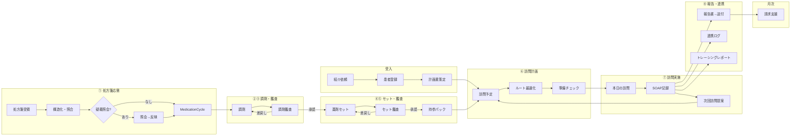

# PH-OS Pharmacy — Implementation Plan

> 仕様書: [ワークフロー/多職種連携](docs/visit-report-collab-spec.md) | [設計判断](docs/decisions.md)
> アーキテクチャ / デザイン方針: CLAUDE.md 参照
> ※ Phase 3 は Phase 2 完了時に詳細化する

### 明示的な非ゴール（既存レセコン/薬局システムの責務）

- フル在庫管理（発注・仕入・棚卸し・在庫評価）→ PH-OSは在庫医薬品マスタ（採用薬フラグ+引当フラグ）の薄い層のみ
- 麻薬管理帳簿・毒薬劇薬受払い簿 → レセコンが法定帳票を担う
- 領収書・調剤報酬明細書の発行 → レセコンの中核機能（二重入力回避）
- 会計・一部負担金の収納管理 → レセコン/会計システム
- POS・仕入・発注 → 在庫管理専用システム

### 実装優先原則（今回レビュー反映）

- MVPは「訪問日次運用 + 報告送付 + 最低限の処方差分/持参判定」を最優先にし、重いマスタ/処方安全チェック/請求自動化は後段に寄せる
- `MedicationCycle` は「処方起点の1運用サイクル」を維持する。MVPでも訪問予定は処方差分・持参可否・未解決課題と切り離さない
- PH-OS / レセコン / 電子薬歴 / 在宅支援システムの責任分界を先に固定し、二重入力を避ける
- 公開情報ベースの市場比較では、既存製品は「訪問記録・計画書/報告書作成・FAX/メール送付・現場共有」に強い。初期価値は最適化機能より、現場記録/連携/持参漏れ防止に置く

### 新機能: プラットフォーム運営者コンソール（監査付きブレークグラス） `cc:WIP`

<!-- 2026-07-03 ユーザー要望「システム開発者・管理者が裏からテナント横断でデータ確認・アクセス・操作」を、無記録バックドアではなくベストプラクティス準拠の監査付きブレークグラスとして設計・実装。設計判断は fable(ユーザー委任)。SSOT=docs/design/platform-operator-console-design.md -->

- [x] **P-0（MVP: 閲覧+全ログ）** ✅2026-07-03 land(89ecbb65/e32f807d/e535fac0/903926bc/e7a055f2)・gate全green・独立セキュリティレビュー APPROVE（blockerなし）
  - schema: PlatformOperator/BreakGlassSession（org_id無し・RLS非対象・app層認可）+ migration 20260703100000（非破壊）
  - core: operator gate(least-privilege tier) / break-glass seam（**BYPASSRLS不使用**でRLSをtarget1テナントにpin）/ step-up MFA(password+TOTP再認証) / fail-closed監査
  - API 5route + UI（独立 /platform segment・server gate）/ テスト52件（lib44+UI8）
- [ ] **P-1**: write ops の限定操作+追加監査+アラート / hash-chain tamper-evidence / operator suspend時のsession cascade revoke / MFA試行レート制限 / 全テナント横断監査ダッシュボード
- [ ] **P-2**: 多職種展開（医科・訪問看護）向け operator 権限汎用化

### 直近トラック: 開発方針 2026-07-03 — 実装ロードマップ v2（3レビュー再構成） `cc:WIP`

<!-- 2026-07-03: v1(9観点スキャン)を ①リリースクリティカルパス監査 ②網羅性批判レビュー(BLOCKED/ULTRACODE/FEATURE_QUEUE/spec 突合+コード抜き打ち7点=全て新鮮を確認) ③依存・実装順検証 の3独立レビューで実装向けに再構成。リリース判定は実装済みの pilot-launch-dossier(src/server/services/pilot-launch-dossier.ts: UAT/PMDA/backup/ISMS 4軸+org監査)を SSOT とし、外部依存を前提条件へ分離、技術タスクを Wave 0-3 へ再配列。計画のみ・実装未着手。v1 全文はコミット 1d315a86 参照。 -->

**v1 所見サマリ（有効）**:

- 基盤は高水準: 認可wrapper 約293route / no-store 260file / DBトリガ監査 / unit 1,229file・APIカバー97% / E2E主要5動線 / 点数改定レジストリはデータ駆動で2026医療改定 confirmed 済 / 依存EOLなし
- 最大の製品ギャップ: **算定要件の構造化未着手**（`docs/visit-report-collab-spec.md` v2 算定カバレッジ32項目中 充足5）
- 医療安全: CDS false-negative 8件 + safety5(CE01/CE02) / セキュリティ: RLS 実体欠落~33表+DB層未証明・PHI閲覧監査36route未記録 / 速度: prescription-intakes POST 33.7s / FE: React Compiler未有効・仮想化ゼロ・画像無圧縮 / 改定耐性: 点数=優秀、薬価版管理なし・next-auth v4 / 水平展開: そのまま展開可8+軽い分離6、要リファクタ=薬局間連携層

**v1 からの主な補正（網羅性レビュー）**:

- 追加: CE01/CE02 safety5（PCA未検品再貸出/訪問prep偽完了）/ EPIC1 RLS 実体欠落~33表+contract再設計 / **billing aggregation over-claim 修正群**（BLOCKED制限解除済・即効）/ spec P2・P5・P6・P7 の未収容分（B-7〜B-10）/ リリースエンジニアリング R群 / BLOCKED human-gate 残6件 / F-20260702-001
- 訂正: 実参照切れは `docs/decisions.md`+旧spec 2ファイル（`visit-report-collab-spec.md` は実在し正）/ O-1 は v0.2 トラックへ統合
- 昇格: afterhours-tz off-by-9h（夜間/休日加算の over/under-claim・confirmed）を P2→Wave1 算定正確性へ
- 分割: B-6→4分割+B-7〜B-10 / H-1→tx-guard epic 14件 / H-2→TZ epic ~14件 / C-7・E-6 は独立作業へ

**リリースマイルストーン**:

- **M1 安全・正確性 green** = Wave 0+1 完了（医療安全 / セキュリティ / 算定正確性の既知バグ 0）
- **M2 パイロット技術線** = Wave 2 R群完了で dossier のコード側 blocker 0。外部前提の完了をもって pilot GO
- **M3 製品の芯** = Wave 3 B群（算定要件構造化 = multi-quarter プログラム）

#### 前提条件（外部・人間作業） `cc:blocked`

- [ ] PMDA メディナビ/マイ医薬品集 登録 + `PMDA_*_URL` secrets（旧0-2i）
- [ ] backup live drill 実施と `[mode:live]` 記録（旧I-04/12-8）
- [ ] ISMS 審査機関見積・予算・キックオフ（旧1a-6/1b-6。vendor comparison/decision memo の記入で dossier green）
- [ ] AWS 本番プロビジョニング + `ALERT_EMAIL` 設定 + SNS email 購読 confirm + 本番 Sentry DSN
- [ ] パイロット薬局 UAT（critical/high blocker 0 で phase2_entry green。旧1b-9）
- [ ] 利用規約/プライバシーポリシー本文の法務確定（掲示ページ実装は W2-R4）
- [ ] 音声メモ STT の AWS Transcribe creds（旧D-8-3）

#### Wave 0 — quick wins（依存なし・並行・各S） `cc:完了` <!-- 2026-07-03 ultracode Wave0 実装: a5eb996f..b02d4899 の15コミット(W0-3/4結合)。全項目 独立レビューapprove+gate green(typecheck/no-unused/build/colors/boundaries)。W0-8判定=全てby-design leak無し -->

- [x] W0-1 colors:check を ci.yml へ（旧G-1。スクリプトは 4510ee7f 導入済み）
- [x] W0-2 renovate/dependabot 導入（旧C-6）
- [x] W0-3 import 方向 lint 境界: 共通コア→薬局固有の import を warn 可視化（旧F-1・水平展開の柵）
- [x] W0-4 軽量 pre-commit（変更ファイル限定 lint/format。旧G-2）
- [x] W0-5 docs 参照切れ解消: Plans.md/CLAUDE.md が指す `docs/decisions.md`+旧spec 2ファイルの3参照を実在 docs へ更新 or 復元（旧G-4 訂正版）
- [x] W0-6 改定運用 runbook docs（旧C-4）
- [x] W0-7 cycle_id 疎化+（組織,職種）N者連携の設計メモ（旧F-6・docs のみ）
- [x] W0-8 cron 全org横断 8箇所の by-design/leak 判定（旧A-6）
- [x] W0-9 optimizePackageImports 追加（旧E-4）
- [x] W0-10 無制限 findMany 棚卸し（旧D-6。EPIC8 CE11/N18/N23/CXR2-PERF01 と統合）
- [x] W0-11 介護2027改定データ枠（旧C-7a） / W0-12 prisma generator リンク堅牢化（旧C-7b）
- [x] W0-13 担当者命名の抽象化規約（旧F-3）
- [x] W0-14 重複解消: formatYen×3（null→0円実害）/ SectionCard×4+dead / QR readString（旧H-3）
- [x] W0-15 腎機能ラベル JST 共有フォーマッタ（FEATURE_QUEUE F-20260702-001 収容）
- [x] W0-16 safety-check CDS fail-open 修正: fetcher `catch→[]` 廃止・degraded バナー+再試行（旧A-1）— `safety-check-content.tsx:73-90`

#### Wave 1 — P0 安全・セキュリティ・算定正確性（M1 必須） `cc:WIP` <!-- 2026-07-03 安全レーン完了(CDS5/safety5=na/算定3/RLS contract/決定3)。承認レーン W1-7〜W1-12(+W1-12f/HG-1..5)全承認→land済(8d614c2a/db2ce0bf/e58e3aae/2c511a64/14318d48)、gate全green+reviewer-audit APPROVE。残=W1-3据え置き2件(疑義KPI full-count=意図的仕様 / summary_template_kind_count定義待ち)+W1-4/W1-5等の残スライスのみ -->

安全レーン（W0-16 に続き直列・1件ずつ厳格レビュー）:

- [x] W1-1 CDS false-negative 8件（旧A-2）: allergy cross-check skip(X02/CXR1-MSR01) / drug_master_id・code null 無言スキップ(F81/X03) / problem-list 禁忌未連携(F82) / eGFR silent-clean(X04) / 添付文書 alert unsorted slice(X05) ✅624e09fe
- [x] W1-2 safety5 CE01/CE02（v1漏れ）: PCA返却検品待ちクエリ崩壊=未検品ポンプ再貸出 / 訪問prep失敗のチェックリスト偽完了 ✅na（既修正を実証: CE01=pca-pumps fail-close 済み/CE02=433918e2 visit-record-detail fail-close 済み）

算定正確性レーン（over/under-claim。billing 制限解除済・B 構造化より先行）:

- [x] W1-3 billing aggregation correctness: 空 `requirements_status {}`→claimable / singleBuilding 月次 count tier / delivery_only count↔claim 不一致 / cross-month 返戻 overcount / wrong-domain transmit / `jobs/daily/billing.ts` org_id 欠落（BLOCKED mainui/WF-20260625 両票） ✅b96c0534
- [x] W1-4 afterhours-tz: 夜間/深夜/休日加算の UTC/JST off-by-9h（confirmed。prod=UTC で誤算定） ✅b96c0534
- [x] W1-5 set-derivations daycount rounding（算定隣接・BLOCKED WF-20260625） ✅ca285642

RLS レーン（DB層 backstop。proof より実装が先）:

- [x] W1-6 RLS contract 再設計スライス（rls-policy-contract.test のハードコード allowlist 是正含む。旧A-4 前段） ✅9b7982e4
- [x] W1-7 RLS 実体欠落表の実装（11表に ENABLE+tenant_isolation+FORCE、PHI: PatientPackagingProfile/VisitScheduleContactLog 含む。3表=IntegrationJob/PrescriberInstitution/User は意図的除外を台帳明記） ✅2026-07-03 承認レーン land(8d614c2a)・gate全green+reviewer-audit APPROVE
- [x] W1-8 非superuser ロール ph_os_app+FORCE RLS proof（`setup-rls-test-role.sql`、`rls.test.ts` it.skip→env-gated、両policy形に頑健化、CI 配線） ✅2026-07-03 land(8d614c2a/14318d48)

認可・PHI レーン（human 承認）:

- [x] W1-9 dispense-results PATCH canDispense 必須化（POST と対称、clerk/driver/external 403 + owner/admin 200 実証） ✅2026-07-03 land(e58e3aae)
- [x] W1-10 EPIC3 認可/外部共有（external-access canManagePatientSharing化・care-reports F88 cross-patient修正・prescriber-institutions authz・qr-scan F89 fail-close） ✅2026-07-03 land(e58e3aae/2c511a64)
- [x] W1-11 EPIC7 no-store/PHI（mfa setup/verify・prescriber-institutions・webhooks に withSensitiveNoStore） ✅2026-07-03 land(e58e3aae)
- [x] W1-12 BLOCKED human-gate: HG-1 data-explorer 監査+no-harddelete / HG-3 jobs error_log redaction / HG-5 OS通知 PHI redaction / HG-2 settings compliance ranges / HG-4 incidents permission affordance / W1-12f schedule composite FK ✅2026-07-03 land(2c511a64/db2ce0bf)・BLOCKED.md RESOLVED注記済

決定レーン（後段 unblock。実装なし・決定文書のみ）:

- [x] W1-13 請求エンジン二重化の収束決定（billing-rules ↔ `src/phos/domain/claim`。**W2-B1 の前提**。旧C-3） ✅cc85fb67・ラティファイ済=Option C(billing-rules一本化/phos claim凍結保全)
- [x] W1-14 React Compiler 方針決定（旧E-2 前段） / W1-15 API バージョニング方式決定（旧O-4/14-5） ✅cc85fb67・ラティファイ済=有効化(実装は W2 スライス)

#### Wave 2 — リリース機構・性能・設計着地（M2 技術線） `cc:WIP` <!-- 2026-07-03 BatchA 16スライスland(R1/R2/R3/R5/R6/P1/P4/B1a/RC=React Compiler有効化/F3a-d/M1/T1+fixture追随4件)。全量テスト1284file/12788tests green・build green。B1aは設計のみ=実装(B1b)はBatchC。残: P2(index mig=承認)/P3/P5/F1/F2/F4/M2/Q1/Q2 -->

R リリースエンジニアリング（新設・クリティカルパス監査由来）:

- [x] W2-R1 本番 migration 適用の deploy パイプライン組込 or 承認付き runbook（deploy-production は Amplify trigger のみで `migrate deploy` が無い） ✅2026-07-03 BatchA 実装済(gate: 全量1284file green)
- [x] W2-R2 ジョブ失敗の人到達通知（`runner.ts:159` は in-app のみ → CloudWatch metric→SNS or web-push/SES 配線） ✅2026-07-03 BatchA 実装済(gate: 全量1284file green)
- [x] W2-R3 SSK/MHLW DrugMaster 本番初期ロードの実行手順+証跡（importer は ready。PMDA は前提条件成立後に追加） ✅2026-07-03 BatchA 実装済(gate: 全量1284file green)
- [ ] W2-R4 利用規約/プライバシーポリシー掲示ページ実装（本文=法務前提条件）
- [x] W2-R5 パイロット向けユーザー操作ガイド（主要動線: 応需→調剤→訪問→報告→請求） ✅2026-07-03 BatchA 実装済(gate: 全量1284file green)
- [x] W2-R6 PHI 閲覧監査の共通層設計→36route 段階適用（3省2GL アクセス記録。旧A-5） ✅2026-07-03 BatchA 実装済(gate: 全量1284file green)

性能レーン（`pnpm perf:smoke` で before/after 実測先行）:

- [x] W2-P1 prescription-intakes tx 再設計 + DrugMaster OR 検索最適化（旧D-1+D-3 統合。同一 service で直列必須。BLOCKED RUN-20260622-001 根治） ✅2026-07-03 BatchA 実装済(gate: 全量1284file green)
- [~] W2-P2 index 追加（3複合index migration land ✅2026-07-03 db2ce0bf） / W2-P3 プール方針明文化 ✅BatchA(00984095) / W2-P5 レート制限拡大 ✅BatchA(ce260f26) ／ 残: W2-P4 マスタ系 unstable_cache（旧D-4）

B 設計着地:

- [x] W2-B1 BillingRequirementCatalog 設計→実装（旧B-1。DB 0・コード中。W1-13 決定が前提。`billing-requirement-validator.ts` の cap-counting/週境界を継承し回帰で担保） ✅2026-07-03 BatchA 実装済(gate: 全量1284file green)

FE:

- [ ] W2-F1 画像リサイズ+圧縮共通化（旧E-1・訪問動線直効） / W2-F2 仮想化・ページング（旧E-3） / W2-F3 false-empty 残5件（旧E-5） / W2-F4 offline lifecycle 偽同期の残（CE12/CE13/N21）

モジュール化・テスト:

- [x] W2-M1 Task schema 移設+core/pharmacy 区分（旧F-2） / W2-M2 権限の職種×capability 2軸整理（旧F-4） ✅2026-07-03 BatchA 実装済(gate: 全量1284file green)
- [x] W2-T1 テスト空白解消: `src/server/jobs/daily` + `billing-rules/revisions`（旧G-3・金額直結） ✅2026-07-03 BatchA 実装済(gate: 全量1284file green)

品質負債 epic:

- [x] W2-Q1 tx-guard epic 14件（旧H-1 拡張: CE05/F83/CE06/N32/X06/X07/X09/X10/CXR1-CONC01/02 ほか。partial-unique F84/F85/X08 は migration ゲート） ✅2026-07-03 BatchB land(3c47febc..fa99f46d)
- [x] W2-Q2 TZ epic ~14件（旧H-2 拡張: CE03/07/08/09/10/15/16/N19/N24/N26/N30/CXR2-TZ01/02。helper 束ねで一括） ✅2026-07-03 BatchB land(3c47febc..fa99f46d)

#### Wave 3 — 製品の芯・高 blast（安全網整備後） `cc:TODO`

安全網先行（破壊的 migration の前提）:

- [ ] W3-S1 staging 環境（旧O-2/12-4） / W3-S2 PRE-03 データ移行検証フレームワーク（pre-count/post-integrity/rollback SQL）

B 算定構造化（spec ロードマップ順。W1-13/W2-B1 済前提）:

- [ ] W3-B2 VisitInstruction+SpecialPatientStatus（非破壊 mig・中） ∥ W3-B5 訪問実施エビデンス visit_started_at/ended_at（小）
- [ ] W3-B3 加算エビデンス群（StructuredSoap 拡張+加算コードマスタ）
- [ ] W3-B4 claim-record projector（report-generator 分割。F-5 境界 API 化と直列調整）
- [ ] W3-B6a 報告書 finalize/lock 版管理[RPT-007] / W3-B6b 到達証跡ハードゲート[KYO-007/008] / W3-B6c 保存年限構造化[RPT-002/009] / W3-B6d 単一建物月次動的計数[ZTK-06]（旧B-6 の4分割）
- [ ] W3-B7 spec P2: ManagementPlanContent 構造化+医療保険の月次見直し強制（KYO-003/004）
- [ ] W3-B8 spec P6: 多職種 inbound 双方向モデル（多対多 resolution_status, ARCH-6）+FAX/紙 OCR 取込(COLLAB-01)+到着通知(COLLAB-02)+outbound 受領ループ(COLLAB-03)
- [ ] W3-B9 spec P5: cycle_id 任意化+緊急訪問薬剤管理指導料（料1/料2）+オンライン46単位・緊急通算の月キャップ統合
- [ ] W3-B10 spec P7: 破壊的 migration 群（CareReport.visit_record_id FK 昇格 / 残薬 canonical 一本化 / レガシー SOAP 削除。human 承認+W3-S1/S2 前提）

改定・依存耐性:

- [ ] W3-C1 薬価 effective-dated 版管理+調剤時スナップショット（旧C-1・L・mig） / W3-C2 レジストリ外ハードコード点数吸収（旧C-2） / W3-C5 next-auth v4→Auth.js v5（旧C-5・L）

FE 仕上げ（低優先）:

- [ ] W3-E1 フォーム RHF 統一（旧E-6a） / W3-E2 野良 table 16file の DataTable 集約（旧E-6b） / W3-E3 drug-master-content(5112行) 分割（旧E-6c）
- [ ] W3-M1 sync-engine/report-generator の境界 API 化（旧F-5。W3-B4 と直列調整）

運用:

- [ ] W3-O1 v0.2 e2e 実証（下記 v0.2 トラックで管理・重複解消） / W3-O3 RUM（旧12-7残） / W3-O5 TZ fail-close 有効化（prod TZ 設定後・prod ゲート） / W3-O6 証跡写真+S3 Object Lock+set-photo 束縛 / W3-O7 音声メモ STT `cc:blocked`

**直列化必須ペア**: W2-P1 内 D-1↔D-3（同一 service）/ W0-16→W1-1（CDS 系）/ W1-13→W2-B1→B 全系 / W3-B4↔W3-B6↔W3-M1（report-generator 競合）/ W3-B2・B3・B5 の mig は逐次 / W1-14 決定→React Compiler 実装。Wave 内の各レーンはファイル非重複で並行可。

**実行規律**: 各スライス = maker(Claude) → reviewer-audit 独立レビュー → objective gate（typecheck / typecheck:no-unused / lint / test / build / colors:check）。auth/security/migration/prod-deploy は human 承認（§15）。破壊的 mig（W3-B6d/B10/C1）は W3-S1/S2 完了が前提。perf 系は perf:smoke 実測を前段に。

### 直近トラック: v0.2 薬局間連携仕様追随（2026-06-19） `cc:TODO` <!-- 2026-07-03 監査: コード/migration は完了(20260619* 2本が prisma/migrations に存在)。残は local e2e DB への migration 適用と全行程ブラウザ実証のみ(route-mocked proof は完了済み) -->

- [ ] ブラウザ実証: 患者カード作成 → 同意/リンク/有効化 → 訪問依頼 → 訪問記録 → 請求 → 報告下書き
  - [x] Route-mocked browser proof: `consent_pending` 共有ケースを前提に、同意登録、患者リンク基幹承認/協力受諾、共有有効化、訪問依頼、協力訪問記録、基幹確認、医師報告下書き、請求候補生成、請求書 PDF リンクまでを検証
  - [ ] 患者カード作成の browser 直踏み: local e2e DB に v0.2 migrations (`AuditLog.actor_pharmacy_id`, `ConsentRecord.document_file_id`) が未適用のため、患者詳細 SSR が Prisma P2022 で停止。患者カード作成自体は unit で継続カバー。
- [ ] 新規マイグレーションの実DB適用確認

### 外部システム比較から採る方針

- 調剤レセコン系: 在宅スケジュール/介護請求入力まで持つ製品があるが、PH-OSでは請求エンジン全面置換はしない
- 電子薬歴系: タブレット記録、写真、訪問報告書・計画書作成はベースライン機能として扱う
- ふぁむけあ系: 報告書作成、FAX/メール送信予約、トレーシングレポート、店舗間共有は MVP の参照ベンチマークとする
- シジダス系: 一包化委受託/外部委託オペレーションは Phase 2+ の連携拡張テーマとして扱う

## ワークフロー全体像（8工程）

| #   | 工程名         | 英語キー            | 主担当         | 入力                                | 出力                           |
| --- | -------------- | ------------------- | -------------- | ----------------------------------- | ------------------------------ |
| 1   | **処方箋応需** | prescription_intake | 受付/事務      | 処方箋（紙/FAX/電子/施設/リフィル） | 構造化明細、MedicationCycle    |
| 2   | **調剤**       | dispensing          | 調剤担当薬剤師 | 処方明細 + 在庫確認                 | 調剤実績、差異記録、持参候補   |
| 3   | **調剤鑑査**   | dispense_audit      | 鑑査担当薬剤師 | 処方原本 + 調剤実績                 | 承認/差戻し + 処方安全アラート |
| 4   | **薬剤セット** | medication_set      | セット担当     | 鑑査済み薬剤                        | セット構成、持参パック         |
| 5   | **セット鑑査** | set_audit           | 鑑査担当       | セット実績                          | 承認/部分承認/差戻し           |
| 6   | **訪問計画**   | visit_planning      | 事務/薬剤師    | 持参確定品 + 患者スケジュール       | 訪問予定、ルート、準備チェック |
| 7   | **訪問実施**   | visit_execution     | 訪問担当薬剤師 | 訪問予定 + 持参薬 + 前回課題        | SOAP記録、残薬、課題、介入     |
| 8   | **報告・連携** | reporting           | 薬剤師/事務    | 訪問記録                            | 報告書送付、送達追跡、連携ログ |

---

## Phase 0: 基盤構築・データ定義 `cc:blocked` <!-- 0-2i PMDA登録 + 0-5 I-04 バックアップ実地 が外部依存でブロック -->

> 実装順は **Phase 0a Core → Phase 1a MVP → Phase 0b Advanced → Phase 1b/2** を原則とする
> 目的: Phase 1a を Phase 0 全量完了で待たせない。現場検証に必要な最小基盤を先に通す

### 0a. Core と 0b. Advanced の分割方針

**Phase 0a Core（Phase 1a 着手条件）:**

- 0-1. プロジェクト初期化
- 0-2a〜0-2d, 0-2f〜0-2h のうち MVP必須テーブル
- 0-3. 認証・権限・RLS基盤
- 0-4. 共通基盤
- 0-5. 監視・バックアップ・ガイドライン準拠のうち MVP必須項目

**Phase 0b Advanced（Phase 1a 後続でよい）:**

- 0-2e. 医薬品マスタ系
- 0-2i. 医薬品マスタ取込パイプライン
- 施設基準管理の高度集計
- 請求候補の高度ルールエンジン

### 0-2i. 医薬品マスタ取込パイプライン `cc:blocked` <!-- PMDA メディナビ登録（外部手続き）待ち -->

> depends: 0-2e（マスタテーブル作成後） | DoD: 全データソースから取込完了、DrugMaster 1万3千品目+、相互作用データ検索可能
> 2026-03-27 進捗:
>
> - SSK 公開ページから最新 ZIP を解決し、ZIP 展開・Shift-JIS CSV 解析・`DrugMaster` upsert を行うサービスを追加
> - SSK 仕様書では医薬品全件マスターがダブルクォート付き CSV のため、実装は固定長ではなく quoted CSV パーサーを採用
> - `DrugMasterImportLog` 一覧 API / SSK 手動起動 API / 管理画面の手動取込ボタンを追加
> - SSK 項目 28/34 に合わせて `dosage_form` / `transitional_expiry_date` を反映
> - `/api/jobs/drug-master-refresh` と EventBridge 月次ジョブ雛形を追加し、最新 ZIP URL が未更新なら skip する差分確認を実装
> - SSK 項目 36（薬価基準収載年月日）から新医薬品の14日制限を導出し、`max_administration_days` を自動設定

**SSK基本マスター取込（第1層・保険請求基盤）:**

**厚労省 薬価・一般名マスタ取込（第2層）:**

**PMDA 添付文書取込（第3層・処方安全チェック基盤）:**

- [ ] PMDAメディナビ登録（無料）→ マイ医薬品集サービスで全医療用医薬品XMLを一括DL
  - 2026-03-28: importer 自体は実装済みだが、全量/差分 ZIP の取得は PMDA メディナビ/マイ医薬品集の登録と配布 URL 管理が前提
  - 2026-03-31: 管理画面に `PMDA_PACKAGE_INSERT_FULL_URL` / `PMDA_PACKAGE_INSERT_DELTA_URL` の運用前提を明記済み。ローカル実装完了、残作業は PMDA 側登録と配布 URL 発行のみ
  - 2026-04-01: `/api/admin/pilot-launch-dossier` と readiness 集計からは URL 実値を返さず、設定有無のみを返すように変更。残作業は PMDA 側登録と URL 発行、その後の実地 import 疎通確認のみ
  - 2026-04-04: URL 調査結果 — 登録不要の一括DL URLは存在しない。個別DLは `info.pmda.go.jp/go/pack/{ID}/` で可能だが一括は Medi-Navi 登録必須（無料）。登録: https://www.pmda.go.jp/safety/info-services/medi-navi/0007.html / サービス: https://www.pmda.go.jp/safety/info-services/medi-navi/0012.html

**手動構造化データ投入（第4層・高齢者/腎機能）:**

**管理画面:**

### 0-5. 監視・バックアップ・ガイドライン準拠 `cc:blocked` <!-- I-04 バックアップ復旧試験（AWS認証情報）待ち -->

> depends: 0-1 | DoD: 復旧試験完了、監視稼働、ガイドライン文書5点+本番インフラ完備
> 2026-03-28 GAP分析: 本番インフラ・コンプライアンス文書・セキュリティ強化の3領域で重大な不足を検出

**0-5a. 本番インフラ — パイロット前ブロッカー:**

- [ ] I-04: バックアップ復旧試験の実施 `cc:TODO`
  - `docs/compliance/backup-recovery-drill.md` の手順に沿って初回実施
  - RDS ポイントインタイムリカバリ、S3 バージョニング復元、Cognito ユーザープールバックアップ
  - 実施記録を `docs/compliance/backup-recovery-drill.md` に追記
  - RTO 4h / RPO 24h の実測検証
  - 2026-03-31: `tools/scripts/backup-recovery-check.ts` と `pnpm backup:drill:check` を追加し、前提確認と試験記録追記を自動化
  - 2026-03-31: `corepack pnpm backup:drill:check --append ...` で机上訓練の前提確認記録を追記。実地復旧は AWS 接続情報未設定のため継続タスク
  - 2026-03-31: ローカル確認では必須ファイルは揃っており、`DATABASE_URL` / `AWS_REGION` 未設定のみが live drill の blocker。AWS 権限付与後に同手順で実地記録を追記する
  - 2026-04-01: `backup:drill:check --append --mode live|tabletop` で机上訓練と実地復旧を区別して記録できるようにし、 dossier/readiness でも live drill 未実施を別 blocker として検出する

**0-5b. セキュリティ強化:**

**0-5c. コンプライアンス文書（3省2ガイドライン監査対応）:**

## Phase 1a: MVP — 患者・訪問・記録 `cc:blocked` <!-- 1a-6 ISMS認証（外部依存）でブロック -->

> depends: Phase 0a Core 完了
> 出口条件: 患者登録→処方差分確認→持参可否確認→訪問計画→訪問記録→報告書送付の基本サイクルが回る
> ※ MVP でも `MedicationCycle` を維持するため、①〜⑤の全量実装は後段でも「薄い upstream slice」は先に入れる

## Phase 1b: ①処方箋応需→②調剤→③調剤鑑査→処方安全チェック `cc:blocked` <!-- 1b-6 ISMS + 1b-9 パイロットUAT（外部依存）でブロック -->

> depends: Phase 1a 完了
> 出口条件: 処方箋応需→疑義照会→調剤→鑑査→訪問→報告の完全サイクルが回る

### 1b-6. ワークフローダッシュボード + テスト `cc:blocked` <!-- ISMS認証プロセス（外部依存）待ち -->

> depends: 1b-1〜1b-5 | DoD: E2Eで処方箋応需→調剤→鑑査→訪問→報告の完全サイクル通過

- [ ] ISMS認証プロセス開始
  - 2026-03-31: 技術側の prerequisite（アクセス制御、変更管理、データ分類、脆弱性管理、委託先評価、教育計画、3省2ガイドライン統制マッピング）は文書化済み。残作業は審査機関選定・見積取得・キックオフ日程確定
  - 2026-04-01: `pilot:dossier` / `/api/admin/pilot-launch-dossier` から comparison table / decision memo の未着手を継続検出できる状態を確認。残作業は外部見積取得と社内意思決定のみ

### 1b-9. パイロット薬局 UAT + フィードバック反映 `cc:TODO`

> depends: 1b-6 | DoD: パイロット薬局で1週間の実運用テスト完了、フィードバック反映

- [ ] パイロット薬局での実運用テスト（1週間）
- [ ] フィードバック収集→優先度付け→Phase 2 開始前に修正適用
- [ ] 施設患者の有無を確認 → 施設なしなら FacilityVisitBatch と自動ルート最適化は Phase 2 に移動
- [ ] セット患者の有無を確認 → セット患者なしの場合は Pilot対象を明示し、セット本格機能は Phase 2 へ
  - 2026-03-31: `/api/admin/pilot-readiness`、UAT 画面の readiness 要約、`pnpm pilot:readiness -- --org <org_id>` を追加。施設患者数 / セット pilot 対象 / UAT blocker を即時確認可能にした
  - 2026-03-31: `pnpm pilot:org-audit -- --org <org_id>` と `docs/operations/target-pharmacy-onboarding-checklist.md` を追加。店舗構成 / facility linked case / set pilot / 16km圏外患者を一括確認できる
  - 2026-03-31: `UatFeedback` に status / owner / work item / due date / resolved_at を追加し、`/api/admin/uat-feedback/[id]` と `/admin/uat` で triage-to-closure 導線を実装した
  - 2026-03-31: `pnpm pilot:dossier -- --org <org_id>` を追加。pilot readiness / org audit / UAT summary / PMDA / backup / ISMS の外部前提を 1 つの Markdown dossier に束ねて Phase 2 判定共有を自動化した
  - 2026-03-31: `/api/admin/pilot-launch-dossier` と `/admin/uat` の dossier card を追加し、CLI を開かずに同じ統合判定を管理画面から確認できるようにした
  - 2026-04-01: `/api/pharmacists?include_collaborators=true` と `/admin/uat` の担当者候補を user 単位で重複排除し、triage owner 選択の曖昧さを解消。外部 readiness は PMDA URL 実値を返さず、backup は live/tabletop を区別して表示するよう修正
  - 2026-03-31: 現時点でローカル側の readiness 集計・フィードバック収集・triage 管理は実装済み。残作業は対象薬局 org を指定した 1 週間運用と、実地結果に基づく修正反映のみ

---

- Phase 2: セット・月次運用・連携強化 `cc:完了` → 完了・[docs/plans-archive.md](docs/plans-archive.md) へ移設
- Phase 2b: 実務機能強化 `cc:完了` → 完了・[docs/plans-archive.md](docs/plans-archive.md) へ移設
- Phase 2c: マスター機能整備 + データリンク強化 `cc:完了` → 完了・[docs/plans-archive.md](docs/plans-archive.md) へ移設
- Phase 3: 外部連携・最適化・通知高度化 `cc:完了` → 完了・[docs/plans-archive.md](docs/plans-archive.md) へ移設
- Phase 4: コードリファクタリング (2026-03-31) `cc:完了` → 完了・[docs/plans-archive.md](docs/plans-archive.md) へ移設

## 設計判断 → [docs/decisions.md](docs/decisions.md)

| ID   | 確定案                                                                            | 状態 |
| ---- | --------------------------------------------------------------------------------- | ---- |
| D-01 | **電子お薬手帳QRコード読取**（JAHIS Ver.2.5）                                     | 確定 |
| D-02 | **初日からマルチテナント**（Prisma + PostgreSQL RLS）                             | 確定 |
| D-03 | Ph1a: 連携ログ+文書送付 → Ph1b: 依頼/照会WF → Ph2: 外部共有                       | 確定 |
| D-04 | Ph1a: 読取専用キャッシュ → Ph2: 下書き+同期                                       | 確定 |
| D-05 | **候補表示+3層バリデーション**（自動算定しない）                                  | 確定 |
| D-06 | **データ移行なし**（新規構築）                                                    | 確定 |
| D-07 | **4層モデル**（標準化/法人/店舗/個人）                                            | 確定 |
| D-08 | **Prisma = メインORM + PostgreSQL RLS**（工程権限はフラグ制御）                   | 確定 |
| D-09 | **AWS 全面採用**（ISMAP準拠、3省2ガイドライン対応）                               | 確定 |
| D-10 | **Google Routes API** でルート最適化（住所→座標はジオコーディングAPI）            | 確定 |
| D-11 | **MVPは現場運用優先**（訪問記録/報告/持参判定を先行、最適化と高度請求は後段）     | 確定 |
| D-12 | **外部システム責任分界を先に固定**（SourceOfTruthMatrix を実装前に整備）          | 確定 |
| D-13 | **PDF生成: React-PDF サーバーサイド実行**（一括出力はキュー+ZIP+S3）              | 確定 |
| D-14 | **楽観的ロック**（version カラム + 409 Conflict）で同時編集競合を制御             | 確定 |
| D-15 | **バックグラウンドジョブ: EventBridge Scheduler**（日次/夕方/翌営業日/月次の4層） | 確定 |

### 残る確認事項

- [ ] 初期ターゲット薬局の店舗数・組織構成
  - 2026-03-31: システム側では `pilot:readiness` と管理画面で org 単位の readiness を確認可能。加えて `pilot:org-audit` で店舗数 / 役割別人数 / site ごとの service area を確認可能
  - 2026-03-31: `pilot:dossier` で店舗構成・role count・Phase 2 判定・外部 blocker を同時に共有できる
  - 2026-03-31: `/admin/uat` の dossier card から PMDA / backup / ISMS と同じ画面で確認できる
  - 2026-03-31: 確定値そのものは導入対象薬局へのヒアリング待ち
- [ ] 薬局の16km圏内カバレッジ
  - 2026-03-31: `pilot:org-audit` が primary residence と pharmacy site の緯度経度から 16km 圏外患者と位置情報不足患者を抽出する
  - 2026-03-31: `pilot:dossier` が 16km 圏外患者プレビューと Phase 2 推奨を readiness/UAT と同じレポートにまとめる
  - 2026-03-31: 最終確認は対象薬局住所と訪問対象住所の実データ投入待ち
- [ ] ISMS認証の開始時期・予算
  - 2026-03-31: 技術 prerequisite は完了。`docs/compliance/isms-vendor-comparison-template.md` を追加し、見積比較 / 予算判断の記録様式を固定
  - 2026-03-31: `pilot:dossier` が ISMS comparison template / decision memo の未着手状態を検出し、external blocker として出力する
  - 2026-03-31: 開始時期 / 予算の最終確定は審査機関見積と経営判断待ち

---

## Phase 5-PRE: 患者モデル変更の前提基盤 `cc:TODO` <!-- 2026-07-03 再監査: 旧注記「計画文書群は未作成」は誤り。PRE-01/02/04/05/06 の計画文書は作成済み(docs/phase5-cutover-strategy.md / phase5-migration-serialization.md / phase5-api-ui-sync-strategy.md / phase5-rollback-playbook.md / phase5-patient-ux-migration.md)→チェック消化済化。残は PRE-03 検証フレームワーク専用文書のみ(cutover-strategy/p00-investigation に部分記載あり・低優先) -->

> Phase 5 は Patient モデルを根本変更するため、安全な実行基盤が必須。
> 医療システムでデータ移行失敗 = 請求エラー・CDS 機能停止・患者安全リスク。

### PRE-03: データマイグレーション検証フレームワーク `cc:TODO`

- [ ] 各マイグレーションに: pre-count check / post-integrity check / rollback SQL
- [ ] テスト用本番相当データセットの準備
- [ ] 検証スクリプトテンプレート作成
- [ ] `VisitRecord.structured_soap.objective.lab_values` から `PatientLabObservation` への backfill 検証手順を追加
- [ ] allergy / insurance / packaging だけでなく、lab history 移行の検算項目を用意
- **受入条件**: 全データマイグレーションにロールバック手順が存在すること

## Phase 12: インフラ・運用基盤整備 `cc:TODO` <!-- 2026-07-03 再監査: 12-5(Secrets Manager) は完了済みのため旧注記から除外。実残は 12-4(staging 環境) と 12-7 の RUM サブ項目のみ。12-8 は外部依存(AWS 実環境) -->

> 本番運用の信頼性確保。CI/CD・監視・シークレット管理

### 12-4. ステージング環境構築 `cc:TODO`

- [ ] `APP_ENV=staging` 環境変数 + 環境別設定(`.env.staging` 不在を 2026-06-11 確認)
- [ ] ステージング用 RDS + Cognito ユーザープール
- **受入条件**: staging 環境で本番同等のテストが可能なこと

### 12-8. バックアップ復旧実地訓練 `cc:blocked` <!-- I-04 と同一の AWS 認証情報・実環境依存 -->

- [ ] RDS スナップショットからの実際のリストア実行
- [ ] S3 バージョニングからのオブジェクト復元テスト
- [ ] RTO/RPO の実測値を `backup-recovery-drill.md` に記録
- **受入条件**: RTO 4時間以内が実証されること(0-5 の I-04 解消と同時に実施)

---

- Phase 13: テスト・品質基盤強化 `cc:完了` → 完了・[docs/plans-archive.md](docs/plans-archive.md) へ移設

## Phase 14: 外部連携・データパイプライン `cc:TODO` <!-- 2026-07-03 再監査: 14-3 は outbound webhook 実装済み(src/server/services/outbound-webhook.ts)で完全消化。実残は 14-5(API バージョニング戦略、方式は方針判断)のみ -->

> レセコン連携・電子処方箋・OQC の実運用化

### 14-5. API バージョニング戦略 `cc:TODO`

- [ ] バージョニング方式決定（URL prefix vs ヘッダー）
- [ ] 既存エンドポイントの v1 ラベリング
- [ ] 破壊的変更の deprecation ポリシー文書化
- **受入条件**: 外部連携先に影響なく API 変更が可能なこと
