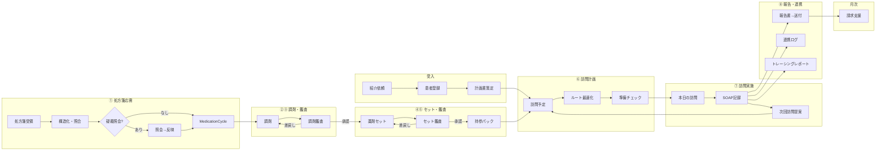

# PH-OS Pharmacy — Implementation Plan

> 仕様書: [ワークフロー](docs/ph-os_pharmacy_workflow_spec_project_context.md) | [多職種連携](docs/ph-os_pharmacy_multidisciplinary_collaboration_spec_project_context.md) | [設計判断](docs/decisions.md)
> アーキテクチャ / デザイン方針: CLAUDE.md 参照
> ※ Phase 3 は Phase 2 完了時に詳細化する

### 明示的な非ゴール（既存レセコン/薬局システムの責務）

- フル在庫管理（発注・仕入・棚卸し・在庫評価）→ PH-OSは在庫医薬品マスタ（採用薬フラグ+引当フラグ）の薄い層のみ
- 麻薬管理帳簿・毒薬劇薬受払い簿 → レセコンが法定帳票を担う
- 領収書・調剤報酬明細書の発行 → レセコンの中核機能（二重入力回避）
- 会計・一部負担金の収納管理 → レセコン/会計システム
- POS・仕入・発注 → 在庫管理専用システム

### 実装優先原則（今回レビュー反映）

- MVPは「訪問日次運用 + 報告送付 + 最低限の処方差分/持参判定」を最優先にし、重いマスタ/処方安全チェック/請求自動化は後段に寄せる
- `MedicationCycle` は「処方起点の1運用サイクル」を維持する。MVPでも訪問予定は処方差分・持参可否・未解決課題と切り離さない
- PH-OS / レセコン / 電子薬歴 / 在宅支援システムの責任分界を先に固定し、二重入力を避ける
- 公開情報ベースの市場比較では、既存製品は「訪問記録・計画書/報告書作成・FAX/メール送付・現場共有」に強い。初期価値は最適化機能より、現場記録/連携/持参漏れ防止に置く

### 直近トラック: 開発方針 2026-07-03（9観点全体スキャン） `cc:WIP`

<!-- 2026-07-03: Claude単独運用で 製品完成度 / 品質負債 / テスト・ゲート / セキュリティ・コンプラ / FE false-empty / FE品質・速度 / BE速度・安定性 / バージョンアップ・診療報酬改定耐性 / コアモジュール化(水平展開) の9観点を並行スキャンし統合。本トラックが以後の開発方針SSOT。同日、実装済み39セクション+62項目を docs/plans-archive.md へ移設し本ファイルを現存タスクのみへ整理。本トラックは計画のみ・実装未着手。 -->

**所見サマリ**:

- 基盤は高水準: 認可wrapper 約293route / no-store 260file / DBトリガ監査 / unit 1,229file・APIカバー97% / E2E主要5動線 / 点数改定レジストリはデータ駆動で2026医療改定 confirmed 済 / 依存EOLなし
- 最大の製品ギャップ: **算定要件の構造化未着手**（`docs/visit-report-collab-spec.md` v2 算定カバレッジ32項目中 充足5。BillingRequirementCatalog / VisitInstruction / SpecialPatientStatus / 加算エビデンス / 摘要欄 projector が schema 0件）
- 医療安全: CDS false-negative 8件（safety-check CDS fail-open、allergy cross-check skip 等）
- セキュリティ: RLSテナント分離がDB層未証明（E2EロールがsuperuserでFORCE RLS bypass）/ PHI閲覧監査 36route 未記録 / dispense-results PATCH 認可非対称 / cron全org横断8箇所
- 速度・安定性: prescription-intakes POST 33.7s（interactive tx 既定5s × DrugMaster OR検索 × プール待ちの複合と推定）/ PrescriptionIntake (org_id,created_at) index 欠落 / マスタ系キャッシュ皆無 / レート制限 auth系4本のみ
- FE: React Compiler 未有効（手動 memo 62+33file 残）/ 仮想化ゼロ / モバイル画像の無圧縮アップロード / RHF は5fileの島
- 改定耐性: 点数=データ駆動で優秀（2028点数改定は数日〜2週で追随可能）。弱点= 薬価の版管理なし（遡及再計算不能）/ レジストリ外ハードコード点数 / next-auth v4 ロックイン / 請求エンジン二重（billing-rules ↔ src/phos/domain/claim）
- 水平展開: 器は良好。**そのまま展開可**=タスク/監査ログ/通知/外部アクセス/コミュニケーション/文書ファイル/プレゼンス/UI基盤（8）。**軽い分離で展開可**=患者情報/スケジュール/訪問記録/報告書/オフライン同期/組織権限（6）。**要リファクタ**=薬局間連携層（base/partner 2者固定）。最強FK汚染= `VisitSchedule.cycle_id → MedicationCycle`

#### A. P0 医療安全・セキュリティ即応 `cc:TODO`

- [ ] A-1 safety-check CDS fail-open 修正: fetcher の非2xx `catch→[]` 潰しを止め degraded バナー+再試行（false-negative 防止）— `src/app/(dashboard)/patients/[id]/safety-check/safety-check-content.tsx:73-90`
- [ ] A-2 CDS false-negative 残（EPIC2 計8件）: allergy cross-check skip(X02/CXR1-MSR01) / drug_master_id・code null 無言スキップ(F81/X03) / problem-list 禁忌未連携(F82) / eGFR未記録 silent-clean(X04) / 添付文書 alert unsorted slice(0,3)(X05)。医療安全につき1件ずつ厳格レビュー
- [ ] A-3 dispense-results PATCH 認可: POST と同一の canDispense 必須化（BLOCKED F-20260625 解除。auth ゲート=着手前に human 承認）
- [ ] A-4 RLS テナント分離の DB 層証明: 非superuser ロール+cross-org シードを CI/E2E に用意し `src/lib/db/rls.test.ts` の it.skip 解消（BLOCKED rls-force-nonsuperuser-proof）
- [ ] A-5 PHI 閲覧監査の全 route 化: PHI 読取 36route へ read アクセスログ（3省2GL アクセス記録要件）。共通層（withAuthContext/withOrgContext）での方式設計→段階適用
- [ ] A-6 cron 全org横断 8箇所の by-design/leak 判定（WF-20260625、per-job で明示）
- [ ] A-7 認可/外部共有残（EPIC3）: trainee 外部 grant 発行可(F80) / 全org grant 列挙(X01) / care-reports 同名別患者(F88) / QR patient 未確定(F89)
- [ ] A-8 EPIC7 no-store/PHI 4件: webhook secret cacheable(F86) / MFA secret・recovery codes(X11/X12) / 処方元PHI(X13)（auth ゲート=human 承認）

#### B. P1 製品の芯: 算定要件構造化 `cc:TODO` <!-- visit-report-collab-spec v2。schema変更=migrationゲート(設計→承認→実装) -->

- [ ] B-1 BillingRequirementCatalog（型付き算定要件SSOT）設計文書→schema。既存 billing-rules レジストリ（データ駆動・effective-dated）を土台に統合方針を決める
- [ ] B-2 VisitInstruction 構造化（指示医/指示日/有効期間ゲート）+ SpecialPatientStatus（週2/月8枠の唯一入力源）
- [ ] B-3 加算エビデンス群（麻薬指導/持続注射/中心静脈栄養/乳幼児/地域系）
- [ ] B-4 claim-record projector（レセプト摘要欄生成）[CLAIM-01]
- [ ] B-5 訪問実施エビデンス（visit_started_at/終了/滞在時間。同日複数回の監査根拠）
- [ ] B-6 報告書 finalize/lock・版管理[RPT-007] / 到達証跡ハードゲート[KYO-007/008] / 保存年限構造化[RPT-002/009] / 単一建物月次動的計数[ZTK-06]

#### C. P1 改定・薬価・依存の耐性 `cc:TODO`

- [ ] C-1 薬価の effective-dated 版管理+調剤時薬価スナップショット（改定境界の遡及再計算を可能に）— `drug.prisma:62` / `mhlw.ts` / `prescription.prisma:203`【L・migrationゲート】
- [ ] C-2 レジストリ外ハードコード点数の吸収: 退院時共同指導600点・ターミナル2500点（`conference-sync.ts:124`）/ 体制加算 fallback 100点（`billing-runtime-context.ts:109`）【M】
- [ ] C-3 請求エンジン二重化の収束方針決定（billing-rules ↔ `src/phos/domain/claim` の SSOT 一本化）【M-L】
- [ ] C-4 改定運用 runbook の docs 化（点数/薬価/経過措置の手順・テスト fixture 基準）【S】
- [ ] C-5 next-auth v4 → Auth.js v5 移行（23file）【L】
- [ ] C-6 renovate/dependabot 導入（CI は堅牢=検知力あり、起票を自動化）【S】
- [ ] C-7 介護2027改定データ枠の事前整備【S】/ prisma custom generator リンク手順の堅牢化【S】

#### D. P1 速度・安定性 `cc:TODO` <!-- 実装前に pnpm perf:smoke で実測固定 -->

- [ ] D-1 prescription-intakes POST tx 再設計: drug-master 解決/検証を tx 外へ前倒し+明示 timeoutMs（BLOCKED RUN-20260622-001 の根治）【M】
- [ ] D-2 index 追加: `PrescriptionIntake(org_id,created_at)` / `MedicationCycle(org_id,overall_status)` / `DispenseTask(org_id,status)` + 検索列 trgm 検討【S・migrationゲート】
- [ ] D-3 DrugMaster OR 検索の最適化（UNION 化 or 正規化検索列）【M】
- [ ] D-4 マスタ系 unstable_cache + 日次 job で revalidateTag（drug-masters / packaging-methods / business-holidays 等）【M】
- [ ] D-5 レート制限の適用拡大（検索/集計/書込系。現状 auth 系4本のみ）【M】
- [ ] D-6 無制限 findMany の棚卸し（pharmacy-operating-hours / billing-rules / management-plans / residual-medications）【S】
- [ ] D-7 DB プール方針の明文化（tx 短縮とセット）【S】

#### E. P1 FE 品質・速度 `cc:TODO`

- [ ] E-1 モバイル画像の client 側リサイズ+圧縮の共通化（長辺上限）。`visit-record-form.tsx:907` 無圧縮PUT / `capture-content.tsx` フル解像度【S-M・訪問動線に直効】
- [ ] E-2 React Compiler 方針決定: 有効化+手動 memo 段階撤去 or 方針撤回の明文化（現状未有効・手動 memo 62+33file）【M-L】
- [ ] E-3 大量一覧の仮想化/ページング（DataTable 共通部品 + patients-board）【M】
- [ ] E-4 optimizePackageImports 追加（lucide-react / date-fns / recharts）【S】
- [ ] E-5 FE false-empty 残5件: conferences(notes/activities) / partner-cooperation contracts / operational-policy cockpit / drug-master 二次3クエリ（+N10/N22/CXR2-FE01）
- [ ] E-6 フォーム RHF 統一（段階）/ 野良 table 16file の DataTable 集約 / drug-master-content(5112行) 分割【L・低優先】

#### F. P1-P2 水平展開の最小手当（コアモジュール化） `cc:TODO` <!-- Monolith First 維持。package分割/マルチアプリ化はしない。確定候補=多職種情報共有・患者情報管理・スケジュール管理 -->

- [ ] F-1 import 方向の lint 境界: 共通コア（visit/patient/care/report/task/audit/notifications/files/auth/communications/collaboration）→薬局固有（prescription/dispense/drug/pca/set）の import を no-restricted-paths 等で warn 可視化【S・後退防止の柵】
- [ ] F-2 Task の論理境界修正: `medication.prisma` から共通 schema ファイルへ移設（テーブル名不変）+ `components/features/` の core/pharmacy 区分を README 明示【S】
- [ ] F-3 担当者命名の抽象化規約: 新規は pharmacist_id→assignee_id 系に固定、既存は型エイリアス層で吸収（DB リネームは将来）【S】
- [ ] F-4 権限の「職種×capability」2軸整理: Permission 型から薬局固有（canDispense/canSet 系）を分離、共通 capability コア化、ProfessionTypeEnum 対応表【M】
- [ ] F-5 境界 API 化: sync-engine の SyncConfig をエンティティ登録式へ / report-generator のテンプレート差込式へ（patient-detail-timeline-registry パターンの横展開）【M】
- [ ] F-6 設計メモ先行（実装据え置き）: `VisitSchedule.cycle_id→MedicationCycle` 疎化（driver_type+driver_ref 一般化）/ pharmacy-partnership の（組織,職種）N者連携化【S・docs】

#### G. P2 ゲート/テスト強化 `cc:TODO`

- [ ] G-1 colors:check を ci.yml へ追加（スクリプトは 4510ee7f 導入済み）【S】
- [ ] G-2 軽量 pre-commit（変更ファイル限定 lint/format）【S】
- [ ] G-3 テスト空白解消: `src/server/jobs/daily`(15file) / `billing-rules/revisions/{medical,care}`（金額直結）【M】
- [ ] G-4 CLAUDE.md 参照の仕様書2ファイル不在の解消（visit-report-collab-spec.md 等を正に参照更新）【S】

#### H. P2 品質負債 sweep `cc:TODO`

- [ ] H-1 check-then-act 残: CE05/F83 pharmacy-drug-stock-requests / CE06 dispense-results version / pca-pump-rentals updateMany 混在再確認。DB partial-unique 要(F84/F85/X08) は migration ゲート
- [ ] H-2 JST 残~8件: operational-policy 月境界 / master-hub / cockpit:199 / triage:192 / daily-helpers / billing-evidence core / qualification-check:181
- [ ] H-3 重複解消: formatYen×3（partner の null→0円 実害含む）/ SectionCard×4+dead(F26) / QR readString 二重(F32)
- [ ] H-4 FEUX-2 難候補: analytics(isLoading) / performance(HelpPopover) の StatCard 拡張判断

#### O. P3 運用・インフラ `cc:TODO`

- [ ] O-1 v0.2 e2e DB migration 適用+全行程ブラウザ実証（下記 v0.2 トラックの解消）
- [ ] O-2 staging 環境（旧12-4）
- [ ] O-3 RUM Core Web Vitals 導入（旧12-7 継続分をアーカイブから収容）
- [ ] O-4 API バージョニング戦略（旧14-5。URL prefix vs ヘッダは方針判断）
- [ ] O-5 TZ fail-close 有効化（prod TZ=Asia/Tokyo 設定後。prod ゲート）
- [ ] O-6 作業証跡写真 + S3 Object Lock + set-photo 患者束縛（mainui-evidence-photo。3省2GL 完全性）
- [ ] O-7 音声メモ STT（旧D-8-3をアーカイブから収容） `cc:blocked` AWS Transcribe 外部 creds 待ち

**実行規律**: 各スライス = maker(Claude) → reviewer-audit 独立レビュー → objective gate（typecheck / typecheck:no-unused / lint / test / build / colors:check）。auth/security/migration/prod-deploy は human 承認（§15）。**推奨着手順**: A-1→A-2（即着手可）→ G-1（1行）→ F-1（柵）→ A-3〜A-6（human 承認つき）→ B-1 設計 → D-1/D-2（実測先行）を主線、H/E をフィラーに。

**外部依存（cc:blocked 維持）**: PMDA 登録(0-2i) / ISMS(1a-6,1b-6) / AWS 実環境(I-04,12-8) / パイロット UAT(1b-9) / 事業判断（店舗数/ISMS 予算）/ STT creds(O-7)

### 直近トラック: v0.2 薬局間連携仕様追随（2026-06-19） `cc:TODO` <!-- 2026-07-03 監査: コード/migration は完了(20260619* 2本が prisma/migrations に存在)。残は local e2e DB への migration 適用と全行程ブラウザ実証のみ(route-mocked proof は完了済み) -->

- [ ] ブラウザ実証: 患者カード作成 → 同意/リンク/有効化 → 訪問依頼 → 訪問記録 → 請求 → 報告下書き
  - [x] Route-mocked browser proof: `consent_pending` 共有ケースを前提に、同意登録、患者リンク基幹承認/協力受諾、共有有効化、訪問依頼、協力訪問記録、基幹確認、医師報告下書き、請求候補生成、請求書 PDF リンクまでを検証
  - [ ] 患者カード作成の browser 直踏み: local e2e DB に v0.2 migrations (`AuditLog.actor_pharmacy_id`, `ConsentRecord.document_file_id`) が未適用のため、患者詳細 SSR が Prisma P2022 で停止。患者カード作成自体は unit で継続カバー。
- [ ] 新規マイグレーションの実DB適用確認

### 外部システム比較から採る方針

- 調剤レセコン系: 在宅スケジュール/介護請求入力まで持つ製品があるが、PH-OSでは請求エンジン全面置換はしない
- 電子薬歴系: タブレット記録、写真、訪問報告書・計画書作成はベースライン機能として扱う
- ふぁむけあ系: 報告書作成、FAX/メール送信予約、トレーシングレポート、店舗間共有は MVP の参照ベンチマークとする
- シジダス系: 一包化委受託/外部委託オペレーションは Phase 2+ の連携拡張テーマとして扱う

## ワークフロー全体像（8工程）

| #   | 工程名         | 英語キー            | 主担当         | 入力                                | 出力                           |
| --- | -------------- | ------------------- | -------------- | ----------------------------------- | ------------------------------ |
| 1   | **処方箋応需** | prescription_intake | 受付/事務      | 処方箋（紙/FAX/電子/施設/リフィル） | 構造化明細、MedicationCycle    |
| 2   | **調剤**       | dispensing          | 調剤担当薬剤師 | 処方明細 + 在庫確認                 | 調剤実績、差異記録、持参候補   |
| 3   | **調剤鑑査**   | dispense_audit      | 鑑査担当薬剤師 | 処方原本 + 調剤実績                 | 承認/差戻し + 処方安全アラート |
| 4   | **薬剤セット** | medication_set      | セット担当     | 鑑査済み薬剤                        | セット構成、持参パック         |
| 5   | **セット鑑査** | set_audit           | 鑑査担当       | セット実績                          | 承認/部分承認/差戻し           |
| 6   | **訪問計画**   | visit_planning      | 事務/薬剤師    | 持参確定品 + 患者スケジュール       | 訪問予定、ルート、準備チェック |
| 7   | **訪問実施**   | visit_execution     | 訪問担当薬剤師 | 訪問予定 + 持参薬 + 前回課題        | SOAP記録、残薬、課題、介入     |
| 8   | **報告・連携** | reporting           | 薬剤師/事務    | 訪問記録                            | 報告書送付、送達追跡、連携ログ |

---

## Phase 0: 基盤構築・データ定義 `cc:blocked` <!-- 0-2i PMDA登録 + 0-5 I-04 バックアップ実地 が外部依存でブロック -->

> 実装順は **Phase 0a Core → Phase 1a MVP → Phase 0b Advanced → Phase 1b/2** を原則とする
> 目的: Phase 1a を Phase 0 全量完了で待たせない。現場検証に必要な最小基盤を先に通す

### 0a. Core と 0b. Advanced の分割方針

**Phase 0a Core（Phase 1a 着手条件）:**

- 0-1. プロジェクト初期化
- 0-2a〜0-2d, 0-2f〜0-2h のうち MVP必須テーブル
- 0-3. 認証・権限・RLS基盤
- 0-4. 共通基盤
- 0-5. 監視・バックアップ・ガイドライン準拠のうち MVP必須項目

**Phase 0b Advanced（Phase 1a 後続でよい）:**

- 0-2e. 医薬品マスタ系
- 0-2i. 医薬品マスタ取込パイプライン
- 施設基準管理の高度集計
- 請求候補の高度ルールエンジン

### 0-2i. 医薬品マスタ取込パイプライン `cc:blocked` <!-- PMDA メディナビ登録（外部手続き）待ち -->

> depends: 0-2e（マスタテーブル作成後） | DoD: 全データソースから取込完了、DrugMaster 1万3千品目+、相互作用データ検索可能
> 2026-03-27 進捗:
>
> - SSK 公開ページから最新 ZIP を解決し、ZIP 展開・Shift-JIS CSV 解析・`DrugMaster` upsert を行うサービスを追加
> - SSK 仕様書では医薬品全件マスターがダブルクォート付き CSV のため、実装は固定長ではなく quoted CSV パーサーを採用
> - `DrugMasterImportLog` 一覧 API / SSK 手動起動 API / 管理画面の手動取込ボタンを追加
> - SSK 項目 28/34 に合わせて `dosage_form` / `transitional_expiry_date` を反映
> - `/api/jobs/drug-master-refresh` と EventBridge 月次ジョブ雛形を追加し、最新 ZIP URL が未更新なら skip する差分確認を実装
> - SSK 項目 36（薬価基準収載年月日）から新医薬品の14日制限を導出し、`max_administration_days` を自動設定

**SSK基本マスター取込（第1層・保険請求基盤）:**

**厚労省 薬価・一般名マスタ取込（第2層）:**

**PMDA 添付文書取込（第3層・処方安全チェック基盤）:**

- [ ] PMDAメディナビ登録（無料）→ マイ医薬品集サービスで全医療用医薬品XMLを一括DL
  - 2026-03-28: importer 自体は実装済みだが、全量/差分 ZIP の取得は PMDA メディナビ/マイ医薬品集の登録と配布 URL 管理が前提
  - 2026-03-31: 管理画面に `PMDA_PACKAGE_INSERT_FULL_URL` / `PMDA_PACKAGE_INSERT_DELTA_URL` の運用前提を明記済み。ローカル実装完了、残作業は PMDA 側登録と配布 URL 発行のみ
  - 2026-04-01: `/api/admin/pilot-launch-dossier` と readiness 集計からは URL 実値を返さず、設定有無のみを返すように変更。残作業は PMDA 側登録と URL 発行、その後の実地 import 疎通確認のみ
  - 2026-04-04: URL 調査結果 — 登録不要の一括DL URLは存在しない。個別DLは `info.pmda.go.jp/go/pack/{ID}/` で可能だが一括は Medi-Navi 登録必須（無料）。登録: https://www.pmda.go.jp/safety/info-services/medi-navi/0007.html / サービス: https://www.pmda.go.jp/safety/info-services/medi-navi/0012.html

**手動構造化データ投入（第4層・高齢者/腎機能）:**

**管理画面:**

### 0-5. 監視・バックアップ・ガイドライン準拠 `cc:blocked` <!-- I-04 バックアップ復旧試験（AWS認証情報）待ち -->

> depends: 0-1 | DoD: 復旧試験完了、監視稼働、ガイドライン文書5点+本番インフラ完備
> 2026-03-28 GAP分析: 本番インフラ・コンプライアンス文書・セキュリティ強化の3領域で重大な不足を検出

**0-5a. 本番インフラ — パイロット前ブロッカー:**

- [ ] I-04: バックアップ復旧試験の実施 `cc:TODO`
  - `docs/compliance/backup-recovery-drill.md` の手順に沿って初回実施
  - RDS ポイントインタイムリカバリ、S3 バージョニング復元、Cognito ユーザープールバックアップ
  - 実施記録を `docs/compliance/backup-recovery-drill.md` に追記
  - RTO 4h / RPO 24h の実測検証
  - 2026-03-31: `tools/scripts/backup-recovery-check.ts` と `pnpm backup:drill:check` を追加し、前提確認と試験記録追記を自動化
  - 2026-03-31: `corepack pnpm backup:drill:check --append ...` で机上訓練の前提確認記録を追記。実地復旧は AWS 接続情報未設定のため継続タスク
  - 2026-03-31: ローカル確認では必須ファイルは揃っており、`DATABASE_URL` / `AWS_REGION` 未設定のみが live drill の blocker。AWS 権限付与後に同手順で実地記録を追記する
  - 2026-04-01: `backup:drill:check --append --mode live|tabletop` で机上訓練と実地復旧を区別して記録できるようにし、 dossier/readiness でも live drill 未実施を別 blocker として検出する

**0-5b. セキュリティ強化:**

**0-5c. コンプライアンス文書（3省2ガイドライン監査対応）:**

## Phase 1a: MVP — 患者・訪問・記録 `cc:blocked` <!-- 1a-6 ISMS認証（外部依存）でブロック -->

> depends: Phase 0a Core 完了
> 出口条件: 患者登録→処方差分確認→持参可否確認→訪問計画→訪問記録→報告書送付の基本サイクルが回る
> ※ MVP でも `MedicationCycle` を維持するため、①〜⑤の全量実装は後段でも「薄い upstream slice」は先に入れる

## Phase 1b: ①処方箋応需→②調剤→③調剤鑑査→処方安全チェック `cc:blocked` <!-- 1b-6 ISMS + 1b-9 パイロットUAT（外部依存）でブロック -->

> depends: Phase 1a 完了
> 出口条件: 処方箋応需→疑義照会→調剤→鑑査→訪問→報告の完全サイクルが回る

### 1b-6. ワークフローダッシュボード + テスト `cc:blocked` <!-- ISMS認証プロセス（外部依存）待ち -->

> depends: 1b-1〜1b-5 | DoD: E2Eで処方箋応需→調剤→鑑査→訪問→報告の完全サイクル通過

- [ ] ISMS認証プロセス開始
  - 2026-03-31: 技術側の prerequisite（アクセス制御、変更管理、データ分類、脆弱性管理、委託先評価、教育計画、3省2ガイドライン統制マッピング）は文書化済み。残作業は審査機関選定・見積取得・キックオフ日程確定
  - 2026-04-01: `pilot:dossier` / `/api/admin/pilot-launch-dossier` から comparison table / decision memo の未着手を継続検出できる状態を確認。残作業は外部見積取得と社内意思決定のみ

### 1b-9. パイロット薬局 UAT + フィードバック反映 `cc:TODO`

> depends: 1b-6 | DoD: パイロット薬局で1週間の実運用テスト完了、フィードバック反映

- [ ] パイロット薬局での実運用テスト（1週間）
- [ ] フィードバック収集→優先度付け→Phase 2 開始前に修正適用
- [ ] 施設患者の有無を確認 → 施設なしなら FacilityVisitBatch と自動ルート最適化は Phase 2 に移動
- [ ] セット患者の有無を確認 → セット患者なしの場合は Pilot対象を明示し、セット本格機能は Phase 2 へ
  - 2026-03-31: `/api/admin/pilot-readiness`、UAT 画面の readiness 要約、`pnpm pilot:readiness -- --org <org_id>` を追加。施設患者数 / セット pilot 対象 / UAT blocker を即時確認可能にした
  - 2026-03-31: `pnpm pilot:org-audit -- --org <org_id>` と `docs/operations/target-pharmacy-onboarding-checklist.md` を追加。店舗構成 / facility linked case / set pilot / 16km圏外患者を一括確認できる
  - 2026-03-31: `UatFeedback` に status / owner / work item / due date / resolved_at を追加し、`/api/admin/uat-feedback/[id]` と `/admin/uat` で triage-to-closure 導線を実装した
  - 2026-03-31: `pnpm pilot:dossier -- --org <org_id>` を追加。pilot readiness / org audit / UAT summary / PMDA / backup / ISMS の外部前提を 1 つの Markdown dossier に束ねて Phase 2 判定共有を自動化した
  - 2026-03-31: `/api/admin/pilot-launch-dossier` と `/admin/uat` の dossier card を追加し、CLI を開かずに同じ統合判定を管理画面から確認できるようにした
  - 2026-04-01: `/api/pharmacists?include_collaborators=true` と `/admin/uat` の担当者候補を user 単位で重複排除し、triage owner 選択の曖昧さを解消。外部 readiness は PMDA URL 実値を返さず、backup は live/tabletop を区別して表示するよう修正
  - 2026-03-31: 現時点でローカル側の readiness 集計・フィードバック収集・triage 管理は実装済み。残作業は対象薬局 org を指定した 1 週間運用と、実地結果に基づく修正反映のみ

---

- Phase 2: セット・月次運用・連携強化 `cc:完了` → 完了・[docs/plans-archive.md](docs/plans-archive.md) へ移設
- Phase 2b: 実務機能強化 `cc:完了` → 完了・[docs/plans-archive.md](docs/plans-archive.md) へ移設
- Phase 2c: マスター機能整備 + データリンク強化 `cc:完了` → 完了・[docs/plans-archive.md](docs/plans-archive.md) へ移設
- Phase 3: 外部連携・最適化・通知高度化 `cc:完了` → 完了・[docs/plans-archive.md](docs/plans-archive.md) へ移設
- Phase 4: コードリファクタリング (2026-03-31) `cc:完了` → 完了・[docs/plans-archive.md](docs/plans-archive.md) へ移設

## 設計判断 → [docs/decisions.md](docs/decisions.md)

| ID   | 確定案                                                                            | 状態 |
| ---- | --------------------------------------------------------------------------------- | ---- |
| D-01 | **電子お薬手帳QRコード読取**（JAHIS Ver.2.5）                                     | 確定 |
| D-02 | **初日からマルチテナント**（Prisma + PostgreSQL RLS）                             | 確定 |
| D-03 | Ph1a: 連携ログ+文書送付 → Ph1b: 依頼/照会WF → Ph2: 外部共有                       | 確定 |
| D-04 | Ph1a: 読取専用キャッシュ → Ph2: 下書き+同期                                       | 確定 |
| D-05 | **候補表示+3層バリデーション**（自動算定しない）                                  | 確定 |
| D-06 | **データ移行なし**（新規構築）                                                    | 確定 |
| D-07 | **4層モデル**（標準化/法人/店舗/個人）                                            | 確定 |
| D-08 | **Prisma = メインORM + PostgreSQL RLS**（工程権限はフラグ制御）                   | 確定 |
| D-09 | **AWS 全面採用**（ISMAP準拠、3省2ガイドライン対応）                               | 確定 |
| D-10 | **Google Routes API** でルート最適化（住所→座標はジオコーディングAPI）            | 確定 |
| D-11 | **MVPは現場運用優先**（訪問記録/報告/持参判定を先行、最適化と高度請求は後段）     | 確定 |
| D-12 | **外部システム責任分界を先に固定**（SourceOfTruthMatrix を実装前に整備）          | 確定 |
| D-13 | **PDF生成: React-PDF サーバーサイド実行**（一括出力はキュー+ZIP+S3）              | 確定 |
| D-14 | **楽観的ロック**（version カラム + 409 Conflict）で同時編集競合を制御             | 確定 |
| D-15 | **バックグラウンドジョブ: EventBridge Scheduler**（日次/夕方/翌営業日/月次の4層） | 確定 |

### 残る確認事項

- [ ] 初期ターゲット薬局の店舗数・組織構成
  - 2026-03-31: システム側では `pilot:readiness` と管理画面で org 単位の readiness を確認可能。加えて `pilot:org-audit` で店舗数 / 役割別人数 / site ごとの service area を確認可能
  - 2026-03-31: `pilot:dossier` で店舗構成・role count・Phase 2 判定・外部 blocker を同時に共有できる
  - 2026-03-31: `/admin/uat` の dossier card から PMDA / backup / ISMS と同じ画面で確認できる
  - 2026-03-31: 確定値そのものは導入対象薬局へのヒアリング待ち
- [ ] 薬局の16km圏内カバレッジ
  - 2026-03-31: `pilot:org-audit` が primary residence と pharmacy site の緯度経度から 16km 圏外患者と位置情報不足患者を抽出する
  - 2026-03-31: `pilot:dossier` が 16km 圏外患者プレビューと Phase 2 推奨を readiness/UAT と同じレポートにまとめる
  - 2026-03-31: 最終確認は対象薬局住所と訪問対象住所の実データ投入待ち
- [ ] ISMS認証の開始時期・予算
  - 2026-03-31: 技術 prerequisite は完了。`docs/compliance/isms-vendor-comparison-template.md` を追加し、見積比較 / 予算判断の記録様式を固定
  - 2026-03-31: `pilot:dossier` が ISMS comparison template / decision memo の未着手状態を検出し、external blocker として出力する
  - 2026-03-31: 開始時期 / 予算の最終確定は審査機関見積と経営判断待ち

---

## Phase 5-PRE: 患者モデル変更の前提基盤 `cc:TODO` <!-- 2026-07-03 再監査: 旧注記「計画文書群は未作成」は誤り。PRE-01/02/04/05/06 の計画文書は作成済み(docs/phase5-cutover-strategy.md / phase5-migration-serialization.md / phase5-api-ui-sync-strategy.md / phase5-rollback-playbook.md / phase5-patient-ux-migration.md)→チェック消化済化。残は PRE-03 検証フレームワーク専用文書のみ(cutover-strategy/p00-investigation に部分記載あり・低優先) -->

> Phase 5 は Patient モデルを根本変更するため、安全な実行基盤が必須。
> 医療システムでデータ移行失敗 = 請求エラー・CDS 機能停止・患者安全リスク。

### PRE-03: データマイグレーション検証フレームワーク `cc:TODO`

- [ ] 各マイグレーションに: pre-count check / post-integrity check / rollback SQL
- [ ] テスト用本番相当データセットの準備
- [ ] 検証スクリプトテンプレート作成
- [ ] `VisitRecord.structured_soap.objective.lab_values` から `PatientLabObservation` への backfill 検証手順を追加
- [ ] allergy / insurance / packaging だけでなく、lab history 移行の検算項目を用意
- **受入条件**: 全データマイグレーションにロールバック手順が存在すること

## Phase 12: インフラ・運用基盤整備 `cc:TODO` <!-- 2026-07-03 再監査: 12-5(Secrets Manager) は完了済みのため旧注記から除外。実残は 12-4(staging 環境) と 12-7 の RUM サブ項目のみ。12-8 は外部依存(AWS 実環境) -->

> 本番運用の信頼性確保。CI/CD・監視・シークレット管理

### 12-4. ステージング環境構築 `cc:TODO`

- [ ] `APP_ENV=staging` 環境変数 + 環境別設定(`.env.staging` 不在を 2026-06-11 確認)
- [ ] ステージング用 RDS + Cognito ユーザープール
- **受入条件**: staging 環境で本番同等のテストが可能なこと

### 12-8. バックアップ復旧実地訓練 `cc:blocked` <!-- I-04 と同一の AWS 認証情報・実環境依存 -->

- [ ] RDS スナップショットからの実際のリストア実行
- [ ] S3 バージョニングからのオブジェクト復元テスト
- [ ] RTO/RPO の実測値を `backup-recovery-drill.md` に記録
- **受入条件**: RTO 4時間以内が実証されること(0-5 の I-04 解消と同時に実施)

---

- Phase 13: テスト・品質基盤強化 `cc:完了` → 完了・[docs/plans-archive.md](docs/plans-archive.md) へ移設

## Phase 14: 外部連携・データパイプライン `cc:TODO` <!-- 2026-07-03 再監査: 14-3 は outbound webhook 実装済み(src/server/services/outbound-webhook.ts)で完全消化。実残は 14-5(API バージョニング戦略、方式は方針判断)のみ -->

> レセコン連携・電子処方箋・OQC の実運用化

### 14-5. API バージョニング戦略 `cc:TODO`

- [ ] バージョニング方式決定（URL prefix vs ヘッダー）
- [ ] 既存エンドポイントの v1 ラベリング
- [ ] 破壊的変更の deprecation ポリシー文書化
- **受入条件**: 外部連携先に影響なく API 変更が可能なこと
