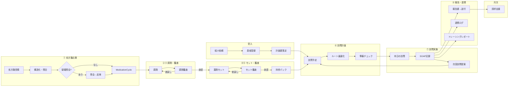

# PH-OS Pharmacy — Implementation Plan

> 仕様書: [ワークフロー/多職種連携](docs/visit-report-collab-spec.md) | [設計判断](docs/decisions.md)
> アーキテクチャ / デザイン方針: CLAUDE.md 参照
> ※ Phase 3 は Phase 2 完了時に詳細化する

### 明示的な非ゴール（既存レセコン/薬局システムの責務）

- フル在庫管理（発注・仕入・棚卸し・在庫評価）→ PH-OSは在庫医薬品マスタ（採用薬フラグ+引当フラグ）の薄い層のみ
- 麻薬管理帳簿・毒薬劇薬受払い簿 → レセコンが法定帳票を担う
- 領収書・調剤報酬明細書の発行 → レセコンの中核機能（二重入力回避）
- 会計・一部負担金の収納管理 → レセコン/会計システム
- POS・仕入・発注 → 在庫管理専用システム

### 実装優先原則（今回レビュー反映）

- MVPは「訪問日次運用 + 報告送付 + 最低限の処方差分/持参判定」を最優先にし、重いマスタ/処方安全チェック/請求自動化は後段に寄せる
- `MedicationCycle` は「処方起点の1運用サイクル」を維持する。MVPでも訪問予定は処方差分・持参可否・未解決課題と切り離さない
- PH-OS / レセコン / 電子薬歴 / 在宅支援システムの責任分界を先に固定し、二重入力を避ける
- 公開情報ベースの市場比較では、既存製品は「訪問記録・計画書/報告書作成・FAX/メール送付・現場共有」に強い。初期価値は最適化機能より、現場記録/連携/持参漏れ防止に置く

### 新機能: プラットフォーム運営者コンソール（監査付きブレークグラス） `cc:WIP`

<!-- 2026-07-03 ユーザー要望「システム開発者・管理者が裏からテナント横断でデータ確認・アクセス・操作」を、無記録バックドアではなくベストプラクティス準拠の監査付きブレークグラスとして設計・実装。設計判断は fable(ユーザー委任)。SSOT=docs/design/platform-operator-console-design.md -->

- [ ] **P-1**: write ops の限定操作+追加監査+アラート / hash-chain tamper-evidence / operator suspend時のsession cascade revoke / MFA試行レート制限 / 全テナント横断監査ダッシュボード
- [ ] **P-2**: 多職種展開（医科・訪問看護）向け operator 権限汎用化

### 直近トラック: 開発方針 2026-07-03 — 実装ロードマップ v2（3レビュー再構成） `cc:WIP`

<!-- 2026-07-03: v1(9観点スキャン)を ①リリースクリティカルパス監査 ②網羅性批判レビュー(BLOCKED/ULTRACODE/FEATURE_QUEUE/spec 突合+コード抜き打ち7点=全て新鮮を確認) ③依存・実装順検証 の3独立レビューで実装向けに再構成。リリース判定は既存の pilot-launch-dossier(src/server/services/pilot-launch-dossier.ts: UAT/PMDA/backup/ISMS 4軸+org監査)を SSOT とし、外部依存を前提条件へ分離、技術タスクを Wave 0-3 へ再配列。計画のみ・実装未着手。v1 全文はコミット 1d315a86 参照。 -->

**v1 所見サマリ（有効）**:

- 基盤は高水準: 認可wrapper 約293route / no-store 260file / DBトリガ監査 / unit 1,229file・APIカバー97% / E2E主要5動線 / 点数改定レジストリはデータ駆動で2026医療改定 confirmed 済 / 依存EOLなし
- 最大の製品ギャップ: **算定要件の構造化未着手**（`docs/visit-report-collab-spec.md` v2 算定カバレッジ32項目中 充足5）
- 医療安全: CDS false-negative 8件 + safety5(CE01/CE02) / セキュリティ: RLS 実体欠落~33表+DB層未証明・PHI閲覧監査36route未記録 / 速度: prescription-intakes POST 33.7s / FE: React Compiler未有効・仮想化ゼロ・画像無圧縮 / 改定耐性: 点数=優秀、薬価版管理なし・next-auth v4 / 水平展開: そのまま展開可8+軽い分離6、要リファクタ=薬局間連携層

**v1 からの主な補正（網羅性レビュー）**:

- 追加: CE01/CE02 safety5（PCA未検品再貸出/訪問prep偽完了）/ EPIC1 RLS 実体欠落~33表+contract再設計 / **billing aggregation over-claim 修正群**（BLOCKED制限解除済・即効）/ spec P2・P5・P6・P7 の未収容分（B-7〜B-10）/ リリースエンジニアリング R群 / BLOCKED human-gate 残6件 / F-20260702-001
- 訂正: 実参照切れは `docs/decisions.md`+旧spec 2ファイル（`visit-report-collab-spec.md` は実在し正）/ O-1 は v0.2 トラックへ統合
- 昇格: afterhours-tz off-by-9h（夜間/休日加算の over/under-claim・confirmed）を P2→Wave1 算定正確性へ
- 分割: B-6→4分割+B-7〜B-10 / H-1→tx-guard epic 14件 / H-2→TZ epic ~14件 / C-7・E-6 は独立作業へ

**リリースマイルストーン**:

- **M1 安全・正確性 green** = Wave 0+1 完了（医療安全 / セキュリティ / 算定正確性の既知バグ 0）
- **M2 パイロット技術線** = Wave 2 R群完了で dossier のコード側 blocker 0。外部前提の完了をもって pilot GO
- **M3 製品の芯** = Wave 3 B群（算定要件構造化 = multi-quarter プログラム）

#### 前提条件（外部・人間作業） `cc:blocked`

- [ ] PMDA メディナビ/マイ医薬品集 登録 + `PMDA_*_URL` secrets（旧0-2i）
- [ ] backup live drill 実施と `[mode:live]` 記録（旧I-04/12-8）
- [ ] ISMS 審査機関見積・予算・キックオフ（旧1a-6/1b-6。vendor comparison/decision memo の記入で dossier green）
- [ ] AWS 本番プロビジョニング + `ALERT_EMAIL` 設定 + SNS email 購読 confirm + 本番 Sentry DSN
- [ ] パイロット薬局 UAT（critical/high blocker 0 で phase2_entry green。旧1b-9）
- [ ] 利用規約/プライバシーポリシー本文の法務確定（掲示ページ実装は W2-R4）
- [ ] 音声メモ STT の AWS Transcribe creds（旧D-8-3）

#### Wave 3 — 製品の芯・高 blast（安全網整備後） `cc:TODO`

安全網先行（破壊的 migration の前提）:

- [ ] W3-S1 staging 環境（旧O-2/12-4・AWS 実環境待ち）

B 算定構造化（spec ロードマップ順。W1-13/W2-B1 済前提）:

- [ ] W3-B3 加算エビデンス群（StructuredSoap 拡張+加算コードマスタ）
- [ ] W3-B4 claim-record projector（report-generator 分割。F-5 境界 API 化と直列調整）: 残は report-generator の11表直読みの読み取り関数集約（W3-M1 と直列）と、手動作成への billing_context 付与（billing 経路のデータ plumbing を伴う別スライス・要 billing レビュー）
- [ ] W3-B6a 報告書 finalize/lock 版管理[RPT-007] / W3-B6b 到達証跡ハードゲート[KYO-007/008] / W3-B6c 保存年限構造化[RPT-002/009] / W3-B6d 単一建物月次動的計数[ZTK-06]（旧B-6 の4分割）
  - 設計メモ（2026-07-03 ラティファイ済、3a39f69e、docs/design/care-report-finalize-lock-design.md、codex 起草+opus critic 2巡）。確定方向: 行ロック=updated_at 維持(D-14 意図的逸脱を記録)/改訂連番=report_revision/Option B 推奨。B vs C 最終選択+未決事項は migration 提案の human 承認時に確定。実装(migration 含む)は据え置き=human gate
- [ ] W3-B7 spec P2: ManagementPlanContent 構造化+医療保険の月次見直し強制（KYO-003/004）
- [ ] W3-B8 spec P6: 多職種 inbound 双方向モデル（多対多 resolution_status, ARCH-6）+FAX/紙 OCR 取込(COLLAB-01)+到着通知(COLLAB-02)+outbound 受領ループ(COLLAB-03)
- [ ] W3-B9 spec P5: cycle_id 任意化+緊急訪問薬剤管理指導料（料1/料2）+オンライン46単位・緊急通算の月キャップ統合。残は online/shared monthly cap と cycle_id 任意化全体整理。
- [ ] W3-B10 spec P7: 破壊的 migration 群（CareReport.visit_record_id FK 昇格 / 残薬 canonical 一本化 / レガシー SOAP 削除。human 承認+W3-S1/S2 前提）

改定・依存耐性:

- [ ] W3-C1 薬価 effective-dated 版管理+調剤時スナップショット（旧C-1・L・mig） / W3-C5 next-auth v4→Auth.js v5（旧C-5・L）

FE 仕上げ（低優先）:

- [ ] W3-E1 フォーム RHF 統一（旧E-6a）
- [ ] W3-E3 drug-master-content 分割（旧E-6c）: 残は `DrugMasterOperationalContent` 本体の段階分割と、detail Sheet / hooks / mutation state の責務分離。

運用:

- [ ] W3-O1 v0.2 e2e 実証（下記 v0.2 トラックで管理・重複解消） / W3-O3 RUM（旧12-7残） / W3-O5 TZ fail-close 有効化（prod TZ 設定後・prod ゲート） / W3-O6 証跡写真+S3 Object Lock+set-photo 束縛 / W3-O7 音声メモ STT `cc:blocked`

**直列化必須ペア**: W2-P1 内 D-1↔D-3（同一 service）/ W0-16→W1-1（CDS 系）/ W1-13→W2-B1→B 全系 / W3-B4↔W3-B6↔W3-M1（report-generator 競合）/ W3-B2・B3・B5 の mig は逐次 / W1-14 決定→React Compiler 実装。Wave 内の各レーンはファイル非重複で並行可。

**実行規律**: 各スライス = maker(Claude) → reviewer-audit 独立レビュー → objective gate（typecheck / typecheck:no-unused / lint / test / build / colors:check）。auth/security/migration/prod-deploy は human 承認（§15）。破壊的 mig（W3-B6d/B10/C1）は W3-S1/S2 完了が前提。perf 系は perf:smoke 実測を前段に。

### 新トラック: 訪問スケジュール自動提案 上書きアップデート（2026-07-05） `cc:TODO`

<!-- source: docs/careviax_visit_schedule_update_spec.docx（CareVIAx / PH-OS 訪問薬剤管理スケジュール自動提案 既存実装調査・上書きアップデート仕様書）。2026-07-05 に仕様書と実コードを再レビューし、既存の planner / proposal workflow / visit availability / route matrix contract を前提に実装順を練り直した。計画のみ・実装未着手。 -->

**最重要方針（SSOT）**:

- 自動提案の仮予定 SSOT は `VisitScheduleProposal`。`VisitSchedule` は患者連絡 confirmed 後に作る確定予定。
- `confirmed_at` あり `VisitSchedule`、ready/departed/in_progress/completed 予定、患者連絡済み候補は自動再配置しない。変更は既存リスケジュール/再提案フローに限定する。
- 手動 `POST /api/visit-schedules` と管理者/互換用途の直接 `VisitSchedule` 作成は残すが、「自動生成」は proposal-first に寄せる。
- 休業日/訪問不可日の上書きは理由必須、監査ログ必須。薬剤師確認必須はスコア減点ではなく患者連絡前のハードゲートにする。
- Google Routes / OSRM / fallback はルート・移動時間評価だけに使い、薬学判断・服薬期限判断の根拠にはしない。

**コードレビューで確定した現状（2026-07-05）**:

- `src/app/api/visit-schedule-proposals/route.ts` は候補生成、idempotency、算定ガード、`VisitScheduleProposalBatch`、route_order allocation、diagnostics/audit を既に持つ。ここを自動提案の正式入口として維持する。
- `src/app/api/visit-schedule-proposals/[id]/route.ts` は approve → contact_attempt confirmed → confirm → `VisitSchedule.create` の患者承認後確定フローを既に持つ。仕様書の proposal-first 方針と一致している。
- `src/app/api/visit-schedules/generate/route.ts` は recurrence から `VisitSchedule` を直接作成し、`confirmed_at` / `confirmed_by` を入れる。仕様書との差分として最重要の互換移行対象。
- `src/server/jobs/daily/visits.ts` は服薬期限から `generateVisitScheduleProposalDrafts` を呼び `VisitScheduleProposal` を作る。daily demand は既に proposal-first で、強化対象は deadline policy と diagnostics。
- `src/server/services/visit-schedule-planner.ts` は患者希望/施設受入/薬局営業時間/薬剤師シフトの時間窓 intersection、日次/週次容量、車両、route insertion、算定 cadence、確定済み予定固定を持つ。新設ではなく接続・精密化する。
- `src/lib/calendar/visit-availability.ts` は `canVisitOn` で PharmacyOperatingHours/BusinessHoliday と PharmacistShift の AND 判定を pure helper 化済み。VisitAvailabilityPolicy はこの helper の拡張・DB adapter 接続として扱う。
- `src/server/services/visit-medication-deadline.ts` は通常薬 end_date / start_date+days、次回調剤日、前回訪問時 next_visit_suggestion_date を最小日で折り、頓服を通常期限から除外済み。営業日バッファは未実装。
- `src/server/services/road-routing.ts` は `RoadTravelEstimator.estimateMatrix` と OSRM table matrix / pairwise fallback を既に持つ。Google provider は現状 pairwise `computeRoutes` のみなので、追加対象は `GoogleRoutesProvider.estimateMatrix`。
- `prisma/schema/visit.prisma` の `VisitScheduleProposal` には `pharmacist_review_required` / `review_reason_code` / `reviewed_at` は未存在。review gate は diagnostics 先行、DB field 追加は HR migration に分離する。

**監査・PHI payload 方針**:

- proposal / overload / review / route diagnostics を audit に残す場合は whitelist 方式にする。
- audit に保存してよいもの: reason code、entity id、dateKey、actor、status before/after、算定/期限/availability の短い machine code、hash 化した診断 snapshot。
- audit/log/export に保存しないもの: 患者名、住所、緯度経度、電話番号、連絡 note、薬剤 free text、処方全文、Google/OSRM request body、API key、provider raw error。
- 詳細表示が必要な場合は、audit ではなく権限制御済み detail API で再計算または最小化済み snapshot を返す。
- `audit-logs` API/export は reject_reason redaction と同じ方針で diagnostics/free text/drug/address/phone を redaction test で固定する。

**追加・変更する設計要素（通常変更 / HR 分離）**:

| 領域                   | 現コードとの差分                                                                                                                                     | リスク分類          |
| ---------------------- | ---------------------------------------------------------------------------------------------------------------------------------------------------- | ------------------- |
| DeadlinePolicy         | 既存 `resolveMedicationDeadlineSummary` の後方互換を保ち、営業日/訪問可能日 buffer を別出力として追加する。                                          | P1                  |
| Planner connection     | 現 planner の `planningEnd` / `candidateDeadlineDate` を policy 出力へ接続。候補取得期間は縮めすぎず、site/shift 判定後に per-site deadline を適用。 | P1                  |
| Availability policy    | 既存 `canVisitOn` と planner 内 intersection を統合し、訪問可能枠 DB 化は HR へ分離。                                                                | P1→HR               |
| Review gate            | まず diagnostics/audit/UI で表示し、DB field 追加後に approve/contact/confirm hard gate 化。                                                         | P1→HR               |
| OverloadRebalancer     | 確定予定ではなく未承認 proposal のみを preview-first で前倒し。既存 open proposal も容量計算に入れる。                                               | P1 / audit注意      |
| PRN/topical stock/risk | 頓服・外用薬残量、薬剤変更 risk は医療安全上 HR。既存通常薬 deadline とは分離し、薬剤師確認必須を伴う。                                              | HR                  |
| Google Matrix          | 既存 estimator contract に `GoogleRoutesProvider.estimateMatrix` を足す。key 未設定/失敗時は OSRM/fallback を維持。                                  | P1 / deploy設定注意 |

#### VS-AUTO-0. 方針固定・責務境界の残作業 `cc:TODO`

- [ ] `VisitScheduleProposal` と `VisitSchedule` の責務境界を API test 名・UI文言・operator docs で統一する。
- [ ] `localDateKey` / `formatUtcDateKey` / `japanDateKey` 使用箇所を棚卸しし、期限・休業日・患者希望曜日・locked_date の user-facing date は Asia/Tokyo dateKey を SSOT にする。
- DoD: 「自動提案は proposal、確定予定は患者確認後」の方針が実コード参照付きで追跡可能。

#### VS-AUTO-1. 営業日バッファ付き DeadlinePolicy（DBなし pure first） `cc:TODO`

- テスト:
- rollback: policy 接続 commit を revert。既存 `resolveMedicationDeadlineSummary` に戻せる。

#### VS-AUTO-4. AvailabilityPolicy / 薬剤準備 / 緊急予備枠 `cc:TODO`

- [ ] `src/lib/calendar/visit-availability.ts` を新設せず拡張する。現 `canVisitOn` の reason code を planner/API diagnostics と共有する。
- [ ] 訪問可能枠 DB 化前は、既存 PharmacyOperatingHours/BusinessHoliday + PharmacistShift + patient/facility preference の intersection を唯一の訪問可能判定にする。
- テスト:
  - `canVisitOn` の既存 fail-closed tests を維持。
  - max_daily/max_weekly/vehicle capacity rejected diagnostics 維持。

#### VS-AUTO-5. Proposal diagnostics / review-gate 表示（migration 前の低リスク層） `cc:TODO`

- [ ] VS-AUTO-7 の field-backed hard gate 前は、diagnostics-only と明記する。UI の disabled だけで患者連絡/確定を止めた扱いにしない。
- [ ] `/schedules/proposals` の詳細 Sheet と候補カードに、過密前倒し理由を業務用語で表示する。
- [ ] HR field 追加前は `pharmacist_review_required` 永続 field を参照しない。UI では `review_required_candidate` として「患者連絡前に薬剤師確認推奨」を出し、ハードブロックは VS-AUTO-7 後に有効化する。
- テスト:
  - server `message` / validation error が既存 UI fallback で表示される。

#### VS-AUTO-6a. OverloadRebalancer preview/read-only 残作業 `cc:TODO`

- [ ] VS-AUTO-7 後は preview 対象条件へ `pharmacist_review_required=false` を追加する。
- [ ] billing cap / review candidate の永続 field 判定を preview skip reason に接続する。
- テスト:
  - billing cap / review required 永続判定で preview replacement を出さない。

#### VS-AUTO-6b. OverloadRebalancer apply/supersede/audit `cc:TODO HR`

- [ ] VS-AUTO-7 の review fields / audit schema / hard gate と、VS-AUTO-8 の薬剤師確認 hard gate が入るまで write/apply は実装しない。
- [ ] 前倒し apply 時は旧候補を `superseded` にし、replacement proposal を transaction で作る。confirmed schedule、patient contact confirmed/pending proposal、reschedule pending は不変。
- [ ] `reproposal_reason` など存在しない field を前提にせず、HR migration 後の専用 field または `OverloadRebalanceAudit` に `reason_code='overload_advance'` と最小化 diagnostics を保存する。
- [ ] billing cap recheck、vehicle capacity、pharmacist capacity、review field gate、patient contact state、same-run duplicate を server-side で再検証する。
- [ ] apply 失敗や blocked attempt は、患者名・住所・薬剤名・provider raw payload を含まない audit/security-safe event に残す。
- テスト:
  - old proposal superseded + replacement proposal が同一 transaction で作られる。
  - confirmed/contacted/reschedule pending は変更されない。
  - billing cap / review required / vehicle full / pharmacist full で apply しない。
  - audit は reason code、entity ids、dateKey、actor、minimized diagnostics のみ。

#### VS-AUTO-7. HR migration: review fields / availability rule / rebalance audit `cc:TODO HR`

- [ ] W3-S1/S2 相当の migration 検証、RLS/requestContext、rollback plan、display_id registry、seed/factory、human review を前提にする。migration 適用は current-task 明示承認まで実行しない。
- [ ] additive migration 候補:
  - `VisitScheduleProposal.pharmacist_review_required Boolean @default(false)`
  - `review_reason_code String?`
  - `pharmacist_reviewed_at DateTime?`
  - `pharmacist_reviewed_by String?`
  - `VisitAvailabilityRule`: org_id、site_id、曜日/日付、from/to、is_available、reserve_minutes、max_auto_fill_ratio。
  - `OverloadRebalanceAudit`: old proposal、新 proposal、理由、計算時点、actor/system、diagnostics snapshot。
- [ ] `display_id` registry、data explorer catalog、RLS/tenant policy、app-layer `org_id` where、migration rollback、seed/factory を同時に計画する。
- [ ] 既存 proposal は `pharmacist_review_required=false` default で互換。contract migration や field required 化は別フェーズ。
- [ ] human review 必須: 休業日上書き・薬剤師確認・過密前倒しの監査粒度、患者連絡前 gate の運用責任。
- [ ] migration 適用は current-task 明示承認まで実行しない。
- [ ] migration 後の最小 hard gate を先に実装する:
  - approve/contact_attempt/confirm は `pharmacist_review_required=false OR pharmacist_reviewed_at IS NOT NULL` を server side で検証。
  - bulk action / updateMany claim でも同条件を要求し、古いクライアントや race で bypass できないようにする。
  - review 済み actor/time は audit whitelist で記録する。

#### VS-AUTO-8. 薬剤師確認 hard gate / 頓服・外用薬残量 / 薬剤変更 risk `cc:TODO HR`

- [ ] VS-AUTO-7 の最小 server hard gate 後に実装する。Google Matrix や Overload apply より優先し、患者連絡前の医療安全 gate として扱う。
- [ ] `VisitStockProfile` または既存訪問準備/処方データから導出する stockout candidate を設計する。
  - 対象: 頓服、外用薬、使用量が患者状態に左右される薬剤。
  - 入力: `last_confirmed_at`、`remaining_amount`、`avg_daily_use`、`stockout_date_key`、`confidence`、`confirmed_by`、根拠。
  - 出力: stockout date candidate、confidence、review reason。
- [ ] `MedicationChangeRisk` helper/service を設計する。
  - 増量/減量/追加/削除、麻薬/冷所/粉砕/一包化、疑義照会未解決、処方差分を risk reason にする。
  - 高 risk は早期訪問候補 + `pharmacist_review_required=true`。
- [ ] `[id]` PATCH approve/contact_attempt/confirm に hard gate を入れる:
  - `pharmacist_review_required=true` かつ `pharmacist_reviewed_at is null` なら患者連絡・確定不可。
  - review 済みの actor/time を audit。
- テスト:
  - 頓服/外用薬 stockout が通常薬より早い場合に deadline candidate 採用。
  - confidence low / stale stock confirmation は review required。
  - 薬剤変更ありで review gate が立つ。
  - review 未了では approve/contact/confirm に進めない。
  - review 済みでのみ既存 proposal workflow が進む。

#### VS-AUTO-9. Google Routes Matrix provider `cc:TODO`

- [ ] `src/server/services/road-routing.ts` の既存 `RoadTravelEstimator.estimateMatrix` contract を維持し、`GoogleRoutesProvider.estimateMatrix` を追加する。
  - Google provider: Compute Route Matrix 相当。
  - OSRM provider: 既存 table API を維持。
  - Google matrix 未設定/失敗時: 既存 pairwise `computeRoutes` fallback、さらに OSRM/fallback behavior を壊さない。
- [ ] API key / quota / timeout / retry / max matrix size は deploy 設定として明示し、secret 値は出さない。
- [ ] route diagnostics に provider/source/confidence を出すが、患者住所・氏名・座標をログに出さない。
- テスト:
  - Google key 未設定で fallback して proposal 生成継続。
  - Google provider で matrix が使える時は pairwise fallback 呼び出しを抑制。
  - provider failure が PHI をログに出さない。
  - `visit-route-engine` / planner の route score 既存期待を維持。

#### VS-AUTO-10. 検証・リリース計画 `cc:TODO`

- Unit:
  - `src/server/services/visit-medication-deadline.test.ts`
  - `src/lib/calendar/visit-availability.test.ts`
  - `src/server/services/visit-schedule-planner.test.ts`
  - `src/server/services/visit-schedule-overload-rebalancer.test.ts`
  - `src/server/services/road-routing.test.ts`
- API:
  - `src/app/api/visit-schedule-proposals/route.test.ts`
  - `src/app/api/visit-schedule-proposals/[id]/route.test.ts`
  - `src/app/api/visit-schedules/generate/route.test.ts`
  - `src/server/jobs/daily.test.ts`
  - RLS/tenant rejection for new HR tables.
- UI:
  - `/schedules/proposals` diagnostics、review gate、bulk action regressions。
  - `/schedules` day planner の「訪問候補を生成」から proposal-first を確認。
- E2E/smoke:
  - 「薬切れ日曜 → 木曜候補 → 患者連絡 confirmed → VisitSchedule 確定」。
  - 「direct generate 自動入口 → VisitScheduleProposal 作成 → confirm まで VisitSchedule 未作成」。
  - 「過密日 → 未承認候補だけ前倒し → 確定予定不変」。
  - Google key なし / provider failure 時の fallback diagnostics。
- Release:
  - direct generate は 410 `ENDPOINT_REMOVED` contract を維持し、proposal-first 移行 flag として復活させない。
  - rollout flag は HR review fields、Overload apply、Google Matrix provider のみに使う。
  - 初回は preview/recommendation と diagnostics-only、次に field-backed hard gate、最後に apply/write path。
  - operator runbook: Google quota、fallback、薬剤師 review queue、過密再配置 audit の確認手順。

**優先実装順**:

1. VS-AUTO-0 方針固定 + 実コード inventory。
2. VS-AUTO-0b direct generate 自動確定経路の cordon（feature flag / warning / 管理者手動限定）。
3. VS-AUTO-1 DeadlinePolicy pure helper（DBなし、provenance + JST dateKey + 既存関数後方互換）。
4. VS-AUTO-2 Planner deadline 接続（既存 planner/visit-availability 拡張）。
5. VS-AUTO-3 direct generate proposal-first 互換移行。
6. VS-AUTO-5 Proposal diagnostics/UI（migration 前の diagnostics-only 可視化）。
7. VS-AUTO-4 AvailabilityPolicy / readiness / emergency reserve の shared helper 整理。
8. VS-AUTO-6a OverloadRebalancer preview の billing cap recheck 残。
9. VS-AUTO-7 HR migration + minimal server hard gate。
10. VS-AUTO-8 review hard gate + PRN/topical/medication-change risk。
11. VS-AUTO-6b OverloadRebalancer apply（field-backed gate と audit policy 後）。
12. VS-AUTO-9 Google Matrix provider。
13. VS-AUTO-10 E2E / rollout / runbook。

**停止条件 / human review 必須**:

- 患者承認済み日時や `confirmed_at` あり予定を自動で変更する必要が出た場合。
- `visit-schedules/generate` の default behavior を直接確定から proposal-first へ切り替える rollout flag/運用日が未定の場合。
- direct generate が患者未確認の `confirmed_at` schedule を作る経路を残したまま、DeadlinePolicy を本番経路へ接続しようとする場合。
- review gate field 未導入のまま、患者連絡/確定導線を hard gate 済みとして扱う場合。
- DeadlineCandidate の provenance が薬剤名 text だけで、処方行/薬剤コード/根拠/信頼度を追跡できない場合。
- 薬剤師確認必須の判断理由がコードだけで確定できない場合。
- 休業日上書き、連休前倒し、緊急枠予約の運用責任者が未定の場合。
- Google API quota/cost/障害時運用が preview 環境で検証できない場合。
- DB migration が既存 proposal/schedule の意味を変える場合。

### 新トラック: 横断リスク改善 / Risk Finding Cockpit（2026-07-05） `cc:TODO`

<!-- source: 2026-07-05 ユーザー提示「CareVIAx リスク改善 多角的修正計画・実装タスク化レポート（拡張版）」。単純追記ではなく、現行コードの readiness / blocker / task / audit / permission / report / billing / notification 実装を再確認して、既存 VS-AUTO・Wave 3・Phase 5 と矛盾しない実装計画へ再構成した。計画のみ・実装未着手。 -->

**このトラックの位置づけ**:

- VS-AUTO は「訪問スケジュール自動提案」の scheduling track として継続する。VS-AUTO-8 の薬剤師確認 / 頓服・外用薬残量 / 薬剤変更 risk は、この横断リスク基盤の `CORE-*` / `RX-*` を利用する下流タスクとして扱う。
- Wave 3-B の報告・請求構造化、Phase 5-PRE の患者モデル変更、ID 統一プログラムとは別 track。DB migration が必要な task は additive-first とし、migration 適用は current-task 明示承認まで実行しない。
- 互換性維持は不要。古い warning-only 表示や曖昧な旧挙動は、最新 contract に完全上書きする。ただし患者安全、PHI、請求、権限、監査、migration/deploy の安全 gate は緩和しない。

**コードレビューで確認した既存土台（2026-07-05）**:

| 領域                    | 既存の接続点                                                                                                                                                                                                          | 実装計画上の扱い                                                                                                  |
| ----------------------- | --------------------------------------------------------------------------------------------------------------------------------------------------------------------------------------------------------------------- | ----------------------------------------------------------------------------------------------------------------- |
| 訪問準備 / ready gate   | `src/server/services/visit-preparation-readiness.ts` は `medication_changes_reviewed`、`previous_issue_reviewed`、`carry_items_status`、`offline_synced`、onboarding/billing blocker を ready transition に集約する。 | `RiskFinding` adapter を作り、boolean checklist を構造化 risk に置換していく。                                    |
| 患者 board / foundation | `src/app/api/patients/board/route.ts` と `src/server/services/patient-detail-foundation.ts` は safety tag、foundation summary、監査待ち、例外、同意/計画不足を集約する。                                              | 一覧は圧縮表示のまま維持し、詳細判断は `CaseRiskCockpit` API へ分離する。                                         |
| 同意 / 管理計画         | `src/server/services/management-plans.ts` は `missing_visit_consent`、`missing_management_plan`、`management_plan_review_overdue` を workflow gate と task に接続できる。                                             | renewal board と gate failure task auto-upsert の source とする。                                                 |
| 調剤 task               | `src/app/api/dispense-tasks/route.ts` は priority/due_date/assigned_to と emergency notification を持つ。                                                                                                             | 調剤 SLA board は既存 task/cycle status を横断集計し、監査待ち・冷所・麻薬・期限超過を risk sort する。           |
| 請求 blocker            | `src/server/services/billing-evidence/core.ts` は `BillingEvidenceBlocker` と `describeBillingEvidenceBlockers` で同意、計画、報告未送付、認定/公費/QR保険レビュー等を表現する。                                      | blocker を `RiskFinding` と `OperationalTask` に lossless に近く map する。                                       |
| 報告 / 送付             | `src/app/api/care-reports/route.ts` は report_type、delivery_records、pdf_url、送付 status を扱い、`care-report-output-policy.ts` は author/send 権限を分ける。                                                       | 宛先別 masking profile、送付完了 gate、送付失敗 task、billing blocker 解消へ接続する。                            |
| 訪問記録                | `src/lib/validations/visit-record.ts` は completed 時に S/P/structured SOAP のいずれかで通る。`visit-records/route.ts` は residual medications、attachments、handoff、billing/report 連動を持つ。                     | outcome 別 quality gate を追加し、残薬/副作用/服薬/次回方針/薬剤変更説明を構造化する。                            |
| task 基盤               | `src/server/services/operational-tasks.ts` は `dedupe_key`、`priority`、`due_date`、`sla_due_at`、related entity の upsert/resolve を持つ。                                                                           | `RiskFinding -> OperationalTask` bridge と `task-registry` の中心にする。                                         |
| 通知                    | `src/server/services/notifications.ts` は in_app / sms / line / fax / mcs と dedupe を扱い、OS/web-push は `/notifications` landing に寄せる。                                                                        | delivery ledger / failed external task / critical recipient audit を追加し、PHI redaction regression を固定する。 |
| PII redaction           | `src/lib/notifications/os-bridge-redaction.ts`、`src/lib/visit-schedule-proposals/response.ts`、route diagnostics normalizer 群が最小化パターンを持つ。                                                               | 共通 PII policy matrix と endpoint/output audit script に統合する。                                               |
| 権限                    | `src/lib/auth/permission-matrix.ts` は visit/report/billing/patient sharing 等の capability を role に割り当てる。                                                                                                    | endpoint/action/export/attachment coverage test を追加し、「定義済みだが未使用」を検出する。                      |

**統合原則**:

- P0 は単なる UI warning で完了にしない。`blocking` / `urgent` は必ず readiness/blocker、operational task、audit の少なくとも 1 つへ接続する。
- 患者安全・請求・報告・通知・外部出力に影響する waiver/override は薬剤師または admin 権限、理由必須、audit 必須にする。
- PHI/PII を含む可能性がある自由記載、住所、電話、薬剤名、保険番号、報告本文、添付 metadata は list API / audit response / OS・外部通知で本文を返さない。detail は permission と no-store を前提に最小化する。
- 後段処理が前段データを暗黙変更しない。訪問記録 → 報告 → 請求 → 外部出力は一方向の依存関係にする。
- task explosion を防ぐため、P0/P1 の新規 task は `task-registry` に owner domain、dedupe builder、resolve condition、stale threshold、patient-safety/billing flags を登録してから生成する。

#### RISK-CORE-1. 未接続 domain adapter / resolve predicate 残作業 `cc:TODO`

> 2026-07-07 整理: VS-AUTO と Risk track の責務分離、VS-AUTO-8 が `RX-001` / `RX-002` を参照する方針、migration human gate は上位方針へ反映済み。ここには未接続 domain と domain 別 resolve predicate だけを残す。

- 残:
  - `visit_record`、未接続の `report_delivery`、`notification`、`privacy_security`、`integration`、`data_quality` の adapter 拡張。
  - foundation summary 全体、検査値/薬学 risk、担当未割当 finding の domain 分離。
  - billing / report / notification の task が月末・外部送付で孤児化しないための domain 別 resolve predicate。
  - PatientBoard / renewal board / notification health から既存 `RiskFinding` contract を再利用する接続。
- 受入条件:
  - 追加 adapter は PHI/free text を audit/log/list DTO に流さない。
  - 同一 risk の重複 task が増えない。
  - blocker 解消後の task close / waive / stale resolution が registry 条件で説明できる。
  - 全 finding に `action_href` がある。
  - no-store、withOrgContext、case ownership / org boundary、forbidden tests を持つ。

#### RISK-P0. 最優先実装バックログ `cc:TODO`

| ID       | 領域           | タスク                                         | 主な対象                                                                                                 | 残タスク / 受入条件                                                                                                                                                                                           |
| -------- | -------------- | ---------------------------------------------- | -------------------------------------------------------------------------------------------------------- | ------------------------------------------------------------------------------------------------------------------------------------------------------------------------------------------------------------- |
| RX-001   | 薬剤変更       | Medication Change Review Gate                  | `medication-change-review`, `visit-preparation-readiness`, `today-preparation`                           | 追加/削除/増量/減量/用法/剤形変更を分類し、high-risk は薬剤師確認完了まで ready/contact/confirm 不可。確認者・日時・判断結果・理由を audit。                                                                  |
| RX-002   | 残薬/頓服/外用 | Medication Stock Ledger / Stock Risk           | `modules/pharmacy/medication-stock`, `visit-records`, patient board                                      | 残: DB/API/UI、ledger正本化、VisitBrief/Schedule接続、正式 provider 統合。                                                                                                                                    |
| DSP-001  | 調剤/監査      | Dispensing SLA Board                           | `dispense-tasks`, patient board, `dispense-tasks/sla-board`                                              | 調剤中、監査待ち、セット中、保留、緊急、期限超過を一覧化し、麻薬/冷所/一包化/訪問当日を上位表示。                                                                                                             |
| BIL-001  | 請求           | Billing Close Work Queue                       | `billing-evidence/core.ts`, billing close board                                                          | `unreviewed` / `blocked` / `confirmed` / `excluded` / `exported` を患者/訪問/根拠単位で処理。除外/確認は理由と reviewer 必須。                                                                                |
| BIL-002  | 請求           | Billing blocker task bridge                    | `billing-evidence/core.ts`, `risk-task-bridge.ts`                                                        | 同意なし、計画なし、報告未送付、認定/公費/QR保険レビュー等を dedupe task 化し、再評価で解消。                                                                                                                 |
| REC-001  | 訪問記録       | Visit Record Quality Gate                      | `visit-record-quality`, `visit-records`                                                                  | outcome 別に服薬状況、残薬、副作用、薬剤変更説明、次回方針、連携事項を検査。warning は acknowledgement、block は保存不可。                                                                                    |
| REP-001  | 報告/共有      | Report Delivery Policy                         | `care-reports`, `care-report-output-policy`, `report-masking-profile`                                    | physician/care_manager/facility/nurse/family/internal 別に出力項目・権限・送付完了判定を分け、失敗は task 化。                                                                                                |
| INB-001  | 他職種受信     | Inbound Interprofessional Communication Module | `CommunicationEvent`, `PatientMcsMessage`, `PartnerVisitRecord`, `communication-queue`, medication-stock | 残: `InboundCommunicationEvent` / `InboundCommunicationSignal` DB正本、API/review UI、正式 Signal source。raw text は通知・監査・共有・timeline一覧・queue item・report workspace・case risk に直接出さない。 |
| MOV-001  | 患者詳細/UI    | Patient Movement Timeline                      | `PatientMovementTimeline`, `patient-detail-timeline-*`, INB/MedicationStock sources                      | 残: 正式 INB signal、MedicationStock Ledger、safety finding source 追加。処方・訪問・文書は詳細本文を timeline payload に出さず、正本 deep link のみで確認する。                                              |
| SEC-001  | PII/監査       | PII Policy Matrix / endpoint audit             | `pii-policy.ts`, `pii-endpoint-audit.ts`, `permission-matrix.ts`                                         | field class と role/output profile を定義し、list API/audit/外部通知/PDF/CSV/添付の PHI 漏洩候補を検出。                                                                                                      |
| SEC-002  | PII/監査       | AuditLog changes allowlist/minifier registry   | `audit-entry.ts`, audit redaction/export/admin APIs                                                      | action ごとに許可 `changes` field を宣言し、raw diagnostics / provider error / token / storage key は export/admin response で要約または drop。                                                               |
| EXP-001  | 出力           | Bulk export audit/job minimization             | `pdf-bulk-export.ts`, admin jobs API, export audit                                                       | AuditLog は patient_count、hash snapshot、job/file id、status のみ。job output/error/admin response に raw patient id array や per-patient raw error を出さない。                                             |
| EXP-002  | 出力           | Export Surface Matrix                          | patients/prescriptions/billing/communication/audit/file/PDF exports                                      | permission、org/RLS/case assignment、no-store、CSV formula neutralization、非PHI filename、fail-closed audit、row limit/truncation を surface ごとに固定。                                                    |
| NTF-001  | 通知           | Notification Delivery Health Board             | `notifications.ts`, notification health board, notification rules UI                                     | rule 未設定、送信先0、外部通知失敗、urgent 未達を一覧化し task 化できる。                                                                                                                                     |
| ONB-001  | 同意/計画      | Renewal Board                                  | `management-plans.ts`, `operational-tasks.ts`, onboarding renewal board                                  | 同意期限・管理計画見直し期限が近い/超過した患者を抽出し、更新 task を生成/解決。                                                                                                                              |
| PERM-001 | 権限           | Permission Coverage Test                       | `permission-matrix.ts`, route tests                                                                      | patient/report/billing/visit-record/audit/export/attachment の主要 API で role forbidden tests を追加。                                                                                                       |
| QA-001   | 品質保証       | 横断リスク regression pack                     | vitest suites, API tests, targeted Playwright                                                            | 薬剤変更、残薬、患者基盤、請求 blocker、記録品質、報告送付、通知 redaction、task SLA、PII redaction を固定。                                                                                                  |

#### RISK-P1/P2. 次フェーズ不足領域 `cc:TODO`

| ID       | 優先度 | 領域       | タスク                                      | 受入条件                                                                                                                                 |
| -------- | ------ | ---------- | ------------------------------------------- | ---------------------------------------------------------------------------------------------------------------------------------------- |
| MED-001  | P1     | 薬学リスク | Medication Risk Tag Registry                | narcotic/cold_storage/unit_dose/renal/swallowing/allergy/LASA 等を辞書化し、表示名・severity・必要 checklist・記録/報告影響を一元化。    |
| MED-002  | P1     | 薬剤マスタ | Drug Master Match Queue                     | prescription/residual medication の未照合、薬剤コード欠落、同名別規格疑いを一覧化し、修正後に risk を再評価。                            |
| LAB-001  | P1     | 検査値     | Lab Risk Evaluator                          | eGFR の値・鮮度・異常 flag を薬剤 risk と照合し、腎機能注意薬の確認 gate に出す。                                                        |
| PAT-002  | P1     | 患者条件   | Negative Constraint / recurring event model | デイサービス、通院、家族不在、一時不在を recurrence/one-off として保存し、提案・訪問準備・架電に使う。                                   |
| PAT-003  | P1     | 住所/地図  | Geocode Quality Queue                       | 住所/座標未設定、0/0、低精度、緯度経度同値を検出し、再ジオコード/人手確認 task を生成。                                                  |
| DSP-002  | P1     | 持参物     | Structured Carry Item Checklist             | 薬剤、麻薬、保冷、書類、衛生物品、機器、回収物を項目化し、未解決理由を ready gate へ反映。                                               |
| FILE-001 | P1     | 添付       | Attachment Security Policy                  | file type、size、scan status、owner entity、retention、download permission を定義。                                                      |
| FILE-002 | P1     | 出力       | Export Masking Profile                      | PDF/CSV/外部共有ごとに role と宛先種別で masking profile を切り替える。                                                                  |
| AUD-001  | P1     | 監査       | Audit Log Search Board / action taxonomy    | 患者/ケース/請求/報告/出力/添付/権限変更を検索し、重要操作理由・before/after masking を統一。                                            |
| DATA-001 | P1     | データ保持 | Retention / Archive Policy Matrix           | 患者アーカイブ後の read-only、保持、削除、匿名化、legal hold を実装可能な表にする。                                                      |
| INT-001  | P1     | 外部連携   | Integration Health Registry                 | 連携ごとの last_success / last_failure / retry_count / affected entity を可視化する。                                                    |
| IMP-001  | P1     | データ取込 | Prescription Intake Quality Board           | QR/JAHIS/manual の source、未照合薬剤、重複疑い、手修正差分を一覧化。                                                                    |
| INS-001  | P0/P1  | 保険/公費  | Insurance / Certification Work Queue        | 介護認定、公費、QR保険レビュー、資格期限を月次締めと連動。BIL-001 と直列。                                                               |
| FAC-001  | P1     | 施設       | Facility Identity Quality Board             | facility/building/unit/address の重複・未設定・算定影響を抽出。                                                                          |
| MOB-001  | P1     | モバイル   | Offline Sync Manifest                       | `offline_synced` boolean を同期対象、生成時刻、端末、失敗理由、再送状態、競合状態へ拡張。                                                |
| MOB-002  | P1     | 位置情報   | Visit Geo Log privacy/retention             | 保存可否、精度、保持期間、表示権限、監査ログ、患者説明文を定義し不要な位置情報を保存しない。                                             |
| REP-002  | P1     | 報告/共有  | External document-delivery wording gate     | 外部 email/FAX/MCS 本文に患者名、臨床本文、薬剤/free text、内部IDを出さず、短期 shared link の expiry/revoke/resend idempotency を固定。 |
| UX-001   | P1     | UI/A11y    | Risk UI Accessibility Pass                  | severity が色だけに依存せず、キーボード/読み上げ/モバイルで処理できる。                                                                  |
| OPS-001  | P1     | 復旧       | Business Recovery Drill                     | backup 復旧後に visit/report/billing/task/attachment link の整合 audit を実行。                                                          |

#### P0/P1: 他職種から薬局への情報受信・処理基盤 Inbound Interprofessional Communication Module `cc:TODO`

> 2026-07-06 追加。これは `INB-001` として、既存の薬局→他職種 outbound（報告書、外部共有、delivery record、tracing report）とは逆方向の **他職種→薬局 inbound** を正本化するタスク。Medication Stock Ledger はこの inbound signal の活用先の 1 つであり、主役ではない。現行コードでは `CommunicationEvent.direction` は `inbound/outbound` を表現でき、`PatientMcsMessage` は MCS 投稿本文/投稿者/職種/所属/source URL/raw payload を持ち、`PartnerVisitRecord.record_content` は協力薬局や共有ケース由来の訪問記録を保持できる。`communication-queue.ts` は self report、架電 follow-up、communication request、delivery backlog、external share、care/tracing report timeline を統合する reader を持つため、UI 表示は既存 queue に接続しつつ、受信情報の正本は新しい `InboundCommunicationEvent` / `InboundCommunicationSignal` に分離する。
>
> 残: `InboundCommunicationEvent` / `InboundCommunicationSignal` のDB正本、登録API、review UI、正式 signal queue、正式 MedicationStock/Risk/Task/VisitBrief/Schedule/Report 連動。raw text は通知・監査・共有・timeline一覧・queue item・report workspace・case risk に直接出さない。

外部参照:

- MedicalCareStation (MCS) は医療介護向けの多職種連携コミュニケーションツールで、電話/FAX等の連絡負荷削減、時系列投稿、症状写真/動画/資料共有、患者・家族招待、医療情報システム安全管理ガイドライン準拠を掲げる。PH-OS では MCS を「外部 source の 1 つ」として扱い、MCS raw text や URL をそのまま下流業務データに混入させない。

**情報方向の責務分離**:

```text
outbound:
  薬局 → 他職種
  報告書 / トレーシングレポート / 外部共有 / delivery record / shared link

inbound:
  他職種 → 薬局
  MCS投稿 / 電話 / FAX / メール / 施設メモ / 家族・患者申告 / 協力薬局記録 / 手入力
```

**モジュール配置**:

```text
src/core/interprofessional/inbound/
  domain/
    inbound-communication-event.ts
    inbound-communication-signal.ts
    inbound-communication-source.ts
    inbound-signal-classifier.ts
  application/
    record-inbound-communication.ts
    extract-inbound-signals.ts
    review-inbound-signal.ts
    link-inbound-signal-to-workflow.ts
    create-inbound-communication-task.ts
  infrastructure/
    inbound-communication-repository.ts
    mcs-source-adapter.ts
    communication-event-source-adapter.ts
    partner-visit-record-source-adapter.ts
    phone-source-adapter.ts
    fax-source-adapter.ts
    email-source-adapter.ts
  presenters/
    inbound-communication-presenter.ts
    inbound-signal-review-presenter.ts
    patient-inbound-timeline-presenter.ts

src/modules/pharmacy/medication-stock/
  application/
    apply-inbound-stock-signal.ts
    medication-stock-signal-adapter.ts
```

依存方向:

```text
Inbound interprofessional module:
  raw source を受信し、Event と Signal を作る。
  MedicationStock / Schedule / Report を直接更新しない。

MedicationStock / Risk / Task / VisitBrief / Schedule / Report:
  InboundCommunicationSignal を参照し、権限・レビュー・idempotency を通して反映する。
```

**既存コードとの整合**:

| 現行実装                                                               | 確認できた状態                                                                                                                                   | inbound module での扱い                                                                                                                                 |
| ---------------------------------------------------------------------- | ------------------------------------------------------------------------------------------------------------------------------------------------ | ------------------------------------------------------------------------------------------------------------------------------------------------------- |
| `prisma/schema/communication.prisma::CommunicationEvent`               | `channel`、`direction`、`counterpart_name/contact`、`subject`、`content`、`attachments`、`occurred_at` を持つ。                                  | 既存手入力・電話/FAX/メール系の互換 source。新規正本は `InboundCommunicationEvent` へ寄せ、既存 row は adapter で読み替える。                           |
| `CommunicationRequest` / `CommunicationResponse`                       | 薬局から相手へ依頼し、返信内容を受ける構造がある。                                                                                               | outbound request の response は inbound source として候補化できる。ただし raw response content は signal に直接使わず extractor 経由にする。            |
| `PatientMcsMessage`                                                    | MCS 投稿の author、role、organization、body、source_url、raw_payload を保持する。                                                                | `source_channel=mcs` の source。`body` / `raw_payload` / `source_url` は raw PHI 扱いで、public DTO / notification / audit changes には出さない。       |
| `PatientMcsLink` / MCS integration finding                             | MCS 同期状態は `RiskFinding` integration domain に接続済み。                                                                                     | 同期失敗リスクと inbound signal review は別タスクにする。同期成功しても signal は薬剤師レビューを通す。                                                 |
| `PartnerVisitRecord`                                                   | 協力薬局/共有ケース由来の `record_content`、attachments、confirmed status を持つ。                                                               | confirmed record のみ inbound source adapter で候補化。draft/submitted/returned は自動候補化しない。                                                    |
| `communication-queue.ts`                                               | `CommunicationQueueItem` / `CommunicationTimelineItem` / `CommunicationDraftSuggestion` があり、患者詳細や workflow dashboard へ統合表示できる。 | 正本にはしない。`queue_type=inbound_communication` 等を追加し、未処理 signal / review task の entrypoint として表示する。                               |
| `src/modules/pharmacy/medication-stock/domain/external-observation.ts` | 他職種・MCS・communication_event・partner_visit_record 由来の残数観測を直接 ledger に書かず staging する純粋 domain helper。                     | Phase 0/1 の短期 shim。中長期は generic `InboundCommunicationSignal(signal_domain='medication_stock')` に置き換え、MedicationStock adapter が取り込む。 |

**DB設計案（migrationは別slice）**:

| table                            | 目的                                                                                            | 主な field                                                                                                                                                                                                                                                                                                                                                                                                                                                                                                                                      |
| -------------------------------- | ----------------------------------------------------------------------------------------------- | ----------------------------------------------------------------------------------------------------------------------------------------------------------------------------------------------------------------------------------------------------------------------------------------------------------------------------------------------------------------------------------------------------------------------------------------------------------------------------------------------------------------------------------------------- |
| `InboundCommunicationEvent`      | 他職種から薬局へ届いた情報の正本。原文・発信者・経路・日時・添付・患者/ケース紐づけを保持する。 | `org_id`, `patient_id nullable`, `case_id nullable`, `source_channel`, `source_system`, `external_thread_id`, `external_message_id`, `external_url`, `direction='inbound'`, `sender_name`, `sender_role`, `sender_organization_name`, `sender_contact`, `event_type`, `received_at`, `occurred_at`, `raw_text`, `normalized_summary`, `attachment_count`, `has_medication_stock_signal`, `has_patient_safety_signal`, `has_schedule_signal`, `has_report_signal`, `confidence`, `processing_status`, `reviewed_by`, `reviewed_at`, `created_by` |
| `InboundCommunicationSignal`     | 原文から抽出した薬局業務上の意味。残数、使用量、副作用疑い、補充希望、訪問希望、処方意図など。  | `org_id`, `patient_id`, `case_id`, `inbound_event_id`, `signal_domain`, `signal_type`, `extracted_text`, `extracted_medication_name`, `extracted_quantity`, `extracted_unit`, `extracted_occurred_at`, `structured_payload`, `source_confidence`, `review_status`, `action_status`, `reviewed_by`, `reviewed_at`, `rejection_reason`                                                                                                                                                                                                            |
| `InboundCommunicationAttachment` | MCS画像、薬剤写真、FAX画像、資料などを FileAsset へ接続する。                                   | `org_id`, `inbound_event_id`, `signal_id nullable`, `file_asset_id`, `attachment_type`                                                                                                                                                                                                                                                                                                                                                                                                                                                          |
| `InboundSourceMapping`           | MCS thread / 電話相手 / FAX番号 / 外部 room と PH-OS 患者/ケースの対応関係。                    | `org_id`, `patient_id`, `case_id`, `source_system`, `external_patient_label`, `external_thread_id`, `external_room_id`, `external_contact_name`, `external_contact_role`, `external_organization_name`, `mapping_status`, `confidence`, `created_by`, `reviewed_by`, `reviewed_at`                                                                                                                                                                                                                                                              |

**Signal分類**:

```text
signal_domain:
  medication_stock
  medication_safety
  adherence
  symptom
  schedule
  report
  care_coordination
  urgent
  other

signal_type:
  observed_quantity
  usage_delta
  usage_frequency
  low_stock_text
  out_of_stock_text
  refill_request
  side_effect_suspected
  medication_not_taken
  medication_overuse
  medication_lost
  storage_issue
  schedule_change_request
  visit_request
  urgent_review_required
  unknown
```

**残数管理との接続**:

```text
InboundCommunicationEvent
  ↓ extract / classify
InboundCommunicationSignal
  ↓ pharmacist review / idempotency / permission
MedicationStockSignalAdapter
  ↓
MedicationStockEvent
  ↓
MedicationStockSnapshot
  ↓
RiskFinding / OperationalTask / VisitBrief / Schedule / Report候補
```

処理区分:

| action        | 条件                                                                                                  | 注意                                                                            |
| ------------- | ----------------------------------------------------------------------------------------------------- | ------------------------------------------------------------------------------- |
| `auto_apply`  | patient_id、stock_item_id、数量、単位、signal type、source trust、idempotency、薬局設定がすべて確定。 | 初期 rollout では原則 off。適用しても audit と source link は必須。             |
| `proposed`    | 薬剤名は近いが規格不明、同一成分候補が複数、単位が曖昧、自然文抽出 confidence が低い、情報源未確認。  | 薬剤師レビュー後に MedicationStockEvent へ昇格。                                |
| `record_only` | 「少ない」「なくなりそう」等の曖昧表現、数量不明、薬剤不明だが申し送りとして有用。                    | Risk/Task/VisitBrief には「確認項目」として出せる。                             |
| `reject`      | 患者違い、薬剤違い、重複、誤情報、処理済み。                                                          | raw text を audit changes に保存せず、reason code と note present/length のみ。 |

「差し引き」と「観測」を必ず分ける:

```text
湿布は残り4枚です
  => signal_type=observed_quantity
  => observed_quantity=4

湿布を昨日2枚使いました
  => signal_type=usage_delta
  => quantity_delta=-2

「残り4枚」を -4 として差し引かない。
「2枚使った」を 残り2枚 として扱わない。
```

**MCS / 電話 / FAX / メールの段階導入**:

| phase   | 内容                                                                                                                                                   | 実装メモ                                                                                                              |
| ------- | ------------------------------------------------------------------------------------------------------------------------------------------------------ | --------------------------------------------------------------------------------------------------------------------- |
| Phase 1 | MCS API 連携を前提にせず、MCS投稿本文の貼り付け、投稿日時、投稿者、職種、所属、MCSスレッドURL、スクリーンショット添付、残薬/使用状況 checkbox で開始。 | raw text は `InboundCommunicationEvent.raw_text` に閉じ、summary/signal DTO は controlled fields のみ。               |
| Phase 1 | 電話メモを `InboundCommunicationEvent(source_channel='phone')` として登録。                                                                            | 発信/着信、相手、職種/関係、電話番号、所属、日時、要件、残数/使用量/補充/副作用/スケジュール checkbox、次アクション。 |
| Phase 2 | FAX/メール/施設メモを source adapter 化。                                                                                                              | 添付は `FileAsset` scan / retention / access audit を通す。                                                           |
| Phase 5 | MCS API/export/webhook、thread mapping、自動取込を調査。                                                                                               | 連携仕様は公式/契約/許諾を確認してから実装。raw provider payload 永続化は最小化。                                     |

**自動抽出**:

Phase 1 は AI ではなく rule-based + 手動補助。

```text
検出語:
  残りN / あとN / N枚 / N錠 / N包 / N本
  使いました / 使用しました / 貼りました / 塗りました
  なくなりました / 足りません / 少ない / 補充
  処方してほしい / 増えています / よく使っています
```

AI を使う場合も `AI抽出 -> proposed -> 薬剤師確認 -> accepted -> 反映` の順にし、自動反映しない。

**UI/UX**:

| 画面                     | 要件                                                                                                                                           |
| ------------------------ | ---------------------------------------------------------------------------------------------------------------------------------------------- |
| 患者詳細 Command Center  | 未処理の他職種情報、薬剤師確認待ち、残数報告あり、安全シグナルありを next action として表示。                                                  |
| 患者詳細 連絡・共有      | `他職種受信` / `受信連携` timeline を配置し、MCS/電話/FAX/メールを source badge で表示。                                                       |
| 患者詳細 薬剤・訪問      | MedicationStockPanel に「他職種からの残数報告」queue を表示。未確認候補、自動反映済み、数量不明、名寄せ確認待ちを分ける。                      |
| InboundSignalReviewPanel | 3カラム: 左=原文/添付/投稿者/日時、中央=抽出候補/薬剤名/数量/単位/confidence、右=反映先/既存stock item/新規stock item/記録のみ/却下/タスク化。 |
| VisitBrief               | 正式 `InboundCommunicationSignal` 追加後、残数/安全/日程の優先順で `multidisciplinary_updates` / `must_check_today` を拡張する。               |

UI 実装時は PH-OS UI/UX SSOT に従い、必要な redesign では `gpt-image-2` で非PHI mockup を再構築してから実装する。

**既存機能との接続**:

| 接続先             | 実装方針                                                                                                                                                                                                                                                      |
| ------------------ | ------------------------------------------------------------------------------------------------------------------------------------------------------------------------------------------------------------------------------------------------------------- |
| CommunicationQueue | `queue_type`: `inbound_communication`, `inbound_medication_stock_signal`, `inbound_safety_signal`, `inbound_schedule_request`, `inbound_review_required` を追加。正本は `InboundCommunicationEvent`。                                                         |
| RiskFinding        | `inboundInterprofessionalRiskProvider` を追加。未処理情報、残数不足報告、副作用疑い、薬剤名未紐づけ、数量不明の補充希望、MCS患者安全シグナル、電話連絡確認事項を controlled finding として返す。                                                              |
| OperationalTask    | 正式 `InboundCommunicationSignal` の review/action lifecycle と TaskTypeRegistry を接続し、review済み/却下/適用済みで task が解消するようにする。patient 関連 task だけ患者詳細 anchor へ遷移し、MCS/電話/FAX/メール/抽出signalの source id はURLへ出さない。 |
| MedicationStock    | `signal_domain='medication_stock'` の accepted signal だけを adapter で取り込む。inbound module から stock module を直接 import しない。                                                                                                                      |
| Schedule           | 不足報告、補充希望、副作用疑い、服薬困難、訪問希望を候補理由・薬剤師確認 gate・患者連絡時確認事項に出す。自動確定しない。                                                                                                                                     |
| Report             | 自動挿入しない。薬剤師が「報告書に含める / 申し送りのみ / 内部記録のみ」を選択。                                                                                                                                                                              |
| External Share     | scope: `inbound_communication_summary`, `inbound_communication_detail`, `inbound_communication_raw_text`。raw_text は明示許可、理由、監査ログ必須。                                                                                                           |

**API案**:

| method/path                                                  | 用途                                                                                                                            |
| ------------------------------------------------------------ | ------------------------------------------------------------------------------------------------------------------------------- |
| `POST /api/patients/:id/inbound-communications`              | 他職種受信情報の手入力登録。                                                                                                    |
| `POST /api/patients/:id/inbound-communications/phone`        | 電話情報の登録。内部的には `InboundCommunicationEvent`。                                                                        |
| `POST /api/patients/:id/inbound-communications/mcs`          | MCS情報の貼り付け/手入力登録。API連携は後続。                                                                                   |
| `GET /api/inbound-communication-signals?status=needs_review` | 受信シグナル review queue。list envelope は `API-LIST-001` に合わせる。                                                         |
| `PATCH /api/inbound-communication-signals/:id`               | `accept`, `apply_to_medication_stock`, `create_new_stock_item`, `record_only`, `reject`, `create_task`, `link_to_visit_brief`。 |

**権限 / 監査 / 通知**:

```text
permissions:
  canCreateInboundCommunication
  canViewInboundCommunication
  canViewInboundRawText
  canReviewInboundSignal
  canApplyInboundSignalToMedicationStock
  canShareInboundCommunication

audit:
  MCS情報登録 / 電話情報登録 / raw_text閲覧 / signal抽出 / signal review /
  残数台帳反映 / task化 / 報告書反映 / 共有 / 却下 / 補正

audit changes:
  raw_text全文は保存しない。
  raw_text_length, source_channel, signal_type, review_action, target_entity_id,
  reason_present, reason_length, reason_redacted のみ。

notification:
  OS通知には患者名・薬剤名・本文を出さない。
  「他職種からの確認事項があります」の controlled wording で /notifications へ誘導。
```

**Phased PR plan（未完のみ）**:

| phase   | 内容                                                                                       | validation                                                                          |
| ------- | ------------------------------------------------------------------------------------------ | ----------------------------------------------------------------------------------- |
| Phase 2 | DB schema: `InboundCommunicationEvent`, `InboundCommunicationSignal`, attachment/mapping。 | migration precondition、RLS/org_id/index、DTO snapshot、raw_text permission tests。 |
| Phase 3 | API + CommunicationQueue: 手入力/MCS貼付/電話登録、review queue、queue item 接続。         | API tests、forbidden tests、no-store、false-empty separation。                      |
| Phase 4 | MedicationStock adapter: accepted stock signal を MedicationStockEvent へ反映。            | integration: MCS投稿 -> Signal -> review -> StockEvent -> Risk/Task。               |
| Phase 5 | Risk/Task/VisitBrief/Schedule/Report/Share 接続。                                          | cockpit/task/brief/schedule/report masking/share scope tests。                      |
| Phase 6 | MCS API/export/webhook 調査と自動取込。                                                    | 公式仕様/契約確認、provider payload minimization、retry/idempotency tests。         |

**受入基準**:

- 他職種から薬局への情報を患者/ケースに紐づけて記録できる。
- MCS投稿、電話情報、FAX/メール/施設メモを PH-OS 上に登録できる。
- 原文と要約・signal を分けて保存できる。
- 残数、使用量、補充希望、副作用疑い、服薬困難、訪問希望などの signal を作れる。
- Signal は薬剤師レビューでき、`accepted` / `record_only` / `rejected` / `superseded` を持つ。
- 残数報告は MedicationStock に反映できるが、inbound module は MedicationStock を直接更新しない。
- 「残り4枚」と「2枚使った」を区別できる。
- 曖昧な情報は記録のみ、またはレビュー待ちにできる。
- 他職種情報は RiskFinding、OperationalTask、VisitBrief、Schedule、Report 候補へ連動できる。
- raw_text は外部共有、監査ログ、通知、SSE、OS push に直接出ない。
- 既存の薬局→他職種 outbound と、今回の他職種→薬局 inbound が責務分離されている。

#### P0/P1: 患者の動きタイムライン Patient Movement Timeline（MOV-001） `cc:TODO`

> 2026-07-07 整理。MOV-001 は残作業だけを管理する。対象は、正式な Inbound / MedicationStock / safety source、raw_text 再認可 UI、Google Maps タイムライン風（上部地図なし）の最終UX仕上げに限定する。

**残スコープ**:

| 残ID          | 優先度 | タスク                       | 実装単位                                                                                                                                                                                                 | 受入条件                                                                                                              |
| ------------- | ------ | ---------------------------- | -------------------------------------------------------------------------------------------------------------------------------------------------------------------------------------------------------- | --------------------------------------------------------------------------------------------------------------------- |
| MOV-INB-001   | P0/P1  | Formal inbound source        | `InboundCommunicationEvent` / `InboundCommunicationSignal` DB/API 実装後に、正式 source adapter を追加する。既存 `CommunicationEvent` / `PatientMcsMessage` / task marker は短期 bridge として維持する。 | raw_text は一覧DTO、timeline card、search haystack、通知、監査changesへ出さない。source failure は fail-soft。        |
| MOV-STOCK-001 | P0/P1  | Medication Stock source      | `MedicationStockEvent`、equivalence review、shortage finding が入った後に medication stock source を追加する。                                                                                           | 残数・使用量・名寄せ・不足イベントは発生 marker と status/badge のみ。薬剤名/数量は必要最小限または詳細先で確認する。 |
| MOV-SAFE-001  | P1     | Formal safety finding source | Case Risk / safety finding の formal source を追加し、urgent safety signal を movement の上位表示へ接続する。                                                                                            | safety finding は controlled title/summary と finding deep link を持つ。free text finding detail は一覧に出さない。   |
| MOV-RAW-001   | P1     | raw_text re-auth detail UI   | MCS/電話/FAX/メールなど raw PHI を読む detail UI を、再認可・理由・監査ログ付きで実装する。                                                                                                              | 一覧から raw_text は見えない。raw 閲覧は permission、reason、audit、request_id を持つ。                               |

**Source adapter ガード**:

- source adapter の `select` に、処方明細、訪問本文、SOAP、文書本文、OCR、添付ファイル名、storage key、signed URL を追加しない。
- `PatientMovementTimelineEvent.summary` は controlled sentence に固定し、DB自由記載を転記しない。
- `href` は相対パスのみ。外部URL、S3 URL、signed URL、storage URL は破棄し、正本画面または患者の動き fallback へ丸める。
- deep link が未整備の source は本文を出して埋め合わせない。まず正本画面の相対 href builder を追加する。
- safe resolver `/api/patients/:id/timeline/:eventId` は fallback / destination 解決用に残すが、処方・訪問・文書の本文を返さない。

**残Phased PR plan**:

| phase   | 内容                                                                            | validation                                                                       |
| ------- | ------------------------------------------------------------------------------- | -------------------------------------------------------------------------------- |
| Phase 4 | 正式 `InboundCommunicationEvent` / `InboundCommunicationSignal` source 追加。   | formal inbound source tests、raw_text omission tests、partial failure tests。    |
| Phase 5 | formal safety finding source 追加。                                             | safety finding source tests、free text omission tests、severity ordering tests。 |
| Phase 6 | 正式 `MedicationStockEvent`、equivalence review、shortage finding source 追加。 | stock integration tests、risk/task link tests、drug/quantity omission tests。    |
| Phase 7 | raw_text 再認可 UI と必要な detail shell。                                      | route authz tests、raw omission tests、audit log tests。                         |

**残テスト観点**:

- formal inbound event が `interprofessional` category の timeline event へ変換される。
- accepted stock signal / stock event が `medication_stock` category になる。
- urgent safety signal は `safety` category になる。
- `href` が相対パス以外なら拒否される。
- raw_text、raw payload、storage key、signed URL、処方薬剤明細、SOAP本文、訪問記録本文、MCS本文、電話メモ全文、文書本文、添付ファイル名が一覧DTOに出ない。
- 処方・訪問・文書 marker の primary CTA は正本画面へ直接遷移し、event detail shell を primary にしない。
- mobile で map-less vertical timeline が崩れない。

#### P0/P1: 外用薬・頓服薬残数管理 Medication Stock Ledger（RX-002詳細化） `cc:TODO`

> 2026-07-06 追加。これは `RX-002` / `VS-AUTO-8` / `MED-002` / `DB-JSON-001` / `MOD-VISIT-001` / `MOD-SHARE-001` の詳細化であり、別系統の重複タスクではない。現行コードでは `ResidualMedication` は `VisitRecord` に紐づく派生データで、`replaceVisitRecordResidualMedications()` は visit record 保存時に既存残薬行を削除して再作成する。新機能では、訪問記録入力を残しつつ、患者保有薬剤の正本を append-only な Medication Stock Ledger へ移す。ただし他職種由来情報の正本は `INB-001` の `InboundCommunicationEvent` / `InboundCommunicationSignal` とし、Medication Stock Ledger は `accepted` な残数・使用量 signal の活用先として接続する。
>
> 残: ledger DB/API/UI、既存 `ResidualMedication` からの移行、処方供給連動、VisitBrief/Schedule/Report/External Share 接続、正式 `RiskFindingProvider` 統合。

外部参照:

- NICE SC1 medicines guidance: medication reconciliation では薬剤名、規格、剤形、用量、頻度、投与経路、適応、変更内容、PRN薬の最終使用日時などを引き継ぐべき情報として扱い、PRN/可変用量薬は使用条件、期待効果、最大量、必要量、使用頻度と効果確認まで確認する。
- RxNorm overview: ingredient、strength、dose form、brand/generic、package、source code を概念グラフとして扱う考え方を参照する。ただし日本では RxNorm そのものではなく、`DrugMaster.yj_code` / `hot_code` / 一般名 / 成分 / 規格 / 剤形 / メーカー / `DrugPackage.gtin` / `jan_code` に置き換える。
- PMDA/MHLW prescription drug container code guidance: 医療用医薬品の包装単位に product code、expiry、lot、quantity を表示する考え方を参照し、PH-OS では `DrugPackage.gtin` / `jan_code` を包装・供給量・スキャン照合に使う。

**現行コードとの整合**:

| 現行実装                                                          | 確認できた状態                                                                                               | 新 ledger での扱い                                                                                                                                                |
| ----------------------------------------------------------------- | ------------------------------------------------------------------------------------------------------------ | ----------------------------------------------------------------------------------------------------------------------------------------------------------------- |
| `prisma/schema/medication.prisma::ResidualMedication`             | `visit_record_id`、`drug_master_id`、`drug_name`、`remaining_quantity`、`excess_days` を持つ訪問記録派生行。 | 当面は互換表示用に維持し、`MedicationStockEvent(source_entity_type='visit_record')` へ backfill / dual write する。最終的な正本は ledger。                        |
| `src/lib/validations/visit-record.ts`                             | `residual_medications[]` は薬剤名、drug_master_id、drug_code、処方量、1日量、残数を受ける。                  | 訪問記録フォームの入力 UI は維持し、保存時に stock observation event を作る。既存 field は移行期間の input adapter。                                              |
| `src/server/services/visit-record-derived-data.ts`                | 既存残薬行を削除して再作成し、`remaining_quantity / prescribed_daily_dose` で `excess_days` を算出。         | event ledger では削除/上書きしない。誤入力は `correction` event、観測値は `visit_observation` event として履歴化する。                                            |
| `prisma/schema/drug.prisma::DrugMaster`                           | `yj_code @unique`、`hot_code`、`jan_code`、`generic_name`、`dosage_form`、`manufacturer` を持つ。            | 医薬品マスター連動の第一候補。YJ/HOT/一般名/規格/剤形/メーカーで臨床上の名寄せ候補を作る。                                                                        |
| `prisma/schema/drug.prisma::DrugPackage`                          | `gtin @unique`、`jan_code`、`package_quantity`、`package_quantity_unit`、`package_level` を持つ。            | ユーザー表現の `GSI` は実装上 `GS1/GTIN/JAN` として扱う。包装スキャン、供給量換算、外箱/調剤包装単位の特定に使う。臨床的同一性はこれ単独で判定しない。            |
| `src/lib/dispensing/outside-med-classification.ts`                | 院外薬/外用/頓服の分類が存在。                                                                               | `source_type=other_institution`、`medication_category=prn/topical/external/other` の初期分類に利用する。                                                          |
| `PatientMcsMessage` / `CommunicationEvent` / `PartnerVisitRecord` | MCS、連絡イベント、協力薬局訪問記録に他職種・外部連携由来の文章/記録が入る。                                 | `ExternalMedicationStockObservation` の staging source として扱い、薬剤師レビュー後に `MedicationStockEvent` へ昇格する。raw本文は ledger public DTO へ出さない。 |

**モジュール配置**:

```text
src/modules/pharmacy/medication-stock/
  domain/
    medication-stock-ledger.ts
    medication-stock-events.ts
    medication-equivalence.ts
    stockout-forecast.ts
    usage-rate.ts
    external-observation.ts
  application/
    record-stock-observation.ts
    apply-prescription-supply.ts
    ingest-external-stock-observation.ts
    reconcile-patient-medication-stock.ts
    generate-stock-risk-findings.ts
    create-stock-tasks.ts
  infrastructure/
    medication-stock-repository.ts
    prescription-stock-adapter.ts
    drug-master-equivalence-repository.ts
    external-observation-source-adapter.ts
  presenters/
    patient-stock-panel-presenter.ts
    visit-record-stock-presenter.ts
    stock-risk-presenter.ts
    external-observation-presenter.ts
  ui/
    MedicationStockPanel.tsx
    MedicationStockObservationForm.tsx
    MedicationStockTimeline.tsx
    MedicationStockRiskBadges.tsx
    MedicationEquivalenceSelector.tsx
    ExternalStockObservationReviewQueue.tsx
```

common-core は `modules/pharmacy/medication-stock` を直接 import しない。接続は `RiskFindingProvider`、`VisitBriefContributor`、`TaskTypeRegistry`、`ShareScopeDefinition`、将来の `PatientWorkspacePanelProvider` 経由にする。

**DB設計案（migrationは別slice）**:

| table                                | 目的                                                                                                   | 主な field                                                                                                                                                                                                                                                                                                                                                                       |
| ------------------------------------ | ------------------------------------------------------------------------------------------------------ | -------------------------------------------------------------------------------------------------------------------------------------------------------------------------------------------------------------------------------------------------------------------------------------------------------------------------------------------------------------------------------- |
| `PatientMedicationStockItem`         | 患者が保有する薬剤単位の正本。処方由来、初回残薬、他院処方、OTC、手入力、不明薬を含む。                | `org_id`, `patient_id`, `case_id`, `canonical_medication_group_id`, `drug_master_id`, `source_type`, `display_name`, `normalized_name`, `ingredient_name`, `strength`, `dosage_form`, `route`, `unit`, `medication_category`, `default_usage_amount_per_day`, `max_usage_amount_per_day`, `indication_text`, `usage_instruction_text`, `managing_party`, `active`, `archived_at` |
| `MedicationStockEvent`               | 残数変動・観測の append-only 台帳。削除ではなく補正 event で訂正する。                                 | `org_id`, `patient_id`, `case_id`, `stock_item_id`, `event_type`, `event_date`, `quantity_delta`, `observed_quantity`, `unit`, `source_entity_type`, `source_entity_id`, `usage_frequency_amount`, `usage_frequency_period`, `last_used_at`, `effect_note`, `reason_note`, `recorded_by`, `recorded_at`, `review_state`                                                          |
| `MedicationStockSnapshot`            | 患者詳細/訪問準備/リスク判定用の再構築可能な集計。                                                     | `current_quantity`, `last_observed_quantity`, `last_observed_at`, `last_supply_at`, `estimated_daily_usage`, `usage_confidence`, `estimated_stockout_date`, `days_until_stockout`, `next_prescription_expected_date`, `next_visit_scheduled_date`, `stock_risk_level`, `risk_reason_code`                                                                                        |
| `CanonicalMedicationGroup`           | 在宅管理上の同一管理単位。RxNorm 的な ingredient/strength/form/route の概念を日本マスタで実現する。    | `org_id nullable`, `group_type`, `ingredient_name`, `normalized_ingredient_key`, `strength`, `dosage_form`, `route`, `yj_code_prefix`, `hot_group_key`, `created_by`                                                                                                                                                                                                             |
| `MedicationEquivalentAlias`          | YJ/HOT/GS1/GTIN/JAN/一般名/ブランド名/メーカー名の別名と confidence を保持する。                       | `canonical_group_id`, `drug_master_id`, `alias_name`, `manufacturer_name`, `yj_code`, `hot_code`, `gtin`, `jan_code`, `medication_code`, `confidence`, `approved_by`, `approved_at`                                                                                                                                                                                              |
| `ExternalMedicationStockObservation` | 他職種・協力薬局・MCS・連絡イベント由来の残薬情報を staging する。薬剤師確認前は ledger 正本にしない。 | `org_id`, `patient_id`, `case_id`, `source_entity_type`, `source_entity_id`, `source_author_role`, `source_organization`, `observed_at`, `extracted_medication_name`, `extracted_quantity`, `extracted_unit`, `extracted_usage_frequency_text`, `extracted_last_used_at`, `confidence`, `review_state`, `reviewed_by`, `reviewed_at`, `applied_stock_event_id`                   |

`ExternalMedicationStockObservation` の raw本文は保存/表示最小化する。MCS本文や連絡本文から抽出した場合も、ledger DTO には抽出済みの controlled fields と source reference のみ返し、raw `body/content/record_content` は source screen の権限内で再確認する。

**医薬品マスター / YJ / GS1(=GTIN/JAN) 連動**:

名寄せ・照合は一段階で決めない。confidence と薬剤師レビューを前提にする。

| level | matching axis                                                | 用途                                                                                   | 自動統合                                           |
| ----- | ------------------------------------------------------------ | -------------------------------------------------------------------------------------- | -------------------------------------------------- |
| 1     | `drug_master_id`                                             | 既存処方行・訪問記録入力からの完全照合。                                               | 可                                                 |
| 2     | `DrugMaster.yj_code`                                         | 日本の医薬品マスター上の製品/規格/剤形寄りの照合。処方明細と患者保有薬剤の主キー候補。 | 原則可。ただし規格違い/剤形違い/配合剤は別 item。  |
| 3     | `DrugMaster.hot_code` / `receipt_code`                       | レセコン/流通/請求系データとの補助照合。                                               | 条件付き                                           |
| 4     | `DrugPackage.gtin` / `jan_code` / package level / quantity   | GS1/GTIN/JAN。包装スキャン、外箱/調剤包装単位、供給量換算、画像/バーコード入力の照合。 | 薬剤同一性ではなく供給量・包装単位照合として使用。 |
| 5     | `generic_name` + ingredient + strength + dosage_form + route | 一般名/同一成分/同一規格/同一剤形の候補提示。                                          | 低 confidence。薬剤師確認必須。                    |
| 6     | manual equivalence                                           | 在宅管理上、別名称を同一残数管理対象にまとめる。                                       | 薬剤師確認・理由・audit 必須。                     |

注意:

- ユーザー表現の `GSIコード` は、実装・DB上は `GS1 product code / GTIN / JAN` として扱う。命名は `gs1_gtin` か既存 `gtin` / `jan_code` に寄せる。
- YJ は「同一成分」そのものよりも製品・規格・剤形を含む照合に強い。別メーカー同一成分をまとめるには、YJだけでなく一般名、成分、規格、剤形、HOT、手動承認を併用する。
- GS1/GTIN/JAN は包装単位を特定できるが、臨床的な同一性や代替可否を単独では決めない。`DrugPackage.package_quantity` と `unit` 変換に使う。
- 同一成分でも規格違い、配合剤、剤形違い、外用量が面積依存する薬は自動統合しない。

**他職種情報の活用**:

他職種から送られてくる残薬・使用頻度・効果・副作用・保管場所の情報を、以下の source から staging する。

| source            | 既存モデル/画面                               | 取り込み例                                                   | ledger 反映                                                                                                                                                                            |
| ----------------- | --------------------------------------------- | ------------------------------------------------------------ | -------------------------------------------------------------------------------------------------------------------------------------------------------------------------------------- |
| MCS               | `PatientMcsMessage`, `PatientMcsSummary`      | 訪看/ケアマネ/医師からの「湿布残り少ない」「頓服使用増」等。 | `ExternalMedicationStockObservation(source_entity_type='patient_mcs_message')` として抽出し、薬剤師確認後 `MedicationStockEvent(event_type='other_professional_observation')` へ昇格。 |
| 連絡イベント      | `CommunicationEvent`, `CommunicationResponse` | 電話/FAX/メール/施設連絡での残数報告、補充依頼。             | `communication_event` / `communication_response` source として staging。counterpart_name/contact は ledger DTO に出さない。                                                            |
| 協力薬局/委託訪問 | `PartnerVisitRecord`                          | 協力訪問記録の残薬欄、写真、申し送り。                       | `partner_visit_record` source として staging。confirmed record のみ自動候補化し、draft/returned は取り込まない。                                                                       |
| 報告書/申し送り   | `CareReport`, structured handoff              | 医師/訪看/施設への報告・返信から残数確認依頼が戻る。         | report delivery/update source として候補化し、重複 dedupe。                                                                                                                            |
| 患者/家族自己申告 | self report / patient portal 相当             | 患者家族からの残薬・使用頻度申告。                           | confidence low として薬剤師確認必須。                                                                                                                                                  |

staging rule:

- source ごとに extractor を作るが、free text を ledger 正本に直接入れない。
- 自動抽出は `review_state='pending_pharmacist_review'` とし、`confidence`、抽出根拠、source link、推奨 stock item を返す。
- 薬剤師が確認すると `MedicationStockEvent` を作成し、`ExternalMedicationStockObservation.applied_stock_event_id` を埋める。
- 同じ source entity / stock item / observed_at / quantity は idempotency key で重複作成しない。
- 既存の SSE / OS通知 redaction policy と `SEC-001` に従い、通知やSSEには患者名・薬剤名・free text を出さず「残数情報の確認候補があります」の controlled wording にする。

**残数計算 / stockout forecast**:

```text
現在推定残数 =
  直近 observed_quantity
  + 直近観測以降の prescription_supply / transfer_in
  - 直近観測以降の disposal / transfer_out
  - 推定使用量
```

- `actual_observed_quantity` と `estimated_quantity` を分ける。
- PRN/外用は使用量ブレが大きいため `usage_confidence=high/medium/low/unknown` を必ず持つ。
- 使用頻度不明、単位換算不能、外用量が面積依存、他職種申告のみで未確認の場合は stockout date を `unknown` にする。
- `estimated_stockout_date` が次回処方/次回訪問より前なら `shortage_expected`、数日以内または既に不足なら `urgent`。

**Risk / Task / VisitBrief / Schedule / Report / Share 連動**:

| 接続先              | 実装方針                                                                                                                                                                                                                                                                                                          |
| ------------------- | ----------------------------------------------------------------------------------------------------------------------------------------------------------------------------------------------------------------------------------------------------------------------------------------------------------------- |
| RiskFinding         | `pharmacyMedicationStockRiskProvider` を追加。`medication_stock_shortage_expected`、`urgent_shortage`、`usage_unknown`、`observation_stale`、`equivalence_review_required`、`unlinked_prescription_supply`、`external_observation_review_required` を返す。                                                       |
| OperationalTask     | `pharmacy.medication_stock_shortage_expected`、`pharmacy.medication_stock_usage_unknown`、`pharmacy.medication_stock_equivalence_review_required`、`pharmacy.medication_stock_unlinked_prescription_supply`、`pharmacy.medication_stock_external_observation_review_required` は既存 `task-registry` に接続する。 |
| VisitBrief          | `MOD-VISIT-001` contributor として、不足見込み、前回未確認、使用頻度不明、名寄せ確認待ち、他院/OTC、他職種観測レビュー待ちを優先順で表示する。                                                                                                                                                                    |
| Schedule            | `VS-AUTO-8` は ledger snapshot を参照し、次回訪問前に不足する外用/頓服/他院薬を前倒し理由・薬剤師確認 gate にする。scheduling 側へ残数ロジックを重複実装しない。                                                                                                                                                  |
| Visit Record        | 既存 `residual_medications` 入力を `MedicationStockEvent` へ接続。残数・使用頻度・最終使用日・未確認理由・効果/使用理由を section-level watch / autosave 対象にする。                                                                                                                                             |
| Prescription Intake | 処方登録後に `prescription_supply` event を作る。`DrugMaster` / `DrugPackage` / YJ / HOT / GS1-GTIN / JAN で照合し、単位換算不明は `unlinked_prescription_supply` task。                                                                                                                                          |
| Patient Detail      | `薬剤・訪問` タブに `残数管理` panel を追加し、Command Center に blocking finding / next action を出す。UI実装時は `gpt-image-2` で非PHI mock design を再構築してから実装する。                                                                                                                                   |
| Report/Handoff      | 残数全量を自動出力しない。薬剤師が「報告書に含める / 申し送りのみ / 内部記録のみ」を選ぶ。                                                                                                                                                                                                                        |
| External Share      | `medication_stock_summary` / `medication_stock_detail` / `medication_stock_events` scope を `MOD-SHARE-001` 後続に追加する。default は summary のみ。detail/events は consent / permission / audit / masking profile 必須。                                                                                       |

**API案**:

| method/path                                                    | 用途                                                                                     |
| -------------------------------------------------------------- | ---------------------------------------------------------------------------------------- |
| `GET /api/patients/:id/medication-stock`                       | 患者別 stock summary / items / risk を取得。list envelope は `API-LIST-001` に合わせる。 |
| `POST /api/patients/:id/medication-stock/items`                | 処方にない薬、初回残薬、他院薬、OTC、不明薬を追加。                                      |
| `POST /api/patients/:id/medication-stock/items/:itemId/events` | 訪問時観測、廃棄、補正、使用頻度更新を追加。                                             |
| `GET /api/patients/:id/medication-stock/external-observations` | 他職種/MCS/連絡/協力薬局由来の staging queue を取得。                                    |
| `POST /api/medication-stock/external-observations/:id/review`  | 薬剤師が staging 情報を適用/却下/保留する。                                              |
| `POST /api/prescription-intakes/:id/apply-medication-stock`    | 処方登録後の供給イベント適用。通常は内部 service、自動再実行は idempotent。              |
| `POST /api/medication-stock/equivalence/review`                | 同一成分/別メーカー/一般名/ブランド名の統合・分離レビュー。                              |

**Phased PR plan**:

| phase   | 内容                                                                                                                                                               | validation                                                                                       |
| ------- | ------------------------------------------------------------------------------------------------------------------------------------------------------------------ | ------------------------------------------------------------------------------------------------ |
| Phase 0 | 既存残薬/stock/DrugMaster/DrugPackage/他職種sourceの棚卸し ADR。`ResidualMedication` から ledger への移行方針を固定。                                              | schema/code inventory、migration impact note、Plans cross-reference。                            |
| Phase 1 | `modules/pharmacy/medication-stock` domain/application skeleton、計算ロジック、YJ/HOT/GS1 matching helper、unit conversion helper。DB migration はまだ適用しない。 | unit tests for equivalence/confidence/unit conversion/stockout.                                  |
| Phase 2 | DB schema / backfill dry-run。`PatientMedicationStockItem`、`MedicationStockEvent`、`MedicationStockSnapshot`、`ExternalMedicationStockObservation` を追加。       | migration precondition、RLS/org_id/index tests、backfill dry-run report。                        |
| Phase 3 | VisitRecord adapter。既存 residual input から `visit_observation` event を作り、snapshot 再計算。                                                                  | visit-record API tests、idempotency、legacy response compatibility。                             |
| Phase 4 | Prescription supply adapter。YJ/HOT/GS1/DrugPackage 連動、単位換算、unlinked supply task。                                                                         | prescription intake integration tests、DrugMaster/DrugPackage matching tests。                   |
| Phase 5 | External observation staging。他職種/MCS/連絡/協力薬局由来の残薬情報を review queue 化。                                                                           | PHI-minimized DTO snapshot、review apply/reject tests、source idempotency tests。                |
| Phase 6 | Patient Detail / Visit Record UI。残数管理 panel、訪問中入力、未確認理由、名寄せ確認、mobile CTA。                                                                 | `gpt-image-2` mock design、component tests、mobile E2E、a11y.                                    |
| Phase 7 | Risk/Task/VisitBrief/Schedule/Report/Share 連動。                                                                                                                  | Case Risk Cockpit tests、Task bridge tests、VisitBrief tests、report masking/share scope tests。 |

**受入基準**:

- 患者詳細で外用薬・頓服薬・処方外薬・他院薬・OTC の残数を一覧できる。
- 訪問ごとに残数、使用頻度、最終使用日、効果/使用理由、未確認理由を記録できる。
- 処方登録後に該当 stock item へ供給イベントが自動追加される。
- YJ/HOT/GS1(=GTIN/JAN)/一般名/規格/剤形/メーカーを使って医薬品マスターと照合できる。
- GS1/GTIN/JAN は包装・数量換算に使い、臨床的同一性は薬剤師レビュー付きで判断する。
- 他職種から送られてくる残薬情報を staging queue に取り込み、薬剤師確認後に ledger event として活用できる。
- 次回処方/次回訪問までに不足する見込みなら RiskFinding と OperationalTask に連動する。
- 外部共有では medication stock scope、consent、permission、audit、masking profile を必ず通る。
- 既存 `ResidualMedication` は移行期間中も互換維持し、最終的な正本は Medication Stock Ledger へ統一する。

#### 横断基盤・運用・外部境界 追加バックログ（2026-07-06 再レビュー反映） `cc:TODO`

> 既存の患者一覧/ダッシュボード/患者詳細/報告/処方受付/調剤ワークベンチ改善とは別枠で、PHI が外部へ出る・残る・横断される境界を優先する。SSE、Web Push、Webhook、AuditLog、Export、File は「便利な表示」より先に payload policy と snapshot test を固定する。

| ID               | 優先度 | 領域             | タスク                                   | 主な対象                                                                                                                  | 受入条件                                                                                                                                                                                                                                                                           |
| ---------------- | ------ | ---------------- | ---------------------------------------- | ------------------------------------------------------------------------------------------------------------------------- | ---------------------------------------------------------------------------------------------------------------------------------------------------------------------------------------------------------------------------------------------------------------------------------- |
| INT-WEBHOOK-001  | P1     | Webhook/外部連携 | Webhook dispatch outbox / payload policy | webhook service、delivery persistence、retry job、masking profile                                                         | in-process dispatch から durable outbox job へ移行する。保存 payload は event id、minimal entity refs、schema version に寄せ、raw JSON 永続化を避ける option を持つ。送信 payload と保存 payload の両方で患者名、住所、電話、薬剤名、free text が出ない snapshot test を追加する。 |
| OPS-RATE-001     | P1     | 運用/readiness   | Rate limit readiness gate                | rate limit config、deploy readiness、`/api/admin/pilot-readiness`、CloudWatch                                             | production で `RATE_LIMIT_STORE=dynamodb` の DDB table / region / IAM / TTL / update permission を deploy 前に確認する。DDB unavailable で 503 が増えたら alert し、一時緩和手順を runbook 化する。                                                                                |
| OPS-RECOVERY-001 | P1     | 復旧/BCP         | Live recovery drill                      | RDS snapshot/PITR、S3 versioning/Object Lock、audit archive、docs/compliance                                              | 復旧専用環境へ RDS snapshot/PITR を実際に復元し、S3 文書過去版、audit archive、患者・訪問・報告・請求・添付リンク整合を確認する。RTO 4時間 / RPO 24時間の実測値、失敗点、改善策を `docs/compliance` に残す。                                                                       |
| DATA-RET-001     | P1     | データ保持       | Retention Policy Matrix                  | Patient、CareCase、Prescription、Visit、Report、Billing、FileAsset、AuditLog、Notification、WebhookDelivery、OfflineDraft | entity ごとに保持期間、削除可否、匿名化可否、legal hold、archive 後の操作可否を定義する。FileAsset / AuditLog / Billing / CareReport は削除ではなく保持・非表示・失効の扱いを明確化し、患者アーカイブ後の write guard と export/download guard をテストする。                      |
| CORE-ROUTE-001   | P1     | Route基盤        | Route Handler Wrapper Audit              | route catalog、`withAuthContext`、`requireAuthContext` direct routes、apiKey/public routes                                | route を auth type / permission / `withSensitiveNoStore` / `withRoutePerformance` / CSRF-rate-limit / audit-security event で分類する。例外的に `requireAuthContext` を直接使う route には理由コメントを残し、critical route の performance 計測漏れを script で検出する。         |
| SEC-EVENT-001    | P1/P2  | セキュリティ運用 | Security Event Review Board              | `security-events.ts`、AuditLog、admin dashboard                                                                           | auth_failure、csrf_rejected、rate_limit_exceeded、unauthorized_access、org_switch を org / route / event type / user-anonymous / IP hash / trend で集計し、admin が risk tier でレビューできる。同一IP/route の異常増加と forbidden/org switch 増加を検知する。                    |
| MOB-CACHE-001    | P1/P2  | Offline/SW cache | Offline cache PHI audit                  | Service Worker runtime caching、CacheStorage、IndexedDB offline drafts、logout                                            | Playwright/browser harness で主要画面を開き、CacheStorage に `/api/*`、`/patients/*`、`/visits/*`、`/reports/*` が残らないことを検査する。offline draft は暗号化領域以外に残らず、logout/端末共有時の端末側 PHI 保護方針を固定する。                                               |

実装順序メモ:

1. `INT-WEBHOOK-001` は外部送信量が増える前に outbox と payload policy を固定する。raw delivery payload 永続化は consent/masking profile が明示された surface に限定する。
2. `OPS-RATE-001` と `OPS-RECOVERY-001` は deploy/readiness gate と runbook evidence を同時に更新する。DDB 設定ミスや復旧未実施を production readiness の blocker として扱う。
3. `DATA-RET-001` は `FILE-LIFE-001` / `FILE-001` / `AUD-001` / `EXP-002` と直列に扱い、archive 後の export/download/write guard を acceptance に含める。
4. `CORE-ROUTE-001` は `/api/files/complete` のような direct `requireAuthContext` route を棚卸しし、すぐ wrapper 化できない route は理由と補完ゲートを明記する。

#### 最新 main 再レビュー残タスク（2026-07-06 コード再スキャン反映） `cc:TODO`

> 目的: Dashboard / PatientsBoard / Patient detail / Reports / Prescription intake / DispenseWorkbench の現行成果を前提に、まだ高優先で残る「本格 pagination」「autosave/sync」「本番性能監視」「facet 計測」「監査ログ最小化」を実装しやすい単位へ再分解する。既存 task と重複させず、下表の「既存レーン」へ紐づけて進める。

**コード再スキャン後に残す実装対象**:

- `src/lib/utils/performance.ts`: live AWS drift check を実deploy gateへ接続する。
- `src/app/(dashboard)/visits/[id]/record/visit-record-form.tsx`: 残すのは attachment draft reload recovery を要求する場合の encrypted evidence draft contract と mobile E2E。
- `src/app/api/prescription-intakes/route.ts`: 検索中 facets の遅延取得または cache summary 化を検討する。

| ID               | 優先度 | 既存レーン                                    | タスク                                           | 実装単位                                                                                                                                                                                 | 受入条件 / validation                                                                                                                                                                   |
| ---------------- | ------ | --------------------------------------------- | ------------------------------------------------ | ---------------------------------------------------------------------------------------------------------------------------------------------------------------------------------------- | --------------------------------------------------------------------------------------------------------------------------------------------------------------------------------------- |
| PERF-RTE-001A    | P0     | `PERF-RTE-001`, `DEV-PERF-001`, `DEV-PAY-001` | Performance metrics productionization            | 残: live AWS drift check を実deploy gateへ接続。                                                                                                                                         | current-process だけを本番根拠にしない。deploy readiness が実AWS上の metrics flush schedule / alarm / dimension drift を検出できる。                                                    |
| VISIT-SYNC-001   | P0/P1  | `UX-MOB-001`, `DEV-MOB-001`, `MOB-001`        | Visit record sync residual hardening             | 残: attachment draft reload recovery を要求する場合の encrypted evidence draft contract、mobile E2E。                                                                                    | 添付を含む訪問記録が通信断/再読込後も復元・再送できる。mobile viewport で訪問開始→記録保存→同期/競合表示→報告連携まで確認できる。raw sync error / PHI は toast/log/indicator に出ない。 |
| RX-REG-FACET-001 | P1/P2  | `RX-REG-UX-002`, `DEV-PERF-001`               | Prescription intake facet cache/delay            | 残: 検索中 facets の遅延取得または cache summary 化。                                                                                                                                    | `facets=1` の counts は検索条件全体で返す。status/source counts は従来互換。facet p95/payload/query-count は route performance で確認できる状態を維持する。                             |
| SEC-AUDIT-001A   | P1     | `SEC-002`, `UX-AUD-001`, `DEV-PHI-001`        | AuditLog allowlist / minifier registry hardening | action taxonomy、risk tier、review state、audit-log-view audit を registry 化。unknown nested string、provider raw error、token、storage key を admin/export response で要約/drop する。 | hostile patient name、住所、電話、薬剤名、処方 text、token、provider raw error、storage key の redaction snapshot。high-risk audit log の risk filter と監査ログ閲覧 audit を追加。     |

**推奨実装順**:

1. `VISIT-SYNC-001`: モバイル現場での入力喪失リスクを減らす。autosave/sync 状態は UI/UX と PHI log 安全を同時に見る。
2. `PERF-RTE-001A`: heavy route 改修と並行して、本番 SLO/CloudWatch/release gate へ接続する。
3. `RX-REG-FACET-001`: 検索中 facets の遅延取得または cache summary 化が必要か、route performance の実測を見て判断する。
4. `SEC-AUDIT-001A`: AuditLog allowlist / minifier registry を固め、監査 UI と export の PHI backstop を広げる。

#### フロントエンド共通基盤 追加バックログ（2026-07-06 コード再スキャン反映） `cc:TODO`

> 目的: 個別画面の見た目改善ではなく、AppShell、Realtime、DataTable、Service Worker、Storage、患者詳細、訪問記録、報告、モバイル導線に共通して効く既定値を締める。既存の `UX-*` / `FE-BUD-001` / `MOB-CACHE-001` / `VISIT-SYNC-001` と重複させず、下表の「既存レーン」へ接続して実装する。UI 配置や画面再構築を伴う slice は `docs/ui-ux-design-guidelines.md` を確認し、`imagegen` / `gpt-image-2` の非 PHI 参照案を作ってから実装する。

**コード再スキャンで確認した現在地**:

- `src/app/(dashboard)/patients/[id]/card-workspace.tsx`: dynamic import と tabs は入っているが、`CardWorkspace` 本体は約 5,800 行の client component で、複数 query/mutation、Command Center、在宅運用、請求、共有、履歴、DataTable を同居させている。非 active tab にも hooks が残りやすい。
- `src/app/(dashboard)/visits/[id]/record/visit-record-form.tsx`: `useWatch({ control: form.control })` の全体 watch、音声/添付/CDS/report readiness/location/offline を同一巨大 form に含む。残は section-level watch / lazy mount / encrypted attachment draft recovery / mobile E2E に限定する。
- `src/components/layout/mobile-nav.tsx` / `src/components/layout/navigation-config.ts`: mobile bottom nav はホーム/スケジュール/訪問/患者+メニューに絞られている。工程別の下部 contextual CTA は未実装。active state は `activePrefixes` / `excludePrefixes` / `excludeExact` で細かく制御され、matrix test の拡張余地がある。

| ID             | 優先度 | 既存レーン                                                     | タスク                                        | 実装単位                                                                                                                                                                                                                                                                                                                                        | 受入条件 / validation                                                                                                                                                                                                     |
| -------------- | ------ | -------------------------------------------------------------- | --------------------------------------------- | ----------------------------------------------------------------------------------------------------------------------------------------------------------------------------------------------------------------------------------------------------------------------------------------------------------------------------------------------- | ------------------------------------------------------------------------------------------------------------------------------------------------------------------------------------------------------------------------- |
| FE-PAT-001     | P1     | `PAT-DETAIL-PERF-001`, `UX-CMD-001`, `FE-BUD-001`              | Patient detail island split                   | `CardWorkspaceShell`、`CommandTab`、`FoundationTab`、`MedicationVisitTab`、`SharingDocumentsTab`、`BillingConferenceTab`、`HistoryStructuredTab` に分割する。active tab だけ query/mutation hooks と heavy panels を lazy initialize。                                                                                                          | 患者詳細初期表示では Command tab の最小 island だけ hydrate。非 active tab の mutation hooks が初期化されない。tab 切替時に必要 island を lazy load。bundle analyzer / route metrics で初期 JS と hydration time を確認。 |
| FE-VISIT-001   | P0/P1  | `VISIT-SYNC-001`, `UX-MOB-001`, `DEV-MOB-001`, `MOB-001`       | Visit record form split / section-level watch | `VisitRecordShell`、`VisitTimingSection`、`MedicationAdherenceSection`、`ResidualMedicationSection`、`SideEffectSection`、`SoapSection`、`AttachmentsSection`、`ReportReadinessSection`、`LocationSection`、`OfflineSyncBar` へ分割する。`useWatch` は section 単位にし、音声/添付/CDS/report readiness/location は必要時 lazy mount へ寄せる。 | keystroke lag が出ない。残テストは section watch、lazy mount、encrypted attachment draft recovery、mobile E2E に限定する。                                                                                                |
| FE-MOB-001     | P1     | `UX-MOB-001`, `DSP-UX-002`, `UX-CMD-001`                       | Mobile contextual bottom action               | bottom nav 4項目+メニューは維持し、画面ごとに contextual CTA を下部に出す。処方受付=新規受付/QR下書き、調剤/監査=現在患者の次操作、報告=下書き/送付確認、患者詳細=Command/訪問/報告。                                                                                                                                                           | 主要作業へ 1 tap で進める。訪問記録 immersive shell の下部固定バーと衝突しない。44px target、focus order、safe-area、screen reader label を mobile tests で確認。UI実装時は `gpt-image-2` 参照案を作る。                  |
| FE-OFFLINE-001 | P1/P2  | `MOB-CACHE-001`, `DEV-PHI-001`, `DEV-MOB-001`                  | Browser storage PHI audit                     | Playwright/browser harness で患者一覧、患者詳細、訪問記録、報告、調剤ワークベンチを開き、CacheStorage/localStorage/sessionStorage/IndexedDB を検査する。                                                                                                                                                                                        | CacheStorage に `/api/*`、`/patients/*`、`/visits/*`、`/reports/*` が残らない。local/sessionStorage に患者名、薬剤名、住所、free text が残らない。offline draft は暗号化対象のみ。logout 時の扱いを固定。                 |
| FE-ERR-001     | P1     | `UX-ERR-001`, `DEV-UI-001`, `PERF-BFF-001`                     | Segment boundary pattern                      | 残: admin screen 群の未移行 segment を段階的に `SegmentLoading` / `SegmentError` / `SegmentStaleBanner` へ置換する。                                                                                                                                                                                                                            | 空状態と取得失敗を分離し、false-empty / false-zero に倒さない。raw backend message、patient name、storage key、token、provider error、API route/query は UI に出さない。                                                  |
| FE-ADMIN-001   | P1     | `FE-TBL-001`, `UX-ERR-001`, `SEC-AUDIT-001A`, `CORE-ROUTE-001` | Admin screen frontend policy audit            | admin screen 群の DataTable/export/error/loading/forbidden/destructive action を棚卸しする。監査ログ、ファイル、Webhook、通知設定は PHI/free text を直接表示しない。                                                                                                                                                                            | admin screen ごとに serverExport または non-PHI client export 明示、状態5分離、mobile overflow、confirmation+reason+audit を matrix 化。危険 surface は `DEV-PHI-001` snapshot へ接続。                                   |
| FE-BUDGET-001  | P1     | `FE-BUD-001`, `DEV-PERF-001`, `DEV-PAY-001`                    | Interaction budget instrumentation            | Playwright trace、browser `performance.mark`、React Profiler、軽量 CI smoke、詳細 `perf:frontend:trace` を整備する。患者一覧、患者詳細、訪問記録、調剤、報告の操作 budget を固定する。                                                                                                                                                          | 患者一覧 search <100ms、患者詳細 tab <200ms、訪問記録 keystroke <80ms、調剤 F-key <100ms、報告 draft button <100ms などを測定できる。CI は軽量 smoke、詳細 trace は任意 script として分離。                               |

**推奨 PR / slice 分割**:

1. `FE-VISIT-001` + `VISIT-SYNC-001`: 訪問記録の autosave/sync hardening と render split は同じ mobile field-loss リスクとして実装する。
2. `FE-PAT-001`: 患者詳細をさらに island split へ進め、Command Center 以外の heavy tab を初期 hydrate しない。
3. `FE-ERR-001` + `FE-ADMIN-001`: admin screen 群の loading/error/export/destructive action policy を shared pattern へ展開する。
4. `FE-MOB-001` + `FE-OFFLINE-001` + `FE-BUDGET-001`: mobile CTA、storage PHI audit、interaction budget を UI state matrix と性能計測に接続する。

#### リリース前 DB/API 契約バックログ（2026-07-06 コード再スキャン反映） `cc:TODO`

> 目的: リリース後に破壊的変更しにくい API envelope、list contract、idempotency/OCC、状態遷移、RLS/tenant 制約、outbox、FileAsset lifecycle、retention/legal hold、DTO/presenter 境界を先に固定する。互換性維持は不要な前提で、古い response shape / legacy action shape は最新 contract に上書きする。

**コード再スキャンで確認した現在地**:

- `src/lib/api/response.ts`: `success(data)` は渡された値をそのまま JSON 化し、`error()` は `{ code, message, details }` を返す。一方で `compatibilityError()` / `validationCompatibilityError()` は `{ error, code, message, details, fieldErrors }` を返すため、public error envelope が二系統残る。
- `src/lib/api/response-schemas.ts`: cursor page helper は `data / hasMore / nextCursor` の camelCase contract を扱う。route 側では `meta.has_more`、`truncated/count_basis`、top-level `hasMore/nextCursor` が混在している。
- `src/app/api/patients/board/route.ts`: `PATIENT_FETCH_LIMIT=80` / `PATIENT_FILTERED_FETCH_LIMIT=500` の bounded fetch と `truncated` が残る。cursor list contract には未統一。
- `src/app/api/prescription-intakes/route.ts`: `facets=1` と cursor list はあるが、response は top-level `hasMore/nextCursor/totalCount/facets`。標準 `meta` envelope と `count_basis` は未統一。
- `prisma/schema/visit.prisma`: `VisitScheduleProposalBatch` と `VisitScheduleContactLog` は `@@unique([org_id, idempotency_key])` を持つ。`VisitScheduleProposal` は `finalized_schedule_id` unique があるが、open proposal の候補重複や status transition contract は DB/API の共通 registry には未固定。
- `prisma/schema/core-task.prisma`: `Task` は `@@unique([org_id, dedupe_key])` を持つが、status を含む partial unique は Prisma schema では表現されていない。closed task の dedupe 再利用可否を業務 contract として決める必要がある。
- `src/tools/rls-policy-contract.test.ts` / `src/tools/rls-known-gaps.ts`: schema 由来 tenant tables と RLS 実体、`org_id` nullable、tenant table の `org_id` を含まない unique 制約を機械検査する ratchet は存在する。例外は reason/plannedAction 付き allowlist に固定済み。次は allowlist burn-down と migration 設計。
- 既存 guardrail: `api-response-shape:check`、`dto-direct-prisma-return:check`、`task-types:check`、`rls-policy-contract:check`、module-boundary gate は CI 接続済み。これらを新規実装タスクとして残さず、以後は allowlist burn-down と本体移行だけを各契約タスクで扱う。
- `prisma/schema/admin.prisma`: `FileAsset` は `storage_key @unique`、`original_name`、`status`、`metadata` を持つが、scan lifecycle、safe display name、retention/legal hold、storage key/original name の public DTO 境界は未固定。`WebhookDelivery` は raw `payload Json` を保持し、`@@unique([delivery_id, webhook_registration_id])` で org_id を含まない。
- `src/server/services/file-storage.ts`: patient archive guard や retention task は一部あるが、FileAsset status machine と export/share gate は schema/API contract として未統一。

| ID               | 優先度 | 既存レーン                                                     | タスク                                         | 実装単位                                                                                                                                                                                                                                                                                                                                                                          | 受入条件 / validation                                                                                                                                                                                                            |
| ---------------- | ------ | -------------------------------------------------------------- | ---------------------------------------------- | --------------------------------------------------------------------------------------------------------------------------------------------------------------------------------------------------------------------------------------------------------------------------------------------------------------------------------------------------------------------------------- | -------------------------------------------------------------------------------------------------------------------------------------------------------------------------------------------------------------------------------- |
| API-CONTRACT-001 | P0     | `CORE-ROUTE-001`, `DEV-UI-001`, `UX-ERR-001`                   | API response envelope unification              | 残: `src/lib/api/response.ts` を `ApiSuccess<T>{ data, meta? }` / `ApiError{ error:{ code,message,details?,field_errors?,request_id? } }` に統一し、`compatibilityError` を削除または internal-only へ退避する。既存 `api-response-shape:check` allowlist を route ごとに削減し、route tests を新 envelope に更新する。                                                           | public API から legacy `{ code, message }` / `{ error: string }` が出ない。validation details は `field_errors` に寄る。success/error snapshot test と frontend `readApiJson` が同じ型で読める。allowlist expectedCount が減る。 |
| API-CONTRACT-002 | P0/P1  | `UX-ERR-001`, `SEC-EVENT-001`, `AUD-001`                       | request_id / correlation id propagation        | request context で `request_id` を生成/受け取り、success `meta.request_id`、error `error.request_id`、AuditLog、security event、outbox/job に伝播する。UI ErrorState は request_id を任意表示できるようにする。                                                                                                                                                                   | UIから報告された request_id で server log / audit / job / outbox を追える。PHIを出さずに調査できる。全 route wrapper/major route tests で request_id が固定される。                                                              |
| API-CONTRACT-003 | P0/P1  | `CORE-ROUTE-001`, `SEC-AUDIT-001A`, `UX-ERR-001`               | API error code registry                        | `src/lib/api/error-codes.ts` を新設し、code / HTTP status / user message label / log level / retryability / recovery action を registry 化する。route は任意 string code を返せないよう helper 経由に寄せる。                                                                                                                                                                     | unknown error code が route から返らない。frontend は code で再試行/権限依頼/手動入力などの復旧導線を選べる。registry snapshot と representative route tests を追加。                                                            |
| API-LIST-001     | P0     | `PAT-BOARD-PAGE-001`, `DSP-QUEUE-PAGE-001`, `RX-REG-FACET-001` | Cursor list response contract                  | `CursorListResponse<T,TFacet>` を `data[] + meta{ generated_at, limit, next_cursor, has_more, total_count?, count_basis, facets?, truncated? }` に統一する。camelCase `hasMore/nextCursor` と route-local `meta.has_more` の混在を段階的に廃止する。対象は patients board / prescription-intakes / dispense queue / tasks / care reports / audit logs / notifications / billing。 | 全 list API が同じ `limit/cursor/has_more/next_cursor/count_basis` 名で返る。facet は `meta.facets` に入る。`truncated` だけで打ち切りを表さない。frontend は list envelope normalizer 1つで読む。                               |
| API-IDEMP-001    | P0     | `SCHED-UX-003`, `INT-WEBHOOK-001`                              | idempotency / OCC DB constraint hardening      | schedule proposal/contact log/schedule/task/webhook/file の idempotency/OCC を DB constraint と service 409/idempotent replay に固定する。Prismaで表現できない partial unique は SQL migration + contract test に分離する。                                                                                                                                                       | 二重POSTは同じ proposal/contact log を返すか標準409になる。`expected_updated_at` mismatch は標準409。mutation は原則 idempotency_key / expected_updated_at / reason の有無を endpoint registry で検査する。                      |
| API-STATE-001    | P0/P1  | `SCHED-UX-003`, `AUD-001`, `REC-001`                           | status enum / transition registry              | VisitScheduleProposal、患者連絡、report delivery、billing candidate、FileAsset、WebhookDelivery、Task などの status 遷移を registry 化する。status change は service 経由、audit 必須、直接 confirmed / exported / deleted への shortcut を限定する。                                                                                                                             | 不正遷移は409。患者承認前に確定 schedule が作られない。rejected は再提案 record を作る。status transition matrix test が全状態を網羅し、audit reason/correlation を持つ。                                                        |
| DB-TENANT-001    | P0/P1  | `SEC-001`, `CORE-ROUTE-001`, `RLS contract`                    | Org/RLS/unique index coverage audit            | 残: `rls-policy-contract:check` の allowlist を削減し、nullable `org_id`、tenant unique without `org_id`、external id 単独 unique を migration/design で解消する。検出 gate の新設は完了済み guardrail として扱い、このタスクでは `org_id NOT NULL` / `@@unique([org_id,...])` / global identity 分離の本体移行を進める。                                                         | allowlist expectedCount が減る。schema diff で RLSなしtable、nullable org_id、org_idを含まないtenant unique、外部IDだけで引ける unique を検出し続ける。例外は reason/plannedAction 必須。                                        |
| DB-EVENT-001     | P0/P1  | `INT-WEBHOOK-001`, `NTF-001`                                   | DomainEventOutbox foundation                   | `DomainEventOutbox` を追加し、mutation transaction 内では event insert まで、realtime/notification/webhook/risk-task/billing re-eval は worker が読む形へ寄せる。payload は event id、aggregate refs、schema version、minimal json、pii_class、idempotency key に限定する。                                                                                                       | process終了でも event が消えない。retry/dead-letter/replay が可能。payload に患者名、住所、電話、薬剤名、free text を含めない。代表 mutation が outbox insert と audit correlation を持つ。                                      |
| INT-WEBHOOK-002  | P1     | `INT-WEBHOOK-001`, `DB-EVENT-001`, `DATA-RET-001`              | Webhook delivery payload minimization          | `WebhookDelivery.payload` を raw JSON 保持から `event_id/schema_version/aggregate_type/aggregate_id/masked_payload_snapshot` へ寄せる。必要な raw payload は暗号化 + retention + masking profile で扱う。`@@unique([delivery_id, webhook_registration_id])` の org scope 方針を見直す。                                                                                           | retry job が DB から復元できる。保存payloadにPHIを含まない。送信payloadと保存payloadのsnapshot testを分ける。destination contract/consent/masking profile を通らない送信を拒否する。                                             |
| FILE-LIFE-001    | P0/P1  | `FILE-001`, `DATA-RET-001`, `DEV-PHI-001`                      | FileAsset lifecycle / scan / retention schema  | FileAsset status を `pending_upload/uploaded/scan_pending/scan_passed/scan_failed/attached/detached/expired/deleted/quarantined` に固定し、owner entity、checksum、scan_status、display_name_safe、retention_until、legal_hold、created_by を追加検討する。`original_name` / `storage_key` は public DTO 禁止。                                                                   | scan_passed まで external share/report delivery に使えない。public API に original_name/storage_key/signed URL が出ない。retention/legal hold を後付けせずに gate/test できる。                                                  |
| DATA-RET-001A    | P1     | `DATA-001`, `OPS-RECOVERY-001`, `FILE-LIFE-001`                | Retention / Archive / Legal Hold schema policy | Patient/CareCase/Prescription/Visit/Report/Billing/FileAsset/Notification/WebhookDelivery/AuditLog/OfflineDraft/SyncQueue へ retention/archive/legal hold の policy matrix を作り、必要 column と guard を migration plan 化する。                                                                                                                                                | archive後の write guard、legal_hold中の削除/匿名化拒否、AuditLog/Billing/Report/FileAsset の保持/非表示/失効方針がテストできる。retention job が対象を抽出できる。                                                               |
| API-ACTION-001   | P1     | `CORE-ROUTE-001`, `AUD-001`, `SCHED-UX-003`                    | API action endpoint naming convention          | action discriminated union と `/route/:id/action` 形式を棚卸しし、操作名がURLで分かる action endpoint へ寄せる方針を確定する。idempotency_key / expected_updated_at / reason / audit action を操作単位に定義する。                                                                                                                                                                | mutation endpoint と audit action が1対1に近い。新規 mutation は endpoint registry に操作名、権限、idempotency/OCC、reason、audit を登録する。既存互換 action shape はリリース前に削除対象を決める。                             |
| API-DTO-001      | P1     | `SEC-001`, `CORE-ROUTE-001`, `DEV-PHI-001`                     | API DTO / presenter boundary enforcement       | 残: direct Prisma response allowlist を route ごとに削減し、public DTO を presenter/serializer 経由へ移行する。`src/types/api/*`、`src/server/dto/*`、`src/server/presenters/*` を整理し、DTO snapshot test を追加する。検出 gate の新設は完了済み guardrail として扱い、このタスクでは本体移行だけを進める。                                                                     | Prisma result の余剰 field が public API に出ない。allowlist expectedCount が減る。DTO snapshot test で storage_key、dedupe_key、idempotency_key、raw payload、free text の露出を検出できる。                                    |
| DB-SEARCH-001    | P1/P2  | `PAT-LIST-PERF-001`, `RX-REG-UX-001`, `FE-BUD-001`             | SearchIndex / denormalized search contract     | command palette、patients board、prescription intake、reports、tasks、facility/external professional/drug master の横断検索を `SearchIndex` または PostgreSQL tsvector/trigram に寄せる設計を作る。permission scope と safe display label を保持する。                                                                                                                            | global search が各 domain API を横断fetchしない。org/role/assignment scope を検索時に適用できる。患者名などの表示は permissioned DTO でのみ返す。                                                                                |
| DB-JSON-001      | P1/P2  | `MED-001`, `FILE-LIFE-001`, `NTF-001`                          | JSON field gate-dependency normalization       | gate に使う値を JSON から column/child table へ寄せる棚卸しを行う。対象は薬剤変更分類、残薬リスク、薬剤師確認状態、報告送付、請求blocker、通知delivery、Webhook retry、File scan、患者不可曜日/定期イベント。                                                                                                                                                                     | gate/readiness/billing/report/export が JSON free-form に依存しない。JSON は audit/debug/minimized snapshot/非検索設定に限定される。migration plan と backfill test を用意する。                                                 |

**推奨 PR / slice 分割**:

1. `API-CONTRACT-001` + `API-CONTRACT-003` + `API-CONTRACT-002`: envelope / error code / request_id を先に固定する。影響範囲は広いが、互換性不要のリリース前に最も後悔が少ない。
2. `API-LIST-001`: list envelope を統一し、`PAT-BOARD-PAGE-001` / `DSP-QUEUE-PAGE-001` / `RX-REG-FACET-001` の contract を同じ型へ寄せる。
3. `API-IDEMP-001` + `API-STATE-001`: idempotency/OCC と status transition を DB/API/audit の三層で固定する。
4. `DB-TENANT-001`: `rls-policy-contract:check` の nullable org_id / tenant unique allowlist を burn-down する。
5. `DB-EVENT-001` + `INT-WEBHOOK-002`: DomainEventOutbox を追加し、Webhook/Realtime/Notification を durable/minimal payload へ寄せる。
6. `FILE-LIFE-001` + `DATA-RET-001A`: FileAsset lifecycle と retention/legal hold を schema/API に固定する。
7. `API-ACTION-001` + `API-DTO-001`: action endpoint を整理し、DTO/presenter 移行と allowlist burn-down を進める。
8. `DB-SEARCH-001` + `DB-JSON-001`: 検索と JSON gate 依存の中長期負債を schema-backed design へ寄せる。

#### バックエンド Modular Monolith / Module Registry / Provider Contract（2026-07-06 追加） `cc:TODO`

> 目的: PH-OS を単一 Next.js / Prisma アプリのまま、薬局機能を現在の主対象として完成させつつ、将来の訪問診療・訪問看護・地域在宅支援ネットワークを追加しても common-core を直接編集し続けない backend 境界へ寄せる。これは microservices 化、DB分割、DI container導入ではない。Module Registry は新しい業務SSOTではなく、既存 `RiskFinding`、`TaskTypeRegistry`、`DomainEventOutbox`、DTO/presenter、RLS/API contract への architecture index と static gate として扱う。

**非ゴール / SSOT整理**:

- 新しい module registry は task生成条件、risk severity、dedupe、resolve condition、event durability、tenant enforcement を再定義しない。task semantics は `src/lib/tasks/task-registry.ts`、risk contract は既存 `RiskFinding` / Case Risk Cockpit / risk-task bridge、event durability/payload は `DB-EVENT-001`、tenant enforcement は `DB-TENANT-001` / `TENANT-*` / RLS / route guard が正本。
- 「provider」は曖昧に使わない。外部I/Oは `external IO adapter/provider`、domain拡張は `module port adapter`、React context は `React provider` と呼び分ける。
- home-medical / home-nursing の本体、医師記録、看護記録、診療/看護算定、FHIR全面対応は今は作らない。予約IDと将来拡張の接合面だけを定義する。
- DB migration / production data backfill / bulk update / deploy は本節の計画追加だけでは実行しない。必要時は `MOD-DB-001` から既存 `TENANT-*` / `DB-EVENT-001` / `DATA-RET-001A` の個別承認付きmigrationへ分割する。

**想定依存方向**:

```text
platform -> core -> modules/pharmacy -> app/api

allowed:
  modules/* -> core/platform
  app/api -> core/modules

forbidden:
  core -> modules/pharmacy
  core -> future modules
  modules/pharmacy -> modules/home-medical|home-nursing
  future modules -> modules/pharmacy
```

**技術的負債ID / 返済方向**:

| 負債ID            | 現在の主対象                                                | 返済方向                                                                                                  |
| ----------------- | ----------------------------------------------------------- | --------------------------------------------------------------------------------------------------------- |
| DEBT-PATIENT-001  | `patient-detail-workspace` が処方/調剤/セット集約を直接持つ | 患者詳細を common workspace + pharmacy panel adapter に分離し、API DTOは presenter 経由にする。           |
| DEBT-VISIT-001    | `visit-brief` が薬局固有情報を直接集約                      | 訪問ブリーフを common section + pharmacy visit contributor へ分け、表示互換を守る。                       |
| DEBT-DEADLINE-001 | `visit-medication-deadline` が薬剤/調剤区分へ密結合         | 服薬期限・残薬・薬剤変更は pharmacy側の visit/medication adapter へ寄せる。                               |
| DEBT-REPORT-001   | `report-templates` が薬局ラベル/薬剤文脈へ癒着              | report core は delivery/masking/approval/attachment policy、pharmacy は薬剤管理報告 renderer を担当する。 |
| DEBT-BILLING-001  | `visit-schedule-billing-preview` が薬局処方分類に依存       | schedule/billing は provider参照にし、薬局処方分類は pharmacy billing adapter に閉じる。                  |

**残す module port work**:

module registry / collaboration / risk provider / task type registry / report template registry / share scope registry の基盤タスクはここに残さない。ここでは未接続・未実装の port と、今後の module 境界維持に必要な実装単位だけを残す。

| contract                            | owner / 接続先    | 残タスク                                                                                                     | fail policy / 注意点                                                                                                                   |
| ----------------------------------- | ----------------- | ------------------------------------------------------------------------------------------------------------ | -------------------------------------------------------------------------------------------------------------------------------------- |
| `PatientWorkspacePanelProvider`     | `MOD-PATIENT-001` | `workspace` 単一 read model 互換を保ちながら、複数 panel DTO と common / pharmacy 表示境界を明示する。       | 既存患者詳細の情報量と tab / Command Center UX を壊さない。非 active tab の lazy 化は `FE-PAT-001` と整合させる。                      |
| `VisitBriefContributor`             | `MOD-VISIT-001`   | 訪問ブリーフを common brief と pharmacy medication / deadline / residual / dispensing contributor に分ける。 | batch性能を落とさない。contributor failure は該当sectionのfail-softか、患者安全上必要な blocking risk として明示する。                 |
| `DomainEventOutbox` module metadata | `DB-EVENT-001`    | module event type、aggregate refs、minimal payload、pii_class、retry/dead-letter を将来 module と紐づける。  | mutation内は outbox insert まで。realtime / notification / webhook / task sync は worker 側へ寄せ、payload にPHI/free textを入れない。 |

**Strangler implementation rule**:

1. 新しい registry / provider contract を pure module として追加する。
2. 既存 pharmacy 実装を adapter として登録する。
3. 呼び出し元を registry 経由へ切り替える。
4. 既存 direct import を削る。
5. `tools/module-boundary-allowlist.json` は 0 件を維持し、新規 allowlist 追加を通常実装で使わない。
6. 既存 API / UI 出力の互換性を focused test で固定する。

| ID              | 優先度 | 既存レーン / 関連負債                                                     | タスク                             | 実装単位                                                                                                                                                                                                                                                                                    | 受入条件 / validation                                                                                                                                                                          |
| --------------- | ------ | ------------------------------------------------------------------------- | ---------------------------------- | ------------------------------------------------------------------------------------------------------------------------------------------------------------------------------------------------------------------------------------------------------------------------------------------- | ---------------------------------------------------------------------------------------------------------------------------------------------------------------------------------------------- |
| MOD-PATIENT-001 | P1     | `DEBT-PATIENT-001`, `UX-CMD-001`, `FE-PAT-001`, `API-DTO-001`             | Patient Workspace panel boundary   | `getPatientOverview` の `workspace` 互換を保ったまま複数 panel DTO、common header/basic/case/consent/assignment/task/risk/recent activity、pharmacy panel の境界を明示する。non-active tab/client island のさらなるlazy化は `FE-PAT-001` と直列。                                           | 既存患者詳細 `workspace` read model とUI/API互換を維持。common patient service が prescription/dispensing/set を直接 import しない。                                                           |
| MOD-VISIT-001   | P1     | `DEBT-VISIT-001`, `DEBT-DEADLINE-001`, `VISIT-SYNC-001`, `FE-VISIT-001`   | Visit Brief contributor split      | 残: `src/core/visit/visit-brief-core.ts` と contributor registry の追加、common brief と pharmacy section の明示分離、adapter failure policy。                                                                                                                                              | 既存訪問準備/visit brief表示互換を維持。visit-brief core が薬局固有 import を持たない。                                                                                                        |
| MOD-REPORT-001  | P1     | `DEBT-REPORT-001`, `REP-001`, `API-DTO-001`, `DATA-RET-001A`              | Report delivery/masking hardening  | 送付前 gate、masking profile 実 enforcement、delivery audit minimization、`ReportTemplate.module` / `CareReport.discipline` のDB migration plan を詰める。                                                                                                                                  | 既存報告書作成結果は provider parity test で維持。template provider unknown/duplicate/failure は fail-closed。不正な non-object template output はDB write前に例外化する。                     |
| MOD-SHARE-001   | P1     | `SEC-001`, `FILE-LIFE-001`, `EXP-002`, `TENANT-001`                       | External Share payload enforcement | attachments / patient_summary / prescription_summary / residual_medications payload 接続前に file presenter、masking profile、audit snapshot、stored-only boundary 露出防止テストを追加する。                                                                                               | unknown scope は拒否。planned だが未実装の scope は known unsupported として拒否し、public scope/payload から strip する。                                                                     |
| MOD-IO-001      | P1     | `VS-AUTO-9`, `INT-WEBHOOK-001`, `NTF-001`, `SEC-001`                      | External IO adapter contract       | routing/S3/SES/Cognito/MCS/webhook/notification など外部I/O adapter の共通 contract を定義する。timeout、retry/idempotency、tenant context、PHI-free diagnostics、raw provider error redaction、correlation id、no-store/audit linkage を adapter class ごとに固定する。                    | 外部 provider failure が patient name/address/drug/free text/raw provider error/token/storage key を log/response/audit に出さない。AWS関連 adapter 実装時はAWS公式reference確認ルールに従う。 |
| MOD-DATA-001    | P1     | `TENANT-001`, `TENANT-002`, `TENANT-003`, `DB-EVENT-001`, `DATA-RET-001A` | Module data/API crosswalk          | module -> Prisma model / DTO presenter / route prefix / outbox event / audit action / RLS policy / retention policy の対応表を作る。`CareCase.service_line`、visit/report `discipline`、`Task.module`、coverage/support session/outbox は migration plan として既存DB/APIレーンへ接続する。 | Prisma model public response直出し、org_id/RLS未確認、outbox payload PHI混入、module不明 task/report/share scope を module review で検出できる。計画追加だけではDB変更を適用しない。           |

**DB / API crosswalk（migrationは個別承認sliceに分離）**:

| candidate field / table                           | 接続先タスク                                    | 初期値 / 現在の扱い                                                                                         | 受入条件                                                                                                                       |
| ------------------------------------------------- | ----------------------------------------------- | ----------------------------------------------------------------------------------------------------------- | ------------------------------------------------------------------------------------------------------------------------------ |
| `CareCase.service_line`                           | `MOD-DATA-001`, `TENANT-001`, `DB-TENANT-001`   | 既存caseは `pharmacy_home_care` として扱う。`home_medical` / `home_nursing` / `shared_home_care` は予約値。 | service line がないことで現行薬局機能を壊さない。将来 module route / panel / report / billing のscope判定に使える。            |
| visit / report `discipline`                       | `MOD-VISIT-001`, `MOD-REPORT-001`, `TENANT-003` | 既存訪問・報告は `pharmacist` として扱う。`physician` / `nurse` は予約値。                                  | 訪問診療・訪問看護を今は実装しないが、将来 discipline 別 contributor / template / assignment を追加できる。                    |
| `Task.module`                                     | `API-LIST-001`, `DB-JSON-001`                   | DB column / canonical storage / backfill は別slice。                                                        | 新規 task は module-prefixed type を registry で検証し、legacy task は読み取り互換を維持する。                                 |
| `ReportTemplate.module` / `CareReport.discipline` | `MOD-REPORT-001`, `REP-001`, `SEC-001`          | 既存 report は pharmacy / pharmacist として扱う。                                                           | report core が pharmacy label を importしない。recipient/masking/approval/audit は既存 report/file/security レーンと整合する。 |
| `CrossTenantAccessGrant`                          | `TENANT-001`, `TENANT-003`, `RLS-USER-001`      | フリーランス薬剤師・外部協力者の期間/scope付き横断許可として設計する。                                      | grantee、target org/patient/case、scope、purpose、start/expiry、approval/revocation が audit と permission check に残る。      |
| `SupportSession`                                  | `TENANT-002`, `AUD-001`, `SEC-EVENT-001`        | PH-OS運営者の support / break-glass mode として設計する。                                                   | target org/case/patient、reason、started/ended、approved_by、support_session_id が全閲覧/操作auditに残る。                     |
| `CoverageAssignment` / `CoverageHandoff`          | `TENANT-003`, `UX-CMD-001`, `VISIT-UX-004`      | 主担当/副担当/backup/on_call/reviewer と休暇代替handoffを case 単位で扱う。                                 | Command Center と Mobile Visit Mode が「誰が次に何をするか」を assignment / handoff から説明できる。                           |
| `DomainEventOutbox`                               | `DB-EVENT-001`, `INT-WEBHOOK-002`, `NTF-001`    | module/event/aggregate/minimal payload/pii_class/retry/dead-letter を持つ durable outbox として設計する。   | process終了でも通知/Webhook/Realtime/Task sync が消えず、保存payloadに患者名・住所・薬剤名・free text を含まない。             |

**各 MOD PR の必須チェック**:

- module化対象の provider / registry / adapter を追加または既存呼び出しへ接続する。
- 対応する `DEBT-*` を1つ以上削減し、削減できない場合は次sliceで削減する理由を `ops/refactor/STATE.md` に残す。
- `tools/module-boundary-allowlist.json` は 0 件を維持する。例外的な追加が必要な場合は通常実装ではなく architecture review と明示的な audit run に分離する。
- API response は presenter / DTO を通し、Prisma model を直接 `success()` へ渡さない。
- 既存薬局機能の focused regression test を追加または更新する。
- provider 未登録、unknown type、adapter exception、権限外 entity、PHI masking を acceptance に含める。
- `Plans.md` と `ops/refactor/STATE.md` に validation evidence を残す。

**PR説明テンプレート**:

```md
## 目的

## 対応する技術的負債

- DEBT-...

## 変更内容

## 削減した依存

- before:
- after:

## module boundary

- allowlist entries:
- boundary check:

## DTO / presenter / PHI境界

## テスト

- unit:
- integration:
- e2e / browser:
- boundary:

## リスク

## ロールバック方法
```

**推奨 PR / slice 分割**:

1. `MOD-PATIENT-001`: patient workspace を複数 panel DTO と common / pharmacy 表示境界へ拡張する。患者詳細 tab/island split と整合。
2. `MOD-VISIT-001`: visit brief を common brief + pharmacy contributor に分ける。
3. `MOD-REPORT-001` + `MOD-SHARE-001`: 出力/masking/audit境界を固定する。
4. `MOD-IO-001`: 外部I/O adapter contract を整え、AWS/通知/Webhook/経路計算の raw error / PHI 境界を揃える。
5. `MOD-DATA-001` + 既存 `TENANT-*` / `DB-EVENT-001`: service_line / discipline / coverage / support session / outbox を migration plan へ接続する。

CI gate の新設タスクはこの module backlog から削除済み。RLS/unique/org_id coverage は `DB-TENANT-001`、response envelope は `API-CONTRACT-001`、DTO返却境界は `API-DTO-001` の allowlist burn-down として扱う。

**残完了条件**:

- patient workspace、visit brief、schedule/billing seam が module adapter 経由で拡張可能。
- report / external share は既存 registry を使い、送付前 gate、masking profile、attachment policy、audit boundary が enforced になる。
- `core -> modules/pharmacy` import が増えず、module-boundary allowlist 0 を維持する。
- 薬局機能（処方取込、調剤、監査、セット、スケジュール、訪問準備/記録、報告、算定、患者詳細、Case Risk Cockpit、タスク/SLA）の既存回帰テストが通る。

#### AWS / テナント横断運用バックログ（2026-07-06 事業モデル・AWS構成レビュー反映） `cc:TODO`

> 目的: PH-OS を「地域在宅薬剤師ネットワークOS」として低コスト実証から本番最小構成へ移行できるように、AWS構成、論理テナント分離、PH-OS運営者のsupport mode、フリーランス薬剤師のcase assignmentをリリース前の設計タスクとして固定する。既存 `DB-TENANT-001`、`OPS-RATE-001`、`OPS-RECOVERY-001`、`FILE-LIFE-001`、`DATA-RET-001A` と整合させる。

**AWS実装リファレンスルール**:

- AWS 関連コード、IaC、運用script、runtime env、IAM/S3/RDS/ECS/DynamoDB/SES/Cognito/CloudWatch/Route 53/ACM/Secrets Manager/EventBridge の設定を変更する場合は、実装前に AWS 公式ドキュメントまたは公式 API reference を確認する。
- 実装メモ、PR説明、`ops/refactor/STATE.md`、または該当 docs に、参照した公式リファレンス名/URL/確認日を残す。非公式記事だけを根拠に AWS 仕様を固定しない。
- AWS 公式仕様と既存 repo 計画が矛盾する場合は、公式仕様を優先し、`Plans.md` に差分と修正方針を追記してから実装する。

**推奨AWSステージ**:

| ステージ     | 推奨構成                                                                                                                                                         | 用途 / 移行条件                                                                                                                                                            |
| ------------ | ---------------------------------------------------------------------------------------------------------------------------------------------------------------- | -------------------------------------------------------------------------------------------------------------------------------------------------------------------------- |
| 低コスト実証 | Lightsail App VM + Lightsail PostgreSQL + S3 + Cognito + SES + CloudWatch + DynamoDB(rate limit) + ECR + Route 53/ACM                                            | 薬局1〜3件、患者5〜10人、在宅熟練薬剤師2〜3人、月間訪問20〜40件の90日実証。repo既存見積もりの `$46.6/月` 水準を目安にする。ただしHA本番構成ではない。                      |
| 本番最小     | ECS Express / Fargate + ALB + RDS PostgreSQL + S3 Object Lock + Cognito + SES + DynamoDB + CloudWatch + Route 53 + ACM + Secrets Manager + EventBridge Scheduler | 契約薬局5件以上、患者30人以上、月間訪問50〜70件以上、フリーランス薬剤師5人以上、PHIファイル/報告書の本格蓄積、SLA営業資料化、休日/休暇代替の商品化が見えた時点で移行する。 |
| 拡張         | ECS Fargate複数task + RDS Multi-AZ + SQS/EventBridge + ElastiCache/Valkey or DynamoDB + WAF + GuardDuty/Security Hub + CloudTrail/Config/Backup                  | 複数地域/複数テナントでSLA、監査、外部連携、非同期job量が増えた段階。WAF/OpenSearch/CloudFront/Bedrock/QuickSightは初期導入しない。                                        |

**テナント・横断権限モデル**:

- `Organization` は薬局テナント。患者、訪問、報告、請求、ファイル、タスクは `org_id` で論理分離し、PostgreSQL RLS の基本contextは `app.current_org_id` とする。
- `User` はグローバル。薬局スタッフは `Membership(user_id, org_id, site_id?, role)` を複数持てる。session の `orgId` は「現在選択中テナント」であり、ユーザーに1つだけ固定しない。
- PH-OS運営者は通常薬局roleと混ぜず、platform role + `SupportSession(operator_user_id, target_org_id, reason, started_at, ended_at, approved_by?)` で横断操作する。support mode では reason、audit、`support_session_id` を必須にする。
- フリーランス薬剤師は全テナント横断ではなく、`FreelancePharmacistProfile`、`CrossTenantAccessGrant`、`CaseAssignment(primary/secondary/backup/on_call/reviewer)` で担当case/patientだけを閲覧・記録できる。
- 将来のRLS contextは `app.current_org_id` に加え、`app.current_user_id`、`app.platform_mode`、`app.target_org_id`、`app.support_session_id` を検討する。DB層だけで難しいcase assignment判定はapp-layer guard + auditで補強する。

| ID              | 優先度 | 既存レーン                                        | タスク                                              | 実装単位                                                                                                                                                                                                                                                   | 受入条件 / validation                                                                                                                                                                   |
| --------------- | ------ | ------------------------------------------------- | --------------------------------------------------- | ---------------------------------------------------------------------------------------------------------------------------------------------------------------------------------------------------------------------------------------------------------- | --------------------------------------------------------------------------------------------------------------------------------------------------------------------------------------- |
| AWS-ECS-001     | P1     | `W3-S1`, `OPS-AWS-001`, `OPS-RECOVERY-001`        | ECS Express / Fargate minimal production stack      | ECS Express/Fargate、ALB、RDS PostgreSQL、Secrets Manager、S3 Object Lock、DynamoDB、SES、CloudWatch、EventBridge Scheduler を本番最小IaC/planへ落とす。App Runner は採用しない。                                                                          | task roleでS3/DynamoDB/SES/Secrets/KMS/CloudWatchを最小権限化できる。migration/job/metrics flush/webhook retry/storage cleanup を scheduler で運用できる。                              |
| IAM-001         | P1     | `SEC-001`, `AWS-ECS-001`, `OPS-RATE-001`          | ECS task-role least privilege                       | `PHOS_APP_TASK_ROLE` のpolicyをS3 bucket/prefix、KMS key、DynamoDB rate limit table、SES verified identities、Secrets Manager app secrets、CloudWatch namespaceに限定する。Lightsail pilot では限定IAM user/secret運用のリスクと移行手順をrunbook化する。  | 長期IAM keyを本番ECSに置かない。S3 storage key、KMS、rate limit、SES、secrets の権限がtask roleに閉じる。IAM policy validation script または review checklist がある。                  |
| TENANT-001      | P0/P1  | `DB-TENANT-001`, `API-DTO-001`, `PERM-001`        | Global User + Membership / Grant / Assignment model | `User` をglobal identity、`Membership` をtenant/site role、`CrossTenantAccessGrant` を期間・scope付き横断許可、`CaseAssignment` をcase単位担当として扱うDB/API policyを設計する。既存 schema との差分、migration、permission matrix、DTO影響を棚卸しする。 | user.org_id だけに依存しない。複数薬局所属、PH-OS運営者、フリーランス薬剤師が同じ認証基盤で扱える。org/case/site scope の forbidden tests が定義される。                                |
| TENANT-002      | P0/P1  | `AUD-001`, `SEC-EVENT-001`, `DB-TENANT-001`       | Platform Support Session / break-glass support mode | `SupportSession` / platform role / reason-required / target_org selection / step-up MFA / high-risk double confirmation を設計する。運営者の閲覧・設定支援・代理操作・監査ログ確認と、削除/請求確定/外部送付/S3添付download/一括開示の制限を分ける。       | PH-OS運営者の横断閲覧・操作に reason、audit、support_session_id が必ず残る。高リスク操作は薬局承認または二重確認を要求する。BYPASSRLSを使わず target org にpinする。                    |
| TENANT-003      | P0/P1  | `PERM-001`, `VISIT-UX-004`, `REPORT-001`          | Freelance pharmacist assignment authorization       | `FreelancePharmacistProfile`、`CaseAssignment`、`CrossTenantAccessGrant` による主担当/副担当/休暇代替/当番/高度症例レビューの権限差をpermission matrixとAPI guardに落とす。                                                                                | フリーランス薬剤師は担当case/patientだけ閲覧可能。訪問記録は担当中の訪問だけ作成可能。報告下書きは可、送付/請求情報は薬局roleまたは明示grantが必要。期間終了後は自動失効する。          |
| RLS-USER-001    | P1     | `DB-TENANT-001`, `TENANT-001`, `TENANT-002`       | RLS context extension for user/platform/target org  | `createScopedTxRunner` / RLS proof に `app.current_user_id`、`app.platform_mode`、`app.target_org_id`、`app.support_session_id` を追加する設計spikeを行う。case assignment をDB policyに入れるかapp-layer guardに置くかを比較する。                        | cross-org SELECT/UPDATE/INSERT は既存proofを維持。platform support mode はtarget1 orgへpinされ、support_sessionなしでは横断不可。assignment policyの限界とapp-layer補強が文書化される。 |
| OPS-AWS-001     | P1     | `PERF-001`, `OPS-RATE-001`, `OPS-RECOVERY-001`    | CloudWatch alarm baseline                           | 5xx、rate limit store unavailable、DB connection error、S3 upload failure、webhook failed delivery、SSE poll failure、storage cleanup failure、RDS/Lightsail CPU/memory/disk/storage をalarm baselineにする。                                              | pilot/prodで最低限のalarmが有効。CloudWatch metrics flush、performance p95/p99、payload budget、rate-limit DDB failure が運用者に通知される。                                           |
| OPS-MIGRATE-001 | P1     | `AWS-ARCH-001`, `AWS-ECS-001`, `OPS-RECOVERY-001` | Lightsail-to-ECS migration trigger checklist        | 契約薬局数、患者数、訪問数、フリーランス数、PHIファイル蓄積、SLA営業資料化、休日/休暇代替商品化を移行triggerとして定義し、DB/S3/Cognito/Secrets/DNS移行runbookを作る。                                                                                     | 移行判断が属人的にならない。Lightsail pilot からECS/RDSへ移る時のdowntime、backup/restore、DNS cutover、rollback、RTO/RPOを事前に確認できる。                                           |

**推奨 PR / slice 分割**:

1. `AWS-ARCH-001` + `AWS-LS-001` + `S3-PHI-001`: 実証構成のPHI投入前gateを先に固定する。
2. `TENANT-001` + `TENANT-003`: user/membership/grant/assignment のDB/API契約を決め、フリーランス薬剤師の横断アクセスをcase単位に閉じる。
3. `TENANT-002` + `RLS-USER-001`: PH-OS運営者のsupport modeをreason/audit/RLS contextへ接続する。
4. `AWS-ECS-001` + `IAM-001` + `OPS-AWS-001`: 本番最小ECS/RDS構成と監視/権限を整える。
5. `OPS-MIGRATE-001`: 実証から本番最小構成への移行判断とrunbookを運用可能にする。

#### UX/PERF/DEV 追加バックログ（2026-07-05 UI/UX・実行速度レビュー反映） `cc:TODO`

> 既存 `UX-001` は Risk UI Accessibility Pass として使用済みのため、この節では衝突回避の内部IDを使う。
> タスク名には提示仕様の `UX-001` などを残し、実装時に既存 RISK / performance lane と結合する。

**UI design generation policy**:

- UI 関連タスクの標準実装手順は「既存コード/SSOT確認 → `imagegen` で `gpt-image-2` 参照案生成 → PH-OS ルールへ翻訳して実装 → 検証/記録」とする。
- UI/UX 実装 slice は、対象画面の既存コードと `docs/ui-ux-design-guidelines.md` を確認したうえで、必要に応じて `imagegen` を使い `gpt-image-2` で再構築した画面デザイン案を先に作る。
- UI/UX の新規・再配置・大幅改善では、原則として `imagegen` の生成モデルを `gpt-image-2` に固定する。既存画面の軽微な文言/状態修正、または既存スクリーンショットだけで十分な場合を除き、実装前に `gpt-image-2` の参照案を作る。
- `imagegen` 実行時の標準モデル指定は `gpt-image-2` とし、生成画像の用途は UI 参照案・情報設計確認・モバイル/失敗状態の検討に限定する。
- 実装者は `imagegen` 実行時にモデル名を明示できる環境では、標準として `model: gpt-image-2` を指定する。指定できない実行環境では、実行ログまたは台帳に `gpt-image-2` 方針で生成したことを記録する。
- `gpt-image-2` の prompt には実在患者名、住所、電話、処方本文、報告書本文、保険情報、外部共有URLなどの PHI/secret を入れない。必要な場合は架空データ・抽象ラベル・safe display id だけで構成する。
- 生成した参照案は、生成画像パス、画面状態、採用/不採用の判断、PH-OS SSOT へ合わせた実装差分を `ops/refactor/STATE.md` に記録する。
- 生成デザインはそのまま模写せず、PH-OS の情報密度、権限/PHI 表示制約、業務導線、モバイル/アクセシビリティ要件に合わせて実装へ落とし込む。
- 患者詳細、患者一覧、訪問中モード、Command Center、通知/監査 dashboard など視覚的判断が重要な UI は、実装前に `gpt-image-2` 生成案または同等のデザイン参照を作り、acceptance に画面状態・失敗状態・モバイル状態を含める。

| ID           | 優先度 | 提示ID   | 領域           | タスク                                    | 主な対象                                                                                         | 受入条件                                                                                                                                                                                                                                                         |
| ------------ | ------ | -------- | -------------- | ----------------------------------------- | ------------------------------------------------------------------------------------------------ | ---------------------------------------------------------------------------------------------------------------------------------------------------------------------------------------------------------------------------------------------------------------- |
| UX-CMD-001   | P0     | UX-001   | 患者/ケースUX  | Patient / Case Command Center             | patient detail / case detail、`PatientBoard` adapters、`Case Risk Cockpit`、tasks/report/billing | 患者単位で「今どこで止まっているか」「次に誰が何をするか」「なぜ進めないか」を1画面で確認できる。処方サイクル、調剤、監査、訪問、報告、請求、連絡、未解決 task を1本の timeline にし、各 block が次アクション、担当者、期限、blocker、根拠リンクを持つ。         |
| UX-TBL-001   | P0     | UX-002   | 一覧/出力UX    | DataTable Export / Selection Semantics    | shared DataTable、CSV/export buttons、server export routes、bulk actions                         | client CSV は「読込済みCSV出力」と明示し、`hasMore=true` では未読込行が対象外である警告を出す。全件出力が必要な画面は `serverExportEndpoint` を持ち、表示中/選択中/検索条件全件の対象範囲を一括操作ボタンに表示する。PHI出力は audit と masking profile を通る。 |
| UX-ERR-001   | P1     | UX-003   | 復旧UX         | Error Recovery UX 標準化                  | `ErrorState`、BFF consumers、permission/external API failure UI                                  | error detail に request_id / route / generated_at / retry_count を任意表示できる。権限不足は管理者依頼、外部API失敗は再試行/後で通知/手動入力、重いBFF失敗は部分表示へ誘導する。空状態と取得失敗を全画面で分離する。                                             |
| UX-MOB-001   | P0/P1  | UX-004   | モバイル訪問UX | Mobile Visit Mode 強化                    | today preparation cards、visit record mobile UI、offline drafts/sync                             | 今日の訪問カードから固定「訪問開始」。訪問中は1患者1画面で余計なナビを隠し、服薬状況/副作用/残薬/変更説明/次回方針を分割入力する。オフライン保存状態、未同期/同期済み/競合ありを常時表示し、通知は安全な表示名のみ。片手操作用CTA/下部固定バーを持つ。           |
| UX-NTF-001   | P1     | UX-005   | 通知UX         | Notification Actionability                | notification center、`notifications.ts`、operational task bridge                                 | 通知一覧を task/action 中心に再構成し、primary/secondary action を持つ。解決済み通知は完了表示へ自動遷移し、SMS/LINE/FAX/MCS 失敗は operational task へ昇格する。通知詳細では PHI 表示権限を再確認する。                                                         |
| UX-AUD-001   | P1     | UX-006   | 監査レビューUX | Audit Review Dashboard                    | audit logs UI/API、risk tier registry、admin dashboard                                           | break-glass、外部共有、PDF/CSV出力、患者情報閲覧、請求確定、予定上書き、削除/取消を high risk 操作として分類し、risk filter と未レビュー high-risk 件数を管理画面に出す。監査ログ閲覧も audit し、changes redaction 状態を表示する。                             |
| PERF-RTE-001 | P0     | PERF-001 | 性能監視       | Performance Metrics 永続化・SLO化         | `performance.ts`、admin performance metrics、metrics sink、release gate                          | current-process memory だけでなく、route/method/status/p95/p99/org_scope/deploy_sha を横断集計できる。critical route に SLO を持ち、p95 閾値超過と前回比悪化を admin dashboard と release gate に表示する。                                                      |
| PERF-BFF-001 | P0     | PERF-002 | BFF性能        | Heavy BFF 分割・段階ロード                | `/api/patients/board`、today-preparation、day-board、billing/report BFF                          | above-the-fold summary endpoint と patient_ids batch detail endpoint に分ける。chip count は別 endpoint/cache 化し、foundation_issue filter は可能な範囲でDB側に寄せる。query count、payload size、p95、payload budget をBFFごとに測る。                         |
| PERF-CCH-001 | P1     | PERF-003 | Cache policy   | Cache Policy Registry                     | `server-cache.ts`、drug master cache、operating hours/site cache、cache tests                    | cacheable / non-cacheable / org-scoped-cacheable を registry 化し、PHIあり、org scoped、global master、volatile workflow を分類する。cache hit/miss を performance metrics に出し、org-scoped cache key に org_id が含まれることを lint/test で検出する。        |
| FE-BUD-001   | P1     | FE-001   | frontend性能   | Client Render Budget / Interaction Budget | patients board、today prep、schedule board、billing、reports、drug master                        | search keystroke <100ms、tab switch <200ms、drawer open <300ms を主要画面の interaction budget とする。heavy panel は lazy mount、地図/PDF/添付 preview/履歴 timeline はクリック後ロード、検索は debounce/deferred value を標準化する。                          |
| DEV-PERF-001 | P1     | DEV-001  | 品質/性能      | Critical Route Performance Test Pack      | perf fixtures、`perf:smoke`、critical API routes                                                 | `/api/patients/board`、`/api/visits/today-preparation`、`/api/visit-schedules/day-board`、`/api/visit-schedule-proposals`、`/api/visit-records`、`/api/care-reports`、`/api/billing*` の p50/p95/payload size/query count を固定 fixture で記録する。            |
| DEV-UI-001   | P1     | DEV-002  | UI品質         | UI State Matrix Story/Test                | patient board、visit prep、billing/report/task major surfaces                                    | loading / empty / partial / error / forbidden / stale / offline / conflict の state matrix を主要画面で fixture 化し、false-empty とエラー混同を防ぐ。                                                                                                           |
| DEV-PHI-001  | P0/P1  | DEV-003  | PHI出力品質    | PHI Export Snapshot Test                  | PDF/CSV/export/attachment/report delivery surfaces                                               | patient name、住所、電話、保険番号、薬剤名、free text、storage key、signed URL、raw provider error が forbidden profile の export snapshot に出ないことを自動検査する。                                                                                          |
| DEV-PAY-001  | P1     | DEV-004  | payload品質    | Route Payload Size Budget                 | heavy BFF / export / list APIs                                                                   | critical BFF は payload budget を持ち、CI smoke で閾値超過を検出する。初期表示 summary と遅延 detail の分離を budget で強制する。                                                                                                                                |
| DEV-MOB-001  | P1     | DEV-005  | mobile E2E     | Mobile Interaction E2E Pack               | Mobile Visit Mode、offline draft/sync、notification entry                                        | 訪問開始→記録保存→同期/競合表示→報告連携までを mobile viewport で E2E smoke。通信断でも draft が消えず、未同期/同期済み/競合ありの表示が確認できる。                                                                                                             |

#### 多角レビュー / リファクタリング同時実装プロトコル（2026-07-05 追加） `cc:TODO`

> `RISK-*` / `UX-*` / `PERF-*` / `DEV-*` は機能追加単体で進めない。各実装 slice は、既存コードを読んだうえで近傍の重複・旧 contract・warning-only 表示を同時に整理し、最新 contract に完全上書きする。互換性維持は不要だが、患者安全、PHI、請求、権限、監査、migration/deploy gate は緩和しない。

**多角レビュー結論（2026-07-05 再レビュー）**:

- `patients/board` BFF は患者、ケース、処方サイクル、調剤、訪問、報告、請求、foundation summary を既に集約している。Command Center は別実装を新設せず、既存の患者カード派生ロジックを adapter / selector に剥がして一覧・詳細・Risk Cockpit で共有する。
- `DataTable` は client CSV、server export endpoint、selection、mobile card 表示、error/empty を持つ。次の作業は画面ごとの文言追加ではなく、export scope / masking / audit / full export contract を shared toolbar contract と export helper へ寄せる。
- `ErrorState` は広く導入済みで false-empty 防止の土台がある。UX-ERR は画面ローカル box を増やさず、request_id / route / retry_count / recovery action を受け取れる ErrorState contract に拡張する。
- `withRoutePerformance` と `/api/admin/performance-metrics` は current-process 計測として存在する。PERF-RTE は新規メトリクスを別系統で作らず、この wrapper を sink 対応に拡張し、critical route list と release gate を共有する。
- `serverCache` / drug master detail cache / workflow dashboard cache は用途別キャッシュの実装例として存在する。PERF-CCH は cache を増やす前に registry と org-scoped key test を作り、PHI/volatile workflow を non-cacheable に分類する。
- notification drawer、OS notification redaction、stream payload normalize は既にある。UX-NTF は通知本文の拡張ではなく、通知->task/action->resolve の導線と外部通知失敗 task 化へ寄せる。
- audit log response/export minifier と export audit service は既存の最小化層である。UX-AUD / DEV-PHI は監査ログ UI を増やす前に action taxonomy、risk tier、redaction state、閲覧監査の backstop を固定する。

**既存コード再利用 / refactor 必須マトリクス**:

| Task                        | 既存の足場                                                                                 | 同時に行うリファクタ                                                                                                          | 完全上書きする旧挙動                                                                                          | 必須テスト                                                                                         |
| --------------------------- | ------------------------------------------------------------------------------------------ | ----------------------------------------------------------------------------------------------------------------------------- | ------------------------------------------------------------------------------------------------------------- | -------------------------------------------------------------------------------------------------- |
| UX-CMD-001 / PERF-BFF-001   | `patients/board` BFF、`patient-detail-foundation`、`management-plans`、`operational-tasks` | PatientBoard 派生関数を `patient-board-adapters` 相当へ抽出し、Command Center / Risk Cockpit / list summary で共有する。      | 詳細画面が同じ状態語彙を別計算する実装、warning-only next action。                                            | adapter unit、patients board API、case risk cockpit API、payload budget。                          |
| UX-TBL-001 / DEV-PHI-001    | shared `DataTable`、safe CSV、export audit minifier、PDF/file filename hardening           | export scope UI、server export endpoint validation、masking profile、audit metadata を shared contract に収束する。           | loaded rows を「全件」と誤認させる文言、raw filename / raw URL / raw provider error の browser-visible 出力。 | DataTable unit、screen-level export tests、PHI snapshot、audit-log export backstop。               |
| UX-ERR-001 / DEV-UI-001     | shared `ErrorState`、false-empty 防止の土台                                                | ErrorState の recovery metadata と action model を拡張し、画面ローカル error box を置換する。                                 | `{ data: [] }` や空 state で取得失敗を表す UI、再試行不能の汎用エラー表示。                                   | ErrorState unit、主要画面 state matrix、permission/network/server failure tests。                  |
| UX-MOB-001 / DEV-MOB-001    | today preparation、visit record、offline draft/sync queue                                  | 訪問中モードの state machine と offline manifest 表示を共通化し、既存 boolean `offline_synced` 前提の UI を段階的に置換する。 | 患者宅で複数患者/余計なナビが見える導線、未同期と同期失敗の区別がない表示。                                   | mobile viewport E2E、offline draft persistence、sync conflict 表示、PHI-safe notification。        |
| UX-NTF-001 / NTF-001        | `notifications.ts`、notification drawer、OS redaction、stream payload normalize            | notification action registry と operational task bridge を作り、通知表示・外部通知失敗・解決状態を同じ contract へ寄せる。    | 通知を読了にしても業務 task が未解決のまま残る状態、外部通知失敗が log だけで終わる状態。                     | notification API/unit、drawer action tests、external adapter failure task tests、PHI redaction。   |
| UX-AUD-001 / SEC-002        | audit log admin API、redaction/minifier、export audit service                              | audit action taxonomy、risk tier、review state、audit-log-view audit を registry 化する。                                     | high-risk 操作が通常ログと同列で埋もれる UI、changes の raw free text 表示。                                  | audit route/export tests、risk filter tests、free text redaction snapshot、audit-view audit test。 |
| PERF-RTE-001 / DEV-PERF-001 | `withRoutePerformance`、admin performance page、CloudWatch flush skeleton                  | in-memory store を metrics sink に接続し、critical route / SLO / deploy_sha / payload budget を registry 化する。             | current-process だけを本番性能の根拠にする運用、route ごとの閾値が文書外に散る状態。                          | performance util tests、admin API tests、perf smoke fixture、release gate dry-run。                |
| PERF-CCH-001                | `serverCache`、drug-master caches、workflow dashboard cache                                | cache policy registry、org scoped key builder、hit/miss metrics を追加し、個別 cache key 直書きを置換する。                   | PHI/volatile workflow の ad hoc cache、org_id を含まない org-scoped cache key。                               | cache registry unit、org key lint/test、hit/miss metric tests、non-cacheable enforcement。         |
| FE-BUD-001                  | DataTable pagination、major dashboard pages、React Compiler 方針                           | debounce/deferred search と lazy mount 対象を shared pattern 化し、非表示 heavy panel の先読みを削る。                        | 検索ごとの重い再描画、大量カード DOM、初期表示時の地図/PDF/添付 preview 読み込み。                            | React component tests、Playwright trace/smoke、interaction budget measurement。                    |

**タスク実装テンプレート（各 slice の Plan/STATE に残す）**:

```text
Existing-code map:
  - reused helpers/routes/components:
  - duplicate/legacy code found:
Refactor scope:
  - helper/adapter/registry extraction:
  - old code removed or fail-closed:
New behavior:
  - user-visible outcome:
  - API/DB/auth/PHI/billing impact:
Failure modes:
  - permission denied:
  - stale/partial/error/empty:
  - PHI/export/audit:
Validation:
  - unit/API/UI/E2E/perf commands:
  - regression proving old behavior is gone:
```

**PLAN-REV-001: 多角レビュー gate**

| 観点      | レビュー内容                                                                                    | 実装タスクへの落とし込み                                                                                      |
| --------- | ----------------------------------------------------------------------------------------------- | ------------------------------------------------------------------------------------------------------------- |
| 業務/臨床 | 患者安全、薬剤師判断、waiver/override、訪問/報告/請求の依存順が破綻しないか。                   | `RiskFinding`、ready/blocker、task、audit のどれに接続するかを task ごとに明記する。                          |
| API/DB    | route contract、schema、query、org boundary、case ownership、idempotency、旧 endpoint の残存。  | 新 endpoint 追加時は既存 route/helper を再利用し、旧 route/旧 envelope を残す場合は removal task を同時登録。 |
| Auth/PHI  | role/capability、IDOR、no-store、PDF/CSV/添付/外部通知/監査 response の PHI 最小化。            | forbidden test と export snapshot を同じ slice に含める。                                                     |
| 請求/報告 | report delivery、billing evidence、export lock、除外理由、送付失敗、月次締めへの影響。          | 後段処理が前段データを暗黙変更しない一方向 flow を ASCII 図か acceptance に残す。                             |
| 性能      | heavy BFF、query count、payload size、cache policy、p95/p99、mobile interaction budget。        | summary/detail batch 分割、payload budget、SLO/metrics を acceptance に含める。                               |
| UI/UX     | 次アクション、false-empty、error recovery、selection/export scope、mobile visit flow、A11y。    | ユーザーが「次に押すもの」と「止まっている理由」を3クリック以内に辿れることを受入条件にする。                 |
| 運用/監査 | request_id、audit reason、admin review、notification delivery、backup/restore 後整合。          | 重要操作の audit metadata と recovery path をタスク化する。                                                   |
| テスト    | unit/API/integration/E2E/snapshot、失敗モード、権限 forbidden、PHI redaction、性能 regression。 | 既存テストの追加だけでなく、古い挙動が消えたことを regression test で固定する。                               |

受入条件:

- 各 P0/P1 task は `review_lanes`、`refactor_scope`、`legacy_removed`、`tests`、`auth/PHI/billing impact` を実装メモに持つ。
- 既存 helper/service で表現できる処理を新規 route/component 内へ再実装しない。
- 旧挙動を残す場合は一時的な互換ではなく `deprecation/removal task` として期限・owner・テストを持つ。
- `CHANGES_REQUESTED` の review が出た slice は、コード修正、テスト、Plans/STATE 更新まで同じ group で閉じる。

**DEV-REF-001: Refactor-while-implementing**

- [ ] 新機能実装前に近傍の重複 helper / ad hoc sanitizer / local warning 型 / route-local auth check を棚卸しする。
- [ ] 重複実装は shared helper / registry / adapter に寄せる。ただし抽象化は実際に2箇所以上を置換する場合に限定する。
- [ ] 旧 warning-only、旧 direct export、旧 raw filename、旧 raw provider error response は、新 contract 実装と同じ slice で削除または fail-closed に変える。
- [ ] refactor は「構造変更」と「業務挙動変更」をテストで分けて証明する。pure helper の unit test、route/API test、必要なら UI/E2E を併用する。
- [ ] code path が減った/統合されたことを `git diff` と tests で確認し、`ops/refactor/STATE.md` に残す。

**DEV-REF-002: SSOT convergence / legacy removal**

- [ ] risk severity、task type、PII field class、export surface、cache policy、route performance budget は local enum 乱立ではなく SSOT registry へ寄せる。
- [ ] 同じ業務状態を PatientBoard、Risk Cockpit、TodayPreparation、Billing、Report、Notification で別名表示しない。表示語彙は adapter で統一する。
- [ ] 互換性不要の指示に従い、古い direct generate / direct export / legacy response envelope / classic UI path は最新 flow に完全上書きする。
- [ ] 旧コードを残すと患者安全・請求・PHI の判断が二重化する場合は、新機能追加より先に削除・統合する。

**DEV-VAL-001: Acceptance Evidence Matrix**

| Evidence             | 必須タイミング                             | 内容                                                                             |
| -------------------- | ------------------------------------------ | -------------------------------------------------------------------------------- |
| Existing-code map    | 編集前                                     | 既存 service/helper/route/UI が何を既に解いているか。                            |
| Failure-mode map     | 実装計画確定時                             | timeout、permission deny、empty/false-empty、stale data、concurrency、PHI leak。 |
| Test map             | 実装と同じ commit                          | happy、edge、forbidden、error、redaction、performance budget。                   |
| Refactor proof       | helper/adapter/registry 収束を含む slice   | 削除した重複、置換した旧挙動、残した例外と理由。                                 |
| Release/ops evidence | external notification / billing / export時 | audit log、metrics、runbook、rollback/fallback、human review gate。              |

実装順への反映:

1. `UX-CMD-001` / `PERF-BFF-001` は、PatientBoard 派生ロジックを再実装せず adapter 化して Command Center / Risk Cockpit / list summary で共有する。
2. `UX-TBL-001` / `DEV-PHI-001` は、DataTable 文言変更だけでなく export helper、filename、audit minifier、server export endpoint contract を同時に収束する。
3. `REP-001` / `REP-002` / `FILE-*` は、PDF/添付/外部共有の browser-visible surface（filename、Content-Disposition、signed URL payload、email body）をコードリファクタ対象に含める。
4. `PERF-RTE-001` / `PERF-BFF-001` は、計測だけで終えず、heavy BFF の段階ロード化・cache policy registry・payload budget を同じ acceptance にする。

#### RISK 実装順序 / PR 分割 `cc:TODO`

| PR     | 含めるタスク                                          | 目的                                                                         | migration |
| ------ | ----------------------------------------------------- | ---------------------------------------------------------------------------- | --------- |
| R-PR0  | EXP-001, SEC-001, SEC-002, EXP-002, PERM-001 skeleton | 出力/監査/権限 coverage を先に可視化し、後続実装の漏洩面を固定する。         | なし      |
| R-PR1  | 未接続 risk domain adapters                           | 既存 Case Risk Cockpit / risk-task bridge へ未接続 domain を追加する。       | なし      |
| R-PR2  | PAT-001 foundation/consent/task adapters              | 患者/ケース詳細の判断 API に foundation/consent/task 残 adapter を接続する。 | なし〜小  |
| R-PR3  | MED-001, RX-001                                       | 薬剤変更分類と薬剤師 review gate を導入。VS-AUTO-8 はここへ依存。            | なし〜中  |
| R-PR4  | RX-002, MED-002, LAB-001                              | 残薬/頓服/外用・薬剤マスタ未照合・検査値 risk を接続。                       | 中        |
| R-PR5  | REC-001                                               | 訪問記録 quality gate。報告/請求の前段品質を固定。                           | なし〜小  |
| R-PR6  | BIL-001, BIL-002, INS-001                             | 月次締め queue と billing blocker task 化。                                  | 中        |
| R-PR7  | REP-001, FILE-001, FILE-002                           | 報告書送付、添付、PDF/CSV/外部共有 policy。                                  | 中        |
| R-PR8  | DSP-001, DSP-002                                      | 調剤/持参物/SLA と既存 task health board の接続強化。                        | 小〜中    |
| R-PR9  | NTF-001, NOT delivery ledger, REP-002                 | 通知未達・外部通知失敗・recipient 0・外部文面 minimization を監視。          | 中        |
| R-PR10 | UX-001, QA-001                                        | risk UI accessibility と横断 regression pack。                               | なし      |

**直列依存**:

- 既存 Case Risk Cockpit / risk-task bridge / task registry を前提に、各 domain adapter を追加する。
- `EXP-001` / `SEC-001` / `SEC-002` / `PERM-001` skeleton は、report/export/attachment/notification の新規実装前に先行する。
- `RX-001` は VS-AUTO-8 の hard gate と直列。scheduling 側で薬剤変更 diff engine を重複実装しない。
- `BIL-001` は `REP-001` の delivery gate と相互依存するが、先に billing close board skeleton を作り、delivery completion adapter を後続で差し替える。
- 添付 signed URL / external share revoke / notification delivery ledger は DB migration を伴うため、human review を通す。

#### RISK テスト / validation 計画 `cc:TODO`

- Unit:
  - `risk-finding-registry.test.ts`: blocker/warning mapping、severity sort、PHI-free normalization。
  - `risk-task-bridge.test.ts`: dedupe、resolve、waive reason、stale threshold。
  - `medication-change-review.test.ts`: 追加/削除/増量/減量/用法/剤形/unknown/high-risk。
  - `medication-stock-risk.test.ts`: 残量十分/不足/不明/古い、PRN/外用/通常薬混在。
  - `visit-record-quality.test.ts`: outcome 別 required fields と waiver。
  - `audit-log-minifier.test.ts`: hostile patient name、住所、電話、薬剤名、処方 text、token、provider raw error、storage key を export/admin response から除去。
  - `export-surface-matrix.test.ts`: no-store、permission、CSV formula neutralization、row cap、fail-closed audit。
- API:
  - `cases/[id]/risk-cockpit/route.test.ts`: org boundary、forbidden role、no-store、section ordering。
  - `billing/close-board/route.test.ts`: review_state/resolution_state/export lock。
  - `notifications/health-board/route.test.ts`: recipient 0、adapter failure、rule disabled。
  - `tasks/health-board/route.test.ts`: SLA超過、担当未割当、孤児 task。
  - `files/presigned-upload/route.test.ts` / `files/complete`: success/auth/validation/error が no-store、response に `objectKey` / `storage_key` / patient/report/visit id が出ない。
  - `pdf-bulk-export.test.ts`: audit metadata に raw `patient_ids` を保存せず、job output/error/admin API が raw patient ids を露出しない。
- Privacy/security:
  - OS/SMS/LINE/FAX/MCS に患者名・住所・薬剤名・ディープリンク・free text が出ない。
  - audit changes は PII class に従い `present` / `length` / reason code へ縮約される。
  - PDF/CSV/外部共有/添付 metadata は role/output profile で mask される。
  - notification SSE は server-side で payload を normalize し、余剰/hostile field を browser へ送らない。
- UI/E2E:
  - Case Risk Cockpit で blocking section と next action が見える。
  - 訪問 ready / proposal contact / report send / billing export が未解決 P0 risk で止まる。
  - risk severity は色だけに依存せず、keyboard と screen reader で処理できる。
- Gate semantics:
  - pre-visit ready gate は missing consent / management plan / first visit docs / medication readiness / billing blocker を hard-block。
  - emergency or retrospective post-visit record は保存を完全禁止せず、critical exception + task + audit として扱う。
  - dispensing SLA は KPI 表示だけでなく、proposal generation / day-board / planned -> ready のどこで hard gate か warning かを `DispensingSlaPolicy` で定義する。
  - report generation は visit record freshness、structured SOAP、billing context/source provenance、external output allowlist を acceptance criteria に含める。
- 標準 gate:
  - focused vitest → scoped eslint → `pnpm format:check` → `git diff --check`。
  - code path 変更を含む PR は `NODE_OPTIONS=--max-old-space-size=8192 pnpm typecheck` と `typecheck:no-unused`。
  - Next.js build は typecheck と並列に走らせない。

**Definition of Done**:

- 患者/ケース単位で「止まっている理由」が、薬剤、調剤、訪問、報告、請求、基盤情報、通知、PII/監査、連携のいずれかに分類されて表示される。
- P0 risk は readiness/blocker、operational task、audit のいずれかに接続され、表示だけで終わらない。
- 臨床判断を要するものは自動確定せず、薬剤師確認者・確認日時・判断理由を保持する。
- 請求・報告・訪問記録・患者共有・通知・添付・外部出力の重要操作は audit log に構造化記録される。
- 外部通知、OS通知、PDF/CSV、添付、外部共有には PII policy regression test がある。
- 新規 task type は registry に登録され、生成条件・解決条件・期限ルール・担当 domain を持つ。

**停止条件 / human review 必須**:

- DB migration が既存 visit/report/billing/task/attachment の意味を変える場合。
- P0 risk を warning 表示のみで完了扱いにしようとする場合。
- PHI を audit/log/export/OS通知/外部通知へ本文保存する必要が出た場合。
- waiver/override を clerk/trainee/driver が実行できる設計になった場合。
- billing exported 後の通常編集、report external share の無期限 URL、添付 download の監査省略が必要になる場合。
- task bridge が大量重複 task を生成する懸念を解消できない場合。

### 新トラック: 業務ID（display_id）統一プログラム（2026-07-03） `cc:WIP`

<!-- 2026-07-03 ユーザー指示「システム内のidルールを統一。アルファベット+数字のフォーマット」。AskUserQuestion でパラメータ確定済み: 方式=業務ID追加(主キー cuid は不変・非破壊) / 採番=薬局組織ごと1起点 / 範囲=全テーブル(~140モデル) / prefix=英字1-6文字(モデル一意) / 数字=標準10桁・フォーマット上限15桁。本番DB未プロビジョニングのためバックフィルは dev/e2e のみ=低リスク。指揮=fable、実装=codex(BE基盤)/opus/sonnet(FE)、レビュー=opus。 -->

- [ ] ID-2 schema 追加 migration ウェーブ（20-30モデル/波、`display_id` + `@@unique([org_id, display_id])`、グローバル表は global unique）+ 既存行バックフィル — 各波 human 確認
- [ ] ID-3 主要画面の表示・検索対応（患者ヘッダ/一覧/PDF/監査ログ表示 等）

### 外部システム比較から採る方針

- 調剤レセコン系: 在宅スケジュール/介護請求入力まで持つ製品があるが、PH-OSでは請求エンジン全面置換はしない
- 電子薬歴系: タブレット記録、写真、訪問報告書・計画書作成はベースライン機能として扱う
- ふぁむけあ系: 報告書作成、FAX/メール送信予約、トレーシングレポート、店舗間共有は MVP の参照ベンチマークとする
- シジダス系: 一包化委受託/外部委託オペレーションは Phase 2+ の連携拡張テーマとして扱う

## ワークフロー全体像（8工程）

| #   | 工程名         | 英語キー            | 主担当         | 入力                                | 出力                           |
| --- | -------------- | ------------------- | -------------- | ----------------------------------- | ------------------------------ |
| 1   | **処方箋応需** | prescription_intake | 受付/事務      | 処方箋（紙/FAX/電子/施設/リフィル） | 構造化明細、MedicationCycle    |
| 2   | **調剤**       | dispensing          | 調剤担当薬剤師 | 処方明細 + 在庫確認                 | 調剤実績、差異記録、持参候補   |
| 3   | **調剤鑑査**   | dispense_audit      | 鑑査担当薬剤師 | 処方原本 + 調剤実績                 | 承認/差戻し + 処方安全アラート |
| 4   | **薬剤セット** | medication_set      | セット担当     | 鑑査済み薬剤                        | セット構成、持参パック         |
| 5   | **セット鑑査** | set_audit           | 鑑査担当       | セット実績                          | 承認/部分承認/差戻し           |
| 6   | **訪問計画**   | visit_planning      | 事務/薬剤師    | 持参確定品 + 患者スケジュール       | 訪問予定、ルート、準備チェック |
| 7   | **訪問実施**   | visit_execution     | 訪問担当薬剤師 | 訪問予定 + 持参薬 + 前回課題        | SOAP記録、残薬、課題、介入     |
| 8   | **報告・連携** | reporting           | 薬剤師/事務    | 訪問記録                            | 報告書送付、送達追跡、連携ログ |



---

## 設計判断 → [docs/decisions.md](docs/decisions.md)

| ID   | 確定案                                                                            | 状態 |
| ---- | --------------------------------------------------------------------------------- | ---- |
| D-01 | **電子お薬手帳QRコード読取**（JAHIS Ver.2.5）                                     | 確定 |
| D-02 | **初日からマルチテナント**（Prisma + PostgreSQL RLS）                             | 確定 |
| D-03 | Ph1a: 連携ログ+文書送付 → Ph1b: 依頼/照会WF → Ph2: 外部共有                       | 確定 |
| D-04 | Ph1a: 読取専用キャッシュ → Ph2: 下書き+同期                                       | 確定 |
| D-05 | **候補表示+3層バリデーション**（自動算定しない）                                  | 確定 |
| D-06 | **データ移行なし**（新規構築）                                                    | 確定 |
| D-07 | **4層モデル**（標準化/法人/店舗/個人）                                            | 確定 |
| D-08 | **Prisma = メインORM + PostgreSQL RLS**（工程権限はフラグ制御）                   | 確定 |
| D-09 | **AWS 全面採用**（ISMAP準拠、3省2ガイドライン対応）                               | 確定 |
| D-10 | **Google Routes API** でルート最適化（住所→座標はジオコーディングAPI）            | 確定 |
| D-11 | **MVPは現場運用優先**（訪問記録/報告/持参判定を先行、最適化と高度請求は後段）     | 確定 |
| D-12 | **外部システム責任分界を先に固定**（SourceOfTruthMatrix を実装前に整備）          | 確定 |
| D-13 | **PDF生成: React-PDF サーバーサイド実行**（一括出力はキュー+ZIP+S3）              | 確定 |
| D-14 | **楽観的ロック**（version カラム + 409 Conflict）で同時編集競合を制御             | 確定 |
| D-15 | **バックグラウンドジョブ: EventBridge Scheduler**（日次/夕方/翌営業日/月次の4層） | 確定 |
