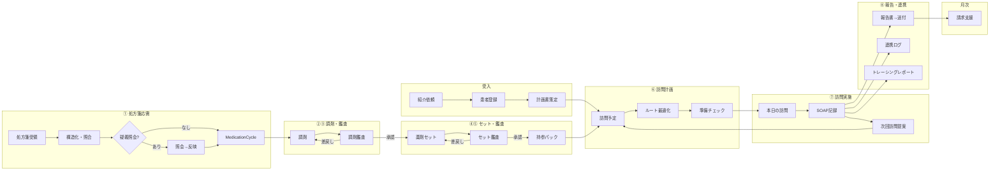

# PH-OS Pharmacy — 完了トラック アーカイブ

> `Plans.md` から完全完了（`cc:完了`）トラックを移設した履歴。
> 移設日: 2026-06-20。元ファイル: `Plans.md`。進行中/blocked/TODO トラックは Plans.md に残置。

---

## 直近トラック: 訪問支援・処方/調剤・共有要約 `cc:完了`

<details>
<summary>完了済み詳細 — クリックで展開</summary>

> 最終更新: 2026-03-27 19:27 JST
> 目的: 薬局薬剤師の訪問薬剤管理指導に必要な「訪問前の要点」「処方履歴差分」「調剤方法」「多職種共有」を、患者詳細・訪問準備・外部共有で一貫して確認できる状態まで引き上げる。

### 直近で完了済みの範囲

- [x] 訪問支援ボード / 患者サマリー / 日次 task 同期 `cc:完了` (2026-03-27)
  - `src/server/services/home-care-ops.ts`
  - `src/server/jobs/daily.ts`
  - `src/app/(dashboard)/workflow/workflow-dashboard-content.tsx`
  - `src/app/(dashboard)/patients/[id]/patient-detail-tabs.tsx`
  - `src/app/(dashboard)/schedules/day-view.tsx`
- [x] visit-brief 集約サービス + AI短文化フォールバック `cc:完了` (2026-03-27)
  - `src/server/services/visit-brief.ts`
  - `src/server/services/visit-brief-ai.ts`
  - `src/types/visit-brief.ts`
  - `src/components/visit-brief/visit-brief-card.tsx`
- [x] 患者 API / 訪問準備 API / 専用 brief endpoint 整備 `cc:完了` (2026-03-27)
  - `src/app/api/patients/[id]/route.ts`
  - `src/app/api/patients/[id]/visit-brief/route.ts`
  - `src/app/api/visit-preparations/[scheduleId]/route.ts`
  - `src/app/api/visit-preparations/[scheduleId]/brief/route.ts`
- [x] 服薬管理画面の見やすい薬剤一覧 + サマリー `cc:完了` (2026-03-27)
  - `src/app/(dashboard)/patients/[id]/medications/medications-content.tsx`
  - `src/app/(dashboard)/patients/[id]/medications/page.tsx`
- [x] 処方履歴の差分ダッシュボード + 調剤方法ワンビュー `cc:完了` (2026-03-27)
  - `src/app/(dashboard)/patients/[id]/prescriptions/prescription-history-content.tsx`
  - `src/app/(dashboard)/patients/[id]/prescriptions/page.tsx`
- [x] 外部共有ポータルの共有サマリー `cc:完了` (2026-03-27)
  - `src/server/services/external-access.ts`
  - `src/app/shared/[token]/shared-viewer-content.tsx`

### 残タスク一覧（優先度順）

- [x] VB-01: 多職種共有サマリーの送達管理 `cc:完了`
  - 目的: 「共有内容を作る」だけでなく、「誰に送ったか・確認されたか・返信待ちか」を追えるようにする。
  - 2026-03-27 進捗:
    - `communication-queue` を親サービスとして `visit-brief` / 患者詳細 / workflow / 訪問準備へ送達 timeline を接続
    - 未確認 / 返信待ち / 失敗 の内訳、緊急連絡ドラフト候補、共有タイムライン表示を追加
    - workflow に未確認 / 返信待ちの aggregate workbench を追加し、通信依頼画面から draft / sent / received / closed の運用更新を可能化
  - 実装方針:
    - `communication-queue` を通信オペレーションの親サービスに固定する
    - `visit-brief` には送達状況の短い projection のみ返し、通信状態の再集約はしない
  - 実装内容:
    - `CommunicationRequest` / `DeliveryRecord` / `CommunicationEvent` を束ねた送達ステータス集約を追加
    - 患者詳細と workflow に「未確認」「返信待ち」「失敗」の 3 区分を表示
    - 共有済み報告書と tracing report を同じ timeline で見られるようにする
  - 関連ファイル:
    - `src/server/services/communication-queue.ts`
    - `src/server/services/visit-brief.ts`
    - `src/app/api/dashboard/workflow/route.ts`
    - `src/app/(dashboard)/workflow/workflow-dashboard-content.tsx`
  - DoD:
    - 共有依頼ごとに delivery status が確認できる
    - 未確認/返信待ちが task として workflow に上がる
    - `visit-brief` 側に通信状態の重複ロジックを追加しない

- [x] VB-02: 疑義照会ワークベンチの実務化 `cc:完了`
  - 目的: 抽出した疑義照会候補を、その場で照会文面・回答・処方反映まで繋げる。
  - 実装方針:
    - 通信の優先度・期限・アクションは `communication-queue` を親にする
    - `visit-brief` は患者/訪問画面での抜粋表示に限定し、疑義照会の進行管理は workflow 側で行う
  - 実装内容:
    - `MedicationIssue` と `InquiryRecord` の対応付け
    - 照会ドラフト生成、回答待ち、回答済み、反映済みの状態遷移
    - `communication-queue` / 訪問支援ボード / visit-brief からワンクリックで開ける導線
  - 関連ファイル:
    - `src/server/services/communication-queue.ts`
    - `src/server/services/home-care-ops.ts`
    - `src/server/services/visit-brief.ts`
    - `src/app/api/dashboard/workflow/route.ts`
  - DoD:
    - 疑義照会候補から `InquiryRecord` が起票できる
    - 回答待ち/未反映が明確に残る
    - workflow と visit-brief の照会状態が同じ基準で表示される

- [x] VB-03: リフィル自動再訪のスケジュール提案化 `cc:完了`
  - 目的: 候補表示で終わらせず、再訪日案と担当薬剤師案まで出す。
  - 実装内容:
    - `refill_upcoming` / 服用終了日 / visit_deadline_date を使った再訪候補生成
    - 既存 `visit-schedule-planner` が返す proposal draft をそのまま使い、`visit_schedule_proposals` に流し込む
    - workflow から既存 proposal pipeline を起動できるようにする
  - 関連ファイル:
    - `src/server/services/visit-schedule-planner.ts`
    - `src/app/api/visit-schedule-proposals/route.ts`
    - `src/server/services/home-care-ops.ts`
    - `src/app/api/dashboard/workflow/route.ts`
  - DoD:
    - リフィル対象患者に対して再訪候補日が提示される
    - そのまま既存 proposal として保存・承認フローへ進める

- [x] VB-04: 算定ブロッカーの解消導線 `cc:完了`
  - 目的: 「請求不可の警告」を見るだけでなく、どの根拠が不足しているかを埋められるようにする。
  - 実装方針:
    - `BillingEvidence` を算定ブロッカー判定の唯一の SSOT に固定する
    - `visit-brief` / `visit-preparations` / workflow は `BillingEvidence` の projection だけを表示し、画面側で再判定しない
  - 実装内容:
    - `BillingEvidence` の不足項目を構造化し、患者/訪問/請求向け projection を返す
    - 同意未取得・計画書未更新・送達未完了・記録未入力を action link 付きで表示
    - 既存の task upsert / resolve と接続して block 解消後に task が自動クローズする同期を追加
  - 関連ファイル:
    - `src/server/services/billing-evidence.ts`
    - `src/server/services/visit-brief.ts`
    - `src/app/api/visit-preparations/[scheduleId]/route.ts`
    - `src/server/jobs/daily.ts`
  - DoD:
    - ブロッカーごとに解消先が明示される
    - 解消後に workflow の警告数が減る
    - 患者詳細 / 訪問準備 / 請求画面で同じ blocker 理由が表示される

- [x] VB-05: 家族・施設セルフ報告の履歴化 `cc:完了`
  - 目的: 送信した自己申告を単発入力で終わらせず、時系列比較と対応状況確認まで繋げる。
  - 実装内容:
    - 既存 `patient-self-reports` API を使い、外部共有 token 単位ではなく患者単位で self report 履歴を一覧化
    - category / callback / triage 結果でフィルタ
    - 対応済み・未対応・task 化済みのステータスを付与
  - 関連ファイル:
    - `src/app/api/patient-self-reports/route.ts`
    - `src/app/api/external-access/[token]/self-report/route.ts`
    - `src/app/shared/[token]/shared-viewer-content.tsx`
    - `src/server/services/visit-brief.ts`
  - DoD:
    - 患者詳細または外部共有から過去報告が確認できる
    - 対応漏れが再架電 SLA に連動する

- [x] VB-06: 剤形・服用形態支援の提案化 `cc:完了`
  - 目的: 「飲みにくさあり」を見つけるだけでなく、一包化候補・粉砕候補・剤形変更候補を提示する。
  - 実装内容:
    - `dosage_form_support` の evidence を詳細化
    - visit-brief に「剤形変更候補」セクションを追加
    - set plan / medication set 画面から提案理由を確認できるようにする
  - 関連ファイル:
    - `src/server/services/home-care-ops.ts`
    - `src/server/services/visit-brief.ts`
    - `src/app/(dashboard)/medication-sets/full/medication-set-full-content.tsx`
  - DoD:
    - 剤形・一包化・粉砕の候補理由が表示される
    - 不適応警告と候補提案が同時に見える

- [x] VB-07: 緊急連絡テンプレの送信導線 `cc:完了`
  - 目的: 緊急連絡先不足や急変対応を検知したら、そのまま連絡文面と送信履歴を扱えるようにする。
  - 2026-03-27 進捗:
    - 医師 / 訪看 / 家族向けの緊急連絡ドラフト候補を `communication-queue` から生成し、患者詳細 / workflow へ表示
    - `CommunicationRequest` に template / recipient / related entity / context snapshot を追加し、緊急ドラフトを標準フォーマットで起票できるようにした
  - 実装内容:
    - 医師/訪看/家族向けの緊急連絡テンプレートキー整備
    - `CommunicationRequest` に template / context の標準化
    - 患者詳細または訪問準備から送信 draft を起票
  - 関連ファイル:
    - `src/server/services/communication-queue.ts`
    - `src/server/services/external-access.ts`
    - `src/app/api/patients/[id]/route.ts`
  - DoD:
    - 緊急連絡候補から draft が作成できる
    - 送信後に communication timeline に残る

- [x] VB-08: 施設一括訪問トラッカー専用UI `cc:完了`
  - 目的: 同一施設患者を日別・施設別にまとめて準備/完了管理する。
  - 実装内容:
    - `FacilityVisitBatch` ベースの一覧 UI
    - 施設ごとの患者、持参物、未準備、未完了をまとめて表示
    - day view から施設単位の drill-down を追加
  - 関連ファイル:
    - `src/server/services/home-care-ops.ts`
    - `src/app/(dashboard)/schedules/day-view.tsx`
    - `src/app/api/dashboard/workflow/route.ts`
  - DoD:
    - 同日同施設の訪問を 1 セクションで追える
    - 施設単位で準備漏れが分かる

- [x] VB-09: 地域資源マップの可視化 UI `cc:完了`
  - 目的: 夜間休日・緊急時に使える地域資源を、拠点・対応体制・空白地帯で見られるようにする。
  - 実装内容:
    - `pharmacy-sites` / shifts / geo 情報の集約 API
    - 管理画面に一覧 + 地域別サマリー表示
    - 夜間休日対応、麻薬、無菌、代行可否のフィルタ
  - 関連ファイル:
    - `src/app/api/pharmacy-sites/route.ts`
    - `src/app/(dashboard)/admin/analytics/*`
    - `src/server/services/home-care-ops.ts`
  - DoD:
    - 拠点別の対応体制と空白日が見える
    - 緊急時プレイブックへ遷移できる

- [x] VB-10a: モバイル訪問モード（軽量閲覧） `cc:完了`
  - 目的: 通信不安定でも、訪問要点と同期状態をすぐ確認できる軽量 UI を用意する。
  - 実装内容:
    - day view / visit brief の軽量表示
    - 重要情報のみ read-only でオフラインキャッシュ
    - pending sync 件数と通信状態を表示
  - 関連ファイル:
    - `src/app/(dashboard)/schedules/day-view.tsx`
    - `src/app/(dashboard)/schedules/day-view.shared.ts`
    - `src/lib/stores/offline-db.ts`
    - `src/lib/stores/sync-engine.ts`
  - DoD:
    - オフライン時でも訪問要点を確認できる
    - 同期待ち件数が分かる

- [x] VB-10b: モバイル訪問モード（訪問記録ドラフト） `cc:完了`
  - 目的: オフライン時でも訪問記録を下書きし、再接続後に再送できるようにする。
  - 実装内容:
    - `OfflineVisitDraft` / `OfflineSyncQueue` を使った visit record draft 保存
    - 既存 sync queue に visit record 再送を接続
    - 記録途中の step 状態と最終更新時刻を表示
  - 関連ファイル:
    - `src/lib/stores/offline-db.ts`
    - `src/lib/stores/sync-engine.ts`
    - `src/app/(dashboard)/schedules/day-view.tsx`
  - DoD:
    - オフラインで訪問記録を保存できる
    - 再接続後に自動または手動で再送できる

- [x] VB-10c: モバイル訪問モード（競合解決） `cc:完了`
  - 目的: 409 conflict 時に、破棄ではなく競合内容を見て手動解決できるようにする。
  - 2026-03-27 進捗:
    - sync engine で 409 conflict 時に queue/draft を破棄せず保持するよう変更
    - サーバー版/ローカル版の差分を day view に表示し、上書き / 破棄 / 再編集を選べるようにした
  - 実装内容:
    - sync engine で 409 時の draft 保持
    - サーバー版とローカル版の差分表示
    - 上書き / 破棄 / 再編集の選択肢を追加
  - 関連ファイル:
    - `src/lib/stores/sync-engine.ts`
    - `src/lib/stores/offline-db.ts`
    - `src/app/(dashboard)/schedules/day-view.tsx`
  - DoD:
    - conflict 時に draft が消えない
    - ユーザーが競合を解決できる

- [x] VB-11: AI要約の運用整備 `cc:完了`
  - 目的: AI短文化を「試験実装」から「運用機能」に引き上げる。
  - 2026-03-27 進捗:
    - provider / model / fallback reason を visit brief に保持し、UI 表示と fallback ログ出力を追加
    - AI / rule 比較表示、24h 失敗率表示、生成監査ログ、要約フィードバック収集 endpoint を追加
  - 実装内容:
    - provider 切替、失敗率監視、要約生成ログ、フィードバック収集
    - rule summary と AI summary の比較表示
    - source refs と生成時刻の監査性強化
  - 関連ファイル:
    - `src/server/services/visit-brief-ai.ts`
    - `src/server/services/visit-brief.ts`
    - `src/components/visit-brief/visit-brief-card.tsx`
  - DoD:
    - AI unavailable 時でも UX が崩れない
    - 要約の品質改善に必要な運用ログが残る

### 推奨実装順

1. VB-01 多職種共有サマリーの送達管理
2. VB-02 疑義照会ワークベンチの実務化
3. VB-03 リフィル自動再訪のスケジュール提案化
4. VB-04 算定ブロッカーの解消導線
5. VB-05 家族・施設セルフ報告の履歴化

</details>

## Phase 2: セット・月次運用・連携強化 `cc:完了`

<details>
<summary>6 subsections completed — click to expand</summary>

> depends: Phase 1b 完了 | 出口条件: セット運用安定化 + 締め処理の見える化

### 2-1. ④ 薬剤セット + ⑤ セット鑑査 `cc:完了`

> DoD: セット計画→実行→鑑査→持参パック→訪問持参連動が動作

> ※ 1b-5 で最小運用は先行実装済み。Phase 2 はフル機能化が目的

**④ 薬剤セット:**

- [x] セット計画画面: 対象期間、セット方式（施設カレンダー/1日4回/眠前のみ/カスタム）
- [x] スロットグリッド: 朝/昼/夕/眠前/頓用 × 日数のマトリクス
- [x] SetBatch: 明細→スロット割当、持参/施設預け/後送の区分、頓用は通常スロットから分離
- [x] 持参パック自動生成: 訪問持参チェックリスト、注意事項ラベル（冷所保管/麻薬等）
- [x] バリデーション: 鑑査未承認薬→セット不可、投与タイミング未定義→不可、処方変更→影響セット再確認

**⑤ セット鑑査:**

- [x] 鑑査待ち一覧 + セットグリッド確認画面（患者/日付/時間帯別）
- [x] 判定: 承認 / 部分承認（患者・日付・時間帯単位で承認範囲を特定）/ 差戻し（理由コード必須）
- [x] 承認 → 訪問計画のcarry_items確定、差戻し → セット担当に通知 + 不足分の再作業タスク起票
- [x] 一包化鑑査連携フック: 外部システム（PROOFIT等）のアダプタIF、画像認証結果をDispenseAuditに取込

### 2-2. 請求支援 (FR-401〜405) `cc:完了`

> DoD: 月次候補→バリデーション→確認→CSV出力が動作

- [x] BillingEvidence を前提に候補生成（visit単位の根拠欠落時は候補生成せず警告）
- [x] 請求候補生成（建物→ユニット→患者階層で単一建物振分け）
- [x] 3層バリデーション（D-05）+ 算定ルールエンジン（2026改定、バージョニング）
- [x] 服薬情報等提供料 5タイプ + 居宅療養管理指導費との同月不可
- [x] 在宅患者重複投薬・相互作用等防止管理料（処方提案→変更追跡）
- [x] CSV出力(YJコード) + 月次ダッシュボード

### 2-3. 経営指標・施設基準管理 `cc:完了`

> DoD: 各指標がリアルタイム集計され、施設基準の充足/不足が表示される

- [x] 経営指標ダッシュボード:
  - 処方箋集中率（調剤基本料区分に影響）
  - 後発医薬品調剤割合（地域支援・医薬品供給対応体制加算の要件、集中率85%超→70%以上必須）
  - 薬剤師1人あたり処方箋枚数（40枚/日基準）
  - 在宅訪問実績回数（年48回、2026改定で強化）
  - 処方箋月次受付枚数レポート
- [x] 施設基準管理(FacilityStandardRegistration): 届出一覧、要件充足チェック自動実行、更新期限アラート、要件未達→加算算定不可警告
- [x] かかりつけ薬剤師管理(PharmacistCredential): 研修認定有効期限、勤務実績(週32h+)、在籍継続期間、同意患者一覧

### 2-4. 通知・エスカレーション・カンファレンス `cc:完了`

- [x] 通知(FR-503) + EscalationRule + ConferenceNote（→Task変換）

### 2-5. 監査・管理設定・外部共有 `cc:完了`

- [x] 監査ログ閲覧(FR-502) + 管理設定(FR-504, 4層UI, 薬剤師シフト管理UI) + 外部連携監視(FR-505)
- [x] ExternalAccessGrant: 外部閲覧画面 + トークン(JWT,72h) + SMS OTP
- [x] 服薬カレンダー印刷/PDF + 家族向け簡易共有ビュー（ExternalAccessGrant Track B 拡張）

### 2-6. ケアチームアカウント + 外部連携 + オフライン `cc:完了`

- [x] 外部連携者ロール + CSV/NSIPS + FAX + オフライン下書き+同期(FR-106 Ph2)

</details>

## Phase 2b: 実務機能強化 `cc:完了`

<details>
<summary>10 subsections completed — click to expand</summary>

> 2026-03-28 立案: 既存コードベースの GAP 分析に基づく6機能の実装計画
> depends: Phase 1b 主要機能完了 | 出口条件: パイロット薬局で日常業務が完結する

### 2b-1. スタッフ管理機能 `cc:完了` (2026-03-31)

> 既存: Pharmacist CRUD API、Cognito 連携、シフト管理、資格管理は実装済み
> 不足: 専用UI、一覧性、勤怠、ワークロード分析、一括操作
> DoD: 管理者がスタッフの採用→配置→勤怠→評価を1画面で完結できる

**2b-1a. スタッフ管理専用ページ（`/admin/staff`）:**

- [x] スタッフ一覧テーブル（DataTable ベース） `cc:完了` (2026-03-31)
  - 列: 名前/カナ、ロール、所属店舗、アカウント状態（invited/active/suspended/retired）、最終ログイン、今月訪問数
  - フィルタ: ロール、店舗、状態、資格種別
  - ソート: 名前/訪問数/最終ログイン
  - 行アクション: 編集/停止/復帰/招待再送
  - 既存 API: `GET /api/pharmacists`（フィルタ拡張のみ）
- [x] スタッフ詳細パネル（サイドパネル or モーダル） `cc:完了` (2026-03-31)
  - プロフィール編集（名前/メール/電話/所属店舗/ロール変更）
  - 工程権限フラグ（can_dispense/can_audit_dispense/can_set/can_audit_set）のトグル
  - 訪問制限（max_daily_visits/max_weekly_visits/max_travel_minutes）
  - 専門分野（visit_specialties）、対応エリア（coverage_area）
  - 既存 API: `PATCH /api/pharmacists/[id]` action=update

**2b-1b. 資格管理 CRUD:**

- [x] 資格の新規登録・編集・失効 UI `cc:完了` (2026-03-31)
  - 現状: `pharmacist-credentials-content.tsx` は読み取り専用の一覧表示のみ
  - 追加: 登録フォーム（資格種別/番号/発行日/有効期限/研修時間/在籍年数）
  - API: `POST/PATCH /api/pharmacist-credentials` を新設
  - 既存モデル: `PharmacistCredential`（prisma/schema/organization.prisma）

**2b-1c. 勤怠・ワークロード分析:**

- [x] 薬剤師別 KPI ダッシュボード `cc:完了` (2026-03-31)
  - 月間訪問数 / 担当患者数 / 平均訪問時間 / 報告書提出率
  - データソース: `VisitRecord` + `CareReport` + `PharmacistShift` を集計
  - 既存基盤: `/admin/performance` の `page.tsx` を拡張
- [x] ワークロードバランス表示 `cc:完了` (2026-03-31)
  - 薬剤師間の訪問数/移動距離の偏り可視化
  - 既存 `visit-schedule-planner.ts` の `workload_penalty` スコアを流用

**2b-1d. 一括操作:**

- [x] CSV 一括インポート（薬剤師マスタ） `cc:完了` (2026-03-31)
  - カラム: 名前/カナ/メール/電話/ロール/店舗/資格
  - 既存 `inviteCognitoUser()` をバッチ呼出し
- [x] 一括シフト登録（月間テンプレート適用の拡張） `cc:完了` (2026-03-31)
  - 既存: `POST /api/pharmacist-shift-templates/apply`（単一薬剤師）→ 複数薬剤師同時適用

### 2b-2. 患者一覧機能強化 `cc:完了` (2026-03-31)

> 既存: 基本テーブル（名前/カナ/生年月日/性別/ケース状態）、カーソルページネーション、名前検索
> 不足: 高度フィルタ、リスク表示、クイックアクション、エクスポート
> DoD: 管理者/薬剤師が「今日対応すべき患者」を即座に絞り込める

**2b-2a. 高度フィルタ（API + UI）:**

- [x] API フィルタ拡張（`GET /api/patients`）
  - ケース状態（active/on_hold/discharged/terminated）
  - 担当薬剤師（CareTeamLink.user_id where role='pharmacist'）
  - 施設/建物（Residence.building_id）
  - 保険種別（payer_basis: medical/care/self）
  - リスクレベル（patient-risk.ts の score を参照）
  - 最終訪問日の範囲（VisitRecord.visited_at）
  - 同意状態（ConsentRecord の未取得/期限切れ）
  - 請求支援フラグ（Patient.billing_support_needed）
- [x] フィルタバー UI（patients-table.tsx 拡張）
  - マルチセレクト + 日付範囲ピッカー + リセットボタン
  - フィルタ適用数バッジ表示

**2b-2b. 一覧表示の情報密度向上:**

- [x] 追加列（切替可能）
  - 担当薬剤師名、リスクレベルバッジ（stable/watch/high）、最終訪問日、次回訪問予定
  - 未解決課題数、服薬中薬剤数、アクティブケース有無
  - 既存データソース: `GET /api/patients/[id]` の risk_summary / schedules を一覧 API にサマリー追加
- [x] カラム表示/非表示切替
  - DataTable の columnVisibility を活用（`src/components/ui/data-table.tsx` に既存機能あり）

**2b-2c. クイックアクション・エクスポート:**

- [x] 行アクション: 患者詳細へ遷移 / 訪問予定作成 / ケース状態変更
- [x] CSV/Excel エクスポート（フィルタ適用済み一覧）
  - 既存基盤: `billing-candidates/export` のパターンを流用
- [x] お気に入り/最近表示した患者（Zustand + localStorage）

### 2b-3. セット機能の実務拡張 `cc:完了` (2026-03-31)

> 既存: SetPlan(4方式)/SetBatch(グリッド)/SetAudit(承認/部分/差戻し)/持参パック/冷所・麻薬検知
> 不足: 患者固有の配薬方法、物理的なセット形態の表現、セット変更履歴
> DoD: 「この患者はお薬BOXの朝青・昼黄に入れてホッチキス止め」が画面で分かり、印刷できる

**2b-3a. 配薬方法マスタ + 患者固有設定:**

- [x] `PackagingMethod` マスタテーブル追加（prisma/schema/medication.prisma） `cc:完了` (2026-03-31)
  ```
  id, org_id, name, description, icon_key, sort_order, is_active
  初期データ: お薬BOX / お薬カレンダー / 一包化 / ホッチキス止め / テープ止め / 分包紙 / PTPシート / 液剤ボトル
  ```
- [x] `Patient.packaging_preferences` JSON フィールド追加（prisma/schema/patient.prisma） `cc:完了` (2026-03-31)
  ```json
  {
    "default_method_id": "uuid",
    "box_config": { "morning": "blue", "noon": "yellow", "evening": "pink", "bedtime": "white" },
    "special_instructions": "ホッチキス止め、名前シール貼付、大きい文字",
    "cognitive_note": "認知機能低下あり、家族管理",
    "staple_required": true,
    "label_font_size": "large"
  }
  ```
- [x] 患者詳細画面に「配薬方法」設定パネル追加
  - 配薬方法選択（マスタから）+ BOX色設定 + 特記事項テキスト
  - 設定は CareCase or Patient に紐付け

**2b-3b. セット画面への配薬方法統合:**

- [x] SetPlan.set_method を `PackagingMethod` FK に拡張（既存4値 + マスタ参照の併用） `cc:完了` (2026-03-31)
- [x] セットグリッド UI に配薬方法表示 `cc:完了` (2026-03-31)
  - グリッド上部: 「お薬BOX（朝=青, 昼=黄, 夕=ピンク, 眠前=白）」
  - 特記事項バナー: 「ホッチキス止め / 名前シール貼付」
  - 印刷レイアウト: BOX スロット色 + 患者固有指示を持参パックチェックリストに反映
- [x] `medication-set-full-content.tsx` の印刷ビューに配薬指示セクション追加 `cc:完了` (2026-03-31)

**2b-3c. セット変更履歴・差分:**

- [x] SetBatch の変更履歴（before/after diff） `cc:完了` (2026-03-31)
  - 再生成時に旧バッチを snapshot → diff 表示
  - 処方変更トリガーの自動検知（PrescriptionLine 更新 → 影響 SetBatch ハイライト）
- [x] packaging_instructions の構造化 `cc:完了` (2026-03-31)
  - 現在: free text + regex 検知（`/冷所/`, `/麻薬/`）→ 脆い
  - 改善: ENUM 型タグ配列に変更（`cold_storage`, `narcotic`, `half_tablet`, `crush_prohibited`, `separate_pack`, `unit_dose`）

### 2b-4. スケジュール提案機能の拡張 `cc:完了` (2026-03-31)

> 既存: visit-schedule-planner.ts（マルチファクタースコアリング、ルート最適化、制約チェック）
> 不足: 提案 UI、患者連絡結果の反映、リスケ提案、週間最適化
> DoD: 「来週の訪問予定を自動提案→確認→患者連絡→確定」のフローが UI で完結する

**2b-4a. スケジュール提案ダッシュボード（`/schedules/proposals`）:**

- [x] 提案一覧画面 `cc:完了` (2026-03-30)
  - 状態別タブ: 未承認 / 患者連絡中 / 確定済み / 却下
  - 各提案カード: 患者名、候補日時、担当薬剤師、スコア、提案理由
  - 一括承認 / 一括却下アクション
  - 既存 API: `GET /api/visit-schedule-proposals`
- [x] 提案詳細ビュー `cc:完了` (2026-03-30)
  - 候補一覧（1-5件）のランキング表示（スコア内訳: 移動コスト/薬剤師適合度/日付距離）
  - 地図上で訪問順ルートプレビュー（既存 `google-routes.ts` 連携）
  - 薬剤師のその日のスケジュールとの並び表示
  - 既存 API: `GET/PATCH /api/visit-schedule-proposals/[id]`

**2b-4b. 患者連絡ワークフロー:**

- [x] 提案承認 → 患者連絡タスク自動生成 `cc:完了` (2026-03-30)
  - 連絡方法選択（電話/FAX/メール）、連絡結果記録（確認済/不在/拒否/変更希望）
  - 既存: `contact_attempt` action は API 実装済み → UI 連携のみ
- [x] 変更希望時の再提案フロー `cc:完了` (2026-03-30)
  - 患者の希望日時を制約に追加 → `generateVisitScheduleProposalDrafts()` 再実行

**2b-4c. 週間最適化ビュー:**

- [x] 週単位の訪問予定最適化画面 `cc:完了` (2026-03-30)
  - 薬剤師 × 日のガントチャート（既存 day-view.tsx のタブレット週表示を拡張）
  - ドラッグ&ドロップで訪問の日付/薬剤師変更 → 再スコアリング
  - 空きスロットへの「この枠に提案」ボタン
- [x] 施設一括訪問の自動グループ化 `cc:完了` (2026-03-30)
  - 同一施設患者を同日に集約する提案（既存 `same_facility_bonus` スコアを活用）

### 2b-5. 報告書検索機能 `cc:完了` (2026-03-31)

> 既存: reports-table.tsx（状態/種別フィルタのみ、クライアントサイド）、API は patient_id + status のみ
> 不足: 日付範囲、キーワード検索、送達状態フィルタ、分析
> DoD: 「3月に○○医師に送った報告書で未確認のもの」が即座に検索できる

**2b-5a. API 検索拡張（`GET /api/care-reports`）:**

- [x] 日付範囲フィルタ（created_at / sent_at）
- [x] 報告書種別フィルタ（report_type — 現在クライアントサイドのみ → API に移行）
- [x] 送達状態フィルタ（DeliveryRecord.status: sent/failed/confirmed/response_waiting）
- [x] 送付先名検索（DeliveryRecord.recipient_name 部分一致）
- [x] 患者名検索（Patient.name / name_kana 部分一致 — 現在は patient_id のみ）
- [x] 全文キーワード検索（CareReport.content JSON 内の SOAP テキスト）
  - PostgreSQL `to_tsvector('japanese', ...)` or `ILIKE` でキーワードヒット

**2b-5b. 報告書一覧 UI 拡張（reports-table.tsx）:**

- [x] フィルタバー: 日付範囲 + 患者名 + 種別 + 送達状態 + キーワード
- [x] 追加列: 患者名（現在 patient_id のみ）、送付先名、送付日、送達チャネル
- [x] 送達状態バッジの色分け（sent=青、confirmed=緑、failed=赤、waiting=橙）
- [x] 行展開: 送達履歴タイムライン（DeliveryRecord の送付/リトライ/確認の時系列）

**2b-5c. 報告書分析:**

- [x] 送達成功率ダッシュボード（月別/医師別/チャネル別） `cc:完了` (2026-03-30)
  - 既存 `billing-evidence/analytics` のパターンを流用
- [x] 未確認報告書一覧（response_waiting が N日超）→ リマインドタスク自動生成 `cc:完了` (2026-03-30)

### 2b-6. 訪問時音声認識機能 `cc:完了` (2026-03-30)

> 既存: SOAP テキスト入力（Textarea）、ステップウィザード（S→O→A→P）、IndexedDB ドラフト保存
> 不足: Web Speech API 統合がゼロ。マイク参照は QR スキャンのカメラのみ
> DoD: 訪問先でスマホに向かって話すと SOAP テキストに変換され、編集→保存できる

**2b-6a. Web Speech API 統合:**

- [x] `src/lib/hooks/use-speech-recognition.ts` 新規作成 `cc:完了` (2026-03-30)
  - `webkitSpeechRecognition` / `SpeechRecognition` のブラウザ検出
  - 言語: `ja-JP`（日本語）固定、将来 `en-US` 切替対応
  - 設定: `continuous: true`（連続認識）、`interimResults: true`（中間結果表示）
  - 状態管理: `isListening` / `transcript` / `interimTranscript` / `error` / `isSupported`
  - マイク権限リクエスト + 権限拒否時のフォールバック UI

**2b-6b. SOAP 入力への統合:**

- [x] 各 SOAP セクションに「音声入力」トグルボタン追加 `cc:完了` (2026-03-30)
  - `visit-record-form.tsx` の Textarea 横にマイクアイコンボタン
  - `soap-step-wizard.tsx`（モバイル版）の各ステップにも同様追加
  - 録音中: ボタン赤点滅 + 中間テキストをリアルタイム表示（灰色イタリック）
  - 確定テキスト: Textarea に追記（既存テキストの末尾に append）
- [x] 音声→テキスト変換の後処理 `cc:完了` (2026-03-30)
  - 句読点自動挿入（日本語の場合「。」「、」の補完）
  - 医療用語の変換補正（「ないふく」→「内服」等）は Phase 3 で AI 補正として検討
- [x] IndexedDB ドラフト連携 `cc:完了` (2026-03-30)
  - 音声入力テキストも既存 `use-soap-draft.ts` の autosave に統合
  - オフライン時: Web Speech API はオンライン必須のため、オフライン時はボタン非活性 + ガイド表示

**2b-6c. 対応デバイス・制約:**

- [x] ブラウザ対応マトリクス `cc:完了` (2026-03-30)
  - Chrome/Edge: `webkitSpeechRecognition` サポート済み（主要ターゲット）
  - Safari (iOS): `SpeechRecognition` サポート済み（iOS 14.5+）
  - Firefox: 未サポート → フォールバック（ボタン非表示 + 手動入力のみ）
- [x] PWA 制約 `cc:完了` (2026-03-30)
  - HTTPS 必須（既に対応済み）
  - マイク権限は初回利用時に1回だけリクエスト
  - バックグラウンド時の録音停止ハンドリング

### 2b-7. 施設マスター `cc:完了` (2026-03-31)

> 既存: Residence.building_id（文字列のみ）、FacilityVisitBatch.facility_id（FK なし）、PharmacySite（自薬局のみ）
> 不足: Facility テーブルが存在しない。施設情報は患者住所やケアチームに散在し、一元管理できない
> DoD: 施設の基本情報・受入時間・担当者・所属患者を1画面で管理でき、訪問計画/請求に連動する

**2b-7a. Facility モデル新設（prisma/schema/organization.prisma）:**

- [x] `Facility` テーブル追加
  ```
  id, org_id, name, name_kana, facility_type(ENUM), postal_code, address, lat, lng
  phone, fax, email, representative_name
  acceptance_time_from, acceptance_time_to  // 受入時間帯
  visit_day_pattern (Json)                  // 定期訪問曜日パターン
  max_patients_per_visit                    // 1回あたり最大患者数
  notes, is_active
  ```
- [x] `FacilityType` ENUM
  ```
  hospital / clinic / nursing_home / group_home / special_nursing_home
  / rehabilitation_facility / home_care_support_clinic / other
  ```
  （病院 / 診療所 / 老人ホーム / グループホーム / 特養 / リハ施設 / 在宅療養支援診療所 / その他）
- [x] リレーション追加
  - `Residence.facility_id` → `Facility` FK（既存 `building_id` を置換）
  - `FacilityVisitBatch.facility_id` → `Facility` FK（既存文字列を置換）
  - `Facility` → `patients[]`（Residence 経由の逆参照）
  - `Facility` → `facilityContacts[]`（施設担当者）

**2b-7b. 施設担当者モデル（FacilityContact）:**

- [x] `FacilityContact` テーブル追加

  ```
  id, org_id, facility_id, name, role(施設看護師/施設管理者/施設相談員/その他)
  phone, email, fax, department, is_primary, notes
  ```

  - 施設側の連絡窓口を管理（患者の ContactParty とは別レイヤー）

**2b-7c. 施設管理 API:**

- [x] `GET/POST /api/facilities` — 施設一覧・新規登録 `cc:完了` (2026-03-30)
- [x] `GET/PATCH/DELETE /api/facilities/[id]` — 施設詳細・更新・無効化
- [x] `GET/PUT /api/facilities/[id]/contacts` — 施設担当者の管理
- [x] `GET /api/facilities/[id]/patients` — 施設所属患者一覧
- [x] バリデーション: `src/lib/validations/facility.ts` 新設

**2b-7d. 施設管理 UI（`/admin/facilities`）:**

- [x] 施設一覧テーブル（DataTable）
  - 列: 名称/種別/住所/電話/受入時間/所属患者数/アクティブ
  - フィルタ: 種別、エリア、アクティブ状態
- [x] 施設詳細ページ `cc:完了` (2026-03-30)
  - 基本情報編集 + 受入時間 + 定期訪問曜日
  - 施設担当者一覧（CRUD）
  - 所属患者一覧（Residence 経由）
  - 施設訪問履歴（FacilityVisitBatch 一覧）

**2b-7e. 既存機能との連動:**

- [x] 患者登録時: 施設選択 → Residence.facility_id 自動設定 + 住所/座標自動入力 `cc:完了` (2026-03-30)
- [x] 訪問計画: Facility.acceptance_time_from/to → PatientSchedulePreference.facility_time_from/to に自動反映 `cc:完了` (2026-03-30)
- [x] 施設一括訪問: FacilityVisitBatch 作成時に Facility マスタから患者リストを自動取得 `cc:完了` (2026-03-30)
- [x] 請求: BillingEvidence.building_patient_count を Facility.patients から正確に集計 `cc:完了` (2026-03-30)

### 2b-8. 他職種マスター `cc:完了` (2026-03-31)

> 既存: CareTeamLink（ケース単位、5ロール、自由テキスト）、ContactParty（patient単位、facility_staff含む）
> 不足: 他職種の情報がケース/患者に散在し、同じ医師が複数患者に紐づく場合に重複入力が発生する
> DoD: 地域の医師・看護師・ケアマネを一元管理し、患者ケアチーム登録時に選択できる

**2b-8a. ExternalProfessional モデル新設（prisma/schema/organization.prisma）:**

- [x] `ExternalProfessional` テーブル追加
  ```
  id, org_id, name, name_kana, profession_type(ENUM)
  organization_name, department, title
  phone, email, fax, address
  facility_id (optional FK → Facility)  // 所属施設
  specialties (Json)                     // 専門分野
  preferred_contact_method (ENUM: phone/fax/email/other)
  preferred_contact_time (String)        // 連絡希望時間帯
  notes, is_active
  ```
- [x] `ProfessionType` ENUM
  ```
  physician / dentist / nurse / visiting_nurse / care_manager
  / social_worker / physical_therapist / occupational_therapist
  / speech_therapist / dietitian / pharmacist_external / helper / other
  ```
  （医師/歯科医師/看護師/訪問看護師/ケアマネ/MSW/PT/OT/ST/管理栄養士/外部薬剤師/ヘルパー/その他）

**2b-8b. CareTeamLink との連携:**

- [x] `CareTeamLink.external_professional_id` FK 追加（optional）
  - 既存の自由テキスト（name/organization_name/phone 等）はフォールバックとして残す
  - ExternalProfessional 選択時は FK から自動入力 + 同期
  - FK なしの場合は従来通り自由テキスト入力（未登録の職種にも対応）

**2b-8c. 他職種マスター API:**

- [x] `GET/POST /api/external-professionals` — 一覧・新規登録 `cc:完了` (2026-03-30)
  - 検索: 名前/カナ/職種/所属施設で検索
- [x] `GET/PATCH/DELETE /api/external-professionals/[id]` — 詳細・更新・無効化
- [x] `GET /api/external-professionals/[id]/patients` — 担当患者一覧（CareTeamLink 逆参照）
- [x] バリデーション: `src/lib/validations/external-professional.ts` 新設

**2b-8d. 他職種マスター UI（`/admin/professionals`）:**

- [x] 他職種一覧テーブル（DataTable）
  - 列: 名前/カナ/職種/所属施設・組織/電話/メール/担当患者数
  - フィルタ: 職種、所属施設、アクティブ状態
- [x] 他職種詳細パネル `cc:完了` (2026-03-30)
  - 基本情報編集 + 所属施設選択（Facility マスタ連動）
  - 担当患者一覧（CareTeamLink 逆参照）
  - 連絡履歴（CommunicationEvent/CommunicationRequest で counterpart 検索）

**2b-8e. ケアチーム登録 UI の改善:**

- [x] `patient-care-team-panel.tsx` の入力改善
  - 現在: 全フィールド手入力 → 改善: 名前入力時に ExternalProfessional をサジェスト
  - 選択すると組織名/電話/FAX/メール/所属施設を自動入力
  - 「新規登録」ボタンで ExternalProfessional を即時追加

### 2b-9. カンファレンス記録機能 `cc:完了` (2026-03-31)

> 既存: ConferenceNote（タイトル/内容/参加者JSON/アクションアイテム→Task変換）、conferences-content.tsx
> 不足: conference_type なし / 算定連携なし / 報告書生成なし / 情報のシステム活用なし
> DoD: カンファレンス記録→算定根拠→報告書生成→患者情報への反映が一気通貫で動作する

**設計方針: カンファレンス情報の3つの出口**

```
                    ┌─→ [算定] BillingEvidence + BillingCandidate
                    │     退院時共同指導料 / 情報提供料 / ターミナルケア加算
ConferenceNote ─────┼─→ [報告書] CareReport + DeliveryRecord
  (構造化記録)       │     参加報告書 / 情報提供書 / 内部記録
                    └─→ [情報活用] 患者データへのフィードバック
                          ManagementPlan更新 / MedicationIssue起票 / VisitSchedule調整
```

**2b-9a. ConferenceNote モデル拡張（prisma/schema/communication.prisma）:**

- [x] `conference_type` ENUM 追加 `cc:完了` (2026-03-31)
  ```
  multidisciplinary          // 多職種カンファレンス（汎用）
  discharge_planning         // 退院前カンファレンス
  service_team_meeting       // サービス担当者会議
  death_conference           // デスカンファレンス
  medication_review          // 薬剤総合評価調整会議
  emergency_case_review      // 緊急事例検討
  ```
- [x] 構造化フィールド追加 `cc:完了` (2026-03-31)
  ```
  conference_type             ConferenceType
  patient_id                  String? (optional FK → Patient)
  facility_id                 String? (optional FK → Facility)
  structured_content          Json?   // 種別ごとの構造化データ（下記 9b〜9d で定義）
  billing_eligible            Boolean @default(false)
  billing_code                String? // SSOT key（例: medical.conference.discharge_joint_guidance）
  follow_up_date              DateTime?
  follow_up_completed         Boolean @default(false)
  generated_report_id         String? // 生成した CareReport の ID（traceability）
  ```
- [x] `participants` JSON の構造化強化 `cc:完了` (2026-03-30)

  ```json
  [
    {
      "name": "田中太郎",
      "role": "physician",
      "organization": "○○クリニック",
      "external_professional_id": "uuid",
      "attended": true,
      "is_report_recipient": true
    }
  ]
  ```

  - `external_professional_id` → ExternalProfessional マスタ連動
  - `attended` → 出欠管理（算定要件の参加者数チェックに使用）
  - `is_report_recipient` → 報告書送付対象フラグ

**2b-9b. 退院前カンファレンス（discharge_planning）:**

- [x] `structured_content` スキーマ `cc:完了` (2026-03-31)
  ```json
  {
    "hospital_name": "○○病院",
    "ward": "3階東病棟",
    "target_discharge_date": "2026-04-15",
    "diagnosis_summary": "誤嚥性肺炎後のリハビリ",
    "current_medications": [{ "drug_name": "...", "dose": "...", "frequency": "..." }],
    "medication_changes_on_discharge": [
      { "drug_name": "...", "change_type": "added|stopped|dose_changed", "reason": "..." }
    ],
    "home_care_requirements": "訪問薬剤管理指導（週1回）、服薬カレンダー管理",
    "support_arrangements": "訪問看護週2回、デイケア週3回",
    "pharmacist_role": "服薬指導、残薬管理、副作用モニタリング",
    "next_outpatient_date": "2026-04-22",
    "document_provided": true
  }
  ```
- [x] **算定連携**: 退院時共同指導料（600点） `cc:完了` (2026-03-31)
  - SSOT key: `medical.conference.discharge_joint_guidance`
  - 算定要件: ①入院中に病院で共同指導 ②文書提供（`document_provided=true`）③薬剤師が参加（participants に pharmacist role + attended=true）
  - `billing-evidence.ts` の `upsertBillingEvidenceForVisit` に conference_note_ref 連携を追加
- [x] **報告書生成**: 退院前カンファ → `CareReport(report_type=physician_report)` 自動生成 `cc:完了` (2026-03-31)
  - `medication_changes_on_discharge` を報告書の処方変更セクションに差込み
  - `home_care_requirements` を計画セクションに差込み
- [x] **情報活用**: `cc:完了` (2026-03-31)
  - `medication_changes_on_discharge` → MedicationIssue 自動起票（change_type ごとに）
  - `target_discharge_date` → VisitSchedule の初回訪問提案日を自動設定
  - `home_care_requirements` → ManagementPlan の次回更新時に参照表示

**2b-9c. サービス担当者会議（service_team_meeting）:**

- [x] `structured_content` スキーマ `cc:完了` (2026-03-31)
  ```json
  {
    "meeting_purpose": "ケアプラン変更に伴う担当者会議",
    "care_plan_changes": "訪問頻度の見直し（月2回→月4回）",
    "service_adjustments": [
      { "service": "訪問薬剤管理", "before": "月2回", "after": "月4回", "reason": "服薬管理強化" }
    ],
    "medication_related_items": [
      { "item": "服薬コンプライアンス低下", "action": "一包化検討", "assignee": "担当薬剤師" }
    ],
    "agreed_actions": [{ "action": "...", "assignee": "...", "deadline": "..." }],
    "next_meeting_date": "2026-05-15",
    "care_manager_name": "佐藤花子"
  }
  ```
- [x] **算定連携**: 服薬情報等提供料2（ケアマネ共有）（20点） `cc:完了` (2026-03-31)
  - SSOT key: `medical.information_provision.2_care_manager`（既存ルール）
  - 算定要件: 担当者会議でケアマネに薬学的情報を提供 + 記録保持
  - `billing_eligible` 自動判定: participants に care_manager role + attended=true → true
  - BillingEvidence.conference_note_ref に記録
- [x] **報告書生成**: 担当者会議 → `CareReport(report_type=care_manager_report)` 自動生成 `cc:完了` (2026-03-31)
  - `service_adjustments` と `medication_related_items` を報告書に差込み
  - 参加者のうち `is_report_recipient=true` の全員に送付候補を自動生成
- [x] **情報活用**: `cc:完了` (2026-03-31)
  - `service_adjustments` の訪問頻度変更 → VisitSchedule の recurrence_rule 変更提案を自動生成
  - `medication_related_items` → MedicationIssue 起票 + action_items → Task 変換
  - `agreed_actions` → 既存の conference-notes/[id]/tasks API で Task 自動生成
  - `next_meeting_date` → 次回会議リマインド Notification を日次ジョブで生成

**2b-9d. デスカンファレンス（death_conference）:**

- [x] `structured_content` スキーマ `cc:完了` (2026-03-31)
  ```json
  {
    "death_date": "2026-03-20",
    "death_location": "自宅",
    "care_duration_months": 18,
    "review_focus": ["疼痛管理", "服薬管理", "家族支援", "多職種連携"],
    "timeline_summary": "2024年9月開始→2025年6月から麻薬管理→2026年3月看取り",
    "medication_review": {
      "pain_control": "概ね良好",
      "last_week_changes": "レスキュー増量",
      "adverse_events": "なし"
    },
    "lessons_learned": "家族への早期介入が有効だった",
    "quality_indicators": {
      "pain_controlled": true,
      "family_satisfaction": "high",
      "medication_adherence": "good"
    },
    "improvement_actions": [
      {
        "action": "看取り期の服薬指導マニュアルを改訂",
        "assignee": "管理薬剤師",
        "deadline": "2026-06-30"
      }
    ]
  }
  ```
- [x] **算定連携**: ターミナルケア加算の根拠記録 `cc:完了` (2026-03-31)
  - 在宅ターミナルケア加算（2,500点）: 死亡日前14日以内に2回以上の訪問実績が必要
  - `death_date` + 直近14日の VisitRecord から自動判定 → `billing_eligible`
  - SSOT key: `medical.addition.terminal_care`（新規追加）
- [x] **報告書生成**: デスカンファ → `CareReport(report_type=internal_record)` 自動生成 `cc:完了` (2026-03-31)
  - 振返り記録として保存。外部送付は任意（主治医への最終報告）
  - PDF テンプレート: ケア経過タイムライン + 薬学評価 + 改善事項
- [x] **情報活用**: `cc:完了` (2026-03-31)
  - ケース終了（CaseStatus = terminated）への遷移導線
  - `improvement_actions` → Task 変換（組織レベルの改善タスク）
  - `quality_indicators` → 組織 KPI ダッシュボード（看取り実績・品質指標の蓄積）
  - `lessons_learned` → 将来の類似ケースの visit-brief に参照表示（Phase 3）

**2b-9e. 算定連携の実装詳細:**

- [x] BillingEvidence モデル拡張 `cc:完了` (2026-03-30)
  - `conference_note_ref String?` 追加（ConferenceNote.id を格納）
  - 既存パターン踏襲: `report_delivery_ref` と同様に CSV 形式で複数会議対応
- [x] SSOT ルール追加（現 `billing-rules.ts` に統合済み） `cc:完了` (2026-03-30)

  ```
  medical.conference.discharge_joint_guidance    退院時共同指導料          600点  manual  要件: 入院中共同指導+文書提供
  medical.addition.terminal_care                 在宅ターミナルケア加算    2500点  manual  要件: 死亡前14日以内に2回以上訪問
  medical.conference.emergency_joint_guidance     在宅患者緊急時等共同指導料 700点  manual  要件: 急変時の多職種共同指導
  ```

  - 既存の `medical.information_provision.2_care_manager`（20点）は担当者会議で自動候補化

- [x] `billing-evidence.ts` の `upsertBillingEvidenceForVisit` 拡張 `cc:完了` (2026-03-30)
  - 同月の ConferenceNote（`billing_eligible=true`）を検索
  - `conference_note_ref` に格納
  - 算定要件チェック: participants の attended 数、document_provided フラグ、死亡前訪問回数
  - `recommended_rule_keys` に該当ルールを追加（manual selection_mode → 手動確認）
- [x] BillingCandidate 生成 `cc:完了` (2026-03-30)
  - `dedupe_key`: `{org_id}:{patient_id}:{billing_code}:{billing_month}:{conference_note_id}`
  - `source_snapshot` に会議情報のスナップショットを保持（監査証跡）

**2b-9f. 報告書生成の実装詳細:**

- [x] `POST /api/conference-notes/[id]/generate-report` 新設 `cc:完了` (2026-03-30)
  - 入力: `{ report_type, include_structured_content, auto_send }`
  - 処理フロー:
    1. ConferenceNote + Patient + CareTeamLink を取得
    2. `report-templates.ts` に会議種別ごとのテンプレートビルダーを追加
       - `buildDischargeConferenceReport()` → PhysicianReportContent に退院時処方変更を差込み
       - `buildServiceTeamMeetingReport()` → CareManagerReportContent にサービス調整を差込み
       - `buildDeathConferenceReport()` → 内部記録テンプレート（ケア経過+評価+改善）
    3. CareReport を `draft` で作成、`generated_report_id` を ConferenceNote に書戻し
    4. `auto_send=true` の場合: participants の `is_report_recipient=true` に対して DeliveryRecord を自動生成
  - 既存の `care-reports/[id]/send` API で送付（既存フローに合流）
- [x] 報告書 → BillingEvidence の自動連動 `cc:完了` (2026-03-30)
  - 送付完了 → `report_delivery_ref` 更新 → 算定ブロッカー「報告書未送付」解消
  - 退院時共同指導: 文書提供の evidence として DeliveryRecord を参照

**2b-9g. システム内情報活用の実装詳細:**

- [x] カンファレンス → 患者データ自動反映サービス `cc:完了` (2026-03-31)
  - `src/server/services/conference-data-sync.ts` 新設
  - 会議保存時（POST/PATCH）にフック実行:

    ```
    discharge_planning:
      → MedicationIssue 起票（medication_changes_on_discharge の各変更）
      → VisitSchedule 初回訪問提案（target_discharge_date + 3日）
      → ManagementPlan 更新リマインド Task 生成
      → PatientSchedulePreference の facility_time を退院先施設から取得

    service_team_meeting:
      → VisitSchedule recurrence_rule 変更提案（service_adjustments の頻度変更）
      → MedicationIssue 起票（medication_related_items の各項目）
      → Task 生成（agreed_actions → conference-notes/[id]/tasks 既存API活用）
      → Notification 生成（next_meeting_date → 日次ジョブでリマインド）

    death_conference:
      → CaseStatus terminated 遷移提案
      → Task 生成（improvement_actions → 組織改善タスク）
      → 品質指標蓄積（quality_indicators → 月次ジョブで集計）
    ```

  - [x] pre_discharge: `medication_changes_on_discharge` から `MedicationIssue` を起票 `cc:完了` (2026-03-30)
  - [x] pre_discharge: `target_discharge_date + 3日` を優先した `VisitScheduleProposal` 起票 `cc:完了` (2026-03-30)
  - [x] pre_discharge: 管理計画書更新リマインド Task 生成 `cc:完了` (2026-03-30)
  - [x] pre_discharge: 退院先施設から `PatientSchedulePreference.facility_time` 反映 `cc:完了` (2026-03-30)
  - [x] service_manager: `VisitSchedule.recurrence_rule` 変更提案の本実装 `cc:完了` (2026-03-30)
  - [x] service_manager: `medication_related_items` から `MedicationIssue` を起票 `cc:完了` (2026-03-30)
  - [x] service_manager: `agreed_actions` から Task 生成 `cc:完了` (2026-03-30)
  - [x] service_manager: `next_meeting_date` の日次リマインド通知 `cc:完了` (2026-03-30)
  - [x] death_conference: ケース終結レビュー Task で terminated 遷移提案 `cc:完了` (2026-03-30)
  - [x] death_conference: `improvement_actions` から組織改善 Task 生成 `cc:完了` (2026-03-30)
  - [x] death_conference: `quality_indicators` を月次ジョブで集計 `cc:完了` (2026-03-30)

- [x] visit-brief への会議情報統合 `cc:完了` (2026-03-30)
  - `src/server/services/visit-brief.ts` の集約に `recent_conferences` セクション追加
  - 患者の直近30日のカンファレンス（退院前/担当者会議）を要約表示
  - 未完了の follow_up_date がある会議をハイライト
- [x] workflow ダッシュボードへの統合 `cc:完了` (2026-03-30)
  - `GET /api/dashboard/workflow` に「会議フォローアップ未完了」セクション追加
  - follow_up_date 超過 → ダッシュボードに警告

**2b-9h. カンファレンス API:**

- [x] `GET /api/conference-notes` フィルタ追加 `cc:完了` (2026-03-30)
  - `conference_type`, `patient_id`, `facility_id`, `date_from`, `date_to`, `billing_eligible`
- [x] `POST /api/conference-notes` バリデーション拡張 `cc:完了` (2026-03-30)
  - `conference_type` 必須、種別に応じた `structured_content` の Zod スキーマ検証
  - 保存時に `conference-data-sync` サービスを呼出し（情報活用フック）
- [x] `PATCH /api/conference-notes/[id]` 新設（編集対応） `cc:完了` (2026-03-30)
- [x] `POST /api/conference-notes/[id]/generate-report` 新設（報告書生成） `cc:完了` (2026-03-30)
- [x] バリデーション: `src/lib/validations/conference.ts` 新設 `cc:完了` (2026-03-30)

**2b-9i. カンファレンス UI 拡張（conferences-content.tsx）:**

- [x] 種別タブ: 全て / 退院前 / 担当者会議 / デスカンファ / その他 `cc:完了` (2026-03-30)
- [x] 種別別の作成フォーム（種別選択 → 動的フィールド表示） `cc:完了` (2026-03-30)
- [x] 参加者入力: ExternalProfessional サジェスト + 出欠チェック + 報告書送付対象チェック
- [x] 会議保存後のアクションパネル `cc:完了` (2026-03-30):
  - 「報告書を生成」ボタン → report_type 選択 → 送付先自動入力
  - 「算定候補を確認」リンク → billing candidates 画面へ遷移
  - 「フォローアップ項目」一覧 → Task / MedicationIssue / VisitSchedule への反映状態表示
- [x] カンファレンスカレンダービュー（月単位で会議一覧） `cc:完了` (2026-03-30)
- [x] 印刷/PDF 出力（退院時共同指導の文書 / 担当者会議議事録） `cc:完了` (2026-03-30)

### 2b-10. ダッシュボード リデザイン + 処方到着動線 + パフォーマンス最適化 `cc:完了` (2026-03-31)

> 2026-03-28 立案
> depends: Phase 1a（ダッシュボード基盤）, Phase 1b-1（処方受付）
> DoD: 3段レイアウト表示、処方受付→DispenseTask自動生成、Lighthouseスコア改善

**背景:** 現在のダッシュボードは「サマリーカード4枚 + 2列4セクション」の詰め込み型で見にくい。処方受付の入口が分かりにくく、DispenseTask の手動生成が必要。

**新レイアウト（3段構成）:**

| セクション                        | 内容                                                                                                                                      | データソース                                                          |
| --------------------------------- | ----------------------------------------------------------------------------------------------------------------------------------------- | --------------------------------------------------------------------- |
| **上段: スケジュール**            | 既存 ScheduleDayView/CalendarView を `next/dynamic` で埋め込み。日/カレンダー切替タブ。CalendarView に処方未着ドット(cycle_id=null)を追加 | 既存 `GET /api/visit-schedules` をそのまま使用                        |
| **中段: パイプライン+アクション** | ワークフローパイプラインバー（受付→調剤→鑑査→セット→準備→訪問→報告の7工程件数）+ 統合アクションリスト（緊急度順、最大10件）               | 既存 workflow API の `cycleCounts` + `WorkbenchItem` パターンを再利用 |
| **下段: 患者カード一覧**          | 全アクティブ患者をリスクスコア順にカードグリッド表示。検索・ソート・ページネーション。各カードに「処方受付」ボタン                        | 既存 `listPatientRiskSummaries()` を再利用                            |

**処方到着動線の改善:**

- [x] 患者カードの「処方受付」ボタン → `/prescriptions/new?patient_id=...&case_id=...` で患者自動選択 `cc:完了` (2026-03-30)
- [x] `prescription-intakes/route.ts` POST: 疑義照会なしの場合 DispenseTask を自動生成（overall_status → dispensing） `cc:完了` (2026-03-30)
- [x] `sidebar.tsx` に「処方受付」リンク（`ClipboardPlus`, `/prescriptions/new`）追加 `cc:完了` (2026-03-30)

**パフォーマンス最適化:**

- [x] セクション分離: schedule/actions/patients を独立 `useQuery` に（1セクション遅延が全体をブロックしない） `cc:完了` (2026-03-31)
- [x] `next/dynamic` で ScheduleDayView(4700行)/CalendarView を遅延ロード `cc:完了` (2026-03-31)
- [x] セクション別 staleTime/refetchInterval（schedule:30s/60s、patients:120s） `cc:完了` (2026-03-31)
- [x] `Suspense` + セクション別スケルトンで独立描画 `cc:完了` (2026-03-31)
- [x] `loading.tsx` を3段レイアウトに合わせたスケルトンに更新 `cc:完了` (2026-03-31)

**変更ファイル:**

- 新規6: `types/dashboard-home.ts`, `api/dashboard/home/actions/route.ts`, `api/dashboard/home/patients/route.ts`, `dashboard/schedule-section.tsx`, `dashboard/actions-section.tsx`, `dashboard/patient-card.tsx`, `dashboard/patient-grid-section.tsx`
- 修正5: `dashboard/dashboard-content.tsx`(書換), `dashboard/page.tsx`, `prescription-intakes/route.ts`, `prescriptions/new/page.tsx`, `sidebar.tsx`
- 改修1: `schedules/calendar-view.tsx`（処方未着ドット+患者名表示）, `api/visit-schedules/route.ts`（cycle include追加）

**既存コード再利用:**

- `ScheduleDayView` / `CalendarView` — そのまま埋め込み（compact prop 追加のみ）
- `listPatientRiskSummaries()` — 患者カードのスコア/レベル/理由
- `listCommunicationQueue()` — アクションセクションの連絡アイテム
- `cycleCounts` (MedicationCycle groupBy) — パイプラインバー
- `WorkbenchItem` + `describeOperationalTask()` — アクションリスト
- `VISIT_TYPE_LABELS` / `SCHEDULE_STATUS_LABELS` — ラベル定数
- `OnboardingChecklist` — 変更なし（全ステップ完了で自動非表示）

**詳細設計:** `.claude/plans/temporal-strolling-spring.md` 参照

- [x] ダッシュボード情報配置の再編とグループ境界の明確化 `cc:完了` (2026-04-03)
  - 依頼内容: トップページの情報配置を見直し、当日運用・業務導線・患者確認のまとまりが視覚的に伝わるよう、順序変更と区切り線/セクション枠を導入する
  - 追加日時: 2026-04-03 08:03 JST
- [x] 全ページ向け UI/UX 指針策定と共通ページグルーピング適用 `cc:完了` (2026-04-03)
  - 依頼内容: デザイン指針を文書化し、その指針を Claude / Codex の両方が必ず参照するよう明記したうえで、全体ページに共通 scaffold を導入して情報グループを視認しやすくする
  - 追加日時: 2026-04-03 08:18 JST
- [x] Playwright による UI 配置検証と導線調整 `cc:完了` (2026-04-03)
  - 依頼内容: Playwright を使って主要画面の UI を確認し、画面配置と導線を検証したうえで、共通レイアウト検証と visual baseline 更新を行う
  - 追加日時: 2026-04-03 08:45 JST
  - 2026-04-03 追記: mobile-chromium を local config に追加し、患者一覧 / 報告書の詳細フィルタを折りたたみ化。PC では主要フィルタ優先、モバイルでは検索優先の配置へ再編
  - 2026-04-03 追記: workflow / billing の上段を判断帯へ整理し、visit detail ページも共通 scaffold と操作クラスタへ統一。患者詳細 / 訪問詳細の Playwright 検証を追加

</details>

## Phase 2c: マスター機能整備 + データリンク強化 `cc:完了`

<details>
<summary>9 subsections completed — click to expand</summary>

> 2026-03-30 立案。マスターデータの体系的整備と、マスター↔トランザクションのリンク構築。
> 出口条件: 薬局が初期設定を完了し、日常運用でマスター参照が途切れない状態。

### エンティティリンク図（施設→ユニット→患者→訪問）

```
Facility (施設)
├── FacilityUnit[] (ユニット: フロア/棟/ユニット)
│   ├── name: "2F東ユニット"
│   ├── floor: "2F"
│   └── capacity: 20
│
├── FacilityContact[] (施設連絡先)
│   └── role: "施設長" / "看護師長"
│
└── ExternalProfessional[] (関連専門職)
    └── 施設担当医/看護師/ケアマネ

Patient.Residence
├── building_id → Facility.id (FK化)
├── unit_id → FacilityUnit.id (NEW)
└── unit_name: "203号室"

VisitSchedule / FacilityVisitBatch
├── facility_id → Facility.id
├── facility_unit_id → FacilityUnit.id (NEW)
└── patient_ids → ユニット内の患者を自動グルーピング

CareTeamLink
├── facility_id → Facility.id (NEW)
└── external_professional_id → ExternalProfessional.id

PharmacySiteInsuranceConfig
└── 算定時に building_patient_count をユニット単位で計算可能に

PrescriptionIntake
├── prescriber_institution_id → PrescriberInstitution.id (NEW)
└── prescriber_institution: テキスト (後方互換)
```

### 2c-1. 施設ユニット管理 `cc:完了` (2026-03-31)

> Facility 配下にフロア/棟/ユニットの階層を追加。訪問はユニット単位で計画する。
> DoD: 施設にユニットを登録でき、患者がユニットに紐付き、訪問がユニット単位でグルーピングされること。
> 注意: 算定上の「単一建物居住者数」は建物単位が原則。ユニット単位カウントはグループホーム（3ユニット以下）のみ。

- [x] 2c-1a: FacilityUnit モデル + Residence FK + 単一建物特例ルール (`9877f2f`)
      FacilityUnit 新設、Residence.facility_id/facility_unit_id FK 追加、
      resolveBuildingPatientCount に厚労省4特例ルール実装済み
- [x] 2c-1b: VisitSchedule / FacilityVisitBatch にユニット単位のグルーピング `cc:完了` (2026-03-31)
      `facility_unit_id` 追加。同一ユニット患者を自動グルーピングして一括訪問
- [x] 2c-1c: 施設管理 UI にユニット CRUD 追加 `cc:完了` (2026-03-31)
      `/admin/facilities/[id]` にユニット一覧タブ + 患者マッピング表示
- [x] 2c-1d: 患者登録時に施設→ユニット選択 UI `cc:完了` (2026-03-31)
      Residence 入力で施設選択 → ユニット選択 → 部屋番号入力のカスケードUI

### 2c-2. 薬局運営基盤マスター `cc:完了` (2026-03-31)

> P0: 薬局が稼働するための最低限。depends: なし
> DoD: ユーザー招待/権限変更、薬局情報設定の登録/編集、休日登録が UI から完結すること。

- [x] 2c-2a: ユーザー・権限管理 UI `cc:完了` (2026-03-31)
      User/Membership の一覧/招待/権限変更/停止。Cognito 同期状態表示
- [x] 2c-2b: 薬局情報設定 API + UI (PharmacySiteInsuranceConfig) `cc:完了` (2026-03-31)
      保険種別×改定年度の config 登録/編集/有効期間管理
- [x] 2c-2c: 薬局基本情報 編集 UI (PharmacySite) `cc:完了` (2026-03-31)
      名称/住所/電話/FAX/届出フラグの編集画面
- [x] 2c-2d: 営業日・休日管理 UI (BusinessHoliday) `cc:完了` (2026-03-31)
      既存 API を使った UI 追加。カレンダービュー + 一括登録

### 2c-3. 医療機関マスター `cc:完了` (2026-03-31)

> 処方元の構造化管理。報告書宛先・疑義照会先として参照。depends: 2c-2
> DoD: 医療機関を登録でき、処方受付時に選択でき、報告書宛先として参照されること。

- [x] 2c-3a: PrescriberInstitution モデル新設 `cc:完了` (2026-03-30)
      `id, org_id, name, institution_code, address, phone, fax, notes`
- [x] 2c-3b: PrescriptionIntake.prescriber_institution_id FK 追加 `cc:完了` (2026-03-30)
      既存 `prescriber_institution` テキストとの後方互換維持
- [x] 2c-3c: CareReport 送達先に医療機関マスターを参照 `cc:完了` (2026-03-30)
      報告書の宛先選択で PrescriberInstitution を候補表示
- [x] 2c-3d: 医療機関マスター管理 UI (`/admin/institutions`) `cc:完了` (2026-03-30)
      CRUD + 処方実績の集計表示

### 2c-4. 報告・連携テンプレート拡張 `cc:完了`

> 報告書/同意書/トレレポのテンプレート管理強化。depends: 2c-3
> DoD: テンプレートにバージョン管理があり、送達ルールで自動送達先が決まること。

- [x] 2c-4a: Template モデル拡張 `cc:完了` (2026-03-31)
      `target_role, format(pdf/html), version, effective_from/to` 追加
- [x] 2c-4b: 同意書テンプレート管理 (ConsentFormTemplate) `cc:完了` (2026-03-31)
      ConsentRecord 作成時にテンプレート版を参照
- [x] 2c-4c: 文書送達ルール (DocumentDeliveryRule) `cc:完了` (2026-03-31)
      文書種別 × CareTeamLink.role → チャネル(fax/email/mcs) の自動送達ルール
- [x] 2c-4d: 通知チャネル設定の拡張 `cc:完了` (2026-03-31)
      NotificationRule に FAX/MCS チャネル追加

### 2c-5. 採用薬マスター `cc:完了`

> 自局で採用している薬品リスト + 後発品優先順位。depends: 2c-2
> DoD: 採用薬フラグで調剤候補をフィルタでき、在庫下限アラートが動作すること。

- [x] 2c-5a: PharmacyDrugStock 拡張 (採用薬フラグ) `cc:完了` (2026-03-31)
      `is_formulary, min_stock_alert, preferred_generic_drug_id` 追加
- [x] 2c-5b: 採用薬一覧 UI (`/admin/formulary`) `cc:完了` (2026-03-31)
      DrugMaster から採用薬を選択、在庫下限アラート設定

### 2c-6. 処方安全アラートルール管理 `cc:完了`

> 重複/相互作用/PIM 等のアラートの ON/OFF・閾値管理。depends: 2c-5
> DoD: アラートルールを ON/OFF でき、算定チェックが候補生成時に自動検証されること。

- [x] 2c-6a: DrugAlertRule の API 実装 `cc:完了` (2026-03-31)
      CRUD + アラートタイプ別 ON/OFF
- [x] 2c-6b: DrugAlertRule 管理 UI (`/admin/alert-rules`) `cc:完了` (2026-03-31)
      アラート種別一覧 + 閾値設定 + テスト実行
- [x] 2c-6c: 算定チェックルールの実行時検証 `cc:完了` (2026-03-31)
      BillingExclusionRules を候補生成時に自動検証

### 2c-7. 訪問計画マスター `cc:完了`

> 訪問エリア定義。depends: 2c-1
> DoD: 訪問可能エリアが定義でき、エリア外の患者登録時に警告が出ること。

- [x] 2c-7a: ServiceArea モデル新設 `cc:完了` (2026-03-31)
      `id, org_id, site_id, name, area_type(radius/polygon), geo_data(Json), notes`
- [x] 2c-7b: 新規患者登録時にエリア判定 + 警告表示 `cc:完了` (2026-03-31)
- [x] 2c-7c: 訪問エリア設定 UI (`/admin/service-areas`) `cc:完了` (2026-03-31)

### 2c-8. システム設定・監視 `cc:完了` (2026-03-31)

> 運用安定性に必要な管理機能。depends: なし
> DoD: Setting 編集とジョブ監視が管理画面から操作できること。

- [x] 2c-8a: Setting 管理 UI (`/admin/settings`) `cc:完了` (2026-03-31)
      scope 別フィルタ (org/site/user) + JSON エディタ
- [x] 2c-8b: IntegrationJob 監視 UI (`/admin/jobs`) `cc:完了` (2026-03-31)
      実行状況一覧 + エラーログ + 手動再実行

### 2c-9. マスタ起点の横展開・共有最適化 `cc:完了` (2026-03-31)

> 患者起点だけでなく、施設・他職種・処方元医療機関・送達実績を横断利用して重複入力と連絡漏れを減らす。
> DoD: 一度登録した連携先情報が、報告書送付・疑義照会・会議参加者設定・訪問計画に自動提案されること。

- [x] 2c-9a: 連携先プロファイル集約ビュー `cc:完了` (2026-03-30)
      FacilityContact / ExternalProfessional / PrescriberInstitution ごとに、
      `preferred_contact_method`, `preferred_contact_time`, `last_contacted_at`,
      `last_success_channel`, `active_patient_count`, `pending_response_count` を集約表示
- [x] 2c-9b: 処方元医療機関情報の横展開 `cc:完了` (2026-03-30)
      PrescriptionIntake で選択した PrescriberInstitution を、
      CommunicationRequest の疑義照会先、CareReport の既定宛先、
      ConferenceNote の参加者候補へ自動反映
- [x] 2c-9c: 施設運用情報の横展開 `cc:完了` (2026-03-31)
      Facility の受入時間・定期訪問曜日・主要連絡先・施設共通注意事項を、
      VisitScheduleProposal / FacilityVisitBatch / VisitBrief / ConferenceNote の初期値に反映
- [x] 2c-9d: 他職種情報の横展開 `cc:完了` (2026-03-30)
      ExternalProfessional の所属施設・専門分野・希望連絡チャネル・過去連携タイムラインを、
      CareTeamLink 選択、CareReport 送付先候補、CommunicationRequest 連絡先候補で共通利用
- [x] 2c-9e: 送達結果からの自動学習 `cc:完了` (2026-03-30)
      DeliveryRecord / CommunicationEvent の成功・失敗チャネルを集計し、
      FacilityContact / ExternalProfessional / PrescriberInstitution の
      既定連絡チャネル候補とフォールバック順に反映

</details>

## Phase 3: 外部連携・最適化・通知高度化 `cc:完了`

<details>
<summary>5 subsections completed — click to expand</summary>

> 着手条件: Phase 2 安定稼働1ヶ月以上。詳細はPhase 2完了時に策定。
> 2026-03-28 GAP分析: 各アダプタは interface contract + stub 実装済み。実接続のみ残る。

- [x] 3-1: HL7 FHIR R4 / 電子処方箋管理サービス接続 `cc:完了` (2026-03-31)
  - `src/server/adapters/e-prescription/index.ts` を env-driven HTTP 実装へ置換し、`fetchPrescription` / `searchPrescriptions` / `confirmDispense` を実装
  - `supportsSearch` / `supportsDispenseConfirmation` / `supportsPartialDispense` を `true` に切替
  - `src/server/adapters/fhir/index.ts` の `getPatient` / `getMedicationRequests` / `createMedicationDispense` を実装
  - upstream 認証情報・接続先 URL の払い出し後、そのまま接続可能な形まで実装済み
- [x] 3-2: オンライン資格確認連携 `cc:完了` (2026-03-31)
  - `src/server/adapters/qualification-check/index.ts` を env-driven HTTP 実装へ置換し、`checkInsurance` を実装
  - `supportsOnlineLookup` / `supportsBenefitHistory` / `supportsCareInsurance` を `true` に切替
  - 分析/KPI は `admin/metrics`, `admin/analytics`, `billing-evidence/analytics` まで実装済み
- [x] 3-3: 通知チャネル実接続 `cc:完了` (2026-03-31)
  - SMS: `src/server/adapters/sms/index.ts` — Twilio 実接続を実装（未設定時は安全にスキップ）
  - LINE: `src/server/adapters/line/index.ts` — LINE Messaging API 実接続を実装
  - リアルタイム: `src/server/adapters/realtime/index.ts` — channel-based publish / subscribe 実装
- [x] 3-4: パフォーマンス最適化（P95<500ms） `cc:完了` (2026-03-31)
  - 詳細プラン: `.omc/plans/phase3-4-performance-optimization.md` (Rev.2)
  - 計測基盤は実装済み（`performance.ts` + `/admin/performance`）
  - `tools/scripts/perf-smoke.ts`: `--path` 指定時のデフォルト `/api/health` 除外修正
  - `src/lib/utils/server-cache.ts`: TTL付き LRU キャッシュ新設（50エントリ）
  - `/api/dashboard/workflow`: `getHomeCareFeatureSummary` 並列化 + 3 Promise.all → 1 統合 + 15s レスポンスキャッシュ
  - `/api/patients`: `DISTINCT ON` + `ROW_NUMBER()` で enrichment 最適化、contacts → `_count`
  - `prisma/schema/visit.prisma`: composite index ×2 追加
  - `src/lib/db/client.ts`: pg pool 10 → 20（DATABASE_POOL_SIZE で設定可能）
  - TanStack Query staleTime: マスタ系 300s、スケジュール系 30s、ダッシュボード actions 30s
  - 残り: `pnpm dev` + `pnpm perf:smoke` でベースライン/最適化後の実測、Prisma マイグレーション適用
- [x] 3-5: UAT フィードバック永続化 `cc:完了` (2026-03-31)
  - `src/app/(dashboard)/admin/uat/uat-content.tsx` から `src/app/api/admin/uat-feedback/route.ts` を呼び出し、優先度・進捗・チェック項目を DB 保存
  - 保存済みフィードバック一覧を UAT 画面に表示し、実運用レビューを画面内で追跡可能化

</details>

## Phase 4: コードリファクタリング `cc:完了` (2026-03-31)

<details>
<summary>5 subsections completed — click to expand</summary>

> 重い API ルートの構造的リファクタリング。God handler 分解、重複除去、Service 層抽出。
> 詳細プラン: `.omc/plans/api-route-refactoring.md`
> depends: Phase 3 安定稼働 | 出口条件: workflow ルートが 100 行以下、共通ユーティリティ抽出済み

- [x] 4-1: 共通ユーティリティ抽出 `cc:完了` (2026-03-31)
  - `isoOrNull` → `src/lib/utils/date.ts`（3ファイル重複除去）
  - `deriveFacilityLabel` → `src/lib/utils/facility.ts`（7ファイル重複除去）
  - `batchResolveNames` → `src/lib/utils/name-resolver.ts`（6ファイル重複除去）
  - マジックナンバー定数化 → `src/lib/constants/workflow.ts`
- [x] 4-2: Workflow ダッシュボード分解 `cc:完了` (2026-03-31)
  - 型定義 → `src/types/api/workflow-dashboard.ts`
  - データ取得 → `src/server/services/workflow-dashboard-queries.ts`
  - セクションビルダー → `src/server/services/workflow-dashboard-sections.ts`（7関数）
  - ルートハンドラ: 1600行 → 50-80行
- [x] 4-3: Patients ルート改善 `cc:完了` (2026-03-31)
  - インメモリフィルタ → DB WHERE 句に移動（10+ 条件）
  - `PatientService.createWithIntake()` 抽出
  - `PatientResponseMapper` 抽出（プライバシーマスキング共通化）
- [x] 4-4: Visit-Schedules 改善 `cc:完了` (2026-03-31)
  - `ScheduleEnrichmentService` 抽出（Workflow と共有）
  - Prisma include 形状の名前付き定数化
- [x] 4-5: テスト + スナップショット検証 `cc:完了` (2026-03-31)
  - `facility` / `name-resolver` / `workflow-dashboard-sections` の単体テストを追加
  - `workflow` / `patients` / `visit-schedules` のスナップショット回帰を追加

</details>

## Phase 5: 患者情報機能改善 `cc:完了` <!-- 2026-06-11 コード監査: 全 13 タスクの実装痕跡を確認(詳細は各タスク注記) -->

> **前提**: Phase 5-PRE (PRE-01〜06) + Phase 12-1 (CI/CD) が完了していること。
> Patient モデルはシステムの重力中心。変更は CDS・請求・報告・外部共有・オフライン・患者詳細 IA に波及する。
> 2026-04-04 追記: UI/UX SSOT に基づき、Patient 詳細は「即時判断」「主要作業」「補助情報」の順で再編しながら段階移行する。

### 統合依存関係グラフ（フェーズ横断）

```
12-1 (CI/CD) → PRE-01〜06 (前提基盤 + UI/同期切替設計)
                    │
P-00 (現況調査)     │
 ├→ P-01 (allergy構造化 + 検査値管理基盤)  ← 最重要・最大リスク
 │    ├→ P-02 (CDS allergy改善)
 │    ├→ P-03 (検査値連携 + renal CDS改善)
 │    ├→ P-12 (患者詳細/共有 UI 再編)
 │    ├→ Phase 7-1 (SOAP wizard 検査値連携)
 │    ├→ Phase 8 (外部共有・PDF更新)
 │    └→ Phase 10 (オフライン/再接続保護)
 │
 ├→ P-04 (PatientInsurance Phase 1)
 │    └→ P-05 (PatientInsurance Phase 2: asOf 参照切替)
 │         ├→ Phase 7-2 (訪問請求プレビュー)
 │         ├→ Phase 9 (請求KPI・月次ジョブ)
 │         └→ P-12 (保険 UI current/upcoming/history)
 │
 ├→ P-06 (gender enum + QR 正規化)
 ├→ P-07 (packaging統合)
 ├→ P-08 (アーカイブ + 履歴可視性境界)
 ├→ P-09 (インテーク構造化)
 ├→ P-10 (管理計画 印刷/PDF 統一レンダリング)
 ├→ P-11 (セルフレポート GET)
 └→ P-12 (患者詳細/共有 UI 再編)
```

### 並列実行グループ

- **Wave 1** (独立・同時着手可): P-00, P-04, P-06, P-07, P-10, P-11, P-12a(UI 設計)
- **Wave 2** (Wave 1 依存): P-01 (←P-00), P-05 (←P-04), P-08, P-09
- **Wave 3** (Wave 2 依存): P-02 (←P-01), P-03 (←P-01, Phase 7-1), P-12b(UI 実装)

### 5-0. P-00: 患者モデル変更の現況調査 `cc:完了` <!-- docs/phase5-p00-investigation.md -->

- [ ] `Patient.allergy_info` カラムの実データパターン分析
  - パターン A: `string[]` — 患者登録時の `z.array(z.string())` 由来
  - パターン B: `AllergyEntry[]` — `{ drug_name, therapeutic_category, substance }` CDS 由来
  - パターン C: `{ egfr: number }` 混在 — checker.ts のハック
  - パターン D: `null`
- [ ] 検査値の現行流入元棚卸し
  - SOAP wizard の `structured_soap.objective.lab_values`
  - PDF / 報告書 / patient detail / visit brief への反映経路
  - 外部共有・オフラインキャッシュへの混入有無
- [ ] `structured_soap` 周辺の型境界棚卸し
  - `createVisitRecordSchema`
  - `soap-text-builder`
  - visit handoff
  - PDF / report generator
- [ ] `medical_insurance_number` / `care_insurance_number` 直接参照箇所の棚卸し
  - patient list / patient detail / billing preview / billing evidence / dashboard / monthly job / masking
- [ ] `packaging_preferences` と `PatientPackagingProfile` の read/write 分岐棚卸し
- [ ] QR 取込の `gender='unknown'` 流入経路の棚卸し
- [ ] 患者アーカイブ時に影響を受ける read path の棚卸し
  - schedule / visit brief / billing evidence / report generator / monthly stats / monthly job
- [ ] 患者アーカイブ時に影響を受けるジョブ/通知経路の棚卸し
  - daily.ts
  - next-day.ts
  - operational task metadata
  - notification link
- **受入条件**: 変換ルール・同期切替対象・UI 影響面が文書化されていること

### 5-1. P-01: allergy_info 構造化 + 検査値管理基盤 `cc:完了` <!-- api/patients/[id]/labs/route.ts 実装済み -->

> **最重要タスク** — allergy duck-type と `allergy_info` への eGFR 混在を廃止し、患者単位の検査値履歴と最新値参照を正本化する

**ブロッカー**: P-00 完了

#### スキーマ変更

- [ ] `allergy_info Json?` の型を明確化（Zod schema で `AllergyEntry[]` を定義）
  ```ts
  AllergyEntry {
    drug_name: string
    therapeutic_category?: string
    substance?: string
    category: 'drug' | 'food' | 'other'
    severity: 'mild' | 'moderate' | 'severe' | 'unknown'
    confirmed_at?: string
    source?: string
  }
  ```
- [ ] `PatientLabObservation` モデル新設
  ```prisma
  model PatientLabObservation {
    id                 String   @id @default(cuid())
    org_id             String
    patient_id         String
    analyte_code       LabAnalyteCode
    measured_at        DateTime
    value_numeric      Float?
    value_text         String?
    unit               String?
    abnormal_flag      String?   // high / low / critical / normal
    reference_low      Float?
    reference_high     Float?
    source_type        String    // visit_record / imported_pdf / manual / external
    source_visit_record_id String?
    note               String?
    created_at         DateTime @default(now())
    updated_at         DateTime @updatedAt
  }
  ```
- [ ] `PatientLabSnapshot` もしくは `latest_by_analyte` projection 方針を決定
  - patient detail / visit brief / CDS は履歴スキャンではなく最新値参照を使う
- [ ] `LabAnalyteCode` enum を追加
  - **初期対象項目（2026-04-04 調査ベース）**
  - 処方安全・薬学的介入で使用頻度が高い中核: `wbc`, `neut`, `hb`, `plt`, `pt_inr`, `ast`, `alt`, `t_bil`, `scr`, `egfr`, `ck`, `crp`, `k`, `hba1c`
  - 在宅療養での栄養・脱水・循環評価の拡張: `tp`, `alb`, `na`, `cl`, `bun`, `bnp`, `nt_pro_bnp`, `blood_glucose`
- [ ] `allergy_info` データ移行 SQL と `PatientLabObservation` 初期投入/逆変換手順を作成
- [ ] 既存 `VisitRecord.structured_soap.objective.lab_values` から検査値履歴を backfill
  - `measured_at` は visit_date ベース
  - source_type は `visit_record`
  - source_visit_record_id を保存
- [ ] 既存報告書 / brief / text builder が参照する検査値出力を `PatientLabObservation` / latest projection に寄せる

#### API 変更

- [ ] `createPatientSchema` / `updatePatientSchema` の `allergy_info` を `AllergyEntry[]` に変更
- [ ] `GET /api/patients/[id]` に `lab_summary`（最新値 + 測定日 + stale 判定）を追加
- [ ] `GET /api/patients/[id]/labs` — 検査値履歴一覧
- [ ] `POST /api/patients/[id]/labs` — 手入力/外部取込
- [ ] `PATCH /api/patients/[id]/labs/[labId]` — 補正・注記
- [ ] `GET /api/patients/[id]` / shared payload で `allergy_info` は表示用 formatter を通して返す
- [ ] `structured_soap` と `lab_summary` の責務分離を明文化
  - 訪問時点のスナップショットは `structured_soap`
  - 患者最新値は `PatientLabObservation` / snapshot
- [ ] `src/types/structured-soap.ts` の `LabValues` 型を対象 analyte に合わせて拡張
- [ ] `createVisitRecordSchema` との整合を取る

#### UI 変更

- [ ] `patient-master-card.tsx` のアレルギー欄を構造化入力 UI に改善
  - タグ + severity + 情報源
  - 重症アレルギーは patient summary 帯にも再掲
- [ ] 患者詳細 基本情報タブに `検査値サマリー` カード追加
  - まず `eGFR / Scr / K / CRP / HbA1c / PT-INR / Alb` を優先表示
  - stale（例: 30/90/180 日超）バッジを表示
- [ ] 患者詳細に `検査値履歴` セクションまたはタブを追加
  - 最新値一覧
  - analyte ごとの履歴テーブル
  - モバイルでは縦積みで最新値 → 履歴 CTA の順
- [ ] visit brief / visit preparation / medications で最新検査値を抜粋表示
- [ ] 検査値詳細画面で analyte 切替・時系列閲覧・異常値強調を可能にする
- [ ] disease-specific panel を用意
  - CKD: `Scr / eGFR / K / BUN`
  - 糖尿病: `HbA1c / blood_glucose`
  - 感染: `WBC / Neut / CRP`
  - 栄養: `Alb / TP / Hb`
  - 心不全: `BNP / NT-proBNP / eGFR`

#### 調査メモ（2026-04-04）

- [ ] 処方安全で薬局疑義照会に使われやすい検査値として、九州大学病院の院外処方せん表示 14 項目を初期候補に採用
  - WBC, Neut, Hb, PLT, PT-INR, AST, ALT, T-Bil, Scr, eGFR, CK, CRP, K, HbA1c
- [ ] 在宅高齢患者の栄養アセスメントで利用頻度の高い項目を拡張候補に採用
  - TP, Alb, Na, K, Cl, BUN, Cr, Hb, WBC, CRP
- [ ] 心不全在宅患者向けの拡張候補として `BNP / NT-proBNP` を disease-specific panel に追加

- **受入条件**: 患者単位で検査値の最新値と履歴を保持でき、`allergy_info` から eGFR を読むコードが消えること

### 5-2. P-02: CDS checkAllergyReactions 改善 `cc:完了` <!-- src/server/cds/checker.ts:758、allergy_cross 種別+severity 対応 -->

**ブロッカー**: P-01 完了

- [ ] `AllergyEntry.severity` による重み付け
  - `severe` → critical
  - `moderate` → warning
  - `mild` → info
- [ ] `AllergyEntry.category` によるマッチ精度向上
  - `drug` のみ薬効分類マッチ対象
  - `food` / `other` は自由記述アラート
- [ ] `CdsAlertPanel` の表示に severity バッジ反映
- [ ] patient detail のサマリー帯に「重症アレルギーあり」を表示
- **受入条件**: 既存アラートルールとの整合性維持、checker / UI テスト追加

### 5-3. P-03: 検査値連携 + CDS renal / monitoring 改善 `cc:完了` <!-- checker.ts egfr_min/max(L71-72,193)、qr-lab-promotion -->

**ブロッカー**: P-01 完了、Phase 7-1 の structured SOAP 連携方針確定

- [ ] `buildStructuredSoap` が wizard の検査値入力を破棄しないよう修正方針を確定
- [ ] `visit-record-form` で入力した検査値を `PatientLabObservation` へ反映
  - 案A: 訪問記録保存時に自動同期
  - 案B: 差分確認ダイアログ付きで同期
- [ ] `createVisitRecordSchema` / `structured_soap` に検査値項目の型境界を設ける
  - `lab_values` の許可項目
  - 数値/単位の正規化
- [ ] `StructuredSoap.LabValues` と form / persistence / text builder の型差分を解消
- [ ] `checkRenalDoseAdjustment` は `latest analyte = egfr` を直接参照
- [ ] `renal_dose` 以外にも検査値ベース alert の拡張余地を設計
  - `pt_inr` × 抗凝固薬
  - `k` × 利尿薬/RAA 系
  - `crp / wbc` × 感染フォロー
- [ ] `visit-record-form.tsx` の `VISIT_RECORD_ALERT_TYPES` と patient summary 帯の表示整合を取る
- [ ] `soap-text-builder` / visit handoff / report template で新しい検査値候補の表示戦略を決める
- **受入条件**: 最新検査値が visit record → patient summary → CDS に一貫反映されること

### 5-4. P-04: PatientInsurance モデル新設 (Phase 1) `cc:完了` <!-- prisma/schema/patient.prisma:434 -->

#### スキーマ

- [ ] `PatientInsurance` モデル新設
  ```prisma
  model PatientInsurance {
    id                String   @id @default(cuid())
    org_id            String
    patient_id        String
    insurance_type    InsuranceType  // medical, care, public_subsidy
    insurer_number    String?
    symbol            String?
    number            String?
    branch_number     String?
    copay_ratio       Int?
    valid_from        DateTime? @db.Date
    valid_until       DateTime? @db.Date
    is_active         Boolean  @default(true)
    notes             String?
    created_at        DateTime @default(now())
    updated_at        DateTime @updatedAt
  }
  ```
- [ ] `InsuranceType` enum: `medical`, `care`, `public_subsidy`
- [ ] Prisma マイグレーション + RLS ポリシー
- [ ] 既存 `medical_insurance_number` / `care_insurance_number` からのデータ移行スクリプト

#### API

- [ ] `GET /api/patients/[id]/insurance` — 保険情報一覧
- [ ] `POST /api/patients/[id]/insurance` — 保険追加
- [ ] `PUT /api/patients/[id]/insurance/[insuranceId]` — 期間・番号更新
- [ ] 既存履歴を消さずに current/upcoming/history を更新する契約にする
- [ ] `resolvePatientInsurance(patientId, type, asOf)` / `resolvePatientPayerBasis(patientId, asOf, visitType)` ヘルパー作成
- [ ] `patient-service.ts` の新規患者作成で `PatientInsurance` を同時作成する

#### UI

- [ ] 患者詳細 基本情報タブに `保険情報` を再設計
  - `現在有効`
  - `次回適用予定`
  - `履歴`
- [ ] 患者登録フォームに保険入力セクション追加
  - current の最小入力
  - history は後編集
- [ ] 保険情報カードは flat 2項目ではなく、期限・負担割合・種別バッジを持つ意味グループ化 UI にする

- **受入条件**: `asOf` ベースの解決関数を通じて current/upcoming/history を扱えること

### 5-5. P-05: PatientInsurance 既存参照切替 (Phase 2) `cc:完了` <!-- patients API で参照。insurance/[insuranceId] API も存在 -->

**ブロッカー**: P-04 完了

- [ ] `billing-payer-basis` の参照切替
- [ ] `billing-evidence/core.ts` の参照切替
- [ ] `visit-schedule-billing-preview.ts` の参照切替
- [ ] `visit-schedule-proposals` の参照切替
- [x] `visit-schedules/generate` から `insurance_type` クライアント入力依存を撤廃 `cc:完了` (2026-06-15: 候補日ごとに PatientInsurance から payer basis を解決して上限判定)
  - サーバー側で patient insurance を解決して上限判定
- [ ] `patient-service.ts` の `payer_basis` フィルタ切替
- [ ] `patient-service.ts` の create/update で旧列ではなく `PatientInsurance` を書き込む
- [ ] 患者一覧テーブル / patient detail / privacy masking / dashboard monthly stats / monthly job の参照切替
- [ ] `Patient.medical_insurance_number` / `care_insurance_number` を Phase 5 cutover で参照停止し、削除時期を確定する
- [ ] 回帰テスト追加
  - patient list filter
  - patient detail badges / visits tab
  - billing preview / billing evidence
  - monthly stats / monthly job
- **受入条件**: 全画面・集計・請求が同じ `asOf` 解決ロジックで動作すること

### 5-6. P-06: gender String → Enum 化 + QR 正規化 `cc:完了` <!-- enum Gender(patient.prisma:1, L108) -->

- [ ] `Gender` enum 追加: `male`, `female`, `other`
- [ ] Prisma マイグレーション: `ALTER COLUMN "gender" TYPE "Gender" USING ...`
- [ ] QR 取込の `unknown` を cutover 時点で `other` に正規化
- [ ] `patients/check-duplicate` / patient form / qr-scan / medications のラベル整合を取る
- [ ] TypeScript 型の整合確認
- **受入条件**: QR 由来患者登録が壊れず、UI 上の表記ゆれがないこと

### 5-7. P-07: packaging_preferences 二重管理解消 `cc:完了` <!-- packaging_preferences フィールドは撤去済み(grep 0 件)、patients/[id]/packaging API に一本化 -->

- [ ] **設計決定**: `PatientPackagingProfile` に一本化、`Patient.packaging_preferences` Json を廃止
- [ ] `PatientPackagingProfile` を拡張
  - `box_config`
  - `special_instructions`
  - `cognitive_note`
- [ ] 新規患者作成 / 患者更新 API / set-plan / set-batches / packaging summary を `PatientPackagingProfile` 参照へ一括切替
- [ ] backfill 完了後に `Patient.packaging_preferences` カラム削除
- **受入条件**: set-plan / dispensing / patient detail で表示差分なく移行できること

### 5-8. P-08: 患者アーカイブ（論理削除） `cc:完了` <!-- api/patients/[id]/archive/route.ts + patient-detail-tabs の archiveMutation/ConfirmDialog -->

#### 設計決定（実装前に確定）

- [ ] 「通常一覧では非表示」「履歴請求・印刷・既存訪問・月次集計では参照可能」の境界を決める
- [ ] 方式選定: RLS ポリシーに `archived_at IS NULL` 組込み vs Prisma middleware
  - **推奨**: RLS を基本にしつつ、履歴系 read path は includeArchived 可能にする
- [ ] アーカイブ時の関連エンティティ処理
  - CareCase
  - VisitSchedule
  - BillingEvidence
  - report generator
  - monthly stats / monthly job
  - daily job
  - next-day job
  - operational task / notification link

#### UI / UX

- [ ] 患者一覧に `アーカイブ済み含む` フィルタ + 状態バッジ追加
- [ ] 患者詳細に `アーカイブ中` バナー + read-only 表示 + 復元 CTA を追加
- [ ] スケジュール / visit brief / shared links にアーカイブ患者の識別子を表示
- [ ] モバイルでも順序を変えず、通常患者との区別が一目で分かる表現にする

#### 実装

- [ ] `Patient` に `archived_at DateTime?`, `archived_by String?` 追加
- [ ] `PATCH /api/patients/[id]/archive` / `PATCH /api/patients/[id]/restore`
- [ ] `withOrgContext` に `includeArchived` オプション追加
- [ ] plain `prisma.find*` 経路も含めて履歴系の archived 参照方針を統一
- [ ] `daily.ts` / `next-day.ts` の patient read path と通知リンクをアーカイブ耐性化
- **受入条件**: 通常運用では隠れ、履歴/請求/印刷/集計では落ちないこと

### 5-9. P-09: インテークデータ構造化 `cc:完了` <!-- patient.prisma:340 structured intake columns -->

- [ ] `PatientSchedulePreference` に専用カラム追加
  - `adl_level String?`
  - `dementia_level String?`
  - `swallowing_route String?`
  - `care_level String?`
  - `infection_isolation Boolean @default(false)`
- [ ] `CareCase.required_visit_support` Json 内の重複データとの整合ルール決定
- [ ] 既存 `patientIntakeSchema` の該当フィールドとマッピング
- [ ] `patient-intake-summary-card.tsx` を専用カラムから読み取りに変更
- [ ] 表示グループを再設計
  - 訪問条件
  - 介護・生活背景
  - 感染/医療注意
- [ ] 患者一覧での ADL / 認知症レベルフィルタ追加（任意）
- **受入条件**: インテーク表示が構造化され、患者詳細で上から順に判断できること

### 5-10. P-10: ManagementPlan 印刷 / PDF の構造化レンダリング統一 `cc:完了` <!-- api/management-plans/[id]/pdf + pdf-documents.tsx -->

- [ ] `ManagementPlan.content` の型定義策定
  ```ts
  ManagementPlanContent {
    goals: string[]
    assessment_items: AssessmentItem[]
    guidance_content: string
    monitoring_items: string[]
    special_notes?: string
  }
  ```
- [ ] Zod schema 作成
- [ ] `management-plan/print/page.tsx` の `JSON.stringify` を廃止
- [ ] `pdf-documents.tsx` 側の管理計画レンダラも同じセクション順に揃える
- [ ] 画面版 / 印刷版 / PDF で見出し順を統一
- **受入条件**: どの出力面でも同じ情報階層で読めること

### 5-11. P-11: GET /api/patient-self-reports/[id] 追加 `cc:完了` <!-- route.ts:32 -->

- [ ] `src/app/api/patient-self-reports/[id]/route.ts` に GET ハンドラ追加
- [ ] 既存テストファイルの仕様確認・整合
- [ ] プライバシーマスキング適用
- [ ] patient detail / communications から単票参照できる導線を追加
- **受入条件**: 既存 PATCH と同じ認可チェック、テスト通過

### 5-12. P-12: 患者詳細 / 共有 UI 再編 `cc:完了` <!-- patient-detail-tabs(タブ+患者ハブ+2026-06-11 ワークスペース右レール追加)、shared-viewer -->

> UI/UX SSOT に従い、Patient 詳細・患者編集・外部共有を「即時判断」「主要作業」「補助情報」の順に再設計する

#### 情報設計

- [ ] 患者詳細画面の IA 再設計
  - ヘッダー
  - サマリー帯
  - 詳細タブ/主要作業
  - 補助情報/履歴
- [ ] サマリー帯に優先表示する情報を定義
  - 重症アレルギー
  - 最新検査値（eGFR, K, CRP, HbA1c, PT-INR, Alb）
  - 現在有効な保険
  - アーカイブ状態
- [ ] patient master 編集は 1 枚の巨大フォームではなく意味グループに分割
  - 基本属性
  - 連絡/住所
  - 保険
  - アレルギー
  - 補助メモ
- [ ] shared viewer は内部 key 表示ではなく利用者向け表示名へ変換
- [ ] `allergy_info` / lab summary / insurance summary の共有用 formatter を設計

#### Cutover UX

- [ ] オンライン復帰時の hard reload による患者編集ロストを避ける
  - `reloadOnOnline` 対策を Phase 10 待ちにせず患者編集導線の前提条件へ格上げ

#### モバイル / 画面横断

- [ ] モバイルでは順序を変えず縦積みする
- [ ] schedule / patient list / visit brief に patient state badge を揃える
- [ ] print / PDF / shared / dashboard の患者要約表現を統一
- [ ] schedule / day-view / jobs が使う patient summary 契約を定義
  - patient name
  - archived badge
  - insurance summary
  - critical allergy / lab flags
- [ ] `schedule-includes.ts` / `day-view.shared.ts` / `day-view.tsx` の DTO 拡張タスクを明記
  - patient summary 契約に必要な項目を select へ追加
  - day-view の badge / summary 表示へ反映
- [ ] `shared-viewer` は raw JSON 表示を廃止し、利用者向け表示名と説明へ変換
- [ ] `soap-text-builder` / PDF / shared formatter の共通ヘルパー化方針を決める

- **受入条件**: 患者詳細・共有・印刷で情報階層が揃い、追加項目が「項目追加」ではなく意味グループとして読めること

---

## Phase 6: 処方・調剤ワークフロー改善 `cc:完了` <!-- 2026-06-11 コード監査: 全 7 タスク実装済み(dispense-form 疑義照会導線、qr-drafts/[id] packaging_method 送信 L207、generate-batches Math.ceil L261、inquiry_resolved 表示、unmatched フィルタ L197、reject-reason-stats API、inquiry status フィルタ) -->

> 処方受付→調剤→鑑査→セットの日常業務フローの品質・効率改善

### 6-1. 調剤中からの疑義照会起票 `cc:完了`

- [ ] `dispensing/[taskId]/dispense-form.tsx` に「疑義照会を起票」ボタン追加
- [ ] `POST /api/inquiry-records` を調剤画面から直接呼出し（API側は対応済み）
- [ ] 起票後に該当明細を `blockedInquiryByLineId` に自動追加
- **受入条件**: 調剤中に疑義照会を起票→部分調剤保存→解決後に再開できること

### 6-2. QRドラフト確定時の packaging_method 送信修正 `cc:完了`

- [ ] `qr-drafts/[id]/page.tsx` L285-300: 確定ペイロードに `packaging_method` を含める
- [ ] `packaging_instruction_tags` も同様に送信
- **受入条件**: QR経由のセット計画で packaging_method が正しく設定されること

### 6-3. セットバッチ quantity_per_slot 小数丸め処理 `cc:完了`

- [ ] `set-plans/[id]/generate-batches/route.ts` L251-254: 小数発生時に切り上げ or 薬剤師確認フラグ
- [ ] 一包化薬で 0.5 錠等の非現実的値を防止
- **受入条件**: 3錠/2スロット → 適切な分配ルールが適用されること

### 6-4. 疑義照会解決→調剤再開の自動誘導 `cc:完了`

- [ ] `inquiry_resolved` 状態のサイクルに対するタスク生成 or 通知
- [ ] 調剤一覧での `inquiry_resolved` サイクル表示（「調剤再開可」バッジ）
- **受入条件**: 疑義照会解決後に調剤担当者が即座に再開できること

### 6-5. QRドラフト一覧の未照合患者フィルタ `cc:完了`

- [ ] `GET /api/qr-scan-drafts?unmatched=true` クエリパラメータ追加
- [ ] 一覧に「未照合」フィルタタブ + 件数バッジ
- **受入条件**: 未照合ドラフトを一覧レベルで即座に把握できること

### 6-6. 鑑査差戻し理由のコード体系化 `cc:完了`

- [ ] `reject_reason` にコード値追加（`drug_name_mismatch`, `quantity_error`, `packaging_error` 等）
- [ ] フリーテキスト補足も維持（`reject_reason_code` + `reject_reason_detail`）
- [ ] 差戻し理由の集計ダッシュボード（admin）
- **受入条件**: 月次で差戻し理由別件数を集計できること

### 6-7. 疑義照会 status フィルタ + line_update フィールド拡張 `cc:完了`

- [x] `GET /api/inquiry-records?status=unresolved` フィルタ追加
- [ ] `line_update` に `drug_code`, `packaging_instructions`, `route` を追加
- **受入条件**: ダッシュボードで未解決疑義照会件数を効率的に取得できること

---

## Phase 7: 訪問・スケジュールワークフロー改善 `cc:完了` <!-- 2026-06-11 コード監査: 全 6 タスク実装済み(buildStructuredSoap wizard 組立 L228、specialCapEligible 受渡 L169/391、facility-visit-batches DELETE L26/PATCH L83、superRefine L75、ROUTING_API_PROVIDER 切替、checklist-template) -->

> 訪問計画→実施→記録の品質改善。SOAP構造化データの実効性確保が最重要。

### 7-1. buildStructuredSoap の wizard 入力反映修正 ★Critical `cc:完了`

- [ ] `visit-record-form.tsx` L140-161: `buildStructuredSoap` を wizard state から組立てに変更
- [ ] `symptom_checks`, `adherence_score`, `side_effect_checks`, `problem_checks`, `intervention_checks` を実データで送信
- [ ] PDF/報告書テンプレートでの adherence_score/intervention 展開が正しく動作確認
- **受入条件**: ウィザードで入力した構造化SOAPデータがDBに保存・PDF出力されること

### 7-2. specialCapEligible の初期バリデーション渡し `cc:完了`

- [ ] `visit-schedule-proposals/route.ts` L308-315: `specialCapEligible` を `validateProposalBillingExclusions` に渡す
- [ ] 特定加算患者の月8回上限チェックが正しく動作
- **受入条件**: 麻薬/TPN/CV ポート患者の月上限が正しく適用されること

### 7-3. 施設バッチ DELETE API + ユニット横断対応 `cc:完了`

- [ ] `DELETE /api/facility-visit-batches/[id]` — バッチ解除
- [ ] `PATCH /api/facility-visit-batches/[id]` — 順序のみ部分更新
- [ ] `mixed_facility_unit` エラーのオプション許容パラメータ追加
- **受入条件**: 施設バッチの作成・並替・解除・ユニット横断が一通り動作すること

### 7-4. SOAP 完了時バリデーション追加 `cc:完了`

- [ ] `outcome_status: 'completed'` 時に S or P のいずれかに入力必須
- [ ] `visit-record.ts` に条件付き superRefine 追加
- **受入条件**: 空SOAPでの完了保存がブロックされること

### 7-5. ルーティングプロバイダ抽象化 `cc:完了`

- [ ] `road-routing.ts` に `RoutingProvider` インターフェース追加
- [ ] `OsrmProvider` / `GoogleRoutesProvider` 実装
- [ ] `ROUTING_API_PROVIDER` 環境変数で切替
- **受入条件**: OSRM → Google Routes API への切替がコード変更なしで可能

### 7-6. 訪問準備チェックリストのテンプレート化 `cc:完了`

- [ ] `checklist: z.record(...)` → org/facility レベルのテンプレートから生成
- [ ] 感染対策・麻薬持参等の施設固有チェック項目を追加可能に
- **受入条件**: 施設ごとにカスタムチェック項目が設定・表示されること

---

## Phase 9: 請求・管理機能改善 `cc:完了` <!-- 2026-06-11 コード監査: 全 5 タスク実装済み(SAMPLE_LOGS 削除済、nextCursor/hasMore 使用、facilities ConfirmDialog L803、検索スコープ staff/tasks/facility/visit 拡張、billing-kpi-section) -->

> 管理系の silent failure 解消と運用効率改善

### 9-1. 監査ログのサンプルデータ表示バグ修正 ★Critical `cc:完了`

- [ ] `audit-logs-content.tsx` L115-122: API 404 時の `SAMPLE_LOGS` フォールバック削除
- [ ] 代わりに「ログがありません」の EmptyState 表示
- **受入条件**: 本番環境でサンプルデータが表示されないこと

### 9-2. 請求候補のページネーション実装 `cc:完了`

- [ ] `billing-candidates-content.tsx` L216: `limit=100` → cursor ベースの無限スクロール or ページネーション
- [ ] API の `hasMore` / `nextCursor` をUI で使用
- [ ] 候補テーブルに患者名カラム追加
- **受入条件**: 100件超の候補が正しく表示されること

### 9-3. 施設削除の確認ダイアログ追加 `cc:完了`

- [ ] `facilities-content.tsx` L388: `deleteMutation.mutate()` 直呼出し → 確認ダイアログ挟む
- **受入条件**: マスタデータ削除前に確認が必須

### 9-4. グローバル検索の検索スコープ拡張 `cc:完了`

- [ ] 処方、訪問記録、施設、スタッフ、タスクを検索対象に追加
- [ ] 結果のキーボードナビゲーション（矢印キー）
- [ ] カテゴリ別「すべて表示」リンク
- **受入条件**: Cmd+K で患者・薬剤以外のエンティティも検索できること

### 9-5. ダッシュボードに請求 KPI 追加 `cc:完了`

- [ ] 当月請求候補数、未確定数、ブロッカー数の表示
- [ ] `delivery_incomplete` / `not_claimable` カウンタのUI表示
- **受入条件**: メインダッシュボードから請求状況が一目で把握できること

---

## Phase 11: セキュリティ・コンプライアンス強化 `cc:完了` <!-- 2026-06-11 コード監査+実装: 全 10 件完了。11-8 は本番のみ専用シークレット必須化(非本番は NEXTAUTH_SECRET フォールバック維持で test/E2E 互換) -->

> 3省2ガイドライン準拠の残ギャップ解消。HIGH 4件 + MEDIUM 6件。

### 11-1. x-org-id ヘッダーのサーバー検証 ★HIGH `cc:完了`

- [x] `src/lib/auth/context.ts:149-176` で x-org-id をセッション org_id と照合、membership 検証付きでマルチ org 切替のみ許可
- [x] JWT に orgId クレーム埋込(`config.ts:147,180`)

### 11-2. オフライン PHI 暗号鍵の保護強化 ★HIGH `cc:完了`

- [x] `src/lib/offline/crypto.ts:120-125` で `extractable: false`、IndexedDB 保存(L70-84)、ログアウト時削除(L157-166)。localStorage 不使用

### 11-3. レート制限の DynamoDB バックエンド必須化 ★HIGH `cc:完了`

- [x] `src/lib/api/rate-limit.ts:413-425` で本番 DynamoDB 未設定時に DenyAllRateLimitStore(拒否)
- [x] 認証エンドポイント 5回/分(`RATE_LIMIT_AUTH_MAX`, L36)

### 11-4. 外部共有 OTP の bcrypt ハッシュ化 ★HIGH `cc:完了`

- [x] `src/app/api/external-access/route.ts:348` で `bcrypt.hash(rawOtp, 12)`

### 11-5. Cognito トークンリフレッシュ実装 `cc:完了`

- [x] `src/lib/auth/config.ts:152-171` で有効期限チェック + refreshToken 更新、失効時 RefreshAccessTokenError

### 11-6. session_version のリクエスト毎検証 `cc:完了`

- [x] `src/lib/auth/context.ts:129-147` で User.session_version と JWT クレーム照合(mismatch→401)
- [x] `api/me/logout-all/route.ts:17-28` で session_version インクリメント

### 11-7. 一括薬歴 PDF エクスポートの監査ログ追加 `cc:完了`

- [x] `src/server/services/pdf-bulk-export.ts:592,815` で `recordDataExportAudit`(actorId/orgId/patientIds/IP)

### 11-8. 外部アクセストークンの専用シークレット必須化 `cc:完了`

- [ ] `external-access.ts:357` の `EXTERNAL_ACCESS_TOKEN_SECRET ?? NEXTAUTH_SECRET` フォールバック廃止 → 専用シークレット必須
- **受入条件**: `EXTERNAL_ACCESS_TOKEN_SECRET` 未設定時にエラー

### 11-9. 監査ログエクスポートの行数制限 `cc:完了`

- [x] `src/app/api/audit-logs/export/route.ts:58-64` で EXPORT_LIMIT=10000 + truncated 警告ヘッダー(L97,146)

### 11-10. dangerouslySetInnerHTML の監査・DOMPurify 導入 `cc:完了`

- [x] 2026-06-11 監査: `dangerouslySetInnerHTML` の使用箇所ゼロを確認 → DOMPurify 導入不要(新規使用時に再評価)

---

## Phase 13: テスト・品質基盤強化 `cc:完了` <!-- 2026-06-11 コード監査: 全 5 タスク実装済みを確認 -->

> テストカバレッジ拡大と E2E の信頼性向上

### 13-1. E2E 認証フロー追加 `cc:完了`

- [x] ログイン → MFA → パスワードリセットの E2E spec(`tools/tests/e2e-auth-flow.spec.ts`)

### 13-2. E2E 請求ワークフロー追加 `cc:完了`

- [x] 候補生成 → 確認/除外 → エクスポートの E2E spec(`tools/tests/e2e-billing-flow.spec.ts`)

### 13-3. E2E 処方受付→調剤完了フロー追加 `cc:完了`

- [x] QR スキャン → ドラフト確定 → 調剤 → 鑑査の E2E spec(`tools/tests/e2e-prescription-dispensing-flow.spec.ts`)

### 13-4. カバレッジ閾値の強化 `cc:完了`

- [x] `vitest.config.ts:18-24` で statements/branches/lines/functions の閾値設定済み
- [x] `qr-scan-drafts/[id]/route.test.ts` 存在確認済み

### 13-5. E2E 並列実行化 `cc:完了`

- [x] `playwright.config.ts:21` で `fullyParallel: true`、`:24` で CI `workers: 4` 設定済み

---

---

# 2026-07-03 移設分 — 実装済み項目の Plans.md からの削除

> 2026-07-03 全体スキャン棚卸し(9観点)に伴い、実装確認済みのセクション/項目を移設。
> 進行中・blocked・TODO・方針判断待ちは Plans.md に残置。検証根拠は各注記参照。

### 直近トラック: デザイン言語による状態色トークン全面統一（2026-06-20）`cc:完了`

<!-- 2026-06-20: 既存の6軸状態色トークン基盤(--state-*/--tag-*/StateBadge/StatusDot/STATUS_TOKENS)へFE全体を統一移行。multi-agent workflow(54 agent)。typecheck/lint/test green、pre-existing失敗10件も併せて解消。未コミット→別途コミット予定。 -->

- [x] 基盤: `status-labels.ts` に24 familyの value→role マップ追加（CASE/SCHEDULE/PRIORITY/VISIT_OUTCOME/REPORT 他）、死にコード `SCHEDULE_STATUS_STYLES` 除去、`docs/ui-ux-design-guidelines.md §色` を6軸セマンティックへ更新（CLAUDE.md旧規則=患者緑橙灰 は不採用）、移行台帳 `docs/state-color-migration-map.md` 新規
- [x] 画面移行: 21パーティション（相互排他）で生Tailwindパレットを `StateBadge`/`StatusDot`/`--state-*`/`--tag-*`/`--chart-*` へ統一。624箇所移行、生パレット 179→20ファイル（残20はカテゴリ/臨床ハザード/印刷/dead の意図的保留、台帳に根拠明記）
- [x] 敵対的レビュー＋修正: HIGH 2（pca-pumps cancelled→blocked / network-status-banner オフライン→blocked）+ MED 4 を修正。現在地ラインを `info(青)` に統一（dashboard-cockpit / schedule-team-board）
- [x] 残課題: dead `pharmacistStatusClass` 除去、stale `page-section.test`(rounded-xl) 修正
- [x] 別件回収: pre-existing 失敗10件解消（共通dialog の日本語化「閉じる」に phos テスト8件追随、data-explorer-catalog に薬局連携2モデル追記）
- [x] 検証: `pnpm typecheck` PASS / `pnpm lint` clean / `pnpm test` green
- 関連: `careviax-state-color-system`（メモリ）/ `ops/DESIGN_LANGUAGE.md` / `docs/state-color-migration-map.md`

#### 完了分抜粋 — 直近トラック: v0.2 薬局間連携仕様追随（2026-06-19） `cc:TODO` <!-- 2026-07-03 監査: コード/migration は完了(20260619* 2本が prisma/migrations に存在)。残は local e2e DB への migration 適用と全行程ブラウザ実証のみ(route-mocked proof は完了済み) -->

- [x] v0.2 仕様を上位版 SSOT として扱い、既存コード側を仕様に合わせる運用へ更新
- [x] 薬局間連携の基盤モデル/API: 連携薬局、提携、患者共有ケース、患者リンク、訂正依頼、訪問依頼、訪問記録、契約、請求候補、月次請求/無償報告、医師報告下書き
- [x] 契約文書 API foundation: 契約書テンプレート第1-23条検証、契約版/費用条件表プレビュー、`ContractDocument` 保存、契約書 PDF 生成/保存、署名済み PDF upload attach、本文非保存のメタ監査
- [x] 契約書作成 UI: 管理セットアップ画面から契約書テンプレート選択、費用条件表プレビュー、契約書 PDF 生成保存、署名済み PDF アップロード、`ContractDocument` 保存、保存済み契約書一覧確認までを接続
- [x] 契約状態管理: `PharmacyContractStatus` を v0.2 仕様の `expired` / `terminated` へ追随し、旧 `ended` / `archived` は migration で rename
- [x] 患者共有ケース状態管理: `PatientShareCaseStatus` を v0.2 仕様の `consent_pending` / `partner_confirmation_pending` / `declined` へ追随し、旧 `pending_partner` は migration で rename。作成→同意→協力確認→有効化の順序を API/UI/browser proof で固定
- [x] 患者一覧の共有状態算出: 患者マスターに共有フラグを持たせず、`PatientShareCase` の active/有効同意から `pharmacy_share` を算出し、件数・協力薬局数・共有範囲キーだけを患者一覧レスポンスへ返す
- [x] 患者共有ポリシー共通化: 修正/追記依頼の対象所有者、相手薬局所有データへの直接編集不可、active 共有ケース限定の依頼可否を `patient-share-policy.ts` に集約
- [x] 患者共有データ出力ポリシー共通化: 添付閲覧、添付ダウンロード、印刷、PDF 出力、PDF ダウンロード、データダウンロードに必要な `share_scope` を `patient-share-policy.ts` で fail-closed 判定し、共有範囲更新 API の audit/response に許可出力アクションを接続
- [x] 訪問依頼状態管理: `PharmacyVisitRequestStatus` を v0.2 仕様の `requested`→`accepted`→`recording`→`submitted`→`confirmed`→`physician_report_created`→`claim_checked` へ追随し、旧 `cancelled` / `expired` は migration で `declined` へ集約
- [x] 患者共有/訪問/記録/契約/請求ステータス遷移共通化: `pharmacy-partnerships.ts` に患者共有ケース、訪問依頼、協力訪問記録、契約/契約版の明示的な遷移・有効化ルールを追加し、同意登録、患者リンク承認/辞退、有効化、受諾/辞退、記録提出、基幹確認/差戻し、医師報告下書き、請求候補化、契約/契約版 active 化の status 更新を共通ヘルパー経由に統一。月次請求は `transitionPharmacyInvoice` で発行/送付/受領/支払予定/入金/取消/再発行を共有遷移化済み
- [x] 月次請求状態管理: `PharmacyInvoice` の発行/送付/受領/支払予定/入金/取消/再発行を `PATCH /api/pharmacy-invoices/:id` と月次請求 UI から実行し、`payment_scheduled_for` date-only カラムと `pharmacy_invoice_*` 監査検索語彙まで接続
- [x] 月次請求 UI 安全化: 請求書/無償報告書の状態更新は確認ダイアログ後のみ実行し、取消/再発行は理由入力を必須化。請求履歴の内部 ID 表示と生エラー詳細表示も抑制
- [x] 患者別・訪問依頼別メッセージ API/DB: `PharmacyCooperationMessageThread` / `PharmacyCooperationMessage`、有効共有ケース境界、本文 redacted DB 監査、PHI-free 通知サービス連携
- [x] 最小オペレーター UI: 薬局間連携ワークフロー、管理セットアップ、月次請求、患者カードからの共有ケース作成、訪問依頼作成、共有範囲更新
- [x] メッセージ UI: 薬局間連携ワークフローから患者共有ケース・訪問依頼ごとのメッセージ一覧/投稿を実行
- [x] メッセージ browser 実証: 薬局間連携ワークフローから患者共有ケース・訪問依頼ごとのメッセージ一覧/投稿を実操作で確認
- [x] 状態遷移 UI 安全化: 共有開始、患者リンク、訪問依頼、協力訪問記録、報告書ドラフト作成の高リスク操作を確認ダイアログ経由に固定
  - 2026-06-19: `pharmacy-cooperation-workflow-content.test.tsx` で共有開始/リンク承認/受諾/辞退、訪問依頼受諾/辞退、訪問記録提出/確認/確認+報告/差戻し、報告書ドラフト作成の確認前 fetch 抑止と既存 payload 維持を検証済み。`pnpm exec vitest run 'src/app/(dashboard)/workflow/pharmacy-cooperation/pharmacy-cooperation-workflow-content.test.tsx'` は 12 tests passed。`pnpm format:check`、対象 ESLint、`pnpm typecheck` passed。
- [x] 監査補完: 共有ケース/同意/訂正/ファイル/同意文書/audit-log 検索の最小監査、`AuditLog.actor_pharmacy_id` / `actor_site_id` / `patient_id`
- [x] v0.2 completion audit: `docs/pharmacy-cooperation-v0.2-completion-audit.md` に機能棚卸し、完了条件別証跡、未適用 migration、rollback 方針、残課題を集約
- [x] ConsentRecord の document download context 強化と expiry/document update UI

## 直近トラック: デザイン忠実実装 + バックエンド補完(design/ v1.9 → new) `cc:完了`

<!-- 2026-06-14: 新14画面(Phase1-4)完了 + D-3〜D-9 残ギャップ23件を wave2/design-fidelity-residual で実装完了(unit 6356 green)。残 blocked は D-8-3 音声STT(外部依存)のみ。migration 適用と main マージは人手判断待ち。 -->

> 開始: 2026-06-11
> **ターゲット更新(2026-06-11 夜)**: `design/images/new/` の 14 枚(01_dashboard〜14_settings、1600x1000)が最優先ターゲット。旧 P0/P1 は new でカバーされない画面の補助参照。
> 新デザインの主な進化: セーフティボード(赤帯・常時表示)、RX-YYYY-NNNN 番号、サイドバーに「カード/患者一覧/ハンドオフ」+件数バッジ+グループ見出し、上部バーに常設検索+「同期済み HH:MM」+モードドロップダウン、工程チップ(取込/入力/判断/調剤/監査/セット/訪問/報告)、「直近の動き」フィード、チームの会話
> 体制(2026-06-11 確定): **サブエージェント(すべて Fable、model 指定なし)が実装を担当し、Fable 本体は品質確認(撮影→視覚比較→合否判定→差し戻し)に専念**(推論コスト最適化)。仕様はファイル参照(docs/design-gap-analysis-new.md)で受け渡す
> SSOT: `docs/design-fidelity-mapping.md`(進捗) / `docs/design-gap-analysis.md`(旧 62 画面分析) / `docs/design-gap-analysis-new.md`(新 14 画面読解: シェル仕様+カード概念+共通パターン 12 種+移行計画)

### 新 14 画面の完了済み基盤(2026-06-11)

- [x] 読解: workflow `new-design-analysis` 完了 → `docs/design-gap-analysis-new.md` / `.json`。全 14 画面 effort=L。要点: カード=1 RX(処方サイクル)の作業台、9 工程(取込/入力/判断/調剤/監査/セット/訪問/報告/算定)、サイドバー 6 グループ(今日/患者/工程/連携/管理)+監査・ハンドオフ件数バッジ
- [x] 旧 p0_05/06 + バックエンド: workflow `d23-search-and-backend` 完了 → /search + 詳しく絞り込むモーダル(p0_06 撮影比較 **合格**、p0_05 は構成一致・結果待ち setup 修正済み・再撮影は次バッチ)、GET /api/me/sites + PUT /api/me/site(監査ログ)+ GET/PATCH /api/me/preferences + ui-store workMode/careMode + app-header careMode 連動。tsc clean / 128 テスト green を本体検証済み
- [x] 撮影基盤: `design-screen-map.ts` に new_01〜new_14 登録、ベースライン 14 枚撮影済み

- [x] Phase 1(シェル+共通部品): workflow `new-design-phase1-shell` 完了、**本体撮影比較で合格**(2026-06-12)
  - シェル 12 ファイル: サイドバー 5 グループ(今日/患者/工程/連携/管理。doc の「6」は off-by-one)+ exact/excludeExact による患者一覧/カードのアクティブ分離 + use-nav-badges(監査=/api/dispense-audits、ハンドオフ=/api/handoff-board、60s、エラー時非表示)+ app-header(モード▼ DropdownMenu→PATCH /api/me/preferences、常設検索+"/" ショートカット、同期済み HH:MM=offline-store.lastSyncedAt/オフライン橙)
  - 共通部品 13 ファイル: safety-board(タグ色: 麻薬=赤/冷所=ティール/一包化=青)/ process-chips(ProcessChips+ProcessProgressDots、PROCESS_STEPS_9: dispensed・audit_pending=監査「いまここ」、reported=算定)/ action-rail 拡張(「根拠・記録」、BlockedReason categoryLabel・ageLabel・actionLabel/Href、EvidencePanel meta・openLabel — 全 optional 後方互換)/ rx-number('rx_year'=RX-YYYY-NNNN 追加、既定は既存互換)
  - 検証: tsc/eslint green、layout 79 + workspace/prescription/search 90 テスト green(エージェント報告)+ 本体で tsc 再確認・new_01/new_06 撮影比較
- 運用メモ(2026-06-12): ローカル PostgreSQL(5433)が停止していた場合、tmux 下では brew services 不可 → `pg_ctl -D /opt/homebrew/var/postgresql@18 -l /opt/homebrew/var/log/postgresql@18.log start` で直接起動。dev サーバーは大量ファイル変更後に webpack chunk timeout を起こすことがある → 再起動で解消

- [x] Phase 2a(seed + 06_card + 01_dashboard): workflow `new-design-phase2a` 完了、**本体撮影比較で両画面とも合格**(2026-06-12)
  - seed: 処方 4 行(RX-2026-0500、オキシコドン麻薬/インスリン冷所)、アレルギー(セフェム系・発疹 2019)、eGFR 38、ふらつき注意、監査キュー 6(=サイドバーバッジ)、ハンドオフ 3、当日 14:00 訪問、直近の動き(調剤完了/残薬調整疑義照会)。intakeCurrent は RX 表示用に ID 改番(末尾 0500)+旧 ID 掃除
  - 06_card: `card-workspace.tsx` 新設(/patients/[id] 既定ビュー)。?view=profile / 旧 ?tab= で旧タブ温存。buildPatientWorkspace 拡張(safety/prescription_lines/recent_activities/today_tasks)。本体追修正: 監査期限フィルタに completed 追加、アレルギーラベル reaction 対応、止まっている理由を新文言(ご家族の同意待ち=患者・1日/送付先の確認=事務・30分+個別アクション)
  - 01_dashboard: `/api/dashboard/cockpit` 新 API + `dashboard-cockpit.tsx`(条件バナー/今すぐ対応/今日の流れ/工程の今/右レール)。旧セクションは下部温存
  - 既知の残課題: E2E 旧スペック(ui-detail-layout / ui-major-screens / ui-audit-extensions)が patient-detail-tablist を既定ルートで参照 → ?view=profile への追随が必要(Phase 2b 後に一括)

- [x] Phase 2b(残り 12 画面): workflow `new-design-phase2b` 完了(Fable 6 体・78 ファイル)、**本体撮影比較で全 14 画面の構成合格**(2026-06-12)
  - 02 患者一覧(/api/patients/board BFF + patients-board)/ 03 スケジュール(全員タイムライン+余白)/ 04 訪問(準備チェック+繰り下げ注記+オフライン注記)/ 05 取込(**新ルート /prescriptions/intake**。旧 /prescriptions/new は「手動で取り込む」から到達)/ 07 調剤(3 ペイン+割り込み防護+中断理由)/ 08 監査(キュー選択→麻薬監査+計数テーブル+合格・差戻し二択。/api/dispense-tasks/[id]/workbench 新 BFF、double_count 監査ログ)/ 09 セット(物理画面+レーン)/ 10 報告・共有 / 11 算定チェック / 12 ハンドオフ(渡した・来た+3点セット)/ 13 マスター(5 マスター+鮮度)/ 14 設定(安全ロック+働き方+/api/settings/operational-policy)
  - 本体追修正: screen-map(new_05 ルート、new_08 キュー選択+描画待ち setup)、navigation-config(処方取込→/prescriptions/intake、カードの excludePrefixes)+テスト追随、operational-policy route の非ハンドラ export 解消、rate-limit カタログへ新 API 11 ルート登録
  - 最終検証(本体): tsc clean / 全体 vitest 5850 中 5839+rate-limit 修正分 green。残 10 失敗(secrets / websocket lambdas / room-token / phos observability)は AWS SDK 内部フィールド比較の既存事象で今回の変更と無関係
  - 旧 UI は全画面でビューポート下部 or 旧ルートに機能温存
  - 既知の意図的差分(共有部品仕様): 止まっている理由見出しの赤丸件数バッジ非対応 / SafetyBoard サブタイトル常時表示 / EvidencePanel の「開く」はアウトラインボタン
- [x] Phase 3(残課題): workflow `new-design-phase3` 完了 + 本体品質確認(2026-06-12)`cc:完了`
  - seed 拡充: 追加患者 12 名(佐々木ハル/伊藤キヨ/施設グリーンヒル入居 3 名ほか)+ 第 2 ユーザー「佐藤 恵」(seed.ts)+ 調剤中タスク/調剤実績(二人制バナー成立)/施設セット(SetPlan・SetBatch・SetAudit)/取込 5 件/報告下書き・返信待ち。db:e2e:seed 2 回実行で冪等確認(35 テーブルでカウント一致)
  - @db.Date 境界統一: `src/lib/utils/date-boundary.ts` 新設(localDateKey/utcDateFromLocalKey/todayUtcRange、JST 固定テスト 11 件)+ API/services/jobs 36 ファイルを置換。api 全 296 ファイル 2457 テスト green
  - E2E 追随: 4 スペック 16 テスト(?view=profile / card-workspace testid 振り分け)+ 本体で ui-dashboard-nav を新ナビ仕様(5 グループ・カードのアクティブ・パンくず廃止・コックピット遷移)へ全面書き換え → 9/9 green
  - 本体最終撮影比較(データ入り): 02(12 名分布+チップ件数)/ 07(いまの 1 件: セーフティボード+処方比較・減量/照会回答ハイライト+チェックリスト — setup にキュー選択追加)/ 08(二人制バナー: 調剤 佐藤 09:30+計数列)/ 09(施設グリーンヒル+レーン+居室テーブル+工程待ち 2 件)→ **最終合格**。残り画面も全数再撮影済み(構成合格+データ投入済み)
  - 新規残課題(Phase 4 候補): xl 境界 1280px でコックピット条件バナー/プロフィール受付票が不可視・潰れる(レスポンシブ調整)。FacilityVisitBatch.patient_ids のダミー 9 件(旧 UI で名前解決時 3 名のみ表示)。11_billing の BillingEvidence/Candidate デモデータ。ui-patient-flow の mobile-chromium 既存赤(患者一覧 tbody リンクがモバイル hidden)
- [x] コミット: トラック一式を main へ 5 分割コミット(2026-06-12)`cc:完了`
  - 001d39f docs(design assets+調査)/ 0047aa3 prisma(seed+migrations)/ cb9cdd9 backend(BFF+me API+date-boundary)/ 1c1815d frontend(シェル+14 画面)/ 22b8c7c tests(撮影ループ+E2E 追随)。作業ツリー clean
- [x] Phase 4: workflow `new-design-phase4` 完了 + 本体撮影判定合格(2026-06-12)`cc:完了`
  - レスポンシブ: 条件バナーの 1280px 問題の真因は viewport 分岐ではなく cold-compile flake(実測で DOM 可視確認)→ テストを 1280 検証へ戻し待ち時間拡大。cockpit 2 カラムを lg〜、患者詳細右レールを 2xl〜(xl 帯の受付票 dd 圧潰解消、1280=112px/1600=120px 実測)。モバイルは縦積みで情報を隠さない
  - ui-patient-flow: patients-board カード起点(patient-board-card-link)へ書き換え、mobile-chromium 18/18(修正前 10 failed)。副次で hydration mismatch flake 2 件根治(suppressHydrationWarning)+性別 Select の aria-label 追加
  - seed: BillingEvidence 3 件+疑義 BillingCandidate 1 件+BillingRule → /api/billing-evidence/check 実測 KPI(合格3/疑義1/本日候補5)。グリーンヒル入居 9 名追加で patient_ids 12 名全実在化(患者総数 28)。冪等 2 回確認
  - 本体判定: new_11(KPI 3 枠+疑義行+右レール)合格、new_01/new_06 回帰なし(1600 で右レール維持)
  - 残メモ: 患者詳細ミニカードが md 未満で hidden(モバイル情報非表示)— 別タスク候補。10_report の田中行 patient_label が電話番号表示(既存データ事象)
- [x] リファクタ指示書: `refactor-instructions.md` 作成+多角調査で増補(2026-06-12)`cc:完了`
  - Debt Map D1〜D15(認可二重系統/監査インライン 54/日付残存 13/死コード/AWS モック脆弱テスト/ラベル分散/肥大 8 ファイル/新旧並立/FileAsset/schema 3 件/レスポンス封筒/env 118 キー/fire-and-forget 77/型境界/ログ方針)
  - Appendix Q1〜Q6 に実測ベースの推奨回答付与(Q2=9 工程置換・Q3=受付済系統一は承認後 Phase 5 で実装可)。実測済みの強み(response ヘルパー 290/any 1 件/ジョブロック等)を「直さない」対象として明記
  - seed 拡充(エージェント notes 集約): 02=患者 12 名分布(佐々木ハル inquiry_resolved・鈴木新規・伊藤キヨ 10:30 訪問・施設グリーンヒル 12 名ほか)+ 各患者の安全タグ/eGFR、04=VisitPreparation(4/4)+施設バッチ+車両、05=取込 5 件+元 FAX 画像+QrScanDraft、07=調剤中(pending)タスク 1 件、08=調剤実績(計数・調剤者 佐藤=第 2 ユーザー要)、09=施設グリーンヒル SetPlan/SetBatch/レーン件数、10=報告下書き・返信待ち
  - @db.Date 当日境界の不統一: visit-schedule-service は UTC 日付キー、/api/visit-schedules/today・cockpit はローカル深夜 → JST で当日取りこぼしの恐れ(02-04 エージェント実測)。統一リファクタ要
  - E2E 旧スペック追随: ui-detail-layout / ui-major-screens / ui-audit-extensions が patient-detail-tablist を既定ルートで参照 → ?view=profile 化
  - 旧ターゲット p0_05 の再撮影(結果待ち setup 修正済み・未確認)

### 進行中 workflow

- なし(Phase 3 編成待ち)

### 検証ループ(全画面タスク共通の完了条件)

各画面は以下のループを回し、忠実度 OK になるまで完了にしない:

1. 実装(既存実装を活かしてデザインへ寄せる)
2. 撮影: `DESIGN_SCREEN_IDS=<id> pnpm test:e2e:local -- ui-design-fidelity`(viewport 1600x1000、出力 `tools/tests/.artifacts/design-fidelity/<id>.actual.png`)
3. 比較: actual と `design/images/**/<id>.png` を並べ、レイアウト・グルーピング・文言・状態色・右パネル構成の差分を列挙
4. 修正 → 再撮影(差分解消まで反復)
5. lint / unit test green を確認

比較の判断基準: ターゲット PNG は「一瞬の静止画」。スクロール・カンバン移動・タブ切替は動く前提で構築し、ビューポート外の続きは差分にしない(詳細は `docs/design-fidelity-mapping.md` の静止画原則)。実装方針に迷いが生じたらサブエージェントを多角展開して検討する。

### D-1. 基盤: 検証ループ + シェル/テーマ + 共通部品 `cc:完了` (2026-06-12 全サブタスク完了)

- [x] D-1-1: 検証ループ基盤(`tools/tests/helpers/design-screen-map.ts` + `tools/tests/ui-design-fidelity.spec.ts`、62 画面マッピング・capture-report.json 出力) `cc:完了` (2026-06-11)
- [x] D-1-2: シェル改修 — ダークネイビーサイドバー(PH-OS ロゴ + 在宅薬局オペレーション、下部ユーザー表示)+ 上部バー(モードバッジ/通知/ヘルプ/ユーザー名) `cc:完了` (2026-06-11)
  - `src/app/globals.css`(sidebar トークンをダークネイビー化)
  - `src/components/layout/sidebar.tsx` / `src/components/layout/app-header.tsx`
  - 検証: p0_07 撮影比較で反映確認、unit 12 件 green、ESLint clean
- [x] D-1-3: 右パネル共通部品 —「次にやること」(主操作 1 つ)/「止まっている理由」(赤・橙)/「根拠・資料」(見るリンク) `cc:完了` (2026-06-11)
  - `src/components/features/workspace/action-rail.tsx`(NextActionPanel / BlockedReasonsPanel / EvidencePanel / WorkspaceActionRail)
  - unit 8 件 green。画面への組み込みは D-2 以降で実施
- [x] D-1-4: 文言ルール横断反映(ブロッカー→止まっている理由 系) `cc:完了` (2026-06-11)
  - 16 ファイル一括置換(src/phos は本体未使用の独立試作のため対象外)。複合語は自然な日本語へ(算定ブロッカー→算定を止めている理由、請求根拠ブロッカー→請求根拠の不足 等)
  - 影響範囲 852 テスト green(collaboration-room-token の 2 失敗は AWS 環境依存の既存事象・無関係)
- [x] D-1-6: 62 画面ギャップ並列調査(9 エージェント)→ `docs/design-gap-analysis.md` / `.json` に永続化 `cc:完了` (2026-06-11)
  - 画面別: kind/effort/UI ギャップ/バックエンド不足/データ源/撮影セットアップ(60 画面分)
  - 横断 70 ノート + バックエンド 7 領域(オフライン同期 / サイト切替 / モード保持 / SavedView / 認可・監査標準形 / workflow-exceptions projection / ヒヤリハット・音声)
- [x] D-1-5: デモシナリオ seed 整備(検証ループ前提・全 D フェーズ共通) `cc:完了` (2026-06-11)
  - `prisma/seed-design-demo.ts` 新規(seed.ts 末尾から呼出、冪等 upsert): 田中一郎(84歳/男性/自宅)+ セット監査待ちサイクル + 処方差分(トラセミド追加/アムロジピン中止)+ SetPlan(お薬カレンダー・一包化・別包)+ 確定済み訪問予定/次回訪問 + WorkflowException 2 件 + 未読通知 6 件
  - 注意: `@db.Date` カラムは UTC midnight に正規化して渡す(JST midnight だと 1 日ズレる)

### D-2. 中核画面(通知 04 / 検索 05・06 / ダッシュボード 07 / カード詳細 08) `cc:完了` (2026-06-12 p0_05 再撮影確認で全サブタスク完了)

> 設計判断(2026-06-11 調査確定):
>
> - p0_08 は `/patients/[id]` 改修(3 カラム骨格・PatientWorkspaceRail・visit_brief 配線が既存。/workflow は org 横断管制塔で責務外)。p0_38 着手時に `/patients/[id]/today` 分割を再判断
> - 通知 5 分類(急ぎ/薬剤師確認/事務で対応/返信待ち/未同期)は enum 拡張せず表示時マッピング(type/event_type/metadata から派生)。「未同期」は offline-store からのクライアント合成行
> - 全体検索は `/search` ページ新設(デザインはページ風全幅)。既存 global-search-modal のロジックを流用し Cmd+K は /search へ。p0_06「詳しく絞り込む」は /search 上のモーダル
> - 共通部品: ListOpenCard(バッジ+タイトル+サブ文+「開く」)と FilterChipBar(青選択チップ)を p0_04/05 で共用

- [x] D-2-1: p0_07 ダッシュボード カードグリッド(集計バッジ行 + 患者カード最上部化 + ヘッダー主操作 2 ボタン) `cc:完了` (2026-06-11)
  - `dashboard-summary-badges.tsx` 新規(/api/dashboard/today、ラッパー無し JSON に両対応)
  - `dashboard-content.tsx` 組み替え(患者グリッドを今日の運用の先頭へ、請求 KPI を補助へ)
  - `workflow-page-header.tsx` に actions[](先頭のみ primary)
  - 残: カード内の主操作 1 つへの絞り込みは p0_08(D-2-2)と合わせて調整
- [x] D-2-2: p0_08 カード詳細ワークスペース(右パネル 3 点セットの基準実装、`/patients/[id]` 改修) `cc:完了` (2026-06-11)
  - シェル共通改修も同時実施: `navigation-config.ts` をデザインのフラット 14 項目へ(患者/ワークフロー/通知等は activePrefixes でダッシュボード項目に包含)、`app-header.tsx` をモードバッジ+「通知 N」+ヘルプ+ユーザー2行表示へ、`notification-bell.tsx` を「通知 N」テキストトリガー化(stream 無効時も初回 fetch)
  - バックエンド: `patient-detail.ts` に `buildPatientWorkspace`(進行中サイクル: overall_status / open WorkflowException / 処方の変化(用法・日数付き、detectMedicationChanges 流用)/ 前回・今回服用期間 / SetPlan+加工 / 処方せん画像 URL)を追加し overview に同梱。`visit_schedules` select に time_window_start / confirmed_at 追加
  - フロント: タブ再編(薬剤師メモ(既定)/工程/処方・監査/セット/訪問/報告/履歴。basic/cases/documents は ?tab= 直アクセスに退避)、`pharmacist-memo-tab.tsx`(今日の見どころ/処方の変化テーブル/セットの注意)、`process-tab.tsx`(8 工程ストリップ+現在工程)、左ミニカード(予定+正式決定/前回薬/今回薬/次回訪問/現在工程+カードを編集/一覧へ戻る)、`cycle-workspace.ts`(16 ステータス→状態表示+次アクション)、右レール工程駆動化(xl〜表示)
  - 検証: 撮影比較 3 周(ヘッダー除去→日付 UTC 修正→通知バッジ表示)で忠実度 OK。tsc / ESLint clean、patients/[id] 41 + layout 47 テスト green
  - 残(次フェーズ送り): 「今日の見どころ」の文言品質(visit_brief ルール生成文の人間味)は p1_03 AI まとめレビューで扱う。タブ「セット」の中身は現状 medications 内容(SetPlan 詳細ビューは D-3 セット工程と合わせて精査)
- [x] D-2-3a: p0_04 お知らせ一覧 `cc:完了` (2026-06-11)
  - 共通部品新設: `filter-chip-bar.tsx`(青選択チップ)/ `list-open-card.tsx`(バッジ+タイトル+サブ文+「開く」)— p0_05 でも再利用
  - `notification-category.ts`: 5 分類(急ぎ/薬剤師確認/事務で対応/返信待ち/未同期)を type/event_type から表示時マッピング(enum 拡張なし)。system は「すべて」のみ。「未同期」は offline-store の pendingSyncCount から合成
  - `notifications-content.tsx` 全面改修(見出し「お知らせ」、未読優先+重要度ソート、開く=既読化+遷移、全て既読)。`?type=` 旧リンクは category へ互換マッピング
  - 検証: 撮影比較 2 周で忠実度 OK。unit 11 件 green
- [x] D-2-3b: p0_05 全体検索(/search ページ)/ p0_06 詳しく絞り込む `cc:完了` (2026-06-12 p0_05 warm 再撮影で結果カード表示を確認・合格。連続撮影時の「検索中...」は撮影 flake でコード起因ではない)
  - 体制(2026-06-11〜): Workflow で Opus=設計 / Sonnet=実装 / Fable=オーケストレーション+撮影検証
  - 実行中: workflow `d23-search-and-backend`(検索系フロント + D-9 先行の me/sites・me/site・me/preferences API + ui-store workMode/careMode)

> **D-3〜D-9 残ギャップ実装(2026-06-14)** `cc:完了`(ブランチ `wave2/design-fidelity-residual`、6コミット、unit 6356 green / typecheck / lint clean)
> 8トラック並列調査で「新14画面実装後の真の残ギャップ」を確定 → 実装可能 **23 件**を5バッチ並列実装 + 4次元レビュー(敵対的検証)→ HIGH 3件修正。
> 旧 p0_XX の大半は新14画面で**既カバー**(p0_09/10/12/13/14 調剤=new_05/07/08/09、p0_16/22/23 訪問=new_03/04、p0_25/31 連携、p0_38/39-45/47/48 マスタ=new_13/14、p0_01/02/03/32-37 認証・安全)のため除外。
> **マイグレーション未適用**: `prisma/migrations/20260614120000_wave2_design_fidelity_contract` はローカルDB起動不可のため未適用。デプロイ前に `pnpm db:migrate`(`prisma migrate deploy`)で適用要(unit はモックのため不要)。
> **未マージ**: main へのマージは人手判断待ち。

### D-3. 調剤フロー(処方 09-11 / 調剤・監査 12-13 / セット 14-15) `cc:完了`

- [x] p0_11 処方の変化を確認 専用差分レビュー画面(medication-diff に用法/日数追加) `cc:完了`
- [x] p0_15 セット監査 3ペイン再構築(写真確認 + 6項目チェックリスト + set-photo基盤、サーバ側チェックリスト強制) `cc:完了`
- (p0_09/10/12/13/14 は new_05/07/08/09 で既カバー)

### D-4. 訪問フロー(スケジュール 16-21 / 訪問モード 22-24) `cc:完了`

- [x] p0_17 正式決定フロー忠実化 / p0_18 予定作成・編集ドロワー(下書き/確認待ち) / p0_19 重なり解消+車両競合検知 / p0_20 緊急ルート再計算(locked多シナリオ) / p0_21 ルート最適化詳細+守る条件 / p0_24 施設パケット構造化 `cc:完了`
- (p0_16 全員ガント=new_03、p0_22/23 訪問モード既カバー)

### D-5. 連携・請求(25-31) `cc:完了`

- [x] p0_26 送付先編集フォーム+書込API / p0_27 薬剤師相談・事務戻し解決フロー / p0_28 報告書コンポーザー(複数共有先+送付前チェック+一括送付) / p0_29 返信待ち2ペイン `cc:完了`
- (p0_25 事務サポート / p0_31 残薬調整は既存実装で充足)

### D-6. 安全・オフライン・認証(32-37, 01-03) `cc:完了`

- [x] D-6-1/2/3: 4ルート(select-site/select-mode/safety-check/offline-sync)は実装済→**シェル導線整備**で到達可能化 + 空 /issues 削除。p0_01/34/35/36/37 は既カバー `cc:完了`

### D-7. マスタ・設定(38-45, 47-48) `cc:完了`

- [x] 車両点検期限の専用カラム化(notes正規表現解消) / capacity ナビ導線追加。マスタCRUD・設定は new_13/14 で既カバー `cc:完了`

### D-8. P1 画面(p1_01〜p1_14) `cc:完了`(D-8-3 のみ blocked)

- [x] D-8-1: p1_01 保存ビュー(SavedView モデル + CRUD API + 名前付きビュー) `cc:完了`
- [x] D-8-2: p1_09 ヒヤリハット管理(IncidentReport は既実装) `cc:完了`
- [ ] D-8-3: p1_11 音声メモ・文字起こし(STT=AWS Transcribe/外部creds必須) `cc:blocked` <!-- 2026-07-03: 実残のため Plans.md 開発方針トラック O-7 へ収容 -->
- [x] D-8-4: その他 P1 画面(voice-memo 等は既実装、残りは新14画面で充足) `cc:完了`

### D-9. バックエンド補完(横断) `cc:完了`

- [x] D-9-1: dispense PATCH 権限ゲート+監査 / 監査ルートテスト / claims-XML送信の監査追加(レビュー修正) `cc:完了`
- [x] D-9-2: オフライン競合検出は既実装で充足(視点確認済) `cc:完了`
- [x] D-9-3: 「止まっている理由」projection を共有ライブラリ化(blocked-reason-projection)し4ルートで再利用 `cc:完了`

---

- 直近トラック: 訪問支援・処方/調剤・共有要約 `cc:完了` → 完了・[docs/plans-archive.md](docs/plans-archive.md) へ移設

### 0-1. プロジェクト初期化 `cc:完了`

<details>
<summary>完了済み詳細 — クリックで展開</summary>

> DoD: `pnpm dev` 起動、`pnpm build` 成功、CI green、AWS全サービス接続確認

- [x] Next.js 16 + TypeScript 6 + React 19, pnpm, ESLint 10, Prettier 3, Tailwind CSS 4 + shadcn/ui
- [x] shadcn/ui 医療テーマ: ブルーグレー配色、コントラスト4.5:1+、zebra stripe テーブル（CLAUDE.md デザイン方針準拠）
- [x] AWS: IAM, RDS PostgreSQL(Multi-AZ, KMS), Cognito(MFA/TOTP, 13文字+, ロックアウト), S3(Object Lock), SES, Amplify Hosting(東京固定)
- [x] Prisma 7（RDS接続）, NextAuth v5 + Cognito, Serwist 9 PWA
- [x] `.env.example`, Vitest 4, Playwright, セキュリティヘッダー, CI(GitHub Actions), IaC(AWS CDK)

</details>
### 0-2. データモデル全体（Prisma Schema） `cc:完了`
<details>
<summary>完了済み詳細 — クリックで展開</summary>

> depends: 0-1 | DoD: `prisma migrate deploy` 成功、全テーブル作成、シード完了
> ※ 全テーブル同時マイグレーション。グループ分けは設計整理用。Prisma multi-file schema（prisma/schema/\*.prisma）でファイル分割。

**0-2a. 組織・利用者・薬局運営系:**

- [x] Organization, PharmacySite（届出フラグ・体制加算区分・薬局住所座標 lat/lng）, User（Cognito連携）
- [x] Membership（role ENUM 7種 + can_dispense/can_audit_dispense/can_set/can_audit_set フラグ）
- [x] FacilityStandardRegistration（施設基準届出管理: 届出種別, 届出日, 有効期限, 更新期限アラート, 要件達成状態JSON）
- [x] PharmacistCredential（かかりつけ薬剤師要件: 研修認定証, 有効期限, 在籍継続年数, 週勤務時間実績）
- [x] PharmacistShift（薬剤師訪問可否: date, pharmacist_id, available BOOLEAN, available_from/to, note）

**0-2b. 患者・案件系:**

- [x] Patient（請求支援フラグ含む）, CareCase, Residence（building_id/unit_name/住所座標 lat/lng）
- [x] ContactParty, CareTeamLink, ConsentRecord
  - ConsentRecord: 同意種別（訪問薬剤管理/個人情報取扱/外部共有/写真撮影）、取得方法（紙署名スキャン/デジタル）、取得日、有効期限、撤回日
  - 同意撤回時: ケース終了判定 + データ保持ポリシー（法定保存期間中は保持、閲覧制限フラグ付与）
  - 同意の有効期限管理: 期限切れ前リマインド、未取得→訪問不可アラート
- [x] ManagementPlan（薬学的管理指導計画書、版管理、月次更新）

**0-2c. 処方箋応需・調剤・セット系:**

- [x] MedicationCycle（overall_status 14段階）
  - visit/readiness/reporting の派生状態を計算するための sub_status 群を追加
  - on_hold に潰さない例外状態: no_show / hospitalized / refused_receipt / awaiting_reply / report_failed / carry_items_partial
  - 状態遷移マトリクス（ステートマシン定義）:
    - 許可遷移ルール: from→to のペア + 実行可能ロール + 必須条件（例: dispensed→audited は鑑査ロールのみ）
    - 遷移時副作用: 通知生成、タスク起票、carry_items更新、BillingEvidence生成のトリガー定義
    - 不正遷移のブロック（API層でバリデーション）+ 監査ログ記録
- [x] PrescriptionIntake（source_type: paper/fax/e_prescription/facility_batch/refill）
  - refill_remaining_count, refill_next_dispense_date（リフィル処方箋管理）
  - split_dispense_total/split_dispense_current（分割調剤管理）
  - prescription_expiry_date（有効期限: 発行日+4日）
- [x] PrescriptionLine（薬剤・規格・用法・日数・包装指示・一般名/後発品フラグ）
- [x] InquiryRecord（疑義照会: 照会内容、照会先医師、照会結果、処方変更内容、照会日時）
- [x] DispenseTask, DispenseResult, DispenseAudit
- [x] SetPlan, SetBatch, SetAudit
- [x] WorkflowException

**0-2d. スケジュール・訪問系:**

- [x] VisitSchedule（cycle_id, case_id, visit_type, scheduled_date/time_window, pharmacist_id, route_order, carry_items, pre_visit_checklist_completed）
  - visit_type: initial/regular/temporary/revisit/delivery_only/emergency/physician_co_visit
  - schedule_status: planned/in_preparation/ready/departed/in_progress/completed/cancelled/postponed/rescheduled/no_show
  - recurrence_rule（定期訪問: 月2回第1・第3火曜等のRRULE形式）
  - facility_batch_id（施設一括訪問のグループID）
  - time_constraint_start/end（施設受入時間帯・患者在宅時間帯）
  - medication_start_date / medication_end_date（服用開始日/服用最終日 — 処方内容から自動計算）
  - visit_deadline_date（訪問期限日 — 原則として服用最終日以前。超過時はアラート）
- [x] FacilityVisitBatch（facility_id, scheduled_date, pharmacist_id, patient_ids[], estimated_duration, route_from_pharmacy）
  - 施設一括訪問: 同一施設の複数患者をまとめて計画・実行
- [x] VisitRecord（SOAP構造化, 受領記録, next_visit_suggestion_date）
  - outcome_status: completed/revisit_needed/postponed/cancelled/delivery_only/completed_with_issue
  - cancellation_reason / postpone_reason / revisit_reason を構造化保持
- [x] VisitPreparation（schedule_id, checklist JSON, medication_changes_reviewed, carry_items_confirmed, previous_issues_reviewed, prepared_at, prepared_by）
  - 訪問前準備チェックリスト: 持参薬確認/処方変更確認/前回課題確認/ルート確認

**0-2e. 医薬品マスタ系（厚労省/PMDA/SSK公開データ）:**

- [x] DrugMaster（医薬品マスタ本体）:
  - yj_code（12桁）, receipt_code（レセ電9桁）, hot_code（HOT13桁）, jan_code
  - drug_name, drug_name_kana, generic_name, drug_price, unit, dosage_form
  - therapeutic_category（薬効分類4桁）, manufacturer
  - is_generic BOOLEAN, is_narcotic BOOLEAN, is_psychotropic BOOLEAN
  - max_administration_days（投与日数制限）
  - transitional_expiry_date（経過措置期限）
  - データソース: SSK基本マスター（CSV/ZIP, 無料, ssk.or.jp）
- [x] DrugPackageInsert（添付文書情報）:
  - drug_master_id, contraindications JSON, interactions JSON, adverse_effects JSON
  - dosage_adjustment_renal JSON, precautions_elderly JSON
  - document_version, revised_at, source_format ENUM(xml/sgml/pdf)
  - データソース: PMDA添付文書XML（メディナビ経由一括DL, 無料）
- [x] DrugInteraction（相互作用マスタ）:
  - drug_a_id, drug_b_id, severity ENUM(contraindicated/caution/minor), mechanism, clinical_effect
  - source ENUM(pmda_xml/kegg/manual)
  - データソース: PMDA添付文書XMLの併用禁忌/注意セクションをパース
- [x] DrugAlertRule（処方安全アラートルール）:
  - alert_type ENUM(interaction/duplicate/allergy_cross/renal_dose/pim_elderly/high_risk/narcotic/max_days)
  - condition JSON, severity, message
  - ハイリスク薬: 厚労省 特定薬剤管理指導加算対象（薬効分類コードでマッピング）
  - 高齢者PIM: 厚労省 高齢者の医薬品適正使用の指針（PDF→構造化、手動初期投入）
  - 腎機能用量調整: JSNP 投与量一覧 第37版（PDF→構造化、手動初期投入）
- [x] PharmacyDrugStock（在庫医薬品マスタ — テナント別）:
  - site_id, drug_master_id, is_stocked BOOLEAN, stock_qty（概算在庫数）, reorder_point
  - last_dispensed_at, preferred_generic_id（当薬局の採用後発品）
  - 用途: 調剤時に「当薬局に在庫がある薬剤」のみフィルタ表示、欠品時の代替候補提示、一般名処方→採用後発品の自動選択
  - 在庫数は概算管理（厳密な在庫管理はレセコン/在庫システムの責務。PH-OSは訪問調剤の実務支援に絞る）
- [x] GenericDrugMapping（一般名→後発品対応表）:
  - generic_name, brand_drug_ids[], price_comparison
  - データソース: 厚労省 一般名処方マスタ（Excel, 無料）+ 薬価基準収載品目リスト
- [x] DrugMasterImportLog（取込履歴）:
  - source ENUM(ssk/pmda/mhlw_price/mhlw_generic/hot), imported_at, record_count, status, error_log

**0-2f. 薬学管理系:**

- [x] MedicationProfile, ResidualMedication（減数調剤対応、禁止薬剤フラグ）
- [x] MedicationIssue, Intervention, Task
- [x] FirstVisitDocument（初回訪問緊急連絡先文書）

**0-2g. 連携・文書系:**

- [x] CommunicationEvent, CommunicationRequest/Response
- [x] CareReport, DeliveryRecord, ConferenceNote, EscalationRule, ExternalAccessGrant
  - CareReport / DeliveryRecord に draft/sent/failed/confirmed/response_waiting を保持
  - reschedule / emergency_insert 時の通知先・通知結果・連絡理由を保持
- [x] TracingReport（服薬情報提供書）

**0-2h. 管理・設定系:**

- [x] BillingCandidate, Notification, AuditLog, IntegrationJob, Template
- [x] BillingEvidence（visit単位の根拠）:
  - payer_basis（医療/介護/自費/非算定）, claimable BOOLEAN, exclusion_reason
  - order_ref / consent_ref / management_plan_ref / report_delivery_ref / visit_record_ref
  - monthly_count_snapshot, same_month_exclusion_flags, validation_notes
- [x] SourceOfTruthMatrix / IntegrationBoundary:
  - 患者基本、処方原本、調剤実績、持参情報、報告書送達、請求候補ごとに「PH-OS正本 / 外部正本 / 同期方向 / 障害時復旧手順」を定義
  - `docs/compliance/responsibility-matrix.md` に D-12 対応の責任分界表・復旧手順・`org_id` 例外を明文化
  - `prisma/seed.ts` で `patient_basic` / `prescription_original` / `dispense_result` / `carry_items` / `report_delivery` / `billing` の初期 `SourceOfTruthMatrix` を投入
- [x] Setting（4層）, LabelDictionary
- [x] 全テーブル: created_at, updated_at, org_id, `@@index`, `prisma generate`
  - `AuditLog.updated_at` を追加し、`Organization` / `Setting` / `LabelDictionary` / `DrugMasterImportLog` の index を補完
  - グローバル参照マスタと共通辞書は `org_id` 例外として責任分界表に明記
  - `pnpm db:generate` / `pnpm exec eslint prisma/seed.ts` を確認

</details>

#### 完了分抜粋 — 0-2i. 医薬品マスタ取込パイプライン `cc:blocked` <!-- PMDA メディナビ登録（外部手続き）待ち -->

- [x] SSK ZIP ダウンロード → 解凍 → Shift-JIS→UTF-8変換 → 固定長テキストパース
  - 公式 SSK 全件マスターは quoted CSV のため、実装は固定長ではなく CSV 列仕様に合わせてパース
- [x] DrugMaster へ全量ロード（YJコード/レセ電コード/薬価/薬効分類/後発品フラグ/麻薬区分/投与日数制限）
  - `max_administration_days` は SSK の薬価基準収載年月日から「新医薬品の初年度14日制限」を導出して設定
- [x] HOTコードマスター（MEDIS, 無料）取込 → DrugMaster.hot_code へ結合
  - 2026-03-28: `src/server/services/drug-master-import/hot.ts` と `/api/drug-master-imports/hot` を追加し、YJコード優先・販売名 fallback で `DrugMaster.hot_code` を更新
  - 実行時の配布 URL は `HOT_MASTER_URL` または API body の `fileUrl` で渡す前提
- [x] 更新スケジュール: 薬価改定時（4月）に全量入替 + 新薬収載時（月次）に差分確認
  - `drug-master-refresh` ジョブが最新 SSK ZIP URL を比較し、差分あり時のみ全量 upsert を実行
- [x] 薬価基準収載品目リスト（Excel）パース → DrugMaster.drug_price 更新
  - 2026-03-28: MHLW `tpYYYYMMDD-01_01.xlsx` を自動解決して `DrugMaster.drug_price/manufacturer/dosage_form` を更新する parser と `/api/drug-master-imports/mhlw-price` を追加
- [x] 一般名処方マスタ（Excel）パース → GenericDrugMapping 生成
  - 2026-03-28: `ippanmeishohoumaster_*.xlsx` の本表 + 例外コード表を結合し、`GenericDrugMapping` を全再構築する import を追加
- [x] 後発医薬品リスト取込 → DrugMaster.is_generic 更新
  - 2026-03-28: MHLW 薬価リスト内の後発フラグ列を利用して `DrugMaster.is_generic` を更新し、一般名マスタ更新と合わせて `/api/drug-master-imports/mhlw-generic` / `drug-reference-refresh` ジョブを追加
- [x] XML パーサー: 禁忌/併用禁忌/併用注意/重大な副作用/用法用量セクションを構造化抽出
  - 2026-03-28: `src/server/services/drug-master-import/pmda.ts` で XML/ZIP を解析し、主要セクションを構造化抽出
- [x] → DrugPackageInsert（禁忌/相互作用/副作用JSON）に保存
  - 2026-03-28: `/api/drug-master-imports/pmda` から `DrugPackageInsert` へ upsert 可能にした
- [x] → DrugInteraction テーブルへ併用禁忌・併用注意を展開（drug_a × drug_b ペア）
  - 2026-03-28: 相手薬剤コード/名称を `DrugMaster` と照合し、`pmda_xml` source の pair を upsert
- [x] 更新: PMDAメディナビの「指定期間更新分」DLで差分更新
  - 2026-03-28: `pmda-package-insert-refresh` ジョブと EventBridge 雛形を追加し、`PMDA_PACKAGE_INSERT_DELTA_URL` または `zipUrl` を使って差分 ZIP を処理
- [x] 高齢者PIMリスト（厚労省PDF）→ 手動で DrugAlertRule に投入（alert_type=pim_elderly）
  - 2026-03-28: `/api/drug-master-imports/manual-clinical` と `manual.ts` を追加し、手入力/転記 JSON で `pim_elderly` ルールを全置換できるようにした
- [x] 腎機能別用量調整（JSNP PDF 第37版）→ 手動で DrugPackageInsert.dosage_adjustment_renal に投入
  - 2026-03-28: 同じ manual clinical bundle から `DrugPackageInsert.dosage_adjustment_renal` と `precautions_elderly` を更新可能にした
- [x] ハイリスク薬（特定薬剤管理指導加算対象）→ 薬効分類コードで DrugAlertRule にマッピング
  - 2026-03-28: manual clinical bundle で `high_risk` ルールを `yj_codes` / `therapeutic_categories` 条件付きで差し替え可能にした
- [x] 医薬品マスタ検索画面: YJコード/品名/薬効分類で検索、添付文書詳細表示
- [x] 取込履歴一覧（DrugMasterImportLog）: ソース別の最終取込日時・件数・エラー
- [x] 手動取込トリガーボタン（管理者権限）

### 0-3. 認証・権限・RLS基盤 (FR-501) `cc:完了`

<details>
<summary>完了済み詳細 — クリックで展開</summary>

> depends: 0-2 | DoD: RLS正当性テスト通過

- [x] Prisma + RLS（SET LOCAL）, ヘルパー関数, 全テーブルポリシー, S3ポリシー
  - 2026-03-28: `withOrgContext` で `app.current_org_id/current_actor_id/current_member_role/current_ip_address/current_user_agent` を `set_config` で注入し、`tools/infra/file-storage-bucket-policy.json` と presigned PUT の SSE 強制を追加
- [x] RLS正当性テスト（Vitest）, 権限マトリクス（7ロール+工程フラグ4種）
  - 2026-03-28: `src/lib/db/__tests__/rls.test.ts` で transaction context 注入を検証し、`src/lib/auth/__tests__/permissions.test.ts` で 7 ロール x 4 工程フラグの matrix を固定

**認証画面フロー（Cognito + NextAuth）:**

- [x] ログイン画面: メール+パスワード入力、エラー表示（無効な認証情報/ロックアウト中）
- [x] MFA/TOTP 入力画面: 6桁コード入力、リカバリーコードフォールバック
- [x] MFA 初期設定: QRコード表示 → TOTP登録 → 確認コード検証 → リカバリーコード表示+保存促進
- [x] パスワード変更: 現在のパスワード+新パスワード（13文字以上、強度インジケータ）
- [x] パスワードリセット: メール入力→確認コード→新パスワード設定
- [x] 初回ログイン: パスワード強制変更 + MFA設定必須
- [x] セッションタイムアウト（30分）: 再認証モーダル（パスワード再入力、操作中データは保持）
- [x] アカウントロックアウト時: 案内画面（管理者への連絡方法を表示）
- [x] ユーザー設定/マイページ:
  - プロフィール編集（表示名、連絡先）
  - MFA設定管理（TOTP追加/削除）
  - 通知設定（種別ごとのON/OFF、ブラウザPush許可）
  - 薬剤師: 自分の訪問実績サマリー、今月の訪問カウンター

</details>
### 0-4. 共通基盤 `cc:完了`
<details>
<summary>完了済み詳細 — クリックで展開</summary>

> depends: 0-3 | DoD: App Shell動作、監査ログ書込み、CRUD 1つ動作

- [x] App Shell + グローバルナビ + レスポンシブ + WCAG AA
- [x] 監査ログ(PostgreSQLトリガー) + API ヘルパー(Zod 4) + レート制限 + TanStack Query 5
  - 2026-03-28: `prisma/migrations/20260328120000_audit_log_triggers/migration.sql` で critical tables の DB 監査トリガーを追加。`src/lib/api/rate-limit.ts` は path 単位 bucket に修正し、`src/proxy.test.ts` / `src/lib/api/rate-limit.test.ts` を追加
- [x] メール送信(SES) + 文言辞書(LabelDictionary)

**グローバルナビゲーション設計:**

- [x] デスクトップ: 左サイドバー（工程別メニュー: 受付/調剤/鑑査/セット/訪問/報告 + 管理メニュー）
- [x] サイドバー折りたたみ（アイコンのみ表示）+ ピン固定切替
- [x] パンくずリスト: 患者→ケース→訪問記録 等の階層表示
- [x] グローバル検索バー（Cmd+K）: 患者名/薬剤名/コードで横断検索、最近の操作履歴
- [x] モバイル: ボトムタブナビ（本日の訪問/患者/スケジュール/通知/メニュー）
- [x] タブレット: サイドバー折りたたみデフォルト、スワイプで展開

**通知UI:**

- [x] インアプリ通知センター: ヘッダーのベルアイコン + ドロワー（未読バッジ付き）
- [x] トースト通知: 操作完了/エラー/警告の一時表示（sonner or shadcn/ui toast）
- [x] ブラウザPush通知: PWA Service Worker 経由、ユーザー許可制（緊急訪問/差戻し等）
- [x] 通知種別フィルタ: 緊急/業務/リマインド/システム
- [x] 既読管理: 個別既読 + 一括既読

**フォーム共通基盤:**

- [x] react-hook-form + @hookform/resolvers/zod（サーバー/クライアント同一Zodスキーマ）
- [x] バリデーションUI: フィールド横インラインエラー + 送信時サマリー（上部にスクロール）
- [x] 離脱防止: `beforeunload` + Next.js Router イベントで未保存警告ダイアログ
- [x] 自動保存: 訪問記録/SOAP等の長文入力は debounce 30秒で下書き保存（Dexie → Phase 2でサーバー同期）

**共通UIパターン:**

- [x] ローディング: 一覧→スケルトン、操作ボタン→スピナー、ページ遷移→トップバーのプログレスバー
- [x] 空状態（Zero State）: データなし時のイラスト+CTAボタン（「最初の患者を登録」等）
- [x] 初期導入オンボーディング: ステップガイド（組織設定→薬剤師登録→患者登録→初回訪問）
- [x] エラー画面: 404/500/ネットワークエラー/RLS権限エラーの各テンプレート
- [x] 確認ダイアログ: 破壊的操作（キャンセル/削除/差戻し）の共通ConfirmDialogコンポーネント
- [x] 二重確認: 取消不可操作はテキスト入力確認（「キャンセル」と入力して確定）

**データテーブル共通コンポーネント:**

- [x] TanStack Table v8 + shadcn/ui DataTable ベース
- [x] 標準機能: 列ソート、列フィルタ、列表示/非表示切替、列幅リサイズ、sticky header、zebra stripe
- [x] 行選択（チェックボックス、一括操作用）、行展開（詳細インライン表示）
- [x] CSV エクスポートボタン、印刷ボタン
- [x] レスポンシブ: デスクトップ→フルテーブル、タブレット→列優先度で非表示、モバイル→カードリスト表示に切替

**状態管理設計:**

- [x] Zustand ストア構成:
  - `useAuthStore`: 認証状態、現在ユーザー、現在組織/店舗
  - `useUIStore`: サイドバー開閉、テーマ、通知ドロワー、モーダル管理
  - `useOfflineStore`: 同期状態、キャッシュTTL、オフラインフラグ、ペンディングキュー
- [x] TanStack Query: サーバー状態の一元管理（Zustandと責務分離: Zustand=クライアントUI状態のみ）

**レスポンシブブレークポイント戦略:**

- [x] デスクトップ(≥1280px): フル機能、サイドバー常時表示、データテーブル、マルチペイン
- [x] タブレット(768-1279px): 訪問記録入力の主要デバイス、サイドバー折りたたみ、シングルペイン+ドロワー
- [x] モバイル(≤767px): 本日の訪問、訪問記録、通知確認に特化、ボトムタブナビ
- [x] デバイス対応マトリクス:
  - 2026-03-28: `src/app/(dashboard)/dashboard/device-support-matrix.tsx` を追加し、dashboard から breakpoint 別の対応範囲を確認可能にした
    | 画面 | デスクトップ | タブレット | モバイル |
    |---|---|---|---|
    | ダッシュボード | ◎フル | ◎フル | ○簡易版 |
    | スケジュールカレンダー | ◎月/週/日 | ○週/日 | ○日+リスト |
    | 本日の訪問 | ◎ | ◎ | ◎（主要画面）|
    | 訪問記録(SOAP) | ◎ | ◎（主要入力）| ○（最小入力）|
    | 調剤キュー/鑑査 | ◎ | ○ | ×（非対応）|
    | 処方エディタ | ◎ | ○ | ×（非対応）|
    | 管理設定 | ◎ | ○ | ×（非対応）|

**印刷スタイル:**

- [x] `@media print` グローバルスタイル: ナビ/サイドバー/フッター非表示、改ページ制御
- [x] 薬歴/報告書/服薬カレンダー/計画書: 各印刷レイアウト（A4縦）
- [x] PDF出力（送付用）とブラウザ印刷（手元確認用）の使い分けUI

**API Route 設計規約:**

- [x] RESTful エンドポイント一覧定義（Next.js Route Handlers）:
  - 患者系: `POST/GET/PATCH /api/patients`, `GET /api/patients/:id/timeline`
  - ケース系: `POST /api/cases`, `PATCH /api/cases/:id/transition`
  - スケジュール系: `POST/GET/PATCH/DELETE /api/visit-schedules`, `POST /api/visit-schedules/generate`（定期一括生成）, `GET /api/visit-schedules/today`
  - 訪問記録系: `POST/GET/PATCH /api/visit-records`
  - 処方系: `POST /api/prescription-intakes`, `POST /api/medication-cycles`, `PATCH /api/medication-cycles/:id/transition`
  - 調剤系: `GET /api/dispense-queue`, `POST /api/dispense-results`, `POST /api/dispense-audits`
  - 報告系: `POST /api/care-reports`, `POST /api/care-reports/:id/send`, `POST /api/tracing-reports`
  - シフト系: `GET/POST/PATCH /api/pharmacist-shifts`, `GET /api/pharmacist-shifts/available?date=&time=`（空き検索）
  - ダッシュボード系: `GET /api/dashboard/today`, `GET /api/dashboard/overdue`, `GET /api/dashboard/monthly-stats`, `GET /api/dashboard/workflow`, `GET /api/dashboard/medication-deadlines`
  - マスタ系: `GET /api/drugs?q=&category=`（医薬品検索）, `POST /api/drug-master/import`
  - 全エンドポイントに認可ミドルウェア（ロール+工程フラグ検証）を適用
- [x] エラーレスポンス標準形式:
  - `{ code: string, message: string, details?: object }` 統一フォーマット
  - エラーコード体系: `AUTH_*`, `VALIDATION_*`, `WORKFLOW_*`, `RLS_*`, `EXTERNAL_*`
  - i18n 対応: LabelDictionary 参照でクライアント向けメッセージを日本語化
  - HTTP ステータス: 400(バリデーション), 401(未認証), 403(権限不足), 404(不存在), 409(競合/状態遷移不正), 422(業務ルール違反), 500(内部エラー)
- [x] ページネーション戦略:
  - 一覧系API: cursor ベース（大量データ対応、リアルタイム追加に強い）
  - レスポンス形式: `{ data: T[], nextCursor?: string, hasMore: boolean, totalCount?: number }`
  - デフォルト件数: 一覧50件、ダッシュボード10件、検索20件
- [x] 楽観的ロック:
  - VisitRecord, MedicationCycle, SetBatch 等の同時編集対象テーブルに `version` カラム追加
  - 更新時に `WHERE version = :expected` → 不一致で 409 Conflict 返却
  - クライアント側: TanStack Query の `onError` で競合検知→リフェッチ→差分表示

**ファイルアップロード/ダウンロード:**

- [x] `POST /api/files/presigned-upload` — S3 presigned PUT URL 発行（MIME制限、サイズ制限、有効期限5分）
- [x] `GET /api/files/:id/presigned-download` — S3 presigned GET URL 発行（有効期限15分）
- [x] 用途別パス: `prescriptions/{orgId}/{patientId}/`, `visit-photos/{orgId}/{visitId}/`, `reports/{orgId}/{reportId}/`
- [x] アップロード完了コールバック: クライアント→API→メタデータDB保存 + ウイルススキャン（将来）

**PDF 生成サービス:**

- [x] 技術選定: React-PDF(@react-pdf/renderer) をサーバーサイドで実行（Next.js Route Handler内）
- [x] テンプレート: 報告書/計画書/薬歴/服薬カレンダー/トレーシングレポートの各テンプレートコンポーネント
- [x] 一括出力: 個別指導対応（数百件）→ キュー制御 + ZIP 圧縮 + S3一時保存 + ダウンロードURL通知
  - 2026-03-28: 患者一覧から選択した薬歴PDFを `IntegrationJob` キューで ZIP 化し、`bulk-exports/{orgId}/{jobId}/` に一時保存。完了時は通知から直接ダウンロード可能。
- [x] A4 縦/横切替、ヘッダ/フッタ（薬局名、ページ番号、出力日時）

**検索 API 共通仕様:**

- [x] 全文検索: 患者名/薬剤名はカナ・部分一致対応（PostgreSQL `ILIKE` or `pg_trgm`）
- [x] フィルタ: Zod スキーマで型安全なクエリパラメータ（`?status=active&from=2026-01-01&pharmacistId=xxx`）
- [x] ソート: `?sort=scheduled_date&order=asc`（デフォルトソートは各エンドポイントで定義）

</details>

#### 完了分抜粋 — 0-5. 監視・バックアップ・ガイドライン準拠 `cc:blocked` <!-- I-04 バックアップ復旧試験（AWS認証情報）待ち -->

- [x] 責任分界表/プライバシーポリシー/利用目的明示/IT-BCP/インシデント手順書 + セッションタイムアウト(30分)
- [x] 監査ログエクスポート:
  - [x] 閲覧API: `GET /api/audit-logs?actor=&target=&action=&from=&to=`（UI互換の `target_type` / `date_from` / `date_to` も受理）
  - [x] CSV/JSON エクスポート: ガイドライン監査対応（外部監査人への提出用）
  - [x] 保存期間: 5年（CloudWatch Logs → S3 Glacier アーカイブ）
- [x] I-01: AWS WAF 構成 `cc:完了` (2026-03-31)
  - SQL injection / XSS / レートリミット / geo-blocking ルール定義
  - ALB or CloudFront 前段に配置、ログを S3 へ出力
  - 日本リージョン限定アクセスの IP レピュテーションフィルタ
- [x] I-02: VPC / セキュリティグループ設計 `cc:完了` (2026-03-31)
  - パブリックサブネット（ALB/NAT）+ プライベートサブネット（RDS/Lambda）の2層構成
  - RDS はプライベートサブネット限定、Bastion or SSM Session Manager 経由のみ
  - セキュリティグループ定義: ALB→App（443）、App→RDS（5432）、App→S3（VPC Endpoint）
- [x] I-03: S3 暗号化を KMS に移行 `cc:完了` (2026-03-31)
  - 現在 AES256 → AWS KMS（CMK）に切替
  - 鍵ローテーションポリシー（年1回自動）
  - データ分類別の鍵分離: PHI用 / 監査ログ用 / 一般用
- [x] I-05: RDS 構成の明文化 `cc:完了` (2026-03-31)
  - Multi-AZ 有効化確認、自動バックアップ保持期間（35日）、パラメータグループ定義
  - 削除保護 / 最終スナップショットポリシー
  - サブネットグループ定義（I-02 のプライベートサブネット）
- [x] I-06: CSP の `unsafe-eval`/`unsafe-inline` 除去 `cc:完了` (2026-03-31)
  - ビルド時 nonce 生成方式に切替
  - `next.config.ts` の `Content-Security-Policy` を本番用に厳格化
  - 2026-03-31: `src/proxy.ts` を nonce ベースの本番 CSP に変更し、`style-src 'self' 'nonce-...'` へ移行。アプリ内の inline `style` / `<style>` を撤去した。開発環境のみ Next.js 16 の公式ガイドに従って `unsafe-eval` / `unsafe-inline` を維持
- [x] I-07: 分散レートリミット `cc:完了` (2026-03-31)
  - 現在の in-memory Map → Redis or DynamoDB ベースに移行
  - マルチインスタンス対応、再起動時のリセット防止
  - GET（情報取得）と POST（書込み）でリミット値を分離
  - SSE `/stream` エンドポイントのレートリミット除外を見直し
- [x] I-08: セキュリティイベントログ `cc:完了` (2026-03-31)
  - 認証失敗 / CSRF 拒否 / レートリミット超過 / RLS コンテキスト未設定を AuditLog に記録
  - `src/proxy.ts` と `src/lib/auth/middleware.ts` にセキュリティイベント記録を追加
- [x] C-01: アクセス制御ポリシー文書 `cc:完了` (2026-03-31)
  - 7ロール × 権限マトリクスの正式文書化（`docs/compliance/access-control-policy.md`）
  - 物理アクセス制御 / 特権アクセス管理（PAM）手順
- [x] C-02: 変更管理・リリース手順書 `cc:完了` (2026-03-31)
  - コードレビュー / 承認 / デプロイ / ロールバック手順（`docs/compliance/change-management.md`）
  - 本番デプロイ前チェックリスト
- [x] C-03: データ分類基準 `cc:完了` (2026-03-31)
  - PHI / PII / 一般データの3段階分類定義（`docs/compliance/data-classification.md`）
  - テーブル / カラム単位の機密度ラベル
  - データ保持 vs 削除ポリシーの粒度定義（5年一律ではなくカテゴリ別）
- [x] C-04: 脆弱性管理 `cc:完了` (2026-03-31)
  - SAST / DAST / 依存関係スキャンの CI/CD 統合
  - パッチ適用 SLA（Critical: 48h, High: 7d, Medium: 30d）
  - 脆弱性開示ポリシー（`docs/compliance/vulnerability-management.md`）
- [x] C-05: 委託先リスク評価 `cc:完了` (2026-03-31)
  - AWS サービス別のセキュリティ契約整理（`docs/compliance/vendor-risk-assessment.md`）
  - サブプロセッサリスト（SES, Cognito, S3 等）
- [x] C-06: セキュリティ教育計画 `cc:完了` (2026-03-31)
  - 従業員向け年次セキュリティ研修カリキュラム
  - インシデント対応机上演習スケジュール
- [x] C-07: 3省2ガイドライン統制マッピング `cc:完了` (2026-03-31)
  - MHLW v6.0 の統制項目ごとの充足チェックリスト（`docs/compliance/mhlw-v6-mapping.md`）
  - METI/MIC v1.1 の統制項目ごとの充足チェックリスト（`docs/compliance/meti-mic-v1.1-mapping.md`）

### 0-6. バックグラウンドジョブ・定期タスク `cc:完了`

<details>
<summary>完了済み詳細 — クリックで展開</summary>

> depends: 0-4 | DoD: 全ジョブが CloudWatch Events (EventBridge) or cron で稼働

- [x] ジョブ実行基盤: Next.js Route Handler + EventBridge Scheduler（またはAmplify Functions scheduled trigger）
- [x] 日次ジョブ:
  - 服用最終日接近チェック → medication_end_date が3日以内で未訪問 → Notification生成 + ダッシュボード警告
  - リフィル処方箋の次回調剤日通知 → refill_next_dispense_date が7日以内 → 担当者通知
  - 処方箋有効期限切れ警告 → prescription_expiry_date が翌日 → 受付担当通知
  - 施設基準更新期限アラート → 期限60日/30日/7日前にステップ通知
  - 研修認定有効期限アラート → PharmacistCredential.expiry 90日/30日前
  - 管理指導計画書月次更新リマインド → ManagementPlan の前回更新から30日超
  - 同意書有効期限チェック → ConsentRecord.expiry が30日以内 → リマインド
- [x] 当日夕方ジョブ:
  - 薬歴未記入リマインド → 訪問完了(completed)だが VisitRecord 未作成 → 担当薬剤師通知
- [x] 翌営業日ジョブ:
  - 報告書未送付リマインド → VisitRecord 作成済みだが CareReport/DeliveryRecord 未送付 → 担当者通知
- [x] 月次ジョブ:
  - 月間訪問回数集計 → 上限未達/超過の患者一覧レポート生成
  - 経営指標集計 → 処方箋集中率、後発品割合、在宅訪問実績の月次スナップショット保存
- [x] ジョブ共通: 実行ログ（IntegrationJob）、失敗時リトライ（最大3回）、管理者通知

</details>

### 1a-1. 患者・案件管理 `cc:完了`

<details>
<summary>完了済み詳細 — クリックで展開</summary>

> depends: 0-4 | DoD: 患者CRUD→ケース作成→状態遷移→終了処理→計画書作成が動作

- [x] 紹介受付フォーム (FR-001): 依頼元（医師指示書/ケアマネ依頼/施設依頼/家族相談）、必要書類チェック（指示書/同意書/保険証/介護保険証）
- [x] 患者基本情報 CRUD (FR-002): 請求支援フラグUI + 住所→座標自動変換（ジオコーディング）
- [x] ケアチーム管理 + 患者詳細画面（8タブ）+ タイムライン + 検索
- [x] ケース状態遷移 + 終了処理(F-08)
- [x] 薬学的管理指導計画書: 作成・版管理・月次更新リマインド・処方変更時の再策定アラート
- [x] 患者重複検知 (FR-004) — P1
- [x] 同意取得UI:
  - 同意書一覧画面（患者別: 種別/取得日/有効期限/ステータス）
  - 紙署名→スキャンアップロード→ConsentRecordに紐付けフロー
  - 未取得同意の警告表示（訪問予定作成時に必須同意チェック）
  - 2026-03-31: 同意、管理計画書、配薬設定、薬剤課題、緊急連絡ドラフト更新後も patient detail だけでなく schedule / My Day / dashboard に反映されるよう invalidate を共通化した

</details>
### 1a-2. ⑥ 訪問計画・ルート最適化 `cc:完了`
<details>
<summary>完了済み詳細 — クリックで展開</summary>

> depends: 1a-1 | DoD: 訪問予定作成→定期スケジュール生成→準備チェック→当日表示→予定変更連絡が動作

**MVPで先に入れる upstream slice:**

- [x] 訪問予定ごとの処方差分サマリー（前回からの追加/中止/用量変更）
- [x] 持参可否フラグ（carry_items_ready / partial / blocked）
- [x] 未解決課題・疑義照会中・要確認事項の一覧表示
- [x] 持参薬未確定でも予定作成は可能だが、出発前に強い警告を表示
  - 2026-03-28: `day-view` の訪問開始を confirm 導線にし、`carry_items_status=blocked/partial` では destructive warning を出す。`visit-record-form` 上部にも同じ warning を表示

**訪問スケジュール (FR-101):**

- [x] カレンダー(日/週/月) + リスト: 担当者別/施設別/患者別ビュー
  - 2026-03-31: 月表示 `CalendarView` の 200 件固定取得をページネーション追従に変更し、日別パネルから患者詳細 / 訪問記録へ直接遷移できるようにした
  - 2026-03-31: `My Day` / `CalendarView` の visit type・status・時間帯表示を `day-view.shared` に揃え、訪問ボードと同じ語彙で見えるように統一した
- [x] 訪問タイプ7種: 初回/定期/臨時/再訪/配薬のみ/緊急/医師同行
- [x] 定期訪問の繰返しルール: RRULE形式（月2回第1・第3火曜等）→自動生成
  - 月間訪問回数の自動カウント（医療保険4回/介護保険2回の上限管理）
  - 週1回制限（2026年改定）の自動チェック
- [x] 服用期間ベースの訪問期限管理:
  - 処方内容から服用開始日・服用最終日を自動計算（処方日 + 投与日数）
  - 原則: 前回の服用最終日より前に次回訪問を実施
  - 服用最終日が近づく患者をダッシュボード/カレンダー上で警告表示
  - 複数薬剤がある場合は最も早い服用最終日を訪問期限として採用
- [x] 施設受入時間帯・患者在宅時間帯の制約設定
- [x] 緊急訪問の割込み: 既存スケジュールへの挿入、影響を受ける予定の自動リスケ提案
- [x] 予定変更時の連携ループ:
  - 理由コード、連絡先、連絡チャネル、送信/口頭結果を同時記録
  - 施設/家族/看護/ケアマネへの連絡タスク自動生成
- [x] 薬剤師シフト連動: PharmacistShift参照→当日訪問可能な薬剤師のみ担当候補に表示、かかりつけ薬剤師優先割当
- [x] シフト管理API:
  - CRUD: 日別/週間/月間パターンの一括登録・編集
  - 空き薬剤師検索: `GET /api/pharmacist-shifts/available?date=&timeFrom=&timeTo=` → 候補リスト（かかりつけ優先ソート）
  - シフト変更時: 当日の訪問予定との整合性チェック → 担当不在なら再割当アラート

**施設一括訪問 (FacilityVisitBatch) — Pilot条件付き:**

- [x] 同一施設の複数患者をグループ化して計画
- [x] 施設単位の訪問日管理（月次の定期訪問日を施設ごとに設定）
- [x] バッチ内の患者順序（部屋番号順等）の設定
- [x] バッチ単位の持参薬一括確認
  - ※ パイロットで施設患者が主要ユースケースでない場合は Phase 2 に移動

**ルート運用:**

- [x] MVPは手動並べ替えを優先（ドラッグ&ドロップ）
- [x] 薬局住所（PharmacySite.lat/lng）→ 各患者/施設住所（Residence.lat/lng）の地図表示
- [x] Google Routes API（Waypoint optimization）連携は P1:
  - 当日の訪問先リスト → 最適順序 + 推定移動時間 → route_order に反映
  - 交通手段: 車/自転車/徒歩の選択
  - 時間ウィンドウ対応は Phase 1b+ で Route Optimization API に切替え

**地図UIコンポーネント:**

- [x] ライブラリ: `@vis.gl/react-google-maps`（Google公式React wrapper）
- [x] 訪問先マーカー: 番号付きピン、色分け（未訪問=青、訪問中=緑、完了=灰、緊急=赤）
- [x] ルート線描画: Google Directions API で薬局→各訪問先の経路表示
- [x] マーカータップ → 患者名/住所/推定到着時刻のポップアップ
- [x] モバイル: 地図⇔リストのトグル切替（デフォルトはリスト）

**訪問前準備 (VisitPreparation):**

- [x] 当日朝の準備チェックリスト画面:
  - 処方変更の有無確認（前回訪問以降の変更をハイライト）
  - 前回の未解決課題一覧
  - 持参薬・セット品の確認チェック
  - ルート確認（地図表示 + 推定到着時刻）
  - オフライン同期済みかどうかの表示
- [x] チェック完了 → VisitPreparation レコード保存 → 「出発準備完了」ステータス
- [x] 未完了項目がある状態での出発に警告表示

**本日の訪問 (FR-102):**

- [x] モバイル最適化: 訪問順に患者カード表示
  - 2026-03-31: モバイル訪問カードの患者名を患者詳細リンク化し、訪問中でも患者情報へ 1 tap で戻れるようにした
- [x] 各カードに: 患者名/住所/推定到着時刻/前回課題数/持参物チェック/ナビ起動ボタン
- [x] 訪問開始ボタン → 位置情報記録（任意）→ 訪問記録画面へ遷移
  - 2026-03-31: 患者基本情報 / 連絡先 / 病名課題 / ケアチーム / 訪問条件 / ケース更新後に、患者詳細だけでなく schedule / My Day / dashboard まで org-aware に再取得するよう統一した

</details>
### 1a-3. ⑦ 訪問実施・記録 `cc:完了`
<details>
<summary>完了済み詳細 — クリックで展開</summary>

> depends: 1a-2 | DoD: SOAP記録→残薬入力→次回提案→当日参照オフラインが動作

**訪問記録入力 (FR-103):**

- [x] SOAP構造化入力（S:患者訴え/服薬状況, O:残薬/保管/副作用/介助者, A:薬学評価, P:介入/次回対応/連携要否）
- [x] 残薬入力: 薬剤別の残数・日数 → 余剰日数自動計算 → ResidualMedication保存
- [x] 受領記録（受領者名・続柄・日時）
- [x] 写真・添付 (FR-104): S3, 10MB/50MB, MIMEタイプ制限
  - 2026-03-28: 訪問記録フォームから JPEG/PNG/WEBP(10MB) と PDF(50MB) を presigned upload で保存し、`VisitRecord.attachments` に紐づけ、詳細画面から再ダウンロード可能にした
- [x] 訪問中止・再訪・延期 (FR-105): 理由コード必須
- [x] outcome_status に応じて `MedicationCycle` / `BillingEvidence` / 次回タスクへ自動反映
  - 2026-03-31: `visit-record-form` 保存後に patient / schedule / My Day / dashboard / task board をまとめて invalidate し、記録直後の stale 表示を解消した

**薬歴の法定保存・出力（P0: リリースブロッカー）:**

- [x] VisitRecord（薬歴）の保存期間管理: 5年保持、期限切れ予告アラート
  - 2026-03-28: `daily-visit-record-retention` を追加し、5年保存期限の30日/7日前に通知 + Task を自動生成
- [x] e文書法三原則: 真正性（修正時刻+修正者を薬歴UI上に直接表示）、見読性（即時PDF出力）、保存性（S3 Object Lock）
  - 2026-03-28: 訪問記録詳細 UI に最終更新者を直接表示し、`/api/visit-records/:id/pdf` で即時PDF出力、原本スキャン側は `prescription` upload に 5年 Object Lock header を付与
- [x] 薬歴印刷・PDF出力: 患者単位の一覧、期間指定、一括出力（個別指導時に数十〜数百件を提出）
  - 2026-03-28: 患者詳細の訪問記録タブに期間指定 + PDF/印刷導線を追加し、`/api/patients/:id/visit-records/pdf` と `/patients/:id/visit-records/print` を実装
- [x] 個別指導対応セットは Phase 2 へ移動（MVPでは患者単位PDF/一覧出力まで）
  - 2026-03-28: MVP は患者単位 PDF/印刷までで止め、個別指導の大量提出セットは Phase 2 扱いに固定
- [x] 処方箋保存期限管理: S3 Object Lock 5年設定、原本スキャンの保存期限アラート
  - 2026-03-28: `prescription` presigned upload に 5年 COMPLIANCE Object Lock を付与し、`daily-prescription-original-retention` で原本スキャンの期限前通知 + Task を追加

**訪問後→次回訪問:**

- [x] 訪問完了時に次回訪問日の自動提案（定期ルールから計算、前回からの間隔表示、服用最終日を超えない日付を優先提案）
  - 2026-03-28: `RRULE` から次回候補を自動計算し、`medication_end_date` / `visit_deadline_date` を超えない範囲で `next_visit_suggestion_date` に自動補完するようにした
- [x] 提案日の確認→VisitSchedule自動生成 or 手動調整
  - 2026-03-28: 訪問記録詳細の次回訪問カードから提案日で `VisitSchedule` を即時作成でき、手動調整は `/schedules` 導線に繋げた
- [x] 月間訪問回数のカウンター表示（上限に対する進捗）
  - 2026-03-28: 患者詳細の訪問タブで今月の予定回数を医療 4 回 / 介護 2 回基準の badge で表示するようにした
- [x] 訪問当日中の薬歴記入リマインド（未記録→ダッシュボードに警告）
  - 2026-03-28: `evening-unrecorded-visits` で当日完了済み訪問の未記録分を担当薬剤師へ通知
- [x] 報告書作成リマインド（訪問翌営業日までに送付が目安）
  - 2026-03-28: `next-day` で翌営業日基準の未送付報告書 reminder を通知

**オフライン (FR-106 Ph1):**

- [x] Serwist + Dexie 4, AES-GCM暗号化, TTL 24h
  - 2026-03-28: `@serwist/next` で service worker を有効化し、Dexie の軽量 brief / 同期 payload / SOAP 下書きを AES-GCM で暗号化、24h TTL cleanup を root bootstrap で実行するようにした
- [x] 朝の事前同期: 当日訪問予定、患者サマリー、前回課題、持参チェック対象
  - 2026-03-28: `/schedules` で当日 visit brief を端末へ事前同期し、最終同期時刻つきの read-only キャッシュとして再利用できるようにした
- [x] オフラインインジケータ: 読取専用キャッシュであることを明示
  - 2026-03-28: app shell のオフライン banner と schedule board のモバイル訪問モードに read-only / TTL 表記を追加した
- [x] 下書き同期は Phase 2（FR-106 Ph2）に後ろ倒し

</details>
### 1a-4. 薬学的課題 + QRコード `cc:完了`
<details>
<summary>完了済み詳細 — クリックで展開</summary>

> depends: 1a-1 | DoD: 薬剤一覧、課題CRUD、QRスキャン→患者新規登録 or 既存選択→MedicationProfile保存が動作

- [x] 服薬中薬剤一覧(FR-201)、課題登録(FR-202)、照会管理(FR-203)
- [x] 未解決課題可視化(FR-204)、アレルギー・副作用歴(FR-205)
- [x] 残薬管理(ResidualMedication): 構造化 + 次回処方への反映提案
- [x] QR読取(FR-206): iOSスパイク→@zxing/browser→JAHISパーサー→保存
  - QR内の患者情報（氏名+生年月日）で既存Patient検索 → 候補一覧表示
  - 該当なし → **新規患者登録フローへ遷移**（QR由来の氏名・生年月日・性別を自動入力、不足項目のみ手入力）
  - 該当あり → 患者選択 → MedicationProfile へ薬剤情報を保存
- [x] お薬手帳QRコード生成（発行方向）: 調剤済み薬剤→JAHIS Ver.2.5形式QR生成（`qrcode` npm + Shift-JISエンコード）→印刷/画面表示

</details>
### 1a-5. ⑧ 報告・連携 `cc:完了`
<details>
<summary>完了済み詳細 — クリックで展開</summary>

> depends: 1a-1（連携ログ）, 1a-3（報告書） | DoD: 主要報告書の作成/送付/失敗追跡が動作

- [x] CommunicationEvent は MVP では主要イベントのみ:
  - 訪問予定変更
  - 主治医報告
  - ケアマネ報告
  - トレーシングレポート送付
  - 送達失敗/再送
- [x] 連携タイムライン + 連携ログ一覧画面
- [x] CareReport: 訪問記録→自動差込→テンプレート→PDF→SES
  - 主治医報告（速やかに送付、算定要件）
  - ケアマネ報告（介護保険患者は訪問ごとに必須、月次まとめ不可）
  - 施設申し送り/看護共有/家族共有/内部記録
- [x] DeliveryRecord:
  - draft / sent / failed / confirmed / response_waiting
  - FAX/メール/SES のチャネル別送達記録
- [x] 文書テンプレート(FR-302) + タスク管理(FR-304)

</details>
### 1a-6. ダッシュボード + テスト `cc:blocked` <!-- ISMS認証（外部手続き）待ち -->

> depends: 1a-1〜1a-5 | DoD: E2E通過、パイロットデモ完了

- [x] ホーム: 本日訪問/未完了タスク/返信待ち/最近の案件/訪問前準備ステータス
- [x] 管理者: 未記録訪問/未送付報告/月間訪問回数進捗
- [x] ダッシュボード集計API（サーバーサイド）:
  - `GET /api/dashboard/today` — 本日訪問数・準備状況・未完了タスク・返信待ち件数
  - `GET /api/dashboard/overdue` — 薬歴未記入・報告書未送付・期限超過一覧
  - `GET /api/dashboard/monthly-stats?month=` — 患者別×保険種別の月間訪問回数進捗
  - `GET /api/dashboard/workflow` — MedicationCycle工程別停滞件数・WorkflowException未解消
  - `GET /api/dashboard/medication-deadlines` — 服用最終日接近患者一覧（3日/7日以内）
  - キャッシュ戦略: TanStack Query staleTime=60s、サーバー側は軽量集計ビュー or マテリアライズドビュー
- [x] E2E: 患者登録→予定作成→準備チェック→訪問→記録→報告書送付
  - 2026-03-28: `workflow-full-cycle.test.ts` に患者登録→ケース作成→予定生成→準備→訪問→報告書送付の統合ルートテストを追加した
- [x] RLSテスト + セッション管理UI + シードデータ

### 1a-7. モバイル/タブレットUI `cc:完了`

<details>
<summary>完了済み詳細 — クリックで展開</summary>

> depends: 1a-1〜1a-6 | DoD: スマートフォン/タブレットで訪問業務の一日が完結する

**スマートフォン（≤767px）専用画面:**

- [x] 本日の訪問リスト（メイン画面）: 訪問順カード表示、スワイプで訪問開始/完了
- [x] 患者カード: 患者名、住所（1タップでナビ起動）、推定到着時刻、前回課題バッジ、持参物チェック状態
- [x] 訪問記録入力（SOAP簡易版）: ステップ形式（S→O→A→P を1画面ずつ）、音声入力ボタン（OS標準IME）
- [x] 残薬入力: 薬剤リスト→残数タップ入力（テンキー）、写真撮影ボタン（残薬現物記録）
- [x] 受領確認: 署名パッド（タッチ手書き）or 受領者名+続柄入力
- [x] QRスキャン: カメラ起動→即時読取→患者照合（1a-4のモバイル最適化版）
- [x] 通知一覧: プッシュ通知タップ→該当画面へディープリンク
- [x] ボトムタブ: 本日の訪問 / 患者検索 / スケジュール(日表示) / 通知 / メニュー

**タブレット（768-1279px）専用最適化:**

- [x] 訪問記録入力（主要入力デバイス）: SOAP 4セクション同時表示（2カラムレイアウト）
- [x] スケジュール: 日/週ビュー（横向き推奨、縦軸=時間/横軸=薬剤師のガントチャート）
- [x] 患者詳細: サイドパネル+メインコンテンツのマスター/ディテール構成
- [x] 訪問前準備チェック: チェックリスト+地図を横並び表示
- [x] 処方差分ビュー: 前回/今回の2カラム比較（デスクトップの3ペインを2ペインに縮小）

**モバイル共通（スマホ+タブレット）:**

- [x] タッチ最適化: タッチターゲット44px以上（WCAG AA）、スワイプジェスチャー対応
- [x] プルダウンリフレッシュ: 訪問リスト/ダッシュボードの手動更新
- [x] ネットワーク状態表示: オンライン/オフラインバナー（オフライン時は読取専用を明示）
- [x] PWAインストール促進: 初回アクセス時にホーム画面追加バナー
- [x] 画面回転対応: 縦固定（スマホ）、縦横対応（タブレット、横向きでガントチャート拡大）
- [x] カメラ連携: 処方箋スキャン、残薬写真、QR読取のネイティブカメラAPI統合
- [x] GPS連携: 訪問開始/終了時の位置情報記録（任意、プライバシー設定で無効化可能）

</details>

### 1b-1. ① 処方箋応需（処方受付〜調剤開始前） `cc:完了`

<details>
<summary>完了済み詳細 — クリックで展開</summary>

> depends: 1a-1 | DoD: 全経路の処方受付→構造化→疑義照会→MedicationCycle生成が動作

**処方箋受付（経路別）:**

- [x] 紙処方箋: 患者/家族持参 → 原本スキャン(S3) → 構造化入力
- [x] FAX処方箋: 訪問診療医/施設からのFAX → 受領記録 → 原本ビューア → **原本未回収管理**（FAX受付後3日超→アラート、原本は訪問時に薬剤師が回収）
- [x] 電子処方箋: 電子処方箋管理サービス連携（Phase 3 で実装、ここではアダプタIF定義のみ）
- [x] 施設まとめ処方: 施設看護師からの複数患者分一括受領 → 患者別に分離→個別MedicationCycle生成
- [x] リフィル処方箋: 薬局保管 → 次回調剤日リマインド → 残回数管理 → 調剤可能ウィンドウ（前回調剤日+投薬日数の±7日、予定日除く）→ ウィンドウ外は調剤不可
- [x] 処方箋有効期限チェック: 発行日+4日、期限切れ→受付不可アラート

**処方内容確認・照合:**

- [x] 処方明細の構造化エディタ(PrescriptionLine) + 原本ビューア
- [x] 前回処方との差分比較ビュー（追加/変更/中止/用量変更をハイライト）
- [x] 一般名処方 → 後発医薬品候補の自動提示 + 選択記録
- [x] 保険情報確認（オンライン資格確認のIF設計、実装はPhase 3）
- [x] DO処方チェック: 前回と同一内容の場合→漫然投与リスク警告（消炎鎮痛剤/抗菌薬/下剤等の長期継続）
- [x] 在宅移行初期管理料(230点)算定チェック: 初回算定月に自動通知（初回訪問前日までに患家訪問→環境聴取が必要）

**疑義照会 (InquiryRecord):**

- [x] 照会起票: 照会理由（用量疑義/相互作用/禁忌/重複/その他）、照会先医師、照会内容
- [x] 照会結果記録: 変更あり（変更内容→PrescriptionLine更新）/ 変更なし（理由記録）/ 回答待ち
- [x] 照会中は調剤開始不可（該当明細のみブロック、他の明細は進行可）
- [x] 照会履歴の患者タイムライン統合

**MedicationCycle生成:**

- [x] 患者照合 → ケース紐付け → MedicationCycle作成
- [x] 分割調剤: 長期処方の分割管理（分割回数/今回回数/次回調剤予定日）
- [x] バリデーション: 重複候補検知、未構造化ブロック、不明→WorkflowException
- [x] 通知: 緊急→調剤キュー即通知
- [x] PharmacyDrugStock 初期設定UI: DrugMaster から薬局の採用薬品を選択→登録、採用後発薬の設定
- [x] 訪問予定との接続:
  - 処方差分サマリーを VisitPreparation に反映
  - carry_items_ready / partial / blocked を VisitSchedule に反映

</details>
### 1b-2. ② 調剤 + ③ 調剤鑑査 `cc:完了`
<details>
<summary>完了済み詳細 — クリックで展開</summary>

> depends: 1b-1 | DoD: 調剤キュー→実績→鑑査→MedicationCycle状態遷移が動作

**② 調剤:**

- [x] 調剤作業キュー: 優先度順（緊急>臨時>定期）、期限表示、患者/施設別ビュー
- [x] PharmacyDrugStock 参照: 在庫薬のみフィルタ表示、欠品時→代替候補提示、一般名→採用後発品の自動選択
- [x] 明細別調剤実績入力(DispenseResult): 実績数量、差異/欠品/代替（理由コード必須）
- [x] 持参/施設預け/後送の区分 + 特記事項（冷所/麻薬/半割/粉砕不可/別包/一包化指示）
- [x] 調剤完了 → 鑑査キューへ通知、VisitSchedule.carry_items を自動更新

**③ 調剤鑑査:**

- [x] 鑑査待ち一覧（優先度順、期限超過ハイライト）
- [x] 3ペイン比較ビュー: 処方原本 / 構造化明細 / 調剤実績
- [x] 鑑査項目: 患者一致、薬剤名・規格・用量・日数、包装指示、高リスク薬フラグ、持参区分
- [x] 判定: 承認 / 差戻し（理由コード+補足必須）/ 保留 / 緊急例外承認（管理者権限+理由）
- [x] 承認 → MedicationCycle 状態自動更新 → セット対象 or 訪問持参候補へ
- [x] 差戻し → 調剤担当に即通知 + WorkflowException 自動起票

**キーボードショートカット（調剤・鑑査画面）:**

- [x] 調剤キュー: `↑/↓` 行移動、`Enter` 選択、`Cmd+Enter` 完了
- [x] 鑑査画面: `Tab` ペイン切替、`A` 承認、`R` 差戻し、`Space` チェック項目トグル
- [x] グローバル: `Cmd+K` 検索、`Cmd+N` 新規作成、`Esc` モーダル閉じ、`?` ショートカット一覧
- [x] ショートカットヘルプモーダル（`?`キーで表示）

</details>
### 1b-3. 処方安全チェック（臨床意思決定支援） `cc:完了`
<details>
<summary>完了済み詳細 — クリックで展開</summary>

> depends: 1b-2, 0-2i（医薬品マスタ取込済み） | DoD: 調剤時・訪問記録時にアラート表示

- [x] 調剤時チェック（DrugMaster + DrugInteraction + DrugAlertRule 参照）:
  - 併用禁忌/注意アラート（処方内 + 服薬中薬剤との照合）
  - 重複投薬チェック（同一成分/同効薬）
  - アレルギー交差反応（患者アレルギー歴 × 薬効分類）
  - 投与日数制限超過チェック（DrugMaster.max_administration_days）
  - 麻薬/向精神薬の特別管理フラグ表示
- [x] 訪問記録時チェック:
  - 腎機能用量調整アラート（患者eGFR × DrugPackageInsert.dosage_adjustment_renal）
  - 高齢者PIMチェック（年齢 × DrugAlertRule.pim_elderly）
  - ハイリスク薬の服薬指導必須フラグ
- [x] 一般名処方時の後発品候補提示（GenericDrugMapping → 薬価比較表示）
- [x] 減数調剤WF: 残薬調整→処方医報告→禁止薬剤(麻薬/抗がん剤)ブロック
- [x] 初回訪問文書の自動生成+交付記録

</details>
### 1b-4. トレーシングレポート + 依頼/照会ワークフロー `cc:完了`
<details>
<summary>完了済み詳細 — クリックで展開</summary>

> depends: 1a-5 | DoD: トレーシングレポート送付、依頼→返信→クローズが動作

- [x] TracingReport: 課題→起票→送付→受領確認
- [x] CommunicationRequest/Response: 状態遷移9段階
- [x] 返信待ち一覧 + エスカレーション

</details>
### 1b-5. 最小セット運用（Pilot前必須） `cc:完了`
<details>
<summary>完了済み詳細 — クリックで展開</summary>

> depends: 1b-2 | DoD: セットが必要な患者に対して、最小限のセット→確認→持参反映が動作

- [x] セット対象患者のフラグ管理（pilot対象の明示）
- [x] 最小SetPlan: 対象期間、セット方式、注意事項
- [x] 最小SetAudit: 承認 / 差戻し / 部分承認
- [x] 部分承認時は carry_items_partial と再作業タスクを自動起票
- [x] 持参チェックリストへ確定反映

</details>

#### 完了分抜粋 — 1b-6. ワークフローダッシュボード + テスト `cc:blocked` <!-- ISMS認証プロセス（外部依存）待ち -->

- [x] ワークフローダッシュボード: MedicationCycle工程別停滞 + WorkflowException未解消
- [x] 連携ダッシュボード: 送付失敗/期限超過/未返信
- [x] リフィル処方箋ダッシュボード: 次回調剤予定日一覧 + 期限切れアラート
- [x] billing evidence ダッシュボード: 算定不可理由 / 根拠不足 / 送付未完了
- [x] E2E: 処方箋応需→疑義照会→調剤→鑑査→訪問→報告の完全フロー

### 1b-7. テストカバレッジ強化 `cc:完了`

<details>
<summary>完了済み詳細 — クリックで展開</summary>

> depends: 1b-1〜1b-6 | DoD: 全 API ルートにユニットテスト、カバレッジ80%以上
> 2026-03-28 GAP分析: 157ルート中79ルート（50.4%）が未テスト

**T-01: 薬剤マスタ系（15ルート未テスト — 最優先）:**

- [x] `drug-masters/route.ts`, `drug-masters/[id]/route.ts`, `drug-masters/batch/route.ts` `cc:完了` (2026-03-30)
- [x] `drug-master-import-logs/route.ts` `cc:完了` (2026-03-30)
- [x] `drug-master-imports/ssk/route.ts`, `hot/route.ts`, `pmda/route.ts` `cc:完了` (2026-03-30)
- [x] `drug-master-imports/mhlw-price/route.ts`, `mhlw-generic/route.ts`, `manual-clinical/route.ts` `cc:完了` (2026-03-30)
- [x] `pharmacy-drug-stocks/route.ts` `cc:完了` (2026-03-30)

**T-02: 訪問管理系（6ルート未テスト）:**

- [x] `visit-schedules/route.ts`, `visit-schedules/today/route.ts` `cc:完了` (2026-03-30)
- [x] `visit-schedules/[id]/reschedule/approve/route.ts` `cc:完了` (2026-03-30)
- [x] `visit-schedule-proposals/route.ts` `cc:完了` (2026-03-30)
- [x] `care-reports/generate-from-visit/route.ts` `cc:完了` (2026-03-30)
- [x] `visit-brief-feedback/route.ts` `cc:完了` (2026-03-30)

**T-03: 患者管理系（4ルート未テスト）:**

- [x] `patients/route.ts`, `patients/check-duplicate/route.ts` `cc:完了` (2026-03-30)
- [x] `patients/[id]/prescriptions/route.ts`, `patients/[id]/visit-constraints/route.ts` `cc:完了` (2026-03-30)

**T-04: MedicationCycle / Issues（4ルート未テスト）:**

- [x] `medication-cycles/route.ts`, `medication-cycles/[id]/transition/route.ts` `cc:完了` (2026-03-30)
- [x] `medication-issues/route.ts`, `medication-issues/[id]/route.ts` `cc:完了` (2026-03-30)

**T-05: 認証・ユーザー設定系（6ルート未テスト） `cc:完了`:**

- [x] `auth/[...nextauth]/route.ts` `cc:完了` (2026-03-31)
- [x] `auth/password/reset/request/route.ts`, `auth/password/reset/confirm/route.ts` `cc:完了` (2026-03-31)
- [x] `auth/mfa/setup/route.ts`, `auth/mfa/disable/route.ts` `cc:完了` (2026-03-31)
- [x] `me/profile/route.ts` `cc:完了` (2026-03-31)

**T-06: PDF 生成系（7ルート — 共通テストで部分カバー） `cc:完了`:**

- [x] `care-reports/[id]/pdf/route.ts`, `management-plans/[id]/pdf/route.ts` `cc:完了` (2026-03-31)
- [x] `patients/[id]/medication-calendar/pdf/route.ts`, `patients/[id]/medications/pdf/route.ts` `cc:完了` (2026-03-31)
- [x] `patients/[id]/visit-records/pdf/route.ts`, `tracing-reports/[id]/pdf/route.ts` `cc:完了` (2026-03-31)
- [x] `visit-records/[id]/pdf/route.ts` `cc:完了` (2026-03-31)

**T-07: その他（37ルート未テスト） `cc:完了` (2026-03-31):**

- [x] 調剤系: `dispense-queue`, `dispense-results/[id]`, `dispense-tasks/[id]/verify-barcode`
- [x] ケース系: `cases/route.ts`, `cases/[id]/route.ts`, `cases/[id]/transition`
- [x] 通信系: `communication-requests/route.ts`, `[id]/responses`, `communication-events`
- [x] 管理系: `notification-rules`, `pharmacist-shifts`, `pharmacy-sites`, `consent-records` `cc:完了` (2026-03-30)
- [x] その他: `business-holidays`, `conference-notes`, `community-activities`, `external-access`, `templates`, `settings` `cc:完了` (2026-03-30)

</details>
### 1b-8. 機能的ギャップ修正 `cc:完了`
<details>
<summary>完了済み詳細 — クリックで展開</summary>

> 2026-03-28 GAP分析: ワークフロー横断で検出した機能的な隙間

- [x] F-01: 監査トリガーの対象拡大 `cc:完了` (2026-03-31)
  - `prisma/migrations/20260328223000_expand_audit_log_targets/migration.sql` で `DispenseResult` / `DispenseAudit` / `SetAudit` に DB 監査トリガーを追加済み
- [x] F-02: データエクスポート監査ログ `cc:完了` (2026-03-31)
  - 一括 PDF / CSV エクスポート時に「誰が何件を出力したか」を AuditLog に記録
  - `audit-logs/export`, `billing-candidates/export`, `visit-records/[id]/pdf` 等の全エクスポート系ルートに追加
- [x] F-03: フィールドレベル認可 `cc:完了` (2026-03-31)
  - `src/lib/patient/privacy.ts` を追加し、患者一覧 / 患者詳細 / 連絡先 API で PII・保険情報・住所詳細のロール別マスキングを共通化
  - `external_viewer` 想定では住所詳細と保険情報を非表示、`clerk` では電話・保険番号をマスクするレスポンス層へ統一
- [x] F-04: ユーザー別レートリミット `cc:完了` (2026-03-31)
  - `src/proxy.ts` で `next-auth/jwt` を用いて `userId:endpoint` 優先、未認証時のみ `IP:endpoint` へフォールバック
  - 共有 IP（施設 NAT）環境でもユーザー単位で独立したバケットを利用
- [x] F-05: セッション無効化（全デバイスログアウト） `cc:完了` (2026-03-31)
  - Cognito GlobalSignOut API の呼び出し
  - ユーザー設定画面に「全デバイスからログアウト」ボタン追加
- [x] F-06: RLS コンテキスト未設定時のフェイルセーフ `cc:完了` (2026-03-31)
  - `prisma/migrations/20260328234500_rls_context_failsafe/migration.sql` の `app_enforced_org_id()` で RLS コンテキスト未設定時を明示エラー化
  - `src/lib/db/rls.ts` で `app.rls_context_applied=true` を注入し、request context と orgId の不整合を transaction 開始前に拒否

</details>

#### 完了分抜粋 — 残る確認事項

- [x] 患者同意書の文面・運用フロー
  - 2026-03-28: `docs/compliance/patient-consent-workflow.md`, `docs/compliance/data-usage-purpose.md`, `docs/compliance/privacy-policy.md` を SSOT として固定
- [x] Google Maps Platform の利用料金確認（Routes API: $5/1000リクエスト目安）
  - 2026-03-28: Google 公式 pricing overview / price list を確認。`Routes: Compute Routes Essentials` は 10,000 回/月まで free cap、その後は $5 / 1,000 events。`Route Optimization - Single Vehicle Routing` は 5,000 回/月まで free cap、その後は $10 / 1,000 events。必要なら subscription plan は Starter $100 / Essentials $275 / Pro $1,200。

### PRE-01: 一括 cutover 戦略 `cc:完了`

- [x] Phase 5 は feature flag なしの同期リリース前提で実施する
- [x] デプロイ順序を固定
  - schema migration
  - backfill
  - API / UI / jobs / PDF / shared の同時デプロイ
- [x] 切替中に旧コードが新スキーマを読まない時間窓を最小化する手順を定義
- [x] 切替失敗時は PRE-05 のロールバックへ即移行する判断基準を定義
- **受入条件**: feature flag なしで一括切替できるリリース手順が存在すること

### PRE-02: マイグレーション直列化戦略 `cc:完了`

- [x] Phase 5 の全スキーマ変更を単一ブランチで直列管理
- [x] P-01/P-04/P-06/P-07/P-08 のマイグレーションタイムスタンプ順序を事前確定
- [x] 並列開発時のマイグレーション競合防止ルール文書化
- **受入条件**: 全マイグレーションが競合なく順序適用可能

### PRE-04: API / UI 同期切替戦略 `cc:完了`

- [x] Patient API レスポンス形式変更時の SW キャッシュ無効化戦略
- [x] デプロイ時の SW バージョンバンプ自動化
- [x] 破壊的変更を伴う対象を固定
  - patient detail
  - patient edit
  - external share
  - patient list
  - schedule / visit brief
- [x] QR 取込の `gender='unknown'` を cutover 時点で正規化する方針を定義
- [x] API snapshot / route contract / shared payload の更新順序と検証手順を定義
- [x] 患者編集導線の再接続時データロスト対策を Phase 5 前提として扱う
  - `reloadOnOnline` の soft refetch 化、または patient edit 導線のみ先行保護
- **受入条件**: 旧契約を残さず、新契約へ同時切替できること

### PRE-05: Phase 5 ロールバックプレイブック `cc:完了`

- [x] 各スキーマ変更のロールバック SQL 作成
- [x] データ復元手順（特に allergy_info の多形式→構造化の逆変換）
- [x] 影響範囲別の判断基準（請求影響 = 即ロールバック等）
- **受入条件**: 各変更のロールバックが 30 分以内に実行可能なこと

### PRE-06: 患者 UI/UX 移行設計 `cc:完了`

- [x] `docs/ui-ux-design-guidelines.md` に基づき、Patient 詳細の情報アーキテクチャを先に設計
  - ヘッダー
  - サマリー帯
  - 主要作業
  - 補助情報/履歴
- [x] 追加項目の優先順位を確定
  - 重症アレルギー
  - 最新検査値
  - 現在有効な保険
  - アーカイブ状態
- [x] アーカイブ患者の UI 状態設計
  - 一覧
  - 詳細
  - スケジュール
  - 外部共有
- [x] モバイルで順序を変えずに縦積みできる wireframe を作成
- [x] 画面版 / 印刷版 / PDF / shared の患者要約表示ルールを統一
- **受入条件**: Phase 5 実装前に、Patient 詳細・共有・印刷の IA と状態表現が決まっていること

---

- Phase 5: 患者情報機能改善 `cc:完了` → 完了・[docs/plans-archive.md](docs/plans-archive.md) へ移設
- Phase 6: 処方・調剤ワークフロー改善 `cc:完了` → 完了・[docs/plans-archive.md](docs/plans-archive.md) へ移設
- Phase 7: 訪問・スケジュールワークフロー改善 `cc:完了` → 完了・[docs/plans-archive.md](docs/plans-archive.md) へ移設

## Phase 8: 報告・連携・通知改善 `cc:完了` <!-- 2026-07-03 再監査: 8-2 含め全サブ節 cc:完了・実装確認済み(email.ts:29 throw / notifications.ts web-push / shared-event-stream SSE / external-access shared.ts OTP+rate-limit / tracing-reports DELETE)。stale checkbox を同日消化済化。FAX 実送信自体は非実装のまま「記録専用チャネル」方針で確定(自動送信しない) -->

> サイレント失敗の解消と通知チャネルの実効性確保

### 8-1. メール送信サイレントスタブの解消 ★Critical `cc:完了`

- [x] `email.ts` L25-27: `SES_FROM_EMAIL` 未設定時に明示的エラーを throw
- [x] 呼出元でエラーハンドリング + UI通知
- **受入条件**: メール設定不備が即座にユーザーに通知されること

### 8-2. FAX チャネルの実装 or 明示的無効化 ★Critical `cc:完了`

- [x] 方針決定: 明示的無効化を採用(wave-2 W-CB-FAX-CHANNEL-DECISION)。FAX gateway は未実装、ファントムの fax デフォルトを除去
- [x] `tracing-reports/[id]/route.ts` の `channel: 'fax'` ハードコードを撤廃 → チャネルセレクタで送信チャネルを明示、fax は record-only(記録のみ、実送信しない)
- **受入条件**: FAX は送信可能チャネルとして提示せず record-only として扱う(W-CB-FAX-CHANNEL-DECISION で「実装 or 明示的無効化」を解決)

### 8-3. MCS 同期のデータ保全修正 ★Critical `cc:完了`

- [x] `patient-mcs.ts`: 既存メッセージの削除を廃止 → 同期で取得できた投稿のみ upsert
- [x] `patient-mcs.ts`: 患者名マッチングは正規化後の完全一致で固定（部分一致は拒否）
- [x] AI サマリー生成失敗時に既存サマリーを保持（削除しない）
- **受入条件**: 同期で既存データが消失しないこと

### 8-4. Push 通知の実発送実装 `cc:完了`

- [x] `PushSubscription` 登録は完了 → `web-push` による実発送ロジック追加
- [x] `dispatchNotificationEvent` から push チャネル呼出し
- **受入条件**: 通知設定済みユーザーにブラウザ push が届くこと

### 8-5. SSE ストリームの自動再接続 `cc:完了`

- [x] クライアント側で `EventSource` close 後の自動再接続ロジック追加
- [x] 5分タイムアウト後にバックオフ付き再接続
- **受入条件**: 5分以上開いたタブでもリアルタイム通知が継続すること

### 8-6. 外部共有 OTP セキュリティ強化 `cc:完了`

- [x] OTP を URL クエリパラメータからリクエストヘッダ or POST body に移行
- [x] 検証エンドポイントにレート制限追加（IP あたり 5回/分）
- [x] SMS 送信失敗時のエラー表示（現在は silent fallback to manual）
- **受入条件**: OTP がサーバーログ/ブラウザ履歴に露出しないこと

### 8-7. トレーシングレポート改善 `cc:完了`

- [x] 一覧に患者名表示（現在 patient_id のみ）
- [x] `DELETE /api/tracing-reports/[id]` 追加（draft のみ削除可）
- [x] `channel` を実際の送信チャネルに基づき動的設定（fax ハードコード解消）
- **受入条件**: 一覧で患者名が表示、下書きの削除が可能

---

- Phase 9: 請求・管理機能改善 `cc:完了` → 完了・[docs/plans-archive.md](docs/plans-archive.md) へ移設

## Phase 10: UX・パフォーマンス・オフライン改善 `cc:完了` <!-- 2026-07-03 再監査: 10-6 含め全サブ節 cc:完了・実装確認済み(sw.ts:40 NetworkFirst / usePrescriptionDraft / error.tsx・loading.tsx 80+ / next.config.ts:25 reloadOnOnline:false / data-table.tsx:317 BOM / aria-invalid / print 動的 org.name = /api/me/org)。stale checkbox を同日消化済化 -->

> PWA 品質の底上げと訪問現場での操作性改善

### 10-1. SW に API ルートキャッシュ追加 ★Critical `cc:完了`

- [x] `sw.ts`: `/api/**` に `NetworkFirst` (5s timeout) ルール追加
- [x] オフライン時のデータ取得をSWキャッシュでカバー
- **受入条件**: オフライン遷移後もデータ表示が維持されること

### 10-2. 処方入力フォームの自動保存 ★Critical `cc:完了`

- [x] `prescription-intake-form.tsx` に IndexedDB ドラフト保存追加（visit-record-form と同パターン）
- [x] ページ離脱時の確認ダイアログ
- [x] `reloadOnOnline` による全喪失を防止
- **受入条件**: QRスキャン後のデータがリロードでも復元されること

### 10-3. ダッシュボード error.tsx 追加 `cc:完了`

- [x] `/(dashboard)/error.tsx` — ルートセグメントレベルのエラーバウンダリ
- [x] 主要サブルート（patients, prescriptions, visits, dispensing）にも個別 error.tsx
- **受入条件**: 子ルートのクラッシュが全画面エラーにならないこと

### 10-4. loading.tsx の網羅 `cc:完了`

- [x] `admin/*` 全サブルート + `patients/[id]/*` + `prescriptions/[id]` + `dispensing/[taskId]` に loading.tsx 追加
- **受入条件**: 全ナビゲーションでスケルトンが表示されること

### 10-5. reloadOnOnline の soft refetch 化 `cc:完了`

- [x] `next.config.ts` L20: `reloadOnOnline: false` に変更
- [x] オンライン復帰時に `queryClient.invalidateQueries()` で soft refetch
- [x] フォーム入力中のデータ保護
- **受入条件**: オンライン復帰でフォーム入力が失われないこと

### 10-6. 訪問記録フォームのキーボードショートカット `cc:完了`

- [x] `Cmd+S` で保存、`Cmd+Enter` で完了保存(visit-record-form 実装済み)
- [x] SOAP ステップ間のキーボードナビゲーション(soap-step-wizard 実装済み)
- **受入条件**: 訪問中にキーボードのみで記録を完了できること(2026-06-11 監査で実装確認済み)

### 10-7. CSV エクスポートの UTF-8 BOM 追加 `cc:完了`

- [x] `data-table.tsx` L267: CSV 先頭に `\uFEFF` (BOM) 追加
- [x] Windows Excel での日本語文字化け解消
- **受入条件**: Excel (Windows) で文字化けなく開けること

### 10-8. 処方入力フォームのインラインエラー表示 `cc:完了`

- [x] `prescription-intake-form.tsx`: フィールド単位の `aria-invalid` + エラーメッセージ表示
- [x] `aria-describedby` をエラー ID に紐付け
- **受入条件**: WCAG AA 準拠のフォームバリデーション UX

### 10-9. 印刷ページの薬局名ハードコード解消 `cc:完了`

- [x] `visit-records/print/page.tsx` L147, `medications/print/page.tsx` L117: org 設定から薬局名取得
- **受入条件**: マルチテナントで各薬局名が正しく印刷されること

---

- Phase 11: セキュリティ・コンプライアンス強化 `cc:完了` → 完了・[docs/plans-archive.md](docs/plans-archive.md) へ移設

### 12-1. CI/CD パイプライン構築 ★Critical `cc:完了`

- [x] `.github/workflows/ci.yml` — lint → test → build → deploy、PR プレビュー(L256-294)、本番承認ゲート(L301-353)

### 12-2. エラートラッキング導入 ★Critical `cc:完了`

- [x] Sentry SDK(`src/instrumentation.ts` / `src/instrumentation-client.ts`)+ 構造化ログ(`src/lib/utils/logger.ts`)

### 12-3. CloudWatch アラームの通知先設定 ★Critical `cc:完了`

- [x] `tools/infra/cloudwatch-alarms.ts` で SNS トピック + alarmActions 設定スクリプト
- 注記: 実環境への適用と Slack/PagerDuty 接続は AWS 認証情報・運用契約に依存(適用時に再確認)

#### 完了分抜粋 — 12-4. ステージング環境構築 `cc:TODO`

- [x] `.env.example` は作成済み

### 12-5. シークレット管理の AWS Secrets Manager 移行 `cc:完了`

- [x] SecretsManagerClient 基盤(`src/phos/backend/phos-aws-clients.ts`、DynamoDB レート制限用)
- [x] 本体アプリの `DATABASE_URL`, `NEXTAUTH_SECRET`, `JOB_API_KEY` の env-first getSecrets 配線(wave-2: `src/lib/config/secrets.ts` — 環境変数優先、未設定時に Secrets Manager フォールバック)
- [x] `JOB_API_KEY` のローテーション Lambda スケルトン作成(wave-2)
- 注記: コード側完了。実 AWS Secrets Manager のプロビジョニング/ローテーションのデプロイは AWS 認証情報が必要なため deferred(認証情報入手後に適用)
- **受入条件**: 平文環境変数にシークレットが存在しないこと(本番デプロイ時に充足)

### 12-6. ジョブ実行の並行実行ガード `cc:完了`

- [x] `src/server/jobs/runner.ts:21-33` で isJobAlreadyRunning チェック、running 重複時スキップ(L42-45)

### 12-7. パフォーマンスメトリクスの CloudWatch 連携 `cc:完了`

- [x] `performance.ts` のインメモリストア → CloudWatch カスタムメトリクス送信(wave-2: `JOB_API_KEY` 認証付き `/api/jobs/flush-metrics` ルート + EventBridge スケジュール JSON)
- [x] p95 レイテンシ劣化アラート(flush-metrics 経由で CloudWatch メトリクス化、12-3 のアラーム設定と連動)
- [ ] RUM (Core Web Vitals) 導入(別タスクとして継続) <!-- 2026-07-03: 実残のため Plans.md 開発方針トラック O-3 へ収容 -->
- 注記: コード側完了。EventBridge スケジュールの適用は AWS 認証情報が必要なため deferred。RUM/Core Web Vitals 部分は別途
- **受入条件**: p95 レイテンシが CloudWatch でモニタリング可能なこと(本番デプロイ時に充足)

### 14-1. オンライン資格確認（OQC）の UI 統合 `cc:完了`

- [x] `POST /api/patients/[id]/qualification-check`(adapter 統合 + webhook 通知)
- [x] UI 接続: `patients/[id]/edit` の `PatientForm` に資格確認導線
- 注記: MHLW API 接続設定の専用管理画面は未確認(実接続は外部契約依存)

### 14-2. 電子処方箋の受付フロー統合 `cc:完了`

- [x] `POST /api/patients/[id]/prescriptions/e-prescription`(EPrescriptionAdapter、source_type: e_prescription)
- [x] UI 接続: prescription-intake-form / dispense-form / prescription-history-content
- [x] `confirmDispense` 実装(`src/server/adapters/e-prescription/index.ts:286,425`)
- 注記: HPKI 証明書の実運用ハンドリングは外部認証局手続き依存

### 14-3. レセコン連携の API 化 `cc:完了`

- [x] 請求データの CSV 構造化エクスポート(実装済み)
- [x] CLAIMS-XML 形式の出力(wave-2: `src/server/adapters/claims-export/` を billing close/export に配線。config ガード + 監査ログ付き、`billing-candidates/close`・`billing-candidates/export` ルート)
- [x] Outbound webhook 基盤構築（イベント駆動の外部通知）(2026-07-03 監査: `src/server/services/outbound-webhook.ts` + `/api/admin/webhooks` 実装済み)
- 注記: コード側完了(CLAIMS-XML アダプタ統合)。実レセコンエンドポイントへの到達は外部接続設定(config)が必要なため deferred(config 投入で有効化)
- **受入条件**: 手動 CSV ハンドオフなしで請求データが レセコンに到達すること(外部接続設定の投入時に充足)

### 14-4. マルチテナントプロビジョニング API `cc:完了`

- [x] `POST /api/admin/organizations` — 組織 → サイト → Cognito → User → Membership を一括作成

### 14-6. 患者データ構造化エクスポート `cc:完了`

- [x] `GET /api/patients/export` — 患者一覧 CSV(BOM 付き UTF-8、recordDataExportAudit 監査ログ)
- [x] `GET /api/patients/[id]/prescriptions/export` — 処方履歴 CSV
- 注記: FHIR Patient リソース出力は将来拡張(未実装のまま据え置き)

---

# 2026-07-09 移管: 旧分類証跡・詳細仕様（Active Plan Board v8 時代の全 reference/WIP セクション）

> このファイルは `Plans.md` の Active Plan Board から分離した歴史的証跡・詳細仕様・reference spec の保管場所（`PLAN-ARCHIVE-001` 実行結果）。
> **active backlog として数えない。** 実装入口は `Plans.md` の Active Plan Board のみ。
> 同じIDが Active Board で実装済み/Partial になっている場合、このファイル内の古い「未実装」表記・未チェックboxを根拠に再実装しない。

### 2026-07-08 Archived Plan Board v3 — 旧分類証跡 `cc:REFERENCE`

> この v3 は 2026-07-08 時点の旧分類証跡。現在の実装入口は上の `Active Plan Board v8` のみ。
> v3 内の `Implementation-ready queue` / `Frontend implementation queue` は履歴として残すが、active backlog として数えない。
> 照合根拠: 2026-07-08 時点の `git log --oneline -30`、現行 route/service/type/test、`ops/refactor/STATE.md`、`docs/compliance/access-control-policy.md`、`docs/ui-ux-design-guidelines.md`。

**分類ルール**:

| Status        | 判定                                                                                     | 実装判断                                                                       |
| ------------- | ---------------------------------------------------------------------------------------- | ------------------------------------------------------------------------------ |
| Done / frozen | code path、test、commit/STATE evidence がある。                                          | active backlog から外す。回帰防止test・watchlist・docs参照だけ残す。           |
| Partial       | 正本DB/API/BFFまたは初期UIはあるが、review UI、downstream、role tests、運用証跡が残る。  | 既存土台を再作成せず、残スコープだけ小IDへ切る。                               |
| Not started   | 永続 code path がなく、計画文だけがある。                                                | DoD、validation、stopping condition を補ってから着手する。                     |
| Human gate    | migration適用、live AWS、restore drill、PMDA/法務/UAT、production data mutation が必要。 | Codexだけで完了扱いにしない。runbook、evidence、rollback、承認条件を管理する。 |

**実装済み / 再実装しない範囲**:

| Area                      | Done / frozen evidence                                                                                                                                                                                                                                                                                    | 今後の扱い                                                                                                                    |
| ------------------------- | --------------------------------------------------------------------------------------------------------------------------------------------------------------------------------------------------------------------------------------------------------------------------------------------------------- | ----------------------------------------------------------------------------------------------------------------------------- |
| Dashboard backend         | lightweight summary、segment-specific invalidation、Unified Urgent主要source、inbound / stock-risks / report-billing segments、ViewModel hook、Clock Island、dashboard segment payload budget。                                                                                                           | API/BFFを再作成しない。残は Summary Rail、drilldown、quick actions、visual QA。                                               |
| Inbound core              | `InboundCommunicationEvent` / `InboundCommunicationSignal` schema、RLS、phone/MCS登録、inbox、signal materialize、task bridge、risk bridge、MedicationStock accepted-signal apply。                                                                                                                       | 正本DB/APIは固定。残は review detail UX、raw再認可、FAX/email/manual、VisitBrief/Schedule/Report/Share downstream。           |
| Report inbound candidates | Formal report signals onlyを `inbound_report_candidates` に投影し、report workspace UI三択から `include_in_report` / `handoff_only` / `internal_record_only` を signal PATCH へ記録する。raw/detail/sender/external/attachment/medication extracted fields は DTO/UI/response/send/PDF/share に出さない。 | 再実装しない。具体的なreport editor挿入は別slice。                                                                            |
| Medication Stock base     | schema、RLS/index、append-only event、snapshot、summary API、stockout/equivalence helper、accepted inbound signal apply、処方供給adapter v1（完全一致の既存stock itemのみ自動反映、その他はreview task）。                                                                                                | 残は処方供給follow-up、訪問観測UI/API、usage/refill、equivalence review UI、downstream接続。                                  |
| Patient Movement base     | `movement` tab、共通DTO、safe detail resolver、処方/訪問/文書 occurrence marker、timeline list payload budget、standalone `/api/patients/:id/movement-timeline`。                                                                                                                                         | 残は map-less date card UX、formal inbound/stock/safety sources、deep link coverage。                                         |
| DB read-speed guardrails  | care-report bounded patient/keyword search、delivery summary page-basis、payload budgets、SELECT-only EXPLAIN tool、query-shape watchlist guard、patients board nested relation bounds/stable ordering。                                                                                                  | 残は patients board main cursor redesign、day-board/detail surfaces cleanup、index migration human gate、perf-smoke運用証跡。 |
| Recovery / AWS base       | AWS Backup/RDS read-only monitor、S3 Object Lock read-only monitor、strict skipped-check degradation、template validator、structured redacted drill evidence、SELECT-only restored DB integrity audit、root runbook least-privilege cleanup。                                                             | runtime restore APIは作らない。残は live AWS drill evidence の human gate。                                                   |
| Permission SSOT base      | `docs/compliance/access-control-policy.md` と `src/lib/auth/permission-matrix.ts` の基本 capability matrix。                                                                                                                                                                                              | 新account種別やsupport mode導入時に docs/code/tests/RLS/audit を同時更新する。                                                |

**一部実装済み / 残スコープ**:

| Track           | 実装済み土台                                                                                                 | 未実装の残スコープ                                                                                                                     |
| --------------- | ------------------------------------------------------------------------------------------------------------ | -------------------------------------------------------------------------------------------------------------------------------------- |
| `DASH-OPS`      | DashboardCockpit segments、urgent DTO/source、role priority、payload budget。                                | `DASH-P1-010-RAIL`、`DASH-P1-005-LINKS`、quick actions、安全な density/semantic tone、visual regression。                              |
| `INB-001/002`   | Formal inbound schema/API/inbox/signals/task/risk/stock apply。                                              | 3カラム review shell、raw_text再認可detail、FAX/email/manual、source mapping UI、VisitBrief/Schedule/Report/Share。                    |
| `RX-002/STOCK`  | MedicationStock ledger base、accepted inbound signal apply、prescription supply adapter v1。                 | prescription supply follow-up、visit observation、usage_delta/frequency/refill、equivalence review UI、stock risk provider完全統合。   |
| `MOV-001`       | Movement tab/DTO/resolver/occurrence marker、standalone movement-timeline API、cursor/date/category filter。 | 日付カードUX、formal inbound/stock/safety sources、relative href builder、raw再認可detail。                                            |
| `PERF-DB-001`   | 主要summary/listのpayload/query-shape改善。                                                                  | patients board main cursor、visit-schedules day-board、contact profiles、visit-preparation detail、visit-brief、visit-record BFF。     |
| `MOD-*`         | module boundary ratchet、collaboration/risk provider contract、TaskTypeRegistry guardrail一部。              | report/share/data crosswalk、DomainEventOutbox、module metadata、service_line/discipline/task.module migration plan。                  |
| `VS-AUTO`       | proposal-first土台、planner、availability helper、approve/contact/confirm flow。                             | DeadlinePolicy、direct generate cordon、review fields migration、PRN/topical stock hard gate、overload apply、Google matrix provider。 |
| `FE-FOUNDATION` | AppShell、Sidebar、MobileNav、SegmentError、DataTable、WorkspaceActionRail。                                 | patient detail island split、visit form split、mobile contextual CTA、browser storage PHI audit、interaction budget。                  |

**Not started / Human gate の主バックログ**:

| ID                       | Status      | Priority | Lane              | Plan / DoD                                                                                                                                                                                                                                                                                                                                                                                                                                     | Validation / Stop                                                                                                                                                                                          |
| ------------------------ | ----------- | -------- | ----------------- | ---------------------------------------------------------------------------------------------------------------------------------------------------------------------------------------------------------------------------------------------------------------------------------------------------------------------------------------------------------------------------------------------------------------------------------------------- | ---------------------------------------------------------------------------------------------------------------------------------------------------------------------------------------------------------- |
| `DASH-P1-010-RAIL`       | Not started | P1       | Dashboard UI      | 既存 segments から左Summary Railを合成する。専用BFFは必要になるまで作らない。狭幅では上部横スクロールカードへ変形。                                                                                                                                                                                                                                                                                                                            | dashboard component tests、mobile snapshot。summary/details重複fetch復活なら停止。                                                                                                                         |
| `DASH-P1-005-LINKS`      | Not started | P1       | Dashboard routing | process tiles、hidden queue、carryoverを相対URLでdrilldown化する。0件でも空一覧へ遷移できる。                                                                                                                                                                                                                                                                                                                                                  | href allowlist、relative URL tests。signed/storage/external URLをaction hrefに入れるなら停止。                                                                                                             |
| `INBOUND-002-REVIEW`     | Partial     | P0/P1    | Inbound UI/API    | 3カラム review shell。左=原文/添付/送信者/日時、中央=signal候補、右=反映先/Task/Record-only/Reject/MedicationStock。raw_textはdetail再認可とread audit経由。                                                                                                                                                                                                                                                                                   | raw omission snapshots、review lifecycle、read-reason/audit tests。raw_textをlist/通知/監査changesへ流すなら停止。                                                                                         |
| `STOCK-001-PRESCRIPTION` | Partial     | P1       | Pharmacy stock    | v1実装済み: 処方作成後hookで完全一致の既存stock itemへ `prescription_supply` eventをidempotentに追加し、snapshotを再計算。YJ/HOT/receipt/DrugMaster完全一致だけ自動反映し、GS1(GTIN/JAN)・名前のみ・候補なし・曖昧・単位不一致は薬剤師review taskへ回す。残: manual retry API、DrugPackage/GS1数量換算、review taskからstock item作成/適用するUI/API、integration route test。                                                                 | adapter unit tests、idempotency、PHI-free task metadata testsは追加済み。残は API/integration tests、DrugPackage quantity conversion tests、equivalence review tests。単位変換不能を自動加算するなら停止。 |
| `STOCK-001-VISIT`        | Not started | P1       | Pharmacy stock/UI | 訪問観測API/UI。残数、使用頻度、最終使用日、未確認理由をappend-only eventとsnapshot再計算へ接続。`残り4枚` と `2枚使用` を区別。                                                                                                                                                                                                                                                                                                               | unit/API/UI/mobile tests、stockout forecast tests。reviewなしで他職種signalをledger直書きするなら停止。                                                                                                    |
| `MOV-001-API`            | Partial     | P1       | Patient detail    | standalone `/api/patients/:id/movement-timeline` と cursor/date/category filter は実装済み。旧 `/api/patients/:id/timeline` list alias は残さない。残は map-less date card UX、formal inbound/stock/safety sources。処方・訪問・文書は occurrence marker + deep linkのみ。                                                                                                                                                                     | movement API tests、payload budget、raw omission、mobile/a11y。SOAP/OCR/raw chat/薬剤明細全文を一覧に出すなら停止。                                                                                        |
| `VISIT-BRIEF-010`        | Not started | P1       | Visit brief       | 他職種受信、残数不足、服薬困難、副作用疑い、日程相談を訪問前確認項目へ変換。未処理/安全/残数を上位表示。                                                                                                                                                                                                                                                                                                                                       | visit brief tests、provider contract。raw_textをbrief本文へ自動挿入するなら停止。                                                                                                                          |
| `PERM-DOC-SYNC-001`      | Partial     | P0/P1    | Permission docs   | 新account種別、support mode、freelance assignment、external viewer scope導入時に capability表、RLS proof、forbidden tests、audit requirementを同時更新。                                                                                                                                                                                                                                                                                       | permission matrix tests、forbidden tests。docs/code片側更新なら停止。                                                                                                                                      |
| `OPS-RECOVERY-LIVE-001`  | Human gate  | P0/P1    | AWS recovery ops  | 本番相当roleで `--live-aws --strict`、admin health実AWS確認、restore drill evidenceを収集。runtime restore APIは作らない。                                                                                                                                                                                                                                                                                                                     | live AWS result、RTO/RPO evidence。credentials/approvalなしなら実行しない。                                                                                                                                |
| `TENANT-SUPPORT-001`     | Not started | P0/P1    | Platform access   | Global User/Membership/Grant/Assignment、SupportSession、break-glass、RLS context extension、audit searchをadditive-firstで設計。                                                                                                                                                                                                                                                                                                              | threat model、migration rollback、forbidden tests。support_sessionなしのtenant横断read/writeなら停止。                                                                                                     |
| `API-CONTRACT-001`       | Partial     | P0       | API contract      | success/error envelopeを `ApiSuccess<T>` / `ApiError` へ段階統一し、public route allowlistを減らす。`API-CONTRACT-001A/B/C/D/E/F` で guard 誤検出修正、business-holidays mutation、escalation-rules list/delete envelope、admin master delete envelope、facility-standards list envelope、packaging-methods list envelope移行を行い、allowlist debt は 240 → 214 へ削減済み。残は実route envelope移行、error/request_id統一、frontend reader。 | route snapshots、frontend reader、`api-response-shape:check` expectedCount減。既存route一括破壊なら停止。                                                                                                  |
| `API-CONTRACT-002`       | Not started | P0/P1    | API observability | `request_id` / `correlation_id` を success meta、error、AuditLog、security event、job/outboxへ伝播。                                                                                                                                                                                                                                                                                                                                           | representative route tests、audit/security tests。provider raw errorやPHI混入なら停止。                                                                                                                    |
| `API-CONTRACT-003`       | Not started | P0/P1    | API contract      | error code registryを作り、HTTP status、log level、retryability、user recovery actionを定義する。                                                                                                                                                                                                                                                                                                                                              | registry snapshot、unknown code reject。                                                                                                                                                                   |
| `API-LIST-001`           | Not started | P0/P1    | API list          | cursor list responseを `data[] + meta{ generated_at, limit, next_cursor, has_more, total_count?, count_basis, facets?, truncated? }` へ統一。                                                                                                                                                                                                                                                                                                  | list API tests、frontend normalizer tests。                                                                                                                                                                |
| `DB-EVENT-001`           | Not started | P0/P1    | Durable events    | DomainEventOutbox。mutation transaction内では minimal event insertまで。payloadはaggregate refs、schema version、pii_class、minimal json。                                                                                                                                                                                                                                                                                                     | migration design、payload PHI snapshot。migration適用はhuman gate。                                                                                                                                        |
| `FILE-LIFE-001`          | Not started | P0/P1    | File/PHI          | FileAsset lifecycle、scan gate、safe display name、retention、legal hold。                                                                                                                                                                                                                                                                                                                                                                     | FileAsset DTO snapshot、external share/report gate。storage_key/signed URLをpublic DTOへ出すなら停止。                                                                                                     |
| `DATA-RET-001A`          | Not started | P1       | Retention         | entity別保持期間、削除/匿名化/Legal hold/archive guardのpolicy matrixとmigration plan。                                                                                                                                                                                                                                                                                                                                                        | policy matrix、archive/write/export tests。保持期間の法務判断はhuman gate。                                                                                                                                |
| `PERF-RTE-001A`          | Not started | P0/P1    | Ops/perf          | current-process metrics依存を減らし、route/method/status/p95/p99/org_scope/deploy_shaを横断集計してCloudWatchへ接続。                                                                                                                                                                                                                                                                                                                          | metrics tests、deploy readiness smoke。live AWS操作はhuman gate。                                                                                                                                          |
| `FRONTEND-CONTRACT-001`  | Not started | P1       | Frontend          | 7画面の entrypoint、BFF/API、state matrix、PHI表示方針、mobile構成、validationを1ページ contract化。                                                                                                                                                                                                                                                                                                                                           | docs diff、state matrix。実在しないAPIを前提にしたUI実装なら停止。                                                                                                                                         |

**Frontend implementation queue（未実装だけ）**:

| ID                      | Status      | Screen            | Slice        | Plan / DoD                                                                                                                                        | Validation                                                               |
| ----------------------- | ----------- | ----------------- | ------------ | ------------------------------------------------------------------------------------------------------------------------------------------------- | ------------------------------------------------------------------------ |
| `FE-SHELL-001`          | Not started | Shell/Header/Rail | Layout       | AppShell / Sidebar / Top Header / WorkspaceActionRail の見え方と役割を統一。各業務データcontractは変えない。                                      | layout tests、a11y landmarks、mobile nav smoke。                         |
| `FE-PATIENT-LIST-001`   | Not started | 患者一覧          | Layout       | 左summary / 中央list-card / 右selected patient preview。要対応、他職種受信、残数不足、報告未提出は権限内で表示。                                  | component tests、patients board API contract、mobile drawer screenshot。 |
| `FE-PATIENT-DETAIL-001` | Partial     | 患者詳細          | Layout/State | Command Center、Must Check、Safety、Next Action、薬剤/訪問、Movement tab、右レールを整理。movement土台は再作成しない。                            | card-workspace tests、movement tests、a11y heading order。               |
| `FE-DISPENSE-001`       | Not started | 調剤              | Layout       | 左queue、中央作業台、工程stepper、処方table、右監査rail。既存workflow contractは変えない。                                                        | dispense tests、route smoke、keyboard order。                            |
| `FE-SCHEDULE-001`       | Not started | スケジュール      | Layout       | 薬剤師別timeline、状態凡例、提案rail、患者連絡待ち。proposal-firstとconfirmed不変を守る。                                                         | schedule board/proposal tests、responsive screenshot。                   |
| `FE-VISIT-001`          | Not started | 訪問中            | Interaction  | 残数入力、観察、他職種受信確認、音声メモ、下部固定bar。正本実装がない操作をmock確定しない。                                                       | visit record tests、mobile/offline/conflict tests。                      |
| `FE-REPORT-001`         | Not started | 報告書            | Interaction  | 左報告書一覧、中央editor、右AI/送付rail。医療チャット/残数/訪問記録は候補として選択投入する。                                                     | report workspace、delivery/masking、PDF/send route tests。               |
| `FE-INBOUND-001`        | Partial     | 他職種受信        | Interaction  | 受信inbox、message detail、structured signal panel、action rail。formal Event/Signalを使い、raw detailは再認可とread audit。                      | inbound route/UI tests、raw omission snapshots、review lifecycle。       |
| `FE-QA-001`             | Not started | 横断              | State/QA     | 7画面の loading/empty/data/partial/error/forbidden/stale/offline/conflict fixtures、mobile snapshot、keyboard navigation、PHI omission snapshot。 | Playwright/component screenshot、exact-path lint、typecheck。            |

**今回昇格した派生タスク**:

- `PLAN-ARCHIVE-001`: 後段の長大なプロンプト型仕様を active backlog から分離し、reference spec として `docs/plans-archive.md` または専用docsへリンク化する。内容を失わず、active入口には status と残scopeだけを残す。
- `PLANS-ACTIVE-LINT-001`: `Plans.md` の active ID はこの `Active Plan Board` と implementation/frontend queue に存在するものだけとし、`cc:REFERENCE` / `cc:WIP` の未チェックboxを backlog 件数に数えない軽量lintまたは `rg` 手順を作る。
- `TASK-ID-DEDUP-001`: 統合済みID（例: `TASK-010 -> TASK-011`, `RISK-020 -> RISK-021`）を registry に集約し、同じ意味の新IDを増やさない。
- `ROUTE-LINK-001`: dashboard / movement / inbound / stock の deep link builder を統一する。相対URLのみ許可し、external/signed/storage URLはaction hrefに入れない。
- `PAYLOAD-BUDGET-002`: patients board / reports / remaining detail surfaces の list/summary/detail payload budgetを表にし、summary/listでは raw text、storage key、signed URL、provider raw errorを出さないことをsnapshotで固定する。
- `ROUTE-PERF-MEASURE-001`: `withRoutePerformance` が `unmeasured` にならないよう、shared measured JSON success helperを `src/lib/api/response.ts` に集約する。
- `BFF-COUNT-META-001`: `returned_count` / `total_count` / `visible_count` / `hidden_count` / `count_basis` の意味をrouteごとに固定し、表示行数を総件数として扱わない。
- `RIGHT-RAIL-ACTION-002`: dashboard、患者一覧、患者詳細、調剤、スケジュール、訪問、報告、他職種の右レール/下部CTAに「次に何をするか」と「止まっている理由」を必ず持たせる。
- `RAW-DETAIL-REAUDIT-001`: raw chat text、電話原文、添付、連絡先詳細を表示する場合の `purpose`、再認可、read audit、request_id を共通helper/testへ寄せる。
- `ACCESS-MATRIX-COVERAGE-001`: `docs/compliance/access-control-policy.md` と `src/lib/auth/permission-matrix.ts` の capability差分を検査し、新機能PRがdocs/code/testsの片側更新で終わらないようにする。
- `STOCK-001-PRESCRIPTION-FOLLOWUP`: 処方供給adapter v1の残作業。manual retry API、DrugPackage/GS1 quantity conversion、review taskからのstock item作成/適用導線、prescription intake route integration testを追加する。完全一致しない供給を自動加算しない原則は維持する。

**次に着手する推奨順**:

1. `OPS-RECOVERY-LIVE-001`: human gate として本番相当roleで `--live-aws --strict`、admin health実AWS確認、restore drill evidenceを収集する。credentials/承認なしでは実行しない。
2. `DASH-P1-010-RAIL` + `DASH-P1-005-LINKS`: Dashboard Summary Rail と drilldown。既存BFFを再作成しない。
3. `INBOUND-002-REVIEW`: 3カラムreview shell + raw再認可detail。
4. `STOCK-001-PRESCRIPTION` follow-up: manual retry API、DrugPackage/GS1数量換算、review taskからの適用導線。
5. `MOV-001-API`: standalone movement API と formal source。
6. `FRONTEND-CONTRACT-001`: 7画面UI改善のslice contract / state matrix。
7. `PLANS-ACTIVE-LINT-001` + `PLAN-ARCHIVE-001`: reference spec と active backlog の分離を継続。

**Plans.md セクション分類**:

| Section                                                  | 扱い                        | 実装時の読み方                                                             |
| -------------------------------------------------------- | --------------------------- | -------------------------------------------------------------------------- |
| `Archived Plan Board v3`                                 | Archive                     | 2026-07-08時点の旧分類証跡。現在の入口ではない。                           |
| Archived `Implementation-ready queue` / `Frontend queue` | Archive                     | v3当時の抽出結果。現在は v8 の queue だけを実装入口にする。                |
| `Detailed Status Evidence Archive`                       | Archive                     | 実装済み証跡と旧分類の履歴。active backlog として数えない。                |
| `cc:PARTIAL`                                             | Reference + residual detail | 実装済み土台は再作成せず、残タスクをactive boardの対応IDへ戻してから着手。 |
| `cc:REFERENCE`                                           | Reference only              | 背景、受入条件、停止条件、仕様詳細。直接sprint backlog化しない。           |
| `cc:WIP`                                                 | Program context             | 大きなプログラム背景。実装する場合はactive boardへ小IDで切り出す。         |
| `cc:blocked` / Human gate                                | External gate               | Codexだけで完了扱いにしない。証跡、runbook、承認条件を残す。               |

### 2026-07-08 Detailed Status Evidence Archive — 旧分類証跡 `cc:REFERENCE`

> ここから下の旧 status 表は、2026-07-08 の分類作業で使った詳細証跡であり、実装入口ではない。
> 「この registry を入口にする」等の旧文言は当時の履歴として残すが、現在の active 入口は上の `Active Plan Board v8` のみ。

> 目的: `Plans.md` 内の古い TODO と最新 main の実装状態を混ぜない。実装済み項目は再タスク化せず、未実装項目だけを次PRに落とせる粒度へ拡充する。
> 根拠は 2026-07-08 時点の `git log --oneline -80`、現行コード検索、既存テスト、`ops/refactor/STATE.md`、`docs/compliance/access-control-policy.md`。
> 旧運用ではこの registry を `Plans.md` の入口にしていた。現在の実装判断は `Active Plan Board v8` を優先する。
> 下位セクションに古い `cc:TODO` や完了済み task が残っていても、同じIDについてはこの registry の status / 残スコープが優先される。

**ステータス定義**:

| 区分       | 判定基準                                                                 | Plans.md での扱い                                                           |
| ---------- | ------------------------------------------------------------------------ | --------------------------------------------------------------------------- |
| 実装済み   | code / route / schema / test / commit evidence がある。                  | 再実装しない。下位セクションの旧TODOは「実装済み前提」へ圧縮する。          |
| 一部実装済 | 正本または初期BFFはあるが、UI、downstream、権限test、運用runbookが残る。 | 完了部分と残部分を同じ行で明記し、残は具体的PRへ切る。                      |
| 未実装     | 永続コードパス、schema、API、UI、test のいずれも確認できない。           | Active backlog として依存、受入条件、validation、停止条件を持たせる。       |
| Human gate | migration適用、AWS本番、restore drill、PMDA/法務/UAT等の外部作業。       | 実装タスクと混ぜず、前提条件・runbook・evidence collection として管理する。 |

**整理ルール（2026-07-08 追補）**:

- 旧運用では、この `Plan Status Registry` と下の `Implementation-ready queue` を入口にしていた。現在の実装判断は `Active Plan Board v8` を入口にする。
- 後段の長大な `cc:TODO` セクションは、業務仕様・背景・受入条件の reference spec として扱う。同じIDがこの registry で実装済みまたは一部実装済みになっている場合、後段の旧 checklist をそのまま再実装しない。
- 後段の見出しに `cc:REFERENCE` が付く場合は、直接の未実装TODOではなく、上位 queue の acceptance / 背景 / 仕様詳細として読む。実装着手前に必ず上位 queue の status と重複を確認する。
- 旧運用では `Plans.md` 内の active 実装入口をこの registry、`Implementation-ready queue`、`Frontend implementation queue` に限定していた。現在は v8 の queue に限定する。`cc:REFERENCE` 節のチェックボックスは、そのまま sprint backlog として数えない。
- 新規 task を追加する場合は、`ID / 優先度 / status / owner lane / 依存 / DoD / validation / stopping condition` を最低限持たせる。
- `Done` は「コード、テスト、push済み commit、または明確な実装ファイル」がある場合だけ使う。計画文書だけのものは `未実装`。
- `Partial` は「正本DB/APIやBFFはあるが、review UI、downstream、role test、visual/state QA が残る」状態に限定する。
- `Human gate` は migration適用、live AWS、restore drill、本番設定、法務/UAT のように Codex だけで完了宣言できないものに限定する。
- DB/auth/PHI/billing/migration/deploy を含む未実装 task は、実装前に `Oracle / GPT-5.5 Pro` または同等の厳格レビューを挟む。Oracle に相談する場合は上流 GitHub / current repo state を確認した前提を prompt に含める。
- UI/UX task は `docs/ui-ux-design-guidelines.md` と `docs/compliance/access-control-policy.md` を確認し、権限内の患者名・薬剤名・残数・本文・連絡先等は業務判断に必要なら表示してよい。制限は blanket redaction ではなく role / assignment / scope / consent / purpose / raw再認可で行う。

**2026-07-08 現行コード照合結果（今回の整理）**:

- 実装済みに分類するもの: Dashboard の lightweight summary / segment invalidation / inbound panel / stock-risks / report-billing / urgent主要source / ViewModel / Clock Island / segment payload budget、Inbound の正式 schema/API/task/risk、Medication Stock の schema/domain/summary/API/apply 初期版、Movement の tab/DTO/detail resolver / timeline list payload budget、AWS Backup read-only monitor、権限SSOT基本表、care-report non-palette `q` 患者検索の bounded/id-only 化、care-report keyword本文検索の bounded plus-one scan / truthful metadata 化、care-report index候補の SELECT-only EXPLAIN capture tool、critical read path query-shape watchlist guard。
- 一部実装済みに分類するもの: Dashboard UX統合、Inbound review UI、Medication Stock の処方・訪問・downstream接続、Movement standalone API/正式source、権限SSOTの新account種別同期、AWS live復旧証跡。
- 未実装として残すもの: `PERF-DB-006D-INDEX` の care-report index migration human gate、`API-CONTRACT-*`、`DB-EVENT-001`、`FILE-LIFE-001`、`TENANT-SUPPORT-001`、7画面UIの実装slice、live AWS human gate。
- 今回の追加照合で実装済みに分類するもの: dashboard segment payload budget、Movement timeline list payload budget、Inbound inbox/signals payload budget、MedicationStock summary payload budget、横断 perf-smoke matrix。`withRoutePerformance` は `Content-Length` がないと payload を `unmeasured` とするため、今後の critical read path も shared measured JSON helper を使う。残る payload-budget 未実装は patients board / reports 以外の remaining detail surfaces と、CI/環境別の運用展開である。
- 実装済みタスクは後段の `cc:REFERENCE` / `cc:WIP` checklist に残っていても active backlog から除外する。必要な背景は reference として残し、次PRは `Implementation-ready queue` / `Frontend implementation queue` の行からだけ切る。
- `care-reports` は `view=palette&q=` と通常list `q` 患者検索が bounded。`keyword` は cursor を拒否し、`CARE_REPORT_KEYWORD_SCAN_LIMIT=500` + plus-one read で overflow を検知し `search.count_basis='bounded_keyword_scan'` を返す。delivery summary は通常listでは既読page rows由来の `basis='page'`、keywordでは `basis='bounded_keyword_scan_result'` として全検索where aggregateを避ける。通常 list/search の `/api/care-reports` payload budget と summary/list boundary、SELECT-only EXPLAIN capture tool、query-shape watchlist guard は実装済み。残るDB速度課題は EXPLAIN artifact の実環境取得、rollback plan、human-gated index migration、watchlist拡張/CI定着である。

**2026-07-08 Archived Execution Board v2 — 旧分類証跡**:

> この board は `Plans.md` 後段の長い仕様群を直接 sprint backlog と誤読しないための実行入口である。
> 今回は `git log --oneline -40`、対象 route/service/type/doc の現行コード、`ops/refactor/STATE.md`、
> `docs/compliance/access-control-policy.md`、`docs/ui-ux-design-guidelines.md` を照合した。
> 下位 `cc:REFERENCE` / `cc:WIP` 節の未チェックboxは仕様背景であり、下表または
> `Implementation-ready queue` / `Frontend implementation queue` に昇格していないものは、次PR対象にしない。

| Bucket             | 今回の分類                                                                                                                                                                                                                                                                                                                                                                                                                                                                                                                                                                                                         | 実装判断                                                                                                                                    |
| ------------------ | ------------------------------------------------------------------------------------------------------------------------------------------------------------------------------------------------------------------------------------------------------------------------------------------------------------------------------------------------------------------------------------------------------------------------------------------------------------------------------------------------------------------------------------------------------------------------------------------------------------------ | ------------------------------------------------------------------------------------------------------------------------------------------- |
| Done / frozen      | dashboard segment payload budgets、patient movement timeline payload budget、inbound inbox/signals payload budgets、patient medication-stock summary payload budget、payload budget matrix smoke、care-report list payload budget、care-report bounded patient/keyword search、care-report delivery summary page-basis、care-report SELECT-only EXPLAIN tooling、critical read path query-shape watchlist guard、formal inbound schema/API/task/risk、MedicationStock schema/summary/accepted-signal apply、movement tab/common DTO/safe detail resolver、AWS backup read-only monitor、access-control policy base | 再実装しない。関連する後段TODOが残っていても、回帰防止testか残scopeだけを扱う。                                                             |
| Partial / residual | dashboard UX integration、inbound review/detail UX、MedicationStock prescription/visit/downstream、movement standalone API/formal sources、permission SSOT sync for future roles、module registry residual ports、live AWS recovery evidence                                                                                                                                                                                                                                                                                                                                                                       | 完了部分と残scopeを分け、残scopeだけを `Implementation-ready queue` / `Frontend implementation queue` の小IDへ切る。                        |
| Not started        | API envelope/error/request_id/cursor contract、DomainEventOutbox、FileAsset lifecycle、retention/legal hold、tenant support/session model、7画面UI slice contracts、route performance sink/CloudWatch integration                                                                                                                                                                                                                                                                                                                                                                                                  | 実装前に current code scan、DoD、validation、stopping condition を持たせる。DB/auth/PHI/billing/migrationはOracleまたは同等レビューを挟む。 |
| Human gate         | care-report index migration、live AWS restore drill、production AWS provisioning、PMDA/ISMS/UAT/legal、destructive or bulk migration, live data backfill                                                                                                                                                                                                                                                                                                                                                                                                                                                           | Codexだけで完了扱いにしない。runbook、evidence、rollback、承認条件を残す。                                                                  |

**Archived execution lanes（v2当時の未実装候補）**:

| Lane                | 直近の未実装PR                                         | 拡充した実装Plan                                                                                                                                                                                                                                     | DoD / validation                                                                                                                          | Stopping condition                                                                                              |
| ------------------- | ------------------------------------------------------ | ---------------------------------------------------------------------------------------------------------------------------------------------------------------------------------------------------------------------------------------------------- | ----------------------------------------------------------------------------------------------------------------------------------------- | --------------------------------------------------------------------------------------------------------------- |
| Dashboard UX        | `DASH-P1-010-RAIL` + `DASH-P1-005-LINKS`               | Summary Rail、process tile clickable、hidden queue/carryover drilldownを追加する。既存 segment APIは再作成せず、必要なら合成view-modelから始める。                                                                                                   | dashboard component tests、relative href tests、mobile snapshot、render-boundary smoke。                                                  | summary/detailsの重複fetchを戻す設計、またはsigned/storage/external URLをaction hrefに入れる設計。              |
| Inbound workflow    | `INBOUND-002-REVIEW`                                   | 3カラムreview detail shellを作る。左=原文/添付/送信者/日時、中央=signal候補、右=反映先/Task/Record-only/Reject/MedicationStock。                                                                                                                     | raw omission list tests、detail re-auth/read-audit tests、review lifecycle tests、forbidden tests。                                       | raw_textを一覧、通知、監査差分、report自動本文へ流す必要が出たら停止。                                          |
| Medication Stock    | `STOCK-001-PRESCRIPTION` follow-up + `STOCK-001-VISIT` | 処方供給v1は実装済み。次は manual retry API、DrugPackage/GS1数量換算、review taskからの適用導線、訪問観測API/UIを別PRで実装。YJ/HOT/GS1(GTIN/JAN)/一般名/規格/剤形/メーカー候補、低confidence薬剤師review、append-only event、snapshot再計算を守る。 | API/integration tests、DrugPackage quantity conversion tests、review lifecycle tests、mobile observation tests、stockout forecast tests。 | 単位変換不能な供給を自動加算する設計、または他職種signalをreviewなしでledgerへ直書きする設計。                  |
| Patient Movement    | `MOV-001-API`                                          | standalone API と cursor/date/category filter は固定済み。残は map-less date card UX、formal inbound/stock/safety source、処方/訪問/文書 occurrence marker + deep link を整える。                                                                    | movement API tests、relative href tests、raw omission snapshot、mobile/a11y tests。                                                       | 一覧にSOAP本文、OCR全文、raw chat text、薬剤明細全文を出す必要が出たら停止。                                    |
| Permission / tenant | `PERM-DOC-SYNC-001` + `TENANT-SUPPORT-001`             | 新account種別/support mode/フリーランスassignment導入時は、capability表、permission-matrix、route forbidden tests、RLS proof、audit要件を同時更新する。                                                                                              | permission matrix tests、route forbidden tests、RLS proof、docs diff。                                                                    | support_sessionなしのtenant横断read/write、または文書だけ/コードだけの片側更新。                                |
| Durable backend     | `API-CONTRACT-*` + `DB-EVENT-001` + `FILE-LIFE-001`    | API envelope/request_id/error registry/cursor listを先に固定し、その後 DomainEventOutbox と FileAsset lifecycle を minimal payload / retention / legal hold と接続する。                                                                             | route snapshot tests、error registry tests、outbox payload PHI snapshot、FileAsset DTO snapshot。                                         | 既存routeを一括破壊する変更、outbox/file payloadに患者名・住所・薬剤名・free textを入れる設計。                 |
| Frontend            | `FRONTEND-CONTRACT-001` → 画面別slice                  | 7画面を一括改修せず、各画面に entrypoint、BFF/API、state matrix、PHI表示方針、mobile/a11y、right rail action、validation を持つslice contractを先に作る。                                                                                            | docs diff、component/API tests、exact-path lint、必要時 screenshot。                                                                      | 実在しないAPIを前提にproduction-like UIを作る設計、またはmovement/inbound/stockの実装済み土台を再作成する設計。 |
| Recovery / AWS      | `OPS-RECOVERY-LIVE-001`                                | `OPS-RECOVERY-EVIDENCE-001`、`OPS-RECOVERY-INTEGRITY-001`、`OPS-RECOVERY-MONITOR-003`、`OPS-RECOVERY-DOC-001` は実装済み。残は human gate として live AWS strict validation / restore drill evidence を収集する。                                    | backup-monitor regression、`backup:drill:check`、template validator、unsafe phrase rg、live AWS evidence。                                | runtime restore API、AWS destructive permission、PHI/ARN/endpoint/storage keyを出力する設計。                   |

**Derived tasks added by this cleanup**:

- `PLANS-ACTIVE-LINT-001`: `Plans.md` の active ID は `Plan Status Registry`、`Implementation-ready queue`、`Frontend implementation queue` に存在するものだけとし、後段 `cc:REFERENCE` / `cc:WIP` の未チェックboxを backlog 件数に数えない軽量lintまたは `rg` 手順を作る。
- `PLANS-ARCHIVE-002`: 後段のプロンプト型仕様を、削除ではなく `docs/plans-archive.md` または専用docsへのリンク化で圧縮する。active入口には status と残scopeだけを残す。
- `PAYLOAD-BUDGET-001C-A/B/C/D`（実装済み）: inbound inbox、inbound signals、patient medication-stock summary を measured JSON + route payload budget + additive count meta へ移行済み。今後は regression test と `PAYLOAD-BUDGET-001D` の横断smokeで守る。
- `PAYLOAD-BUDGET-001D`（実装済み）: `perf:smoke` に `--payload-budget-matrix` / `perf:smoke:payload-matrix` を追加し、configured GET payload budget route を route family ごとに独立測定する。matrix output は pathname のみを出し、query/search term/patientId/hash/header/body を出さない。`Content-Length` なしの configured route は runtime `withRoutePerformance` では `unmeasured` になるため `PAYLOAD_UNMEASURED` warning として失敗させる。
- `QUERY-SHAPE-TEST-002`（実装済み）: `tools/scripts/check-query-shape.mjs`、`tools/query-shape-watchlist.json`、`tools/query-shape-allowlist.json`、fixture tests を追加し、watchlist上の critical read path で broad include、unbounded `findMany`、missing stable `orderBy`、count/groupBy fan-out を検出する。現在 allowlist debt は 0。
- `QUERY-SHAPE-WATCHLIST-003A`（実装済み）: zero-debt watchlist batch を追加済み。対象は `src/app/api/care-reports/[id]/route.ts`、`src/lib/prescriptions/prescriber-institutions.ts`、`src/lib/reports/document-delivery-rules.ts`、`src/app/api/visit-schedules/route.ts`、`src/app/api/visit-preparations/brief-batch/route.ts`。allowlist debt は 0 のまま `pnpm db:query-shape:check` を通す。
- `QUERY-SHAPE-WATCHLIST-003B`: watchlist追加前に修正が必要なBFFを分ける。`patients/board` は nested relation bounds / `id` tie-breaker / rail read stable order を部分実装済み。残は main patient reads を DB側 `take: limit + 1` / cursor / truthful `count_basis` へ寄せる設計で、カード優先順位や安全患者を隠さないことを確認してから追加する。`visit-schedules/day-board` は hidden proposal `skip` scan、task aggregate fan-out、staff/shift/vehicle master reads、schedule/proposal order を整理してから追加する。
- `QUERY-SHAPE-WATCHLIST-003C`: reports / visit detail surfaces の cleanup を分ける。`care-reports/[id]` は nested `delivery_records` に `take` と `id` tie-breaker を入れる。`src/lib/contact-profiles.ts`、`visit-preparations/[scheduleId]`、`visit-brief.ts`、visit-record BFF は unbounded reads、broad include、aggregate fan-out、unstable top-N を直すまで watchlist に入れない。
- `QUERY-SHAPE-WATCHLIST-003D`（一部実装済み）: guard/test seam を強化済み。`tx.*.findMany` fixture、date-range-only unbounded fixture、nested relation `take` を top-level bound と誤認しないfixture、`patient-detail-timeline-registry` adapter-level query-shape test、MedicationStock snapshot fan-in scope/projection test を追加済み。`care-reports` 通常/keyword list は明示的な top-level `take` に整理済み。残る `care-reports/today-workspace` stable order / `take` assertions は同route修正PRで扱う。write-side ledger replay（例: accepted signal apply の full event replay）は read-path watchlist ではなく別ポリシーで扱う。
- `QUERY-SHAPE-WATCHLIST-003E`（read-shape実装済み）: `src/server/services/visit-schedule-service.ts` の list read を top-level `include` から explicit bounded `select` へ移行し、vehicle route validation read に stable `orderBy` を追加した。route test は `include` 不使用、root select、患者summary子relationの `org_id` / `take`、raw insurer番号非選択、response strip を検査する。service file は `tools/query-shape-watchlist.json` に追加済みで allowlist debt 0。RLS/requestContext の `withOrgContext` 化は auth semantics を変え得るため、別の permission/RLS proof task として扱う。
- `QUERY-SHAPE-WATCHLIST-003F`（read-shape実装済み）: `src/app/api/patients/[id]/movement-timeline/route.ts`、`src/app/api/patients/[id]/timeline/[eventId]/route.ts`、`src/app/api/visit-preparations/[scheduleId]/brief/route.ts` を watchlist に追加した。これらの route shell は直接DBを広く読まず、scoped serviceへ委譲する。今後 direct `findMany`、top-level `include`、aggregate fan-out が混入したら `pnpm db:query-shape:check` で止める。allowlist debt は 0。
- `DETAIL-SURFACE-REAUTH-001`: raw chat text、電話原文、添付、連絡先を detail/drawer で表示する共通条件を `purpose`、role/assignment/scope、read audit、request_id、no-store で固定する。
- `RIGHT-RAIL-ACTION-002`: dashboard、患者一覧、患者詳細、調剤、スケジュール、訪問、報告、他職種の右レール/下部CTAに「次に何をするか」と「止まっている理由」を最低1つずつ持たせるUI checklistを作る。
- `ACCESS-MATRIX-COVERAGE-001`: `docs/compliance/access-control-policy.md` と `src/lib/auth/permission-matrix.ts` の capability 差分を検査し、新機能PRがdocs/code/testsの片側更新で終わらないようにする。
- `OPS-RECOVERY-EVIDENCE-001`（実装済み）: `backup-recovery-check.ts` の `--append` は free text をそのまま永続化せず、ARN、account id、signed URL、token、db password、security group/subnet id、raw S3 key、患者名/電話らしき値を reject/redact する。live drill evidence は `environment`、ticket、approver、started/completed、RTO/RPO、health status、redaction check、sample counts などの構造化fieldへ寄せる。
- `OPS-RECOVERY-INTEGRITY-001`（実装済み）: `backup:drill:integrity` は復元済みDBまたはstaging/local DBへ SELECT-only で業務整合を検査する。患者・訪問・報告・請求/タスク・添付・監査ログ・Inbound/MedicationStock の count / orphan / latest timestamp / link integrity / RPO補助を PHI-free に出力し、`DATABASE_URL` が production-like の場合は `--allow-production` なしで拒否する。pg session は `default_transaction_read_only=on` に固定し、CLI failure path も provider raw error / endpoint / URL を丸める。
- `OPS-RECOVERY-MONITOR-003`（実装済み）: S3 Object Lock の read-only monitor と production strict mode を追加済み。Object Lock は `enabled`、mode、default retention だけを返し、bucket名/ARN/keyは出さない。production/admin evidence では backup-specific env 不足や critical skipped check を warning/degraded として扱う。今後は regression と live evidence human gate で守る。
- `OPS-RECOVERY-DOC-001`（実装済み）: `docs/compliance/backup-recovery-drill.md` を復旧SSOTにし、root `docs/backup-recovery-drill.md` は historical/reference と明記した。標準訓練から広範なAWS管理ポリシー前提、実データS3 key、unapproved migration apply、S3 destructive examples を外し、least-privilege / non-destructive / synthetic-drill-only 手順へ整合した。

**2026-07-08 Cleanup pass 2 — 実装済み / 未実装の分類ゲート**:

| Gate                  | 判定                                                                                     | Plans.md での処理                                                                                        |
| --------------------- | ---------------------------------------------------------------------------------------- | -------------------------------------------------------------------------------------------------------- |
| Done evidence gate    | code path、test、commit/STATE evidence、または現行 route/service が確認できる。          | active queue から外す。下位 reference の未チェックboxは背景として残し、同じIDを再実装しない。            |
| Partial residual gate | 正本DB/API/BFFはあるが、review UI、downstream、role/forbidden tests、運用証跡が残る。    | 完了部分を固定し、残scopeだけを小IDへ切る。既存 schema/API を再作成しない。                              |
| Not-started gate      | 永続 code path がなく、計画文だけがある。                                                | 実装前に entrypoint、依存、DoD、validation、stopping condition を補い、active queue に昇格してから着手。 |
| Human-gate gate       | migration適用、live AWS、restore drill、法務/PMDA/UAT、production data mutation が必要。 | Codexだけで完了扱いにしない。runbook、evidence、rollback、承認条件を計画に残す。                         |
| Reference-only gate   | `cc:REFERENCE` / `cc:WIP` 配下の業務背景、受入条件、古い checklist。                     | sprint backlog として数えない。実装する場合は上位 queue へ新IDとして昇格する。                           |

**未実装Plan拡充マップ（次PRへ切る粒度）**:

| Area                | まず切るPR                                                                                                               | 再実装しないもの                                                                                         | 追加すべき acceptance / validation                                                                                     |
| ------------------- | ------------------------------------------------------------------------------------------------------------------------ | -------------------------------------------------------------------------------------------------------- | ---------------------------------------------------------------------------------------------------------------------- |
| Dashboard UX        | `DASH-P1-010-RAIL` と `DASH-P1-005-LINKS` を分ける。Railは既存segments合成、Linksは相対URL builderとdrilldown tests。    | summary/details軽量化、urgent DTO、inbound/stock/report-billing segments、Clock/ViewModel。              | mobile rail変形、0件tile遷移、hidden/carryover drilldown、render-boundary smoke。                                      |
| Inbound review      | `INBOUND-002-REVIEW` は detail shell + raw再認可 + read audit を先に作る。                                               | formal InboundEvent/Signal schema、phone/MCS create、inbox、signal materialize、task/risk bridge。       | raw_text list omission、detail purpose/re-auth、review lifecycle、MedicationStock apply forbidden/allowed tests。      |
| Medication Stock    | 処方供給adapter v1は実装済み。次は `STOCK-001-PRESCRIPTION` follow-up と `STOCK-001-VISIT` を別PRにする。                | schema、append-only event、snapshot、accepted inbound signal apply、summary API、完全一致処方供給apply。 | DrugPackage/GS1 quantity conversion、manual retry API、review lifecycle、stockout forecast、mobile input tests。       |
| Patient Movement    | `MOV-001-API` は standalone API + map-less date cards + formal source adapters を対象にする。                            | movement tab、Timeline DTO、safe detail resolver、処方/訪問/文書 occurrence marker。                     | relative href、raw omission、date grouping、inbound/stock/safety source parity、mobile/a11y。                          |
| API contracts       | `API-CONTRACT-001` は代表routeから envelope / error / request_id を段階導入し、allowlistを減らす。                       | 既存 response guardrail と route catalog。                                                               | route snapshot、frontend reader、compatibilityError internal-only、request_id in success/error/audit。                 |
| Durable backend     | `DB-EVENT-001` と `FILE-LIFE-001` は migration design first。実装は additive schema + PHI-minimized payload tests から。 | 既存 WebhookDelivery/FileAsset 基礎service。                                                             | outbox payload PHI snapshot、FileAsset DTO snapshot、retention/legal-hold matrix、migration rollback plan。            |
| Permission / tenant | `TENANT-SUPPORT-001` は capability table + threat model + additive schema design を先に固定する。                        | access-control policy base、permission-matrix base。                                                     | support_session required tests、tenant-crossing forbidden tests、RLS proof、audit requirement、Oracle/security review. |
| Recovery evidence   | `OPS-RECOVERY-EVIDENCE-001` は実装済み。live復元自体はしない。                                                           | `backup-recovery-check.ts`、`external-readiness.ts`、drill docs。                                        | 今後は regression と live evidence収集のhuman gateで守る。                                                             |
| Recovery integrity  | `OPS-RECOVERY-INTEGRITY-001` は実装済み。live復元自体はしない。                                                          | `backup:drill:integrity`、backup drill docs、Prisma schema、read-only monitoring方針。                   | 今後は regression と live restore drill 前後の human-run evidence で守る。                                             |
| Recovery monitor    | `OPS-RECOVERY-MONITOR-003` は実装済み。restore/deleteはしない。                                                          | backup monitor、health sanitizer、S3/Object Lock方針。                                                   | 今後は backup-monitor regression、health redaction、strict skipped-check tests で守る。                                |
| Recovery / AWS      | `OPS-RECOVERY-LIVE-001` は live evidence collection。runtime restore APIは作らない。                                     | AWS Backup read-only monitor、template validator、backup docs。                                          | `--live-aws --strict` result、admin health AWS evidence、restore drill record、RTO/RPO、redaction check。              |
| Frontend 7 screens  | `FRONTEND-CONTRACT-001` で7画面の contract/state matrix を先に書く。各画面は Layout/Interaction/State-QA に分ける。      | AppShell、Sidebar、WorkspaceActionRail、Movement/Inbound/Stockの既存土台。                               | imagegen要否、state fixtures、mobile drawer/sheet、keyboard path、PHI/detail境界、exact-path lint/screenshot。         |

**Archive / reference 整理候補**:

- `直近トラック: 開発方針 2026-07-03` は大枠の program context として残すが、active task は `Implementation-ready queue` の小IDへ昇格してから扱う。
- `訪問スケジュール自動提案` と `横断リスク改善` は reference spec として残し、実装単位は `VS-AUTO-*` / `RISK-*` から active queue へ切り出す。
- `Medication Stock Ledger` の長文仕様は現行 schema/domain/処方供給v1 実装済み部分を再タスク化せず、処方供給follow-up、訪問観測、equivalence review、downstream connection だけを active に残す。
- UI/UX全面改善プロンプトは `FRONTEND-CONTRACT-001` の reference として扱い、7画面一括PRは禁止する。
- この archive 整理は内容喪失を避けるため、削除ではなく `docs/plans-archive.md` または専用 reference doc へのリンク化で行う。

**全体ステータス索引**:

| Track                    | Status     | 再実装しない完了範囲                                                                                                                                                                                                                                                                                                                                                                                                                                                                                                | 未実装 / 残スコープ                                                                                                                                         |
| ------------------------ | ---------- | ------------------------------------------------------------------------------------------------------------------------------------------------------------------------------------------------------------------------------------------------------------------------------------------------------------------------------------------------------------------------------------------------------------------------------------------------------------------------------------------------------------------- | ----------------------------------------------------------------------------------------------------------------------------------------------------------- |
| `DASH-OPS`               | 一部実装済 | summary/details軽量化、segment invalidation、inbound / stock-risks / report-billing segment、urgent主要source、ViewModel hook、Clock Island。                                                                                                                                                                                                                                                                                                                                                                       | Summary Rail、process tile clickable、drilldown最終UX、quick action安全境界、density/semantic tone、visual regression。                                     |
| `INB-001`                | 一部実装済 | `InboundCommunicationEvent` / `InboundCommunicationSignal` schema、RLS、phone/MCS登録、inbox、signal materialize、task/risk。                                                                                                                                                                                                                                                                                                                                                                                       | 3カラムreview UI、raw_text再認可detail、FAX/email/manual、source mapping UI、VisitBrief/Schedule/Report/Share downstream。                                  |
| `RX-002` / Stock         | 一部実装済 | MedicationStock schema、RLS/index、domain skeleton、stockout/equivalence helper、患者別summary API、accepted signal apply。                                                                                                                                                                                                                                                                                                                                                                                         | 処方供給adapter、訪問観測API/UI、usage-delta/frequency/refill、equivalence review UI、stock risk provider完全統合、VisitBrief/Schedule/Report/Share接続。   |
| `MOV-001`                | 一部実装済 | `movement` tab、`PatientMovementTimeline`、共通DTO、safe detail resolver、処方/訪問/文書のoccurrence-only土台、timeline list payload budget。                                                                                                                                                                                                                                                                                                                                                                       | standalone movement-timeline API、map-less date card UX、正式 inbound / stock / safety source、deep link coverage、raw再認可detail。                        |
| `OPS-RECOVERY-002`       | 一部実装済 | AWS Backup vault / recovery point / RDS backup settings の read-only health monitor、sanitizer、IAM forbidden-action validator、構造化/redaction付き recovery evidence append。                                                                                                                                                                                                                                                                                                                                     | 本番相当roleの `--live-aws --strict`、admin health実AWS確認、live restore drill evidence収集。runtime restore APIは作らない。                               |
| `PERM-DOC-001`           | 一部実装済 | `docs/compliance/access-control-policy.md` と `permission-matrix.ts` に基本 capability matrix がある。                                                                                                                                                                                                                                                                                                                                                                                                              | 新account種別 / support mode / assignment導入時の表・route tests・RLS proof・audit要件同期。                                                                |
| `MOD-*` backend boundary | 一部実装済 | module boundary ratchet、collaboration/risk provider contract、TaskTypeRegistry guardrail、直接import削減の一部。                                                                                                                                                                                                                                                                                                                                                                                                   | report/share/data crosswalk、DomainEventOutbox、module metadata、service_line/discipline/task.module migration plan。                                       |
| `RISK-*`                 | 一部実装済 | Case Risk Cockpit と risk/task bridge の基礎、inbound/stock初期risk source。                                                                                                                                                                                                                                                                                                                                                                                                                                        | 未接続domain adapters、domain別resolve predicate、billing/report/notification孤児task防止、risk UI regression pack。                                        |
| `VS-AUTO`                | 一部実装済 | proposal-first土台、planner、availability helper、proposal approve/contact/confirm flow。                                                                                                                                                                                                                                                                                                                                                                                                                           | DeadlinePolicy、direct generate cordon、review fields migration、PRN/topical stock hard gate、overload apply、Google matrix provider。                      |
| `UI-REDESIGN-001`        | 未実装     | 計画・品質基準・slice contractのみ。                                                                                                                                                                                                                                                                                                                                                                                                                                                                                | 7画面を一括変更せず、Contract / Layout / Interaction / State-QA に分割して current path を上書き改善する。                                                  |
| `PERF-DB-001`            | 一部実装済 | inbound-only queue source gating、report workspace inbound evidence direct count、dashboard stock signal count consolidation、patient detail root scoped read + timeline fan-out removal、patient master bounded select、movement timeline caller-limit-aware source reads、patients board nested relation bounds / stable order、dashboard / patient timeline / inbound / stock measured payload budgets、payload budget matrix smoke、care-report SELECT-only EXPLAIN capture tool、query-shape watchlist guard。 | care-report EXPLAIN artifact取得 / index migration human gate、patients board main cursor redesign、query-shape watchlist拡張、環境別 perf-smoke 実行証跡。 |
| `API-CONTRACT-*`         | 未実装     | guardrail は存在するが response envelope / request_id / error registry / cursor list contract は未統一。                                                                                                                                                                                                                                                                                                                                                                                                            | API envelope、error code registry、request_id propagation、cursor list response、action namingをリリース前に固定する。                                      |
| `FILE/DATA/WEBHOOK`      | 未実装     | FileAsset / WebhookDelivery / retention の既存schemaと基礎serviceはある。                                                                                                                                                                                                                                                                                                                                                                                                                                           | FileAsset lifecycle、scan/retention/legal hold、webhook payload minimization、DomainEventOutboxを順に実装する。                                             |
| `FE-FOUNDATION`          | 一部実装済 | AppShell、Sidebar、MobileNav、SegmentError、DataTable、WorkspaceActionRail、dynamic tabs の基礎。                                                                                                                                                                                                                                                                                                                                                                                                                   | 患者詳細 island split、訪問記録 section split、mobile contextual CTA、storage PHI audit、interaction budget instrumentation。                               |
| `RELEASE/OPS`            | 一部実装済 | pilot readiness、performance utilities、backup monitor、route/auth guardrails、構造化 recovery evidence gate の基礎。                                                                                                                                                                                                                                                                                                                                                                                               | live AWS drift gate、CloudWatch alarm baseline、live restore drill evidence収集、production metrics persistence。                                           |
| `TENANT-*` / support     | 未実装     | platform operator console design、break-glass方針、権限SSOTの一部。                                                                                                                                                                                                                                                                                                                                                                                                                                                 | Global User/Membership/Grant/Assignment、SupportSession、RLS context extension、forbidden tests。high-risk migration/human gate。                           |

**実装済み / 再タスク化しない項目**:

| 領域       | 実装済み内容                                                                                                                                                                                                                                                                                                                                                                                                                                                                                                                                                                                                                                                                                                                            | 根拠例                                                                                                                                                                                                                                                                                                                                                                                                                                                                                                                                                                                     | 残すべき扱い                                                                                                            |
| ---------- | --------------------------------------------------------------------------------------------------------------------------------------------------------------------------------------------------------------------------------------------------------------------------------------------------------------------------------------------------------------------------------------------------------------------------------------------------------------------------------------------------------------------------------------------------------------------------------------------------------------------------------------------------------------------------------------------------------------------------------------- | ------------------------------------------------------------------------------------------------------------------------------------------------------------------------------------------------------------------------------------------------------------------------------------------------------------------------------------------------------------------------------------------------------------------------------------------------------------------------------------------------------------------------------------------------------------------------------------------ | ----------------------------------------------------------------------------------------------------------------------- |
| Dashboard  | Lightweight summary builder / summary-details 重複取得削減。                                                                                                                                                                                                                                                                                                                                                                                                                                                                                                                                                                                                                                                                            | `512aeecda`, `3c59e8a7`, `src/server/services/dashboard-cockpit.ts` の `readAuditQueueSummary()` / `readTodayVisitSummary()`。                                                                                                                                                                                                                                                                                                                                                                                                                                                             | `DASH-P0-002` は完了。追加は p95/payload smoke のみ。                                                                   |
| Dashboard  | Segment-specific realtime invalidation と inbound segment 初期導入。                                                                                                                                                                                                                                                                                                                                                                                                                                                                                                                                                                                                                                                                    | `e024b66c5`, `src/app/(dashboard)/dashboard/dashboard-cockpit.tsx`、`/api/dashboard/cockpit/inbound`。                                                                                                                                                                                                                                                                                                                                                                                                                                                                                     | 新segment追加時だけ同方針を踏襲。                                                                                       |
| Dashboard  | Unified Urgent Queue の主要 source。                                                                                                                                                                                                                                                                                                                                                                                                                                                                                                                                                                                                                                                                                                    | `8907b2042`, `32e599bb7`, `b232a0a43`, `505022bca`, `be134449c`, `684d33139`, `e04af174f`。                                                                                                                                                                                                                                                                                                                                                                                                                                                                                                | 残は source別 drilldown、role priority tuning、quick actions。                                                          |
| Dashboard  | ViewModel hook と Clock Island。                                                                                                                                                                                                                                                                                                                                                                                                                                                                                                                                                                                                                                                                                                        | `src/app/(dashboard)/dashboard/use-dashboard-cockpit-view-model.ts`、`src/app/(dashboard)/dashboard/dashboard-clock.tsx`。                                                                                                                                                                                                                                                                                                                                                                                                                                                                 | `DASH-P0-004/005` は完了。残は render boundary evidence と visual regression。                                          |
| Dashboard  | Stock-risks / report-billing segment API。                                                                                                                                                                                                                                                                                                                                                                                                                                                                                                                                                                                                                                                                                              | `11db29fb3`, `3ce410210`, `ce28a01d3`, `/api/dashboard/cockpit/{stock-risks,report-billing}` tests。                                                                                                                                                                                                                                                                                                                                                                                                                                                                                       | 残は左レール/画面統合、snapshot本体連動、visual regression。                                                            |
| Inbound    | 正式 `InboundCommunicationEvent` / `InboundCommunicationSignal` schema、RLS、phone/MCS登録、inbox、task bridge、risk bridge。                                                                                                                                                                                                                                                                                                                                                                                                                                                                                                                                                                                                           | `e024b66c5`, `d994ad693`, `46f2df1a8`, `prisma/schema/communication.prisma`、`src/app/api/communications/inbound/**`。                                                                                                                                                                                                                                                                                                                                                                                                                                                                     | 残は3カラムreview UI、raw detail再認可、FAX/メール/手入力。                                                             |
| Stock      | Medication Stock Ledger schema、append-only event、患者別summary API、inbound signal apply初期版、stockout/equivalence helper、処方供給adapter v1。                                                                                                                                                                                                                                                                                                                                                                                                                                                                                                                                                                                     | `9a62e12c2`, `52b26755c`, `c5c2ce7cb`, `46f2df1a8`, `src/modules/pharmacy/medication-stock/**`。                                                                                                                                                                                                                                                                                                                                                                                                                                                                                           | 残は処方供給follow-up、訪問観測、usage/refill、UI、VisitBrief/Schedule。                                                |
| Movement   | `PatientMovementTimeline`、共通DTO、safe detail resolver API、処方/訪問/文書の occurrence-only 表示土台、`/api/patients/:id/movement-timeline` payload budget / measured response。                                                                                                                                                                                                                                                                                                                                                                                                                                                                                                                                                     | `1ae268009`, `src/app/(dashboard)/patients/[id]/patient-movement-timeline.tsx`, `src/types/patient-movement-timeline.ts`, `src/app/api/patients/[id]/timeline/[eventId]`, `src/app/api/patients/[id]/movement-timeline/route.ts`, `src/lib/utils/route-payload-budgets.ts`。                                                                                                                                                                                                                                                                                                               | 残は日付UI仕上げ、全source parity。                                                                                     |
| AWS Backup | RDS/AWS Backup baseline、recovery point monitor、Restore Testing metadata、IaC validation、read-only assurance health hardening、`backup:drill:check --append` の構造化/redaction/fail-closed evidence gate。                                                                                                                                                                                                                                                                                                                                                                                                                                                                                                                           | `9a62e12c2`, `0d2f025a4`, `3ccc8b8e2`, `src/server/services/backup-monitor.ts`, `src/app/api/health/route.ts`, `tools/scripts/backup-recovery-check.ts`, `src/lib/operations/external-readiness.ts`, `docs/compliance/backup-recovery-drill.md`。                                                                                                                                                                                                                                                                                                                                          | 残は live AWS strict validation、live drill evidence収集、復元済みDB integrity audit。                                  |
| 権限SSOT   | アカウント種別 / capability matrix の文書化。                                                                                                                                                                                                                                                                                                                                                                                                                                                                                                                                                                                                                                                                                           | `docs/compliance/access-control-policy.md`、`src/lib/auth/permission-matrix.ts`。                                                                                                                                                                                                                                                                                                                                                                                                                                                                                                          | 残は新account種別/新機能ごとの同期testと更新運用。                                                                      |
| DB速度     | inbound inbox / report workspace の不要な queue fan-out 削減、dashboard stock signal count consolidation、patient detail root scoped read / timeline fan-out removal、patient overview base の bounded select 化、movement timeline の caller-limit-aware source read、care-report non-palette q患者検索の bounded/id-only 化、care-report keyword本文検索の plus-one bounded scan / truthful metadata 化、care-report delivery summary の page-basis 化、patients board nested relation bounds / stable order、care-report list/search payload budget + summary/list boundary、dashboard segments / patient timeline measured payload budgets、care-report index候補の SELECT-only EXPLAIN capture tool、query-shape watchlist guard。 | `src/server/services/communication-queue.ts` の `sourceScope: 'requested'`、`src/app/api/care-reports/today-workspace/route.ts`、`readDashboardMedicationStockSignalRisks()`、`5fdea246e`、`src/server/services/patient-overview-base-query.ts`、`src/server/services/patient-detail-timeline-registry.ts`、`src/app/api/care-reports/route.ts`、`src/app/api/patients/[id]/movement-timeline/route.ts`、`src/app/api/patients/board/route.ts`、`src/lib/utils/route-payload-budgets.ts`、`tools/scripts/explain-care-report-index-candidates.ts`、`tools/scripts/check-query-shape.mjs`。 | 残は `PERF-DB-006D-INDEX`、patients board main cursor redesign、query-shape watchlist拡張、環境別 perf-smoke 実行証跡。 |

**Active backlog — 未実装 / 一部実装済みの拡充タスク**:

| ID                         | 優先度 | 分類                       | 依存 / 既存足場                                                                                      | 拡充Plan / 受入条件                                                                                                                                                                                                                                                                                                                                                                                                                                                                                                                                                           | validation / evidence                                                                                                                                             |
| -------------------------- | ------ | -------------------------- | ---------------------------------------------------------------------------------------------------- | ----------------------------------------------------------------------------------------------------------------------------------------------------------------------------------------------------------------------------------------------------------------------------------------------------------------------------------------------------------------------------------------------------------------------------------------------------------------------------------------------------------------------------------------------------------------------------- | ----------------------------------------------------------------------------------------------------------------------------------------------------------------- |
| PLANS-HYGIENE-001          | P0     | 計画運用                   | この registry、`docs/plans-archive.md`                                                               | 新規Plan行には status、owner lane、根拠ファイル、依存、acceptance、validation を持たせる。実装済み項目はこの registry へ移し、同じIDの重複TODOを作らない。月次または主要PR後に `git log` と `rg` で status を更新する。                                                                                                                                                                                                                                                                                                                                                       | `rg` で同一ID重複を確認。実装済みIDが active checklist に残っていないこと。                                                                                       |
| PLANS-HYGIENE-002          | P1     | 計画運用                   | 3,000行超の `Plans.md`、既存 `docs/plans-archive.md`                                                 | 下位の長大プロンプト型仕様は active task と reference spec に分ける。active はこの registry + 各trackの残テーブル、reference は `docs/plans-archive.md` または専用docsへ移す。削除は内容喪失ではなくリンク化で行う。                                                                                                                                                                                                                                                                                                                                                          | Markdown link check、`Plans.md` の active TODO が実装可能粒度だけになっていること。                                                                               |
| PLANS-HYGIENE-003          | P1     | 計画運用                   | `Plans.md` 上位 registry、実装済み詳細契約、`docs/plans-archive.md`                                  | 実装済みの詳細契約を active 入口から外し、必要なら archive/reference へ移す。上位 registry では完了範囲を根拠ファイルと1行要約だけに圧縮し、詳細な「やること/tests」は未実装だけに残す。                                                                                                                                                                                                                                                                                                                                                                                      | active 入口に「実装前に失敗する前提の文言」や完了済み詳細契約が残らないこと。                                                                                     |
| PERF-DB-001                | P0/P1  | DB速度                     | dashboard segments、patients board、patient detail、movement timeline、inbound queue、stock、reports | 患者一覧、患者詳細、dashboard segments、movement timeline、inbound queue、medication-stock summary、report workspace の read path を棚卸しする。`EXPLAIN` 可能なquery、payload size、N+1、unbounded `findMany`、重複fetch、RLS条件を記録し、既存 index で足りない箇所だけ migration 案にする。blind index 追加は禁止。                                                                                                                                                                                                                                                        | query inventory、payload budget表、focused perf smoke。index案は `EXPLAIN` と rollback plan 必須。                                                                |
| PERF-DB-006                | P1     | DB速度/検索                | `/api/care-reports`, Prisma schema indexes                                                           | `PERF-DB-006A/B/C` は完了。残は pg_trgm/composite index 評価へ分離する。候補index: `CareReport(org_id, created_at DESC, id DESC)`, `CareReport(org_id, patient_id, created_at DESC, id DESC)`, `CareReport(org_id, status, created_at DESC, id DESC)`, `DeliveryRecord(org_id, report_id, created_at DESC, id DESC)`, `DeliveryRecord(org_id, status, sent_at, report_id)`, `Patient.name/name_kana` の pg_trgm。                                                                                                                                                             | payload budget、query-shape tests、SELECT-only EXPLAIN、migration rollback plan before index addition。                                                           |
| QUERY-SHAPE-WATCHLIST-003  | P1     | DB速度/品質                | `tools/scripts/check-query-shape.mjs`, `tools/query-shape-watchlist.json`                            | `003A` zero-debt batch、`003D` guard/test seam、`003E` visit-schedule-service read-shape ratchet、patients board nested relation bounds / stable order は実装済み。残は patients board main cursor redesign、day-board、contact profiles、visit-preparation detail、visit-brief、visit-record BFF。各対象は unbounded reads、broad include、unstable top-N、aggregate fan-out を直してから watchlist へ追加する。RLS/requestContext の `withOrgContext` 化は DB速度ではなく permission/RLS proof task として扱う。                                                            | `pnpm db:query-shape:check`、fixture tests、focused route/service tests、CI/perf-smoke wiring evidence。                                                          |
| DASH-STATUS-001            | P0/P1  | Dashboard                  | `DashboardCockpit`, `DashboardUrgentItem`, `useDashboardCockpitViewModel`, `dashboard-clock`         | `DASH-P0-004/005` は実装済みに移す。残P1は Summary Rail / process clickable / drilldown / role layout / quick actions、P2は density / semantic tone / visual regression / render-boundary evidence に整理する。既存 `stock-risks` / `report-billing` API は再作成しない。                                                                                                                                                                                                                                                                                                     | dashboard focused tests、render-boundary smoke、relative href tests、mobile snapshot。                                                                            |
| INBOUND-STATUS-001         | P0/P1  | Inbound                    | 正式 inbound schema/API、task/risk bridge、MedicationStock apply                                     | 正本DB/API/Task/Risk/MedicationStock apply は実装済みとして固定する。残は review detail shell、raw_text再認可、FAX/email/manual source、source mapping UI、VisitBrief/Schedule/Report/Share downstream に分割する。                                                                                                                                                                                                                                                                                                                                                           | raw omission tests、review lifecycle tests、audit/read-reason tests、forbidden tests。                                                                            |
| STOCK-STATUS-001           | P0/P1  | Stock                      | MedicationStock schema/domain/summary/apply、DrugMaster/DrugPackage                                  | DB/schema/summary/apply初期版は再実装しない。残は prescription supply adapter、visit observation UI/API、usage-delta/frequency/refill request、equivalence review UI、stockout provider、backfill、VisitBrief/Schedule/Report/Share連動に分割する。                                                                                                                                                                                                                                                                                                                           | stock adapter unit/API tests、idempotency、role/scope tests、risk/task bridge tests。                                                                             |
| MOV-STATUS-001             | P0/P1  | Movement                   | movement tab、timeline DTO、safe resolver、standalone API、cursor/date/category filter               | `PatientMovementTimeline` 土台は再実装しない。残は map-less date card UX、formal inbound/stock/safety sources、relative href builder、raw detail再認可。処方・訪問・文書は occurrence marker + deep link のまま維持する。                                                                                                                                                                                                                                                                                                                                                     | movement API tests、raw omission snapshot、relative href tests、mobile/a11y tests。                                                                               |
| UI-STATUS-001              | P1     | Frontend                   | `UI-REDESIGN-001`, `docs/ui-ux-design-guidelines.md`                                                 | `UI-REDESIGN-001` は見た目の全面作り直しではなく既存 current path の上書き改善。各画面は paired backend task、DTO readiness、権限内表示方針、raw/detail境界、mobile/a11y、validation を持つ slice contract にしてから着手する。                                                                                                                                                                                                                                                                                                                                               | UI slice template、state matrix、focused component/API tests、exact-path lint、必要時 screenshot。                                                                |
| PERM-DOC-001               | P0/P1  | 権限SSOT                   | `docs/compliance/access-control-policy.md`, `permission-matrix.ts`, RLS proof                        | 新規 account 種別（フリーランス薬剤師、PH-OS運営者support mode、外部連携者、施設/家族）を導入するPRでは、capability表、scope、consent、support_session、audit requirement、forbidden test を同時更新する。                                                                                                                                                                                                                                                                                                                                                                    | permission matrix tests、route forbidden tests、RLS proof、docs diff。                                                                                            |
| OPS-RECOVERY-INTEGRITY-001 | P0/P1  | AWS復旧/DB整合（実装済み） | `backup:drill:integrity`, backup drill docs、Prisma schema、read-only recovery policy                | 復元済みDBへ対して SELECT-only で業務整合を検査するCLIを実装済み。対象は患者、訪問予定/記録、報告書/送付、請求候補/タスク、FileAsset、AuditLog、Inbound/MedicationStock の主要link/count/latest timestamp/RPO補助。出力はcount/status/timestamp/issue countに限定し、患者名、薬剤名、住所、電話、free text、storage key、ARN、endpoint、raw provider errorを出さない。`DATABASE_URL` が production-like の場合は `--allow-production` なしで停止する。                                                                                                                        | regression tests、PHI-free output snapshot、production URL guard、`backup:drill:check` で守る。DB mutation / restore API / AWS destructive call は引き続き禁止。  |
| OPS-RECOVERY-MONITOR-003   | P1     | AWS復旧監視（実装済み）    | `backup-monitor.ts`, health route, S3 compliance docs                                                | S3 Object Lock configuration を read-only で確認し、admin health には enabled/mode/default retention の safe fields だけを返す。production/strict evidence mode では backup vault/RDS/S3/audit archive/Cognito など critical check が設定不足で skip された場合に warning/degraded とする。snapshot id、bucket名、vault名、user pool id は health output からomitする。                                                                                                                                                                                                       | backup-monitor tests、health redaction tests、strict-mode testsで守る。restore/delete/put-secret/pass-role が必要になったら停止。                                 |
| OPS-RECOVERY-DOC-001       | P1     | AWS復旧文書（実装済み）    | `docs/compliance/backup-recovery-drill.md`, `docs/backup-recovery-drill.md`                          | compliance doc を復旧SSOTにし、root runbook は historical/reference と明記済み。least-privilege role、dedicated recovery VPC/subnet/security group、synthetic/drill-only S3 prefix、SELECT-only integrity before migration、explicit ticket/approver へ整合した。広範なAWS管理ポリシー前提、実データS3 key、delete/copy-object、unapproved migration は標準訓練から外した。                                                                                                                                                                                                   | unsafe phrase rg、Prettier、diff check、backup drill preflight、template validator で守る。緊急時break-glass権限やPHI sample方針は live drill human gate で扱う。 |
| OPS-RECOVERY-002-HG        | P0/P1  | AWS復旧                    | read-only backup monitor、backup drill docs、template validator                                      | 残: `--live-aws --strict` と本番相当 role での AccessDenied/allow確認、admin `/api/health` の実AWS確認、live drill evidence。runtime `StartRestoreJob` API は作らず、復元は runbook / AWS console / controlled ops で行う。                                                                                                                                                                                                                                                                                                                                                   | live AWS validator result、drill record、RTO/RPO evidence、redaction check。                                                                                      |
| ROUTE-LINK-001             | P1     | 派生/横断                  | dashboard drilldown、movement links、inbound/stock deep links                                        | dashboard urgent、movement timeline、inbound review、stock panel の相対URL builderを統一する。外部URL、storage URL、signed URLはaction hrefに入れない。未実装詳細は safe fallback route へ寄せる。                                                                                                                                                                                                                                                                                                                                                                            | href allowlist unit tests、relative URL tests、forbidden/fallback tests。                                                                                         |
| PAYLOAD-BUDGET-001         | P1     | 派生/性能/PHI              | dashboard segments、movement API、patients board、inbound/stock                                      | dashboard segments、movement timeline、inbound inbox/signals、patient medication-stock summary、横断 perf-smoke matrix は payload budget 済み。残は patients board / reports 以外の remaining detail surfaces と運用環境別の matrix実行定着。list/summary DTO は `visible_count` / `hidden_count` / `generated_at` / `partial_failures` を持ち、raw text、storage key、signed URL、provider raw errorを含めない。権限内 detail surface では患者名・薬剤名・本文・連絡先・添付等の判断情報を表示してよいが、summary/list payload は肥大化させず、詳細/preview/drawerへ分ける。 | DTO snapshot、payload size smoke、PHI omission snapshot、forbidden tests。                                                                                        |

**実装済み詳細契約の扱い**:

- `PERF-DB-005B` の broad patient master include 排除は実装済み。active 入口に詳細な実装前契約は残さず、再発防止は route/service test と `PERF-DB-001` / `PAYLOAD-BUDGET-001` の payload/query-shape smoke で扱う。
- 実装済み詳細を調べる場合は、`git log`、該当 route/service test、`docs/plans-archive.md`、`ops/refactor/STATE.md` の landed slice evidence を確認する。

**派生タスクとして今回の整理で追加したもの**:

- `PERF-DB-002`（実装済み）: `readDashboardMedicationStockRisks()` の inbound signal count fan-out を `readDashboardMedicationStockSignalRisks()` の window aggregate reader へ寄せる。
- `PERF-DB-003`（実装済み）: inbound-only queue request で unrelated queue sources を読まない source gating を入れる。
- `PERF-DB-004`（実装済み）: report workspace の action rail 用 inbound evidence を full queue reader から直接 count helper へ置換する。
- `PERF-DB-005A`（実装済み）: legacy patient detail root GET を scoped transaction へ寄せ、timeline-only fan-out を削除する。
- `PERF-DB-005B`（実装済み）: root/overview base の broad patient master include を bounded select / relation take へ置換する。
- `PERF-DB-006A`（実装済み）: care-report list/search の non-palette patient search を bounded/id-only/stable order にする。palette search は既に bounded なので再実装しない。
- `PERF-DB-006B`（実装済み）: care-report keyword scan は `CARE_REPORT_KEYWORD_SCAN_LIMIT=500` + plus-one read にし、overflow を `search.keyword_scan_truncated` / `count_basis='bounded_keyword_scan'` で明示する。cursor paginationは引き続き拒否し、矛盾する `nextCursor` は返さない。
- `PERF-DB-006C`（実装済み）: care-report delivery summary は通常listでは `basis='page'` として既取得page rowsから生成し、`DeliveryRecord` count/groupBy/findMany fan-outを廃止する。keywordでは bounded scan結果に基づく `basis='bounded_keyword_scan_result'` とする。
- `PERF-DB-006D-EXPLAIN`（実装済み）: care-report index候補の SELECT-only EXPLAIN capture script / artifact を追加済み。DDL/DML、migration適用、live ANALYZE は含めない。
- `PERF-DB-006D-INDEX`: care-report index backlog は blind migration ではなく SELECT-only EXPLAIN と rollback plan 後に human gate へ送る。
- `CARE-REPORT-SEARCH-TEST-001`: `PERF-DB-006A/B/C` と `PAYLOAD-BUDGET-003` の regression tests は実装済み。残は `PERF-DB-006D` の SELECT-only EXPLAIN 証跡に限定する。
- `PAYLOAD-BUDGET-003`（実装済み）: `/api/care-reports` list/search payload budget を追加し、summary/list rows に `delivery_records` 配列、delivery raw detail、`pdf_url`、search helper、content-derived billing context を戻さない。
- `PERF-DB-007`（実装済み）: movement timeline の caller `timelineLimit` を `TimelineFetchCtx` に渡し、false recency を起こしにくい source だけ per-source `take` を caller limit + buffer へ縮小する。`visit_schedule`、operation-history seed、child-event source は既定 cap を維持する。
- `PLANS-HYGIENE-002`: 長大なプロンプト型仕様を active backlog と reference docs に分け、実装済みTODOを `Plans.md` から圧縮する。
- `ROUTE-LINK-001`: dashboard / movement / inbound / stock の deep link builder を統一する。
- `PAYLOAD-BUDGET-001`: UI改善前に list/summary DTO の payload budget と PHI omission snapshot を固定する。
- `PLAN-ARCHIVE-001`: registry で完了扱いにした旧プロンプト型セクションを、実装判断ではなく reference spec として `docs/plans-archive.md` へ段階移管する。
- `FRONTEND-CONTRACT-001`: 7画面UI改善を「見た目PR」ではなく contract / layout / interaction / state-QA の4種類へ分類し、各PRに paired backend task、DTO owner、state matrix、mobile/a11y、validation を要求する。
- `PLANS-HYGIENE-003`: 実装済みの詳細契約を active 入口から削除し、未実装だけが `DoD / validation / stopping condition` を持つ状態を維持する。

**次に着手する推奨順**:

1. `DASH-P1-010-RAIL` + `DASH-P1-005-LINKS` Dashboard Summary Rail と process tile / drilldown。
2. `FRONTEND-CONTRACT-001` 7画面UI改善の slice contract / state matrix 整理。
3. `QUERY-SHAPE-WATCHLIST-003` zero-debt watchlist batch 追加後、patients board / day-board / visit detail BFF の query-shape cleanup。
4. `PLANS-HYGIENE-002` / `PLANS-ACTIVE-LINT-001` 長大な reference spec の段階移管と active backlog lint。
5. `PERF-DB-006D-INDEX` は SELECT-only EXPLAIN artifact と rollback plan の実環境証跡が揃ってから human gate へ進める。

**Archived Implementation-ready queue — v2当時の未実装 / Partial 拡充Plan**:

> 下表は、後段の詳細仕様から「次PRに切れる粒度」だけを抽出した実装キュー。<br>
> 実装済みの再作成、巨大UI一括変更、blind index追加、migration適用、AWS live操作はここから除外する。<br>
> 2026-07-08 整理で `PERF-DB-006D-EXPLAIN`、`PAYLOAD-BUDGET-001A`、`PAYLOAD-BUDGET-001B`、`PAYLOAD-BUDGET-001C-A/B/C/D`、`PAYLOAD-BUDGET-001D` はこの active queue から削除し、上位の Done / frozen evidence にだけ残した。

| ID                           | Status     | 優先度 | Owner lane              | 依存 / 現行足場                                                                          | 実装Plan / DoD                                                                                                                                                                                                                                                                                                                                                                                                                                                                                                    | validation / stopping condition                                                                                                                                                                                 |
| ---------------------------- | ---------- | ------ | ----------------------- | ---------------------------------------------------------------------------------------- | ----------------------------------------------------------------------------------------------------------------------------------------------------------------------------------------------------------------------------------------------------------------------------------------------------------------------------------------------------------------------------------------------------------------------------------------------------------------------------------------------------------------- | --------------------------------------------------------------------------------------------------------------------------------------------------------------------------------------------------------------- |
| `PERF-DB-006D-INDEX`         | Human gate | P1/P2  | DB migration plan       | Prisma schema indexes, Postgres EXPLAIN                                                  | `CareReport(org_id, created_at DESC, id DESC)`、`CareReport(org_id, patient_id, created_at DESC, id DESC)`、`CareReport(org_id, status, created_at DESC, id DESC)`、`DeliveryRecord(org_id, report_id, created_at DESC, id DESC)`、`DeliveryRecord(org_id, status, sent_at, report_id)`、`Patient.name/name_kana` pg_trgm は EXPLAIN と rollback plan 後に migration候補化する。`updated_at` 系候補は現行 `/api/care-reports` GET の order と一致しないため、別route evidence が出るまでこのsliceの候補にしない。 | SELECT-only EXPLAIN artifact、migration rollback plan、Oracle/DB review。blind index migration は禁止。                                                                                                         |
| `INBOUND-002-REVIEW`         | Partial    | P0/P1  | Inbound UI/API          | formal `InboundCommunicationEvent/Signal`, `/communications/inbound`, signal PATCH/apply | 3カラム review detail shell を作る。左=原文/添付/送信者/日時、中央=signal候補、右=反映先/Task/Record-only/Reject/MedicationStock。raw_text は list DTO には出さず、detail drawer/route で role + assignment + purpose + read audit を通す。                                                                                                                                                                                                                                                                       | raw omission snapshots、review lifecycle tests、read-reason/audit tests。raw_textを通知/監査changes/listへ流す必要が出たら停止。                                                                                |
| `STOCK-001-PRESCRIPTION`     | Partial    | P1     | Pharmacy stock          | `src/modules/pharmacy/medication-stock`, DrugMaster/DrugPackage, prescription intake     | v1は実装済み。処方作成後 hook で、完全一致の既存 `PatientMedicationStockItem` にだけ `MedicationStockEvent(event_type='prescription_supply')` をappendし、snapshotを再計算する。未一致、曖昧、GS1/GTIN/JAN包装コードのみ、名前のみ、単位不一致、数量欠落は `pharmacy.medication_stock_unlinked_prescription_supply` taskへ回す。残は manual retry API、DrugPackage.package_quantity を使う数量換算、review taskからのstock item作成/適用導線、route integration test。                                            | adapter unit/idempotency/PHI-free metadata testsは実装済み。残は API/integration tests、DrugPackage quantity conversion tests、equivalence review lifecycle tests。単位変換不能を自動加算する必要が出たら停止。 |
| `STOCK-001-VISIT`            | 未実装     | P1     | Pharmacy stock/UI       | visit record form, MedicationStockEvent/Snapshot                                         | 訪問観測 API/UI を追加する。外用/頓服/OTC/他院薬の残数、使用頻度、最終使用日、未確認理由を入力し、append-only event と snapshot 再計算へつなぐ。`残り4枚` と `2枚使用` を区別する。                                                                                                                                                                                                                                                                                                                               | unit/API/UI tests、mobile input tests、stockout forecast tests。他職種signalを直接ledgerへ書く設計なら停止。                                                                                                    |
| `MOV-001-API`                | Partial    | P1     | Patient detail          | movement tab, movement list API, safe resolver, standalone API                           | `/api/patients/:id/movement-timeline` と cursor/date/category filter は実装済み。旧 `/api/patients/:id/timeline` list alias は残さない。残は map-less date card UX、formal inbound/stock/safety sources、処方・訪問・文書 occurrence marker + deep link を返す。本文、薬剤明細、SOAP、OCR、raw text は一覧に載せない。                                                                                                                                                                                            | movement API tests、relative href tests、raw omission snapshot、mobile/a11y tests。event detail shellを全イベントのprimaryにする設計なら停止。                                                                  |
| `VISIT-BRIEF-010`            | 未実装     | P1     | Visit brief             | `InboundCommunicationSignal`, MedicationStockSnapshot, VisitBrief contributor            | 直近他職種受信、残数不足、服薬困難、副作用疑い、日程相談を訪問ブリーフの確認項目へ変換する。未処理/安全/残数を優先し、現場で迷わない順序にする。                                                                                                                                                                                                                                                                                                                                                                  | visit brief tests、provider contract tests、PHI omission for list/notification。raw_textをbrief本文へ自動挿入する必要が出たら停止。                                                                             |
| `PERM-DOC-SYNC-001`          | Partial    | P0/P1  | Permission docs         | `docs/compliance/access-control-policy.md`, `permission-matrix.ts`, route tests          | 新account種別、support mode、フリーランス薬剤師assignment、external viewer/token scope を導入するPRでは、capability表、RLS proof、route forbidden tests、audit requirement を同時更新する。                                                                                                                                                                                                                                                                                                                       | permission matrix tests、forbidden tests、docs diff。コードと文書の片方だけ変える必要が出たら停止。                                                                                                             |
| `OPS-RECOVERY-INTEGRITY-001` | 実装済み   | P0/P1  | AWS recovery / DB audit | `backup:drill:integrity`, backup drill docs、read-only DB access                         | `tools/scripts/backup-recovery-integrity-audit.ts` を追加済み。復元済みDB/staging/local DBに対して SELECT-only の整合auditを行い、患者・訪問・報告・請求/タスク・添付・監査ログ・Inbound/MedicationStock の orphan/count/latest timestamp/RPO補助を PHI-free JSON/Markdown で出す。production-like `DATABASE_URL` は `--allow-production` なしで拒否する。runtime restore API、AWS restore call、Secrets書換、migration、UPDATE/DELETE/INSERT は実装しない。                                                      | regression tests、PHI-free snapshot、production guard test、`pnpm backup:drill:check`。live復元証跡は `OPS-RECOVERY-LIVE-001` のhuman gateで扱う。                                                              |
| `OPS-RECOVERY-MONITOR-003`   | 実装済み   | P1     | AWS recovery monitor    | `backup-monitor.ts`, `/api/health`, S3/Object Lock docs                                  | S3 Object Lock read-only check と strict skipped-check behavior を追加済み。admin health は infra identifiers を最小化し、snapshotId/bucket/vault/userPoolId を直接出さない。production evidence mode では backup-specific env 未設定で critical checks が skip された場合に degraded/warning にする。                                                                                                                                                                                                            | backup-monitor tests、health route redaction tests、strict missing env testsで守る。AWS write permission が必要なら停止。                                                                                       |
| `OPS-RECOVERY-DOC-001`       | 実装済み   | P1     | AWS recovery docs       | compliance/root recovery docs                                                            | `docs/compliance/backup-recovery-drill.md` をSSOT化し、root runbook の historical化とleast-privilege整合を実施済み。広範なAWS管理ポリシー前提、実データS3 key、destructive S3 examples、unapproved migration command は標準訓練から外した。                                                                                                                                                                                                                                                                       | unsafe phrase rg、Prettier、diff check、backup drill preflight、template validator で守る。emergency break-glass / live evidence は `OPS-RECOVERY-LIVE-001` へ残す。                                            |
| `OPS-RECOVERY-LIVE-001`      | Human gate | P0/P1  | AWS recovery ops        | backup monitor、template validator、runbook                                              | 本番相当roleで `--live-aws --strict`、admin health の実AWS確認、restore drill evidence を収集する。runtime restore API は作らず runbook / AWS console / controlled ops で復元する。                                                                                                                                                                                                                                                                                                                               | live AWS result、drill record、RTO/RPO evidence。AWS credential/approval がない場合は実行せず blocked evidence を残す。                                                                                         |
| `TENANT-SUPPORT-001`         | 未実装     | P0/P1  | Platform access         | platform operator design, access-control policy                                          | Global User/Membership/Grant/Assignment、SupportSession、break-glass、RLS context extension、audit search を設計する。migrationは additive-first、人間承認後。                                                                                                                                                                                                                                                                                                                                                    | design review、threat model、migration rollback plan、forbidden tests。tenant横断read/writeをsupport_sessionなしで許す設計なら停止。                                                                            |
| `MOD-REGISTRY-REMAIN`        | Partial    | P1     | Architecture            | module registry/boundary check、collaboration/risk provider contracts                    | report/share/data crosswalk、DomainEventOutbox、module metadata、service_line/discipline/task.module migration plan を分割する。common-core -> pharmacy direct import は増やさない。                                                                                                                                                                                                                                                                                                                              | boundaries check、provider contract tests、allowlist ratchet。allowlist増加が必要なら architecture review。                                                                                                     |
| `API-CONTRACT-001`           | Partial    | P0     | API contract            | `src/lib/api/response.ts`, response shape guardrail                                      | success/error envelope を `ApiSuccess<T>{ data, meta? }` / `ApiError{ error:{ code,message,field_errors?,request_id? } }` へ統一する。`API-CONTRACT-001A-BU` で response-shape guard と代表 route/readers を新 envelope へ移行し、allowlist debt は 240 → 109 へ削減済み。`compatibilityError` は internal-only へ退避し、public route allowlist をさらに減らす。                                                                                                                                                 | route snapshot tests、frontend reader tests、`api-response-shape:check` expectedCount減。既存routeを無根拠に一括変更する場合は停止。                                                                            |
| `API-CONTRACT-002`           | 未実装     | P0/P1  | API observability       | request context、AuditLog、security events、jobs/outbox                                  | `request_id` / `correlation_id` を success meta、error body、AuditLog、security event、job/outboxへ伝播する。UI ErrorState は PHIを出さず request_id を任意表示できる。                                                                                                                                                                                                                                                                                                                                           | representative route tests、audit/security event tests。provider raw errorやPHIをrequest_id周辺へ混ぜる必要が出たら停止。                                                                                       |
| `API-CONTRACT-003`           | 未実装     | P0/P1  | API contract            | route errors、frontend recovery                                                          | error code registry を作り、HTTP status、log level、retryability、user recovery action を定義する。route は任意string errorを返せないよう helper 経由へ寄せる。                                                                                                                                                                                                                                                                                                                                                   | registry snapshot、representative route tests、unknown code reject。                                                                                                                                            |
| `API-LIST-001`               | 未実装     | P0/P1  | API list                | patients board、prescription intake、dispense queue、tasks、reports                      | cursor list response を `data[] + meta{ generated_at, limit, next_cursor, has_more, total_count?, count_basis, facets?, truncated? }` に寄せる。camelCaseとroute-local metaの混在を段階廃止する。                                                                                                                                                                                                                                                                                                                 | list API tests、frontend normalizer tests、pagination/facet tests。                                                                                                                                             |
| `DB-EVENT-001`               | 未実装     | P0/P1  | Durable events          | webhook/notification/task/realtime mutation callers                                      | DomainEventOutbox を追加し、mutation transaction 内では minimal event insert までにする。payload は aggregate refs、schema version、pii_class、minimal json に限定する。                                                                                                                                                                                                                                                                                                                                          | migration design、outbox unit tests、payload PHI snapshot。migration適用は human gate。                                                                                                                         |
| `FILE-LIFE-001`              | 未実装     | P0/P1  | File/PHI                | FileAsset schema/service                                                                 | FileAsset lifecycle を `pending_upload/uploaded/scan_pending/scan_passed/scan_failed/attached/detached/expired/deleted/quarantined` に固定し、safe display name、retention、legal hold、scan gateを設計する。                                                                                                                                                                                                                                                                                                     | FileAsset DTO snapshot、external share/report gate tests。`storage_key` / signed URL をpublic DTOへ出す必要が出たら停止。                                                                                       |
| `DATA-RET-001A`              | 未実装     | P1     | Retention               | Patient/CareCase/Report/Billing/File/Audit/Notification/Webhook                          | entity別の保持期間、削除可否、匿名化可否、legal hold、archive後 write/export/download guard を policy matrix と migration plan にする。                                                                                                                                                                                                                                                                                                                                                                           | policy matrix、archive/write/export guard tests。法務判断が必要な保持期間は human gate。                                                                                                                        |
| `VISIT-SYNC-001`             | Partial    | P0/P1  | Visit/mobile            | visit record form、offline drafts、attachments                                           | 添付を含む訪問記録の reload recovery と encrypted evidence draft contract を必要範囲に限定して設計する。section-level split と mobile E2E は `FE-VISIT-001` と連動する。                                                                                                                                                                                                                                                                                                                                          | mobile E2E、storage PHI audit、sync conflict tests。raw sync error/PHIをtoast/logへ出す必要が出たら停止。                                                                                                       |
| `PERF-RTE-001A`              | 未実装     | P0/P1  | Ops/perf                | `performance.ts`, admin metrics, deploy readiness                                        | current-process metrics だけに依存せず、route/method/status/p95/p99/org_scope/deploy_sha を横断集計できるようにし、live AWS drift / CloudWatch alarm へ接続する。                                                                                                                                                                                                                                                                                                                                                 | metrics tests、deploy readiness smoke、CloudWatch config review。live AWS 操作は human gate。                                                                                                                   |

**Care-report residual test contract（未実装のみ）**:

- `PERF-DB-006A/B/C` は実装済み。実装前に失敗する前提の red-test 文言は active backlog から削除する。
- `PERF-DB-006D-EXPLAIN` は実装済み。`tools/scripts/explain-care-report-index-candidates.ts` は `EXPLAIN (FORMAT JSON)` を既定にし、DDL/DML/ANALYZE/live DB mutation は含めない。
- `PERF-DB-006D-INDEX`: index追加は human gate。EXPLAIN artifact と候補indexごとの rollback plan を evidence として残した後、Oracle/DB review と人間承認を通す。blind migration は作らない。
- `PAYLOAD-BUDGET-003` は実装済み。`GET /api/care-reports` は payload budgeted route になり、通常list/search row は allow-list response で `delivery_records` 配列、delivery raw recipient detail、`pdf_url`、hidden report content、`_searchable_report_text`、content-derived billing context を返さない。`include_content=1` は `content_summary` のみ許可する。

**Archived Frontend implementation queue — v2当時の7画面UI改善候補**:

| ID                      | Status  | 画面 / foundation | Slice type   | 実装Plan / DoD                                                                                                                                                                                             | validation                                                               |
| ----------------------- | ------- | ----------------- | ------------ | ---------------------------------------------------------------------------------------------------------------------------------------------------------------------------------------------------------- | ------------------------------------------------------------------------ |
| `FRONTEND-CONTRACT-001` | 未実装  | 横断              | Contract     | 7画面それぞれについて entrypoint、BFF/API、shared component、state matrix、PHI表示方針、mobile構成、validation を1ページのslice contractへ落とす。モック追従ではなく、既存 current path を上書き改善する。 | docs diff、対象 entrypoint link、state matrix review。                   |
| `FE-SHELL-001`          | 未実装  | Shell/Header/Rail | Layout       | AppShell / Sidebar / Top Header / WorkspaceActionRail の見え方を PH-OS SSOT に合わせる。ナビ順・active state・右レールの役割を統一するが、各業務データ contract は変えない。                               | layout component tests、a11y landmarks、mobile nav smoke。               |
| `FE-PATIENT-LIST-001`   | 未実装  | 患者一覧          | Layout       | 患者一覧を「左summary / 中央list or card / 右selected patient preview」へ寄せる。要対応、他職種受信、残数不足、報告未提出は権限内で表示し、preview/detailへのdeep linkを持つ。                             | component tests、patients board API contract、mobile drawer screenshot。 |
| `FE-PATIENT-DETAIL-001` | Partial | 患者詳細          | Layout/State | Command Center、Must Check、Safety、Next Action、薬剤/訪問、Movement tab、右レールの情報階層を整理する。movement tab 土台は再作成しない。                                                                  | card-workspace tests、movement tests、a11y heading order。               |
| `FE-DISPENSE-001`       | 未実装  | 調剤              | Layout       | 左queue、中央作業台、工程stepper、処方table、右監査railへ整理する。調剤/監査/セット/セット監査の既存 workflow contract は変えない。                                                                        | dispense workbench tests、route smoke、keyboard tab order。              |
| `FE-SCHEDULE-001`       | 未実装  | スケジュール      | Layout       | 薬剤師別 timeline、状態凡例、提案rail、患者連絡待ちを整理する。proposal-first contract と confirmed schedule 不変を守る。                                                                                  | schedule board tests、proposal tests、responsive screenshot。            |
| `FE-VISIT-001`          | 未実装  | 訪問中モード      | Interaction  | 訪問中に残数入力、観察、他職種受信確認、音声メモ、下部固定barを迷わず扱えるUIにする。MedicationStock/Inbound の正本実装がない操作は mock確定にしない。                                                     | visit record tests、mobile tests、offline/conflict state tests。         |
| `FE-REPORT-001`         | 未実装  | 報告書            | Interaction  | 左報告書一覧、中央editor、右AI/送付railへ整理する。医療チャット/残数/訪問記録は候補として選択投入し、raw text自動挿入や外部送付のdashboard quick actionはしない。                                          | report workspace tests、delivery/masking tests、PDF/send route tests。   |
| `FE-INBOUND-001`        | Partial | 他職種受信        | Interaction  | 受信inbox、message detail、structured signal panel、action railを3ペイン化する。formal InboundEvent/Signal は既存を使い、raw_text detail は再認可とread auditを通す。                                      | inbound route/UI tests、raw omission snapshots、review lifecycle tests。 |
| `FE-QA-001`             | 未実装  | 横断              | State/QA     | 7画面の loading/empty/data/partial/error/forbidden/stale/offline/conflict fixtures、mobile snapshot、keyboard navigation、PHI omission snapshot を追加する。                                               | Playwright/component screenshot、exact-path lint、typecheck。            |

**派生タスク（今回の整理で追加・昇格）**:

- `PLAN-ARCHIVE-001`: 後段の長大なプロンプト型仕様を、active backlog から参照する reference spec として段階的に `docs/plans-archive.md` または専用docsへ移す。内容削除ではなくリンク化する。
- `TASK-ID-DEDUP-001`: `TASK-010 -> TASK-011`、`RISK-020 -> RISK-021` のような統合済みIDを registry に集約し、同じ意味の新IDを増やさない。`rg` で重複IDを検査する。
- `QUERY-SHAPE-TEST-002`（実装済み）: DB速度改善の各PRで使う watchlist query-shape guard を追加済み。今後の派生は `QUERY-SHAPE-WATCHLIST-003` として対象read pathを増やす。
- `PAYLOAD-BUDGET-002`: patients board / reports / remaining detail surfaces について list/summary/detail の payload budget を表にし、summary/list では raw text・storage key・signed URL・provider raw error を出さないことを snapshot で固定する。dashboard / movement / inbound / stock の主要summary/listは実装済み evidence を参照する。
- `ROUTE-PERF-MEASURE-001`: `success()` / `NextResponse.json()` route が `withRoutePerformance` で `unmeasured` にならないよう、shared measured JSON success helper を `src/lib/api/response.ts` に集約する。route-local `TextEncoder` helper は段階削除し、payload budgeted route だけに適用する。
- `BFF-COUNT-META-001`: list/summary BFF の count metadata を棚卸しし、`returned_count` / `total_count` / `visible_count` / `hidden_count` / `count_basis` の意味を route ごとに固定する。表示行数を総件数として扱う文言や API meta を残さない。
- `PLANS-ACTIVE-LINT-001`: `Plans.md` の `cc:REFERENCE` / `cc:WIP` 節に残る未チェックboxを active backlog と誤認しないよう、active ID は registry / implementation queue / frontend queue に存在するものだけとする軽量 lint または `rg` 手順を追加する。
- `RIGHT-RAIL-ACTION-002`: dashboard、患者一覧、患者詳細、調剤、スケジュール、訪問、報告、他職種の右レール/下部CTAに「次に何をするか」と「止まっている理由」が必ずあることをUI checklist化する。
- `RAW-DETAIL-REAUDIT-001`: raw chat text、電話原文、添付、連絡先詳細を dedicated detail surface で表示する場合の `purpose`、再認可、read audit、request_id を共通 helper / test に寄せる。

**Plans.md セクション分類（2026-07-08整理後）**:

| Section                         | 扱い                        | 実装時の読み方                                                                     |
| ------------------------------- | --------------------------- | ---------------------------------------------------------------------------------- |
| `Plan Status Registry`          | Archive                     | 旧分類証跡。現在の正は `Active Plan Board v8`。                                    |
| `Implementation-ready queue`    | Archive                     | v2当時の候補。現在は v8 の queue だけを実装入口にする。                            |
| `Frontend implementation queue` | Archive                     | v2当時の候補。現在は v8 の queue だけを実装入口にする。                            |
| `cc:PARTIAL` sections           | Reference + residual detail | 実装済み部分は再作成しない。残タスクは active queue の対応IDへ戻してから着手する。 |
| `cc:REFERENCE` sections         | Reference only              | 背景、受入条件、停止条件、仕様詳細。直接sprint backlog化しない。                   |
| `cc:WIP` sections               | Program context             | 大きなプログラムの背景。実装する場合は active queue へ小さいIDとして切り出す。     |
| `cc:blocked` / Human gate       | External gate               | Codexだけで完了扱いにしない。必要な証跡、runbook、承認条件を管理する。             |

### 新機能: プラットフォーム運営者コンソール（監査付きブレークグラス） `cc:WIP`

<!-- 2026-07-03 ユーザー要望「システム開発者・管理者が裏からテナント横断でデータ確認・アクセス・操作」を、無記録バックドアではなくベストプラクティス準拠の監査付きブレークグラスとして設計・実装。設計判断は fable(ユーザー委任)。SSOT=docs/design/platform-operator-console-design.md -->

- [ ] **P-1**: write ops の限定操作+追加監査+アラート / hash-chain tamper-evidence / operator suspend時のsession cascade revoke / MFA試行レート制限 / 全テナント横断監査ダッシュボード
- [ ] **P-2**: 多職種展開（医科・訪問看護）向け operator 権限汎用化

### 直近トラック: 開発方針 2026-07-03 — 実装ロードマップ v2（3レビュー再構成） `cc:WIP`

<!-- 2026-07-03: v1(9観点スキャン)を ①リリースクリティカルパス監査 ②網羅性批判レビュー(BLOCKED/ULTRACODE/FEATURE_QUEUE/spec 突合+コード抜き打ち7点=全て新鮮を確認) ③依存・実装順検証 の3独立レビューで実装向けに再構成。リリース判定は既存の pilot-launch-dossier(src/server/services/pilot-launch-dossier.ts: UAT/PMDA/backup/ISMS 4軸+org監査)を SSOT とし、外部依存を前提条件へ分離、技術タスクを Wave 0-3 へ再配列。計画のみ・実装未着手。v1 全文はコミット 1d315a86 参照。 -->

**v1 所見サマリ（有効）**:

- 基盤は高水準: 認可wrapper 約293route / no-store 260file / DBトリガ監査 / unit 1,229file・APIカバー97% / E2E主要5動線 / 点数改定レジストリはデータ駆動で2026医療改定 confirmed 済 / 依存EOLなし
- 最大の製品ギャップ: **算定要件の構造化未着手**（`docs/visit-report-collab-spec.md` v2 算定カバレッジ32項目中 充足5）
- 医療安全: CDS false-negative 8件 + safety5(CE01/CE02) / セキュリティ: RLS 実体欠落~33表+DB層未証明・PHI閲覧監査36route未記録 / 速度: prescription-intakes POST 33.7s / FE: React Compiler未有効・仮想化ゼロ・画像無圧縮 / 改定耐性: 点数=優秀、薬価版管理なし・next-auth v4 / 水平展開: そのまま展開可8+軽い分離6、要リファクタ=薬局間連携層

**v1 からの主な補正（網羅性レビュー）**:

- 追加: CE01/CE02 safety5（PCA未検品再貸出/訪問prep偽完了）/ EPIC1 RLS 実体欠落~33表+contract再設計 / **billing aggregation over-claim 修正群**（BLOCKED制限解除済・即効）/ spec P2・P5・P6・P7 の未収容分（B-7〜B-10）/ リリースエンジニアリング R群 / BLOCKED human-gate 残6件 / F-20260702-001
- 訂正: 実参照切れは `docs/decisions.md`+旧spec 2ファイル（`visit-report-collab-spec.md` は実在し正）/ O-1 は v0.2 トラックへ統合
- 昇格: afterhours-tz off-by-9h（夜間/休日加算の over/under-claim・confirmed）を P2→Wave1 算定正確性へ
- 分割: B-6→4分割+B-7〜B-10 / H-1→tx-guard epic 14件 / H-2→TZ epic ~14件 / C-7・E-6 は独立作業へ

**リリースマイルストーン**:

- **M1 安全・正確性 green** = Wave 0+1 完了（医療安全 / セキュリティ / 算定正確性の既知バグ 0）
- **M2 パイロット技術線** = Wave 2 R群完了で dossier のコード側 blocker 0。外部前提の完了をもって pilot GO
- **M3 製品の芯** = Wave 3 B群（算定要件構造化 = multi-quarter プログラム）

#### 前提条件（外部・人間作業） `cc:blocked`

- [ ] PMDA メディナビ/マイ医薬品集 登録 + `PMDA_*_URL` secrets（旧0-2i）
- [ ] backup live drill 実施と `[mode:live]` 記録（旧I-04/12-8）
- [ ] ISMS 審査機関見積・予算・キックオフ（旧1a-6/1b-6。vendor comparison/decision memo の記入で dossier green）
- [ ] AWS 本番プロビジョニング + `ALERT_EMAIL` 設定 + SNS email 購読 confirm + 本番 Sentry DSN
- [ ] パイロット薬局 UAT（critical/high blocker 0 で phase2_entry green。旧1b-9）
- [ ] 利用規約/プライバシーポリシー本文の法務確定（掲示ページ実装は W2-R4）
- [ ] 音声メモ STT の AWS Transcribe creds（旧D-8-3）

#### Wave 3 — 製品の芯・高 blast（安全網整備後） `cc:REFERENCE`

安全網先行（破壊的 migration の前提）:

- [ ] W3-S1 staging 環境（旧O-2/12-4・AWS 実環境待ち）

B 算定構造化（spec ロードマップ順。W1-13/W2-B1 済前提）:

- [ ] W3-B3 加算エビデンス群（StructuredSoap 拡張+加算コードマスタ）
- [ ] W3-B4 claim-record projector（report-generator 分割。F-5 境界 API 化と直列調整）: 残は report-generator の11表直読みの読み取り関数集約（W3-M1 と直列）と、手動作成への billing_context 付与（billing 経路のデータ plumbing を伴う別スライス・要 billing レビュー）
- [ ] W3-B6a 報告書 finalize/lock 版管理[RPT-007] / W3-B6b 到達証跡ハードゲート[KYO-007/008] / W3-B6c 保存年限構造化[RPT-002/009] / W3-B6d 単一建物月次動的計数[ZTK-06]（旧B-6 の4分割）
  - 設計メモ（2026-07-03 ラティファイ済、3a39f69e、docs/design/care-report-finalize-lock-design.md、codex 起草+opus critic 2巡）。確定方向: 行ロック=updated_at 維持(D-14 意図的逸脱を記録)/改訂連番=report_revision/Option B 推奨。B vs C 最終選択+未決事項は migration 提案の human 承認時に確定。実装(migration 含む)は据え置き=human gate
- [ ] W3-B7 spec P2: ManagementPlanContent 構造化+医療保険の月次見直し強制（KYO-003/004）
- [ ] W3-B8 spec P6: 多職種 inbound 双方向モデル（多対多 resolution_status, ARCH-6）+FAX/紙 OCR 取込(COLLAB-01)+到着通知(COLLAB-02)+outbound 受領ループ(COLLAB-03)
- [ ] W3-B9 spec P5: cycle_id 任意化+緊急訪問薬剤管理指導料（料1/料2）+オンライン46単位・緊急通算の月キャップ統合。残は online/shared monthly cap と cycle_id 任意化全体整理。
- [ ] W3-B10 spec P7: 破壊的 migration 群（CareReport.visit_record_id FK 昇格 / 残薬 canonical 一本化 / レガシー SOAP 削除。human 承認+W3-S1/S2 前提）

改定・依存耐性:

- [ ] W3-C1 薬価 effective-dated 版管理+調剤時スナップショット（旧C-1・L・mig） / W3-C5 next-auth v4→Auth.js v5（旧C-5・L）

FE 仕上げ（低優先）:

- [ ] W3-E1 フォーム RHF 統一（旧E-6a）
- [ ] W3-E3 drug-master-content 分割（旧E-6c）: 残は `DrugMasterOperationalContent` 本体の段階分割と、detail Sheet / hooks / mutation state の責務分離。

運用:

- [ ] W3-O1 v0.2 e2e 実証（下記 v0.2 トラックで管理・重複解消） / W3-O3 RUM（旧12-7残） / W3-O5 TZ fail-close 有効化（prod TZ 設定後・prod ゲート） / W3-O6 証跡写真+S3 Object Lock+set-photo 束縛 / W3-O7 音声メモ STT `cc:blocked`

**直列化必須ペア**: W2-P1 内 D-1↔D-3（同一 service）/ W0-16→W1-1（CDS 系）/ W1-13→W2-B1→B 全系 / W3-B4↔W3-B6↔W3-M1（report-generator 競合）/ W3-B2・B3・B5 の mig は逐次 / W1-14 決定→React Compiler 実装。Wave 内の各レーンはファイル非重複で並行可。

**実行規律**: 各スライス = maker(Claude) → reviewer-audit 独立レビュー → objective gate（typecheck / typecheck:no-unused / lint / test / build / colors:check）。auth/security/migration/prod-deploy は human 承認（§15）。破壊的 mig（W3-B6d/B10/C1）は W3-S1/S2 完了が前提。perf 系は perf:smoke 実測を前段に。

### 新トラック: 訪問スケジュール自動提案 上書きアップデート（2026-07-05） `cc:REFERENCE`

<!-- source: docs/careviax_visit_schedule_update_spec.docx（CareVIAx / PH-OS 訪問薬剤管理スケジュール自動提案 既存実装調査・上書きアップデート仕様書）。2026-07-05 に仕様書と実コードを再レビューし、既存の planner / proposal workflow / visit availability / route matrix contract を前提に実装順を練り直した。計画のみ・実装未着手。 -->

**最重要方針（SSOT）**:

- 自動提案の仮予定 SSOT は `VisitScheduleProposal`。`VisitSchedule` は患者連絡 confirmed 後に作る確定予定。
- `confirmed_at` あり `VisitSchedule`、ready/departed/in_progress/completed 予定、患者連絡済み候補は自動再配置しない。変更は既存リスケジュール/再提案フローに限定する。
- 手動 `POST /api/visit-schedules` と管理者/互換用途の直接 `VisitSchedule` 作成は残すが、「自動生成」は proposal-first に寄せる。
- 休業日/訪問不可日の上書きは理由必須、監査ログ必須。薬剤師確認必須はスコア減点ではなく患者連絡前のハードゲートにする。
- Google Routes / OSRM / fallback はルート・移動時間評価だけに使い、薬学判断・服薬期限判断の根拠にはしない。

**コードレビューで確定した現状（2026-07-05）**:

- `src/app/api/visit-schedule-proposals/route.ts` は候補生成、idempotency、算定ガード、`VisitScheduleProposalBatch`、route_order allocation、diagnostics/audit を既に持つ。ここを自動提案の正式入口として維持する。
- `src/app/api/visit-schedule-proposals/[id]/route.ts` は approve → contact_attempt confirmed → confirm → `VisitSchedule.create` の患者承認後確定フローを既に持つ。仕様書の proposal-first 方針と一致している。
- `src/app/api/visit-schedules/generate/route.ts` は recurrence から `VisitSchedule` を直接作成し、`confirmed_at` / `confirmed_by` を入れる。仕様書との差分として最重要の互換移行対象。
- `src/server/jobs/daily/visits.ts` は服薬期限から `generateVisitScheduleProposalDrafts` を呼び `VisitScheduleProposal` を作る。daily demand は既に proposal-first で、強化対象は deadline policy と diagnostics。
- `src/server/services/visit-schedule-planner.ts` は患者希望/施設受入/薬局営業時間/薬剤師シフトの時間窓 intersection、日次/週次容量、車両、route insertion、算定 cadence、確定済み予定固定を持つ。新設ではなく接続・精密化する。
- `src/lib/calendar/visit-availability.ts` は `canVisitOn` で PharmacyOperatingHours/BusinessHoliday と PharmacistShift の AND 判定を pure helper 化済み。VisitAvailabilityPolicy はこの helper の拡張・DB adapter 接続として扱う。
- `src/server/services/visit-medication-deadline.ts` は通常薬 end_date / start_date+days、次回調剤日、前回訪問時 next_visit_suggestion_date を最小日で折り、頓服を通常期限から除外済み。営業日バッファは未実装。
- `src/server/services/road-routing.ts` は `RoadTravelEstimator.estimateMatrix` と OSRM table matrix / pairwise fallback を既に持つ。Google provider は現状 pairwise `computeRoutes` のみなので、追加対象は `GoogleRoutesProvider.estimateMatrix`。
- `prisma/schema/visit.prisma` の `VisitScheduleProposal` には `pharmacist_review_required` / `review_reason_code` / `reviewed_at` は未存在。review gate は diagnostics 先行、DB field 追加は HR migration に分離する。

**監査・PHI payload 方針**:

- proposal / overload / review / route diagnostics を audit に残す場合は whitelist 方式にする。
- audit に保存してよいもの: reason code、entity id、dateKey、actor、status before/after、算定/期限/availability の短い machine code、hash 化した診断 snapshot。
- audit/log/export に保存しないもの: 患者名、住所、緯度経度、電話番号、連絡 note、薬剤 free text、処方全文、Google/OSRM request body、API key、provider raw error。
- 詳細表示が必要な場合は、audit ではなく権限制御済み detail API で再計算または最小化済み snapshot を返す。
- `audit-logs` API/export は reject_reason redaction と同じ方針で diagnostics/free text/drug/address/phone を redaction test で固定する。

**追加・変更する設計要素（通常変更 / HR 分離）**:

| 領域                   | 現コードとの差分                                                                                                                                     | リスク分類          |
| ---------------------- | ---------------------------------------------------------------------------------------------------------------------------------------------------- | ------------------- |
| DeadlinePolicy         | 既存 `resolveMedicationDeadlineSummary` の後方互換を保ち、営業日/訪問可能日 buffer を別出力として追加する。                                          | P1                  |
| Planner connection     | 現 planner の `planningEnd` / `candidateDeadlineDate` を policy 出力へ接続。候補取得期間は縮めすぎず、site/shift 判定後に per-site deadline を適用。 | P1                  |
| Availability policy    | 既存 `canVisitOn` と planner 内 intersection を統合し、訪問可能枠 DB 化は HR へ分離。                                                                | P1→HR               |
| Review gate            | まず diagnostics/audit/UI で表示し、DB field 追加後に approve/contact/confirm hard gate 化。                                                         | P1→HR               |
| OverloadRebalancer     | 確定予定ではなく未承認 proposal のみを preview-first で前倒し。既存 open proposal も容量計算に入れる。                                               | P1 / audit注意      |
| PRN/topical stock/risk | 頓服・外用薬残量、薬剤変更 risk は医療安全上 HR。既存通常薬 deadline とは分離し、薬剤師確認必須を伴う。                                              | HR                  |
| Google Matrix          | 既存 estimator contract に `GoogleRoutesProvider.estimateMatrix` を足す。key 未設定/失敗時は OSRM/fallback を維持。                                  | P1 / deploy設定注意 |

#### VS-AUTO-0. 方針固定・責務境界の残作業 `cc:REFERENCE`

- [ ] `VisitScheduleProposal` と `VisitSchedule` の責務境界を API test 名・UI文言・operator docs で統一する。
- [ ] `localDateKey` / `formatUtcDateKey` / `japanDateKey` 使用箇所を棚卸しし、期限・休業日・患者希望曜日・locked_date の user-facing date は Asia/Tokyo dateKey を SSOT にする。
- DoD: 「自動提案は proposal、確定予定は患者確認後」の方針が実コード参照付きで追跡可能。

#### VS-AUTO-1. 営業日バッファ付き DeadlinePolicy（DBなし pure first） `cc:REFERENCE`

- テスト:
- rollback: policy 接続 commit を revert。既存 `resolveMedicationDeadlineSummary` に戻せる。

#### VS-AUTO-4. AvailabilityPolicy / 薬剤準備 / 緊急予備枠 `cc:REFERENCE`

- [ ] `src/lib/calendar/visit-availability.ts` を新設せず拡張する。現 `canVisitOn` の reason code を planner/API diagnostics と共有する。
- [ ] 訪問可能枠 DB 化前は、既存 PharmacyOperatingHours/BusinessHoliday + PharmacistShift + patient/facility preference の intersection を唯一の訪問可能判定にする。
- テスト:
  - `canVisitOn` の既存 fail-closed tests を維持。
  - max_daily/max_weekly/vehicle capacity rejected diagnostics 維持。

#### VS-AUTO-5. Proposal diagnostics / review-gate 表示（migration 前の低リスク層） `cc:REFERENCE`

- [ ] VS-AUTO-7 の field-backed hard gate 前は、diagnostics-only と明記する。UI の disabled だけで患者連絡/確定を止めた扱いにしない。
- [ ] `/schedules/proposals` の詳細 Sheet と候補カードに、過密前倒し理由を業務用語で表示する。
- [ ] HR field 追加前は `pharmacist_review_required` 永続 field を参照しない。UI では `review_required_candidate` として「患者連絡前に薬剤師確認推奨」を出し、ハードブロックは VS-AUTO-7 後に有効化する。
- テスト:
  - server `message` / validation error が既存 UI fallback で表示される。

#### VS-AUTO-6a. OverloadRebalancer preview/read-only 残作業 `cc:REFERENCE`

- [ ] VS-AUTO-7 後は preview 対象条件へ `pharmacist_review_required=false` を追加する。
- [ ] billing cap / review candidate の永続 field 判定を preview skip reason に接続する。
- テスト:
  - billing cap / review required 永続判定で preview replacement を出さない。

#### VS-AUTO-6b. OverloadRebalancer apply/supersede/audit `cc:REFERENCE HR`

- [ ] VS-AUTO-7 の review fields / audit schema / hard gate と、VS-AUTO-8 の薬剤師確認 hard gate が入るまで write/apply は実装しない。
- [ ] 前倒し apply 時は旧候補を `superseded` にし、replacement proposal を transaction で作る。confirmed schedule、patient contact confirmed/pending proposal、reschedule pending は不変。
- [ ] `reproposal_reason` など存在しない field を前提にせず、HR migration 後の専用 field または `OverloadRebalanceAudit` に `reason_code='overload_advance'` と最小化 diagnostics を保存する。
- [ ] billing cap recheck、vehicle capacity、pharmacist capacity、review field gate、patient contact state、same-run duplicate を server-side で再検証する。
- [ ] apply 失敗や blocked attempt は、患者名・住所・薬剤名・provider raw payload を含まない audit/security-safe event に残す。
- テスト:
  - old proposal superseded + replacement proposal が同一 transaction で作られる。
  - confirmed/contacted/reschedule pending は変更されない。
  - billing cap / review required / vehicle full / pharmacist full で apply しない。
  - audit は reason code、entity ids、dateKey、actor、minimized diagnostics のみ。

#### VS-AUTO-7. HR migration: review fields / availability rule / rebalance audit `cc:REFERENCE HR`

- [ ] W3-S1/S2 相当の migration 検証、RLS/requestContext、rollback plan、display_id registry、seed/factory、human review を前提にする。migration 適用は current-task 明示承認まで実行しない。
- [ ] additive migration 候補:
  - `VisitScheduleProposal.pharmacist_review_required Boolean @default(false)`
  - `review_reason_code String?`
  - `pharmacist_reviewed_at DateTime?`
  - `pharmacist_reviewed_by String?`
  - `VisitAvailabilityRule`: org_id、site_id、曜日/日付、from/to、is_available、reserve_minutes、max_auto_fill_ratio。
  - `OverloadRebalanceAudit`: old proposal、新 proposal、理由、計算時点、actor/system、diagnostics snapshot。
- [ ] `display_id` registry、data explorer catalog、RLS/tenant policy、app-layer `org_id` where、migration rollback、seed/factory を同時に計画する。
- [ ] 既存 proposal は `pharmacist_review_required=false` default で互換。contract migration や field required 化は別フェーズ。
- [ ] human review 必須: 休業日上書き・薬剤師確認・過密前倒しの監査粒度、患者連絡前 gate の運用責任。
- [ ] migration 適用は current-task 明示承認まで実行しない。
- [ ] migration 後の最小 hard gate を先に実装する:
  - approve/contact_attempt/confirm は `pharmacist_review_required=false OR pharmacist_reviewed_at IS NOT NULL` を server side で検証。
  - bulk action / updateMany claim でも同条件を要求し、古いクライアントや race で bypass できないようにする。
  - review 済み actor/time は audit whitelist で記録する。

#### VS-AUTO-8. 薬剤師確認 hard gate / 頓服・外用薬残量 / 薬剤変更 risk `cc:REFERENCE HR`

- [ ] VS-AUTO-7 の最小 server hard gate 後に実装する。Google Matrix や Overload apply より優先し、患者連絡前の医療安全 gate として扱う。
- [ ] `VisitStockProfile` または既存訪問準備/処方データから導出する stockout candidate を設計する。
  - 対象: 頓服、外用薬、使用量が患者状態に左右される薬剤。
  - 入力: `last_confirmed_at`、`remaining_amount`、`avg_daily_use`、`stockout_date_key`、`confidence`、`confirmed_by`、根拠。
  - 出力: stockout date candidate、confidence、review reason。
- [ ] `MedicationChangeRisk` helper/service を設計する。
  - 増量/減量/追加/削除、麻薬/冷所/粉砕/一包化、疑義照会未解決、処方差分を risk reason にする。
  - 高 risk は早期訪問候補 + `pharmacist_review_required=true`。
- [ ] `[id]` PATCH approve/contact_attempt/confirm に hard gate を入れる:
  - `pharmacist_review_required=true` かつ `pharmacist_reviewed_at is null` なら患者連絡・確定不可。
  - review 済みの actor/time を audit。
- テスト:
  - 頓服/外用薬 stockout が通常薬より早い場合に deadline candidate 採用。
  - confidence low / stale stock confirmation は review required。
  - 薬剤変更ありで review gate が立つ。
  - review 未了では approve/contact/confirm に進めない。
  - review 済みでのみ既存 proposal workflow が進む。

#### VS-AUTO-9. Google Routes Matrix provider `cc:REFERENCE`

- [ ] `src/server/services/road-routing.ts` の既存 `RoadTravelEstimator.estimateMatrix` contract を維持し、`GoogleRoutesProvider.estimateMatrix` を追加する。
  - Google provider: Compute Route Matrix 相当。
  - OSRM provider: 既存 table API を維持。
  - Google matrix 未設定/失敗時: 既存 pairwise `computeRoutes` fallback、さらに OSRM/fallback behavior を壊さない。
- [ ] API key / quota / timeout / retry / max matrix size は deploy 設定として明示し、secret 値は出さない。
- [ ] route diagnostics に provider/source/confidence を出すが、患者住所・氏名・座標をログに出さない。
- テスト:
  - Google key 未設定で fallback して proposal 生成継続。
  - Google provider で matrix が使える時は pairwise fallback 呼び出しを抑制。
  - provider failure が PHI をログに出さない。
  - `visit-route-engine` / planner の route score 既存期待を維持。

#### VS-AUTO-10. 検証・リリース計画 `cc:REFERENCE`

- Unit:
  - `src/server/services/visit-medication-deadline.test.ts`
  - `src/lib/calendar/visit-availability.test.ts`
  - `src/server/services/visit-schedule-planner.test.ts`
  - `src/server/services/visit-schedule-overload-rebalancer.test.ts`
  - `src/server/services/road-routing.test.ts`
- API:
  - `src/app/api/visit-schedule-proposals/route.test.ts`
  - `src/app/api/visit-schedule-proposals/[id]/route.test.ts`
  - `src/app/api/visit-schedules/generate/route.test.ts`
  - `src/server/jobs/daily.test.ts`
  - RLS/tenant rejection for new HR tables.
- UI:
  - `/schedules/proposals` diagnostics、review gate、bulk action regressions。
  - `/schedules` day planner の「訪問候補を生成」から proposal-first を確認。
- E2E/smoke:
  - 「薬切れ日曜 → 木曜候補 → 患者連絡 confirmed → VisitSchedule 確定」。
  - 「direct generate 自動入口 → VisitScheduleProposal 作成 → confirm まで VisitSchedule 未作成」。
  - 「過密日 → 未承認候補だけ前倒し → 確定予定不変」。
  - Google key なし / provider failure 時の fallback diagnostics。
- Release:
  - direct generate は 410 `ENDPOINT_REMOVED` contract を維持し、proposal-first 移行 flag として復活させない。
  - rollout flag は HR review fields、Overload apply、Google Matrix provider のみに使う。
  - 初回は preview/recommendation と diagnostics-only、次に field-backed hard gate、最後に apply/write path。
  - operator runbook: Google quota、fallback、薬剤師 review queue、過密再配置 audit の確認手順。

**優先実装順**:

1. VS-AUTO-0 方針固定 + 実コード inventory。
2. VS-AUTO-0b direct generate 自動確定経路の cordon（feature flag / warning / 管理者手動限定）。
3. VS-AUTO-1 DeadlinePolicy pure helper（DBなし、provenance + JST dateKey + 既存関数後方互換）。
4. VS-AUTO-2 Planner deadline 接続（既存 planner/visit-availability 拡張）。
5. VS-AUTO-3 direct generate proposal-first 互換移行。
6. VS-AUTO-5 Proposal diagnostics/UI（migration 前の diagnostics-only 可視化）。
7. VS-AUTO-4 AvailabilityPolicy / readiness / emergency reserve の shared helper 整理。
8. VS-AUTO-6a OverloadRebalancer preview の billing cap recheck 残。
9. VS-AUTO-7 HR migration + minimal server hard gate。
10. VS-AUTO-8 review hard gate + PRN/topical/medication-change risk。
11. VS-AUTO-6b OverloadRebalancer apply（field-backed gate と audit policy 後）。
12. VS-AUTO-9 Google Matrix provider。
13. VS-AUTO-10 E2E / rollout / runbook。

**停止条件 / human review 必須**:

- 患者承認済み日時や `confirmed_at` あり予定を自動で変更する必要が出た場合。
- `visit-schedules/generate` の default behavior を直接確定から proposal-first へ切り替える rollout flag/運用日が未定の場合。
- direct generate が患者未確認の `confirmed_at` schedule を作る経路を残したまま、DeadlinePolicy を本番経路へ接続しようとする場合。
- review gate field 未導入のまま、患者連絡/確定導線を hard gate 済みとして扱う場合。
- DeadlineCandidate の provenance が薬剤名 text だけで、処方行/薬剤コード/根拠/信頼度を追跡できない場合。
- 薬剤師確認必須の判断理由がコードだけで確定できない場合。
- 休業日上書き、連休前倒し、緊急枠予約の運用責任者が未定の場合。
- Google API quota/cost/障害時運用が preview 環境で検証できない場合。
- DB migration が既存 proposal/schedule の意味を変える場合。

### 新トラック: 横断リスク改善 / Risk Finding Cockpit（2026-07-05） `cc:REFERENCE`

<!-- source: 2026-07-05 ユーザー提示「CareVIAx リスク改善 多角的修正計画・実装タスク化レポート（拡張版）」。単純追記ではなく、現行コードの readiness / blocker / task / audit / permission / report / billing / notification 実装を再確認して、既存 VS-AUTO・Wave 3・Phase 5 と矛盾しない実装計画へ再構成した。計画のみ・実装未着手。 -->

**このトラックの位置づけ**:

- VS-AUTO は「訪問スケジュール自動提案」の scheduling track として継続する。VS-AUTO-8 の薬剤師確認 / 頓服・外用薬残量 / 薬剤変更 risk は、この横断リスク基盤の `CORE-*` / `RX-*` を利用する下流タスクとして扱う。
- Wave 3-B の報告・請求構造化、Phase 5-PRE の患者モデル変更、ID 統一プログラムとは別 track。DB migration が必要な task は additive-first とし、migration 適用は current-task 明示承認まで実行しない。
- 互換性維持は不要。古い warning-only 表示や曖昧な旧挙動は、最新 contract に完全上書きする。ただし患者安全、PHI、請求、権限、監査、migration/deploy の安全 gate は緩和しない。

**コードレビューで確認した既存土台（2026-07-05）**:

| 領域                    | 既存の接続点                                                                                                                                                                                                          | 実装計画上の扱い                                                                                                  |
| ----------------------- | --------------------------------------------------------------------------------------------------------------------------------------------------------------------------------------------------------------------- | ----------------------------------------------------------------------------------------------------------------- |
| 訪問準備 / ready gate   | `src/server/services/visit-preparation-readiness.ts` は `medication_changes_reviewed`、`previous_issue_reviewed`、`carry_items_status`、`offline_synced`、onboarding/billing blocker を ready transition に集約する。 | `RiskFinding` adapter を作り、boolean checklist を構造化 risk に置換していく。                                    |
| 患者 board / foundation | `src/app/api/patients/board/route.ts` と `src/server/services/patient-detail-foundation.ts` は safety tag、foundation summary、監査待ち、例外、同意/計画不足を集約する。                                              | 一覧は圧縮表示のまま維持し、詳細判断は `CaseRiskCockpit` API へ分離する。                                         |
| 同意 / 管理計画         | `src/server/services/management-plans.ts` は `missing_visit_consent`、`missing_management_plan`、`management_plan_review_overdue` を workflow gate と task に接続できる。                                             | renewal board と gate failure task auto-upsert の source とする。                                                 |
| 調剤 task               | `src/app/api/dispense-tasks/route.ts` は priority/due_date/assigned_to と emergency notification を持つ。                                                                                                             | 調剤 SLA board は既存 task/cycle status を横断集計し、監査待ち・冷所・麻薬・期限超過を risk sort する。           |
| 請求 blocker            | `src/server/services/billing-evidence/core.ts` は `BillingEvidenceBlocker` と `describeBillingEvidenceBlockers` で同意、計画、報告未送付、認定/公費/QR保険レビュー等を表現する。                                      | blocker を `RiskFinding` と `OperationalTask` に lossless に近く map する。                                       |
| 報告 / 送付             | `src/app/api/care-reports/route.ts` は report_type、delivery_records、pdf_url、送付 status を扱い、`care-report-output-policy.ts` は author/send 権限を分ける。                                                       | 宛先別 masking profile、送付完了 gate、送付失敗 task、billing blocker 解消へ接続する。                            |
| 訪問記録                | `src/lib/validations/visit-record.ts` は completed 時に S/P/structured SOAP のいずれかで通る。`visit-records/route.ts` は residual medications、attachments、handoff、billing/report 連動を持つ。                     | outcome 別 quality gate を追加し、残薬/副作用/服薬/次回方針/薬剤変更説明を構造化する。                            |
| task 基盤               | `src/server/services/operational-tasks.ts` は `dedupe_key`、`priority`、`due_date`、`sla_due_at`、related entity の upsert/resolve を持つ。                                                                           | `RiskFinding -> OperationalTask` bridge と `task-registry` の中心にする。                                         |
| 通知                    | `src/server/services/notifications.ts` は in_app / sms / line / fax / mcs と dedupe を扱い、OS/web-push は `/notifications` landing に寄せる。                                                                        | delivery ledger / failed external task / critical recipient audit を追加し、PHI redaction regression を固定する。 |
| PII redaction           | `src/lib/notifications/os-bridge-redaction.ts`、`src/lib/visit-schedule-proposals/response.ts`、route diagnostics normalizer 群が最小化パターンを持つ。                                                               | 共通 PII policy matrix と endpoint/output audit script に統合する。                                               |
| 権限                    | `src/lib/auth/permission-matrix.ts` は visit/report/billing/patient sharing 等の capability を role に割り当てる。                                                                                                    | endpoint/action/export/attachment coverage test を追加し、「定義済みだが未使用」を検出する。                      |

**統合原則**:

- P0 は単なる UI warning で完了にしない。`blocking` / `urgent` は必ず readiness/blocker、operational task、audit の少なくとも 1 つへ接続する。
- 患者安全・請求・報告・通知・外部出力に影響する waiver/override は薬剤師または admin 権限、理由必須、audit 必須にする。
- PHI/PII を含む可能性がある自由記載、住所、電話、薬剤名、保険番号、報告本文、添付 metadata は list API / audit response / OS・外部通知で本文を返さない。detail は permission と no-store を前提に最小化する。
- 後段処理が前段データを暗黙変更しない。訪問記録 → 報告 → 請求 → 外部出力は一方向の依存関係にする。
- task explosion を防ぐため、P0/P1 の新規 task は `task-registry` に owner domain、dedupe builder、resolve condition、stale threshold、patient-safety/billing flags を登録してから生成する。

#### RISK-CORE-1. 未接続 domain adapter / resolve predicate 残作業 `cc:REFERENCE`

> 2026-07-07 整理: VS-AUTO と Risk track の責務分離、VS-AUTO-8 が `RX-001` / `RX-002` を参照する方針、migration human gate は上位方針へ反映済み。ここには未接続 domain と domain 別 resolve predicate だけを残す。

- 残:
  - `visit_record`、未接続の `report_delivery`、`notification`、`privacy_security`、`integration`、`data_quality` の adapter 拡張。
  - foundation summary 全体、検査値/薬学 risk、担当未割当 finding の domain 分離。
  - billing / report / notification の task が月末・外部送付で孤児化しないための domain 別 resolve predicate。
  - PatientBoard / renewal board / notification health から既存 `RiskFinding` contract を再利用する接続。
- 受入条件:
  - 追加 adapter は PHI/free text を audit/log/list DTO に流さない。
  - 同一 risk の重複 task が増えない。
  - blocker 解消後の task close / waive / stale resolution が registry 条件で説明できる。
  - 全 finding に `action_href` がある。
  - no-store、withOrgContext、case ownership / org boundary、forbidden tests を持つ。

#### RISK-P0. 最優先実装バックログ `cc:REFERENCE`

| ID       | 領域           | タスク                                         | 主な対象                                                                                           | 残タスク / 受入条件                                                                                                                                                                                                                                                                                                                                                                                                                                                                                                                                                                                                                                                                                                                                                                                                                                              |
| -------- | -------------- | ---------------------------------------------- | -------------------------------------------------------------------------------------------------- | ---------------------------------------------------------------------------------------------------------------------------------------------------------------------------------------------------------------------------------------------------------------------------------------------------------------------------------------------------------------------------------------------------------------------------------------------------------------------------------------------------------------------------------------------------------------------------------------------------------------------------------------------------------------------------------------------------------------------------------------------------------------------------------------------------------------------------------------------------------------- |
| RX-001   | 薬剤変更       | Medication Change Review Gate                  | `medication-change-review`, `visit-preparation-readiness`, `today-preparation`                     | 追加/削除/増量/減量/用法/剤形変更を分類し、high-risk は薬剤師確認完了まで ready/contact/confirm 不可。確認者・日時・判断結果・理由を audit。                                                                                                                                                                                                                                                                                                                                                                                                                                                                                                                                                                                                                                                                                                                     |
| RX-002   | 残薬/頓服/外用 | Medication Stock Ledger / Stock Risk           | `modules/pharmacy/medication-stock`, `visit-records`, patient board                                | 済: DB schema / RLS / index、患者別 stock summary API、accepted inbound medication-stock signal から append-only `MedicationStockEvent` への初期反映、snapshot再計算、review task close、処方供給adapter v1（完全一致のみ自動反映、その他はreview task）。残: 処方供給follow-up、訪問時観測、usage-delta/frequency/refill request、UI、VisitBrief/Schedule接続、stock risk provider の完全統合。                                                                                                                                                                                                                                                                                                                                                                                                                                                                 |
| DSP-001  | 調剤/監査      | Dispensing SLA Board                           | `dispense-tasks`, patient board, `dispense-tasks/sla-board`                                        | 調剤中、監査待ち、セット中、保留、緊急、期限超過を一覧化し、麻薬/冷所/一包化/訪問当日を上位表示。                                                                                                                                                                                                                                                                                                                                                                                                                                                                                                                                                                                                                                                                                                                                                                |
| BIL-001  | 請求           | Billing Close Work Queue                       | `billing-evidence/core.ts`, billing close board                                                    | `unreviewed` / `blocked` / `confirmed` / `excluded` / `exported` を患者/訪問/根拠単位で処理。除外/確認は理由と reviewer 必須。                                                                                                                                                                                                                                                                                                                                                                                                                                                                                                                                                                                                                                                                                                                                   |
| BIL-002  | 請求           | Billing blocker task bridge                    | `billing-evidence/core.ts`, `risk-task-bridge.ts`                                                  | 同意なし、計画なし、報告未送付、認定/公費/QR保険レビュー等を dedupe task 化し、再評価で解消。                                                                                                                                                                                                                                                                                                                                                                                                                                                                                                                                                                                                                                                                                                                                                                    |
| REC-001  | 訪問記録       | Visit Record Quality Gate                      | `visit-record-quality`, `visit-records`                                                            | outcome 別に服薬状況、残薬、副作用、薬剤変更説明、次回方針、連携事項を検査。warning は acknowledgement、block は保存不可。                                                                                                                                                                                                                                                                                                                                                                                                                                                                                                                                                                                                                                                                                                                                       |
| REP-001  | 報告/共有      | Report Delivery Policy                         | `care-reports`, `care-report-output-policy`, `report-masking-profile`                              | physician/care_manager/facility/nurse/family/internal 別に出力項目・権限・送付完了判定を分け、失敗は task 化。                                                                                                                                                                                                                                                                                                                                                                                                                                                                                                                                                                                                                                                                                                                                                   |
| INB-001  | 他職種受信     | Inbound Interprofessional Communication Module | `InboundCommunicationEvent`, `InboundCommunicationSignal`, `communication-queue`, medication-stock | `/communications/inbound`、`GET /api/communications/inbound`、`POST /api/communications/inbound/{phone,mcs}`、`GET /api/communications/inbound/signals`、`POST /api/communications/inbound/signals/tasks` は正式 `InboundCommunicationEvent` source へ cutover 済み。正式DB正本: `InboundCommunicationEvent` / `InboundCommunicationSignal` / attachment / source mapping の Prisma schema、migration、RLS policy は追加済み。Signal materialize、Task bridge、MedicationStock apply、Case Risk source 連動も初期実装済み。残: 3カラム review UI、FAX/メール/手入力 source、raw_text再認可 detail、VisitBrief/Report 変換。raw text は通知・監査・共有・timeline一覧・queue item・report workspace・case risk に直接出さない。                                                                                                                                   |
| MOV-001  | 患者詳細/UI    | Patient Movement Timeline                      | `PatientMovementTimeline`, `patient-detail-timeline-*`, INB/MedicationStock sources                | 残: 地図なし Google Maps Timeline 風の最終UX、standalone movement-timeline API、正式 INB / MedicationStock / safety source。処方・訪問・文書は詳細本文を payload に出さず正本 deep link のみ。                                                                                                                                                                                                                                                                                                                                                                                                                                                                                                                                                                                                                                                                   |
| DASH-OPS | ダッシュボード | Dashboard Operations Command Center            | `DashboardCockpit`, dashboard cockpit BFF, INB/RX/report/billing segments                          | 済: `DASH-P0-002` summary/details 重複取得削減、`DASH-P0-003` segment-specific invalidation、`DashboardUrgentItem` 初期導入、inbound segment、stock-risks/report-billing segment、task/visit/report/callback/billing/stock urgent source、role priority、source drilldown、`DASH-P0-004` Clock Island、`DASH-P0-005` ViewModel hook。残: Summary Rail、Process tile clickable、dashboard quick action、density/semantic tone、render-boundary evidence、visual regression。監査中心の「今すぐ対応」を、他職種受信、残数不足、報告送付失敗、折返し期限、請求blockerまで含む運用司令塔に拡張する。ダッシュボードは認証済み業務画面なので、権限内の患者名・薬剤名・残数・MCS/電話本文・連絡先・添付導線など判断に必要な情報は表示してよい。制限は dashboard 固有の blanket redaction ではなく、role / assignment / scope / consent / purpose による権限制御で行う。 |
| SEC-001  | PII/監査       | PII Policy Matrix / endpoint audit             | `pii-policy.ts`, `pii-endpoint-audit.ts`, `permission-matrix.ts`                                   | field class と role/output profile を定義し、list API/audit/外部通知/PDF/CSV/添付の PHI 漏洩候補を検出。                                                                                                                                                                                                                                                                                                                                                                                                                                                                                                                                                                                                                                                                                                                                                         |
| SEC-002  | PII/監査       | AuditLog changes allowlist/minifier registry   | `audit-entry.ts`, audit redaction/export/admin APIs                                                | action ごとに許可 `changes` field を宣言し、raw diagnostics / provider error / token / storage key は export/admin response で要約または drop。                                                                                                                                                                                                                                                                                                                                                                                                                                                                                                                                                                                                                                                                                                                  |
| EXP-001  | 出力           | Bulk export audit/job minimization             | `pdf-bulk-export.ts`, admin jobs API, export audit                                                 | AuditLog は patient_count、hash snapshot、job/file id、status のみ。job output/error/admin response に raw patient id array や per-patient raw error を出さない。                                                                                                                                                                                                                                                                                                                                                                                                                                                                                                                                                                                                                                                                                                |
| EXP-002  | 出力           | Export Surface Matrix                          | patients/prescriptions/billing/communication/audit/file/PDF exports                                | permission、org/RLS/case assignment、no-store、CSV formula neutralization、非PHI filename、fail-closed audit、row limit/truncation を surface ごとに固定。                                                                                                                                                                                                                                                                                                                                                                                                                                                                                                                                                                                                                                                                                                       |
| NTF-001  | 通知           | Notification Delivery Health Board             | `notifications.ts`, notification health board, notification rules UI                               | rule 未設定、送信先0、外部通知失敗、urgent 未達を一覧化し task 化できる。                                                                                                                                                                                                                                                                                                                                                                                                                                                                                                                                                                                                                                                                                                                                                                                        |
| ONB-001  | 同意/計画      | Renewal Board                                  | `management-plans.ts`, `operational-tasks.ts`, onboarding renewal board                            | 同意期限・管理計画見直し期限が近い/超過した患者を抽出し、更新 task を生成/解決。                                                                                                                                                                                                                                                                                                                                                                                                                                                                                                                                                                                                                                                                                                                                                                                 |
| PERM-001 | 権限           | Permission Coverage Test                       | `permission-matrix.ts`, route tests                                                                | patient/report/billing/visit-record/audit/export/attachment の主要 API で role forbidden tests を追加。                                                                                                                                                                                                                                                                                                                                                                                                                                                                                                                                                                                                                                                                                                                                                          |
| QA-001   | 品質保証       | 横断リスク regression pack                     | vitest suites, API tests, targeted Playwright                                                      | 薬剤変更、残薬、患者基盤、請求 blocker、記録品質、報告送付、通知 redaction、task SLA、PII redaction を固定。                                                                                                                                                                                                                                                                                                                                                                                                                                                                                                                                                                                                                                                                                                                                                     |

#### RISK-P1/P2. 次フェーズ不足領域 `cc:REFERENCE`

| ID       | 優先度 | 領域       | タスク                                      | 受入条件                                                                                                                                                                                                                                |
| -------- | ------ | ---------- | ------------------------------------------- | --------------------------------------------------------------------------------------------------------------------------------------------------------------------------------------------------------------------------------------- |
| MED-001  | P1     | 薬学リスク | Medication Risk Tag Registry                | narcotic/cold_storage/unit_dose/renal/swallowing/allergy/LASA 等を辞書化し、表示名・severity・必要 checklist・記録/報告影響を一元化。                                                                                                   |
| MED-002  | P1     | 薬剤マスタ | Drug Master Match Queue                     | prescription/residual medication の未照合、薬剤コード欠落、同名別規格疑いを一覧化し、修正後に risk を再評価。                                                                                                                           |
| LAB-001  | P1     | 検査値     | Lab Risk Evaluator                          | eGFR の値・鮮度・異常 flag を薬剤 risk と照合し、腎機能注意薬の確認 gate に出す。                                                                                                                                                       |
| PAT-002  | P1     | 患者条件   | Negative Constraint / recurring event model | デイサービス、通院、家族不在、一時不在を recurrence/one-off として保存し、提案・訪問準備・架電に使う。                                                                                                                                  |
| PAT-003  | P1     | 住所/地図  | Geocode Quality Queue                       | 住所/座標未設定、0/0、低精度、緯度経度同値を検出し、再ジオコード/人手確認 task を生成。                                                                                                                                                 |
| DSP-002  | P1     | 持参物     | Structured Carry Item Checklist             | 薬剤、麻薬、保冷、書類、衛生物品、機器、回収物を項目化し、未解決理由を ready gate へ反映。                                                                                                                                              |
| FILE-001 | P1     | 添付       | Attachment Security Policy                  | file type、size、scan status、owner entity、retention、download permission を定義。                                                                                                                                                     |
| FILE-002 | P1     | 出力       | Export Masking Profile                      | PDF/CSV/外部共有ごとに role と宛先種別で masking profile を切り替える。                                                                                                                                                                 |
| AUD-001  | P1     | 監査       | Audit Log Search Board / action taxonomy    | 患者/ケース/請求/報告/出力/添付/権限変更を検索し、重要操作理由・before/after masking を統一。                                                                                                                                           |
| DATA-001 | P1     | データ保持 | Retention / Archive Policy Matrix           | 患者アーカイブ後の read-only、保持、削除、匿名化、legal hold を実装可能な表にする。                                                                                                                                                     |
| INT-001  | P1     | 外部連携   | Integration Health Registry                 | 連携ごとの last_success / last_failure / retry_count / affected entity を可視化する。                                                                                                                                                   |
| IMP-001  | P1     | データ取込 | Prescription Intake Quality Board           | QR/JAHIS/manual の source、未照合薬剤、重複疑い、手修正差分を一覧化。                                                                                                                                                                   |
| INS-001  | P0/P1  | 保険/公費  | Insurance / Certification Work Queue        | 介護認定、公費、QR保険レビュー、資格期限を月次締めと連動。BIL-001 と直列。                                                                                                                                                              |
| FAC-001  | P1     | 施設       | Facility Identity Quality Board             | facility/building/unit/address の重複・未設定・算定影響を抽出。                                                                                                                                                                         |
| MOB-001  | P1     | モバイル   | Offline Sync Manifest                       | `offline_synced` boolean を同期対象、生成時刻、端末、失敗理由、再送状態、競合状態へ拡張。                                                                                                                                               |
| MOB-002  | P1     | 位置情報   | Visit Geo Log privacy/retention             | 保存可否、精度、保持期間、表示権限、監査ログ、患者説明文を定義し不要な位置情報を保存しない。                                                                                                                                            |
| REP-002  | P1     | 報告/共有  | External document-delivery wording gate     | 外部 email/FAX/MCS 本文に患者名、臨床本文、薬剤/free text、内部IDを出さず、短期 shared link の expiry/revoke/resend idempotency を固定。                                                                                                |
| UX-001   | P1     | UI/A11y    | Risk UI Accessibility Pass                  | severity が色だけに依存せず、キーボード/読み上げ/モバイルで処理できる。                                                                                                                                                                 |
| OPS-001  | P1     | 復旧       | Business Recovery Drill                     | 済: AWS Backup RDS recovery point admin health check、Restore Testing の隔離 subnet/security group metadata、IaC契約チェックを追加。残: live drill で RDS/PITR 復元後に visit/report/billing/task/attachment link の整合 audit を実行。 |

#### P0/P1: 他職種から薬局への情報受信・処理基盤 Inbound Interprofessional Communication Module `cc:PARTIAL`

> 2026-07-06 追加。これは `INB-001` として、既存の薬局→他職種 outbound（報告書、外部共有、delivery record、tracing report）とは逆方向の **他職種→薬局 inbound** を正本化するタスク。Medication Stock Ledger はこの inbound signal の活用先の 1 つであり、主役ではない。現行コードでは `CommunicationEvent.direction` は `inbound/outbound` を表現でき、`PatientMcsMessage` は MCS 投稿本文/投稿者/職種/所属/source URL/raw payload を持ち、`PartnerVisitRecord.record_content` は協力薬局や共有ケース由来の訪問記録を保持できる。`communication-queue.ts` は self report、架電 follow-up、communication request、delivery backlog、external share、care/tracing report timeline を統合する reader を持つため、UI 表示は既存 queue に接続しつつ、受信情報の正本は新しい `InboundCommunicationEvent` / `InboundCommunicationSignal` に分離する。
>
> 2026-07-07 実装メモ: `/communications/inbound`、`GET /api/communications/inbound`、`POST /api/communications/inbound/phone`、`POST /api/communications/inbound/mcs`、`GET /api/communications/inbound/signals`、`POST /api/communications/inbound/signals/tasks` は正式 `InboundCommunicationEvent` source へ cutover 済み。`communication-queue.ts` は summary-only `inbound_communication` item だけを薬局全体 inbox に出し、raw text / 相手連絡先 / 添付名 / storage key / signed URL は list API と UI に出さない。電話/MCS登録レスポンスには本文・送信者・連絡先・subject を返さない。signal candidate API は `InboundCommunicationEvent.raw_text` をサーバー側分類器の入力としてのみ読み、route-level allowlist DTO に `domain/type/has_quantity/unit/quantity_effect/evidence_code` などの controlled fields だけを返す。取得失敗と空状態は分離済み。`/communications` は inbound inbox へ redirect する。
>
> 2026-07-08 実装メモ: `POST /api/communications/inbound` を FAX/email/manual 専用の strict canonical intake として追加済み。create は `source_channel=fax|email|manual`、canonical `event_type`、`raw_text` を使い、`phone/mcs` や `content` / `subject` / `source_url` / `attachments` などの互換 alias は拒否する。登録レスポンスは `id`、`channel`、`event_type`、`status`、`action_href` のみで raw本文・送信者・連絡先・URL・添付名を返さない。`/communications/inbound` の入力面は FAX/email/manual の新フォームへ寄せ、manual channel は inbox / signal candidate / signal task / report workspace inbound count の allowlist に追加済み。
>
> 2026-07-07 実装メモ: 正式DB正本として `InboundCommunicationEvent`、`InboundCommunicationSignal`、`InboundCommunicationAttachment`、`InboundSourceMapping` の Prisma schema / migration / RLS policy を追加済み。`org_id` は非nullable、RLS は ENABLE + FORCE、tenant policy は `public.app_enforced_org_id()` を使う。`raw_text` は Event に閉じ、Signal は業務変換用の構造化情報として分離する。登録API、inbox queue、signal candidate、task bridge は正式 `InboundCommunicationEvent` へ cutover 済み。`GET /api/communications/inbound/signals` は候補を `InboundCommunicationSignal` に idempotent materialize し、以後の task/review action は `inbound_signal:<id>` を優先する。
>
> 2026-07-07 実装メモ: `PATCH /api/communications/inbound/signals/:id` の `apply_to_medication_stock` で、accepted/not_linked の medication stock signal を append-only `MedicationStockEvent` へ反映し、`linked_to_stock_event` へ進め、snapshot 再計算と review task close まで行う初期実装を追加済み。Case Risk Cockpit は正式 `InboundCommunicationEvent` / `InboundCommunicationSignal` を読み、未処理受信、薬剤師レビュー待ち、安全シグナル、残数台帳反映待ち、日程相談を controlled finding として出す。
>
> 残: source mapping UI、VisitBrief/Schedule/Report 連動、usage-delta/frequency/refill request の MedicationStock 反映。raw text は通知・監査・共有・timeline一覧・queue item・report workspace・case risk に直接出さない。

外部参照:

- MedicalCareStation (MCS) は医療介護向けの多職種連携コミュニケーションツールで、電話/FAX等の連絡負荷削減、時系列投稿、症状写真/動画/資料共有、患者・家族招待、医療情報システム安全管理ガイドライン準拠を掲げる。PH-OS では MCS を「外部 source の 1 つ」として扱い、MCS raw text や URL をそのまま下流業務データに混入させない。

**情報方向の責務分離**:

```text
outbound:
  薬局 → 他職種
  報告書 / トレーシングレポート / 外部共有 / delivery record / shared link

inbound:
  他職種 → 薬局
  MCS投稿 / 電話 / FAX / メール / 施設メモ / 家族・患者申告 / 協力薬局記録 / 手入力
```

**モジュール配置**:

```text
src/core/interprofessional/inbound/
  domain/
    inbound-communication-event.ts
    inbound-communication-signal.ts
    inbound-communication-source.ts
    inbound-signal-classifier.ts
  application/
    record-inbound-communication.ts
    extract-inbound-signals.ts
    review-inbound-signal.ts
    link-inbound-signal-to-workflow.ts
    create-inbound-communication-task.ts
  infrastructure/
    inbound-communication-repository.ts
    mcs-source-adapter.ts
    communication-event-source-adapter.ts
    partner-visit-record-source-adapter.ts
    phone-source-adapter.ts
    fax-source-adapter.ts
    email-source-adapter.ts
  presenters/
    inbound-communication-presenter.ts
    inbound-signal-review-presenter.ts
    patient-inbound-timeline-presenter.ts

src/modules/pharmacy/medication-stock/
  application/
    apply-inbound-stock-signal.ts
    medication-stock-signal-adapter.ts
```

依存方向:

```text
Inbound interprofessional module:
  raw source を受信し、Event と Signal を作る。
  MedicationStock / Schedule / Report を直接更新しない。

MedicationStock / Risk / Task / VisitBrief / Schedule / Report:
  InboundCommunicationSignal を参照し、権限・レビュー・idempotency を通して反映する。
```

**既存コードとの整合**:

| 現行実装                                                               | 確認できた状態                                                                                                                                   | inbound module での扱い                                                                                                                                 |
| ---------------------------------------------------------------------- | ------------------------------------------------------------------------------------------------------------------------------------------------ | ------------------------------------------------------------------------------------------------------------------------------------------------------- |
| `prisma/schema/communication.prisma::CommunicationEvent`               | `channel`、`direction`、`counterpart_name/contact`、`subject`、`content`、`attachments`、`occurred_at` を持つ。                                  | 既存手入力・電話/FAX/メール系の互換 source。新規正本は `InboundCommunicationEvent` へ寄せ、既存 row は adapter で読み替える。                           |
| `CommunicationRequest` / `CommunicationResponse`                       | 薬局から相手へ依頼し、返信内容を受ける構造がある。                                                                                               | outbound request の response は inbound source として候補化できる。ただし raw response content は signal に直接使わず extractor 経由にする。            |
| `PatientMcsMessage`                                                    | MCS 投稿の author、role、organization、body、source_url、raw_payload を保持する。                                                                | `source_channel=mcs` の source。`body` / `raw_payload` / `source_url` は raw PHI 扱いで、public DTO / notification / audit changes には出さない。       |
| `PatientMcsLink` / MCS integration finding                             | MCS 同期状態は `RiskFinding` integration domain に接続済み。                                                                                     | 同期失敗リスクと inbound signal review は別タスクにする。同期成功しても signal は薬剤師レビューを通す。                                                 |
| `PartnerVisitRecord`                                                   | 協力薬局/共有ケース由来の `record_content`、attachments、confirmed status を持つ。                                                               | confirmed record のみ inbound source adapter で候補化。draft/submitted/returned は自動候補化しない。                                                    |
| `communication-queue.ts`                                               | `CommunicationQueueItem` / `CommunicationTimelineItem` / `CommunicationDraftSuggestion` があり、患者詳細や workflow dashboard へ統合表示できる。 | 正本にはしない。`queue_type=inbound_communication` 等を追加し、未処理 signal / review task の entrypoint として表示する。                               |
| `src/modules/pharmacy/medication-stock/domain/external-observation.ts` | 他職種・MCS・communication_event・partner_visit_record 由来の残数観測を直接 ledger に書かず staging する純粋 domain helper。                     | Phase 0/1 の短期 shim。中長期は generic `InboundCommunicationSignal(signal_domain='medication_stock')` に置き換え、MedicationStock adapter が取り込む。 |

**DB設計（schema/migration/RLS 追加済み、API cutover は別slice）**:

| table                            | 目的                                                                                            | 主な field                                                                                                                                                                                                                                                                                                                                                                                                                                                                                                                                      |
| -------------------------------- | ----------------------------------------------------------------------------------------------- | ----------------------------------------------------------------------------------------------------------------------------------------------------------------------------------------------------------------------------------------------------------------------------------------------------------------------------------------------------------------------------------------------------------------------------------------------------------------------------------------------------------------------------------------------- |
| `InboundCommunicationEvent`      | 他職種から薬局へ届いた情報の正本。原文・発信者・経路・日時・添付・患者/ケース紐づけを保持する。 | `org_id`, `patient_id nullable`, `case_id nullable`, `source_channel`, `source_system`, `external_thread_id`, `external_message_id`, `external_url`, `direction='inbound'`, `sender_name`, `sender_role`, `sender_organization_name`, `sender_contact`, `event_type`, `received_at`, `occurred_at`, `raw_text`, `normalized_summary`, `attachment_count`, `has_medication_stock_signal`, `has_patient_safety_signal`, `has_schedule_signal`, `has_report_signal`, `confidence`, `processing_status`, `reviewed_by`, `reviewed_at`, `created_by` |
| `InboundCommunicationSignal`     | 原文から抽出した薬局業務上の意味。残数、使用量、副作用疑い、補充希望、訪問希望、処方意図など。  | `org_id`, `patient_id`, `case_id`, `inbound_event_id`, `signal_domain`, `signal_type`, `extracted_text`, `extracted_medication_name`, `extracted_quantity`, `extracted_unit`, `extracted_occurred_at`, `structured_payload`, `source_confidence`, `review_status`, `action_status`, `reviewed_by`, `reviewed_at`, `rejection_reason`                                                                                                                                                                                                            |
| `InboundCommunicationAttachment` | MCS画像、薬剤写真、FAX画像、資料などを FileAsset へ接続する。                                   | `org_id`, `inbound_event_id`, `signal_id nullable`, `file_asset_id`, `attachment_type`                                                                                                                                                                                                                                                                                                                                                                                                                                                          |
| `InboundSourceMapping`           | MCS thread / 電話相手 / FAX番号 / 外部 room と PH-OS 患者/ケースの対応関係。                    | `org_id`, `patient_id`, `case_id`, `source_system`, `external_patient_label`, `external_thread_id`, `external_room_id`, `external_contact_name`, `external_contact_role`, `external_organization_name`, `mapping_status`, `confidence`, `created_by`, `reviewed_by`, `reviewed_at`                                                                                                                                                                                                                                                              |

**Signal分類**:

```text
signal_domain:
  medication_stock
  medication_safety
  adherence
  symptom
  schedule
  report
  care_coordination
  urgent
  other

signal_type:
  observed_quantity
  usage_delta
  usage_frequency
  low_stock_text
  out_of_stock_text
  refill_request
  side_effect_suspected
  medication_not_taken
  medication_overuse
  medication_lost
  storage_issue
  schedule_change_request
  visit_request
  urgent_review_required
  unknown
```

**残数管理との接続**:

```text
InboundCommunicationEvent
  ↓ extract / classify
InboundCommunicationSignal
  ↓ pharmacist review / idempotency / permission
MedicationStockSignalAdapter
  ↓
MedicationStockEvent
  ↓
MedicationStockSnapshot
  ↓
RiskFinding / OperationalTask / VisitBrief / Schedule / Report候補
```

処理区分:

| action        | 条件                                                                                                  | 注意                                                                            |
| ------------- | ----------------------------------------------------------------------------------------------------- | ------------------------------------------------------------------------------- |
| `auto_apply`  | patient_id、stock_item_id、数量、単位、signal type、source trust、idempotency、薬局設定がすべて確定。 | 初期 rollout では原則 off。適用しても audit と source link は必須。             |
| `proposed`    | 薬剤名は近いが規格不明、同一成分候補が複数、単位が曖昧、自然文抽出 confidence が低い、情報源未確認。  | 薬剤師レビュー後に MedicationStockEvent へ昇格。                                |
| `record_only` | 「少ない」「なくなりそう」等の曖昧表現、数量不明、薬剤不明だが申し送りとして有用。                    | Risk/Task/VisitBrief には「確認項目」として出せる。                             |
| `reject`      | 患者違い、薬剤違い、重複、誤情報、処理済み。                                                          | raw text を audit changes に保存せず、reason code と note present/length のみ。 |

「差し引き」と「観測」を必ず分ける:

```text
湿布は残り4枚です
  => signal_type=observed_quantity
  => observed_quantity=4

湿布を昨日2枚使いました
  => signal_type=usage_delta
  => quantity_delta=-2

「残り4枚」を -4 として差し引かない。
「2枚使った」を 残り2枚 として扱わない。
```

**MCS / 電話 / FAX / メールの段階導入**:

| phase   | 内容                                                                                                                                                   | 実装メモ                                                                                                              |
| ------- | ------------------------------------------------------------------------------------------------------------------------------------------------------ | --------------------------------------------------------------------------------------------------------------------- |
| Phase 1 | MCS API 連携を前提にせず、MCS投稿本文の貼り付け、投稿日時、投稿者、職種、所属、MCSスレッドURL、スクリーンショット添付、残薬/使用状況 checkbox で開始。 | raw text は `InboundCommunicationEvent.raw_text` に閉じ、summary/signal DTO は controlled fields のみ。               |
| Phase 1 | 電話メモを `InboundCommunicationEvent(source_channel='phone')` として登録。                                                                            | 発信/着信、相手、職種/関係、電話番号、所属、日時、要件、残数/使用量/補充/副作用/スケジュール checkbox、次アクション。 |
| Phase 2 | FAX/メール/施設メモを source adapter 化。                                                                                                              | 添付は `FileAsset` scan / retention / access audit を通す。                                                           |
| Phase 5 | MCS API/export/webhook、thread mapping、自動取込を調査。                                                                                               | 連携仕様は公式/契約/許諾を確認してから実装。raw provider payload 永続化は最小化。                                     |

**自動抽出**:

Phase 1 は AI ではなく rule-based + 手動補助。

```text
検出語:
  残りN / あとN / N枚 / N錠 / N包 / N本
  使いました / 使用しました / 貼りました / 塗りました
  なくなりました / 足りません / 少ない / 補充
  処方してほしい / 増えています / よく使っています
```

AI を使う場合も `AI抽出 -> proposed -> 薬剤師確認 -> accepted -> 反映` の順にし、自動反映しない。

**UI/UX**:

| 画面                     | 要件                                                                                                                                           |
| ------------------------ | ---------------------------------------------------------------------------------------------------------------------------------------------- |
| 患者詳細 Command Center  | 未処理の他職種情報、薬剤師確認待ち、残数報告あり、安全シグナルありを next action として表示。                                                  |
| 患者詳細 連絡・共有      | `他職種受信` / `受信連携` timeline を配置し、MCS/電話/FAX/メールを source badge で表示。                                                       |
| 患者詳細 薬剤・訪問      | MedicationStockPanel に「他職種からの残数報告」queue を表示。未確認候補、自動反映済み、数量不明、名寄せ確認待ちを分ける。                      |
| InboundSignalReviewPanel | 3カラム: 左=原文/添付/投稿者/日時、中央=抽出候補/薬剤名/数量/単位/confidence、右=反映先/既存stock item/新規stock item/記録のみ/却下/タスク化。 |
| VisitBrief               | 正式 `InboundCommunicationSignal` 追加後、残数/安全/日程の優先順で `multidisciplinary_updates` / `must_check_today` を拡張する。               |

UI 実装時は PH-OS UI/UX SSOT に従い、必要な redesign では `gpt-image-2` で非PHI mockup を再構築してから実装する。

**既存機能との接続**:

| 接続先             | 実装方針                                                                                                                                                                                                                                                      |
| ------------------ | ------------------------------------------------------------------------------------------------------------------------------------------------------------------------------------------------------------------------------------------------------------- |
| CommunicationQueue | `queue_type`: `inbound_communication`, `inbound_medication_stock_signal`, `inbound_safety_signal`, `inbound_schedule_request`, `inbound_review_required` を追加。正本は `InboundCommunicationEvent`。                                                         |
| RiskFinding        | `inboundInterprofessionalRiskProvider` を追加。未処理情報、残数不足報告、副作用疑い、薬剤名未紐づけ、数量不明の補充希望、MCS患者安全シグナル、電話連絡確認事項を controlled finding として返す。                                                              |
| OperationalTask    | 正式 `InboundCommunicationSignal` の review/action lifecycle と TaskTypeRegistry を接続し、review済み/却下/適用済みで task が解消するようにする。patient 関連 task だけ患者詳細 anchor へ遷移し、MCS/電話/FAX/メール/抽出signalの source id はURLへ出さない。 |
| MedicationStock    | `signal_domain='medication_stock'` の accepted signal だけを adapter で取り込む。inbound module から stock module を直接 import しない。                                                                                                                      |
| Schedule           | 不足報告、補充希望、副作用疑い、服薬困難、訪問希望を候補理由・薬剤師確認 gate・患者連絡時確認事項に出す。自動確定しない。                                                                                                                                     |
| Report             | 自動挿入しない。薬剤師が「報告書に含める / 申し送りのみ / 内部記録のみ」を選択。                                                                                                                                                                              |
| External Share     | scope: `inbound_communication_summary`, `inbound_communication_detail`, `inbound_communication_raw_text`。raw_text は明示許可、理由、監査ログ必須。                                                                                                           |

**タイムライン外の必須業務導線（2026-07-07 追記）**:

> `MOV-001` は患者ごとの「見える化」。`INB-001` の本体は、薬局全体で受信情報を見つけ、薬剤師が確認し、MedicationStock / Task / Risk / VisitBrief / Report へ安全に変換する業務導線である。患者詳細を開かないと気づけない構造は運用事故になるため、inbox / review queue を timeline と別に作る。
>
> 2026-07-07 のコードスキャンでは、`communication-queue.ts` の `inbound_communication` item、`TaskTypeRegistry` の inbound task type 群、`core.inbound_interprofessional` Risk provider、VisitBrief への inbound queue 反映、患者 movement timeline への task/communication marker は導入済み。さらに正式 `InboundCommunicationEvent` / `InboundCommunicationSignal` / attachment / source mapping の schema/migration/RLS と、phone/MCS 登録・inbox・signal candidate・task bridge の正式 `InboundCommunicationEvent` cutover も追加済み。`GET /api/communications/inbound/signals` は candidate を `InboundCommunicationSignal` へ idempotent に materialize し、公開DTOは `signal_id` / controlled status / badge情報だけを返す。ここでは実装済み task registry / risk provider / DB schema / event source cutover / signal materialize そのものは再掲せず、薬局全体 review lifecycle、正式 review action、downstream 連動を残タスクとして扱う。
>
> ID整合: 以前の検討メモにある `TASK-010` は現行 `TASK-011` へ、`RISK-020` は現行 `RISK-021` へ統合する。重複IDは作らない。`INBOUND-001` は薬局全体の受信インボックス、`INBOUND-002` は受信シグナルレビューと反映前確認、`MOV-001` は患者ごとの経緯表示に限定する。

| ID             | 優先度 | タスク                                     | 主な対象                                                                                                                                                                                                 | 受入条件                                                                                                                                                                                                                                                                                                                                                                                                                                                                                                                                                                                                                                                                                           |
| -------------- | ------ | ------------------------------------------ | -------------------------------------------------------------------------------------------------------------------------------------------------------------------------------------------------------- | -------------------------------------------------------------------------------------------------------------------------------------------------------------------------------------------------------------------------------------------------------------------------------------------------------------------------------------------------------------------------------------------------------------------------------------------------------------------------------------------------------------------------------------------------------------------------------------------------------------------------------------------------------------------------------------------------- |
| INBOUND-001    | P0     | 他職種受信インボックス / レビューキュー    | `/communications/inbound`, `GET/POST /api/communications/inbound`, `communication-queue.ts`, `InboundCommunicationEvent`                                                                                 | 正式 `InboundCommunicationEvent` source への cutover 済み: phone/MCS route、FAX/email/manual canonical intake、inbox list、task status projection は formal event を使う。MCSは `source_channel=mcs`、手入力は `source_channel=manual` として扱う。false-empty と取得失敗を分離する。正式 schema/migration/RLS は追加済み。薬局全体の未処理受信を患者詳細を開かずに見つけられることをDoDにする。左filter、中央card list、右review/反映panelの3ペインを基本とし、未処理、薬剤師確認待ち、残数関連、副作用/安全、スケジュール相談、MCS、電話、FAX、メール、手入力で絞り込む。残: source mapping、未処理/確認待ち/タスク化済み/反映済み/却下の正式状態遷移、3カラム review queue の永続 action 連動。 |
| INBOUND-002    | P0     | Inbound Signal Review 画面                 | `GET /api/communications/inbound/signals`, `PATCH /api/communications/inbound/signals/:id`, `/communications/inbound`, `InboundSignalReviewPanel`, `InboundCommunicationSignal`, MedicationStock adapter | 済: signal candidate materialize、controlled DTO、minimal review action (`accept` / `record_only` / `reject`)、review task close、`apply_to_medication_stock` による `linked_to_stock_event` への初期反映、MedicationStock snapshot 再計算。公開DTO/response/task metadata に raw本文・subject・相手名・連絡先・患者名・薬剤名・数量値・添付情報・MCS URL は返さない。残: 正式 review detail shell、raw_text再認可 UI、usage-delta/frequency/refill request の反映、3カラム review UX の完成。受信情報を直接 MedicationStock へ反映せず、必ず signal lifecycle と明示 action を経由する。                                                                                                          |
| STOCK-001      | P0     | 外用薬・頓服薬残数管理の独立モジュール化   | `RX-002`, `src/modules/pharmacy/medication-stock`, `PatientMedicationStockItem`, `MedicationStockEvent`                                                                                                  | `RX-002` の実装 lane として扱う。処方供給、訪問時観測、他職種報告、補正、廃棄を append-only event として記録し、snapshot は再計算可能にする。YJ/HOT/GS1(=GTIN/JAN)/一般名/規格/剤形/メーカー連動と薬剤師確認つき名寄せに対応する。                                                                                                                                                                                                                                                                                                                                                                                                                                                                 |
| TASK-011       | P0/P1  | 他職種受信 task lifecycle 連動             | `InboundCommunicationSignal`, `communication-queue.ts`, `operational-tasks.ts`, `risk-task-bridge.ts`, `POST /api/communications/inbound/signals/tasks`                                                  | 済: `inbound_signal:<signal_id>` selector、正式 dedupe key `inbound:{signal_id}:{task_type}`、controlled task metadata、formal signal review後の open review task close、MedicationStock apply後の `linked_to_stock_event` 処理済み投影。旧 `inbound_event:<id>:candidate:<n>` / `inbound-signal-task:{event_id}:{candidate_index}:{task_type}` は fallback として残る。残: legacy event-index task の移行、task解消の双方向同期、VisitBrief/Schedule/Report 由来 task との再評価 close。                                                                                                                                                                                                          |
| RISK-021       | P0/P1  | Inbound formal source Risk連動             | `InboundCommunicationEvent`, `InboundCommunicationSignal`, Case Risk Cockpit, patient command center                                                                                                     | 済: Case Risk Cockpit が正式 `InboundCommunicationEvent` / `InboundCommunicationSignal` を読み、未処理受信、薬剤師レビュー待ち、安全シグナル、MedicationStock反映待ち、日程相談を controlled finding として返す。legacy `CommunicationEvent` fallback は維持。finding title/detail は free text を使わず、`/communications/inbound` の正本 review へ deep link する。残: 患者Command Centerでの表示優先度調整、患者紐づけ不明 source mapping risk、VisitBrief/Schedule/Report への downstream risk再評価。                                                                                                                                                                                         |
| MCS-001        | P1     | MCS情報貼り付け入力 UI                     | `POST /api/communications/inbound/mcs`, `InboundCommunicationEvent(source_channel=mcs)`                                                                                                                  | 正式 event source へ cutover 済み: MCS route は本文、投稿者、職種、所属、MCSスレッドURL、種別を最小レスポンスで登録できる。現行 `/communications/inbound` の新 intake 面は FAX/email/manual 専用で、MCS は route/API 正本として維持する。登録レスポンスと inbox/signal 一覧には raw本文・投稿者・所属・MCS URL・薬剤名・数量値を出さない。`PatientMcsMessage` は同期専用正本として維持する。スクリーンショット添付、残薬/使用状況 checkbox、API/export/webhook 自動連携は後続。                                                                                                                                                                                                                    |
| PHONE-001      | P1     | 電話メモ構造化                             | `POST /api/communications/inbound/phone`, `InboundCommunicationEvent(source_channel=phone)`                                                                                                              | 正式 event source へ cutover 済み: phone route は患者ID/ケースID/相手/連絡先/種別/本文を最小レスポンスで登録できる。現行 `/communications/inbound` の新 intake 面は FAX/email/manual 専用で、電話は route/API 正本として維持する。登録レスポンスと inbox 一覧に raw本文・相手名・連絡先は出さない。`GET /api/communications/inbound/signals` で電話由来 signal は正式 `InboundCommunicationSignal` へ materialize される。残: 職種/所属/残数/副作用/補充/スケジュール/次アクションの正式 structured field、review action UI。                                                                                                                                                                      |
| REPORT-020     | P1     | 他職種受信情報の報告書候補化               | report workspace, draft suggestion, masking profile                                                                                                                                                      | `normalized_summary` を報告書候補として提示する。raw_text は自動挿入しない。薬剤師が `報告書に含める` / `申し送りのみ` / `内部記録のみ` を選択できる。                                                                                                                                                                                                                                                                                                                                                                                                                                                                                                                                             |
| INBOUND-010    | P1/P2  | Inbound Source Mapping                     | `InboundSourceMapping`, MCS thread, phone/fax/email source mapping                                                                                                                                       | MCSスレッドURL、外部room ID、電話番号、発信者名、職種、所属を patient_id / case_id に mapping し、confidence と review status を持つ。患者紐づけ不明は review queue と RiskFinding に出す。                                                                                                                                                                                                                                                                                                                                                                                                                                                                                                        |
| SECURITY-030   | P0/P1  | Inbound raw_text / summary / signal の分離 | DTO/presenter, audit, notification, SSE, export/share                                                                                                                                                    | `raw_text` は一覧、通知、SSE、OS push、監査 changes、report候補、timeline card に出さない。業務 UI は `normalized_summary` と `Signal` を使う。raw_text 閲覧は権限、理由、監査ログ、request_id を必須にする。                                                                                                                                                                                                                                                                                                                                                                                                                                                                                      |
| SHARE-010      | P1/P2  | Inbound情報の共有scope追加                 | external share scope registry, masking profile, consent/audit                                                                                                                                            | `inbound_communication_summary`, `inbound_communication_detail`, `inbound_communication_raw_text` を追加する。raw_text 共有は明示許可、理由、監査ログ必須。default は summary のみ。                                                                                                                                                                                                                                                                                                                                                                                                                                                                                                               |
| COLLAB-001     | P1     | Collaboration Entity Access Provider化     | `collaboration-access.ts`, module registry, pharmacy collaboration providers                                                                                                                             | common collaboration が `dispense_task` / `medication_cycle` / `set_plan` など薬局固有 entity を直接知らない。pharmacy 側 provider 登録で既存 entity を維持し、将来 home_nursing / home_medical entity を core 変更なしに追加できる。                                                                                                                                                                                                                                                                                                                                                                                                                                                              |
| ARCH-010       | P1     | Module boundary allowlist 削減             | module boundary check, patient-detail-workspace, visit-brief, report-templates, collaboration-access                                                                                                     | patient detail の薬局依存は panel provider、visit brief の薬局依存は pharmacy contributor、report templates は pharmacy report provider、collaboration access は provider 化へ移す。allowlist expectedCount を増やさない。                                                                                                                                                                                                                                                                                                                                                                                                                                                                         |
| PATIENT-UI-020 | P1     | Patient Workspace Panel Provider化         | patient detail shell, pharmacy/inbound/stock/movement/billing/document panels                                                                                                                            | `card-workspace.tsx` に残数管理、他職種受信、患者の動き、リスク、タスクを直接積み増さない。非active tab / panel の mutation hooks は初期化せず、panel provider で module 境界を保つ。                                                                                                                                                                                                                                                                                                                                                                                                                                                                                                              |

**2026-07-07 bridge実装メモ（正式DB event cutover後 / Signal materialize 後の現在地）**:

- `INBOUND-001`: `/communications/inbound` は正式 `InboundCommunicationEvent`
  を薬局全体の summary-only inbox として表示し、`needs_review` / `task_created`
  / `task_completed` の短期 status filter を持つ。`CommunicationQueue` は bridge
  task の dedupe key を読み、task化済み受信を `タスクを確認` action に切り替える。
  これにより、候補を task 化した後も inbox に未処理として残り続ける状態を避ける。
- `INBOUND-001`: `accepted/auto_accepted` かつ `not_linked` の signal は
  `reviewed_pending_action` として薬局全体 inbox に投影する。薬剤師レビュー完了と
  MedicationStock 等への業務データ反映完了を混同しないため、この状態は処理済みではなく
  「確認済み未反映」として filter / summary で扱う。
- `INBOUND-002`: candidate review panel は `InboundCommunicationSignal` を
  idempotent に materialize した `signal_id` を持つ。公開DTOは signal id、controlled
  domain/type/status、stock_review summary のみで、raw text / sender / drug name /
  quantity value / MCS URL / storage key は出さない。
- `TASK-011`: `POST /api/communications/inbound/signals/tasks` は
  `inbound_signal:<id>` 形式を優先し、controlled metadata の task を
  `inbound:{signal_id}:{task_type}` で dedupe 作成する。旧
  `inbound_event:<id>:candidate:<n>` は fallback。既存 task は status を保持し、完了済み
  task を再オープンしない。task 作成後、signal は `linked_to_task` へ進む。
- `INBOUND-002`: `PATCH /api/communications/inbound/signals/:id` は
  `accept` / `record_only` / `reject` を no-store response で処理し、UI は `signal_id`
  と `action` だけを送る。reject reason は controlled fixed reason を使い、raw本文、
  薬剤名、数量値、送信者、連絡先を request/response に混ぜない。
- `INBOUND-002`: inbox の signal review panel は `review_status` と `action_status`
  を badge で表示する。`needs_review` 以外の signal は review ボタンと
  薬剤師確認タスク化ボタンを無効化し、`accepted` かつ `not_linked` の
  medication stock signal は残数台帳への明示反映待ちとして表示する。
- `TASK-011`: `CommunicationQueue` は正式 `inbound:{signal_id}:...` task dedupe を
  `InboundCommunicationSignal.inbound_event_id` 経由で event に戻す。`record_only` /
  `rejected` / `ignored` / `linked_to_stock_event` の signal だけで構成される受信は
  `task_completed` として投影し、処理済み filter に乗せる。
- `INBOUND-002`: `apply_to_medication_stock` は `accepted` かつ `not_linked` の
  medication stock signal だけを対象に、MedicationStockEvent 作成、snapshot 再計算、
  `linked_to_stock_event` への遷移、review task close を行う。usage-delta/frequency/
  refill request は後続。
- `RISK-021`: Case Risk Cockpit は正式 `InboundCommunicationEvent` /
  `InboundCommunicationSignal` を参照し、未処理受信、レビュー待ち、安全、残数反映待ち、
  日程相談を controlled finding として返す。legacy `CommunicationEvent` fallback は
  formal source が空のときだけの互換 path として維持する。
- 残タスク: legacy event-index task の移行、task解消の双方向同期、raw_text再認可
  detail、VisitBrief/Schedule/Report 連動。

**INBOUND-001/002 の review workflow 受入条件**:

```text
薬局全体インボックス:
  - 患者詳細を開かなくても未処理のMCS/電話/FAX/メール/手入力が分かる。
  - 未処理、確認待ち、タスク化済み、反映済み、却下を同じstatus vocabularyで扱う。
  - false-empty、取得失敗、権限不足を別状態で表示する。

3カラムレビュー:
  左: 原文/添付/送信者/日時。ただし raw_text は権限確認後のみ。
  中央: 抽出候補、signal type、数量/単位の有無、confidence、review status。
  右: 反映先、MedicationStock候補、Task化、記録のみ、却下、詳細deep link。

業務変換:
  - 「残り4枚」は observed_quantity、「2枚使用」は usage_delta として区別する。
  - 曖昧な「少ない」「足りない」は low_stock_text / record_only / review_required に留める。
  - auto apply は当面禁止し、薬剤師review後に accepted signal だけ downstream へ渡す。
  - `record_only` / `reject` は downstream side effect を起こさない。
  - `accept` だけでは MedicationStock へ直接書かず、`apply_to_medication_stock` 相当の明示actionで `linked_to_stock_event` に進める。
```

**Inbound Source別の初期導線**:

| source         | Phase 1入力                                                     | Phase 1活用                                         | 後続                                             |
| -------------- | --------------------------------------------------------------- | --------------------------------------------------- | ------------------------------------------------ |
| MCS            | 投稿本文、投稿日時、投稿者、職種、所属、スレッドURL、添付候補。 | signal抽出、review queue、task化、timeline marker。 | API/export/webhookは公式仕様・契約・許諾確認後。 |
| 電話           | 相手、職種/関係、電話番号、所属、日時、要件、本文。             | 残数/安全/日程/補充希望 checkbox、signal抽出。      | structured field化、録音/STTは別gate。           |
| FAX/メール     | 受信日時、送信元、本文または添付、患者/ケース候補。             | review queue、source mapping、FileAsset scan連動。  | OCR/自動取込は raw payload最小化後。             |
| 施設/家族/口頭 | 手入力メモ、関係者、確認項目、次アクション。                    | record_only、task化、VisitBrief確認項目化。         | source mapping と権限scope整理後。               |

**タイムライン外の実装優先順**:

```text
1. INBOUND-001 他職種受信インボックス
2. INBOUND-002 受信シグナルレビュー画面
3. STOCK-001 / RX-002 外用薬・頓服薬残数管理の独立モジュール
4. TASK-011 受信情報 -> OperationalTask lifecycle 変換
5. RISK-021 受信情報 -> 正式 RiskFinding source 変換
6. MCS-001 / PHONE-001 MCS貼り付け・電話メモ入力UI
7. VISIT-BRIEF-010 訪問ブリーフ連動
8. REPORT-020 報告書候補化
9. COLLAB-001 Collaboration Access provider化
10. ARCH-010 Module boundary allowlist削減
```

**インボックス UI 方針**:

```text
左: フィルタ
  未処理 / 薬剤師確認待ち / 残数関連 / 副作用・安全 /
  スケジュール相談 / MCS / 電話 / FAX / メール

中央: 受信カード一覧
  患者名（権限内）/ 送信者・職種 / チャネル / controlled summary /
  緊急度 / 受信日時 / 処理状態 / action label

右: レビュー・反映パネル
  原文（権限確認後）/ 抽出シグナル / 反映先 /
  タスク化 / 記録のみ / 却下 / deep link
```

Google Maps Timeline 風の `MOV-001` は「経緯を追う UI」。この `INB-001` backlog は「薬局全体で受信情報を処理する UI/API」。両者は同じ source を共有するが、完了条件は別にする。

**API案**:

| method/path                                                  | 用途                                                                                                                            |
| ------------------------------------------------------------ | ------------------------------------------------------------------------------------------------------------------------------- |
| `POST /api/patients/:id/inbound-communications`              | 他職種受信情報の手入力登録。                                                                                                    |
| `POST /api/patients/:id/inbound-communications/phone`        | 電話情報の登録。内部的には `InboundCommunicationEvent`。                                                                        |
| `POST /api/patients/:id/inbound-communications/mcs`          | MCS情報の貼り付け/手入力登録。API連携は後続。                                                                                   |
| `GET /api/inbound-communication-signals?status=needs_review` | 受信シグナル review queue。list envelope は `API-LIST-001` に合わせる。                                                         |
| `PATCH /api/inbound-communication-signals/:id`               | `accept`, `apply_to_medication_stock`, `create_new_stock_item`, `record_only`, `reject`, `create_task`, `link_to_visit_brief`。 |

**権限 / 監査 / 通知**:

```text
permissions:
  canCreateInboundCommunication
  canViewInboundCommunication
  canViewInboundRawText
  canReviewInboundSignal
  canApplyInboundSignalToMedicationStock
  canShareInboundCommunication

audit:
  MCS情報登録 / 電話情報登録 / raw_text閲覧 / signal抽出 / signal review /
  残数台帳反映 / task化 / 報告書反映 / 共有 / 却下 / 補正

audit changes:
  raw_text全文は保存しない。
  raw_text_length, source_channel, signal_type, review_action, target_entity_id,
  reason_present, reason_length, reason_redacted のみ。

notification:
  OS通知には患者名・薬剤名・本文を出さない。
  「他職種からの確認事項があります」の controlled wording で /notifications へ誘導。
```

**Phased PR plan（未完のみ）**:

| phase    | 内容                                                                                                                                                                                                                                                                                                                                                                                                                                                                                                                                                                                                                                                                                                             | validation                                                                                                                                                                                                                                                                                                                                                                     |
| -------- | ---------------------------------------------------------------------------------------------------------------------------------------------------------------------------------------------------------------------------------------------------------------------------------------------------------------------------------------------------------------------------------------------------------------------------------------------------------------------------------------------------------------------------------------------------------------------------------------------------------------------------------------------------------------------------------------------------------------- | ------------------------------------------------------------------------------------------------------------------------------------------------------------------------------------------------------------------------------------------------------------------------------------------------------------------------------------------------------------------------------ |
| Phase 2  | DB schema: `InboundCommunicationEvent`, `InboundCommunicationSignal`, attachment/mapping。                                                                                                                                                                                                                                                                                                                                                                                                                                                                                                                                                                                                                       | 実装済み: Prisma schema、migration、RLS ENABLE/FORCE、RLS ledger 更新、Prisma validate/generate。残: DTO snapshot、raw_text permission tests を正式 API cutover と同時に追加。                                                                                                                                                                                                 |
| Phase 3a | Event-source API + CommunicationQueue: 正式 `InboundCommunicationEvent` の item を `/communications/inbound` に summary-only 表示し、電話メモを `POST /api/communications/inbound/phone`、MCS貼り付けを `POST /api/communications/inbound/mcs`、FAX/email/manual を `POST /api/communications/inbound` で最小レスポンス登録し、`GET /api/communications/inbound/signals` で controlled signal candidate と MedicationStock `stock_review` summary だけを返し、inbox UI に candidate panel を出す。`POST /api/communications/inbound/signals/tasks` で `inbound_event:<id>:candidate:<n>` から薬剤師確認 task を dedupe 作成し、bridge task 状態を inbox の `task_created` / `task_completed` status に反映する。 | 実装済み。API/UI tests、no-store、false-empty separation、raw text omission、safe relative href fallback、phone/MCS/FAX/email/manual create minimal DTO、assignment-scoped signal candidate DTO、candidate panel raw omission、stock review DTO omission、task response/metadata PHI omission、completed task reopen 防止、task化済み受信の status filter / action_href 反映。 |
| Phase 3b | 正式 API + CommunicationQueue: review queue、source mapping、queue item 接続。                                                                                                                                                                                                                                                                                                                                                                                                                                                                                                                                                                                                                                   | API tests、forbidden tests、no-store、false-empty separation、review status/action status tests、source mapping tenant tests。                                                                                                                                                                                                                                                 |
| Phase 4  | MedicationStock adapter: accepted stock signal を MedicationStockEvent へ反映。                                                                                                                                                                                                                                                                                                                                                                                                                                                                                                                                                                                                                                  | 実装済み: `apply_to_medication_stock` で accepted/not_linked signal から append-only StockEvent 作成、snapshot 再計算、review task close。残: usage-delta/frequency/refill request、UI apply導線、処方供給/訪問観測との統合。                                                                                                                                                  |
| Phase 5  | Risk/Task/VisitBrief/Schedule/Report/Share 接続。                                                                                                                                                                                                                                                                                                                                                                                                                                                                                                                                                                                                                                                                | Risk/Task 初期連動は実装済み: formal inbound signal から controlled Case Risk finding と review/apply task lifecycle を返す。残: VisitBrief/Schedule/Report/Share 接続、patient command center 表示優先度、cockpit/task/brief/schedule/report masking/share scope tests。                                                                                                      |
| Phase 6  | MCS API/export/webhook 調査と自動取込。                                                                                                                                                                                                                                                                                                                                                                                                                                                                                                                                                                                                                                                                          | 公式仕様/契約確認、provider payload minimization、retry/idempotency tests。                                                                                                                                                                                                                                                                                                    |

**受入基準**:

- 他職種から薬局への情報を患者/ケースに紐づけて記録できる。
- MCS投稿、電話情報、FAX/メール/施設メモを PH-OS 上に登録できる。
- 原文と要約・signal を分けて保存できる。
- 残数、使用量、補充希望、副作用疑い、服薬困難、訪問希望などの signal を作れる。
- Signal は薬剤師レビューでき、`accepted` / `record_only` / `rejected` / `superseded` を持つ。
- 残数報告は MedicationStock に反映できるが、inbound module は MedicationStock を直接更新しない。
- 「残り4枚」と「2枚使った」を区別できる。
- 曖昧な情報は記録のみ、またはレビュー待ちにできる。
- 他職種情報は RiskFinding、OperationalTask、VisitBrief、Schedule、Report 候補へ連動できる。
- raw_text は外部共有、監査ログ、通知、SSE、OS push に直接出ない。
- 既存の薬局→他職種 outbound と、今回の他職種→薬局 inbound が責務分離されている。

#### P0/P1: 患者の動きタイムライン Patient Movement Timeline（MOV-001） `cc:PARTIAL`

> 2026-07-07 整理。既存コードでは `movement` タブ、`PatientMovementTimeline`、共通型
> `src/types/patient-movement-timeline.ts`、`/api/patients/:id/timeline/:eventId` の
> safe detail resolver、処方/訪問/文書の occurrence-only 表示、MCS/partner visit/task bridge
> は導入済み。MOV-001 は、実装済みタスクを再掲せず、正式 inbound / MedicationStock source と、
> Google Maps Timeline 風（上部地図なし）の最終UXへ絞る。

**画面方針**:

- 患者詳細の新規タブ **患者の動き** が、日常業務で見る時系列の正本。
- `history` タブは変更履歴、構造化ケア、監査寄り情報へ寄せる。
- Google Maps Timeline は「日付ごとに、その日の出来事が時刻順カードで追える」情報設計だけを参照する。地図、移動軌跡、位置履歴 UI は作らない。
- 処方、訪問、文書登録は「発生したこと」を timeline で確認できればよい。処方内容、訪問本文、文書本文は timeline payload に載せず、正本画面への deep link で確認する。
- 他職種受信、残数/使用量シグナル、タスク、安全情報は、薬剤師が次に見るべきものが分かるように `interprofessional` / `medication_stock` / `task` / `safety` category へ分ける。

**実装済み前提（再実装しない）**:

- `PatientDetailTab` に `movement` があり、`#patient-movement` / `#inbound-communications` / `#inbound-signals` / `#medication-stock-events` は movement へ解決される。
- `PatientMovementTimeline` は検索、カテゴリフィルタ、日付グループ、summary cards、右側要約、イベントごとの `href` / `action_label` を持つ。
- `PatientMovementEventType` / `PatientMovementCategory` / `PatientMovementTimelineEvent` は `src/types/patient-movement-timeline.ts` に共通化済み。
- `visit_event` / `prescription_event` / `document_registered` は occurrence-only として controlled summary を出し、metadata や詳細本文を一覧に出さない。
- `/api/patients/:id/timeline/:eventId` は movement-safe detail resolver として存在し、raw text は返さない。

**残スコープ**:

| 残ID          | 優先度 | タスク                               | 実装単位                                                                                                                                                                                                                            | 受入条件                                                                                                                               |
| ------------- | ------ | ------------------------------------ | ----------------------------------------------------------------------------------------------------------------------------------------------------------------------------------------------------------------------------------- | -------------------------------------------------------------------------------------------------------------------------------------- |
| MOV-UX-001    | P0/P1  | Google Maps Timeline風の最終UX       | `PatientMovementTimeline` を日付カード + 縦タイムライン + 時刻 + event card + 詳細CTAに磨く。1日サマリー、今日/昨日/7日/30日、未処理 filter、モバイル bottom sheet を追加。                                                         | 上部地図なし。日ごとの流れが見える。種別は色だけでなく icon + label。処方/訪問/文書は発生 marker と正本 deep link のみ。               |
| MOV-API-001   | P0/P1  | standalone movement-timeline API     | `GET /api/patients/:id/movement-timeline?limit&cursor&date_from&date_to&category` を追加し、患者詳細初期 BFF から重い timeline を分離する。旧 `/api/patients/:id/timeline` list alias は残さない。                                  | 初期表示は直近20-40件。cursor追加取得、category/date filter、partial failures、`meta.next_cursor`。payload budget と no-store を持つ。 |
| MOV-INB-001   | P0/P1  | Formal inbound source                | `InboundCommunicationEvent` / `InboundCommunicationSignal` schema 実装後、正式 API/queue cutover に合わせて source adapter を追加する。既存 `CommunicationEvent` / `PatientMcsMessage` / task marker は短期 bridge として維持する。 | raw_text は一覧DTO、timeline card、search haystack、通知、監査changesへ出さない。source failure は fail-soft。                         |
| MOV-STOCK-001 | P0/P1  | Medication Stock source              | `MedicationStockEvent`、equivalence review、shortage finding が入った後に medication stock source を追加する。                                                                                                                      | 残数・使用量・名寄せ・不足イベントは発生 marker と status/badge のみ。薬剤名/数量は必要最小限または詳細先で確認する。                  |
| MOV-SAFE-001  | P1     | Formal safety finding source         | Case Risk / safety finding の formal source を追加し、urgent safety signal を movement の上位表示へ接続する。                                                                                                                       | safety finding は controlled title/summary と finding deep link を持つ。free text finding detail は一覧に出さない。                    |
| MOV-RAW-001   | P1     | raw_text re-auth detail UI           | MCS/電話/FAX/メールなど raw PHI を読む detail UI を、再認可・理由・監査ログ付きで実装する。                                                                                                                                         | 一覧から raw_text は見えない。raw 閲覧は permission、reason、audit、request_id を持つ。                                                |
| MOV-LINK-001  | P1     | deep link coverage / safe navigation | `src/lib/patient-movement/navigation.ts` 相当の href builder を整備し、visit/prescription/report/billing/share/task/inbound/stock を相対URLへ統一する。                                                                             | 全 event が相対 `href` を持つ。未実装詳細は `/patients/:id/timeline/:eventId` fallback。権限なしは 403 または summary-only。           |

**Google Maps Timeline風 UI 要件（地図なし）**:

- 上部: 日付ジャンパー `[今日] [昨日] [7日] [30日] [日付選択]`、イベント件数、未処理件数。
- 中央: 日付カード、1日サマリー、縦タイムライン、時刻、event card、詳細リンク。
- 右側: 選択中イベント概要、未処理イベント、残数関連、安全シグナル。モバイルでは下部 sheet。
- 1日サマリー例: `訪問 1件 / 処方・調剤 2件 / 他職種受信 3件 / 残数 2件 / 文書 1件 / タスク 1件`。
- filter: `すべて`、`訪問`、`処方・調剤`、`他職種受信`、`残数・薬剤`、`安全`、`報告・共有`、`請求`、`タスク`、`未処理`、`薬剤師確認待ち`、`今日の動き`。
- search placeholder: `例: MCS、電話、処方、訪問、文書登録、湿布、残り4枚、ケアマネ、補充希望`。

**API DTO 方針**:

```ts
type PatientMovementTimelineResponse = {
  data: {
    patient_id: string;
    events: PatientMovementTimelineEvent[];
    summary: {
      total_count: number;
      unprocessed_inbound_count: number;
      medication_stock_signal_count: number;
      safety_signal_count: number;
      latest_event_at: string | null;
    };
    partial_failures: Array<{
      source: string;
      message: string;
    }>;
  };
  meta: {
    generated_at: string;
    next_cursor: string | null;
  };
};
```

**Source adapter ガード**:

- source adapter の `select` に、処方明細、訪問本文、SOAP、文書本文、OCR、添付ファイル名、storage key、signed URL を追加しない。
- `PatientMovementTimelineEvent.summary` は controlled sentence に固定し、DB自由記載を転記しない。
- 処方・訪問・文書登録は `visit_event` / `prescription_event` / `document_registered` marker として出す。内容は正本 deep link で確認する。
- `href` は相対パスのみ。外部URL、S3 URL、signed URL、storage URL は破棄し、正本画面または患者の動き fallback へ丸める。
- deep link が未整備の source は本文を出して埋め合わせない。まず正本画面の相対 href builder を追加する。
- safe resolver `/api/patients/:id/timeline/:eventId` は fallback / destination 解決用に残すが、処方・訪問・文書の本文を返さない。

**残Phased PR plan**:

| phase   | 内容                                                                                                        | validation                                                                                |
| ------- | ----------------------------------------------------------------------------------------------------------- | ----------------------------------------------------------------------------------------- |
| Phase 1 | `PatientMovementTimeline` を map-less date card UI へ磨く。                                                 | UI unit/RTL、mobile viewport、a11y label、occurrence-only summary snapshot。              |
| Phase 2 | standalone `movement-timeline` API と cursor/date/category filter。                                         | API tests、partial failure tests、payload budget、no-store、forbidden tests。             |
| Phase 3 | 正式 `InboundCommunicationEvent` / `InboundCommunicationSignal` source 追加。                               | formal inbound source tests、raw_text omission tests、partial failure tests。             |
| Phase 4 | 正式 `MedicationStockEvent`、equivalence review、shortage finding source 追加。                             | stock integration tests、risk/task link tests、drug/quantity omission tests。             |
| Phase 5 | formal safety finding source と未処理/薬剤師確認待ち filter。                                               | safety finding source tests、free text omission tests、severity ordering/filter tests。   |
| Phase 6 | raw_text 再認可 UI、detail shell、deep link coverage、event間関連線（MCS受信 -> Signal -> Stock -> Task）。 | route authz tests、raw omission tests、audit log tests、relative href tests、mobile e2e。 |

**残テスト観点**:

- formal inbound event が `interprofessional` category の timeline event へ変換される。
- accepted stock signal / stock event が `medication_stock` category になる。
- urgent safety signal は `safety` category になる。
- 処方・訪問・文書登録は controlled marker と正本 `href` だけで、本文・薬剤明細・SOAP・OCR を出さない。
- `href` が相対パス以外なら拒否される。
- raw_text、raw payload、storage key、signed URL、処方薬剤明細、SOAP本文、訪問記録本文、MCS本文、電話メモ全文、文書本文、添付ファイル名が一覧DTOに出ない。
- 処方・訪問・文書 marker の primary CTA は正本画面へ直接遷移し、event detail shell を primary にしない。
- 日付ジャンパー、1日サマリー、未処理 filter、右側 preview / mobile sheet が破綻しない。
- mobile で map-less vertical timeline が崩れない。

#### P0/P1: Dashboard Operations Command Center Expansion（DASH-OPS） `cc:PARTIAL`

> 2026-07-07 追加。現行ダッシュボードは `DashboardContent -> DashboardCockpit` に集約され、
> `summary` / `details` / `team` / `comments` の分割取得、`SegmentError` による部分失敗、
> role focus、リアルタイム更新、右レールの「次にやること / 止まっている理由 / 根拠・記録」
> まで実装済み。ここでは実装済みの分割取得や部分失敗UIを再タスク化せず、ダッシュボードを
> 「今日の薬局業務コックピット」から、他職種受信・残数・安全シグナル・報告/請求ブロッカー・
> チーム稼働まで含む運用司令塔へ拡張する。

**現行コードとの整合**:

| 現行実装                                              | 確認できた状態                                                                                                                                                                                     | DASH-OPS での扱い                                                                                                                                                             |
| ----------------------------------------------------- | -------------------------------------------------------------------------------------------------------------------------------------------------------------------------------------------------- | ----------------------------------------------------------------------------------------------------------------------------------------------------------------------------- |
| `src/app/(dashboard)/dashboard/dashboard-cockpit.tsx` | `summary` / `details` / `team` / `comments` / `inbound` を segment query として取得。comments、summary、details、team、inbound の realtime invalidation は source 別に分離済み。                   | segment 分割と source 別 invalidation は維持する。ViewModel hook と Clock Island は実装済み。次は Summary Rail、process tile/drilldown、render-boundary evidence を追加する。 |
| `UrgentNowSection`                                    | `DashboardUrgentItem[]` を最大3件表示し、監査、他職種受信、残数管理、訪問準備、報告送付失敗、折返し期限、請求blockerの初期 source は統合済み。                                                     | 既存 source は維持し、残る task source と drilldown/role focus を強化する。                                                                                                   |
| `buildNextAction()`                                   | 監査待ちを最優先、次に本日の訪問、最後に予定確認。                                                                                                                                                 | `DashboardUrgentItem` の severity / due_at / waiting_since / role focus を使って next action を決める。                                                                       |
| `src/server/services/dashboard-cockpit.ts`            | `buildCockpitSummary()` は `readAuditQueueSummary()` / `readTodayVisitSummary()` に分離済み。details だけが患者名付き queue / visit list を返す。stock-risks / report-billing segment も実装済み。 | 軽量 summary は維持する。次は p95/payload smoke、stock-risks/report-billing のUI統合、summary rail BFF 化を進める。                                                           |
| `PROCESS_WIP_GUIDES`                                  | フロント固定値。コメント上も「バックエンドに目安マスタが無いため第一版はクライアント定数」。                                                                                                       | P1で薬局設定化し、規模・曜日・時間帯・role focus に応じて API から guide を返す。                                                                                             |
| `TeamConversationPanel`                               | 内部コメントを表示し、コメントだけ fail-soft に再試行可能。                                                                                                                                        | 内部コメントと MCS/電話/FAX/メール等の inbound feed を分離する。inbound 正本は `INBOUND-001/002` を使う。                                                                     |

**DashboardUrgentItem DTO 方針**:

```ts
type DashboardUrgentItem = {
  id: string;
  source:
    | 'audit'
    | 'inbound'
    | 'medication_stock'
    | 'visit_preparation'
    | 'report'
    | 'callback'
    | 'billing'
    | 'task';
  source_id: string;
  source_label: string;
  reference_label: string | null;
  severity: 'blocking' | 'urgent' | 'warning';
  patient_id: string | null;
  patient_name: string | null;
  title: string;
  summary: string;
  due_at: string | null;
  waiting_since: string | null;
  badges: Array<{
    label: string;
    tone: 'neutral' | 'info' | 'success' | 'warning' | 'danger';
  }>;
  action_href: string;
  action_label: string;
};
```

Dashboard disclosure policy:

- ダッシュボードは認証済みの業務コックピットであり、権限内で閲覧できる患者名、薬剤名、残数、MCS/電話本文、連絡先、添付、報告/請求/訪問の具体情報は出してよい。判断するのは現場の人間であり、情報を過度に隠して業務判断を妨げない。
- 制限は `role`、担当/assignment、case scope、consent、support session、purpose によって行う。`pharmacist`、`clerk`、`manager`、PH-OS運営者 support mode、フリーランス薬剤師 assignment で表示範囲を変える。
- 一覧カードは最初から全情報を押し込まず、業務判断に必要な要約と主要項目を出し、全文・添付・連絡先・詳細メタデータは展開行、右側preview、drawer、詳細画面で表示する。これは秘匿ではなく情報密度制御である。
- `action_href` は相対URLのみ。添付表示やダウンロードは権限確認済みの専用 endpoint / 短時間URL経由にする。storage key を人間向けラベルとして直接表示する必要はないが、権限内の添付・原文・連絡先への導線は隠さない。
- OS通知、SSE payload、監査 `changes`、server log、外部共有、CSV/PDF export、public URL には dashboard 表示内容をそのまま流用しない。それぞれの出力境界で別の redaction / masking / audit policy を適用する。

**Dashboard target UI gap review（2026-07-07追記）**:

目標画面は、現行 `DashboardCockpit` を全面作り直しせず、次の構造へ拡張する。

```text
ダッシュボード
  ├─ 左サマリーレール
  │   ├─ 今日のサマリー
  │   ├─ 主なタスク
  │   ├─ チーム状況
  │   └─ 最終更新
  │
  ├─ メイン領域
  │   ├─ 今すぐ対応
  │   ├─ 今日の流れ
  │   ├─ 工程の今
  │   └─ 下部カード群
  │       ├─ チーム余白
  │       ├─ チームの会話
  │       └─ 根拠・記録
  │
  └─ 右側補助領域 / WorkspaceActionRail
      ├─ 次にやること
      ├─ 止まっている理由
      ├─ 根拠・記録
      └─ チームの会話 / 他職種受信
```

実装方針:

```text
1. 既存 DashboardCockpit と segment API を活かす。
2. 監査待ち中心の「今すぐ対応」は Unified Urgent Queue として拡張する。
3. 左サマリーレール、役割別表示、他職種受信、残数リスクを追加する。
4. summary/details の重複取得削減は完了済みとして扱い、再タスク化しない。
5. realtime invalidation 分離は完了済みとして扱い、追加segmentだけ同じ方針を踏襲する。
6. Clock Island と ViewModel hook は実装済みのため再タスク化しない。残る性能タスクは、section boundary、lazy mount、render-count smoke、visual regression で更新波及が小さいことを証明する。
7. ダッシュボード固有の semantic tone を定義し、色だけに依存しない。
```

**Dashboard Summary Rail 仕様**:

不足している左側サマリーレールを追加する。最小実装では既存 `summary` / `details` / `team` からフロントで合成し、将来は専用BFFへ移す。

```ts
export type DashboardSummaryRailResponse = DashboardCockpitScopeMetadata & {
  patient_cycle_summary: {
    stable_count: number;
    attention_count: number;
    waiting_review_count: number;
  };
  task_summary: Array<{
    key: 'audit' | 'visit' | 'report' | 'handoff' | 'carryover' | 'inbound' | 'stock';
    label: string;
    count: number;
    tone: 'normal' | 'warning' | 'urgent' | 'info';
    href: string;
  }>;
  team_summary: {
    total_slack_minutes: number | null;
    bottleneck_label: string | null;
  };
  generated_at: string;
};
```

追加候補:

```text
GET /api/dashboard/cockpit/rail?scope=mine|team
src/app/(dashboard)/dashboard/dashboard-summary-rail.tsx
```

受入条件:

```text
- ダッシュボード左側に今日のサマリーが表示される。
- 通常運用/要対応/確認待ちの患者サイクル数が表示される。
- 主なタスク件数から該当画面へ遷移できる。
- 最終更新時刻が表示される。
- 狭い画面では上部折りたたみまたは横スクロールカードになる。
```

**DASH-OPS completed / initial cutover（再タスク化しない）**:

```text
- DASH-P0-002 Lightweight summary builder / query duplication削減
  - summary は PHI 詳細を読まず、count / earliest_due_at / today_visit_times の軽量取得へ分離済み。
  - details だけが患者名付き audit_queue / today_visits を返す。

- DASH-P0-003 Segment-specific realtime invalidation
  - summary / details / team / comments / inbound の invalidate source は分離済み。
  - comment_refresh で summary/details/team が再取得されない構造に整理済み。

- Dashboard inbound segment 初期cutover
  - /api/dashboard/cockpit/inbound と inbound feed の初期表示は追加済み。
  - 残: review UX、role focus、MedicationStock/Report/Billing 連動、drilldown。

- DashboardUrgentItem 初期cutover
  - audit、inbound、medication-stock、visit-preparation、report、callback、billing、task は urgent item として統合済み。
  - 残: source別 drilldown の最終UX、role focus priority tuning、quick action。

- DASH-P0-005 Dashboard ViewModel hook
  - `useDashboardCockpitViewModel` は実装済み。
  - 残: hook 自体ではなく、render boundary / visual regression で更新波及を証明する。

- DASH-P0-004 Dashboard Clock Island
  - `src/app/(dashboard)/dashboard/dashboard-clock.tsx` の `useDashboardClock`、`DeadlineCountdownLabel`、`DashboardNowMarker` は実装済み。
  - 残: Clock Island自体ではなく、render-count smoke / visual regression / state fixture で過剰再描画が戻らないことを固定する。

- Dashboard stock-risks / report-billing segment
  - `/api/dashboard/cockpit/stock-risks` と `/api/dashboard/cockpit/report-billing` は実装済み。
  - 残: dashboard画面上のレール/カード統合、snapshot本体連動、drilldown、visual regression。
```

**P0 backlog**:

| ID          | 優先度 | タスク                      | 主な対象                                                                                | 受入条件                                                                                                                                                                                                                                                                                                                                                                                                                   |
| ----------- | ------ | --------------------------- | --------------------------------------------------------------------------------------- | -------------------------------------------------------------------------------------------------------------------------------------------------------------------------------------------------------------------------------------------------------------------------------------------------------------------------------------------------------------------------------------------------------------------------- |
| DASH-P0-001 | P0     | Unified Urgent Queue 仕上げ | `DashboardUrgentItem`, dashboard summary/details, `UrgentNowSection`, `buildNextAction` | 済: `audit_queue`、`inbound_signal`、reviewed `medication_stock` apply-wait、`visit_preparation`、`report_delivery`、`callback`、`billing`、汎用 `task` source、role priority、source別 drilldown を統合。残: drilldown先の最終UX、role focus priority の運用調整、quick action の安全境界。既存監査カードは `source='audit'` として維持する。「今すぐ対応」は severity/due/waiting で3件を表示し、残件 drilldown を持つ。 |
| DASH-P0-004 | Done   | Dashboard Clock Island 分離 | `DashboardCockpit`, `dashboard-clock.tsx`, countdown/freshness components               | 実装済み。再実装しない。残タスクは `DASH-PERF-001` の render boundary / update isolation で証跡化する。                                                                                                                                                                                                                                                                                                                    |

**P1 backlog**:

| ID           | 優先度 | タスク                                   | 主な対象                                                 | 受入条件                                                                                                                                                                                                                                                               |
| ------------ | ------ | ---------------------------------------- | -------------------------------------------------------- | ---------------------------------------------------------------------------------------------------------------------------------------------------------------------------------------------------------------------------------------------------------------------- |
| DASH-P1-001  | P1     | Hidden queue drilldown                   | `audit_queue_hidden_count`, `/audit` link builder        | 「残りN件を見る」を明示ボタン化し、`/audit?filter=dashboard_urgent` など条件付き遷移を使う。麻薬監査、期限超過、担当分へ絞れる。                                                                                                                                       |
| DASH-P1-002  | P1     | Carryover task drilldown                 | `carryover_count`, tasks API/UI                          | 持ち越しを患者連絡、報告、請求、訪問準備、他職種受信、残数確認に分解する。`/tasks?filter=carryover` へ遷移し、右レールに上位3件を表示する。                                                                                                                            |
| DASH-P1-003  | P1     | Team handoff recommendation              | `team_capacity`, handoff workspace                       | 余白が少ない担当者と余白がある担当者をペア化し、「Aさんの報告2件をBさんへ」のような候補を出す。候補付きで handoff へ遷移する。                                                                                                                                         |
| DASH-P1-004  | P1     | Team conversation と Inbound feed の分離 | `TeamConversationPanel`, inbound segment                 | 内部コメントは「チームの会話」、MCS/電話/FAX/メールは「他職種受信」として別カードにする。未処理N件、薬剤師確認待ちN件、残数報告N件を表示する。                                                                                                                         |
| DASH-P1-006  | P1     | WIP guide 薬局設定化                     | `PROCESS_WIP_GUIDES`, dashboard settings, summary API    | フロント固定のWIP目安を薬局設定へ移す。チーム人数、曜日、時間帯で guide を変えられる。Dashboard API が `guide` と `count` を返す。                                                                                                                                     |
| DASH-P1-007  | P1     | Today Flow 担当者別表示                  | `TodayFlowSection`, schedule/team data                   | 現在の薬局全体横棒に加え、担当者別表示と未配置タスクを追加する。訪問、監査、セット、報告、患者連絡を block 化する。                                                                                                                                                    |
| DASH-P1-008  | P1     | Dashboard quick actions                  | urgent card, inbound card, task assignment               | ダッシュボード内で既読、タスク作成、担当者割当、メモ追加、詳細への deep link までを許可する。不可逆操作は詳細画面へ遷移させる。                                                                                                                                        |
| DASH-P1-009  | P1     | Role-based dashboard layout              | `focusRole`, section order, next action priority         | pharmacist は監査/訪問準備/薬剤変更/残数不足/他職種薬剤情報、clerk は患者連絡/報告書送付/請求/書類/MCS電話受付、manager はチーム余白/詰まり/SLA/負荷を優先する。                                                                                                       |
| DASH-BFF-002 | P1     | Medication stock risk segment UI統合     | `/api/dashboard/cockpit/stock-risks`, `STOCK-001/RX-002` | APIは実装済み。次は `MedicationStockSnapshot` 本体の不足見込み、使用頻度不明、名寄せ確認待ちを dashboard card / rail に統合する。`STOCK-001` の台帳と `InboundCommunicationSignal` を消費し、権限内では薬剤名、規格、残数、使用頻度、他職種報告本文/要約を表示できる。 |

**P2 backlog / UX・性能**:

| ID              | 優先度 | タスク                                       | 主な対象                                                                                                                    | 受入条件                                                                                                                                                                                                                    |
| --------------- | ------ | -------------------------------------------- | --------------------------------------------------------------------------------------------------------------------------- | --------------------------------------------------------------------------------------------------------------------------------------------------------------------------------------------------------------------------- |
| DASH-DESIGN-001 | P2     | Dashboard semantic tone 定義                 | dashboard UI tokens, PH-OS UI guidelines                                                                                    | `urgent`, `warning`, `inbound`, `medication_stock`, `visit`, `document`, `billing`, `neutral` の semantic tone を定義する。色だけで意味を伝えず、icon + label + text を併用する。赤は本当に止まる/危険/期限超過に限定する。 |
| DASH-UX-001     | P2     | Dashboard density mode                       | dashboard shell/settings                                                                                                    | `標準`、`コンパクト`、`管理者` の密度を切り替える。日常利用では説明文を減らし、件数とCTAを優先できる。                                                                                                                      |
| DASH-PERF-001   | P2     | Dashboard render boundary / update isolation | `ConditionBanner`, `UrgentNowSection`, `TodayFlowSection`, `ProcessNowSection`, `TeamCapacityCard`, `TeamConversationPanel` | manual `useMemo` / `useCallback` の追加を目的化せず、Clock Island、component boundary、lazy mount、stable presenter DTO、render-count smoke で `now` と query state の変更が無関係 section へ波及しないことを証明する。     |
| DASH-BFF-003    | P2     | Report/billing segment UI統合                | `/api/dashboard/cockpit/report-billing`                                                                                     | APIは実装済み。報告書送付失敗、報告書未作成、請求締め前未処理、算定 blocker を dashboard card / rail に統合する。請求確定や報告送付は dashboard quick action では行わない。                                                 |
| DASH-QA-001     | P2     | Dashboard visual regression                  | dashboard story/test route, Playwright screenshot                                                                           | Summary Rail、Unified Urgent Queue、Today Flow、Process Tiles、Inbound Panel の主要状態を screenshot で固定する。PHIを含むfixtureは非実在データのみ使う。                                                                   |

**Dashboard quick action 安全ルール**:

```text
Dashboardで許可:
  - 既読 / レビュー待ちへの状態付け
  - タスク作成
  - 担当者割当
  - メモ追加
  - 詳細画面へのdeep link

Dashboardで禁止:
  - 請求確定
  - 報告書送付
  - 薬剤師確認完了
  - 患者情報の削除
  - MedicationStockへの直接反映
```

**追加 segment 方針**:

```text
既存:
  /api/dashboard/cockpit/summary
  /api/dashboard/cockpit/details
  /api/dashboard/cockpit/team
  /api/dashboard/cockpit/comments

追加:
  /api/dashboard/cockpit/inbound
  /api/dashboard/cockpit/stock-risks
  /api/dashboard/cockpit/report-billing
```

初期表示ではすべてを取らない。`role focus` と first viewport に応じて `summary`、`urgent`、`inbound`
を優先し、stock/report/billing は lazy segment とする。

**追加/変更コンポーネント一覧**:

```text
DashboardSummaryRail
DashboardUrgentQueueSection
DashboardUrgentItemCard
DashboardTodayFlowSectionV2
DashboardProcessTiles
DashboardTeamSlackCard
DashboardInboundPanel
DashboardMedicationStockRiskPanel
DashboardReportBillingPanel
DashboardMetricCard
DashboardSegmentCard
DashboardClockLabel
DashboardNowMarker
DashboardDensityToggle
```

既存再利用:

```text
WorkspaceActionRail
SegmentError
SegmentStaleBanner
FilterChipBar
SafetyBoard badge helpers
buttonVariants
```

**実装順**:

| PR   | 内容                                                                                                                                                                                      | validation                                                                          |
| ---- | ----------------------------------------------------------------------------------------------------------------------------------------------------------------------------------------- | ----------------------------------------------------------------------------------- |
| PR-1 | `DASH-P1-010` Dashboard Summary Rail。既存 segment から合成し、狭い画面では上部カードへ変形する。                                                                                         | responsive UI tests、rail link tests、a11y label tests。                            |
| PR-2 | `DASH-P1-001/002/005` drilldown と clickable process tiles。                                                                                                                              | route builder unit tests、dashboard UI tests、href allowlist tests。                |
| PR-3 | `DASH-P0-001` Unified Urgent Queue の仕上げ。audit/inbound/stock/report/callback/billing/visit_preparation/task と drilldown は初期統合済み。次は drilldown UX と role focus を調整する。 | urgent item presenter tests、relative href tests、role/scope tests。                |
| PR-4 | `DASH-PERF-001` render boundary / update isolation。Clock Island と ViewModel は実装済みなので、戻り防止の state fixture と render-count smoke を追加する。                               | render count smoke、clock-only update tests、dashboard component tests、typecheck。 |
| PR-5 | `DASH-BFF-002` medication stock risk segment と `DASH-BFF-003` report/billing segment のUI統合。                                                                                          | segment API tests、false-empty/error tests、role focus tests。                      |
| PR-6 | `DASH-DESIGN-001` semantic tone、`DASH-UX-001` density mode、`DASH-QA-001` visual regression。                                                                                            | screenshot regression、mobile layout tests、contrast/a11y tests。                   |

**次のPR推奨**:

```text
1. DASH-P1-010 Dashboard Summary Rail
2. DASH-P1-001/002/005 drilldown と clickable process tiles
3. DASH-P0-001 Unified Urgent Queue の drilldown / role focus 仕上げ
4. DASH-PERF-001 render boundary / update isolation evidence
```

理由: `DASH-P0-002`、`DASH-P0-003`、`DASH-P0-004`、`DASH-P0-005`、主要 urgent source、stock-risks/report-billing API は完了済みなので、次は左レールと drilldown で「今すぐ対応」の運用導線を強くする。
再描画範囲は新UI追加後の `DASH-PERF-001` で戻り防止として固定する。

**最終受入基準**:

```text
- ダッシュボード左側に今日のサマリーがある。
- 今すぐ対応に監査以外の urgent item を表示できる。
- 今日の流れで訪問とデスク作業の流れが見える。
- 工程の今から各工程へクリック遷移できる。
- チーム余白が見える。
- チームの会話と他職種受信が分離される。
- 右レールに次にやること/止まっている理由/根拠・記録がある。
- summary/details の重複取得削減が維持されている。
- 30秒更新で全体が過剰再描画されない。
- 色の意味が semantic tone として整理されている。
- モバイルでも主要CTAが見える。
```

#### P0/P1: PH-OS 7画面 UI/UX全面改善 Mock Alignment（UI-REDESIGN-001） `cc:REFERENCE`

> 2026-07-07 追加。生成済み7画面UIモックに、現在のPH-OS実コードを可能な限り近づけるための横断UI/UX仕様。
> これは全面作り直しではない。既存の `AppShell`、`Sidebar`、`WorkspaceActionRail`、`DataTable`、`SegmentError`、各BFF/API、権限、監査、RLS、no-store を維持し、現行画面を上書き改善する。
>
> このタスクは新しい業務概念を増やすためのものではなく、既存/計画済みレーンを画面体験へ接続するためのUI統合レーンである。
> 対応する既存レーン: `DASH-OPS`、`MOV-001`、`INB-001`、`RX-002`、`VISIT-SYNC-001`、`REPORT-001`、`PATIENT-UI-020`、`DASH-DESIGN-001`。

Dashboard ownership guard:

```text
DASH-OPS:
  dashboard data contracts、urgent queue、segment API、role focus、operational prioritization を所有する。

UI-REDESIGN-001:
  DASH-OPS の contract が存在する範囲だけ、visual composition、shared layout alignment、right rail の見せ方を所有する。

禁止:
  UI-REDESIGN 側で dashboard urgent source / segment API / authorization / PHI projection を再実装しない。
```

対象画面:

```text
1. 患者一覧
2. 患者詳細
3. 調剤ワークスペース
4. スケジュール管理
5. 訪問時機能
6. 報告書機能
7. 他職種機能
```

参照UIイメージ:

```text
/mnt/data/患者一覧ダッシュボードの詳細.png
/mnt/data/薬局患者管理ダッシュボード.png
/mnt/data/調剤ワークスペースダッシュボード.png
/mnt/data/薬局スケジュール管理ダッシュボード.png
/mnt/data/医療訪問管理ダッシュボード.png
/mnt/data/医療報告書作成画面.png
/mnt/data/薬局連携ツールダッシュボード.png
```

実装前に必ず確認するコード:

```text
src/app/(dashboard)/layout.tsx
src/components/layout/app-shell.tsx
src/components/layout/sidebar.tsx
src/components/layout/navigation-config.ts
src/components/ui/*
src/components/features/workspace/action-rail.tsx
src/components/ui/data-table.tsx

src/app/(dashboard)/patients/page.tsx
src/app/(dashboard)/patients/patients-board.tsx
src/app/(dashboard)/patients/[id]/page.tsx
src/app/(dashboard)/patients/[id]/card-workspace.tsx
src/app/(dashboard)/patients/[id]/patient-activity-timeline.tsx
src/app/(dashboard)/patients/[id]/patient-movement-timeline.tsx

src/components/features/dispense-workbench/dispensing-workbench.tsx
src/components/features/dispense-workbench/dispensing-workbench.adapter.ts

src/app/(dashboard)/schedules/page.tsx
src/app/(dashboard)/schedules/schedule-team-board.tsx
src/app/(dashboard)/schedules/proposals/schedule-proposals-content.tsx
src/app/(dashboard)/schedules/proposals/schedule-weekly-optimizer.tsx

src/app/(dashboard)/visits/page.tsx
src/app/(dashboard)/visits/visits-today.tsx
src/app/(dashboard)/visits/[id]/record/visit-record-form.tsx

src/app/(dashboard)/reports/page.tsx
src/app/(dashboard)/reports/report-share-workspace.tsx

src/app/(dashboard)/communications/page.tsx
src/app/(dashboard)/communications/inbound/*
src/server/services/*
src/types/*
docs/ui-ux-design-guidelines.md
```

**共通レイアウト方針**:

7画面すべてを、次の情報構造へ寄せる。

```text
Top Header
  - 薬局/拠点 selector
  - global search
  - notification bell
  - user avatar / role

Left Sidebar
  - PH-OS logo
  - icon + Japanese label
  - active item = subtle teal background
  - bottom: お知らせ / ヘルプ・サポート

Main Workspace
  - page header / context
  - status / filter / summary
  - main card / table / board
  - right rail / detail panel
```

右レールは全画面で「次に何をするか」の場所として統一する。

```text
患者一覧:
  選択患者の次アクション

患者詳細:
  重要アラート / 次回までのタスク / 医療チャット

調剤:
  監査チェック / 次工程

スケジュール:
  AI提案 / 患者連絡待ち

訪問:
  保存 / 報告書草案 / 終了

報告書:
  AI抽出 / 送付先ステータス

他職種:
  構造化シグナル / 推奨アクション
```

**色・状態・密度**:

```text
teal:
  primary action, active nav, selected tab, main CTA

blue:
  schedule, visit, info, links

green:
  completed, safe, enough, submitted

orange:
  caution, soon, waiting

red:
  urgent, shortage, overdue, must check, high risk

purple:
  interprofessional / inbound medical chat / shared communication

gray:
  neutral, disabled, secondary, metadata
```

この色 family は非規範の説明語である。実装時は必ず `docs/ui-ux-design-guidelines.md` の
`--primary`、`--state-blocked`、`--state-done`、`--state-confirm`、`--state-waiting`、
`--state-readonly`、`--tag-info`、`--tag-hazard`、neutral token へ写像する。画面ローカルな
`bg-*-100` / raw hex / 独自 semantic color を追加しない。

原則:

```text
- raw color を増やさず design token / Tailwind token を優先する。
- 色だけで状態を伝えず、icon + label + text + badge を併用する。
- 主要CTAは画面に1-2個までにし、それ以外は右レールまたはmenuへ逃がす。
- カードは `rounded-lg` or `rounded-xl`、`border border-border/70`、`bg-card`、弱いshadow、`p-4` / `p-5` を基本にする。
- モバイルでは sidebar は MobileNav、右レールは Sheet/drawer、主要CTAは下部固定、tap target は44px以上。
```

**PHI / 医療情報表示方針**:

業務システム内では、権限内で判断に必要な患者情報・薬剤情報・医療情報は表示してよい。
ただし表示可否は画面単位の blanket redaction ではなく、role / assignment / scope / consent / purpose / raw access によって制御する。

```text
表示してよい:
  権限内の患者名、年齢、性別、住所/施設、次回訪問、薬剤名、残数、リスク、受信要約、報告/請求状態、担当者、次アクション。

制御する:
  raw chat text、電話原文、添付画像、外部共有用raw、通知/OS push、監査ログchanges、export/PDF/CSV、signed URL/storage key。

raw text:
  summary/list/card DTO には持たせない。
  ただし認証済み業務画面内の dedicated detail pane / drawer / detail route では、role / assignment / scope / consent / purpose により認可された raw text、添付、連絡先を表示してよい。
  必要に応じて再認可、purpose、read audit、request_id を持たせる。
  OS notification、SSE payload、audit diff、server log、external sharing、CSV/PDF export、public URL、Oracle/GPT prompt へ operational UI の表示内容を流用しない。
```

**フロントエンド改善タスクの品質基準**:

このUI改善レーンでは、曖昧な「見た目を近づける」タスクを禁止する。
各PRは、必ず以下の項目を実装メモまたはPR本文に持つ。

```text
1. 現行コード読解
   - 読んだ entrypoint
   - 読んだ BFF/API
   - 読んだ shared component
   - 既存の loading / empty / error / forbidden / stale / offline 表示

2. 画面契約
   - first viewport に必ず出す情報
   - 右レールに置く次アクション
   - primary CTA / secondary CTA
   - クリック先の deep link
   - 表示してよい PHI / 再認可が必要な raw 情報

3. データ契約
   - 既存DTOを使うか、新DTOを追加するか
   - list pagination / cursor / hidden_count
   - partial failure / stale / generated_at
   - payload budget
   - client-only派生値と server-side presenter の境界

4. 状態マトリクス
   - loading
   - empty
   - data
   - partial
   - error
   - forbidden
   - stale
   - offline / sync pending
   - conflict

5. レスポンシブ契約
   - desktop: left / main / right の幅
   - tablet: right rail の折りたたみ
   - mobile: drawer / bottom action bar / card list
   - 44px target
   - safe-area

6. A11y契約
   - heading hierarchy
   - landmark / region label
   - filter / tab / chip の keyboard 操作
   - aria-live が必要な件数変化
   - 色だけに依存しない状態表示

7. 性能契約
   - 初期表示で lazy mount する heavy panel
   - search debounce / deferred value
   - tab switch budget
   - render boundary / update isolation
   - API payload budget

8. 検証
   - targeted unit/component test
   - route/API test
   - exact-path eslint
   - prettier
   - typecheck
   - 必要な画面は Playwright / screenshot
```

Definition of Ready:

```text
- 対象画面の entrypoint と既存BFF/APIを読んでいる。
- `docs/ui-ux-design-guidelines.md` を確認している。
- 既存 component で再利用できるものを列挙している。
- 新規DTOが必要な場合、既存API envelope / list contract / permission DTO と整合している。
- PHI表示方針が「権限内で表示」か「raw再認可」かに分類されている。
- 画面の desktop / mobile 両方の構成が決まっている。
```

Definition of Done:

```text
- first viewport で、その画面の「対象」「状態」「次アクション」が分かる。
- 右レールまたは下部固定CTAに、次に押すべき操作がある。
- false-empty がない。取得失敗と0件状態を分離している。
- forbidden は権限不足として説明し、空状態に見せない。
- 主要カード/行には deep link がある。
- raw text / signed URL / storage key / provider raw error を一覧や通知に出していない。
- モバイルで横スクロール前提になっていない。
- keyboard だけで主要フィルタ、タブ、CTAを操作できる。
- 対象画面の focused tests と exact-path lint / prettier / typecheck が通っている。
```

Frontend state matrix:

| 状態      | 必須UI                                       | 禁止                                                |
| --------- | -------------------------------------------- | --------------------------------------------------- |
| loading   | skeleton / progress / `aria-busy`            | 空状態文言を先に出す                                |
| empty     | 0件理由、次アクション、filter reset          | API失敗を0件に見せる                                |
| data      | 件数、generated_at、主要CTA、deep link       | 詳細導線なしのカード                                |
| partial   | 表示できた範囲、失敗segment、retry           | 全体errorにして閲覧可能情報を消す                   |
| error     | recovery action、request_id、retry           | raw backend message / stack / provider error の表示 |
| forbidden | 必要権限、依頼導線、戻る導線                 | empty扱い                                           |
| stale     | 最終更新、再読込、古い可能性の明示           | 古い情報を確定情報として強調                        |
| offline   | 未同期/同期待ち/競合の区別、local draft 状態 | 保存済みと誤認させる                                |
| conflict  | 競合相手ではなく競合理由、再読込/差分確認    | 上書き保存を primary にする                         |

Frontend PR slice template:

```md
## 対象画面

## 既存コード読解

- entrypoints:
- BFF/API:
- shared components:

## 変更するUI契約

- first viewport:
- right rail / bottom CTA:
- filters:
- deep links:

## データ契約

- existing DTO:
- new DTO:
- payload budget:
- partial failure:

## 状態マトリクス

- loading:
- empty:
- partial:
- error:
- forbidden:
- mobile:

## PHI / 権限

- permissioned data shown:
- raw/re-auth data:
- notification/export/audit considerations:

## 検証

- unit/component:
- API:
- eslint:
- prettier:
- typecheck:
- screenshot/e2e:
```

**Frontend Agent Slice Contract / coding-agent 実装契約**:

このレーンは「7画面を一気に作り替える」タスクではない。
coding agent が安全に実装できるよう、各PRは次のいずれか1種類に分類し、原則として混ぜない。

```text
A. Contract / Presenter slice
   - BFF DTO、presenter、view-model、route helper、allowed/forbidden fields、payload budget を固定する。
   - UI layout の大改造、mutation 追加、visual polish は含めない。

B. Layout / Component slice
   - 既存 DTO を使って layout、right rail、cards、table/card toggle、mobile drawer を実装する。
   - API shape、auth/authz、RLS、audit、DB schema、状態遷移は変えない。

C. Interaction / Mutation slice
   - review/apply/reject/link/save/send などの操作を実装する。
   - confirmation、reason、idempotency/OCC、audit、forbidden/error/conflict UI を必須にする。
   - irreversible / high-risk operation は詳細画面へ遷移させ、dashboard/list quick action で確定しない。

D. State / QA slice
   - loading / empty / partial / error / forbidden / stale / offline / conflict fixture、
     mobile snapshot、keyboard/a11y、PHI omission snapshot、payload/perf smoke を追加する。
   - 機能追加や visual redesign と混ぜない。
```

Hard rules:

```text
- 1 PR = 1 route surface または 1 shared foundation。7画面横断の巨大PRは禁止。
- BFF/API contract 変更と visual polish を同じ PR に入れない。
- auth/authz、RLS、no-store、audit、export、push notification、storage URL、signed URL の扱いを visual PR で緩めない。
- client component に Prisma shape / raw backend DTO を直接渡さない。BFF presenter / adapter / view-model を境界にする。
- summary/list/card/dashboard/timeline DTO は raw text、storage key、signed URL、provider raw error、stack、external URL を持たない。
- raw text / 添付 / 連絡先詳細は dedicated operational detail surface で表示する。認証済み業務画面内では、role / assignment / scope / consent / purpose で認可された情報を表示してよい。必要に応じて再認可、purpose、read audit、request_id を持たせる。
- `action_href` / deep link は相対URLのみ。外部URLや storage URL を card/action に直接入れない。
- empty と failed fetch を同じ UI にしない。forbidden を empty に見せない。
- mobile は 390px 幅で主要CTAが見えること。横スクロール前提は禁止。
- 色だけで状態を表現しない。icon + label + text + badge を併用する。
```

Per-slice required contract:

| 項目              | PR本文 / 実装メモに必須で書く内容                                                                                                     |
| ----------------- | ------------------------------------------------------------------------------------------------------------------------------------- |
| Route surface     | 対象 route / component / tab / rail                                                                                                   |
| Existing code map | 読んだ entrypoint、BFF/API、shared component、既存 state UI                                                                           |
| Slice type        | Contract / Layout / Interaction / State-QA のどれか                                                                                   |
| Data contract     | DTO名、presenter名、allowed fields、forbidden fields、payload budget、pagination/cursor、hidden_count、generated_at、partial_failures |
| PHI boundary      | summary/list に出す情報、detail/raw surface に逃がす情報、export/push/audit/log に出さない情報                                        |
| State matrix      | loading / empty / filtered-empty / data / partial / error / forbidden / stale / offline / conflict の対象有無                         |
| Mobile/a11y       | 390px layout、right rail drawer 化、44px target、heading/landmark、keyboard path、aria-live                                           |
| Performance       | lazy mount 対象、debounce/deferred 対象、initial payload、interaction budget、non-active tab hydration                                |
| Verification      | focused unit/component/API tests、state fixture、mobile/a11y、PHI snapshot、exact-path lint/typecheck、必要な e2e/perf gate           |

**Frontend Slice Readiness Overlay（UI-AGENT-READY-001）**:

この overlay は `UI-REDESIGN-001`、`DASH-OPS`、フロントエンド共通基盤 backlog の実装エージェント用 readiness gate である。各 frontend PR は、既存の `Frontend Agent Slice Contract` に加えて、以下を満たすまで着手しない。

Ready gate:

```text
- Slice type は Contract / Layout / Interaction / State-QA のいずれか 1 つだけ。
  `Contract + Layout`、`Layout + Perf`、`Contract + Interaction` のような混合 slice は禁止し、`001A / 001B / 001C` に分割する。
- 対象 route surface は 1 つ、または shared foundation 1 つに限定する。
- target files / route / component / BFF/API / DTO owner を実装メモに列挙する。
- paired_backend_task と backend_contract_status を明記する。
  backend_contract_status は `existing` / `additive_optional` / `required_before_ui` / `ui_only` のいずれか。
- `can_land_without_backend` を yes/no で明記する。yes の場合は追跡先を `Plans.md` task id または `.agent-loop/FEATURE_QUEUE.md` に残す。
- `dto_owner` は `src/types/*`、presenter、adapter、view-model のいずれかを指す。画面ローカルに response 型を再定義しない。
- UI が呼ぶ API は実在し、DTO / count / state metadata 契約が一致している。未実装 API を前提に production-like mock UI を作らない。
- list / queue / dashboard / timeline で先頭 N 件を出す場合は、`visible_count` / `total_count` / `hidden_count` または同等 metadata を使い、`visible_count` を総件数として文言化しない。
- required states は default / loading / empty / filtered-empty / partial / error / forbidden / stale / offline / conflict / mobile-390 から対象 slice に必要なものを選び、fixture または test 名を列挙する。
- PHI boundary は `summary/list` / `operational detail` / `raw re-auth detail` / `notification/SSE/audit/log/export/public-url` のどれかに分類する。
- authenticated operational detail surface では、role / assignment / scope / consent / support session / purpose で認可された患者名、薬剤名、残数、受信本文、連絡先、添付、訪問、報告、請求、task details を表示してよい。
- summary/list/card DTO には raw text、storage key、signed URL、provider raw error、stack、external URL を入れない。
- raw body / 添付 / 連絡先詳細を表示する場合は、dedicated detail pane / drawer / detail route とし、必要に応じて再認可、purpose、read audit、request_id を持たせる。
- OS notification、SSE payload、audit diff、server log、external sharing、CSV/PDF export、public URL、Oracle/GPT prompt へ operational UI の表示内容を流用しない。
- visual reconstruction を伴う slice は、非 PHI の screenshot / gpt-image-2 reference / state fixture のいずれかで before/target evidence を残す。Contract / State-QA / 軽微修正では省略可だが、`ops/refactor/STATE.md` に省略理由を残す。
```

Backend/UI coupling fields:

| Field                      | Required values / rule                                                                                           |
| -------------------------- | ---------------------------------------------------------------------------------------------------------------- |
| `paired_backend_task`      | `DASH-OPS` / `MOV-001` / `INB-001` / `RX-002` / `VISIT-SYNC-001` / `REPORT-001` などの既存task id、または `none` |
| `backend_contract_status`  | `existing` / `additive_optional` / `required_before_ui` / `ui_only`                                              |
| `can_land_without_backend` | `yes` の場合は follow-up location 必須。`required_before_ui` の場合は `no`                                       |
| `dto_owner`                | `src/types/*`、presenter、adapter、view-model。画面ローカル response 型は禁止                                    |
| `count_state_contract`     | `total_count` / `visible_count` / `hidden_count` / `generated_at` / `partial_failures` の必要有無                |

Done gate:

```text
- PR 本文または実装メモに Existing-code map、Slice type、Backend/UI coupling、State matrix、PHI boundary、Mobile/a11y、Performance、Verification results がある。
- first viewport で「現在地」「対象」「状態」「次に押す操作」が分かる。
- false-empty がない。empty / filtered-empty / failed fetch / forbidden / partial failure を分ける。
- primary CTA は対象データ・根拠・blocker の近くにある。
- mobile-390 で主要 CTA が見え、右 rail は drawer / sheet / bottom action に変形する。
- 色は `docs/ui-ux-design-guidelines.md` の state role / token に従う。raw `bg-*-100` や画面ローカル色意味を追加しない。
- React Compiler 方針に従い、manual `useMemo` / `useCallback` の追加を acceptance としない。
  性能改善は render boundary、Clock Island、lazy hydration、stable DTO、heavy panel lazy mount、focused perf smoke で証明する。
- focused tests、exact-path lint、prettier、typecheck が通り、対象 slice の追加 gate 結果を記録する。
```

**画面別タスクの品質改善版**:

| ID                | Priority | 画面         | 実装単位                                | 必須成果物                                                                                       | 品質ゲート                                                                                              |
| ----------------- | -------- | ------------ | --------------------------------------- | ------------------------------------------------------------------------------------------------ | ------------------------------------------------------------------------------------------------------- |
| UI-PAT-LIST-001   | P0/P1    | 患者一覧     | 3カラム運用一覧                         | `PatientSummaryRail`、`PatientListTable/Card`、`PatientQuickDetailPanel`、status chip、deep link | selected patient state、filter reset、empty/error分離、mobile drawer、patient list component tests      |
| UI-PAT-DETAIL-001 | P0/P1    | 患者詳細     | Command Center再構成                    | Patient header、Must Check、Safety Board、Next Action、right rail、movement tab link             | PHI表示権限、non-active tab lazy mount、tab keyboard、patient detail tests、payload budget              |
| UI-DISPENSE-001   | P1       | 調剤         | 調剤作業台                              | queue、workflow stepper、prescription line table、audit right rail、next step CTA                | high-risk badge、step transition link、table mobile fallback、dispense/audit tests                      |
| UI-SCHEDULE-001   | P1       | スケジュール | 薬剤師別タイムライン                    | date toolbar、legend、pharmacist rows、visit/travel blocks、proposal rail                        | timezone/JST、empty day、overflow、keyboard nav、schedule board tests                                   |
| UI-VISIT-001      | P0/P1    | 訪問中       | mobile visit mode                       | patient header、goal/stock/observation/inbound/voice cards、bottom action bar                    | mobile viewport、offline/sync states、keystroke budget、visit record section tests                      |
| UI-REPORT-001     | P1       | 報告書       | editor + AI/送付 rail                   | report list rail、editor sections、inbound summary candidates、delivery status rail              | raw text not auto-inserted、draft state、delivery forbidden/error、report workspace tests               |
| UI-INBOUND-001    | P0/P1    | 他職種       | 受信インボックス + signal review        | inbox filters、message detail、structured signal panel、action rail                              | raw/detail separation、review lifecycle, task creation, formal signal tests, inbound UI component tests |
| UI-SHELL-001      | P1       | 共通shell    | sidebar/header/right rail visual polish | active nav、global search placeholder、notification/user area、right rail consistency            | no route regressions、mobile nav parity、a11y landmarks、layout smoke                                   |
| UI-QA-001         | P1/P2    | 横断         | visual/state regression pack            | major screen fixtures、state matrix snapshots、mobile snapshots                                  | non-PHI fixtures only、screenshot diff threshold、focused Playwright or story route                     |

各タスクの実装方針:

```text
- UI-PAT-LIST-001 と UI-PAT-DETAIL-001 は `PATIENT-UI-020` / `MOV-001` / `INB-001` / `RX-002` と直列で進める。
- UI-VISIT-001 は `VISIT-SYNC-001` と直列で進め、訪問記録の入力喪失防止をUI改善より優先する。
- UI-INBOUND-001 は `INB-001` / `INBOUND-002` / `TASK-011` の formal signal lifecycle を壊さない。
- UI-REPORT-001 は raw text を report body に自動挿入しない。summary/signal を候補として薬剤師が選択する。
- UI-SHELL-001 は全画面の見た目だけを変え、navigation config、permission gate、layout auth boundary を変えない。
```

**Agent-ready frontend slice backlog**:

下表は実装 PR の単位であり、混合 slice type を持たない。依存関係上は連続して実装してよいが、stage / commit / review / validation は行単位で分ける。

| Slice ID        | Existing lane                                  | Slice type  | Scope                                                                                                                      | Data / PHI contract                                                                                                          | Required proof                                                                                      |
| --------------- | ---------------------------------------------- | ----------- | -------------------------------------------------------------------------------------------------------------------------- | ---------------------------------------------------------------------------------------------------------------------------- | --------------------------------------------------------------------------------------------------- |
| UI-FOUND-001    | `DASH-DESIGN-001`, `UI-SHELL-001`              | Layout      | AppShell / Sidebar / Header / Card / Badge / WorkspaceActionRail の見た目統一。auth boundary は変更しない。                | data 変更なし。raw color 追加禁止。semantic token / icon / label を使う。                                                    | layout smoke、landmark/heading test、mobile nav parity、`colors:check`                              |
| DASH-UI-001A    | `DASH-P0-005`                                  | Done        | Dashboard ViewModel / helper boundary。派生値を pure helper / view-model に寄せる。                                        | 実装済み。API shape 変更なし。manual `useMemo` / `useCallback` 追加を acceptance にしない。                                  | dashboard helper unit、stable DTO snapshot、focused typecheck                                       |
| DASH-UI-001B    | `DASH-P0-004`                                  | Done        | Clock Island / freshness display。30秒更新を clock/freshness component に閉じる。                                          | 実装済み。API shape 変更なし。患者/薬剤/urgent DTO projection は変えない。                                                   | clock-only update test、render boundary smoke、dashboard component test                             |
| DASH-UI-001C    | `DASH-P0-004`, `DASH-P0-005`, `FE-BUDGET-001`  | State-QA    | dashboard stale / partial / clock-only / mobile-390 fixture を固定する。                                                   | non-PHI fixture。hostile fixture は raw text / storage key / provider raw error を含め、DTO omission を検査する。            | state matrix snapshots、mobile-390 smoke、PHI omission snapshot                                     |
| DASH-UI-002     | `DASH-P0-001`                                  | Contract    | Unified Urgent Queue source を 1 PR 1 source で追加する。`stock` / `report` / `billing` / `callback` / `task` を混ぜない。 | `DashboardUrgentItem` allowed fields を snapshot。raw text、signed URL、storage key、external URL は urgent DTO に入れない。 | presenter tests、relative href tests、role/scope tests、partial failure tests                       |
| PAT-LIST-001A   | `PATIENT-UI-020`, `PERF-BFF-001`               | Contract    | patient board presenter / `PatientListItemViewModel` を固定する。layout変更前にDTOを安定化する。                           | list item は status、next_action、badges、summary、deep link まで。raw inbound body、attachment、free text は持たない。      | API snapshot、forbidden tests、false-empty tests、payload budget                                    |
| PAT-LIST-001B   | `UI-PAT-LIST-001`                              | Layout      | 患者一覧3カラム、filter chips、list/card toggle、selected patient right drawer。                                           | 既存presenterのみ使用。bulk mutation は入れない。                                                                            | component tests、filter reset、selected patient state、390px drawer、keyboard navigation            |
| PAT-DETAIL-001A | `FE-PAT-001`, `MOV-001`, `RX-002`, `INB-001`   | Layout      | patient detail island split。Command tab first viewport だけ初期hydrate。非active tabはlazy mount。                        | API shape 変更なし。tab内 raw/detail surface は各laneのcontractに従う。                                                      | non-active tab hook init test、tab keyboard test、patient detail smoke                              |
| PAT-DETAIL-001B | `FE-PAT-001`, `FE-BUDGET-001`                  | State-QA    | patient detail tab loading/error/forbidden/mobile-390 と bundle/payload note を固定する。                                  | non-PHI fixture。権限内で表示すべき患者/薬剤/訪問情報を blanket redaction しない。                                           | tab state fixtures、payload/bundle note、mobile-390 screenshot                                      |
| MOV-UI-001A     | `MOV-001`                                      | Contract    | movement timeline standalone API / DTO / source failure contract を固定する。                                              | occurrence-only。処方明細、訪問本文、SOAP、文書本文、OCR、添付名、raw MCS/電話本文はtimeline list DTOに入れない。            | raw omission snapshot、relative href tests、partial failure tests                                   |
| MOV-UI-001B     | `MOV-001`                                      | Layout      | map-less Google Maps Timeline風 date card UI。処方・訪問・文書登録は発生事実と deep link だけ表示する。                    | 既存 DTO のみ使用。raw/detail は正本 detail route / drawer へ逃がす。                                                        | mobile vertical timeline snapshot、keyboard navigation、empty date range                            |
| INB-UI-001      | `INB-001`, `TASK-011`, `RISK-021`              | Interaction | inbound tri-pane: inbox / raw-detail / structured signal action rail。review lifecycle を明示する。                        | list は controlled summary。raw body / attachment は dedicated detail surface。MedicationStock反映はreview endpoint経由。    | review state tests、task creation tests、raw/detail separation tests、audit/request_id tests        |
| STOCK-UI-001A   | `RX-002`, `MOV-001`, `VISIT-SYNC-001`          | Contract    | MedicationStock panel / observation form / external observation review queue の DTO と presenter を固定する。              | ledger DTO は controlled fields のみ。source raw text は表示元detailへdeep link。                                            | stock DTO snapshot、relative href tests、role/scope tests                                           |
| STOCK-UI-001B   | `RX-002`, `MOV-001`, `VISIT-SYNC-001`          | Interaction | stock observation apply/reject/reconcile。薬剤師 review、reason、audit、idempotency を必須にする。                         | apply/reject は pharmacist review + reason + audit。summary/list から直接確定しない。                                        | idempotency tests、review apply/reject tests、mobile input tests                                    |
| VISIT-UI-001A   | `VISIT-SYNC-001`, `UX-MOB-001`, `FE-VISIT-001` | Layout      | visit record mobile shell split、section-level watch、bottom action bar。                                                  | raw sync error / PHI を toast/log/indicator に出さない。offline draft は暗号化対象のみ。                                     | section watch tests、mobile component smoke、bottom CTA safe-area                                   |
| VISIT-UI-001B   | `VISIT-SYNC-001`, `DEV-MOB-001`                | State-QA    | offline / sync pending / sync failed / conflict / reload recovery state を固定する。                                       | sync error は controlled code / recovery action のみ。raw provider/log text は表示しない。                                   | mobile e2e、offline draft recovery、conflict UI、keystroke budget                                   |
| REPORT-UI-001A  | `REPORT-020`, `INB-001`, `RX-002`              | Layout      | report list rail、editor sections、AI/evidence/delivery rail の構成を整える。                                              | existing DTO only。raw text は自動挿入しない。                                                                               | report workspace component tests、mobile-390、delivery rail state                                   |
| REPORT-UI-001B  | `REPORT-020`, `INB-001`, `RX-002`              | Interaction | inbound/stock を候補として report に採用する導線。薬剤師が選択した summary/signal だけ挿入する。                           | normalized_summary / pharmacist-selected signal のみ report candidate。send/exportは別permission/audit gate。                | candidate insertion tests、raw auto-insert absence、delivery forbidden/error tests、export snapshot |
| SCHED-UI-001    | `VS-AUTO`, `SCHED-UX`, `RX-002`                | Layout      | pharmacist timeline grid、legend、proposal rail。初回は proposal read-only review を優先。                                 | proposal-first維持。confirmed schedule / ready/departed/in_progress/completed を自動再配置しない。JST/timezoneを固定。       | timezone tests、overflow tests、keyboard navigation、mobile layout                                  |
| DISP-UI-001     | `DSP-001`, `RX workflow`, `DASH-DESIGN-001`    | Layout      | dispensing workbench stepper、prescription line table、audit right rail。                                                  | workflow mutation contract は変えない。high-risk / narcotic / audit blocker は badge + text + right rail action。            | workbench component tests、high-risk badge tests、table mobile fallback、keyboard shortcut smoke    |
| UI-QA-001A      | `DEV-UI-001`, `FE-BUDGET-001`, `DEV-PHI-001`   | State-QA    | major screen fixtures and screenshots。default / empty / partial-error / forbidden / mobile-390 / long-text を固定する。   | fixture は non-PHI。hostile patient name、drug name、storage key、provider error を混ぜて leakage を検査する。               | screenshot diff、state matrix snapshots、PHI omission snapshots、a11y smoke                         |

**Required screen fixtures**:

| Surface           | Required states                                                                 | Extra required states                                              |
| ----------------- | ------------------------------------------------------------------------------- | ------------------------------------------------------------------ |
| Dashboard         | default / partial segment failure / stale / forbidden / mobile-390              | hidden urgent count、role focus、clock-only update                 |
| Patients list     | default / empty / filtered-empty / error / forbidden / mobile-390               | selected patient drawer、load more / cursor、long facility/address |
| Patient detail    | default / tab loading / tab error / forbidden / mobile-390                      | non-active lazy tab、movement occurrence-only、right rail overflow |
| Movement timeline | default / empty date range / partial source failure / mobile-390                | raw omission、relative href fallback、long timeline                |
| Inbound           | inbox empty / unprocessed / needs review / raw detail forbidden / conflict      | accepted / record_only / rejected / linked lifecycle               |
| Medication stock  | default / usage unknown / shortage expected / equivalence review / mobile input | external observation pending、apply/reject conflict                |
| Visit mode        | default / offline / sync pending / sync failed / conflict / mobile-390          | reload recovery、bottom CTA safe-area、keystroke budget            |
| Report            | draft / delivery forbidden / delivery error / export blocked / mobile-390       | raw not auto-inserted、selected signal candidate                   |
| Schedule          | empty day / overloaded day / proposal pending / timezone edge / mobile-390      | confirmed schedule lock、travel block overflow                     |
| Dispense          | no selected patient / high-risk / audit blocker / table overflow / mobile-390   | current step preserved、right rail checklist                       |

**Frontend verification gates**:

Base gate for every frontend PR:

```bash
pnpm format:check
git diff --check
pnpm colors:check
pnpm boundaries:check
pnpm api-response-shape:check
pnpm dto-direct-prisma-return:check
pnpm route-auth-wrapper:check
NODE_OPTIONS=--max-old-space-size=8192 pnpm typecheck
NODE_OPTIONS=--max-old-space-size=8192 pnpm typecheck:no-unused
pnpm lint
pnpm vitest run <focused test files> --reporter=dot --testTimeout=30000
```

BFF/API/presenter slice gate:

```bash
pnpm vitest run <route tests> <presenter tests> --reporter=dot --testTimeout=30000
pnpm perf:smoke
```

Auth/RLS/PHI-sensitive route gate:

```bash
pnpm test:rls-proof
pnpm test:e2e:audit
```

Major medical UI route gate:

```bash
pnpm medical-ui:e2e:preflight
pnpm medical-ui:e2e:targeted
# full gate when route-level UX/auth/data changes are large:
pnpm medical-ui:e2e:gate
```

Gate policy:

```text
- Next.js build は typecheck と並列に走らせない。
- Visual-only PR でも `colors:check` と a11y/mobile smoke は必須。
- API/BFF を触る PR は route tests、payload budget、partial failure、forbidden を必須にする。
- PHI/export/audit/push/storage を触る PR は PHI omission snapshot と audit e2e を必須にする。
- Dashboard/list/timeline/report の DTO は hostile fixture を含め、raw text / storage key / signed URL / provider raw error が出ないことを snapshot する。
```

Gate selection matrix:

| Slice kind                     | 必須gate                                                                                                                        | 追加gate条件                                                                                                           |
| ------------------------------ | ------------------------------------------------------------------------------------------------------------------------------- | ---------------------------------------------------------------------------------------------------------------------- |
| Visual-only / Layout           | `prettier`、`git diff --check`、focused ESLint、component test、mobile/a11y smoke、`colors:check`                               | visual reconstruction が大きい場合は非PHI screenshot / `gpt-image-2` reference / Playwright screenshot                 |
| Contract / Presenter / BFF API | route tests、presenter tests、response snapshot、relative href tests、forbidden/partial failure tests、payload budget           | `counted list` 変更時は `visible_count` / `hidden_count` / `generated_at` の表示消費テスト                             |
| Interaction / Mutation         | mutation tests、confirmation/reason/audit tests、idempotency/OCC tests、forbidden/conflict/error tests                          | 請求確定、報告送付、外部共有、削除/取消などは dashboard/list quick action で確定せず詳細画面 gate を必須にする         |
| PHI/raw/detail surface         | raw/detail access tests、read audit/request_id tests、PHI omission snapshot、notification/export/log/SSE boundary snapshot      | raw MCS/電話/添付/連絡先を出す場合は `operational detail` として再認可/purpose/read audit の証跡を要求する             |
| Major medical route            | `medical-ui:e2e:preflight`、`medical-ui:e2e:targeted`、mobile-390、keyboard flow、false-empty/forbidden/partial failure fixture | route-level UX/auth/data 変更が大きい場合のみ `medical-ui:e2e:gate`。軽微な Contract / State-QA slice へ一律要求しない |

##### UI-REDESIGN-001A: 患者一覧

目的:

```text
単なる患者カード一覧ではなく、在宅患者の状態と次アクションを高速に確認できるオペレーション一覧にする。
```

既存接続:

```text
src/app/(dashboard)/patients/page.tsx
src/app/(dashboard)/patients/patients-board.tsx
src/components/ui/data-table.tsx
```

目標構成:

```text
患者一覧
  ├─ Header: title / description / 患者追加
  ├─ 検索/フィルタバー: patient search / saved filter / sort / view mode
  ├─ 状態チップ: すべて / 要対応 / 本日訪問 / 処方変更あり / 残数確認 / 他職種受信あり
  ├─ 左サマリー: 総患者数 / 本日訪問 / 未処理受信 / 残数不足見込み / 報告書未提出 / 担当者 / 施設
  ├─ 中央患者リスト: list/card toggle / paging or load more
  └─ 右詳細パネル: selected patient summary / next visit / alerts / recommended actions / detail link
```

患者行:

```text
- checkbox
- avatar
- patient name
- age / sex
- insurance / address / facility
- next visit
- previous visit
- medication / inbound / report status
- next action
- detail link
- overflow menu
```

ステータスバッジ例:

```text
処方変更あり
外用薬 残数: 3日分
他職種受信: 1件
報告書: 未提出
本日訪問
経過観察
```

受入基準:

```text
- 3カラム構成になる。
- 患者を選択すると右側に詳細が出る。
- 患者一覧上で要対応理由が分かる。
- 他職種受信/残数不足/報告未提出が一覧で見える。
- list/card view を切り替えられる。
- モバイルでは右パネルが drawer になる。
```

##### UI-REDESIGN-001B: 患者詳細

目的:

```text
患者詳細を、在宅患者の Command Center として使える画面にする。
```

既存接続:

```text
src/app/(dashboard)/patients/[id]/card-workspace.tsx
src/app/(dashboard)/patients/[id]/patient-movement-timeline.tsx
MOV-001
PATIENT-UI-020
RX-002
INB-001
```

目標構成:

```text
患者詳細
  ├─ Header: patient name / kana / home-care status / avatar / age-sex-id / insurance / address / primary pharmacist / next visit / key risk
  ├─ 上部3カード: Must Check / Safety Board / 次アクション
  ├─ tabs: Command / 概要 / 薬剤・訪問 / 患者の動き / 共有・文書 / 請求・会議 / 履歴・構造化
  ├─ main cards: 薬剤サイクル / 直近訪問 / 外用薬・頓服薬残数 / inbound medical chat / 今後の予定 / care coordination note
  └─ right rail: 重要アラート / 次回までのタスク / 医療チャット / shortcuts
```

Must Check:

```text
- 外用薬 残数不足
- インスリン自己注射フォロー
- 腎機能低下
- 転倒リスク
```

Safety Board:

```text
- 腎機能低下に伴う用量注意
- 転倒リスク薬
- 嚥下機能低下
- ポリファーマシー
```

患者の動き:

```text
- Google Maps Timeline風の上部地図なし。
- 日付カード、時刻、event icon、他職種受信、残数反映、訪問、報告書、処方変更、タスク作成/解決、deep link。
- 処方内容・訪問内容・文書登録は「発生したこと」が分かればよい。詳細は deep link で正本へ遷移する。
```

受入基準:

```text
- 患者の現在状態、次アクション、リスクが first viewport に出る。
- 残数/他職種受信が患者詳細の中心に入っている。
- 右レールで重要アラートと医療チャットが見える。
- 患者の動きタブで時系列が見える。
- 各カードから正本詳細へ遷移できる。
```

##### UI-REDESIGN-001C: 調剤ワークスペース

目的:

```text
処方登録 -> 調剤 -> 調剤監査 -> セット -> セット監査までを一気通貫で操作できる調剤作業台にする。
```

既存接続:

```text
src/components/features/dispense-workbench/dispensing-workbench.tsx
src/components/features/dispense-workbench/dispensing-workbench.adapter.ts
src/app/(dashboard)/dispense/page.tsx
src/app/(dashboard)/audit/page.tsx
src/app/(dashboard)/set/page.tsx
src/app/(dashboard)/set-audit/page.tsx
```

目標構成:

```text
調剤ワークスペース
  ├─ 左キュー: 本日タスク / 状態チップ / patient search / patient task list
  ├─ 中央作業台: patient header / workflow stepper / prescription table / instruction tabs / warnings / next step button
  └─ 右レール: audit checklist / safety-interaction alerts / counseling points / dispensing photos-records / next step
```

工程ステッパー:

```text
処方登録
調剤
調剤監査
セット
セット監査
```

処方テーブル:

```text
Rp / 薬剤名・規格 / 用法・用量 / 日数 / 数量 / 調剤 / 注意
```

薬剤行 badge:

```text
麻薬
同梱注意
高リスク
相互作用
粉砕不可
一包化不可
```

右チェック:

```text
- 処方内容と疑義照会内容の確認
- 薬剤名・規格・数量の確認
- 用法・用量・日数の確認
- 一包化・粉砕指示の確認
- 相互作用・重複投与の確認
- 患者アレルギーの確認
```

受入基準:

```text
- 左キューで対象患者を選択できる。
- 中央で処方と工程が見える。
- 右レールで安全確認と次アクションができる。
- 高リスク薬や麻薬が視覚的に分かる。
- 現在工程が迷わない。
```

##### UI-REDESIGN-001D: スケジュール管理

目的:

```text
薬剤師ごとの訪問ルート、仮予定、確定予定、移動時間、緊急挿入、AI提案を一画面で操作できるスケジュール司令塔にする。
```

既存接続:

```text
src/app/(dashboard)/schedules/page.tsx
src/app/(dashboard)/schedules/schedule-team-board.tsx
src/app/(dashboard)/schedules/proposals/schedule-proposals-content.tsx
src/app/(dashboard)/schedules/proposals/schedule-weekly-optimizer.tsx
```

目標構成:

```text
スケジュール管理
  ├─ Header: date nav / day-week toggle / pharmacist filter / route proposal / emergency replan
  ├─ 状態凡例: 確定 / 仮予定 / ホールド / 移動 / 高中低優先 / 緊急挿入 / 患者希望 / 処方変更 / 残薬不足予測 / 連絡依頼
  ├─ メインタイムライン: pharmacist rows / time columns / visit cards / travel blocks / break / unassigned waiting slots
  └─ 右提案パネル: total travel time / efficiency / auto proposal / front-load candidate / patient contact pending / route efficiency points
```

訪問カード:

```text
patient code
patient name
time
status
priority badge
stock / prescription / contact badge
```

受入基準:

```text
- 薬剤師別の1日スケジュールが横棒で見える。
- 移動時間が見える。
- 仮予定/確定/緊急挿入が区別できる。
- 右パネルで自動提案を確認できる。
- 患者連絡待ちが見える。
- 残数不足/処方変更による前倒し候補が見える。
```

##### UI-REDESIGN-001E: 訪問時機能

目的:

```text
患者宅でスマホ/タブレットでも使える訪問中モードにする。
外用薬・頓服薬の残数入力、バイタル、観察、他職種情報確認、音声入力、写真記録、報告書下書き作成を統合する。
```

既存接続:

```text
src/app/(dashboard)/visits/[id]/record/visit-record-form.tsx
src/app/(dashboard)/visits/visits-today.tsx
VISIT-SYNC-001
RX-002
INB-001
```

目標構成:

```text
訪問実施中
  ├─ patient header: patient name / age-sex / visit time / visitor / detail link
  ├─ 左列: 本日の目標 / 持参物チェック / バイタル・観察記録
  ├─ 中央列: 残数入力 / 服薬状況 / 他職種からの受信確認
  ├─ 右中央: 次回訪問までの不足予測 / teach-back / photo records
  ├─ 右列: voice memo / transcription / manual note
  └─ 下部固定バー: elapsed time / draft save / save record / create report draft / add next check / end visit
```

残数入力:

```text
- 薬剤名
- 前回残数
- 今回残数入力
- 差分
- 次回まで不足予測
```

他職種受信確認:

```text
- 訪問看護記録
- ケアマネ連絡事項
- リハビリ報告
- 未確認/確認済み
```

受入基準:

```text
- 訪問中に必要な項目が1画面で見える。
- 残数入力が大きく使いやすい。
- 他職種情報を確認済みにできる。
- 音声入力と文字起こし欄がある。
- 下部固定バーで保存/終了操作が迷わない。
- モバイルではカードを縦積みし、下部CTAを維持する。
```

##### UI-REDESIGN-001F: 報告書機能

目的:

```text
訪問記録、医療用チャット、残数管理、他職種情報、AI要約を使い、報告書を安全に作成・送付できる画面にする。
```

既存接続:

```text
src/app/(dashboard)/reports/page.tsx
src/app/(dashboard)/reports/report-share-workspace.tsx
src/app/api/care-reports/today-workspace/route.ts
REPORT-020
INB-001
RX-002
```

目標構成:

```text
報告書作成
  ├─ Header: draft save / share / send / PDF export / menu
  ├─ patient information card
  ├─ 左レール: report list / new report / template
  ├─ 中央エディタ: visit summary / SOAP / adherence / stock / prescription change / interprofessional / proposal / attachments
  └─ 右AI/送付レール: AI assist / inbound medical chat / stock extraction / phrase suggestions / delivery status / send button
```

AI assist tabs:

```text
要約・抽出
文例提案
医療チャット
```

医療チャット反映:

```text
- 医師からの返信
- 看護師からの連絡
- ケアマネからの連絡
```

原則:

```text
- raw text は直接挿入しない。
- normalized_summary と pharmacist-selected signal を候補として提示する。
- [報告書に含める] / [申し送りのみ] / [内部記録のみ] を選べるようにする。
```

受入基準:

```text
- 左に報告書一覧、中央にエディタ、右にAI/送付がある。
- 医療チャット内容を選択して報告書候補にできる。
- 残数/残薬の抽出結果を報告書に含められる。
- 送付先ごとのステータスが見える。
- PDF出力/送付/下書き保存が上部にある。
```

##### UI-REDESIGN-001G: 他職種機能

目的:

```text
MCSに限らず、医療用チャット・電話・FAX・メール・施設申し送りなどを受け取り、構造化シグナルへ変換し、薬局業務へ反映する画面にする。
```

既存接続:

```text
src/app/(dashboard)/communications/page.tsx
src/app/(dashboard)/communications/inbound/*
src/server/services/communication-queue.ts
INB-001
TASK-011
RISK-021
SECURITY-030
```

目標構成:

```text
他職種機能
  ├─ tabs: 受信 / 共有 / 医療用チャット / 連携先
  ├─ 左インボックス: search / all / unprocessed / needs review / applied / message list
  ├─ 中央メッセージ詳細: sender / role / patient / received_at / body / attachments / history / reply input
  └─ 右シグナル/アクション: structured signals / recommended actions / processing status / history
```

構造化シグナル:

```text
残薬報告
服薬状況の変化
体調変化の可能性
受診予定
バイタル情報
```

推奨アクション:

```text
残数管理へ反映
タスク化
患者の動きへ追加
記録のみ
却下
```

入力:

```text
- チャット本文
- 発信者
- 職種
- 所属
- 日時
- 患者候補
- 添付
```

受入基準:

```text
- 他職種からの情報をインボックスで処理できる。
- 医療用チャット貼り付けから構造化シグナルが出る。
- 残数管理/タスク/患者の動きへ反映できる。
- 原文、要約、シグナルが分かれている。
- 処理状態を管理できる。
```

**横断実装ルール**:

```text
- 既存コンポーネントを再利用する:
  DataTable, ErrorState, SegmentError, SegmentLoading, WorkspaceActionRail, FilterChipBar, Button, Badge, Card, Tabs, Sheet.

- 画面を巨大化させない:
  patients-board/
    PatientListToolbar
    PatientSummaryRail
    PatientListTable
    PatientQuickDetailPanel

  patient-detail/
    PatientHeader
    PatientMustCheckCards
    PatientMedicationPanel
    PatientMovementTimeline
    PatientRightRail

  dispense-workbench/
    DispenseQueuePanel
    DispensePatientHeader
    DispenseWorkflowStepper
    PrescriptionLineTable
    DispenseInstructionTabs
    DispenseRightRail

  schedules/
    ScheduleToolbar
    ScheduleLegend
    PharmacistTimelineGrid
    ScheduleProposalRail

  visits/
    VisitPatientHeader
    VisitGoalCard
    MedicationStockInputCard
    VisitObservationCard
    VoiceMemoCard
    VisitBottomActionBar

  reports/
    ReportListRail
    ReportEditor
    ReportAiAssistantRail
    ReportDeliveryRail

  interprofessional/
    InboundInbox
    InboundMessageDetail
    StructuredSignalPanel
    InboundActionRail

- 重いパネルは lazy mount / dynamic import に寄せる:
  patient movement full timeline, report AI assist, medical chat attachment preview, schedule proposal, dispensing photo upload.
```

**推奨PR順**:

| PR   | 内容                                                                 | 主な既存レーン                        |
| ---- | -------------------------------------------------------------------- | ------------------------------------- |
| PR-1 | 共通Shell / Sidebar / Header微修正、Card/Badge/RightRailの見た目統一 | `DASH-DESIGN-001`, `UI-REDESIGN-001`  |
| PR-2 | 患者一覧: 左サマリー、中央リスト、右詳細パネル、状態チップ           | `PATIENT-UI-020`, `INB-001`, `RX-002` |
| PR-3 | 患者詳細: Header、Must Check/Safety/Next Action、患者の動き          | `MOV-001`, `RX-002`, `INB-001`        |
| PR-4 | 調剤ワークスペース: 工程ステッパー、処方テーブル、右監査レール       | `RX workflow`, `DASH-DESIGN-001`      |
| PR-5 | スケジュール管理: 薬剤師別タイムライン、状態凡例、AI提案レール       | `SCHED-UX`, `RX-002`                  |
| PR-6 | 訪問時機能: 訪問中モード、残数入力、他職種受信確認、下部固定バー     | `VISIT-SYNC-001`, `RX-002`, `INB-001` |
| PR-7 | 報告書: 左一覧、中央エディタ、右AI/送付レール、医療チャット候補化    | `REPORT-020`, `INB-001`               |
| PR-8 | 他職種機能: 受信インボックス、医療チャット入力、構造化シグナル       | `INB-001`, `TASK-011`, `RISK-021`     |

**最終受入基準**:

```text
- 7画面が参照モックの構成に近づいている。
- 左サイドバー、トップバー、右レールの体験が統一されている。
- 状態バッジ、色、カード、CTAが一貫している。
- 患者一覧で状態と次アクションが分かる。
- 患者詳細でリスク、残数、医療チャット、次回予定が分かる。
- 調剤で工程と安全確認が分かる。
- スケジュールで薬剤師別ルートとAI提案が分かる。
- 訪問中に残数入力、観察、音声入力、保存が迷わない。
- 報告書で医療チャット/残数/訪問記録を反映できる。
- 他職種機能で受信 -> 構造化 -> 反映ができる。
- モバイルでも主要操作が可能。
- PHI表示方針、権限制御、監査ログ方針を壊していない。
```

#### P0/P1: 外用薬・頓服薬残数管理 Medication Stock Ledger（RX-002詳細化） `cc:PARTIAL`

> 2026-07-06 追加。これは `RX-002` / `VS-AUTO-8` / `MED-002` / `DB-JSON-001` / `MOD-VISIT-001` / `MOD-SHARE-001` の詳細化であり、別系統の重複タスクではない。現行コードでは `ResidualMedication` は `VisitRecord` に紐づく派生データで、`replaceVisitRecordResidualMedications()` は visit record 保存時に既存残薬行を削除して再作成する。新機能では、訪問記録入力を残しつつ、患者保有薬剤の正本を append-only な Medication Stock Ledger へ移す。ただし他職種由来情報の正本は `INB-001` の `InboundCommunicationEvent` / `InboundCommunicationSignal` とし、Medication Stock Ledger は `accepted` な残数・使用量 signal の活用先として接続する。
>
> 2026-07-08 整理: schema / RLS / index、domain helper、患者別 summary API、accepted inbound signal -> append-only `MedicationStockEvent` -> snapshot 再計算 -> review task close、処方供給adapter v1（完全一致の既存stock itemだけ自動反映、その他はreview task）は実装済み。再実装しない。
> 2026-07-08 追加整理: `MedicationStockObservationContext` sidecar、visit observation service/API、idempotent replay/409 conflict、snapshot再計算、次回訪問/JST stockout forecast は実装済みとして扱う。ただし migration適用、実DB integration evidence、訪問UI、downstream fan-out は未完了。
> 残: 処方供給follow-up（manual retry API、DrugPackage/GS1数量換算、review taskからのstock item作成/適用導線）、訪問時観測 migration apply / DB integration / UI / downstream、usage-delta / frequency / refill request のUI、equivalence review UI、既存 `ResidualMedication` からの段階移行、VisitBrief/Schedule/Report/External Share 接続、正式 `RiskFindingProvider` の完全統合。
> 2026-07-08 追加レビュー反映済み: PRN/外用薬で重要な `last_used_at` と「未確認理由」は、`MedicationStockEvent` 本体ではなく controlled `MedicationStockObservationContext` sidecar に永続化する設計へ移した。`event_at` を最終使用日や未確認理由の代替にしない。

外部参照:

- NICE SC1 medicines guidance: medication reconciliation では薬剤名、規格、剤形、用量、頻度、投与経路、適応、変更内容、PRN薬の最終使用日時などを引き継ぐべき情報として扱い、PRN/可変用量薬は使用条件、期待効果、最大量、必要量、使用頻度と効果確認まで確認する。
- RxNorm overview: ingredient、strength、dose form、brand/generic、package、source code を概念グラフとして扱う考え方を参照する。ただし日本では RxNorm そのものではなく、`DrugMaster.yj_code` / `hot_code` / 一般名 / 成分 / 規格 / 剤形 / メーカー / `DrugPackage.gtin` / `jan_code` に置き換える。
- PMDA/MHLW prescription drug container code guidance: 医療用医薬品の包装単位に product code、expiry、lot、quantity を表示する考え方を参照し、PH-OS では `DrugPackage.gtin` / `jan_code` を包装・供給量・スキャン照合に使う。

**現行コードとの整合**:

| 現行実装                                                          | 確認できた状態                                                                                               | 新 ledger での扱い                                                                                                                                                |
| ----------------------------------------------------------------- | ------------------------------------------------------------------------------------------------------------ | ----------------------------------------------------------------------------------------------------------------------------------------------------------------- |
| `prisma/schema/medication.prisma::ResidualMedication`             | `visit_record_id`、`drug_master_id`、`drug_name`、`remaining_quantity`、`excess_days` を持つ訪問記録派生行。 | 当面は互換表示用に維持し、`MedicationStockEvent(source_entity_type='visit_record')` へ backfill / dual write する。最終的な正本は ledger。                        |
| `src/lib/validations/visit-record.ts`                             | `residual_medications[]` は薬剤名、drug_master_id、drug_code、処方量、1日量、残数を受ける。                  | 訪問記録フォームの入力 UI は維持し、保存時に stock observation event を作る。既存 field は移行期間の input adapter。                                              |
| `src/server/services/visit-record-derived-data.ts`                | 既存残薬行を削除して再作成し、`remaining_quantity / prescribed_daily_dose` で `excess_days` を算出。         | event ledger では削除/上書きしない。誤入力は `correction` event、観測値は `visit_observation` event として履歴化する。                                            |
| `prisma/schema/drug.prisma::DrugMaster`                           | `yj_code @unique`、`hot_code`、`jan_code`、`generic_name`、`dosage_form`、`manufacturer` を持つ。            | 医薬品マスター連動の第一候補。YJ/HOT/一般名/規格/剤形/メーカーで臨床上の名寄せ候補を作る。                                                                        |
| `prisma/schema/drug.prisma::DrugPackage`                          | `gtin @unique`、`jan_code`、`package_quantity`、`package_quantity_unit`、`package_level` を持つ。            | ユーザー表現の `GSI` は実装上 `GS1/GTIN/JAN` として扱う。包装スキャン、供給量換算、外箱/調剤包装単位の特定に使う。臨床的同一性はこれ単独で判定しない。            |
| `src/lib/dispensing/outside-med-classification.ts`                | 院外薬/外用/頓服の分類が存在。                                                                               | `source_type=other_institution`、`medication_category=prn/topical/external/other` の初期分類に利用する。                                                          |
| `PatientMcsMessage` / `CommunicationEvent` / `PartnerVisitRecord` | MCS、連絡イベント、協力薬局訪問記録に他職種・外部連携由来の文章/記録が入る。                                 | `ExternalMedicationStockObservation` の staging source として扱い、薬剤師レビュー後に `MedicationStockEvent` へ昇格する。raw本文は ledger public DTO へ出さない。 |

**モジュール配置**:

```text
src/modules/pharmacy/medication-stock/
  domain/
    medication-stock-ledger.ts
    medication-stock-events.ts
    medication-equivalence.ts
    stockout-forecast.ts
    usage-rate.ts
    external-observation.ts
  application/
    record-stock-observation.ts
    apply-prescription-supply.ts
    ingest-external-stock-observation.ts
    reconcile-patient-medication-stock.ts
    generate-stock-risk-findings.ts
    create-stock-tasks.ts
  infrastructure/
    medication-stock-repository.ts
    prescription-stock-adapter.ts
    drug-master-equivalence-repository.ts
    external-observation-source-adapter.ts
  presenters/
    patient-stock-panel-presenter.ts
    visit-record-stock-presenter.ts
    stock-risk-presenter.ts
    external-observation-presenter.ts
  ui/
    MedicationStockPanel.tsx
    MedicationStockObservationForm.tsx
    MedicationStockTimeline.tsx
    MedicationStockRiskBadges.tsx
    MedicationEquivalenceSelector.tsx
    ExternalStockObservationReviewQueue.tsx
```

common-core は `modules/pharmacy/medication-stock` を直接 import しない。接続は `RiskFindingProvider`、`VisitBriefContributor`、`TaskTypeRegistry`、`ShareScopeDefinition`、将来の `PatientWorkspacePanelProvider` 経由にする。

**DB設計 / 現在地（schema/RLS/indexは実装済み。残は連動・UI・移行）**:

| table                                | status   | 目的                                                                                                   | 残作業                                                                                                                                                                                                                                  |
| ------------------------------------ | -------- | ------------------------------------------------------------------------------------------------------ | --------------------------------------------------------------------------------------------------------------------------------------------------------------------------------------------------------------------------------------- |
| `PatientMedicationStockItem`         | 実装済み | 患者が保有する薬剤単位の正本。処方由来、初回残薬、他院処方、OTC、手入力、不明薬を含む。                | prescription supply adapter と visit observation UI/API からの作成・更新導線を追加する。既存 `ResidualMedication` からの backfill / dual write 計画を作る。                                                                             |
| `MedicationStockEvent`               | 実装済み | 残数変動・観測の append-only 台帳。削除ではなく補正 event で訂正する。                                 | `prescription_supply` v1 と visit observation service/API は実装済み。残は manual retry/API化、DrugPackage/GS1数量換算、UIからの `usage_delta` / `usage_frequency_update` / `refill_request` 運用、`disposal/correction` の追加導線。   |
| `MedicationStockObservationContext`  | Partial  | 訪問時観測に必要な `last_used_at`、`unobserved_reason_code`、controlled source context を保持する。    | `MedicationStockEvent` 1:1 sidecar、migration candidate、DB contract test は実装済み。free-text reason は v1 で保存しない。残は migration適用 human gate と実DB integration evidence。                                                  |
| `MedicationStockSnapshot`            | 実装済み | 患者詳細/訪問準備/リスク判定用の再構築可能な集計。                                                     | stockout risk provider と dashboard / Patient Detail / VisitBrief / Schedule への完全接続。usage confidence と stale observation のUI表示。                                                                                             |
| `CanonicalMedicationGroup`           | 実装済み | 在宅管理上の同一管理単位。RxNorm 的な ingredient/strength/form/route の概念を日本マスタで実現する。    | YJ/HOT/GS1/GTIN/JAN/一般名/規格/剤形/メーカーから候補を出す UI と薬剤師承認導線。                                                                                                                                                       |
| `MedicationEquivalentAlias`          | 実装済み | YJ/HOT/GS1/GTIN/JAN/一般名/ブランド名/メーカー名の別名と confidence を保持する。                       | equivalence review UI、統合/分離理由、audit、low confidence の自動統合禁止テスト。                                                                                                                                                      |
| `ExternalMedicationStockObservation` | 実装済み | 他職種・協力薬局・MCS・連絡イベント由来の残薬情報を staging する。薬剤師確認前は ledger 正本にしない。 | 正式 inbound signal apply は初期実装済み。残は source mapping UI、FAX/email/manual source、review queue UI、VisitBrief/Schedule/Report/Share downstream。raw本文は ledger public DTO へ出さず、source screen の権限内detailで確認する。 |

`ExternalMedicationStockObservation` の raw本文は保存/表示最小化する。MCS本文や連絡本文から抽出した場合も、ledger DTO には抽出済みの controlled fields と source reference のみ返し、raw `body/content/record_content` は source screen の権限内で再確認する。

**医薬品マスター / YJ / GS1(=GTIN/JAN) 連動**:

名寄せ・照合は一段階で決めない。confidence と薬剤師レビューを前提にする。

| level | matching axis                                                | 用途                                                                                   | 自動統合                                           |
| ----- | ------------------------------------------------------------ | -------------------------------------------------------------------------------------- | -------------------------------------------------- |
| 1     | `drug_master_id`                                             | 既存処方行・訪問記録入力からの完全照合。                                               | 可                                                 |
| 2     | `DrugMaster.yj_code`                                         | 日本の医薬品マスター上の製品/規格/剤形寄りの照合。処方明細と患者保有薬剤の主キー候補。 | 原則可。ただし規格違い/剤形違い/配合剤は別 item。  |
| 3     | `DrugMaster.hot_code` / `receipt_code`                       | レセコン/流通/請求系データとの補助照合。                                               | 条件付き                                           |
| 4     | `DrugPackage.gtin` / `jan_code` / package level / quantity   | GS1/GTIN/JAN。包装スキャン、外箱/調剤包装単位、供給量換算、画像/バーコード入力の照合。 | 薬剤同一性ではなく供給量・包装単位照合として使用。 |
| 5     | `generic_name` + ingredient + strength + dosage_form + route | 一般名/同一成分/同一規格/同一剤形の候補提示。                                          | 低 confidence。薬剤師確認必須。                    |
| 6     | manual equivalence                                           | 在宅管理上、別名称を同一残数管理対象にまとめる。                                       | 薬剤師確認・理由・audit 必須。                     |

注意:

- ユーザー表現の `GSIコード` は、実装・DB上は `GS1 product code / GTIN / JAN` として扱う。命名は `gs1_gtin` か既存 `gtin` / `jan_code` に寄せる。
- YJ は「同一成分」そのものよりも製品・規格・剤形を含む照合に強い。別メーカー同一成分をまとめるには、YJだけでなく一般名、成分、規格、剤形、HOT、手動承認を併用する。
- GS1/GTIN/JAN は包装単位を特定できるが、臨床的な同一性や代替可否を単独では決めない。`DrugPackage.package_quantity` と `unit` 変換に使う。
- 同一成分でも規格違い、配合剤、剤形違い、外用量が面積依存する薬は自動統合しない。

**他職種情報の活用**:

他職種から送られてくる残薬・使用頻度・効果・副作用・保管場所の情報を、以下の source から staging する。

| source            | 既存モデル/画面                               | 取り込み例                                                   | ledger 反映                                                                                                                                                                            |
| ----------------- | --------------------------------------------- | ------------------------------------------------------------ | -------------------------------------------------------------------------------------------------------------------------------------------------------------------------------------- |
| MCS               | `PatientMcsMessage`, `PatientMcsSummary`      | 訪看/ケアマネ/医師からの「湿布残り少ない」「頓服使用増」等。 | `ExternalMedicationStockObservation(source_entity_type='patient_mcs_message')` として抽出し、薬剤師確認後 `MedicationStockEvent(event_type='other_professional_observation')` へ昇格。 |
| 連絡イベント      | `CommunicationEvent`, `CommunicationResponse` | 電話/FAX/メール/施設連絡での残数報告、補充依頼。             | `communication_event` / `communication_response` source として staging。counterpart_name/contact は ledger DTO に出さない。                                                            |
| 協力薬局/委託訪問 | `PartnerVisitRecord`                          | 協力訪問記録の残薬欄、写真、申し送り。                       | `partner_visit_record` source として staging。confirmed record のみ自動候補化し、draft/returned は取り込まない。                                                                       |
| 報告書/申し送り   | `CareReport`, structured handoff              | 医師/訪看/施設への報告・返信から残数確認依頼が戻る。         | report delivery/update source として候補化し、重複 dedupe。                                                                                                                            |
| 患者/家族自己申告 | self report / patient portal 相当             | 患者家族からの残薬・使用頻度申告。                           | confidence low として薬剤師確認必須。                                                                                                                                                  |

staging rule:

- source ごとに extractor を作るが、free text を ledger 正本に直接入れない。
- 自動抽出は `review_state='pending_pharmacist_review'` とし、`confidence`、抽出根拠、source link、推奨 stock item を返す。
- 薬剤師が確認すると `MedicationStockEvent` を作成し、`ExternalMedicationStockObservation.applied_stock_event_id` を埋める。
- 同じ source entity / stock item / observed_at / quantity は idempotency key で重複作成しない。
- 既存の SSE / OS通知 redaction policy と `SEC-001` に従い、通知やSSEには患者名・薬剤名・free text を出さず「残数情報の確認候補があります」の controlled wording にする。

**残数計算 / stockout forecast**:

```text
現在推定残数 =
  直近 observed_quantity
  + 直近観測以降の prescription_supply / transfer_in
  - 直近観測以降の disposal / transfer_out
  - 推定使用量
```

- `actual_observed_quantity` と `estimated_quantity` を分ける。
- PRN/外用は使用量ブレが大きいため `usage_confidence=high/medium/low/unknown` を必ず持つ。
- 使用頻度不明、単位換算不能、外用量が面積依存、他職種申告のみで未確認の場合は stockout date を `unknown` にする。
- `estimated_stockout_date` が次回処方/次回訪問より前なら `shortage_expected`、数日以内または既に不足なら `urgent`。

**Risk / Task / VisitBrief / Schedule / Report / Share 連動**:

| 接続先              | 実装方針                                                                                                                                                                                                                                                                                                                                                      |
| ------------------- | ------------------------------------------------------------------------------------------------------------------------------------------------------------------------------------------------------------------------------------------------------------------------------------------------------------------------------------------------------------- |
| RiskFinding         | `pharmacyMedicationStockRiskProvider` を追加。`medication_stock_shortage_expected`、`urgent_shortage`、`usage_unknown`、`observation_stale`、`equivalence_review_required`、`unlinked_prescription_supply`、`external_observation_review_required` を返す。                                                                                                   |
| OperationalTask     | `pharmacy.medication_stock_shortage_expected`、`pharmacy.medication_stock_usage_unknown`、`pharmacy.medication_stock_equivalence_review_required`、`pharmacy.medication_stock_unlinked_prescription_supply`、`pharmacy.medication_stock_external_observation_review_required` は既存 `task-registry` に接続する。                                             |
| VisitBrief          | `MOD-VISIT-001` contributor として、不足見込み、前回未確認、使用頻度不明、名寄せ確認待ち、他院/OTC、他職種観測レビュー待ちを優先順で表示する。                                                                                                                                                                                                                |
| Schedule            | `VS-AUTO-8` は ledger snapshot を参照し、次回訪問前に不足する外用/頓服/他院薬を前倒し理由・薬剤師確認 gate にする。scheduling 側へ残数ロジックを重複実装しない。                                                                                                                                                                                              |
| Visit Record        | 既存 `residual_medications` 入力を `MedicationStockEvent` へ接続。残数・使用頻度・最終使用日・未確認理由・効果/使用理由を section-level watch / autosave 対象にする。                                                                                                                                                                                         |
| Prescription Intake | v1実装済み: 処方登録後 hook で `prescription_supply` event を作る。ただし自動反映は `DrugMaster` / YJ / HOT / receipt で完全一致し、既存stock itemが1件、単位一致、数量正数のときだけ。`DrugPackage` / GS1-GTIN / JAN、名前のみ、候補なし、曖昧、単位換算不明は `unlinked_prescription_supply` task。残は manual retry API と packaging quantity conversion。 |
| Patient Detail      | `薬剤・訪問` タブに `残数管理` panel を追加し、Command Center に blocking finding / next action を出す。UI実装時は `gpt-image-2` で非PHI mock design を再構築してから実装する。                                                                                                                                                                               |
| Report/Handoff      | 残数全量を自動出力しない。薬剤師が「報告書に含める / 申し送りのみ / 内部記録のみ」を選ぶ。                                                                                                                                                                                                                                                                    |
| External Share      | `medication_stock_summary` / `medication_stock_detail` / `medication_stock_events` scope を `MOD-SHARE-001` 後続に追加する。default は summary のみ。detail/events は consent / permission / audit / masking profile 必須。                                                                                                                                   |

**API案**:

| method/path                                                    | 用途                                                                                                                                                                                    |
| -------------------------------------------------------------- | --------------------------------------------------------------------------------------------------------------------------------------------------------------------------------------- |
| `GET /api/patients/:id/medication-stock`                       | 患者別 stock summary / items / risk を取得。list envelope は `API-LIST-001` に合わせる。                                                                                                |
| `POST /api/patients/:id/medication-stock/items`                | 処方にない薬、初回残薬、他院薬、OTC、不明薬を追加。                                                                                                                                     |
| `POST /api/visit-records/:id/medication-stock-observations`    | 実装済み。訪問記録由来の残数観測、使用量、使用頻度、未確認、補充希望を append-only event として追加する v1 の主endpoint。runtime利用には migration apply / DB integration gate が残る。 |
| `POST /api/patients/:id/medication-stock/items/:itemId/events` | 将来の手動補正、廃棄、transfer、非訪問由来の管理イベント用。訪問観測v1では使わない。                                                                                                    |
| `GET /api/patients/:id/medication-stock/external-observations` | 他職種/MCS/連絡/協力薬局由来の staging queue を取得。                                                                                                                                   |
| `POST /api/medication-stock/external-observations/:id/review`  | 薬剤師が staging 情報を適用/却下/保留する。                                                                                                                                             |
| `POST /api/prescription-intakes/:id/apply-medication-stock`    | 処方登録後の供給イベント適用。通常は内部 service、自動再実行は idempotent。                                                                                                             |
| `POST /api/medication-stock/equivalence/review`                | 同一成分/別メーカー/一般名/ブランド名の統合・分離レビュー。                                                                                                                             |

**Phased PR plan（実装済み phase は再タスク化しない）**:

| phase    | 内容                                                                                                                                                                           | validation                                                                                                                                                      |
| -------- | ------------------------------------------------------------------------------------------------------------------------------------------------------------------------------ | --------------------------------------------------------------------------------------------------------------------------------------------------------------- |
| Phase 0  | 既存残薬/stock/DrugMaster/DrugPackage/他職種sourceの棚卸し ADR。`ResidualMedication` から ledger への移行方針を固定。                                                          | 実装済み扱い。残は backfill / dual write の個別計画。                                                                                                           |
| Phase 1  | `modules/pharmacy/medication-stock` domain/application skeleton、計算ロジック、YJ/HOT/GS1 matching helper、unit conversion helper。                                            | 実装済み扱い。既存 unit tests を維持。                                                                                                                          |
| Phase 2  | DB schema / RLS / index。`PatientMedicationStockItem`、`MedicationStockEvent`、`MedicationStockSnapshot`、`ExternalMedicationStockObservation` を追加。                        | 実装済み扱い。migration/RLS/index tests を維持。                                                                                                                |
| Phase 3  | Patient summary API と accepted inbound signal apply。                                                                                                                         | 実装済み扱い。残は UI apply 導線と downstream。                                                                                                                 |
| Phase 4a | Visit observation context contract。`last_used_at`、`unobserved_reason_code`、controlled source context、audit metadata、migration rollback を固定。                           | 実装済み: sidecar schema / migration candidate / DB contract test / Oracle attempt。残: migration適用はhuman gate、実DB integration evidence。                  |
| Phase 4b | VisitRecord observation API。`POST /api/visit-records/:id/medication-stock-observations` で `source_entity_type='visit_record'` の append-only event を作り、snapshot 再計算。 | 実装済み: route/service/idempotency/no-store/RLS tests、same-key replay、different-fingerprint 409、unit mismatch reject。残: migration適用後のDB integration。 |
| Phase 4c | VisitRecord UI adapter。既存 residual input から安全に `visit_observation` / `usage_delta` / `usage_frequency` / `not_observed` を送る。                                       | 未実装。visit form/mobile tests、legacy residual compatibility。migration gate / DB integration evidence が揃うまで write可能UIを出さない。                     |
| Phase 5  | Prescription supply adapter。YJ/HOT/receipt 完全一致、idempotent event、snapshot再計算、unlinked supply task。                                                                 | 一部実装済み。残は manual retry API、DrugPackage/GS1 quantity conversion、review task apply UI/API、prescription intake route integration tests。               |
| Phase 6  | Usage/refill/equivalence review UI。使用頻度、最終使用日、補充希望、名寄せ確認、統合/分離理由。                                                                                | 未実装。review lifecycle tests、audit/reason tests、low confidence auto-merge禁止test。                                                                         |
| Phase 7  | Patient Detail / Visit Record UI。残数管理 panel、訪問中入力、未確認理由、名寄せ確認、mobile CTA。                                                                             | 未実装。`gpt-image-2` mock design、component tests、mobile E2E、a11y。                                                                                          |
| Phase 8  | Risk/Task/VisitBrief/Schedule/Report/Share 連動。                                                                                                                              | 一部実装済み。残は VisitBrief/Schedule/Report/Share。Case Risk Cockpit / Task bridge tests。                                                                    |

**受入基準**:

- 患者詳細で外用薬・頓服薬・処方外薬・他院薬・OTC の残数を一覧できる。
- 訪問ごとに残数、使用頻度、最終使用日、効果/使用理由、未確認理由を記録できる。
- 処方登録後に完全一致の既存 stock item へ供給イベントが自動追加される。候補なし・曖昧・GS1/GTIN/JANのみ・単位不一致は薬剤師review taskへ回る。
- YJ/HOT/GS1(=GTIN/JAN)/一般名/規格/剤形/メーカーを使って医薬品マスターと照合できる。
- GS1/GTIN/JAN は包装・数量換算に使い、臨床的同一性は薬剤師レビュー付きで判断する。
- 他職種から送られてくる残薬情報を staging queue に取り込み、薬剤師確認後に ledger event として活用できる。
- 次回処方/次回訪問までに不足する見込みなら RiskFinding と OperationalTask に連動する。
- 外部共有では medication stock scope、consent、permission、audit、masking profile を必ず通る。
- 既存 `ResidualMedication` は移行期間中も互換維持し、最終的な正本は Medication Stock Ledger へ統一する。

#### 横断基盤・運用・外部境界 追加バックログ（2026-07-06 再レビュー反映） `cc:REFERENCE`

> 既存の患者一覧/ダッシュボード/患者詳細/報告/処方受付/調剤ワークベンチ改善とは別枠で、PHI が外部へ出る・残る・横断される境界を優先する。SSE、Web Push、Webhook、AuditLog、Export、File は「便利な表示」より先に payload policy と snapshot test を固定する。

| ID               | 優先度 | 領域             | タスク                                   | 主な対象                                                                                                                  | 受入条件                                                                                                                                                                                                                                                                                                                                                                                                                                                                                                                                                                  |
| ---------------- | ------ | ---------------- | ---------------------------------------- | ------------------------------------------------------------------------------------------------------------------------- | ------------------------------------------------------------------------------------------------------------------------------------------------------------------------------------------------------------------------------------------------------------------------------------------------------------------------------------------------------------------------------------------------------------------------------------------------------------------------------------------------------------------------------------------------------------------------- |
| INT-WEBHOOK-001  | P1     | Webhook/外部連携 | Webhook dispatch outbox / payload policy | webhook service、delivery persistence、retry job、masking profile                                                         | in-process dispatch から durable outbox job へ移行する。保存 payload は event id、minimal entity refs、schema version に寄せ、raw JSON 永続化を避ける option を持つ。送信 payload と保存 payload の両方で患者名、住所、電話、薬剤名、free text が出ない snapshot test を追加する。                                                                                                                                                                                                                                                                                        |
| OPS-RATE-001     | P1     | 運用/readiness   | Rate limit readiness gate                | rate limit config、deploy readiness、`/api/admin/pilot-readiness`、CloudWatch                                             | production で `RATE_LIMIT_STORE=dynamodb` の DDB table / region / IAM / TTL / update permission を deploy 前に確認する。DDB unavailable で 503 が増えたら alert し、一時緩和手順を runbook 化する。                                                                                                                                                                                                                                                                                                                                                                       |
| OPS-RECOVERY-001 | P1     | 復旧/BCP         | Live recovery drill                      | RDS snapshot/PITR、AWS Backup recovery point、S3 versioning/Object Lock、audit archive、docs/compliance                   | 済: AWS Backup recovery point 監視、RDS Restore Testing の非公開復旧先metadata、template static validation。残: 復旧専用環境へ RDS snapshot/PITR を実際に復元し、S3 文書過去版、audit archive、患者・訪問・報告・請求・添付リンク整合を確認する。RTO 4時間 / RPO 1時間の実測値、失敗点、改善策を `docs/compliance` に残す。                                                                                                                                                                                                                                               |
| OPS-RECOVERY-002 | P0/P1  | 復旧/BCP         | AWS Backup Assurance Monitor Hardening   | AWS Backup vault、RDS instance backup settings、admin health、docs/compliance、IAM allowlist                              | 済: `DescribeBackupVault`、`ListRecoveryPointsByBackupVault`、RDS `DescribeDBInstances` / backup retention / deletion protection / automated backup を read-only に確認し、health/log/route sanitizer で AWS account id、raw ARN、provider raw error、endpoint、KMS/security group/subnet を出さない。template validator で restore/delete/secret-write/pass-role action を禁止する。残: 本番相当 IAM role で `aws:rds-backup:template:validate -- --live-aws --strict` と `/api/health` を確認し、復元は runbook/live drill で実施する。runtime restore API は作らない。 |
| PERF-DB-001      | P0/P1  | DB速度           | Read-path performance inventory          | dashboard segments、patients board、patient detail、movement timeline、inbound queue、medication-stock、reports           | `findMany` / aggregate / RLS / join / payload を棚卸しし、重複fetch、N+1、unbounded read、過剰include、missing index候補を表にする。改善は既存queryの軽量化を先に行い、index追加は `EXPLAIN` 根拠と migration rollback を伴う。summary/list API は必要最小DTO、detail API は権限内で詳細表示する。                                                                                                                                                                                                                                                                        |
| PERM-DOC-001     | P0/P1  | 権限/SSOT        | Account Role Capability Matrix sync      | `docs/compliance/access-control-policy.md`, `permission-matrix.ts`, route tests, RLS proof                                | 既存 access-control policy を SSOT とし、owner/admin/pharmacist/trainee/clerk/driver/external_viewer、PlatformOperator、フリーランス薬剤師、support session、外部共有scope の機能アクセスを同期する。新機能追加PRは capability表、permission tests、RLS proof、audit要件を同時更新する。                                                                                                                                                                                                                                                                                  |
| DATA-RET-001     | P1     | データ保持       | Retention Policy Matrix                  | Patient、CareCase、Prescription、Visit、Report、Billing、FileAsset、AuditLog、Notification、WebhookDelivery、OfflineDraft | entity ごとに保持期間、削除可否、匿名化可否、legal hold、archive 後の操作可否を定義する。FileAsset / AuditLog / Billing / CareReport は削除ではなく保持・非表示・失効の扱いを明確化し、患者アーカイブ後の write guard と export/download guard をテストする。                                                                                                                                                                                                                                                                                                             |
| CORE-ROUTE-001   | P1     | Route基盤        | Route Handler Wrapper Audit              | route catalog、`withAuthContext`、`requireAuthContext` direct routes、apiKey/public routes                                | 残: `route-auth-wrapper:check` の allowlist を削減し、direct `requireAuthContext` route を `withAuthContext` へ移行する。例外routeは auth type / permission / `withSensitiveNoStore` / `withRoutePerformance` / CSRF-rate-limit / audit-security event の理由を明示する。                                                                                                                                                                                                                                                                                                 |
| SEC-EVENT-001    | P1/P2  | セキュリティ運用 | Security Event Review Board              | `security-events.ts`、AuditLog、admin dashboard                                                                           | auth_failure、csrf_rejected、rate_limit_exceeded、unauthorized_access、org_switch を org / route / event type / user-anonymous / IP hash / trend で集計し、admin が risk tier でレビューできる。同一IP/route の異常増加と forbidden/org switch 増加を検知する。                                                                                                                                                                                                                                                                                                           |
| MOB-CACHE-001    | P1/P2  | Offline/SW cache | Offline cache PHI audit                  | Service Worker runtime caching、CacheStorage、IndexedDB offline drafts、logout                                            | Playwright/browser harness で主要画面を開き、CacheStorage に `/api/*`、`/patients/*`、`/visits/*`、`/reports/*` が残らないことを検査する。offline draft は暗号化領域以外に残らず、logout/端末共有時の端末側 PHI 保護方針を固定する。                                                                                                                                                                                                                                                                                                                                      |

実装順序メモ:

1. `INT-WEBHOOK-001` は外部送信量が増える前に outbox と payload policy を固定する。raw delivery payload 永続化は consent/masking profile が明示された surface に限定する。
2. `OPS-RATE-001`、`OPS-RECOVERY-001`、`OPS-RECOVERY-002` は deploy/readiness gate と runbook evidence を同時に更新する。DDB 設定ミスや復旧未実施を production readiness の blocker として扱う。
3. `PERF-DB-001` は dashboard / patient / inbound / stock / report の各UI改善前に read-path の重複とpayloadを棚卸しし、UI追加でDB負荷を悪化させない。
4. `PERM-DOC-001` は新account種別やsupport modeの実装前に更新し、`docs/compliance/access-control-policy.md` と `permission-matrix.ts` の drift を防ぐ。
5. `DATA-RET-001` は `FILE-LIFE-001` / `FILE-001` / `AUD-001` / `EXP-002` と直列に扱い、archive 後の export/download/write guard を acceptance に含める。
6. `CORE-ROUTE-001` は `/api/files/complete` の wrapper 化済み状態と `route-auth-wrapper:check` を baseline に、残る direct `requireAuthContext` allowlist を burn-down する。

#### 最新 main 再レビュー残タスク（2026-07-06 コード再スキャン反映） `cc:REFERENCE`

> 目的: Dashboard / PatientsBoard / Patient detail / Reports / Prescription intake / DispenseWorkbench の現行成果を前提に、まだ高優先で残る「本格 pagination」「autosave/sync」「本番性能監視」「facet 計測」「監査ログ最小化」を実装しやすい単位へ再分解する。既存 task と重複させず、下表の「既存レーン」へ紐づけて進める。

**コード再スキャン後に残す実装対象**:

- `src/lib/utils/performance.ts`: live AWS drift check を実deploy gateへ接続する。
- `src/app/(dashboard)/visits/[id]/record/visit-record-form.tsx`: 残すのは attachment draft reload recovery を要求する場合の encrypted evidence draft contract と mobile E2E。
- `src/app/api/prescription-intakes/route.ts`: 検索中 facets の遅延取得または cache summary 化を検討する。

| ID               | 優先度 | 既存レーン                                    | タスク                                           | 実装単位                                                                                                                                                                                 | 受入条件 / validation                                                                                                                                                                   |
| ---------------- | ------ | --------------------------------------------- | ------------------------------------------------ | ---------------------------------------------------------------------------------------------------------------------------------------------------------------------------------------- | --------------------------------------------------------------------------------------------------------------------------------------------------------------------------------------- |
| PERF-RTE-001A    | P0     | `PERF-RTE-001`, `DEV-PERF-001`, `DEV-PAY-001` | Performance metrics productionization            | 残: live AWS drift check を実deploy gateへ接続。                                                                                                                                         | current-process だけを本番根拠にしない。deploy readiness が実AWS上の metrics flush schedule / alarm / dimension drift を検出できる。                                                    |
| VISIT-SYNC-001   | P0/P1  | `UX-MOB-001`, `DEV-MOB-001`, `MOB-001`        | Visit record sync residual hardening             | 残: attachment draft reload recovery を要求する場合の encrypted evidence draft contract、mobile E2E。                                                                                    | 添付を含む訪問記録が通信断/再読込後も復元・再送できる。mobile viewport で訪問開始→記録保存→同期/競合表示→報告連携まで確認できる。raw sync error / PHI は toast/log/indicator に出ない。 |
| RX-REG-FACET-001 | P1/P2  | `RX-REG-UX-002`, `DEV-PERF-001`               | Prescription intake facet cache/delay            | 残: 検索中 facets の遅延取得または cache summary 化。                                                                                                                                    | `facets=1` の counts は検索条件全体で返す。status/source counts は従来互換。facet p95/payload/query-count は route performance で確認できる状態を維持する。                             |
| SEC-AUDIT-001A   | P1     | `SEC-002`, `UX-AUD-001`, `DEV-PHI-001`        | AuditLog allowlist / minifier registry hardening | action taxonomy、risk tier、review state、audit-log-view audit を registry 化。unknown nested string、provider raw error、token、storage key を admin/export response で要約/drop する。 | hostile patient name、住所、電話、薬剤名、処方 text、token、provider raw error、storage key の redaction snapshot。high-risk audit log の risk filter と監査ログ閲覧 audit を追加。     |

**推奨実装順**:

1. `VISIT-SYNC-001`: モバイル現場での入力喪失リスクを減らす。autosave/sync 状態は UI/UX と PHI log 安全を同時に見る。
2. `PERF-RTE-001A`: heavy route 改修と並行して、本番 SLO/CloudWatch/release gate へ接続する。
3. `RX-REG-FACET-001`: 検索中 facets の遅延取得または cache summary 化が必要か、route performance の実測を見て判断する。
4. `SEC-AUDIT-001A`: AuditLog allowlist / minifier registry を固め、監査 UI と export の PHI backstop を広げる。

#### フロントエンド共通基盤 追加バックログ（2026-07-06 コード再スキャン反映） `cc:REFERENCE`

> 目的: 個別画面の見た目改善ではなく、AppShell、Realtime、DataTable、Service Worker、Storage、患者詳細、訪問記録、報告、モバイル導線に共通して効く既定値を締める。既存の `UX-*` / `FE-BUD-001` / `MOB-CACHE-001` / `VISIT-SYNC-001` と重複させず、下表の「既存レーン」へ接続して実装する。UI 配置や画面再構築を伴う slice は `docs/ui-ux-design-guidelines.md` を確認し、`imagegen` / `gpt-image-2` の非 PHI 参照案を作ってから実装する。

**コード再スキャンで確認した現在地**:

- `src/app/(dashboard)/patients/[id]/card-workspace.tsx`: dynamic import と tabs は入っているが、`CardWorkspace` 本体は約 5,800 行の client component で、複数 query/mutation、Command Center、在宅運用、請求、共有、履歴、DataTable を同居させている。非 active tab にも hooks が残りやすい。
- `src/app/(dashboard)/visits/[id]/record/visit-record-form.tsx`: `useWatch({ control: form.control })` の全体 watch、音声/添付/CDS/report readiness/location/offline を同一巨大 form に含む。残は section-level watch / lazy mount / encrypted attachment draft recovery / mobile E2E に限定する。
- `src/components/layout/mobile-nav.tsx` / `src/components/layout/navigation-config.ts`: mobile bottom nav はホーム/スケジュール/訪問/患者+メニューに絞られている。工程別の下部 contextual CTA は未実装。active state は `activePrefixes` / `excludePrefixes` / `excludeExact` で細かく制御され、matrix test の拡張余地がある。

| ID             | 優先度 | 既存レーン                                                     | タスク                                        | 実装単位                                                                                                                                                                                                                                                                                                                                        | 受入条件 / validation                                                                                                                                                                                                     |
| -------------- | ------ | -------------------------------------------------------------- | --------------------------------------------- | ----------------------------------------------------------------------------------------------------------------------------------------------------------------------------------------------------------------------------------------------------------------------------------------------------------------------------------------------- | ------------------------------------------------------------------------------------------------------------------------------------------------------------------------------------------------------------------------- |
| FE-PAT-001     | P1     | `PAT-DETAIL-PERF-001`, `UX-CMD-001`, `FE-BUD-001`              | Patient detail island split                   | `CardWorkspaceShell`、`CommandTab`、`FoundationTab`、`MedicationVisitTab`、`SharingDocumentsTab`、`BillingConferenceTab`、`HistoryStructuredTab` に分割する。active tab だけ query/mutation hooks と heavy panels を lazy initialize。                                                                                                          | 患者詳細初期表示では Command tab の最小 island だけ hydrate。非 active tab の mutation hooks が初期化されない。tab 切替時に必要 island を lazy load。bundle analyzer / route metrics で初期 JS と hydration time を確認。 |
| FE-VISIT-001   | P0/P1  | `VISIT-SYNC-001`, `UX-MOB-001`, `DEV-MOB-001`, `MOB-001`       | Visit record form split / section-level watch | `VisitRecordShell`、`VisitTimingSection`、`MedicationAdherenceSection`、`ResidualMedicationSection`、`SideEffectSection`、`SoapSection`、`AttachmentsSection`、`ReportReadinessSection`、`LocationSection`、`OfflineSyncBar` へ分割する。`useWatch` は section 単位にし、音声/添付/CDS/report readiness/location は必要時 lazy mount へ寄せる。 | keystroke lag が出ない。残テストは section watch、lazy mount、encrypted attachment draft recovery、mobile E2E に限定する。                                                                                                |
| FE-MOB-001     | P1     | `UX-MOB-001`, `DSP-UX-002`, `UX-CMD-001`                       | Mobile contextual bottom action               | bottom nav 4項目+メニューは維持し、画面ごとに contextual CTA を下部に出す。処方受付=新規受付/QR下書き、調剤/監査=現在患者の次操作、報告=下書き/送付確認、患者詳細=Command/訪問/報告。                                                                                                                                                           | 主要作業へ 1 tap で進める。訪問記録 immersive shell の下部固定バーと衝突しない。44px target、focus order、safe-area、screen reader label を mobile tests で確認。UI実装時は `gpt-image-2` 参照案を作る。                  |
| FE-OFFLINE-001 | P1/P2  | `MOB-CACHE-001`, `DEV-PHI-001`, `DEV-MOB-001`                  | Browser storage PHI audit                     | Playwright/browser harness で患者一覧、患者詳細、訪問記録、報告、調剤ワークベンチを開き、CacheStorage/localStorage/sessionStorage/IndexedDB を検査する。                                                                                                                                                                                        | CacheStorage に `/api/*`、`/patients/*`、`/visits/*`、`/reports/*` が残らない。local/sessionStorage に患者名、薬剤名、住所、free text が残らない。offline draft は暗号化対象のみ。logout 時の扱いを固定。                 |
| FE-ERR-001     | P1     | `UX-ERR-001`, `DEV-UI-001`, `PERF-BFF-001`                     | Segment boundary pattern                      | 残: admin screen 群の未移行 segment を段階的に `SegmentLoading` / `SegmentError` / `SegmentStaleBanner` へ置換する。                                                                                                                                                                                                                            | 空状態と取得失敗を分離し、false-empty / false-zero に倒さない。raw backend message、patient name、storage key、token、provider error、API route/query は UI に出さない。                                                  |
| FE-ADMIN-001   | P1     | `FE-TBL-001`, `UX-ERR-001`, `SEC-AUDIT-001A`, `CORE-ROUTE-001` | Admin screen frontend policy audit            | admin screen 群の DataTable/export/error/loading/forbidden/destructive action を棚卸しする。監査ログ、ファイル、Webhook、通知設定は PHI/free text を直接表示しない。                                                                                                                                                                            | admin screen ごとに serverExport または non-PHI client export 明示、状態5分離、mobile overflow、confirmation+reason+audit を matrix 化。危険 surface は `DEV-PHI-001` snapshot へ接続。                                   |
| FE-BUDGET-001  | P1     | `FE-BUD-001`, `DEV-PERF-001`, `DEV-PAY-001`                    | Interaction budget instrumentation            | Playwright trace、browser `performance.mark`、React Profiler、軽量 CI smoke、詳細 `perf:frontend:trace` を整備する。患者一覧、患者詳細、訪問記録、調剤、報告の操作 budget を固定する。                                                                                                                                                          | 患者一覧 search <100ms、患者詳細 tab <200ms、訪問記録 keystroke <80ms、調剤 F-key <100ms、報告 draft button <100ms などを測定できる。CI は軽量 smoke、詳細 trace は任意 script として分離。                               |

**推奨 PR / slice 分割**:

1. `FE-VISIT-001` + `VISIT-SYNC-001`: 訪問記録の autosave/sync hardening と render split は同じ mobile field-loss リスクとして実装する。
2. `FE-PAT-001`: 患者詳細をさらに island split へ進め、Command Center 以外の heavy tab を初期 hydrate しない。
3. `FE-ERR-001` + `FE-ADMIN-001`: admin screen 群の loading/error/export/destructive action policy を shared pattern へ展開する。
4. `FE-MOB-001` + `FE-OFFLINE-001` + `FE-BUDGET-001`: mobile CTA、storage PHI audit、interaction budget を UI state matrix と性能計測に接続する。

#### リリース前 DB/API 契約バックログ（2026-07-06 コード再スキャン反映） `cc:REFERENCE`

> 目的: リリース後に破壊的変更しにくい API envelope、list contract、idempotency/OCC、状態遷移、RLS/tenant 制約、outbox、FileAsset lifecycle、retention/legal hold、DTO/presenter 境界を先に固定する。互換性維持は不要な前提で、古い response shape / legacy action shape は最新 contract に上書きする。

**コード再スキャンで確認した現在地**:

- `src/lib/api/response.ts`: `success(data)` は渡された値をそのまま JSON 化し、`error()` は `{ code, message, details }` を返す。一方で `compatibilityError()` / `validationCompatibilityError()` は `{ error, code, message, details, fieldErrors }` を返すため、public error envelope が二系統残る。
- `src/lib/api/response-schemas.ts`: cursor page helper は `data / hasMore / nextCursor` の camelCase contract を扱う。route 側では `meta.has_more`、`truncated/count_basis`、top-level `hasMore/nextCursor` が混在している。
- `src/app/api/patients/board/route.ts`: `PATIENT_FETCH_LIMIT=80` / `PATIENT_FILTERED_FETCH_LIMIT=500` の bounded fetch と `truncated` が残る。cursor list contract には未統一。
- `src/app/api/prescription-intakes/route.ts`: `facets=1` と cursor list はあるが、response は top-level `hasMore/nextCursor/totalCount/facets`。標準 `meta` envelope と `count_basis` は未統一。
- `prisma/schema/visit.prisma`: `VisitScheduleProposalBatch` と `VisitScheduleContactLog` は `@@unique([org_id, idempotency_key])` を持つ。`VisitScheduleProposal` は `finalized_schedule_id` unique があるが、open proposal の候補重複や status transition contract は DB/API の共通 registry には未固定。
- `prisma/schema/core-task.prisma`: `Task` は `@@unique([org_id, dedupe_key])` を持つが、status を含む partial unique は Prisma schema では表現されていない。closed task の dedupe 再利用可否を業務 contract として決める必要がある。
- `src/tools/rls-policy-contract.test.ts` / `src/tools/rls-known-gaps.ts`: schema 由来 tenant tables と RLS 実体、`org_id` nullable、tenant table の `org_id` を含まない unique 制約を機械検査する ratchet は存在する。例外は reason/plannedAction 付き allowlist に固定済み。次は allowlist burn-down と migration 設計。
- 既存 guardrail: `api-response-shape:check`、`dto-direct-prisma-return:check`、`route-auth-wrapper:check`、`task-types:check`、`rls-policy-contract:check`、module-boundary gate は CI 接続済み。これらを新規実装タスクとして残さず、以後は allowlist burn-down と本体移行だけを各契約タスクで扱う。
- `prisma/schema/admin.prisma`: `FileAsset` は `storage_key @unique`、`original_name`、`status`、`metadata` を持つが、scan lifecycle、safe display name、retention/legal hold、storage key/original name の public DTO 境界は未固定。`WebhookDelivery` は raw `payload Json` を保持し、`@@unique([delivery_id, webhook_registration_id])` で org_id を含まない。
- `src/server/services/file-storage.ts`: patient archive guard や retention task は一部あるが、FileAsset status machine と export/share gate は schema/API contract として未統一。

| ID               | 優先度 | 既存レーン                                                     | タスク                                         | 実装単位                                                                                                                                                                                                                                                                                                                                                                                                                                                                                                                   | 受入条件 / validation                                                                                                                                                                                                            |
| ---------------- | ------ | -------------------------------------------------------------- | ---------------------------------------------- | -------------------------------------------------------------------------------------------------------------------------------------------------------------------------------------------------------------------------------------------------------------------------------------------------------------------------------------------------------------------------------------------------------------------------------------------------------------------------------------------------------------------------- | -------------------------------------------------------------------------------------------------------------------------------------------------------------------------------------------------------------------------------- |
| API-CONTRACT-001 | P0     | `CORE-ROUTE-001`, `DEV-UI-001`, `UX-ERR-001`                   | API response envelope unification              | 残: `src/lib/api/response.ts` を `ApiSuccess<T>{ data, meta? }` / `ApiError{ error:{ code,message,details?,field_errors?,request_id? } }` に統一し、`compatibilityError` を削除または internal-only へ退避する。`API-CONTRACT-001A/B/C/D/E/F` で guard 誤検出修正、business-holidays mutation、escalation-rules list/delete envelope、admin master delete envelope、facility-standards list envelope、packaging-methods list envelope移行を行い、allowlist debt は 240 → 214 へ削減済み。残routeを新 envelope に更新する。 | public API から legacy `{ code, message }` / `{ error: string }` が出ない。validation details は `field_errors` に寄る。success/error snapshot test と frontend `readApiJson` が同じ型で読める。allowlist expectedCount が減る。 |
| API-CONTRACT-002 | P0/P1  | `UX-ERR-001`, `SEC-EVENT-001`, `AUD-001`                       | request_id / correlation id propagation        | request context で `request_id` を生成/受け取り、success `meta.request_id`、error `error.request_id`、AuditLog、security event、outbox/job に伝播する。UI ErrorState は request_id を任意表示できるようにする。                                                                                                                                                                                                                                                                                                            | UIから報告された request_id で server log / audit / job / outbox を追える。PHIを出さずに調査できる。全 route wrapper/major route tests で request_id が固定される。                                                              |
| API-CONTRACT-003 | P0/P1  | `CORE-ROUTE-001`, `SEC-AUDIT-001A`, `UX-ERR-001`               | API error code registry                        | `src/lib/api/error-codes.ts` を新設し、code / HTTP status / user message label / log level / retryability / recovery action を registry 化する。route は任意 string code を返せないよう helper 経由に寄せる。                                                                                                                                                                                                                                                                                                              | unknown error code が route から返らない。frontend は code で再試行/権限依頼/手動入力などの復旧導線を選べる。registry snapshot と representative route tests を追加。                                                            |
| API-LIST-001     | P0     | `PAT-BOARD-PAGE-001`, `DSP-QUEUE-PAGE-001`, `RX-REG-FACET-001` | Cursor list response contract                  | `CursorListResponse<T,TFacet>` を `data[] + meta{ generated_at, limit, next_cursor, has_more, total_count?, count_basis, facets?, truncated? }` に統一する。camelCase `hasMore/nextCursor` と route-local `meta.has_more` の混在を段階的に廃止する。対象は patients board / prescription-intakes / dispense queue / tasks / care reports / audit logs / notifications / billing。                                                                                                                                          | 全 list API が同じ `limit/cursor/has_more/next_cursor/count_basis` 名で返る。facet は `meta.facets` に入る。`truncated` だけで打ち切りを表さない。frontend は list envelope normalizer 1つで読む。                               |
| API-IDEMP-001    | P0     | `SCHED-UX-003`, `INT-WEBHOOK-001`                              | idempotency / OCC DB constraint hardening      | schedule proposal/contact log/schedule/task/webhook/file の idempotency/OCC を DB constraint と service 409/idempotent replay に固定する。Prismaで表現できない partial unique は SQL migration + contract test に分離する。                                                                                                                                                                                                                                                                                                | 二重POSTは同じ proposal/contact log を返すか標準409になる。`expected_updated_at` mismatch は標準409。mutation は原則 idempotency_key / expected_updated_at / reason の有無を endpoint registry で検査する。                      |
| API-STATE-001    | P0/P1  | `SCHED-UX-003`, `AUD-001`, `REC-001`                           | status enum / transition registry              | VisitScheduleProposal、患者連絡、report delivery、billing candidate、FileAsset、WebhookDelivery、Task などの status 遷移を registry 化する。status change は service 経由、audit 必須、直接 confirmed / exported / deleted への shortcut を限定する。                                                                                                                                                                                                                                                                      | 不正遷移は409。患者承認前に確定 schedule が作られない。rejected は再提案 record を作る。status transition matrix test が全状態を網羅し、audit reason/correlation を持つ。                                                        |
| DB-TENANT-001    | P0/P1  | `SEC-001`, `CORE-ROUTE-001`, `RLS contract`                    | Org/RLS/unique index coverage audit            | 残: `rls-policy-contract:check` の allowlist を削減し、nullable `org_id`、tenant unique without `org_id`、external id 単独 unique を migration/design で解消する。検出 gate の新設は完了済み guardrail として扱い、このタスクでは `org_id NOT NULL` / `@@unique([org_id,...])` / global identity 分離の本体移行を進める。                                                                                                                                                                                                  | allowlist expectedCount が減る。schema diff で RLSなしtable、nullable org_id、org_idを含まないtenant unique、外部IDだけで引ける unique を検出し続ける。例外は reason/plannedAction 必須。                                        |
| DB-EVENT-001     | P0/P1  | `INT-WEBHOOK-001`, `NTF-001`                                   | DomainEventOutbox foundation                   | `DomainEventOutbox` を追加し、mutation transaction 内では event insert まで、realtime/notification/webhook/risk-task/billing re-eval は worker が読む形へ寄せる。payload は event id、aggregate refs、schema version、minimal json、pii_class、idempotency key に限定する。                                                                                                                                                                                                                                                | process終了でも event が消えない。retry/dead-letter/replay が可能。payload に患者名、住所、電話、薬剤名、free text を含めない。代表 mutation が outbox insert と audit correlation を持つ。                                      |
| INT-WEBHOOK-002  | P1     | `INT-WEBHOOK-001`, `DB-EVENT-001`, `DATA-RET-001`              | Webhook delivery payload minimization          | `WebhookDelivery.payload` を raw JSON 保持から `event_id/schema_version/aggregate_type/aggregate_id/masked_payload_snapshot` へ寄せる。必要な raw payload は暗号化 + retention + masking profile で扱う。`@@unique([delivery_id, webhook_registration_id])` の org scope 方針を見直す。                                                                                                                                                                                                                                    | retry job が DB から復元できる。保存payloadにPHIを含まない。送信payloadと保存payloadのsnapshot testを分ける。destination contract/consent/masking profile を通らない送信を拒否する。                                             |
| FILE-LIFE-001    | P0/P1  | `FILE-001`, `DATA-RET-001`, `DEV-PHI-001`                      | FileAsset lifecycle / scan / retention schema  | FileAsset status を `pending_upload/uploaded/scan_pending/scan_passed/scan_failed/attached/detached/expired/deleted/quarantined` に固定し、owner entity、checksum、scan_status、display_name_safe、retention_until、legal_hold、created_by を追加検討する。`original_name` / `storage_key` は public DTO 禁止。                                                                                                                                                                                                            | scan_passed まで external share/report delivery に使えない。public API に original_name/storage_key/signed URL が出ない。retention/legal hold を後付けせずに gate/test できる。                                                  |
| DATA-RET-001A    | P1     | `DATA-001`, `OPS-RECOVERY-001`, `FILE-LIFE-001`                | Retention / Archive / Legal Hold schema policy | Patient/CareCase/Prescription/Visit/Report/Billing/FileAsset/Notification/WebhookDelivery/AuditLog/OfflineDraft/SyncQueue へ retention/archive/legal hold の policy matrix を作り、必要 column と guard を migration plan 化する。                                                                                                                                                                                                                                                                                         | archive後の write guard、legal_hold中の削除/匿名化拒否、AuditLog/Billing/Report/FileAsset の保持/非表示/失効方針がテストできる。retention job が対象を抽出できる。                                                               |
| API-ACTION-001   | P1     | `CORE-ROUTE-001`, `AUD-001`, `SCHED-UX-003`                    | API action endpoint naming convention          | action discriminated union と `/route/:id/action` 形式を棚卸しし、操作名がURLで分かる action endpoint へ寄せる方針を確定する。idempotency_key / expected_updated_at / reason / audit action を操作単位に定義する。                                                                                                                                                                                                                                                                                                         | mutation endpoint と audit action が1対1に近い。新規 mutation は endpoint registry に操作名、権限、idempotency/OCC、reason、audit を登録する。既存互換 action shape はリリース前に削除対象を決める。                             |
| API-DTO-001      | P1     | `SEC-001`, `CORE-ROUTE-001`, `DEV-PHI-001`                     | API DTO / presenter boundary enforcement       | 残: direct Prisma response allowlist を route ごとに削減し、public DTO を presenter/serializer 経由へ移行する。`src/types/api/*`、`src/server/dto/*`、`src/server/presenters/*` を整理し、DTO snapshot test を追加する。検出 gate の新設は完了済み guardrail として扱い、このタスクでは本体移行だけを進める。                                                                                                                                                                                                              | Prisma result の余剰 field が public API に出ない。allowlist expectedCount が減る。DTO snapshot test で storage_key、dedupe_key、idempotency_key、raw payload、free text の露出を検出できる。                                    |
| DB-SEARCH-001    | P1/P2  | `PAT-LIST-PERF-001`, `RX-REG-UX-001`, `FE-BUD-001`             | SearchIndex / denormalized search contract     | command palette、patients board、prescription intake、reports、tasks、facility/external professional/drug master の横断検索を `SearchIndex` または PostgreSQL tsvector/trigram に寄せる設計を作る。permission scope と safe display label を保持する。                                                                                                                                                                                                                                                                     | global search が各 domain API を横断fetchしない。org/role/assignment scope を検索時に適用できる。患者名などの表示は permissioned DTO でのみ返す。                                                                                |
| DB-JSON-001      | P1/P2  | `MED-001`, `FILE-LIFE-001`, `NTF-001`                          | JSON field gate-dependency normalization       | gate に使う値を JSON から column/child table へ寄せる棚卸しを行う。対象は薬剤変更分類、残薬リスク、薬剤師確認状態、報告送付、請求blocker、通知delivery、Webhook retry、File scan、患者不可曜日/定期イベント。                                                                                                                                                                                                                                                                                                              | gate/readiness/billing/report/export が JSON free-form に依存しない。JSON は audit/debug/minimized snapshot/非検索設定に限定される。migration plan と backfill test を用意する。                                                 |

**推奨 PR / slice 分割**:

1. `API-CONTRACT-001` + `API-CONTRACT-003` + `API-CONTRACT-002`: envelope / error code / request_id を先に固定する。影響範囲は広いが、互換性不要のリリース前に最も後悔が少ない。
2. `API-LIST-001`: list envelope を統一し、`PAT-BOARD-PAGE-001` / `DSP-QUEUE-PAGE-001` / `RX-REG-FACET-001` の contract を同じ型へ寄せる。
3. `API-IDEMP-001` + `API-STATE-001`: idempotency/OCC と status transition を DB/API/audit の三層で固定する。
4. `DB-TENANT-001`: `rls-policy-contract:check` の nullable org_id / tenant unique allowlist を burn-down する。
5. `DB-EVENT-001` + `INT-WEBHOOK-002`: DomainEventOutbox を追加し、Webhook/Realtime/Notification を durable/minimal payload へ寄せる。
6. `FILE-LIFE-001` + `DATA-RET-001A`: FileAsset lifecycle と retention/legal hold を schema/API に固定する。
7. `API-ACTION-001` + `API-DTO-001`: action endpoint を整理し、DTO/presenter 移行と allowlist burn-down を進める。
8. `DB-SEARCH-001` + `DB-JSON-001`: 検索と JSON gate 依存の中長期負債を schema-backed design へ寄せる。

#### バックエンド Modular Monolith / Module Registry / Provider Contract（2026-07-06 追加） `cc:REFERENCE`

> 目的: PH-OS を単一 Next.js / Prisma アプリのまま、薬局機能を現在の主対象として完成させつつ、将来の訪問診療・訪問看護・地域在宅支援ネットワークを追加しても common-core を直接編集し続けない backend 境界へ寄せる。これは microservices 化、DB分割、DI container導入ではない。Module Registry は新しい業務SSOTではなく、既存 `RiskFinding`、`TaskTypeRegistry`、`DomainEventOutbox`、DTO/presenter、RLS/API contract への architecture index と static gate として扱う。

**非ゴール / SSOT整理**:

- 新しい module registry は task生成条件、risk severity、dedupe、resolve condition、event durability、tenant enforcement を再定義しない。task semantics は `src/lib/tasks/task-registry.ts`、risk contract は既存 `RiskFinding` / Case Risk Cockpit / risk-task bridge、event durability/payload は `DB-EVENT-001`、tenant enforcement は `DB-TENANT-001` / `TENANT-*` / RLS / route guard が正本。
- 「provider」は曖昧に使わない。外部I/Oは `external IO adapter/provider`、domain拡張は `module port adapter`、React context は `React provider` と呼び分ける。
- home-medical / home-nursing の本体、医師記録、看護記録、診療/看護算定、FHIR全面対応は今は作らない。予約IDと将来拡張の接合面だけを定義する。
- DB migration / production data backfill / bulk update / deploy は本節の計画追加だけでは実行しない。必要時は `MOD-DB-001` から既存 `TENANT-*` / `DB-EVENT-001` / `DATA-RET-001A` の個別承認付きmigrationへ分割する。

**想定依存方向**:

```text
platform -> core -> modules/pharmacy -> app/api

allowed:
  modules/* -> core/platform
  app/api -> core/modules

forbidden:
  core -> modules/pharmacy
  core -> future modules
  modules/pharmacy -> modules/home-medical|home-nursing
  future modules -> modules/pharmacy
```

**技術的負債ID / 返済方向**:

| 負債ID            | 現在の主対象                                                | 返済方向                                                                                                  |
| ----------------- | ----------------------------------------------------------- | --------------------------------------------------------------------------------------------------------- |
| DEBT-PATIENT-001  | `patient-detail-workspace` が処方/調剤/セット集約を直接持つ | 患者詳細を common workspace + pharmacy panel adapter に分離し、API DTOは presenter 経由にする。           |
| DEBT-VISIT-001    | `visit-brief` が薬局固有情報を直接集約                      | 訪問ブリーフを common section + pharmacy visit contributor へ分け、表示互換を守る。                       |
| DEBT-DEADLINE-001 | `visit-medication-deadline` が薬剤/調剤区分へ密結合         | 服薬期限・残薬・薬剤変更は pharmacy側の visit/medication adapter へ寄せる。                               |
| DEBT-REPORT-001   | `report-templates` が薬局ラベル/薬剤文脈へ癒着              | report core は delivery/masking/approval/attachment policy、pharmacy は薬剤管理報告 renderer を担当する。 |
| DEBT-BILLING-001  | `visit-schedule-billing-preview` が薬局処方分類に依存       | schedule/billing は provider参照にし、薬局処方分類は pharmacy billing adapter に閉じる。                  |

**残す module port work**:

module registry / collaboration / risk provider / task type registry / report template registry / share scope registry の基盤タスクはここに残さない。ここでは未接続・未実装の port と、今後の module 境界維持に必要な実装単位だけを残す。

| contract                            | owner / 接続先    | 残タスク                                                                                                     | fail policy / 注意点                                                                                                                   |
| ----------------------------------- | ----------------- | ------------------------------------------------------------------------------------------------------------ | -------------------------------------------------------------------------------------------------------------------------------------- |
| `PatientWorkspacePanelProvider`     | `MOD-PATIENT-001` | `workspace` 単一 read model 互換を保ちながら、複数 panel DTO と common / pharmacy 表示境界を明示する。       | 既存患者詳細の情報量と tab / Command Center UX を壊さない。非 active tab の lazy 化は `FE-PAT-001` と整合させる。                      |
| `VisitBriefContributor`             | `MOD-VISIT-001`   | 訪問ブリーフを common brief と pharmacy medication / deadline / residual / dispensing contributor に分ける。 | batch性能を落とさない。contributor failure は該当sectionのfail-softか、患者安全上必要な blocking risk として明示する。                 |
| `DomainEventOutbox` module metadata | `DB-EVENT-001`    | module event type、aggregate refs、minimal payload、pii_class、retry/dead-letter を将来 module と紐づける。  | mutation内は outbox insert まで。realtime / notification / webhook / task sync は worker 側へ寄せ、payload にPHI/free textを入れない。 |

**Strangler implementation rule**:

1. 新しい registry / provider contract を pure module として追加する。
2. 既存 pharmacy 実装を adapter として登録する。
3. 呼び出し元を registry 経由へ切り替える。
4. 既存 direct import を削る。
5. `tools/module-boundary-allowlist.json` は 0 件を維持し、新規 allowlist 追加を通常実装で使わない。
6. 既存 API / UI 出力の互換性を focused test で固定する。

| ID              | 優先度 | 既存レーン / 関連負債                                                     | タスク                             | 実装単位                                                                                                                                                                                                                                                                                    | 受入条件 / validation                                                                                                                                                                          |
| --------------- | ------ | ------------------------------------------------------------------------- | ---------------------------------- | ------------------------------------------------------------------------------------------------------------------------------------------------------------------------------------------------------------------------------------------------------------------------------------------- | ---------------------------------------------------------------------------------------------------------------------------------------------------------------------------------------------- |
| MOD-PATIENT-001 | P1     | `DEBT-PATIENT-001`, `UX-CMD-001`, `FE-PAT-001`, `API-DTO-001`             | Patient Workspace panel boundary   | `getPatientOverview` の `workspace` 互換を保ったまま複数 panel DTO、common header/basic/case/consent/assignment/task/risk/recent activity、pharmacy panel の境界を明示する。non-active tab/client island のさらなるlazy化は `FE-PAT-001` と直列。                                           | 既存患者詳細 `workspace` read model とUI/API互換を維持。common patient service が prescription/dispensing/set を直接 import しない。                                                           |
| MOD-VISIT-001   | P1     | `DEBT-VISIT-001`, `DEBT-DEADLINE-001`, `VISIT-SYNC-001`, `FE-VISIT-001`   | Visit Brief contributor split      | 残: `src/core/visit/visit-brief-core.ts` と contributor registry の追加、common brief と pharmacy section の明示分離、adapter failure policy。                                                                                                                                              | 既存訪問準備/visit brief表示互換を維持。visit-brief core が薬局固有 import を持たない。                                                                                                        |
| MOD-REPORT-001  | P1     | `DEBT-REPORT-001`, `REP-001`, `API-DTO-001`, `DATA-RET-001A`              | Report delivery/masking hardening  | 送付前 gate、masking profile 実 enforcement、delivery audit minimization、`ReportTemplate.module` / `CareReport.discipline` のDB migration plan を詰める。                                                                                                                                  | 既存報告書作成結果は provider parity test で維持。template provider unknown/duplicate/failure は fail-closed。不正な non-object template output はDB write前に例外化する。                     |
| MOD-SHARE-001   | P1     | `SEC-001`, `FILE-LIFE-001`, `EXP-002`, `TENANT-001`                       | External Share payload enforcement | attachments / patient_summary / prescription_summary / residual_medications payload 接続前に file presenter、masking profile、audit snapshot、stored-only boundary 露出防止テストを追加する。                                                                                               | unknown scope は拒否。planned だが未実装の scope は known unsupported として拒否し、public scope/payload から strip する。                                                                     |
| MOD-IO-001      | P1     | `VS-AUTO-9`, `INT-WEBHOOK-001`, `NTF-001`, `SEC-001`                      | External IO adapter contract       | routing/S3/SES/Cognito/MCS/webhook/notification など外部I/O adapter の共通 contract を定義する。timeout、retry/idempotency、tenant context、PHI-free diagnostics、raw provider error redaction、correlation id、no-store/audit linkage を adapter class ごとに固定する。                    | 外部 provider failure が patient name/address/drug/free text/raw provider error/token/storage key を log/response/audit に出さない。AWS関連 adapter 実装時はAWS公式reference確認ルールに従う。 |
| MOD-DATA-001    | P1     | `TENANT-001`, `TENANT-002`, `TENANT-003`, `DB-EVENT-001`, `DATA-RET-001A` | Module data/API crosswalk          | module -> Prisma model / DTO presenter / route prefix / outbox event / audit action / RLS policy / retention policy の対応表を作る。`CareCase.service_line`、visit/report `discipline`、`Task.module`、coverage/support session/outbox は migration plan として既存DB/APIレーンへ接続する。 | Prisma model public response直出し、org_id/RLS未確認、outbox payload PHI混入、module不明 task/report/share scope を module review で検出できる。計画追加だけではDB変更を適用しない。           |

**DB / API crosswalk（migrationは個別承認sliceに分離）**:

| candidate field / table                           | 接続先タスク                                    | 初期値 / 現在の扱い                                                                                         | 受入条件                                                                                                                       |
| ------------------------------------------------- | ----------------------------------------------- | ----------------------------------------------------------------------------------------------------------- | ------------------------------------------------------------------------------------------------------------------------------ |
| `CareCase.service_line`                           | `MOD-DATA-001`, `TENANT-001`, `DB-TENANT-001`   | 既存caseは `pharmacy_home_care` として扱う。`home_medical` / `home_nursing` / `shared_home_care` は予約値。 | service line がないことで現行薬局機能を壊さない。将来 module route / panel / report / billing のscope判定に使える。            |
| visit / report `discipline`                       | `MOD-VISIT-001`, `MOD-REPORT-001`, `TENANT-003` | 既存訪問・報告は `pharmacist` として扱う。`physician` / `nurse` は予約値。                                  | 訪問診療・訪問看護を今は実装しないが、将来 discipline 別 contributor / template / assignment を追加できる。                    |
| `Task.module`                                     | `API-LIST-001`, `DB-JSON-001`                   | DB column / canonical storage / backfill は別slice。                                                        | 新規 task は module-prefixed type を registry で検証し、legacy task は読み取り互換を維持する。                                 |
| `ReportTemplate.module` / `CareReport.discipline` | `MOD-REPORT-001`, `REP-001`, `SEC-001`          | 既存 report は pharmacy / pharmacist として扱う。                                                           | report core が pharmacy label を importしない。recipient/masking/approval/audit は既存 report/file/security レーンと整合する。 |
| `CrossTenantAccessGrant`                          | `TENANT-001`, `TENANT-003`, `RLS-USER-001`      | フリーランス薬剤師・外部協力者の期間/scope付き横断許可として設計する。                                      | grantee、target org/patient/case、scope、purpose、start/expiry、approval/revocation が audit と permission check に残る。      |
| `SupportSession`                                  | `TENANT-002`, `AUD-001`, `SEC-EVENT-001`        | PH-OS運営者の support / break-glass mode として設計する。                                                   | target org/case/patient、reason、started/ended、approved_by、support_session_id が全閲覧/操作auditに残る。                     |
| `CoverageAssignment` / `CoverageHandoff`          | `TENANT-003`, `UX-CMD-001`, `VISIT-UX-004`      | 主担当/副担当/backup/on_call/reviewer と休暇代替handoffを case 単位で扱う。                                 | Command Center と Mobile Visit Mode が「誰が次に何をするか」を assignment / handoff から説明できる。                           |
| `DomainEventOutbox`                               | `DB-EVENT-001`, `INT-WEBHOOK-002`, `NTF-001`    | module/event/aggregate/minimal payload/pii_class/retry/dead-letter を持つ durable outbox として設計する。   | process終了でも通知/Webhook/Realtime/Task sync が消えず、保存payloadに患者名・住所・薬剤名・free text を含まない。             |

**各 MOD PR の必須チェック**:

- module化対象の provider / registry / adapter を追加または既存呼び出しへ接続する。
- 対応する `DEBT-*` を1つ以上削減し、削減できない場合は次sliceで削減する理由を `ops/refactor/STATE.md` に残す。
- `tools/module-boundary-allowlist.json` は 0 件を維持する。例外的な追加が必要な場合は通常実装ではなく architecture review と明示的な audit run に分離する。
- API response は presenter / DTO を通し、Prisma model を直接 `success()` へ渡さない。
- 既存薬局機能の focused regression test を追加または更新する。
- provider 未登録、unknown type、adapter exception、権限外 entity、PHI masking を acceptance に含める。
- `Plans.md` と `ops/refactor/STATE.md` に validation evidence を残す。

**PR説明テンプレート**:

```md
## 目的

## 対応する技術的負債

- DEBT-...

## 変更内容

## 削減した依存

- before:
- after:

## module boundary

- allowlist entries:
- boundary check:

## DTO / presenter / PHI境界

## テスト

- unit:
- integration:
- e2e / browser:
- boundary:

## リスク

## ロールバック方法
```

**推奨 PR / slice 分割**:

1. `MOD-PATIENT-001`: patient workspace を複数 panel DTO と common / pharmacy 表示境界へ拡張する。患者詳細 tab/island split と整合。
2. `MOD-VISIT-001`: visit brief を common brief + pharmacy contributor に分ける。
3. `MOD-REPORT-001` + `MOD-SHARE-001`: 出力/masking/audit境界を固定する。
4. `MOD-IO-001`: 外部I/O adapter contract を整え、AWS/通知/Webhook/経路計算の raw error / PHI 境界を揃える。
5. `MOD-DATA-001` + 既存 `TENANT-*` / `DB-EVENT-001`: service_line / discipline / coverage / support session / outbox を migration plan へ接続する。

CI gate の新設タスクはこの module backlog から削除済み。RLS/unique/org_id coverage は `DB-TENANT-001`、response envelope は `API-CONTRACT-001`、DTO返却境界は `API-DTO-001` の allowlist burn-down として扱う。

**残完了条件**:

- patient workspace、visit brief、schedule/billing seam が module adapter 経由で拡張可能。
- report / external share は既存 registry を使い、送付前 gate、masking profile、attachment policy、audit boundary が enforced になる。
- `core -> modules/pharmacy` import が増えず、module-boundary allowlist 0 を維持する。
- 薬局機能（処方取込、調剤、監査、セット、スケジュール、訪問準備/記録、報告、算定、患者詳細、Case Risk Cockpit、タスク/SLA）の既存回帰テストが通る。

#### AWS / テナント横断運用バックログ（2026-07-06 事業モデル・AWS構成レビュー反映） `cc:REFERENCE`

> 目的: PH-OS を「地域在宅薬剤師ネットワークOS」として低コスト実証から本番最小構成へ移行できるように、AWS構成、論理テナント分離、PH-OS運営者のsupport mode、フリーランス薬剤師のcase assignmentをリリース前の設計タスクとして固定する。既存 `DB-TENANT-001`、`OPS-RATE-001`、`OPS-RECOVERY-001`、`FILE-LIFE-001`、`DATA-RET-001A` と整合させる。

**AWS実装リファレンスルール**:

- AWS 関連コード、IaC、運用script、runtime env、IAM/S3/RDS/ECS/DynamoDB/SES/Cognito/CloudWatch/Route 53/ACM/Secrets Manager/EventBridge の設定を変更する場合は、実装前に AWS 公式ドキュメントまたは公式 API reference を確認する。
- 実装メモ、PR説明、`ops/refactor/STATE.md`、または該当 docs に、参照した公式リファレンス名/URL/確認日を残す。非公式記事だけを根拠に AWS 仕様を固定しない。
- AWS 公式仕様と既存 repo 計画が矛盾する場合は、公式仕様を優先し、`Plans.md` に差分と修正方針を追記してから実装する。

**推奨AWSステージ**:

| ステージ     | 推奨構成                                                                                                                                                         | 用途 / 移行条件                                                                                                                                                            |
| ------------ | ---------------------------------------------------------------------------------------------------------------------------------------------------------------- | -------------------------------------------------------------------------------------------------------------------------------------------------------------------------- |
| 低コスト実証 | Lightsail App VM + Lightsail PostgreSQL + S3 + Cognito + SES + CloudWatch + DynamoDB(rate limit) + ECR + Route 53/ACM                                            | 薬局1〜3件、患者5〜10人、在宅熟練薬剤師2〜3人、月間訪問20〜40件の90日実証。repo既存見積もりの `$46.6/月` 水準を目安にする。ただしHA本番構成ではない。                      |
| 本番最小     | ECS Express / Fargate + ALB + RDS PostgreSQL + S3 Object Lock + Cognito + SES + DynamoDB + CloudWatch + Route 53 + ACM + Secrets Manager + EventBridge Scheduler | 契約薬局5件以上、患者30人以上、月間訪問50〜70件以上、フリーランス薬剤師5人以上、PHIファイル/報告書の本格蓄積、SLA営業資料化、休日/休暇代替の商品化が見えた時点で移行する。 |
| 拡張         | ECS Fargate複数task + RDS Multi-AZ + SQS/EventBridge + ElastiCache/Valkey or DynamoDB + WAF + GuardDuty/Security Hub + CloudTrail/Config/Backup                  | 複数地域/複数テナントでSLA、監査、外部連携、非同期job量が増えた段階。WAF/OpenSearch/CloudFront/Bedrock/QuickSightは初期導入しない。                                        |

**テナント・横断権限モデル**:

- `Organization` は薬局テナント。患者、訪問、報告、請求、ファイル、タスクは `org_id` で論理分離し、PostgreSQL RLS の基本contextは `app.current_org_id` とする。
- `User` はグローバル。薬局スタッフは `Membership(user_id, org_id, site_id?, role)` を複数持てる。session の `orgId` は「現在選択中テナント」であり、ユーザーに1つだけ固定しない。
- PH-OS運営者は通常薬局roleと混ぜず、platform role + `SupportSession(operator_user_id, target_org_id, reason, started_at, ended_at, approved_by?)` で横断操作する。support mode では reason、audit、`support_session_id` を必須にする。
- フリーランス薬剤師は全テナント横断ではなく、`FreelancePharmacistProfile`、`CrossTenantAccessGrant`、`CaseAssignment(primary/secondary/backup/on_call/reviewer)` で担当case/patientだけを閲覧・記録できる。
- 将来のRLS contextは `app.current_org_id` に加え、`app.current_user_id`、`app.platform_mode`、`app.target_org_id`、`app.support_session_id` を検討する。DB層だけで難しいcase assignment判定はapp-layer guard + auditで補強する。

| ID              | 優先度 | 既存レーン                                        | タスク                                              | 実装単位                                                                                                                                                                                                                                                   | 受入条件 / validation                                                                                                                                                                   |
| --------------- | ------ | ------------------------------------------------- | --------------------------------------------------- | ---------------------------------------------------------------------------------------------------------------------------------------------------------------------------------------------------------------------------------------------------------- | --------------------------------------------------------------------------------------------------------------------------------------------------------------------------------------- |
| AWS-ECS-001     | P1     | `W3-S1`, `OPS-AWS-001`, `OPS-RECOVERY-001`        | ECS Express / Fargate minimal production stack      | ECS Express/Fargate、ALB、RDS PostgreSQL、Secrets Manager、S3 Object Lock、DynamoDB、SES、CloudWatch、EventBridge Scheduler を本番最小IaC/planへ落とす。App Runner は採用しない。                                                                          | task roleでS3/DynamoDB/SES/Secrets/KMS/CloudWatchを最小権限化できる。migration/job/metrics flush/webhook retry/storage cleanup を scheduler で運用できる。                              |
| IAM-001         | P1     | `SEC-001`, `AWS-ECS-001`, `OPS-RATE-001`          | ECS task-role least privilege                       | `PHOS_APP_TASK_ROLE` のpolicyをS3 bucket/prefix、KMS key、DynamoDB rate limit table、SES verified identities、Secrets Manager app secrets、CloudWatch namespaceに限定する。Lightsail pilot では限定IAM user/secret運用のリスクと移行手順をrunbook化する。  | 長期IAM keyを本番ECSに置かない。S3 storage key、KMS、rate limit、SES、secrets の権限がtask roleに閉じる。IAM policy validation script または review checklist がある。                  |
| TENANT-001      | P0/P1  | `DB-TENANT-001`, `API-DTO-001`, `PERM-001`        | Global User + Membership / Grant / Assignment model | `User` をglobal identity、`Membership` をtenant/site role、`CrossTenantAccessGrant` を期間・scope付き横断許可、`CaseAssignment` をcase単位担当として扱うDB/API policyを設計する。既存 schema との差分、migration、permission matrix、DTO影響を棚卸しする。 | user.org_id だけに依存しない。複数薬局所属、PH-OS運営者、フリーランス薬剤師が同じ認証基盤で扱える。org/case/site scope の forbidden tests が定義される。                                |
| TENANT-002      | P0/P1  | `AUD-001`, `SEC-EVENT-001`, `DB-TENANT-001`       | Platform Support Session / break-glass support mode | `SupportSession` / platform role / reason-required / target_org selection / step-up MFA / high-risk double confirmation を設計する。運営者の閲覧・設定支援・代理操作・監査ログ確認と、削除/請求確定/外部送付/S3添付download/一括開示の制限を分ける。       | PH-OS運営者の横断閲覧・操作に reason、audit、support_session_id が必ず残る。高リスク操作は薬局承認または二重確認を要求する。BYPASSRLSを使わず target org にpinする。                    |
| TENANT-003      | P0/P1  | `PERM-001`, `VISIT-UX-004`, `REPORT-001`          | Freelance pharmacist assignment authorization       | `FreelancePharmacistProfile`、`CaseAssignment`、`CrossTenantAccessGrant` による主担当/副担当/休暇代替/当番/高度症例レビューの権限差をpermission matrixとAPI guardに落とす。                                                                                | フリーランス薬剤師は担当case/patientだけ閲覧可能。訪問記録は担当中の訪問だけ作成可能。報告下書きは可、送付/請求情報は薬局roleまたは明示grantが必要。期間終了後は自動失効する。          |
| RLS-USER-001    | P1     | `DB-TENANT-001`, `TENANT-001`, `TENANT-002`       | RLS context extension for user/platform/target org  | `createScopedTxRunner` / RLS proof に `app.current_user_id`、`app.platform_mode`、`app.target_org_id`、`app.support_session_id` を追加する設計spikeを行う。case assignment をDB policyに入れるかapp-layer guardに置くかを比較する。                        | cross-org SELECT/UPDATE/INSERT は既存proofを維持。platform support mode はtarget1 orgへpinされ、support_sessionなしでは横断不可。assignment policyの限界とapp-layer補強が文書化される。 |
| OPS-AWS-001     | P1     | `PERF-001`, `OPS-RATE-001`, `OPS-RECOVERY-001`    | CloudWatch alarm baseline                           | 5xx、rate limit store unavailable、DB connection error、S3 upload failure、webhook failed delivery、SSE poll failure、storage cleanup failure、RDS/Lightsail CPU/memory/disk/storage をalarm baselineにする。                                              | pilot/prodで最低限のalarmが有効。CloudWatch metrics flush、performance p95/p99、payload budget、rate-limit DDB failure が運用者に通知される。                                           |
| OPS-MIGRATE-001 | P1     | `AWS-ARCH-001`, `AWS-ECS-001`, `OPS-RECOVERY-001` | Lightsail-to-ECS migration trigger checklist        | 契約薬局数、患者数、訪問数、フリーランス数、PHIファイル蓄積、SLA営業資料化、休日/休暇代替商品化を移行triggerとして定義し、DB/S3/Cognito/Secrets/DNS移行runbookを作る。                                                                                     | 移行判断が属人的にならない。Lightsail pilot からECS/RDSへ移る時のdowntime、backup/restore、DNS cutover、rollback、RTO/RPOを事前に確認できる。                                           |

**推奨 PR / slice 分割**:

1. `AWS-ARCH-001` + `AWS-LS-001` + `S3-PHI-001`: 実証構成のPHI投入前gateを先に固定する。
2. `TENANT-001` + `TENANT-003`: user/membership/grant/assignment のDB/API契約を決め、フリーランス薬剤師の横断アクセスをcase単位に閉じる。
3. `TENANT-002` + `RLS-USER-001`: PH-OS運営者のsupport modeをreason/audit/RLS contextへ接続する。
4. `AWS-ECS-001` + `IAM-001` + `OPS-AWS-001`: 本番最小ECS/RDS構成と監視/権限を整える。
5. `OPS-MIGRATE-001`: 実証から本番最小構成への移行判断とrunbookを運用可能にする。

#### UX/PERF/DEV 追加バックログ（2026-07-05 UI/UX・実行速度レビュー反映） `cc:REFERENCE`

> 既存 `UX-001` は Risk UI Accessibility Pass として使用済みのため、この節では衝突回避の内部IDを使う。
> タスク名には提示仕様の `UX-001` などを残し、実装時に既存 RISK / performance lane と結合する。

**UI design generation policy**:

- UI 関連タスクの標準実装手順は「既存コード/SSOT確認 → `imagegen` で `gpt-image-2` 参照案生成 → PH-OS ルールへ翻訳して実装 → 検証/記録」とする。
- UI/UX 実装 slice は、対象画面の既存コードと `docs/ui-ux-design-guidelines.md` を確認したうえで、必要に応じて `imagegen` を使い `gpt-image-2` で再構築した画面デザイン案を先に作る。
- UI/UX の新規・再配置・大幅改善では、原則として `imagegen` の生成モデルを `gpt-image-2` に固定する。既存画面の軽微な文言/状態修正、または既存スクリーンショットだけで十分な場合を除き、実装前に `gpt-image-2` の参照案を作る。
- `imagegen` 実行時の標準モデル指定は `gpt-image-2` とし、生成画像の用途は UI 参照案・情報設計確認・モバイル/失敗状態の検討に限定する。
- 実装者は `imagegen` 実行時にモデル名を明示できる環境では、標準として `model: gpt-image-2` を指定する。指定できない実行環境では、実行ログまたは台帳に `gpt-image-2` 方針で生成したことを記録する。
- `gpt-image-2` の prompt には実在患者名、住所、電話、処方本文、報告書本文、保険情報、外部共有URLなどの PHI/secret を入れない。必要な場合は架空データ・抽象ラベル・safe display id だけで構成する。
- 生成した参照案は、生成画像パス、画面状態、採用/不採用の判断、PH-OS SSOT へ合わせた実装差分を `ops/refactor/STATE.md` に記録する。
- 生成デザインはそのまま模写せず、PH-OS の情報密度、権限/PHI 表示制約、業務導線、モバイル/アクセシビリティ要件に合わせて実装へ落とし込む。
- 患者詳細、患者一覧、訪問中モード、Command Center、通知/監査 dashboard など視覚的判断が重要な UI は、実装前に `gpt-image-2` 生成案または同等のデザイン参照を作り、acceptance に画面状態・失敗状態・モバイル状態を含める。

| ID           | 優先度 | 提示ID   | 領域           | タスク                                    | 主な対象                                                                                         | 受入条件                                                                                                                                                                                                                                                         |
| ------------ | ------ | -------- | -------------- | ----------------------------------------- | ------------------------------------------------------------------------------------------------ | ---------------------------------------------------------------------------------------------------------------------------------------------------------------------------------------------------------------------------------------------------------------- |
| UX-CMD-001   | P0     | UX-001   | 患者/ケースUX  | Patient / Case Command Center             | patient detail / case detail、`PatientBoard` adapters、`Case Risk Cockpit`、tasks/report/billing | 患者単位で「今どこで止まっているか」「次に誰が何をするか」「なぜ進めないか」を1画面で確認できる。処方サイクル、調剤、監査、訪問、報告、請求、連絡、未解決 task を1本の timeline にし、各 block が次アクション、担当者、期限、blocker、根拠リンクを持つ。         |
| UX-TBL-001   | P0     | UX-002   | 一覧/出力UX    | DataTable Export / Selection Semantics    | shared DataTable、CSV/export buttons、server export routes、bulk actions                         | client CSV は「読込済みCSV出力」と明示し、`hasMore=true` では未読込行が対象外である警告を出す。全件出力が必要な画面は `serverExportEndpoint` を持ち、表示中/選択中/検索条件全件の対象範囲を一括操作ボタンに表示する。PHI出力は audit と masking profile を通る。 |
| UX-ERR-001   | P1     | UX-003   | 復旧UX         | Error Recovery UX 標準化                  | `ErrorState`、BFF consumers、permission/external API failure UI                                  | error detail に request_id / route / generated_at / retry_count を任意表示できる。権限不足は管理者依頼、外部API失敗は再試行/後で通知/手動入力、重いBFF失敗は部分表示へ誘導する。空状態と取得失敗を全画面で分離する。                                             |
| UX-MOB-001   | P0/P1  | UX-004   | モバイル訪問UX | Mobile Visit Mode 強化                    | today preparation cards、visit record mobile UI、offline drafts/sync                             | 今日の訪問カードから固定「訪問開始」。訪問中は1患者1画面で余計なナビを隠し、服薬状況/副作用/残薬/変更説明/次回方針を分割入力する。オフライン保存状態、未同期/同期済み/競合ありを常時表示し、通知は安全な表示名のみ。片手操作用CTA/下部固定バーを持つ。           |
| UX-NTF-001   | P1     | UX-005   | 通知UX         | Notification Actionability                | notification center、`notifications.ts`、operational task bridge                                 | 通知一覧を task/action 中心に再構成し、primary/secondary action を持つ。解決済み通知は完了表示へ自動遷移し、SMS/LINE/FAX/MCS 失敗は operational task へ昇格する。通知詳細では PHI 表示権限を再確認する。                                                         |
| UX-AUD-001   | P1     | UX-006   | 監査レビューUX | Audit Review Dashboard                    | audit logs UI/API、risk tier registry、admin dashboard                                           | break-glass、外部共有、PDF/CSV出力、患者情報閲覧、請求確定、予定上書き、削除/取消を high risk 操作として分類し、risk filter と未レビュー high-risk 件数を管理画面に出す。監査ログ閲覧も audit し、changes redaction 状態を表示する。                             |
| PERF-RTE-001 | P0     | PERF-001 | 性能監視       | Performance Metrics 永続化・SLO化         | `performance.ts`、admin performance metrics、metrics sink、release gate                          | current-process memory だけでなく、route/method/status/p95/p99/org_scope/deploy_sha を横断集計できる。critical route に SLO を持ち、p95 閾値超過と前回比悪化を admin dashboard と release gate に表示する。                                                      |
| PERF-BFF-001 | P0     | PERF-002 | BFF性能        | Heavy BFF 分割・段階ロード                | `/api/patients/board`、today-preparation、day-board、billing/report BFF                          | above-the-fold summary endpoint と patient_ids batch detail endpoint に分ける。chip count は別 endpoint/cache 化し、foundation_issue filter は可能な範囲でDB側に寄せる。query count、payload size、p95、payload budget をBFFごとに測る。                         |
| PERF-CCH-001 | P1     | PERF-003 | Cache policy   | Cache Policy Registry                     | `server-cache.ts`、drug master cache、operating hours/site cache、cache tests                    | cacheable / non-cacheable / org-scoped-cacheable を registry 化し、PHIあり、org scoped、global master、volatile workflow を分類する。cache hit/miss を performance metrics に出し、org-scoped cache key に org_id が含まれることを lint/test で検出する。        |
| FE-BUD-001   | P1     | FE-001   | frontend性能   | Client Render Budget / Interaction Budget | patients board、today prep、schedule board、billing、reports、drug master                        | search keystroke <100ms、tab switch <200ms、drawer open <300ms を主要画面の interaction budget とする。heavy panel は lazy mount、地図/PDF/添付 preview/履歴 timeline はクリック後ロード、検索は debounce/deferred value を標準化する。                          |
| DEV-PERF-001 | P1     | DEV-001  | 品質/性能      | Critical Route Performance Test Pack      | perf fixtures、`perf:smoke`、critical API routes                                                 | `/api/patients/board`、`/api/visits/today-preparation`、`/api/visit-schedules/day-board`、`/api/visit-schedule-proposals`、`/api/visit-records`、`/api/care-reports`、`/api/billing*` の p50/p95/payload size/query count を固定 fixture で記録する。            |
| DEV-UI-001   | P1     | DEV-002  | UI品質         | UI State Matrix Story/Test                | patient board、visit prep、billing/report/task major surfaces                                    | loading / empty / partial / error / forbidden / stale / offline / conflict の state matrix を主要画面で fixture 化し、false-empty とエラー混同を防ぐ。                                                                                                           |
| DEV-PHI-001  | P0/P1  | DEV-003  | PHI出力品質    | PHI Export Snapshot Test                  | PDF/CSV/export/attachment/report delivery surfaces                                               | patient name、住所、電話、保険番号、薬剤名、free text、storage key、signed URL、raw provider error が forbidden profile の export snapshot に出ないことを自動検査する。                                                                                          |
| DEV-PAY-001  | P1     | DEV-004  | payload品質    | Route Payload Size Budget                 | heavy BFF / export / list APIs                                                                   | critical BFF は payload budget を持ち、CI smoke で閾値超過を検出する。初期表示 summary と遅延 detail の分離を budget で強制する。                                                                                                                                |
| DEV-MOB-001  | P1     | DEV-005  | mobile E2E     | Mobile Interaction E2E Pack               | Mobile Visit Mode、offline draft/sync、notification entry                                        | 訪問開始→記録保存→同期/競合表示→報告連携までを mobile viewport で E2E smoke。通信断でも draft が消えず、未同期/同期済み/競合ありの表示が確認できる。                                                                                                             |

#### 多角レビュー / リファクタリング同時実装プロトコル（2026-07-05 追加） `cc:REFERENCE`

> `RISK-*` / `UX-*` / `PERF-*` / `DEV-*` は機能追加単体で進めない。各実装 slice は、既存コードを読んだうえで近傍の重複・旧 contract・warning-only 表示を同時に整理し、最新 contract に完全上書きする。互換性維持は不要だが、患者安全、PHI、請求、権限、監査、migration/deploy gate は緩和しない。

**多角レビュー結論（2026-07-05 再レビュー）**:

- `patients/board` BFF は患者、ケース、処方サイクル、調剤、訪問、報告、請求、foundation summary を既に集約している。Command Center は別実装を新設せず、既存の患者カード派生ロジックを adapter / selector に剥がして一覧・詳細・Risk Cockpit で共有する。
- `DataTable` は client CSV、server export endpoint、selection、mobile card 表示、error/empty を持つ。次の作業は画面ごとの文言追加ではなく、export scope / masking / audit / full export contract を shared toolbar contract と export helper へ寄せる。
- `ErrorState` は広く導入済みで false-empty 防止の土台がある。UX-ERR は画面ローカル box を増やさず、request_id / route / retry_count / recovery action を受け取れる ErrorState contract に拡張する。
- `withRoutePerformance` と `/api/admin/performance-metrics` は current-process 計測として存在する。PERF-RTE は新規メトリクスを別系統で作らず、この wrapper を sink 対応に拡張し、critical route list と release gate を共有する。
- `serverCache` / drug master detail cache / workflow dashboard cache は用途別キャッシュの実装例として存在する。PERF-CCH は cache を増やす前に registry と org-scoped key test を作り、PHI/volatile workflow を non-cacheable に分類する。
- notification drawer、OS notification redaction、stream payload normalize は既にある。UX-NTF は通知本文の拡張ではなく、通知->task/action->resolve の導線と外部通知失敗 task 化へ寄せる。
- audit log response/export minifier と export audit service は既存の最小化層である。UX-AUD / DEV-PHI は監査ログ UI を増やす前に action taxonomy、risk tier、redaction state、閲覧監査の backstop を固定する。

**既存コード再利用 / refactor 必須マトリクス**:

| Task                        | 既存の足場                                                                                 | 同時に行うリファクタ                                                                                                          | 完全上書きする旧挙動                                                                                          | 必須テスト                                                                                         |
| --------------------------- | ------------------------------------------------------------------------------------------ | ----------------------------------------------------------------------------------------------------------------------------- | ------------------------------------------------------------------------------------------------------------- | -------------------------------------------------------------------------------------------------- |
| UX-CMD-001 / PERF-BFF-001   | `patients/board` BFF、`patient-detail-foundation`、`management-plans`、`operational-tasks` | PatientBoard 派生関数を `patient-board-adapters` 相当へ抽出し、Command Center / Risk Cockpit / list summary で共有する。      | 詳細画面が同じ状態語彙を別計算する実装、warning-only next action。                                            | adapter unit、patients board API、case risk cockpit API、payload budget。                          |
| UX-TBL-001 / DEV-PHI-001    | shared `DataTable`、safe CSV、export audit minifier、PDF/file filename hardening           | export scope UI、server export endpoint validation、masking profile、audit metadata を shared contract に収束する。           | loaded rows を「全件」と誤認させる文言、raw filename / raw URL / raw provider error の browser-visible 出力。 | DataTable unit、screen-level export tests、PHI snapshot、audit-log export backstop。               |
| UX-ERR-001 / DEV-UI-001     | shared `ErrorState`、false-empty 防止の土台                                                | ErrorState の recovery metadata と action model を拡張し、画面ローカル error box を置換する。                                 | `{ data: [] }` や空 state で取得失敗を表す UI、再試行不能の汎用エラー表示。                                   | ErrorState unit、主要画面 state matrix、permission/network/server failure tests。                  |
| UX-MOB-001 / DEV-MOB-001    | today preparation、visit record、offline draft/sync queue                                  | 訪問中モードの state machine と offline manifest 表示を共通化し、既存 boolean `offline_synced` 前提の UI を段階的に置換する。 | 患者宅で複数患者/余計なナビが見える導線、未同期と同期失敗の区別がない表示。                                   | mobile viewport E2E、offline draft persistence、sync conflict 表示、PHI-safe notification。        |
| UX-NTF-001 / NTF-001        | `notifications.ts`、notification drawer、OS redaction、stream payload normalize            | notification action registry と operational task bridge を作り、通知表示・外部通知失敗・解決状態を同じ contract へ寄せる。    | 通知を読了にしても業務 task が未解決のまま残る状態、外部通知失敗が log だけで終わる状態。                     | notification API/unit、drawer action tests、external adapter failure task tests、PHI redaction。   |
| UX-AUD-001 / SEC-002        | audit log admin API、redaction/minifier、export audit service                              | audit action taxonomy、risk tier、review state、audit-log-view audit を registry 化する。                                     | high-risk 操作が通常ログと同列で埋もれる UI、changes の raw free text 表示。                                  | audit route/export tests、risk filter tests、free text redaction snapshot、audit-view audit test。 |
| PERF-RTE-001 / DEV-PERF-001 | `withRoutePerformance`、admin performance page、CloudWatch flush skeleton                  | in-memory store を metrics sink に接続し、critical route / SLO / deploy_sha / payload budget を registry 化する。             | current-process だけを本番性能の根拠にする運用、route ごとの閾値が文書外に散る状態。                          | performance util tests、admin API tests、perf smoke fixture、release gate dry-run。                |
| PERF-CCH-001                | `serverCache`、drug-master caches、workflow dashboard cache                                | cache policy registry、org scoped key builder、hit/miss metrics を追加し、個別 cache key 直書きを置換する。                   | PHI/volatile workflow の ad hoc cache、org_id を含まない org-scoped cache key。                               | cache registry unit、org key lint/test、hit/miss metric tests、non-cacheable enforcement。         |
| FE-BUD-001                  | DataTable pagination、major dashboard pages、React Compiler 方針                           | debounce/deferred search と lazy mount 対象を shared pattern 化し、非表示 heavy panel の先読みを削る。                        | 検索ごとの重い再描画、大量カード DOM、初期表示時の地図/PDF/添付 preview 読み込み。                            | React component tests、Playwright trace/smoke、interaction budget measurement。                    |

**タスク実装テンプレート（各 slice の Plan/STATE に残す）**:

```text
Existing-code map:
  - reused helpers/routes/components:
  - duplicate/legacy code found:
Refactor scope:
  - helper/adapter/registry extraction:
  - old code removed or fail-closed:
New behavior:
  - user-visible outcome:
  - API/DB/auth/PHI/billing impact:
Failure modes:
  - permission denied:
  - stale/partial/error/empty:
  - PHI/export/audit:
Validation:
  - unit/API/UI/E2E/perf commands:
  - regression proving old behavior is gone:
```

**PLAN-REV-001: 多角レビュー gate**

| 観点      | レビュー内容                                                                                    | 実装タスクへの落とし込み                                                                                      |
| --------- | ----------------------------------------------------------------------------------------------- | ------------------------------------------------------------------------------------------------------------- |
| 業務/臨床 | 患者安全、薬剤師判断、waiver/override、訪問/報告/請求の依存順が破綻しないか。                   | `RiskFinding`、ready/blocker、task、audit のどれに接続するかを task ごとに明記する。                          |
| API/DB    | route contract、schema、query、org boundary、case ownership、idempotency、旧 endpoint の残存。  | 新 endpoint 追加時は既存 route/helper を再利用し、旧 route/旧 envelope を残す場合は removal task を同時登録。 |
| Auth/PHI  | role/capability、IDOR、no-store、PDF/CSV/添付/外部通知/監査 response の PHI 最小化。            | forbidden test と export snapshot を同じ slice に含める。                                                     |
| 請求/報告 | report delivery、billing evidence、export lock、除外理由、送付失敗、月次締めへの影響。          | 後段処理が前段データを暗黙変更しない一方向 flow を ASCII 図か acceptance に残す。                             |
| 性能      | heavy BFF、query count、payload size、cache policy、p95/p99、mobile interaction budget。        | summary/detail batch 分割、payload budget、SLO/metrics を acceptance に含める。                               |
| UI/UX     | 次アクション、false-empty、error recovery、selection/export scope、mobile visit flow、A11y。    | ユーザーが「次に押すもの」と「止まっている理由」を3クリック以内に辿れることを受入条件にする。                 |
| 運用/監査 | request_id、audit reason、admin review、notification delivery、backup/restore 後整合。          | 重要操作の audit metadata と recovery path をタスク化する。                                                   |
| テスト    | unit/API/integration/E2E/snapshot、失敗モード、権限 forbidden、PHI redaction、性能 regression。 | 既存テストの追加だけでなく、古い挙動が消えたことを regression test で固定する。                               |

受入条件:

- 各 P0/P1 task は `review_lanes`、`refactor_scope`、`legacy_removed`、`tests`、`auth/PHI/billing impact` を実装メモに持つ。
- 既存 helper/service で表現できる処理を新規 route/component 内へ再実装しない。
- 旧挙動を残す場合は一時的な互換ではなく `deprecation/removal task` として期限・owner・テストを持つ。
- `CHANGES_REQUESTED` の review が出た slice は、コード修正、テスト、Plans/STATE 更新まで同じ group で閉じる。

**DEV-REF-001: Refactor-while-implementing**

- [ ] 新機能実装前に近傍の重複 helper / ad hoc sanitizer / local warning 型 / route-local auth check を棚卸しする。
- [ ] 重複実装は shared helper / registry / adapter に寄せる。ただし抽象化は実際に2箇所以上を置換する場合に限定する。
- [ ] 旧 warning-only、旧 direct export、旧 raw filename、旧 raw provider error response は、新 contract 実装と同じ slice で削除または fail-closed に変える。
- [ ] refactor は「構造変更」と「業務挙動変更」をテストで分けて証明する。pure helper の unit test、route/API test、必要なら UI/E2E を併用する。
- [ ] code path が減った/統合されたことを `git diff` と tests で確認し、`ops/refactor/STATE.md` に残す。

**DEV-REF-002: SSOT convergence / legacy removal**

- [ ] risk severity、task type、PII field class、export surface、cache policy、route performance budget は local enum 乱立ではなく SSOT registry へ寄せる。
- [ ] 同じ業務状態を PatientBoard、Risk Cockpit、TodayPreparation、Billing、Report、Notification で別名表示しない。表示語彙は adapter で統一する。
- [ ] 互換性不要の指示に従い、古い direct generate / direct export / legacy response envelope / classic UI path は最新 flow に完全上書きする。
- [ ] 旧コードを残すと患者安全・請求・PHI の判断が二重化する場合は、新機能追加より先に削除・統合する。

**DEV-VAL-001: Acceptance Evidence Matrix**

| Evidence             | 必須タイミング                             | 内容                                                                             |
| -------------------- | ------------------------------------------ | -------------------------------------------------------------------------------- |
| Existing-code map    | 編集前                                     | 既存 service/helper/route/UI が何を既に解いているか。                            |
| Failure-mode map     | 実装計画確定時                             | timeout、permission deny、empty/false-empty、stale data、concurrency、PHI leak。 |
| Test map             | 実装と同じ commit                          | happy、edge、forbidden、error、redaction、performance budget。                   |
| Refactor proof       | helper/adapter/registry 収束を含む slice   | 削除した重複、置換した旧挙動、残した例外と理由。                                 |
| Release/ops evidence | external notification / billing / export時 | audit log、metrics、runbook、rollback/fallback、human review gate。              |

実装順への反映:

1. `UX-CMD-001` / `PERF-BFF-001` は、PatientBoard 派生ロジックを再実装せず adapter 化して Command Center / Risk Cockpit / list summary で共有する。
2. `UX-TBL-001` / `DEV-PHI-001` は、DataTable 文言変更だけでなく export helper、filename、audit minifier、server export endpoint contract を同時に収束する。
3. `REP-001` / `REP-002` / `FILE-*` は、PDF/添付/外部共有の browser-visible surface（filename、Content-Disposition、signed URL payload、email body）をコードリファクタ対象に含める。
4. `PERF-RTE-001` / `PERF-BFF-001` は、計測だけで終えず、heavy BFF の段階ロード化・cache policy registry・payload budget を同じ acceptance にする。

#### RISK 実装順序 / PR 分割 `cc:REFERENCE`

| PR     | 含めるタスク                                          | 目的                                                                         | migration |
| ------ | ----------------------------------------------------- | ---------------------------------------------------------------------------- | --------- |
| R-PR0  | EXP-001, SEC-001, SEC-002, EXP-002, PERM-001 skeleton | 出力/監査/権限 coverage を先に可視化し、後続実装の漏洩面を固定する。         | なし      |
| R-PR1  | 未接続 risk domain adapters                           | 既存 Case Risk Cockpit / risk-task bridge へ未接続 domain を追加する。       | なし      |
| R-PR2  | PAT-001 foundation/consent/task adapters              | 患者/ケース詳細の判断 API に foundation/consent/task 残 adapter を接続する。 | なし〜小  |
| R-PR3  | MED-001, RX-001                                       | 薬剤変更分類と薬剤師 review gate を導入。VS-AUTO-8 はここへ依存。            | なし〜中  |
| R-PR4  | RX-002, MED-002, LAB-001                              | 残薬/頓服/外用・薬剤マスタ未照合・検査値 risk を接続。                       | 中        |
| R-PR5  | REC-001                                               | 訪問記録 quality gate。報告/請求の前段品質を固定。                           | なし〜小  |
| R-PR6  | BIL-001, BIL-002, INS-001                             | 月次締め queue と billing blocker task 化。                                  | 中        |
| R-PR7  | REP-001, FILE-001, FILE-002                           | 報告書送付、添付、PDF/CSV/外部共有 policy。                                  | 中        |
| R-PR8  | DSP-001, DSP-002                                      | 調剤/持参物/SLA と既存 task health board の接続強化。                        | 小〜中    |
| R-PR9  | NTF-001, NOT delivery ledger, REP-002                 | 通知未達・外部通知失敗・recipient 0・外部文面 minimization を監視。          | 中        |
| R-PR10 | UX-001, QA-001                                        | risk UI accessibility と横断 regression pack。                               | なし      |

**直列依存**:

- 既存 Case Risk Cockpit / risk-task bridge / task registry を前提に、各 domain adapter を追加する。
- `EXP-001` / `SEC-001` / `SEC-002` / `PERM-001` skeleton は、report/export/attachment/notification の新規実装前に先行する。
- `RX-001` は VS-AUTO-8 の hard gate と直列。scheduling 側で薬剤変更 diff engine を重複実装しない。
- `BIL-001` は `REP-001` の delivery gate と相互依存するが、先に billing close board skeleton を作り、delivery completion adapter を後続で差し替える。
- 添付 signed URL / external share revoke / notification delivery ledger は DB migration を伴うため、human review を通す。

#### RISK テスト / validation 計画 `cc:REFERENCE`

- Unit:
  - `risk-finding-registry.test.ts`: blocker/warning mapping、severity sort、PHI-free normalization。
  - `risk-task-bridge.test.ts`: dedupe、resolve、waive reason、stale threshold。
  - `medication-change-review.test.ts`: 追加/削除/増量/減量/用法/剤形/unknown/high-risk。
  - `medication-stock-risk.test.ts`: 残量十分/不足/不明/古い、PRN/外用/通常薬混在。
  - `visit-record-quality.test.ts`: outcome 別 required fields と waiver。
  - `audit-log-minifier.test.ts`: hostile patient name、住所、電話、薬剤名、処方 text、token、provider raw error、storage key を export/admin response から除去。
  - `export-surface-matrix.test.ts`: no-store、permission、CSV formula neutralization、row cap、fail-closed audit。
- API:
  - `cases/[id]/risk-cockpit/route.test.ts`: org boundary、forbidden role、no-store、section ordering。
  - `billing/close-board/route.test.ts`: review_state/resolution_state/export lock。
  - `notifications/health-board/route.test.ts`: recipient 0、adapter failure、rule disabled。
  - `tasks/health-board/route.test.ts`: SLA超過、担当未割当、孤児 task。
  - `files/presigned-upload/route.test.ts` / `files/complete`: success/auth/validation/error が no-store、response に `objectKey` / `storage_key` / patient/report/visit id が出ない。
  - `pdf-bulk-export.test.ts`: audit metadata に raw `patient_ids` を保存せず、job output/error/admin API が raw patient ids を露出しない。
- Privacy/security:
  - OS/SMS/LINE/FAX/MCS に患者名・住所・薬剤名・ディープリンク・free text が出ない。
  - audit changes は PII class に従い `present` / `length` / reason code へ縮約される。
  - PDF/CSV/外部共有/添付 metadata は role/output profile で mask される。
  - notification SSE は server-side で payload を normalize し、余剰/hostile field を browser へ送らない。
- UI/E2E:
  - Case Risk Cockpit で blocking section と next action が見える。
  - 訪問 ready / proposal contact / report send / billing export が未解決 P0 risk で止まる。
  - risk severity は色だけに依存せず、keyboard と screen reader で処理できる。
- Gate semantics:
  - pre-visit ready gate は missing consent / management plan / first visit docs / medication readiness / billing blocker を hard-block。
  - emergency or retrospective post-visit record は保存を完全禁止せず、critical exception + task + audit として扱う。
  - dispensing SLA は KPI 表示だけでなく、proposal generation / day-board / planned -> ready のどこで hard gate か warning かを `DispensingSlaPolicy` で定義する。
  - report generation は visit record freshness、structured SOAP、billing context/source provenance、external output allowlist を acceptance criteria に含める。
- 標準 gate:
  - focused vitest → scoped eslint → `pnpm format:check` → `git diff --check`。
  - code path 変更を含む PR は `NODE_OPTIONS=--max-old-space-size=8192 pnpm typecheck` と `typecheck:no-unused`。
  - Next.js build は typecheck と並列に走らせない。

**Definition of Done**:

- 患者/ケース単位で「止まっている理由」が、薬剤、調剤、訪問、報告、請求、基盤情報、通知、PII/監査、連携のいずれかに分類されて表示される。
- P0 risk は readiness/blocker、operational task、audit のいずれかに接続され、表示だけで終わらない。
- 臨床判断を要するものは自動確定せず、薬剤師確認者・確認日時・判断理由を保持する。
- 請求・報告・訪問記録・患者共有・通知・添付・外部出力の重要操作は audit log に構造化記録される。
- 外部通知、OS通知、PDF/CSV、添付、外部共有には PII policy regression test がある。
- 新規 task type は registry に登録され、生成条件・解決条件・期限ルール・担当 domain を持つ。

**停止条件 / human review 必須**:

- DB migration が既存 visit/report/billing/task/attachment の意味を変える場合。
- P0 risk を warning 表示のみで完了扱いにしようとする場合。
- PHI を audit/log/export/OS通知/外部通知へ本文保存する必要が出た場合。
- waiver/override を clerk/trainee/driver が実行できる設計になった場合。
- billing exported 後の通常編集、report external share の無期限 URL、添付 download の監査省略が必要になる場合。
- task bridge が大量重複 task を生成する懸念を解消できない場合。

### 新トラック: 業務ID（display_id）統一プログラム（2026-07-03） `cc:WIP`

<!-- 2026-07-03 ユーザー指示「システム内のidルールを統一。アルファベット+数字のフォーマット」。AskUserQuestion でパラメータ確定済み: 方式=業務ID追加(主キー cuid は不変・非破壊) / 採番=薬局組織ごと1起点 / 範囲=全テーブル(~140モデル) / prefix=英字1-6文字(モデル一意) / 数字=標準10桁・フォーマット上限15桁。本番DB未プロビジョニングのためバックフィルは dev/e2e のみ=低リスク。指揮=fable、実装=codex(BE基盤)/opus/sonnet(FE)、レビュー=opus。 -->

- [ ] ID-2 schema 追加 migration ウェーブ（20-30モデル/波、`display_id` + `@@unique([org_id, display_id])`、グローバル表は global unique）+ 既存行バックフィル — 各波 human 確認
- [ ] ID-3 主要画面の表示・検索対応（患者ヘッダ/一覧/PDF/監査ログ表示 等）

### 外部システム比較から採る方針

- 調剤レセコン系: 在宅スケジュール/介護請求入力まで持つ製品があるが、PH-OSでは請求エンジン全面置換はしない
- 電子薬歴系: タブレット記録、写真、訪問報告書・計画書作成はベースライン機能として扱う
- ふぁむけあ系: 報告書作成、FAX/メール送信予約、トレーシングレポート、店舗間共有は MVP の参照ベンチマークとする
- シジダス系: 一包化委受託/外部委託オペレーションは Phase 2+ の連携拡張テーマとして扱う

## ワークフロー全体像（8工程）

| #   | 工程名         | 英語キー            | 主担当         | 入力                                | 出力                           |
| --- | -------------- | ------------------- | -------------- | ----------------------------------- | ------------------------------ |
| 1   | **処方箋応需** | prescription_intake | 受付/事務      | 処方箋（紙/FAX/電子/施設/リフィル） | 構造化明細、MedicationCycle    |
| 2   | **調剤**       | dispensing          | 調剤担当薬剤師 | 処方明細 + 在庫確認                 | 調剤実績、差異記録、持参候補   |
| 3   | **調剤鑑査**   | dispense_audit      | 鑑査担当薬剤師 | 処方原本 + 調剤実績                 | 承認/差戻し + 処方安全アラート |
| 4   | **薬剤セット** | medication_set      | セット担当     | 鑑査済み薬剤                        | セット構成、持参パック         |
| 5   | **セット鑑査** | set_audit           | 鑑査担当       | セット実績                          | 承認/部分承認/差戻し           |
| 6   | **訪問計画**   | visit_planning      | 事務/薬剤師    | 持参確定品 + 患者スケジュール       | 訪問予定、ルート、準備チェック |
| 7   | **訪問実施**   | visit_execution     | 訪問担当薬剤師 | 訪問予定 + 持参薬 + 前回課題        | SOAP記録、残薬、課題、介入     |
| 8   | **報告・連携** | reporting           | 薬剤師/事務    | 訪問記録                            | 報告書送付、送達追跡、連携ログ |



---

## Active Plan Board v8 完了派生タスク詳細（2026-07-09 v9 圧縮時に移管、再実装しない）

**今回完了した派生タスク（再実装しない）**:

- `STOCK-VISIT-CONTEXT-SCHEMA-001`: `last_used_at`、`unobserved_reason_code`、controlled source context を `MedicationStockEvent` 1:1 sidecar の `MedicationStockObservationContext` に永続化する最小設計と migration candidate は追加済み。free-text reason は保存対象外。migration適用は human gate。
- `STOCK-VISIT-IDEMPOTENCY-001`: visit record id、stock item id、client observation id、payload fingerprint による idempotent replay / 409 conflict は API/service test で固定済み。raw `Idempotency-Key` は保存・返却しない。
- `STOCK-VISIT-ROUTE-CONTRACT-001`: `POST /api/visit-records/:id/medication-stock-observations`、route auth、rate limit、route catalog、display-id registry、module boundary、response shape allowlist整合は commit `af38c8e42` で完了済み。
- `STOCK-VISIT-FORECAST-CONTEXT-001`: 訪問観測後の snapshot 再計算に Asia/Tokyo civil date と active future `VisitSchedule` 由来の次回訪問日を渡す実装は commit `ddd3c5bf5` で完了済み。次回処方/補充予定horizonは `STOCK-001-PRESCRIPTION-HORIZON` に分離済み。
- `STOCK-PRESCRIPTION-HORIZON-001`: 補充horizonの正本sourceは `PrescriptionIntake.refill_next_dispense_date` / `split_next_dispense_date` の structured date に限定し、`source_type=refill`、split未完了、strictly future、`PatientMedicationStockItem.source_type=prescription`、exact処方供給pathだけで snapshot forecast へ渡す。`MedicationCycle`単体、処方line日数、task/free-text、`refill_request` は自動horizonにしない。
- `INBOUND-REVIEW-LIFECYCLE-001`: `/communications/inbound` の選択中候補カードに、受信→初期評価→レビュー→反映/クローズの作業ライフサイクルと MedicationStock 適用条件を追加済み。候補DTOに `target_stock_item_id` や観測値入力がない状態では台帳直書き不可を表示し、`apply_to_medication_stock` を呼ぶボタンを出さない。
- `INBOUND-APPLY-SELECTOR-001`: `/communications/inbound` の監査付き detail panel に source detail layout を追加し、accepted / not_linked の MedicationStock signal だけに actual apply target selector を表示する。`/api/patients/:id/medication-stock?item_limit=20&event_limit=0` は audited detail の `patient_id` が得られた後だけ取得し、PATCH payload は signal id、`target_stock_item_id`、明示入力した observation、idempotency key に限定する。raw_text、送信者、連絡先、source URL は selector payload に入れない。
- `INBOUND-003-SOURCE-MAPPING-UI`: `POST /api/communications/inbound/:id/source-mapping` と監査付き detail 後の source mapping panel を追加済み。strict snake_case の新契約だけを受け付け、event由来の source key、target patient/case access、active/needs_review conflict、active時の exact/manual confidence を検証し、raw_text、sender_contact、source_url、旧alias/camelCaseは payload/response に入れない。
- `VISIT-BRIEF-010`: VisitBrief が formal `InboundCommunicationSignal` を same-case scoped かつ bounded/safelist select で読み、未処理/要確認の safety/stock/adherence/schedule/urgent signal を controlled visit check と `inbound_communication_signal` unresolved item へ変換する。select/brief/AI input は raw_text、normalized_summary、extracted_text、薬剤名、数量、送信者、連絡先、source URL、添付情報を含めず、action は正式 `/communications/inbound?signal=<id>` へ向ける。
- `INBOUND-SCHEDULE-DOWNSTREAM-001`: Schedule day-board が formal `InboundCommunicationSignal(signal_domain=schedule)` の未リンク・要確認/自動確認/確認済み signal を bounded visible-window で読み、日次要点と受信訪問調整カードに controlled label と件数だけを表示する。raw_text、normalized_summary、extracted_text、structured_payload、送信者/連絡先、external URL、添付、薬剤/数量fieldは select/DTO/UI に含めず、schedule/proposal/task mutation と `linked_to_schedule` は行わない。
- `MOV-UI-DATE-CARD-001`: `PatientMovementTimeline` を new `/api/patients/:id/movement-timeline` の loaded-window DTOだけで map-less date card shell に整理済み。日付ごとの scoped count / category chips、読込済み count wording、44px filter/action target、internal-only detail href guardを component test で固定し、旧 `/api/patients/:id/timeline` list alias や raw detail drawer は追加しない。
- `DASH-PROCESS-TILE-LINKS-001`: `ProcessNowSection` の9工程tileを相対URLリンク化し、0件でも既存の該当一覧へ遷移できるようにした。`ProcessNowTile` は `href` / `ariaLabel` を持ち、helper test で外部URLと protocol-relative URLを拒否する。
- `DASH-URGENT-SOURCE-LINKS-001`: `DashboardUrgentSourceLink` に `count_basis='source_total'` を追加し、`今すぐ対応` 下に source別 drilldown を表示した。audit/inbound/stock/report/billing/task は既存UI routeのfilter付き相対URLへ進み、外部URLへ逃がさない。`visible_count` は top3表示件数ではなく details payload に materialize されたsource内件数として固定済み。
- `DASH-HIDDEN-CARRYOVER-LINKS-001`: 右レールの「昨日からの持ち越し」、他職種受信hidden、チーム会話hiddenを条件付き相対URLへ接続済み。hidden/carryoverは件数表示だけで終わらせず、既存の tasks / inbound / handoff 画面へ進める。
- `DASH-SUMMARY-RAIL-001`: `DashboardCockpit` に左Summary Railを追加済み。専用BFFは作らず、既存 summary/details/team/inbound/source links から今日のサマリー、主なタスク、チーム状況、最終更新を合成する。狭幅では上部カードとして表示し、dashboard component test で主要リンクと件数を固定した。
- `PLANS-ACTIVE-LINT-001`: `plans:active:check` と fixture test を追加済み。Active Plan Board v8 の分類件数、active queue、完了済み派生ID、Archived Plan Boardの非active境界を検査し、archive/referenceの未チェックboxをactive backlog扱いしない。
- `QUERY-SHAPE-WATCHLIST-003F`: patient movement timeline list API、patient timeline detail API、single visit preparation brief API を query-shape watchlist に追加済み。これらの route shell は直接DBを広く読まず、今後 direct `findMany` / broad `include` / aggregate fan-out が混入したら `pnpm db:query-shape:check` で止める。allowlist debt は 0 のまま維持。
- `QUERY-SHAPE-WATCHLIST-003G`: patient visit brief、patient visits tab、patient visit constraints の route shell を query-shape watchlist に追加済み。これらの route shell は患者/訪問の重要read入口として direct broad Prisma reads、broad include、aggregate fan-out を戻さない。heavy visit brief service 本体、visit record BFF、patients board main cursor、day-board、report workspace は別sliceで cleanup 後に追加する。
- `QUERY-SHAPE-WATCHLIST-003H`: report today-workspace BFF の bounded top-N read に id tie-breaker を追加し、delivery/request/resolved response/recent report/schedule/prescription intake の安定順序を route test で固定した。宛先未登録の完了済み訪問では旧互換の主治医向け fallback を出さず、現行care team link がない限り生成targetを空にする。report workspace は aggregate fan-out cleanup 後に watchlist 追加する。
- `API-CONTRACT-001A`: `api-response-shape:check` が新 envelope の `success({ data })` shorthand を legacy direct payload と誤検出しないように修正済み。stale allowlist expectedCount 17件を削除し、残 debt は 240 → 223。route behavior や旧互換 fallback は追加していない。
- `API-CONTRACT-001B`: `business-holidays` の POST/DELETE success body を新 `data` envelope に統一済み。POST は `data: holiday`、DELETE は `data: { id }` を返し、旧 `success(holiday)` / `success({ ok: true })` は残さない。allowlist debt は 223 → 221。
- `API-CONTRACT-001C`: `admin/escalation-rules` の GET を `data + meta` envelope へ移行し、DELETE は `data: { id }` へ統一済み。通知設定画面は escalation 側だけ `payload.meta` を読む。旧 top-level count fields / message body は残さない。allowlist debt は 221 → 219。
- `API-CONTRACT-001D`: admin master detail の `external-professionals` / `facilities` / `facility units` DELETE success body を `data: { id }` に統一済み。旧 `{ ok: true }` は残さない。allowlist debt は 219 → 216。
- `API-CONTRACT-001E`: `admin/facility-standards` の GET を `data + meta` envelope へ移行済み。画面 reader は `payload.meta` のみを読む。旧 top-level count fields は残さない。allowlist debt は 216 → 215。
- `API-CONTRACT-001F`: `packaging-methods` の GET を `data + meta` envelope へ移行済み。画面 reader は `payload.meta` のみを読む。旧 top-level count fields は残さない。allowlist debt は 215 → 214。
- `API-CONTRACT-001G`: `service-areas` の GET を `data + meta` envelope へ移行し、DELETE は `data: { id }` へ統一済み。画面 reader は `payload.meta` のみを読む。旧 top-level count fields / message body は残さない。allowlist debt は 214 → 212。
- `API-CONTRACT-001H`: `drug-master-imports/status` の GET を `data` envelope へ移行済み。画面 reader は `payload.data` のみを読む。旧 top-level status DTO は残さない。allowlist debt は 212 → 211。
- `API-CONTRACT-001I`: `pharmacist-shift-templates/:id` の DELETE を `data: { id }` envelope へ移行済み。旧 message body は残さない。allowlist debt は 211 → 210。
- `API-CONTRACT-001J`: `saved-views/:id` の DELETE を `data: { id }` envelope へ移行済み。旧 `{ ok: true }` body は残さない。allowlist debt は 210 → 209。
- `API-CONTRACT-001K`: `settings/operational-policy` の GET/PATCH を静的にも明示的な `data` envelope へ移行済み。旧 helper-wrapped success 呼び出しは残さない。allowlist debt は 209 → 207。
- `API-CONTRACT-001L`: `templates/:id` の DELETE を `data: { id }` envelope へ移行済み。旧 message body は残さない。allowlist debt は 207 → 206。
- `API-CONTRACT-001M`: `templates` の GET を `data + meta` envelope へ移行済み。文書テンプレート画面 reader は `payload.meta` のみを読む。旧 top-level count fields は残さない。allowlist debt は 206 → 205。
- `API-CONTRACT-001N`: `visit-vehicle-resources` の GET を `data + meta` envelope へ移行済み。車両マスター/スケジュール提案 reader は `payload.meta` のみを読む。旧 top-level count fields は残さない。allowlist debt は 205 → 204。
- `API-CONTRACT-001O`: `dashboard/dispensing-stats` の GET を `data` envelope へ移行済み。統計ハブ reader は `payload.data` のみを読む。旧 raw success fields は残さない。allowlist debt は 204 → 203。
- `API-CONTRACT-001P`: `dashboard/overdue` の GET を `data` envelope へ移行済み。旧 root `summary` は残さない。allowlist debt は 203 → 202。
- `API-CONTRACT-001Q`: `notification-rules` の GET/POST と `notification-rules/:id` の GET/PATCH/DELETE を `data` / `data + meta` envelope へ移行済み。通知設定画面 reader は `payload.meta` と mutation `payload.data` のみを読む。旧 top-level count fields / raw rule / delete message body は残さない。allowlist debt は 202 → 197。
- `API-CONTRACT-001R`: `drug-alert-rules` の GET と `drug-alert-rules/:id` の DELETE を `data` / `data + meta` envelope へ移行済み。管理画面と表示設定 panel の reader は `payload.meta` のみを読み、旧 top-level count fields / delete message body は残さない。allowlist debt は 197 → 195。
- `API-CONTRACT-001S`: `document-delivery-rules` の GET と `document-delivery-rules/:id` の DELETE を `data` / `data + meta` envelope へ移行済み。文書テンプレート管理の送達ルール reader は `payload.meta` のみを読み、旧 top-level count fields / delete message body は残さない。allowlist debt は 195 → 193。
- `API-CONTRACT-001T`: `dashboard/monthly-stats` の GET を `data` envelope へ移行済み。旧 root `month` / `summary` / `patient_stats` は残さない。allowlist debt は 193 → 192。
- `API-CONTRACT-001U`: `dashboard/medication-deadlines` の GET を `data` envelope へ移行済み。SearchContent reader と検索 perf item count は `payload.data` のみを読み、旧 root `total` / `critical` / `warning` は残さない。allowlist debt は 192 → 191。
- `API-CONTRACT-001V`: `admin/organizations` の POST provision success を `data` envelope へ移行済み。tenant/Cognito provisioning、owner gate、validation、rollback、error response は変えず、旧 root `organization` / `site` / `admin_user` / `membership` は残さない。allowlist debt は 191 → 190。
- `API-CONTRACT-001W`: `admin/pharmacist-credentials/:id` の DELETE success を `data: { id }` envelope へ移行済み。PATCH は既存 data envelope のまま維持し、資格情報 delete/audit/org scope/error response は変えず、旧 root `message` は残さない。allowlist debt は 190 → 189。
- `API-CONTRACT-001X`: `admin/pharmacist-credentials` の GET success を `data + meta` envelope へ移行済み。薬剤師認定情報画面 reader は `payload.meta` のみを読み、旧 root `total_count` / `visible_count` / `hidden_count` / `truncated` / `count_basis` / `filters_applied` / `limit` は残さない。POST は既存 data envelope のまま維持。allowlist debt は 189 → 188。
- `API-CONTRACT-001Y`: `auth/password/reset/confirm` の POST success を `data: { ok: true }` envelope へ移行済み。rate limit、payload validation、Cognito confirm/error classification、password reset page の success handling は変えず、旧 root `ok` は残さない。allowlist debt は 188 → 187。
- `API-CONTRACT-001Z`: `billing-candidates/close` の POST success を `data` envelope へ移行済み。月次締めservice、webhook、任意claims export/audit、conflict/error response は変えず、請求候補画面の close toast は `payload.data.message` のみを読む。旧 root `message` / `billing_domain` / `exported_count` / `summary` / `claims_export` は残さない。allowlist debt は 187 → 186。
- `API-CONTRACT-001AA`: `billing-candidates` の GET/POST success を `data + meta` / `data` envelope へ移行済み。GET は pagination と workbench summary を `payload.meta` のみに移し、POST 生成 toast は `payload.data.message` のみを読む。旧 root `hasMore` / `nextCursor` / `summary` / `message` / generation count fields は残さない。allowlist debt は 186 → 184。
- `API-CONTRACT-001AB`: `billing-rules/:id` の GET/PATCH/DELETE success を `data` envelope へ移行済み。管理画面の detail update/delete reader は `payload.data` のみを読み、旧 root rule fields / delete `message` は残さない。allowlist debt は 184 → 181。
- `API-CONTRACT-001AC`: `billing-rules` の GET/POST success を `data + meta` / `data` envelope へ移行済み。GET は SSOT source/summary を `payload.meta` のみに移し、SSOT同期と任意ルール作成の reader は `payload.data` のみを読む。旧 root `source` / `summary` / `message` / seed count / rule fields は残さない。allowlist debt は 181 → 179。
- `API-CONTRACT-001AD`: `care-reports/:id/print-audit` の POST success を static guard が追跡できる直接 `data` envelope へ整形済み。印刷監査記録、confirmed/access recheck、stale updated_at fail-closed、NoStore/error sanitization、print page / print hub reader は既存の `payload.data` 契約のまま維持し、旧 root `audited` / `report` は残さない。allowlist debt は 179 → 178。
- `API-CONTRACT-001AE`: `care-reports/:id/send` の POST success / idempotency replay response を `success(variable)` から保存済み body を正確に返す route-local JSON responder へ整理し、通常成功は `data` envelope のまま固定済み。送付処理、外部メール、DeliveryRecord、AuditLog、idempotency claim/completion、masked replay body、frontend reader は変更せず、旧 root `report` / `deliveries` は残さない。allowlist debt は 178 → 171。
- `API-CONTRACT-001AF`: `care-reports/generate-from-visit` の POST success を static guard が追跡できる直接 `data` envelope へ整形済み。訪問記録版チェック、下書き版チェック、report generator 呼び出し、NoStore/error sanitization、frontend client schema は変更せず、旧 root `reports` は残さない。allowlist debt は 171 → 170。
- `API-CONTRACT-001AG`: `cases/:id/risk-cockpit` の GET success を `data` envelope へ移行済み。患者 workspace reader は `payload.data` のみを読み、旧 root `overall` / `sections` / `next_actions` は残さない。allowlist debt は 170 → 169。
- `API-CONTRACT-001AH`: `cases/:id/risk-cockpit/tasks/:taskId/resolution` の POST success を `data` envelope へ移行済み。患者 workspace の免除 mutation reader は `payload.data` のみを読み、旧 root `task_id` / `case_id` / `updated_count` は残さない。allowlist debt は 169 → 168。
- `API-CONTRACT-001AI`: `cases/:id/risk-cockpit/tasks` の POST success を `data` envelope へ移行済み。患者 workspace の同期 mutation reader は `payload.data` のみを読み、旧 root `case_id` / `upserted_tasks` / `resolved_stale_tasks` は残さない。allowlist debt は 168 → 167。
- `API-CONTRACT-001AJ`: `cases/:id` の PATCH success を `data` envelope へ移行済み。旧 root `id` / `primary_pharmacist_id` / `required_visit_support` は残さない。allowlist debt は 167 → 166。
- `API-CONTRACT-001AK`: `cases` の GET/POST success を `data + meta` / `data` envelope へ移行済み。訪問候補・QR下書き reader は `payload.data` のみを読み、旧 root `hasMore` / `nextCursor` / case fields は残さない。allowlist debt は 166 → 165。
- `API-CONTRACT-001AL`: `cds/check` の POST success を `data.alerts` envelope へ移行済み。訪問記録・患者安全・アラートルール reader は `payload.data.alerts` のみを読み、旧 root `alerts` は残さない。allowlist debt は 165 → 164。
- `API-CONTRACT-001AM`: `comments/:id` の DELETE success を `data.deleted` envelope へ移行済み。コメントスレッドの削除 reader はレスポンス値に依存せず、テストfixtureのみ current envelope に更新し、旧 root `deleted` は残さない。allowlist debt は 164 → 163。
- `API-CONTRACT-001AN`: `communication-events` の GET success を `data + meta` envelope へ移行済み。旧 root `hasMore` / `nextCursor` は残さず、pagination は `meta.has_more` / `meta.next_cursor` のみで返す。allowlist debt は 163 → 162。
- `API-CONTRACT-001AO`: `communication-requests` の GET success を `data + meta` envelope へ移行済み。通信依頼一覧 reader は `meta.has_more` / `meta.next_cursor` 専用 helper へ切り替え、旧 root `hasMore` / `nextCursor` は残さない。allowlist debt は 162 → 161。
- `API-CONTRACT-001AP`: `community-activities` の GET success を `data + meta` envelope へ移行済み。カンファレンス画面 reader は `meta.has_more` / `meta.next_cursor` 専用 helper へ切り替え、外部ビューアーは `payload.data` のみを読み、旧 root `hasMore` / `nextCursor` は残さない。allowlist debt は 161 → 160。
- `API-CONTRACT-001AQ`: `conference-notes` の GET success を `data + meta` envelope へ移行済み。カンファレンス画面の一覧・カレンダー reader は `meta.has_more` / `meta.next_cursor` 専用 helper へ切り替え、旧 root `hasMore` / `nextCursor` は残さない。allowlist debt は 160 → 159。
- `API-CONTRACT-001AR`: `consent-records` の GET/POST、`consent-records/:id` の GET/PATCH、`consent-records/:id/revoke` の POST success を `data` / `data + meta` envelope へ移行済み。患者同意タブ reader は `payload.meta` 型のみを持ち、旧 root `hasMore` / `nextCursor` / `totalCount` や raw record root fields は残さない。allowlist debt は 159 → 155。
- `API-CONTRACT-001AS`: `dashboard/workflow` の GET success を cache hit/miss とも静的に明示した `data` envelope へ整理済み。public response は `{ data: workflowDashboard }` のまま、cache 内部は dashboard data 本体を保持し、旧 `success(variable)` path は残さない。allowlist debt は 155 → 153。
- `API-CONTRACT-001AT`: `dispense-audits` の POST idempotent replay/create success を `data` envelope へ移行済み。dispense workbench adapter は既に `payload.data` 契約で読み、旧 raw audit root fields は残さない。allowlist debt は 153 → 151。
- `API-CONTRACT-001AU`: `dispense-results/:id` の GET detail と PATCH rework success を `data` envelope へ移行済み。detail/rework の旧 raw result root fields は残さず、auth、assignment scope、OCC、差戻し後 rework side effects は変更しない。allowlist debt は 151 → 149。
- `API-CONTRACT-001AV`: `dispense-results` の POST create/idempotent replay success を `data` envelope へ移行済み。dispense workbench adapter 型も `payload.data` 契約へ更新し、旧 raw `task_id` root fields は残さない。allowlist debt は 149 → 148。
- `API-CONTRACT-001AW`: `dispense-tasks/:id` の GET detail と PATCH update success を `data` envelope へ移行済み。detail/update の旧 raw task root fields は残さず、auth、assignment scope、status transition、workflow notification は変更しない。allowlist debt は 148 → 146。
- `API-CONTRACT-001AX`: `dispense-tasks/:id/verify-barcode` の POST success を `data` envelope へ移行済み。barcode verification adapter 型も `payload.data` 契約へ更新し、旧 raw `match` / `warnings` root fields は残さない。allowlist debt は 146 → 145。
- `API-CONTRACT-001AY`: `dispense-tasks/:id/workbench` の GET workbench projection と POST interrupt success を `data` envelope へ移行済み。workbench reader fixture は `payload.data` 契約へ更新し、旧 raw projection/exception root fields は残さない。allowlist debt は 145 → 143。
- `API-CONTRACT-001AZ`: `dispense-tasks` の GET list と POST create success を `data + meta` / `data` envelope へ移行済み。旧 root `hasMore` / `nextCursor` や raw task root fields は残さず、notification/cycle transition は変更しない。allowlist debt は 143 → 141。
- `API-CONTRACT-001BA`: `drug-masters/:id/generic-recommendations` の GET success を `data` envelope へ移行済み。generic recommendations reader は `payload.data.recommendations` 契約へ更新し、旧 raw `recommendations` / `reason` root fields は残さない。allowlist debt は 141 → 139。
- `API-CONTRACT-001BB`: `drug-masters/:id/ingredient-group` の GET success を `data` envelope へ移行済み。ingredient group reader は `payload.data` 契約へ更新し、旧 raw `summary` / `members` / `reason` root fields は残さない。allowlist debt は 139 → 137。
- `API-CONTRACT-001BC`: `drug-masters/:id/package-insert` の GET success を `data` envelope へ移行済み。package insert route test helper は `payload.data` 契約へ更新し、旧 raw `drug` / `package_insert` / `interactions` root fields は残さない。allowlist debt は 137 → 136。
- `API-CONTRACT-001BD`: `drug-masters/:id` の GET detail success/cache hit を `data` envelope へ移行済み。admin detail reader は `payload.data` を返して既存 UI state を維持し、旧 raw drug detail root fields は残さない。allowlist debt は 136 → 134。
- `API-CONTRACT-001BE`: `drug-masters/batch` の POST success/cache hit を `data` envelope へ移行済み。prescription history reader は `payload.data` を返して既存 master map state を維持し、旧 raw YJ/drug-master-id map root fields は残さない。allowlist debt は 134 → 132。
- `API-CONTRACT-001BF`: `facility-visit-batches/:id` の DELETE unlink success と PATCH reorder success を `data` envelope へ移行済み。旧 raw `deleted` / `updated` / `order` root fields は残さず、権限・担当アクセス・OCC・audit/notify semantics は変更しない。allowlist debt は 132 → 130。
- `API-CONTRACT-001BG`: `facility-visit-batches` の POST upsert success を `data` envelope へ移行済み。旧 raw `batch_id` / `facility_label` / `schedules` root fields は残さず、権限・担当アクセス・OCC・carry-items・audit/notify semantics は変更しない。allowlist debt は 130 → 129。
- `API-CONTRACT-001BH`: `facility-visit-batches/visit-days` の POST success を `data` envelope へ移行済み。旧 raw `facility_label` / `patient_count` / `patient_names` root fields は残さず、権限・担当アクセス・facility validation・preference upsert・workflow notify semantics は変更しない。allowlist debt は 129 → 128。
- `API-CONTRACT-001BI`: `first-visit-documents` の GET list success を `data + meta` envelope へ移行済み。旧 root `hasMore` / `nextCursor` は残さず、POST mutation の既存 `data` envelope、権限・担当アクセス・患者書込guard・audit semantics は変更しない。allowlist debt は 128 → 127。
- `API-CONTRACT-001BJ`: `inquiry-records/:id` の PATCH success を `data` envelope へ移行済み。旧 raw inquiry `id` / `result` / `change_detail` root fields は残さず、臨床確定権限・担当アクセス・OCC・処方明細更新・cycle transition・audit/notify semantics は変更しない。allowlist debt は 127 → 126。
- `API-CONTRACT-001BK`: `interventions` の GET list success を `data + meta` envelope へ移行済み。旧 root `hasMore` / `nextCursor` は残さず、介入記録panel reader は `payload.data` のみを読む。POST create の既存 `data` envelope、権限・担当アクセス・patient/issue scope semantics は変更しない。allowlist debt は 126 → 125。
- `API-CONTRACT-001BL`: `jobs/:jobType` の POST success を `data` envelope へ移行済み。旧 root `jobType` / `processedCount` / `scannedCount` / `errorCount` は残さず、薬剤マスター画面の job reader は `payload.data` のみを読む。API key/admin auth、org scoping、job handler sanitization、error response は変更しない。allowlist debt は 125 → 121。
- `API-CONTRACT-001BM`: `me/logout-all` の POST success を `data` envelope へ移行済み。旧 root `ok` は残さず、session_version increment、audit、Cognito global sign-out、error response は変更しない。allowlist debt は 121 → 120。
- `API-CONTRACT-001BN`: `me/mfa/verify` の POST success を `data` envelope へ移行済み。旧 root `ok` / `recoveryCodes` は残さず、MFA setup 画面 reader は `payload.data.recoveryCodes` のみを読む。TOTP 検証、local user resolution、recovery code 発行、no-store/error response は変更しない。allowlist debt は 120 → 119。
- `API-CONTRACT-001BO`: `me/org` の GET success を `data` envelope へ移行済み。旧 root `name` は残さず、患者訪問記録/服薬印刷ページ reader は `payload.data.name` のみを読む。auth context と org scope は変更しない。allowlist debt は 119 → 118。
- `API-CONTRACT-001BP`: `medication-cycles/:id/history` の GET success を `data` envelope へ移行済み。旧 root 配列は残さず、workflow history fetcher は `payload.data` のみを読む。auth context、case assignment scope、no-store、PHI-safe logging は変更しない。allowlist debt は 118 → 117。
- `API-CONTRACT-001BQ`: `medication-cycles/:id/transition` の PATCH success を `data` envelope へ移行済み。旧 raw updated cycle root fields は残さず、権限判定、case assignment scope、OCC、transition log、best-effort notification、workflow refresh 通知は変更しない。allowlist debt は 117 → 116。
- `API-CONTRACT-001BR`: `medication-cycles` の GET/POST success を `data + meta` / `data` envelope へ移行済み。旧 root `hasMore` / `totalCount` / `nextCursor` と raw cycle root fields は残さず、safety-check の cycle lookup は `payload.data` 契約を維持する。auth context、case assignment scope、org reference validation、case access check、RLS create は変更しない。allowlist debt は 116 → 115。
- `API-CONTRACT-001BS`: `medication-profiles` の GET success を `data + meta` envelope へ移行済み。旧 root `hasMore` / `nextCursor` は残さず、inaccessible patient の空 list も同じ envelope で返す。POST create の既存 `data` envelope、auth context、patient access、DrugMaster validation、RLS create、PHI-safe logging は変更しない。allowlist debt は 115 → 114。
- `API-CONTRACT-001BT`: `notifications` の GET list success と PATCH mark-read success を `data + meta` / `data` envelope へ移行済み。summary GET の既存 `data.unreadCount` は維持し、旧 root `hasMore` / `nextCursor` / `message` は残さない。通知ベル、通知一覧、管理 realtime の成功 fixture は current envelope のみを使う。auth context、admin user scope、RLS update、no-store、PHI-safe logging は変更しない。allowlist debt は 114 → 111。
- `API-CONTRACT-001BU`: `partner-pharmacies` の GET list success と POST create success を `data + meta` / `data` envelope へ移行済み。薬局間連携セットアップ画面は partner pharmacy list だけ `payload.meta.has_more` / `payload.meta.next_cursor` を parse し、POST create は `payload.data` のみを読む。旧 root `hasMore` / `nextCursor` / raw partner pharmacy fields は残さない。auth/permission、status filter validation、RLS create、audit metadata は変更しない。allowlist debt は 111 → 109。
- `API-CONTRACT-001BV`: `partner-visit-records/:id/physician-report-draft` の POST success を `data` envelope へ移行済み。薬局間連携ワークフローのドラフト作成 reader は `payload.data` のみを読み、旧 root `message` / `reused_existing_draft` / raw report は残さない。auth context、partner visit record scope、draft reuse/create semantics、no-store/error response は変更しない。allowlist debt は 109 → 108。
- `API-CONTRACT-001BW`: `partner-visit-records/:id/review` の POST confirm/return success を `data` envelope へ移行済み。薬局間連携ワークフローは response body を状態に使わず mutation success で再取得するため、fixture だけ current envelope に更新した。旧 raw partner visit record root fields は残さず、auth context、OCC、partner visit record/request transitions、claim support upsert、notification、audit、no-store/error response は変更しない。allowlist debt は 108 → 107。
- `API-CONTRACT-001BX`: `partner-visit-records/:id/submit` の POST success を `data` envelope へ移行済み。薬局間連携ワークフローは response body を状態に使わず mutation success で再取得するため、fixture だけ current envelope に更新した。旧 root `partner_visit_record` / `notify_base_pharmacy` は残さず、auth context、OCC、partner visit record/request transitions、base pharmacy notification、audit、no-store/error response は変更しない。allowlist debt は 107 → 106。
- `API-CONTRACT-001BY`: `partner-visit-records` の POST create/update success を `data` envelope へ移行済み。薬局間連携ワークフローの draft save reader は `payload.data` のみを読み、GET cursor page の root pagination は既存 schema のまま触らない。旧 raw partner visit record root fields は残さず、auth context、active share-case validation、source visit record validation、draft overwrite guard、audit、no-store/error response は変更しない。allowlist debt は 106 → 105。
- `API-CONTRACT-001BZ`: `patient-share-cases/:id/activate` の POST success を `data` envelope へ移行済み。薬局間連携ワークフローは response body を状態に使わず mutation success で再取得するため、fixture だけ current envelope に更新した。旧 raw share case root fields は残さず、auth context、org/RLS scope、consent/link/approval validation、audit、no-store/error response は変更しない。allowlist debt は 105 → 104。
- `API-CONTRACT-001CA`: `patient-share-cases/:id/consents/:consentId/revoke` の POST success / already-revoked success を `data` envelope へ移行済み。薬局間連携ワークフローは response body を状態に使わず mutation success で再取得するため、fixture だけ current envelope に更新した。旧 root `consent` / `share_case_status` / `already_revoked` は残さず、auth context、org/RLS scope、OCC updateMany、share case transition、audit、no-store/error response は変更しない。allowlist debt は 104 → 103。
- `API-CONTRACT-001CB`: `patient-share-cases/:id/consents` の GET list success と POST create success を `data + meta` / `data` envelope へ移行済み。薬局間連携ワークフローの consent list reader は `meta.has_more` / `meta.next_cursor` を current page shape へ変換し、create reader は `payload.data` のみを読む。旧 root `hasMore` / `nextCursor` / raw consent root fields は残さず、auth context、org/RLS scope、safe consent DTO、consent/file validation、share case transition、audit、no-store/error response は変更しない。allowlist debt は 103 → 102。
- `API-CONTRACT-001CC`: `patient-share-cases/:id/correction-requests` の GET list success と POST create success を `data + meta` / `data` envelope へ移行済み。薬局間連携ワークフローの correction request page schema は `meta.has_more` / `meta.next_cursor` を current page shape へ変換し、create reader は `payload.data` のみを読む。旧 root `hasMore` / `nextCursor` / raw correction request root fields は残さず、auth context、org/RLS scope、PHI-minimized correction DTO、target ownership validation、audit、no-store/error response は変更しない。allowlist debt は 102 → 101。
- `API-CONTRACT-001CD`: `patient-share-cases/:id/patient-link` の PATCH success を `data` envelope へ移行済み。薬局間連携ワークフローは response body を状態に使わず mutation success で再取得するため、fixture だけ current envelope に更新した。旧 root `patientLink` / `shareCase` は残さず、auth context、org/RLS scope、identity proof validation、OCC updateMany、share case transition、audit、no-store/error response は変更しない。allowlist debt は 101 → 100。
- `API-CONTRACT-001CE`: `patient-share-cases/:id` の PATCH share-scope success を `data` envelope へ移行済み。旧 root `id` / `status` / `scope_keys` / `output_actions` は残さず、auth context、org/RLS scope、active consent coverage validation、share_scope normalization、audit、no-store/error response は変更しない。allowlist debt は 100 → 99。
- `API-CONTRACT-001CF`: `patient-share-cases` の GET list success と POST create success を `data + meta` / `data` envelope へ移行済み。薬局間連携ワークフローの share-case list reader は `meta.has_more` / `meta.next_cursor` と count metadata を current page shape へ変換し、患者詳細の create reader fixture は `payload.data` 契約へ更新した。旧 root `hasMore` / `nextCursor` / `total_count` / `visible_count` / `hidden_count` / `status_counts` と raw create share-case root fields は残さず、auth context、org/RLS scope、safe patient link DTO、management plan validation、patient snapshot write、audit、no-store/error response は変更しない。allowlist debt は 99 → 97。
- `API-CONTRACT-001CG`: `patients/:id/archive` の PATCH archive success を `data` envelope へ移行済み。旧 root `id` / `archived_at` / `archived_by` は残さず、admin permission、org scope lookup、RLS update context、not-found/conflict/error response は変更しない。allowlist debt は 97 → 96。
- `API-CONTRACT-001CH`: `patients/:id/communications` の GET communications snapshot success を `data` envelope へ移行済み。旧 root `communication_queue` などの snapshot fields は残さず、visit permission、patient id validation、service-level access filtering、no-store wrapper、not-found/internal-error response は変更しない。allowlist debt は 96 → 95。
- `API-CONTRACT-001CI`: `patients/:id/documents` の GET documents snapshot success を `data` envelope へ移行済み。患者詳細 documents panel と print hub reader は `payload.data` 契約へ更新した。旧 root `patient` / `first_visit_documents` / `document_statuses` / `print_readiness` は残さず、visit permission、patient id validation、service-level access filtering、no-store wrapper、not-found/internal-error response は変更しない。allowlist debt は 95 → 94。
- `API-CONTRACT-001CJ`: `patients/:id/field-revisions` の GET counted field revision page を明示 `data + meta` envelope へ移行済み。既存の patient field revision timeline reader はすでに `payload.data` / `payload.meta` 契約だったため、consumer behavior は変更しない。旧 `success(revisions)` path は残さず、visit permission、patient id/query validation、assignment-scope patient lookup、no-store wrapper、not-found/internal-error response は変更しない。allowlist debt は 94 → 93。
- `API-CONTRACT-001CK`: `patients/:id/header-summary` の GET patient header summary success を `data` envelope へ移行済み。患者詳細 workspace、訪問詳細、訪問記録フォームの header-summary reader は `payload.data` 契約へ更新した。旧 root `patient_id` / `name` / `safety` などの summary fields は残さず、visit permission、patient id validation、service-level access filtering、PHI read audit、no-store wrapper、not-found/internal-error response は変更しない。allowlist debt は 93 → 92。
- `API-CONTRACT-001CL`: `patients/:id/home-operations` の GET home operations snapshot success を `data` envelope へ移行済み。患者詳細 workspace の home-operations reader と UI route mock fixture は `payload.data` 契約へ更新した。旧 root `generated_at` / `attention_count` / `top_alerts` / `items` は残さず、visit permission、patient id validation、service-level access filtering、no-store wrapper、not-found/internal-error response は変更しない。allowlist debt は 92 → 91。
- `API-CONTRACT-001CM`: `patients/:id/insurance/:insuranceId` の DELETE success を `data` envelope へ移行済み。患者保険カードの削除 mutation は成功 body に依存せず再取得するため、route test の success fixture だけ current envelope に更新した。旧 root `id` / `deleted` は残さず、visit permission、patient id / insurance id validation、患者書込guard、assignment scope、optimistic concurrency guard、no-store wrapper、not-found/conflict/internal-error response は変更しない。allowlist debt は 91 → 90。
- `API-CONTRACT-001CN`: `patients/:id/labs/:labId` の PATCH success を `data` envelope へ移行済み。患者検査値カードの更新 mutation は成功 body に依存せず再取得するため、route test の success fixture だけ current envelope に更新した。旧 raw lab observation root fields は残さず、visit permission、patient id / lab id validation、患者書込guard、assignment scope、source visit provenance validation、RLS write context は変更しない。allowlist debt は 90 → 89。
- `PERF-DB-READ-SLO-001A`: `tools/read-path-slo.json` と `db:read-slo:check` を追加済み。configured GET payload budget family は read SLO entry 必須とし、route/family/payload bytes の registry drift、p95/p99不整合、max rows/include depth/query count欠落、expected index guidance欠落をfixture testで拒否する。
- `MOV-001-API-FILTER-001`: `GET /api/patients/:id/movement-timeline` を standalone-only の movement list API とし、旧 `/api/patients/:id/timeline` list alias を削除済み。bounded latest-window source read、limit/cursor/category/date_from/date_to filter、movement-only DTO、meta.next_cursor、no-store/measured JSON、PHI read audit、payload budget、read-path SLO、query-shape watchlist、rate-limit bucket、patient detail UI fetch path、route testsで固定した。raw detail reauth は `MOV-001-RAW-DETAIL-REAUTH-001` で完了済み。
- `MOV-001-DEEPLINK-GUARD-001`: Movement presenter と UI が `/api`、`/api?`、`/api/...`、旧 `/patients/:id/timeline` list alias、旧 `/patients/:id/timeline/:eventId` detail shell を action href として出さない。presenter payload は安全な `/patients/:id#patient-movement` へ fallback し、UI は直渡しの unsafe href を disabled 表示にする。movement list route test は `timeline_events` / `self_reports` / `raw_text` / `event_detail_href` / SOAP/OCR/pdf名を返さない新契約だけを固定する。
- `MOV-001-RAW-DETAIL-REAUTH-001`: `GET /api/patients/:id/timeline/:eventId` は movement-safe detail resolver のまま、`purpose` と coded `read_reason` を必須にし、safe `request_id` を検証/生成して `X-Request-Id` と `data/meta` envelope を返す。成功時の PHI read audit は purpose、request_id、read_reason_code、event_id、category、raw_available だけを記録し、title/summary/actor/destination/raw本文は audit metadata に入れない。`raw_text_included=false` を固定し、SOAP/OCR/raw chat/処方本文/添付は返さない。
- `MOV-001-BROWSER-MOBILE-A11Y-001`: Patient Movement の current loaded-window date-card shell を component test と Playwright fixture で browser/mobile/a11y validation 済み。fixture route は `PLAYWRIGHT` / `PLAYWRIGHT_REUSE_SERVER` 実行時だけ 200 を返し、通常環境では `notFound()` に落とす。検索 input、filter/action、unsafe legacy href disabled、no `/api` action link、no旧 `/patients/:id/timeline` link、mobile overflow、44px target、critical/serious axe 0 を固定した。
- `FRONTEND-CONTRACT-001`: `docs/frontend-screen-contracts.md` で患者一覧、患者詳細、調剤、スケジュール、訪問中、報告書、他職種受信の entrypoint、BFF/API、shared component/type、existing validation、next implementation boundary、state matrix、PHI/output boundary、exact-path validation、stop conditionを current code path に固定した。互換性は対象外で、old alias / classic shell / legacy response/action shape は新 contract に上書きし、削除済み経路は no-PHI/no-write で fail-closed にする。`frontend-contract:check` で必須screen/token/state matrix/PHI boundaryを検査する。
- `FRONTEND-ENTRYPOINT-MAP-001`: `FRONTEND-CONTRACT-001` の最初の成果物として、7画面の route、primary component、BFF/API、shared component、existing tests、missing state を contract 表に統合済み。AppShell、Sidebar、WorkspaceActionRail、DataTable、Movement/Inbound/Stockの既存土台を再作成しない。
- `MOV-002-SOURCE-PARITY`: Patient Movement presenter が visit/prescription/document の concrete event_type を保持し、inbound/stock/task/safety と同じ source parity matrix で `event_type` / `category` / `href` / `action_label` を固定済み。処方・訪問・文書・stock snapshot の summary/metadata suppression、relative href fallback、raw_available false は継続する。
- `STOCK-VISIT-UI-READONLY-001`: `VisitMedicationStockObservationPanel` を訪問記録フォームの残薬セクションへ追加済み。`GET /api/patients/:id/medication-stock?item_limit=20&event_limit=0` の読取情報で前回実測、現在推定残数、推定使用量、推定切れ日、risk badge、hidden/partial/offline/error状態を表示する。migration gate前のため入力欄・未確認理由・反映ボタンは disabled とし、visit submit payload や `/medication-stock-observations` POST へ混入しないことを test で固定した。
- `STOCK-VISIT-DOWNSTREAM-TASK-001`: visit observation API の created non-replay 書き込み後、stock item ごとの最終 snapshot が `urgent` / `shortage_expected` の場合だけ `pharmacy.medication_stock_shortage_expected` OperationalTask を同一transaction内で upsert する。replayでは副作用を出さず、dedupe は stock item 単位、related entity は patient anchor、metadata は stock/item/event/context/visit/case/risk/observation kind の ids/status/code のみに限定し、患者名・薬剤名・raw reason・quantity・unit・idempotency hash を保存/返却しない。
- `STOCK-VISIT-DOWNSTREAM-RISK-001`: Case Risk Cockpit が `MedicationStockSnapshot` の `urgent` / `shortage_expected` を case/patient/org scoped かつ bounded/safelist select で読み、pharmacy provider 経由で controlled `medication_stock_urgent_shortage` RiskFinding へ変換する。RiskFinding title/detail/key/action は患者名・薬剤名・数量・単位・raw reason・idempotency/fingerprint を含めず、`shortage_expected` は warning severity、OperationalTask 生成は既存 risk-task bridge に任せる。
- `STOCK-VISIT-DOWNSTREAM-BRIEF-001`: VisitBrief が `MedicationStockSnapshot` の `urgent` / `shortage_expected` を same-case scoped かつ bounded/safelist select で読み、1件の generic `medication_stock` unresolved item と must-check へ集約する。同種 shortage task は二重表示せず、薬剤名・数量・単位・raw reason・idempotency/fingerprint は brief / AI input へ渡さない。
- `STOCK-VISIT-DOWNSTREAM-SCHEDULE-001`: VisitScheduleProposal 生成が same-case `MedicationStockSnapshot` の `urgent` / `shortage_expected` を bounded/safelist select で集約し、候補理由へ generic な薬剤師レビュー文脈を追加する。API/audit diagnostics は `medication_stock_shortage_risk` review candidate として count/risk level/最短日/丸めたdaysだけを通し、薬剤名・数量・単位・stock_item_id・raw reason・idempotency/fingerprint は渡さない。
- `STOCK-VISIT-DOWNSTREAM-MOVEMENT-001`: Patient Movement timeline registry が same-case `MedicationStockSnapshot` の `urgent` / `shortage_expected` を bounded/select-only で読み、`medication_stock_snapshot` occurrence marker へ接続する。select は `id` / `stock_risk_level` / `calculated_at` のみ、payload は status-only + generic summary + empty metadata とし、薬剤名・数量・単位・stock_item_id・raw reason・stockout date/days・idempotency/fingerprint は渡さない。

**今回昇格した派生タスク（未実装 / 残スコープ）**:

- `DASH-P1-005-SPLIT-001`: 旧 `DASH-P1-005-LINKS` を `PROCESS_TILE`、`URGENT_SOURCE`、`CARRYOVER` の3段階に分割する。先に工程tileをリンク化し、hidden/carryoverは count semantics を固定してから着手する。
- `TASK-ID-DEDUP-001`: 統合済みID（例: `TASK-010 -> TASK-011`, `RISK-020 -> RISK-021`）を registry に集約し、同じ意味の新IDを増やさない。
- `ROUTE-LINK-001`: dashboard / movement / inbound / stock の deep link builder を統一する。相対URLのみ許可し、external/signed/storage URLはaction hrefに入れない。
- `PAYLOAD-BUDGET-002`: patients board / reports / remaining detail surfaces の list/summary/detail payload budgetを表にし、summary/listでは raw text、storage key、signed URL、provider raw errorを出さないことをsnapshotで固定する。
- `ROUTE-PERF-MEASURE-001`: `withRoutePerformance` が `unmeasured` にならないよう、shared measured JSON success helperを `src/lib/api/response.ts` に集約する。
- `BFF-COUNT-META-001`: `returned_count` / `total_count` / `visible_count` / `hidden_count` / `count_basis` の意味をrouteごとに固定し、表示行数を総件数として扱わない。
- `RIGHT-RAIL-ACTION-002`: dashboard、患者一覧、患者詳細、調剤、スケジュール、訪問、報告、他職種の右レール/下部CTAに「次に何をするか」と「止まっている理由」を必ず持たせる。
- `RAW-DETAIL-REAUDIT-001`: raw chat text、電話原文、添付、連絡先詳細を表示する場合の `purpose`、再認可、read audit、request_id を共通helper/testへ寄せる。
- `ACCESS-MATRIX-COVERAGE-001`: `docs/compliance/access-control-policy.md` と `src/lib/auth/permission-matrix.ts` の capability差分を検査し、新機能PRがdocs/code/testsの片側更新で終わらないようにする。
- `PATIENT-SAFE-DISPLAY-001`: 認証済み業務画面では、権限内の患者名、薬剤名、残数、MCS/電話本文、連絡先、訪問内容、処方内容、報告/請求の具体情報を表示してよい。ただしOS通知、SSE payload、server log、監査差分、外部共有、CSV/PDF export、public URLは別境界として扱い、業務画面の表示内容をそのまま流用しない。
- `STOCK-VISIT-AUDIT-001`: 訪問由来 stock ledger write の監査方針を固定する。append-only event を clinical audit record とみなすか、別 `AuditLog` も書くかを決め、いずれも PHI-minimized metadata に限定する。
- `STOCK-VISIT-UI-CONTRACT-001`: visit record form へ接続する前に、入力状態、未確認理由、idempotency key生成、offline/conflict、disabled/retry state、mobile 44px tap target を画面契約として固定する。
- `PERF-DB-READ-SLO-001`: DB読出し改善を場当たりのindex追加ではなく、主要read pathごとのp95、payload bytes、max rows、include depth、expected indexesとして固定する。
- `OPS-RECOVERY-DRILL-002`: AWS Backup/RDS PITR の復旧可能性はアプリ機能ではなく、隔離DB restore drill、redacted integrity evidence、RTO/RPO記録で証明する。
- `FRONTEND-PHI-DISPLAY-001`: ダッシュボード/患者一覧/患者詳細など権限内業務画面では必要情報を隠さず表示し、外部出力境界だけ別途制御する方針をFE契約に落とす。
- `FRONTEND-IMAGEGEN-REFERENCE-001`: 視覚的に大きいFE sliceでは、非PHIの `gpt-image-2` 参照案を作るか、省略理由を `ops/refactor/STATE.md` に残す。軽微な文言/状態追加では省略可。
- `FRONTEND-ACTION-RAIL-COVERAGE-001`: 7画面それぞれで右レールまたは下部固定CTAに「次に何をするか」「止まっている理由」「詳細へ進む導線」があるかを検査し、欠ける画面をFE queueへ戻す。
- `FRONTEND-STATE-MATRIX-001`: loading / empty / data / partial / error / forbidden / stale / offline / conflict を画面ごとに fixture 化し、false empty と mock completion を防ぐ。
- `PLAN-DETAIL-SYNC-001`: active board と後段 `cc:REFERENCE` の詳細phase表が矛盾しないように、実装済みAPI/route/schema/testが見つかった場合は reference 側も「実装済み / Human gate / 残scope」に更新する。古い「未実装」表記だけを根拠に再実装しない。
- `STOCK-VISIT-DB-GATE-UI-001`: visit observation UI は `MedicationStockObservationContext` migration の適用状態と DB integration evidence を検知できるまで、write可能UIとread-only/review待ちUIを明確に分ける。保存不可時は必ず false success を防ぐ。
- `STOCK-LEGACY-RESIDUAL-MIGRATION-001`: 既存 `ResidualMedication` と新 `MedicationStockLedger` の dual-read / dual-write / backfill / cutoff 条件を別計画に切る。既存訪問記録の残薬表示を壊さず、正本移行後に legacy field を段階縮小する。
